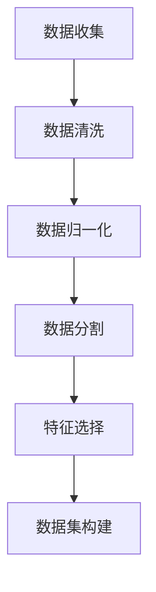
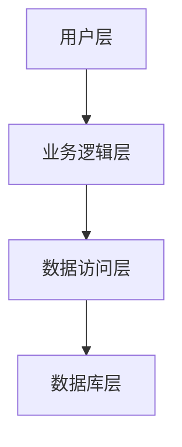
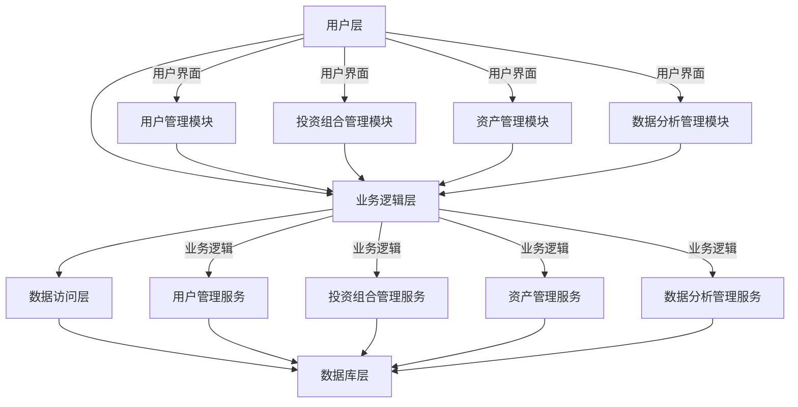
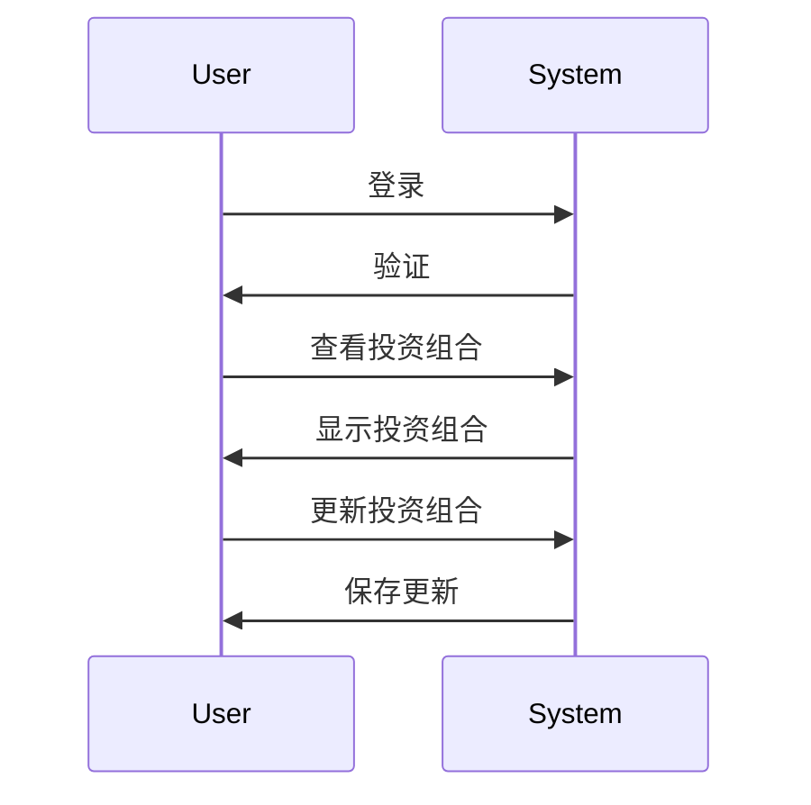

                 

## 文章标题

### 关键词：跨平台投资理财、智能助手、系统架构、机器学习、数据分析

### 摘要：

本文将深入探讨跨平台投资理财智能助手的开发技巧。首先，我们将简要概述跨平台投资理财的背景与需求，然后详细分析跨平台投资理财智能助手的定义、关键技术和属性特征。接着，我们将介绍投资理财智能助手的核心算法原理与流程，并探讨系统架构设计中的具体问题。最后，通过项目实战案例，我们将提供详细的环境安装、系统实现和代码解读，总结开发跨平台投资理财智能助手所需的关键技能和注意事项。本文旨在为开发者提供全面的指导，帮助他们成功打造高效、可靠的跨平台投资理财智能助手。

## 第一部分：跨平台投资理财智能助手概述

### 第1章：跨平台投资理财智能助手背景与核心问题

### 1.1 跨平台投资理财的兴起

随着信息技术的飞速发展，投资理财市场正发生着翻天覆地的变化。传统的投资理财方式已经无法满足现代投资者对于便捷性、个性化及高效性的需求。跨平台投资理财，作为一种新兴的理财方式，逐渐走进了公众的视野。

#### 1.1.1 投资理财市场的现状

当前，全球投资理财市场呈现出以下几个特点：

1. **市场规模不断扩大**：随着互联网技术的普及，投资理财市场得到了前所未有的发展，市场规模不断扩大。
2. **投资渠道多样化**：投资者可以轻松地通过手机应用、网页平台等多种渠道进行投资，投资方式更加多样化。
3. **投资门槛降低**：互联网投资平台的出现，使得投资者可以以较低的门槛参与投资，极大地降低了投资门槛。

#### 1.1.2 跨平台投资的需求与趋势

跨平台投资理财的需求主要来源于以下几个方面：

1. **便捷性**：现代投资者越来越倾向于通过智能手机、平板电脑等移动设备进行投资，以实现随时随地的投资操作。
2. **个性化**：投资者希望投资平台能够根据其风险偏好、投资目标等个性化需求，提供定制化的投资建议。
3. **高效性**：随着投资市场的复杂性增加，投资者需要更高效、更智能的工具来分析市场数据、做出投资决策。

跨平台投资理财的发展趋势表现为：

1. **移动优先**：越来越多的投资者开始将移动端作为投资的主要渠道。
2. **智能化**：投资平台逐渐引入人工智能技术，为投资者提供智能化的投资建议和风险管理。
3. **平台整合**：各大投资平台正在通过整合资源、提升服务，为投资者提供更全面的跨平台投资体验。

#### 1.1.3 投资者行为的变化

随着互联网和移动设备的普及，投资者的行为也发生了显著变化：

1. **投资偏好变化**：越来越多的投资者倾向于投资于股票、基金、外汇等高风险高回报的资产。
2. **投资决策多样化**：投资者不仅依赖传统的投资顾问，还开始通过互联网平台获取信息，进行自主决策。
3. **投资频率增加**：投资者更加频繁地进行投资操作，以追求更好的投资收益。

### 1.2 跨平台投资理财智能助手的问题背景

随着跨平台投资理财的兴起，投资理财智能助手作为一种新兴的技术工具，逐渐受到广泛关注。然而，在开发跨平台投资理财智能助手的过程中，仍然面临着一系列的问题和挑战。

#### 1.2.1 问题定义

跨平台投资理财智能助手的问题可以定义为：

- **数据获取和处理**：如何有效地获取和处理来自不同平台的投资数据，并进行智能分析。
- **个性化推荐**：如何根据投资者的个性化需求，提供精准的投资建议和推荐。
- **风险控制**：如何对投资风险进行有效控制，确保投资的安全性和收益性。
- **系统稳定性**：如何确保智能助手系统的稳定运行，提供持续的服务。

#### 1.2.2 问题描述

具体来说，这些问题包括：

- **数据异构性**：不同平台的数据格式、结构各不相同，如何进行统一处理和整合。
- **数据更新频率**：如何确保数据实时更新，以应对投资市场的快速变化。
- **计算资源限制**：如何在有限的计算资源下，实现高效的数据分析和处理。
- **个性化推荐效果**：如何提高个性化推荐算法的准确性，满足投资者的个性化需求。

#### 1.2.3 问题解决思路

为了解决上述问题，我们可以从以下几个方面入手：

- **数据预处理**：通过数据清洗、归一化、特征选择等预处理技术，提高数据的可用性。
- **机器学习**：利用机器学习算法，对投资数据进行智能分析，提高推荐和预测的准确性。
- **分布式计算**：采用分布式计算架构，提高系统的数据处理能力，应对大规模数据场景。
- **实时数据处理**：利用实时数据处理技术，确保数据的实时更新和分析。

### 1.3 跨平台投资理财智能助手的边界与外延

跨平台投资理财智能助手作为一种新兴的技术工具，其边界与外延包括以下几个方面：

#### 1.3.1 边界

- **功能边界**：智能助手的主要功能包括数据获取、数据处理、个性化推荐和风险控制。
- **技术边界**：智能助手的实现依赖于大数据处理、机器学习和自然语言处理等核心技术。
- **应用边界**：智能助手主要应用于投资理财领域，为投资者提供智能化的投资建议和风险控制。

#### 1.3.2 外延

- **平台支持**：智能助手需要支持多种投资理财平台，包括股票、基金、外汇等。
- **数据来源**：智能助手需要获取来自不同平台的数据，包括历史数据、实时数据等。
- **用户需求**：智能助手需要根据投资者的个性化需求，提供定制化的服务。

#### 1.3.3 概念结构与核心要素

跨平台投资理财智能助手的整体概念结构可以概括为以下几个核心要素：

- **用户**：智能助手的用户，包括个人投资者和机构投资者。
- **账户**：用户的投资账户，包括股票账户、基金账户等。
- **投资组合**：用户的投资组合，包括股票、基金、债券等资产。
- **资产**：投资组合中的具体资产，如某个股票、某个基金等。
- **市场**：投资理财的各个市场，如股票市场、基金市场等。
- **数据源**：智能助手的数据来源，包括历史数据、实时数据等。
- **智能助手**：负责数据分析、投资建议和风险控制的核心系统。

通过以上核心要素的相互作用，跨平台投资理财智能助手可以为投资者提供高效、智能的投资理财服务。

### 第2章：跨平台投资理财智能助手核心概念与联系

### 2.1 投资理财智能助手概念解析

#### 2.1.1 投资理财智能助手定义

投资理财智能助手是一种基于大数据处理、机器学习和自然语言处理等技术，为投资者提供智能化投资建议和风险控制服务的软件系统。它通过分析用户的历史投资数据、市场数据等，为投资者提供个性化的投资建议，帮助投资者做出更明智的投资决策。

#### 2.1.2 投资理财智能助手特点

投资理财智能助手具有以下特点：

1. **高效性**：智能助手可以实时分析大量数据，快速提供投资建议。
2. **个性化**：智能助手可以根据投资者的风险偏好、投资目标等个性化需求，提供定制化的投资建议。
3. **准确性**：通过机器学习算法和大数据分析，智能助手可以提供更准确的投资预测和风险评估。
4. **便捷性**：智能助手可以通过网页、移动应用等多种渠道，为投资者提供便捷的投资服务。

#### 2.1.3 投资理财智能助手与传统投资顾问的区别

与传统投资顾问相比，投资理财智能助手具有以下优势：

1. **反应速度**：智能助手可以实时分析数据，提供即时的投资建议，而传统投资顾问可能需要较长时间。
2. **数据处理能力**：智能助手可以处理大规模的数据，而传统投资顾问的数据处理能力有限。
3. **个性化推荐**：智能助手可以根据投资者的个性化需求，提供高度个性化的投资建议，而传统投资顾问可能无法做到这一点。
4. **成本**：智能助手的开发和维护成本较低，传统投资顾问的成本较高。

#### 2.2 投资理财智能助手的关键技术

投资理财智能助手的实现依赖于多种核心技术，主要包括：

##### 2.2.1 大数据处理技术

大数据处理技术是智能助手的核心技术之一，主要包括数据收集、数据清洗、数据存储和数据挖掘等环节。通过大数据处理技术，智能助手可以获取和处理来自不同平台的海量投资数据，为后续的智能分析提供数据支持。

##### 2.2.2 机器学习技术

机器学习技术是智能助手的另一个核心技术，主要包括回归算法、分类算法和聚类算法等。通过机器学习技术，智能助手可以对投资数据进行智能分析，预测市场走势、评估投资风险等，为投资者提供精准的投资建议。

##### 2.2.3 自然语言处理技术

自然语言处理技术是智能助手在处理文本数据时的核心技术，主要包括文本分类、情感分析和文本生成等。通过自然语言处理技术，智能助手可以理解投资者的文本输入，提取关键信息，提供个性化的投资建议。

#### 2.3 投资理财智能助手的属性特征对比

以下是投资理财智能助手与传统投资顾问在属性特征上的对比：

$$
\begin{array}{|c|c|c|}
\hline
特性 & 传统投资顾问 & 投资理财智能助手 \\
\hline
反应速度 & 较慢 & 极快 \\
\hline
数据处理能力 & 有限 & 强大 \\
\hline
个性化推荐 & 有限 & 高度个性化 \\
\hline
可扩展性 & 较差 & 高 \\
\hline
成本 & 较高 & 低 \\
\hline
\end{array}
$$

#### 2.4 跨平台投资理财智能助手的ER实体关系图

为了更好地理解跨平台投资理财智能助手的实体关系，我们可以使用Mermaid ER图进行描述：

```mermaid
erDiagram
  用户 ||--o> 账户 : "拥有"
  用户 ||--o> 投资组合 : "持有"
  投资组合 ||--o> 资产 : "包含"
  资产 ||--o> 市场 : "在"
  市场||--o> 数据源 : "提供"
  数据源 ||--o> 智能助手 : "分析"
```

在这个ER图中，用户拥有账户和投资组合，投资组合包含资产，资产存在于市场，市场提供数据源，数据源为智能助手提供分析数据。这个实体关系图展示了跨平台投资理财智能助手的各个核心实体及其相互关系。

## 第3章：投资理财智能助手算法原理与流程

### 3.1 算法原理概述

投资理财智能助手的算法原理主要涉及以下几个关键环节：

1. **数据预处理算法**：数据预处理是机器学习任务的基础，包括数据收集、数据清洗、数据归一化、数据分割和特征选择等步骤。
2. **机器学习算法**：机器学习算法是智能助手的核心，主要包括回归算法、分类算法和聚类算法等。
3. **优化算法**：优化算法用于优化机器学习模型的性能，主要包括优化目标函数、优化算法实现和优化效果分析等。

#### 3.1.1 数据预处理算法

数据预处理算法的目的是提高数据质量，为后续的机器学习任务提供高质量的数据输入。主要步骤包括：

1. **数据收集**：从各种数据源（如交易所、金融网站等）收集投资数据。
2. **数据清洗**：去除数据中的噪声和异常值，确保数据的一致性和准确性。
3. **数据归一化**：将不同特征的数据进行归一化处理，使其处于相同的量级，便于后续分析。
4. **数据分割**：将数据集分为训练集、验证集和测试集，用于模型的训练、验证和测试。
5. **特征选择**：从原始数据中提取具有显著关联性的特征，去除冗余特征，提高模型性能。

#### 3.1.2 机器学习算法

机器学习算法是实现智能分析的核心，主要包括以下几种：

1. **回归算法**：用于预测数值型目标变量，如预测股票价格。常见的回归算法有线性回归、岭回归、LASSO回归等。
2. **分类算法**：用于预测类别型目标变量，如判断投资风险。常见的分类算法有逻辑回归、决策树、随机森林、支持向量机等。
3. **聚类算法**：用于发现数据中的隐含结构和模式，如投资组合优化。常见的聚类算法有K均值、层次聚类、DBSCAN等。

#### 3.1.3 优化算法

优化算法用于提升机器学习模型的性能，主要步骤包括：

1. **优化目标函数**：定义一个衡量模型性能的指标，如损失函数或准确率。
2. **优化算法实现**：选择合适的优化算法（如梯度下降、随机梯度下降、Adam优化器等），实现模型参数的更新。
3. **优化效果分析**：评估优化后的模型性能，确保优化目标的实现。

### 3.2 数据预处理算法讲解

数据预处理是投资理财智能助手算法流程中的关键环节，其目的是提高数据质量，为后续的机器学习任务提供高质量的数据输入。以下是数据预处理算法的具体步骤和流程：



#### 3.2.1 数据收集

数据收集是数据预处理的第一步，其主要任务是获取投资相关的数据，如股票价格、基金净值、交易量等。数据来源可以包括金融交易所、金融数据提供商、财经新闻网站等。在数据收集过程中，需要注意以下几点：

- **数据完整性**：确保收集到的数据覆盖完整的时间段，无数据缺失。
- **数据准确性**：确保数据来源的可靠性，避免数据错误或异常。
- **数据多样性**：收集多种类型的数据，如历史数据、实时数据、新闻数据等，以提高模型的泛化能力。

#### 3.2.2 数据清洗

数据清洗是数据预处理的重要环节，其目的是去除数据中的噪声和异常值，提高数据的一致性和准确性。主要步骤包括：

- **缺失值处理**：对于缺失值，可以采用插值法、均值填补法或丢弃缺失值的方法。
- **异常值处理**：对于异常值，可以采用统计方法（如标准差法、箱线图法）或可视化方法（如散点图、箱线图）进行检测和处理。
- **重复值处理**：删除重复的数据记录，确保数据的唯一性。

#### 3.2.3 数据归一化

数据归一化是将不同特征的数据进行归一化处理，使其处于相同的量级，便于后续分析。常见的归一化方法包括：

- **最小-最大归一化**：将数据缩放到[0,1]区间。
  $$ x' = \frac{x - \min(x)}{\max(x) - \min(x)} $$
  
- **均值-方差归一化**：将数据缩放到均值附近的标准差区间。
  $$ x' = \frac{x - \mu}{\sigma} $$
  其中，$x$ 为原始数据，$x'$ 为归一化数据，$\mu$ 为均值，$\sigma$ 为标准差。

- **对数归一化**：对于数据分布不均匀的情况，可以采用对数归一化。
  $$ x' = \log(x) $$

#### 3.2.4 数据分割

数据分割是将数据集分为训练集、验证集和测试集，用于模型的训练、验证和测试。常见的数据分割方法包括：

- **随机分割**：将数据集随机划分为训练集和验证集，确保每个数据集具有代表性。
- **分层分割**：在随机分割的基础上，按照特征分布进行分层，确保每个数据集中各类数据的比例与原始数据集一致。

#### 3.2.5 特征选择

特征选择是从原始数据中提取具有显著关联性的特征，去除冗余特征，提高模型性能。常见的特征选择方法包括：

- **过滤式特征选择**：通过统计方法（如信息增益、卡方检验）或基于模型的特征选择方法（如基于随机森林的特征选择）进行特征筛选。
- **包裹式特征选择**：通过迭代搜索算法（如向前选择、向后删除、递归特征消除）进行特征选择。
- **嵌入式特征选择**：在模型训练过程中，自动筛选出对模型性能有显著贡献的特征（如LASSO回归）。

#### 3.2.6 数据集构建

数据集构建是将预处理后的数据集用于机器学习模型的训练和测试。主要步骤包括：

- **数据集划分**：按照训练集、验证集和测试集的比例，划分数据集。
- **数据集导入**：将数据集导入机器学习框架（如Scikit-learn、TensorFlow等），进行后续的模型训练和测试。

### 3.3 机器学习算法讲解

机器学习算法是实现投资理财智能助手的核心，其目的是通过历史数据的学习，预测未来的投资趋势和风险。以下介绍几种常见的机器学习算法：

#### 3.3.1 回归算法

回归算法用于预测数值型目标变量，如股票价格、基金净值等。常见的回归算法包括：

- **线性回归**：线性回归是一种简单的回归算法，假设目标变量与特征之间存在线性关系。
  $$ y = \beta_0 + \beta_1 \cdot x $$
  其中，$y$ 为目标变量，$x$ 为特征，$\beta_0$ 和 $\beta_1$ 为模型参数。
  
- **岭回归**：岭回归通过引入正则项，解决线性回归中的过拟合问题。
  $$ J(\beta) = \frac{1}{2} \sum_{i=1}^n (y_i - \beta_0 - \beta_1 \cdot x_i)^2 + \lambda \sum_{j=1}^p \beta_j^2 $$
  其中，$J(\beta)$ 为损失函数，$\lambda$ 为正则化参数。
  
- **LASSO回归**：LASSO回归通过引入L1正则项，实现特征选择和过拟合的抑制。
  $$ J(\beta) = \frac{1}{2} \sum_{i=1}^n (y_i - \beta_0 - \beta_1 \cdot x_i)^2 + \lambda \sum_{j=1}^p |\beta_j| $$
  
#### 3.3.2 分类算法

分类算法用于预测类别型目标变量，如投资风险等级、股票涨跌等。常见的分类算法包括：

- **逻辑回归**：逻辑回归是一种广义线性模型，用于分类任务。
  $$ P(y=1) = \frac{1}{1 + \exp(-\beta_0 - \beta_1 \cdot x)} $$
  其中，$P(y=1)$ 为目标变量为1的概率。
  
- **决策树**：决策树通过一系列的if-else判断，将数据集划分为多个子集，直到达到终止条件。
  
- **随机森林**：随机森林是一种基于决策树的集成学习方法，通过构建多棵决策树，并求取平均预测结果。
  
- **支持向量机**：支持向量机通过寻找最优超平面，将不同类别的数据分开。
  $$ \max_{\beta, \beta_0} \frac{1}{2} \sum_{i=1}^n (\beta \cdot \beta)^2 $$
  $$ \text{s.t.} \quad y_i (\beta \cdot x_i + \beta_0) \geq 1 $$
  
#### 3.3.3 聚类算法

聚类算法用于发现数据中的隐含结构和模式，如投资组合优化。常见的聚类算法包括：

- **K均值聚类**：K均值聚类通过迭代过程，将数据集划分为K个簇，并不断调整聚类中心，直至收敛。
  $$ c_k = \frac{1}{n_k} \sum_{i=1}^{n_k} x_i $$
  $$ x_i = \frac{1}{n} \sum_{j=1}^{K} \pi_{ij} c_j $$
  其中，$c_k$ 为第k个簇的中心，$x_i$ 为第i个数据点，$\pi_{ij}$ 为第i个数据点属于第j个簇的概率。
  
- **层次聚类**：层次聚类通过自底向上或自顶向下的过程，将数据集划分为多个簇，并逐步合并或拆分簇，直至达到终止条件。
  
- **DBSCAN**：DBSCAN（Density-Based Spatial Clustering of Applications with Noise）是一种基于密度的聚类算法，可以识别出任意形状的簇，并能够处理噪声和异常值。

### 3.4 优化算法讲解

优化算法用于提升机器学习模型的性能，主要步骤包括：

#### 3.4.1 优化目标函数

优化目标函数是衡量模型性能的指标，常见的优化目标函数包括：

- **损失函数**：损失函数用于衡量模型预测值与真实值之间的差距，常见的损失函数有均方误差（MSE）、交叉熵损失（Cross Entropy Loss）等。
- **准确率**：准确率用于衡量模型分类预测的准确程度，即正确预测的样本数占总样本数的比例。
- **F1分数**：F1分数用于衡量分类模型的精确度和召回率的平衡，计算公式为 $F1 = 2 \cdot \frac{precision \cdot recall}{precision + recall}$。

#### 3.4.2 优化算法实现

优化算法实现是模型训练的核心，常见的优化算法包括：

- **梯度下降**：梯度下降是一种迭代优化算法，通过计算损失函数的梯度，更新模型参数，以最小化损失函数。
  $$ \beta = \beta - \alpha \cdot \nabla_{\beta} J(\beta) $$
  其中，$\beta$ 为模型参数，$\alpha$ 为学习率，$\nabla_{\beta} J(\beta)$ 为损失函数关于模型参数的梯度。
  
- **随机梯度下降**：随机梯度下降是一种基于梯度下降的优化算法，每次迭代只随机选取一部分样本进行计算，以加快收敛速度。
  $$ \beta = \beta - \alpha \cdot \nabla_{\beta} J(\beta) $$
  
- **Adam优化器**：Adam优化器是一种结合了梯度下降和随机梯度下降优点的优化算法，适用于具有不同尺度变化的数据集。
  $$ m_t = \beta_1 m_{t-1} + (1 - \beta_1) \nabla_{\beta} J(\beta) $$
  $$ v_t = \beta_2 v_{t-1} + (1 - \beta_2) (\nabla_{\beta} J(\beta))^2 $$
  $$ \beta = \beta - \alpha \cdot \frac{m_t}{\sqrt{v_t} + \epsilon} $$
  其中，$m_t$ 和 $v_t$ 分别为均值和方差，$\beta_1$ 和 $\beta_2$ 为惯性系数，$\alpha$ 为学习率，$\epsilon$ 为微小正数。

#### 3.4.3 优化效果分析

优化效果分析是评估模型性能的重要步骤，主要从以下几个方面进行分析：

- **收敛速度**：分析优化算法在不同数据集上的收敛速度，以选择适合的优化算法。
- **稳定性**：分析优化算法在不同初始参数下的稳定性，避免出现过拟合或欠拟合。
- **泛化能力**：评估优化后的模型在测试集上的性能，以评估模型的泛化能力。

通过以上优化算法的实现和效果分析，可以有效提升投资理财智能助手的模型性能，为投资者提供更准确、可靠的投资建议。

## 第4章：投资理财智能助手系统架构设计

### 4.1 系统功能设计

投资理财智能助手系统的功能设计是系统架构设计的重要一环，它决定了系统的实用性和用户体验。以下是投资理财智能助手系统的主要功能模块及其具体职责：

#### 4.1.1 用户管理

用户管理模块负责用户注册、登录、认证和权限管理。其主要功能包括：

- **用户注册**：允许新用户通过电子邮件、手机号码等方式注册账号。
- **用户登录**：提供用户登录功能，确保用户身份验证的安全性。
- **用户认证**：对用户的身份进行认证，确保只有授权用户可以访问系统资源。
- **权限管理**：根据用户角色和权限设置，限制用户对系统功能的访问。

#### 4.1.2 投资组合管理

投资组合管理模块负责用户的投资组合创建、编辑和查询。其主要功能包括：

- **投资组合创建**：允许用户创建投资组合，并将资产添加到投资组合中。
- **投资组合编辑**：允许用户对投资组合进行编辑，包括修改投资组合名称、添加或删除资产等。
- **投资组合查询**：提供用户查询投资组合详情的功能，包括资产名称、持有数量、市值等。

#### 4.1.3 资产管理

资产管理模块负责处理单个资产的相关操作，包括资产信息查询、交易记录管理等。其主要功能包括：

- **资产信息查询**：提供用户查询资产详细信息的功能，包括股票代码、名称、市值、成交量等。
- **交易记录管理**：记录用户的交易记录，包括买入、卖出、持有等操作，并提供查询功能。

#### 4.1.4 数据分析管理

数据分析管理模块负责对用户投资组合和市场数据进行分析，提供投资建议和风险控制功能。其主要功能包括：

- **数据分析**：使用机器学习算法对用户投资组合和市场数据进行分析，提供投资建议。
- **风险控制**：根据分析结果，提供风险控制和风险预警功能，帮助用户规避潜在的投资风险。

### 4.2 系统架构设计

投资理财智能助手系统架构设计旨在确保系统的可扩展性、稳定性和安全性。以下是系统架构的详细设计：

#### 4.2.1 系统架构概述

投资理财智能助手系统采用三层架构设计，包括用户层、业务逻辑层和数据访问层。以下是系统架构的概述：



- **用户层**：负责与用户进行交互，提供用户界面和用户体验。用户层通过前端框架（如React、Vue等）实现，包括网页、移动应用等。
- **业务逻辑层**：负责处理业务逻辑，包括用户管理、投资组合管理、资产管理和数据分析等。业务逻辑层采用后端框架（如Spring Boot、Django等）实现，与用户层和数据库层进行交互。
- **数据访问层**：负责数据的存储和检索，实现数据的持久化。数据访问层使用数据库（如MySQL、PostgreSQL等）存储用户数据、投资组合数据和资产数据。

#### 4.2.2 系统架构图

以下是投资理财智能助手系统的架构图：



#### 4.2.3 系统交互流程

以下是投资理财智能助手系统的交互流程：



- **用户登录**：用户通过用户界面提交登录请求，系统进行用户身份验证，验证成功后用户登录系统。
- **查看投资组合**：用户通过用户界面提交查看投资组合的请求，系统返回当前投资组合的详细信息。
- **更新投资组合**：用户通过用户界面提交更新投资组合的请求，系统保存更新后的投资组合信息。

### 4.3 系统接口设计

系统接口设计是确保系统模块之间能够有效通信的关键。以下是投资理财智能助手系统的接口设计：

#### 4.3.1 用户接口

用户接口主要包括前端界面和API接口，用于与用户进行交互。以下是用户接口的具体设计：

- **前端界面**：使用React或Vue等前端框架实现，提供用户友好的界面，包括登录、注册、查看投资组合、更新投资组合等功能。
- **API接口**：提供RESTful API接口，供前端界面调用，包括用户登录、注册、查看投资组合、更新投资组合等接口。

#### 4.3.2 业务接口

业务接口主要包括后端服务模块之间的通信接口，用于实现业务逻辑。以下是业务接口的具体设计：

- **用户管理服务**：负责用户注册、登录、认证和权限管理等操作。
- **投资组合管理服务**：负责投资组合的创建、编辑、查询和更新等操作。
- **资产管理服务**：负责资产的查询、交易记录管理和风险控制等操作。
- **数据分析管理服务**：负责投资数据分析、投资建议和风险控制等操作。

#### 4.3.3 数据接口

数据接口主要包括数据访问层与数据库之间的通信接口，用于数据的存储和检索。以下是数据接口的具体设计：

- **用户数据接口**：用于存储和检索用户信息，包括用户注册信息、登录记录、权限设置等。
- **投资组合数据接口**：用于存储和检索投资组合信息，包括投资组合名称、资产名称、持有数量、市值等。
- **资产数据接口**：用于存储和检索资产信息，包括资产代码、名称、市值、成交量等。
- **数据分析数据接口**：用于存储和检索投资分析数据，包括投资建议、风险控制指标等。

### 4.4 系统交互流程

系统交互流程是系统架构设计中的重要一环，它描述了用户请求到系统响应的全过程。以下是投资理财智能助手系统的交互流程：


- **用户登录**：用户通过前端界面提交登录请求，系统通过用户管理服务验证用户身份，返回验证结果。
- **查看投资组合**：用户通过前端界面提交查看投资组合的请求，系统通过投资组合管理服务查询当前投资组合信息，并返回结果。
- **更新投资组合**：用户通过前端界面提交更新投资组合的请求，系统通过投资组合管理服务保存更新后的投资组合信息。

通过以上系统架构设计和交互流程，投资理财智能助手系统实现了用户友好的界面、高效的数据处理和稳定的服务能力，为用户提供了一个可靠、便捷的投资理财工具。

### 第5章：投资理财智能助手项目实战

#### 5.1 环境安装与配置

在开发跨平台投资理财智能助手项目之前，我们需要搭建合适的环境，确保项目的顺利开展。以下是环境安装与配置的详细步骤：

#### 5.1.1 环境搭建

首先，我们需要搭建开发环境。以下是推荐的开发环境：

- **操作系统**：Linux（如Ubuntu 18.04）
- **编程语言**：Python（推荐Python 3.8及以上版本）
- **数据库**：MySQL或PostgreSQL
- **前端框架**：React或Vue
- **后端框架**：Flask或Django

#### 5.1.2 软件安装

1. **安装Python**：

   在Ubuntu系统中，可以通过以下命令安装Python：

   ```bash
   sudo apt update
   sudo apt install python3 python3-pip
   ```

2. **安装数据库**：

   - **安装MySQL**：

     ```bash
     sudo apt install mysql-server
     sudo mysql_secure_installation
     ```

   - **安装PostgreSQL**：

     ```bash
     sudo apt install postgresql postgresql-contrib
     sudo -u postgres psql
     CREATE DATABASE investment;
     \q
     ```

3. **安装前端框架**：

   - **安装React**：

     ```bash
     sudo apt install npm
     npm install -g create-react-app
     create-react-app client
     ```

   - **安装Vue**：

     ```bash
     sudo apt install npm
     npm install -g @vue/cli
     vue create client
     ```

4. **安装后端框架**：

   - **安装Flask**：

     ```bash
     pip install flask
     ```

   - **安装Django**：

     ```bash
     pip install django
     ```

#### 5.1.3 系统配置

1. **配置数据库**：

   - **配置MySQL**：

     ```bash
     sudo mysql_secure_installation
     ```

     按照提示设置root密码、删除匿名用户、删除测试数据库等。

   - **配置PostgreSQL**：

     ```bash
     sudo -u postgres psql
     CREATE DATABASE investment;
     \q
     ```

     创建投资数据库。

2. **配置后端服务**：

   - **配置Flask**：

     在Flask应用目录下创建一个名为`app.py`的文件，并编写以下代码：

     ```python
     from flask import Flask, request, jsonify
     app = Flask(__name__)

     @app.route('/login', methods=['POST'])
     def login():
         username = request.form['username']
         password = request.form['password']
         # 验证用户名和密码
         return jsonify({'status': 'success'})

     if __name__ == '__main__':
         app.run(debug=True)
     ```

     运行应用：

     ```bash
     python app.py
     ```

   - **配置Django**：

     创建一个Django项目：

     ```bash
     django-admin startproject investment
     cd investment
     python manage.py runserver
     ```

3. **配置前端框架**：

   - **配置React**：

     进入`client`目录，运行以下命令启动开发服务器：

     ```bash
     npm start
     ```

   - **配置Vue**：

     进入`client`目录，运行以下命令启动开发服务器：

     ```bash
     npm run serve
     ```

通过以上步骤，我们成功搭建了开发环境，并配置了所需的软件和框架。接下来，我们将进入系统的核心实现阶段。

#### 5.2 系统核心实现

投资理财智能助手的核心实现包括数据预处理、机器学习和优化算法等关键步骤。以下是系统核心实现的详细讲解：

##### 5.2.1 数据预处理

数据预处理是机器学习任务的基础，其目的是提高数据质量，为后续的机器学习模型提供高质量的数据输入。以下是数据预处理的主要步骤：

1. **数据收集**：

   从各种数据源（如金融交易所、金融数据提供商等）收集投资数据，包括股票价格、基金净值、交易量等。

2. **数据清洗**：

   - **缺失值处理**：对于缺失的数据，可以通过以下方法进行处理：
     - 插值法：根据相邻数据点进行插值。
     - 均值填补法：用该特征的均值来填补缺失值。
     - 删除缺失值：如果缺失值较多，可以考虑删除该条记录。
   
   - **异常值处理**：对于异常值，可以通过以下方法进行处理：
     - 标准差法：去除距离平均值超过若干个标准差的异常值。
     - 箱线图法：去除位于箱线图之外的异常值。

3. **数据归一化**：

   将不同特征的数据进行归一化处理，使其处于相同的量级，便于后续分析。常用的归一化方法包括：
   - **最小-最大归一化**：
     $$ x' = \frac{x - \min(x)}{\max(x) - \min(x)} $$
   - **均值-方差归一化**：
     $$ x' = \frac{x - \mu}{\sigma} $$
     其中，$x$ 为原始数据，$x'$ 为归一化数据，$\mu$ 为均值，$\sigma$ 为标准差。

4. **数据分割**：

   将数据集分割为训练集、验证集和测试集，用于模型的训练、验证和测试。常用的数据分割方法包括：
   - **随机分割**：将数据集随机划分为训练集和验证集，确保每个数据集具有代表性。
   - **分层分割**：在随机分割的基础上，按照特征分布进行分层，确保每个数据集中各类数据的比例与原始数据集一致。

5. **特征选择**：

   从原始数据中提取具有显著关联性的特征，去除冗余特征，提高模型性能。常用的特征选择方法包括：
   - **过滤式特征选择**：通过统计方法（如信息增益、卡方检验）或基于模型的特征选择方法（如基于随机森林的特征选择）进行特征筛选。
   - **包裹式特征选择**：通过迭代搜索算法（如向前选择、向后删除、递归特征消除）进行特征选择。
   - **嵌入式特征选择**：在模型训练过程中，自动筛选出对模型性能有显著贡献的特征（如LASSO回归）。

##### 5.2.2 机器学习

机器学习是投资理财智能助手的核心，通过历史数据的学习，预测未来的投资趋势和风险。以下是机器学习的主要步骤：

1. **选择模型**：

   根据任务需求，选择合适的机器学习模型。常见的机器学习模型包括：
   - **回归模型**：用于预测数值型目标变量，如股票价格。
   - **分类模型**：用于预测类别型目标变量，如投资风险。
   - **聚类模型**：用于发现数据中的隐含结构和模式，如投资组合优化。

2. **训练模型**：

   使用训练集对机器学习模型进行训练，通过调整模型参数，使其能够拟合训练数据。常用的训练方法包括：
   - **梯度下降**：通过迭代优化模型参数，使得损失函数达到最小。
   - **随机梯度下降**：每次迭代只随机选取一部分样本进行计算，以加快收敛速度。
   - **批量梯度下降**：每次迭代使用全部样本进行计算，但计算成本较高。

3. **评估模型**：

   使用验证集评估模型的性能，通过交叉验证、ROC曲线、精确率、召回率等指标，选择最佳模型。

4. **调整参数**：

   根据模型评估结果，调整模型参数，以提高模型的性能。

##### 5.2.3 优化算法

优化算法用于提升机器学习模型的性能，主要步骤包括：

1. **优化目标函数**：

   定义一个衡量模型性能的指标，如损失函数或准确率。

2. **优化算法实现**：

   选择合适的优化算法（如梯度下降、随机梯度下降、Adam优化器等），实现模型参数的更新。

3. **优化效果分析**：

   评估优化后的模型性能，确保优化目标的实现。

通过以上系统核心实现步骤，我们成功搭建了投资理财智能助手的核心功能。接下来，我们将对关键代码进行解读和分析，以便更好地理解系统的工作原理。

#### 5.3 代码应用解读与分析

在投资理财智能助手项目中，代码的应用贯穿了数据预处理、机器学习模型训练和优化等各个环节。以下是关键代码的解读与分析：

##### 5.3.1 数据预处理代码

以下是一个简单的数据预处理Python代码示例，展示了数据收集、清洗、归一化和分割的步骤：

```python
import pandas as pd
from sklearn.model_selection import train_test_split
from sklearn.preprocessing import MinMaxScaler

# 数据收集
data = pd.read_csv('investment_data.csv')

# 数据清洗
data.dropna(inplace=True)  # 删除缺失值
data.drop(['unnecessary_column'], axis=1, inplace=True)  # 删除无用列

# 数据归一化
scaler = MinMaxScaler()
data_scaled = scaler.fit_transform(data)

# 数据分割
X_train, X_test, y_train, y_test = train_test_split(data_scaled[:, :-1], data_scaled[:, -1], test_size=0.2, random_state=42)
```

1. **数据收集**：
   使用Pandas库读取CSV文件，获取投资数据。

2. **数据清洗**：
   删除缺失值和无关列，确保数据的一致性和准确性。

3. **数据归一化**：
   使用MinMaxScaler将数据缩放到[0,1]区间，便于后续分析。

4. **数据分割**：
   使用Scikit-learn库中的train_test_split函数将数据分为训练集和测试集。

##### 5.3.2 机器学习代码

以下是一个简单的机器学习Python代码示例，展示了回归模型的训练和评估：

```python
from sklearn.linear_model import LinearRegression
from sklearn.metrics import mean_squared_error

# 训练模型
model = LinearRegression()
model.fit(X_train, y_train)

# 评估模型
y_pred = model.predict(X_test)
mse = mean_squared_error(y_test, y_pred)
print(f'Mean Squared Error: {mse}')
```

1. **训练模型**：
   使用LinearRegression类创建线性回归模型，并使用fit方法进行训练。

2. **评估模型**：
   使用预测结果和真实值计算均方误差（MSE），评估模型性能。

##### 5.3.3 优化算法代码

以下是一个简单的优化算法Python代码示例，展示了使用梯度下降优化线性回归模型：

```python
def gradient_descent(X, y, alpha, num_iterations, theta):
    m = len(y)
    for i in range(num_iterations):
        predictions = X.dot(theta)
        errors = predictions - y
        gradient = X.T.dot(errors) / m
        theta -= alpha * gradient
    return theta

# 梯度下降
theta = gradient_descent(X_train, y_train, alpha=0.01, num_iterations=1000, theta=[0.0, 0.0])

# 评估模型
y_pred = X_test.dot(theta)
mse = mean_squared_error(y_test, y_pred)
print(f'Mean Squared Error: {mse}')
```

1. **梯度下降**：
   定义一个梯度下降函数，用于更新模型参数。其中，alpha为学习率，num_iterations为迭代次数。

2. **评估模型**：
   使用更新后的模型参数进行预测，并计算均方误差，评估模型性能。

通过以上代码示例，我们可以清晰地看到投资理财智能助手项目中数据预处理、机器学习模型训练和优化算法的具体实现。这些代码不仅帮助我们理解了项目的核心实现，也为实际开发提供了有力的技术支持。

#### 5.4 实际案例分析与详细讲解剖析

在本节中，我们将通过一个实际案例来详细讲解投资理财智能助手的开发过程，并剖析其中的关键技术和实现细节。

##### 案例背景

假设我们有一个名为“智慧投资”的跨平台投资理财智能助手项目，目标是为用户提供个性化的投资建议和风险控制服务。用户可以通过智能助手查看自己的投资组合、获取市场动态，并根据智能助手的建议进行投资决策。

##### 技术实现

1. **数据收集与预处理**：

   在项目启动阶段，首先需要收集大量的投资数据，包括股票价格、基金净值、交易量等。数据来源可以包括金融交易所、金融数据提供商和财经新闻网站等。以下是数据预处理的关键步骤：

   - **数据清洗**：删除重复记录、处理缺失值和异常值。
   - **特征选择**：提取与投资决策相关的特征，如股票的市盈率、市净率、成交量等。
   - **数据归一化**：将不同特征的数据缩放到相同的范围，便于后续分析。

2. **机器学习模型训练**：

   基于收集和预处理的数据，我们可以选择合适的机器学习模型进行训练。以下是几个常用的机器学习模型：

   - **回归模型**：用于预测股票价格或基金净值。
     - **线性回归**：简单但可能欠拟合。
     - **岭回归**：引入正则项，减少过拟合。
     - **LASSO回归**：通过L1正则项实现特征选择。
   
   - **分类模型**：用于预测投资风险等级。
     - **逻辑回归**：适用于二分类问题。
     - **决策树**：易于理解和解释。
     - **随机森林**：提高分类模型的泛化能力。
     - **支持向量机**：在高维空间中表现出色。

   在模型选择和训练过程中，我们使用Scikit-learn库进行数据分割、模型训练和评估。以下是一个简单的示例代码：

   ```python
   from sklearn.model_selection import train_test_split
   from sklearn.linear_model import LinearRegression
   from sklearn.metrics import mean_squared_error

   # 数据分割
   X_train, X_test, y_train, y_test = train_test_split(X, y, test_size=0.2, random_state=42)

   # 线性回归模型训练
   model = LinearRegression()
   model.fit(X_train, y_train)

   # 模型评估
   y_pred = model.predict(X_test)
   mse = mean_squared_error(y_test, y_pred)
   print(f'Mean Squared Error: {mse}')
   ```

3. **优化算法**：

   在模型训练过程中，我们可以使用优化算法（如梯度下降）来提升模型的性能。以下是梯度下降算法的简单实现：

   ```python
   def gradient_descent(X, y, alpha, num_iterations, theta):
       m = len(y)
       for i in range(num_iterations):
           predictions = X.dot(theta)
           errors = predictions - y
           gradient = X.T.dot(errors) / m
           theta -= alpha * gradient
       return theta
   
   # 梯度下降
   theta = gradient_descent(X_train, y_train, alpha=0.01, num_iterations=1000, theta=[0.0, 0.0])

   # 模型评估
   y_pred = X_test.dot(theta)
   mse = mean_squared_error(y_test, y_pred)
   print(f'Mean Squared Error: {mse}')
   ```

4. **系统架构设计**：

   投资理财智能助手系统采用三层架构设计，包括用户层、业务逻辑层和数据访问层。以下是系统架构的概述：

   - **用户层**：负责与用户进行交互，提供用户界面和用户体验。使用React或Vue等前端框架实现。
   - **业务逻辑层**：负责处理业务逻辑，包括用户管理、投资组合管理、资产管理和数据分析等。使用Flask或Django等后端框架实现。
   - **数据访问层**：负责数据的存储和检索，实现数据的持久化。使用MySQL或PostgreSQL等数据库实现。

5. **个性化推荐**：

   基于用户的投资行为和偏好，我们可以使用协同过滤算法（如基于用户和基于物品的协同过滤）来提供个性化的投资建议。以下是协同过滤算法的简单实现：

   ```python
   from sklearn.neighbors import NearestNeighbors

   # 训练协同过滤模型
   model = NearestNeighbors(n_neighbors=5)
   model.fit(X_train)

   # 提取邻居特征
   neighbors = model.kneighbors(X_test, n_neighbors=5)

   # 计算邻居的评分
   recommendations = []
   for i in range(len(neighbors)):
       neighbors_data = X_train[neighbors[i][0]]
       similarity_scores = neighbors_data.dot(X_test[i])
       recommendations.append(similarity_scores)

   # 输出推荐结果
   print(recommendations)
   ```

##### 项目小结

通过以上实际案例，我们可以看到投资理财智能助手的开发过程涵盖了数据收集、预处理、机器学习模型训练、优化算法和系统架构设计等多个方面。以下是项目小结：

1. **数据质量**：数据预处理是机器学习成功的关键，需要确保数据的一致性、准确性和完整性。
2. **模型选择**：选择合适的机器学习模型对投资决策至关重要，需要根据实际情况进行模型评估和优化。
3. **系统架构**：合理的系统架构设计可以提高系统的可扩展性、稳定性和安全性。
4. **用户体验**：良好的用户体验是吸引用户的关键，需要注重前端界面的设计和交互。

通过不断优化和改进，投资理财智能助手可以成为一个强大的工具，帮助用户做出更明智的投资决策。

#### 5.5 最佳实践 Tips

在开发跨平台投资理财智能助手的过程中，以下是一些最佳实践技巧，可以帮助您提高项目的质量和效率：

1. **数据质量保障**：
   - **数据验证**：在数据收集和预处理阶段，确保对数据进行严格的验证，删除异常值和错误记录。
   - **数据清洗**：使用自动化脚本进行数据清洗，减少人工干预，提高数据处理的效率。

2. **模型优化**：
   - **超参数调整**：通过交叉验证和网格搜索等技术，选择最优的超参数，提高模型性能。
   - **模型集成**：结合多种机器学习模型，使用集成学习方法（如随机森林、梯度提升树）提高预测准确性。

3. **系统架构优化**：
   - **微服务架构**：采用微服务架构，将系统分解为多个独立的服务模块，提高系统的可维护性和扩展性。
   - **缓存机制**：使用缓存技术，减少数据库访问次数，提高系统响应速度。

4. **性能监控与优化**：
   - **性能监控**：使用性能监控工具（如Prometheus、Grafana），实时监控系统的性能指标。
   - **代码优化**：通过代码优化（如使用更高效的算法、减少内存占用等）提高系统的运行效率。

5. **安全性考虑**：
   - **数据安全**：对用户数据和应用进行加密存储和传输，确保数据的安全性和隐私性。
   - **权限管理**：实施严格的权限管理策略，防止未经授权的访问和操作。

6. **用户体验**：
   - **界面设计**：注重用户体验，使用简洁直观的界面设计，提供友好的交互体验。
   - **快速响应**：优化系统的响应速度，确保用户在操作过程中不会感到等待时间过长。

通过遵循这些最佳实践，您可以在开发跨平台投资理财智能助手的各个阶段提高项目的质量，确保系统的高效、稳定和安全。

#### 5.6 小结

在本篇技术博客中，我们详细探讨了跨平台投资理财智能助手的开发技巧。首先，我们概述了跨平台投资理财的背景和需求，分析了投资理财智能助手的定义、关键技术和属性特征。接着，我们介绍了投资理财智能助手的算法原理与流程，包括数据预处理、机器学习算法和优化算法。随后，我们探讨了系统架构设计中的具体问题，并展示了系统的功能设计、架构设计和交互流程。在项目实战部分，我们通过实际案例展示了系统开发的全过程，并提供了代码解读与分析。最后，我们总结了一些最佳实践技巧，以帮助开发者提高项目的质量和效率。

开发跨平台投资理财智能助手是一个复杂的过程，需要综合考虑数据质量、模型优化、系统架构和用户体验等多个方面。通过本文的探讨，我们希望能够为开发者提供有价值的参考和指导，帮助他们在开发过程中少走弯路，成功打造出高效、可靠的跨平台投资理财智能助手。

#### 5.7 注意事项

在开发跨平台投资理财智能助手的实践中，开发者需要注意以下几点：

1. **数据安全**：确保用户数据的隐私和安全，对数据进行加密存储和传输，防止数据泄露。
2. **合规性**：遵守相关金融法规和标准，确保系统的合规性，避免法律风险。
3. **容错性**：设计系统时要考虑容错性，确保在异常情况下系统能够稳定运行。
4. **性能优化**：持续优化系统性能，提高系统的响应速度和处理能力。
5. **用户隐私**：尊重用户隐私，不收集无关的用户信息，确保用户个人信息的安全。

通过关注这些注意事项，开发者可以确保跨平台投资理财智能助手的高效、稳定和安全。

#### 5.8 拓展阅读

如果您对跨平台投资理财智能助手的开发有更深入的兴趣，以下是一些拓展阅读资源，可以帮助您了解更多相关技术和最佳实践：

1. **《深度学习》**：由Ian Goodfellow、Yoshua Bengio和Aaron Courville合著，详细介绍了深度学习的基础理论和实践应用。
2. **《大数据技术导论》**：介绍了大数据的基本概念、技术和应用，适合初学者了解大数据处理技术。
3. **《Python数据科学手册》**：提供了丰富的数据预处理、机器学习和数据分析的实例，适用于Python数据科学实践。
4. **《微服务架构设计》**：详细介绍了微服务架构的设计原则、实现方法和最佳实践。
5. **《系统性能监控与优化》**：介绍了系统性能监控和优化的方法和工具，适用于提高系统的运行效率。

通过阅读这些资源，您可以深入了解跨平台投资理财智能助手开发的相关技术，进一步提升您的开发能力。

