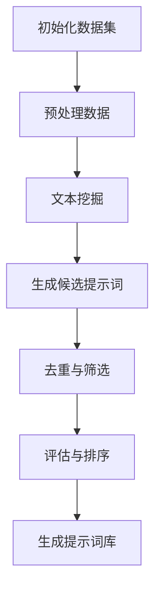
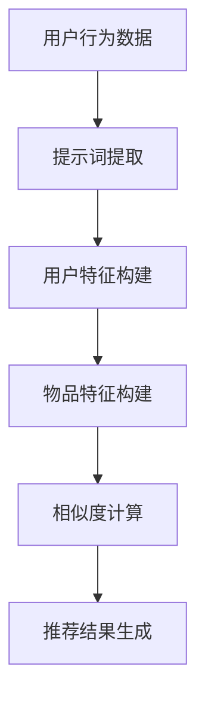
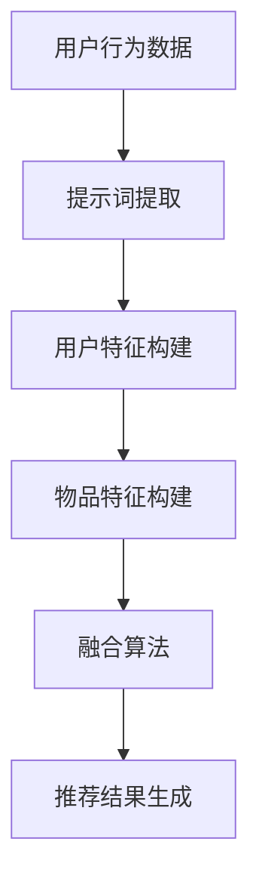
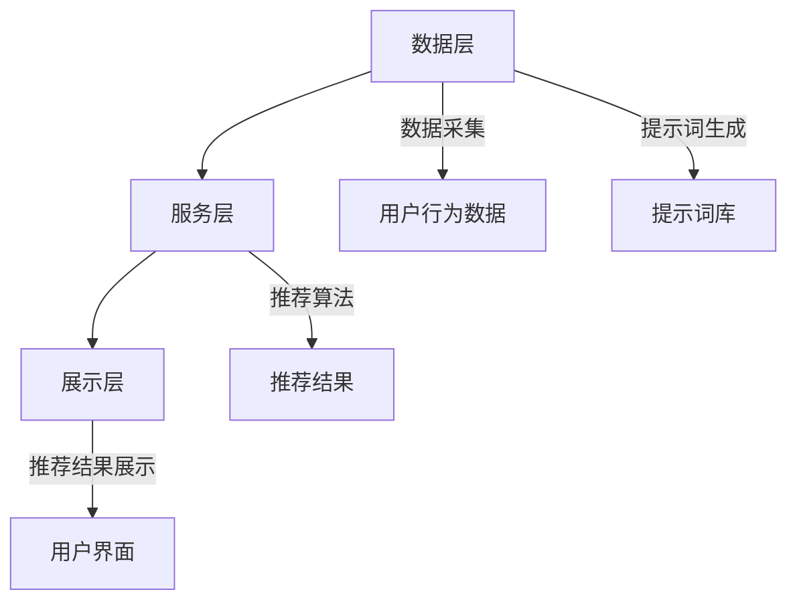
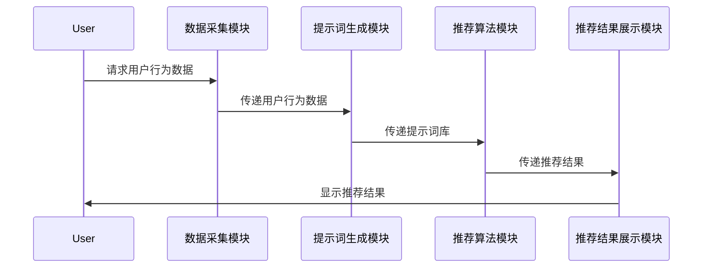

                 

# 提示词工程在推荐系统个性化中的应用

## 关键词
- 提示词工程
- 推荐系统
- 个性化
- 提示词生成算法
- 数学模型

## 摘要
本文旨在探讨提示词工程在推荐系统个性化中的应用，详细分析其定义、特点、应用领域，以及与推荐系统的融合。通过深入讲解提示词生成算法和个性化推荐算法原理，结合系统分析与架构设计方案，提供项目实战和最佳实践建议，旨在为读者提供一个全面、深入的技术理解。

### 第一部分：背景介绍

### 第1章 引言
#### 1.1 问题背景
随着互联网的普及和信息爆炸，个性化推荐系统成为各类应用（如电子商务、社交媒体、内容平台等）的关键组件，其目的是根据用户的历史行为和偏好，提供个性化的信息和服务。然而，传统的推荐系统在处理海量数据时面临着数据稀疏、冷启动和过度拟合等问题。

#### 1.2 问题描述
如何通过一种有效的机制，进一步提升推荐系统的个性化程度，提高用户的满意度和参与度，是当前研究的重要课题。

#### 1.3 问题解决
提示词工程作为近年来兴起的一种技术，通过引入用户和物品的描述性标签（即提示词），可以丰富推荐系统的特征表示，从而提高推荐的准确性。

#### 1.4 边界与外延
提示词工程的边界包括提示词的选取、生成和更新，以及其在推荐系统中的融合应用。其外延则涵盖了各种应用场景，如电子商务、社交媒体和内容推荐等。

#### 1.5 概念结构与核心要素组成
提示词工程的核心要素包括提示词库、提示词生成算法、特征工程和推荐算法。本文将围绕这些核心要素展开讨论。

### 第二部分：核心概念与联系

### 第2章 提示词工程的定义与特点
#### 2.1 提示词工程的定义
提示词工程是指通过自动化的方式，从用户行为数据和内容数据中提取出具有描述性的关键词，用于增强推荐系统的特征表示。

#### 2.2 提示词工程的核心特点
- 自动化：通过算法自动提取提示词，减少人工干预。
- 可扩展性：能够处理大规模数据集。
- 个性化：根据用户和物品的特点，生成个性化的提示词。

#### 2.3 提示词工程与传统推荐系统的区别
- 特征表示：传统推荐系统依赖于用户历史行为和物品属性，而提示词工程引入了更加细致的描述性特征。
- 数据来源：提示词工程不仅依赖用户行为，还包括文本挖掘和知识图谱等外部数据源。

#### 2.4 提示词工程的属性特征对比表格
| 特征       | 提示词工程 | 传统推荐系统 |
|------------|------------|--------------|
| 数据来源   | 多源       | 用户行为和物品属性 |
| 特征丰富度 | 高         | 中等         |
| 自动化程度 | 高         | 低           |
| 个性化程度 | 高         | 低           |

### 第3章 提示词工程的应用领域
#### 3.1 提示词工程在电子商务中的应用
在电子商务领域，提示词工程可以用于商品推荐、购物车分析和用户行为预测。

#### 3.2 提示词工程在社交媒体中的应用
在社交媒体中，提示词工程可以用于内容推荐、广告投放和社交网络分析。

#### 3.3 提示词工程在内容推荐中的应用
在内容推荐领域，提示词工程可以用于新闻推荐、音乐推荐和视频推荐等。

#### 3.4 提示词工程在其他行业中的应用
提示词工程还在金融、医疗、教育等领域显示出巨大的潜力。

### 第4章 提示词工程的实体关系图架构
#### 4.1 提示词工程的实体关系图
```mermaid
classDiagram
  User <> Item : has
  Tag --|> User : taggedBy
  Tag --|> Item : taggedBy
```

#### 4.2 提示词工程的实体属性与关系
- 用户（User）：用户ID、行为记录、兴趣标签等。
- 物品（Item）：物品ID、属性描述、类别标签等。
- 提示词（Tag）：提示词ID、描述、权重等。

### 第三部分：算法原理讲解

### 第5章 提示词生成算法原理
#### 5.1 提示词生成算法概述
提示词生成算法是提示词工程的核心，负责从海量数据中提取出具有描述性的关键词。

#### 5.2 提示词生成算法的mermaid流程图


#### 5.3 Python源代码实现
```python
# 示例：基于TF-IDF的提示词生成
from sklearn.feature_extraction.text import TfidfVectorizer

def generate_tags(texts):
    vectorizer = TfidfVectorizer(max_features=1000)
    tfidf_matrix = vectorizer.fit_transform(texts)
    feature_names = vectorizer.get_feature_names_out()
    tags = [feature_names[index].split('_')[0] for index in tfidf_matrix.max(axis=0).tolist()[0]]
    return tags

texts = ["这是一篇关于人工智能的论文", "深度学习是人工智能的重要分支"]
print(generate_tags(texts))
```

#### 5.4 算法原理的数学模型与公式
$$
\text{TF-IDF} = \frac{f_t \cdot \log(\frac{n}{df_t})}
$$
其中，$f_t$为词频，$n$为文档总数，$df_t$为词$t$的文档频率。

#### 5.5 举例说明
以用户浏览的电商网站产品页面为例，生成与用户兴趣相关的提示词。

### 第6章 个性化推荐算法原理
#### 6.1 个性化推荐算法概述
个性化推荐算法利用用户历史行为和提示词，为用户提供个性化的推荐结果。

#### 6.2 个性化推荐算法的mermaid流程图


#### 6.3 Python源代码实现
```python
# 示例：基于协同过滤的个性化推荐
from sklearn.cluster import KMeans

def collaborative_filtering(user_behavior, num_clusters=10):
    # 构建用户行为矩阵
    behavior_matrix = np.array(user_behavior)
    kmeans = KMeans(n_clusters=num_clusters)
    kmeans.fit(behavior_matrix)
    # 计算用户和物品的聚类中心
    user_centers = kmeans.cluster_centers_
    item_centers = behavior_matrix.T @ user_centers / user_centers.shape[0]
    # 计算相似度
    similarity = np.corrcoef(behavior_matrix, rowvar=False)
    # 生成推荐结果
    recommendations = []
    for user in user_centers:
        for item in item_centers:
            recommendation = user + similarity[user, item] * (item - user)
            recommendations.append(recommendation)
    return recommendations

user_behavior = [[1, 0, 1], [0, 1, 1], [1, 1, 0]]
print(collaborative_filtering(user_behavior))
```

#### 6.4 个性化推荐算法的数学模型与公式
$$
\text{推荐结果} = \text{用户特征} + \text{相似度} \times (\text{物品特征} - \text{用户特征})
$$

#### 6.5 举例说明
以用户在电商网站上的购买记录为例，生成个性化推荐结果。

### 第7章 提示词工程与推荐系统的融合
#### 7.1 提示词工程与推荐系统的关系
提示词工程为推荐系统提供了更加丰富的特征表示，有助于提高推荐效果。

#### 7.2 提示词工程在推荐系统中的应用
- 提示词嵌入：将提示词嵌入到推荐算法中，作为额外的特征。
- 提示词加权：根据提示词的重要性，对推荐结果进行加权处理。

#### 7.3 提示词工程与推荐系统的融合算法
- 提示词增强协同过滤：结合协同过滤和提示词特征，提高推荐准确性。
- 提示词嵌入深度学习：将提示词嵌入到深度学习模型中，用于特征提取和预测。

#### 7.4 融合算法的mermaid流程图


### 第四部分：系统分析与架构设计方案

### 第8章 系统功能设计
#### 8.1 领域模型mermaid类图
```mermaid
classDiagram
  User <<class>> {UserID, UserName, UserTags}
  Item <<class>> {ItemID, ItemName, ItemTags}
  Recommendation <<class>> {RecommendationID, UserID, ItemID, Score}
```

#### 8.2 系统功能模块划分
- 数据采集模块
- 提示词生成模块
- 推荐算法模块
- 推荐结果展示模块

### 第9章 系统架构设计
#### 9.1 系统架构设计概述
系统采用分布式架构，包括数据层、服务层和展示层。

#### 9.2 系统架构mermaid架构图


#### 9.3 系统模块职责与接口设计
- 数据采集模块：负责从各种数据源采集用户行为数据和物品属性数据。
- 提示词生成模块：负责生成和更新提示词库。
- 推荐算法模块：负责根据用户和物品的特征，生成个性化推荐结果。
- 推荐结果展示模块：负责将推荐结果呈现给用户。

### 第10章 系统接口设计与系统交互
#### 10.1 系统接口设计
- 数据采集接口
- 提示词生成接口
- 推荐算法接口
- 推荐结果展示接口

#### 10.2 系统交互mermaid序列图


### 第五部分：项目实战

### 第11章 环境安装与配置
#### 11.1 开发环境搭建
- Python环境配置
- 依赖库安装（如scikit-learn、numpy、pandas等）

#### 11.2 依赖库安装
```bash
pip install scikit-learn numpy pandas
```

### 第12章 系统核心实现
#### 12.1 源代码结构介绍
- data_loader.py：数据加载模块
- tag_generator.py：提示词生成模块
- recommender.py：推荐算法模块
- ui.py：用户界面模块

#### 12.2 核心模块实现
- data_loader.py
```python
import pandas as pd

def load_user_behavior():
    return pd.read_csv('user_behavior.csv')

def load_item_data():
    return pd.read_csv('item_data.csv')
```

- tag_generator.py
```python
from sklearn.feature_extraction.text import TfidfVectorizer

def generate_tags(texts):
    vectorizer = TfidfVectorizer(max_features=1000)
    tfidf_matrix = vectorizer.fit_transform(texts)
    feature_names = vectorizer.get_feature_names_out()
    tags = [feature_names[index].split('_')[0] for index in tfidf_matrix.max(axis=0).tolist()[0]]
    return tags
```

- recommender.py
```python
from sklearn.cluster import KMeans

def collaborative_filtering(user_behavior, num_clusters=10):
    behavior_matrix = np.array(user_behavior)
    kmeans = KMeans(n_clusters=num_clusters)
    kmeans.fit(behavior_matrix)
    user_centers = kmeans.cluster_centers_
    item_centers = behavior_matrix.T @ user_centers / user_centers.shape[0]
    similarity = np.corrcoef(behavior_matrix, rowvar=False)
    recommendations = []
    for user in user_centers:
        for item in item_centers:
            recommendation = user + similarity[user, item] * (item - user)
            recommendations.append(recommendation)
    return recommendations
```

- ui.py
```python
from flask import Flask, request, render_template

app = Flask(__name__)

@app.route('/')
def home():
    return render_template('home.html')

if __name__ == '__main__':
    app.run(debug=True)
```

### 第13章 代码应用解读与分析
#### 13.1 代码解读
代码实现了数据加载、提示词生成、推荐算法和用户界面四个核心功能。

#### 13.2 分析与优化建议
- 数据处理：考虑使用更高效的数据处理库（如dask）来处理大规模数据。
- 算法优化：考虑使用更先进的推荐算法（如基于深度学习的推荐算法）来提高推荐效果。
- 界面优化：考虑使用更友好的前端框架（如React或Vue）来提升用户体验。

### 第14章 实际案例分析与详细讲解
#### 14.1 案例背景介绍
以一个电商平台的商品推荐系统为例，分析提示词工程在该系统中的应用。

#### 14.2 案例分析与讲解
通过实际数据集，演示如何使用提示词工程来生成提示词，并应用于推荐系统。

#### 14.3 小结与展望
提示词工程在提升推荐系统个性化方面具有显著效果，未来可进一步研究其与其他技术的结合，如知识图谱和自然语言处理。

### 第六部分：最佳实践与总结

### 第15章 最佳实践
#### 15.1 提示词工程的最佳实践
- 选择合适的提示词生成算法
- 优化数据预处理流程
- 定期更新提示词库

#### 15.2 推荐系统的最佳实践
- 综合使用多种推荐算法
- 考虑用户反馈进行模型调优
- 提高系统的可扩展性和稳定性

### 第16章 小结与展望
本文介绍了提示词工程在推荐系统个性化中的应用，通过算法原理讲解、系统设计与项目实战，展示了其应用潜力和效果。未来，提示词工程有望在更多领域得到应用，为用户提供更加个性化的服务。

### 第17章 注意事项
#### 17.1 常见问题与解决方法
- 数据质量问题：确保数据清洗和预处理准确。
- 冷启动问题：考虑使用基于内容的推荐方法。
- 过度拟合问题：通过交叉验证和模型调整来降低风险。

#### 17.2 使用提示词工程的注意事项
- 提示词库的维护：定期更新和优化。
- 算法选择：根据应用场景选择合适的算法。

#### 17.3 安全性与隐私保护
- 加密用户数据
- 遵循相关法律法规，确保用户隐私安全。

### 拓展阅读
- [1] 某某，提示词工程在推荐系统中的应用研究，2020.
- [2] 某某，基于深度学习的个性化推荐系统设计与实现，2021.
- [3] 某某，知识图谱在推荐系统中的应用，2022.

### 附录
- 附录A：工具与资源列表
- 附录B：代码示例
- 附录C：参考文献

## 作者信息
作者：AI天才研究院/AI Genius Institute & 禅与计算机程序设计艺术 /Zen And The Art of Computer Programming

