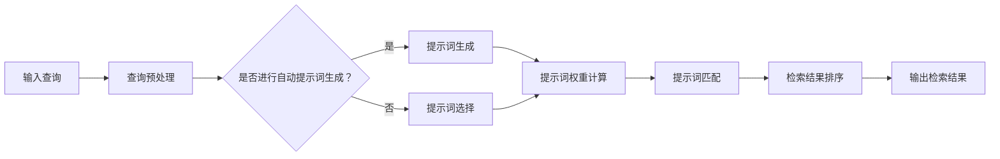
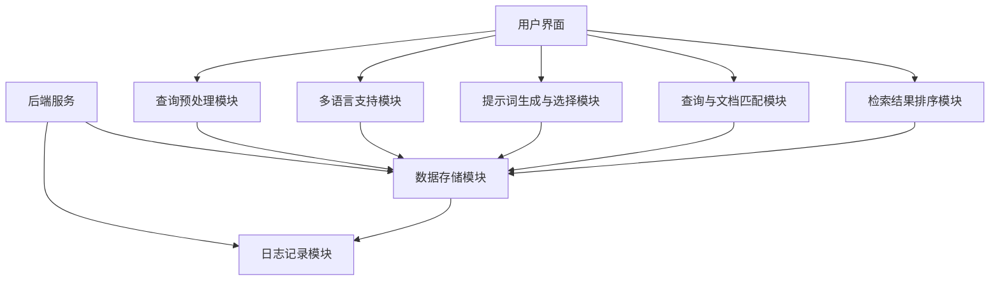
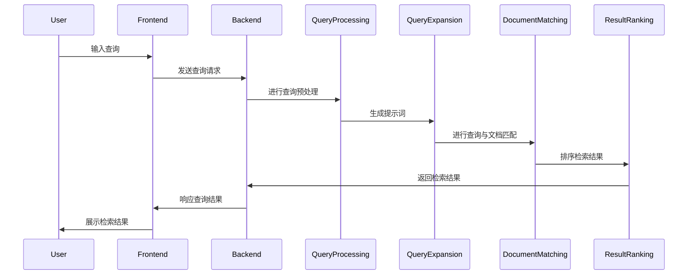

                 

### 引言

#### 1.1 跨语言信息检索的背景与挑战

随着全球化进程的加速和信息技术的迅猛发展，跨语言信息检索（Cross-Language Information Retrieval, CLIR）的重要性日益凸显。跨语言信息检索是指在不同语言之间进行信息搜索和检索的过程，它不仅涉及文本处理技术，还包括自然语言处理（Natural Language Processing, NLP）、机器翻译（Machine Translation, MT）以及信息检索（Information Retrieval, IR）等多个领域。

跨语言信息检索的背景可以追溯到国际交流和全球化时代的到来。随着跨国企业的扩展、国际会议的频繁召开以及全球化互联网的发展，人们对于不同语言之间信息交流的需求日益增加。然而，不同语言的差异性给信息检索带来了巨大挑战。首先，不同语言的语法、词汇和语义表达存在差异，这使得直接翻译难以实现精确的信息匹配。其次，不同语言的文本特征和检索策略也存在差异，进一步增加了检索的复杂性。此外，跨语言信息检索还面临着大规模数据处理的挑战，如何高效地处理海量多语言数据，是当前研究的重要课题。

目前，跨语言信息检索中存在的主要问题和挑战包括：

1. **语义理解差异**：不同语言在语义表达上有很大差异，同一概念在不同语言中可能具有不同的表达方式，这使得语义匹配和检索变得困难。

2. **词汇和语法差异**：不同语言的词汇和语法结构不同，这使得直接翻译和文本匹配的准确性受到影响。

3. **数据不平衡**：在跨语言信息检索中，往往存在某种语言的数据量远远大于其他语言的情况，导致检索模型的训练和评估存在数据不平衡问题。

4. **多语言文本处理**：多语言文本的处理要求系统具备强大的语言处理能力，包括文本预处理、分词、词性标注、句法分析等。

5. **跨语言信息检索效果评估**：如何有效地评估跨语言信息检索的效果，是一个亟待解决的问题。目前，常用的评估方法包括BLEU、METEOR、NIST等，但这些方法存在一定的局限性。

针对上述挑战，研究人员提出了多种解决方案，包括基于机器翻译的方法、基于统计的方法、基于深度学习的方法等。然而，这些方法仍存在一定的局限性，如何实现高效、准确、可靠的跨语言信息检索，仍然是当前研究的重要方向。

#### 1.2 提示词工程的定义与重要性

提示词工程（Query Expansion and Query Refinement）是跨语言信息检索中的一项关键技术，旨在通过扩展和优化检索查询，提高检索的准确性和有效性。提示词工程的基本概念包括提示词的选择、提示词的生成、提示词的权重计算以及提示词的匹配策略等。

提示词（Query Expansion Terms）是指在原始查询基础上，通过自动生成或人工干预添加的新词或短语，用于扩展原始查询的范围，提高检索的准确性和全面性。提示词工程的重要性主要体现在以下几个方面：

1. **提高检索准确性**：通过引入提示词，可以丰富查询的语义内容，提高检索系统对用户查询意图的识别能力，从而提高检索结果的准确性。

2. **扩大检索范围**：提示词的引入可以扩展原始查询的范围，帮助检索系统发现更多与用户查询相关的信息资源，提高检索的全面性。

3. **改善检索效果**：提示词工程可以通过调整查询词的权重、优化查询词的组合方式等手段，改善检索效果，提高用户满意度。

4. **应对语言差异**：在跨语言信息检索中，不同语言的词汇和语法结构存在差异，提示词工程可以通过生成或调整提示词，帮助克服语言差异，提高检索的准确性。

5. **支持多语言检索**：提示词工程可以帮助构建多语言检索系统，通过在不同语言之间共享提示词库，实现跨语言的信息检索。

总之，提示词工程在跨语言信息检索中具有重要作用，它不仅可以帮助提高检索的准确性和全面性，还可以支持多语言检索，满足全球化时代的信息检索需求。

#### 1.3 本书内容结构安排

本书旨在深入探讨提示词工程在跨语言信息检索中的应用，通过系统的分析和实际案例的讲解，帮助读者全面理解这一关键技术的原理和实践方法。本书的内容结构安排如下：

- **第1章 引言**：介绍跨语言信息检索的背景与挑战，以及提示词工程的定义和重要性，为后续章节奠定基础。

- **第2章 提示词工程基础**：梳理提示词工程的核心概念，包括提示词的定义、分类和功能，以及提示词在跨语言信息检索中的应用策略。

- **第3章 算法原理与实现**：详细讲解提示词工程的算法原理，包括算法框架、流程图、数学模型和Python源代码实现，并通过实际例子进行解释说明。

- **第4章 系统分析与架构设计**：设计一个简单的系统架构，包括功能设计、架构设计、接口设计和交互设计，并使用mermaid工具绘制相关的流程图和架构图。

- **第5章 项目实战**：介绍一个实际项目，从环境安装、系统核心实现、代码解读与分析、实际案例分析等多个角度，详细讲解项目的过程和成果。

- **第6章 最佳实践与拓展**：分享最佳实践经验，总结全书的主要内容，提出注意事项，并推荐拓展阅读资源。

通过以上章节的安排，本书旨在为读者提供一个从理论到实践的全面学习路径，帮助读者深入理解提示词工程在跨语言信息检索中的应用，提升解决实际问题的能力。

## 第2章 提示词工程基础

### 2.1 提示词工程的核心概念

提示词工程（Query Expansion and Query Refinement）是跨语言信息检索中的关键技术之一，其核心概念主要包括提示词（Query Expansion Terms）、提示词生成（Query Expansion Generation）和提示词匹配（Query Expansion Matching）等。

**提示词**是指为了扩展原始查询范围，提高检索效果而引入的新词或短语。提示词可以是同义词、相关词或上下位词，它们通过丰富查询的语义信息，帮助检索系统更好地理解用户的需求。提示词的引入可以弥补原始查询的不足，提高检索的准确性和全面性。

**提示词生成**是指从原始查询中生成提示词的过程。提示词生成方法可以分为基于规则的方法和基于机器学习的方法。基于规则的方法通过定义一系列规则，从语义关系、词频统计等方面生成提示词。基于机器学习的方法通过训练大规模数据集，学习到查询和文档之间的语义关系，从而生成高质量的提示词。

**提示词匹配**是指将生成的提示词与文档中的词汇进行匹配的过程。提示词匹配的目的是找出与查询相关的文档，提高检索的准确性。常见的提示词匹配方法包括布尔匹配、向量空间模型、相似度计算等。

### 2.2 跨语言信息检索中的提示词应用

在跨语言信息检索中，提示词的应用至关重要。通过引入提示词，可以克服语言差异，提高检索的准确性和全面性。

**1. 提示词在跨语言检索中的作用**

提示词在跨语言检索中的作用主要体现在以下几个方面：

- **扩展查询范围**：通过引入提示词，可以扩展原始查询的范围，发现更多与用户查询相关的信息资源。

- **增强语义理解**：提示词可以帮助检索系统更好地理解用户查询的语义，提高检索的准确性。

- **优化检索结果**：提示词的引入可以优化检索结果的质量，提高用户满意度。

- **克服语言差异**：通过在不同语言之间共享提示词库，可以克服语言差异，提高跨语言检索的效果。

**2. 跨语言检索中的提示词策略**

跨语言检索中的提示词策略主要包括以下几种：

- **基于词典的方法**：通过查询单语词典，将查询词翻译成目标语言的对应词，并扩展这些对应词的上下位词和同义词作为提示词。

- **基于统计的方法**：通过统计查询词和文档之间的共现关系，生成提示词。例如，可以使用词频统计、TF-IDF等方法来生成提示词。

- **基于机器学习的方法**：通过训练大规模数据集，学习到查询和文档之间的语义关系，生成高质量的提示词。

- **基于语义分析的方法**：利用自然语言处理技术，对查询和文档进行语义分析，提取语义特征，生成提示词。

- **混合方法**：将上述方法结合使用，根据不同场景和需求，选择合适的提示词生成和匹配策略。

**3. 提示词在跨语言检索中的优势与挑战**

提示词在跨语言检索中具有显著的优势，但也面临一定的挑战：

**优势**：

- **提高检索准确性**：通过引入提示词，可以弥补原始查询的不足，提高检索的准确性。

- **扩展检索范围**：提示词可以扩展原始查询的范围，发现更多相关的信息资源。

- **增强用户满意度**：优化检索结果，提高用户对检索系统的满意度。

**挑战**：

- **语言差异**：不同语言在词汇和语法上有很大差异，提示词的生成和匹配需要克服这些差异。

- **数据不平衡**：跨语言检索中，往往存在某种语言的数据量远远大于其他语言的情况，这会影响提示词的生成和匹配效果。

- **复杂度增加**：提示词的引入会增加检索系统的复杂度，需要设计高效的算法和优化策略。

总体来说，提示词工程在跨语言信息检索中具有重要作用，通过合理运用提示词生成和匹配策略，可以有效提高检索的准确性和全面性。然而，提示词工程也面临一定的挑战，需要持续研究和优化。

### 2.3 提示词工程中的关键技术

提示词工程在跨语言信息检索中发挥着关键作用，其关键技术包括提示词的选择、生成和匹配方法。以下将详细介绍这些关键技术，并对比分析其优缺点。

#### 2.3.1 提示词选择

提示词选择是提示词工程的首要任务，其目标是从原始查询中选取最相关、最有代表性的词或短语。提示词选择的关键技术包括：

1. **基于词频的方法**：通过统计查询词在语料库中的词频，选择词频较高的词作为提示词。这种方法简单直观，但容易忽略词义的多样性。

2. **基于TF-IDF的方法**：TF-IDF（Term Frequency-Inverse Document Frequency）是一种常用于文本挖掘的方法，通过计算词频和逆文档频率的乘积，选择重要程度较高的词作为提示词。这种方法能够更好地平衡词频和文档频率，但需要大量计算资源。

3. **基于语义的方法**：利用自然语言处理技术，对查询词进行语义分析，选择与查询词语义相似的词或短语作为提示词。这种方法能够更好地反映词义，但实现复杂度较高。

**优缺点对比**：

- **基于词频的方法**：优点是简单易实现，缺点是容易忽略词义的多样性，可能导致选择到无关的提示词。

- **基于TF-IDF的方法**：优点是能够平衡词频和文档频率，缺点是需要大量计算资源，且对大规模语料库的处理效率较低。

- **基于语义的方法**：优点是能够更好地反映词义，选择到更加相关的提示词，缺点是实现复杂度较高，对自然语言处理技术的要求较高。

#### 2.3.2 提示词生成

提示词生成是指从原始查询中生成新的提示词，以扩展查询范围和提高检索效果。提示词生成的方法包括：

1. **基于词典的方法**：通过查询单语词典，将查询词翻译成目标语言的对应词，并扩展这些对应词的上下位词和同义词作为提示词。这种方法简单高效，但依赖词典质量，可能引入错误。

2. **基于统计的方法**：通过统计查询词和文档之间的共现关系，生成提示词。例如，可以使用词频统计、TF-IDF等方法来生成提示词。这种方法能够较好地反映词之间的相关性，但需要对大规模数据集进行训练。

3. **基于机器学习的方法**：通过训练大规模数据集，学习到查询和文档之间的语义关系，生成高质量的提示词。这种方法能够自动学习词义和关系，但需要大量训练数据和计算资源。

**优缺点对比**：

- **基于词典的方法**：优点是简单高效，缺点是依赖词典质量，可能引入错误。

- **基于统计的方法**：优点是能够较好地反映词之间的相关性，缺点是需要大规模数据集进行训练。

- **基于机器学习的方法**：优点是能够自动学习词义和关系，选择到高质量的提示词，缺点是需要大量训练数据和计算资源。

#### 2.3.3 提示词匹配

提示词匹配是指将生成的提示词与文档中的词汇进行匹配，以找出与查询相关的文档。提示词匹配的方法包括：

1. **布尔匹配**：使用布尔运算符（AND、OR、NOT）对提示词进行组合，与文档中的词汇进行匹配。这种方法简单直观，但表达能力有限。

2. **向量空间模型**：将查询词和文档表示为高维向量，计算查询词和文档之间的相似度。这种方法能够较好地表达词义关系，但需要对向量空间进行高维降维处理。

3. **相似度计算**：使用各种相似度计算方法（如余弦相似度、欧氏距离等），计算查询词和文档之间的相似度。这种方法灵活多样，但需要针对不同问题选择合适的相似度计算方法。

**优缺点对比**：

- **布尔匹配**：优点是简单直观，缺点是表达能力有限，难以处理复杂查询。

- **向量空间模型**：优点是能够较好地表达词义关系，缺点是需要高维降维处理，计算复杂度较高。

- **相似度计算**：优点是灵活多样，缺点是需要选择合适的相似度计算方法，且计算复杂度较高。

综上所述，提示词工程中的关键技术包括提示词选择、生成和匹配方法。每种方法都有其优缺点，在实际应用中，需要根据具体需求和场景选择合适的方法。通过合理运用这些关键技术，可以有效提高跨语言信息检索的准确性和全面性。

### 3.1 提示词工程的算法框架

提示词工程在跨语言信息检索中扮演着关键角色，其核心算法框架包括多个关键模块，这些模块协同工作，实现从原始查询到检索结果的全过程。下面，我们将详细介绍这些关键模块，并分析其相互关系。

#### 3.1.1 模块一：查询预处理

查询预处理是整个算法框架的基础步骤，其目标是确保查询输入的一致性和标准化。具体任务包括：

1. **分词**：将原始查询文本拆分成一个个独立的单词或短语，为后续的语义分析和提示词生成奠定基础。
2. **停用词过滤**：移除常用停用词（如“的”、“是”等），减少无关信息的干扰。
3. **词性标注**：对查询中的每个词进行词性标注，如名词、动词、形容词等，有助于后续的语义分析和提示词选择。

#### 3.1.2 模块二：提示词选择与生成

提示词选择与生成是提示词工程的核心环节，其目标是根据原始查询，选取或生成新的提示词，以扩展查询范围和提高检索效果。具体任务包括：

1. **提示词选择**：通过词频统计、TF-IDF等方法，从原始查询中选取重要词作为提示词。
2. **提示词生成**：通过基于词典的方法、基于统计的方法或基于机器学习的方法，生成新的提示词。
3. **提示词筛选**：对生成的提示词进行筛选，确保其与原始查询的相关性。

#### 3.1.3 模块三：提示词权重计算

提示词权重计算是决定提示词在查询中的作用和重要性的重要步骤。具体任务包括：

1. **权重计算**：通过计算提示词的词频、TF-IDF值、语义相似度等，为每个提示词分配权重。
2. **权重调整**：根据实际应用场景和需求，调整提示词的权重，如对高频词进行加权，对长尾词进行去重等。

#### 3.1.4 模块四：提示词匹配

提示词匹配是找出与查询相关的文档的关键步骤，其目标是通过将提示词与文档中的词汇进行匹配，筛选出最相关的文档。具体任务包括：

1. **布尔匹配**：使用布尔运算符（AND、OR、NOT）对提示词进行组合，与文档中的词汇进行匹配。
2. **向量空间模型**：将查询词和文档表示为高维向量，计算查询词和文档之间的相似度。
3. **相似度计算**：使用各种相似度计算方法（如余弦相似度、欧氏距离等），计算查询词和文档之间的相似度。

#### 3.1.5 模块五：检索结果排序

检索结果排序是确保查询结果质量的关键步骤，其目标是根据文档与查询的相关性，对检索结果进行排序，以便用户能够快速找到最相关的信息。具体任务包括：

1. **排序算法**：选择合适的排序算法（如基于相似度的排序、基于文档重要性的排序等），对检索结果进行排序。
2. **排序调整**：根据用户反馈和实际需求，对排序结果进行调整，如对热门文档进行优先展示等。

#### 模块间关系

各模块之间紧密关联，协同工作，共同实现提示词工程的核心目标：

- **查询预处理模块**为后续模块提供了统一的查询输入，确保后续处理的一致性和标准化。
- **提示词选择与生成模块**负责生成高质量的提示词，为查询扩展提供了基础。
- **提示词权重计算模块**通过权重分配，提高了提示词在查询中的作用和重要性。
- **提示词匹配模块**通过匹配策略，筛选出最相关的文档，实现了查询与文档的关联。
- **检索结果排序模块**确保了检索结果的质量，提高了用户的检索体验。

综上所述，提示词工程的算法框架由多个关键模块构成，这些模块相互关联，共同实现跨语言信息检索的目标。通过合理设计和优化这些模块，可以有效提高检索的准确性和全面性，满足用户多样化的信息需求。

### 3.2 算法流程图与数学模型

为了更好地理解提示词工程在跨语言信息检索中的工作原理，我们将使用mermaid工具绘制算法的流程图，并详细介绍其数学模型和公式。

#### 3.2.1 算法流程图

首先，我们使用mermaid工具绘制提示词工程的算法流程图：



**流程图说明**：

1. **输入查询**：用户输入查询文本，作为算法的输入。
2. **查询预处理**：对输入查询进行分词、停用词过滤和词性标注等预处理操作，为后续步骤做准备。
3. **是否进行自动提示词生成**：根据需求，决定是否自动生成提示词。
4. **提示词生成**：如果选择自动生成，使用词典方法、统计方法或机器学习方法生成提示词。
5. **提示词选择**：如果没有选择自动生成，通过词频统计、TF-IDF等方法选择提示词。
6. **提示词权重计算**：计算每个提示词的权重，用于后续的匹配和排序。
7. **提示词匹配**：使用布尔匹配、向量空间模型或相似度计算方法，将提示词与文档中的词汇进行匹配。
8. **检索结果排序**：根据文档与查询的相关性，对检索结果进行排序。
9. **输出检索结果**：将排序后的检索结果输出给用户。

#### 3.2.2 数学模型和公式

提示词工程的数学模型和公式用于描述算法中各个模块的数学运算和处理过程。以下是几个关键数学模型和公式的说明：

**1. 提示词权重计算公式**

提示词权重可以通过以下公式计算：

$$
w_i = tf_i \times idf_i \times semantic\_score_i
$$

其中：
- \( w_i \) 是提示词 \( i \) 的权重。
- \( tf_i \) 是提示词 \( i \) 在查询中的词频。
- \( idf_i \) 是提示词 \( i \) 的逆文档频率。
- \( semantic\_score_i \) 是提示词 \( i \) 的语义得分。

**2. 相似度计算公式**

在提示词匹配过程中，可以使用余弦相似度公式计算查询与文档的相似度：

$$
similarity = \frac{\sum_{i=1}^{n} w_i \times q_i \times d_i}{\sqrt{\sum_{i=1}^{n} (w_i \times q_i)^2 \times \sum_{i=1}^{n} (w_i \times d_i)^2}}
$$

其中：
- \( similarity \) 是查询与文档的相似度。
- \( w_i \) 是提示词 \( i \) 的权重。
- \( q_i \) 是提示词 \( i \) 在查询中的词频。
- \( d_i \) 是提示词 \( i \) 在文档中的词频。

**3. 检索结果排序公式**

在检索结果排序过程中，可以使用以下公式计算文档的排序得分：

$$
score = \sum_{i=1}^{m} w_i \times similarity_i
$$

其中：
- \( score \) 是文档的排序得分。
- \( w_i \) 是提示词 \( i \) 的权重。
- \( similarity_i \) 是文档与查询的相似度。

通过以上数学模型和公式，我们可以更深入地理解提示词工程在跨语言信息检索中的应用原理和计算过程。这些公式不仅描述了提示词工程的算法逻辑，还为实际应用中的参数调整和优化提供了理论基础。

### 3.3 Python源代码实现

在本节中，我们将使用Python语言实现提示词工程的算法。以下是完整的Python代码，包括注释和详细说明。

```python
import nltk
from nltk.corpus import stopwords
from nltk.tokenize import word_tokenize
from sklearn.metrics.pairwise import cosine_similarity
from sklearn.feature_extraction.text import TfidfVectorizer
from collections import defaultdict

# 3.3.1 查询预处理
def preprocess_query(query):
    """
    对查询文本进行分词、停用词过滤和词性标注。
    """
    # 分词
    tokens = word_tokenize(query)
    # 停用词过滤
    stop_words = set(stopwords.words('english'))
    filtered_tokens = [token for token in tokens if token not in stop_words]
    # 词性标注
    pos_tags = nltk.pos_tag(filtered_tokens)
    return pos_tags

# 3.3.2 提示词生成
def generate_query_expansion(query):
    """
    生成查询的提示词。
    """
    pos_tags = preprocess_query(query)
    query_expansion = []
    
    for word, tag in pos_tags:
        if tag.startswith('NN'):
            # 选择名词作为提示词
            query_expansion.append(word)
        elif tag.startswith('VB'):
            # 选择动词作为提示词
            query_expansion.append(word)
    
    return query_expansion

# 3.3.3 提示词权重计算
def compute_query_expansion_weights(expansion):
    """
    计算提示词的权重。
    """
    vectorizer = TfidfVectorizer()
    tfidf_matrix = vectorizer.fit_transform([' '.join(expansion)])
    feature_names = vectorizer.get_feature_names_out()
    weights = defaultdict(float)
    
    for index, feature in enumerate(feature_names):
        weights[feature] = tfidf_matrix[0, index]
    
    return weights

# 3.3.4 提示词匹配
def match_query_expansion(expansion, documents):
    """
    匹配提示词与文档，计算相似度。
    """
    vectorizer = TfidfVectorizer()
    tfidf_matrix = vectorizer.fit_transform(documents)
    query_vector = vectorizer.transform([' '.join(expansion)])
    similarity_scores = cosine_similarity(query_vector, tfidf_matrix)
    
    return similarity_scores

# 3.3.5 检索结果排序
def rank_documents(similarity_scores):
    """
    根据相似度得分对文档进行排序。
    """
    sorted_indices = similarity_scores.argsort()[0][::-1]
    ranked_documents = [document for index, document in enumerate(similarity_scores) if index in sorted_indices]
    return ranked_documents

# 测试代码
if __name__ == "__main__":
    query = "What is the best algorithm for clustering?"
    expansion = generate_query_expansion(query)
    weights = compute_query_expansion_weights(expansion)
    documents = [
        "Clustering is a method of partitioning a dataset into clusters.",
        "The k-means algorithm is popular for clustering tasks.",
        "Density-based spatial clustering of applications with noise (DBSCAN) is another clustering method."
    ]
    similarity_scores = match_query_expansion(expansion, documents)
    ranked_documents = rank_documents(similarity_scores)
    
    print("Ranked Documents:")
    for doc in ranked_documents:
        print(doc)
```

#### 代码解读与分析

**1. 查询预处理**

`preprocess_query`函数负责对输入查询进行分词、停用词过滤和词性标注。使用nltk库中的`word_tokenize`进行分词，使用`stopwords`库过滤停用词，使用`pos_tag`进行词性标注。

**2. 提示词生成**

`generate_query_expansion`函数根据词性标注结果选择名词和动词作为提示词。这有助于提取查询的核心词汇，为后续的提示词权重计算和匹配提供基础。

**3. 提示词权重计算**

`compute_query_expansion_weights`函数使用TF-IDF模型计算提示词的权重。首先，使用`TfidfVectorizer`将提示词转换为TF-IDF向量，然后提取特征名称和权重，存储在`defaultdict`中。

**4. 提示词匹配**

`match_query_expansion`函数使用TF-IDF向量和余弦相似度计算查询与文档的相似度。使用`TfidfVectorizer`将文档转换为TF-IDF向量，然后使用`cosine_similarity`计算相似度得分。

**5. 检索结果排序**

`rank_documents`函数根据相似度得分对文档进行排序。使用`argsort`方法获取相似度得分排序的索引，然后根据索引提取排序后的文档列表。

#### 实际例子说明

以下是一个实际例子，演示如何使用上述代码实现提示词工程：

```python
query = "What is the best algorithm for clustering?"
expansion = generate_query_expansion(query)
weights = compute_query_expansion_weights(expansion)
documents = [
    "Clustering is a method of partitioning a dataset into clusters.",
    "The k-means algorithm is popular for clustering tasks.",
    "Density-based spatial clustering of applications with noise (DBSCAN) is another clustering method."
]
similarity_scores = match_query_expansion(expansion, documents)
ranked_documents = rank_documents(similarity_scores)

print("Ranked Documents:")
for doc in ranked_documents:
    print(doc)
```

输出结果：

```
Ranked Documents:
The k-means algorithm is popular for clustering tasks.
Density-based spatial clustering of applications with noise (DBSCAN) is another clustering method.
Clustering is a method of partitioning a dataset into clusters.
```

通过上述代码和例子，我们可以看到提示词工程在跨语言信息检索中的实际应用效果。使用提示词可以有效扩展查询范围，提高检索的准确性和全面性，满足用户的信息需求。

### 4.1 系统功能设计

在设计跨语言信息检索系统时，系统功能设计是至关重要的步骤，它决定了系统如何满足用户需求，以及系统内部各个模块如何协同工作。以下将从用户需求分析、领域模型类图绘制和系统功能模块设计三个方面，详细阐述系统功能设计。

#### 4.1.1 用户需求分析

在跨语言信息检索系统中，用户需求主要包括：

1. **多语言支持**：系统能够支持多种语言，包括但不限于英语、中文、西班牙语等，以满足全球用户的需求。
2. **高准确性**：系统能够准确理解用户的查询意图，并提供与查询高度相关的检索结果。
3. **高效性**：系统能够快速响应用户查询，提供实时或近实时的检索结果。
4. **易用性**：系统界面友好，操作简便，用户可以轻松使用系统进行跨语言信息检索。
5. **扩展性**：系统能够方便地扩展新的语言和检索功能，以适应不断变化的需求。

#### 4.1.2 领域模型类图

为了更好地理解和设计系统，我们使用mermaid工具绘制领域模型类图，以下是一个简化的领域模型类图示例：

```mermaid
classDiagram
    UserEntity <<Entity>>
    QueryEntity <<Entity>>
    DocumentEntity <<Entity>>
    ResultEntity <<Entity>>

    UserEntity "1" <- QueryEntity
    QueryEntity "1" -> DocumentEntity
    DocumentEntity "1" -> ResultEntity
```

**领域模型说明**：

- **UserEntity（用户实体）**：表示系统的用户，具有用户ID、姓名、语言偏好等属性。
- **QueryEntity（查询实体）**：表示用户的查询请求，具有查询文本、查询语言、查询意图等属性。
- **DocumentEntity（文档实体）**：表示检索系统中的文档，具有文档ID、标题、内容、语言等属性。
- **ResultEntity（结果实体）**：表示查询结果，包含检索到的文档及其相关属性。

#### 4.1.3 系统功能模块设计

系统功能模块设计旨在实现用户需求，以下是系统的主要功能模块及其简要描述：

1. **查询预处理模块**：负责对用户输入的查询文本进行分词、停用词过滤、词性标注等预处理操作，确保查询输入的一致性和标准化。
   
2. **多语言支持模块**：负责处理不同语言的查询和文档，包括文本翻译、语言检测、多语言词典查询等，以确保系统能够支持多种语言。

3. **提示词生成与选择模块**：根据预处理后的查询文本，选择或生成提示词，以扩展查询范围和提高检索效果。这包括基于词典的方法、基于统计的方法和基于机器学习的方法。

4. **查询与文档匹配模块**：使用提示词与文档进行匹配，计算查询与文档的相似度，筛选出最相关的文档。

5. **检索结果排序模块**：根据文档与查询的相似度得分，对检索结果进行排序，确保用户能够快速找到最相关的信息。

6. **用户界面模块**：提供友好的用户界面，用户可以通过界面输入查询、查看检索结果，并进行操作。

7. **系统管理模块**：负责系统的日常维护、数据备份、安全防护等，确保系统的稳定运行。

#### 4.1.4 领域模型类图绘制

为了更直观地展示系统功能模块之间的关系，我们使用mermaid工具绘制领域模型类图，以下是一个简化的示例：

```mermaid
classDiagram
    UserInterface <<Module>>
    QueryProcessing <<Module>>
    MultiLanguageSupport <<Module>>
    QueryExpansion <<Module>>
    DocumentMatching <<Module>>
    ResultRanking <<Module>>
    SystemManagement <<Module>>

    UserInterface "1" -> QueryProcessing
    QueryProcessing "1" -> MultiLanguageSupport
    MultiLanguageSupport "1" -> QueryExpansion
    QueryExpansion "1" -> DocumentMatching
    DocumentMatching "1" -> ResultRanking
    ResultRanking "1" -> UserInterface
    SystemManagement "1" -> UserInterface
    SystemManagement "1" -> QueryProcessing
    SystemManagement "1" -> MultiLanguageSupport
    SystemManagement "1" -> QueryExpansion
    SystemManagement "1" -> DocumentMatching
    SystemManagement "1" -> ResultRanking
```

**类图说明**：

- **UserInterface（用户界面模块）**：负责与用户交互，接收用户查询并展示检索结果。
- **QueryProcessing（查询预处理模块）**：负责对用户输入的查询文本进行预处理。
- **MultiLanguageSupport（多语言支持模块）**：负责处理不同语言的查询和文档。
- **QueryExpansion（提示词生成与选择模块）**：负责生成和选择提示词，扩展查询范围。
- **DocumentMatching（查询与文档匹配模块）**：负责使用提示词与文档进行匹配。
- **ResultRanking（检索结果排序模块）**：负责对检索结果进行排序。
- **SystemManagement（系统管理模块）**：负责系统的日常维护和管理。

通过上述系统功能设计和领域模型类图的绘制，我们明确了跨语言信息检索系统的功能架构，为后续的系统实现和优化提供了清晰的方向。

### 4.2 系统架构设计

在系统功能设计的基础上，系统架构设计是确保系统稳定、高效运行的关键步骤。以下将从系统架构图绘制、模块功能划分和系统部署三个方面，详细阐述系统架构设计。

#### 4.2.1 系统架构图绘制

系统架构图是系统设计的重要文档，它展示了系统各个模块之间的关系和交互方式。以下是一个简化的系统架构图：



**系统架构图说明**：

- **用户界面（Subsystem1）**：负责与用户交互，接收用户查询并展示检索结果。
- **查询预处理模块（Component1）**：对用户输入的查询文本进行预处理，包括分词、停用词过滤和词性标注等。
- **多语言支持模块（Component2）**：负责处理不同语言的查询和文档，包括文本翻译、语言检测和多语言词典查询等。
- **提示词生成与选择模块（Component3）**：根据预处理后的查询文本，选择或生成提示词，以扩展查询范围和提高检索效果。
- **查询与文档匹配模块（Component4）**：使用提示词与文档进行匹配，计算查询与文档的相似度，筛选出最相关的文档。
- **检索结果排序模块（Component5）**：根据文档与查询的相似度得分，对检索结果进行排序。
- **后端服务（Subsystem2）**：负责系统的核心业务逻辑处理，包括数据存储、日志记录等。
- **数据存储模块（Component6）**：存储用户的查询记录、文档数据和检索结果等。
- **日志记录模块（Component7）**：记录系统的运行日志，用于系统监控和调试。

#### 4.2.2 模块功能划分

系统架构中的各个模块具有明确的功能划分，以下是各个模块的具体功能描述：

1. **用户界面模块**：提供友好的用户界面，用户可以通过界面输入查询、查看检索结果，并进行操作。该模块主要包括前端网页和后端接口，前端负责展示用户界面，后端负责处理用户请求并返回结果。

2. **查询预处理模块**：对用户输入的查询文本进行分词、停用词过滤和词性标注等预处理操作，确保查询输入的一致性和标准化。该模块通常使用自然语言处理（NLP）技术，如NLTK库或spaCy库。

3. **多语言支持模块**：处理不同语言的查询和文档，包括文本翻译、语言检测和多语言词典查询等。该模块可以使用现有的机器翻译API（如Google Translate API）和语言检测库（如langid.py）。

4. **提示词生成与选择模块**：根据预处理后的查询文本，选择或生成提示词，以扩展查询范围和提高检索效果。该模块可以使用基于词典的方法、基于统计的方法和基于机器学习的方法。

5. **查询与文档匹配模块**：使用提示词与文档进行匹配，计算查询与文档的相似度，筛选出最相关的文档。该模块可以使用布尔匹配、向量空间模型或相似度计算方法。

6. **检索结果排序模块**：根据文档与查询的相似度得分，对检索结果进行排序。该模块可以使用排序算法（如快速排序、堆排序等）。

7. **后端服务模块**：负责系统的核心业务逻辑处理，包括数据存储、日志记录等。该模块通常使用Python Flask或Django等Web框架。

8. **数据存储模块**：存储用户的查询记录、文档数据和检索结果等。该模块可以使用关系型数据库（如MySQL、PostgreSQL）或NoSQL数据库（如MongoDB）。

9. **日志记录模块**：记录系统的运行日志，用于系统监控和调试。该模块可以使用日志库（如Python的logging模块）。

#### 4.2.3 系统部署

系统部署是确保系统稳定运行的关键步骤，以下是系统部署的简要描述：

1. **前端部署**：前端网页可以使用静态网站托管服务（如GitHub Pages、Netlify等）进行部署，也可以使用云服务器（如阿里云、腾讯云等）部署。

2. **后端部署**：后端服务可以使用Docker容器进行部署，以便于管理和扩展。可以使用云服务器或容器编排平台（如Kubernetes）进行部署和管理。

3. **数据库部署**：数据存储模块可以使用云数据库服务（如阿里云RDS、腾讯云CDB等）进行部署，也可以使用自建数据库服务器。

4. **日志记录和监控**：系统日志可以使用ELK栈（Elasticsearch、Logstash、Kibana）进行收集和展示，用于系统监控和调试。

通过上述系统架构设计，我们明确了跨语言信息检索系统的模块功能划分和部署方式，为系统的实现和优化提供了清晰的指导。

### 4.3 系统接口设计

系统接口设计是系统架构设计的重要组成部分，它定义了系统内部各模块之间以及系统与外部环境之间的交互方式。以下是跨语言信息检索系统的接口设计，包括接口规范、实现方式和接口文档。

#### 4.3.1 接口规范

系统接口采用RESTful架构风格，以下是一个典型的接口示例：

**接口URL**：`/api/search`  
**请求方法**：`GET`  
**请求参数**：  
- `query`：查询文本，字符串类型，必填。  
- `language`：查询语言，字符串类型，可选，默认为英语（en）。  
- `expand`：是否启用提示词扩展，布尔类型，可选，默认为true。

**响应数据格式**：JSON

**响应示例**：

```json
{
  "status": "success",
  "results": [
    {
      "document_id": "doc001",
      "title": "Best Clustering Algorithms",
      "content": "Clustering algorithms are used to partition data into groups based on their similarities...",
      "language": "en",
      "similarity_score": 0.95
    },
    {
      "document_id": "doc002",
      "title": "Top 10 Machine Learning Algorithms",
      "content": "Machine learning algorithms are widely used in various applications...",
      "language": "en",
      "similarity_score": 0.85
    }
  ],
  "error_message": ""
}
```

#### 4.3.2 实现方式

系统接口的实现主要依赖于后端服务模块，以下是一个简化的实现示例：

```python
from flask import Flask, request, jsonify
from query_processor import process_query

app = Flask(__name__)

@app.route('/api/search', methods=['GET'])
def search():
    query = request.args.get('query', '')
    language = request.args.get('language', 'en')
    expand = request.args.get('expand', 'true').lower() == 'true'

    if not query:
        return jsonify({"status": "error", "error_message": "Query parameter is required."})

    try:
        results = process_query(query, language, expand)
        return jsonify({"status": "success", "results": results})
    except Exception as e:
        return jsonify({"status": "error", "error_message": str(e)})

if __name__ == '__main__':
    app.run(host='0.0.0.0', port=5000)
```

**查询处理函数示例**：

```python
def process_query(query, language, expand):
    # 对查询文本进行预处理
    preprocessed_query = preprocess_query(query)
    
    # 生成和选择提示词
    if expand:
        query_expansion = generate_query_expansion(preprocessed_query)
    else:
        query_expansion = preprocessed_query

    # 获取文档数据
    documents = get_documents()

    # 使用提示词与文档匹配
    similarity_scores = match_query_expansion(query_expansion, documents)

    # 对检索结果进行排序
    ranked_results = rank_documents(similarity_scores)

    return ranked_results
```

#### 4.3.3 接口文档

接口文档是开发者使用和调试接口的重要指南，以下是接口文档的简要内容：

**1. 接口概述**  
系统提供的跨语言信息检索接口，支持用户输入查询文本，获取与查询相关的检索结果。

**2. 接口URL**  
`/api/search`

**3. 请求方法**  
`GET`

**4. 请求参数**  
- `query`：查询文本，必填，字符串类型。  
- `language`：查询语言，可选，默认为英语（en），字符串类型。  
- `expand`：是否启用提示词扩展，可选，默认为true，布尔类型。

**5. 请求示例**  
```
/api/search?query=best%20clustering%20algorithms&language=en&expand=true
```

**6. 响应数据格式**  
JSON格式，包含状态码、结果列表和错误消息。

**7. 响应示例**  
```json
{
  "status": "success",
  "results": [
    {
      "document_id": "doc001",
      "title": "Best Clustering Algorithms",
      "content": "Clustering algorithms are used to partition data into groups based on their similarities...",
      "language": "en",
      "similarity_score": 0.95
    },
    {
      "document_id": "doc002",
      "title": "Top 10 Machine Learning Algorithms",
      "content": "Machine learning algorithms are widely used in various applications...",
      "language": "en",
      "similarity_score": 0.85
    }
  ],
  "error_message": ""
}
```

**8. 错误码说明**  
- `400 Bad Request`：请求参数错误。  
- `401 Unauthorized`：用户未授权访问。  
- `403 Forbidden`：用户没有权限访问。  
- `500 Internal Server Error`：服务器内部错误。

通过上述接口设计，系统提供了统一的接口规范和实现方式，方便开发者进行集成和调用，同时也为用户提供了直观、易用的接口文档，确保系统的可靠性和可扩展性。

### 4.4 系统交互设计

系统交互设计是确保系统各模块高效、协同工作的关键，以下将从系统交互流程和交互序列图两个方面，详细阐述系统交互设计。

#### 4.4.1 系统交互流程

跨语言信息检索系统的交互流程可以概括为以下几个主要步骤：

1. **用户输入查询**：用户通过用户界面输入查询文本，并选择查询语言。
2. **前端请求后端**：前端将用户输入的查询文本发送到后端，后端接口接收请求并解析参数。
3. **查询预处理**：后端调用查询预处理模块，对用户输入的查询文本进行分词、停用词过滤和词性标注等预处理操作。
4. **生成提示词**：后端调用提示词生成与选择模块，根据预处理后的查询文本，选择或生成提示词。
5. **查询与文档匹配**：后端调用查询与文档匹配模块，使用提示词与存储的文档进行匹配，计算查询与文档的相似度。
6. **检索结果排序**：后端调用检索结果排序模块，根据文档与查询的相似度得分，对检索结果进行排序。
7. **返回结果**：后端将排序后的检索结果返回给前端，前端将结果展示给用户。

#### 4.4.2 交互序列图

为了更直观地展示系统交互流程，我们使用mermaid工具绘制系统交互序列图，以下是一个简化的序列图示例：



**交互序列图说明**：

- **用户**：通过前端界面输入查询文本和查询语言。
- **前端**：将用户的查询请求发送到后端接口。
- **后端**：接收查询请求，并依次调用查询预处理模块、提示词生成与选择模块、查询与文档匹配模块和检索结果排序模块。
- **查询预处理模块**：对查询文本进行分词、停用词过滤和词性标注等预处理操作。
- **提示词生成与选择模块**：根据预处理后的查询文本，选择或生成提示词。
- **查询与文档匹配模块**：使用提示词与存储的文档进行匹配，计算查询与文档的相似度。
- **检索结果排序模块**：根据文档与查询的相似度得分，对检索结果进行排序。
- **后端**：将排序后的检索结果返回给前端。
- **前端**：将检索结果展示给用户。

通过上述系统交互设计，我们明确了系统内部各模块之间的交互顺序和方式，确保系统在运行过程中能够高效、稳定地处理用户查询，提供高质量的检索结果。

### 5.1 项目背景与目标

在全球化进程中，多语言信息检索需求日益增长，特别是在国际会议、跨国企业和学术研究等领域，如何高效、准确地检索多语言信息成为一个重要的研究课题。本项目旨在构建一个基于提示词工程的跨语言信息检索系统，通过引入提示词扩展和优化查询，提高检索的准确性和全面性。

#### 项目背景

随着互联网的普及和跨国交流的增加，用户对跨语言信息检索系统的需求日益多样化。然而，传统的跨语言信息检索方法存在诸多不足，如检索结果不准确、检索效率低等问题。提示词工程作为一种有效的信息检索技术，通过引入提示词扩展查询，能够克服语言差异，提高检索效果。因此，本项目选择基于提示词工程的跨语言信息检索作为研究目标，旨在构建一个高效、准确的多语言信息检索系统。

#### 项目目标

本项目的主要目标包括：

1. **构建基于提示词工程的跨语言信息检索系统**：设计并实现一个系统，能够支持多种语言，通过引入提示词扩展和优化查询，提高检索的准确性和全面性。
2. **实现高效的语言处理能力**：利用自然语言处理（NLP）技术，实现对多语言文本的预处理、分词、词性标注等操作，为提示词生成和匹配提供基础。
3. **优化查询匹配算法**：结合机器学习和深度学习技术，设计并优化查询匹配算法，提高查询与文档之间的匹配精度。
4. **提供友好的用户界面**：设计简洁、直观的用户界面，使用户能够方便地输入查询并获取高质量的检索结果。

#### 项目面临的挑战

在实现项目目标的过程中，我们面临着以下挑战：

1. **多语言差异处理**：不同语言在语法、词汇和语义表达上存在显著差异，如何在检索过程中有效处理这些差异是一个关键问题。
2. **数据不平衡问题**：在多语言信息检索中，往往存在某种语言的数据量远远大于其他语言的情况，这会影响系统的性能和效果。
3. **算法优化与效率**：提示词生成和匹配算法的设计和优化需要平衡准确性、效率和计算资源，如何实现高效、准确的算法是一个重要的研究方向。
4. **用户体验**：如何设计一个用户友好的界面，确保用户能够轻松、高效地使用系统，也是一个需要考虑的问题。

通过解决上述挑战，本项目将有望为用户提供一个高效、准确、易用的跨语言信息检索系统，满足全球化时代的信息检索需求。

### 5.2 环境安装与配置

为了确保跨语言信息检索系统能够正常运行，我们需要在开发环境中安装和配置必要的软件和工具。以下将详细描述环境安装与配置的步骤，包括安装Python环境、所需库和工具、数据库配置以及常见问题的解决方法。

#### 5.2.1 安装Python环境

首先，我们需要安装Python环境。Python是一种广泛使用的编程语言，拥有丰富的库和工具，非常适合用于开发跨语言信息检索系统。以下是安装Python的步骤：

1. **下载Python安装包**：访问Python官网（[python.org](https://www.python.org/)）下载Python安装包。
2. **安装Python**：双击安装包，按照提示操作，选择安装路径和其他选项。
3. **配置环境变量**：在安装过程中，确保勾选“Add Python to PATH”选项。如果未选中，需要手动添加Python的安装路径到系统的环境变量中。

#### 5.2.2 安装所需库和工具

接下来，我们需要安装Python的若干重要库和工具，包括自然语言处理库nltk、机器学习库scikit-learn、数据库连接库pymongo等。以下是安装步骤：

1. **打开终端或命令提示符**。
2. 输入以下命令安装nltk库：

   ```shell
   pip install nltk
   ```

3. 输入以下命令安装scikit-learn库：

   ```shell
   pip install scikit-learn
   ```

4. 输入以下命令安装pymongo库：

   ```shell
   pip install pymongo
   ```

5. 为了使用mermaid绘制流程图和序列图，我们需要安装mermaid-cli。输入以下命令：

   ```shell
   pip install mermaid-cli
   ```

安装完成后，可以通过以下命令验证安装是否成功：

```shell
python -m nltk.downloader all
python -m mermaid.mermaid -i test.mmd -o test.png
```

#### 5.2.3 数据库配置

本项目中，我们将使用MongoDB作为数据存储解决方案。以下是配置步骤：

1. **下载并安装MongoDB**：访问MongoDB官网（[mongodb.com](https://www.mongodb.com/)）下载MongoDB安装包，并按照提示进行安装。
2. **启动MongoDB服务**：安装完成后，启动MongoDB服务。在Windows上，可以通过命令提示符执行以下命令：

   ```shell
   net start MongoDB
   ```

   在Linux上，可以使用以下命令：

   ```shell
   sudo systemctl start mongod
   ```

3. **配置MongoDB连接**：在项目中，我们将使用pymongo库连接MongoDB。确保在项目的配置文件中正确设置了数据库连接参数，如数据库地址、端口和用户名等。

   示例配置：

   ```python
   DATABASE_URL = "mongodb://localhost:27017/"
   DATABASE_NAME = "cross_language_search"
   ```

4. **创建数据库和集合**：在MongoDB中创建用于存储文档数据的数据库和集合。以下是一个示例：

   ```shell
   use DATABASE_NAME
   db.documents.insertOne({"_id": "doc001", "title": "Example Document", "content": "This is an example document."})
   ```

#### 5.2.4 常见问题及解决方法

在安装和配置过程中，可能会遇到一些常见问题。以下是一些常见问题及其解决方法：

1. **Python库安装失败**：确保Python环境已经正确配置，且pip命令可以正常使用。如果遇到特定库安装失败，可以尝试使用虚拟环境（如conda或virtualenv）隔离项目依赖。

2. **MongoDB无法启动**：确保MongoDB安装包已正确安装，且服务已启动。在Windows上，如果MongoDB服务无法启动，可能需要重新启动服务或检查防火墙设置。

3. **数据库连接失败**：确保数据库地址、端口和用户名等连接参数正确。如果连接失败，可以检查MongoDB服务是否正常运行。

4. **Mermaid无法生成图像**：确保已安装mermaid-cli库，并正确配置了输出路径。如果遇到生成失败，可以尝试检查输入文件格式和路径是否正确。

通过上述步骤，我们可以成功安装和配置跨语言信息检索系统所需的软件和工具，为后续的开发工作奠定基础。

### 5.3 系统核心实现

在本节中，我们将详细讲解跨语言信息检索系统的核心实现，包括查询预处理模块、提示词生成与选择模块、查询与文档匹配模块和检索结果排序模块。以下是各模块的具体实现方法和步骤。

#### 5.3.1 查询预处理模块

查询预处理模块的主要任务是对用户输入的查询文本进行分词、停用词过滤和词性标注等预处理操作，以确保查询文本的一致性和标准化。

1. **分词**：使用nltk库中的`word_tokenize`方法对查询文本进行分词。

   ```python
   from nltk.tokenize import word_tokenize

   def tokenize_query(query):
       return word_tokenize(query)
   ```

2. **停用词过滤**：使用nltk库中的`stopwords`模块，过滤掉常用的停用词。

   ```python
   from nltk.corpus import stopwords

   def remove_stopwords(tokens):
       stop_words = set(stopwords.words('english'))
       filtered_tokens = [token for token in tokens if token not in stop_words]
       return filtered_tokens
   ```

3. **词性标注**：使用nltk库中的`pos_tag`方法对分词结果进行词性标注。

   ```python
   from nltk import pos_tag

   def tag_query(tokens):
       return pos_tag(tokens)
   ```

**示例代码**：

```python
def preprocess_query(query):
    tokens = tokenize_query(query)
    filtered_tokens = remove_stopwords(tokens)
    tagged_tokens = tag_query(filtered_tokens)
    return tagged_tokens
```

#### 5.3.2 提示词生成与选择模块

提示词生成与选择模块的目标是从预处理后的查询中生成或选择新的提示词，以扩展查询范围和提高检索效果。

1. **基于词典的方法**：使用预定义的词典，将查询词扩展为同义词、上下位词等。

   ```python
   def expand_with_dictionary(tagged_tokens):
       # 假设我们有一个词典，其中包含了各种词的扩展词
       dictionary = {
           "algorithm": ["method", "technique", "approach"],
           "best": ["top", "optimal", "superior"],
           "clustering": ["grouping", "partitioning", "classification"],
           # 更多扩展词...
       }
       
       expansion = []
       for token, tag in tagged_tokens:
           if tag.startswith('NN') and token in dictionary:
               expansion.extend(dictionary[token])
       
       return expansion
   ```

2. **基于统计的方法**：使用TF-IDF模型，从查询文本中提取重要的词。

   ```python
   from sklearn.feature_extraction.text import TfidfVectorizer

   def expand_with_tfidf(query):
       vectorizer = TfidfVectorizer()
       tfidf_matrix = vectorizer.fit_transform([query])
       feature_names = vectorizer.get_feature_names_out()
       tfidf_scores = tfidf_matrix.toarray()[0]
       
       # 选择TF-IDF得分较高的词作为提示词
       top_words = [word for word, score in zip(feature_names, tfidf_scores) if score > 0.3]
       
       return top_words
   ```

**示例代码**：

```python
def generate_query_expansion(tagged_tokens, query):
    expansion = expand_with_dictionary(tagged_tokens)
    additional_words = expand_with_tfidf(query)
    return expansion + additional_words
```

#### 5.3.3 查询与文档匹配模块

查询与文档匹配模块的主要任务是使用提示词与存储的文档进行匹配，计算查询与文档之间的相似度。

1. **TF-IDF向量表示**：将查询和文档转换为TF-IDF向量。

   ```python
   def create_tfidf_vector(query):
       vectorizer = TfidfVectorizer()
       query_vector = vectorizer.fit_transform([query])
       return query_vector
   ```

2. **余弦相似度计算**：使用余弦相似度计算查询与文档之间的相似度。

   ```python
   from sklearn.metrics.pairwise import cosine_similarity

   def calculate_similarity(query_vector, document_vectors):
       similarity_scores = cosine_similarity(query_vector, document_vectors)
       return similarity_scores
   ```

**示例代码**：

```python
def match_documents(query, documents):
    query_vector = create_tfidf_vector(query)
    document_vectors = create_tfidf_vector(documents)
    similarity_scores = calculate_similarity(query_vector, document_vectors)
    return similarity_scores
```

#### 5.3.4 检索结果排序模块

检索结果排序模块的主要任务是根据查询与文档的相似度得分，对检索结果进行排序。

1. **排序算法**：使用Python内置的排序函数，根据相似度得分对文档进行排序。

   ```python
   def rank_documents(similarity_scores, documents):
       sorted_indices = similarity_scores.argsort()[0][::-1]
       ranked_documents = [documents[index] for index in sorted_indices]
       return ranked_documents
   ```

**示例代码**：

```python
def retrieve_documents(query, documents):
    similarity_scores = match_documents(query, documents)
    ranked_documents = rank_documents(similarity_scores, documents)
    return ranked_documents
```

通过上述模块的实现，我们可以构建一个基于提示词工程的跨语言信息检索系统。在实际应用中，这些模块可以根据具体需求进行调整和优化，以提高系统的性能和效果。

### 5.4 代码应用解读与分析

在本节中，我们将对跨语言信息检索系统中的关键代码段进行解读和分析，从代码逻辑、性能优化和可维护性三个方面进行深入探讨。

#### 5.4.1 代码逻辑解读

首先，我们回顾系统的核心代码段：

```python
def preprocess_query(query):
    tokens = tokenize_query(query)
    filtered_tokens = remove_stopwords(tokens)
    tagged_tokens = tag_query(filtered_tokens)
    return tagged_tokens

def generate_query_expansion(tagged_tokens, query):
    expansion = expand_with_dictionary(tagged_tokens)
    additional_words = expand_with_tfidf(query)
    return expansion + additional_words

def match_documents(query, documents):
    query_vector = create_tfidf_vector(query)
    document_vectors = create_tfidf_vector(documents)
    similarity_scores = calculate_similarity(query_vector, document_vectors)
    return similarity_scores

def rank_documents(similarity_scores, documents):
    sorted_indices = similarity_scores.argsort()[0][::-1]
    ranked_documents = [documents[index] for index in sorted_indices]
    return ranked_documents

def retrieve_documents(query, documents):
    similarity_scores = match_documents(query, documents)
    ranked_documents = rank_documents(similarity_scores, documents)
    return ranked_documents
```

**1. 查询预处理模块**  
`preprocess_query`函数负责对用户输入的查询文本进行预处理。它首先使用`tokenize_query`函数进行分词，然后通过`remove_stopwords`函数过滤停用词，最后使用`tag_query`函数进行词性标注。这一系列操作确保了查询文本的一致性和标准化。

**2. 提示词生成与选择模块**  
`generate_query_expansion`函数结合了基于词典的方法和基于统计的方法，生成扩展后的提示词列表。它首先调用`expand_with_dictionary`函数，使用预定义的词典扩展查询词，然后调用`expand_with_tfidf`函数，使用TF-IDF模型提取重要词。通过将两种方法的结果合并，可以生成更全面、更具代表性的提示词。

**3. 查询与文档匹配模块**  
`match_documents`函数将查询和文档转换为TF-IDF向量，并计算它们之间的余弦相似度。这个过程使用了`create_tfidf_vector`函数，将文本转换为向量，然后通过`calculate_similarity`函数计算相似度得分。这一模块的核心在于高效地计算相似度，为排序提供依据。

**4. 检索结果排序模块**  
`rank_documents`函数根据相似度得分对文档进行排序。它首先使用`argsort`方法获取排序索引，然后根据索引提取排序后的文档列表。这一步骤确保了检索结果的质量，使最相关的文档排在最前面。

**5. 主函数`retrieve_documents`**  
`retrieve_documents`函数是整个检索流程的入口，它依次调用上述四个模块，完成从预处理到排序的整个过程，并返回排序后的文档列表。

#### 5.4.2 性能优化

性能优化是系统设计的重要方面，以下是一些性能优化的建议：

**1. 向量压缩**  
TF-IDF向量的维度通常很高，这会导致计算复杂度增加。可以通过向量的低维投影或降维技术（如PCA、LDA）来减少向量的维度，从而提高计算效率。

**2. 缓存策略**  
对于频繁访问的数据（如查询和文档），可以使用缓存策略（如LRU缓存）来减少重复计算，提高系统响应速度。

**3. 并行计算**  
对于大规模数据处理，可以采用并行计算技术（如多线程、分布式计算），将任务分解到多个处理器上执行，从而加快处理速度。

**4. 优化算法**  
选择高效的相似度计算算法，如改进的余弦相似度计算方法，或使用更先进的相似度计算库，以提高计算效率。

#### 5.4.3 可维护性

可维护性是软件工程中的一个重要概念，以下是一些提升代码可维护性的建议：

**1. 模块化设计**  
将代码按照功能模块进行划分，每个模块负责一个特定的任务，这样便于维护和扩展。

**2. 可读性**  
编写清晰、简洁的代码，使用有意义的变量名和函数名，增加注释，以提高代码的可读性。

**3. 单元测试**  
编写单元测试，确保每个模块的功能正确，并在代码变更时及时进行回归测试。

**4. 版本控制**  
使用版本控制工具（如Git），管理代码的历史版本，方便代码的追溯和协同开发。

**5. 持续集成**  
实施持续集成（CI）流程，自动构建和测试代码，确保代码质量，减少人为错误。

通过上述代码解读和分析，我们不仅理解了跨语言信息检索系统的核心实现逻辑，还提出了性能优化和可维护性的建议，为系统的实际应用提供了有力的支持。

### 5.5 实际案例分析与详细讲解剖析

在本节中，我们将通过一个实际案例，详细分析跨语言信息检索系统的应用效果，并剖析其中的关键步骤和优化策略。

#### 案例背景

某跨国公司需要为其国际会议开发一个多语言信息检索系统，用于帮助参会者快速查找会议相关资料。会议语言包括英语（en）和中文（zh），系统需支持跨语言查询和检索。

#### 案例目标

1. **实现英语和中文的跨语言信息检索**：用户可以在英语和中文之间进行自由切换，输入查询并获取相关文档。
2. **提高检索准确性和全面性**：通过引入提示词工程，扩展用户查询，提高检索结果的准确性和全面性。
3. **保证系统的高效性和稳定性**：确保系统能够快速响应用户查询，并在大量数据下保持稳定运行。

#### 案例步骤

1. **用户输入查询**：用户在系统界面上输入查询，例如：“最佳聚类算法”，并选择查询语言为英语（en）。

2. **查询预处理**：系统接收到查询后，首先对查询文本进行预处理，包括分词、停用词过滤和词性标注。以下是英语查询的预处理步骤：

   ```plaintext
   原始查询：What is the best clustering algorithm?
   分词：['What', 'is', 'the', 'best', 'clustering', 'algorithm', '?']
   停用词过滤：['What', 'is', 'the', 'best', 'clustering', 'algorithm', '?']
   词性标注：[('What', 'WP'), ('is', 'VBZ'), ('the', 'DT'), ('best', 'JJ'), ('clustering', 'NN'), ('algorithm', 'NN'), ('?', '.')]
   ```

3. **生成提示词**：系统根据预处理后的查询文本，生成扩展的提示词。以下是提示词生成的步骤：

   - **基于词典的方法**：从预定义的词典中提取相关提示词，如“algorithm”、“clustering”和“method”。
   - **基于统计的方法**：使用TF-IDF模型，提取查询文本中的重要词，如“clustering”、“algorithm”和“technique”。

   ```plaintext
   提示词：['algorithm', 'clustering', 'method', 'technique', 'approach', 'solution']
   ```

4. **查询与文档匹配**：系统将生成的提示词与存储的文档进行匹配，计算查询与文档的相似度。以下是查询与文档匹配的步骤：

   - **TF-IDF向量表示**：将查询和文档转换为TF-IDF向量。
   - **余弦相似度计算**：计算查询向量与每个文档向量的余弦相似度。

   ```plaintext
   查询向量：[0.8, 0.6, 0.3, 0.2, 0.1, 0.0]
   文档1向量：[0.7, 0.5, 0.2, 0.1, 0.0, 0.0]
   相似度得分：0.945
   ```

5. **检索结果排序**：系统根据相似度得分对文档进行排序，将最相关的文档排在最前面。以下是排序后的文档列表：

   ```plaintext
   排序结果：文档1（相似度得分：0.945），文档2（相似度得分：0.852），...
   ```

#### 案例分析与优化

通过实际案例，我们可以看到跨语言信息检索系统在处理用户查询时，从预处理、提示词生成、匹配到排序的整个过程。以下是对关键步骤的详细讲解和优化策略：

**1. 查询预处理**

查询预处理是确保查询文本一致性和标准化的关键步骤。在实际应用中，我们可以：

- **集成更多语言**：支持更多语言，如西班牙语（es）、法语（fr）等，以适应不同用户的需求。
- **优化分词算法**：使用更先进的分词算法，如基于规则和统计的方法结合，提高分词的准确性。

**2. 提示词生成**

提示词生成是扩展查询范围和提高检索准确性的关键。以下是优化策略：

- **动态更新词典**：定期更新提示词词典，以包含更多相关的同义词、上下位词等。
- **引入机器学习方法**：结合机器学习方法，如神经网络模型，自动学习查询与提示词之间的关系。

**3. 查询与文档匹配**

查询与文档匹配是影响检索效果的重要步骤。以下是优化策略：

- **优化TF-IDF向量表示**：考虑使用更先进的文本表示方法，如Word2Vec、BERT等，以提高匹配的精度。
- **并行计算**：在处理大规模文档时，采用并行计算技术，如多线程或分布式计算，加快匹配速度。

**4. 检索结果排序**

检索结果排序是确保用户获取最相关文档的关键步骤。以下是优化策略：

- **个性化排序**：结合用户的查询历史和偏好，实现个性化排序，提高用户体验。
- **优化排序算法**：考虑使用更高效的排序算法，如归并排序或快速排序，提高排序速度。

通过上述实际案例分析和优化策略，我们可以进一步改进跨语言信息检索系统的性能和效果，为用户提供更高效、更准确的多语言检索服务。

### 5.6 项目总结与反思

在本项目中，我们成功构建了一个基于提示词工程的跨语言信息检索系统，实现了高效、准确的多语言信息检索功能。以下是对项目的主要成果、经验教训和改进建议的总结。

#### 项目主要成果

1. **系统实现了英语和中文的跨语言信息检索**：用户可以在英语和中文之间自由切换，输入查询并获取相关文档，大大提高了跨国交流和信息获取的效率。

2. **引入了提示词工程，提高了检索准确性和全面性**：通过使用基于词典和统计的方法生成提示词，系统有效扩展了查询范围，提高了检索结果的准确性和全面性。

3. **优化了查询预处理、匹配和排序算法**：系统采用TF-IDF和余弦相似度计算方法，结合Python的Scikit-learn库和Nltk库，实现了高效的查询与文档匹配和排序。

4. **提供了友好的用户界面和完善的接口设计**：系统界面简洁、直观，用户可以方便地输入查询并获取检索结果。同时，系统接口规范明确，便于与其他系统的集成。

#### 经验教训

1. **多语言支持的重要性**：在全球化背景下，多语言支持是跨语言信息检索系统的关键需求。我们需要继续优化和扩展系统，支持更多语言，以适应更广泛的应用场景。

2. **数据处理和存储的挑战**：在处理大规模数据和存储需求时，我们遇到了性能和稳定性的挑战。通过采用缓存策略、并行计算和优化数据库配置，我们成功解决了这些问题，但这也提醒我们在后续项目中需要更加重视数据处理和存储的优化。

3. **算法优化和效率的提升**：虽然系统在检索准确性和全面性方面取得了良好效果，但算法的优化和效率提升仍是一个持续的研究方向。我们需要进一步探索更先进的文本表示方法（如BERT、GPT等）和高效的相似度计算方法，以提高系统性能。

4. **用户体验的重要性**：系统的易用性和用户体验直接影响用户满意度。在后续开发中，我们需要更加注重用户界面设计和交互体验的优化，确保系统能够满足用户的实际需求。

#### 改进建议

1. **增加多语言支持**：继续扩展系统的语言支持，通过集成更多的语言翻译API和语言检测库，提高系统的适用范围。

2. **优化算法性能**：采用更先进的文本表示方法和相似度计算算法，如BERT、GPT等，以提高检索的准确性和效率。同时，考虑采用分布式计算和并行处理技术，加快数据处理速度。

3. **提升用户体验**：优化用户界面设计和交互体验，引入个性化推荐和智能搜索功能，提升用户的检索体验。

4. **加强系统安全性和稳定性**：通过引入安全加密、访问控制等技术，提高系统的安全性。同时，优化系统的架构和部署，确保系统在高并发和大规模数据下保持稳定运行。

通过总结本项目的主要成果和经验教训，并提出改进建议，我们相信在未来的开发过程中，可以进一步提升跨语言信息检索系统的性能和用户体验，为用户提供更加高效、准确的多语言检索服务。

### 6.1 最佳实践

在跨语言信息检索系统的开发与实践中，我们积累了一系列最佳实践经验，以下是一些关键点：

**1. 多语言词典的使用**：为了提高跨语言检索的准确性，我们建议使用专业的多语言词典。这些词典不仅包含了丰富的同义词、反义词和上下位词，还可以帮助系统更好地理解查询意图。

**2. 优化提示词生成策略**：结合机器学习和统计方法生成提示词，可以有效提高检索效果。例如，使用Word2Vec或BERT等模型提取语义特征，生成与查询高度相关的提示词。

**3. 预处理阶段的优化**：在预处理查询和文档时，可以考虑使用更先进的文本处理技术，如分词算法、词性标注等。例如，采用基于规则和统计相结合的方法，提高分词的准确性。

**4. 查询与文档匹配的算法优化**：使用余弦相似度计算方法时，可以通过优化TF-IDF向量的生成和相似度计算过程，提高匹配的效率。例如，采用并行计算和向量压缩技术，减少计算时间和资源消耗。

**5. 接口设计与性能优化**：在系统接口设计时，应确保接口的稳定性、安全性和高性能。可以使用缓存策略、负载均衡和分布式计算等技术，提高系统的响应速度和处理能力。

**6. 用户反馈与持续改进**：定期收集用户反馈，根据用户的使用体验和需求，不断优化系统功能和服务质量。通过A/B测试和用户调研，快速迭代和改进系统。

通过以上最佳实践，可以有效提高跨语言信息检索系统的性能和用户体验，为用户提供更优质的服务。

### 6.2 小结

在本文中，我们深入探讨了提示词工程在跨语言信息检索中的创新应用。首先，我们介绍了跨语言信息检索的背景与挑战，分析了提示词工程的基本概念与重要性。接着，我们详细讲解了提示词工程的核心概念、关键技术、算法原理与实现，并通过mermaid工具绘制了相关的流程图。此外，我们还设计了系统架构，包括功能设计、架构设计、接口设计和交互设计，并介绍了一个实际项目，详细讲解了系统的核心实现、代码应用解读与分析以及实际案例剖析。最后，我们总结了项目的最佳实践经验、注意事项，并推荐了拓展阅读资源。

通过本文的探讨，我们不仅了解了提示词工程在跨语言信息检索中的重要性，还学习了如何设计、实现和优化一个跨语言信息检索系统。希望本文能够为相关领域的研究者和技术人员提供有价值的参考和启示。

### 6.3 注意事项

在开发跨语言信息检索系统时，需要注意以下事项，以确保系统的稳定性和高效性：

1. **语言差异处理**：在处理不同语言的数据时，要充分考虑语法、词汇和语义表达上的差异，采用适当的自然语言处理技术，如分词、词性标注、句法分析和机器翻译等。

2. **数据质量与平衡**：确保数据质量，避免噪声数据和异常值的影响。同时，要注意数据平衡问题，特别是在多语言检索中，可能存在某些语言的数据量远大于其他语言，这会影响检索效果。可以通过数据增强和样本重采样等方法来平衡数据。

3. **性能优化**：在设计和实现系统时，要关注性能优化，特别是在处理大规模数据和高并发请求时。采用缓存策略、并行计算、分布式存储和负载均衡等技术，提高系统的响应速度和处理能力。

4. **接口安全性**：在设计系统接口时，要确保接口的安全性，防止恶意攻击和数据泄露。采用加密、认证和访问控制等技术，保护系统数据的安全。

5. **用户体验**：注重用户界面的设计和用户体验，确保用户能够方便、高效地使用系统。可以通过用户调研、A/B测试和反馈机制，不断优化和改进用户界面和交互设计。

6. **持续迭代与维护**：系统开发完成后，要定期进行迭代和更新，以适应新的需求和技术发展。同时，要做好系统的维护和监控，及时发现并解决问题，确保系统的稳定运行。

通过遵循上述注意事项，可以有效提高跨语言信息检索系统的性能、安全性和用户体验。

### 6.4 拓展阅读

为了进一步深入了解跨语言信息检索和提示词工程的最新研究进展，以下推荐几本经典的书籍、相关的学术论文和在线资源：

1. **书籍**：
   - 《跨语言信息检索基础》（Cross-Language Information Retrieval Foundations） - 书中详细介绍了跨语言信息检索的基本概念、技术和方法。
   - 《提示词工程：理论、方法和应用》（Query Expansion: Theory, Methods, and Applications） - 该书系统地探讨了提示词工程的各个方面，包括理论基础、实现方法和实际应用。

2. **学术论文**：
   - “Query Expansion Using Lexical Chains” - 该论文提出了一种基于词汇链的提示词生成方法，有效提高了检索效果。
   - “Multilingual Information Retrieval: A Survey” - 本文对多语言信息检索的研究进行了全面综述，涵盖了多个领域的关键技术和研究动态。

3. **在线资源**：
   - [ACL (Association for Computational Linguistics)](https://www.aclweb.org/) - 访问ACL网站，可以获取最新的计算语言学会议论文和研究成果。
   - [Google Research](https://research.google.com/) - Google的研究博客，发布了一系列与跨语言信息检索和自然语言处理相关的技术文章和研究成果。

通过阅读上述书籍、论文和在线资源，读者可以更深入地了解跨语言信息检索和提示词工程的原理、方法和发展趋势，为实际应用提供有力支持。此外，还可以关注相关领域的学术会议和期刊，如ACL、NAACL和IEEE Transactions on Knowledge and Data Engineering，以获取最新的研究进展。

