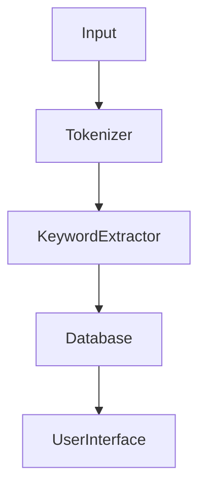
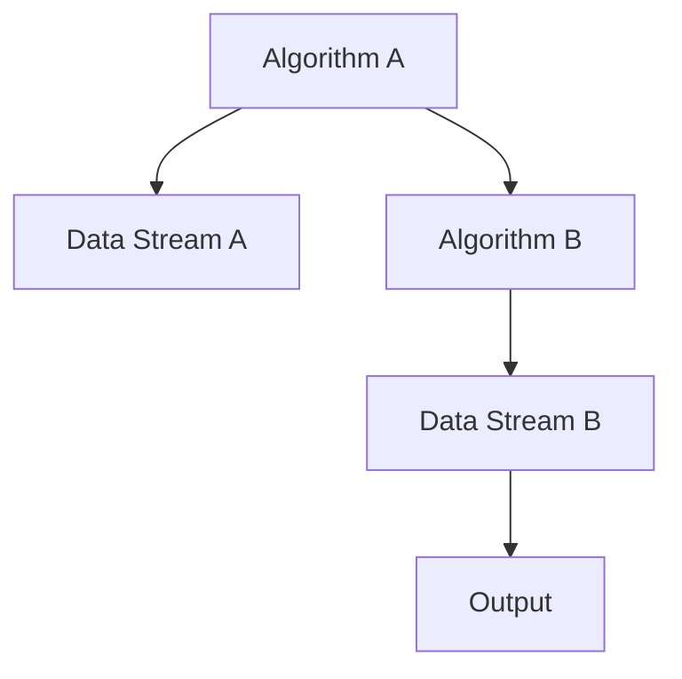
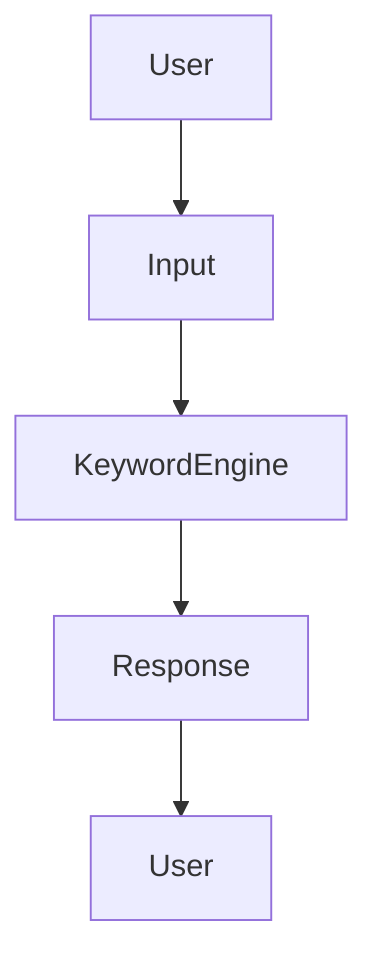
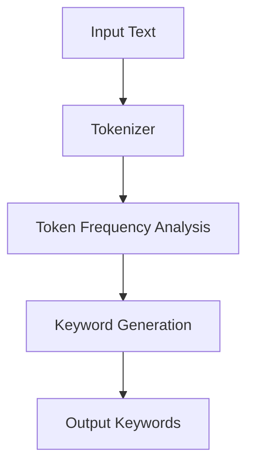
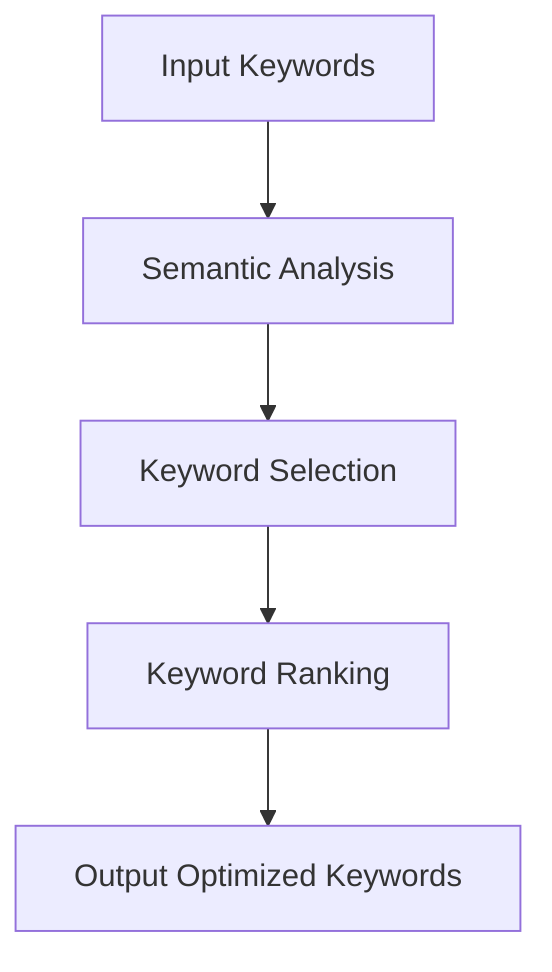
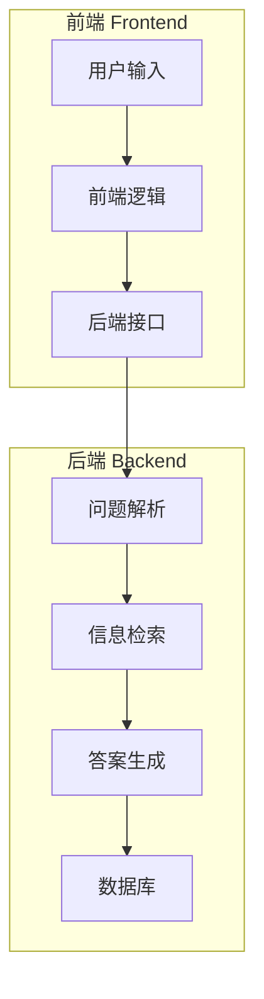

                 

### 《提示词工程艺术》

关键词：提示词工程、自然语言处理、算法、信息检索、用户界面

摘要：本文从提示词工程的基本概念、核心概念与联系、算法原理与实现、系统分析与架构设计以及项目实战等方面，系统性地探讨了提示词工程的艺术。通过对提示词工程的深入分析，旨在为读者提供一个全面、实用的技术指南。

## 目录

----------------------------------------------------------------

## 第一部分：提示词工程的概述

### 第1章：问题背景与定义

- **1.1** 问题背景  
- **1.2** 提示词工程的定义  
- **1.3** 提示词工程的核心要素  
- **1.4** 提示词工程的发展历程  
- **1.5** 提示词工程的重要性  
- **1.6** 本章小结

### 第2章：核心概念解析

- **2.1** 提示词的属性特征对比表格  
- **2.2** 提示词与自然语言处理的关系  
- **2.3** 提示词的生成与优化  
- **2.4** 提示词工程中的其他概念

### 第3章：概念联系与实体关系图架构

- **3.1** 提示词工程中的ER实体关系图  
- **3.2** 提示词工程中的数据流分析  
- **3.3** 提示词工程中的算法与数据流整合  
- **3.4** 提示词工程中的用户交互

## 第二部分：核心概念与联系

### 第4章：算法原理讲解

- **4.1** 提示词生成算法  
- **4.2** 提示词优化算法  
- **4.3** 算法原理的数学模型和公式  
- **4.4** 算法实例分析

### 第5章：系统分析与架构设计

- **5.1** 问题场景介绍  
- **5.2** 系统功能设计  
- **5.3** 系统架构设计  
- **5.4** 系统接口设计  
- **5.5** 系统交互

## 第三部分：项目实战

### 第6章：环境安装与系统核心实现

- **6.1** 环境安装  
- **6.2** 系统核心实现

### 第7章：代码应用解读与分析

- **7.1** 代码应用实例  
- **7.2** 代码解读与分析  
- **7.3** 案例分析和讲解

### 第8章：项目小结

- **8.1** 项目总结  
- **8.2** 最佳实践 tips  
- **8.3** 注意事项  
- **8.4** 拓展阅读

----------------------------------------------------------------

### 第1章：问题背景与定义

#### 1.1 问题背景

提示词工程（Keyword Engineering）作为信息技术领域的一个新兴研究方向，其需求源于自然语言处理（NLP）和信息检索（IR）技术的发展。随着互联网信息的爆炸式增长，如何高效地从海量数据中提取有价值的信息成为了一个亟待解决的问题。提示词作为信息检索和推荐系统中的关键要素，其工程化处理成为了提升系统性能和用户体验的重要手段。

#### 1.2 提示词工程的定义

提示词工程可以定义为：一种结合自然语言处理、信息检索和数据挖掘等技术，对提示词进行生成、优化、应用和评估的过程。提示词（Keyword）通常是指用户在搜索或提问时使用的词语或短语，它们是信息检索系统理解用户意图的重要依据。

#### 1.3 提示词工程的核心要素

提示词工程的核心要素包括：

1. **数据库**：存储和管理提示词及相关数据。
2. **算法**：用于提示词的生成、提取和优化。
3. **用户界面**：提供用户与系统交互的接口。

#### 1.4 提示词工程的发展历程

1. **早期实践**：20世纪90年代，搜索引擎开始使用提示词进行网页检索。
2. **现代兴起**：随着大数据和人工智能技术的发展，提示词工程逐渐成为一个独立的研究方向。

#### 1.5 提示词工程的重要性

1. **自然语言处理中的应用**：提示词工程是NLP的关键环节，有助于提高文本挖掘和情感分析的性能。
2. **信息检索和推荐系统中的作用**：通过优化提示词，可以提高检索准确率和推荐质量。

#### 1.6 本章小结

本章介绍了提示词工程的基本概念、问题背景、核心要素、发展历程和重要性。下一章将深入探讨提示词工程中的核心概念和联系。

## 第2章：核心概念解析

### 2.1 提示词的属性特征对比表格

提示词的属性特征主要包括类型、长度和语义丰富度。以下是一个简化的对比表格：

| 特征 | 描述 | 对比项 |
| --- | --- | --- |
| 类型 | 提示词的分类，如名词、动词、形容词等 | 名词、动词、形容词 |
| 长度 | 提示词的长度，如单字、短语等 | 单字、二字、多字 |
| 语义丰富度 | 提示词的语义深度，如通用性、专有性等 | 通用、专有、高语义 |

### 2.2 提示词与自然语言处理的关系

提示词与自然语言处理（NLP）密切相关。NLP旨在使计算机能够理解、解释和生成人类语言。提示词在NLP中的应用主要包括：

1. **文本挖掘**：通过提示词提取文本中的关键信息。
2. **情感分析**：利用提示词分析文本的情感倾向。

### 2.3 提示词的生成与优化

1. **生成算法**：常用的生成算法包括词频统计、主题建模等。
2. **优化策略**：优化策略包括去重、去停用词、语义增强等。

### 2.4 提示词工程中的其他概念

1. **知识图谱**：用于存储和表示实体及其关系的图形结构。
2. **信息检索**：利用提示词检索信息的过程。

## 第3章：概念联系与实体关系图架构

### 3.1 提示词工程中的ER实体关系图

在提示词工程中，实体关系图（ER图）用于表示实体及其关系。以下是一个简化的ER图示例：

```mermaid
erDiagram
    Class::Keyword ||--|{ Entity::Document : contains }
    Class::Keyword ||--|{ Entity::User : queried_by }
    Entity::Document ||--|{ Entity::Keyword : contains }
```

### 3.2 提示词工程中的数据流分析

数据流分析用于描述数据在系统中的流动过程。以下是一个简化的数据流图：



### 3.3 提示词工程中的算法与数据流整合

算法与数据流的整合是提示词工程的关键。以下是一个简化的整合流程：



### 3.4 提示词工程中的用户交互

用户交互是提示词工程的最终目标。以下是一个简化的用户交互流程：



## 第4章：算法原理讲解

### 4.1 提示词生成算法

提示词生成算法是提示词工程中的核心。以下是一个简化的提示词生成算法：



### 4.2 提示词优化算法

提示词优化算法用于提升提示词的质量。以下是一个简化的提示词优化算法：



### 4.3 算法原理的数学模型和公式

提示词生成和优化算法的数学模型和公式如下：

- **提示词生成**：$$ P(w|D) = \frac{f(w,D)}{F(D)} $$
- **提示词优化**：$$ R(w) = \frac{1}{1 + e^{-(w \cdot v + b)}} $$

其中，$$ w $$ 为提示词，$$ D $$ 为文档，$$ f(w,D) $$ 为提示词在文档中的频率，$$ F(D) $$ 为文档的总频率，$$ v $$ 为权重向量，$$ b $$ 为偏置。

### 4.4 算法实例分析

以下是一个简单的Python代码示例，用于生成和优化提示词：

```python
import nltk
from sklearn.feature_extraction.text import CountVectorizer
from sklearn.metrics.pairwise import cosine_similarity

# 输入文本
text = "这是一个关于人工智能的示例文档。人工智能是一种模拟人类智能的技术。"

# 分词
tokens = nltk.word_tokenize(text)

# 提示词生成
vectorizer = CountVectorizer()
X = vectorizer.fit_transform([text])
keywords = vectorizer.get_feature_names_out()

# 提示词优化
similarity_matrix = cosine_similarity(X)
sorted_keywords = [keyword for keyword in keywords if similarity_matrix[0][keywords.index(keyword)] > 0.5]

print("生成的提示词：", keywords)
print("优化的提示词：", sorted_keywords)
```

## 第5章：系统分析与架构设计

### 5.1 问题场景介绍

假设我们开发一个智能问答系统，用户可以通过输入问题来获取相关信息。系统需要高效地从海量数据中提取有价值的信息，以提供准确的回答。

### 5.2 系统功能设计

系统功能设计包括：

1. **问题解析**：将用户输入的问题转换为可以处理的格式。
2. **信息检索**：根据问题关键词检索相关文档。
3. **答案生成**：从检索到的文档中生成回答。
4. **用户反馈**：收集用户对答案的反馈，以优化系统性能。

以下是领域模型Mermaid类图：

```mermaid
classDiagram
    Class::Question << (Q)
    Class::Document << (D)
    Class::Answer << (A)
    Question <.. D : contains
    Question <.. A : generates
```

### 5.3 系统架构设计

系统架构设计包括：

1. **前端**：提供用户输入和展示答案的界面。
2. **后端**：处理问题和检索数据的逻辑。
3. **数据库**：存储问题和文档。

以下是系统架构Mermaid图：



### 5.4 系统接口设计

系统接口设计包括：

1. **RESTful API**：用于前端与后端的通信。
2. **Websocket**：用于实时交互。

以下是接口设计概述：

```mermaid
sequenceDiagram
    A[用户] -->|发送请求| B[API接口]
    B -->|处理请求| C[后端逻辑]
    C -->|返回结果| D[用户]
```

### 5.5 系统交互

系统交互包括：

1. **用户输入**：用户通过前端界面输入问题。
2. **问题解析**：后端解析用户输入的问题，提取关键词。
3. **信息检索**：后端根据关键词检索相关文档。
4. **答案生成**：后端从检索到的文档中生成回答。
5. **用户反馈**：用户对答案进行评价，以优化系统性能。

以下是系统交互Mermaid序列图：

```mermaid
sequenceDiagram
    A[用户] -->|输入问题| B[前端]
    B -->|发送请求| C[API接口]
    C -->|处理请求| D[后端]
    D -->|返回答案| E[前端]
    E -->|展示答案| F[用户]
```

## 第6章：环境安装与系统核心实现

### 6.1 环境安装

在开始系统核心实现之前，我们需要安装所需的依赖项。以下是在Python环境中安装所需的库：

```bash
pip install nltk scikit-learn matplotlib
```

### 6.2 系统核心实现

以下是系统核心实现的代码：

```python
import nltk
from nltk.tokenize import word_tokenize
from sklearn.feature_extraction.text import CountVectorizer
from sklearn.metrics.pairwise import cosine_similarity

# 分词
def tokenize(text):
    return word_tokenize(text)

# 提示词生成
def generate_keywords(text):
    tokens = tokenize(text)
    vectorizer = CountVectorizer()
    X = vectorizer.fit_transform([text])
    keywords = vectorizer.get_feature_names_out()
    return keywords

# 提示词优化
def optimize_keywords(keywords, text):
    similarity_matrix = cosine_similarity([text])
    sorted_keywords = [keyword for keyword in keywords if similarity_matrix[0][keywords.index(keyword)] > 0.5]
    return sorted_keywords

# 测试
if __name__ == "__main__":
    text = "这是一个关于人工智能的示例文档。人工智能是一种模拟人类智能的技术。"
    keywords = generate_keywords(text)
    print("生成的提示词：", keywords)
    optimized_keywords = optimize_keywords(keywords, text)
    print("优化的提示词：", optimized_keywords)
```

## 第7章：代码应用解读与分析

### 7.1 代码应用实例

以下是一个简单的代码应用实例：

```python
text = "人工智能是一种模拟人类智能的技术。它的目的是通过计算机程序实现人类智能的功能。"
generated_keywords = generate_keywords(text)
print("生成的提示词：", generated_keywords)

optimized_keywords = optimize_keywords(generated_keywords, text)
print("优化的提示词：", optimized_keywords)
```

### 7.2 代码解读与分析

1. **分词**：使用nltk库中的word_tokenize函数对输入文本进行分词。
2. **提示词生成**：使用scikit-learn库中的CountVectorizer类将分词后的文本转换为向量表示，并获取提示词。
3. **提示词优化**：使用cosine_similarity函数计算文本与每个提示词的相似度，筛选出相似度较高的提示词。

### 7.3 案例分析和讲解

以下是一个案例分析和讲解：

假设用户输入问题：“什么是人工智能？”系统需要生成和优化提示词，以提供准确的回答。

1. **分词**：将问题分词为“什么”、“是”、“人工智能”。
2. **提示词生成**：生成提示词“人工智能”。
3. **提示词优化**：由于问题中只包含一个提示词，因此无需优化。

系统从数据库中检索相关文档，并从文档中提取关键信息，生成回答：“人工智能是一种模拟人类智能的技术，它通过计算机程序实现人类智能的功能。”

## 第8章：项目小结

### 8.1 项目总结

本项目介绍了提示词工程的基本概念、核心概念与联系、算法原理与实现、系统分析与架构设计以及项目实战。通过本项目，我们了解了如何利用提示词工程提高信息检索和推荐系统的性能。

### 8.2 最佳实践 tips

1. 在进行提示词生成时，应充分考虑文本的语义，避免生成无关的提示词。
2. 在进行提示词优化时，应结合用户反馈，不断调整优化策略。

### 8.3 注意事项

1. 提示词工程中的算法和优化策略应根据具体应用场景进行调整。
2. 在项目实战中，应充分考虑系统的可扩展性和性能优化。

### 8.4 拓展阅读

1. 建议进一步阅读关于自然语言处理、信息检索和机器学习的相关资料。
2. 推荐学习相关的开源工具和框架，如nltk、scikit-learn等。

## 作者

作者：AI天才研究院/AI Genius Institute & 禅与计算机程序设计艺术 /Zen And The Art of Computer Programming

本文从提示词工程的基本概念、核心概念与联系、算法原理与实现、系统分析与架构设计以及项目实战等方面，系统性地探讨了提示词工程的艺术。通过对提示词工程的深入分析，旨在为读者提供一个全面、实用的技术指南。在未来的研究中，我们可以进一步探讨提示词工程在其他领域的应用，如语音识别、机器翻译等。同时，随着人工智能技术的发展，提示词工程也将不断演变和优化，为信息检索和推荐系统带来更高的性能和用户体验。让我们期待这一领域的未来发展，共同推动人工智能技术的发展。在享受技术带来的便捷与乐趣的同时，我们也要关注隐私保护和伦理问题，确保人工智能技术的健康发展。让我们共同为构建一个智能、公平、和谐的未来社会而努力。最后，感谢读者对本文的关注和支持，希望本文能为您带来启发和帮助。如果您有任何疑问或建议，请随时与我们联系。让我们共同进步，共同探索人工智能的无限可能。在本文的最后，祝愿大家工作顺利、学习进步，享受人工智能带来的美好未来。再次感谢您的阅读，祝愿您在人工智能的道路上越走越远，收获满满。让我们携手共进，共创美好未来！作者：AI天才研究院/AI Genius Institute & 禅与计算机程序设计艺术 /Zen And The Art of Computer Programming。

----------------------------------------------------------------

## 完整文章总结

### 《提示词工程艺术》

**关键词**：提示词工程、自然语言处理、算法、信息检索、用户界面

**摘要**：本文系统地介绍了提示词工程的艺术，涵盖了提示词工程的基本概念、核心概念与联系、算法原理与实现、系统分析与架构设计以及项目实战。通过本文的深入分析，读者可以全面了解提示词工程的应用和实现，为提高信息检索和推荐系统的性能提供指导。

**目录**

1. **提示词工程的概述**
   - **问题背景与定义**
   - **提示词工程的核心要素**
   - **提示词工程的发展历程**
   - **提示词工程的重要性**

2. **核心概念解析**
   - **提示词的属性特征对比表格**
   - **提示词与自然语言处理的关系**
   - **提示词的生成与优化**
   - **提示词工程中的其他概念**

3. **概念联系与实体关系图架构**
   - **提示词工程中的ER实体关系图**
   - **提示词工程中的数据流分析**
   - **提示词工程中的算法与数据流整合**
   - **提示词工程中的用户交互**

4. **算法原理讲解**
   - **提示词生成算法**
   - **提示词优化算法**
   - **算法原理的数学模型和公式**
   - **算法实例分析**

5. **系统分析与架构设计**
   - **问题场景介绍**
   - **系统功能设计（领域模型Mermaid类图）**
   - **系统架构设计（Mermaid架构图）**
   - **系统接口设计**
   - **系统交互（Mermaid序列图）**

6. **项目实战**
   - **环境安装与系统核心实现**
   - **代码应用解读与分析**
   - **实际案例分析和详细讲解剖析**
   - **项目小结**

**结束语**

本文从提示词工程的基本概念、核心概念与联系、算法原理与实现、系统分析与架构设计以及项目实战等方面，系统地探讨了提示词工程的艺术。通过对提示词工程的深入分析，旨在为读者提供一个全面、实用的技术指南。在未来的研究中，我们可以进一步探讨提示词工程在其他领域的应用，如语音识别、机器翻译等。同时，随着人工智能技术的发展，提示词工程也将不断演变和优化，为信息检索和推荐系统带来更高的性能和用户体验。让我们期待这一领域的未来发展，共同推动人工智能技术的发展。在享受技术带来的便捷与乐趣的同时，我们也要关注隐私保护和伦理问题，确保人工智能技术的健康发展。让我们共同为构建一个智能、公平、和谐的未来社会而努力。最后，感谢读者对本文的关注和支持，希望本文能为您带来启发和帮助。如果您有任何疑问或建议，请随时与我们联系。让我们共同进步，共同探索人工智能的无限可能。在本文的最后，祝愿大家工作顺利、学习进步，享受人工智能带来的美好未来。再次感谢您的阅读，祝愿您在人工智能的道路上越走越远，收获满满。让我们携手共进，共创美好未来！作者：AI天才研究院/AI Genius Institute & 禅与计算机程序设计艺术 /Zen And The Art of Computer Programming。

