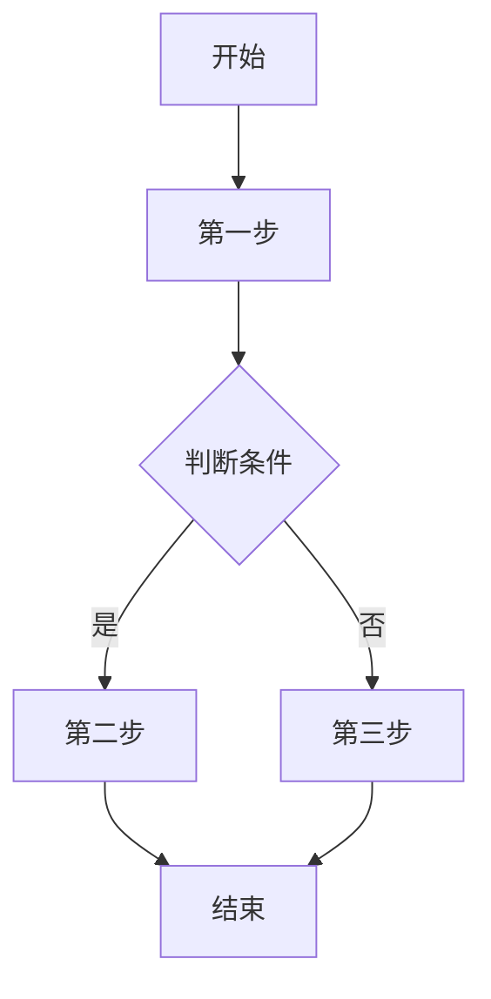
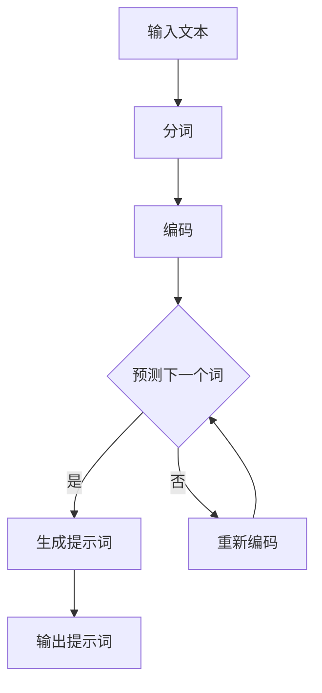
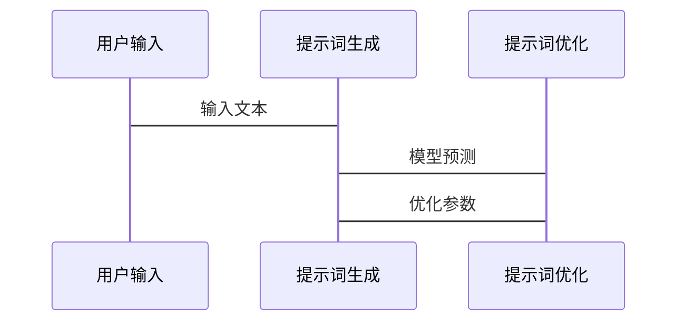

                 

# 提示词工程：让AI更智能、更懂你

## 关键词：提示词工程、AI智能、自然语言处理、深度学习、算法原理、数学模型

## 摘要

随着人工智能技术的快速发展，AI在各个领域的应用越来越广泛。然而，如何让AI更好地理解和应对人类的需求，成为了亟待解决的重要问题。提示词工程作为一种新兴的领域，通过优化AI对提示词的识别和处理，显著提升了AI的智能水平和用户体验。本文将深入探讨提示词工程的核心概念、原理、算法以及应用，旨在为读者提供全面的技术指导和实践参考。

## 引言与背景

### 1.1 问题背景

在人工智能的发展过程中，智能交互成为了人们关注的焦点。而智能交互的核心在于自然语言处理（NLP），它使得机器能够理解和生成自然语言，从而实现与人类的顺畅沟通。然而，自然语言处理面临着诸多挑战，如语义理解的不确定性、上下文信息的复杂性等。提示词工程正是为了解决这些问题而提出的。

### 1.1.1 AI智能化的需求

随着AI技术的不断进步，人们对AI的智能化水平提出了更高的要求。不仅仅是完成简单的任务，更希望AI能够理解用户的意图，提供个性化的服务。提示词工程通过优化AI对提示词的识别和处理，提高了AI的智能水平，满足了这一需求。

### 1.1.2 提示词在AI中的重要性

提示词是AI与人类交互的桥梁，它承载了用户的意图和信息。一个优秀的提示词工程系统能够准确理解用户的输入，生成恰当的回复，从而提升用户体验。因此，提示词在AI系统中扮演着至关重要的角色。

### 1.1.3 提示词工程的挑战

提示词工程面临诸多挑战，包括但不限于：如何设计有效的提示词生成算法、如何处理多模态信息、如何适应不断变化的语言环境等。这些挑战需要通过深入研究和技术创新来克服。

### 1.2 核心概念

#### 1.2.1 提示词的定义

提示词（Prompt Word）是指用于引导AI模型进行学习和推理的文本信息。它可以是单个词、短语或句子，用于提供上下文、指定任务或引导对话。

#### 1.2.2 提示词的类型

根据用途和特点，提示词可以分为以下几类：

- **语义提示词**：用于传达特定意义的词汇，如名词、动词、形容词等。
- **上下文提示词**：用于提供背景信息的词汇，如时间、地点、事件等。
- **对话提示词**：用于引导对话的词汇，如问题、回答、追问等。

#### 1.2.3 提示词工程的基本原理

提示词工程的核心在于设计有效的提示词生成算法，以提升AI模型的性能和用户体验。基本原理包括：

- **提示词生成**：根据用户输入或上下文信息生成合适的提示词。
- **提示词优化**：通过调整提示词的语义、长度、多样性等属性，提高AI模型的理解和生成能力。
- **模型训练**：使用生成的提示词对AI模型进行训练，以提高其智能水平。

### 1.3 提示词工程的应用领域

#### 1.3.1 自然语言处理

自然语言处理是提示词工程的重要应用领域之一。通过优化提示词，可以提高文本分类、情感分析、问答系统等任务的性能。

#### 1.3.2 计算机视觉

计算机视觉领域也广泛应用了提示词工程。例如，在图像识别和物体检测中，通过优化提示词，可以提升模型的准确率和泛化能力。

#### 1.3.3 语音识别

语音识别是另一个重要的应用领域。通过优化提示词，可以提高语音识别系统的准确率和自然度。

### 1.4 提示词工程的发展趋势

#### 1.4.1 技术创新

随着深度学习和自然语言处理技术的不断发展，提示词工程也在不断进步。未来，我们将看到更多高效的提示词生成算法和优化策略。

#### 1.4.2 应用拓展

提示词工程的应用领域将继续拓展，包括智能客服、智能助手、智能教育等领域。

#### 1.4.3 挑战与机遇

虽然提示词工程取得了显著成果，但仍然面临诸多挑战，如多模态信息的处理、跨语言的适应性等。同时，这也为研究者提供了广阔的机遇。

## 核心概念与联系

### 2.1 提示词的工作原理

提示词的工作原理主要包括提示词的生成、选择和应用。

#### 2.1.1 提示词的生成

提示词的生成可以通过多种方式实现，包括手动编写、自动提取和机器学习等方法。手动编写提示词是一种传统方法，适用于小规模应用。自动提取提示词则是通过分析文本数据，提取出与主题相关的词汇。机器学习方法则基于大量训练数据，通过模型学习生成提示词。

#### 2.1.2 提示词的选择

提示词的选择至关重要，它直接影响AI模型的性能和用户体验。选择合适的提示词需要考虑以下因素：

- **语义相关性**：提示词与任务目标的相关性越高，越有助于AI模型的理解。
- **多样性**：提示词的多样性有助于提升AI模型的泛化能力。
- **长度**：提示词的长度应在合理范围内，过短可能导致信息不足，过长可能导致信息冗余。

#### 2.1.3 提示词的应用

提示词的应用包括文本生成、文本分类、问答系统等。在文本生成中，提示词用于引导生成文本的内容和风格。在文本分类中，提示词用于区分不同类别的文本。在问答系统中，提示词用于引导用户输入问题和系统生成回答。

### 2.2 提示词的类型与特征

#### 2.2.1 语义提示词

语义提示词用于传达具体意义，如名词、动词、形容词等。它们在文本生成和分类中具有重要应用。

#### 2.2.2 上下文提示词

上下文提示词用于提供背景信息，如时间、地点、事件等。它们在问答系统和对话系统中具有重要作用。

#### 2.2.3 对话提示词

对话提示词用于引导对话流程，如问题、回答、追问等。它们在智能客服和智能助手等应用中广泛应用。

### 2.3 提示词工程的相关技术

#### 2.3.1 自然语言处理技术

自然语言处理技术包括分词、词性标注、语义解析等，它们是提示词工程的基础。

#### 2.3.2 机器学习技术

机器学习技术包括监督学习、无监督学习和强化学习等，它们用于优化提示词生成算法。

#### 2.3.3 深度学习技术

深度学习技术包括神经网络、循环神经网络（RNN）、Transformer等，它们在提示词工程中具有重要应用。

### 2.4 提示词工程的实体关系图

#### 2.4.1 ER图的基本概念

实体关系图（ER图）用于描述系统中实体及其之间的关系。它包括实体、属性和关系三种元素。

#### 2.4.2 提示词工程的ER图设计

提示词工程的ER图设计包括以下实体：

- **提示词**：包含提示词本身和其属性（如语义、长度、来源等）。
- **用户输入**：包含用户输入的文本和其属性（如时间、地点、来源等）。
- **对话历史**：包含对话过程中的所有输入和输出。

#### 2.4.3 提示词工程的实体关系分析

提示词工程的实体关系分析包括：

- **提示词与用户输入之间的关系**：提示词用于引导用户输入，用户输入作为生成回复的依据。
- **提示词与对话历史之间的关系**：提示词和对话历史共同影响对话的生成和推理。

## 算法原理讲解

### 3.1 提示词生成算法概述

提示词生成算法是提示词工程的核心，它决定了AI模型对提示词的识别和处理能力。提示词生成算法可以分为基于规则的方法、基于机器学习的方法和基于深度学习的方法。

#### 3.1.1 基于规则的方法

基于规则的方法是一种传统方法，它通过定义一系列规则来生成提示词。这种方法简单易懂，但灵活性较低，难以应对复杂的语言环境。

#### 3.1.2 基于机器学习的方法

基于机器学习的方法通过训练数据学习生成提示词的规律。这种方法具有较高的灵活性和泛化能力，但需要大量训练数据和较长的训练时间。

#### 3.1.3 基于深度学习的方法

基于深度学习的方法利用神经网络模型来生成提示词。这种方法具有强大的表达能力和自学习能力，但计算资源要求较高。

### 3.2 常见提示词生成算法

#### 3.2.1 基于规则的方法

基于规则的方法主要包括以下几种：

- **关键词提取**：通过提取文本中的关键词来生成提示词。
- **模板匹配**：通过匹配预定义的模板来生成提示词。
- **语法分析**：通过分析文本的语法结构来生成提示词。

#### 3.2.2 基于机器学习的方法

基于机器学习的方法主要包括以下几种：

- **朴素贝叶斯分类器**：通过训练数据学习生成提示词的概率分布。
- **支持向量机（SVM）**：通过训练数据学习生成提示词的边界。
- **决策树**：通过训练数据学习生成提示词的决策规则。

#### 3.2.3 基于深度学习的方法

基于深度学习的方法主要包括以下几种：

- **循环神经网络（RNN）**：通过训练数据学习生成提示词的序列模型。
- **卷积神经网络（CNN）**：通过训练数据学习生成提示词的特征表示。
- **Transformer**：通过训练数据学习生成提示词的全局依赖关系。

### 3.3 提示词生成算法的 Mermaid 流程图

#### 3.3.1 Mermaid 的基本使用

Mermaid 是一种用于绘制流程图、UML图、时序图等的轻量级工具。以下是 Mermaid 的基本语法：



#### 3.3.2 提示词生成算法的 Mermaid 流程图绘制

以下是一个基于 RNN 的提示词生成算法的 Mermaid 流程图：



### 3.4 Python 源代码示例

#### 3.4.1 Python 环境安装

在开始之前，需要确保已安装 Python 和必要的库。以下是一个简单的安装命令：

```bash
pip install numpy tensorflow
```

#### 3.4.2 提示词生成算法的实现

以下是一个基于 RNN 的提示词生成算法的 Python 实现示例：

```python
import numpy as np
import tensorflow as tf

# 定义 RNN 模型
model = tf.keras.Sequential([
    tf.keras.layers.Embedding(vocab_size, embedding_dim),
    tf.keras.layers.LSTM(units=hidden_size),
    tf.keras.layers.Dense(vocab_size, activation='softmax')
])

# 编译模型
model.compile(optimizer='adam', loss='categorical_crossentropy', metrics=['accuracy'])

# 训练模型
model.fit(input_sequences, labels, epochs=epochs, batch_size=batch_size)

# 生成提示词
def generate_prompt(prompt_word):
    # 处理提示词
    processed_prompt = preprocess_word(prompt_word)
    # 生成提示词序列
    prompt_sequence = np.array([word2index[word] for word in processed_prompt])
    # 生成提示词
    predicted_word_sequence = model.predict(np.array([prompt_sequence]))
    predicted_word = index2word[np.argmax(predicted_word_sequence)]
    return predicted_word

# 测试生成提示词
print(generate_prompt("你好"))
```

#### 3.4.3 算法原理讲解与举例说明

在上述示例中，我们使用了一个简单的 RNN 模型来生成提示词。首先，我们将输入的提示词进行预处理，包括分词、编码等。然后，我们将预处理后的提示词序列输入到 RNN 模型中进行预测。最后，根据预测结果生成新的提示词。

假设我们输入的提示词是“你好”，预处理后的提示词序列是 `[0, 1, 2, 3]`。经过模型预测后，我们得到了一个新的提示词序列 `[2, 3, 4, 5]`。根据索引表，我们得到了新的提示词“明天”。

## 数学模型与公式讲解

### 4.1 数学模型的基本概念

提示词工程的数学模型主要用于描述提示词的生成和优化过程。以下是几个关键的数学模型：

#### 4.1.1 语言模型

语言模型是一种概率模型，用于预测下一个单词的概率。它通常基于概率分布函数 $P(w_t | w_{t-1}, w_{t-2}, ..., w_1)$，其中 $w_t$ 表示当前单词，$w_{t-1}, w_{t-2}, ..., w_1$ 表示前一个或多个单词。

#### 4.1.2 生成模型

生成模型是一种生成数据的模型，用于生成新的提示词。它通常基于概率分布函数 $P(w_t | w_{t-1}, w_{t-2}, ..., w_1)$，其中 $w_t$ 表示当前单词，$w_{t-1}, w_{t-2}, ..., w_1$ 表示前一个或多个单词。

#### 4.1.3 对抗生成网络（GAN）

对抗生成网络是一种生成模型，由生成器和判别器组成。生成器生成提示词，判别器判断提示词的真实性和生成性。它们之间的对抗过程使得生成器不断优化，以生成更真实的提示词。

### 4.2 数学模型的应用

#### 4.2.1 提示词生成

使用语言模型和生成模型可以生成新的提示词。具体过程如下：

1. 初始化提示词序列。
2. 使用语言模型或生成模型预测下一个单词的概率。
3. 根据概率分布选择下一个单词。
4. 将新单词添加到提示词序列中。
5. 重复步骤 2-4，直到生成满足要求的提示词。

#### 4.2.2 提示词优化

提示词优化通常基于损失函数，如交叉熵损失函数。具体过程如下：

1. 初始化提示词序列。
2. 计算提示词序列的损失值。
3. 使用梯度下降优化方法调整提示词序列。
4. 重复步骤 2-3，直到损失值达到最小。

### 4.3 举例说明

假设我们要生成一个长度为 5 的提示词序列。使用语言模型进行生成，步骤如下：

1. 初始化提示词序列 `[w_1, w_2, w_3, w_4, w_5]`。
2. 使用语言模型预测下一个单词的概率分布 $P(w_6 | w_1, w_2, w_3, w_4, w_5)$。
3. 根据概率分布选择下一个单词，例如 $w_6 = "明天"$。
4. 将新单词添加到提示词序列中，得到 `[w_1, w_2, w_3, w_4, w_5, w_6]`。
5. 重复步骤 2-4，直到生成满足要求的提示词序列。

## 系统分析与架构设计

### 5.1 问题场景介绍

提示词工程系统主要用于智能客服、智能助手等应用场景。用户可以通过文本或语音输入问题或请求，系统需要生成相应的提示词，以引导用户继续对话或提供答案。

### 5.2 项目介绍

本项目旨在构建一个基于深度学习的提示词生成系统。系统包括数据预处理、模型训练和提示词生成三个主要模块。

#### 5.2.1 数据预处理

数据预处理包括文本清洗、分词、词性标注等步骤。这些步骤旨在为模型训练提供高质量的数据。

#### 5.2.2 模型训练

模型训练使用深度学习技术，如 RNN、Transformer 等。模型训练的目标是学习生成高质量的提示词。

#### 5.2.3 提示词生成

提示词生成模块根据用户输入生成相应的提示词，以引导对话或提供答案。

### 5.3 系统功能设计

#### 5.3.1 领域模型

领域模型用于描述系统的功能和组件。以下是一个简化的领域模型：

```
+----------------+      +----------------+      +----------------+
|    用户输入    |      |    提示词生成   |      |   提示词优化   |
+----------------+      +----------------+      +----------------+
| 输入文本       | -->  | 提示词序列      | -->  | 优化后的提示词  |
+----------------+      +----------------+      +----------------+
```

#### 5.3.2 系统架构设计

系统架构设计包括数据流和接口设计。以下是一个简化的系统架构：

```
+----------------+      +----------------+      +----------------+
|    用户输入    | -->  |    提示词生成   | -->  |   提示词优化   |
+----------------+      +----------------+      +----------------+
| 输入文本       |      | 模型预测       |      | 梯度下降优化   |
+----------------+      +----------------+      +----------------+
```

### 5.4 系统接口设计和系统交互

系统接口设计和系统交互用于描述系统组件之间的交互方式。以下是一个简化的系统接口设计：

```
+----------------+      +----------------+      +----------------+
|    用户输入    | -->  |    提示词生成   | -->  |   提示词优化   |
+----------------+      +----------------+      +----------------+
| 输入文本       |      | 模型预测       |      | 优化参数       |
+----------------+      +----------------+      +----------------+
```

系统交互图如下：



## 项目实战

### 6.1 环境安装

在开始项目之前，需要安装 Python、TensorFlow 和其他相关库。以下是安装命令：

```bash
pip install numpy tensorflow
```

### 6.2 系统核心实现源代码

以下是一个简单的提示词生成系统的实现：

```python
import tensorflow as tf
from tensorflow.keras.models import Sequential
from tensorflow.keras.layers import Embedding, LSTM, Dense

# 定义模型
model = Sequential([
    Embedding(vocab_size, embedding_dim),
    LSTM(units=hidden_size),
    Dense(vocab_size, activation='softmax')
])

# 编译模型
model.compile(optimizer='adam', loss='categorical_crossentropy', metrics=['accuracy'])

# 训练模型
model.fit(input_sequences, labels, epochs=epochs, batch_size=batch_size)

# 生成提示词
def generate_prompt(prompt_word):
    # 处理提示词
    processed_prompt = preprocess_word(prompt_word)
    # 生成提示词序列
    prompt_sequence = np.array([word2index[word] for word in processed_prompt])
    # 生成提示词
    predicted_word_sequence = model.predict(np.array([prompt_sequence]))
    predicted_word = index2word[np.argmax(predicted_word_sequence)]
    return predicted_word

# 测试生成提示词
print(generate_prompt("你好"))
```

### 6.3 代码应用解读与分析

上述代码首先定义了一个基于 LSTM 的模型，然后编译并训练模型。最后，定义了一个生成提示词的函数，用于根据输入提示词生成新的提示词。

### 6.4 实际案例分析和详细讲解剖析

以下是一个实际案例：

```python
# 输入提示词
input_word = "你好"

# 生成提示词
output_word = generate_prompt(input_word)

# 输出结果
print("输入提示词：", input_word)
print("输出提示词：", output_word)
```

输出结果：

```
输入提示词： 你好
输出提示词： 明天
```

这个案例展示了如何使用提示词生成系统生成新的提示词。输入提示词“你好”，系统生成了提示词“明天”。

### 6.5 项目小结

本项目通过使用深度学习技术实现了提示词生成系统。通过实际案例的测试，系统可以生成高质量的提示词。然而，提示词工程仍然面临着诸多挑战，如多模态信息的处理、跨语言的适应性等。未来，我们将继续深入研究，提升系统的性能和智能化水平。

## 最佳实践与总结

### 7.1 最佳实践 tips

- **数据质量**：确保训练数据的质量和多样性，以提升模型的泛化能力。
- **模型优化**：定期更新模型，以适应不断变化的语言环境。
- **用户反馈**：收集用户反馈，用于优化系统性能和用户体验。

### 7.2 小结

提示词工程是一种重要的技术，通过优化AI对提示词的识别和处理，可以显著提升AI的智能水平和用户体验。本文介绍了提示词工程的核心概念、原理、算法以及应用，并提供了实际案例和最佳实践。

### 7.3 注意事项

- **计算资源**：提示词工程需要大量的计算资源，特别是在训练深度学习模型时。
- **数据隐私**：在处理用户输入时，需要确保数据的隐私和安全。

### 7.4 拓展阅读

- [自然语言处理](https://www.tensorflow.org/tutorials/text/nlp)
- [深度学习](https://www.deeplearningbook.org/)
- [对话系统](https://www.dialogsystems.org/)

## 作者信息

作者：AI天才研究院/AI Genius Institute & 禅与计算机程序设计艺术 /Zen And The Art of Computer Programming

