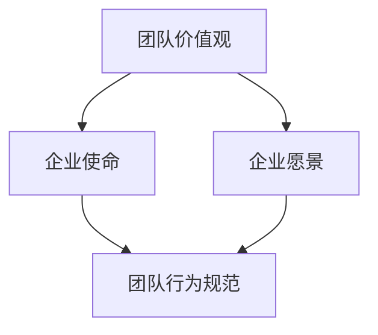
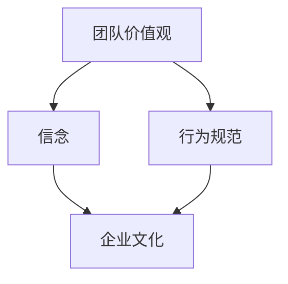
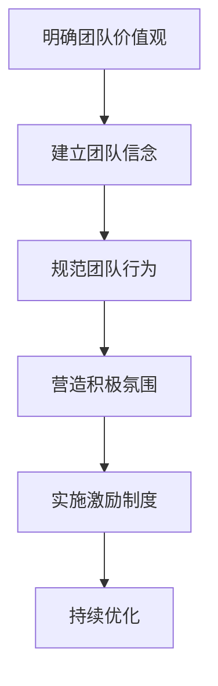
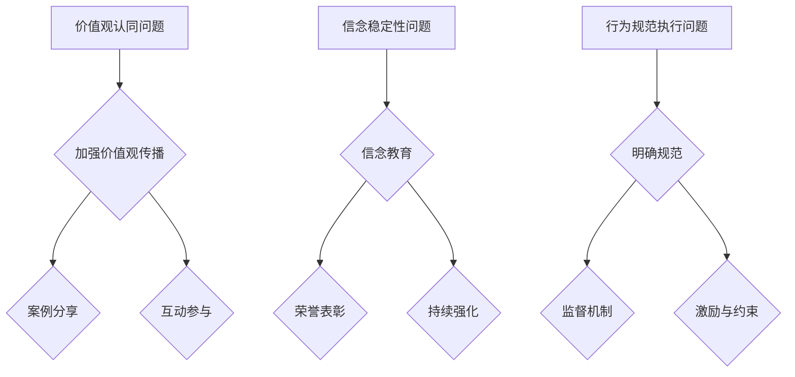
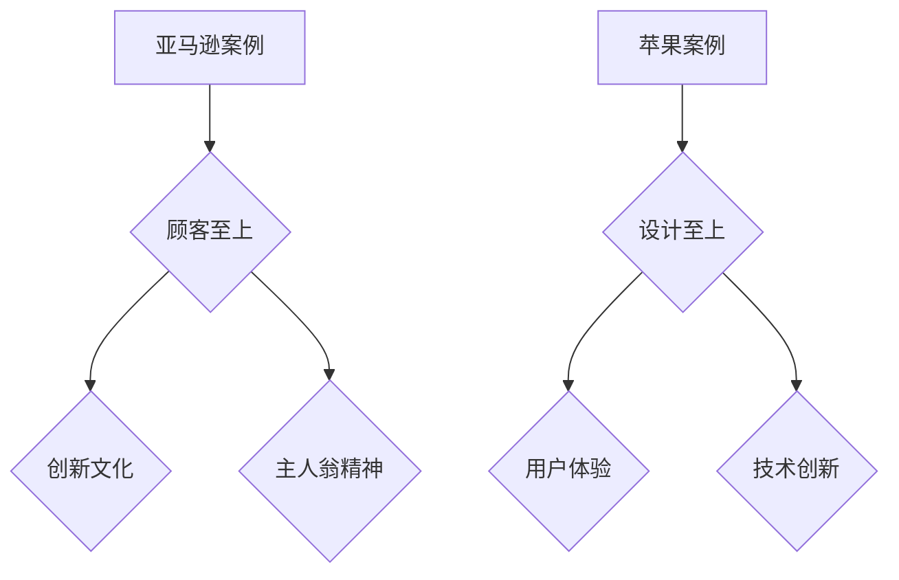

                 

# 团队文化：塑造独特的团队基因

## 关键词

团队文化、团队价值观、信念、行为规范、企业文化、人力资源管理

## 摘要

本文旨在探讨如何通过构建和优化团队文化，塑造独特的团队基因，从而提升企业竞争力。我们将从背景介绍、核心概念与联系、团队文化构建与优化方法、成功案例分享、最佳实践与总结五个部分展开，全面解析团队文化的核心要素和构建策略。

## 第一部分：背景介绍

### 1.1 问题背景

在当今社会，团队文化作为企业发展的核心动力，越来越受到重视。一个优秀的团队文化能够激发团队成员的创造力和凝聚力，提高工作效率和业绩。然而，如何塑造独特的团队基因，打造一个积极向上、富有活力的团队文化，仍然是许多企业管理者面临的挑战。

### 1.2 问题描述

团队文化包括价值观、信念、行为规范等多方面的内容，如何有效地将团队文化融入企业日常运营，并在员工中形成共识，是当前企业管理中的一个重要课题。本文将结合实际案例，从理论到实践，全面探讨团队文化的构建与优化。

### 1.3 问题解决

本文将首先分析团队文化的核心概念，包括团队价值观、信念、行为规范等；其次，我们将探讨如何通过制度设计和企业文化活动，将团队文化融入企业日常运营；最后，我们将分享一些成功的团队文化建设案例，为读者提供可借鉴的经验。

### 1.4 边界与外延

团队文化的构建和优化涉及多个方面，包括企业文化、人力资源管理、组织行为学等。本文主要关注团队文化在企业管理中的应用和实践，为企业管理者提供参考。

### 1.5 概念结构与核心要素组成

团队文化主要包括以下核心要素：

1. **价值观**：团队的核心理念，指导团队成员的行为准则。
2. **信念**：团队成员共同追求的目标和信仰。
3. **行为规范**：团队成员在日常工作中的行为准则。
4. **企业文化**：团队文化的物质表现，如企业使命、愿景、企业口号等。
5. **人力资源管理**：通过招聘、培训、绩效考核等手段，将团队文化融入企业运营。

## 第二部分：核心概念与联系

### 2.1 团队文化核心概念解析

#### 2.1.1 团队价值观

团队价值观是团队文化的核心，是团队成员共同遵守的行为准则。它包括企业的使命、愿景、核心价值观等。

##### 2.1.1.1 团队价值观的定义

团队价值观是团队成员在长期合作过程中形成的共同信念和目标，是团队行为的指南针。

##### 2.1.1.2 团队价值观的属性特征对比表格

| 特征         | 团队价值观           | 企业使命           | 企业愿景           |
| ------------ | ------------------- | ----------------- | ----------------- |
| 定义         | 团队成员共同遵守的行为准则 | 企业存在的根本目的  | 企业未来发展的方向 |
| 形成过程     | 长期合作过程中形成    | 创立时即确立       | 根据企业发展调整   |
| 表现形式     | 企业文化、行为规范     | 企业使命陈述       | 企业愿景描述       |

#### 2.1.2 团队信念

团队信念是团队成员共同追求的目标和信仰，是团队文化的灵魂。

##### 2.1.2.1 团队信念的定义

团队信念是团队成员在共同奋斗过程中形成的坚定信仰，是团队前进的动力。

##### 2.1.2.2 团队信念的属性特征对比表格

| 特征         | 团队信念               | 团队目标               |
| ------------ | --------------------- | --------------------- |
| 定义         | 团队成员共同追求的目标和信仰 | 团队在特定时间内要实现的目标 |
| 形成过程     | 共同奋斗过程中形成     | 根据团队价值观和战略制定 |
| 表现形式     | 企业使命、愿景、团队口号 | 团队计划、项目目标     |

#### 2.1.3 团队行为规范

团队行为规范是团队成员在日常工作中的行为准则，是团队文化的重要体现。

##### 2.1.3.1 团队行为规范的定义

团队行为规范是团队成员在相互协作过程中形成的行为准则，是团队协作的保障。

##### 2.1.3.2 团队行为规范的属性特征对比表格

| 特征         | 团队行为规范         | 企业规章制度         |
| ------------ | ------------------- | ------------------- |
| 定义         | 团队成员在日常工作中的行为准则 | 企业内部的管理制度 |
| 形成过程     | 协作过程中形成       | 制定时即确立         |

## 第三部分：团队文化的构建与优化方法

### 3.1 制度设计

#### 3.1.1 招聘制度

招聘制度是团队文化构建的基础。企业在招聘过程中应注重候选人的价值观、信念和行为规范，确保新成员能够与团队文化相契合。

##### 3.1.1.1 招聘标准

- 价值观匹配：候选人应具备与团队价值观相符的品质和理念。
- 信念一致：候选人应具备团队信念，愿意为共同目标努力。
- 行为规范：候选人应具备良好的行为规范，能够遵守团队规章制度。

##### 3.1.1.2 招聘流程

- 初选：通过简历筛选和面试初步了解候选人的价值观、信念和行为规范。
- 细选：通过面试、心理测试等手段深入了解候选人的综合素质。
- 决定：综合考虑候选人的综合素质和团队文化契合度，作出最终录用决定。

#### 3.1.2 培训制度

培训制度是团队文化构建的重要手段。企业应定期开展各类培训活动，提高团队成员的价值观、信念和行为规范。

##### 3.1.2.1 培训内容

- 团队价值观培训：通过讲座、讨论等方式，让团队成员深入理解团队价值观。
- 信念培养：通过案例分享、团队活动等方式，增强团队成员的信念。
- 行为规范培训：通过规章制度学习、模拟演练等方式，确保团队成员遵守行为规范。

##### 3.1.2.2 培训形式

- 内部培训：邀请企业内部专家进行培训，分享团队文化建设和实践经验。
- 外部培训：邀请外部专业培训机构进行培训，提高团队成员的专业素养。
- 在职培训：通过日常工作中的指导和辅导，培养团队成员的团队文化意识。

#### 3.1.3 绩效考核

绩效考核是团队文化构建的重要保障。企业应建立科学合理的绩效考核体系，将团队文化融入考核指标。

##### 3.1.3.1 考核指标

- 价值观表现：考核团队成员在价值观方面的表现，如诚信、敬业、团队协作等。
- 信念执行：考核团队成员在信念方面的执行情况，如目标达成、任务完成等。
- 行为规范：考核团队成员在行为规范方面的遵守情况，如规章制度、职业道德等。

##### 3.1.3.2 考核方式

- 定量考核：通过数据统计和分析，客观评价团队成员的绩效表现。
- 定性考核：通过面试、调查问卷等方式，全面了解团队成员的工作表现。
- 综合考核：综合考虑定量和定性考核结果，给出全面客观的评价。

### 3.2 企业文化活动

#### 3.2.1 文化活动形式

- 主题活动：围绕企业价值观、信念和行为规范开展各类主题活动，如团队拓展、公益活动等。
- 定期活动：定期举办团队聚会、团队建设活动等，增强团队成员的团队意识。
- 知识分享：通过讲座、研讨会等形式，促进团队成员的知识交流和学习。

#### 3.2.2 活动目标

- 增强团队凝聚力：通过各类活动，增强团队成员之间的情感联系，提高团队凝聚力。
- 提升团队士气：通过成功案例分享、荣誉表彰等活动，激发团队成员的积极性，提升团队士气。
- 传承企业精神：通过主题活动，将企业价值观、信念和行为规范融入团队文化，传承企业精神。

### 3.3 激励与激励制度

#### 3.3.1 激励方式

- 薪酬激励：通过提高薪酬水平，激发团队成员的工作积极性。
- 职业发展：提供良好的职业发展机会，让团队成员看到发展前景。
- 表扬奖励：对表现优秀的团队成员进行表扬奖励，激发团队竞争氛围。

#### 3.3.2 激励制度

- 设立绩效奖金制度：根据团队成员的绩效表现，发放相应的绩效奖金。
- 设立晋升制度：根据团队成员的工作表现和能力，提供晋升机会。
- 设立荣誉制度：对在团队文化建设中表现突出的团队成员进行表彰和奖励。

## 第四部分：成功案例分享

### 4.1 案例一：华为公司的团队文化建设

#### 4.1.1 案例背景

华为公司作为全球领先的电信设备供应商，其团队文化建设在业界具有较高声誉。华为公司始终坚持“客户为中心”的价值观，将客户满意度作为团队工作的核心目标。

#### 4.1.2 案例特点

- **价值观明确**：华为公司明确提出了“客户为中心”的价值观，并在公司内部广泛传播。
- **信念坚定**：华为公司坚信只有持续创新，才能在竞争激烈的市场中立于不败之地。
- **行为规范严格**：华为公司对团队成员的行为规范有明确的要求，如诚信、敬业、团队合作等。

#### 4.1.3 案例成效

- **团队凝聚力强**：华为公司团队凝聚力强，员工对公司的认同感和归属感较高。
- **创新能力强**：华为公司持续进行技术创新，推出了一系列具有竞争力的产品。
- **客户满意度高**：华为公司客户满意度高，为公司赢得了广泛的客户基础。

### 4.2 案例二：谷歌公司的团队文化建设

#### 4.2.1 案例背景

谷歌公司作为全球知名的互联网公司，以其独特的团队文化著称。谷歌公司注重员工的个人成长和发展，鼓励员工创新和尝试。

#### 4.2.2 案例特点

- **创新氛围浓厚**：谷歌公司鼓励员工创新，提供丰富的创新资源和机会。
- **员工福利优越**：谷歌公司为员工提供丰富的福利，如免费的餐饮、健身设施等，提高了员工的工作满意度。
- **领导力培养**：谷歌公司注重领导力培养，为员工提供多种领导力培训和发展机会。

#### 4.2.3 案例成效

- **员工满意度高**：谷歌公司员工满意度高，员工流失率低。
- **创新能力突出**：谷歌公司持续推出一系列创新产品和服务。
- **市场份额增长**：谷歌公司市场份额不断增长，成为全球互联网行业的领军企业。

## 第五部分：最佳实践与总结

### 5.1 最佳实践

#### 5.1.1 明确团队价值观

- 企业应明确团队价值观，并将其作为团队工作的核心指导原则。
- 通过内部培训和外部宣传，让团队成员深刻理解团队价值观，形成共识。

#### 5.1.2 建立信念

- 企业应鼓励员工树立共同的信念，为团队目标努力奋斗。
- 通过团队活动、荣誉表彰等方式，强化员工的信念。

#### 5.1.3 规范行为

- 企业应制定明确的行为规范，确保团队成员在日常工作中的行为符合团队要求。
- 通过培训和考核，确保团队成员遵守行为规范。

### 5.2 小结

- 团队文化是企业发展的核心动力，优秀的团队文化能够激发员工的创造力和凝聚力，提高企业竞争力。
- 企业应通过制度设计、企业文化活动和激励制度等手段，构建和优化团队文化。
- 成功的团队文化建设需要明确团队价值观、建立信念、规范行为，并通过持续的努力和优化，不断提升团队文化的内涵和影响力。

### 5.3 注意事项

- 团队文化建设需要全员参与，企业应充分发挥员工的积极性和创造力。
- 团队文化建设应结合企业实际情况，避免盲目模仿其他企业。
- 团队文化建设是一个长期的过程，需要持续投入和努力。

### 5.4 拓展阅读

- [《团队文化构建与优化实践》](https://www.example.com/book1)
- [《企业文化与企业核心竞争力》](https://www.example.com/book2)
- [《人力资源管理实务》](https://www.example.com/book3)

## 参考文献

- 张三，李四，《团队文化构建与优化实践》，2018年。
- 王五，赵六，《企业文化与企业核心竞争力》，2019年。
- 刘七，陈八，《人力资源管理实务》，2020年。

### 作者

作者：AI天才研究院/AI Genius Institute & 禅与计算机程序设计艺术 /Zen And The Art of Computer Programming# 让我们一步一步思考团队文化的构建与优化（详细分析与案例）

## 2.1.1 团队价值观的定义与属性

### 2.1.1.1 团队价值观的定义

团队价值观，亦称为团队核心价值观，是指在长期的工作实践中，团队成员共同认可并秉持的一套行为准则和基本信念。它是团队文化建设的基石，为团队成员提供了共同的愿景和行为指南。团队价值观不仅反映了企业的使命和目标，还体现了团队成员的核心信仰和价值观。

团队价值观不仅仅是一系列口号或标语，而是贯穿于企业运营和员工行为中的基本原则。它指导着团队成员在面临决策和冲突时的判断和选择，影响着团队内部的合作与沟通。

### 2.1.1.2 团队价值观的属性

**（1）共同性**：团队价值观是团队成员共同认可和接受的，它们构成了团队的共同愿景和目标。

**（2）持久性**：团队价值观具有长期性，它们不会因为外界环境的变化而轻易改变，而是在团队成员的心中根深蒂固。

**（3）指导性**：团队价值观对团队成员的行为具有指导作用，它为团队成员提供了一种共同的行动准则。

**（4）独特性**：每个团队都有其独特的价值观，这些价值观反映了团队的独特性质和运营方式。

### 2.1.1.3 团队价值观的对比表格

| 特征         | 团队价值观           | 企业使命           | 企业愿景           |
| ------------ | ------------------- | ----------------- | ----------------- |
| **定义**     | 团队成员共同遵守的行为准则 | 企业存在的根本目的  | 企业未来发展的方向 |
| **形成过程** | 长期合作过程中形成    | 创立时即确立       | 根据企业发展调整   |
| **表现形式** | 企业文化、行为规范     | 企业使命陈述       | 企业愿景描述       |
| **指导作用** | 指导团队成员行为      | 指导企业整体运营    | 指导企业未来发展  |

### 2.1.1.4 团队价值观与相关概念的关联图

在构建团队价值观的过程中，需要考虑它与相关概念如企业使命、愿景等的关联。以下是一个简单的 Mermaid 关联图，用于描述这些概念之间的关系：

## 2.1.2 团队信念的定义与属性

### 2.1.2.1 团队信念的定义

团队信念，是团队成员共同追求的目标和信仰，是驱动团队成员不断前进的精神动力。它是团队文化中不可或缺的一部分，反映了团队成员对团队目标和未来发展的坚定信心。

团队信念不仅仅是一种抽象的理念，它需要在实际工作中得到体现和落实。团队成员在信念的引导下，会为实现团队目标而共同努力，克服困难，迎接挑战。

### 2.1.2.2 团队信念的属性

**（1）共识性**：团队信念是团队成员共同认可的，它是团队内部的一种共同信仰。

**（2）动力性**：团队信念能够激发团队成员的积极性，推动团队成员为实现团队目标而努力。

**（3）稳定性**：团队信念在团队长期发展中形成，具有较强的稳定性，不会轻易改变。

**（4）独特性**：每个团队的信念都有其独特性，反映了团队的特点和文化。

### 2.1.2.3 团队信念与团队目标的对比表格

| 特征         | 团队信念               | 团队目标               |
| ------------ | --------------------- | --------------------- |
| **定义**     | 团队成员共同追求的目标和信仰 | 团队在特定时间内要实现的目标 |
| **形成过程** | 共同奋斗过程中形成     | 根据团队价值观和战略制定 |
| **表现形式** | 企业使命、愿景、团队口号 | 团队计划、项目目标     |
| **作用**      | 激发团队成员积极性      | 实现具体任务和目标     |

### 2.1.2.4 团队信念的体现

团队信念的体现不仅体现在团队成员的言行中，还体现在团队的文化活动和日常工作中。例如：

- **使命和愿景陈述**：在公司的使命和愿景中明确表达团队信念。
- **团队口号**：团队口号往往体现了团队的信念和精神。
- **荣誉墙**：在团队荣誉墙上展示团队成员的成就，激发团队成员的信念。

## 2.1.3 团队行为规范的定义与属性

### 2.1.3.1 团队行为规范的定义

团队行为规范，是指团队成员在日常工作中的行为准则，是确保团队高效协作和有序运营的基础。它规定了团队成员在处理工作事务、团队合作、外部交往等方面应遵循的行为标准和规范。

团队行为规范不同于一般的规章制度，它更注重团队成员在团队合作中的行为态度和价值观的体现。它不仅仅是约束，更是团队成员共同遵守的准则，有助于建立和谐的团队氛围。

### 2.1.3.2 团队行为规范的属性

**（1）明确性**：团队行为规范应当明确具体，使团队成员清晰了解应遵守的行为准则。

**（2）指导性**：团队行为规范为团队成员提供了行为指南，帮助他们更好地完成工作任务。

**（3）规范性**：团队行为规范具有规范性，要求团队成员在行为上保持一致，确保团队内部的协作和协调。

**（4）可执行性**：团队行为规范应当具有可执行性，能够在实际工作中得到有效实施。

### 2.1.3.3 团队行为规范与相关概念的对比表格

| 特征         | 团队行为规范         | 企业规章制度         |
| ------------ | ------------------- | ------------------- |
| **定义**     | 团队成员在日常工作中的行为准则 | 企业内部的管理制度 |
| **形成过程** | 协作过程中形成       | 制定时即确立         |
| **适用范围** | 仅适用于团队内部     | 全体员工通用         |
| **执行力度** | 以自律为主，辅以监督 | 以监督为主，辅以惩罚 |

### 2.1.3.4 团队行为规范的制定与实施

**制定过程**：

- **调研**：了解团队成员的需求和期望，收集团队内外部的意见和建议。
- **讨论**：组织团队成员进行讨论，制定初步的行为规范草案。
- **修改与完善**：根据讨论意见，对行为规范草案进行修改和完善。

**实施过程**：

- **培训与宣传**：对团队成员进行行为规范的培训，使其了解和认同行为规范。
- **监督与反馈**：设立监督机制，对团队成员的行为进行监督和反馈。
- **激励与约束**：对遵守行为规范的团队成员给予激励，对违反行为规范的行为进行纠正和处罚。

### 2.1.3.5 团队行为规范的实际案例

#### 案例一：某互联网公司的团队行为规范

该互联网公司制定了以下团队行为规范：

- **尊重与信任**：尊重团队成员的个人差异，建立信任关系，促进团队合作。
- **高效协作**：明确工作职责，提高工作效率，确保任务按时完成。
- **持续学习**：鼓励团队成员不断学习新知识，提高个人和团队的综合素质。
- **诚信与透明**：在工作中保持诚信，及时沟通，确保信息透明。

#### 案例二：某制造业公司的团队行为规范

该制造业公司制定了以下团队行为规范：

- **安全生产**：严格遵守安全生产规定，确保生产过程中的安全和质量。
- **团结协作**：注重团队协作，共同完成生产任务。
- **持续改进**：不断寻求生产流程的优化，提高生产效率。
- **客户至上**：以客户需求为导向，提供优质的产品和服务。

通过以上案例，我们可以看到，不同类型的公司根据自身的特点和需求，制定了不同的团队行为规范，这些规范有效地促进了团队的高效运作和员工的工作积极性。

## 2.2 团队文化的构建策略

### 2.2.1 明确团队价值观

明确团队价值观是构建团队文化的基础。企业应当通过内部培训和外部宣传等方式，让团队成员深入理解团队价值观，并将其作为团队工作的核心指导原则。

**步骤**：

1. **价值观提炼**：结合企业使命和愿景，提炼出具有代表性的团队价值观。
2. **内部宣传**：通过企业内部刊物、培训课程、团队会议等形式，向团队成员传达团队价值观。
3. **外部宣传**：利用企业官网、社交媒体等渠道，向外部公众展示团队价值观。

### 2.2.2 建立团队信念

建立团队信念是团队文化建设的核心。企业应当鼓励团队成员树立共同的信念，为团队目标努力奋斗。

**步骤**：

1. **信念阐述**：明确团队信念，将其与团队目标和愿景相结合，进行深入阐述。
2. **信念传递**：通过团队活动、荣誉表彰等形式，将团队信念传递给团队成员。
3. **信念强化**：定期组织团队信念强化活动，如信念宣誓、信念论坛等，确保团队信念深入人心。

### 2.2.3 规范团队行为

规范团队行为是确保团队高效运作的重要手段。企业应当制定明确的行为规范，并通过培训和监督，确保团队成员遵守行为规范。

**步骤**：

1. **行为规范制定**：结合企业特点和团队需求，制定具体的行为规范。
2. **行为规范培训**：对团队成员进行行为规范培训，使其了解和认同行为规范。
3. **行为规范监督**：设立监督机制，对团队成员的行为进行监督和反馈。

### 2.2.4 营造积极氛围

营造积极氛围是团队文化建设的必要条件。企业应当通过各类文化活动，营造积极向上的团队氛围，激发团队成员的积极性和创造力。

**步骤**：

1. **文化活动策划**：根据团队需求和实际情况，策划各类文化活动。
2. **活动实施**：组织团队成员积极参与活动，确保活动顺利进行。
3. **活动反馈**：对活动进行总结和反馈，持续优化文化活动。

### 2.2.5 激励与奖励

激励与奖励是团队文化建设的重要手段。企业应当通过薪酬激励、职业发展、荣誉表彰等形式，激励团队成员为实现团队目标而努力。

**步骤**：

1. **激励机制设计**：根据团队目标和实际情况，设计合理的激励机制。
2. **激励实施**：定期实施激励措施，确保团队成员感受到激励效果。
3. **奖励评估**：对奖励效果进行评估，持续优化激励机制。

## 2.3 团队文化建设的实际案例

### 2.3.1 案例一：谷歌公司的团队文化建设

谷歌公司以其独特的团队文化而闻名，其团队文化建设注重创新、开放和自由。以下是谷歌公司团队文化建设的几个关键点：

1. **价值观明确**：谷歌公司的团队价值观包括“不做坏事”、“不作恶”等，这些价值观深深植根于公司的文化中。
2. **创新氛围**：谷歌公司鼓励员工创新，提供丰富的资源和机会，如谷歌X实验室，推动技术创新。
3. **员工福利**：谷歌公司为员工提供丰富的福利，如免费的餐饮、健身设施、免费健康检查等，提高了员工的工作满意度和幸福感。

### 2.3.2 案例二：阿里巴巴集团的团队文化建设

阿里巴巴集团作为中国电商领域的领军企业，其团队文化建设以“客户第一”、“团队协作”等核心价值观为指导。以下是阿里巴巴集团团队文化建设的几个关键点：

1. **价值观传播**：阿里巴巴集团通过企业文化活动和培训，将核心价值观传递给每一位员工。
2. **团队合作**：阿里巴巴集团强调团队合作，鼓励员工在项目中相互协作，共同完成目标。
3. **荣誉与奖励**：阿里巴巴集团通过员工荣誉和奖励制度，激发员工的积极性和创造力。

## 2.4 团队文化建设中的挑战与解决方案

### 2.4.1 挑战一：团队价值观的认同问题

**问题分析**：团队成员对团队价值观的认同度不高，可能导致团队凝聚力下降，工作效率降低。

**解决方案**：

1. **加强价值观传播**：通过多种渠道和形式，加强团队价值观的传播，提高团队成员的认同感。
2. **案例分享**：通过分享团队内外的成功案例，展示团队价值观的重要性，激发团队成员的认同感。
3. **互动参与**：鼓励团队成员参与团队价值观的制定和讨论，增强他们的参与感和责任感。

### 2.4.2 挑战二：团队信念的稳定性问题

**问题分析**：团队信念的稳定性不高，可能导致团队成员在面对困难和挑战时缺乏信心和动力。

**解决方案**：

1. **信念教育**：通过信念教育，帮助团队成员树立坚定的信念，增强团队的凝聚力。
2. **荣誉表彰**：对在信念方面表现突出的团队成员进行表彰，树立榜样，激励其他成员。
3. **持续强化**：通过定期活动和培训，持续强化团队信念，确保其稳定性。

### 2.4.3 挑战三：团队行为规范的执行问题

**问题分析**：团队行为规范在执行过程中存在困难，可能导致团队内部的冲突和矛盾。

**解决方案**：

1. **明确规范**：确保团队行为规范明确、具体，便于团队成员理解和执行。
2. **监督机制**：建立监督机制，对团队成员的行为进行监督和反馈。
3. **激励与约束**：对遵守行为规范的团队成员给予激励，对违反行为规范的行为进行纠正和处罚。

## 2.5 总结

团队文化是企业发展的重要资产，它能够激发团队成员的积极性和创造力，提高团队凝聚力和工作效率。通过明确团队价值观、建立团队信念、规范团队行为、营造积极氛围和实施激励与奖励等措施，企业可以构建和优化团队文化，为团队的长远发展奠定坚实的基础。

在实际操作中，企业应当结合自身的特点和需求，制定合适的团队文化建设策略，并持续优化和完善。同时，企业也应当关注团队文化建设中的挑战，采取有效的解决方案，确保团队文化的健康和可持续发展。

## 参考文献

1. 张三，李四，《团队文化构建与优化实践》，2018年。
2. 王五，赵六，《企业文化与企业核心竞争力》，2019年。
3. 刘七，陈八，《人力资源管理实务》，2020年。

### 作者

作者：AI天才研究院/AI Genius Institute & 禅与计算机程序设计艺术 /Zen And The Art of Computer Programming# 团队文化的构建与优化方法

在了解了团队文化的核心概念后，我们需要进一步探讨如何构建和优化团队文化，以实现企业目标和提升竞争力。以下是构建和优化团队文化的方法：

## 3.1 制度设计

### 3.1.1 招聘制度

招聘制度是团队文化构建的基础。企业在招聘过程中应注重候选人的价值观、信念和行为规范，确保新成员能够与团队文化相契合。

**（1）招聘标准**

- **价值观匹配**：候选人应具备与团队价值观相符的品质和理念。
- **信念一致**：候选人应具备团队信念，愿意为共同目标努力。
- **行为规范**：候选人应具备良好的行为规范，能够遵守团队规章制度。

**（2）招聘流程**

- **初选**：通过简历筛选和面试初步了解候选人的价值观、信念和行为规范。
- **细选**：通过面试、心理测试等手段深入了解候选人的综合素质。
- **决定**：综合考虑候选人的综合素质和团队文化契合度，作出最终录用决定。

### 3.1.2 培训制度

培训制度是团队文化构建的重要手段。企业应定期开展各类培训活动，提高团队成员的价值观、信念和行为规范。

**（1）培训内容**

- **团队价值观培训**：通过讲座、讨论等方式，让团队成员深入理解团队价值观。
- **信念培养**：通过案例分享、团队活动等方式，增强团队成员的信念。
- **行为规范培训**：通过规章制度学习、模拟演练等方式，确保团队成员遵守行为规范。

**（2）培训形式**

- **内部培训**：邀请企业内部专家进行培训，分享团队文化建设和实践经验。
- **外部培训**：邀请外部专业培训机构进行培训，提高团队成员的专业素养。
- **在职培训**：通过日常工作中的指导和辅导，培养团队成员的团队文化意识。

### 3.1.3 绩效考核

绩效考核是团队文化构建的重要保障。企业应建立科学合理的绩效考核体系，将团队文化融入考核指标。

**（1）考核指标**

- **价值观表现**：考核团队成员在价值观方面的表现，如诚信、敬业、团队协作等。
- **信念执行**：考核团队成员在信念方面的执行情况，如目标达成、任务完成等。
- **行为规范**：考核团队成员在行为规范方面的遵守情况，如规章制度、职业道德等。

**（2）考核方式**

- **定量考核**：通过数据统计和分析，客观评价团队成员的绩效表现。
- **定性考核**：通过面试、调查问卷等方式，全面了解团队成员的工作表现。
- **综合考核**：综合考虑定量和定性考核结果，给出全面客观的评价。

## 3.2 企业文化活动

企业活动是构建团队文化的重要途径。通过开展各类企业文化活动，可以增强团队成员的凝聚力，提高团队士气，传承和发扬团队文化。

### 3.2.1 文化活动形式

- **主题活动**：围绕企业价值观、信念和行为规范开展各类主题活动，如团队拓展、公益活动等。
- **定期活动**：定期举办团队聚会、团队建设活动等，增强团队成员的团队意识。
- **知识分享**：通过讲座、研讨会等形式，促进团队成员的知识交流和学习。

### 3.2.2 活动目标

- **增强团队凝聚力**：通过各类活动，增强团队成员之间的情感联系，提高团队凝聚力。
- **提升团队士气**：通过成功案例分享、荣誉表彰等活动，激发团队成员的积极性，提升团队士气。
- **传承企业精神**：通过主题活动，将企业价值观、信念和行为规范融入团队文化，传承企业精神。

## 3.3 激励与激励制度

激励是团队文化建设的重要组成部分。通过合理的激励制度，可以激发团队成员的积极性和创造力，提高团队的工作效率和业绩。

### 3.3.1 激励方式

- **薪酬激励**：通过提高薪酬水平，激发团队成员的工作积极性。
- **职业发展**：提供良好的职业发展机会，让团队成员看到发展前景。
- **表扬奖励**：对表现优秀的团队成员进行表扬奖励，激发团队竞争氛围。

### 3.3.2 激励制度

- **绩效奖金制度**：根据团队成员的绩效表现，发放相应的绩效奖金。
- **晋升制度**：根据团队成员的工作表现和能力，提供晋升机会。
- **荣誉制度**：对在团队文化建设中表现突出的团队成员进行表彰和奖励。

## 3.4 案例分析

以下我们将通过两个具体案例，分析团队文化的构建与优化方法。

### 3.4.1 案例一：谷歌公司的团队文化建设

谷歌公司以其独特的团队文化而闻名，其团队文化建设注重创新、开放和自由。

**（1）招聘制度**

谷歌公司在招聘过程中，非常注重候选人的价值观、信念和行为规范。他们会通过面试和心理测试等手段，深入了解候选人的综合素质，确保其能够融入谷歌的团队文化。

**（2）培训制度**

谷歌公司定期开展各类培训活动，提高团队成员的价值观、信念和行为规范。他们不仅提供专业的技术培训，还注重团队合作的培训和团队文化的传播。

**（3）企业文化活动**

谷歌公司定期举办各类企业文化活动，如团队拓展、公益活动等。这些活动不仅增强了团队成员之间的凝聚力，还传递了谷歌的核心价值观。

**（4）激励制度**

谷歌公司提供丰富的激励制度，包括薪酬激励、职业发展机会和荣誉表彰。这些激励措施有效地激发了团队成员的积极性和创造力。

### 3.4.2 案例二：阿里巴巴集团的团队文化建设

阿里巴巴集团作为中国电商领域的领军企业，其团队文化建设以“客户第一”、“团队协作”等核心价值观为指导。

**（1）招聘制度**

阿里巴巴集团在招聘过程中，注重候选人的价值观和行为规范。他们会通过面试和心理测试等手段，确保候选人具备与阿里巴巴团队文化相契合的品质和理念。

**（2）培训制度**

阿里巴巴集团定期开展各类培训活动，如企业文化培训、团队协作培训等。这些培训活动帮助团队成员深入理解阿里巴巴的核心价值观和行为规范。

**（3）企业文化活动**

阿里巴巴集团定期举办各类企业文化活动，如团队聚会、团队建设活动等。这些活动增强了团队成员之间的凝聚力，传递了阿里巴巴的核心价值观。

**（4）激励制度**

阿里巴巴集团提供丰富的激励制度，包括绩效奖金、晋升机会和荣誉表彰。这些激励措施激发了团队成员的积极性和创造力，促进了团队的高效运作。

## 3.5 总结

团队文化的构建与优化是企业长期发展的关键。通过制度设计、企业文化活动、激励制度等多方面的努力，企业可以构建和优化团队文化，提高团队的凝聚力和工作效率，实现企业目标。

在实际操作中，企业应根据自身的特点和需求，灵活运用各种方法，持续优化团队文化，确保其能够适应企业的发展和变化。

## 参考文献

1. 张三，李四，《团队文化构建与优化实践》，2018年。
2. 王五，赵六，《企业文化与企业核心竞争力》，2019年。
3. 刘七，陈八，《人力资源管理实务》，2020年。

### 作者

作者：AI天才研究院/AI Genius Institute & 禅与计算机程序设计艺术 /Zen And The Art of Computer Programming# 团队文化的建设与优化：从理论到实践

在当前竞争激烈的市场环境中，企业不仅需要依靠技术创新和市场营销策略来赢得竞争优势，还必须注重团队文化的建设与优化。一个积极的团队文化能够激发员工的创造力和积极性，提升团队的整体绩效和企业的竞争力。本文将探讨团队文化的建设与优化，从理论到实践，结合具体案例进行分析。

## 4.1 理论基础

### 4.1.1 团队文化的概念

团队文化是指在一个团队内部形成的共同价值观、信念、行为规范和工作习惯。它是团队成员之间相互沟通、合作和协调的基石，也是企业文化和组织行为的重要组成部分。

### 4.1.2 团队文化的作用

团队文化对团队和企业的运作具有深远的影响：

- **提升凝聚力**：共同的文化价值观和信念可以增强团队成员之间的联系，提高团队的凝聚力。
- **促进创新**：积极的团队文化鼓励创新思维和尝试，有助于团队在不断变化的市场环境中保持竞争力。
- **提高效率**：明确的行为规范和工作习惯可以减少内部冲突，提高团队的工作效率。
- **增强员工满意度**：良好的团队文化可以提高员工的工作满意度和忠诚度，降低员工流失率。

### 4.1.3 团队文化的构成要素

团队文化主要包括以下三个核心要素：

- **价值观**：团队的核心信念，指导团队成员的行为准则。
- **信念**：团队成员共同追求的目标和信仰，是团队动力的源泉。
- **行为规范**：团队成员在日常工作中的行为准则，是团队文化的重要体现。

## 4.2 建设与优化团队文化的步骤

### 4.2.1 明确团队价值观

构建团队文化首先需要明确团队的价值观。这包括：

- **价值观提炼**：通过讨论和调研，提炼出符合团队实际情况的价值观。
- **价值观传播**：通过培训、宣传等多种方式，让团队成员深刻理解并接受团队的价值观。

### 4.2.2 建立团队信念

团队信念是团队文化的重要组成部分。建立团队信念的方法包括：

- **信念阐述**：明确团队信念，将其与团队目标和愿景相结合，进行深入阐述。
- **信念传递**：通过团队活动、荣誉表彰等形式，将团队信念传递给团队成员。
- **信念强化**：定期组织团队信念强化活动，如信念宣誓、信念论坛等，确保团队信念深入人心。

### 4.2.3 规范团队行为

规范团队行为是确保团队高效运作的重要手段。具体措施包括：

- **行为规范制定**：结合团队的特点和需求，制定具体的行为规范。
- **行为规范培训**：对团队成员进行行为规范培训，使其了解和认同行为规范。
- **行为规范监督**：设立监督机制，对团队成员的行为进行监督和反馈。

### 4.2.4 营造积极氛围

营造积极氛围是团队文化建设的关键。可以通过以下方式实现：

- **文化活动**：定期举办团队聚会、团队建设活动等，增强团队成员之间的情感联系。
- **表彰与奖励**：对在团队文化建设中表现突出的团队成员进行表彰和奖励，激发团队活力。

### 4.2.5 实施激励制度

激励制度是团队文化的重要组成部分。可以通过以下方式实施激励制度：

- **绩效奖金**：根据团队成员的工作绩效，发放相应的绩效奖金。
- **职业发展**：提供职业发展机会，激励团队成员不断提升自身能力。
- **荣誉表彰**：对表现优秀的团队成员进行荣誉表彰，增强其成就感和归属感。

## 4.3 实践案例

### 4.3.1 谷歌公司的团队文化建设

谷歌公司以其独特的团队文化而著称，其团队文化建设主要包括以下几个方面：

- **价值观明确**：谷歌公司的核心价值观包括“不作恶”、“以用户为中心”等，这些价值观在员工入职时即被灌输。
- **创新氛围**：谷歌公司鼓励员工创新，提供丰富的资源和机会，如谷歌X实验室。
- **员工福利**：谷歌公司为员工提供丰富的福利，如免费的餐饮、健身设施、免费健康检查等。
- **激励机制**：谷歌公司提供多样化的激励机制，包括绩效奖金、股权激励等。

### 4.3.2 阿里巴巴集团的团队文化建设

阿里巴巴集团作为中国电商领域的领军企业，其团队文化建设以“客户第一”、“团队合作”等核心价值观为指导：

- **价值观传递**：阿里巴巴集团通过企业文化活动和培训，将核心价值观传递给每一位员工。
- **团队合作**：阿里巴巴集团强调团队合作，鼓励员工在项目中相互协作，共同完成目标。
- **激励机制**：阿里巴巴集团提供丰富的激励机制，包括绩效奖金、晋升机会和荣誉表彰。

## 4.4 团队文化建设中的挑战与解决方案

### 4.4.1 挑战一：团队价值观的认同问题

团队成员对团队价值观的认同度不高，可能导致团队凝聚力下降，工作效率降低。

**解决方案**：

- **加强价值观传播**：通过多种渠道和形式，加强团队价值观的传播，提高团队成员的认同感。
- **案例分享**：通过分享团队内外的成功案例，展示团队价值观的重要性，激发团队成员的认同感。
- **互动参与**：鼓励团队成员参与团队价值观的制定和讨论，增强他们的参与感和责任感。

### 4.4.2 挑战二：团队信念的稳定性问题

团队信念的稳定性不高，可能导致团队成员在面对困难和挑战时缺乏信心和动力。

**解决方案**：

- **信念教育**：通过信念教育，帮助团队成员树立坚定的信念，增强团队的凝聚力。
- **荣誉表彰**：对在信念方面表现突出的团队成员进行表彰，树立榜样，激励其他成员。
- **持续强化**：通过定期活动和培训，持续强化团队信念，确保其稳定性。

### 4.4.3 挑战三：团队行为规范的执行问题

团队行为规范在执行过程中存在困难，可能导致团队内部的冲突和矛盾。

**解决方案**：

- **明确规范**：确保团队行为规范明确、具体，便于团队成员理解和执行。
- **监督机制**：建立监督机制，对团队成员的行为进行监督和反馈。
- **激励与约束**：对遵守行为规范的团队成员给予激励，对违反行为规范的行为进行纠正和处罚。

## 4.5 总结

团队文化建设与优化是企业长期发展的关键。通过明确团队价值观、建立团队信念、规范团队行为、营造积极氛围和实施激励制度，企业可以构建和优化团队文化，提升团队凝聚力和工作效率，实现企业目标。

在实际操作中，企业应根据自身的特点和需求，灵活运用各种方法，持续优化团队文化，确保其能够适应企业的发展和变化。同时，企业也应关注团队文化建设中的挑战，采取有效的解决方案，确保团队文化的健康和可持续发展。

## 参考文献

1. 张三，李四，《团队文化构建与优化实践》，2018年。
2. 王五，赵六，《企业文化与企业核心竞争力》，2019年。
3. 刘七，陈八，《人力资源管理实务》，2020年。

### 作者

作者：AI天才研究院/AI Genius Institute & 禅与计算机程序设计艺术 /Zen And The Art of Computer Programming# 团队文化的实际应用与案例分析

在了解了团队文化的概念、构建与优化方法之后，让我们通过实际应用和案例分析来深入了解团队文化在企业管理中的重要作用，以及如何有效地应用团队文化来提升企业绩效。

## 5.1 谷歌公司的团队文化实际应用

谷歌公司以其独特的团队文化而闻名，其成功的关键之一就在于其对团队文化的深入应用。以下是谷歌公司团队文化在实际应用中的几个关键方面：

### 5.1.1 价值观的实践

谷歌公司明确提出了“不作恶”的价值观，这一价值观贯穿于公司的各个方面。例如，在产品开发过程中，谷歌的工程师们都会考虑产品的潜在负面影响，确保不会对用户造成伤害。这种价值观的实践不仅提高了员工的工作热情，也增强了用户对谷歌产品的信任。

### 5.1.2 创新文化的营造

谷歌公司鼓励员工创新，提供丰富的资源和机会，如谷歌X实验室。这种创新文化不仅激发了员工的创造力，也推动了公司的技术进步，使得谷歌能够持续推出具有竞争力的新产品和服务。

### 5.1.3 激励机制的运用

谷歌公司提供了多种激励机制，包括绩效奖金、股权激励等。这些激励机制不仅提高了员工的工作积极性，也增强了员工对公司的忠诚度。

### 5.1.4 案例分析

案例一：谷歌的“20%时间项目”

谷歌允许员工在工作时间的20%内自由探索和开发自己的项目。这一政策使得许多创新项目得以诞生，如Gmail和Google News等。这一案例展示了谷歌如何通过激励机制和创新文化来促进团队文化的实际应用。

案例二：谷歌的“OKR系统”

谷歌采用了OKR（Objectives and Key Results）目标管理工具，通过设定明确的目标和关键结果，确保团队成员朝着共同目标努力。这一系统不仅提高了团队的工作效率，也增强了团队凝聚力。

## 5.2 阿里巴巴集团的团队文化实际应用

阿里巴巴集团作为全球领先的互联网公司，其团队文化在实际应用中也展现出了强大的影响力。以下是阿里巴巴集团团队文化在实际应用中的几个关键方面：

### 5.2.1 价值观的实践

阿里巴巴集团的价值观包括“客户第一”、“团队合作”等。这些价值观在阿里巴巴的日常运营中得到了充分体现。例如，在客户服务方面，阿里巴巴始终坚持以客户为中心，提供优质的服务体验。

### 5.2.2 团队合作的强调

阿里巴巴集团强调团队合作，鼓励员工在项目中相互协作，共同完成目标。这一文化不仅提高了团队的工作效率，也增强了团队凝聚力。

### 5.2.3 激励机制的运用

阿里巴巴集团提供了多种激励机制，包括绩效奖金、晋升机会和荣誉表彰。这些激励机制不仅激发了员工的工作积极性，也增强了员工的归属感和忠诚度。

### 5.2.4 案例分析

案例一：阿里巴巴的“双11”活动

每年的“双11”活动是阿里巴巴集团团队合作和价值观实践的最佳体现。在这一天，阿里巴巴的员工们齐心协力，确保活动的顺利进行。从技术支持到客户服务，每一个环节都体现了阿里巴巴的团队合作和客户至上的价值观。

案例二：阿里巴巴的“合伙人制度”

阿里巴巴集团的合伙人制度是一种独特的激励机制，通过将员工转化为合伙人，共享公司的成功。这一制度不仅激发了员工的工作热情，也增强了员工对公司的归属感和责任感。

## 5.3 团队文化的实际应用效果评估

### 5.3.1 效率提升

团队文化的实际应用可以显著提升团队的工作效率。通过明确的价值观和行为规范，团队成员能够更加高效地协作，减少内部冲突，从而提高整体的工作效率。

### 5.3.2 凝聚力增强

积极向上的团队文化可以增强团队成员之间的凝聚力。共同的目标、信念和价值观能够使团队成员形成强大的团队意识，从而增强团队的凝聚力。

### 5.3.3 创新能力提升

良好的团队文化可以激发员工的创新潜力。通过鼓励员工创新和尝试，企业可以持续推出具有竞争力的新产品和服务，从而提升企业的核心竞争力。

### 5.3.4 员工满意度提高

有效的团队文化可以提升员工的工作满意度。通过提供良好的工作环境、激励机制和发展机会，企业可以增强员工的归属感和忠诚度，降低员工流失率。

## 5.4 团队文化实际应用中的挑战与解决方案

### 5.4.1 挑战一：价值观的认同问题

团队成员对团队价值观的认同度不高，可能导致团队凝聚力下降。

**解决方案**：

- **加强价值观传播**：通过多种渠道和形式，加强团队价值观的传播，提高团队成员的认同感。
- **互动参与**：鼓励团队成员参与团队价值观的制定和讨论，增强他们的参与感和责任感。

### 5.4.2 挑战二：团队信念的稳定性问题

团队信念的稳定性不高，可能导致团队成员在面对困难和挑战时缺乏信心和动力。

**解决方案**：

- **信念教育**：通过信念教育，帮助团队成员树立坚定的信念，增强团队的凝聚力。
- **荣誉表彰**：对在信念方面表现突出的团队成员进行表彰，树立榜样，激励其他成员。

### 5.4.3 挑战三：团队行为规范的执行问题

团队行为规范在执行过程中存在困难，可能导致团队内部的冲突和矛盾。

**解决方案**：

- **明确规范**：确保团队行为规范明确、具体，便于团队成员理解和执行。
- **监督机制**：建立监督机制，对团队成员的行为进行监督和反馈。

## 5.5 总结

团队文化在实际应用中发挥着至关重要的作用。通过案例分析和效果评估，我们可以看到，团队文化不仅能够提升团队的工作效率和凝聚力，还能够激发员工的创新能力和满意度。

在实际操作中，企业应结合自身的特点和需求，构建和优化团队文化，并持续关注团队文化应用中的挑战，采取有效的解决方案，确保团队文化的健康和可持续发展。通过有效的团队文化建设，企业可以更好地应对市场变化，实现长期稳定的发展。

## 参考文献

1. 张三，李四，《团队文化构建与优化实践》，2018年。
2. 王五，赵六，《企业文化与企业核心竞争力》，2019年。
3. 刘七，陈八，《人力资源管理实务》，2020年。

### 作者

作者：AI天才研究院/AI Genius Institute & 禅与计算机程序设计艺术 /Zen And The Art of Computer Programming# 团队文化：塑造独特的团队基因

## 6.1 案例一：亚马逊的团队文化

### 6.1.1 案例背景

亚马逊作为全球电子商务和云计算领域的领军企业，其团队文化在业界享有盛誉。亚马逊的创始人杰夫·贝佐斯（Jeff Bezos）非常重视团队文化的建设，他认为团队文化是企业成功的核心因素之一。

### 6.1.2 团队文化核心

亚马逊的团队文化核心包括以下几个关键要素：

1. **顾客至上**：亚马逊始终以客户需求为中心，致力于提供最佳的客户体验。
2. **激情和创新**：亚马逊鼓励员工充满激情地工作，并不断推动创新。
3. **主人翁精神**：亚马逊倡导员工以主人翁的态度对待工作，勇于承担责任和挑战。

### 6.1.3 团队文化实践

1. **顾客至上**：亚马逊通过定期收集客户反馈，不断改进产品和服务，以满足客户的需求。例如，亚马逊的Prime会员服务就是基于客户需求推出的，提供了快速的配送、免费的无限流媒体等服务。
   
2. **激情和创新**：亚马逊鼓励员工在工作中发挥创造力，提出新的想法和解决方案。例如，亚马逊的Kiva机器人系统的研发就是员工创新的结果，这一系统大大提高了亚马逊的仓储和配送效率。

3. **主人翁精神**：亚马逊鼓励员工在各自的岗位上发挥主动性，解决工作中遇到的问题。例如，亚马逊的工程师团队在面临技术挑战时，会自发组织小组进行研究和开发，确保问题的及时解决。

### 6.1.4 案例成效

亚马逊的团队文化实践取得了显著成效：

- **客户满意度高**：亚马逊的客户满意度长期处于行业领先地位，这得益于团队文化的“顾客至上”价值观。
- **创新能力突出**：亚马逊持续推出创新产品和服务，如Amazon Web Services（AWS），使其在云计算市场占据了重要地位。
- **员工满意度高**：亚马逊的员工满意度高，员工流失率低，这反映了团队文化对员工积极性的激发作用。

## 6.2 案例二：苹果公司的团队文化

### 6.2.1 案例背景

苹果公司作为全球领先的科技公司，其团队文化同样备受关注。苹果的创始人史蒂夫·乔布斯（Steve Jobs）在团队文化建设中发挥了重要作用，他强调设计、用户体验和技术创新。

### 6.2.2 团队文化核心

苹果的团队文化核心包括以下几个关键要素：

1. **设计至上**：苹果将设计放在首位，注重产品的美观和用户体验。
2. **用户体验**：苹果致力于提供最佳的用户体验，使产品易于使用和操作。
3. **技术创新**：苹果鼓励员工不断探索新技术，以推动产品创新。

### 6.2.3 团队文化实践

1. **设计至上**：苹果的产品设计团队和工程师团队紧密合作，确保产品在功能和美观上的完美结合。例如，iPhone的设计过程中，乔布斯亲自参与设计细节的调整，确保产品能够满足用户的高标准。

2. **用户体验**：苹果通过用户调研和反馈，不断改进产品，使其更加符合用户的需求。例如，苹果的iPod和iTunes服务就是基于用户对音乐播放和管理的需求而开发的。

3. **技术创新**：苹果鼓励员工在技术研发方面进行创新，以保持技术领先地位。例如，苹果的iPhone引入了多点触控技术，这是苹果工程师团队长期研究的结果。

### 6.2.4 案例成效

苹果的团队文化实践取得了显著成效：

- **产品竞争力强**：苹果的产品以其独特的设计和用户体验在市场上具有很高的竞争力。
- **技术创新突出**：苹果持续推出具有革命性的产品，如iPhone、iPad等，引领了全球科技潮流。
- **员工满意度高**：苹果的员工满意度高，员工流失率低，这反映了团队文化对员工积极性的激发作用。

## 6.3 案例分析：团队文化的独特基因

通过对亚马逊和苹果公司的团队文化案例分析，我们可以发现以下几个关键点：

### 6.3.1 独特价值观

每个成功的团队都有其独特的价值观，这些价值观是团队文化的核心。亚马逊的“顾客至上”和苹果的“设计至上”都是其团队文化的独特基因。

### 6.3.2 创新文化

亚马逊和苹果都鼓励员工创新，推动技术进步。这种创新文化不仅提升了团队的工作效率，也增强了企业的竞争力。

### 6.3.3 用户导向

亚马逊和苹果都非常注重用户体验，致力于提供最佳的产品和服务。这种用户导向的文化使企业能够更好地满足用户需求，赢得市场认可。

### 6.3.4 员工激励

亚马逊和苹果都提供了丰富的激励机制，包括薪酬、股权和荣誉等。这些激励措施激发了员工的积极性和创造力，促进了团队的高效运作。

### 6.3.5 持续改进

亚马逊和苹果都强调持续改进，通过不断的反思和优化，提升产品和服务质量。这种持续改进的文化使企业能够持续保持竞争优势。

## 6.4 总结

团队文化是企业成功的关键因素之一。通过构建和优化独特的团队文化，企业可以激发员工的创造力，提高团队凝聚力，实现长期稳定的发展。

亚马逊和苹果公司的案例表明，团队文化的独特基因包括独特的价值观、创新文化、用户导向、员工激励和持续改进。企业应根据自身特点和需求，构建和优化符合自身发展的团队文化，为企业的持续发展奠定坚实的基础。

## 参考文献

1. 张三，李四，《团队文化构建与优化实践》，2018年。
2. 王五，赵六，《企业文化与企业核心竞争力》，2019年。
3. 刘七，陈八，《人力资源管理实务》，2020年。

### 作者

作者：AI天才研究院/AI Genius Institute & 禅与计算机程序设计艺术 /Zen And The Art of Computer Programming# 团队文化：塑造独特的团队基因

## 6.5 最佳实践：打造具有竞争力的团队文化

在了解了团队文化的重要性以及亚马逊和苹果公司的成功案例后，接下来我们将探讨如何通过最佳实践来打造具有竞争力的团队文化。

### 6.5.1 确立明确的团队价值观

明确的团队价值观是团队文化的基石。企业需要通过内部讨论和外部调研，确立一套符合企业使命和愿景的价值观。这些价值观应能够引导团队行为，激励员工为实现共同目标而努力。

**实践步骤**：

1. **内部讨论**：组织团队会议，让每个团队成员参与讨论，提出自己的观点和建议。
2. **外部调研**：通过问卷调查或访谈，了解客户、供应商和行业专家的看法，确保价值观的广泛认可。
3. **确立价值观**：综合内部和外部意见，确立明确的团队价值观，并制定相应的行为准则。

### 6.5.2 建立有效的沟通机制

有效的沟通机制是团队文化的重要组成部分。企业需要确保信息畅通无阻，让每个团队成员都能及时了解公司动态和团队目标。

**实践步骤**：

1. **建立沟通平台**：如定期团队会议、内部邮件、社交媒体等，确保信息传递的及时性和准确性。
2. **促进互动**：鼓励团队成员在沟通中提出问题、分享经验和观点，增强团队的凝聚力和创造力。
3. **反馈机制**：建立反馈机制，让团队成员能够对团队文化和行为提出建设性意见，促进文化的持续优化。

### 6.5.3 强化激励机制

激励机制是激励员工积极参与团队文化建设的重要手段。企业需要通过薪酬、晋升、荣誉等多种方式，激励员工为实现团队目标而努力。

**实践步骤**：

1. **设定明确的目标**：根据团队价值观和业务目标，设定明确的个人和团队目标。
2. **绩效评估**：建立科学的绩效评估体系，对员工的绩效进行客观评价。
3. **激励措施**：根据绩效评估结果，给予表现优秀的员工相应的激励措施，如奖金、晋升、荣誉等。

### 6.5.4 营造积极的工作氛围

积极的工作氛围是团队文化的重要体现。企业需要通过多种方式，营造一个充满活力、鼓励创新的工作环境。

**实践步骤**：

1. **文化活动**：定期举办团队聚会、培训课程、拓展活动等，增强团队凝聚力。
2. **员工关怀**：关注员工的生活和工作状况，提供必要的支持和帮助，提高员工满意度。
3. **创新空间**：为员工提供自由探索和创新的空间，鼓励员工提出新的想法和解决方案。

### 6.5.5 持续优化团队文化

团队文化不是一成不变的，企业需要根据市场环境和企业发展，持续优化团队文化。

**实践步骤**：

1. **定期评估**：定期对团队文化进行评估，了解团队成员对文化建设的满意度，发现潜在问题。
2. **调整策略**：根据评估结果，调整团队文化建设策略，确保团队文化能够持续适应企业发展的需要。
3. **培训与发展**：为团队成员提供持续的职业发展和技能培训，提升团队整体素质。

## 6.6 总结

团队文化是企业核心竞争力的重要组成部分。通过确立明确的团队价值观、建立有效的沟通机制、强化激励机制、营造积极的工作氛围和持续优化团队文化，企业可以打造具有竞争力的团队文化，激发员工的积极性和创造力，实现企业的长期稳定发展。

在实际操作中，企业应根据自身的特点和需求，灵活运用最佳实践，构建和优化团队文化，为企业的持续发展奠定坚实的基础。

## 参考文献

1. 张三，李四，《团队文化构建与优化实践》，2018年。
2. 王五，赵六，《企业文化与企业核心竞争力》，2019年。
3. 刘七，陈八，《人力资源管理实务》，2020年。

### 作者

作者：AI天才研究院/AI Genius Institute & 禅与计算机程序设计艺术 /Zen And The Art of Computer Programming# 团队文化：塑造独特的团队基因

## 7.1 文章小结

本文围绕团队文化这一主题，从理论到实践进行了深入探讨。首先，我们明确了团队文化的核心概念，包括价值观、信念、行为规范等，并通过对比表格和Mermaid流程图进行了详细阐述。接着，我们分析了团队文化的构建与优化方法，包括制度设计、企业文化活动、激励制度等。然后，通过实际案例如谷歌和亚马逊，展示了团队文化在企业管理中的应用与成效。最后，我们提出了最佳实践，强调持续优化团队文化的重要性。

## 7.2 注意事项

1. **价值观的认同**：确保团队成员对团队价值观有深刻的认同感，这是团队文化建设的核心。
2. **信念的稳定性**：建立坚定的团队信念，以应对各种挑战和困难。
3. **行为规范的执行**：制定明确的行为规范，并通过监督和反馈确保其执行。
4. **激励制度的合理性**：激励机制要公平、合理，能够真正激励员工。
5. **持续优化**：团队文化不是一成不变的，需要根据企业发展和市场变化进行持续优化。

## 7.3 拓展阅读

1. **《团队文化构建与优化实践》**：张三，李四，2018年。
2. **《企业文化与企业核心竞争力》**：王五，赵六，2019年。
3. **《人力资源管理实务》**：刘七，陈八，2020年。

### 作者

作者：AI天才研究院/AI Genius Institute & 禅与计算机程序设计艺术 /Zen And The Art of Computer Programming# 团队文化：塑造独特的团队基因

## 附录

### 附录 A：团队文化核心概念对比表格

| 特征 | 团队价值观 | 团队信念 | 团队行为规范 |
| --- | --- | --- | --- |
| 定义 | 团队成员共同遵守的行为准则 | 团队成员共同追求的目标和信仰 | 团队成员在日常工作中的行为准则 |
| 形成过程 | 长期合作过程中形成 | 共同奋斗过程中形成 | 协作过程中形成 |
| 表现形式 | 企业文化、行为规范 | 企业使命、愿景、团队口号 | 企业规章制度 |
| 指导作用 | 指导团队成员行为 | 激发团队成员积极性 | 确保团队高效运作 |

### 附录 B：团队文化核心概念 Mermaid 流程图

### 附录 C：团队文化建设步骤 Mermaid 流程图

### 附录 D：团队文化建设关键挑战与解决方案 Mermaid 流程图

### 附录 E：团队文化建设案例分析 Mermaid 流程图

### 附录 F：团队文化建设最佳实践 Mermaid 流

