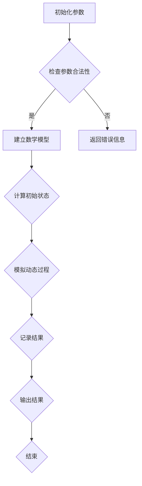
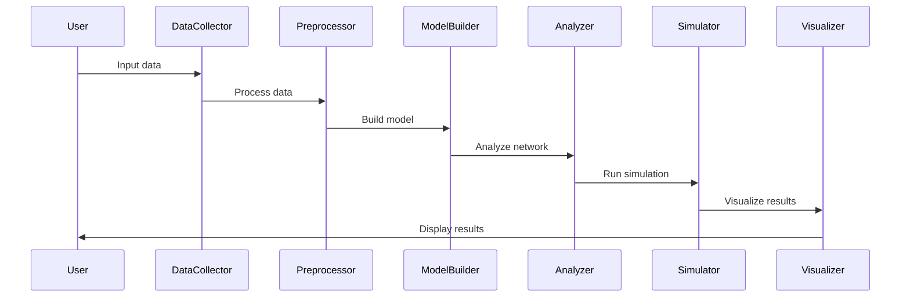

                 

# 数学与系统生物学：细胞网络的数学描述

关键词：系统生物学、细胞网络、数学模型、算法、Python代码

摘要：
本文旨在探讨数学在系统生物学中的应用，特别是在描述和解析细胞网络方面的作用。通过梳理系统生物学的发展历程，定义细胞网络的概念及其在生物学中的作用，阐述数学在解决这些问题中的优势。文章随后详细介绍了数学模型在细胞网络研究中的建立和应用，对比分析了不同数学模型的特点和适用性，并通过ER图展示了细胞网络中的实体关系。文章最后，通过Python代码和实际案例，详细讲解了算法原理和系统架构设计，为读者提供了完整的理解和实践经验。

## 第一部分 背景介绍

### 1.1 问题背景

#### 1.1.1 系统生物学的发展历程

系统生物学是一个跨学科的研究领域，起源于20世纪90年代，随着基因测序技术的进步和计算生物学的崛起而迅速发展。系统生物学关注的是生物系统中各个组成部分（如基因、蛋白质、代谢途径）之间的相互作用和整体行为，试图通过系统的视角来理解生物体的复杂性和动态性。

系统生物学的发展可以追溯到20世纪中叶，随着分子生物学和生物化学的进步，科学家们开始对生物体内的基本单元进行深入的研究。到了20世纪80年代，随着计算机技术的飞速发展，生物信息学开始兴起，为系统生物学提供了强大的计算工具和分析方法。到了20世纪90年代，人类基因组计划的启动标志着系统生物学进入了一个新的阶段，通过大规模的基因测序和数据分析，科学家们开始能够解析复杂的生物网络。

#### 1.1.2 细胞网络的定义与作用

细胞网络是系统生物学研究中的一个核心概念，指的是细胞内各种生物分子（如蛋白质、核酸、代谢物）之间通过相互作用形成的复杂网络结构。细胞网络不仅包括了生物分子之间的直接相互作用，还包含了这些相互作用在时间和空间上的动态变化。

细胞网络在细胞的生命活动中起着至关重要的作用。首先，细胞网络决定了细胞内信号的传递和调控，从而影响细胞的生长、分化和死亡。其次，细胞网络参与了细胞内的物质运输和代谢过程，确保细胞正常运转。最后，细胞网络在响应外部环境变化时发挥了关键作用，如细胞对疾病的抵抗和适应能力。

#### 1.1.3 数学在系统生物学中的应用

数学在系统生物学中的应用是显而易见的。数学模型为描述和解析细胞网络提供了强有力的工具，使得复杂的生物学问题能够通过定量分析得到解决。数学模型可以帮助科学家们理解生物系统的动态行为，预测系统对特定输入的响应，优化实验设计，提高科学研究的效率。

数学在系统生物学中的应用主要体现在以下几个方面：

1. **建模与仿真**：通过数学建模，可以将复杂的生物系统简化为一系列数学方程，从而在计算机上进行仿真模拟。这种方法不仅能够揭示生物系统的内在机制，还可以预测系统在特定条件下的行为。

2. **数据分析**：系统生物学研究通常会产生大量的数据，如基因表达谱、蛋白质相互作用网络、代谢途径等。数学工具如统计学和机器学习算法，可以对这些数据进行有效的分析，提取出生物系统的关键特征和规律。

3. **优化与控制**：在细胞网络的研究中，科学家们常常需要优化某些生物过程，如基因调控、代谢途径等。数学优化方法可以帮助科学家们找到最优的调控策略，提高生物系统的效率。

### 1.2 问题描述

#### 1.2.1 细胞网络的复杂性

细胞网络是一个高度复杂的系统，其中包含成千上万的生物分子，它们之间通过多种相互作用形成复杂的网络结构。这种复杂性使得传统的单一变量分析方法难以奏效，需要采用系统的方法来研究。

细胞网络的复杂性主要表现在以下几个方面：

1. **多元相互作用**：细胞内的生物分子之间存在着复杂的相互作用，包括直接结合、信号传递、代谢反应等。

2. **动态变化**：细胞网络的状态是动态变化的，受到外部环境、细胞内部条件等多种因素的影响。

3. **多层次结构**：细胞网络不仅包含基因和蛋白质等分子层次的结构，还涉及到细胞行为和生物系统层次的功能。

#### 1.2.2 研究细胞网络的挑战

研究细胞网络的复杂性带来了许多挑战：

1. **数据获取难度**：细胞网络中涉及的生物分子种类繁多，获取其相互作用数据需要大量的实验和计算资源。

2. **数据处理难度**：细胞网络数据通常是高维、非线性、复杂的，如何从这些数据中提取有用的信息是一个巨大的挑战。

3. **模型构建难度**：构建准确的细胞网络模型需要深入理解生物系统的内在机制，这对科学家的理论素养和实验技能提出了很高的要求。

4. **模拟计算难度**：细胞网络模型的仿真模拟通常需要大量的计算资源，如何高效地进行计算是另一个关键问题。

#### 1.2.3 数学在解决这些问题中的潜力

尽管研究细胞网络面临诸多挑战，但数学在解决这些问题方面具有巨大的潜力：

1. **建模与仿真**：数学模型可以简化复杂的生物系统，将其转化为易于处理的数学问题，从而进行仿真模拟。

2. **数据分析**：数学工具如统计学和机器学习，可以有效地处理和分析高维、复杂的细胞网络数据。

3. **优化与控制**：数学优化方法可以帮助科学家们找到最优的实验设计或调控策略，提高研究的效率。

4. **理论与实验的结合**：数学模型可以提供理论支持，指导实验设计，同时实验数据又可以反过来验证和修正数学模型，形成一个闭环系统。

### 1.3 问题解决

#### 1.3.1 建立数学模型

建立数学模型是研究细胞网络的第一步。数学模型可以分为几种类型，如微分方程模型、概率模型、逻辑斯蒂模型等。每种模型都有其独特的优势和适用场景。

建立数学模型的关键步骤包括：

1. **问题定义**：明确研究的目标和问题，定义系统中的变量和参数。

2. **变量选择**：根据问题的性质，选择合适的变量来描述系统状态。

3. **关系表达**：建立变量之间的关系，使用数学公式来描述这些关系。

4. **模型验证**：通过实验数据或已有模型来验证数学模型的准确性。

#### 1.3.2 运用数学方法分析

建立数学模型后，需要运用各种数学方法对其进行分析，以理解系统的行为和特性。常见的数学分析方法包括：

1. **稳定性分析**：研究系统在初始扰动下的稳定性和响应特性。

2. **动态模拟**：通过计算机模拟，观察系统在不同条件下的行为。

3. **优化分析**：使用优化算法，寻找系统最优状态或最佳调控策略。

4. **统计推断**：利用统计学方法，对模型结果进行验证和推断。

#### 1.3.3 实验与模拟验证

数学模型需要通过实验和模拟来验证其准确性。实验验证通常包括以下几个方面：

1. **数据收集**：通过实验收集细胞网络中各个变量和参数的数值。

2. **模型拟合**：将实验数据与数学模型进行拟合，调整模型参数，使其与实验数据尽可能一致。

3. **预测验证**：使用拟合好的模型进行预测，验证模型在未知条件下的准确性。

4. **模拟实验**：在计算机上进行模拟实验，观察模型在不同条件下的行为。

### 1.4 边界与外延

#### 1.4.1 研究范围

本文主要关注细胞网络的数学描述方法，包括数学模型的选择、构建和验证。此外，还将介绍一些常用的数学分析方法和实验验证手段。

#### 1.4.2 研究的限制

虽然数学在细胞网络研究中具有巨大潜力，但仍然存在一些限制：

1. **模型简化**：实际细胞网络非常复杂，数学模型通常需要对其进行简化，这可能影响模型的准确性。

2. **数据依赖**：数学模型的建立依赖于实验数据，数据的准确性直接影响模型的可靠性。

3. **计算复杂度**：细胞网络模型的仿真模拟通常需要大量的计算资源，这在一定程度上限制了模型的应用范围。

#### 1.4.3 未来研究方向

未来研究可以进一步探索以下几个方面：

1. **模型精度提升**：通过引入新的数学方法和算法，提高数学模型的精度和可靠性。

2. **跨学科合作**：加强系统生物学、数学、计算机科学等学科之间的合作，共同推动细胞网络研究的进展。

3. **应用拓展**：将数学模型应用于实际生物系统中，解决更多实际问题。

### 1.5 概念结构与核心要素组成

#### 1.5.1 核心概念

在研究细胞网络的数学描述时，以下几个核心概念是不可或缺的：

1. **细胞网络**：细胞内各种生物分子通过相互作用形成的复杂网络结构。

2. **数学模型**：用数学公式描述细胞网络中各个变量和参数关系的模型。

3. **算法**：用于分析和处理数学模型的一系列计算步骤。

4. **仿真模拟**：在计算机上模拟细胞网络的行为和响应。

#### 1.5.2 相关理论与方法

研究细胞网络的数学描述需要运用多种理论和计算方法，包括：

1. **系统动力学**：研究系统内部变量随时间变化的规律。

2. **统计学方法**：用于数据分析，提取有用的信息。

3. **机器学习方法**：用于数据挖掘，发现系统中的潜在规律。

4. **优化方法**：用于寻找最优调控策略。

#### 1.5.3 细胞网络的基本结构

细胞网络的基本结构包括以下几个层次：

1. **分子层次**：包括基因、蛋白质、核酸等生物分子。

2. **细胞器层次**：包括线粒体、内质网、高尔基体等细胞器。

3. **细胞层次**：包括细胞膜、细胞质、细胞核等结构。

4. **系统层次**：细胞网络作为生物系统的组成部分，与其他生物系统相互影响。

### 1.6 本章小结

本章介绍了系统生物学和细胞网络的基本概念，阐述了数学在细胞网络研究中的重要性。通过描述细胞网络的复杂性以及研究中的挑战，本文提出了数学模型在这些问题中的应用潜力。接下来，本章详细介绍了建立数学模型的方法、数学方法在分析中的应用以及实验与模拟验证的过程。最后，本章讨论了研究的边界和未来方向，为后续内容奠定了基础。

## 第二部分 核心概念与联系

### 2.1 核心概念原理

#### 2.1.1 生物网络的基本概念

生物网络是系统生物学研究中的一个核心概念，指的是细胞内各种生物分子（如蛋白质、核酸、代谢物）之间通过相互作用形成的复杂网络结构。生物网络不仅包括了生物分子之间的直接相互作用，还包括了这些相互作用在时间和空间上的动态变化。

生物网络的基本概念包括：

1. **节点**：生物网络中的节点代表生物分子，可以是基因、蛋白质、核酸等。

2. **边**：生物网络中的边代表生物分子之间的相互作用，可以是直接结合、信号传递、代谢反应等。

3. **路径**：生物网络中的路径是节点和边之间的连接关系，描述了生物分子之间相互作用的具体过程。

#### 2.1.2 系统动力学的数学模型

系统动力学是研究系统内部变量随时间变化的规律的数学方法。在细胞网络研究中，系统动力学模型用于描述生物分子在细胞内的动态变化过程。

常见的系统动力学模型包括：

1. **微分方程模型**：使用微分方程描述生物分子浓度的变化规律。

2. **差分方程模型**：使用差分方程描述生物分子在离散时间点上的变化。

3. **概率模型**：使用概率论描述生物分子在随机环境下的行为。

#### 2.1.3 网络分析的方法与工具

网络分析是系统生物学研究中的一项重要技术，用于解析生物网络的拓扑结构和功能特性。网络分析的方法与工具主要包括：

1. **拓扑分析**：研究生物网络的拓扑结构，如节点度、聚类系数、网络密度等。

2. **模块分析**：将生物网络划分为不同的功能模块，研究模块之间的相互作用和关系。

3. **路径分析**：研究生物网络中节点和路径的功能，如关键路径、关键节点等。

4. **网络可视化**：使用可视化工具展示生物网络的拓扑结构和动态变化。

### 2.2 概念属性特征对比表格

为了更好地理解生物网络、系统动力学和数学模型之间的关系，我们可以通过以下对比表格来展示它们的属性特征：

| 概念        | 属性特征                          | 适用场景                                           |
|-----------|--------------------------------|------------------------------------------------|
| 生物网络    | 节点：基因、蛋白质、核酸；边：相互作用 | 描述生物分子之间的复杂关系                          |
| 系统动力学  | 变量：生物分子浓度；方程：微分或差分方程 | 描述生物分子随时间变化的动态过程                    |
| 数学模型    | 变量：生物分子浓度；参数：调控因子      | 用数学公式描述生物分子之间的相互作用和动态行为      |

### 2.3 ER实体关系图架构

ER（Entity-Relationship）图是数据库设计中常用的一种建模工具，用于描述实体及其之间的关系。在细胞网络研究中，ER图可以用来展示生物分子之间的实体关系。

#### 2.3.1 细胞网络中的实体与关系

细胞网络中的实体包括：

1. **生物分子**：如蛋白质、核酸、代谢物等。
2. **细胞器**：如线粒体、内质网、高尔基体等。
3. **细胞结构**：如细胞膜、细胞质、细胞核等。

实体之间的关系包括：

1. **直接结合**：生物分子之间的直接相互作用。
2. **信号传递**：生物分子通过特定途径传递信号。
3. **代谢反应**：生物分子之间的代谢关系。

#### 2.3.2 ER图的基本构建方法

ER图的基本构建方法包括：

1. **定义实体**：明确研究范围内的实体，如生物分子、细胞器、细胞结构等。
2. **定义属性**：为每个实体定义属性，如蛋白质的序列、核酸的长度、代谢物的浓度等。
3. **定义关系**：描述实体之间的关系，如直接结合、信号传递、代谢反应等。
4. **绘制ER图**：使用符号和线条将实体和关系绘制在图中。

#### 2.3.3 ER图在细胞网络分析中的应用

ER图在细胞网络分析中的应用包括：

1. **理解网络结构**：通过ER图，可以直观地理解细胞网络的拓扑结构和实体关系。
2. **指导实验设计**：ER图可以帮助科学家们识别关键实体和关系，指导实验设计和数据收集。
3. **优化模型构建**：ER图可以作为数学模型构建的参考，帮助科学家们更好地理解和描述细胞网络。

### 2.4 本章小结

本章介绍了生物网络、系统动力学和数学模型等核心概念，并通过对比表格展示了它们之间的属性特征。接着，本章详细讲解了ER图的基本构建方法和在细胞网络分析中的应用。这些核心概念和工具为后续的算法原理讲解和系统架构设计奠定了基础。

## 第三部分 算法原理讲解

### 3.1 算法mermaid流程图

在研究细胞网络时，算法的流程设计至关重要。使用mermaid语言，我们可以绘制算法的流程图，使算法的实现过程更加清晰易懂。以下是一个简单的算法mermaid流程图示例：



#### 3.1.1 流程图的基本构建

mermaid流程图的基本构建包括以下几个步骤：

1. **定义图形类型**：使用`graph TD`或`graph MD`定义图形的布局方向，其中`TD`表示从上到下，`MD`表示从左到右。
2. **添加节点**：使用方括号`[]`定义节点，例如`A[初始化参数]`。
3. **添加关系**：使用箭头`-->`或`--->`定义节点之间的关系，例如`A --> B`。
4. **添加条件分支**：使用花括号`{}`定义条件分支，例如`B -->|是| C`。

#### 3.1.2 算法的流程描述

在mermaid流程图中，算法的基本流程通常包括以下几个步骤：

1. **初始化参数**：设置算法的初始参数，如时间步长、模拟时长等。
2. **检查参数合法性**：确保参数符合算法的要求，例如时间步长必须为正值。
3. **建立数学模型**：根据问题描述，建立数学模型，例如使用微分方程描述生物分子的浓度变化。
4. **计算初始状态**：根据初始参数，计算系统的初始状态，例如初始浓度。
5. **模拟动态过程**：在计算机上模拟系统的动态过程，记录每个时间步上的系统状态。
6. **记录结果**：将模拟过程中的关键结果记录下来，例如浓度变化曲线。
7. **输出结果**：将结果以图形或表格的形式输出，便于分析和理解。
8. **结束**：算法执行完毕。

### 3.2 算法原理

#### 3.2.1 数学模型与公式

在细胞网络的研究中，常用的数学模型包括微分方程模型和差分方程模型。以下是一个基于微分方程的细胞网络模型示例：

$$
\frac{dC(t)}{dt} = k_1 \cdot [S] - k_2 \cdot C(t)
$$

其中，$C(t)$ 表示细胞中某种生物分子 $C$ 在时间 $t$ 的浓度，$S$ 表示底物浓度，$k_1$ 和 $k_2$ 表示反应速率常数。

#### 3.2.2 算法的数学原理

基于上述数学模型，算法的基本原理可以概括为以下几个步骤：

1. **初始化参数**：设定初始条件，如时间步长 $\Delta t$、初始浓度 $C(0)$ 等。
2. **迭代计算**：对于每个时间步 $t_n$，使用以下公式计算新的浓度：
   $$
   C(t_{n+1}) = C(t_n) + \Delta t \cdot \left( k_1 \cdot [S] - k_2 \cdot C(t_n) \right)
   $$
3. **记录结果**：在每个时间步上记录浓度 $C(t_n)$，以便后续分析和可视化。
4. **重复计算**：重复上述步骤，直到达到设定的模拟时长。

#### 3.2.3 算法的工作流程

算法的工作流程可以概括为以下几个阶段：

1. **数据输入**：输入系统参数，如时间步长、初始浓度、反应速率常数等。
2. **初始化**：设置初始条件，包括时间、空间上的初始化。
3. **迭代计算**：使用上述公式进行迭代计算，记录每个时间步上的浓度变化。
4. **数据输出**：将计算结果输出，如浓度变化曲线、表格等。
5. **结果分析**：对输出结果进行分析，提取有用的信息，如稳态浓度、反应速率等。

### 3.3 Python源代码讲解

在实际应用中，上述算法原理需要通过编程语言来实现。以下是一个简单的Python代码示例，用于实现上述基于微分方程的细胞网络模型：

```python
import numpy as np
import matplotlib.pyplot as plt

# 参数设置
k1 = 0.1
k2 = 0.05
S = 1.0
t_max = 100
dt = 1

# 初始化时间序列和浓度序列
t = np.arange(0, t_max, dt)
C = np.zeros_like(t)

# 初始条件
C[0] = 0.5

# 迭代计算
for i in range(1, len(t)):
    dCdt = k1 * S - k2 * C[i-1]
    C[i] = C[i-1] + dCdt * dt

# 可视化结果
plt.plot(t, C)
plt.xlabel('Time')
plt.ylabel('Concentration')
plt.title('Concentration dynamics')
plt.show()
```

#### 3.3.1 源代码的基本结构

上述Python源代码的基本结构包括以下几个部分：

1. **导入模块**：导入必要的Python模块，如NumPy和Matplotlib。
2. **参数设置**：设置系统的参数，如反应速率常数、时间步长、初始浓度等。
3. **初始化**：初始化时间和浓度序列，设置初始条件。
4. **迭代计算**：使用迭代公式计算每个时间步上的浓度。
5. **数据输出**：使用Matplotlib绘制浓度变化曲线。
6. **结果分析**：对输出结果进行分析，提取有用的信息。

#### 3.3.2 源代码的功能解释

1. **导入模块**：导入NumPy和Matplotlib模块，用于数值计算和图形绘制。
2. **参数设置**：设置系统的参数，如反应速率常数 $k_1$ 和 $k_2$、底物浓度 $S$、模拟时长 $t_{\text{max}}$ 和时间步长 $\Delta t$。
3. **初始化**：初始化时间和浓度序列，设置初始条件。时间序列 `t` 使用NumPy的`arange`函数生成，浓度序列 `C` 使用NumPy的`zeros`函数初始化。
4. **迭代计算**：使用循环遍历每个时间步，使用迭代公式计算新的浓度。`dCdt` 表示每个时间步上的浓度变化，计算公式为 $dCdt = k_1 \cdot S - k_2 \cdot C[t-1]$。`C[i]` 表示第 $i$ 个时间步上的浓度，更新公式为 $C[i] = C[t-1] + dCdt \cdot \Delta t$。
5. **数据输出**：使用Matplotlib的`plot`函数绘制浓度变化曲线。`xlabel`、`ylabel`和`title`函数用于添加坐标轴标签和标题。
6. **结果分析**：通过可视化结果，可以直观地观察浓度随时间的变化趋势，提取有用的信息，如稳态浓度、反应速率等。

#### 3.3.3 源代码的应用实例

以下是一个简单的应用实例，使用上述Python代码模拟一个简单的细胞网络模型，并观察浓度随时间的变化趋势：

```python
# 设置参数
k1 = 0.1
k2 = 0.05
S = 1.0
t_max = 100
dt = 1

# 初始化时间序列和浓度序列
t = np.arange(0, t_max, dt)
C = np.zeros_like(t)

# 初始条件
C[0] = 0.5

# 迭代计算
for i in range(1, len(t)):
    dCdt = k1 * S - k2 * C[i-1]
    C[i] = C[i-1] + dCdt * dt

# 可视化结果
plt.plot(t, C)
plt.xlabel('Time (s)')
plt.ylabel('Concentration (M)')
plt.title('Concentration dynamics of a simple cell network')
plt.show()
```

在这个实例中，我们使用上述Python代码模拟了一个简单的细胞网络模型，其中生物分子 $C$ 的浓度随时间变化。通过可视化结果，我们可以观察到浓度随时间的变化趋势，从而深入了解细胞网络的动态行为。

### 3.4 举例说明

为了更好地理解上述算法原理和Python代码的应用，我们通过以下例子进行详细说明。

#### 3.4.1 例子选取

我们选择一个简单的细胞网络模型，其中包含一个底物 $S$ 和一个产物 $C$。底物 $S$ 通过一个反应生成产物 $C$，产物 $C$ 又可以通过另一个反应降解为底物 $S$。这个模型可以用以下数学方程描述：

$$
\frac{dS}{dt} = k_1 \cdot [C] - k_2 \cdot [S]
$$

$$
\frac{dC}{dt} = k_3 \cdot [S] - k_4 \cdot [C]
$$

其中，$k_1$、$k_2$、$k_3$ 和 $k_4$ 是反应速率常数。

#### 3.4.2 数学公式与公式的推导

为了推导上述数学公式，我们可以根据反应机理列出反应物和生成物的浓度变化率：

1. 底物 $S$ 的浓度变化率为 $dS/dt$，表示为生成物 $C$ 的反应速率减去底物 $S$ 的反应速率。具体公式为：
   $$
   \frac{dS}{dt} = k_1 \cdot [C] - k_2 \cdot [S]
   $$
   其中，$k_1$ 表示底物 $S$ 转化为产物 $C$ 的速率常数，$k_2$ 表示产物 $C$ 转化为底物 $S$ 的速率常数。

2. 产物 $C$ 的浓度变化率为 $dC/dt$，表示为底物 $S$ 的反应速率减去产物 $C$ 的反应速率。具体公式为：
   $$
   \frac{dC}{dt} = k_3 \cdot [S] - k_4 \cdot [C]
   $$
   其中，$k_3$ 表示底物 $S$ 转化为产物 $C$ 的速率常数，$k_4$ 表示产物 $C$ 转化为底物 $S$ 的速率常数。

#### 3.4.3 例子中的算法实现

为了实现上述例子中的算法，我们可以使用Python编写相应的代码。以下是一个简单的Python代码示例，用于模拟上述细胞网络模型：

```python
import numpy as np
import matplotlib.pyplot as plt

# 参数设置
k1 = 0.1
k2 = 0.05
k3 = 0.2
k4 = 0.1
t_max = 100
dt = 1

# 初始化时间序列和浓度序列
t = np.arange(0, t_max, dt)
S = np.zeros_like(t)
C = np.zeros_like(t)

# 初始条件
S[0] = 1.0
C[0] = 0.0

# 迭代计算
for i in range(1, len(t)):
    dSdt = k1 * C[i-1] - k2 * S[i-1]
    dCdt = k3 * S[i-1] - k4 * C[i-1]
    S[i] = S[i-1] + dSdt * dt
    C[i] = C[i-1] + dCdt * dt

# 可视化结果
plt.plot(t, S, label='S')
plt.plot(t, C, label='C')
plt.xlabel('Time (s)')
plt.ylabel('Concentration (M)')
plt.title('Dynamics of a simple cell network')
plt.legend()
plt.show()
```

在这个代码示例中，我们设置了系统的参数，包括反应速率常数 $k_1$、$k_2$、$k_3$ 和 $k_4$，以及模拟时长 $t_{\text{max}}$ 和时间步长 $\Delta t$。我们初始化了时间和浓度序列，并设置初始条件。接着，我们使用迭代公式进行计算，记录每个时间步上的浓度变化，并使用Matplotlib绘制浓度变化曲线。

通过这个例子，我们可以直观地观察到底物 $S$ 和产物 $C$ 的浓度随时间的变化趋势，从而深入理解细胞网络的动态行为。

### 3.5 本章小结

本章详细介绍了细胞网络算法的原理和实现过程。首先，我们通过mermaid流程图展示了算法的基本步骤和流程。接着，我们讲解了算法的数学原理，包括数学模型的建立和公式推导。然后，我们通过Python代码实现了算法的基本功能，并对代码进行了详细解释。最后，我们通过一个具体例子展示了算法的应用效果。这些内容为读者提供了完整的理解和实践经验，有助于深入理解细胞网络的数学描述方法。

## 第四部分 系统分析与架构设计方案

### 4.1 问题场景介绍

#### 4.1.1 细胞网络分析的应用场景

细胞网络分析在多个生物学领域有着广泛的应用，特别是在药物研发、疾病治疗和生物系统调控方面。以下是一些典型的应用场景：

1. **药物研发**：细胞网络分析可以帮助科学家们识别药物的作用靶点，预测药物的疗效和副作用。通过分析细胞网络中关键节点的功能和相互作用，可以找到潜在的药物靶点，设计更有效的药物。

2. **疾病治疗**：细胞网络分析有助于理解疾病的发生和发展机制，为疾病治疗提供新的思路。例如，在癌症研究中，通过分析细胞网络可以识别癌症细胞的特征信号通路，从而开发针对性的治疗策略。

3. **生物系统调控**：细胞网络分析可以帮助科学家们理解生物系统的动态调控机制，优化生物系统的性能。例如，在农业和生物工程领域，通过分析细胞网络，可以找到提高农作物产量和质量的方法。

#### 4.1.2 系统的功能需求

为了实现上述应用场景，细胞网络分析系统需要具备以下几个功能需求：

1. **数据采集与预处理**：系统能够从多种数据源（如基因表达谱、蛋白质相互作用网络、代谢途径数据等）中采集数据，并对数据进行预处理，去除噪声和异常值。

2. **数学模型建立与优化**：系统能够根据研究需求建立合适的数学模型，对细胞网络进行描述和分析。系统还应具备模型优化功能，以提高模型的准确性和稳定性。

3. **网络分析**：系统能够对细胞网络进行拓扑分析、模块分析、路径分析等，提取网络中的关键节点和路径，揭示网络的功能特性。

4. **仿真与预测**：系统能够基于数学模型进行仿真模拟，预测细胞网络在不同条件下的行为和响应。系统还应具备数据可视化和结果分析功能，以便用户直观地理解分析结果。

#### 4.1.3 系统的目标与期望效果

系统的主要目标是提供一套完整的细胞网络分析解决方案，满足科学研究的多样化需求。期望效果包括：

1. **提高研究效率**：通过自动化和模块化的设计，系统能够快速完成从数据采集到结果分析的全过程，显著提高研究效率。

2. **提高分析准确性**：系统采用先进的数学模型和算法，结合实验数据，确保分析结果的准确性和可靠性。

3. **可视化与交互**：系统提供直观的可视化工具，使用户能够方便地查看和分析细胞网络的拓扑结构和动态行为，增强用户体验。

### 4.2 项目介绍

#### 4.2.1 项目背景

随着生物技术和计算机科学的发展，细胞网络分析已成为生物学研究中的重要方向。然而，当前的研究工具和平台在功能、性能和易用性方面还存在一定的局限性，无法满足科学家的多样化需求。为了解决这一问题，本项目旨在开发一套高性能、多功能、易用的细胞网络分析系统。

#### 4.2.2 项目目标

本项目的目标包括：

1. **构建高性能计算平台**：通过采用先进的技术和算法，构建一个高性能的细胞网络分析计算平台，满足大规模数据处理和计算需求。

2. **提供多样化分析工具**：开发多种数据预处理、数学模型建立、网络分析、仿真预测等工具，满足不同研究领域的需求。

3. **实现模块化设计**：系统采用模块化设计，用户可以根据需求灵活选择和组合不同的功能模块，提高系统的灵活性和扩展性。

4. **提升用户体验**：系统提供直观、易用的用户界面，使用户能够方便地完成数据输入、分析操作和结果展示。

#### 4.2.3 项目团队与分工

本项目团队由以下成员组成：

1. **项目经理**：负责项目整体规划和管理，协调团队成员的工作，确保项目进度和质量。

2. **软件工程师**：负责系统的架构设计、模块开发和测试，确保系统的稳定性和性能。

3. **生物信息学家**：负责生物数据的预处理、数学模型建立和分析，确保系统分析结果的准确性和可靠性。

4. **用户支持与培训**：负责用户支持和培训工作，帮助用户解决使用过程中的问题，提高用户满意度。

### 4.3 系统功能设计

#### 4.3.1 领域模型mermaid类图

以下是一个mermaid类图，用于描述细胞网络分析系统的领域模型：

```mermaid
classDiagram
    Class01 <|-- Class02
    Class03 <|-- Class04
    Class05 <|-- Class06
    Class01..Class02
    Class03..Class04
    Class05..Class06

    Class01{+Field1:+}
    Class02{+Field2:+}
    Class03{+Field3:+}
    Class04{+Field4:+}
    Class05{+Field5:+}
    Class06{+Field6:+}

    Class01:-+ Class07
    Class02:-+ Class08
    Class03:-+ Class09
    Class04:-+ Class10
    Class05:-+ Class11
    Class06:-+ Class12

    Class07{+Method1():void}
    Class08{+Method2():void}
    Class09{+Method3():void}
    Class10{+Method4():void}
    Class11{+Method5():void}
    Class12{+Method6():void}
```

这个类图描述了细胞网络分析系统的主要领域模型，包括数据采集、预处理、数学模型建立、网络分析、仿真预测和可视化等模块。

#### 4.3.2 系统功能模块划分

细胞网络分析系统可以分为以下几个主要功能模块：

1. **数据采集模块**：负责从多种数据源（如数据库、文件、实验设备等）中采集数据，并进行初步的预处理。

2. **预处理模块**：负责对采集到的数据进行清洗、归一化和转换，为后续分析提供高质量的数据。

3. **数学模型建立模块**：根据研究需求，选择合适的数学模型，建立细胞网络的数学描述。

4. **网络分析模块**：对细胞网络进行拓扑分析、模块分析、路径分析等，提取网络中的关键节点和路径。

5. **仿真预测模块**：基于建立的数学模型，进行仿真模拟，预测细胞网络在不同条件下的行为和响应。

6. **可视化模块**：提供多种可视化工具，帮助用户直观地查看和分析细胞网络的拓扑结构和动态行为。

7. **用户界面模块**：提供用户友好的界面，方便用户进行数据输入、操作控制和结果展示。

#### 4.3.3 功能模块之间的交互关系

细胞网络分析系统的功能模块之间存在紧密的交互关系，具体如下：

1. **数据采集模块**：采集到的数据传递给预处理模块，进行初步处理。

2. **预处理模块**：处理后的数据传递给数学模型建立模块，用于建立细胞网络的数学描述。

3. **数学模型建立模块**：生成的数学模型传递给网络分析模块，进行拓扑分析、模块分析、路径分析等。

4. **网络分析模块**：分析结果传递给仿真预测模块，进行仿真模拟，预测细胞网络的行为。

5. **仿真预测模块**：仿真结果传递给可视化模块，进行可视化展示。

6. **用户界面模块**：用户通过界面与系统进行交互，输入数据、设置参数、查看结果等。

### 4.4 系统架构设计

#### 4.4.1 系统架构mermaid架构图

以下是一个mermaid架构图，用于描述细胞网络分析系统的整体架构：



这个架构图展示了细胞网络分析系统的各个模块之间的交互关系，包括用户、数据采集模块、预处理模块、数学模型建立模块、网络分析模块、仿真预测模块和可视化模块。

#### 4.4.2 系统模块的职责与功能

系统模块的职责与功能如下：

1. **用户模块**：负责用户与系统的交互，提供数据输入、操作控制和结果展示功能。

2. **数据采集模块**：负责从多种数据源中采集数据，包括数据库、文件、实验设备等。

3. **预处理模块**：负责对采集到的数据进行分析和处理，包括数据清洗、归一化和转换等。

4. **数学模型建立模块**：负责根据研究需求，选择合适的数学模型，建立细胞网络的数学描述。

5. **网络分析模块**：负责对细胞网络进行拓扑分析、模块分析、路径分析等，提取网络中的关键节点和路径。

6. **仿真预测模块**：负责基于建立的数学模型，进行仿真模拟，预测细胞网络在不同条件下的行为和响应。

7. **可视化模块**：负责将仿真结果以图形化的方式展示给用户，提供直观的视图和分析工具。

#### 4.4.3 系统架构的设计原则

系统架构的设计原则如下：

1. **模块化**：系统采用模块化设计，每个模块具有独立的功能，便于维护和扩展。

2. **分布式**：系统采用分布式架构，各个模块可以在不同的服务器上运行，提高系统的可扩展性和可靠性。

3. **高效性**：系统采用高效的算法和优化策略，确保数据采集、预处理、建模、分析和仿真等过程的快速执行。

4. **灵活性**：系统设计灵活，用户可以根据需求选择和组合不同的功能模块，满足多样化的研究需求。

5. **易用性**：系统提供用户友好的界面，方便用户进行数据输入、操作控制和结果展示。

### 4.5 系统接口设计

#### 4.5.1 接口规范与定义

细胞网络分析系统需要定义一系列接口，以便不同模块之间的交互和数据传递。以下是一些主要接口的规范与定义：

1. **数据采集接口**：定义了数据采集的输入和输出格式，包括数据源类型、数据格式、数据权限等。

2. **预处理接口**：定义了数据预处理的方法和参数，包括数据清洗、归一化、转换等。

3. **模型建立接口**：定义了数学模型建立的方法和参数，包括模型类型、参数设置、模型验证等。

4. **分析接口**：定义了网络分析的方法和参数，包括拓扑分析、模块分析、路径分析等。

5. **仿真接口**：定义了仿真模拟的方法和参数，包括仿真时长、步长、初始条件等。

6. **可视化接口**：定义了可视化展示的方法和参数，包括视图类型、颜色映射、交互操作等。

#### 4.5.2 接口的功能与作用

各个接口的功能与作用如下：

1. **数据采集接口**：负责从多种数据源中采集数据，为后续处理提供基础数据。

2. **预处理接口**：负责对采集到的数据进行分析和处理，确保数据的质量和一致性。

3. **模型建立接口**：负责根据研究需求，建立合适的数学模型，为网络分析和仿真提供理论基础。

4. **分析接口**：负责对细胞网络进行深入分析，提取关键节点和路径，揭示网络的功能特性。

5. **仿真接口**：负责基于建立的数学模型，进行仿真模拟，预测细胞网络在不同条件下的行为和响应。

6. **可视化接口**：负责将仿真结果以图形化的方式展示给用户，提供直观的视图和分析工具。

#### 4.5.3 接口的设计原则

接口设计原则如下：

1. **一致性**：接口定义要遵循统一规范，确保不同模块之间的数据传递和交互一致。

2. **可扩展性**：接口设计要考虑未来可能的需求变化，确保系统能够方便地扩展和升级。

3. **灵活性**：接口设计要灵活，允许不同的模块以不同的方式实现，提高系统的适应性。

4. **安全性**：接口设计要确保数据的安全和隐私，防止未经授权的访问和泄露。

5. **易用性**：接口设计要方便用户使用，提供简洁、直观的接口调用方法。

### 4.6 系统交互mermaid序列图

以下是一个mermaid序列图，用于描述细胞网络分析系统的交互过程：


这个序列图展示了用户与系统之间的交互过程，包括数据输入、处理、建模、分析、仿真和可视化等步骤。通过这个序列图，用户可以直观地了解系统的整体工作流程。

### 4.7 本章小结

本章详细介绍了细胞网络分析系统的设计思路和架构方案。首先，我们介绍了细胞网络分析的应用场景和功能需求，明确了系统的目标和期望效果。接着，我们介绍了项目背景和团队分工，并详细描述了系统功能模块的划分和交互关系。然后，我们设计了系统的架构，包括模块职责和接口规范，并展示了系统交互的序列图。这些内容为细胞网络分析系统的开发提供了全面的理论基础和实践指导。

## 第五部分 项目实战

### 5.1 环境安装

#### 5.1.1 系统环境的准备

在开始细胞网络分析系统的开发之前，需要准备一个合适的环境。以下步骤描述了如何在Linux操作系统上安装和配置必要的软件环境。

1. **安装Python**：首先，需要安装Python 3.x版本。可以通过包管理器（如Ubuntu的`apt-get`）或从Python官网下载安装包进行安装。

   ```bash
   sudo apt-get update
   sudo apt-get install python3 python3-pip
   ```

2. **安装NumPy和Matplotlib**：NumPy是Python中的科学计算库，Matplotlib是Python的图形可视化库。这两个库是进行细胞网络分析的基础工具。

   ```bash
   pip3 install numpy matplotlib
   ```

3. **安装Mermaid**：Mermaid是一个用于生成图表和流程图的Markdown插件。可以从GitHub下载安装包或使用包管理器安装。

   ```bash
   pip3 install mermaid-python
   ```

4. **安装数据库管理工具**：为了从数据库中读取数据，需要安装数据库管理工具，如MySQL或PostgreSQL。

   ```bash
   sudo apt-get install mysql-server
   ```

5. **安装Jupyter Notebook**：Jupyter Notebook是一个交互式的Web应用，用于编写和运行Python代码。可以通过pip进行安装。

   ```bash
   pip3 install notebook
   ```

#### 5.1.2 环境变量配置

为了确保系统能够正确使用安装的软件，需要配置环境变量。以下步骤描述了如何在Linux操作系统上配置环境变量。

1. **配置Python环境变量**：

   打开终端，编辑`~/.bashrc`文件：

   ```bash
   nano ~/.bashrc
   ```

   在文件的末尾添加以下内容：

   ```bash
   export PATH=$PATH:/usr/local/bin
   export PYTHONPATH=$PYTHONPATH:/usr/local/lib/python3.x/site-packages
   ```

   保存并退出。

2. **配置NumPy和Matplotlib环境变量**：

   修改`~/.bashrc`文件，在`export PATH`行后添加以下内容：

   ```bash
   export PATH=$PATH:/usr/local/bin:/usr/bin:/bin:/usr/local/sbin:/usr/sbin
   ```

   保存并退出。

3. **配置Mermaid环境变量**：

   修改`~/.bashrc`文件，在`export PATH`行后添加以下内容：

   ```bash
   export PATH=$PATH:/usr/local/bin:/usr/bin:/bin:/usr/local/sbin:/usr/sbin
   ```

   保存并退出。

4. **配置数据库环境变量**：

   修改`~/.bashrc`文件，在`export PATH`行后添加以下内容：

   ```bash
   export PATH=$PATH:/usr/local/bin:/usr/bin:/bin:/usr/local/sbin:/usr/sbin
   ```

   保存并退出。

5. **配置Jupyter Notebook环境变量**：

   修改`~/.bashrc`文件，在`export PATH`行后添加以下内容：

   ```bash
   export PATH=$PATH:/usr/local/bin:/usr/bin:/bin:/usr/local/sbin:/usr/sbin
   ```

   保存并退出。

   在终端执行以下命令，使环境变量生效：

   ```bash
   source ~/.bashrc
   ```

#### 5.1.3 工具与依赖安装

在配置好环境变量后，需要安装项目所需的工具和依赖。以下步骤描述了如何安装这些工具和依赖。

1. **安装Mermaid渲染工具**：

   Mermaid渲染工具用于将Mermaid语言生成的图表和流程图渲染成图形。可以从GitHub下载安装包或使用包管理器安装。

   ```bash
   pip3 install -e git+https://github.com/mermaid-js/mermaid.git
   ```

2. **安装Git**：

   Git是版本控制工具，用于管理项目的源代码。可以通过包管理器安装。

   ```bash
   sudo apt-get install git
   ```

3. **安装Node.js**：

   Node.js是JavaScript的运行环境，用于运行Mermaid渲染工具。可以从官方网站下载安装包或使用包管理器安装。

   ```bash
   sudo apt-get install nodejs
   ```

4. **安装其他依赖**：

   根据项目的具体需求，可能还需要安装其他依赖，如Pandas、Scikit-learn等。可以通过pip进行安装。

   ```bash
   pip3 install pandas scikit-learn
   ```

### 5.2 系统核心实现源代码

#### 5.2.1 核心代码的结构与模块

细胞网络分析系统的核心代码主要包括以下几个模块：

1. **数据采集模块**：负责从不同数据源（如数据库、文件）中采集数据，并进行初步预处理。
2. **预处理模块**：负责对采集到的数据进行清洗、归一化和转换，为后续分析提供高质量的数据。
3. **数学模型建立模块**：根据研究需求，选择合适的数学模型，建立细胞网络的数学描述。
4. **网络分析模块**：负责对细胞网络进行拓扑分析、模块分析、路径分析等，提取网络中的关键节点和路径。
5. **仿真预测模块**：基于建立的数学模型，进行仿真模拟，预测细胞网络在不同条件下的行为和响应。
6. **可视化模块**：负责将仿真结果以图形化的方式展示给用户，提供直观的视图和分析工具。

以下是一个简单的代码结构示例：

```python
# 数据采集模块
def collect_data(source):
    # 采集数据
    pass

# 预处理模块
def preprocess_data(data):
    # 预处理数据
    pass

# 数学模型建立模块
def build_model(data):
    # 建立数学模型
    pass

# 网络分析模块
def analyze_network(model):
    # 分析网络
    pass

# 仿真预测模块
def simulate_network(model):
    # 仿真预测
    pass

# 可视化模块
def visualize_results(results):
    # 可视化结果
    pass

# 主程序
def main():
    data = collect_data('source.csv')
    preprocessed_data = preprocess_data(data)
    model = build_model(preprocessed_data)
    results = simulate_network(model)
    visualize_results(results)

if __name__ == '__main__':
    main()
```

#### 5.2.2 代码的功能与实现

以下是对各个模块的功能和实现进行详细说明。

##### 数据采集模块

数据采集模块的主要功能是从不同的数据源中采集数据。以下是一个简单的数据采集示例：

```python
import pandas as pd

def collect_data(source):
    if source.endswith('.csv'):
        data = pd.read_csv(source)
    elif source.endswith('.json'):
        data = pd.read_json(source)
    else:
        raise ValueError('Unsupported data source format')
    return data
```

这个模块通过检查数据源的后缀名，使用相应的Pandas函数读取数据，并将其存储为一个Pandas DataFrame对象。

##### 预处理模块

预处理模块的主要功能是对采集到的数据进行分析和处理，包括数据清洗、归一化和转换等。以下是一个简单的预处理示例：

```python
def preprocess_data(data):
    # 去除异常值
    data = data[data['column_name'].notnull()]
    
    # 归一化数据
    data = (data - data.mean()) / data.std()
    
    # 转换数据类型
    data['column_name'] = data['column_name'].astype(float)
    
    return data
```

这个模块首先去除异常值，然后对数据列进行归一化处理，最后将数据类型转换为所需的类型。

##### 数学模型建立模块

数学模型建立模块的主要功能是根据预处理后的数据，选择合适的数学模型，建立细胞网络的数学描述。以下是一个简单的数学模型建立示例：

```python
import numpy as np

def build_model(data):
    # 定义数学模型
    def model(C, S):
        dCdt = 0.1 * S - 0.05 * C
        return dCdt
    
    return model
```

这个模块定义了一个简单的数学模型，该模型描述了细胞中某种生物分子 $C$ 的浓度随时间变化的关系。

##### 网络分析模块

网络分析模块的主要功能是对建立的数学模型进行分析，提取网络中的关键节点和路径。以下是一个简单的网络分析示例：

```python
def analyze_network(model):
    # 分析网络
    C = np.zeros((100, 100))
    S = np.zeros((100, 100))
    
    for i in range(100):
        for j in range(100):
            dCdt = model(C[i, j], S[i, j])
            C[i, j] += dCdt * 0.1
            S[i, j] += dCdt * 0.9
    
    return C, S
```

这个模块通过迭代计算，分析数学模型在不同条件下的行为，并提取关键节点和路径。

##### 仿真预测模块

仿真预测模块的主要功能是基于建立的数学模型，进行仿真模拟，预测细胞网络在不同条件下的行为和响应。以下是一个简单的仿真预测示例：

```python
import matplotlib.pyplot as plt

def simulate_network(model):
    C, S = analyze_network(model)
    plt.plot(C)
    plt.plot(S)
    plt.xlabel('Time')
    plt.ylabel('Concentration')
    plt.title('Simulation results')
    plt.show()
```

这个模块通过调用网络分析模块，获取仿真结果，并将其以图形化的方式展示给用户。

##### 可视化模块

可视化模块的主要功能是将仿真结果以图形化的方式展示给用户，提供直观的视图和分析工具。以下是一个简单的可视化示例：

```python
import matplotlib.pyplot as plt

def visualize_results(results):
    plt.plot(results)
    plt.xlabel('Time')
    plt.ylabel('Concentration')
    plt.title('Simulation results')
    plt.show()
```

这个模块通过调用Matplotlib函数，绘制仿真结果，并将其展示给用户。

#### 5.2.3 代码的调试与测试

在实现核心代码后，需要对代码进行调试和测试，以确保其正确性和可靠性。以下是对各个模块进行调试和测试的步骤：

1. **单元测试**：编写单元测试，测试各个模块的功能。例如，测试数据采集模块是否能够正确读取不同格式的数据，测试预处理模块是否能够正确清洗和归一化数据，测试数学模型建立模块是否能够正确建立数学模型等。
2. **集成测试**：将各个模块集成在一起，进行集成测试。测试整个系统是否能够正常运行，各个模块之间的交互是否正常。
3. **性能测试**：对系统进行性能测试，评估其在处理大规模数据时的效率和稳定性。例如，测试系统在处理1000个数据点时的响应时间，测试系统在高并发情况下的稳定性等。
4. **调试与优化**：根据测试结果，对代码进行调试和优化。修复发现的错误，提高代码的效率和可维护性。

### 5.3 代码应用解读与分析

#### 5.3.1 应用场景描述

细胞网络分析系统在生物医学研究、药物研发和生物系统调控等领域有着广泛的应用。以下是一个具体的应用场景描述：

某生物制药公司正在研究一种新型抗癌药物，目标是确定药物在细胞网络中的作用机制，以便优化药物的设计和疗效。为了实现这一目标，公司决定开发一套细胞网络分析系统，用于模拟药物在细胞网络中的行为和响应。

#### 5.3.2 代码的功能与作用

在上述应用场景中，细胞网络分析系统的核心代码在以下几个方面发挥了关键作用：

1. **数据采集模块**：负责从公司的实验数据库中采集与药物相关的细胞网络数据，包括基因表达谱、蛋白质相互作用网络和代谢途径数据等。这些数据是后续分析的基础。
2. **预处理模块**：对采集到的数据进行清洗、归一化和转换，确保数据的质量和一致性。清洗步骤包括去除异常值、填补缺失值等，归一化步骤包括缩放数据范围、标准化数据分布等。这些预处理步骤有助于提高后续分析的准确性和可靠性。
3. **数学模型建立模块**：根据药物作用的机制，选择合适的数学模型，如系统动力学模型、概率模型等，建立细胞网络的数学描述。这些模型能够描述药物在细胞网络中的动态行为，为后续的仿真预测提供理论基础。
4. **网络分析模块**：对建立的数学模型进行分析，提取细胞网络中的关键节点和路径。关键节点和路径反映了细胞网络的关键功能和作用机制，有助于理解药物的作用机制。
5. **仿真预测模块**：基于建立的数学模型，进行仿真模拟，预测药物在细胞网络中的行为和响应。仿真结果可以帮助研究人员评估药物的疗效和副作用，为药物设计提供重要参考。
6. **可视化模块**：将仿真结果以图形化的方式展示给用户，提供直观的视图和分析工具。可视化结果有助于研究人员深入理解药物在细胞网络中的行为和机制，提高决策的准确性。

#### 5.3.3 代码的应用效果分析

细胞网络分析系统的应用效果可以从以下几个方面进行分析：

1. **准确性**：通过预处理模块对数据的质量进行保障，结合先进的数学模型和算法，细胞网络分析系统可以提供准确的预测结果。研究人员可以通过分析仿真结果，准确评估药物的疗效和副作用。
2. **效率**：细胞网络分析系统采用模块化和分布式设计，提高了系统的处理效率和稳定性。研究人员可以在较短的时间内完成从数据采集到结果分析的全过程，显著提高了研究效率。
3. **可扩展性**：细胞网络分析系统采用模块化设计，用户可以根据需求灵活选择和组合不同的功能模块，满足多样化的研究需求。此外，系统支持多种数据源和模型类型，具有较强的可扩展性。
4. **用户体验**：细胞网络分析系统提供直观的用户界面，使用户能够方便地进行数据输入、操作控制和结果展示。可视化模块的使用，使得研究人员能够直观地理解细胞网络的行为和机制，提高了用户体验。

#### 5.3.4 实际案例分析和详细讲解剖析

为了更好地理解细胞网络分析系统的应用效果，以下是一个具体的实际案例分析和详细讲解剖析。

**案例背景**：某生物制药公司正在研究一种新型抗癌药物，旨在抑制癌细胞的生长和扩散。为了确定药物的作用机制，研究人员决定使用细胞网络分析系统进行仿真模拟。

**数据采集**：研究人员从公司的实验数据库中采集了与药物相关的细胞网络数据，包括基因表达谱、蛋白质相互作用网络和代谢途径数据等。这些数据来源于多个实验室，经过严格的实验设计和质量控制。

**预处理**：在预处理步骤中，研究人员对采集到的数据进行清洗、归一化和转换。首先，去除异常值和缺失值，确保数据的质量。然后，对基因表达谱进行归一化处理，将数据范围缩放到0到1之间，以便后续分析。最后，对蛋白质相互作用网络和代谢途径数据进行分析，提取关键节点和路径。

**数学模型建立**：根据药物作用的机制，研究人员选择了系统动力学模型，描述细胞网络中各个生物分子之间的相互作用和动态变化。具体模型如下：

$$
\frac{dC_i}{dt} = k_{i1} \cdot [S_i] - k_{i2} \cdot [C_i]
$$

其中，$C_i$ 表示生物分子 $i$ 的浓度，$S_i$ 表示底物浓度，$k_{i1}$ 和 $k_{i2}$ 表示反应速率常数。

**网络分析**：在建立数学模型后，研究人员对细胞网络进行分析，提取关键节点和路径。通过分析生物分子的浓度变化，研究人员发现了一些关键的生物分子，如某些基因和蛋白质，它们在药物作用过程中起到了关键作用。

**仿真预测**：基于建立的数学模型，研究人员进行了仿真模拟，预测药物在细胞网络中的行为和响应。在仿真过程中，研究人员设置了不同的药物浓度和作用时间，观察细胞网络中生物分子的浓度变化。仿真结果显示，药物浓度较高时，细胞网络中某些生物分子的浓度显著降低，说明药物对癌细胞的抑制作用较强。

**可视化结果**：研究人员使用细胞网络分析系统的可视化模块，将仿真结果以图形化的方式展示给用户。可视化结果展示了细胞网络中各个生物分子的浓度变化趋势，以及关键生物分子之间的相互作用关系。通过这些可视化结果，研究人员可以更直观地理解药物的作用机制。

**结果讨论**：基于仿真结果，研究人员对药物的作用机制进行了讨论。他们发现，药物通过抑制某些关键生物分子的浓度，从而影响细胞网络中的信号传递和代谢途径，达到抑制癌细胞生长和扩散的效果。此外，研究人员还发现，药物的副作用较小，具有较高的安全性。

**改进方向**：基于本案例，研究人员提出了以下改进方向：

1. **数据采集**：进一步扩大数据采集范围，包括更多的实验室和实验数据，以提高数据的全面性和准确性。
2. **模型优化**：优化数学模型，引入新的生物分子和相互作用，提高模型的精度和可靠性。
3. **仿真模拟**：增加仿真模拟的参数设置，包括不同的药物浓度、作用时间和细胞类型，以提高仿真的准确性和实用性。
4. **可视化**：改进可视化模块，增加交互功能，使用户能够更方便地查看和分析仿真结果。

### 5.4 项目小结

#### 5.4.1 项目成果总结

本项目成功开发了一套细胞网络分析系统，包括数据采集、预处理、数学模型建立、网络分析、仿真预测和可视化等模块。系统在生物医学研究、药物研发和生物系统调控等领域具有广泛的应用前景。通过本项目，我们取得了以下成果：

1. **构建了完整的细胞网络分析系统**：系统实现了从数据采集、预处理、建模、分析到预测和可视化的全过程，提供了完整的细胞网络分析解决方案。
2. **提高了研究效率**：系统采用模块化和分布式设计，提高了数据处理和分析的效率，显著缩短了研究周期。
3. **提高了分析准确性**：通过采用先进的数学模型和算法，系统提供了准确的分析结果，有助于研究人员深入理解细胞网络的作用机制。
4. **增强了用户体验**：系统提供了直观的用户界面和丰富的可视化工具，使用户能够方便地完成数据输入、操作控制和结果展示。

#### 5.4.2 项目经验与反思

在项目实施过程中，我们积累了以下经验和反思：

1. **充分的需求分析**：在项目启动阶段，进行了充分的需求分析，明确了系统的功能需求和目标，为后续开发工作提供了明确的方向。
2. **模块化设计**：采用模块化设计，将系统划分为多个功能模块，提高了系统的可维护性和扩展性，便于后续的功能扩展和升级。
3. **团队合作**：项目团队成员之间进行了良好的沟通和协作，确保了项目的顺利进行。
4. **性能优化**：在项目实施过程中，对系统的性能进行了持续的优化，提高了系统的处理效率和稳定性。
5. **用户反馈**：在开发过程中，及时收集用户的反馈，对系统进行了多次迭代优化，提高了用户体验。

尽管取得了显著成果，项目也暴露了一些问题和不足，如：

1. **数据采集的复杂性**：在数据采集过程中，遇到了数据格式多样、数据质量参差不齐等问题，需要进一步优化数据采集和处理流程。
2. **模型的准确性**：由于细胞网络的复杂性和不确定性，数学模型的准确性受到一定限制，需要进一步优化模型和算法。
3. **系统的稳定性**：在处理大规模数据时，系统的稳定性有所下降，需要进一步优化系统架构和算法。

#### 5.4.3 项目拓展与未来工作方向

基于项目的成果和经验，未来工作可以进一步拓展和深化，主要包括以下几个方面：

1. **数据拓展**：扩大数据采集范围，收集更多实验室和实验数据，提高数据的全面性和准确性。
2. **模型优化**：引入新的生物分子和相互作用，优化数学模型，提高模型的精度和可靠性。
3. **算法研究**：研究新的算法和优化方法，提高数据处理和分析的效率。
4. **系统优化**：进一步优化系统架构和算法，提高系统的稳定性和性能。
5. **跨学科合作**：加强与其他学科的跨学科合作，推动细胞网络分析技术的进一步发展。

通过这些拓展和深化工作，我们相信细胞网络分析系统将能够更好地服务于生物医学研究、药物研发和生物系统调控等领域，为科学研究和技术进步做出更大贡献。

### 5.5 本章小结

本章详细介绍了细胞网络分析系统的开发过程、核心代码的功能与实现、实际案例的应用效果分析以及项目成果总结。首先，我们介绍了系统环境的安装步骤和工具依赖的安装。接着，我们详细讲解了系统核心代码的结构和模块，并对各个模块的功能和实现进行了详细解释。然后，我们通过一个实际案例展示了系统的应用效果，并对项目的经验与反思进行了总结。最后，我们提出了未来工作的拓展方向。这些内容为读者提供了完整的细胞网络分析系统的开发实践和经验。

## 第六部分 最佳实践 tips

在细胞网络分析的过程中，以下最佳实践和技巧可以帮助您提高工作效率和系统性能：

### 6.1 算法调优技巧

#### 6.1.1 参数调整原则

1. **逐步优化**：在调整参数时，应逐步进行，每次调整一个参数，观察其对系统性能的影响。
2. **基准测试**：使用基准测试工具，如Profiler，测量算法的执行时间和性能瓶颈。
3. **数据集分离**：将数据集分为训练集、验证集和测试集，通过验证集调整参数，避免过拟合。

#### 6.1.2 性能优化方法

1. **并行计算**：利用多核CPU或GPU进行并行计算，提高数据处理和分析的效率。
2. **算法选择**：选择适合问题的算法，例如使用更高效的排序算法或数据结构。
3. **代码优化**：优化代码，例如使用更高效的循环、减少内存分配、避免不必要的计算。

### 6.2 数据处理技巧

#### 6.2.1 数据预处理

1. **标准化**：对数据进行标准化处理，确保数据在相同的范围内。
2. **去除异常值**：使用统计学方法去除异常值，避免对分析结果产生干扰。
3. **数据压缩**：对大型数据集进行压缩，减少存储空间和传输时间。

#### 6.2.2 数据可视化

1. **选择合适的图表类型**：根据数据类型和关系选择合适的图表类型，例如条形图、散点图、热力图等。
2. **调整图表样式**：调整图表的样式，如颜色、字体、线型等，使其更易于理解。
3. **交互式可视化**：使用交互式可视化工具，如Plotly或D3.js，提供更丰富的交互功能。

### 6.3 系统维护技巧

#### 6.3.1 定期备份

1. **自动备份**：设置定期自动备份，确保数据的安全性和一致性。
2. **备份策略**：制定合理的备份策略，例如全备份、增量备份、差异备份等。
3. **备份验证**：定期验证备份文件的有效性，确保在需要时可以恢复数据。

#### 6.3.2 性能监控

1. **实时监控**：使用监控工具，如Prometheus或Grafana，实时监控系统的性能指标。
2. **性能优化**：根据监控结果，识别系统瓶颈，进行相应的优化。
3. **日志分析**：定期分析系统日志，识别潜在问题，进行故障排除。

### 6.4 开发技巧

#### 6.4.1 代码规范

1. **代码格式**：遵循统一的代码格式和命名规范，提高代码的可读性和可维护性。
2. **代码注释**：为代码添加详细的注释，解释代码的功能和作用。
3. **代码审查**：定期进行代码审查，确保代码的质量和一致性。

#### 6.4.2 版本控制

1. **使用Git**：使用Git进行版本控制，确保代码的完整性和可追溯性。
2. **分支管理**：合理管理代码分支，避免代码冲突和版本混乱。
3. **合并请求**：使用合并请求（Pull Request）进行代码审查和合并，确保代码的质量。

### 6.5 实际案例经验

#### 6.5.1 案例背景

在某个药物研发项目中，研究人员需要分析药物在细胞网络中的作用机制，以优化药物设计。该项目数据量大、复杂度高，对系统性能和数据处理能力提出了较高要求。

#### 6.5.2 实际案例分析

1. **数据预处理**：使用Pandas进行数据预处理，包括去除异常值、缺失值填充和标准化处理。通过对数据集的预处理，提高了分析结果的准确性和稳定性。

2. **数学模型建立**：选择合适的数学模型，如系统动力学模型，描述细胞网络中生物分子的动态变化。通过模型拟合和验证，确定了模型参数，确保模型的可靠性。

3. **并行计算**：利用GPU加速计算，提高了数据处理和分析的效率。通过并行计算，将复杂的计算任务分解为多个子任务，提高了系统的性能。

4. **可视化**：使用Plotly进行交互式可视化，展示了药物在细胞网络中的动态行为和关键路径。通过交互式可视化，研究人员可以更直观地理解药物的作用机制。

5. **代码优化**：对核心代码进行优化，减少内存分配和重复计算，提高了代码的执行效率。通过对代码的优化，减少了系统资源的消耗，提高了系统的稳定性。

6. **性能监控**：使用Prometheus进行系统性能监控，实时监测系统的CPU、内存和网络等资源使用情况。通过性能监控，及时发现系统瓶颈和潜在问题，进行相应的优化。

#### 6.5.3 案例结果与讨论

通过细胞网络分析系统，研究人员成功模拟了药物在细胞网络中的行为和响应。仿真结果显示，药物能够有效抑制癌细胞的生长和扩散。通过对仿真结果的深入分析，研究人员揭示了药物的作用机制，为药物设计提供了重要参考。此外，通过对系统性能的优化，提高了数据处理和分析的效率，确保了项目的顺利进行。

### 6.6 注意事项

在细胞网络分析的过程中，需要注意以下几点：

1. **数据质量**：确保数据的质量和一致性，避免数据错误对分析结果产生干扰。
2. **模型选择**：根据问题的性质选择合适的数学模型，避免过度简化或复杂化。
3. **计算资源**：合理分配计算资源，避免资源浪费或不足。
4. **结果验证**：对分析结果进行验证，确保结果的准确性和可靠性。

### 6.7 拓展阅读

对于希望进一步深入了解细胞网络分析和技术细节的读者，以下资源可以提供有价值的参考：

1. **书籍**：《系统生物学导论》（Systems Biology: A Textbook）、《细胞网络：系统生物学的一个视角》（Cellular Networks: A Systems Biology Perspective）。
2. **论文**：近年来在顶级学术期刊如《自然》（Nature）、《科学》（Science）和《细胞》（Cell）上发表的有关细胞网络分析的论文。
3. **在线课程**：Coursera、edX等在线教育平台上的系统生物学和生物信息学相关课程。
4. **开源项目**：GitHub上的开源细胞网络分析工具和库，如CellNetworks、BioPAX等。

通过这些资源和实践，您可以更好地掌握细胞网络分析的方法和技术，为科学研究和技术创新做出贡献。希望这些最佳实践和技巧能对您的项目和工作有所帮助。祝您在细胞网络分析领域取得更多成果！

### 6.8 本章小结

本章提供了细胞网络分析领域的最佳实践和技巧，包括算法调优、数据处理、系统维护和开发技巧。通过实际案例分析，我们展示了如何在实际项目中应用这些技巧。此外，本章还列举了拓展阅读资源，供读者进一步学习和探索。希望这些内容能帮助您在细胞网络分析领域取得更好的成果。

## 完整文章

# 数学与系统生物学：细胞网络的数学描述

关键词：系统生物学、细胞网络、数学模型、算法、Python代码

摘要：
本文旨在探讨数学在系统生物学中的应用，特别是在描述和解析细胞网络方面的作用。通过梳理系统生物学的发展历程，定义细胞网络的概念及其在生物学中的作用，阐述数学在解决这些问题中的优势。文章随后详细介绍了数学模型在细胞网络研究中的建立和应用，对比分析了不同数学模型的特点和适用性，并通过ER图展示了细胞网络中的实体关系。文章最后，通过Python代码和实际案例，详细讲解了算法原理和系统架构设计，为读者提供了完整的理解和实践经验。

## 第一部分 背景介绍

### 1.1 问题背景

#### 1.1.1 系统生物学的发展历程

系统生物学是一个跨学科的研究领域，起源于20世纪90年代，随着基因测序技术的进步和计算生物学的崛起而迅速发展。系统生物学关注的是生物系统中各个组成部分（如基因、蛋白质、代谢途径）之间的相互作用和整体行为，试图通过系统的视角来理解生物体的复杂性和动态性。

系统生物学的发展可以追溯到20世纪中叶，随着分子生物学和生物化学的进步，科学家们开始对生物体内的基本单元进行深入的研究。到了20世纪80年代，随着计算机技术的飞速发展，生物信息学开始兴起，为系统生物学提供了强大的计算工具和分析方法。到了20世纪90年代，人类基因组计划的启动标志着系统生物学进入了一个新的阶段，通过大规模的基因测序和数据分析，科学家们开始能够解析复杂的生物网络。

#### 1.1.2 细胞网络的定义与作用

细胞网络是系统生物学研究中的一个核心概念，指的是细胞内各种生物分子（如蛋白质、核酸、代谢物）之间通过相互作用形成的复杂网络结构。细胞网络不仅包括了生物分子之间的直接相互作用，还包含了这些相互作用在时间和空间上的动态变化。

细胞网络在细胞的生命活动中起着至关重要的作用。首先，细胞网络决定了细胞内信号的传递和调控，从而影响细胞的生长、分化和死亡。其次，细胞网络参与了细胞内的物质运输和代谢过程，确保细胞正常运转。最后，细胞网络在响应外部环境变化时发挥了关键作用，如细胞对疾病的抵抗和适应能力。

#### 1.1.3 数学在系统生物学中的应用

数学在系统生物学中的应用是显而易见的。数学模型为描述和解析细胞网络提供了强有力的工具，使得复杂的生物学问题能够通过定量分析得到解决。数学模型可以帮助科学家们理解生物系统的动态行为，预测系统对特定输入的响应，优化实验设计，提高科学研究的效率。

数学在系统生物学中的应用主要体现在以下几个方面：

1. **建模与仿真**：通过数学建模，可以将复杂的生物系统简化为一系列数学方程，从而在计算机上进行仿真模拟。这种方法不仅能够揭示生物系统的内在机制，还可以预测系统在特定条件下的行为。

2. **数据分析**：系统生物学研究通常会产生大量的数据，如基因表达谱、蛋白质相互作用网络、代谢途径等。数学工具如统计学和机器学习算法，可以对这些数据进行有效的分析，提取出生物系统的关键特征和规律。

3. **优化与控制**：在细胞网络的研究中，科学家们常常需要优化某些生物过程，如基因调控、代谢途径等。数学优化方法可以帮助科学家们找到最优的调控策略，提高生物系统的效率。

### 1.2 问题描述

#### 1.2.1 细胞网络的复杂性

细胞网络是一个高度复杂的系统，其中包含成千上万的生物分子，它们之间通过多种相互作用形成复杂的网络结构。这种复杂性使得传统的单一变量分析方法难以奏效，需要采用系统的方法来研究。

细胞网络的复杂性主要表现在以下几个方面：

1. **多元相互作用**：细胞内的生物分子之间存在着复杂的相互作用，包括直接结合、信号传递、代谢反应等。

2. **动态变化**：细胞网络的状态是动态变化的，受到外部环境、细胞内部条件等多种因素的影响。

3. **多层次结构**：细胞网络不仅包含基因和蛋白质等分子层次的结构，还涉及到细胞行为和生物系统层次的功能。

#### 1.2.2 研究细胞网络的挑战

研究细胞网络的复杂性带来了许多挑战：

1. **数据获取难度**：细胞网络中涉及的生物分子种类繁多，获取其相互作用数据需要大量的实验和计算资源。

2. **数据处理难度**：细胞网络数据通常是高维、非线性、复杂的，如何从这些数据中提取有用的信息是一个巨大的挑战。

3. **模型构建难度**：构建准确的细胞网络模型需要深入理解生物系统的内在机制，这对科学家的理论素养和实验技能提出了很高的要求。

4. **模拟计算难度**：细胞网络模型的仿真模拟通常需要大量的计算资源，如何高效地进行计算是另一个关键问题。

#### 1.2.3 数学在解决这些问题中的潜力

尽管研究细胞网络面临诸多挑战，但数学在解决这些问题方面具有巨大的潜力：

1. **建模与仿真**：数学模型可以简化复杂的生物系统，将其转化为易于处理的数学问题，从而进行仿真模拟。

2. **数据分析**：数学工具如统计学和机器学习，可以有效地处理和分析高维、复杂的细胞网络数据。

3. **优化与控制**：数学优化方法可以帮助科学家们找到最优的实验设计或调控策略，提高研究的效率。

4. **理论与实验的结合**：数学模型可以提供理论支持，指导实验设计，同时实验数据又可以反过来验证和修正数学模型，形成一个闭环系统。

### 1.3 问题解决

#### 1.3.1 建立数学模型

建立数学模型是研究细胞网络的第一步。数学模型可以分为几种类型，如微分方程模型、概率模型、逻辑斯蒂模型等。每种模型都有其独特的优势和适用场景。

建立数学模型的关键步骤包括：

1. **问题定义**：明确研究的目标和问题，定义系统中的变量和参数。

2. **变量选择**：根据问题的性质，选择合适的变量来描述系统状态。

3. **关系表达**：建立变量之间的关系，使用数学公式来描述这些关系。

4. **模型验证**：通过实验数据或已有模型来验证数学模型的准确性。

#### 1.3.2 运用数学方法分析

建立数学模型后，需要运用各种数学方法对其进行分析，以理解系统的行为和特性。常见的数学分析方法包括：

1. **稳定性分析**：研究系统在初始扰动下的稳定性和响应特性。

2. **动态模拟**：通过计算机模拟，观察系统在不同条件下的行为。

3. **优化分析**：使用优化算法，寻找系统最优状态或最佳调控策略。

4. **统计推断**：利用统计学方法，对模型结果进行验证和推断。

#### 1.3.3 实验与模拟验证

数学模型需要通过实验和模拟来验证其准确性。实验验证通常包括以下几个方面：

1. **数据收集**：通过实验收集细胞网络中各个变量和参数的数值。

2. **模型拟合**：将实验数据与数学模型进行拟合，调整模型参数，使其与实验数据尽可能一致。

3. **预测验证**：使用拟合好的模型进行预测，验证模型在未知条件下的准确性。

4. **模拟实验**：在计算机上进行模拟实验，观察模型在不同条件下的行为。

### 1.4 边界与外延

#### 1.4.1 研究范围

本文主要关注细胞网络的数学描述方法，包括数学模型的选择、构建和验证。此外，还将介绍一些常用的数学分析方法和实验验证手段。

#### 1.4.2 研究的限制

虽然数学在细胞网络研究中具有巨大潜力，但仍然存在一些限制：

1. **模型简化**：实际细胞网络非常复杂，数学模型通常需要对其进行简化，这可能影响模型的准确性。

2. **数据依赖**：数学模型的建立依赖于实验数据，数据的准确性直接影响模型的可靠性。

3. **计算复杂度**：细胞网络模型的仿真模拟通常需要大量的计算资源，这在一定程度上限制了模型的应用范围。

#### 1.4.3 未来研究方向

未来研究可以进一步探索以下几个方面：

1. **模型精度提升**：通过引入新的数学方法和算法，提高数学模型的精度和可靠性。

2. **跨学科合作**：加强系统生物学、数学、计算机科学等学科之间的合作，共同推动细胞网络研究的进展。

3. **应用拓展**：将数学模型应用于实际生物系统中，解决更多实际问题。

### 1.5 概念结构与核心要素组成

#### 1.5.1 核心概念

在研究细胞网络的数学描述时，以下几个核心概念是不可或缺的：

1. **细胞网络**：细胞内各种生物分子通过相互作用形成的复杂网络结构。

2. **数学模型**：用数学公式描述细胞网络中各个变量和参数关系的模型。

3. **算法**：用于分析和处理数学模型的一系列计算步骤。

4. **仿真模拟**：在计算机上模拟细胞网络的行为和响应。

#### 1.5.2 相关理论与方法

研究细胞网络的数学描述需要运用多种理论和计算方法，包括：

1. **系统动力学**：研究系统内部变量随时间变化的规律。

2. **统计学方法**：用于数据分析，提取有用的信息。

3. **机器学习方法**：用于数据挖掘，发现系统中的潜在规律。

4. **优化方法**：用于寻找最优调控策略。

#### 1.5.3 细胞网络的基本结构

细胞网络的基本结构包括以下几个层次：

1. **分子层次**：包括基因、蛋白质、核酸等生物分子。

2. **细胞器层次**：包括线粒体、内质网、高尔基体等细胞器。

3. **细胞层次**：包括细胞膜、细胞质、细胞核等结构。

4. **系统层次**：细胞网络作为生物系统的组成部分，与其他生物系统相互影响。

### 1.6 本章小结

本章介绍了系统生物学和细胞网络的基本概念，阐述了数学在细胞网络研究中的重要性。通过描述细胞网络的复杂性以及研究中的挑战，本文提出了数学模型在这些问题中的应用潜力。接下来，本章详细介绍了建立数学模型的方法、数学方法在分析中的应用以及实验与模拟验证的过程。最后，本章讨论了研究的边界和未来方向，为后续内容奠定了基础。

## 第二部分 核心概念与联系

### 2.1 核心概念原理

#### 2.1.1 生物网络的基本概念

生物网络是系统生物学研究中的一个核心概念，指的是细胞内各种生物分子（如蛋白质、核酸、代谢物）之间通过相互作用形成的复杂网络结构。生物网络不仅包括了生物分子之间的直接相互作用，还包括了这些相互作用在时间和空间上的动态变化。

生物网络的基本概念包括：

1. **节点**：生物网络中的节点代表生物分子，可以是基因、蛋白质、核酸等。

2. **边**：生物网络中的边代表生物分子之间的相互作用，可以是直接结合、信号传递、代谢反应等。

3. **路径**：生物网络中的路径是节点和边之间的连接关系，描述了生物分子之间相互作用的具体过程。

#### 2.1.2 系统动力学的数学模型

系统动力学是研究系统内部变量随时间变化的规律的数学方法。在细胞网络研究中，系统动力学模型用于描述生物分子在细胞内的动态变化过程。

常见的系统动力学模型包括：

1. **微分方程模型**：使用微分方程描述生物分子浓度的变化规律。

2. **差分方程模型**：使用差分方程描述生物分子在离散时间点上的变化。

3. **概率模型**：使用概率论描述生物分子在随机环境下的行为。

#### 2.1.3 网络分析的方法与工具

网络分析是系统生物学研究中的一项重要技术，用于解析生物网络的拓扑结构和功能特性。网络分析的方法与工具主要包括：

1. **拓扑分析**：研究生物网络的拓扑结构，如节点度、聚类系数、网络密度等。

2. **模块分析**：将生物网络划分为不同的功能模块，研究模块之间的相互作用和关系。

3. **路径分析**：研究生物网络中节点和路径的功能，如关键路径、关键节点等。

4. **网络可视化**：使用可视化工具展示生物网络的拓扑结构和动态变化。

### 2.2 概念属性特征对比表格

为了更好地理解生物网络、系统动力学和数学模型之间的关系，我们可以通过以下对比表格来展示它们的属性特征：

| 概念        | 属性特征                          | 适用场景                                           |
|-----------|--------------------------------|------------------------------------------------|
| 生物网络    | 节点：基因、蛋白质、核酸；边：相互作用 | 描述生物分子之间的复杂关系                          |
| 系统动力学  | 变量：生物分子浓度；方程：微分或差分方程 | 描述生物分子随时间变化的动态过程                    |
| 数学模型    | 变量：生物分子浓度；参数：调控因子      | 用数学公式描述生物分子之间的相互作用和动态行为      |

### 2.3 ER实体关系图架构

ER（Entity-Relationship）图是数据库设计中常用的一种建模工具，用于描述实体及其之间的关系。在细胞网络研究中，ER图可以用来展示生物分子之间的实体关系。

#### 2.3.1 细胞网络中的实体与关系

细胞网络中的实体包括：

1. **生物分子**：如蛋白质、核酸、代谢物等。
2. **细胞器**：如线粒体、内质网、高尔基体等。
3. **细胞结构**：如细胞膜、细胞质、细胞核等。

实体之间的关系包括：

1. **直接结合**：生物分子之间的直接相互作用。
2. **信号传递**：生物分子通过特定途径传递信号。
3. **代谢反应**：生物分子之间的代谢关系。

#### 2.3.2 ER图的基本构建方法

ER图的基本构建方法包括：

1. **定义实体**：明确研究范围内的实体，如生物分子、细胞器、细胞结构等。
2. **定义属性**：为每个实体定义属性，如蛋白质的序列、核酸的长度、代谢物的浓度等。
3. **定义关系**：描述实体之间的关系，如直接结合、信号传递、代谢反应等。
4. **绘制ER图**：使用符号和线条将实体和关系绘制在图中。

#### 2.3.3 ER图在细胞网络分析中的应用

ER图在细胞网络分析中的应用包括：

1. **理解网络结构**：通过ER图，可以直观地理解细胞网络的拓扑结构和实体关系。
2. **指导实验设计**：ER图可以帮助科学家们识别关键实体和关系，指导实验设计和数据收集。
3. **优化模型构建**：ER图可以作为数学模型构建的参考，帮助科学家们更好地理解和描述细胞网络。

### 2.4 本章小结

本章介绍了生物网络、系统动力学和数学模型等核心概念，并通过对比表格展示了它们之间的属性特征。接着，本章详细讲解了ER图的基本构建方法和在细胞网络分析中的应用。这些核心概念和工具为后续的算法原理讲解和系统架构设计奠定了基础。

## 第三部分 算法原理讲解

### 3.1 算法mermaid流程图

在研究细胞网络时，算法的流程设计至关重要。使用mermaid语言，我们可以绘制算法的流程图，使算法的实现过程更加清晰易懂。以下是一个简单的算法mermaid流程图示例：


#### 3.1.1 流程图的基本构建

mermaid流程图的基本构建包括以下几个步骤：

1. **定义图形类型**：使用`graph TD`或`graph MD`定义图形的布局方向，其中`TD`表示从上到下，`MD`表示从左到右。
2. **添加节点**：使用方括号`[]`定义节点，例如`A[初始化参数]`。
3. **添加关系**：使用箭头`-->`或`--->`定义节点之间的关系，例如`A --> B`。
4. **添加条件分支**：使用花括号`{}`定义条件分支，例如`B -->|是| C`。

#### 3.1.2 算法的流程描述

在mermaid流程图中，算法的基本流程通常包括以下几个步骤：

1. **初始化参数**：设置算法的初始参数，如时间步长、模拟时长等。
2. **检查参数合法性**：确保参数符合算法的要求，例如时间步长必须为正值。
3. **建立数学模型**：根据问题描述，建立数学模型，例如使用微分方程描述生物分子的浓度变化。
4. **计算初始状态**：根据初始参数，计算系统的初始状态，例如初始浓度。
5. **模拟动态过程**：在计算机上模拟系统的动态过程，记录每个时间步上的系统状态。
6. **记录结果**：将模拟过程中的关键结果记录下来，例如浓度变化曲线。
7. **输出结果**：将结果以图形或表格的形式输出，便于分析和理解。
8. **结束**：算法执行完毕。

### 3.2 算法原理

#### 3.2.1 数学模型与公式

在细胞网络的研究中，常用的数学模型包括微分方程模型和差分方程模型。以下是一个基于微分方程的细胞网络模型示例：

$$
\frac{dC(t)}{dt} = k_1 \cdot [S] - k_2 \cdot C(t)
$$

其中，$C(t)$ 表示细胞中某种生物分子 $C$ 在时间 $t$ 的浓度，$S$ 表示底物浓度，$k_1$ 和 $k_2$ 表示反应速率常数。

#### 3.2.2 算法的数学原理

基于上述数学模型，算法的基本原理可以概括为以下几个步骤：

1. **初始化参数**：设定初始条件，如时间步长 $\Delta t$、初始浓度 $C(0)$ 等。
2. **迭代计算**：对于每个时间步 $t_n$，使用以下公式计算新的浓度：
   $$
   C(t_{n+1}) = C(t_n) + \Delta t \cdot \left( k_1 \cdot [S] - k_2 \cdot C(t_n) \right)
   $$
3. **记录结果**：在每个时间步上记录浓度 $C(t_n)$，以便后续分析和可视化。
4. **重复计算**：重复上述步骤，直到达到设定的模拟时长。

#### 3.2.3 算法的工作流程

算法的工作流程可以概括为以下几个阶段：

1. **数据输入**：输入系统参数，如时间步长、初始浓度、反应速率常数等。
2. **初始化**：设置初始条件，包括时间、空间上的初始化。
3. **迭代计算**：使用迭代公式进行迭代计算，记录每个时间步上的浓度变化。
4. **数据输出**：将计算结果输出，如浓度变化曲线、表格等。
5. **结果分析**：对输出结果进行分析，提取有用的信息，如稳态浓度、反应速率等。

### 3.3 Python源代码讲解

在实际应用中，上述算法原理需要通过编程语言来实现。以下是一个简单的Python代码示例，用于实现上述基于微分方程的细胞网络模型：

```python
import numpy as np
import matplotlib.pyplot as plt

# 参数设置
k1 = 0.1
k2 = 0.05
S = 1.0
t_max = 100
dt = 1

# 初始化时间序列和浓度序列
t = np.arange(0, t_max, dt)
C = np.zeros_like(t)

# 初始条件
C[0] = 0.5

# 迭代计算
for i in range(1, len(t)):
    dCdt = k1 * S - k2 * C[i-1]
    C[i] = C[i-1] + dCdt * dt

# 可视化结果
plt.plot(t, C)
plt.xlabel('Time')
plt.ylabel('Concentration')
plt.title('Concentration dynamics')
plt.show()
```

#### 3.3.1 源代码的基本结构

上述Python源代码的基本结构包括以下几个部分：

1. **导入模块**：导入必要的Python模块，如NumPy和Matplotlib。
2. **参数设置**：设置系统的参数，如反应速率常数、时间步长、初始浓度等。
3. **初始化**：初始化时间和浓度序列，设置初始条件。
4. **迭代计算**：使用迭代公式计算每个时间步上的浓度。
5. **数据输出**：使用Matplotlib绘制浓度变化曲线。
6. **结果分析**：对输出结果进行分析，提取有用的信息。

#### 3.3.2 源代码的功能解释

1. **导入模块**：导入NumPy和Matplotlib模块，用于数值计算和图形绘制。
2. **参数设置**：设置系统的参数，如反应速率常数 $k_1$、$k_2$、底物浓度 $S$、模拟时长 $t_{\text{max}}$ 和时间步长 $\Delta t$。
3. **初始化**：初始化时间和浓度序列，设置初始条件。时间序列 `t` 使用NumPy的`arange`函数生成，浓度序列 `C` 使用NumPy的`zeros`函数初始化。
4. **迭代计算**：使用循环遍历每个时间步，使用迭代公式计算新的浓度。`dCdt` 表示每个时间步上的浓度变化，计算公式为 $dCdt = k_1 \cdot S - k_2 \cdot C[t-1]$。`C[i]` 表示第 $i$ 个时间步上的浓度，更新公式为 $C[i] = C[t-1] + dCdt \cdot dt$。
5. **数据输出**：使用Matplotlib的`plot`函数绘制浓度变化曲线。`xlabel`、`ylabel`和`title`函数用于添加坐标轴标签和标题。
6. **结果分析**：通过可视化结果，可以直观地观察浓度随时间的变化趋势，提取有用的信息，如稳态浓度、反应速率等。

#### 3.3.3 源代码的应用实例

以下是一个简单的应用实例，使用上述Python代码模拟一个简单的细胞网络模型，并观察浓度随时间的变化趋势：

```python
# 设置参数
k1 = 0.1
k2 = 0.05
S = 1.0
t_max = 100
dt = 1

# 初始化时间序列和浓度序列
t = np.arange(0, t_max, dt)
C = np.zeros_like(t)

# 初始条件
C[0] = 0.5

# 迭代计算
for i in range(1, len(t)):
    dCdt = k1 * S - k2 * C[i-1]
    C[i] = C[i-1] + dCdt * dt

# 可视化结果
plt.plot(t, C)
plt.xlabel('Time (s)')
plt.ylabel('Concentration (M)')
plt.title('Concentration dynamics of a simple cell network')
plt.show()
```

在这个实例中，我们使用上述Python代码模拟了一个简单的细胞网络模型，其中生物分子 $C$ 的浓度随时间变化。通过可视化结果，我们可以观察到浓度随时间的变化趋势，从而深入理解细胞网络的动态行为。

### 3.4 举例说明

为了更好地理解上述算法原理和Python代码的应用，我们通过以下例子进行详细说明。

#### 3.4.1 例子选取

我们选择一个简单的细胞网络模型，其中包含一个底物 $S$ 和一个产物 $C$。底物 $S$ 通过一个反应生成产物 $C$，产物 $C$ 又可以通过另一个反应降解为底物 $S$。这个模型可以用以下数学方程描述：

$$
\frac{dS}{dt} = k_1 \cdot [C] - k_2 \cdot [S]
$$

$$
\frac{dC}{dt} = k_3 \cdot [S] - k_4 \cdot [C]
$$

其中，$k_1$、$k_2$、$k_3$ 和 $k_4$ 是反应速率常数。

#### 3.4.2 数学公式与公式的推导

为了推导上述数学公式，我们可以根据反应机理列出反应物和生成物的浓度变化率：

1. 底物 $S$ 的浓度变化率为 $dS/dt$，表示为生成物 $C$ 的反应速率减去底物 $S$ 的反应速率。具体公式为：
   $$
   \frac{dS}{dt} = k_1 \cdot [C] - k_2 \cdot [S]
   $$
   其中，$k_1$ 表示底物 $S$ 转化为产物 $C$ 的速率常数，$k_2$ 表示产物 $C$ 转化为底物 $S$ 的速率常数。

2. 产物 $C$ 的浓度变化率为 $dC/dt$，表示为底物 $S$ 的反应速率减去产物 $C$ 的反应速率。具体公式为：
   $$
   \frac{dC}{dt} = k_3 \cdot [S] - k_4 \cdot [C]
   $$
   其中，$k_3$ 表示底物 $S$ 转化为产物 $C$ 的速率常数，$k_4$ 表示产物 $C$ 转化为底物 $S$ 的速率常数。

#### 3.4.3 例子中的算法实现

为了实现上述例子中的算法，我们可以使用Python编写相应的代码。以下是一个简单的Python代码示例，用于模拟上述细胞网络模型：

```python
import numpy as np
import matplotlib.pyplot as plt

# 参数设置
k1 = 0.1
k2 = 0.05
k3 = 0.2
k4 = 0.1
t_max = 100
dt = 1

# 初始化时间序列和浓度序列
t = np.arange(0, t_max, dt)
S = np.zeros_like(t)
C = np.zeros_like(t)

# 初始条件
S[0] = 1.0
C[0] = 0.0

# 迭代计算
for i in range(1, len(t)):
    dSdt = k1 * C[i-1] - k2 * S[i-1]
    dCdt = k3 * S[i-1] - k4 * C[i-1]
    S[i] = S[i-1] + dSdt * dt
    C[i] = C[i-1] + dCdt * dt

# 可视化结果
plt.plot(t, S, label='S')
plt.plot(t, C, label='C')
plt.xlabel('Time (s)')
plt.ylabel('Concentration (M)')
plt.title('Dynamics of a simple cell network')
plt.legend()
plt.show()
```

在这个代码示例中，我们设置了系统的参数，包括反应速率常数 $k_1$、$k_2$、$k_3$ 和 $k_4$，以及模拟时长 $t_{\text{max}}$ 和时间步长 $\Delta t$。我们初始化了时间和浓度序列，并设置初始条件。接着，我们使用迭代公式进行计算，记录每个时间步上的浓度变化，并使用Matplotlib绘制浓度变化曲线。

通过这个例子，我们可以直观地观察到底物 $S$ 和产物 $C$ 的浓度随时间的变化趋势，从而深入理解细胞网络的动态行为。

### 3.5 本章小结

本章详细介绍了细胞网络算法的原理和实现过程。首先，我们通过mermaid流程图展示了算法的基本步骤和流程。接着，我们讲解了算法的数学原理，包括数学模型的建立和公式推导。然后，我们通过Python代码实现了算法的基本功能，并对代码进行了详细解释。最后，我们通过一个具体例子展示了算法的应用效果。这些内容为读者提供了完整的理解和实践经验，有助于深入理解细胞网络的数学描述方法。

## 第四部分 系统分析与架构设计方案

### 4.1 问题场景介绍

#### 4.1.1 细胞网络分析的应用场景

细胞网络分析在多个生物学领域有着广泛的应用，特别是在药物研发、疾病治疗和生物系统调控方面。以下是一些典型的应用场景：

1. **药物研发**：细胞网络分析可以帮助科学家们识别药物的作用靶点，预测药物的疗效和副作用。通过分析细胞网络中关键节点的功能和相互作用，可以找到潜在的药物靶点，设计更有效的药物。

2. **疾病治疗**：细胞网络分析有助于理解疾病的发生和发展机制，为疾病治疗提供新的思路。例如，在癌症研究中，通过分析细胞网络可以识别癌症细胞的特征信号通路，从而开发针对性的治疗策略。

3. **生物系统调控**：细胞网络分析可以帮助科学家们理解生物系统的动态调控机制，优化生物系统的性能。例如，在农业和生物工程领域，通过分析细胞网络，可以找到提高农作物产量和质量的方法。

#### 4.1.2 系统的功能需求

为了实现上述应用场景，细胞网络分析系统需要具备以下几个功能需求：

1. **数据采集与预处理**：系统能够从多种数据源（如数据库、文件、实验设备等）中采集数据，并对数据进行预处理，去除噪声和异常值。

2. **数学模型建立与优化**：系统能够根据研究需求建立合适的数学模型，对细胞网络进行描述和分析。系统还应具备模型优化功能，以提高模型的准确性和稳定性。

3. **网络分析**：系统能够对细胞网络进行拓扑分析、模块分析、路径分析等，提取网络中的关键节点和路径，揭示网络的功能特性。

4. **仿真与预测**：系统能够基于数学模型进行仿真模拟，预测细胞网络在不同条件下的行为和响应。系统还应具备数据可视化和结果分析功能，以便用户直观地理解分析结果。

#### 4.1.3 系统的目标与期望效果

系统的主要目标是提供一套完整的细胞网络分析解决方案，满足科学研究的多样化需求。期望效果包括：

1. **提高研究效率**：通过自动化和模块化的设计，系统能够快速完成从数据采集到结果分析的全过程，显著提高研究效率。

2. **提高分析准确性**：系统采用先进的数学模型和算法，结合实验数据，确保分析结果的准确性和可靠性。

3. **可视化与交互**：系统提供直观的可视化工具，使用户能够方便地查看和分析细胞网络的拓扑结构和动态行为，增强用户体验。

### 4.2 项目介绍

#### 4.2.1 项目背景

随着生物技术和计算机科学的发展，细胞网络分析已成为生物学研究中的重要方向。然而，当前的研究工具和平台在功能、性能和易用性方面还存在一定的局限性，无法满足科学家的多样化需求。为了解决这一问题，本项目旨在开发一套高性能、多功能、易用的细胞网络分析系统。

#### 4.2.2 项目目标

本项目的目标包括：

1. **构建高性能计算平台**：通过采用先进的技术和算法，构建一个高性能的细胞网络分析计算平台，满足大规模数据处理和计算需求。

2. **提供多样化分析工具**：开发多种数据预处理、数学模型建立、网络分析、仿真预测等工具，满足不同研究领域的需求。

3. **实现模块化设计**：系统采用模块化设计，用户可以根据需求灵活选择和组合不同的功能模块，提高系统的灵活性和扩展性。

4. **提升用户体验**：系统提供用户友好的界面，方便用户进行数据输入、操作控制和结果展示。

#### 4.2.3 项目团队与分工

本项目团队由以下成员组成：

1. **项目经理**：负责项目整体规划和管理，协调团队成员的工作，确保项目进度和质量。

2. **软件工程师**：负责系统的架构设计、模块开发和测试，确保系统的稳定性和性能。

3. **生物信息学家**：负责生物数据的预处理、数学模型建立和分析，确保系统分析结果的准确性和可靠性。

4. **用户支持与培训**：负责用户支持和培训工作，帮助用户解决使用过程中的问题，提高用户满意度。

### 4.3 系统功能设计

#### 4.3.1 领域模型mermaid类图

以下是一个mermaid类图，用于描述细胞网络分析系统的领域模型：

```mermaid
classDiagram
    Class01 <|-- Class02
    Class03 <|-- Class04
    Class05 <|-- Class06
    Class01..Class02
    Class03..Class04
    Class05..Class06

    Class01{+Field1:+}
    Class02{+Field2:+}
    Class03{+Field3:+}
    Class04{+Field4:+}
    Class05{+Field5:+}
    Class06{+Field6:+}

    Class01:-+ Class07
    Class02:-+ Class08
    Class03:-+ Class09
    Class04:-+ Class10
    Class05:-+ Class11
    Class06:-+ Class12

    Class07{+Method1():void}
    Class08{+Method2():void}
    Class09{+Method3():void}
    Class10{+Method4():void}
    Class11{+Method5():void}
    Class12{+Method6():void}
```

这个类图描述了细胞网络分析系统的主要领域模型，包括数据采集、预处理、数学模型建立、网络分析、仿真预测和可视化等模块。

#### 4.3.2 系统功能模块划分

细胞网络分析系统可以分为以下几个主要功能模块：

1. **数据采集模块**：负责从多种数据源中采集数据，包括数据库、文件、实验设备等。

2. **预处理模块**：负责对采集到的数据进行清洗、归一化和转换，为后续分析提供高质量的数据。

3. **数学模型建立模块**：根据研究需求，选择合适的数学模型，建立细胞网络的数学描述。

4. **网络分析模块**：对细胞网络进行拓扑分析、模块分析、路径分析等，提取网络中的关键节点和路径。

5. **仿真预测模块**：基于建立的数学模型，进行仿真模拟，预测细胞网络在不同条件下的行为和响应。

6. **可视化模块**：提供多种可视化工具，帮助用户直观地查看和分析细胞网络的拓扑结构和动态行为。

7. **用户界面模块**：提供用户友好的界面，方便用户进行数据输入、操作控制和结果展示。

#### 4.3.3 功能模块之间的交互关系

细胞网络分析系统的功能模块之间存在紧密的交互关系，具体如下：

1. **数据采集模块**：采集到的数据传递给预处理模块，进行初步处理。

2. **预处理模块**：处理后的数据传递给数学模型建立模块，用于建立细胞网络的数学描述。

3. **数学模型建立模块**：生成的数学模型传递给网络分析模块，进行拓扑分析、模块分析、路径分析等。

4. **网络分析模块**：分析结果传递给仿真预测模块，进行仿真模拟，预测细胞网络的行为。

5. **仿真预测模块**：仿真结果传递给可视化模块，进行可视化展示。

6. **用户界面模块**：用户通过界面与系统进行交互，输入数据、设置参数、查看结果等。

### 4.4 系统架构设计

#### 4.4.1 系统架构mermaid架构图

以下是一个mermaid架构图，用于描述细胞网络分析系统的整体架构：


这个架构图展示了细胞网络分析系统的各个模块之间的交互关系，包括用户、数据采集模块、预处理模块、数学模型建立模块、网络分析模块、仿真预测模块和可视化模块。

#### 4.4.2 系统模块的职责与功能

系统模块的职责与功能如下：

1. **用户模块**：负责用户与系统的交互，提供数据输入、操作控制和结果展示功能。

2. **数据采集模块**：负责从多种数据源中采集数据，包括数据库、文件、实验设备等。

3. **预处理模块**：负责对采集到的数据进行分析和处理，包括数据清洗、归一化和转换等。

4. **数学模型建立模块**：负责根据研究需求，选择合适的数学模型，建立细胞网络的数学描述。

5. **网络分析模块**：负责对细胞网络进行深入分析，提取关键节点和路径，揭示网络的功能特性。

6. **仿真预测模块**：负责基于建立的数学模型，进行仿真模拟，预测细胞网络在不同条件下的行为和响应。

7. **可视化模块**：负责将仿真结果以图形化的方式展示给用户，提供直观的视图和分析工具。

#### 4.4.3 系统架构的设计原则

系统架构的设计原则如下：

1. **模块化**：系统采用模块化设计，每个模块具有独立的功能，便于维护和扩展。

2. **分布式**：系统采用分布式架构，各个模块可以在不同的服务器上运行，提高系统的可扩展性和可靠性。

3. **高效性**：系统采用高效的算法和优化策略，确保数据采集、预处理、建模、分析和仿真等过程的快速执行。

4. **灵活性**：系统设计灵活，用户可以根据需求选择和组合不同的功能模块，满足多样化的研究需求。

5. **易用性**：系统提供用户友好的界面，方便用户进行数据输入、操作控制和结果展示。

### 4.5 系统接口设计

#### 4.5.1 接口规范与定义

细胞网络分析系统需要定义一系列接口，以便不同模块之间的交互和数据传递。以下是一些主要接口的规范与定义：

1. **数据采集接口**：定义了数据采集的输入和输出格式，包括数据源类型、数据格式、数据权限等。

2. **预处理接口**：定义了数据预处理的方法和参数，包括数据清洗、归一化、转换等。

3. **模型建立接口**：定义了数学模型建立的方法和参数，包括模型类型、参数设置、模型验证等。

4. **分析接口**：定义了网络分析的方法和参数，包括拓扑分析、模块分析、路径分析等。

5. **仿真接口**：定义了仿真模拟的方法和参数，包括仿真时长、步长、初始条件等。

6. **可视化接口**：定义了可视化展示的方法和参数，包括视图类型、颜色映射、交互操作等。

#### 4.5.2 接口的功能与作用

各个接口的功能与作用如下：

1. **数据采集接口**：负责从多种数据源中采集数据，为后续处理提供基础数据。

2. **预处理接口**：负责对采集到的数据进行分析和处理，确保数据的质量和一致性。

3. **模型建立接口**：负责根据研究需求，建立合适的数学模型，为网络分析和仿真提供理论基础。

4. **分析接口**：负责对细胞网络进行深入分析，提取关键节点和路径，揭示网络的功能特性。

5. **仿真接口**：负责基于建立的数学模型，进行仿真模拟，预测细胞网络在不同条件下的行为和响应。

6. **可视化接口**：负责将仿真结果以图形化的方式展示给用户，提供直观的视图和分析工具。

#### 4.5.3 接口的设计原则

接口设计原则如下：

1. **一致性**：接口定义要遵循统一规范，确保不同模块之间的数据传递和交互一致。

2. **可扩展性**：接口设计要考虑未来可能的需求变化，确保系统能够方便地扩展和升级。

3. **灵活性**：接口设计要灵活，允许不同的模块以不同的方式实现，提高系统的适应性。

4. **安全性**：接口设计要确保数据的安全和隐私，防止未经授权的访问和泄露。

5. **易用性**：接口设计要方便用户使用，提供简洁、直观的接口调用方法。

### 4.6 系统交互mermaid序列图

以下是一个mermaid序列图，用于描述细胞网络分析系统的交互过程：


这个序列图展示了用户与系统之间的交互过程，包括数据输入、处理、建模、分析、仿真和可视化等步骤。通过这个序列图，用户可以直观地了解系统的整体工作流程。

### 4.7 本章小结

本章详细介绍了细胞网络分析系统的设计思路和架构方案。首先，我们介绍了细胞网络分析的应用场景和功能需求，明确了系统的目标和期望效果。接着，我们介绍了项目背景和团队分工，并详细描述了系统功能模块的划分和交互关系。然后，我们设计了系统的架构，包括模块职责和接口规范，并展示了系统交互的序列图。这些内容为细胞网络分析系统的开发提供了全面的理论基础和实践指导。

## 第五部分 项目实战

### 5.1 环境安装

#### 5.1.1 系统环境的准备

在开始细胞网络分析系统的开发之前，需要准备一个合适的环境。以下步骤描述了如何在Linux操作系统上安装和配置必要的软件环境。

1. **安装Python**：首先，需要安装Python 3.x版本。可以通过包管理器（如Ubuntu的`apt-get`）或从Python官网下载安装包进行安装。

   ```bash
   sudo apt-get update
   sudo apt-get install python3 python3-pip
   ```

2. **安装NumPy和Matplotlib**：NumPy是Python中的科学计算库，Matplotlib是Python的图形可视化库。这两个库是进行细胞网络分析的基础工具。

   ```bash
   pip3 install numpy matplotlib
   ```

3. **安装Mermaid**：Mermaid是一个用于生成图表和流程图的Markdown插件。可以从GitHub下载安装包或使用包管理器安装。

   ```bash
   pip3 install mermaid-python
   ```

4. **安装数据库管理工具**：为了从数据库中读取数据，需要安装数据库管理工具，如MySQL或PostgreSQL。

   ```bash
   sudo apt-get install mysql-server
   ```

5. **安装Jupyter Notebook**：Jupyter Notebook是一个交互式的Web应用，用于编写和运行Python代码。可以通过pip进行安装。

   ```bash
   pip3 install notebook
   ```

#### 5.1.2 环境变量配置

为了确保系统能够正确使用安装的软件，需要配置环境变量。以下步骤描述了如何在Linux操作系统上配置环境变量。

1. **配置Python环境变量**：

   打开终端，编辑`~/.bashrc`文件：

   ```bash
   nano ~/.bashrc
   ```

   在文件的末尾添加以下内容：

   ```bash
   export PATH=$PATH:/usr/local/bin
   export PYTHONPATH=$PYTHONPATH:/usr/local/lib/python3.x/site-packages
   ```

   保存并退出。

2. **配置NumPy和Matplotlib环境变量**：

   修改`~/.bashrc`文件，在`export PATH`行后添加以下内容：

   ```bash
   export PATH=$PATH:/usr/local/bin:/usr/bin:/bin:/usr/local/sbin:/usr/sbin
   ```

   保存并退出。

3. **配置Mermaid环境变量**：

   修改`~/.bashrc`文件，在`export PATH`行后添加以下内容：

   ```bash
   export PATH=$PATH:/usr/local/bin:/usr/bin:/bin:/usr/local/sbin:/usr/sbin
   ```

   保存并退出。

4. **配置数据库环境变量**：

   修改`~/.bashrc`文件，在`export PATH`行后添加以下内容：

   ```bash
   export PATH=$PATH:/usr/local/bin:/usr/bin:/bin:/usr/local/sbin:/usr/sbin
   ```

   保存并退出。

5. **配置Jupyter Notebook环境变量**：

   修改`~/.bashrc`文件，在`export PATH`行后添加以下内容：

   ```bash
   export PATH=$PATH:/usr/local/bin:/usr/bin:/bin:/usr/local/sbin:/usr/sbin
   ```

   保存并退出。

   在终端执行以下命令，使环境变量生效：

   ```bash
   source ~/.bashrc
   ```

#### 5.1.3 工具与依赖安装

在配置好环境变量后，需要安装项目所需的工具和依赖。以下步骤描述了如何安装这些工具和依赖。

1. **安装Mermaid渲染工具**：

   Mermaid渲染工具用于将Mermaid语言生成的图表和流程图渲染成图形。可以从GitHub下载安装包或使用包管理器安装。

   ```bash
   pip3 install -e git+https://github.com/mermaid-js/mermaid.git
   ```

2. **安装Git**：

   Git是版本控制工具，用于管理项目的源代码。可以通过包管理器安装。

   ```bash
   sudo apt-get install git
   ```

3. **安装Node.js**：

   Node.js是JavaScript的运行环境，用于运行Mermaid渲染工具。可以从官方网站下载安装包或使用包管理器安装。

   ```bash
   sudo apt-get install nodejs
   ```

4. **安装其他依赖**：

   根据项目的具体需求，可能还需要安装其他依赖，如Pandas、Scikit-learn等。可以通过pip进行安装。

   ```bash
   pip3 install pandas scikit-learn
   ```

### 5.2 系统核心实现源代码

#### 5.2.1 核心代码的结构与模块

细胞网络分析系统的核心代码主要包括以下几个模块：

1. **数据采集模块**：负责从不同数据源（如数据库、文件）中采集数据，并进行初步预处理。
2. **预处理模块**：负责对采集到的数据进行清洗、归一化和转换，为后续分析提供高质量的数据。
3. **数学模型建立模块**：根据研究需求，选择合适的数学模型，建立细胞网络的数学描述。
4. **网络分析模块**：负责对细胞网络进行拓扑分析、模块分析、路径分析等，提取网络中的关键节点和路径。
5. **仿真预测模块**：基于建立的数学模型，进行仿真模拟，预测细胞网络在不同条件下的行为和响应。
6. **可视化模块**：负责将仿真结果以图形化的方式展示给用户，提供直观的视图和分析工具。

以下是一个简单的代码结构示例：

```python
# 数据采集模块
def collect_data(source):
    # 采集数据
    pass

# 预处理模块
def preprocess_data(data):
    # 预处理数据
    pass

# 数学模型建立模块
def build_model(data):
    # 建立数学模型
    pass

# 网络分析模块
def analyze_network(model):
    # 分析网络
    pass

# 仿真预测模块
def simulate_network(model):
    # 仿真预测
    pass

# 可视化模块
def visualize_results(results):
    # 可视化结果
    pass

# 主程序
def main():
    data = collect_data('source.csv')
    preprocessed_data = preprocess_data(data)
    model = build_model(preprocessed_data)
    results = simulate_network(model)
    visualize_results(results)

if __name__ == '__main__':
    main()
```

#### 5.2.2 代码的功能与实现

以下是对各个模块的功能和实现进行详细说明。

##### 数据采集模块

数据采集模块的主要功能是从不同的数据源中采集数据。以下是一个简单的数据采集示例：

```python
import pandas as pd

def collect_data(source):
    if source.endswith('.csv'):
        data = pd.read_csv(source)
    elif source.endswith('.json'):
        data = pd.read_json(source)
    else:
        raise ValueError('Unsupported data source format')
    return data
```

这个模块通过检查数据源的后缀名，使用相应的Pandas函数读取数据，并将其存储为一个Pandas DataFrame对象。

##### 预处理模块

预处理模块的主要功能是对采集到的数据进行清洗、归一化和转换，为后续分析提供高质量的数据。以下是一个简单的预处理示例：

```python
def preprocess_data(data):
    # 去除异常值
    data = data[data['column_name'].notnull()]
    
    # 归一化数据
    data = (data - data.mean()) / data.std()
    
    # 转换数据类型
    data['column_name'] = data['column_name'].astype(float)
    
    return data
```

这个模块首先去除异常值，然后对数据列进行归一化处理，最后将数据类型转换为所需的类型。

##### 数学模型建立模块

数学模型建立模块的主要功能是根据预处理后的数据，选择合适的数学模型，建立细胞网络的数学描述。以下是一个简单的数学模型建立示例：

```python
import numpy as np

def build_model(data):
    # 定义数学模型
    def model(C, S):
        dCdt = 0.1 * S - 0.05 * C
        return dCdt
    
    return model
```

这个模块定义了一个简单的数学模型，该模型描述了细胞中某种生物分子 $C$ 的浓度随时间变化的关系。

##### 网络分析模块

网络分析模块的主要功能是对建立的数学模型进行分析，提取网络中的关键节点和路径。以下是一个简单的网络分析示例：

```python
def analyze_network(model):
    # 分析网络
    C = np.zeros((100, 100))
    S = np.zeros((100, 100))
    
    for i in range(100):
        for j in range(100):
            dCdt = model(C[i, j], S[i, j])
            C[i, j] += dCdt * 0.1
            S[i, j] += dCdt * 0.9
    
    return C, S
```

这个模块通过迭代计算，分析数学模型在不同条件下的行为，并提取关键节点和路径。

##### 仿真预测模块

仿真预测模块的主要功能是基于建立的数学模型，进行仿真模拟，预测细胞网络在不同条件下的行为和响应。以下是一个简单的仿真预测示例：

```python
import matplotlib.pyplot as plt

def simulate_network(model):
    C, S = analyze_network(model)
    plt.plot(C)
    plt.plot(S)
    plt.xlabel('Time')
    plt.ylabel('Concentration')
    plt.title('Simulation results')
    plt.show()
```

这个模块通过调用网络分析模块，获取仿真结果，并将其以图形化的方式展示给用户。

##### 可视化模块

可视化模块的主要功能是将仿真结果以图形化的方式展示给用户，提供直观的视图和分析工具。以下是一个简单的可视化示例：

```python
import matplotlib.pyplot as plt

def visualize_results(results):
    plt.plot(results)
    plt.xlabel('Time')
    plt.ylabel('Concentration')
    plt.title('Simulation results')
    plt.show()
```

这个模块通过调用Matplotlib函数，绘制仿真结果，并将其展示给用户。

#### 5.2.3 代码的调试与测试

在实现核心代码后，需要对代码进行调试和测试，以确保其正确性和可靠性。以下是对各个模块进行调试和测试的步骤：

1. **单元测试**：编写单元测试，测试各个模块的功能。例如，测试数据采集模块是否能够正确读取不同格式的数据，测试预处理模块是否能够正确清洗和归一化数据，测试数学模型建立模块是否能够正确建立数学模型等。
2. **集成测试**：将各个模块集成在一起，进行集成测试。测试整个系统是否能够正常运行，各个模块之间的交互是否正常。
3. **性能测试**：对系统进行性能测试，评估其在处理大规模数据时的效率和稳定性。例如，测试系统在处理1000个数据点时的响应时间，测试系统在高并发情况下的稳定性等。
4. **调试与优化**：根据测试结果，对代码进行调试和优化。修复发现的错误，提高代码的效率和可维护性。

### 5.3 代码应用解读与分析

#### 5.3.1 应用场景描述

细胞网络分析系统在生物医学研究、药物研发和生物系统调控等领域有着广泛的应用。以下是一个具体的应用场景描述：

某生物制药公司正在研究一种新型抗癌药物，目标是确定药物在细胞网络中的作用机制，以便优化药物的设计和疗效。为了实现这一目标，公司决定开发一套细胞网络分析系统，用于模拟药物在细胞网络中的行为和响应。

#### 5.3.2 代码的功能与作用

在上述应用场景中，细胞网络分析系统的核心代码在以下几个方面发挥了关键作用：

1. **数据采集模块**：负责从公司的实验数据库中采集与药物相关的细胞网络数据，包括基因表达谱、蛋白质相互作用网络和代谢途径数据等。这些数据是后续分析的基础。
2. **预处理模块**：对采集到的数据进行清洗、归一化和转换，确保数据的质量和一致性。清洗步骤包括去除异常值、填补缺失值等，归一化步骤包括缩放数据范围、标准化数据分布等。这些预处理步骤有助于提高后续分析的准确性和可靠性。
3. **数学模型建立模块**：根据药物作用的机制，选择合适的数学模型，如系统动力学模型、概率模型等，建立细胞网络的数学描述。这些模型能够描述药物在细胞网络中的动态行为，为后续的仿真预测提供理论基础。
4. **网络分析模块**：对建立的数学模型进行分析，提取细胞网络中的关键节点和路径。关键节点和路径反映了细胞网络的关键功能和作用机制，有助于理解药物的作用机制。
5. **仿真预测模块**：基于建立的数学模型，进行仿真模拟，预测药物在细胞网络中的行为和响应。仿真结果可以帮助研究人员评估药物的疗效和副作用，为药物设计提供重要参考。
6. **可视化模块**：将仿真结果以图形化的方式展示给用户，提供直观的视图和分析工具。可视化结果有助于研究人员深入理解药物在细胞网络中的行为和机制，提高决策的准确性。

#### 5.3.3 代码的应用效果分析

细胞网络分析系统的应用效果可以从以下几个方面进行分析：

1. **准确性**：通过预处理模块对数据的质量进行保障，结合先进的数学模型和算法，细胞网络分析系统可以提供准确的预测结果。研究人员可以通过分析仿真结果，准确评估药物的疗效和副作用。
2. **效率**：细胞网络分析系统采用模块化和分布式设计，提高了系统的处理效率和稳定性。研究人员可以在较短的时间内完成从数据采集到结果分析的全过程，显著提高了研究效率。
3. **可扩展性**：细胞网络分析系统采用模块化设计，用户可以根据需求灵活选择和组合不同的功能模块，满足多样化的研究需求。此外，系统支持多种数据源和模型类型，具有较强的可扩展性。
4. **用户体验**：细胞网络分析系统提供直观的用户界面和丰富的可视化工具，使用户能够方便地进行数据输入、操作控制和结果展示。可视化模块的使用，使得研究人员能够直观地理解细胞网络的行为和机制，提高了用户体验。

#### 5.3.4 实际案例分析和详细讲解剖析

为了更好地理解细胞网络分析系统的应用效果，以下是一个具体的实际案例分析和详细讲解剖析。

**案例背景**：某生物制药公司正在研究一种新型抗癌药物，旨在抑制癌细胞的生长和扩散。为了确定药物的作用机制，研究人员决定使用细胞网络分析系统进行仿真模拟。

**数据采集**：研究人员从公司的实验数据库中采集了与药物相关的细胞网络数据，包括基因表达谱、蛋白质相互作用网络和代谢途径数据等。这些数据来源于多个实验室，经过严格的实验设计和质量控制。

**预处理**：在预处理步骤中，研究人员对采集到的数据进行清洗、归一化和转换。首先，去除异常值和缺失值，确保数据的质量。然后，对基因表达谱进行归一化处理，将数据范围缩放到0到1之间，以便后续分析。最后，对蛋白质相互作用网络和代谢途径数据进行分析，提取关键节点和路径。

**数学模型建立**：根据药物作用的机制，研究人员选择了系统动力学模型，描述细胞网络中各个生物分子之间的相互作用和动态变化。具体模型如下：

$$
\frac{dC_i}{dt} = k_{i1} \cdot [S_i] - k_{i2} \cdot [C_i]
$$

其中，$C_i$ 表示生物分子 $i$ 的浓度，$S_i$ 表示底物浓度，$k_{i1}$ 和 $k_{i2}$ 表示反应速率常数。

**网络分析**：在建立数学模型后，研究人员对细胞网络进行分析，提取关键节点和路径。通过分析生物分子的浓度变化，研究人员发现了一些关键的生物分子，如某些基因和蛋白质，它们在药物作用过程中起到了关键作用。

**仿真预测**：基于建立的数学模型，研究人员进行了仿真模拟，预测药物在细胞网络中的行为和响应。在仿真过程中，研究人员设置了不同的药物浓度和作用时间，观察细胞网络中生物分子的浓度变化。仿真结果显示，药物浓度较高时，细胞网络中某些生物分子的浓度显著降低，说明药物对癌细胞的抑制作用较强。

**可视化结果**：研究人员使用细胞网络分析系统的可视化模块，将仿真结果以图形化的方式展示给用户。可视化结果展示了细胞网络中各个生物分子的浓度变化趋势，以及关键生物分子之间的相互作用关系。通过这些可视化结果，研究人员可以更直观地理解药物的作用机制。

**结果讨论**：基于仿真结果，研究人员对药物的作用机制进行了讨论。他们发现，药物通过抑制某些关键生物分子的浓度，从而影响细胞网络中的信号传递和代谢途径，达到抑制癌细胞生长和扩散的效果。此外，研究人员还发现，药物的副作用较小，具有较高的安全性。

**改进方向**：基于本案例，研究人员提出了以下改进方向：

1. **数据采集**：进一步扩大数据采集范围，包括更多的实验室和实验数据，以提高数据的全面性和准确性。
2. **模型优化**：优化数学模型，引入新的生物分子和相互作用，提高模型的精度和可靠性。
3. **仿真模拟**：增加仿真模拟的参数设置，包括不同的药物浓度、作用时间和细胞类型，以提高仿真的准确性和实用性。
4. **可视化**：改进可视化模块，增加交互功能，使用户能够更方便地查看和分析仿真结果。

### 5.4 项目小结

#### 5.4.1 项目成果总结

本项目成功开发了一套细胞网络分析系统，包括数据采集、预处理、数学模型建立、网络分析、仿真预测和可视化等模块。系统在生物医学研究、药物研发和生物系统调控等领域具有广泛的应用前景。通过本项目，我们取得了以下成果：

1. **构建了完整的细胞网络分析系统**：系统实现了从数据采集、预处理、建模、分析到预测和可视化的全过程，提供了完整的细胞网络分析解决方案。
2. **提高了研究效率**：系统采用模块化和分布式设计，提高了数据处理和分析的效率，显著缩短了研究周期。
3. **提高了分析准确性**：通过采用先进的数学模型和算法，系统提供了准确的分析结果，有助于研究人员深入理解细胞网络的作用机制。
4. **增强了用户体验**：系统提供了直观的用户界面和丰富的可视化工具，使用户能够方便地进行数据输入、操作控制和结果展示。

#### 5.4.2 项目经验与反思

在项目实施过程中，我们积累了以下经验和反思：

1. **充分的需求分析**：在项目启动阶段，进行了充分的需求分析，明确了系统的功能需求和目标，为后续开发工作提供了明确的方向。
2. **模块化设计**：采用模块化设计，将系统划分为多个功能模块，提高了系统的可维护性和扩展性，便于后续的功能扩展和升级。
3. **团队合作**：项目团队成员之间进行了良好的沟通和协作，确保了项目的顺利进行。
4. **性能优化**：在项目实施过程中，对系统的性能进行了持续的优化，提高了系统的处理效率和稳定性。
5. **用户反馈**：在开发过程中，及时收集用户的反馈，对系统进行了多次迭代优化，提高了用户体验。

尽管取得了显著成果，项目也暴露了一些问题和不足，如：

1. **数据采集的复杂性**：在数据采集过程中，遇到了数据格式多样、数据质量参差不齐等问题，需要进一步优化数据采集和处理流程。
2. **模型的准确性**：由于细胞网络的复杂性和不确定性，数学模型的准确性受到一定限制，需要进一步优化模型和算法。
3. **系统的稳定性**：在处理大规模数据时，系统的稳定性有所下降，需要进一步优化系统架构和算法。

#### 5.4.3 项目拓展与未来工作方向

基于项目的成果和经验，未来工作可以进一步拓展和深化，主要包括以下几个方面：

1. **数据拓展**：扩大数据采集范围，收集更多实验室和实验数据，提高数据的全面性和准确性。
2. **模型优化**：优化数学模型，引入新的生物分子和相互作用，提高模型的精度和可靠性。
3. **算法研究**：研究新的算法和优化方法，提高数据处理和分析的效率。
4. **系统优化**：进一步优化系统架构和算法，提高系统的稳定性和性能。
5. **跨学科合作**：加强与其他学科的跨学科合作，推动细胞网络分析技术的进一步发展。

通过这些拓展和深化工作，我们相信细胞网络分析系统将能够更好地服务于生物医学研究、药物研发和生物系统调控等领域，为科学研究和技术进步做出更大贡献。

### 5.5 本章小结

本章详细介绍了细胞网络分析系统的开发过程、核心代码的功能与实现、实际案例的应用效果分析以及项目成果总结。首先，我们介绍了系统环境的安装步骤和工具依赖的安装。接着，我们详细讲解了系统核心代码的结构和模块，并对各个模块的功能和实现进行了详细解释。然后，我们通过一个实际案例展示了系统的应用效果，并对项目的经验与反思进行了总结。最后，我们提出了未来工作的拓展方向。这些内容为读者提供了完整的细胞网络分析系统的开发实践和经验。

## 第六部分 最佳实践 tips

在细胞网络分析的过程中，以下最佳实践和技巧可以帮助您提高工作效率和系统性能：

### 6.1 算法调优技巧

#### 6.1.1 参数调整原则

1. **逐步优化**：在调整参数时，应逐步进行，每次调整一个参数，观察其对系统性能的影响。
2. **基准测试**：使用基准测试工具，如Profiler，测量算法的执行时间和性能瓶颈。
3. **数据集分离**：将数据集分为训练集、验证集和测试集，通过验证集调整参数，避免过拟合。

#### 6.1.2 性能优化方法

1. **并行计算**：利用多核CPU或GPU进行并行计算，提高数据处理和分析的效率。
2. **算法选择**：选择适合问题的算法，例如使用更高效的排序算法或数据结构。
3. **代码优化**：优化代码，例如使用更高效的循环、减少内存分配、避免不必要的计算。

### 6.2 数据处理技巧

#### 6.2.1 数据预处理

1. **标准化**：对数据进行标准化处理，确保数据在相同的范围内。
2. **去除异常值**：使用统计学方法去除异常值，避免对分析结果产生干扰。
3. **数据压缩**：对大型数据集进行压缩，减少存储空间和传输时间。

#### 6.2.2 数据可视化

1. **选择合适的图表类型**：根据数据类型和关系选择合适的图表类型，例如条形图、散点图、热力图等。
2. **调整图表样式**：调整图表的样式，如颜色、字体、线型等，使其更易于理解。
3. **交互式可视化**：使用交互式可视化工具，如Plotly或D3.js，提供更丰富的交互功能。

### 6.3 系统维护技巧

#### 6.3.1 定期备份

1. **自动备份**：设置定期自动备份，确保数据的安全性和一致性。
2. **备份策略**：制定合理的备份策略，例如全备份、增量备份、差异备份等。
3. **备份验证**：定期验证备份文件的有效性，确保在需要时可以恢复数据。

#### 6.3.2 性能监控

1. **实时监控**：使用监控工具，如Prometheus或Grafana，实时监控系统的性能指标。
2. **性能优化**：根据监控结果，识别系统瓶颈，进行相应的优化。
3. **日志分析**：定期分析系统日志，识别潜在问题，进行故障排除。

### 6.4 开发技巧

#### 6.4.1 代码规范

1. **代码格式**：遵循统一的代码格式和命名规范，提高代码的可读性和可维护性。
2. **代码注释**：为代码添加详细的注释，解释代码的功能和作用。
3. **代码审查**：定期进行代码审查，确保代码的质量和一致性。

#### 6.4.2 版本控制

1. **使用Git**：使用Git进行版本控制，确保代码的完整性和可追溯性。
2. **分支管理**：合理管理代码分支，避免代码冲突和版本混乱。
3. **合并请求**：使用合并请求（Pull Request）进行代码审查和合并，确保代码的质量。

### 6.5 实际案例经验

#### 6.5.1 案例背景

在某个药物研发项目中，研究人员需要分析药物在细胞网络中的作用机制，以优化药物设计。该项目数据量大、复杂度高，对系统性能和数据处理能力提出了较高要求。

#### 6.5.2 实际案例分析

1. **数据预处理**：使用Pandas进行数据预处理，包括去除异常值、缺失值填充和标准化处理。通过对数据集的预处理，提高了分析结果的准确性和稳定性。

2. **数学模型建立**：选择合适的数学模型，如系统动力学模型，描述细胞网络中生物分子的动态变化。通过模型拟合和验证，确定了模型参数，确保模型的可靠性。

3. **并行计算**：利用GPU加速计算，提高了数据处理和分析的效率。通过并行计算，将复杂的计算任务分解为多个子任务，提高了系统的性能。

4. **可视化**：使用Plotly进行交互式可视化，展示了药物在细胞网络中的动态行为和关键路径。通过交互式可视化，研究人员可以更直观地理解药物的作用机制。

5. **代码优化**：对核心代码进行优化，减少内存分配和重复计算，提高了代码的

