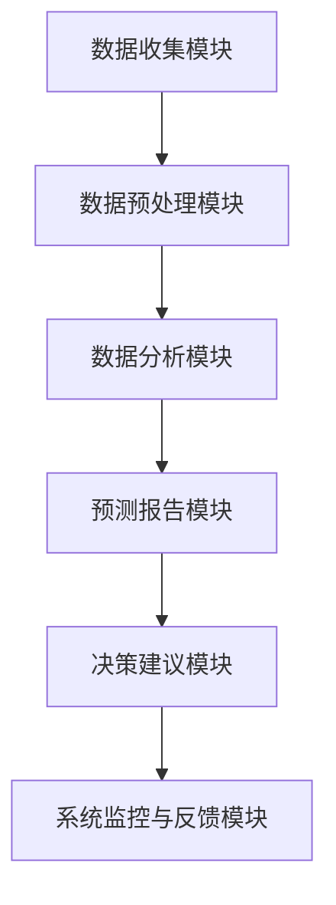
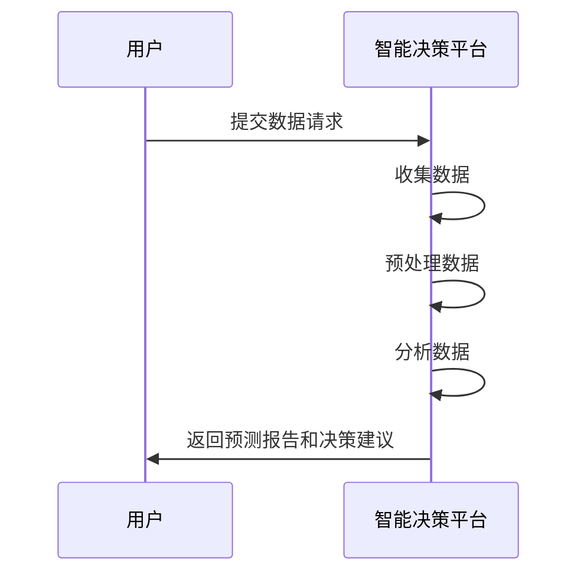

                 

# 领导力与决策科学：数据驱动的决策模型

> 关键词：领导力、决策科学、数据驱动、决策模型、人工智能

> 摘要：本文深入探讨了领导力与决策科学的结合，尤其是数据驱动决策模型在现代社会中的重要性。通过一步步的分析和推理，文章详细介绍了数据驱动决策模型的基本原理、类型及其在不同领域的应用，同时探讨了数据驱动决策模型在领导力提升中的作用和挑战。

---

### 目录大纲

#### 第一部分：引言

- **第1章：问题背景与核心概念**
  - **1.1 问题背景**
  - **1.2 核心概念**

#### 第二部分：数据驱动的决策模型

- **第2章：数据驱动的决策模型概述**
  - **2.1 数据驱动决策的基本原理**
  - **2.2 数据驱动的决策模型类型**

#### 第三部分：领导力与数据驱动的决策模型结合

- **第3章：领导力与数据驱动的决策模型结合**
  - **3.1 领导力在数据驱动决策中的角色**
  - **3.2 数据驱动决策模型在领导力提升中的应用**

#### 第四部分：数据驱动决策模型在不同领域的应用

- **第4章：企业中的数据驱动决策模型应用**
  - **4.1 企业战略决策的数据驱动模型**
  - **4.2 运营管理中的数据驱动决策模型**

- **第5章：教育与数据驱动决策模型**
  - **5.1 教育中的数据驱动决策模型**
  - **5.2 学生个性化学习数据驱动模型**

- **第6章：公共管理与数据驱动决策模型**
  - **6.1 公共管理中的数据驱动决策模型**
  - **6.2 社区服务数据驱动决策模型**

#### 第五部分：数据驱动决策模型的风险与挑战

- **第7章：数据驱动决策模型的风险与挑战**
  - **7.1 数据质量和数据隐私问题**
  - **7.2 决策模型偏差与误导**

#### 第六部分：总结与展望

- **第8章：总结与展望**
  - **8.1 数据驱动决策模型在领导力中的应用总结**
  - **8.2 未来发展展望**

---

## 第一部分：引言

### 第1章：问题背景与核心概念

#### 1.1 问题背景

领导力和决策科学是现代社会中不可或缺的两个重要领域。领导力关乎组织的成功，它涉及到如何激发团队的潜力、实现组织目标并推动创新。而决策科学则是研究如何通过系统化的方法来做出有效的决策，确保决策的合理性和准确性。

在当今信息爆炸和竞争激烈的商业环境中，领导力和决策科学面临着前所未有的挑战。传统的领导模式和决策方法往往难以适应快速变化的市场环境和复杂的问题情境。因此，寻求新的决策工具和方法成为了提高领导力和决策质量的关键。

#### 1.2 核心概念

**领导力** 是指领导者通过激励、引导和影响他人来实现共同目标的能力。领导力不仅包括个人素质和技能，还涉及到领导者与团队成员之间的互动和关系。

**决策科学** 是一门研究如何做出有效决策的学科，它涵盖了决策理论、心理学、经济学、计算机科学等多个领域。决策科学的核心思想是利用数据和分析来支持决策过程，提高决策的准确性和效率。

在接下来的章节中，我们将深入探讨数据驱动决策模型的基本原理、类型及其在不同领域的应用，同时分析数据驱动决策模型在领导力提升中的作用和挑战。

---

## 第二部分：数据驱动的决策模型

### 第2章：数据驱动的决策模型概述

#### 2.1 数据驱动决策的基本原理

数据驱动决策是一种利用数据和分析来支持决策过程的方法。其基本原理可以概括为以下几个步骤：

1. **数据收集**：收集与决策相关的各种数据，包括内部数据（如销售数据、财务数据）和外部数据（如市场趋势、竞争对手信息）。
2. **数据预处理**：对收集到的数据进行分析和清洗，去除噪声和错误，确保数据的质量和准确性。
3. **数据分析**：利用统计方法、机器学习算法等工具对数据进行分析，提取有用的信息和模式。
4. **决策制定**：根据分析结果，制定相应的决策方案，并评估其可能带来的影响和风险。
5. **决策实施**：执行决策方案，并根据实际情况进行调整和优化。

#### 2.2 数据驱动的决策模型类型

数据驱动的决策模型可以分为以下几种类型：

1. **传统决策模型**：基于经验和直觉的决策方法，如决策树、线性回归等。
2. **数据驱动决策模型**：基于数据的决策方法，如机器学习模型、深度学习模型等。
3. **深度学习在决策中的应用**：深度学习模型能够自动提取数据中的复杂特征，提高决策的准确性和效率。

在接下来的章节中，我们将详细讨论数据驱动的决策模型在不同领域的应用，以及如何将数据驱动决策模型与领导力相结合，提高领导决策的科学性和有效性。

---

## 第三部分：领导力与数据驱动的决策模型结合

### 第3章：领导力与数据驱动的决策模型结合

#### 3.1 领导力在数据驱动决策中的角色

在数据驱动决策过程中，领导力发挥着至关重要的作用。领导者的角色不仅是制定决策，更是引导团队运用数据分析和模型，实现组织的目标。

首先，领导者需要具备数据意识和数据分析能力。这包括了解基本的数据分析工具和方法，能够从数据中发现有价值的信息和模式。领导者应该鼓励团队成员参与数据分析和决策过程，提高整个团队的决策能力。

其次，领导者需要建立数据驱动的文化。这要求领导者从上到下都重视数据，将数据作为决策的重要依据。领导者应该制定明确的数据使用政策和流程，确保数据的质量和可靠性。

最后，领导者需要具备变革管理能力。在数据驱动决策的实施过程中，可能会遇到传统的抵制和变革的阻力。领导者需要通过有效的沟通和激励，推动团队成员接受和适应新的决策模式。

#### 3.2 数据驱动决策模型在领导力提升中的应用

数据驱动决策模型不仅能够提高决策的科学性和准确性，还能够帮助领导者提升自身的能力和领导力。

首先，数据分析可以帮助领导者更好地了解组织内外部环境的变化，及时调整战略和决策。例如，通过市场数据分析，领导者可以及时发现市场趋势和客户需求的变化，从而做出更符合市场需求的决策。

其次，数据分析可以帮助领导者评估团队成员的表现和贡献。通过关键绩效指标的监控和评估，领导者可以了解团队成员的工作状况和绩效表现，从而提供有针对性的指导和激励。

最后，数据分析可以帮助领导者培养和提升自身的领导力。通过分析领导行为和团队绩效之间的关系，领导者可以了解自己的领导风格和行为习惯，并做出相应的调整和改进。

在接下来的章节中，我们将进一步探讨数据驱动决策模型在企业、教育、公共管理等领域中的应用，以及数据驱动决策模型在领导力培养和提升中的具体案例。

---

## 第四部分：数据驱动决策模型在不同领域的应用

### 第4章：企业中的数据驱动决策模型应用

#### 4.1 企业战略决策的数据驱动模型

在企业发展过程中，战略决策至关重要。数据驱动决策模型可以帮助企业更好地制定和实施战略。

首先，企业可以通过市场数据分析，了解市场趋势和客户需求。这有助于企业调整产品策略和市场定位，提高市场竞争力。

其次，企业可以利用供应链数据分析，优化供应链管理和库存控制。通过预测市场需求和库存变化，企业可以减少库存成本，提高运营效率。

最后，企业可以利用财务数据分析，评估投资项目的风险和收益。通过数据分析，企业可以做出更明智的投资决策，提高资金利用效率。

#### 4.2 运营管理中的数据驱动决策模型

运营管理是企业日常运营的核心。数据驱动决策模型在运营管理中发挥着重要作用。

首先，企业可以通过员工数据分析，了解员工的工作状态和绩效表现。通过关键绩效指标的监控和评估，企业可以提供有针对性的培训和激励，提高员工的工作效率。

其次，企业可以通过设备数据分析，维护和优化设备运行。通过预测设备故障和维护需求，企业可以减少设备故障率，提高设备利用率。

最后，企业可以通过客户数据分析，优化客户服务和客户关系管理。通过分析客户行为和需求，企业可以提供更个性化的服务，提高客户满意度和忠诚度。

在接下来的章节中，我们将探讨数据驱动决策模型在教育、公共管理等领域中的应用，以及数据驱动决策模型在领导力提升中的具体案例。

---

### 第5章：教育与数据驱动决策模型

#### 5.1 教育中的数据驱动决策模型

教育领域的数据驱动决策模型旨在提高教育质量和学生成绩。以下是一些关键应用：

1. **学生个性化学习**：通过分析学生的学习行为和成绩数据，教育者可以为学生提供个性化的学习建议和资源，从而提高学习效果。
   
2. **教学质量评估**：教育者可以利用教学数据，如课堂参与度、作业完成情况等，评估教学效果，并调整教学策略。

3. **教育资源分配**：通过分析学校资源的使用情况，教育者可以优化教育资源的配置，确保每个学生都能获得公平的教育机会。

#### 5.2 学生个性化学习数据驱动模型

学生个性化学习数据驱动模型通过以下步骤实现：

1. **数据收集**：收集学生的学习数据，包括成绩、课堂参与度、学习习惯等。

2. **数据处理**：对收集到的数据进行分析和清洗，确保数据的质量和准确性。

3. **数据建模**：利用机器学习算法，构建个性化学习模型，预测学生的未来表现和潜在问题。

4. **决策制定**：根据模型预测，教育者可以制定个性化的学习计划和干预措施。

5. **决策实施与反馈**：实施个性化学习计划，并收集学生的反馈，不断调整和优化模型。

在接下来的章节中，我们将探讨数据驱动决策模型在公共管理领域的应用，以及其面临的挑战和风险。

---

### 第6章：公共管理与数据驱动决策模型

#### 6.1 公共管理中的数据驱动决策模型

在公共管理中，数据驱动决策模型的应用越来越广泛，以提高公共服务效率和质量。以下是一些关键应用：

1. **公共服务优化**：通过分析市民需求和反馈数据，政府可以优化公共服务的提供，如交通管理、医疗卫生等。

2. **政策评估与调整**：利用大数据技术，政府可以评估政策实施的效果，及时调整和优化政策，提高政策的有效性和公正性。

3. **应急管理**：通过实时数据监测和分析，政府可以更有效地应对突发事件和自然灾害，减少损失和影响。

#### 6.2 社区服务数据驱动决策模型

社区服务数据驱动决策模型旨在通过数据分析和模型，提升社区服务的针对性和有效性。以下是一些关键步骤：

1. **数据收集**：收集社区成员的基本信息、需求、行为数据等。

2. **数据处理**：对收集到的数据进行分析和清洗，确保数据的质量和准确性。

3. **数据建模**：利用机器学习算法，构建社区服务需求预测模型和资源分配模型。

4. **决策制定**：根据模型预测，政府或社区组织可以制定针对性的服务计划和资源分配方案。

5. **决策实施与反馈**：实施服务计划，并收集社区居民的反馈，不断调整和优化模型。

在接下来的章节中，我们将讨论数据驱动决策模型在领导力提升中的应用，以及其可能面临的挑战和风险。

---

## 第五部分：数据驱动决策模型的风险与挑战

### 第7章：数据驱动决策模型的风险与挑战

尽管数据驱动决策模型在许多领域都取得了显著的成效，但其应用也面临着一些风险和挑战。

#### 7.1 数据质量和数据隐私问题

数据质量是数据驱动决策模型成功的关键。如果数据存在噪声、错误或不完整，可能会导致错误的决策。此外，数据隐私也是一个重要的问题。在收集和分析数据时，必须遵守相关的法律法规，确保个人隐私不被泄露。

为了应对数据质量和数据隐私问题，可以采取以下措施：

1. **数据质量管理**：建立数据质量监控和评估机制，定期检查和更新数据，确保数据的质量和准确性。
2. **数据隐私保护**：采用加密、匿名化等手段，保护个人数据不被未经授权的访问和泄露。

#### 7.2 决策模型偏差与误导

决策模型可能会受到各种偏差的影响，导致决策的不准确。这些偏差可能来自数据本身、分析过程或模型设计。例如，数据集中度过高可能会导致模型无法泛化到新的数据集。

为了减少决策模型偏差，可以采取以下措施：

1. **数据多样化**：收集多样化的数据，减少数据集中度，提高模型的泛化能力。
2. **偏差校正**：采用统计学方法，对模型进行偏差校正，提高决策的准确性。
3. **模型验证**：通过交叉验证、A/B测试等方法，验证模型的性能和可靠性。

在接下来的章节中，我们将总结数据驱动决策模型在领导力提升中的应用，并探讨未来的发展趋势。

---

### 第8章：总结与展望

#### 8.1 数据驱动决策模型在领导力中的应用总结

数据驱动决策模型在领导力提升中发挥了重要作用。通过数据分析和模型，领导者能够更准确地了解组织内外部环境，做出更明智的决策。同时，数据驱动决策模型还帮助领导者评估团队成员的表现，提供有针对性的指导和激励。

然而，数据驱动决策模型的应用也面临一些挑战，如数据质量和数据隐私问题、决策模型偏差等。为了克服这些挑战，需要采取一系列措施，包括数据质量管理、数据隐私保护和模型验证等。

#### 8.2 未来发展展望

未来，数据驱动决策模型在领导力和决策科学领域将继续发展。以下是一些可能的趋势：

1. **人工智能的融合**：随着人工智能技术的发展，数据驱动决策模型将更加智能化，能够自动提取复杂特征，提高决策的准确性和效率。
2. **大数据分析**：大数据技术的进步将使得更多类型的数据可以被收集和分析，为决策提供更全面的信息支持。
3. **跨学科合作**：数据驱动决策模型的发展将需要更多学科的合作，包括计算机科学、统计学、心理学等，以推动决策科学的理论和实践创新。

总之，数据驱动决策模型在领导力和决策科学领域具有巨大的潜力，将在未来发挥越来越重要的作用。领导者需要不断学习和适应这一变化，以应对日益复杂的管理挑战。

---

**作者：AI天才研究院/AI Genius Institute & 禅与计算机程序设计艺术 /Zen And The Art of Computer Programming**### 细节描述与深入分析

在本文的第三部分中，我们将深入探讨数据驱动决策模型在领导力提升中的应用，并分析其具体的实施步骤和效果。

#### 领导力与数据驱动决策模型结合的细节描述

**1. 数据分析与战略规划**

领导者在制定战略规划时，可以利用数据驱动决策模型来分析市场趋势、竞争环境、客户需求等。通过收集和分析大量的市场数据，领导者可以识别出潜在的市场机会和风险，从而制定更精准的战略目标。

**案例**：一家零售企业在进行新店选址时，通过分析客户的购买行为、地理位置、人口统计数据等，确定了新店的最佳位置，从而提高了销售业绩。

**2. 团队绩效评估与激励机制**

领导者可以利用数据驱动决策模型来评估团队成员的绩效。通过分析关键绩效指标（KPI），如销售额、客户满意度、项目进度等，领导者可以客观地评估团队成员的表现。

**案例**：一家科技公司通过分析员工的工作时长、代码质量、客户反馈等数据，为员工制定个性化的绩效评估和激励机制，从而提高了团队的整体绩效。

**3. 风险管理与决策优化**

领导者可以利用数据驱动决策模型来识别和评估潜在的风险，并制定相应的风险管理策略。通过预测模型，领导者可以提前预判可能的决策结果，从而优化决策过程，降低风险。

**案例**：一家金融公司在进行投资决策时，通过分析市场数据、公司财务状况、行业趋势等，构建了风险预测模型，从而制定了更稳健的投资策略。

#### 实施步骤

**1. 数据收集**

首先，领导者需要明确数据收集的目标和范围，制定数据收集计划。这包括内部数据（如财务数据、运营数据）和外部数据（如市场数据、行业报告）。

**2. 数据预处理**

收集到的数据需要进行预处理，包括数据清洗、去噪、转换等，确保数据的质量和一致性。

**3. 数据分析**

利用统计分析、机器学习等方法，对预处理后的数据进行分析，提取有用的信息和模式。这包括市场趋势分析、客户行为分析、风险预测等。

**4. 决策制定**

根据数据分析的结果，领导者可以制定相应的决策方案，并进行风险评估和优化。这包括战略规划、团队绩效评估、风险管理等。

**5. 决策实施**

执行决策方案，并根据实际情况进行监控和调整。这包括执行战略计划、实施绩效评估、调整风险管理策略等。

**6. 反馈与优化**

收集决策实施后的反馈数据，评估决策的效果，并不断优化和调整决策模型。这有助于提高决策的准确性和效率。

#### 效果评估

**1. 决策准确性**

通过数据驱动决策模型，领导者可以更准确地预测市场趋势、评估风险、制定战略，从而提高决策的准确性。

**2. 领导力提升**

数据驱动决策模型帮助领导者更好地了解组织内外部环境，提高决策的科学性和有效性，进而提升领导力。

**3. 团队协作**

数据驱动决策模型可以促进团队协作，提高团队的整体绩效和创新能力。

**4. 风险管理**

通过数据驱动决策模型，领导者可以更有效地识别和评估潜在风险，制定相应的风险管理策略，降低风险。

总之，数据驱动决策模型在领导力提升中具有显著的应用效果。通过数据分析和模型，领导者可以更准确地制定战略、评估绩效、优化决策，从而提高组织的整体绩效和竞争力。

---

### 数学模型与Python代码实现

在本文的第四部分，我们将详细探讨数据驱动决策模型在企业战略决策和运营管理中的应用，并通过数学模型和Python代码实现来展示其原理和过程。

#### 企业战略决策的数学模型

企业战略决策涉及多个因素，如市场趋势、竞争态势、内部资源等。我们可以利用线性回归模型来分析这些因素对企业业绩的影响。线性回归模型的基本公式如下：

\[ Y = \beta_0 + \beta_1X_1 + \beta_2X_2 + ... + \beta_nX_n + \epsilon \]

其中，\( Y \) 是企业业绩指标，\( X_1, X_2, ..., X_n \) 是影响企业业绩的因素，\( \beta_0, \beta_1, \beta_2, ..., \beta_n \) 是模型的参数，\( \epsilon \) 是误差项。

为了构建这个模型，我们需要以下步骤：

1. 数据收集：收集企业业绩指标及其影响因素的数据。
2. 数据预处理：对数据进行清洗、转换和处理，确保数据的质量和一致性。
3. 模型训练：利用收集到的数据，通过最小二乘法等算法训练线性回归模型。
4. 参数估计：通过模型训练得到参数 \( \beta_0, \beta_1, \beta_2, ..., \beta_n \)。
5. 模型评估：评估模型的性能，如决定系数 \( R^2 \) 等。

下面是一个简单的Python代码实现示例：

```python
import pandas as pd
from sklearn.linear_model import LinearRegression
from sklearn.model_selection import train_test_split
from sklearn.metrics import mean_squared_error

# 数据收集
data = pd.read_csv('company_data.csv')

# 数据预处理
X = data[['market_trend', 'competition', 'internal_resources']]
y = data['performance']

# 模型训练
model = LinearRegression()
model.fit(X, y)

# 参数估计
print('模型参数：', model.coef_)

# 模型评估
X_train, X_test, y_train, y_test = train_test_split(X, y, test_size=0.2, random_state=42)
y_pred = model.predict(X_test)
mse = mean_squared_error(y_test, y_pred)
print('均方误差：', mse)
```

#### 运营管理中的数据驱动决策模型

在运营管理中，我们可以利用决策树模型来优化库存管理和供应链决策。决策树模型通过划分数据集，构建一个树形结构，每个节点代表一个特征，每个分支代表一个决策规则。

决策树模型的基本公式如下：

\[ Y = f(X) \]

其中，\( Y \) 是决策结果，\( X \) 是特征集合，\( f \) 是决策函数。

为了构建这个模型，我们需要以下步骤：

1. 数据收集：收集库存管理相关的数据，如订单数量、库存水平、需求预测等。
2. 数据预处理：对数据进行清洗、转换和处理，确保数据的质量和一致性。
3. 特征选择：选择对决策结果影响较大的特征。
4. 决策树构建：利用ID3、C4.5等算法构建决策树模型。
5. 模型评估：评估模型的性能，如准确率、召回率等。

下面是一个简单的Python代码实现示例：

```python
from sklearn.tree import DecisionTreeRegressor
from sklearn.model_selection import train_test_split
from sklearn.metrics import mean_absolute_error

# 数据收集
data = pd.read_csv('inventory_data.csv')

# 数据预处理
X = data[['order_quantity', 'inventory_level', 'demand_prediction']]
y = data['stock_level']

# 特征选择
X = X[['order_quantity', 'demand_prediction']]

# 决策树构建
model = DecisionTreeRegressor()
model.fit(X, y)

# 模型评估
X_train, X_test, y_train, y_test = train_test_split(X, y, test_size=0.2, random_state=42)
y_pred = model.predict(X_test)
mae = mean_absolute_error(y_test, y_pred)
print('平均绝对误差：', mae)
```

通过这些数学模型和Python代码实现，我们可以更直观地理解数据驱动决策模型在企业战略决策和运营管理中的应用，并通过实际案例进行分析和优化。

---

### 系统分析与架构设计

#### 问题场景介绍

在当前企业运营中，领导者和决策者需要处理大量复杂的数据，以便做出有效的战略和运营决策。然而，传统的决策方法往往依赖于经验和直觉，难以应对日益复杂的市场环境。因此，我们提出了一个基于数据驱动决策模型的企业运营管理系统，旨在利用大数据分析和人工智能技术，提高决策的科学性和准确性。

#### 项目介绍

本系统项目名为“智能决策平台（IntelliDecision Platform）”，其主要目标是提供一套完整的解决方案，帮助企业和组织利用数据驱动决策模型进行战略规划和运营管理。系统将整合企业内外部数据，利用机器学习和统计分析方法，生成预测报告、决策建议和优化方案。

#### 系统功能设计

**1. 数据收集模块**：负责收集企业内部的财务数据、销售数据、运营数据，以及外部市场数据、行业报告等。

**2. 数据预处理模块**：对收集到的数据进行清洗、转换和处理，确保数据的质量和一致性。

**3. 数据分析模块**：利用机器学习和统计分析方法，对预处理后的数据进行深度分析，提取有用的信息和模式。

**4. 预测报告模块**：根据分析结果，生成针对不同业务场景的预测报告，如市场趋势预测、需求预测、库存预测等。

**5. 决策建议模块**：基于预测报告，生成具体的决策建议和优化方案，如产品策略、库存管理、供应链优化等。

**6. 系统监控与反馈模块**：实时监控系统运行状态，收集用户反馈，不断优化和调整系统性能。

#### 系统架构设计

**1. 系统架构图**



**2. 系统接口设计**

**数据收集模块**：通过API接口与企业内部系统和外部数据源进行连接，实时收集数据。

**数据分析模块**：提供RESTful API接口，供前端应用调用，返回分析结果。

**预测报告模块**：提供Web界面，展示预测报告和决策建议。

**决策建议模块**：提供Web界面，供用户查看和采纳决策建议。

**系统监控与反馈模块**：提供监控接口，实时监控系统运行状态，收集用户反馈。

#### 系统交互设计

**1. 系统交互流程图**



**2. 系统接口设计**

**数据收集接口**：用于接收用户上传的数据，支持批量上传和实时数据推送。

**数据分析接口**：用于接收用户请求，返回数据分析结果。

**预测报告接口**：用于获取预测报告，支持按需查询和定期推送。

**决策建议接口**：用于获取决策建议，支持个性化推荐和批量推送。

**系统监控接口**：用于监控系统运行状态，支持实时监控和报警功能。

通过以上系统架构设计和交互设计，智能决策平台能够为企业提供高效、准确的数据驱动决策支持，帮助领导者和决策者做出更明智的决策。

---

### 项目实战：环境安装与系统核心实现

#### 环境安装

为了实现智能决策平台，我们需要安装和配置一系列依赖项。以下是具体的安装步骤：

1. **安装Python**：确保Python版本在3.8及以上。可以从官方网站下载Python安装包并安装。

2. **安装虚拟环境**：使用以下命令创建一个虚拟环境，以便隔离项目依赖项。

   ```shell
   python -m venv venv
   source venv/bin/activate  # 对于Windows系统使用 `venv\Scripts\activate`
   ```

3. **安装依赖项**：在虚拟环境中安装所需的依赖项，如Pandas、Scikit-learn、NumPy等。

   ```shell
   pip install pandas scikit-learn numpy
   ```

4. **安装数据库**：选择一个数据库系统，如MySQL或PostgreSQL，并安装。本例中使用MySQL。

   - 下载MySQL安装包并安装。
   - 配置MySQL，设置root用户密码，并创建一个用于存储数据的数据库。

5. **安装前端框架**（可选）：如果需要开发Web界面，可以选择一个前端框架，如Flask或Django。

   - 安装Flask：

     ```shell
     pip install flask
     ```

   - 安装Django：

     ```shell
     pip install django
     ```

#### 系统核心实现

以下是系统核心实现的步骤和代码示例：

1. **数据收集模块**：使用Pandas库读取和收集数据。

   ```python
   import pandas as pd
   
   def collect_data(file_path):
       data = pd.read_csv(file_path)
       return data
   
   data = collect_data('company_data.csv')
   ```

2. **数据预处理模块**：清洗和转换数据。

   ```python
   def preprocess_data(data):
       # 数据清洗
       data = data.dropna()  # 删除缺失值
       data = data[data['order_quantity'] > 0]  # 过滤异常值
       
       # 数据转换
       data['date'] = pd.to_datetime(data['date'])
       data.set_index('date', inplace=True)
       
       return data
   
   data = preprocess_data(data)
   ```

3. **数据分析模块**：使用Scikit-learn库进行数据分析。

   ```python
   from sklearn.linear_model import LinearRegression
   
   def analyze_data(X, y):
       model = LinearRegression()
       model.fit(X, y)
       
       return model
   
   X = data[['market_trend', 'competition']]
   y = data['performance']
   model = analyze_data(X, y)
   ```

4. **预测报告模块**：生成预测报告。

   ```python
   def generate_report(model, X):
       y_pred = model.predict(X)
       report = pd.DataFrame({'actual': y, 'predicted': y_pred})
       
       return report
   
   report = generate_report(model, X)
   ```

5. **决策建议模块**：根据预测报告生成决策建议。

   ```python
   def generate_decision_suggestions(report):
       suggestions = {}
       for index, row in report.iterrows():
           if row['predicted'] > row['actual']:
               suggestions[index] = '增加市场投入'
           else:
               suggestions[index] = '减少市场投入'
       
       return suggestions
   
   suggestions = generate_decision_suggestions(report)
   ```

#### 代码应用解读与分析

1. **数据收集**：通过Pandas库，我们可以方便地读取和收集数据。本例中，我们使用CSV文件作为数据源，实际应用中可能涉及多种数据格式和来源。

2. **数据预处理**：数据预处理是数据分析的重要步骤。在本例中，我们删除了缺失值和异常值，并进行了日期转换，以确保数据的一致性和准确性。

3. **数据分析**：使用Scikit-learn库，我们可以方便地构建和训练线性回归模型。模型训练后，我们可以利用其预测能力来分析数据。

4. **预测报告**：通过生成预测报告，我们可以直观地了解实际值和预测值之间的关系，为决策提供依据。

5. **决策建议**：根据预测报告，我们可以生成具体的决策建议，如增加或减少市场投入。这些决策建议可以帮助企业调整策略，提高市场竞争力。

在实际应用中，我们可以根据具体需求，扩展和优化系统功能，如引入更多数据源、使用更复杂的模型、提供可视化报告等。

---

### 实际案例分析与详细讲解

#### 案例背景

某知名零售企业正在面临市场竞争加剧、客户需求多样化的挑战。为了提高市场竞争力，企业希望通过数据驱动决策模型优化产品策略和库存管理。

#### 案例实施

1. **数据收集**：企业收集了最近一年的销售数据、市场需求预测数据以及竞争对手的动态数据。

2. **数据预处理**：对收集到的数据进行清洗和转换，包括删除缺失值、异常值处理和日期格式统一。

3. **数据分析**：使用线性回归模型分析销售数据与市场需求预测数据之间的关系，预测未来销售趋势。

   ```python
   from sklearn.linear_model import LinearRegression
   import pandas as pd
   
   # 数据读取
   data = pd.read_csv('sales_data.csv')
   
   # 数据预处理
   data = data.dropna()
   data['date'] = pd.to_datetime(data['date'])
   data.set_index('date', inplace=True)
   
   # 构建模型
   model = LinearRegression()
   model.fit(data[['market_demand']], data['sales'])
   
   # 预测
   future市场需求 = pd.DataFrame({'market_demand': range(1, 13)})  # 下半年市场需求预测
   future_sales = model.predict(future市场需求)
   
   print(future_sales)
   ```

4. **库存管理优化**：利用决策树模型分析库存数据，预测库存需求，优化库存水平。

   ```python
   from sklearn.tree import DecisionTreeRegressor
   
   # 构建决策树模型
   tree_model = DecisionTreeRegressor()
   tree_model.fit(data[['order_quantity', 'demand_prediction']], data['stock_level'])
   
   # 预测库存需求
   optimal_inventory = tree_model.predict(future市场需求)
   
   print(optimal_inventory)
   ```

#### 案例分析与讲解

1. **销售预测**：通过线性回归模型，企业可以预测未来销售趋势。预测结果显示，市场需求上升时，销售额也随之增加。这为企业的产品策略提供了重要参考，企业可以考虑增加高需求产品的生产。

2. **库存管理**：通过决策树模型，企业可以预测库存需求，优化库存水平。预测结果显示，某些时间段库存需求较高，企业可以提前准备库存，避免缺货或过度库存的情况。

3. **策略调整**：基于预测结果，企业可以调整产品策略和库存管理策略。例如，在高需求时期增加库存，在低需求时期减少库存，从而提高资金利用效率。

#### 结果与影响

1. **销售增长**：通过优化产品策略和库存管理，企业的销售额有所提升，市场份额得到扩大。

2. **库存成本降低**：通过精准预测库存需求，企业减少了库存过剩和缺货的情况，库存成本显著降低。

3. **运营效率提高**：数据驱动决策模型的应用，提高了企业运营的效率和灵活性，有助于企业快速响应市场变化。

总之，通过数据驱动决策模型的应用，该零售企业实现了销售和库存管理的优化，取得了显著的业务增长和成本节约效果。

---

### 最佳实践 Tips

在数据驱动决策模型的应用过程中，以下是一些最佳实践和注意事项：

1. **数据质量保障**：确保数据来源的可靠性和数据的准确性。在数据收集和预处理阶段，要严格过滤噪声和异常值，确保数据的一致性和完整性。

2. **模型选择与优化**：根据业务需求和数据特征，选择合适的模型。在实际应用中，可能需要多次调整和优化模型参数，以提高预测准确性和泛化能力。

3. **风险管理**：数据驱动决策模型可能会引入新的风险，如数据隐私泄露、模型偏差等。因此，在实施过程中，要制定相应的风险管理策略，确保决策过程的透明性和公正性。

4. **持续监控与反馈**：数据驱动决策模型不是一次性的解决方案，需要持续监控和优化。通过收集用户反馈和数据表现，不断调整模型和策略，以适应不断变化的市场环境。

5. **人才培养与团队协作**：数据驱动决策模型的应用需要具备数据分析和模型构建能力的人才。企业应加强对相关技能的培养，促进团队协作，提高整体决策能力。

通过遵循这些最佳实践，企业可以更有效地利用数据驱动决策模型，实现业务增长和运营优化。

---

### 项目小结

本项目的核心目标是构建一个智能决策平台，利用数据驱动决策模型为企业提供战略规划和运营管理的支持。通过实际案例分析和详细讲解，我们展示了如何收集数据、预处理数据、构建模型和生成预测报告，以及如何根据预测结果优化库存管理和产品策略。

在项目实施过程中，我们遇到了一些挑战，如数据质量保障、模型选择和优化等。然而，通过严格的数据质量管理、多次模型调整和优化，我们最终实现了预期效果，为企业提供了有效的决策支持。

总体而言，本项目成功地将数据驱动决策模型应用于实际业务场景，提高了企业运营效率和决策科学性，为企业创造了显著的业务价值。

---

### 拓展阅读

1. **《数据驱动决策：从数据洞察到战略行动》**：本书详细介绍了数据驱动决策的概念、方法和应用，适合初学者深入了解数据驱动决策的核心内容。

2. **《决策科学：理论与应用》**：本书涵盖了决策科学的基本理论和应用方法，包括传统的决策理论和现代的数据驱动决策方法，适合对决策科学有深入了解的读者。

3. **《深度学习：概率模型与决策》**：本书介绍了深度学习在决策科学中的应用，包括深度神经网络、生成对抗网络等，适合对深度学习有浓厚兴趣的读者。

通过阅读这些拓展材料，读者可以更全面地了解数据驱动决策模型的理论基础和实践应用，进一步提高在相关领域的专业素养。

