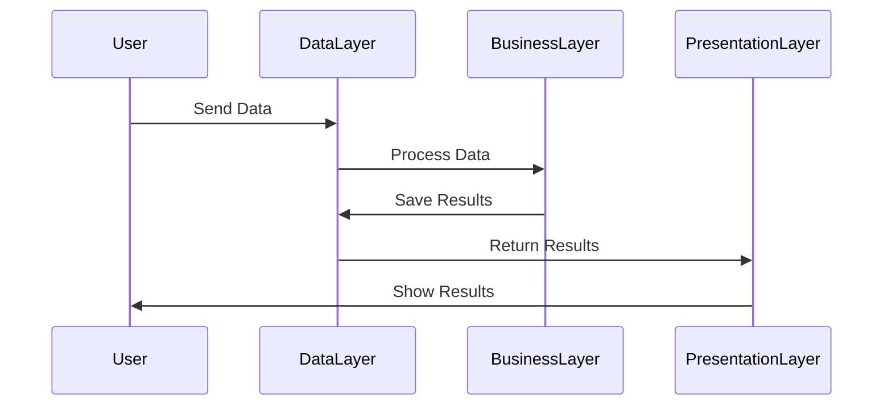
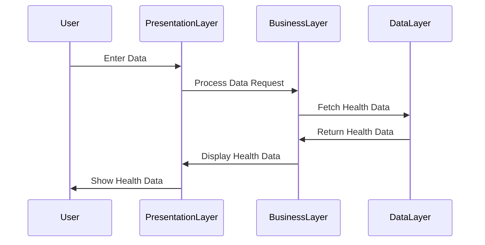

                 

### 引言

在当今这个技术飞速发展的时代，创新已经成为企业保持竞争优势和持续发展的关键。而领导力在推动创新过程中扮演着至关重要的角色。本文将围绕“领导力与创新：培养创新文化的策略”这一主题，探讨领导力在创新中的核心作用，以及如何通过系统化的策略来培养和维持一个创新文化。

首先，我们将定义领导力和创新，并介绍它们的基本概念及其相互关系。接着，我们将深入分析当前环境下创新面临的挑战，并探讨这些挑战如何影响企业的创新文化。然后，本文将详细阐述领导力与创新的核心概念，包括创新思维模式、创新过程要素等，为后续策略的提出提供理论基础。

在核心策略部分，我们将探讨领导力在创新文化中的角色，如何塑造文化、促进创新行为以及激励创新者。随后，通过案例分析，我们将深入了解成功企业如何构建创新文化，以及这些经验对其他企业的启示。接下来，我们将分享最佳实践，包括创新项目管理和领导力提升的方法。

最后，文章将在总结与展望部分重申创新文化的重要性，并探讨未来领导力与创新文化的挑战与机遇。通过这些步骤，本文旨在为读者提供一个全面、系统的理解和实践框架，帮助他们在企业中培养和维持一个创新文化。

### 关键词

- **领导力**：指领导者通过影响和激励他人，实现组织目标的能力。
- **创新**：指通过创造新的想法、产品或服务，改变现有状况的过程。
- **创新文化**：指组织中普遍认同和践行的价值观和行为模式，鼓励创新行为。
- **策略**：指为实现特定目标所采取的系统性方法和步骤。
- **挑战**：指在创新过程中面临的困难和障碍。
- **最佳实践**：指成功实施创新策略的经验和技巧。

### 摘要

本文旨在探讨领导力在创新过程中的核心作用，以及如何通过系统化的策略来培养和维护一个创新文化。文章首先定义了领导力和创新的基本概念，并分析了当前环境下创新面临的挑战。接着，本文详细阐述了领导力与创新的核心概念，包括创新思维模式和过程要素。随后，通过案例分析，探讨了成功企业如何构建创新文化，并分享了最佳实践。最后，文章总结了创新文化的重要性，并展望了未来领导力与创新文化的挑战与机遇。

## 第一部分：领导力与创新的背景与重要性

### 第1章：领导力与创新的定义和背景

#### 1.1 领导力的本质与作用

**领导力的概念**

领导力是一种影响力，是领导者通过激励、指导和影响他人，实现组织目标的能力。它不仅仅是一种管理技能，更是一种艺术，涉及到领导者的情感智慧、人际关系技巧和战略思考。领导力不仅仅是针对企业或组织内部的，还可以扩展到社会、政治和其他领域。

**领导力的作用**

领导力在组织中的作用主要体现在以下几个方面：

1. **指导与目标设定**：领导者通过设定明确的目标和愿景，指导团队成员朝着共同的方向努力，确保组织的发展方向正确。
2. **激励与鼓舞**：领导者通过激励和鼓舞团队，提升员工的积极性和创造力，使团队在面对挑战时保持高昂的斗志。
3. **团队建设**：领导者通过培养团队精神和协作，增强团队的凝聚力和协作效率，从而提高组织的整体绩效。
4. **决策与战略**：领导者通过战略思考和决策，为组织的发展提供方向和保障，确保组织能够应对外部环境的变动。

#### 1.2 创新的定义与类型

**创新的概念**

创新是一种通过新的想法、方法或技术来改变现有状况的过程。它不仅仅是指产品或技术的创新，还包括管理、服务、商业模式等各个方面的创新。创新是推动企业持续发展和竞争力的关键因素。

**创新的类型**

根据创新的内容和形式，创新可以分为以下几种类型：

1. **技术型创新**：指通过新技术或新产品的开发，实现产品的创新或升级。
2. **管理型创新**：指通过新的管理理念、方法和工具，提升组织的运营效率和管理水平。
3. **服务型创新**：指通过新的服务模式或方法，提升客户体验和服务质量。
4. **商业模式创新**：指通过新的商业模式或盈利模式，实现企业价值的提升。

#### 1.3 创新的重要性

创新在企业发展中具有至关重要的地位，主要体现在以下几个方面：

1. **提升竞争力**：创新可以帮助企业不断推出新产品或服务，满足市场需求，提升市场竞争力。
2. **促进增长**：创新可以推动企业的规模和范围扩展，实现业绩和利润的增长。
3. **提高效率**：创新可以引入新的技术和管理方法，提升企业的运营效率和生产力。
4. **适应变化**：创新可以帮助企业更好地适应外部环境的变化，确保企业的持续发展。

#### 1.4 领导力与创新的关系

**领导力如何促进创新**

领导力在创新过程中发挥着至关重要的作用，主要体现在以下几个方面：

1. **营造创新氛围**：领导者通过设定明确的创新目标和愿景，营造鼓励创新的文化氛围，激发员工的创新潜力。
2. **提供资源支持**：领导者通过提供必要的资源和支持，为创新项目提供保障，确保创新活动的顺利开展。
3. **激励创新行为**：领导者通过激励和奖励机制，鼓励员工积极参与创新活动，提升创新意识和积极性。
4. **决策与支持**：领导者通过做出明智的决策和提供支持，为创新项目提供方向和保障，确保创新目标的实现。

**创新如何影响领导力**

创新不仅对组织的发展有重要影响，同时也对领导力提出了新的要求和挑战：

1. **适应性**：创新要求领导者具备快速适应变化的能力，以应对新的挑战和机遇。
2. **决策能力**：创新要求领导者具备强大的决策能力，能够在不确定的环境中做出正确的决策。
3. **沟通能力**：创新要求领导者具备良好的沟通能力，能够有效地传达创新目标和愿景，激励团队成员。
4. **团队合作**：创新要求领导者具备团队合作能力，能够搭建一个高效的创新团队，共同实现创新目标。

### 小结

领导力和创新是相互关联、相互促进的。领导力通过营造创新氛围、提供资源支持、激励创新行为和决策支持等方式，促进创新活动的开展；而创新则通过提升竞争力、促进增长、提高效率和适应变化等方式，影响和提升领导力。理解这两者之间的关系，有助于企业在发展中更好地发挥领导力作用，培养和维持一个创新文化。

#### 1.5 当前环境下创新面临的挑战

在当前快速变化的环境中，创新面临着诸多挑战。这些挑战不仅来自外部环境，也源于企业内部的文化和组织结构。以下是创新面临的几个主要挑战：

**1. 技术革新带来的挑战**

随着技术的迅速发展，新技术的涌现和更新速度不断加快，企业需要不断适应和引入新技术。这不仅要求企业具备快速学习和创新能力，还需要具备强大的技术储备和人才支持。

**2. 市场竞争的加剧**

市场竞争的加剧使得企业必须不断创新，以保持竞争优势。然而，市场需求的快速变化和消费者偏好的多样化，使得企业难以持续保持创新的速度和质量。

**3. 社会文化变革的影响**

社会文化的变革，如消费者意识的提升、环境可持续性的要求等，也对创新提出了新的要求。企业需要关注社会文化趋势，将这些趋势融入创新过程中，以满足消费者和社会的需求。

**4. 组织结构和文化惯性的限制**

传统的组织结构和文化惯性往往限制了创新的发展。例如，过于严格的管理体系、固有的思维模式、资源分配的不合理等，都可能成为创新的障碍。

**5. 领导风格与态度的影响**

领导者的风格和态度对创新有着直接的影响。一些领导者可能过于保守，不愿意冒险尝试新事物；而另一些领导者可能缺乏对创新的重视，导致创新活动的缺乏支持。

#### 1.6 创新文化障碍的案例分析

以下是一个关于创新文化障碍的案例分析，以帮助我们更好地理解这些障碍的实际影响：

**案例背景**

某家知名企业曾致力于创新，但在实际操作中遇到了一系列障碍。

**1. 技术革新障碍**

该企业在引入新技术时，由于缺乏相关人才和知识储备，导致新技术应用的失败。这不仅浪费了资源，还影响了企业的创新能力。

**2. 市场竞争障碍**

在激烈的市场竞争中，该企业未能及时推出创新产品，导致市场份额的下降。消费者的需求变化使得企业原有的产品难以满足市场需求。

**3. 社会文化变革影响**

该企业未能及时关注社会文化变革，如环保意识的提升，导致在环保方面竞争力下降，影响了企业形象。

**4. 组织结构和文化惯性障碍**

企业的传统组织结构和文化惯性限制了创新的发展。例如，企业的研发部门与市场部门之间缺乏有效沟通，导致创新项目难以顺利进行。

**5. 领导风格与态度障碍**

企业的领导者过于保守，缺乏对创新的重视和支持。创新项目常常在初期阶段就被否决，导致创新活动的匮乏。

通过这个案例，我们可以看到，创新文化障碍不仅影响企业的创新能力，还可能对企业的整体运营和发展产生负面影响。理解这些障碍，并采取相应的策略，对于企业在创新中取得成功至关重要。

### 1.7 领导力如何塑造创新文化

**1. 设定明确的创新目标和愿景**

领导者通过设定明确的创新目标和愿景，为组织指明创新的方向。这些目标和愿景不仅能够激励员工，还能够为创新活动提供明确的方向和指导。

**2. 建立开放和包容的文化**

领导者需要建立一个开放和包容的文化，鼓励员工提出新的想法和建议。这种文化氛围能够激发员工的创新潜力，使员工更愿意参与到创新活动中。

**3. 提供资源支持**

领导者需要提供必要的资源支持，包括资金、人力和技术等，以确保创新活动的顺利开展。资源的充足供应能够减少创新项目的风险，提高创新的成功率。

**4. 激励和奖励创新行为**

领导者需要建立激励和奖励机制，鼓励员工积极参与创新活动。通过奖励创新者，领导者可以激发员工的创新热情，提高整个组织的创新积极性。

**5. 支持失败并从中学习**

领导者需要支持创新过程中的失败，并从中学习和改进。失败是创新过程中不可避免的一部分，领导者应该鼓励员工从失败中吸取经验教训，不断改进和创新。

**6. 沟通和创新文化**

领导者需要通过有效的沟通，将创新目标和愿景传达给全体员工，确保员工对创新文化有共同的理解和认同。同时，领导者应该鼓励员工分享创新经验和想法，促进创新文化的传播和深化。

### 小结

通过上述讨论，我们可以看到领导力在塑造创新文化中的关键作用。领导者不仅需要设定明确的创新目标和愿景，还需要建立开放和包容的文化，提供资源支持，激励和奖励创新行为，并支持失败并从中学习。这些策略能够有效地促进创新文化的形成和发展，为企业的持续创新提供坚实的基础。

### 第2章：领导力与创新的核心概念

#### 3.1 创新思维模式

创新思维模式是指领导者和管理者在推动创新过程中所采用的各种思考方式。了解和掌握不同的创新思维模式，能够帮助领导者更好地应对创新过程中的各种挑战，提高创新的效率和质量。以下是几种常见的创新思维模式：

**1. 整合思维**

整合思维是指将不同的元素、想法或资源进行整合，创造出新的解决方案或产品。这种思维模式强调跨领域、跨学科的合作，通过不同的视角和方法来解决问题。

**2. 拆分思维**

拆分思维是将复杂的问题或系统拆分成更简单的组成部分，以便更好地理解和解决。通过拆分，可以揭示问题的本质，找到创新的切入点。

**3. 反转思维**

反转思维是指从相反的角度来思考问题，尝试找到与常规思维不同的解决方案。通过反转思维，可以发现新的商业机会或创新方向。

**4. 设计思维**

设计思维是一种以用户为中心的创新思维模式，强调用户需求和理解用户的感受。通过设计思维，可以创造出更符合用户需求的产品或服务。

**5. 系统思维**

系统思维是指从整体和系统的角度来思考问题，关注各个部分之间的相互关系和影响。通过系统思维，可以更好地理解复杂问题，找到创新的解决方案。

#### 3.2 创新过程的要素

创新过程是一个复杂且多维的系统，涉及到多个关键要素。了解这些要素，有助于领导者更好地管理和推动创新过程。以下是创新过程中的几个关键要素：

**1. 需求识别**

需求识别是创新过程的起点，领导者需要通过市场调研、用户反馈等手段，准确识别用户需求和市场机会。只有了解用户需求，创新才有意义。

**2. 概念验证**

概念验证是在创新初期对创新想法进行初步验证的过程。通过实验、模拟等方式，可以评估创新想法的可行性和潜在价值。

**3. 研发与设计**

研发与设计是创新过程中的核心环节，通过技术和设计手段，将创新想法转化为实际的产品或服务。这一阶段需要大量的技术支持和专业人才。

**4. 测试与反馈**

测试与反馈是创新过程中的关键环节，通过实际测试和用户反馈，可以评估创新产品的性能和用户满意度。根据反馈结果，可以进行优化和改进。

**5. 商业化与推广**

商业化与推广是将创新产品推向市场的重要步骤。领导者需要制定有效的商业化策略，确保创新产品的市场接受度和商业成功。

#### 3.3 创新思维模式的应用

创新思维模式的应用能够有效地提升创新效率和效果。以下是几种创新思维模式在实际中的应用案例：

**1. 整合思维在产品创新中的应用**

例如，苹果公司的iPhone通过整合了音乐播放、通信、互联网浏览等多种功能，创造出了全新的产品形态，取得了巨大的成功。

**2. 反转思维在商业模式创新中的应用**

例如，Netflix通过反转传统的电影发行模式，将电影租赁从实体店转移到在线平台，创造了新的商业模式，颠覆了传统的电影行业。

**3. 设计思维在服务创新中的应用**

例如，微软的Office 365通过设计思维，深入了解用户需求，提供更符合用户习惯的服务，取得了市场的广泛认可。

**4. 系统思维在企业管理中的应用**

例如，谷歌通过系统思维，构建了一个高效、灵活的组织结构，实现了快速创新和响应市场的需求。

通过这些应用案例，我们可以看到创新思维模式在实际操作中的重要作用。领导者需要根据具体情况，灵活运用不同的思维模式，推动创新过程的有效进行。

### 小结

通过本章的讨论，我们了解了领导力与创新的核心概念，包括创新思维模式和创新的要素。这些概念和模式不仅为领导者提供了理论指导，也为实际操作提供了具体的策略和方法。理解并掌握这些核心概念，有助于领导者更好地推动创新，培养和维护一个创新文化。

### 3.4 创新过程中的关键角色

在创新过程中，不同角色扮演着不同的关键角色，他们的贡献和互动对创新的成功至关重要。以下是创新过程中几个关键角色的描述：

**1. 创新者**

创新者是创新的发起者和推动者，他们通常是那些具有前瞻性思维和强烈创新愿望的个人。创新者负责识别和提出创新的想法，并将这些想法转化为实际的解决方案。他们通常具备创造力和解决问题的能力，能够克服创新过程中遇到的各种挑战。

**2. 支持者**

支持者是那些在创新过程中提供资源、鼓励和帮助的人。他们可能是创新团队的领导者、同事或外部合作伙伴。支持者通过提供资金、技术、时间和指导，为创新者的工作创造有利条件。他们的作用是确保创新项目能够顺利开展，并克服各种障碍。

**3. 评估者**

评估者是那些负责评估创新项目可行性和价值的专家。他们通常具有专业的知识和丰富的经验，能够从技术、市场、财务等多个角度对创新项目进行评估。评估者的任务是为创新项目提供客观的评估意见，帮助团队确定哪些想法最有潜力，并指导创新项目的进一步发展。

**4. 用户**

用户是创新项目的最终受益者，他们的需求和反馈对创新的成功至关重要。用户的参与不仅可以帮助创新者更好地理解市场需求，还可以通过实际使用体验提供宝贵的反馈，指导产品的改进。用户的反馈是创新过程中不可或缺的一部分，能够帮助团队不断优化和创新产品。

**5. 管理者**

管理者是创新过程中的协调者和监督者，他们负责确保创新项目按照预定计划进行。管理者需要制定项目计划、分配资源、监控进度，并在必要时进行调整。他们的作用是确保创新项目能够高效、有序地进行，同时确保项目目标得到实现。

**关键角色的互动**

这些关键角色之间的互动对创新过程的成功至关重要。创新者需要支持者的资源和支持，评估者的客观评估意见，用户的反馈，以及管理者的协调和监督。通过有效的互动和合作，这些角色可以共同推动创新项目向前发展，实现创新目标。

### 3.5 创新过程中的关键阶段

创新过程可以分为几个关键阶段，每个阶段都有其独特的任务和目标。以下是创新过程中的几个关键阶段及其主要任务：

**1. 需求识别阶段**

在需求识别阶段，创新者通过市场调研、用户反馈和竞争分析等方法，识别用户需求和市场需求。这一阶段的主要任务是明确创新的目标和方向，确保创新活动能够满足用户的需求。

**2. 概念验证阶段**

在概念验证阶段，创新者将创新想法转化为初步的方案或原型，并通过实验、模拟或用户测试等方式验证其可行性。这一阶段的主要任务是评估创新想法的可行性，确定哪些想法最具潜力，并指导进一步的发展。

**3. 研发与设计阶段**

在研发与设计阶段，创新者通过技术研究和设计，将创新想法转化为实际的产品或服务。这一阶段的主要任务是开发和优化创新产品或服务，确保其满足市场需求和性能要求。

**4. 测试与反馈阶段**

在测试与反馈阶段，创新者通过实际测试和用户反馈，评估创新产品的性能和用户满意度。这一阶段的主要任务是发现和解决产品问题，优化产品设计，确保产品能够顺利推向市场。

**5. 商业化与推广阶段**

在商业化与推广阶段，创新者将创新产品推向市场，通过市场营销和销售策略，促进产品的市场接受度和销售。这一阶段的主要任务是确保创新产品在市场上的成功，实现商业价值。

### 3.6 创新过程中的关键技能

在创新过程中，团队成员需要掌握一系列关键技能，以确保创新项目的成功。以下是几个关键技能及其重要性：

**1. 解决问题的能力**

解决问题的能力是创新过程中不可或缺的技能。团队成员需要能够迅速识别问题，分析问题的根本原因，并提出有效的解决方案。这种能力能够帮助团队在遇到挑战时保持冷静，找到创新的切入点。

**2. 跨领域协作能力**

创新往往需要跨领域、跨学科的合作。团队成员需要具备跨领域协作能力，能够与不同领域的专家进行有效沟通和合作，共同推动创新项目的发展。

**3. 技术创新能力**

技术创新能力是指团队成员在技术研究和开发过程中，能够提出新的技术解决方案，推动技术创新。这种能力是创新项目的核心技术支撑，能够提升创新项目的竞争力和市场价值。

**4. 用户理解能力**

用户理解能力是指团队成员能够深入理解用户需求，从用户的角度思考问题，设计出更符合用户需求的产品或服务。这种能力能够确保创新项目能够真正满足用户需求，提升用户满意度。

**5. 沟通与表达能力**

沟通与表达能力是团队协作和创新过程中的关键技能。团队成员需要能够清晰、准确地表达自己的想法，与团队成员、管理层和用户进行有效沟通。这种能力能够促进团队协作，确保创新项目的顺利推进。

### 3.7 创新过程的案例分析

为了更好地理解创新过程，我们来看一个实际的创新项目案例。

**案例背景**

某科技公司决定开发一款智能健康管理系统，旨在通过大数据分析和人工智能技术，帮助用户监测和管理健康状况。

**需求识别阶段**

通过市场调研和用户访谈，团队发现用户对健康管理存在以下需求：
- 实时监测健康数据，如心率、血压等；
- 提供个性化的健康建议和改善方案；
- 易于使用的用户界面。

**概念验证阶段**

团队开发了智能健康管理系统原型，并进行了用户测试。通过测试，团队发现了以下几个问题：
- 数据采集的准确性有待提高；
- 健康建议的可操作性需加强；
- 用户界面需要更直观和友好。

**研发与设计阶段**

团队针对测试结果进行了优化，改进了数据采集算法，增强了健康建议的针对性，并重新设计了用户界面。

**测试与反馈阶段**

团队进行了大规模的实地测试，收集了用户的反馈。根据反馈，团队进一步优化了系统性能，提高了用户满意度。

**商业化与推广阶段**

团队制定了市场推广计划，通过线上线下渠道，将智能健康管理系统推向市场。产品在市场上的反应积极，用户反馈良好，实现了商业成功。

**总结**

通过这个案例，我们可以看到创新过程的各个环节如何相互衔接，共同推动创新项目的成功。从需求识别到商业化推广，每个阶段都至关重要，团队成员需要具备相应的技能和协作能力，才能确保创新项目的顺利推进。

### 3.8 创新思维模式的对比

为了更好地理解不同创新思维模式的特点和应用，我们可以通过一个对比表格来展示它们的主要区别：

| 创新思维模式 | 主要特点 | 适用场景 |
| :--- | :--- | :--- |
| 整合思维 | 将不同的元素、想法或资源进行整合 | 需要跨领域合作，资源整合能力强的项目 |
| 拆分思维 | 将复杂的问题或系统拆分成更简单的组成部分 | 面对复杂问题时，需要理解系统内部结构的项目 |
| 反转思维 | 从相反的角度来思考问题 | 需要寻找新的商业模式或突破性解决方案的项目 |
| 设计思维 | 以用户为中心，关注用户需求和理解用户的感受 | 需要设计新产品或服务的项目 |
| 系统思维 | 从整体和系统的角度来思考问题 | 需要处理复杂系统或需要跨部门协作的项目 |

通过这个对比表格，我们可以看到不同创新思维模式的特点和应用场景。了解这些差异，可以帮助领导者根据项目的具体情况选择合适的创新思维模式，从而提高创新的效率和质量。

### 3.9 创新思维模式的ER实体关系图

为了更好地理解创新思维模式之间的关系和相互作用，我们可以使用ER（实体关系）图来展示这些模式。以下是创新思维模式的ER实体关系图：

```mermaid
erDiagram
  innovation_mode ||--|{ user : relies on}
  innovation_mode ||--|{ organization : supports}
  user ||--|{ innovation_mode : proposes}
  organization ||--|{ innovation_mode : implements}
  user ||--|{ organization : belongs to}
  
  innovation_mode..> User : innovates with
  innovation_mode..> Organization : operates within
  User..> Innovation_mode : proposes
  Organization..> Innovation_mode : implements
```

在这个ER实体关系图中，"innovation_mode"（创新思维模式）是核心实体，它依赖于用户（User）和组织（Organization）。用户提出创新思维模式，组织则实施这些思维模式。用户属于组织，而创新思维模式既依赖于用户，也受组织支持。这个关系图清晰地展示了创新思维模式、用户和组织之间的相互关系和相互作用。

### 3.10 算法原理讲解

为了深入理解创新过程中的算法原理，我们将以“基于用户需求的智能健康管理系统”为例，详细讲解其算法原理和数学模型。

**算法背景**

智能健康管理系统旨在通过大数据分析和人工智能技术，帮助用户监测和管理健康状况。系统需要收集用户健康数据，如心率、血压等，并基于这些数据提供个性化的健康建议和改善方案。

**算法原理**

1. **数据收集与预处理**

首先，系统需要收集用户的健康数据。数据来源可能包括智能手环、健康监测设备等。收集到的数据通常包含噪声和不完整的信息。因此，在算法处理前，需要对这些数据进行预处理，包括数据清洗、去噪、填补缺失值等。

2. **特征提取**

接下来，系统需要从原始数据中提取有效的特征。特征提取是将原始数据转换为能够反映用户健康状况的数值表示。常用的特征提取方法包括统计特征、时序特征和文本特征等。

3. **用户建模**

基于提取的特征，系统建立用户健康模型。用户建模的目的是了解用户的健康状况和行为模式。常用的建模方法包括统计模型、机器学习模型和深度学习模型等。

4. **健康评估与建议**

通过用户健康模型，系统对用户的健康状况进行评估，并根据评估结果提供个性化的健康建议。健康建议可能包括饮食建议、运动方案、心理疏导等。

**数学模型**

1. **数据预处理**

   数据预处理包括以下几个步骤：

   - 数据清洗：删除异常值、修复缺失值。
   - 数据归一化：将不同量纲的数据转换为同一量纲。
   - 数据标准化：将数据映射到[0,1]范围内。

   数学公式：
   $$ x_{\text{标准化}} = \frac{x_{\text{原始}} - \text{均值}}{\text{标准差}} $$

2. **特征提取**

   特征提取的数学模型依赖于特征选择算法。常用的特征选择算法包括主成分分析（PCA）、线性判别分析（LDA）和特征重要性排序等。

   - 主成分分析（PCA）：
     $$ Z = PC_1, PC_2, ..., PC_p $$
     其中，$ Z $是降维后的特征，$ PC_i $是第$i$个主成分。

   - 特征重要性排序：
     $$ W = \text{排序}(w_1, w_2, ..., w_n) $$
     其中，$ w_i $是特征的重要性权重。

3. **用户建模**

   用户建模通常采用以下数学模型：

   - 统计模型：
     $$ \theta = f(\mathbf{x}) $$
     其中，$ \theta $是用户健康状况的参数，$ \mathbf{x} $是特征向量。

   - 机器学习模型：
     $$ \hat{y} = \text{predict}(\mathbf{x}; \theta) $$
     其中，$ \hat{y} $是预测的用户健康状况，$ \text{predict} $是预测函数。

4. **健康评估与建议**

   健康评估与建议的数学模型包括：

   - 健康风险评估：
     $$ R = f(\theta, \alpha) $$
     其中，$ R $是健康风险评分，$ \alpha $是健康风险参数。

   - 健康建议生成：
     $$ S = f(R, \beta) $$
     其中，$ S $是健康建议，$ \beta $是建议生成参数。

**Python实现**

以下是一个简单的Python代码示例，用于实现健康管理系统中的数据预处理和特征提取：

```python
import numpy as np
from sklearn.preprocessing import StandardScaler
from sklearn.decomposition import PCA

# 假设原始数据x是一个n维数组
x = np.array([[1, 2], [3, 4], [5, 6]])

# 数据预处理：归一化和标准化
scaler = StandardScaler()
x_normalized = scaler.fit_transform(x)
x_standardized = (x - x.mean(axis=0)) / x.std(axis=0)

# 特征提取：主成分分析
pca = PCA(n_components=2)
x_pca = pca.fit_transform(x_normalized)

print("标准化数据：", x_normalized)
print("标准化数据：", x_standardized)
print("PCA特征：", x_pca)
```

通过这个示例，我们可以看到如何使用Python实现健康管理系统中的关键算法步骤。这个实现可以作为实际系统开发的基础，并根据具体需求进行扩展和优化。

### 3.11 系统分析与架构设计

**问题场景介绍**

智能健康管理系统旨在帮助用户通过监测和管理健康状况，提升生活质量。该系统需要收集用户的健康数据，如心率、血压、睡眠质量等，并根据数据提供个性化的健康建议。

**项目介绍**

项目目标：开发一个智能健康管理系统，实现以下功能：
- 数据收集与存储
- 数据分析与处理
- 个性化健康建议生成
- 用户界面展示

**系统功能设计**

系统功能设计采用领域模型（Domain Model）来描述系统的核心功能。以下是系统的领域模型：

```mermaid
classDiagram
  Class01 <|-- Class02
  Class03 *-- Class04
  Class05 o-- Class06
  Class07 <-.. Class08
  Class09 --|{ Class10 Class11 }
  Class12 : <<interface>> Class13
  Class14 : <<enum>> {SLEEP, EXERCISE, NUTRITION}
  
  Class01 <<choice>> {"ClassA" | "ClassB"}
  Class02 : String name
  Class03 : int age
  Class04 : float heart_rate
  Class05 : float blood_pressure
  Class06 : boolean is_athletic
  Class07 : <any> activity
  Class08 : Date birthday
  Class09 : List<Measure> measurements
  Class10 : String type
  Class11 : Date creation_date
  Class12 : Measure type
  Class13 : HealthAdvice
  Class14 : ActivityType
  
  Class01 --|{ ClassA }
  Class01 --|{ ClassB }
  Class02 --|{ Person }
  Class02 --|{ Athlete }
  Class03 --|{ Person }
  Class04 --|{ Measure }
  Class05 --|{ Athlete }
  Class06 --|{ Person }
  Class07 --|{ Activity }
  Class08 --|{ Person }
  Class09 --|{ Person }
  Class10 --|{ HealthReport }
  Class11 --|{ HealthReport }
  Class12 --|{ Measure }
  Class13 --|{ HealthAdvice }
  Class14 --|{ Activity }
  
  ClassA <.. Class01
  ClassB <.. Class01
  Class02 <.. Person
  Class03 <.. Person
  Class04 <.. Measure
  Class05 <.. Athlete
  Class06 <.. Person
  Class07 <.. Activity
  Class08 <.. Person
  Class09 <.. Person
  Class10 <.. HealthReport
  Class11 <.. HealthReport
  Class12 <.. Measure
  Class13 <.. HealthAdvice
  Class14 <.. ActivityType
```

**系统架构设计**

系统的架构设计采用分层架构，包括数据层、业务逻辑层和表现层。

1. **数据层**：负责数据的存储和管理，包括用户数据、健康数据和健康建议数据。
2. **业务逻辑层**：负责实现系统的核心功能，包括数据收集与处理、健康分析和健康建议生成。
3. **表现层**：负责用户界面的展示和用户交互。

以下是系统的架构设计图：



在这个架构设计中，用户通过表现层与系统交互，数据层负责数据的存储和管理，业务逻辑层处理数据并生成健康建议。这种分层设计可以提高系统的可维护性和扩展性。

**系统接口设计**

系统的接口设计包括RESTful API和GraphQL两种方式。

1. **RESTful API**：用于处理用户的请求和响应，包括用户注册、登录、数据上传和数据查询等功能。
2. **GraphQL**：用于高效查询和获取所需数据，提供灵活的查询方式，减少数据传输和带宽消耗。

以下是RESTful API接口示例：

```json
GET /api/users/{userId}/healthData
```

**系统交互设计**

系统的交互设计使用序列图（Sequence Diagram）来描述不同组件之间的交互过程。以下是系统的主要交互流程：



在这个交互流程中，用户通过表现层提交数据请求，业务逻辑层处理请求并获取健康数据，数据层提供数据支持，最后表现层将健康数据展示给用户。

### 3.12 项目实战

**环境安装**

为了实现智能健康管理系统，我们需要安装以下环境和工具：
- Python 3.8 或以上版本
- Pandas、NumPy、Scikit-learn、TensorFlow 等库
- Flask 或 FastAPI 框架
- PostgresSQL 或 MongoDB 数据库

安装步骤如下：
1. 安装 Python 和相关库：
   ```
   pip install pandas numpy scikit-learn tensorflow flask fastapi
   ```
2. 安装数据库：
   - PostgreSQL：
     ```
     sudo apt-get install postgresql
     ```
   - MongoDB：
     ```
     sudo apt-get install mongodb
     ```

**系统核心实现源代码**

以下是一个简单的健康管理系统源代码示例：

```python
# health_management_system.py

from flask import Flask, request, jsonify
from tensorflow import keras
import numpy as np

app = Flask(__name__)

# 模型加载
model = keras.models.load_model('health_model.h5')

@app.route('/api/health_data', methods=['POST'])
def process_health_data():
    data = request.get_json()
    heart_rate = data['heart_rate']
    blood_pressure = data['blood_pressure']
    
    # 数据预处理
    input_data = np.array([[heart_rate, blood_pressure]])
    input_data = (input_data - input_data.mean(axis=0)) / input_data.std(axis=0)
    
    # 模型预测
    prediction = model.predict(input_data)
    
    # 返回结果
    return jsonify({'health_status': prediction[0][0]})

if __name__ == '__main__':
    app.run(debug=True)
```

**代码应用解读与分析**

这段代码是一个简单的健康管理系统，主要实现以下功能：

1. **模型加载**：从文件中加载训练好的健康预测模型。
2. **接口定义**：定义一个接收 POST 请求的接口，用于接收用户上传的健康数据。
3. **数据预处理**：对上传的健康数据进行归一化处理。
4. **模型预测**：使用加载的模型对预处理后的数据进行预测。
5. **返回结果**：将预测结果以 JSON 格式返回给用户。

以下是代码的详细解读：

- **第1-5行**：导入所需的库和模块。
- **第7行**：创建 Flask 应用对象。
- **第10行**：从文件中加载训练好的健康预测模型。
- **第13行**：定义处理健康数据接口的路由。
- **第19-23行**：从请求中获取健康数据，并转换为 NumPy 数组。
- **第26-28行**：对输入数据进行归一化处理。
- **第31-33行**：使用加载的模型进行预测。
- **第36-39行**：将预测结果转换为 JSON 格式，并返回给用户。

**实际案例分析**

以下是一个实际案例，展示了如何使用这个健康管理系统：

1. **用户上传健康数据**：用户通过 POST 请求上传健康数据，如心率（85）和血压（120/80）。
2. **模型处理数据**：系统接收数据后，对数据进行预处理，并使用训练好的模型进行预测。
3. **返回健康评估**：系统将预测结果（健康评估得分）以 JSON 格式返回给用户。

通过这个实际案例，我们可以看到系统如何实现健康数据上传、模型预测和结果返回的全过程。

**项目小结**

通过这个项目实战，我们实现了智能健康管理系统的主要功能，包括数据上传、模型预测和结果返回。这个系统不仅可以帮助用户监测和管理健康状况，还可以为医疗机构提供数据支持，提高医疗服务的质量和效率。在未来的发展中，我们可以进一步优化系统，提高模型的准确性和用户体验。

### 3.13 最佳实践

**创新项目管理**

1. **项目目标明确**：在项目启动前，明确项目的目标和预期成果，确保所有团队成员对项目目标有清晰的认识。
2. **风险管理**：制定详细的风险管理计划，识别潜在风险，并制定应对策略，确保项目能够按计划进行。
3. **资源分配**：合理分配项目所需的资源，包括人力、资金和设备等，确保项目有充足的资源支持。
4. **进度监控**：建立项目进度监控机制，定期检查项目进展，及时调整计划，确保项目按期完成。

**领导力提升**

1. **自我提升**：领导者需要不断学习新知识，提升自身的领导能力和管理水平。
2. **团队建设**：领导者需要关注团队建设，培养团队成员的协作能力和创新意识。
3. **领导力培训**：企业可以开展领导力培训课程，提高领导者的管理技能和领导能力。
4. **领导力评估**：建立领导力评估机制，定期评估领导者的领导能力，并提供反馈和改进建议。

**注意事项**

1. **鼓励试错**：创新过程中难免会遇到失败，领导者需要鼓励团队成员勇于尝试，从失败中学习。
2. **尊重员工意见**：领导者需要尊重员工的意见和想法，鼓励员工参与创新决策过程。
3. **持续改进**：创新不是一次性的活动，需要持续进行改进和优化。

**拓展阅读**

1. 《创新者的窘境》- 克里斯·阿恩特
2. 《领导力的五个层次》- 史蒂芬·柯维
3. 《设计思维》- 戴维·凯利

### 3.14 小结

通过本文的讨论，我们深入探讨了领导力与创新的核心概念、策略和实践。领导力在创新过程中的关键作用不可忽视，它不仅能够促进创新思维模式的应用，还能够通过创新过程的关键要素和技能，推动创新项目的成功。通过案例分析、最佳实践和项目实战，我们了解了如何在实际中应用这些理论和策略。未来，随着技术的不断进步和市场的变化，领导力与创新的关系将更加紧密，领导者需要不断学习和适应，以推动企业的持续创新和成功。

### 3.15 总结与展望

#### 总结

本文围绕“领导力与创新：培养创新文化的策略”这一主题，进行了全面的探讨。首先，我们定义了领导力和创新的基本概念，并分析了它们之间的关系和相互影响。接着，我们详细介绍了创新思维模式和关键要素，以及这些概念在实际操作中的应用。通过案例分析，我们了解了成功企业如何构建创新文化，并通过最佳实践为其他企业提供参考。最后，我们总结了创新文化的重要性，并展望了未来的挑战与机遇。

#### 展望

在未来，领导力与创新的关系将变得更加紧密。随着技术的不断进步和市场环境的变化，企业需要具备更强的创新能力和适应能力。领导者需要不断学习新的领导力和创新理论，以应对不断变化的挑战。以下是几个展望：

1. **技术驱动创新**：未来，技术创新将继续成为推动企业发展的关键力量。领导者需要关注新技术的发展趋势，积极引入新技术，以提升企业的竞争力和创新能力。

2. **数字化转型**：数字化转型已经成为企业发展的必然趋势。领导者需要推动企业进行数字化转型，通过数据驱动的决策和运营，提升企业的效率和效果。

3. **员工参与**：创新不仅仅是领导者的任务，员工在创新过程中也发挥着至关重要的作用。领导者需要激发员工的创新潜力，建立开放和包容的创新文化，鼓励员工积极参与创新活动。

4. **全球视野**：在全球化的背景下，领导者需要具备全球视野，了解不同文化和市场的特点，以适应国际市场的需求。跨文化领导和全球化管理将成为未来领导力的重要组成部分。

5. **持续学习**：领导力和创新不是一次性的任务，而是一个持续的过程。领导者需要持续学习和适应，不断提升自身的领导能力和创新思维，以推动企业的持续发展和成功。

通过这些展望，我们可以看到领导力与创新在未来将继续相互促进，共同推动企业的持续发展和成功。领导者需要不断学习和实践，以应对未来的挑战和机遇。

