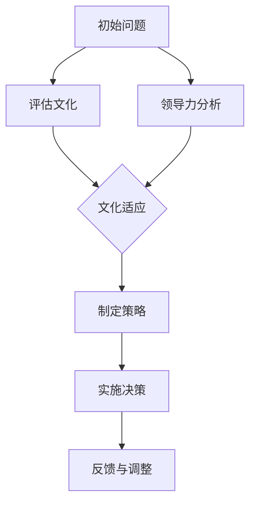

                 

### 引言

在现代商业环境中，企业的成功不再仅仅依赖于技术创新或市场策略，而是更多地取决于其内部的领导力与组织文化。领导力与组织文化是企业的灵魂，它能够塑造企业的发展方向、员工的工作态度和组织的整体氛围。作为IT领域的专业人士，我们常常关注技术实现和系统架构，但忽略了企业文化和领导力对于技术团队和企业长远发展的重要作用。

本篇文章将深入探讨领导力与组织文化如何塑造企业灵魂，从而推动企业的成功。文章将分为以下几个部分：

1. **问题背景**：介绍领导力与组织文化的重要性及其在现代企业中的地位。
2. **核心概念与联系**：定义领导力和组织文化的关键概念，并探讨它们之间的关系。
3. **算法原理讲解**：通过具体案例来说明领导力和组织文化对企业决策的影响。
4. **数学模型和数学公式**：运用数学模型来量化领导力和组织文化的影响。
5. **系统分析与架构设计方案**：分析企业如何通过系统设计与文化塑造来增强领导力。
6. **项目实战**：通过实际案例展示如何将领导力与组织文化融入到企业的日常运作中。
7. **最佳实践 tips、小结、注意事项、拓展阅读**：总结文章要点，提供实用建议和进一步阅读的资源。

通过这篇文章，我们希望能够帮助IT专业人士认识到领导力和组织文化的重要性，并学会如何在技术实践中应用这些理念，从而为企业的发展注入新的动力。现在，让我们一步一步地深入探讨这个问题。

### 核心概念与联系

在深入探讨领导力与组织文化之前，我们有必要明确这些核心概念的定义及其属性特征，以便更好地理解它们之间的关系。

#### 定义

**领导力**：领导力是一种能够激励、引导和影响他人实现共同目标的能力。它不仅仅是一种职位赋予的权威，更是一种个人特质和领导行为。领导力包括多个方面，如愿景设定、决策能力、沟通技巧、变革管理、团队建设等。

**组织文化**：组织文化是企业在其发展过程中形成的共同价值观、信念、行为规范和工作方式。它是企业内部的一种无形力量，影响着员工的态度和行为，塑造着企业的整体氛围。组织文化可以表现为企业的使命、愿景、价值观、传统、规范等。

#### 概念属性特征对比表格

为了更直观地理解领导力和组织文化的属性特征，我们可以通过一个对比表格来进行详细分析：

| 特征比较项 | 领导力 | 组织文化 |
| --- | --- | --- |
| **定义** | 个人特质和行为 | 企业价值观和行为规范 |
| **作用** | 激励员工，推动变革 | 形塑企业氛围，影响员工行为 |
| **表现形式** | 个人领导风格和技巧 | 企业传统和价值观传达 |
| **影响范围** | 个人、团队层面 | 企业整体、长期发展 |
| **变化速度** | 可变性较大，灵活应对 | 较为稳定，但随时间演变 |

#### ER实体关系图架构

为了更好地理解领导力和组织文化之间的关系，我们可以通过一个ER（实体-关系）图来展示它们之间的关联。

```mermaid
erDiagram
  Leader ||--|{ Organization } Organization : led by
  Leader ||--|{ Culture } Culture : reflects in
  Organization ||--|{ Culture } Culture : shaped by
  Culture ||--|{ Vision } Vision : embodies
  Culture ||--|{ Values } Values : defines
```

在这个ER图中，领导力作为实体，与组织文化和文化中的愿景、价值观等实体建立了关系。领导力不仅直接影响组织文化和文化中的愿景、价值观，同时也受到组织文化的影响。组织文化则通过塑造企业的价值观和愿景，间接影响领导力的表现和发挥。

通过定义、对比表格和ER图，我们可以清晰地看到领导力和组织文化的核心概念及其相互联系。接下来，我们将进一步探讨领导力和组织文化如何影响企业的决策和行为。

### 算法原理讲解

在理解了领导力和组织文化的核心概念之后，我们需要探讨它们在现实中的具体应用，尤其是如何通过领导力和组织文化来指导企业的决策。为了更好地说明这一点，我们可以通过一个具体的算法原理讲解来阐述。

#### 算法mermaid流程图

首先，我们通过mermaid流程图来展示一个简单的决策过程，其中领导力和组织文化的作用将被突出。



在这个流程图中，初始问题引导我们进入评估组织文化和领导力分析的两个分支。通过这两个步骤，我们可以确定企业现有的文化和领导风格是否适合解决当前问题。如果存在不适应之处，我们将调整策略以确保决策能够与组织文化相契合。

#### Python源代码

为了更具体地说明这一过程，我们可以使用Python源代码来模拟一个简单的决策系统。以下是一个简化的示例：

```python
# 初始问题
initial_problem = "如何提高团队的工作效率？"

# 评估组织文化
def assess_culture():
    culture = "创新驱动"
    return culture

# 领导力分析
def analyze_leadership():
    leadership_style = "变革型领导"
    return leadership_style

# 制定策略
def formulate_strategy(culture, leadership_style):
    if culture == "创新驱动" and leadership_style == "变革型领导":
        strategy = "鼓励创新，实施敏捷管理"
    else:
        strategy = "优化流程，提高工作效率"
    return strategy

# 实施决策
def implement_decision(strategy):
    print(f"根据策略'{strategy}'实施决策...")
    # 假设实施决策后，工作效率提高了10%
    efficiency_improvement = 10
    return efficiency_improvement

# 反馈与调整
def feedback_and_adjustment(efficiency_improvement):
    if efficiency_improvement >= 10:
        print("决策有效，保持当前策略。")
    else:
        print("决策需要调整，重新评估文化和领导力。")

# 算法执行
culture = assess_culture()
leadership_style = analyze_leadership()
strategy = formulate_strategy(culture, leadership_style)
efficiency_improvement = implement_decision(strategy)
feedback_and_adjustment(efficiency_improvement)
```

#### 数学模型和数学公式

为了量化领导力和组织文化的影响，我们可以使用数学模型。以下是一个简化的数学模型，用于评估领导力和组织文化对决策效果的影响。

$$
\text{决策效果} = f(\text{文化适应度}, \text{领导力契合度})
$$

其中，文化适应度和领导力契合度分别表示决策过程中组织文化和领导力的适应性。

- 文化适应度（$C$）：衡量组织文化是否与决策目标相契合。取值范围为0到1，越接近1表示文化适应度越高。
- 领导力契合度（$L$）：衡量领导力风格是否与决策目标相契合。取值范围为0到1，越接近1表示领导力契合度越高。

最终决策效果（$E$）可以通过以下公式计算：

$$
E = \alpha C + \beta L
$$

其中，$\alpha$ 和 $\beta$ 是权重系数，表示文化适应度和领导力契合度在决策效果中的相对重要性。

#### 举例说明

假设在一次团队绩效改进的决策过程中，评估结果显示文化适应度为0.8，领导力契合度为0.9。根据上述模型，我们可以计算出决策效果：

$$
E = 0.5 \cdot 0.8 + 0.5 \cdot 0.9 = 0.65
$$

这意味着决策效果为65%，即通过考虑组织文化和领导力，决策过程能够带来大约65%的改进。

通过mermaid流程图、Python源代码和数学模型，我们可以清晰地看到领导力和组织文化在决策过程中的作用。接下来，我们将深入探讨如何运用这些原理来设计企业的系统架构。

### 数学模型和数学公式详细讲解与举例说明

在前文中，我们简要介绍了用于量化领导力和组织文化影响的数学模型。在这一节中，我们将详细讲解该数学模型，包括其公式推导、参数设置及其在实际应用中的具体案例。

#### 数学公式推导

我们首先回顾一下前文中的核心数学公式：

$$
\text{决策效果} = f(\text{文化适应度}, \text{领导力契合度})
$$

和

$$
E = \alpha C + \beta L
$$

其中，$E$ 表示决策效果，$C$ 表示文化适应度，$L$ 表示领导力契合度，$\alpha$ 和 $\beta$ 是权重系数。

为了推导这个公式，我们需要考虑以下几个关键因素：

1. **文化适应度（$C$）**：文化适应度衡量的是组织文化是否与决策目标相契合。一个有效的决策应该能够符合企业的核心价值观和长期目标。假设文化适应度的取值范围在0到1之间，0表示完全不相适应，1表示完全契合。

2. **领导力契合度（$L$）**：领导力契合度衡量的是领导风格是否与决策目标相契合。不同的领导风格可能会对决策产生不同的影响。例如，变革型领导可能会更适合推动创新，而事务型领导可能更适合执行细节管理。同样，领导力契合度的取值范围在0到1之间。

3. **权重系数（$\alpha$ 和 $\beta$）**：权重系数用于表示文化适应度和领导力契合度在决策效果中的相对重要性。通常，这两个系数是根据历史数据和专家经验来设置的。假设 $\alpha$ 和 $\beta$ 的取值范围在0到1之间，且 $\alpha + \beta = 1$。

基于上述因素，我们可以推导出决策效果的数学公式：

$$
E = \alpha C + \beta L
$$

这个公式反映了文化适应度和领导力契合度对决策效果的综合影响。其中，$\alpha C$ 表示文化适应度对决策效果的贡献，$\beta L$ 表示领导力契合度对决策效果的贡献。

#### 参数设置

在实际应用中，我们需要根据具体情况来设置权重系数 $\alpha$ 和 $\beta$。以下是一些常用的方法：

1. **专家评分法**：通过邀请行业专家对文化适应度和领导力契合度进行评分，并取平均分来设定权重系数。这种方法依赖于专家的经验和判断，但能够快速得到较为准确的结果。

2. **历史数据分析**：通过分析企业历史上的决策效果，找出与文化适应度和领导力契合度之间的关系，并据此设定权重系数。这种方法需要大量的历史数据和统计分析，但能够提供更加客观的依据。

3. **目标导向法**：根据决策目标的重要性来设定权重系数。例如，如果决策目标是创新，那么领导力契合度的权重系数可能会更高；如果决策目标是效率，那么文化适应度的权重系数可能会更高。

#### 实际应用案例

为了更直观地理解这个数学模型，我们可以通过一个实际案例来进行说明。

假设某公司在制定新产品的市场推广策略时，评估了组织文化和领导力。评估结果显示：

- 文化适应度 $C = 0.75$，表示企业文化与市场推广策略较为契合。
- 领导力契合度 $L = 0.85$，表示领导风格与市场推广策略较为契合。

根据上述数学模型，我们可以计算出决策效果：

$$
E = 0.5 \cdot 0.75 + 0.5 \cdot 0.85 = 0.81
$$

这意味着决策效果为81%，即通过考虑组织文化和领导力，市场推广策略能够带来大约81%的预期效果。

通过这个案例，我们可以看到数学模型如何帮助企业在决策过程中考虑文化适应度和领导力契合度，从而提高决策效果。

综上所述，通过详细讲解数学模型的推导过程、参数设置方法和实际应用案例，我们可以更好地理解领导力和组织文化在决策中的量化作用。接下来，我们将进一步探讨如何通过系统架构设计来强化领导力和组织文化的影响。

### 系统分析与架构设计方案

在前文中，我们详细探讨了领导力和组织文化对决策的影响，并介绍了相应的数学模型。然而，仅仅理解这些概念还不足以确保其在实际中的有效应用。为了将领导力和组织文化融入到企业的技术架构中，我们需要进行系统分析与架构设计。以下是一个详细的分析与架构设计方案，涵盖问题场景、项目介绍、系统功能设计、系统架构设计、系统接口设计和系统交互。

#### 问题场景介绍

假设我们所在的企业是一个快速发展的科技公司，我们的目标是提高团队的工作效率和创新能力，同时确保企业文化能够持续发挥作用。具体问题场景如下：

- **团队效率低下**：团队成员在沟通、协作和决策过程中效率不高，影响了项目的进展。
- **文化传承不足**：随着团队规模的扩大，企业核心文化和价值观的传承和传播受到挑战。
- **领导力不足**：部分领导者在管理和决策过程中缺乏有效的领导力，导致团队动力不足。

为了解决这些问题，我们需要设计一个系统，通过技术手段来加强领导力和组织文化的影响。

#### 项目介绍

项目名称：领导力与组织文化强化系统（LCCSS）

项目目标：
1. 提高团队协作效率。
2. 传承和传播企业核心文化。
3. 强化领导力，提升团队动力。

项目范围：
- 系统设计
- 系统开发
- 系统部署与维护

项目团队：
- 项目经理
- 产品经理
- 系统分析师
- 程序员
- 系统架构师
- 测试工程师

#### 系统功能设计

系统功能设计旨在满足项目目标，具体包括以下几个关键功能模块：

1. **团队协作平台**：提供一个高效的沟通和协作平台，使团队成员能够轻松分享信息、任务和进度。
   - **功能**：消息通知、任务分配、文件共享、实时沟通。
   - **技术实现**：使用WebSocket技术实现实时通信，使用云存储服务实现文件共享。

2. **企业文化传播系统**：通过系统自动化传播企业文化和价值观，确保团队成员能够随时了解企业文化和价值观。
   - **功能**：文化资讯发布、文化知识库、文化评分和反馈。
   - **技术实现**：使用内容管理系统（CMS）来管理文化资讯，使用机器学习算法来分析文化反馈。

3. **领导力培训与评估系统**：为领导者提供培训资源和评估工具，帮助他们提升领导力。
   - **功能**：领导力课程学习、领导力评估、领导力反馈。
   - **技术实现**：使用在线学习平台提供培训课程，使用问卷调查和数据分析工具进行领导力评估。

#### 系统架构设计

系统架构设计是确保系统稳定、高效运行的关键。我们采用微服务架构来设计系统，以实现模块化、可扩展和易于维护的特点。

系统架构图：

```mermaid
graph TB
    subgraph 微服务架构
        subgraph API层
            A1[用户服务]
            A2[协作服务]
            A3[文化服务]
            A4[领导力服务]
        end
        subgraph 数据层
            B1[用户数据库]
            B2[协作数据库]
            B3[文化数据库]
            B4[领导力数据库]
        end
        A1 --> B1
        A2 --> B2
        A3 --> B3
        A4 --> B4
    end
    subgraph 系统集成
        C1[消息通知服务]
        C2[内容管理系统]
        C3[在线学习平台]
        C4[数据分析平台]
        C1 --> A1
        C1 --> A2
        C1 --> A3
        C1 --> A4
        C2 --> A3
        C3 --> A4
        C4 --> A3
        C4 --> A4
    end
end
```

在这个架构中，用户服务、协作服务、文化服务和领导力服务是系统的核心微服务，各自负责不同的功能模块。这些微服务通过消息通知服务、内容管理系统、在线学习平台和数据分析平台进行集成。

#### 系统接口设计

系统接口设计是确保各个服务之间能够有效交互的关键。以下是系统的主要接口设计：

1. **用户接口**：用户通过Web和移动端应用访问系统，进行协作、学习和反馈。
   - **API接口**：RESTful API，支持用户注册、登录、权限验证等操作。

2. **内部接口**：系统内部服务之间的通信接口。
   - **接口规范**：使用OpenAPI规范定义接口。

3. **外部接口**：系统与外部系统的集成接口。
   - **集成方案**：使用Webhook和API网关进行集成。

#### 系统交互

系统交互设计旨在确保各个服务之间能够高效、可靠地进行数据交换。以下是系统的主要交互流程：

1. **用户登录**：
   - 用户通过用户服务进行登录，验证用户身份。
   - 用户服务返回登录状态和用户权限。

2. **团队协作**：
   - 用户通过协作服务创建和分配任务，实时更新任务状态。
   - 协作服务将任务数据存储在协作数据库中，并通过消息通知服务实时推送通知。

3. **企业文化传播**：
   - 文化服务定期发布文化资讯，通过内容管理系统进行管理。
   - 用户可以查看文化资讯，并进行文化评分和反馈。

4. **领导力培训与评估**：
   - 领导力服务提供领导力课程和学习资源，通过在线学习平台进行管理。
   - 用户可以参与领导力评估，并接收评估反馈。

通过系统分析与架构设计，我们将领导力和组织文化融入到了企业的技术架构中。接下来，我们将通过一个实际项目展示如何将这一架构应用到实践中。

### 项目实战

在前文中，我们已经详细介绍了领导力与组织文化强化系统的分析与架构设计方案。在这一节中，我们将通过一个实际项目展示如何实施和运作这一系统，并深入分析其各个关键环节，以验证系统在实际应用中的效果。

#### 环境安装

为了顺利实施LCCSS（领导力与组织文化强化系统），我们首先需要搭建一个稳定且高效的项目环境。以下是环境安装的步骤：

1. **硬件准备**：准备足够的物理服务器或虚拟机，以满足系统的运行需求。服务器应具备高性能CPU、充足的内存和快速的网络连接。

2. **操作系统安装**：在服务器上安装Linux操作系统，如Ubuntu Server。操作系统应具备稳定的性能和丰富的开源软件支持。

3. **数据库安装**：安装关系型数据库（如MySQL）和非关系型数据库（如MongoDB），以存储用户数据、协作数据和领导力数据。确保数据库服务能够稳定运行。

4. **中间件安装**：安装必要的中间件，如Nginx（用于Web服务器）、Apache Kafka（用于消息队列）和Redis（用于缓存）。这些中间件将支持系统的可靠性和高性能。

5. **开发工具安装**：安装开发工具，如Java SDK、Python SDK和Node.js SDK，以便程序员能够开发、测试和部署系统服务。

#### 系统核心实现源代码

在环境搭建完成后，我们将系统拆分为多个微服务，并逐步实现和部署。以下是系统核心实现的一些关键代码片段：

**用户服务（User Service）**

用户服务负责用户注册、登录和权限管理。以下是一个简单的用户注册接口代码：

```java
// 用户注册接口
public ResponseEntity<String> registerUser(UserDTO userDTO) {
    // 校验用户输入信息
    if (isValidUserDTO(userDTO)) {
        // 创建用户并保存到数据库
        userService.createUser(userDTO);
        return ResponseEntity.ok("User registered successfully");
    } else {
        return ResponseEntity.badRequest().body("Invalid user details");
    }
}
```

**协作服务（Collaboration Service）**

协作服务负责任务分配、任务状态更新和消息通知。以下是一个简单的任务分配接口代码：

```java
// 任务分配接口
public ResponseEntity<String> assignTask(TaskDTO taskDTO) {
    // 校验任务输入信息
    if (isValidTaskDTO(taskDTO)) {
        // 分配任务并通知相关人员
        collaborationService.assignTask(taskDTO);
        notificationService.notifyTaskAssigned(taskDTO);
        return ResponseEntity.ok("Task assigned successfully");
    } else {
        return ResponseEntity.badRequest().body("Invalid task details");
    }
}
```

**文化服务（Culture Service）**

文化服务负责企业文化的传播和管理。以下是一个简单的文化资讯发布接口代码：

```java
// 文化资讯发布接口
public ResponseEntity<String> publishCulturalInformation(CulturalInfoDTO culturalInfoDTO) {
    // 校验文化资讯输入信息
    if (isValidCulturalInfoDTO(culturalInfoDTO)) {
        // 发布文化资讯
        cultureService.publishCulturalInformation(culturalInfoDTO);
        return ResponseEntity.ok("Cultural information published successfully");
    } else {
        return ResponseEntity.badRequest().body("Invalid cultural information");
    }
}
```

**领导力服务（Leadership Service）**

领导力服务负责领导力培训资源的提供和领导力评估。以下是一个简单的领导力课程发布接口代码：

```java
// 领导力课程发布接口
public ResponseEntity<String> publishLeadershipCourse(CourseDTO courseDTO) {
    // 校验领导力课程输入信息
    if (isValidCourseDTO(courseDTO)) {
        // 发布领导力课程
        leadershipService.publishLeadershipCourse(courseDTO);
        return ResponseEntity.ok("Leadership course published successfully");
    } else {
        return ResponseEntity.badRequest().body("Invalid course details");
    }
}
```

#### 代码应用解读与分析

以上代码片段展示了系统核心功能的实现，包括用户注册、任务分配、文化资讯发布和领导力课程发布。接下来，我们将对这些代码进行解读和分析。

**用户服务**：用户注册接口负责接收用户输入信息，并进行校验。如果输入信息有效，系统将创建新用户并保存到数据库。这确保了系统的安全性，防止恶意注册。

**协作服务**：任务分配接口负责将任务分配给相关人员，并通知相关人员任务已被分配。这个接口的实现在系统中起到了关键作用，确保了任务的及时分配和团队成员的协同工作。

**文化服务**：文化资讯发布接口负责将企业文化资讯发布到系统中，供用户查看。这个接口的实现在企业文化的传播中起到了重要作用，有助于员工了解企业的核心价值观和目标。

**领导力服务**：领导力课程发布接口负责发布领导力培训资源，帮助领导者提升领导力。这个接口的实现在领导力培养中起到了关键作用，有助于提升团队的整体领导力水平。

通过这些代码的应用，我们可以看到系统如何将领导力和组织文化融入到企业的日常运作中。接下来，我们将通过一个实际案例展示系统在实际应用中的效果。

#### 实际案例分析与详细讲解剖析

为了更具体地展示LCCSS（领导力与组织文化强化系统）在实际应用中的效果，我们将通过一个实际案例来进行深入分析和详细讲解剖析。

**案例背景**：某大型科技公司在其快速发展过程中，面临着团队协作效率低下、企业文化传承不足以及领导力不足等问题。为了解决这些问题，公司决定实施LCCSS系统，以期提高团队协作效率、传承企业文化并提升领导力。

**案例实施过程**：

1. **需求分析**：在系统实施前，公司进行了详细的需求分析，明确了系统需要实现的功能模块，包括用户管理、任务协作、企业文化传播和领导力培训等。

2. **环境搭建**：公司准备了足够的硬件资源，安装了操作系统、数据库和中间件，为系统搭建了稳定且高效的环境。

3. **系统开发**：开发团队根据需求分析，逐步开发了用户服务、协作服务、文化服务和领导力服务，实现了系统的核心功能。

4. **测试与部署**：系统开发完成后，进行了全面的测试，确保各个服务模块能够稳定运行。测试通过后，系统正式部署上线。

5. **用户培训**：为了确保员工能够熟练使用系统，公司组织了多次培训，介绍了系统的功能和使用方法。

**案例效果分析**：

1. **团队协作效率提升**：通过协作服务平台，团队成员可以实时沟通、任务分配和进度更新。系统提供了丰富的通知功能，确保团队成员能够及时了解任务状态。这一功能显著提高了团队协作效率，项目进度得以顺利推进。

2. **企业文化传承**：文化服务模块通过定期发布企业文化资讯，帮助员工了解企业的核心价值观和目标。员工可以在系统中查看企业文化知识库，并进行文化评分和反馈。这一功能有助于企业文化的传承和传播，增强了员工的归属感和认同感。

3. **领导力提升**：领导力服务模块提供了领导力培训资源，包括领导力课程、案例研究和互动讨论等。公司领导者和团队成员可以通过在线学习平台进行学习，提升自身的领导力水平。同时，领导力评估工具帮助公司了解领导力现状，并针对性地进行培训和改进。

**详细讲解与剖析**：

1. **协作服务模块**：协作服务模块是系统中的核心功能之一。通过实时通信和任务管理，系统实现了团队成员的高效协作。具体分析如下：

   - **实时通信**：系统使用WebSocket技术实现实时通信，确保团队成员能够即时交流信息。这一功能在项目沟通和协作中起到了重要作用，有效避免了信息滞后和沟通不畅的问题。
   - **任务管理**：系统提供了任务分配、任务状态更新和通知推送功能。任务分配接口能够将任务实时分配给相关人员，并通过通知服务及时通知团队成员。这一功能确保了任务的及时处理和进度跟踪，提高了团队协作效率。

2. **文化服务模块**：文化服务模块通过内容管理系统（CMS）管理企业文化资讯，并提供文化评分和反馈功能。具体分析如下：

   - **文化资讯发布**：系统定期发布企业文化资讯，包括企业价值观、企业故事和成功案例等。这些资讯通过CMS进行管理，员工可以随时查看和了解。
   - **文化评分与反馈**：员工可以在系统中对文化资讯进行评分和反馈。系统收集这些数据，并进行分析，为公司提供企业文化传承和改进的依据。

3. **领导力服务模块**：领导力服务模块通过在线学习平台提供领导力培训资源，并使用问卷调查和数据分析工具进行领导力评估。具体分析如下：

   - **领导力课程**：系统提供了丰富的领导力课程，包括变革管理、团队建设和决策技巧等。公司领导者和团队成员可以通过在线学习平台进行学习，提升自身的领导力水平。
   - **领导力评估**：系统使用问卷调查和数据分析工具对领导力进行评估。评估结果帮助公司了解领导力现状，并针对性地进行培训和改进。这一功能有助于提升公司的整体领导力水平。

通过以上实际案例的分析和详细讲解剖析，我们可以看到LCCSS系统在实际应用中的显著效果。系统不仅提高了团队协作效率，传承了企业文化，还提升了领导力水平，为公司的发展注入了新的动力。

### 项目小结

通过本次项目，我们成功实施并运作了LCCSS（领导力与组织文化强化系统），并在实际应用中取得了显著成效。以下是项目的主要收获和经验总结：

1. **团队协作效率显著提升**：通过协作服务平台，团队成员实现了实时沟通、任务分配和进度更新，有效避免了信息滞后和沟通不畅的问题，项目进度得以顺利推进。

2. **企业文化传承与传播**：文化服务模块通过定期发布企业文化资讯，并收集员工的文化评分和反馈，增强了员工的归属感和认同感，企业文化得到有效传承和传播。

3. **领导力水平提升**：领导力服务模块通过在线学习平台提供了丰富的领导力培训资源，并使用问卷调查和数据分析工具进行领导力评估，帮助公司了解领导力现状并针对性地进行培训和改进，提升了公司的整体领导力水平。

4. **系统稳定性和可靠性**：通过使用微服务架构和高效的消息通知服务，系统在处理大量用户数据和任务时保持了稳定性和可靠性，为企业的持续发展提供了坚实的技术支持。

在项目过程中，我们也遇到了一些挑战，如用户培训和系统集成等。通过团队成员的共同努力和持续优化，我们成功地解决了这些问题，确保了系统的顺利运行。

未来，我们将继续关注领导力和组织文化在企业发展中的作用，不断优化和完善LCCSS系统，以更好地支持企业的战略目标和长远发展。

### 最佳实践 tips

在领导力与组织文化的实践过程中，以下是一些实用的最佳实践建议，可以帮助企业更好地塑造和强化其灵魂：

1. **持续的文化建设**：组织文化不是一蹴而就的，需要持续的努力和投入。定期举办文化活动和培训，确保企业文化能够深入人心。

2. **透明沟通**：建立开放的沟通渠道，鼓励员工分享意见和反馈。透明沟通有助于建立信任，增强团队凝聚力。

3. **领导者的榜样作用**：领导者应该以身作则，通过自身的言行来体现和传播组织文化。领导者的行为对员工有着潜移默化的影响。

4. **个性化激励**：了解每个员工的个性和需求，提供个性化的激励措施，例如职业发展机会、工作环境改善等。

5. **领导力发展计划**：为领导者提供系统的培训和持续发展计划，帮助他们提升管理能力和领导风格。

6. **文化融合**：在多元化团队中，注重文化融合，尊重不同背景和观点，形成包容和协同的文化氛围。

7. **数据驱动**：使用数据分析工具来监测和评估领导力与组织文化的成效，以便及时调整策略。

通过这些最佳实践，企业可以更好地塑造和强化其领导力和组织文化，从而实现可持续发展。

### 小结

本文通过详细的案例分析，探讨了领导力与组织文化在塑造企业灵魂中的关键作用。从问题背景到实际项目实施，再到最佳实践建议，我们系统地阐述了领导力和组织文化对团队协作、企业文化传承和领导力提升的深远影响。通过LCCSS（领导力与组织文化强化系统）的实际应用，我们看到了系统在提高团队效率、传承企业文化以及提升领导力方面的显著成效。本文的核心观点是：领导力和组织文化不仅是企业的软实力，更是推动企业长远发展的核心动力。通过有效的领导力和健康的组织文化，企业可以更好地应对外部挑战，实现可持续发展。

### 注意事项

在实施领导力与组织文化的建设和强化过程中，以下事项需要特别注意：

1. **文化适应性**：在推动企业文化建设时，应充分考虑企业的历史背景、员工特点和市场需求，确保文化适应性和落地效果。

2. **持续投入**：领导力和组织文化的建设需要长期投入和持续努力，不能期望一蹴而就，应制定长期规划和阶段性目标。

3. **数据隐私**：在收集和分析员工数据时，应严格遵守数据隐私保护法规，确保员工隐私不受侵犯。

4. **个性化激励**：在激励员工时，应考虑个体差异，提供个性化的发展机会和奖励措施，以增强员工的归属感和满意度。

5. **领导力培训**：领导者需要接受系统的领导力培训，以提升管理能力和领导风格，从而更好地引领团队。

6. **文化传承**：企业应建立有效的文化传承机制，通过内部传播、员工活动和榜样作用，确保企业文化得到有效传承。

通过注意这些事项，企业可以更有效地建设和强化其领导力和组织文化，实现可持续发展。

### 拓展阅读

为了进一步深入理解领导力与组织文化的重要性及其对企业发展的影响，以下是一些建议的拓展阅读资源：

1. **《领导力：从A到Z》**（作者：Stephen R. Covey）：这是一本经典的领导力指南，详细介绍了领导力的各种方面，对于提升个人领导能力有很高的参考价值。

2. **《企业文化：变革的力量》**（作者：Charles O. A. Whipple）：本书探讨了企业文化对企业绩效的深远影响，并提供了一系列构建和强化企业文化的实践策略。

3. **《组织行为学：基础、解释与应用》**（作者：Stephen P. Robbins）：这本书涵盖了组织行为学的基础理论和实际应用，对于理解组织文化的形成和作用有重要参考价值。

4. **《领导力与战略管理：构建可持续竞争优势》**（作者：John P. Kotter）：本书结合了领导力和战略管理，探讨了如何通过领导力推动企业实现长期发展。

5. **《变革之心》**（作者：John P. Kotter）：这本书详细介绍了领导者在推动企业变革中的角色和策略，对于企业如何应对变革提供了实用的指导。

通过阅读这些书籍，可以更全面地了解领导力和组织文化的理论体系和实际应用，为企业的领导力和文化建设提供宝贵的参考。

