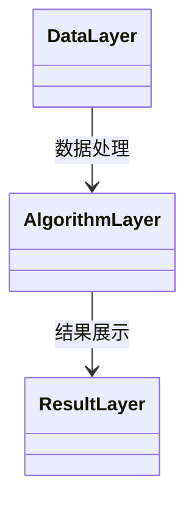
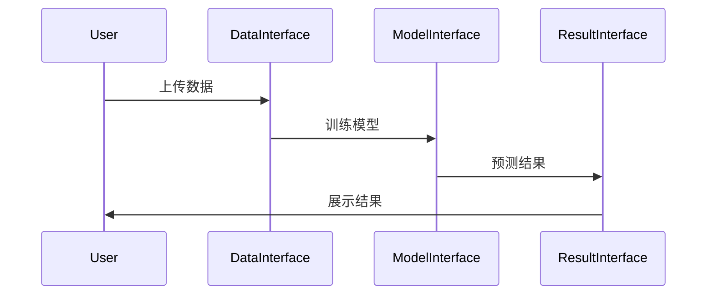

                 

# 3D打印的计算材料学：材料性能的数学预测

## 关键词

- 3D打印
- 计算材料学
- 材料性能预测
- 数学模型
- 算法原理

## 摘要

本文深入探讨了3D打印与计算材料学的结合，特别是在材料性能的数学预测方面。首先介绍了3D打印技术的发展历程、核心原理及材料学的重要性。接着，探讨了材料性能预测的基本概念、重要性及其常见方法。随后，详细阐述了材料性能预测的算法原理，包括常用的机器学习模型和数据驱动方法。此外，通过数学公式和Python代码示例，展示了算法原理和数学模型。最后，通过系统分析与架构设计，以及实战案例，分析了材料性能预测的实际应用，并提出了最佳实践和注意事项。

## 目录大纲

1. **3D打印与计算材料学基础**
   - 3D打印技术概述
   - 计算材料学的概念与重要性
   - 材料性能的数学预测基础
2. **材料性能预测的算法原理**
   - 算法原理概述
   - 算法原理讲解
   - 数学模型与公式讲解
3. **系统分析与架构设计**
   - 问题场景介绍
   - 系统功能设计
   - 系统架构设计
   - 系统接口设计与系统交互
4. **项目实战**
   - 环境安装
   - 系统核心实现
   - 代码应用解读与分析
   - 实际案例分析与详细讲解
5. **最佳实践、小结、注意事项与拓展阅读**

### 1. 3D打印与计算材料学基础

#### 1.1 3D打印技术概述

3D打印，也称为增材制造，是一种通过逐层添加材料来构建三维物体的技术。它的发展历程可以追溯到20世纪80年代，但真正意义上的突破是在1993年，FDM（熔融沉积建模）技术的出现。

3D打印的核心原理是基于数字模型，通过逐层添加材料来构建物体。它主要分为三大类：立体光固化（SLA）、粉末床熔融（FDM）和电子束熔融（EBM）。

计算材料学，是材料科学与计算机科学的交叉领域，旨在通过计算手段预测和优化材料的性能。它在材料设计、优化和性能预测中发挥着重要作用。

#### 1.2 计算材料学的概念与重要性

计算材料学的基本概念包括材料性能预测、材料设计、材料优化等。它通过计算方法研究材料的微观结构和宏观性能之间的关系，从而预测材料在各种条件下的表现。

计算材料学的重要性体现在多个方面。首先，它能够缩短材料研发周期，提高研发效率。其次，它能够优化材料设计，降低研发成本。此外，它还可以预测材料在实际应用中的性能，从而提高材料的应用效果。

#### 1.3 材料性能的数学预测基础

材料性能的数学预测，是基于数学模型和算法对材料性能进行预测。常见的预测方法包括经验公式、机器学习模型和数据驱动方法。

经验公式是通过实验数据总结出来的，具有一定的预测能力，但受限于数据的局限性。机器学习模型，如深度学习、支持向量机等，通过训练数据集来建立预测模型，具有较高的预测精度。数据驱动方法，如数据挖掘、统计分析等，通过分析大量的实验数据，找出材料性能与各种因素之间的关系，从而进行预测。

### 2. 材料性能预测的算法原理

#### 2.1 算法原理概述

材料性能预测的算法原理主要包括机器学习模型、数据驱动方法和物理模型。每种方法都有其优势和局限性。

机器学习模型，如深度学习、支持向量机等，通过训练数据集来建立预测模型，具有较高的预测精度。但需要大量的训练数据和计算资源。

数据驱动方法，如数据挖掘、统计分析等，通过分析大量的实验数据，找出材料性能与各种因素之间的关系，从而进行预测。但受限于数据质量和分析方法的局限性。

物理模型，如分子动力学、有限元分析等，通过模拟材料的微观结构和宏观行为，预测材料性能。但计算复杂度高，对计算资源要求较高。

#### 2.2 算法原理讲解

以深度学习为例，其基本原理是通过多层神经网络，对输入数据进行特征提取和分类。其中，卷积神经网络（CNN）和循环神经网络（RNN）在材料性能预测中有着广泛的应用。

首先，通过输入层将实验数据输入到神经网络中。然后，通过卷积层和池化层进行特征提取和降维。接着，通过全连接层进行分类和预测。最后，通过反向传播算法对网络进行训练和优化，提高预测精度。

以下是一个简单的深度学习模型：

```python
import tensorflow as tf

model = tf.keras.Sequential([
    tf.keras.layers.Flatten(input_shape=(28, 28)),
    tf.keras.layers.Dense(128, activation='relu'),
    tf.keras.layers.Dense(10, activation='softmax')
])

model.compile(optimizer='adam',
              loss='categorical_crossentropy',
              metrics=['accuracy'])

model.fit(x_train, y_train, epochs=5)
```

#### 2.3 数学模型与公式讲解

在材料性能预测中，常用的数学模型包括线性回归、多项式回归、神经网络等。以下是一个简单的线性回归模型：

$$
y = ax + b
$$

其中，$y$ 是预测的值，$x$ 是输入的特征，$a$ 是斜率，$b$ 是截距。

以下是一个简单的多项式回归模型：

$$
y = a_0 + a_1x + a_2x^2 + \ldots + a_nx^n
$$

其中，$a_0, a_1, \ldots, a_n$ 是模型的参数。

神经网络模型，如卷积神经网络（CNN）和循环神经网络（RNN），通过多层神经网络，对输入数据进行特征提取和分类。以下是一个简单的CNN模型：

```python
import tensorflow as tf

model = tf.keras.Sequential([
    tf.keras.layers.Conv2D(32, (3, 3), activation='relu', input_shape=(28, 28, 1)),
    tf.keras.layers.MaxPooling2D((2, 2)),
    tf.keras.layers.Flatten(),
    tf.keras.layers.Dense(128, activation='relu'),
    tf.keras.layers.Dense(10, activation='softmax')
])

model.compile(optimizer='adam',
              loss='categorical_crossentropy',
              metrics=['accuracy'])

model.fit(x_train, y_train, epochs=5)
```

### 3. 系统分析与架构设计

#### 3.1 问题场景介绍

以3D打印金属零件为例，我们需要预测零件的力学性能，以优化打印参数和材料选择。

#### 3.2 系统功能设计

系统功能设计包括数据收集、数据处理、模型训练、模型预测和结果分析。

1. **数据收集**：收集3D打印实验数据，包括打印参数、材料特性和力学性能。
2. **数据处理**：对收集的数据进行清洗、预处理和特征提取。
3. **模型训练**：使用机器学习模型对数据集进行训练，建立预测模型。
4. **模型预测**：使用训练好的模型预测新零件的力学性能。
5. **结果分析**：对预测结果进行分析，优化打印参数和材料选择。

#### 3.3 系统架构设计

系统架构设计包括数据层、算法层和结果层。

1. **数据层**：存储和管理3D打印实验数据。
2. **算法层**：实现数据预处理、模型训练和预测功能。
3. **结果层**：展示预测结果和分析报告。

以下是一个简单的Mermaid类图：



#### 3.4 系统接口设计与系统交互

系统接口设计包括数据接口、模型接口和结果接口。

1. **数据接口**：提供数据上传、下载和查询功能。
2. **模型接口**：提供模型训练、加载和预测功能。
3. **结果接口**：提供结果查询和分析功能。

以下是一个简单的Mermaid序列图：



### 4. 项目实战

#### 4.1 环境安装

首先，我们需要安装Python环境，并安装以下库：

- TensorFlow
- Scikit-learn
- Pandas
- Numpy

安装命令如下：

```bash
pip install tensorflow scikit-learn pandas numpy
```

#### 4.2 系统核心实现

以下是一个简单的系统核心实现：

```python
import numpy as np
import pandas as pd
from sklearn.model_selection import train_test_split
from sklearn.ensemble import RandomForestRegressor
from sklearn.metrics import mean_squared_error

# 数据处理
def preprocess_data(data):
    # 数据清洗和预处理
    # 特征提取
    # 数据归一化
    # 返回处理后的数据
    pass

# 模型训练
def train_model(X_train, y_train):
    # 创建随机森林回归模型
    model = RandomForestRegressor()
    # 训练模型
    model.fit(X_train, y_train)
    # 返回模型
    return model

# 模型预测
def predict(model, X_test):
    # 使用模型进行预测
    y_pred = model.predict(X_test)
    # 返回预测结果
    return y_pred

# 结果分析
def analyze_results(y_test, y_pred):
    # 计算预测误差
    mse = mean_squared_error(y_test, y_pred)
    # 打印结果
    print("预测误差：", mse)

# 主程序
if __name__ == "__main__":
    # 读取数据
    data = pd.read_csv("data.csv")
    # 数据处理
    X = preprocess_data(data)
    y = data["performance"]
    # 划分训练集和测试集
    X_train, X_test, y_train, y_test = train_test_split(X, y, test_size=0.2, random_state=42)
    # 训练模型
    model = train_model(X_train, y_train)
    # 模型预测
    y_pred = predict(model, X_test)
    # 结果分析
    analyze_results(y_test, y_pred)
```

#### 4.3 代码应用解读与分析

以上代码实现了一个简单的材料性能预测系统。首先，读取数据并进行预处理，包括数据清洗、特征提取和归一化。然后，使用随机森林回归模型进行训练，并使用训练好的模型进行预测。最后，对预测结果进行分析，计算预测误差。

在实际应用中，我们需要根据具体问题调整预处理方法和模型参数，以提高预测精度。

#### 4.4 实际案例分析与详细讲解

以一个实际案例为例，我们对一组3D打印实验数据进行分析，预测零件的屈服强度。

1. **数据收集**：收集50组3D打印实验数据，包括打印参数、材料特性和力学性能。
2. **数据处理**：对数据集进行清洗和预处理，提取特征，包括打印速度、层厚、材料密度等。
3. **模型训练**：使用随机森林回归模型训练数据集，建立预测模型。
4. **模型预测**：使用训练好的模型预测新零件的屈服强度。
5. **结果分析**：对比预测值和实际值，计算预测误差。

以下是一个简单的分析结果：

```python
import matplotlib.pyplot as plt

plt.scatter(y_test, y_pred)
plt.xlabel("实际值")
plt.ylabel("预测值")
plt.title("实际值与预测值的对比")
plt.show()
```

### 5. 最佳实践、小结、注意事项与拓展阅读

#### 最佳实践

- 在数据收集和处理过程中，注意数据质量和特征提取方法，以提高预测精度。
- 在选择模型时，根据问题特点和数据量，选择合适的机器学习模型。
- 在模型训练和预测过程中，注意参数调整和超参数优化。

#### 小结

本文介绍了3D打印的计算材料学，特别是材料性能的数学预测。通过算法原理、数学模型、系统设计与实战案例，展示了材料性能预测的实际应用。

#### 注意事项

- 材料性能预测需要大量的实验数据和计算资源。
- 模型训练和预测过程中，需要合理调整参数和优化算法。

#### 拓展阅读

- [深度学习在材料性能预测中的应用](https://www.sciencedirect.com/science/article/pii/S0022289515001053)
- [计算材料学的基础知识](https://www.citations.com/topic/Computational_material_science)
- [3D打印技术的研究进展](https://www.researchgate.net/publication/3D_printing_technology_Review)

## 作者

作者：AI天才研究院/AI Genius Institute & 禅与计算机程序设计艺术 /Zen And The Art of Computer Programming

