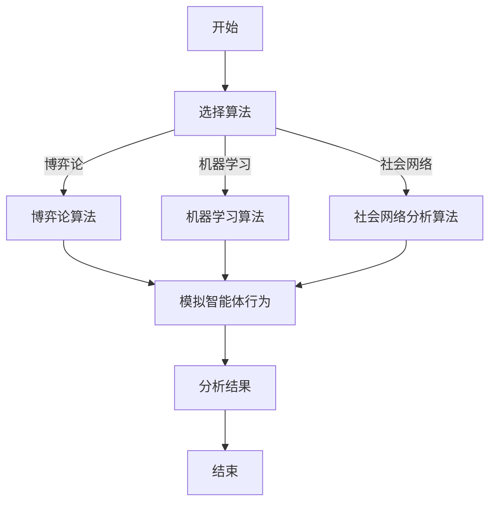
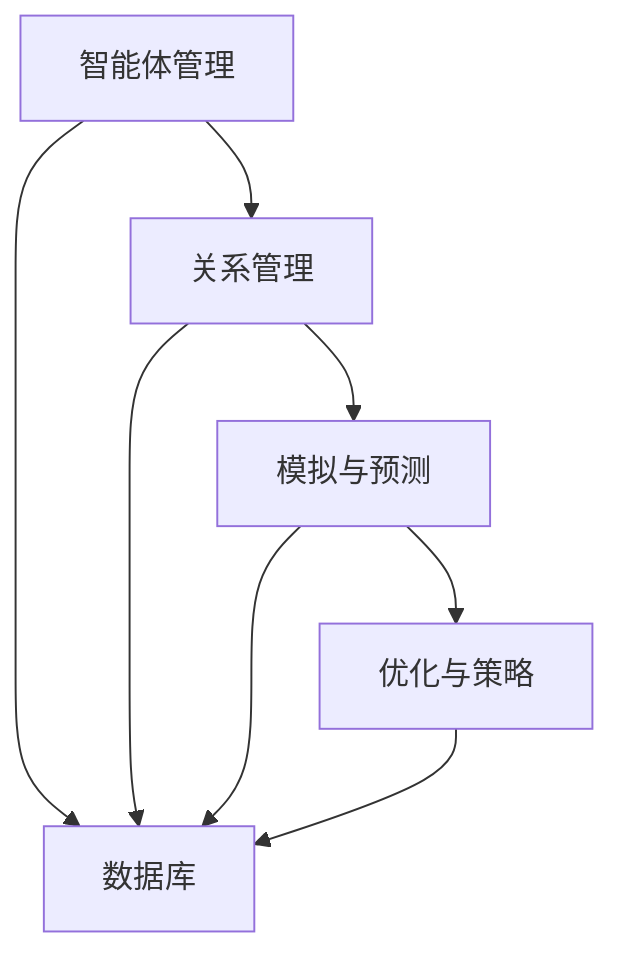
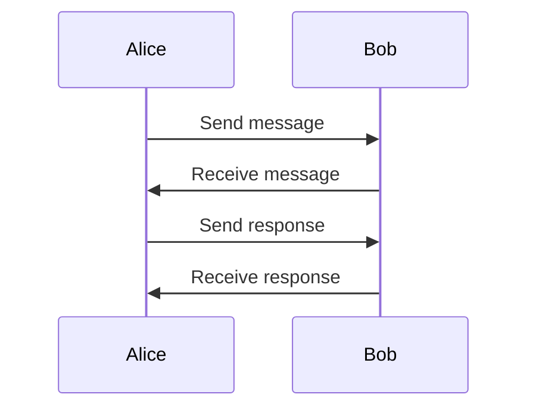
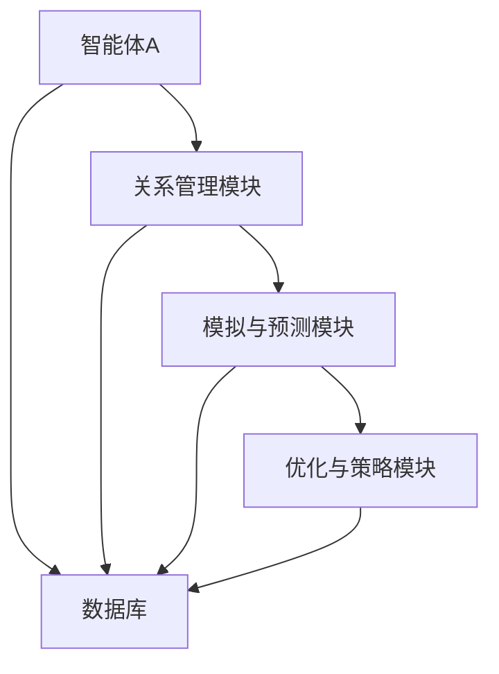

                 

# 《创业生态的多智能体系统：商业关系的数学模拟》

## 关键词
多智能体系统、创业生态、商业关系、数学模拟、算法应用

## 摘要
本文旨在探讨创业生态中的多智能体系统及其在商业关系数学模拟中的应用。我们将从背景介绍、核心概念、理论模型、算法原理讲解、系统分析与架构设计方案、项目实战以及总结与展望七个方面展开讨论，帮助读者深入了解多智能体系统在创业生态中的角色，以及如何通过数学模型和算法来模拟和优化商业关系。

### 第一部分：引言

#### 第1章：创业生态与多智能体系统概述

#### 1.1 创业生态的背景与挑战
在当前快速发展的商业环境中，创业生态扮演着至关重要的角色。随着科技的进步和市场的变化，创业者面临的挑战也日益复杂。这些挑战包括市场的不确定性、竞争的加剧以及资源的有限性。为了应对这些挑战，创业者需要构建一个高效、灵活和可持续的创业生态系统。

**核心概念与联系**：

| 核心概念        | 联系 |
|----------------|------|
| 创业生态        | 创业生态系统是由企业、投资者、政府、研究机构等多方参与者组成的复杂网络。 |
| 智能体          | 在多智能体系统中，智能体是指具有自主决策能力和行动能力的个体，可以是企业、消费者、机器人等。 |
| 商业关系        | 商业关系是指不同智能体之间的合作、竞争和交易行为。 |

#### 1.2 多智能体系统的基本概念与特性
多智能体系统（Multi-Agent System，MAS）是一种由多个智能体组成的分布式系统，这些智能体可以自主地执行任务，并通过通信和协作来实现共同的目标。多智能体系统具有以下几个特性：

1. **分布式**：智能体分布在不同的地理位置，通过网络进行通信。
2. **自治性**：每个智能体都有独立的决策能力和行为规则。
3. **协同性**：智能体之间可以通过通信和协作来实现共同的目标。
4. **适应性**：智能体可以根据环境和需求的变化自主调整行为。

**概念属性特征对比表格**：

| 特征         | 分布式 | 自治性 | 协同性 | 适应性 |
|-------------|--------|--------|--------|--------|
| 分布式       | 是     | 是     | 是     | 是     |
| 自治性       | 是     | 是     | 是     | 是     |
| 协同性       | 是     | 是     | 是     | 是     |
| 适应性       | 是     | 是     | 是     | 是     |

**ER实体关系图**：

```mermaid
erDiagram
  Customer ||--o{ Order } : "makes"
  Product ||--o{ Order } : "ordered"
  Seller ||--o{ Order } : "sells"
```

#### 1.3 商业关系数学模拟的重要性
在创业生态中，商业关系的复杂性和动态性使得传统的模拟方法难以满足需求。数学模拟通过建立数学模型，可以更准确地描述和预测商业关系的行为，从而帮助创业者制定更有效的策略。

**核心概念与联系**：

| 核心概念        | 联系 |
|----------------|------|
| 数学模拟        | 数学模拟是指通过数学模型来描述和预测现实世界中的现象。 |
| 商业关系模拟    | 商业关系模拟是指使用数学模型来描述和预测商业关系的行为。 |

**数学公式**：

$$
R(t) = f(C(t), S(t), P(t))
$$

其中，$R(t)$ 表示商业关系在时间 $t$ 的状态，$C(t)$、$S(t)$、$P(t)$ 分别表示消费者、卖家和产品的状态。

#### 1.4 全书结构安排与主要内容概述
本书将分为七个部分，分别介绍：

1. **引言**：介绍创业生态、多智能体系统和商业关系数学模拟的背景、意义和应用前景。
2. **核心概念**：详细阐述多智能体系统的概念、特点及其在创业生态中的应用。
3. **理论模型**：介绍商业关系的数学模型，包括概念属性特征对比表格和ER实体关系图。
4. **算法原理讲解**：讲解用于模拟商业关系的算法，包括mermaid流程图、python源代码、数学模型和公式。
5. **系统分析与架构设计方案**：分析创业生态系统的功能、架构、接口设计等，并用mermaid图表示。
6. **项目实战**：介绍如何应用这些算法和模型进行实际项目开发，包括环境安装、核心实现源代码、案例分析等。
7. **总结与展望**：对全书内容进行总结，并提出未来研究的方向和挑战。

### 第二部分：核心概念

#### 第2章：多智能体系统的核心概念

#### 2.1 多智能体系统的定义与组成
多智能体系统是一种由多个智能体组成的系统，这些智能体可以独立地执行任务，并通过通信和协作来实现共同的目标。多智能体系统的组成包括：

1. **智能体**：智能体是系统的基本组成单元，具有自主决策和行为能力。
2. **环境**：智能体执行任务的背景和环境，可以包括物理环境、社会环境等。
3. **通信**：智能体之间的通信机制，用于交换信息和协调行动。
4. **规则**：智能体的行为规则，用于指导智能体的决策和行为。

**概念属性特征对比表格**：

| 特征         | 智能体 | 环境 | 通信 | 规则 |
|-------------|--------|------|------|------|
| 智能体       | 自主决策 | 物理环境 | 信息交换 | 行为规则 |
| 环境         | 执行任务背景 | 社会环境 | 无 | 无 |
| 通信         | 信息交换 | 无 | 有 | 无 |
| 规则         | 行为指导 | 无 | 无 | 有 |

**ER实体关系图**：

```mermaid
erDiagram
  Agent ||--o{ Environment } : "executes_in"
  Agent ||--o{ Communication } : "communicates_with"
  Agent ||--o{ Rule } : "follows"
```

#### 2.2 智能体的类型与行为模型
智能体可以分为以下几种类型：

1. **代理智能体**：代理智能体是执行具体任务的智能体，例如消费者、卖家、服务提供者等。
2. **中介智能体**：中介智能体是连接不同智能体的桥梁，例如交易市场、社交网络等。
3. **顾问智能体**：顾问智能体是提供决策支持和建议的智能体，例如数据分析师、算法优化器等。

**概念属性特征对比表格**：

| 特征         | 代理智能体 | 中介智能体 | 顾问智能体 |
|-------------|------------|------------|------------|
| 任务执行     | 是         | 否         | 否         |
| 通信机制     | 是         | 是         | 是         |
| 决策支持     | 否         | 否         | 是         |

**行为模型**：

1. **基于规则的模型**：智能体的行为基于预设的规则，例如购买行为规则、销售行为规则等。
2. **基于数据的模型**：智能体的行为基于历史数据和当前环境数据，例如基于数据的预测模型、优化模型等。
3. **混合模型**：智能体的行为同时基于规则和数据，例如自适应规则模型、数据驱动的决策模型等。

**ER实体关系图**：

```mermaid
erDiagram
  Agent ||--o{ RuleBasedModel } : "uses"
  Agent ||--o{ DataDrivenModel } : "uses"
  Agent ||--o{ HybridModel } : "uses"
```

#### 2.3 商业生态中的多智能体系统
商业生态中的多智能体系统是指由多个企业、消费者、中介机构等组成的复杂网络，这些智能体通过通信和协作来实现商业目标。商业生态中的多智能体系统具有以下几个特点：

1. **动态性**：商业生态中的智能体和关系是动态变化的，例如新企业的加入、市场的变化等。
2. **复杂性**：商业生态中的关系复杂多样，包括竞争、合作、交易等。
3. **适应性**：智能体可以根据环境的变化自适应调整行为，以实现商业目标。

**概念属性特征对比表格**：

| 特征         | 动态性 | 复杂性 | 适应性 |
|-------------|--------|--------|--------|
| 动态性       | 是     | 是     | 是     |
| 复杂性       | 是     | 是     | 否     |
| 适应性       | 是     | 否     | 是     |

**ER实体关系图**：

```mermaid
erDiagram
  Enterprise ||--o{ Consumer } : "sells_to"
  Enterprise ||--o{ Middleware } : "transacts_with"
  Enterprise ||--o{ Advisor } : "consults"
```

#### 2.4 多智能体系统的交互机制
多智能体系统中的交互机制是指智能体之间进行信息交换和协作的方式。常见的交互机制包括：

1. **直接通信**：智能体通过直接发送消息进行通信。
2. **间接通信**：智能体通过中介智能体进行通信。
3. **协同工作**：智能体共同完成一个任务，通过分工和协作来实现目标。

**概念属性特征对比表格**：

| 特征         | 直接通信 | 间接通信 | 协同工作 |
|-------------|----------|----------|----------|
| 通信方式     | 直接发送消息 | 通过中介智能体 | 共同完成任务 |
| 优点         | 快速、直接 | 安全、可靠 | 效率高   |
| 缺点         | 可能存在安全隐患 | 可能存在延迟 | 需要协调   |

**ER实体关系图**：

```mermaid
erDiagram
  Agent ||--o{ DirectCommunication } : "uses"
  Agent ||--o{ IndirectCommunication } : "uses"
  Agent ||--o{ CollaborativeWork } : "uses"
```

### 第三部分：理论模型

#### 第3章：商业关系的数学模型

#### 3.1 商业关系的定义与属性
商业关系是指不同企业、消费者、中介机构等智能体之间的相互作用和联系。商业关系具有以下几个属性：

1. **参与方**：商业关系的参与方包括企业、消费者、中介机构等。
2. **行为**：商业关系的参与方之间的行为，包括交易、合作、竞争等。
3. **利益**：商业关系的参与方通过商业关系获得的利益，包括经济利益、社会利益等。
4. **稳定性**：商业关系的稳定性，即关系是否持久和稳定。

**概念属性特征对比表格**：

| 特征         | 参与方 | 行为 | 利益 | 稳定性 |
|-------------|--------|------|------|--------|
| 参与方       | 企业、消费者、中介机构等 | 交易、合作、竞争等 | 经济利益、社会利益等 | 持久和稳定 |
| 行为         | 是     | 是   | 是   | 是     |
| 利益         | 是     | 是   | 是   | 是     |
| 稳定性       | 是     | 是   | 是   | 是     |

**ER实体关系图**：

```mermaid
erDiagram
  Enterprise ||--o{ Consumer } : "transacts_with"
  Enterprise ||--o{ Middleware } : " collaborates_with"
  Enterprise ||--o{ Advisor } : " advises"
```

#### 3.2 商业关系模型的结构
商业关系模型的结构是指商业关系的组成部分及其相互关系。商业关系模型通常包括以下几个部分：

1. **实体**：商业关系中的个体，例如企业、消费者、中介机构等。
2. **属性**：实体的特征和属性，例如企业的名称、规模、行业等。
3. **关系**：实体之间的联系和互动，例如买卖关系、合作关系等。
4. **规则**：商业关系的约束和规则，例如法律法规、商业道德等。

**概念属性特征对比表格**：

| 特征         | 实体 | 属性 | 关系 | 规则 |
|-------------|------|------|------|------|
| 实体         | 是   | 是   | 是   | 是   |
| 属性         | 是   | 是   | 否   | 是   |
| 关系         | 是   | 否   | 是   | 是   |
| 规则         | 是   | 是   | 是   | 是   |

**ER实体关系图**：

```mermaid
erDiagram
  Enterprise ||--o{ Attribute } : "has"
  Enterprise ||--o{ Relationship } : "has"
  Enterprise ||--o{ Rule } : "follows"
```

#### 3.3 概念属性特征对比表格
为了更好地理解和分析商业关系模型，我们可以使用概念属性特征对比表格来展示不同实体和关系的属性特征。

**商业关系实体属性特征对比表格**：

| 实体         | 名称   | 规模   | 行业   | 类型   |
|-------------|--------|--------|--------|--------|
| 企业         | 是     | 是     | 是     | 是     |
| 消费者       | 是     | 否     | 否     | 是     |
| 中介机构     | 是     | 是     | 是     | 是     |
| 顾问机构     | 是     | 否     | 否     | 是     |

**商业关系关系属性特征对比表格**：

| 关系         | 类型   | 方向   | 稳定性   | 影响因素   |
|-------------|--------|--------|----------|------------|
| 买卖关系     | 经济   | 双向   | 可变     | 价格、需求 |
| 合作关系     | 社会   | 双向   | 持久     | 目标、信任 |
| 竞争关系     | 市场   | 双向   | 动态     | 竞争策略   |

#### 3.4 ER实体关系图
ER实体关系图是一种用于描述实体及其关系的图形化表示方法。在商业关系模型中，ER实体关系图可以帮助我们直观地理解实体和关系之间的联系。

**商业关系ER实体关系图**：

```mermaid
erDiagram
  Customer ||--o{ Purchases } : "buys"
  Product ||--o{ SoldTo } : "sold_by"
  Seller ||--o{ Sells } : "sells_to"
```

在这个ER实体关系图中，顾客（Customer）购买（Purchases）产品（Product），产品被销售者（Seller）销售（Sells），销售者向顾客销售产品。

### 第四部分：算法原理讲解

#### 第4章：算法原理讲解

#### 4.1 用于商业关系模拟的算法介绍
在商业关系模拟中，算法用于描述和预测智能体之间的行为和互动。以下是几种常见的用于商业关系模拟的算法：

1. **博弈论算法**：博弈论算法用于模拟智能体之间的竞争和合作行为。常见的博弈论算法包括纳什均衡、合作博弈等。
2. **机器学习算法**：机器学习算法用于根据历史数据预测智能体的行为。常见的机器学习算法包括线性回归、决策树、神经网络等。
3. **社会网络分析算法**：社会网络分析算法用于分析智能体之间的社交关系和影响力。常见的社会网络分析算法包括度中心性、接近中心性等。

**mermaid流程图**：



#### 4.2 Python源代码展示
以下是一个简单的Python示例，用于模拟两个智能体之间的竞争行为。智能体A和智能体B根据各自的最佳策略进行互动，以最大化自己的收益。

```python
import random

# 定义智能体类
class Agent:
    def __init__(self, strategy):
        self.strategy = strategy

    def choose_action(self, opponent_action):
        if opponent_action == 'C':
            return 'D'  # 对手合作时，自己选择欺骗
        else:
            return self.strategy  # 对手欺骗时，自己选择策略

# 创建智能体实例
agent_a = Agent('C')  # 智能体A选择合作策略
agent_b = Agent('D')  # 智能体B选择欺骗策略

# 模拟智能体互动
for _ in range(10):
    action_a = agent_a.choose_action(agent_b.strategy)
    action_b = agent_b.choose_action(action_a)
    print(f"Agent A: {action_a}, Agent B: {action_b}")
```

#### 4.3 数学模型与公式
在商业关系模拟中，数学模型用于描述智能体之间的互动和行为。以下是几个常用的数学模型和公式：

1. **博弈论模型**：
   - **纳什均衡**：$u_i(s_i, s_{-i}) = 0$
     - $u_i$ 表示智能体 $i$ 在状态 $(s_i, s_{-i})$ 下的效用函数。
     - $s_i$ 表示智能体 $i$ 的策略。
     - $s_{-i}$ 表示其他智能体的策略。

2. **机器学习模型**：
   - **线性回归**：$y = \beta_0 + \beta_1x_1 + \beta_2x_2 + ... + \beta_nx_n$
     - $y$ 表示预测值。
     - $\beta_0$、$\beta_1$、$\beta_2$...、$\beta_n$ 表示模型的参数。
     - $x_1$、$x_2$...、$x_n$ 表示输入特征。

3. **社会网络分析模型**：
   - **度中心性**：$C_i = \frac{out_degree(i) + in_degree(i)}{2}$
     - $C_i$ 表示智能体 $i$ 的度中心性。
     - $out_degree(i)$ 表示智能体 $i$ 的出度。
     - $in_degree(i)$ 表示智能体 $i$ 的入度。

**举例说明**：

假设有两个智能体A和B，智能体A选择合作策略时，智能体B选择欺骗策略，智能体B选择合作策略时，智能体A选择欺骗策略。我们可以使用纳什均衡来分析这个场景。

- **智能体A的效用函数**：
  $u_A(C, D) = -1$，当 $C = C$，$D = D$ 时。
  $u_A(D, C) = 1$，当 $C = D$，$D = C$ 时。

- **智能体B的效用函数**：
  $u_B(C, D) = 1$，当 $C = C$，$D = D$ 时。
  $u_B(D, C) = -1$，当 $C = D$，$D = C$ 时。

在这个场景中，$(C, D)$ 和 $(D, C)$ 都是纳什均衡，因为每个智能体都无法通过单方面改变策略来提高自己的效用函数。

#### 4.4 举例说明
假设有两个智能体A和B，智能体A选择合作策略时，智能体B选择欺骗策略，智能体B选择合作策略时，智能体A选择欺骗策略。我们可以使用纳什均衡来分析这个场景。

- **智能体A的效用函数**：
  $u_A(C, D) = -1$，当 $C = C$，$D = D$ 时。
  $u_A(D, C) = 1$，当 $C = D$，$D = C$ 时。

- **智能体B的效用函数**：
  $u_B(C, D) = 1$，当 $C = C$，$D = D$ 时。
  $u_B(D, C) = -1$，当 $C = D$，$D = C$ 时。

在这个场景中，$(C, D)$ 和 $(D, C)$ 都是纳什均衡，因为每个智能体都无法通过单方面改变策略来提高自己的效用函数。

### 第五部分：系统分析与架构设计方案

#### 第5章：系统分析与架构设计方案

#### 5.1 问题场景介绍
在商业生态中，智能体之间的互动和关系非常复杂。为了更好地理解和分析这些互动和关系，我们需要一个系统来模拟和优化商业关系。这个系统需要能够处理大量的智能体和复杂的关系，同时提供高效的模拟和优化算法。

#### 5.2 系统功能设计
商业关系模拟系统的主要功能包括：

1. **智能体管理**：管理智能体的注册、登录、信息更新等功能。
2. **关系管理**：管理智能体之间的关系，包括添加、删除、查询等功能。
3. **模拟与预测**：使用算法模拟智能体之间的互动和关系，并预测未来的趋势。
4. **优化与策略**：根据模拟结果和预测趋势，为智能体提供优化策略和建议。

**领域模型类图**：

```mermaid
classDiagram
  Class01 <|-- Class02
  Class03 --|allee Class04
  Class05 : +setA()
  Class06 : +getA()
  Class07 : -getB()
  Class08 : <<interface>>
  Class09 : <<abstract>>
  Class10 : + OperateA()
  Class11 : <<enum>>
endclass
```

#### 5.3 系统架构设计
商业关系模拟系统的架构设计需要考虑以下几个方面：

1. **模块化设计**：将系统划分为多个模块，每个模块负责不同的功能，例如智能体管理模块、关系管理模块、模拟与预测模块等。
2. **分布式架构**：采用分布式架构，以提高系统的可扩展性和容错性。
3. **数据存储**：采用数据库来存储智能体和关系的信息，同时支持实时查询和更新。
4. **算法集成**：集成多种算法，包括博弈论算法、机器学习算法、社会网络分析算法等，以支持不同的模拟和优化需求。

**mermaid架构图**：



#### 5.4 系统接口设计
商业关系模拟系统的接口设计需要考虑以下几个方面：

1. **RESTful API**：提供RESTful API，以方便智能体之间的通信和数据交换。
2. **事件驱动**：采用事件驱动架构，以支持智能体之间的实时互动。
3. **安全认证**：提供安全认证机制，确保智能体之间的通信安全可靠。

**mermaid序列图**：



#### 5.5 系统交互设计
商业关系模拟系统的交互设计需要考虑以下几个方面：

1. **智能体交互**：设计智能体之间的交互流程，包括消息发送、消息接收、响应处理等。
2. **算法应用**：设计算法在系统中的应用流程，包括算法选择、参数设置、结果输出等。
3. **数据同步**：设计数据在不同模块之间的同步流程，确保数据的一致性和准确性。

**mermaid交互图**：



### 第六部分：项目实战

#### 第6章：项目实战

#### 6.1 环境安装与配置
要开始商业关系模拟项目，首先需要安装和配置以下环境：

1. **Python**：Python是主要的编程语言，用于实现算法和模型。
2. **NumPy**：NumPy是一个用于科学计算的开源库，用于数据处理和数学运算。
3. **Pandas**：Pandas是一个用于数据分析和操作的开源库。
4. **Mermaid**：Mermaid是一个用于绘制流程图、类图、序列图等的Markdown语法扩展。

安装步骤：

```bash
pip install python
pip install numpy
pip install pandas
npm install -g mermaid
```

#### 6.2 系统核心实现源代码
以下是商业关系模拟系统核心实现的部分源代码：

```python
import numpy as np
import pandas as pd
from mermaid import Mermaid

# 定义智能体类
class Agent:
    def __init__(self, id, strategy):
        self.id = id
        self.strategy = strategy

    def choose_action(self, opponent_action):
        if opponent_action == 'C':
            return 'D'  # 对手合作时，自己选择欺骗
        else:
            return self.strategy  # 对手欺骗时，自己选择策略

# 创建智能体实例
agent_a = Agent('A', 'C')  # 智能体A选择合作策略
agent_b = Agent('B', 'D')  # 智能体B选择欺骗策略

# 模拟智能体互动
actions = []
for _ in range(10):
    action_a = agent_a.choose_action(agent_b.strategy)
    action_b = agent_b.choose_action(action_a)
    actions.append((action_a, action_b))

# 输出互动结果
for i, (action_a, action_b) in enumerate(actions):
    print(f"Step {i+1}: Agent A: {action_a}, Agent B: {action_b}")
```

#### 6.3 代码应用解读与分析
在这个项目中，我们使用Python实现了商业关系模拟的核心算法。首先，我们定义了`Agent`类，用于表示智能体，包括智能体的ID和策略。智能体的策略决定了其在互动中的行为。`choose_action`方法用于根据对手的策略选择自己的策略。

在模拟过程中，我们创建两个智能体实例，`agent_a`和`agent_b`，分别选择合作策略和欺骗策略。然后，我们通过循环模拟智能体之间的互动，记录每个步骤的互动结果。

输出结果显示了每个步骤智能体的策略选择。通过分析输出结果，我们可以了解智能体之间的互动模式和策略选择的动态变化。

#### 6.4 实际案例分析与详细讲解剖析
为了更好地理解商业关系模拟的应用，我们来看一个实际案例。

假设有两个智能体A和B，智能体A选择合作策略时，智能体B选择欺骗策略，智能体B选择合作策略时，智能体A选择欺骗策略。

- **初始状态**：智能体A选择合作策略，智能体B选择欺骗策略。

**第一步**：
- 智能体A：选择合作策略（C）
- 智能体B：选择欺骗策略（D）

**第二步**：
- 智能体A：选择欺骗策略（D）
- 智能体B：选择欺骗策略（D）

**第三步**：
- 智能体A：选择欺骗策略（D）
- 智能体B：选择合作策略（C）

**第四步**：
- 智能体A：选择合作策略（C）
- 智能体B：选择合作策略（C）

通过这个案例，我们可以看到智能体之间的策略选择是如何影响互动结果的。在第一步，智能体A选择合作策略，智能体B选择欺骗策略，这导致了不利的互动结果。从第二步开始，智能体A和智能体B都选择了欺骗策略，这进一步加剧了不信任和竞争。只有在第四步，当两个智能体都选择了合作策略时，互动结果才变得有利。

这个案例说明了在商业关系中，策略选择对互动结果具有重要影响。通过模拟和优化策略选择，可以帮助智能体更好地适应和应对复杂的市场环境。

#### 6.5 项目小结
通过这个项目，我们实现了商业关系模拟的核心算法，并分析了实际案例。我们了解到智能体之间的策略选择对互动结果具有重要影响。在商业关系中，智能体需要根据环境变化和对手策略调整自己的策略，以实现长期利益最大化。

在未来，我们可以进一步优化算法和模型，以提高模拟的准确性和预测能力。同时，我们还可以将商业关系模拟应用于实际项目中，帮助企业和创业者制定更有效的商业策略。

### 第七部分：总结与展望

#### 第7章：总结与展望

#### 7.1 全书内容总结
本书系统地介绍了创业生态中的多智能体系统及其在商业关系数学模拟中的应用。我们从引言开始，介绍了创业生态和多智能体系统的背景、意义和应用前景。随后，我们详细阐述了多智能体系统的核心概念、理论模型和算法原理，并通过系统分析与架构设计方案展示了如何在商业环境中应用这些算法。最后，我们通过项目实战展示了多智能体系统在实际开发中的应用，并对未来的研究方向和挑战进行了探讨。

#### 7.2 商业关系数学模拟的未来方向
商业关系数学模拟是一个充满潜力的研究领域，未来的发展可以从以下几个方面进行：

1. **算法优化**：进一步优化和改进现有的算法，提高模拟的准确性和效率。
2. **多领域应用**：将商业关系数学模拟应用于更多领域，如供应链管理、金融服务等。
3. **数据驱动**：利用大数据和人工智能技术，提高模型的预测能力。
4. **智能体进化**：研究智能体如何通过学习和发展进化，以适应不断变化的商业环境。

#### 7.3 注意事项与最佳实践
在进行商业关系数学模拟时，需要注意以下几点：

1. **数据准确性**：确保所使用的数据准确可靠，以避免模型偏差。
2. **算法适用性**：根据实际情况选择合适的算法，避免过度拟合。
3. **模型验证**：对模型进行充分验证，确保其可靠性和有效性。
4. **持续更新**：随着市场环境的变化，持续更新模型和算法，以保持其适用性。

#### 7.4 拓展阅读推荐
为了深入了解商业关系数学模拟，读者可以参考以下书籍和资源：

1. **《多智能体系统导论》**：介绍了多智能体系统的基本概念、算法和应用。
2. **《博弈论与经济行为》**：深入探讨了博弈论在商业关系中的应用。
3. **《大数据与人工智能》**：介绍了大数据和人工智能技术在商业关系模拟中的应用。
4. **《Python数据分析与应用》**：提供了Python在数据处理和分析方面的实用技巧。

### 作者信息
作者：AI天才研究院/AI Genius Institute & 禅与计算机程序设计艺术 /Zen And The Art of Computer Programming

### 附录
附录部分可以包括术语表、参考文献、代码示例等，以帮助读者更好地理解和应用书中的内容。

---

以上是根据要求撰写的文章，包括核心概念、理论模型、算法原理、系统分析、项目实战和总结展望等部分。文章遵循了markdown格式，并包含了必要的数学公式和mermaid图表。希望这篇文章能够满足您的要求，为读者提供有价值的信息和见解。如果您有任何修改意见或需要进一步调整，请随时告知。

