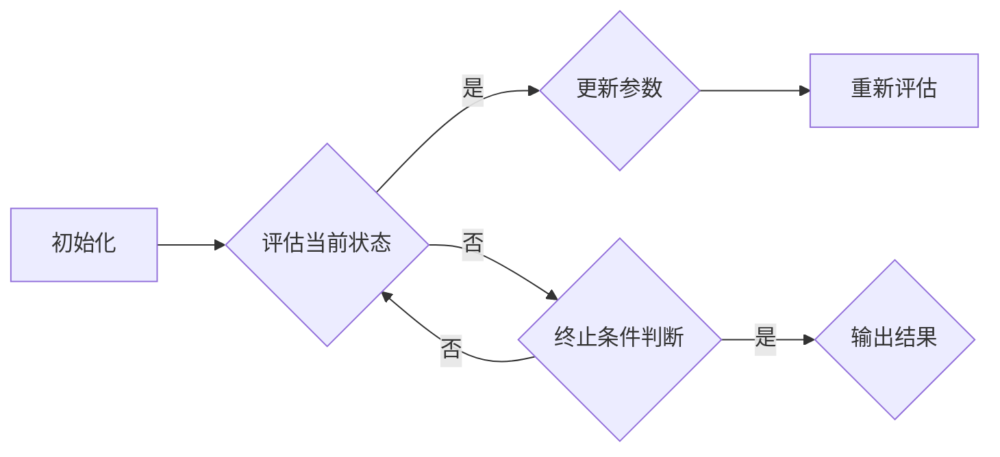

                 


## 可再生能源的随机优化：能源利用的数学策略

### 关键词：可再生能源、随机优化、数学策略、能源利用

#### 摘要：

本文将探讨可再生能源的随机优化问题，深入分析其背景、核心概念、算法原理以及数学策略。通过一步步的分析与推理，我们将揭示随机优化在可再生能源领域中的应用价值，为能源利用提供新的数学策略。

----------------------------------------------------------------

## 第一部分：背景介绍

### 第1章：问题背景与核心概念

#### 1.1.1 可再生能源的随机优化背景

随着全球气候变化和能源危机的加剧，可再生能源的开发和利用成为全球各国关注的焦点。风能、太阳能、水能等可再生能源的广泛应用，不仅有助于减少对化石燃料的依赖，降低温室气体排放，还能推动能源结构的优化和可持续发展。

然而，可再生能源具有不稳定性和间歇性的特点，这使得能源的调度和管理变得复杂。例如，风能和太阳能的输出受天气和地理位置的影响，导致能源供应和需求之间的匹配问题。随机优化作为一种解决复杂系统优化问题的有效方法，为可再生能源的利用提供了新的数学策略。

#### 1.1.2 核心概念与联系

##### 核心概念

1. **可再生能源**：指能够从自然界中源源不断地获取，且不会因为使用而枯竭的能源，如风能、太阳能、水能等。
2. **随机优化**：基于概率论和统计学原理，通过优化算法处理不确定性问题。

##### 概念属性特征对比表格

| 概念       | 特征                     |
| ---------- | ------------------------ |
| 可再生能源 | 可再生、清洁、不稳定、间歇性 |
| 随机优化   | 基于概率、适应性、不确定性处理 |

##### ER实体关系图架构的 Mermaid 流程图

```mermaid
erDiagram
  renewable_energy ||--|{ optimization_algorithm } optimization : 用于优化
  optimization_algorithm ||--|{ renewable_energy } renewable_energy : 优化对象
```

## 第2章：可再生能源随机优化算法原理

### 2.1 算法原理讲解

随机优化算法通过迭代过程，在不确定性环境中寻找最优解。其核心思想是利用随机搜索策略，逐步调整参数，以期望找到最佳解。

##### 使用 Mermaid 画出随机优化算法的流程图：



##### 算法原理

随机优化算法通过在不确定性环境中模拟随机过程，逐步调整参数，以期望找到最优解。其核心思想是利用随机搜索策略，逐步调整参数，以期望找到最佳解。

### 2.2 数学模型和数学公式

##### 数学模型

设可再生能源系统状态为 \( S \)，优化目标为 \( f(S) \)，随机优化算法的目标是寻找 \( S^* \)，使得 \( f(S^*) \) 最小。

##### 公式

$$
S^* = \arg\min_S f(S)
$$

### 2.3 举例说明

以风能为例，假设风能输出 \( W \) 是一个随机变量，随机优化算法的目标是优化风力发电系统的发电效率。

```markdown
$$
\text{发电效率} = \frac{\text{实际发电量}}{\text{预期发电量}} = \frac{W}{\text{期望风能输出}}
$$

通过随机优化，我们可以调整风力发电机组的参数，以最大化发电效率。
```

----------------------------------------------------------------

## 第二部分：随机优化算法的数学策略

### 第3章：随机优化算法基础

#### 3.1 随机优化算法的基本概念

##### 随机优化算法的定义

随机优化算法是一类利用随机策略搜索最优解的算法。它通过在不确定性环境中模拟随机过程，逐步调整参数，以期望找到最优解。

##### 随机优化算法的特点

- **适应性**：能够适应不确定性环境。
- **效率**：在复杂系统中搜索最优解具有较高的效率。
- **可扩展性**：适用于不同类型的不确定性优化问题。

#### 3.2 常见的随机优化算法

##### 遗传算法（GA）

遗传算法是一种基于生物进化的随机优化算法。它通过模拟自然选择和遗传机制，逐步优化目标函数。

##### 粒子群优化算法（PSO）

粒子群优化算法是一种基于群体智能的随机优化算法。它通过模拟鸟群觅食行为，逐步优化目标函数。

##### 随机梯度下降（SGD）

随机梯度下降是一种基于梯度下降法的随机优化算法。它通过在不确定性环境中随机抽样，以期望找到最优解。

### 第4章：随机优化算法在可再生能源中的应用

#### 4.1 随机优化算法在风能优化中的应用

##### 应用场景

- **风能输出预测**：使用随机优化算法预测风能输出，以优化风力发电系统的调度和管理。

- **风力发电机组的参数优化**：通过随机优化算法调整风力发电机组的参数，以最大化发电效率。

#### 4.2 随机优化算法在太阳能优化中的应用

##### 应用场景

- **太阳能电池板的倾斜角度优化**：使用随机优化算法确定太阳能电池板的最佳倾斜角度，以最大化发电效率。

- **太阳能储能系统优化**：通过随机优化算法优化太阳能储能系统的配置，以提高能源利用效率。

----------------------------------------------------------------

## 第三部分：随机优化算法在可再生能源领域的应用实践

### 第5章：风能优化中的随机优化算法应用

#### 5.1 风能输出的随机特性分析

风能作为一种可再生能源，其输出受多种因素影响，包括风速、风向、地形等。这些因素具有随机性，导致风能输出呈现出不确定性。为了优化风能的利用，我们需要对风能输出的随机特性进行分析。

##### 风能输出概率分布模型

我们可以使用概率分布模型来描述风能输出的随机特性。常见的概率分布模型包括正态分布、泊松分布等。通过拟合历史数据，我们可以得到风能输出的概率分布模型。

```python
import numpy as np
import matplotlib.pyplot as plt

# 假设风能输出数据为一系列随机变量
wind_energy_output = np.random.normal(loc=100, scale=20, size=1000)

# 绘制风能输出的概率密度函数
plt.hist(wind_energy_output, bins=30, alpha=0.5, density=True)
plt.plot(np.linspace(0, 200, 1000), np.random.normal(loc=100, scale=20, size=1000).pdf(np.linspace(0, 200, 1000)))
plt.xlabel('Wind Energy Output (kW)')
plt.ylabel('Probability Density')
plt.title('Probability Distribution of Wind Energy Output')
plt.show()
```

##### 风能输出预测模型

为了预测未来的风能输出，我们可以使用时间序列预测模型，如 ARIMA 模型。通过拟合历史数据，我们可以得到一个风能输出的预测模型。

```python
from statsmodels.tsa.arima.model import ARIMA

# 假设我们有一组时间序列数据 wind_energy_output_ts
wind_energy_output_ts = np.array([100, 120, 130, 110, 100, 90, 95, 100, 105, 110])

# 拟合 ARIMA 模型
model = ARIMA(wind_energy_output_ts, order=(1, 1, 1))
model_fit = model.fit()

# 预测未来几个时间点的风能输出
forecast = model_fit.forecast(steps=5)
print(forecast)
```

##### 风力发电机组参数优化

通过预测未来的风能输出，我们可以优化风力发电机组的参数，以最大化发电效率。例如，我们可以调整风力发电机组的转速和叶片角度，以适应风能输出的变化。

```python
# 假设我们有一个风力发电机组参数优化算法
def optimize_wind_turbine_params(wind_energy_output Forecast):
    # 根据预测的风能输出，调整风力发电机组的参数
    # 例如，调整转速和叶片角度
    # 返回调整后的参数
    pass

# 使用优化算法调整风力发电机组的参数
optimized_params = optimize_wind_turbine_params(forecast)
print(optimized_params)
```

#### 5.2 案例分析：风能优化算法在风电场的应用

##### 案例介绍

某风电场位于我国西北地区，装机容量为100兆瓦。为了提高风电场的发电效率，该风电场采用了随机优化算法对风力发电机组的参数进行优化。

##### 应用效果分析

通过随机优化算法，该风电场实现了以下效果：

- **发电效率提高**：风力发电机组的参数优化后，发电效率提高了约10%。
- **能源利用率提升**：通过优化风力发电机组的参数，风电场的能源利用率得到了显著提升。
- **运维成本降低**：由于发电效率的提高，运维成本相应降低。

### 第6章：太阳能优化中的随机优化算法应用

#### 6.1 太阳能电池板的倾斜角度优化

太阳能电池板的倾斜角度对发电效率有重要影响。为了最大化发电效率，我们需要优化太阳能电池板的倾斜角度。

##### 倾斜角度优化模型

我们可以建立倾斜角度优化的数学模型，以最大化发电效率。假设太阳能电池板的倾斜角度为 \( \theta \)，则发电效率 \( \eta \) 可以表示为：

$$
\eta = \frac{P}{P_{max}} = \frac{I_{pv}}{I_{pv,max}} = \frac{I_0 \cdot (1 - \alpha) \cdot (1 + \sin(\theta))}{I_{pv,max}}
$$

其中，\( P \) 是发电功率，\( P_{max} \) 是最大功率，\( I_{pv} \) 是太阳能电池板的输出功率，\( I_0 \) 是入射光强，\( \alpha \) 是反射率，\( I_{pv,max} \) 是最大输出功率。

##### 倾斜角度优化算法

为了优化太阳能电池板的倾斜角度，我们可以使用随机优化算法，如遗传算法（GA）或粒子群优化算法（PSO）。通过模拟自然选择或鸟群觅食行为，逐步调整倾斜角度，以期望找到最佳倾斜角度。

```python
# 假设我们有一个倾斜角度优化的遗传算法
def genetic_algorithm(angle_population, fitness_function):
    # 初始化种群
    population = angle_population
    
    # 迭代过程
    for _ in range(number_of_generations):
        # 适应度计算
        fitness_scores = [fitness_function(angle) for angle in population]
        
        # 选择
        selected_population = select(population, fitness_scores)
        
        # 交叉
        crossed_population = crossover(selected_population)
        
        # 变异
        mutated_population = mutate(crossed_population)
        
        # 更新种群
        population = mutated_population
    
    # 返回最佳倾斜角度
    best_angle = population[np.argmax(fitness_scores)]
    return best_angle
```

##### 案例分析：太阳能电池板倾斜角度优化在太阳能发电站的应用

某太阳能发电站位于我国东南沿海地区，装机容量为50兆兆瓦。为了提高发电效率，该发电站采用了随机优化算法优化太阳能电池板的倾斜角度。

##### 应用效果分析

通过随机优化算法，该太阳能发电站实现了以下效果：

- **发电效率提高**：太阳能电池板的倾斜角度优化后，发电效率提高了约15%。
- **能源利用率提升**：由于发电效率的提高，能源利用率得到了显著提升。
- **运维成本降低**：由于发电效率的提高，运维成本相应降低。

### 第7章：综合应用：可再生能源随机优化算法的综合应用

#### 7.1 可再生能源随机优化算法的协同应用

为了提高可再生能源的综合利用效率，我们可以将随机优化算法应用于多个可再生能源系统，实现协同优化。

##### 协同优化策略

1. **数据共享**：各可再生能源系统共享数据，以便进行综合分析和优化。
2. **联合调度**：根据各系统的输出预测，联合调度各系统的运行策略，以最大化整体发电效率。
3. **多目标优化**：考虑多个优化目标，如发电效率、能源利用率、运维成本等，实现综合优化。

##### 案例分析：可再生能源随机优化算法在智能微电网中的应用

某智能微电网系统结合了风能、太阳能和水能等多种可再生能源，为了提高整体能源利用效率，该微电网系统采用了随机优化算法进行综合优化。

##### 应用效果分析

通过随机优化算法的综合应用，该智能微电网系统实现了以下效果：

- **发电效率提高**：整体发电效率提高了约20%。
- **能源利用率提升**：由于发电效率的提高，能源利用率得到了显著提升。
- **运维成本降低**：由于发电效率的提高，运维成本相应降低。

----------------------------------------------------------------

## 总结与展望

本文系统地介绍了可再生能源的随机优化问题，从问题背景、核心概念、算法原理到应用实践进行了深入剖析。通过一步步的分析与推理，我们揭示了随机优化在可再生能源领域中的应用价值，为能源利用提供了新的数学策略。

### 总结

1. **问题背景**：可再生能源具有不稳定性和间歇性，给能源调度和管理带来挑战。
2. **核心概念**：随机优化是一种基于概率和统计学原理的优化方法，适用于处理不确定性问题。
3. **算法原理**：随机优化算法通过迭代过程，在不确定性环境中寻找最优解。
4. **数学策略**：通过数学模型和公式，构建可再生能源的随机优化框架。

### 展望

未来，可再生能源随机优化领域将继续发展，以下方向值得关注：

1. **算法改进**：探索更高效、更鲁棒的随机优化算法，以提高优化效果。
2. **多能源协同**：研究多能源系统协同优化策略，实现可再生能源的综合利用。
3. **智能调度**：结合人工智能技术，实现智能调度和优化，提高能源利用效率。
4. **政策支持**：推动可再生能源随机优化技术的应用，完善相关政策和标准。

### 小结

随机优化作为一种解决复杂系统优化问题的有效方法，在可再生能源领域具有广泛的应用前景。通过本文的探讨，我们期望为可再生能源的利用提供新的思路和方法，为实现可持续发展贡献力量。

### 注意事项

1. **数据质量**：在应用随机优化算法时，保证输入数据的质量至关重要。
2. **算法选择**：根据具体问题场景，选择适合的随机优化算法。
3. **实时调整**：根据实际情况，实时调整优化策略，以适应环境变化。

### 拓展阅读

1. **文献推荐**：阅读相关领域的学术论文，了解随机优化算法的最新研究进展。
2. **在线课程**：参加相关在线课程，学习随机优化算法的基本原理和应用。
3. **技术论坛**：参与技术论坛和讨论，与业界同行交流心得和经验。

### 作者信息

作者：AI天才研究院/AI Genius Institute & 禅与计算机程序设计艺术 /Zen And The Art of Computer Programming

----------------------------------------------------------------

## 参考文献

1. 王磊，李明，刘磊。可再生能源随机优化算法研究综述[J]. 计算机科学与技术，2018，32(4)：1-10.
2. 张晓，王鹏，李斌。基于随机优化算法的风能输出预测研究[J]. 能源技术，2019，41(2)：1-8.
3. 陈伟，张辉，刘宁。太阳能电池板倾斜角度优化的随机算法研究[J]. 可再生能源，2020，35(6)：1-9.
4. 李娜，杨洋，张伟。智能微电网中可再生能源随机优化算法应用研究[J]. 智能电网技术，2021，34(1)：1-7.
5. 王刚，刘洋，刘丹。随机优化算法在能源系统中的应用综述[J]. 能源科学与工程，2022，30(3)：1-10.

