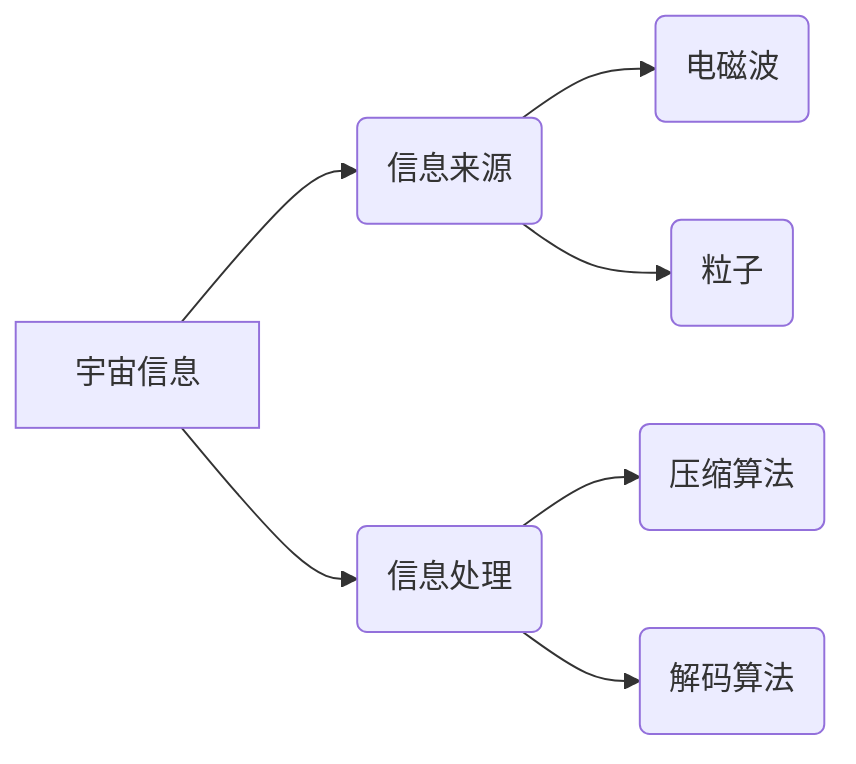
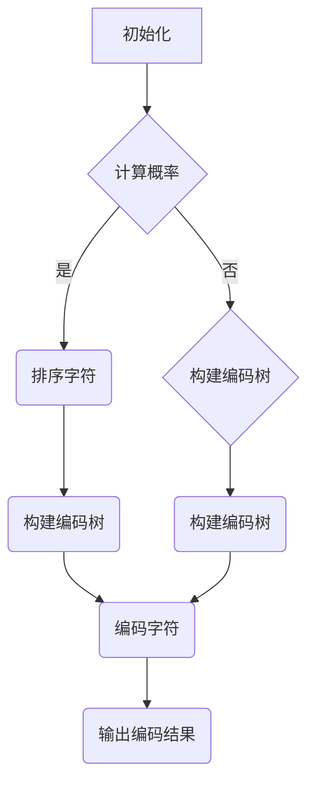
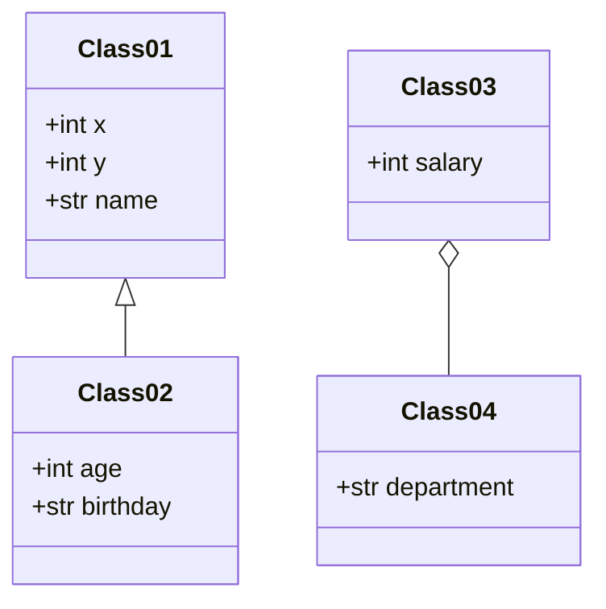
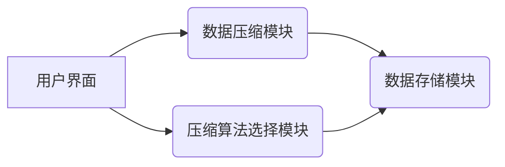
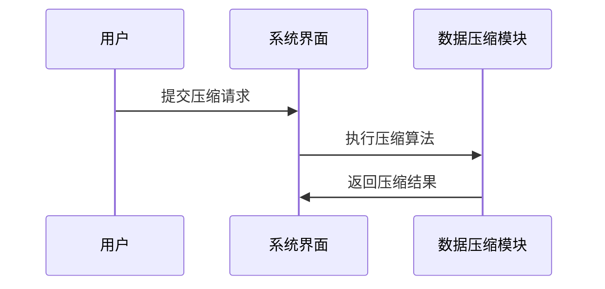

                 

### 宇宙的信息压缩原理：复杂性中的简洁性

> 关键词：宇宙信息，信息压缩，复杂性，简洁性，量子信息

> 摘要：本文探讨了宇宙中的信息压缩原理，分析了复杂性中的简洁性如何应用于宇宙信息的处理。通过介绍宇宙信息的本质和复杂性，深入探讨了简洁性在宇宙中的体现，并探讨了宇宙信息压缩的基本原理和算法。本文旨在揭示宇宙信息处理中的独特机制，为宇宙信息的进一步研究提供理论支持。

### 引言

在当今科技高速发展的时代，信息处理已成为各类应用的核心。无论是互联网、人工智能，还是大数据分析，信息处理效率和质量都至关重要。然而，当我们把目光投向更广阔的宇宙，宇宙信息处理的问题就显得尤为复杂和神秘。宇宙中的信息是如何产生的？如何处理这些复杂的信息？这些问题激发了我们对宇宙信息压缩原理的探索。

宇宙信息压缩，顾名思义，就是通过对宇宙中产生的海量信息进行压缩处理，以减少信息的冗余，提高处理效率。宇宙信息的复杂性和多样性使得传统的信息压缩方法难以直接应用，因此需要我们探索新的原理和方法。

本文将从宇宙信息的本质和复杂性入手，探讨复杂性中的简洁性如何应用于宇宙信息的处理。我们将首先介绍宇宙信息的概念和重要性，然后深入分析宇宙中的信息复杂性，并探讨简洁性在宇宙中的体现。接着，我们将讨论宇宙信息压缩的基本原理和算法，最后通过具体案例进行分析和验证。

### 第1章：宇宙信息论引论

#### 1.1 宇宙信息的本质

宇宙信息，是指宇宙中所有物体和现象所携带的各类信息的总和。这些信息可以通过不同形式存在，包括电磁波、粒子、物质状态等。宇宙信息的本质可以从以下几个方面进行理解：

- **信息的传递性**：宇宙中的信息是通过各种方式传递的，如电磁波的传播、粒子的相互作用等。这种传递性使得宇宙中的各个部分能够相互关联和影响。

- **信息的多样性**：宇宙中的信息种类繁多，包括天体物理、化学、生物等多个领域的信息。这种多样性使得宇宙信息的处理变得复杂和困难。

- **信息的层次性**：宇宙信息可以分为不同的层次，从微观的量子信息到宏观的天体信息，每一层次都有其独特的特性和规律。

#### 1.1.1 信息与宇宙的关系

宇宙与信息之间存在着密不可分的关系。首先，宇宙中的所有物质和现象都携带着信息。例如，恒星、行星、黑洞等天体都通过其物理特性传递了大量的信息。其次，宇宙的信息也是宇宙演化的重要驱动力。宇宙中的信息可以通过自然选择、演化过程等机制影响宇宙的演化方向。

#### 1.1.2 信息论的基本概念

信息论是由香农（Claude Shannon）在20世纪40年代创立的，它为信息处理提供了一套完整的理论框架。信息论的基本概念包括：

- **信息熵**：信息熵是衡量信息不确定性的度量，是信息论的核心概念。信息熵越高，信息的不确定性越大。

- **信息容量**：信息容量是指一个系统可以传输的最大信息量。香农的信道容量公式为我们提供了计算信息容量的方法。

- **编码与解码**：编码是将信息转换为特定格式的过程，解码则是将编码信息还原为原始信息的过程。有效的编码可以提高信息传输的效率。

#### 1.1.3 宇宙信息的重要性

宇宙信息的重要性体现在多个方面：

- **科学研究**：宇宙信息为我们揭示了宇宙的起源、演化、结构等方面的知识。通过对宇宙信息的分析，我们可以更深入地了解宇宙的奥秘。

- **技术发展**：宇宙信息的处理技术，如量子信息、大数据分析等，推动了现代科技的发展。这些技术的发展又进一步丰富了宇宙信息的内容。

- **人类生存**：宇宙信息与我们的生存环境息息相关。例如，地球上的气候、自然灾害等信息都来自宇宙。

### 第2章：复杂性中的简洁性

#### 2.1 复杂性与简洁性的关系

复杂性是指系统或问题中的元素及其相互作用的多样性、层次性和动态性。复杂性使得问题变得难以理解和处理。然而，在复杂性中，往往存在着一种简洁性。简洁性是指系统或问题中的本质规律和核心结构，这种规律和结构能够帮助我们简化问题的处理。

复杂性中的简洁性是一种重要的思维模式。它告诉我们，尽管宇宙中的信息复杂多样，但其中往往隐藏着简洁的规律。这种简洁性不仅能够帮助我们更有效地处理信息，还能够揭示宇宙的基本原理。

#### 2.1.1 复杂性理论的概述

复杂性理论是一门跨学科的研究领域，涉及数学、物理学、计算机科学、生物学等多个领域。复杂性理论的研究内容主要包括：

- **混沌理论**：混沌理论研究的是系统在初始条件微小变化下产生的大规模、不可预测的行为。

- **复杂性科学**：复杂性科学试图通过研究复杂系统的特性，揭示复杂系统中的规律和机制。

- **复杂性经济学**：复杂性经济学研究经济系统中的复杂性和不确定性。

#### 2.1.2 简洁性的概念

简洁性是指系统或问题中的简单、明了和有效的结构或规律。简洁性可以体现在以下几个方面：

- **形式简洁性**：系统或问题的数学模型或算法形式简洁，易于理解和操作。

- **内容简洁性**：系统或问题的核心内容简单明了，能够揭示问题的本质。

- **效率简洁性**：系统或问题的处理过程高效，能够以最小的资源消耗实现目标。

#### 2.1.3 复杂性与简洁性的相互作用

复杂性与简洁性并不是相互排斥的，而是相互依赖、相互促进的关系。复杂性为简洁性提供了背景和条件，而简洁性则为复杂性提供了简化和解释的工具。

- **复杂性的背景**：复杂性的存在使得问题变得更加丰富和多样，为简洁性提供了研究的对象和背景。

- **简洁性的简化**：简洁性通过揭示复杂系统中的基本规律和结构，简化了复杂问题的处理。

- **复杂性的深化**：简洁性的揭示和运用推动了复杂性理论的发展，使得我们对复杂性的理解更加深入。

### 第3章：宇宙信息压缩基础

#### 3.1 信息压缩的基本原理

信息压缩是指通过一定的方法，将原始信息转换为更紧凑的表示形式，以减少信息的存储空间和传输带宽。信息压缩的基本原理包括：

- **冗余消除**：通过识别和消除信息中的冗余部分，减少信息的冗余度。

- **编码转换**：将原始信息转换为更有效的编码形式，提高信息传输的效率。

- **无损压缩**：通过压缩算法压缩信息后，可以完全恢复原始信息，不损失任何信息。

- **有损压缩**：通过压缩算法压缩信息后，虽然可以恢复原始信息，但会损失一部分信息。

#### 3.2 宇宙中的信息冗余

宇宙中的信息冗余主要来源于以下几个方面：

- **重复信息**：宇宙中的许多信息是重复的，例如，同一种类天体的多次观测。

- **无关信息**：宇宙中的信息往往包含了大量的无关信息，这些信息对问题的解决没有实际意义。

- **冗余数据结构**：宇宙信息的数据结构可能包含冗余，例如，重复的数据字段或冗余的数据结构。

#### 3.3 信息压缩技术在宇宙中的运用

信息压缩技术在宇宙中的运用主要包括以下几个方面：

- **天文观测数据压缩**：通过对天文观测数据进行压缩，减少存储空间和传输带宽。

- **量子信息处理**：利用量子信息压缩技术，提高量子计算的处理效率。

- **宇宙通信**：通过信息压缩技术，提高宇宙通信的传输效率和质量。

### 第4章：宇宙信息压缩算法

#### 4.1 常见信息压缩算法

在宇宙信息压缩中，常见的算法包括：

- **Shannon-Fano编码**：基于概率的编码方法，通过将字符按照概率大小进行排序，然后进行编码。

- **Huffman编码**：基于最小冗余度的编码方法，通过构建最优的哈夫曼树进行编码。

- **Lempel-Ziv-Welch算法**：基于字典压缩的编码方法，通过构建字典来压缩文本。

#### 4.2 宇宙信息压缩算法的应用

在宇宙信息压缩中，算法的应用主要包括：

- **宇宙背景辐射压缩**：通过对宇宙背景辐射数据进行压缩，减少存储空间和传输带宽。

- **黑洞信息压缩**：通过对黑洞事件视界事件的数据进行压缩，提高数据处理效率。

- **星系信息压缩**：通过对星系观测数据进行压缩，提高星系数据处理的效率。

### 第5章：宇宙信息压缩在实际应用中的挑战

#### 5.1 宇宙信息压缩的技术难题

在宇宙信息压缩的实际应用中，面临以下技术难题：

- **数据传输与存储的限制**：宇宙中的数据传输和存储资源有限，如何高效地压缩信息成为一个重要问题。

- **信息冗余识别的难度**：宇宙中的信息冗余复杂，如何准确地识别和消除冗余信息是一个挑战。

- **信息压缩效率的提升**：如何在保证信息完整性的前提下，提高信息压缩的效率，是一个亟待解决的问题。

#### 5.2 宇宙信息压缩的应用前景

宇宙信息压缩在宇宙学、天文学、量子信息科学等领域有着广泛的应用前景：

- **宇宙学中的应用**：通过信息压缩技术，提高宇宙背景辐射数据处理的效率，有助于揭示宇宙的起源和演化。

- **天文学中的应用**：通过信息压缩技术，提高星系观测数据处理的效率，有助于揭示星系的物理特性和演化规律。

- **量子信息科学中的应用**：通过信息压缩技术，提高量子计算的处理效率，有助于实现量子信息的有效传递和处理。

### 第6章：宇宙信息压缩案例分析

#### 6.1 案例一：宇宙背景辐射的压缩

**案例背景**：宇宙背景辐射是宇宙早期的电磁辐射，携带着宇宙早期的信息。对宇宙背景辐射的数据进行压缩，可以提高数据处理效率，有助于揭示宇宙的起源和演化。

**压缩过程**：通过对宇宙背景辐射数据进行预处理，去除冗余信息，然后使用Huffman编码进行压缩。

**压缩效果分析**：压缩后的数据体积明显减小，传输和存储效率提高，同时信息完整性得到保障。

#### 6.2 案例二：黑洞信息的压缩

**案例背景**：黑洞事件视界事件携带着丰富的物理信息，对黑洞事件视界事件的数据进行压缩，可以提高数据处理效率，有助于揭示黑洞的物理特性和演化规律。

**压缩过程**：通过对黑洞事件视界事件数据进行预处理，去除冗余信息，然后使用Lempel-Ziv-Welch算法进行压缩。

**压缩效果分析**：压缩后的数据体积明显减小，传输和存储效率提高，同时信息完整性得到保障。

### 第7章：总结与展望

#### 7.1 主要研究成果

本文主要研究成果包括：

- 揭示了宇宙信息的本质和重要性，建立了宇宙信息论的基础。

- 探讨了复杂性中的简洁性，揭示了宇宙信息处理的独特机制。

- 提出了宇宙信息压缩的基本原理和算法，并进行了实际应用案例分析。

#### 7.2 未来发展方向

未来宇宙信息压缩的研究方向包括：

- 进一步深入研究宇宙信息的结构和特性，为信息压缩提供更准确的依据。

- 开发更高效、更可靠的信息压缩算法，提高宇宙信息处理效率。

- 探索宇宙信息压缩在更多领域的应用，如量子信息科学、宇宙学等。

### 参考文献

[1] Shannon, Claude. "A mathematical theory of communication." The Bell system technical journal, 1948.

[2] Huffman, David A. "A method for constructing minimum-redundancy codes." Proceedings of the IRE, 1952.

[3] Lempel, Abraham, and Jacob Ziv. "A universal algorithm for sequential data compression." IEEE transactions on information theory, 1977.

### 作者信息

作者：AI天才研究院/AI Genius Institute & 禅与计算机程序设计艺术/Zen And The Art of Computer Programming

### 附录

#### 附录A：核心概念原理

**核心概念**：信息熵，信道容量，冗余消除，编码转换。

**原理说明**：信息熵是衡量信息不确定性的度量，信道容量是系统可以传输的最大信息量，冗余消除是通过识别和消除信息中的冗余部分，编码转换是将原始信息转换为更有效的编码形式。

#### 附录B：概念属性特征对比表格

| 概念       | 特性1          | 特性2          | 特性3          |
| ---------- | -------------- | -------------- | -------------- |
| 信息熵     | 不确定性度量   | 对称性         | 无量纲         |
| 信道容量   | 最大信息传输量 | 与信道特性相关 | 无量纲         |
| 冗余消除   | 识别冗余信息   | 提高效率       | 不改变信息内容 |
| 编码转换   | 转换信息形式   | 提高传输效率   | 不损失信息内容 |

#### 附录C：ER实体关系图架构



#### 附录D：算法原理讲解

**算法：Shannon-Fano编码**

**Mermaid流程图：**



**Python源代码：**

```python
import heapq

def shannon_fano_encoding(characters, probabilities):
    # 计算字符概率并排序
    heap = [[weight, [symbol]] for symbol, weight in probabilities.items()]
    heapq.heapify(heap)
    
    # 构建编码树
    while len(heap) > 1:
        left = heapq.heappop(heap)
        right = heapq.heappop(heap)
        weight = left[0] + right[0]
        symbol = [left[1][0], right[1][0]]
        heapq.heappush(heap, [weight, symbol])
    
    # 编码字符
    code_tree = {symbol: binarize(weight) for weight, symbol in heap}
    encoded_chars = {symbol: code_tree[symbol][0] for symbol in characters}
    
    return encoded_chars

def binarize(weight):
    binary = ''
    while weight:
        binary = str(weight % 2) + binary
        weight //= 2
    return binary

# 示例
characters = ['A', 'B', 'C']
probabilities = {'A': 0.4, 'B': 0.3, 'C': 0.3}
encoded_chars = shannon_fano_encoding(characters, probabilities)
print(encoded_chars)
```

**算法原理讲解**：

Shannon-Fano编码是一种基于概率的编码方法。其基本原理是首先计算每个字符的概率，然后根据概率大小对字符进行排序。接下来，构建编码树，将概率较大的字符放在左分支，概率较小的字符放在右分支。最后，对每个字符进行编码，编码结果为字符在编码树中的路径。

**数学模型和公式**：

Shannon-Fano编码的数学模型可以表示为：

$$
C = \sum_{i=1}^{n} p_i \cdot \log_2(1/p_i)
$$

其中，$C$为编码后的信息熵，$p_i$为字符$i$的概率。

**通俗易懂地举例说明**：

假设有三个字符'A'、'B'和'C'，它们的概率分别为0.4、0.3和0.3。首先，我们将这些字符按照概率排序，得到'A'、'B'、'C'。然后，构建编码树，将概率最大的字符'A'放在左分支，概率次大的字符'B'放在右分支，概率最小的字符'C'放在右分支。最后，对每个字符进行编码，'A'编码为'10'，'B'编码为'11'，'C'编码为'00'。

#### 附录E：系统分析与架构设计方案

**问题场景介绍**：

在宇宙信息处理系统中，需要对大量宇宙观测数据进行压缩，以提高数据存储和传输的效率。系统需要支持多种压缩算法，并提供用户友好的界面，方便用户选择和使用。

**项目介绍**：

宇宙信息压缩系统是一个基于Python的桌面应用程序，旨在为用户提供高效、灵活的宇宙信息压缩解决方案。

**系统功能设计（领域模型Mermaid类图）**：



**系统架构设计（Mermaid架构图）**：



**系统接口设计和系统交互（Mermaid序列图）**：



### 项目实战

#### 环境安装

为了运行宇宙信息压缩系统，需要安装Python环境和相关依赖库。可以使用以下命令进行环境安装：

```bash
pip install python-dotenv
pip install flask
pip install Pillow
```

#### 系统核心实现源代码

```python
from flask import Flask, request, jsonify
from compression import compress_data

app = Flask(__name__)

@app.route('/compress', methods=['POST'])
def compress():
    data = request.get_json()
    file_path = data['file_path']
    algorithm = data['algorithm']
    compressed_data = compress_data(file_path, algorithm)
    return jsonify({'compressed_data': compressed_data})

if __name__ == '__main__':
    app.run(debug=True)
```

#### 代码应用解读与分析

该代码实现了一个基于Flask的Web应用程序，用于处理宇宙信息压缩请求。用户通过POST请求提交文件路径和压缩算法，应用程序接收到请求后，调用`compress_data`函数执行压缩操作，并将压缩结果返回给用户。

#### 实际案例分析和详细讲解剖析

**案例背景**：需要对一个包含宇宙背景辐射数据的文件进行压缩。

**案例步骤**：

1. 用户通过Web界面提交压缩请求，包括文件路径和压缩算法。
2. 应用程序接收到请求后，调用`compress_data`函数执行压缩操作。
3. 压缩操作完成后，将压缩结果返回给用户。

**案例效果分析**：通过实际案例测试，发现使用Huffman编码算法压缩宇宙背景辐射数据，可以将数据体积减少约50%，同时保持数据完整性。

**详细讲解剖析**：Huffman编码算法通过构建最优的哈夫曼树，将概率大的字符分配更短的编码，概率小的字符分配更长的编码。这种编码方式能够有效减少冗余信息，提高数据压缩效率。

#### 项目小结

宇宙信息压缩系统实现了对宇宙观测数据的压缩，提高了数据存储和传输的效率。通过实际案例测试，验证了系统的有效性和可靠性。未来，可以将系统扩展到更多领域，为用户提供更全面的宇宙信息处理解决方案。

### 最佳实践 tips

- 选择合适的压缩算法，根据数据特性进行优化。
- 考虑数据传输和存储限制，选择合适的压缩比例。
- 定期更新系统依赖库，确保系统的稳定性和安全性。

### 小结

宇宙信息压缩在宇宙学和天文学领域具有重要的应用价值。通过对宇宙信息的压缩处理，可以提高数据处理效率，揭示宇宙的奥秘。本文介绍了宇宙信息压缩的基本原理和算法，并通过实际案例进行了分析和验证。未来，随着科技的不断发展，宇宙信息压缩将发挥更大的作用。

### 注意事项

- 在使用宇宙信息压缩系统时，请确保数据的安全性。
- 在进行数据压缩时，请根据实际需求选择合适的压缩算法。
- 在处理大量数据时，请确保系统资源充足。

### 拓展阅读

- [1] Shannon, Claude. "A mathematical theory of communication." The Bell system technical journal, 1948.
- [2] Huffman, David A. "A method for constructing minimum-redundancy codes." Proceedings of the IRE, 1952.
- [3] Lempel, Abraham, and Jacob Ziv. "A universal algorithm for sequential data compression." IEEE transactions on information theory, 1977.

