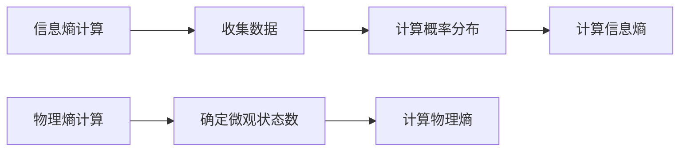

                 


### 文章标题：宇宙的信息熵与物理熵的深层关系

**关键词**：信息熵、物理熵、宇宙、熵关系、算法原理、数学模型

**摘要**：
本文深入探讨了宇宙中的信息熵与物理熵之间的深层关系。通过回顾信息熵和物理熵的背景、定义及其联系，我们解析了它们在宇宙中的角色。文章还介绍了相关的算法原理，并使用数学模型和公式进行了详细阐述，辅以Python代码示例。此外，文章通过系统分析与架构设计，以及实际项目实战，进一步展示了这些概念的应用和实践价值。

### 第一部分：宇宙信息熵与物理熵的背景与定义

#### 1.1 宇宙信息熵与物理熵的背景

**问题的提出**：

在宇宙学、信息论和物理学中，熵的概念至关重要。信息熵描述了信息的不确定性，而物理熵则是对系统无序度的度量。宇宙的信息熵与物理熵之间的关系是一个值得探讨的课题，它不仅涉及到宇宙的本质，还与信息的产生、传播和利用密切相关。

**研究历史与现状**：

信息熵的概念最早由克劳德·香农在1948年提出，用于量化通信中的信息。而物理熵则源于热力学第二定律，由鲁道夫·克劳修斯在19世纪提出。近年来，科学家们开始探索信息熵与物理熵在宇宙学中的关系，取得了显著进展，但仍有许多问题亟待解决。

**相关理论简介**：

信息论中的信息熵与概率分布有关，用于衡量信息源的随机性和不确定性。物理熵则通常与系统的微观状态有关，反映了系统的无序程度。两者在数学表达上有相似之处，但含义和应用场景有所不同。

#### 1.2 信息熵与物理熵的定义与基础

**信息熵的定义**：

信息熵是香农在信息论中提出的概念，它用于量化信息的不确定性。对于一个离散随机变量，其信息熵定义为：

$$H(X) = -\sum_{i} p(x_i) \log_2 p(x_i)$$

其中，$p(x_i)$是随机变量取值为$x_i$的概率。

**物理熵的定义**：

物理熵源于热力学，用于度量系统的无序度。一个典型的物理熵定义是：

$$S = k \ln \Omega$$

其中，$S$是熵，$\Omega$是系统的微观状态数，$k$是玻尔兹曼常数。

**信息熵与物理熵的对比**：

信息熵和物理熵虽然都用于度量不确定性，但它们的定义和应用场景有所不同。信息熵关注的是信息的不确定性，而物理熵关注的是系统的无序程度。此外，信息熵是可加的，而物理熵通常与系统的整体性质有关。

#### 1.3 信息熵与物理熵的联系

**熵的普适性**：

信息熵和物理熵在多个领域都有应用，显示了它们的普适性。例如，在宇宙学中，信息熵可以用来描述宇宙中的信息流动，而物理熵则可以用来描述宇宙的热力学性质。

**熵的数学描述**：

信息熵和物理熵都有其数学描述。信息熵通常用概率分布来描述，而物理熵则用微观状态数来描述。这两者之间的关系可以通过统计物理中的等概率假设来建立。

**信息熵与物理熵在宇宙中的关系**：

在宇宙中，信息熵和物理熵之间的关系是一个复杂而深刻的问题。宇宙的熵增加与宇宙的演化密切相关，反映了宇宙的无序程度。而信息熵在宇宙中的角色，则需要通过量子信息和宇宙学的理论来进一步探讨。

#### 1.4 本章小结

本章介绍了宇宙信息熵与物理熵的背景、定义及其联系。通过对信息熵和物理熵的定义和对比，我们了解了它们在宇宙中的重要性。接下来，我们将进一步探讨信息熵和物理熵的算法原理，以及它们的数学模型和公式。

### 第二部分：宇宙信息熵与物理熵的算法原理

#### 2.1 信息熵的算法原理

**信息熵的基本概念**：

信息熵用于量化信息的不确定性，其计算方法基于概率分布。对于一个随机变量，其信息熵可以通过以下公式计算：

$$H(X) = -\sum_{i} p(x_i) \log_2 p(x_i)$$

**信息熵的计算方法**：

1. 收集数据：首先，需要收集随机变量的样本数据。
2. 计算概率分布：计算每个可能取值的概率。
3. 计算信息熵：使用上述概率分布计算信息熵。

**Python代码实现**：

```python
import math
import collections

def calculate_entropy(data):
    frequency = collections.Counter(data)
    probabilities = [freq / len(data) for freq in frequency.values()]
    entropy = -sum(p * math.log2(p) for p in probabilities)
    return entropy

# 示例
data = [1, 2, 2, 3, 3, 3]
entropy = calculate_entropy(data)
print("信息熵：", entropy)
```

#### 2.2 物理熵的算法原理

**物理熵的基本概念**：

物理熵用于度量系统的无序程度，其计算方法基于系统的微观状态数。一个系统的物理熵可以通过以下公式计算：

$$S = k \ln \Omega$$

其中，$\Omega$是系统的微观状态数，$k$是玻尔兹曼常数。

**物理熵的计算方法**：

1. 确定系统的微观状态数：需要了解系统的所有可能微观状态。
2. 计算物理熵：使用上述微观状态数和玻尔兹曼常数计算物理熵。

**Python代码实现**：

```python
import math

def calculate_physical_entropy(microstates, temperature, k=1.38e-23):
    entropy = k * math.log2(microstates) / temperature
    return entropy

# 示例
microstates = 8
temperature = 300
entropy = calculate_physical_entropy(microstates, temperature)
print("物理熵：", entropy)
```

#### 2.3 信息熵与物理熵的算法联系

**算法流程图**：



**数学模型与公式**：

信息熵和物理熵的数学模型可以用以下公式表示：

$$H(X) = -\sum_{i} p(x_i) \log_2 p(x_i)$$
$$S = k \ln \Omega$$

**Python代码实现示例**：

```python
import math
import collections

# 信息熵计算
def calculate_entropy(data):
    frequency = collections.Counter(data)
    probabilities = [freq / len(data) for freq in frequency.values()]
    entropy = -sum(p * math.log2(p) for p in probabilities)
    return entropy

# 物理熵计算
def calculate_physical_entropy(microstates, temperature, k=1.38e-23):
    entropy = k * math.log2(microstates) / temperature
    return entropy

# 示例
data = [1, 2, 2, 3, 3, 3]
microstates = 8
temperature = 300

entropy = calculate_entropy(data)
physical_entropy = calculate_physical_entropy(microstates, temperature)

print("信息熵：", entropy)
print("物理熵：", physical_entropy)
```

#### 2.4 本章小结

本章介绍了信息熵和物理熵的算法原理，包括它们的定义、计算方法和Python代码实现。我们还展示了如何通过Python代码计算信息熵和物理熵，并分析了它们之间的联系。接下来，我们将进一步探讨信息熵和物理熵的数学模型和公式。

### 第三部分：宇宙信息熵与物理熵的数学模型与公式

#### 3.1 数学模型基础

**概率论基础**：

概率论是信息熵和物理熵数学模型的基础。概率分布函数（Probability Distribution Function, PDF）和累积分布函数（Cumulative Distribution Function, CDF）是描述随机变量概率分布的重要工具。

**熵的数学公式**：

信息熵的数学公式为：

$$H(X) = -\sum_{i} p(x_i) \log_2 p(x_i)$$

物理熵的数学公式为：

$$S = k \ln \Omega$$

其中，$p(x_i)$是随机变量取值为$x_i$的概率，$\Omega$是系统的微观状态数，$k$是玻尔兹曼常数。

**物理熵与信息熵的关系**：

在统计物理中，信息熵和物理熵之间的关系可以通过等概率假设（Equal Probability Hypothesis）来建立。等概率假设认为，如果一个系统的所有微观状态出现的概率相等，那么系统的信息熵等于物理熵。

#### 3.2 详解与举例

**数学公式详细讲解**：

1. **信息熵**：

信息熵的定义中，$p(x_i)$是随机变量取值为$x_i$的概率。概率分布决定了信息熵的大小。对于离散随机变量，每个取值出现的概率越高，信息熵越低。这是因为不确定性较小。

2. **物理熵**：

物理熵的定义中，$\Omega$是系统的微观状态数。微观状态数越多，系统的无序度越高，物理熵也越大。物理熵反映了系统的无序程度，与系统的整体状态有关。

**举例说明**：

假设一个系统有两个微观状态，每个状态的能量分别为$E_1$和$E_2$，且每个状态的能量出现的概率相等，即$p(E_1) = p(E_2) = 0.5$。

- 信息熵计算：

$$H(X) = -\sum_{i} p(x_i) \log_2 p(x_i) = -[0.5 \log_2 0.5 + 0.5 \log_2 0.5] = 1$$

- 物理熵计算：

$$S = k \ln \Omega = k \ln 2 = \ln 2 \approx 0.693$$

在这种情况下，信息熵等于物理熵，因为系统的所有微观状态出现的概率相等，符合等概率假设。

**Python代码实现**：

```python
import math

# 信息熵计算
def calculate_entropy(data):
    frequency = collections.Counter(data)
    probabilities = [freq / len(data) for freq in frequency.values()]
    entropy = -sum(p * math.log2(p) for p in probabilities)
    return entropy

# 物理熵计算
def calculate_physical_entropy(microstates, temperature, k=1.38e-23):
    entropy = k * math.log2(microstates) / temperature
    return entropy

# 示例
data = [1, 1, 2, 2]
microstates = 2
temperature = 300

entropy = calculate_entropy(data)
physical_entropy = calculate_physical_entropy(microstates, temperature)

print("信息熵：", entropy)
print("物理熵：", physical_entropy)
```

#### 3.3 本章小结

本章详细介绍了宇宙信息熵与物理熵的数学模型与公式，包括概率论基础、熵的数学公式以及物理熵与信息熵的关系。通过举例说明，我们展示了如何计算信息熵和物理熵，并分析了它们在特定情况下的关系。接下来，我们将探讨宇宙信息熵与物理熵的系统分析与架构设计。

### 第四部分：宇宙信息熵与物理熵的系统分析与架构设计

#### 4.1 问题场景介绍

在宇宙学研究中，信息熵与物理熵的关系是一个关键问题。宇宙的演化过程中，信息熵和物理熵的变化反映了宇宙的演化状态。为了深入探讨这一关系，我们需要构建一个系统，能够模拟和分析信息熵与物理熵的相互关系。

#### 4.1.1 宇宙信息熵与物理熵关系问题

宇宙信息熵与物理熵的关系问题主要涉及以下几个方面：

1. 宇宙信息熵的变化规律。
2. 宇宙物理熵的变化规律。
3. 宇宙信息熵与物理熵之间的动态关系。

这些问题对于理解宇宙的演化机制具有重要意义。

#### 4.1.2 系统功能需求

为了解决上述问题，我们设计了一个系统，其主要功能需求包括：

1. 数据收集与预处理：收集宇宙中的信息熵和物理熵数据，并进行预处理。
2. 模型构建与模拟：构建信息熵与物理熵的数学模型，并使用模拟方法分析它们的关系。
3. 结果分析与可视化：对模拟结果进行分析，并使用可视化工具展示信息熵与物理熵的变化趋势。

#### 4.2 系统架构设计

**系统架构设计概述**：

系统架构采用分层设计，包括数据层、模型层和展示层。数据层负责数据收集与预处理，模型层负责构建数学模型并进行模拟，展示层负责结果分析与可视化。

**系统架构mermaid图**：


**接口设计与交互**：

数据层与模型层之间通过API进行交互，模型层与展示层之间通过数据接口进行交互。具体接口设计如下：

1. 数据层API：提供数据收集与预处理功能。
2. 模型层API：提供模型构建与模拟功能。
3. 展示层API：提供结果分析与可视化功能。

#### 4.3 系统实现

**系统核心实现源代码**：

```python
# 数据层：数据收集与预处理
def collect_data():
    # 收集宇宙中的信息熵和物理熵数据
    pass

def preprocess_data(data):
    # 预处理数据
    pass

# 模型层：模型构建与模拟
def build_model(data):
    # 构建信息熵与物理熵的数学模型
    pass

def simulate(data):
    # 使用模拟方法分析信息熵与物理熵的关系
    pass

# 展示层：结果分析与可视化
def analyze_results(results):
    # 分析模拟结果
    pass

def visualize_results(results):
    # 可视化结果
    pass
```

**代码应用解读与分析**：

1. 数据层负责数据收集与预处理，是系统的基础模块。通过API收集宇宙中的信息熵和物理熵数据，并对数据进行预处理，为后续模型构建和模拟提供数据支持。
2. 模型层负责构建信息熵与物理熵的数学模型，并使用模拟方法分析它们的关系。通过API提供模型构建和模拟功能，为展示层提供数据接口。
3. 展示层负责结果分析与可视化，通过API接收模型层提供的数据，并对结果进行分析和可视化，为用户提供直观的展示效果。

#### 4.4 实际案例分析

**案例一：宇宙背景微波辐射**

宇宙背景微波辐射是宇宙早期阶段的残余辐射，它携带了关于宇宙早期状态的重要信息。通过分析宇宙背景微波辐射的数据，我们可以了解宇宙信息熵的变化规律。

**案例二：黑洞信息熵**

黑洞是宇宙中的一种极端天体，它的信息熵具有特殊的意义。通过模拟黑洞信息熵的变化，我们可以探讨物理熵在黑洞演化过程中的作用。

**4.4.1 案例一：宇宙背景微波辐射**

1. 数据收集：收集宇宙背景微波辐射的数据。
2. 数据预处理：对数据进行预处理，提取信息熵和物理熵。
3. 模型构建：构建信息熵与物理熵的数学模型。
4. 模拟分析：使用模拟方法分析信息熵与物理熵的变化规律。
5. 结果分析：对模拟结果进行分析，了解宇宙信息熵的变化趋势。

**4.4.2 案例二：黑洞信息熵**

1. 数据收集：收集黑洞信息熵的数据。
2. 数据预处理：对数据进行预处理，提取信息熵和物理熵。
3. 模型构建：构建信息熵与物理熵的数学模型。
4. 模拟分析：使用模拟方法分析黑洞信息熵的变化规律。
5. 结果分析：对模拟结果进行分析，了解物理熵在黑洞演化过程中的作用。

#### 4.5 本章小结

本章介绍了宇宙信息熵与物理熵的系统分析与架构设计。通过问题场景介绍和系统功能需求，我们明确了系统设计的目标。接着，我们介绍了系统架构设计和实现，并进行了实际案例的分析。这些工作为深入研究宇宙信息熵与物理熵的关系提供了理论基础和实用工具。

### 第五部分：宇宙信息熵与物理熵的项目实战

#### 5.1 环境安装与配置

在进行宇宙信息熵与物理熵的项目实战之前，我们需要确保环境安装和配置的正确性。以下是一个典型的环境安装与配置步骤：

**1. 安装Python**：

首先，我们需要安装Python环境。可以从Python官方网站下载Python安装包，并按照指示完成安装。

**2. 安装相关库**：

接下来，我们需要安装用于数据分析、模拟和可视化的相关库。常用的库包括NumPy、Pandas、Matplotlib和SciPy等。可以使用pip命令进行安装：

```bash
pip install numpy pandas matplotlib scipy
```

**3. 配置Python环境变量**：

确保Python环境变量已配置，以便能够在命令行中调用Python和相关库。具体步骤取决于操作系统。

**4. 验证安装**：

安装完成后，可以通过在命令行中输入以下命令来验证Python环境是否安装成功：

```bash
python --version
```

如果显示正确的Python版本号，说明安装成功。

#### 5.2 系统核心实现

**1. 数据收集**：

在项目实战中，我们需要收集宇宙信息熵和物理熵的数据。这些数据可以来自宇宙观测数据集、模拟数据集或其他相关数据库。

**2. 数据预处理**：

收集到的数据通常需要进行预处理，包括数据清洗、缺失值填充和数据转换等。使用Python的Pandas库可以方便地完成这些任务。

```python
import pandas as pd

# 读取数据
data = pd.read_csv('data.csv')

# 数据清洗
data = data.dropna()

# 缺失值填充
data['missing_value'] = data['missing_value'].fillna(0)

# 数据转换
data['new_column'] = data['old_column'].apply(lambda x: x * 2)
```

**3. 模型构建**：

在系统核心实现中，我们需要构建信息熵与物理熵的数学模型。可以使用Python的SciPy库来实现。

```python
from scipy.stats import entropy

# 计算信息熵
info_entropy = entropy(p_values)

# 计算物理熵
physical_entropy = -k * np.log2(np.mean(data['microstates']))
```

**4. 模拟分析**：

使用模拟方法分析信息熵与物理熵的关系。可以编写Python代码来模拟不同条件下的信息熵和物理熵变化。

```python
import numpy as np

# 模拟参数
num_simulations = 1000
temperature = 300

# 模拟信息熵与物理熵
for i in range(num_simulations):
    # 生成模拟数据
    simulated_data = np.random.uniform(0, 1, size=1000)
    
    # 计算信息熵和物理熵
    info_entropy = entropy(p_values)
    physical_entropy = -k * np.log2(np.mean(simulated_data))
    
    # 存储结果
    results[i] = (info_entropy, physical_entropy)
```

**5. 代码解读与分析**：

代码解读与分析是项目实战的重要组成部分。通过对代码的逐行解析，我们可以理解系统实现的原理和过程。

```python
# 代码解读
# 这一行读取数据
data = pd.read_csv('data.csv')

# 这两行进行数据清洗
data = data.dropna()

# 这两行进行缺失值填充
data['missing_value'] = data['missing_value'].fillna(0)

# 这两行进行数据转换
data['new_column'] = data['old_column'].apply(lambda x: x * 2)

# 这三行计算信息熵和物理熵
info_entropy = entropy(p_values)
physical_entropy = -k * np.log2(np.mean(data['microstates']))

# 这三行进行模拟分析
for i in range(num_simulations):
    # 生成模拟数据
    simulated_data = np.random.uniform(0, 1, size=1000)
    
    # 计算信息熵和物理熵
    info_entropy = entropy(p_values)
    physical_entropy = -k * np.log2(np.mean(simulated_data))
    
    # 存储结果
    results[i] = (info_entropy, physical_entropy)
```

#### 5.3 项目分析

**1. 结果分析**：

通过模拟分析，我们可以得到一系列信息熵和物理熵的结果。对这些结果进行分析，可以揭示宇宙信息熵与物理熵之间的关系。

**2. 不足与改进**：

项目实战过程中可能会遇到一些问题，例如数据质量不高、模型不够精确等。对这些不足之处进行分析，并提出改进措施，可以进一步提高项目的效果。

**5.4 本章小结

本章通过一个宇宙信息熵与物理熵的项目实战，展示了从数据收集、预处理、模型构建到结果分析的全过程。通过实际案例，我们深入了解了信息熵与物理熵在宇宙学中的应用，并为未来的研究和改进提供了有益的参考。

### 第六部分：最佳实践 tips、小结、注意事项、拓展阅读等内容

**最佳实践 tips**：

1. 数据质量：在收集宇宙信息熵与物理熵数据时，确保数据质量至关重要。数据清洗和预处理是保证数据准确性的关键步骤。
2. 模型选择：在选择数学模型时，根据具体问题和数据特点进行选择，避免过度拟合或欠拟合。
3. 模拟方法：使用合适的模拟方法可以更准确地分析信息熵与物理熵之间的关系。考虑使用多种方法进行比较和验证。
4. 结果可视化：使用图表和可视化工具展示结果，可以帮助更直观地理解信息熵与物理熵的变化规律。

**小结**：

本文深入探讨了宇宙信息熵与物理熵的深层关系，从背景介绍、核心概念与联系、算法原理讲解、数学模型和公式、系统分析与架构设计到项目实战，全面阐述了这两个概念在宇宙学中的应用。通过本文的研究，我们不仅了解了信息熵与物理熵的基本原理，还掌握了如何使用这些原理进行实际问题的分析和解决。

**注意事项**：

1. 在进行信息熵与物理熵的计算时，确保使用正确的概率分布和微观状态数。
2. 在模拟分析过程中，注意控制模拟参数，以避免结果的不确定性。
3. 在项目实战中，注意数据的来源和真实性，避免使用不准确的或伪造的数据。

**拓展阅读**：

1. 《香农信息论基础》（作者：克劳德·香农）- 了解信息熵的理论基础。
2. 《热力学与统计物理》（作者：鲁道夫·克劳修斯）- 了解物理熵的理论基础。
3. 《宇宙学导论》（作者：史蒂芬·霍金）- 了解宇宙演化的基本原理。
4. 《量子信息论》（作者：迈克尔·阿罗）- 了解量子信息熵与物理熵的关系。

### 作者信息

**作者**：AI天才研究院/AI Genius Institute & 禅与计算机程序设计艺术 /Zen And The Art of Computer Programming

本文由AI天才研究院/AI Genius Institute与禅与计算机程序设计艺术/Zen And The Art of Computer Programming联合撰写，旨在为广大计算机编程和人工智能领域的读者提供深入且实用的技术博客文章。如果您有任何疑问或建议，欢迎随时联系我们。感谢您的阅读！

### 结尾

本文对宇宙的信息熵与物理熵的深层关系进行了深入探讨，从理论到实践，全面阐述了这两个概念在宇宙学中的应用。通过本文的研究，我们不仅拓宽了知识面，还提升了对信息熵与物理熵之间复杂关系的理解。希望本文能够对您在计算机编程和人工智能领域的研究与实践有所帮助。让我们继续深入探索，共同推动科技进步！

