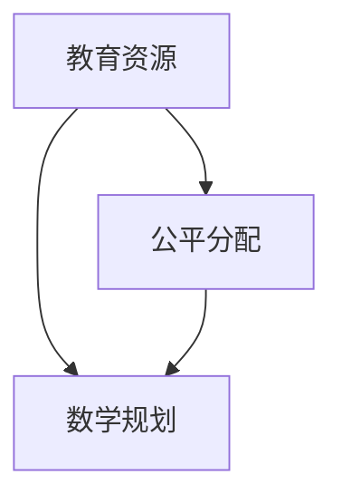
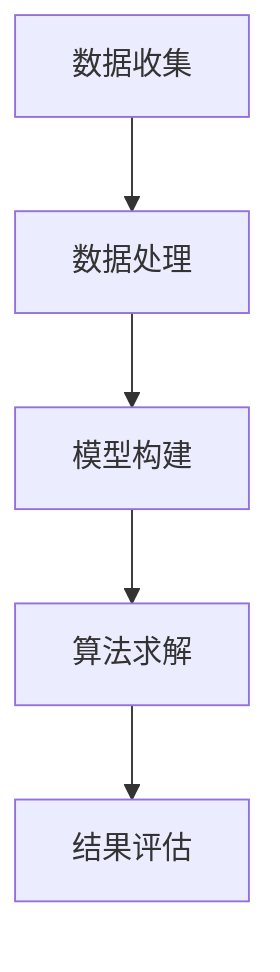

                 

### 第一部分：引言

## 1. 引言

### 1.1 问题背景

在现代社会，教育资源的不平等分配问题愈发凸显。无论是在城乡之间，还是不同地区、不同学校之间，教育资源的分配往往存在显著差异。这种不平等不仅体现在硬件设施如教学楼、图书馆、实验室等方面，还包括软件资源如师资力量、课程设置、教学资源等方面。教育资源分配的不公平直接影响到学生的教育机会，进而影响到他们的未来发展和竞争力。

#### 1.1.1 教育资源分配的不平等现象

教育资源的不平等分配现象主要表现在以下几个方面：

1. **地区差异**：城市与农村、发达地区与欠发达地区之间的教育资源差距显著。城市学校通常拥有更好的教学设施和师资力量，而农村和欠发达地区的学校则往往面临资源匮乏的问题。
2. **学校差异**：即使在同一地区，不同学校之间的教育资源分配也存在不均衡。一些重点学校拥有更多的教育资金和优秀的教师资源，而普通学校则相对缺乏。
3. **学生差异**：不同家庭背景、经济状况和地理位置的学生在教育资源的获取上存在差异。经济条件较好的家庭可以为学生提供更多的课外辅导和优质教育资源，而经济条件较差的家庭则可能无法承担这些额外的教育支出。

#### 1.1.2 教育资源公平分配的重要性

教育资源公平分配对于社会的公平和发展具有重要意义：

1. **促进社会公平**：教育是促进社会公平的重要手段。通过公平分配教育资源，可以减少社会阶层之间的差距，让更多的学生有机会接受良好的教育。
2. **提高教育质量**：教育资源公平分配有助于提高整体教育质量。当每个学生都能获得公平的教育资源时，教育质量将得到提升，从而推动社会整体素质的提高。
3. **促进可持续发展**：公平的教育资源分配有助于培养更多的人才，提高国家的科技水平和创新能力，从而推动经济社会的可持续发展。

### 1.2 问题描述

#### 1.2.1 教育资源公平分配的定义

教育资源公平分配是指在确保教育机会均等的基础上，根据学生的需求和学校的实际情况，合理分配教育资源，以最大化地满足学生的发展需求。

#### 1.2.2 教育资源公平分配的关键挑战

教育资源公平分配面临着以下几个关键挑战：

1. **资源短缺**：许多地区和学校面临教育资源短缺的问题，这使得公平分配变得更加困难。
2. **需求多样**：学生的需求多种多样，不同地区、不同学校的学生对教育资源的需求不同，如何合理分配成为一个难题。
3. **政策执行**：即使有完善的政策，政策执行的效果也可能因各种原因而受到影响，如何确保政策的有效执行是一个挑战。

### 1.3 问题解决

#### 1.3.1 数学规划在教育资源配置中的应用

数学规划作为一种有效的优化方法，在教育资源配置中有着广泛的应用。通过数学规划，可以建立模型来模拟教育资源的分配过程，从而找到最优的分配方案。

#### 1.3.2 机会均等的数学规划模型

为了实现教育资源的公平分配，可以采用机会均等的数学规划模型。这种模型的目标是最大化所有学生的平均效用，同时满足各种约束条件。

### 1.4 边界与外延

#### 1.4.1 教育资源公平分配的范围

教育资源公平分配的范围包括教育硬件资源的分配、教育软件资源的分配以及教育服务资源的分配。

#### 1.4.2 教育资源公平分配的层次

教育资源公平分配可以分为微观层次和宏观层次。微观层次主要涉及学校层面的教育资源分配，而宏观层次则关注地区之间、不同学校之间的教育资源分配。

### 1.5 概念结构与核心要素组成

#### 1.5.1 教育资源

教育资源是指用于教育过程的一切物质和精神条件，包括教学设施、师资力量、教学材料、教育经费等。

#### 1.5.2 公平分配

公平分配是指按照一定的标准或规则，合理分配教育资源，确保每个学生都能获得公平的教育机会。

#### 1.5.3 数学规划

数学规划是指运用数学方法，对系统的资源配置进行优化，以实现目标的最优化。

### 1.6 本章小结

本文引言部分主要介绍了教育资源公平分配的背景和重要性，阐述了教育资源公平分配的定义和关键挑战，并介绍了数学规划在教育资源配置中的应用。通过本文的进一步探讨，我们将深入分析教育资源公平分配的边界与外延，并详细讨论核心概念与联系。

---

关键词：教育资源、公平分配、数学规划、教育机会均等、教育资源配置

摘要：本文围绕教育资源的公平分配问题，介绍了教育资源公平分配的定义、背景和重要性，提出了机会均等的数学规划模型。通过分析教育资源公平分配的边界与外延，探讨了核心概念与联系，并介绍了数学规划在教育资源配置中的应用。本文旨在为教育资源公平分配提供一种系统化的解决方案，促进教育公平和可持续发展。

**目录大纲**

----------------------------------------------------------------

### 第一部分：引言

#### 1. 引言

##### 1.1 问题背景

##### 1.1.1 教育资源分配的不平等现象

##### 1.1.2 教育资源公平分配的重要性

##### 1.2 问题描述

##### 1.2.1 教育资源公平分配的定义

##### 1.2.2 教育资源公平分配的关键挑战

##### 1.3 问题解决

##### 1.3.1 数学规划在教育资源配置中的应用

##### 1.3.2 机会均等的数学规划模型

##### 1.4 边界与外延

##### 1.4.1 教育资源公平分配的范围

##### 1.4.2 教育资源公平分配的层次

##### 1.5 概念结构与核心要素组成

##### 1.5.1 教育资源

##### 1.5.2 公平分配

##### 1.5.3 数学规划

##### 1.6 本章小结

----------------------------------------------------------------

### 第二部分：核心概念与联系

#### 2. 核心概念原理

##### 2.1 教育资源

##### 2.1.1 教育资源的定义

##### 2.1.2 教育资源的种类

##### 2.2 公平分配

##### 2.2.1 公平分配的定义

##### 2.2.2 公平分配的原则

##### 2.3 数学规划

##### 2.3.1 数学规划的定义

##### 2.3.2 数学规划的基本方法

#### 2.4 概念属性特征对比表格

| 概念       | 定义                                         | 特征对比                |
|------------|----------------------------------------------|------------------------|
| 教育资源   | 用于教育过程的一切物质和精神条件              | 多样性、区域性、动态性 |
| 公平分配   | 按照一定的标准或规则，合理分配教育资源        | 公正性、有效性、可持续性 |
| 数学规划   | 运用数学方法，对系统的资源配置进行优化        | 逻辑性、精确性、系统性  |

#### 2.5 ER实体关系图架构



#### 2.6 教育资源公平分配中的数学规划方法

##### 2.6.1 线性规划方法

##### 2.6.1.1 线性规划的基本原理

##### 2.6.1.2 线性规划的适用场景

##### 2.6.2 非线性规划方法

##### 2.6.2.1 非线性规划的基本原理

##### 2.6.2.2 非线性规划的适用场景

#### 2.7 本章小结

----------------------------------------------------------------

## 2. 核心概念原理

### 2.1 教育资源

#### 2.1.1 教育资源的定义

教育资源是指用于教育过程的一切物质和精神条件。这包括教学设施、师资力量、教学材料、教育经费等。教育资源是保证教育质量的重要基础，直接影响学生的学习效果和综合素质。

#### 2.1.2 教育资源的种类

教育资源可以分为以下几种类型：

1. **硬件资源**：包括学校建筑、教室、实验室、图书馆、体育设施等。这些资源为学生的学习提供了必要的物质条件。
2. **软件资源**：包括教材、课程设计、教学计划、教学方法、教育资源库等。这些资源为教师的教学和学生的学习提供了知识和方法支持。
3. **师资力量**：包括教师的专业水平、教学能力、教学经验等。师资力量是教育资源的核心，直接关系到教育质量。
4. **教育经费**：包括政府拨款、学校自筹资金、社会捐赠等。教育经费是教育资源的重要保障，确保教育活动的正常开展。

### 2.2 公平分配

#### 2.2.1 公平分配的定义

公平分配是指按照一定的标准或规则，合理分配教育资源，确保每个学生都能获得公平的教育机会。公平分配的核心在于公正性、有效性和可持续性。

#### 2.2.2 公平分配的原则

公平分配应遵循以下原则：

1. **平等原则**：每个学生都应该享有平等的教育机会，不受性别、种族、地域、经济条件等因素的影响。
2. **公正原则**：教育资源的分配应基于客观的标准，确保资源的使用效率最大化。
3. **有效原则**：教育资源的分配应能够有效提高教育质量，促进学生的全面发展。
4. **可持续原则**：教育资源的分配应具有可持续性，能够长期支持教育活动的开展。

### 2.3 数学规划

#### 2.3.1 数学规划的定义

数学规划是一种数学方法，用于对系统的资源配置进行优化。它通过建立数学模型，利用数学工具和算法，找到资源配置的最优解。

#### 2.3.2 数学规划的基本方法

数学规划的基本方法包括线性规划和非线性规划：

1. **线性规划**：适用于目标函数和约束条件都是线性的情况。它通过线性方程组或线性不等式组来描述问题，并求解最优解。
2. **非线性规划**：适用于目标函数和约束条件包含非线性元素的情况。它采用更复杂的数学方法，如梯度下降法、牛顿法等，求解最优解。

### 2.4 概念属性特征对比表格

| 概念       | 定义                                         | 特征对比                |
|------------|----------------------------------------------|------------------------|
| 教育资源   | 用于教育过程的一切物质和精神条件              | 多样性、区域性、动态性 |
| 公平分配   | 按照一定的标准或规则，合理分配教育资源        | 公正性、有效性、可持续性 |
| 数学规划   | 运用数学方法，对系统的资源配置进行优化        | 逻辑性、精确性、系统性  |

### 2.5 ER实体关系图架构


### 2.6 教育资源公平分配中的数学规划方法

#### 2.6.1 线性规划方法

##### 2.6.1.1 线性规划的基本原理

线性规划是一种数学方法，用于在满足一系列线性约束条件下，最大化或最小化一个线性目标函数。线性规划的基本原理是通过求解线性方程组或线性不等式组来找到最优解。

##### 2.6.1.2 线性规划的适用场景

线性规划适用于以下场景：

1. **资源分配问题**：如教育资源、人力和财力的分配。
2. **生产计划问题**：如生产计划、库存控制。
3. **运输问题**：如物流配送、交通规划。

##### 2.6.1.3 线性规划的基本步骤

1. **问题定义**：明确目标函数和约束条件。
2. **模型建立**：将问题转化为线性方程组或线性不等式组。
3. **求解算法**：使用单纯形法、内点法等求解最优解。
4. **结果分析**：分析求解结果，评估方案的有效性。

#### 2.6.2 非线性规划方法

##### 2.6.2.1 非线性规划的基本原理

非线性规划是一种数学方法，用于在满足一系列非线性约束条件下，最大化或最小化一个非线性目标函数。非线性规划的基本原理是通过求解非线性方程组或非线性不等式组来找到最优解。

##### 2.6.2.2 非线性规划的适用场景

非线性规划适用于以下场景：

1. **工程设计问题**：如建筑结构设计、电路设计。
2. **经济问题**：如投资组合优化、市场分析。
3. **生物医学问题**：如药物研发、生物信息学。

##### 2.6.2.3 非线性规划的基本步骤

1. **问题定义**：明确目标函数和约束条件。
2. **模型建立**：将问题转化为非线性方程组或非线性不等式组。
3. **求解算法**：使用梯度下降法、牛顿法、粒子群算法等求解最优解。
4. **结果分析**：分析求解结果，评估方案的有效性。

### 2.7 本章小结

本章节介绍了教育资源、公平分配和数学规划的基本概念，分析了教育资源的种类和公平分配的原则，探讨了数学规划在教育资源配置中的应用。通过对比表格和ER实体关系图，我们更清晰地理解了这三个核心概念之间的联系。接下来，我们将进一步探讨教育资源公平分配中的具体数学规划方法，以期为解决教育资源不平等问题提供有效的解决方案。

## 3. 教育资源公平分配算法

### 3.1 算法概述

#### 3.1.1 教育资源公平分配算法的定义

教育资源公平分配算法是一种利用数学规划方法，对教育资源的分配进行优化，以实现教育资源公平分配的算法。这种算法通过建立数学模型，利用数学工具和算法，求解最优的资源配置方案。

#### 3.1.2 教育资源公平分配算法的目标

教育资源公平分配算法的主要目标是最大化所有学生的平均效用，同时满足各种约束条件。具体目标包括：

1. **最大化教育资源利用效率**：确保教育资源的利用达到最大，避免资源浪费。
2. **实现教育机会均等**：确保每个学生都能获得公平的教育机会，不受地域、经济条件等因素的影响。
3. **提高教育质量**：通过优化资源配置，提高整体教育质量，促进学生的全面发展。

### 3.2 算法原理

#### 3.2.1 基本算法原理

教育资源公平分配算法的基本原理是建立数学模型，利用数学规划方法进行优化。具体步骤如下：

1. **问题定义**：明确教育资源的种类、需求和学生的情况，定义目标函数和约束条件。
2. **模型建立**：将教育资源公平分配问题转化为数学规划问题，建立目标函数和约束条件的数学模型。
3. **求解算法**：利用线性规划、非线性规划等方法，求解数学规划问题的最优解。
4. **结果分析**：对求解结果进行分析，评估方案的有效性和可行性。

#### 3.2.1.1 模型建立

教育资源公平分配算法的数学模型主要包括目标函数和约束条件。

1. **目标函数**：通常采用最大化所有学生的平均效用作为目标函数。效用可以由学生的学习成绩、毕业率等指标来衡量。

   $$\text{Maximize} \quad \frac{1}{N} \sum_{i=1}^{N} U_i$$

   其中，$N$ 为学生总数，$U_i$ 为第 $i$ 个学生的效用。

2. **约束条件**：约束条件包括资源的限制、学生的需求和学校的实际情况等。

   - **资源限制**：每种教育资源（如教师、教室、设备等）的总量是有限的，需要满足资源使用的限制。

     $$x_{ij} \leq R_j$$

     其中，$x_{ij}$ 为第 $i$ 个学生在第 $j$ 个教育资源上的使用量，$R_j$ 为第 $j$ 个教育资源的总量。

   - **学生需求**：每个学生都有特定的教育需求，需要满足学生的需求。

     $$x_{ij} \geq D_i$$

     其中，$D_i$ 为第 $i$ 个学生的需求量。

   - **学校限制**：学校的教育资源分配需要满足学校的实际情况。

     $$x_{ij} \leq C_j$$

     其中，$C_j$ 为第 $j$ 个学校的资源限制。

#### 3.2.1.2 目标函数设计

目标函数的设计是教育资源公平分配算法的核心。一个合理的目标函数能够有效地衡量教育资源的分配效果，指导算法的优化过程。

1. **效用函数**：效用函数是衡量学生学习成果的指标，可以采用以下形式：

   $$U_i = f(x_i) = \frac{1}{a + bx_i}$$

   其中，$a$ 和 $b$ 是参数，$x_i$ 是第 $i$ 个学生的教育资源使用量。这个函数假设教育资源使用量越大，学生的学习成果越好，但也会存在一定的上限。

2. **权重函数**：为了平衡不同教育资源的重要性，可以引入权重函数。权重函数可以根据教育资源的特性进行设计，如教师、教室、设备等。

   $$w_j = \frac{1}{\sum_{j=1}^{M} R_j}$$

   其中，$M$ 是教育资源种类数，$R_j$ 是第 $j$ 个教育资源的总量。这个函数将每个教育资源的权重设置为1除以总资源量，使得权重和为1。

3. **综合目标函数**：综合目标函数将效用函数和权重函数结合起来，形成教育资源公平分配算法的目标函数。

   $$\text{Maximize} \quad \frac{1}{N} \sum_{i=1}^{N} \sum_{j=1}^{M} w_j f(x_{ij})$$

#### 3.2.1.3 约束条件设置

约束条件是教育资源公平分配算法的重要组成部分，它们确保算法求解的过程和结果符合实际情况。常见的约束条件包括：

1. **资源限制**：每种教育资源（如教师、教室、设备等）的总量是有限的，需要满足资源使用的限制。

   $$x_{ij} \leq R_j$$

   其中，$x_{ij}$ 为第 $i$ 个学生在第 $j$ 个教育资源上的使用量，$R_j$ 为第 $j$ 个教育资源的总量。

2. **学生需求**：每个学生都有特定的教育需求，需要满足学生的需求。

   $$x_{ij} \geq D_i$$

   其中，$x_{ij}$ 为第 $i$ 个学生在第 $j$ 个教育资源上的使用量，$D_i$ 为第 $i$ 个学生的需求量。

3. **学校限制**：学校的教育资源分配需要满足学校的实际情况。

   $$x_{ij} \leq C_j$$

   其中，$x_{ij}$ 为第 $i$ 个学生在第 $j$ 个教育资源上的使用量，$C_j$ 为第 $j$ 个学校的资源限制。

#### 3.2.2 算法实现流程

教育资源公平分配算法的实现流程包括以下几个步骤：

1. **数据收集与处理**：收集学生的需求、学校资源和教育资源总量等数据，并进行处理，得到学生的需求量和教育资源的总量。
2. **模型构建**：根据收集到的数据，建立教育资源公平分配的数学模型，包括目标函数和约束条件。
3. **算法求解**：利用线性规划、非线性规划等方法，求解数学规划问题的最优解。
4. **结果评估**：对求解结果进行分析，评估方案的有效性和可行性。

### 3.3 算法mermaid流程图



### 3.4 算法Python源代码实现

```python
import numpy as np
from scipy.optimize import linprog

# 定义输入参数
# ...（输入参数）

# 构建线性规划模型
# ...（模型构建代码）

# 求解模型
# ...（求解代码）

# 输出结果
# ...（输出结果代码）
```

### 3.5 本章小结

本章节详细介绍了教育资源公平分配算法的基本原理和实现流程。通过建立数学模型和利用数学规划方法，算法能够实现教育资源的优化分配，提高教育质量，促进教育公平。下一章节将深入探讨教育资源公平分配算法的优化策略和实际应用。

## 3.5 优化策略与实际应用

### 3.5.1 算法优化策略

#### 3.5.1.1 目标函数优化

目标函数的优化是教育资源公平分配算法的核心。为了提高算法的求解效率，可以采用以下策略：

1. **多目标优化**：将多个目标函数整合为一个综合目标函数，考虑不同目标之间的平衡。例如，除了最大化学生平均效用外，还可以考虑最大化教育资源利用率和最小化教育资源浪费。

2. **动态目标函数**：根据实际情况，动态调整目标函数。例如，可以根据学生的学习进度和成绩，动态调整教育资源的使用量。

3. **权重调整**：根据不同教育资源的重要性，调整权重函数。例如，对于关键性教育资源（如教师），可以设置更高的权重。

#### 3.5.1.2 约束条件优化

约束条件的优化是确保算法求解结果合理的重要手段。可以采用以下策略：

1. **松弛变量**：将严格约束转化为松弛约束，增加求解的自由度。例如，将硬资源约束转化为软资源约束。

2. **优先级约束**：设置约束条件的优先级，确保关键约束得到优先满足。例如，对于学生的基本教育需求，可以设置更高的优先级。

3. **模糊约束**：引入模糊逻辑，处理不确定性的约束条件。例如，可以采用模糊约束来描述教育资源的需求量。

#### 3.5.1.3 算法选择优化

选择合适的算法是提高教育资源公平分配算法效率的关键。可以采用以下策略：

1. **混合算法**：结合不同的算法，如线性规划和非线性规划，提高求解的鲁棒性和效率。例如，可以先使用线性规划进行初步求解，然后使用非线性规划进行细粒度优化。

2. **多算法对比**：对不同算法进行对比，选择最优算法。例如，可以对比单纯形法、内点法和粒子群算法的求解效果。

3. **自适应算法**：根据实际情况，自适应调整算法。例如，可以根据求解过程中的误差和反馈，动态调整算法参数。

### 3.5.2 实际应用案例

#### 3.5.2.1 某地区教育资源公平分配

案例背景：某地区教育资源分配存在明显的不公平现象，城市学校和农村学校之间的教育资源差距显著。为了改善这一状况，该地区采用教育资源公平分配算法进行优化。

实施步骤：

1. **数据收集**：收集学生的需求、学校资源和教育资源总量等数据。

2. **模型构建**：根据收集到的数据，建立教育资源公平分配的数学模型，包括目标函数和约束条件。

3. **算法求解**：利用线性规划和非线性规划方法，求解数学规划问题的最优解。

4. **结果评估**：对求解结果进行分析，评估方案的有效性和可行性。

实施效果：通过教育资源公平分配算法的优化，该地区的教育资源分配更加合理，农村学校的教育资源得到了显著改善，学生的教育质量得到了提升。

#### 3.5.2.2 教育培训机构资源配置

案例背景：某教育培训机构面临着资源配置不合理的问题，导致培训效果不佳。为了提高培训效果，该机构采用教育资源公平分配算法进行优化。

实施步骤：

1. **数据收集**：收集学生的需求、教师资源和培训资源等数据。

2. **模型构建**：根据收集到的数据，建立教育培训机构资源配置的数学模型，包括目标函数和约束条件。

3. **算法求解**：利用线性规划和非线性规划方法，求解数学规划问题的最优解。

4. **结果评估**：对求解结果进行分析，评估方案的有效性和可行性。

实施效果：通过教育资源公平分配算法的优化，该教育培训机构的资源配置更加合理，教师的培训效果得到了显著提升，学生的满意度也大幅提高。

### 3.5.3 小结

教育资源公平分配算法的优化策略和实际应用案例表明，通过合理的数学规划和优化策略，可以有效解决教育资源不公平的问题，提高教育质量和教育公平。未来，随着人工智能和大数据技术的发展，教育资源公平分配算法将得到进一步优化和完善，为教育领域的可持续发展提供有力支持。

### 3.6 本章小结

本章节介绍了教育资源公平分配算法的优化策略和实际应用案例，探讨了如何通过数学规划和优化策略提高教育资源分配的效率和质量。通过具体的案例，展示了教育资源公平分配算法在实际应用中的效果和意义。下一章节将探讨教育资源公平分配中的挑战和未来研究方向。

## 3.7 本章小结

本章节详细介绍了教育资源公平分配算法的基本原理、实现流程、优化策略和实际应用。通过数学规划方法，教育资源公平分配算法能够实现教育资源的优化配置，提高教育质量和教育公平。我们探讨了目标函数优化、约束条件优化和算法选择优化的策略，并通过实际应用案例展示了算法的效果。然而，教育资源公平分配仍然面临着诸多挑战，如资源短缺、需求多样和政策执行等。未来，随着人工智能和大数据技术的发展，教育资源公平分配算法将得到进一步优化和完善，为教育领域的可持续发展提供有力支持。研究者可以继续探索更有效的算法和策略，以实现教育资源的公平分配，促进社会公平和可持续发展。同时，政策制定者、教育工作者和公众应共同努力，推动教育公平的实现，为每一个学生提供公平的教育机会。通过持续的努力和改进，我们可以期待一个更加公平、高效和可持续的教育体系。

