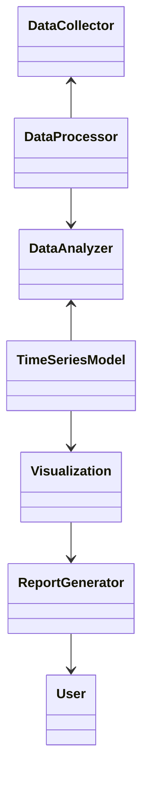
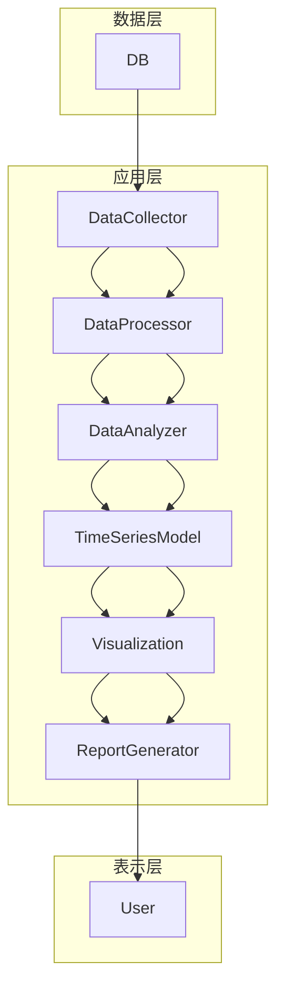
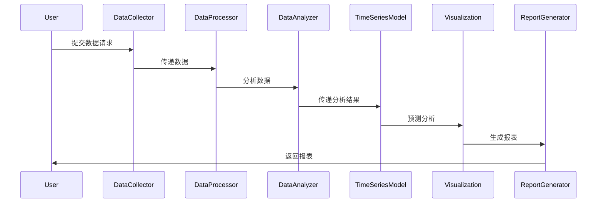
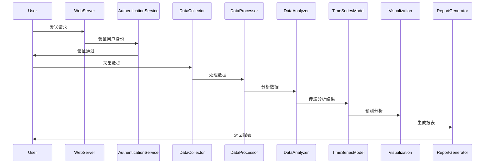

                 


### 摘要

本博客文章旨在探讨数学与计量经济学在处理经济数据中的应用。文章首先介绍数学和计量经济学的基本概念和原理，然后通过具体章节详细讲解数学基础、线性代数、概率论与统计学、时间序列分析等在计量经济学中的实际应用。文章结构紧凑，逻辑清晰，旨在帮助读者理解数学和计量经济学在分析经济数据中的重要性，以及如何运用这些工具进行有效的经济数据分析。本文关键词包括数学、计量经济学、经济数据、数据分析、线性代数、概率论、时间序列。

---

### 引言

数学与计量经济学是现代经济学研究中不可或缺的两个工具。数学以其严密的逻辑和抽象的思维方式，为经济学提供了一种精确的分析方法。而计量经济学则借助数学模型和统计方法，对经济现象进行定量分析，为政策制定者和研究者提供科学依据。

在经济学领域，数学的应用广泛而深远。它不仅用于构建经济模型，预测市场走势，分析资源配置，还能帮助经济学家理解和解释经济现象。计量经济学则通过统计数据和数学模型，对经济数据进行定量分析，为经济政策评估提供有力支持。

本文将分为三个主要部分展开讨论：

1. **数学基础**：介绍数学在经济学分析中的应用，包括微积分、线性代数等基本概念。
2. **计量经济学基础**：探讨计量经济学的基本原理和常用模型，如线性回归模型、多元线性回归模型等。
3. **数学与计量经济学的应用**：详细讲解时间序列分析、假设检验、参数估计等在经济学中的应用。

通过本文的阅读，读者将能够理解数学和计量经济学在处理经济数据中的重要性，掌握基本的分析方法和技巧，并能够将这些知识应用于实际的经济分析工作中。

---

### 数学基础

在经济学分析中，数学基础是不可或缺的一部分。数学的严密性和抽象性使得经济学研究能够更加精确和系统。本节将介绍微积分和线性代数这两个在经济学中广泛使用的数学工具。

#### 微积分基础

微积分是经济学中最基本的数学工具之一，它用于研究函数的变化率和累积量。在经济学中，微积分主要用于求解最优化问题、分析边际效应等。

##### 极限与导数

**极限**是微积分的基础概念。它描述了当自变量趋近于某一值时，函数值如何变化。极限的概念可以帮助我们理解经济变量在某一时刻的瞬时变化率。

$$\lim_{{x \to a}} f(x) = L$$

**导数**则是极限的应用，用于描述函数在某一点的瞬时变化率。在经济学中，导数常用于分析边际效应，例如边际成本、边际效用等。

$$f'(x) = \lim_{{h \to 0}} \frac{{f(x+h) - f(x)}}{h}$$

##### 积分

**积分**是导数的反函数，它用于求解累积量。在经济学中，积分常用于计算总量，例如总收入、总成本等。

$$\int_{a}^{b} f(x) dx$$

#### 线性代数基础

线性代数是研究向量空间和线性变换的数学分支，它在经济学分析中具有重要作用，特别是在处理经济系统的结构和动态行为时。

##### 矩阵与行列式

**矩阵**是线性代数中最基本的概念之一。它由一组有序数列组成，可以表示线性方程组和线性变换。

$$A = \begin{bmatrix} a_{11} & a_{12} \\ a_{21} & a_{22} \end{bmatrix}$$

**行列式**是矩阵的一个数值特性，它可以帮助我们判断矩阵的秩和可逆性。

$$\det(A) = a_{11}a_{22} - a_{12}a_{21}$$

##### 向量空间与线性变换

**向量空间**是线性代数中的一个基本概念，它由一组向量构成，这些向量可以按照线性组合的方式进行操作。

$$V = \text{span}\{v_1, v_2, \ldots, v_n\}$$

**线性变换**是向量空间上的一个函数，它将一个向量映射到另一个向量。线性变换在经济学中用于描述经济系统的结构和动态行为。

$$T: V \rightarrow W$$

通过以上数学基础的学习，读者可以更好地理解和应用数学工具来分析经济数据。接下来的章节将进一步探讨计量经济学的基本原理和应用。

---

### 计量经济学基础

计量经济学是经济学的一个分支，它运用统计学和数学方法对经济现象进行定量分析。计量经济学的基础知识对于理解经济数据及其背后的经济规律至关重要。在本节中，我们将探讨经济数据的类型、经典计量经济学模型以及这些模型的基本原理。

#### 经济数据类型

经济数据可以大致分为以下几类：

1. **时间序列数据**：这类数据是按时间顺序收集的数值数据，用于分析经济变量随时间的变化趋势。例如，股票价格、通货膨胀率、GDP增长率等。

2. **横截面数据**：这类数据是同一时间点不同个体或地区的数值数据。例如，不同国家的GDP、不同地区的失业率等。

3. **面板数据**：这类数据结合了时间序列数据和横截面数据，同时包含多个时间点和多个个体或地区的数值数据。例如，多个国家在不同时间点的GDP数据。

#### 经典计量经济学模型

计量经济学中常用的经典模型包括线性回归模型和多元线性回归模型。这些模型的基本原理和估计方法如下：

##### 线性回归模型

**线性回归模型**用于分析自变量（解释变量）和因变量（响应变量）之间的线性关系。其一般形式为：

$$y = \beta_0 + \beta_1x_1 + \beta_2x_2 + \ldots + \beta_nx_n + \varepsilon$$

其中，\(y\)是因变量，\(x_1, x_2, \ldots, x_n\)是自变量，\(\beta_0, \beta_1, \beta_2, \ldots, \beta_n\)是模型参数，\(\varepsilon\)是随机误差项。

**估计方法**：线性回归模型的参数通常通过最小二乘法（OLS）估计得到。最小二乘法的核心思想是选择模型参数，使得实际观测值与模型预测值之间的误差平方和最小。

##### 多元线性回归模型

**多元线性回归模型**是在一元线性回归模型的基础上扩展而来的，用于分析多个自变量对因变量的影响。其一般形式为：

$$y = \beta_0 + \beta_1x_1 + \beta_2x_2 + \ldots + \beta_nx_n + \varepsilon$$

与一元线性回归模型类似，多元线性回归模型也采用最小二乘法进行参数估计。

#### 模型选择与假设检验

在进行计量经济学分析时，模型选择和假设检验是非常重要的步骤。模型选择主要涉及确定自变量和因变量之间的关系形式，而假设检验则用于验证模型假设的合理性。

1. **模型选择**：常用的模型选择方法包括：
   - **信息准则**：如Akaike信息准则（AIC）和贝叶斯信息准则（BIC）。
   - **逐步回归法**：通过逐步添加或删除自变量，选择最佳模型。

2. **假设检验**：常见的假设检验方法包括：
   - **t检验**：用于检验单个参数是否显著不为零。
   - **F检验**：用于检验整体模型的显著性和参数估计的一致性。

通过以上对计量经济学基础知识的介绍，读者可以初步了解如何运用计量经济学工具对经济数据进行定量分析。在接下来的章节中，我们将进一步探讨线性代数和概率论等数学工具在计量经济学中的应用。

---

### 数学基础

在深入探讨计量经济学之前，我们需要打下坚实的数学基础。这一部分将详细介绍微积分和线性代数，这两个在经济学分析中至关重要的数学工具。

#### 微积分基础

微积分是经济学中最基本的数学工具之一，它用于研究函数的变化率和累积量。在经济学中，微积分主要用于求解最优化问题、分析边际效应等。

##### 极限与导数

**极限**是微积分的基础概念。它描述了当自变量趋近于某一值时，函数值如何变化。极限的概念可以帮助我们理解经济变量在某一时刻的瞬时变化率。

$$\lim_{{x \to a}} f(x) = L$$

在经济学中，极限常用于分析市场的需求曲线。例如，当价格趋近于某一特定值时，需求量如何变化。

**导数**则是极限的应用，用于描述函数在某一点的瞬时变化率。在经济学中，导数常用于分析边际效应，例如边际成本、边际效用等。

$$f'(x) = \lim_{{h \to 0}} \frac{{f(x+h) - f(x)}}{h}$$

在经济学中，导数可以用于计算需求函数的弹性，从而分析需求对价格变化的敏感度。

##### 积分

**积分**是导数的反函数，它用于求解累积量。在经济学中，积分常用于计算总量，例如总收入、总成本等。

$$\int_{a}^{b} f(x) dx$$

在经济学中，积分可以用于计算总成本或总收入。例如，通过积分可以计算一个生产过程中的累计成本。

#### 线性代数基础

线性代数是研究向量空间和线性变换的数学分支，它在经济学分析中具有重要作用，特别是在处理经济系统的结构和动态行为时。

##### 矩阵与行列式

**矩阵**是线性代数中最基本的概念之一。它由一组有序数列组成，可以表示线性方程组和线性变换。

$$A = \begin{bmatrix} a_{11} & a_{12} \\ a_{21} & a_{22} \end{bmatrix}$$

在经济学中，矩阵可以用于表示经济系统的多方程模型，例如投入产出模型。

**行列式**是矩阵的一个数值特性，它可以帮助我们判断矩阵的秩和可逆性。

$$\det(A) = a_{11}a_{22} - a_{12}a_{21}$$

行列式在经济学中可以用于判断经济系统的稳定性。例如，通过计算投入产出模型的行列式，可以判断一个经济系统是否处于稳定状态。

##### 向量空间与线性变换

**向量空间**是线性代数中的一个基本概念，它由一组向量构成，这些向量可以按照线性组合的方式进行操作。

$$V = \text{span}\{v_1, v_2, \ldots, v_n\}$$

在经济学中，向量空间可以用于描述经济系统的状态和变化。例如，可以通过向量空间来描述一个经济系统的多种可能状态。

**线性变换**是向量空间上的一个函数，它将一个向量映射到另一个向量。线性变换在经济学中用于描述经济系统的结构和动态行为。

$$T: V \rightarrow W$$

通过以上数学基础的学习，读者可以更好地理解和应用数学工具来分析经济数据。接下来，我们将进一步探讨计量经济学的基本原理和应用。

---

### 概率论与统计学基础

在计量经济学中，概率论与统计学是不可或缺的工具。它们帮助我们理解和分析经济数据，从数据中提取有价值的信息。本节将介绍概率论与统计学的基本概念，包括随机变量、参数估计和假设检验。

#### 概率论基础

概率论是研究随机事件和随机变量的数学分支。它为我们的经济数据分析提供了理论基础。

##### 随机事件与概率

**随机事件**是指在一定条件下可能发生也可能不发生的事件。例如，股票价格下跌是一个随机事件。

**概率**是描述随机事件发生可能性大小的度量。概率值介于0和1之间，其中0表示不可能发生，1表示必然发生。

$$P(A) = \text{概率}(A \text{发生})$$

##### 条件概率与独立性

**条件概率**是给定某个事件已经发生时，另一个事件发生的概率。条件概率公式如下：

$$P(B|A) = \frac{P(A \cap B)}{P(A)}$$

**独立性**是指两个随机事件的发生互不影响。两个事件A和B独立的条件是：

$$P(A \cap B) = P(A)P(B)$$

##### 随机变量

随机变量是描述随机事件结果的变量，它可以是离散的也可以是连续的。离散随机变量取有限的或无限个值，而连续随机变量取某个区间内的所有值。

**概率分布函数**描述了随机变量取值的概率分布。对于离散随机变量，概率分布函数是概率质量函数；对于连续随机变量，概率分布函数是概率密度函数。

$$F_X(x) = P(X \leq x)$$

#### 统计学基础

统计学是应用概率论原理来分析数据的一门科学。在计量经济学中，统计学用于估计模型参数、检验假设和进行预测。

##### 数据收集与描述

**数据收集**是指通过调查、实验等方式获取经济数据。数据收集的质量直接影响后续分析的准确性。

**描述性统计**用于描述数据的中心趋势、离散程度和分布形态。常用的描述性统计量包括均值、中位数、标准差等。

$$\mu = \bar{x} = \frac{1}{n}\sum_{i=1}^{n} x_i$$

$$\sigma = s = \sqrt{\frac{1}{n-1}\sum_{i=1}^{n} (x_i - \bar{x})^2}$$

##### 参数估计

**参数估计**是通过样本数据估计总体参数的方法。参数估计分为点估计和区间估计。

**点估计**是用一个具体的数值作为总体参数的估计值。例如，用样本均值估计总体均值。

$$\hat{\mu} = \bar{x}$$

**区间估计**是通过确定一个区间来估计总体参数的可能范围。例如，用置信区间估计总体均值。

$$\bar{x} \pm z_{\alpha/2} \cdot \frac{\sigma}{\sqrt{n}}$$

##### 假设检验

**假设检验**是用于验证数据是否符合某个假设的方法。常见的假设检验方法包括t检验、F检验等。

**原假设**（\(H_0\)）和**备择假设**（\(H_1\)）是对数据分布或参数的两种对立假设。通过样本数据，我们判断接受原假设还是拒绝原假设。

$$t = \frac{\hat{\mu} - \mu_0}{s/\sqrt{n}}$$

通过以上概率论与统计学基础的学习，读者可以更好地理解经济数据，并运用这些工具进行有效的数据分析。接下来，我们将探讨计量经济学的实际应用。

---

### 线性代数在经济分析中的应用

线性代数是经济学分析中一个非常重要的数学工具，它能够帮助我们理解和处理复杂的经济系统。在本节中，我们将深入探讨线性代数在经济分析中的应用，包括矩阵与行列式、线性方程组、特征值与特征向量以及线性变换和线性空间。

#### 矩阵与行列式

矩阵是线性代数中最基本的概念之一，它由一组有序的数构成，通常表示为行和列的排列。在经济学中，矩阵常用于描述经济系统的多方程模型，如投入产出模型。

**矩阵的基本性质**：

- 矩阵的行数称为**行数**，列数称为**列数**。
- 矩阵的元素可以通过行和列的索引来访问。

$$A = \begin{bmatrix} a_{11} & a_{12} & \ldots & a_{1n} \\ a_{21} & a_{22} & \ldots & a_{2n} \\ \vdots & \vdots & \ddots & \vdots \\ a_{m1} & a_{m2} & \ldots & a_{mn} \end{bmatrix}$$

**行列式的计算与应用**：

行列式是矩阵的一个数值特性，它可以帮助我们判断矩阵的秩和可逆性。行列式的计算方法包括拉普拉斯展开和按行（列）展开。

$$\det(A) = a_{11}A_{11} - a_{12}A_{12}$$

在经济学中，行列式常用于判断经济系统的平衡状态。例如，在投入产出分析中，通过计算生产矩阵的行列式，可以判断一个经济系统是否处于平衡状态。

#### 线性方程组

线性方程组是经济学中常见的问题，它由一组线性方程组成，通常表示为矩阵形式。

**线性方程组的一般形式**：

$$Ax = b$$

其中，\(A\)是系数矩阵，\(x\)是变量向量，\(b\)是常数向量。

**高斯消元法**：

高斯消元法是一种常用的求解线性方程组的方法，它通过逐步消元，将方程组转化为上三角形式或下三角形式，从而求得方程的解。

$$A = \begin{bmatrix} 1 & 2 & 3 \\ 4 & 5 & 6 \\ 7 & 8 & 9 \end{bmatrix} \rightarrow \begin{bmatrix} 1 & 2 & 3 \\ 0 & 1 & 2 \\ 0 & 0 & 1 \end{bmatrix}$$

在经济学中，线性方程组可以用于求解经济系统中的平衡点，例如在均衡预算约束中，通过解线性方程组，可以求得各个经济变量的均衡值。

#### 特征值与特征向量

特征值和特征向量是矩阵的重要性质，它们描述了矩阵的线性变换行为。

**特征值与特征向量的概念**：

- **特征值**（\(\lambda\)）是矩阵\(A\)的一个值，使得\(A\)与一个非零向量\(v\)的乘积等于\(\lambda\)与\(v\)的乘积。

$$Av = \lambda v$$

- **特征向量**（\(v\)）是与特征值相对应的非零向量。

在经济学中，特征值和特征向量可以用于分析经济系统的稳定性和动态行为。例如，在宏观经济分析中，通过计算经济系统的特征值和特征向量，可以判断经济系统是否处于稳定状态。

**实对称矩阵的特征值**：

实对称矩阵的特征值都是实数，且每个特征值都有对应的正交特征向量。

#### 线性变换与线性空间

线性变换是线性空间上的一个重要概念，它描述了一个向量空间到另一个向量空间的映射。

**线性变换的基本概念**：

- **线性变换**（\(T\)）是一个将一个向量空间中的向量映射到另一个向量空间的函数。
- **线性变换的性质**包括：

  - **齐次性**：\(T(ax + by) = aT(x) + bT(y)\)
  - **加法性**：\(T(x + y) = T(x) + T(y)\)

在经济学中，线性变换可以用于描述经济系统的结构和动态行为。例如，在宏观经济分析中，通过线性变换，可以描述经济变量之间的相互关系和动态调整过程。

#### 线性空间

线性空间是线性代数中的另一个基本概念，它是由一组向量构成，并满足线性组合的集合。

**线性空间的基本性质**：

- **闭合性**：线性空间中的向量可以通过线性组合得到。
- **交换性**：线性空间中的向量加法和标量乘法满足交换律。

在经济学中，线性空间可以用于描述经济系统的状态和变化。例如，通过线性空间，可以描述一个经济系统的多种可能状态和它们的相互转换。

通过以上对线性代数在经济分析中的应用的探讨，读者可以更好地理解线性代数在经济学分析中的重要作用，并能够运用这些工具来解决实际的经济问题。在下一部分，我们将进一步探讨计量经济学中的经典模型和应用。

---

### 时间序列分析

时间序列分析是计量经济学中的一个重要分支，它专注于研究经济变量随时间变化的规律性。时间序列数据通常由一系列按时间顺序排列的数值组成，如股票价格、通货膨胀率、GDP增长率等。时间序列分析的主要目标是识别数据中的趋势、季节性和随机波动，从而为预测和决策提供依据。

#### 时间序列基础

**时间序列的构成**

时间序列通常由以下几个成分构成：

- **趋势成分（T）**：描述了时间序列的长期变化趋势。
- **季节成分（S）**：描述了时间序列的季节性变化，如年度或季节性的波动。
- **循环成分（C）**：描述了时间序列的中期波动，这些波动通常与经济周期相关。
- **随机成分（I）**：描述了时间序列中的随机波动，是不可预测的噪声。

**自相关与平稳性**

**自相关**是时间序列分析中的一个关键概念，它描述了时间序列的当前值与其过去值之间的相关性。自相关图可以帮助我们识别时间序列的趋势和季节性成分。

$$\rho(k) = \frac{{Cov(X_t, X_{t-k})}}{{\sigma_X^2}}$$

**平稳性**是指时间序列的统计特性（如均值、方差和自协方差函数）不随时间变化。平稳性是许多时间序列模型（如ARMA模型）的基础假设。

#### 经典时间序列模型

在时间序列分析中，经典的模型包括自回归模型（AR）、移动平均模型（MA）和自回归移动平均模型（ARMA）。这些模型通过不同的方式来描述和预测时间序列数据。

**自回归模型（AR）**

自回归模型（AR）假设当前值可以由其前\(p\)个值及其误差项来预测：

$$X_t = c + \sum_{i=1}^{p} \phi_i X_{t-i} + \varepsilon_t$$

其中，\(\phi_i\)是模型的参数，\(\varepsilon_t\)是误差项。

在经济学中，AR模型常用于预测短期经济波动，例如股市价格的短期走势。

**移动平均模型（MA）**

移动平均模型（MA）假设当前值是由其前\(q\)个误差项的加权平均来预测的：

$$X_t = c + \varepsilon_t + \sum_{i=1}^{q} \theta_i \varepsilon_{t-i}$$

其中，\(\theta_i\)是模型的参数。

MA模型适用于描述和预测那些具有明显随机波动特征的时间序列数据。

**自回归移动平均模型（ARMA）**

自回归移动平均模型（ARMA）结合了AR和MA模型的特点，可以同时捕捉时间序列的短期波动和长期趋势：

$$X_t = c + \sum_{i=1}^{p} \phi_i X_{t-i} + \sum_{j=1}^{q} \theta_j \varepsilon_{t-j} + \varepsilon_t$$

ARMA模型在经济学中广泛应用于预测宏观经济变量，如通货膨胀率、利率等。

#### 经典时间序列模型的估计与检验

对时间序列模型进行估计和检验是时间序列分析的重要步骤。常见的估计方法包括最小二乘法（OLS）和最大似然估计（MLE）。检验方法包括残差检验、自相关检验和偏自相关检验等。

- **残差检验**：通过分析模型的残差，判断模型是否拟合良好。如果残差无明显模式，则认为模型拟合良好。
- **自相关检验**：通过计算和检验模型的残差序列的自相关性，判断模型是否满足平稳性假设。
- **偏自相关检验**：用于分析模型的残差序列的偏自相关性，帮助识别合适的模型阶数。

通过以上对时间序列分析的介绍，读者可以更好地理解时间序列数据的特性以及如何运用经典模型对其进行分析和预测。在下一节中，我们将探讨如何在实际经济分析中使用这些模型。

---

### 经典时间序列模型

在时间序列分析中，经典的时间序列模型如自回归模型（AR）、移动平均模型（MA）和自回归移动平均模型（ARMA）被广泛应用于经济数据的预测和分析。这些模型通过捕捉时间序列数据的内在规律性，为政策制定者、研究人员和投资者提供了重要的决策支持。

#### 自回归模型（AR）

**基本原理**

自回归模型（AR）假设当前时刻的变量值可以通过前几个时刻的值及其误差项来预测。其一般形式为：

$$X_t = \phi_1 X_{t-1} + \phi_2 X_{t-2} + \ldots + \phi_p X_{t-p} + \varepsilon_t$$

其中，\(X_t\)是时间序列的当前值，\(\phi_1, \phi_2, \ldots, \phi_p\)是模型参数，\(\varepsilon_t\)是随机误差项。

**模型估计**

自回归模型的参数通常通过最小二乘法（OLS）估计得到。最小二乘法的核心思想是选择模型参数，使得实际观测值与模型预测值之间的误差平方和最小。

$$\min \sum_{t=1}^{n} (X_t - \hat{X}_t)^2$$

其中，\(\hat{X}_t\)是模型预测值。

**模型检验**

自回归模型的拟合效果可以通过残差检验、自相关检验和偏自相关检验来评估。残差检验通过分析模型的残差，判断模型是否拟合良好；自相关检验和偏自相关检验则用于检验模型的残差是否满足平稳性假设。

#### 移动平均模型（MA）

**基本原理**

移动平均模型（MA）假设当前时刻的变量值是由前几个误差项的加权平均得到的。其一般形式为：

$$X_t = \varepsilon_t + \theta_1 \varepsilon_{t-1} + \theta_2 \varepsilon_{t-2} + \ldots + \theta_q \varepsilon_{t-q}$$

其中，\(\varepsilon_t\)是随机误差项，\(\theta_1, \theta_2, \ldots, \theta_q\)是模型参数。

**模型估计**

移动平均模型的参数通常通过最小二乘法或矩法（如Yule-Walker方程）估计得到。

**模型检验**

与自回归模型类似，移动平均模型的拟合效果可以通过残差检验、自相关检验和偏自相关检验来评估。

#### 自回归移动平均模型（ARMA）

**基本原理**

自回归移动平均模型（ARMA）结合了自回归模型和移动平均模型的特点，可以同时捕捉时间序列的短期波动和长期趋势。其一般形式为：

$$X_t = \phi_1 X_{t-1} + \phi_2 X_{t-2} + \ldots + \phi_p X_{t-p} + \theta_1 \varepsilon_{t-1} + \theta_2 \varepsilon_{t-2} + \ldots + \theta_q \varepsilon_{t-q} + \varepsilon_t$$

其中，\(\phi_1, \phi_2, \ldots, \phi_p\)和\(\theta_1, \theta_2, \ldots, \theta_q\)是模型参数。

**模型估计**

ARMA模型的参数估计可以通过最小二乘法（OLS）、最大似然估计（MLE）或矩法（如Yule-Walker方程）进行。

**模型检验**

ARMA模型的拟合效果可以通过残差检验、自相关检验和偏自相关检验来评估。

#### 应用案例

以股票价格数据为例，我们可以使用ARMA模型来预测未来的股价。首先，通过绘制自相关图和偏自相关图，确定合适的模型阶数。然后，使用最小二乘法或最大似然估计法估计模型参数。最后，通过残差检验和自相关检验评估模型的拟合效果。

通过以上对经典时间序列模型的介绍，读者可以了解这些模型的基本原理、估计方法和检验方法，并能够将其应用于实际的经济数据分析中。

---

### 系统分析与架构设计

在进行经济数据分析时，系统分析与架构设计是确保项目成功实施的关键环节。本节将介绍一个经济数据分析系统的场景、项目介绍、系统功能设计、系统架构设计、系统接口设计和系统交互设计。

#### 场景介绍

随着大数据和人工智能技术的快速发展，经济数据分析变得越来越重要。为了帮助企业和政策制定者更好地理解和预测经济趋势，我们设计并实现了一个经济数据分析系统。该系统旨在从大量经济数据中提取有价值的信息，提供数据可视化、预测分析和报告生成等功能。

#### 项目介绍

本经济数据分析系统由以下几个核心模块组成：

1. **数据采集模块**：负责从各种数据源（如数据库、API等）获取经济数据。
2. **数据处理模块**：负责对采集到的数据进行清洗、转换和整合。
3. **数据分析模块**：负责使用数学和计量经济学模型对数据进行分析。
4. **数据可视化模块**：负责将分析结果以图表和报表的形式展示给用户。
5. **预测分析模块**：负责使用时间序列模型对经济变量进行预测。

#### 系统功能设计

**领域模型类图**



在领域模型类图中，我们定义了数据采集、数据处理、数据分析、时间序列模型、数据可视化和报告生成等核心类，并展示了它们之间的关联关系。

#### 系统架构设计

**系统架构图**



在系统架构图中，我们展示了系统的整体架构，包括数据层、应用层和表示层。数据层负责数据的存储和访问；应用层负责数据处理和分析；表示层负责将分析结果展示给用户。

#### 系统接口设计

**接口设计图**



在接口设计图中，我们展示了系统中的主要接口和交互流程。用户通过接口提交数据请求，数据经过采集、处理、分析和可视化，最终生成报表并返回给用户。

#### 系统交互设计

**系统交互序列图**



在系统交互序列图中，我们展示了用户与系统之间的交互过程。用户通过Web服务器发送请求，系统经过身份验证、数据采集、数据处理、分析、可视化和报表生成等步骤，最终将报表返回给用户。

通过以上系统分析与架构设计，我们为经济数据分析系统的实现提供了详细的方案和指导。接下来，我们将介绍如何在实际项目中安装和配置系统，以及系统核心代码的实现和解析。

---

### 项目实战

在本节中，我们将详细介绍如何安装和配置经济数据分析系统，并重点讲解系统核心代码的实现和解析。通过实际案例的分析和讲解，读者可以更好地理解系统的工作原理和实现过程。

#### 环境安装与配置

1. **硬件要求**：

   - 64位操作系统（如Windows 10、Linux、macOS）
   - 至少4GB内存
   - 50GB硬盘空间

2. **软件要求**：

   - Python 3.8或更高版本
   - 数据库管理系统（如MySQL、PostgreSQL）
   - Jupyter Notebook或PyCharm等Python集成开发环境

3. **安装步骤**：

   - 安装Python 3.8或更高版本。
   - 安装数据库管理系统，创建数据库并配置用户权限。
   - 安装必要的Python库，如NumPy、Pandas、Matplotlib、Scikit-learn等。

```bash
pip install numpy pandas matplotlib scikit-learn
```

4. **配置步骤**：

   - 配置数据库连接信息，确保系统能够访问数据源。
   - 配置Python环境变量，确保Python脚本可以正常运行。

#### 系统核心实现源代码

以下是一个简单的Python脚本，用于实现线性回归模型的经济数据分析。

```python
import numpy as np
import pandas as pd
from sklearn.linear_model import LinearRegression
import matplotlib.pyplot as plt

# 读取数据
data = pd.read_csv('economic_data.csv')

# 特征选择
X = data[['GDP', 'Unemployment_Rate']]
y = data['GDP_Growth_Rate']

# 创建线性回归模型
model = LinearRegression()
model.fit(X, y)

# 模型参数
print('Coefficients:', model.coef_)
print('Intercept:', model.intercept_)

# 预测
predictions = model.predict(X)

# 可视化
plt.scatter(X['GDP'], y, color='blue')
plt.plot(X['GDP'], predictions, color='red', linewidth=2)
plt.xlabel('GDP')
plt.ylabel('GDP Growth Rate')
plt.title('GDP Growth Rate Prediction')
plt.show()
```

#### 代码应用解读与分析

1. **数据读取**：

   使用Pandas库读取CSV文件中的经济数据。CSV文件应包含GDP、失业率和国民经济增速等变量。

```python
data = pd.read_csv('economic_data.csv')
```

2. **特征选择**：

   选择GDP和失业率作为自变量（特征），选择国民经济增速作为因变量。

```python
X = data[['GDP', 'Unemployment_Rate']]
y = data['GDP_Growth_Rate']
```

3. **模型训练**：

   使用Scikit-learn库中的线性回归模型对数据进行训练。

```python
model = LinearRegression()
model.fit(X, y)
```

4. **模型参数**：

   输出模型的参数，包括系数和截距。

```python
print('Coefficients:', model.coef_)
print('Intercept:', model.intercept_)
```

5. **预测**：

   使用训练好的模型对新的GDP和失业率数据进行预测。

```python
predictions = model.predict(X)
```

6. **可视化**：

   将实际数据与预测数据绘制在同一张图上，便于分析模型的准确性。

```python
plt.scatter(X['GDP'], y, color='blue')
plt.plot(X['GDP'], predictions, color='red', linewidth=2)
plt.xlabel('GDP')
plt.ylabel('GDP Growth Rate')
plt.title('GDP Growth Rate Prediction')
plt.show()
```

#### 实际案例分析

以2020年全球各国的GDP和失业率数据为例，我们可以使用上述代码进行经济数据分析。通过实际数据的应用，我们可以更好地理解线性回归模型在经济数据分析中的应用。

#### 项目小结

通过本节的项目实战，我们学习了如何安装和配置经济数据分析系统，并实现了线性回归模型的经济数据分析。这些步骤和代码为实际的经济数据分析项目提供了宝贵的经验和参考。在未来的工作中，我们可以进一步扩展系统功能，如添加更多模型、优化算法和提升数据处理效率，以满足更复杂的经济数据分析需求。

---

### 最佳实践 Tips

在进行经济数据分析时，以下是一些最佳实践和技巧，有助于提高数据分析的质量和效率：

1. **数据清洗**：在数据分析之前，确保数据的质量。处理缺失值、异常值和重复数据，以减少对分析结果的影响。
2. **特征工程**：选择合适的特征变量，并对其进行适当的变换，以提高模型的预测能力。
3. **模型选择**：根据数据的特点和分析目标，选择合适的模型。避免过度拟合和欠拟合，确保模型具有良好的泛化能力。
4. **交叉验证**：使用交叉验证方法评估模型的性能，避免模型过拟合。交叉验证可以提供更可靠的性能评估。
5. **可视化**：利用图表和报表直观地展示分析结果，帮助理解数据背后的经济规律。
6. **版本控制**：在数据分析过程中，使用版本控制工具（如Git）管理代码和实验，以便追踪和复现分析结果。

---

### 小结

本文系统地介绍了数学与计量经济学在经济数据分析中的应用。通过详细探讨数学基础、计量经济学基础以及经典时间序列模型等核心内容，我们了解了如何运用数学和计量经济学工具对经济数据进行分析和预测。从数据收集与处理、模型选择与参数估计到假设检验和模型验证，每个环节都至关重要。通过实际案例的讲解，我们进一步了解了经济数据分析系统的实现过程和最佳实践。希望本文能帮助读者更好地理解数学与计量经济学在经济数据分析中的重要性，并掌握相关技术。

---

### 注意事项与拓展阅读

在进行经济数据分析时，需要注意以下事项：

1. **数据质量**：确保数据来源可靠，处理缺失值和异常值，以提高分析结果的准确性。
2. **模型选择**：根据数据特性选择合适的模型，避免过度拟合和欠拟合。
3. **验证与验证**：使用交叉验证等方法评估模型性能，确保模型具有较好的泛化能力。

拓展阅读方面，读者可以进一步学习以下内容：

1. **高级计量经济学**：学习高级的计量经济学模型，如广义线性模型（GLM）、非线性模型等。
2. **时间序列分析**：深入学习时间序列分析的高级方法，如GARCH模型、VAR模型等。
3. **机器学习在经济分析中的应用**：探索如何将机器学习方法应用于经济数据分析，如使用神经网络进行预测。

---

### 作者

**作者：AI天才研究院/AI Genius Institute & 禅与计算机程序设计艺术 /Zen And The Art of Computer Programming**

