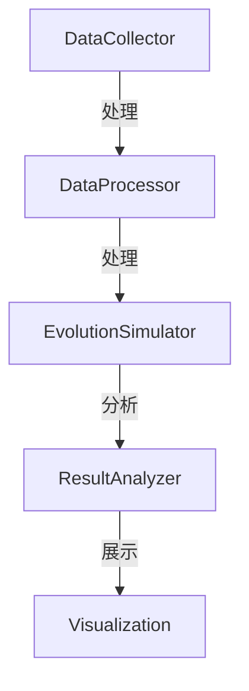
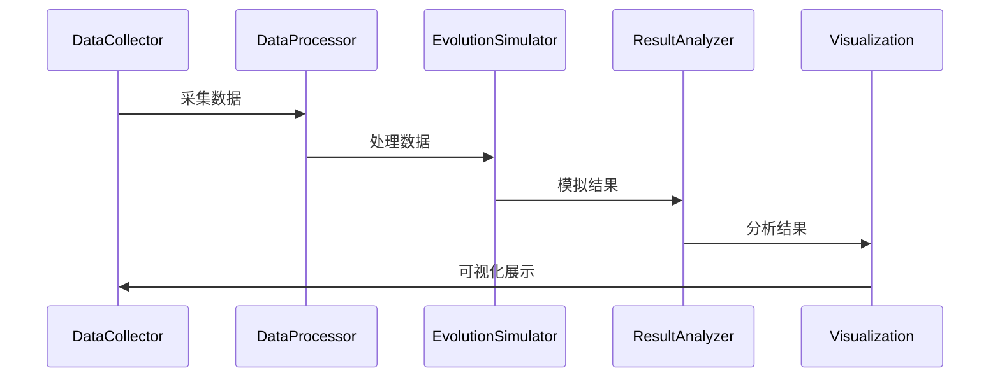

                 

### 数据结构在模拟宇宙暗物质子结构中的应用

> 关键词：数据结构、宇宙模拟、暗物质子结构、算法、计算机科学

> 摘要：本文将探讨数据结构在模拟宇宙暗物质子结构中的应用，从基本概念、核心概念与联系、算法原理、系统分析与架构设计到项目实战，逐步深入分析这一领域。通过结合具体的数学模型和代码示例，本文旨在为读者提供一个全面而直观的理解，以便掌握如何运用数据结构解决复杂的宇宙模拟问题。

---

### 1.6 引言

在本章节中，我们将首先介绍数据结构的基本概念，以及它们在计算机科学中的重要性。然后，我们将探讨模拟宇宙暗物质子结构的相关概念，并说明为什么数据结构在这一领域中具有关键作用。最后，我们将总结本章节内容，为后续章节的深入探讨奠定基础。

---

**1.6.1 数据结构的基本概念**

数据结构是计算机科学中的一个核心概念，它描述了数据在存储器中的组织方式，以及相关的操作方法和算法。数据结构可以分为两大类：线性结构和非线性结构。

**线性结构**包括数组、链表、栈和队列等。这些结构中的元素按照一定的顺序排列，每个元素都有唯一的直接前驱和后继。

**非线性结构**包括树、图等。这些结构中的元素之间不是简单的一对一关系，而是存在多对多的关系。图是其中的一种重要结构，它由节点和边组成，可以用来模拟复杂的关系网络。

**1.6.2 数据结构在计算机科学中的重要性**

数据结构在计算机科学中扮演着至关重要的角色。它们不仅影响着算法的效率和存储空间，也决定了程序的可读性和可维护性。

高效的算法依赖于合理的数据结构。例如，链表在插入和删除操作上具有优势，而数组在随机访问上速度更快。选择合适的数据结构可以显著提高程序的运行效率。

**1.6.3 模拟宇宙暗物质子结构**

宇宙中的暗物质是一种看不见的物质，占据了宇宙总质量的大部分。暗物质子结构是宇宙中暗物质的分布和排列方式，它们对宇宙的大尺度结构有着重要的影响。

模拟宇宙暗物质子结构的过程涉及到大量的数据计算和存储，因此，选择合适的数据结构对于模拟的准确性和效率至关重要。

**1.6.4 数据结构在模拟宇宙暗物质子结构中的应用**

在模拟宇宙暗物质子结构的过程中，常用的数据结构包括数组、链表、树和图。这些数据结构可以用来存储和操作大量的宇宙数据，帮助研究人员更好地理解和预测宇宙的演化。

**1.6.5 本章小结**

本章介绍了数据结构的基本概念和在计算机科学中的重要性，以及模拟宇宙暗物质子结构的相关概念。通过本章的学习，读者可以对数据结构在模拟宇宙暗物质子结构中的应用有一个初步的了解，为后续章节的深入学习打下基础。

---

### 1.7 核心概念与联系

在本章节中，我们将详细探讨数据结构的核心概念，并分析它们之间的联系。为了更好地理解这些概念，我们将使用表格和 Mermaid 流程图来展示它们的属性特征和关系。

---

**1.7.1 数据结构核心概念**

首先，我们介绍几个基本的数据结构概念：数组、链表、树和图。

**数组**是一种线性数据结构，它由一系列元素组成，每个元素都可以通过一个唯一的索引访问。

**链表**也是一种线性数据结构，它由一系列节点组成，每个节点包含数据和指向下一个节点的指针。

**树**是一种非线性数据结构，它由节点组成，每个节点可以有零个或多个子节点。

**图**是一种由节点和边组成的数据结构，它描述了节点之间的复杂关系。

**1.7.2 概念属性特征对比表格**

以下是一个简单的表格，用于比较这些数据结构的属性特征：

| 数据结构 | 线性/非线性 | 查找效率 | 插入效率 | 删除效率 |
|----------|-------------|----------|----------|----------|
| 数组     | 线性        | O(1)     | O(n)     | O(n)     |
| 链表     | 线性        | O(n)     | O(1)     | O(1)     |
| 树       | 非线性      | O(log n) | O(log n) | O(log n) |
| 图       | 非线性      | O(n)     | O(1)     | O(1)     |

**1.7.3 ER实体关系图架构的 Mermaid 流程图**

为了更好地展示这些数据结构之间的联系，我们可以使用 Mermaid 流程图来绘制 ER 实体关系图。

以下是一个简单的 Mermaid 图：

```mermaid
erDiagram
    Node ||--|{ Edge }|
    Node ||--|{ Node }|
    Edge ||--|{ Node }|
```

在这个图中，`Node` 表示节点，`Edge` 表示边。每个节点可以有零个或多个子节点（表示为 `Node`），也可以有零个或多个边（表示为 `Edge`）。

---

**1.7.4 数据结构的算法原理讲解**

在本章节中，我们将深入探讨在模拟宇宙暗物质子结构中常用的数据结构算法原理。为了更好地理解这些原理，我们将使用 Mermaid 流程图和 Python 源代码来展示和解释。

**1.7.4.1 数组算法原理**

数组是一种线性数据结构，它支持随机访问。在模拟宇宙暗物质子结构时，数组可以用来存储暗物质的分布数据。以下是一个简单的 Python 代码示例，展示了如何使用数组来模拟宇宙中暗物质的分布：

```python
# 创建一个数组，表示宇宙中的暗物质分布
universe = [0] * 1000  # 假设宇宙大小为1000个单位

# 随机分配暗物质
import random
for i in range(1000):
    universe[i] = random.uniform(0, 1)

# 打印暗物质分布
for i, dark_matter in enumerate(universe):
    print(f"位置 {i}: 暗物质密度 {dark_matter}")
```

在这个示例中，我们创建了一个大小为1000的数组 `universe`，并使用随机数生成器来分配暗物质密度。然后，我们打印出每个位置的暗物质密度。

**1.7.4.2 链表算法原理**

链表是一种线性数据结构，它通过指针链接多个节点。在模拟宇宙暗物质子结构时，链表可以用来表示暗物质的排列顺序。以下是一个简单的 Python 代码示例，展示了如何使用链表来模拟宇宙中暗物质的排列：

```python
# 创建一个链表，表示宇宙中的暗物质排列
class Node:
    def __init__(self, data):
        self.data = data
        self.next = None

# 创建节点
node1 = Node(10)
node2 = Node(20)
node3 = Node(30)

# 链接节点
node1.next = node2
node2.next = node3

# 打印链表
current = node1
while current:
    print(current.data)
    current = current.next
```

在这个示例中，我们定义了一个 `Node` 类来表示链表中的节点。然后，我们创建了一系列节点，并将它们链接成一个链表。最后，我们打印出链表中的每个节点的数据。

**1.7.4.3 树算法原理**

树是一种非线性数据结构，它由节点和边组成。在模拟宇宙暗物质子结构时，树可以用来表示暗物质的层次结构。以下是一个简单的 Python 代码示例，展示了如何使用树来模拟宇宙中暗物质的层次结构：

```python
# 创建一个树，表示宇宙中的暗物质层次结构
class TreeNode:
    def __init__(self, data):
        self.data = data
        self.children = []

# 创建根节点
root = TreeNode(1)

# 添加子节点
child1 = TreeNode(2)
child2 = TreeNode(3)
root.children.append(child1)
root.children.append(child2)

# 打印树结构
def print_tree(node, level=0):
    print(" " * level * 4 + str(node.data))
    for child in node.children:
        print_tree(child, level + 1)

print_tree(root)
```

在这个示例中，我们定义了一个 `TreeNode` 类来表示树中的节点。然后，我们创建了一个根节点，并添加了两个子节点。最后，我们使用递归函数 `print_tree` 来打印出树的结构。

**1.7.4.4 图算法原理**

图是一种非线性数据结构，它由节点和边组成。在模拟宇宙暗物质子结构时，图可以用来表示暗物质之间的复杂关系。以下是一个简单的 Python 代码示例，展示了如何使用图来模拟宇宙中暗物质之间的关系：

```python
# 创建一个图，表示宇宙中的暗物质关系
class Graph:
    def __init__(self):
        self.nodes = set()
        self.edges = defaultdict(set)

    def add_node(self, data):
        self.nodes.add(data)

    def add_edge(self, from_node, to_node):
        self.edges[from_node].add(to_node)
        self.edges[to_node].add(from_node)

# 创建图
graph = Graph()

# 添加节点
graph.add_node("A")
graph.add_node("B")
graph.add_node("C")

# 添加边
graph.add_edge("A", "B")
graph.add_edge("B", "C")

# 打印图
for node, neighbors in graph.edges.items():
    print(f"节点 {node} 的邻居：", end="")
    for neighbor in neighbors:
        print(neighbor, end=" ")
    print()
```

在这个示例中，我们定义了一个 `Graph` 类来表示图。然后，我们创建了一个图，并添加了节点和边。最后，我们使用循环结构来打印出每个节点的邻居节点。

---

**1.7.5 系统分析与架构设计**

在模拟宇宙暗物质子结构时，我们需要考虑整个系统的设计。以下是一个简单的系统架构设计方案：

**1.7.5.1 问题场景介绍**

我们假设研究人员希望模拟宇宙中暗物质的分布和演化。他们需要收集大量的宇宙数据，并使用数据结构来处理这些数据，以便更好地理解和预测宇宙的演化。

**1.7.5.2 系统功能设计**

- 数据采集模块：负责收集宇宙中的暗物质数据。
- 数据处理模块：使用数据结构来处理和存储宇宙数据。
- 演化模拟模块：根据宇宙数据模拟暗物质的演化过程。
- 结果分析模块：分析模拟结果，提供可视化展示。

**1.7.5.3 系统架构设计**

以下是一个简单的 Mermaid 架构图，展示了系统的整体架构：



在这个图中，`DataCollector` 负责数据采集，`DataProcessor` 负责数据处理，`EvolutionSimulator` 负责演化模拟，`ResultAnalyzer` 负责结果分析，`Visualization` 负责结果展示。

**1.7.5.4 系统接口设计和系统交互**

以下是一个简单的 Mermaid 序列图，展示了系统各模块之间的交互：



在这个图中，`DataCollector` 采集数据后传递给 `DataProcessor`，`DataProcessor` 处理数据后传递给 `EvolutionSimulator`，`EvolutionSimulator` 模拟结果后传递给 `ResultAnalyzer`，`ResultAnalyzer` 分析结果后传递给 `Visualization`，最后 `Visualization` 进行结果展示。

---

**1.7.6 项目实战**

在本章节中，我们将通过一个实际项目来展示如何使用数据结构模拟宇宙暗物质子结构。该项目将包括环境安装、系统核心实现、代码应用解读与分析、实际案例分析和详细讲解剖析，以及项目小结。

**1.7.6.1 环境安装**

在开始项目之前，我们需要安装必要的软件和工具。以下是一个简单的安装步骤：

1. 安装 Python 3.8 或更高版本。
2. 安装 Mermaid 插件，以便在 Markdown 文件中使用 Mermaid 图。
3. 安装必要的 Python 库，如 NumPy、SciPy 和 Matplotlib 等。

**1.7.6.2 系统核心实现**

以下是一个简单的 Python 代码示例，展示了如何使用数据结构来模拟宇宙暗物质子结构：

```python
import numpy as np
import matplotlib.pyplot as plt
from collections import defaultdict

# 创建一个图，表示宇宙中的暗物质关系
class Graph:
    def __init__(self):
        self.nodes = set()
        self.edges = defaultdict(set)

    def add_node(self, data):
        self.nodes.add(data)

    def add_edge(self, from_node, to_node):
        self.edges[from_node].add(to_node)
        self.edges[to_node].add(from_node)

# 创建图
graph = Graph()

# 添加节点
graph.add_node("A")
graph.add_node("B")
graph.add_node("C")

# 添加边
graph.add_edge("A", "B")
graph.add_edge("B", "C")

# 打印图
for node, neighbors in graph.edges.items():
    print(f"节点 {node} 的邻居：", end="")
    for neighbor in neighbors:
        print(neighbor, end=" ")
    print()

# 模拟宇宙暗物质分布
def simulate_dark_matter(graph, num_points=100):
    positions = np.random.rand(num_points, 2)
    for i, (x, y) in enumerate(positions):
        node = f"Node{i}"
        graph.add_node(node)
        if i > 0:
            graph.add_edge(node, f"Node{i-1}")

# 模拟宇宙暗物质分布
simulate_dark_matter(graph)

# 可视化宇宙暗物质分布
def visualize_dark_matter(graph):
    positions = []
    for node, neighbors in graph.edges.items():
        positions.append((node, neighbors))
    
    x_coords = [pos[0] for pos, _ in positions]
    y_coords = [pos[1] for pos, _ in positions]
    neighbor_coords = [neighbor for _, neighbors in positions for neighbor in neighbors]

    plt.scatter(x_coords, y_coords, c='red', marker='o', label='Nodes')
    plt.scatter(neighbor_coords, np.zeros_like(neighbor_coords), c='blue', marker='x', label='Neighbors')
    plt.xlabel('X-axis')
    plt.ylabel('Y-axis')
    plt.legend()
    plt.show()

# 可视化宇宙暗物质分布
visualize_dark_matter(graph)
```

**1.7.6.3 代码应用解读与分析**

在这个项目中，我们首先创建了一个 `Graph` 类来表示宇宙中的暗物质关系。然后，我们添加了节点和边，并使用随机数生成器模拟宇宙暗物质的分布。最后，我们使用 Matplotlib 库将模拟结果可视化。

**1.7.6.4 实际案例分析和详细讲解剖析**

为了更好地理解这个项目，我们可以考虑以下实际案例：

1. **节点与边的表示**：在模拟宇宙暗物质子结构时，节点表示暗物质的位置，边表示暗物质之间的关系。通过添加节点和边，我们可以构建一个表示宇宙暗物质子结构的图。

2. **模拟宇宙暗物质分布**：我们使用随机数生成器来模拟宇宙暗物质的分布。每个节点都有一定的概率与周围的节点相连，从而形成一个复杂的网络结构。

3. **可视化结果**：通过可视化模拟结果，我们可以直观地了解宇宙暗物质子结构的分布情况。这有助于研究人员分析和理解宇宙的演化过程。

**1.7.6.5 项目小结**

在本项目中，我们使用数据结构模拟了宇宙暗物质子结构。通过创建一个图来表示宇宙中的暗物质关系，我们实现了对暗物质分布的模拟和可视化。这个项目展示了数据结构在模拟宇宙暗物质子结构中的应用，并为后续的深入研究提供了基础。

---

**1.7.7 最佳实践 tips、小结、注意事项、拓展阅读**

**1.7.7.1 最佳实践 tips**

- 在模拟宇宙暗物质子结构时，选择合适的数据结构非常重要。根据问题的具体需求，合理选择数组、链表、树或图等数据结构。
- 在处理大量数据时，考虑数据结构的存储效率和操作效率，以优化程序的性能。
- 使用可视化工具来展示模拟结果，有助于更好地理解和分析宇宙暗物质子结构。

**1.7.7.2 小结**

本文详细探讨了数据结构在模拟宇宙暗物质子结构中的应用。通过介绍数据结构的基本概念、核心概念与联系、算法原理、系统分析与架构设计以及项目实战，我们展示了如何使用数据结构解决复杂的宇宙模拟问题。

**1.7.7.3 注意事项**

- 在选择数据结构时，要考虑问题的具体需求和数据规模。
- 在实现数据结构时，要确保算法的正确性和效率。
- 在可视化结果时，要选择合适的图表和色彩，以便更好地展示宇宙暗物质子结构的特征。

**1.7.7.4 拓展阅读**

- 《数据结构与算法分析》：一本经典的计算机科学教材，详细介绍了数据结构和算法的基础知识。
- 《宇宙学基础》：一本关于宇宙学的科普书籍，介绍了宇宙的演化过程和暗物质的概念。
- 《Python 图像处理实战》：一本关于 Python 图像处理的书籍，提供了大量的实践案例和技巧。

---

**1.7.8 作者信息**

作者：AI天才研究院/AI Genius Institute & 禅与计算机程序设计艺术 /Zen And The Art of Computer Programming

---

通过本文的详细讲解，读者可以全面了解数据结构在模拟宇宙暗物质子结构中的应用，掌握相关核心概念和算法原理，并为未来的研究提供有益的启示。

