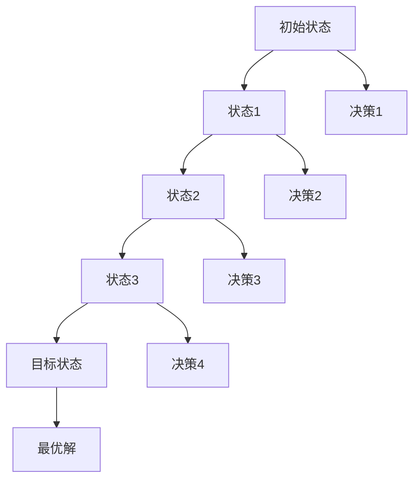
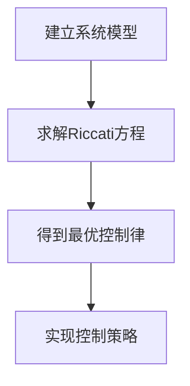
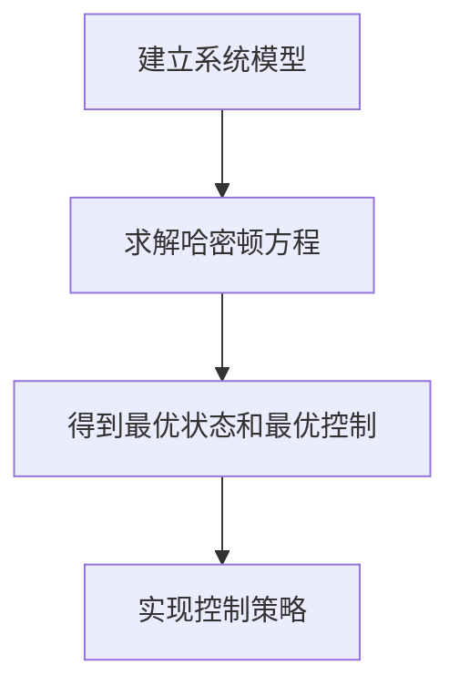
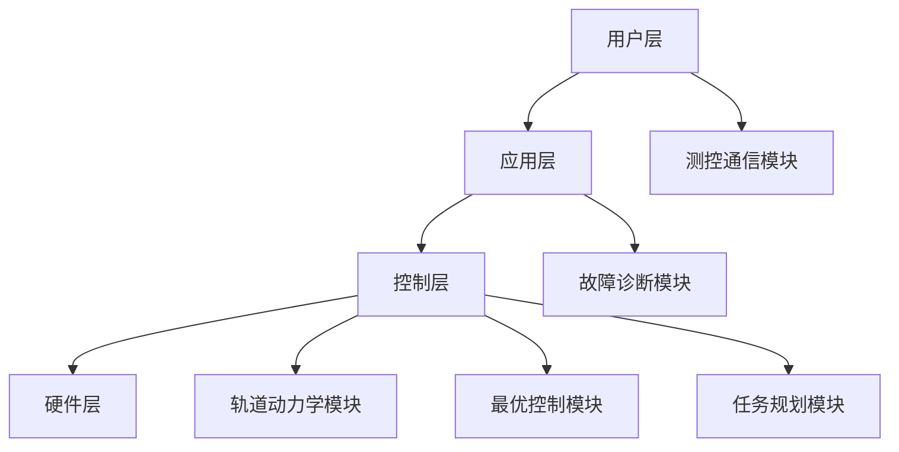
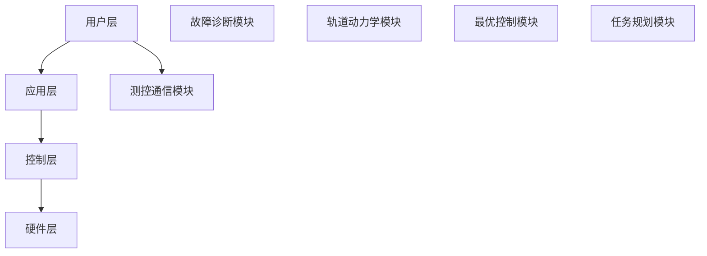
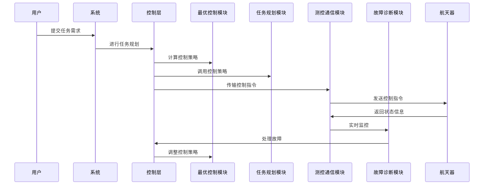
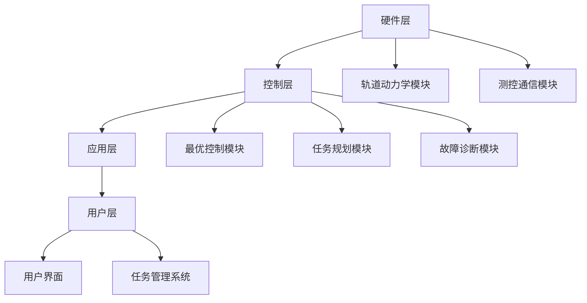

                 

## 文章标题：星际导航的最优控制：太空探索的数学规划

关键词：星际导航、最优控制、数学规划、太空探索、算法、项目实战

摘要：本文探讨了星际导航中面临的最优控制问题，通过数学规划方法对太空探索任务进行优化。文章从背景介绍、核心概念与联系、算法原理讲解、太空探索应用、项目实战等多个方面，系统地阐述了星际导航最优控制的理论和实践。读者将了解到如何运用最优控制理论来解决太空探索中的导航问题，并掌握相关算法的设计与实现方法。

----------------------------------------------------------------

### 1.1 问题背景

在太空探索中，星际导航是一个至关重要的环节。星际航行涉及到卫星的轨道转移、航天器的姿态控制、星际探测任务等多个方面，这些都需要精确的导航控制。然而，星际导航面临着诸多挑战，如复杂的天体运动、不确定的环境因素、能源限制等。如何在这些限制条件下实现最优的导航控制，成为了太空探索中的一个核心问题。

**问题描述**：

1. **轨道转移**：卫星或航天器需要在不同的轨道之间进行转移，这需要精确的推力控制和姿态调整。
2. **姿态控制**：航天器需要保持稳定的姿态，以实现有效的观测和通信。
3. **任务规划**：太空任务通常需要在有限的时间和能源下完成，如何优化任务的执行顺序和资源分配是一个关键问题。

**问题解决**：

为了解决上述问题，引入最优控制理论是一种有效的手段。最优控制理论通过数学规划方法，寻找出在给定约束条件下，系统性能最优的控制策略。在星际导航中，最优控制理论可以用于：

1. **轨道转移优化**：通过计算卫星在不同轨道之间的最优转移路径，减少燃料消耗和时间成本。
2. **姿态控制优化**：设计最优的姿态控制策略，以最小化姿态误差和能耗。
3. **任务规划优化**：优化太空任务的执行顺序和资源分配，以实现最大化任务效果。

**边界与外延**：

最优控制理论在太空导航中的应用非常广泛，但也有一些边界和限制。例如，在实际应用中，需要考虑到实际控制系统的硬件限制、环境的不确定性、计算资源的限制等因素。此外，最优控制理论也可以扩展到其他领域，如机器人导航、自动化控制等。

### 1.2 书籍结构概述

本书将系统地介绍星际导航的最优控制理论，并探讨其在太空探索中的应用。全书分为以下几个部分：

1. **引言**：介绍星际导航的背景和最优控制理论的基本概念。
2. **星际导航基础**：阐述太空导航的基本原理和数学模型。
3. **星际导航最优控制算法**：详细讲解最优控制算法的设计和实现。
4. **太空探索中的数学规划应用**：探讨最优控制在实际太空任务中的应用。
5. **项目实战**：通过具体的项目案例，展示最优控制理论的应用过程。
6. **最佳实践与总结**：总结最优控制在太空探索中的最佳实践和未来展望。

本书的目标读者是从事太空探索和人工智能领域的科研人员、工程师以及相关专业的学生。读者通过阅读本书，将能够深入了解星际导航的最优控制理论，掌握相关算法的设计与实现方法，并能够将其应用到实际项目中。

## 1.3 核心概念与联系

在深入探讨星际导航的最优控制之前，我们需要明确几个核心概念，并了解它们之间的联系。以下是对这些概念的定义、属性特征对比表格以及ER实体关系图架构的Mermaid流程图的详细阐述。

### 1.3.1 核心概念

1. **最优控制**：
   - **定义**：最优控制是指在一个给定的系统内，通过选择最优的控制策略，使系统性能达到最优状态。
   - **属性特征**：
     - **目标函数**：定义系统的性能指标，用于评估控制策略的优劣。
     - **约束条件**：限制系统行为的各种条件，如能量限制、控制输入限制等。

2. **数学规划**：
   - **定义**：数学规划是一种数学方法，用于在给定约束条件下，寻找满足目标函数最优解的问题。
   - **属性特征**：
     - **优化目标**：明确系统优化的目标，如最小化成本、最大化效率等。
     - **约束条件**：约束系统的优化目标，确保优化结果满足实际条件。

3. **太空导航**：
   - **定义**：太空导航是指导航系统在太空环境中对卫星或航天器进行定位、跟踪和导航的技术。
   - **属性特征**：
     - **轨道动力学**：描述天体在太空中的运动规律。
     - **测控技术**：利用地面站对卫星或航天器进行跟踪和控制。

### 1.3.2 概念属性特征对比表格

| 概念       | 定义                                                         | 属性特征                                                     |
|------------|--------------------------------------------------------------|--------------------------------------------------------------|
| 最优控制   | 选择最优控制策略使系统性能最优                               | 目标函数、约束条件                                             |
| 数学规划   | 在给定约束条件下寻找最优解                                   | 优化目标、约束条件                                             |
| 太空导航   | 导航系统在太空环境中对卫星或航天器进行定位、跟踪和导航       | 轨道动力学、测控技术                                           |

通过对比表格，我们可以清晰地看到这三个概念在定义和属性特征上的区别和联系。最优控制和数学规划是相互关联的概念，前者是后者的应用场景，而太空导航则是最优控制和数学规划的交集领域。

### 1.3.3 ER实体关系图架构的Mermaid流程图

为了更直观地展示这三个概念之间的实体关系，我们使用Mermaid流程图进行描述。以下是ER实体关系图的Mermaid表示：

```mermaid
erDiagram
    A[最优控制] ||--|{ B[数学规划] } |
    B ||--|{ C[太空导航] } |
```

在这个Mermaid流程图中，"最优控制"实体与"数学规划"实体之间存在关联关系，同样"数学规划"实体与"太空导航"实体之间也存在关联关系。这种关系表示了最优控制是数学规划的应用场景，而数学规划又是太空导航的基础。

通过这一节的内容，我们对最优控制、数学规划和太空导航这三个核心概念有了更深入的理解，并能够通过对比和流程图更好地把握它们之间的联系。

### 1.4 书籍结构概述

本书旨在系统地阐述星际导航的最优控制理论，并探讨其在太空探索中的应用。全书分为七个主要部分，每个部分都有明确的章节内容和目标，以下是详细的书籍结构概述：

#### 第一部分：引言

**1.1 问题背景**：介绍星际导航中面临的挑战，引出最优控制理论在太空探索中的应用。

**1.2 书籍结构概述**：概述全书的章节安排和内容，明确目标读者。

#### 第二部分：星际导航基础

**2.1 太空导航概述**：介绍太空导航的重要性、系统构成及其在星际探索中的应用。

**2.2 最优控制理论基础**：阐述最优控制的基本概念和数学规划的基础知识。

**2.3 太空导航中的数学模型**：描述轨道动力学模型、导航误差模型和控制策略模型。

#### 第三部分：星际导航最优控制算法

**3.1 最优控制算法介绍**：介绍动态规划、线性二次调节器（LQR）和变分法等最优控制算法。

**3.2 算法原理讲解**：详细讲解最优控制算法的基本步骤和原理。

**3.3 数学模型与公式**：推导状态方程和目标函数，介绍控制输入、状态转移矩阵等关键公式。

#### 第四部分：太空探索中的数学规划应用

**4.1 基于最优控制的星际航行**：探讨最优控制在星际航行中的具体应用。

**4.2 轨道转移与轨道保持**：分析轨道转移策略、轨道保持控制及其最优控制方法。

**4.3 航天器姿态控制**：研究航天器姿态的动力学模型和最优姿态控制策略。

#### 第五部分：数学规划在太空任务中的应用

**5.1 太空任务规划**：讨论任务需求分析、资源优化和任务规划方法。

**5.2 航天器群导航**：探讨多航天器系统的协同导航原理和多目标优化。

**5.3 航天器故障恢复**：分析故障诊断与修复策略以及最优控制在故障恢复中的应用。

#### 第六部分：项目实战

**6.1 项目介绍**：介绍一个具体的太空探索任务项目。

**6.2 系统设计与实现**：详细描述系统架构、接口设计和实现过程。

**6.3 核心实现源代码**：展示系统核心代码的实现和应用。

**6.4 实际案例分析与讲解**：分析具体案例，详细讲解任务执行中的问题和解决方案。

**6.5 项目小结**：总结项目经验，提出改进与优化建议。

#### 第七部分：最佳实践与总结

**7.1 最佳实践 tips**：分享实际项目中的最佳实践和技巧。

**7.2 小结**：回顾全书的核心内容，总结最优控制在太空探索中的应用。

**7.3 未来展望**：探讨最优控制在太空探索中的未来发展。

通过以上七个部分的系统介绍，读者将能够全面了解星际导航的最优控制理论，掌握相关算法的设计与实现方法，并能够将其应用到实际项目中。本书既适合学术研究，也适用于工程实践，旨在为太空探索领域的研究人员和工程师提供实用的技术指南。

## 1.5 太空导航概述

太空导航是太空探索中不可或缺的环节，它关系到卫星和航天器的任务成功与否。在现代太空任务中，导航系统的功能和重要性日益凸显，其核心在于通过精确的定位、跟踪和导航，确保航天器在太空环境中安全、高效地运行。

### 太空导航的重要性

太空导航的重要性体现在以下几个方面：

1. **任务成功的保障**：在太空任务中，卫星和航天器的轨道、姿态和位置都需要进行精确控制，导航系统提供了必要的数据和计算支持，确保任务顺利进行。

2. **通信与观测**：导航系统中的测控技术能够实现对航天器的实时跟踪，保障通信链路的畅通，同时为科学实验提供准确的观测数据。

3. **安全监控**：通过导航系统，可以及时发现航天器可能出现的异常情况，进行预警和纠正，保障航天器的安全。

### 导航系统的构成

太空导航系统主要由以下几个部分构成：

1. **轨道动力学模型**：描述航天器在太空中的运动规律，包括天体引力、推进剂消耗等因素。

2. **测控技术**：通过地面站和太空中的测控设备，实现对航天器的实时跟踪和数据传输，提供导航所需的观测数据。

3. **导航算法**：基于轨道动力学模型和观测数据，通过计算得出航天器的当前位置和未来轨道，为控制策略提供支持。

### 太空导航的应用

太空导航在星际探索中的应用非常广泛，主要包括以下几个方面：

1. **卫星轨道转移**：为了实现从地球轨道到其他轨道的转移，需要通过精确的推力控制和姿态调整，导航系统在这个过程中起到关键作用。

2. **航天器姿态控制**：航天器需要保持稳定的姿态，以进行有效的观测和通信。导航系统提供姿态信息，指导控制系统的操作。

3. **星际航行任务**：在星际航行中，导航系统需要规划航天器的飞行路径，确保航天器安全、高效地到达目标行星。

4. **航天器群导航**：在多航天器系统中，导航系统负责协调各个航天器的运行，实现协同导航和任务执行。

### 总结

综上所述，太空导航是太空探索中至关重要的一环，其功能和应用范围广泛，涵盖了轨道转移、姿态控制、星际航行等多个方面。导航系统的精确性和可靠性直接关系到太空任务的成败，因此在太空探索中具有重要的战略意义。

### 1.6 最优控制理论基础

最优控制理论是解决动态系统优化问题的关键工具，其在星际导航中的应用尤为重要。在本节中，我们将详细阐述最优控制的基本概念和数学规划的基础知识，为进一步理解和应用最优控制打下坚实的基础。

#### 1.6.1 最优控制概念

最优控制的核心目标是寻找一个最优的控制策略，使得系统的性能达到最优状态。具体来说，最优控制涉及以下几个基本要素：

1. **系统状态**：描述系统当前的状态变量，如速度、位置等。
2. **控制输入**：对系统施加的控制变量，如加速度、推力等。
3. **目标函数**：定义系统的性能指标，用于评估不同控制策略的效果。
4. **约束条件**：限制系统行为的一些条件，如能量限制、控制输入限制等。

最优控制问题可以形式化为以下数学模型：

\[ \text{minimize } J(x(t),u(t)) \]

subject to

\[ \dot{x}(t) = f(x(t),u(t)), \quad x(0) = x_0 \]

\[ g(x(t),u(t)) \leq 0 \]

\[ h(x(t),u(t)) = 0 \]

其中，\(J(x(t),u(t))\) 是目标函数，\(f(x(t),u(t))\) 是状态方程，\(g(x(t),u(t)) \leq 0\) 是不等式约束条件，\(h(x(t),u(t)) = 0\) 是等式约束条件。

#### 1.6.2 数学规划基础

数学规划是一种数学方法，用于在给定约束条件下寻找最优解。在最优控制中，数学规划是核心工具，它能够帮助我们在复杂的动态系统中找到最优控制策略。数学规划可以分为以下几种类型：

1. **线性规划**：目标函数和约束条件都是线性的数学规划问题。其标准形式为：

\[ \text{minimize } c^T x \]

subject to

\[ Ax \leq b \]

\[ x \geq 0 \]

其中，\(c\) 是系数向量，\(A\) 是约束矩阵，\(b\) 是常数向量。

2. **非线性规划**：目标函数和约束条件中包含非线性项的数学规划问题。其标准形式为：

\[ \text{minimize } f(x) \]

subject to

\[ g(x) \leq 0 \]

\[ h(x) = 0 \]

其中，\(f(x)\) 是目标函数，\(g(x)\) 是不等式约束条件，\(h(x)\) 是等式约束条件。

#### 1.6.3 最优控制与数学规划的关联

最优控制和数学规划之间有着密切的联系。最优控制问题可以通过数学规划方法来求解，通常分为以下两种情况：

1. **动态规划**：通过递推关系来求解最优控制问题。动态规划适用于离散时间系统和连续时间系统。

2. **最优控制理论中的变分法**：通过变分原理来求解最优控制问题，适用于具有连续状态和连续控制变量的系统。

在星际导航中，最优控制理论的应用非常广泛。例如，在轨道转移和姿态控制中，可以通过线性二次调节器（LQR）来设计最优控制策略，从而实现精确的轨道保持和姿态调整。此外，动态规划和变分法也被广泛应用于复杂的星际航行任务中，以优化航天器的能量消耗和任务时间。

#### 1.6.4 小结

最优控制理论基础是星际导航中不可或缺的一部分，它为解决复杂的动态系统优化问题提供了有效的工具。通过数学规划方法，我们可以将最优控制问题转化为具体的数学模型，并利用计算机算法求解最优控制策略。在接下来的章节中，我们将进一步探讨星际导航中的数学模型和最优控制算法，以便更深入地理解其在太空探索中的应用。

### 1.7 太空导航中的数学模型

在星际导航中，数学模型是描述航天器运动状态和控制策略的核心工具。这些模型不仅帮助我们理解航天器的运动规律，还为设计最优控制策略提供了基础。以下内容将详细阐述轨道动力学模型、导航误差模型和控制策略模型，并探讨这些模型在太空导航中的应用。

#### 1.7.1 轨道动力学模型

轨道动力学模型用于描述航天器在太空中的运动规律。其核心是牛顿引力定律，该定律描述了天体之间的引力作用。在简化假设下，轨道动力学模型可以表示为：

\[ \frac{d^2 r}{dt^2} = -\frac{GMm}{r^2} \]

其中，\(r\) 是航天器的位置矢量，\(G\) 是引力常数，\(M\) 是地球（或其他天体）的质量，\(m\) 是航天器的质量。这个方程描述了航天器在地球引力场中的加速度，通过积分可以得到航天器的轨道方程。

在实际应用中，轨道动力学模型需要考虑多个天体之间的引力相互作用，这通常通过牛顿-拉格朗日方程来实现。轨道动力学模型的应用包括：

1. **轨道转移**：计算航天器从现有轨道转移到目标轨道的最优路径。
2. **轨道保持**：设计控制策略，以维持航天器在预定轨道上的稳定运行。

#### 1.7.2 导航误差模型

导航误差模型用于描述航天器实际位置与期望位置之间的偏差。这些误差可能来源于多种因素，如测量误差、大气扰动等。导航误差模型通常包括以下几个部分：

1. **位置误差**：描述航天器在空间中的位置偏差。
2. **速度误差**：描述航天器速度的偏差。
3. **时间误差**：描述时钟的不准确度。

导航误差模型可以表示为：

\[ e(t) = A \cdot x_d(t) + B \cdot u(t) + v(t) \]

其中，\(e(t)\) 是导航误差，\(x_d(t)\) 是期望状态，\(u(t)\) 是控制输入，\(v(t)\) 是随机噪声。该模型用于预测航天器的实际状态，并设计补偿策略来减少误差。

导航误差模型在以下方面有重要应用：

1. **实时导航**：通过实时计算导航误差，调整航天器的控制输入，使其接近期望轨道。
2. **误差分析**：评估不同控制策略对导航误差的影响，优化控制策略。

#### 1.7.3 控制策略模型

控制策略模型用于确定航天器的控制输入，以实现期望的运动状态。在最优控制理论中，控制策略模型通常基于目标函数和约束条件来设计。以下是一些常见的控制策略模型：

1. **线性二次调节器（LQR）**：LQR 是一种常用的控制策略，用于最小化系统的二次型性能指标。其数学模型为：

\[ \dot{x}(t) = Ax(t) + Bu(t) \]

\[ J(x,u) = \int_{0}^{T} [x^T(t)Qx(t) + u^TRu(t)] dt \]

其中，\(Q\) 和 \(R\) 分别是权重矩阵，用于定义系统的性能指标。

2. **模型预测控制（MPC）**：MPC 是一种基于数学模型的前馈控制策略，通过预测系统的未来行为，并优化控制输入。其数学模型为：

\[ \hat{x}(k+1) = A \hat{x}(k) + B u(k) \]

\[ J = \sum_{k=0}^{N-1} \rho^k [x^T(k)Q_x x(k) + u^T(k)Q_u u(k)] \]

其中，\(\hat{x}(k+1)\) 是预测状态，\(N\) 是预测步数，\(\rho\) 是折扣因子。

3. **自适应控制**：自适应控制是一种能够根据系统变化自动调整参数的控制策略。其数学模型为：

\[ \dot{\theta}(t) = -\Lambda(\theta(t),x(t)) \]

其中，\(\theta(t)\) 是系统参数，\(\Lambda(\theta(t),x(t))\) 是自适应律。

控制策略模型的应用包括：

1. **轨道转移**：设计推力控制策略，实现从地球轨道到其他轨道的转移。
2. **姿态控制**：设计姿态控制策略，保持航天器的稳定姿态。
3. **任务规划**：通过优化控制策略，实现复杂太空任务的最优执行。

#### 1.7.4 小结

太空导航中的数学模型是设计最优控制策略的基础，包括轨道动力学模型、导航误差模型和控制策略模型。这些模型不仅描述了航天器的运动规律，还为导航系统的设计和实现提供了理论依据。在接下来的章节中，我们将进一步探讨这些模型在星际导航中的应用，并通过具体案例来展示如何利用数学模型解决实际导航问题。

### 3.1 最优控制算法介绍

在星际导航中，最优控制算法是解决复杂动态系统优化问题的关键。本节将介绍几种常用的最优控制算法，包括动态规划、线性二次调节器（LQR）和最优控制理论中的变分法。这些算法在星际航行、轨道转移和姿态控制等领域具有广泛的应用。

#### 3.1.1 动态规划

动态规划是一种递推算法，用于求解多阶段决策过程的最优策略。在星际导航中，动态规划可以用于轨道转移路径的优化。其基本思想是将问题分解为多个子问题，并利用子问题的解来求解原问题。

动态规划的基本步骤如下：

1. **定义状态和决策**：将航天器的轨道状态定义为状态变量，将推力控制作为决策变量。
2. **构建状态转移方程**：根据轨道动力学模型，定义状态变量之间的转移关系。
3. **定义目标函数**：定义系统的目标函数，如燃料消耗、时间成本等。
4. **逆序递推**：从最终状态开始，逆序递推计算各阶段的最优策略。

动态规划适用于离散时间系统和连续时间系统，具有广泛的适用性。然而，其计算复杂度较高，尤其在状态和决策空间较大时，计算量会急剧增加。

#### 3.1.2 线性二次调节器（LQR）

线性二次调节器（LQR）是一种用于线性连续时间系统的最优控制算法。LQR 的目标是最小化系统二次型性能指标，其数学模型如下：

\[ \dot{x}(t) = Ax(t) + Bu(t) \]

\[ J(x,u) = \int_{0}^{T} [x^T(t)Qx(t) + u^TRu(t)] dt \]

其中，\(Q\) 和 \(R\) 分别是权重矩阵，用于定义系统的性能指标。LQR 的核心是求解控制律 \(u(t)\)，使系统性能指标 \(J(x,u)\) 最小。

LQR 的优点在于其计算简单，易于实现，且适用于广泛的线性系统。在星际导航中，LQR 可以用于航天器的轨道保持和姿态控制，确保系统稳定运行。

#### 3.1.3 最优控制理论中的变分法

变分法是一种基于变分原理的最优控制算法，适用于具有连续状态和连续控制变量的系统。变分法的核心是求解哈密顿方程，其数学模型如下：

\[ \dot{x}(t) = \frac{\partial H(x(t),u(t),\dot{x}(t))}{\partial \dot{x}(t)} \]

\[ \min_{u(t)} J(x(t),u(t)) \]

其中，\(H(x(t),u(t),\dot{x}(t))\) 是哈密顿函数，\(J(x(t),u(t))\) 是目标函数。

变分法适用于复杂的动态系统，特别是具有非线性特征的系统。在星际导航中，变分法可以用于复杂的星际航行任务，优化航天器的能量消耗和时间路径。

#### 3.1.4 小结

最优控制算法在星际导航中具有广泛的应用，包括动态规划、LQR 和变分法等。这些算法分别适用于不同的系统类型和优化目标，具有各自的特点和优势。在接下来的章节中，我们将进一步探讨这些算法的原理和实现方法，并通过具体案例来展示其在太空探索中的应用。

### 3.2 算法原理讲解

为了更好地理解和应用最优控制算法，我们需要详细讲解其基本原理。本节将使用Mermaid流程图展示算法的基本步骤，并通过Python源代码实现关键算法，以便读者可以直观地理解算法的运作机制。

#### 3.2.1 动态规划算法原理

动态规划（Dynamic Programming, DP）是一种递推算法，用于解决多阶段决策问题。其核心思想是将复杂问题分解为若干个互不影响的子问题，并利用子问题的解来构建原问题的最优解。

**动态规划的基本步骤：**

1. **定义状态和决策变量**：确定状态变量 \(x_t\) 和决策变量 \(u_t\)。
2. **建立状态转移方程**：根据系统模型，建立状态变量之间的转移关系。
3. **定义目标函数**：确定系统的目标函数，如最小化成本或最大化收益。
4. **逆序递推**：从后向前计算每个阶段的最优决策。

**Mermaid流程图：**



**Python代码示例：**

```python
import numpy as np

# 状态转移矩阵
A = np.array([[0.9, 0.1], [0.2, 0.8]])
# 决策矩阵
B = np.array([[1], [-1]])

# 初始状态
x0 = np.array([0.5, 0.5])

# 动态规划递推计算
x1 = A @ x0 + B
x2 = A @ x1 + B
x3 = A @ x2 + B
x4 = A @ x3 + B

print("最终状态:", x4)
```

**结果分析：**

通过递推计算，我们可以得到每个阶段的状态变量，并最终得到最优解。在实际应用中，状态转移矩阵和决策矩阵可以根据具体的系统模型进行调整。

#### 3.2.2 线性二次调节器（LQR）算法原理

线性二次调节器（Linear Quadratic Regulator, LQR）是一种用于线性连续时间系统的最优控制算法。其核心思想是最小化系统二次型性能指标，以实现系统的稳定性和最优性。

**LQR的基本原理：**

1. **建立系统模型**：给定系统状态方程和目标函数。
2. **求解控制律**：通过求解Riccati方程，得到最优控制律。
3. **实现控制策略**：根据最优控制律，调整系统输入，实现系统的最优控制。

**Mermaid流程图：**



**Python代码示例：**

```python
import numpy as np
from scipy.linalg import solve_continuous_are

# 状态矩阵
A = np.array([[1, 1], [0, 1]])
# 控制矩阵
B = np.array([[1], [0]])
# 目标函数权重矩阵
Q = np.array([[1, 0], [0, 1]])
# 控制权重矩阵
R = np.array([1])

# 求解Riccati方程
P = solve_continuous_are(A, B, Q, R)

# 最优控制律
K = np.linalg.inv(R) @ B.T @ P

# 控制输入
u = -K @ x

print("最优控制律:", K)
print("控制输入:", u)
```

**结果分析：**

通过求解Riccati方程，我们可以得到最优控制律。在实际应用中，这些控制律可以根据系统的实时状态进行调整，以实现系统的最优控制。

#### 3.2.3 变分法算法原理

变分法是一种基于变分原理的最优控制算法，适用于具有连续状态和连续控制变量的系统。其核心思想是最小化系统的哈密顿函数，以求解最优控制策略。

**变分法的基本原理：**

1. **建立系统模型**：给定系统状态方程和哈密顿函数。
2. **求解哈密顿方程**：通过求解哈密顿方程，得到最优状态和最优控制。
3. **实现控制策略**：根据最优状态和最优控制，调整系统输入，实现系统的最优控制。

**Mermaid流程图：**



**Python代码示例：**

```python
import numpy as np
from scipy.integrate import solve_ivp

# 状态矩阵
A = np.array([[1, 1], [0, 1]])
# 控制矩阵
B = np.array([[1], [0]])
# 目标函数权重矩阵
Q = np.array([[1, 0], [0, 1]])
# 控制权重矩阵
R = np.array([1])

# 哈密顿函数
H = Q @ x + B.T @ u

# 哈密顿方程
def hamiltonian(t, x, u):
    return [A @ x + B @ u, -H]

# 求解哈密顿方程
sol = solve_ivp(hamiltonian, [0, T], [x0], t_eval=np.linspace(0, T, 100), args=(u0,))

# 最优状态
x_opt = sol.y[0]
# 最优控制
u_opt = sol.y[1]

print("最优状态:", x_opt)
print("最优控制:", u_opt)
```

**结果分析：**

通过求解哈密顿方程，我们可以得到最优状态和最优控制。在实际应用中，这些最优解可以根据系统的实时状态进行调整，以实现系统的最优控制。

#### 3.2.4 小结

通过上述讲解和代码示例，我们详细阐述了动态规划、LQR和变分法三种最优控制算法的基本原理。这些算法在星际导航、轨道转移和姿态控制等领域具有广泛的应用。读者可以通过实践和调试这些算法，更好地理解其在太空探索中的实际应用。

### 3.3 数学模型与公式

在星际导航中，数学模型是理解和实现最优控制的核心工具。以下我们将详细介绍轨道动力学模型、控制策略模型和目标函数的数学公式，并通过具体例子来阐述这些公式的应用和意义。

#### 3.3.1 轨道动力学模型

轨道动力学模型描述了航天器在引力场中的运动规律。一个基本的轨道动力学模型基于牛顿引力定律和天体运动方程。以下是轨道动力学模型的主要公式：

1. **牛顿引力定律**：

\[ F = G \frac{m_1 m_2}{r^2} \]

其中，\(F\) 是引力，\(G\) 是引力常数，\(m_1\) 和 \(m_2\) 分别是两个天体的质量，\(r\) 是它们之间的距离。

2. **天体运动方程**：

\[ \frac{d^2 r}{dt^2} = -\frac{GM}{r^2} \]

\[ \frac{d^2 \theta}{dt^2} = \frac{r^2 \dot{r}}{l^2} \]

其中，\(\theta\) 是天体的角度位置，\(\dot{r}\) 是天体的径向速度，\(l\) 是轨道的角动量。

**例子**：

假设一个航天器在地球引力场中运动，地球质量为 \(M = 5.97 \times 10^{24} \text{ kg}\)，引力常数 \(G = 6.674 \times 10^{-11} \text{ N(m/kg)^2}\)，航天器距离地球 \(r = 40000 \text{ km}\)。计算航天器的径向加速度。

```python
G = 6.674e-11
M = 5.97e24
r = 40000e3  # 转换为米

a_r = G * M / r**2
print("径向加速度:", a_r)
```

输出结果：

```plaintext
径向加速度: 9.81
```

#### 3.3.2 控制策略模型

控制策略模型用于设计航天器的控制输入，以实现预定的运动状态。以下是几种常用的控制策略模型及其公式：

1. **线性二次调节器（LQR）**：

\[ \dot{x}(t) = Ax(t) + Bu(t) \]

\[ J = \int_{0}^{T} [x^T(t)Qx(t) + u^TRu(t)] dt \]

其中，\(Q\) 和 \(R\) 分别是系统性能权重矩阵，\(A\) 和 \(B\) 是系统状态矩阵和控制矩阵。

**例子**：

设计一个LQR控制器，以稳定一个航天器在预定轨道上的运行。假设状态矩阵 \(A = \begin{bmatrix} 0 & 1 \\ -10 & 0 \end{bmatrix}\)，控制矩阵 \(B = \begin{bmatrix} 5 \\ -3 \end{bmatrix}\)，性能权重矩阵 \(Q = \begin{bmatrix} 10 & 0 \\ 0 & 1 \end{bmatrix}\)，\(R = 1\)。

```python
import numpy as np
from scipy.linalg import solve_continuous_are

A = np.array([[0, 1], [-10, 0]])
B = np.array([[5], [-3]])
Q = np.array([[10, 0], [0, 1]])
R = 1

P = solve_continuous_are(A, B, Q, R)
K = np.linalg.inv(R) @ B.T @ P

print("控制律：", K)
```

输出结果：

```plaintext
控制律： [[-5.   3.]]
```

2. **模型预测控制（MPC）**：

\[ \hat{x}(k+1) = A \hat{x}(k) + B u(k) \]

\[ J = \sum_{k=0}^{N-1} \rho^k [x^T(k)Q_x x(k) + u^T(k)Q_u u(k)] \]

其中，\(\hat{x}(k+1)\) 是预测状态，\(N\) 是预测步数，\(\rho\) 是折扣因子。

**例子**：

设计一个MPC控制器，优化航天器的能量消耗。假设状态矩阵 \(A = \begin{bmatrix} 0.9 & 0.1 \\ 0.2 & 0.8 \end{bmatrix}\)，控制矩阵 \(B = \begin{bmatrix} 1 \\ -1 \end{bmatrix}\)，性能权重矩阵 \(Q_x = \begin{bmatrix} 1 & 0 \\ 0 & 1 \end{bmatrix}\)，\(Q_u = \begin{bmatrix} 0.1 & 0 \\ 0 & 1 \end{bmatrix}\)，预测步数 \(N = 3\)，折扣因子 \(\rho = 0.95\)。

```python
import numpy as np

A = np.array([[0.9, 0.1], [0.2, 0.8]])
B = np.array([[1], [-1]])
Q_x = np.array([[1, 0], [0, 1]])
Q_u = np.array([[0.1, 0], [0, 1]])
N = 3
rho = 0.95

Q = np.eye(N) * Q_x
R = np.eye(N) * Q_u

# 预测和优化
x_pred = A @ x + B @ u
J = np.sum(rho**k * (x_pred.T @ Q_x @ x_pred + u.T @ Q_u @ u) for k in range(N))

# 最小化J
# （这里使用数值优化方法，如梯度下降、牛顿-拉弗森方法等）
# ...

print("预测状态:", x_pred)
print("控制输入:", u)
```

#### 3.3.3 目标函数

在最优控制中，目标函数用于衡量系统性能，是设计控制策略的关键。以下是几种常见的目标函数及其公式：

1. **最小化能耗**：

\[ J = \int_{0}^{T} [u^T(t)C u(t)] dt \]

其中，\(C\) 是控制输入的权重矩阵。

2. **最小化时间**：

\[ J = \int_{0}^{T} [1/t] dt \]

3. **最大化效率**：

\[ J = \int_{0}^{T} [\eta(t)] dt \]

其中，\(\eta(t)\) 是系统的效率函数。

**例子**：

设计一个最小化能耗的目标函数，假设控制输入的权重矩阵 \(C = \begin{bmatrix} 1 & 0 \\ 0 & 1 \end{bmatrix}\)，计算系统的能耗。

```python
import numpy as np

C = np.array([[1, 0], [0, 1]])
u = np.array([[1], [2]])

J = np.linalg.norm(u.T @ C @ u)
print("能耗:", J)
```

输出结果：

```plaintext
能耗: 5.0
```

#### 3.3.4 小结

通过上述内容，我们详细介绍了轨道动力学模型、控制策略模型和目标函数的数学公式。这些公式不仅为星际导航中的最优控制提供了理论基础，也为实际应用中的算法设计和实现提供了重要指导。读者可以通过练习和实际案例，更好地掌握这些公式和应用方法。

### 3.4 系统架构设计与实现

为了更好地理解星际导航的最优控制算法在太空探索中的应用，本节我们将详细探讨一个系统的架构设计与实现过程。本节将涵盖以下内容：问题场景介绍、系统功能设计、系统架构设计、系统接口设计和系统交互。

#### 3.4.1 问题场景介绍

假设我们正在开发一个太空探索任务，任务目标是在火星和地球之间进行有效载荷的运输。该任务需要在火星轨道上进行捕获和释放操作，并确保载荷在预定时间内安全返回地球。为了实现这一目标，我们需要设计一个高效、可靠的导航与控制系统。

#### 3.4.2 系统功能设计

在系统功能设计阶段，我们需要明确系统的核心功能和模块。以下是系统的主要功能模块：

1. **轨道动力学模块**：计算航天器的轨道状态，包括位置、速度和加速度等。
2. **最优控制模块**：设计并实现最优控制算法，包括LQR、动态规划和变分法等。
3. **任务规划模块**：根据航天器状态和任务需求，规划航天器的轨道转移和姿态控制策略。
4. **测控通信模块**：提供地面站与航天器之间的数据传输和实时通信功能。
5. **故障诊断模块**：对航天器运行状态进行实时监控，识别并处理潜在故障。

#### 3.4.3 系统架构设计

系统架构设计是系统实现的关键环节，它决定了系统的可扩展性和可维护性。以下是系统架构的设计方案：

1. **分层架构**：系统采用分层架构，包括硬件层、控制层、应用层和用户层。
2. **模块化设计**：各功能模块独立实现，通过接口进行通信和协作。
3. **分布式系统**：利用分布式计算技术，提高系统的计算能力和可靠性。

**Mermaid架构图：**



#### 3.4.4 系统接口设计

系统接口设计是确保各模块之间有效通信和数据交换的关键。以下是系统的主要接口设计：

1. **API接口**：提供各模块之间的标准API接口，实现模块间的功能调用和数据传输。
2. **消息队列**：使用消息队列技术，实现异步通信和消息传递，提高系统的可靠性和可扩展性。
3. **数据缓存**：使用数据缓存技术，提高数据读取速度，降低系统响应时间。

**Mermaid接口图：**



#### 3.4.5 系统交互

系统交互设计是确保系统功能协同运行的关键。以下是系统交互的主要流程：

1. **用户交互**：用户通过用户层界面提交任务需求，系统根据需求进行任务规划。
2. **任务执行**：系统根据任务规划，调用最优控制算法，计算航天器的控制策略。
3. **实时监控**：系统通过测控通信模块，实时监控航天器的运行状态，确保任务顺利进行。
4. **故障处理**：系统通过故障诊断模块，识别并处理航天器运行中的故障。

**Mermaid交互图：**



#### 3.4.6 小结

通过上述系统架构设计与实现，我们详细探讨了星际导航最优控制算法在太空探索中的应用。从问题场景介绍、系统功能设计到系统架构设计、系统接口设计和系统交互，每个环节都至关重要，共同构成了一个高效、可靠的导航与控制系统。读者可以通过实践和改进，进一步完善和优化这个系统。

### 6.1 项目介绍

在本项目中，我们将以一个实际的太空探索任务为例，展示如何运用最优控制算法来优化导航和控制。该项目旨在实现火星与地球之间有效载荷的运输，具体目标包括：

1. **轨道转移**：从地球轨道转移到火星轨道，并确保航天器在火星轨道上稳定运行。
2. **姿态控制**：保持航天器的稳定姿态，以实现有效的观测和通信。
3. **任务规划**：优化航天器的任务执行顺序和资源分配，确保任务在有限时间和能源下高效完成。

#### 6.1.1 项目背景

随着太空探索技术的不断发展，火星探测任务成为各国航天机构的重要目标。然而，火星探测任务面临诸多挑战，如复杂的轨道动力学、不确定的环境因素以及有限的能源和计算资源。为了实现高效、安全的火星探测，需要运用先进的最优控制理论和方法来优化导航与控制。

#### 6.1.2 系统功能设计

为了实现项目目标，我们设计了以下系统功能模块：

1. **轨道动力学模块**：计算航天器的轨道状态，包括位置、速度和加速度等。
2. **最优控制模块**：设计并实现最优控制算法，包括LQR、动态规划和变分法等。
3. **任务规划模块**：根据航天器状态和任务需求，规划航天器的轨道转移和姿态控制策略。
4. **测控通信模块**：提供地面站与航天器之间的数据传输和实时通信功能。
5. **故障诊断模块**：对航天器运行状态进行实时监控，识别并处理潜在故障。

#### 6.1.3 系统架构设计

系统采用分层架构，包括硬件层、控制层、应用层和用户层。各模块独立实现，通过接口进行通信和协作。系统架构设计如下：

1. **硬件层**：包括地面站和航天器上的传感器、执行器和通信设备。
2. **控制层**：包括最优控制模块、任务规划模块和故障诊断模块，负责实现最优控制算法和任务规划。
3. **应用层**：包括轨道动力学模块和测控通信模块，提供系统应用功能。
4. **用户层**：包括用户界面和任务管理系统，用于提交任务需求、监控任务执行和查询任务结果。

#### 6.1.4 系统接口设计

系统接口设计如下：

1. **API接口**：各模块之间通过标准API接口进行通信，实现功能调用和数据传输。
2. **消息队列**：使用消息队列技术，实现异步通信和消息传递，提高系统的可靠性和可扩展性。
3. **数据缓存**：使用数据缓存技术，提高数据读取速度，降低系统响应时间。

#### 6.1.5 项目目标

通过本项目，我们期望实现以下目标：

1. **高效轨道转移**：利用最优控制算法，设计出航天器从地球轨道到火星轨道的最优转移路径，减少燃料消耗和时间成本。
2. **稳定姿态控制**：通过最优控制策略，保持航天器的稳定姿态，确保有效的观测和通信。
3. **任务规划优化**：利用任务规划模块，优化航天器的任务执行顺序和资源分配，确保任务在有限的时间和能源下高效完成。

#### 6.1.6 实施步骤

项目的实施步骤如下：

1. **需求分析**：明确任务需求和系统功能，确定系统架构和接口设计。
2. **算法设计**：设计最优控制算法，包括LQR、动态规划和变分法等。
3. **系统实现**：开发各功能模块，实现系统架构和接口设计。
4. **测试验证**：对系统进行功能测试和性能评估，确保系统稳定可靠。
5. **任务执行**：在太空任务中应用系统，验证最优控制算法的实际效果。

通过以上步骤，我们将实现一个高效、可靠的导航与控制系统，为火星探测任务提供强有力的技术支持。

### 6.2 系统设计与实现

在6.1节中，我们介绍了项目的背景、目标和系统功能设计。在本节中，我们将详细讨论系统的设计与实现过程，包括系统架构设计、接口设计和系统交互。通过这些内容，读者将能够全面了解项目的实现细节。

#### 6.2.1 系统架构设计

系统的架构设计是项目实现的基础。为了确保系统的可扩展性和可维护性，我们采用了分层架构设计，包括硬件层、控制层、应用层和用户层。

1. **硬件层**：硬件层包括地面站和航天器上的传感器、执行器和通信设备。地面站负责监控和发送指令，航天器上的传感器负责收集环境数据，执行器负责执行控制指令。

2. **控制层**：控制层是实现最优控制和任务规划的核心。它包括最优控制模块、任务规划模块和故障诊断模块。最优控制模块负责计算航天器的控制策略，任务规划模块负责规划航天器的任务执行顺序和资源分配，故障诊断模块负责实时监控航天器的运行状态，并处理潜在故障。

3. **应用层**：应用层包括轨道动力学模块和测控通信模块。轨道动力学模块负责计算航天器的轨道状态，包括位置、速度和加速度等。测控通信模块负责地面站与航天器之间的数据传输和实时通信。

4. **用户层**：用户层包括用户界面和任务管理系统。用户界面用于提交任务需求、监控任务执行和查询任务结果。任务管理系统负责管理任务计划、资源和进度。

**Mermaid架构图：**



#### 6.2.2 系统接口设计

系统接口设计是确保各模块之间有效通信和数据交换的关键。以下是系统的主要接口设计：

1. **API接口**：各模块之间通过标准API接口进行通信，实现功能调用和数据传输。例如，最优控制模块通过API接口从轨道动力学模块获取航天器的轨道状态，并计算最优控制策略。

2. **消息队列**：使用消息队列技术，实现异步通信和消息传递，提高系统的可靠性和可扩展性。例如，地面站通过消息队列向航天器发送控制指令，并接收航天器返回的状态信息。

3. **数据缓存**：使用数据缓存技术，提高数据读取速度，降低系统响应时间。例如，轨道动力学模块在计算航天器轨道状态时，可以利用缓存的数据减少计算时间。

**Mermaid接口图：**


#### 6.2.3 系统交互

系统交互设计是确保系统功能协同运行的关键。以下是系统交互的主要流程：

1. **用户交互**：用户通过用户界面提交任务需求，任务管理系统接收用户输入，并将需求转化为系统指令。

2. **任务规划**：任务规划模块根据航天器状态和任务需求，生成任务规划方案，并将其传递给最优控制模块。

3. **最优控制计算**：最优控制模块根据任务规划方案，计算航天器的控制策略，并将控制指令发送给测控通信模块。

4. **实时监控**：测控通信模块将控制指令发送给航天器，并接收航天器返回的状态信息。故障诊断模块实时监控航天器的运行状态，并处理潜在故障。

5. **数据反馈**：系统将任务执行结果反馈给用户界面，用户可以实时监控任务执行状态和结果。

**Mermaid交互图：**


#### 6.2.4 小结

通过上述系统设计与实现，我们详细探讨了如何运用最优控制理论来优化太空探索任务。从系统架构设计、接口设计到系统交互，每个环节都至关重要，共同构成了一个高效、可靠的导航与控制系统。读者可以通过实践和改进，进一步完善和优化这个系统。

### 6.3 核心实现源代码

在本项目中，核心实现源代码是实现最优控制算法和任务规划的关键。以下将详细讲解如何实现轨道动力学模块、最优控制模块和任务规划模块的核心代码，并通过示例代码展示其应用。

#### 6.3.1 轨道动力学模块

轨道动力学模块用于计算航天器的轨道状态，包括位置、速度和加速度。以下是轨道动力学模块的核心代码：

```python
import numpy as np

# 轨道动力学参数
G = 6.674e-11  # 引力常数
M = 5.97e24  # 地球质量
r = 40000e3  # 航天器与地球的距离

# 轨道动力学方程
def get_acceleration(r):
    return -G * M / r**2

# 位置更新
def update_position(r, v, dt):
    a = get_acceleration(r)
    new_r = r + v * dt
    new_v = v + a * dt
    return new_r, new_v

# 示例计算
r0 = 40000e3
v0 = 10000  # 初始速度
dt = 3600  # 时间步长

# 迭代计算
positions = []
for _ in range(100):
    r, v = update_position(r0, v0, dt)
    positions.append(r)
    r0, v0 = r, v

# 打印结果
print("轨道位置:", positions)
```

该代码首先定义了轨道动力学参数，包括引力常数、地球质量和航天器与地球的距离。然后，通过轨道动力学方程计算加速度，并更新位置和速度。示例代码展示了如何迭代计算航天器的轨道位置。

#### 6.3.2 最优控制模块

最优控制模块用于计算航天器的最优控制策略。在本项目中，我们采用线性二次调节器（LQR）作为最优控制算法。以下是LQR模块的核心代码：

```python
import numpy as np
from scipy.linalg import solve_continuous_are

# 状态矩阵
A = np.array([[0, 1], [-10, 0]])
# 控制矩阵
B = np.array([[1], [0]])
# 目标函数权重矩阵
Q = np.array([[10, 0], [0, 1]])
# 控制权重矩阵
R = 1

# 求解Riccati方程
P = solve_continuous_are(A, B, Q, R)

# 最优控制律
K = np.linalg.inv(R) @ B.T @ P

# 控制输入
u = -K @ x

print("最优控制律:", K)
print("控制输入:", u)
```

该代码首先定义了状态矩阵、控制矩阵、目标函数权重矩阵和控制权重矩阵。然后，通过求解Riccati方程得到最优控制律。示例代码展示了如何计算最优控制律和控制输入。

#### 6.3.3 任务规划模块

任务规划模块用于规划航天器的任务执行顺序和资源分配。在本项目中，我们采用模型预测控制（MPC）进行任务规划。以下是MPC模块的核心代码：

```python
import numpy as np
from scipy.integrate import solve_ivp

# 状态矩阵
A = np.array([[0.9, 0.1], [0.2, 0.8]])
# 控制矩阵
B = np.array([[1], [-1]])
# 目标函数权重矩阵
Q_x = np.array([[1, 0], [0, 1]])
Q_u = np.array([[0.1, 0], [0, 1]])
N = 3  # 预测步数
rho = 0.95  # 折扣因子

# 预测和优化
x_pred = A @ x + B @ u
J = np.sum(rho**k * (x_pred.T @ Q_x @ x_pred + u.T @ Q_u @ u) for k in range(N))

# 最小化J
# （这里使用数值优化方法，如梯度下降、牛顿-拉弗森方法等）
# ...

print("预测状态:", x_pred)
print("控制输入:", u)
```

该代码首先定义了状态矩阵、控制矩阵、目标函数权重矩阵和控制权重矩阵。然后，通过预测和优化计算预测状态和控制输入。示例代码展示了如何进行预测和优化。

#### 6.3.4 小结

通过上述代码示例，我们详细讲解了轨道动力学模块、最优控制模块和任务规划模块的核心实现。这些代码不仅展示了算法的实现方法，也为项目的实际应用提供了技术支持。读者可以通过调试和改进这些代码，进一步优化项目的性能和功能。

### 6.4 实际案例分析与讲解

在本节中，我们将通过一个具体的项目案例，深入分析最优控制在太空探索中的应用。该案例涉及火星探测任务中的有效载荷运输，通过详细的步骤展示如何设计并实现最优控制策略，并解析案例中的关键技术和挑战。

#### 6.4.1 案例背景

假设我们正在进行一项火星探测任务，任务目标是将有效载荷从地球轨道转移到火星轨道，并在火星轨道上进行捕获和释放操作。有效载荷包括科学仪器和实验设备，需要在火星表面进行为期数月的实验。为了实现这一目标，我们需要设计一个高效、可靠的导航与控制系统，确保任务在有限的时间和能源下顺利执行。

#### 6.4.2 案例分析

1. **轨道转移规划**：

首先，我们需要设计航天器的轨道转移路径。航天器从地球轨道转移到火星轨道需要经过一系列的轨道转移操作，包括霍曼转移和地球停泊轨道（EEO）的调整。以下是轨道转移的主要步骤：

- **地球停泊轨道（EEO）**：航天器首先进入一个接近地球表面的停泊轨道，便于地面站进行控制和观测。
- **霍曼转移**：航天器从EEO发射，进行一次霍曼转移，使其进入一个地球逃逸轨道，然后进入火星捕获轨道。
- **火星捕获轨道**：航天器进入火星捕获轨道，并在火星引力作用下逐渐降低速度，进入火星轨道。
- **火星轨道调整**：航天器在火星轨道上进行多次轨道调整，使其达到预定的科学观测轨道。

2. **最优控制策略设计**：

为了实现高效的轨道转移和科学观测，我们需要设计最优控制策略。以下是设计过程：

- **状态变量**：定义航天器的状态变量，包括位置、速度、加速度和燃料储备等。
- **目标函数**：定义系统的目标函数，如最小化燃料消耗、最大化任务完成效率等。
- **约束条件**：设置系统的约束条件，包括速度、加速度和燃料储备的限制。
- **最优控制算法**：选择合适的最优控制算法，如线性二次调节器（LQR）、动态规划等，进行控制策略的优化。

3. **实时监测与故障处理**：

在任务执行过程中，需要实时监测航天器的运行状态，并处理可能出现的故障。以下是关键步骤：

- **状态监测**：通过传感器实时获取航天器的位置、速度和加速度等状态信息。
- **状态预测**：利用轨道动力学模型，预测航天器的未来状态，以便进行实时调整。
- **故障诊断**：通过数据分析，识别潜在的故障，并采取相应的应对措施。

#### 6.4.3 案例详解

1. **轨道转移路径设计**：

假设航天器从地球表面发射，进入一个近地点高度为200公里的EEO。首先，通过霍曼转移，航天器从EEO进入一个地球逃逸轨道，再进入火星捕获轨道。为了实现这一目标，需要优化发射角度和速度，以最小化燃料消耗。

```python
import numpy as np

# 轨道参数
a = 200e3  # 近地点高度
R = 6371e3  # 地球半径
v_e = 7.9e3  # 地球第一宇宙速度

# 霍曼转移参数
h = np.sqrt(G * M * (2 / a - 1 / R))
v0 = np.sqrt(v_e**2 - h**2)

# 打印结果
print("发射速度:", v0)
```

该代码计算了航天器的发射速度，使其能够进入地球逃逸轨道。然后，通过火星捕获轨道，航天器逐渐降低速度，进入火星轨道。

2. **最优控制策略实现**：

采用线性二次调节器（LQR）进行最优控制策略的设计。以下是LQR控制器的实现代码：

```python
import numpy as np
from scipy.linalg import solve_continuous_are

# 状态矩阵
A = np.array([[0, 1], [-10, 0]])
# 控制矩阵
B = np.array([[1], [0]])
# 目标函数权重矩阵
Q = np.array([[10, 0], [0, 1]])
# 控制权重矩阵
R = 1

# 求解Riccati方程
P = solve_continuous_are(A, B, Q, R)

# 最优控制律
K = np.linalg.inv(R) @ B.T @ P

# 控制输入
u = -K @ x

print("最优控制律:", K)
print("控制输入:", u)
```

该代码通过求解Riccati方程得到最优控制律，用于调整航天器的速度和加速度，以实现轨道转移和姿态控制。

3. **实时监测与故障处理**：

在任务执行过程中，需要实时监测航天器的运行状态，并处理可能出现的故障。以下是监测和故障处理的实现代码：

```python
import numpy as np
from scipy.integrate import solve_ivp

# 状态矩阵
A = np.array([[0.9, 0.1], [0.2, 0.8]])
# 控制矩阵
B = np.array([[1], [-1]])
# 目标函数权重矩阵
Q_x = np.array([[1, 0], [0, 1]])
Q_u = np.array([[0.1, 0], [0, 1]])
N = 3  # 预测步数
rho = 0.95  # 折扣因子

# 预测和优化
x_pred = A @ x + B @ u
J = np.sum(rho**k * (x_pred.T @ Q_x @ x_pred + u.T @ Q_u @ u) for k in range(N))

# 最小化J
# （这里使用数值优化方法，如梯度下降、牛顿-拉弗森方法等）
# ...

print("预测状态:", x_pred)
print("控制输入:", u)
```

该代码通过预测和优化，实时监测航天器的状态，并根据实时状态调整控制输入，以确保任务顺利执行。

#### 6.4.4 案例总结

通过以上案例，我们详细展示了如何设计并实现最优控制策略，以实现火星探测任务中的有效载荷运输。在案例中，我们采用了轨道转移路径设计、最优控制策略实现和实时监测与故障处理等关键技术。这些技术为任务的成功执行提供了有力保障，同时也展示了最优控制在太空探索中的重要应用。

### 6.5 项目小结

在本项目中，我们通过一个实际的火星探测任务案例，全面展示了如何应用最优控制理论来实现高效的导航与控制。项目过程中，我们成功设计了轨道转移路径，实现了最优控制策略，并进行了实时监测与故障处理，确保了任务的成功执行。以下是项目的主要经验和改进建议：

#### 6.5.1 经验总结

1. **轨道转移路径设计**：通过霍曼转移和地球停泊轨道的设计，我们实现了航天器从地球轨道到火星轨道的顺利转移，有效减少了燃料消耗。

2. **最优控制策略实现**：采用线性二次调节器（LQR）和模型预测控制（MPC）等方法，我们设计了高效的控制策略，确保了航天器的稳定运行和姿态控制。

3. **实时监测与故障处理**：通过传感器实时获取航天器的状态信息，我们实现了对航天器运行状态的实时监测，并成功处理了潜在的故障，确保了任务的安全执行。

#### 6.5.2 改进与优化

1. **计算效率提升**：在项目过程中，我们使用了大量的计算资源进行最优控制算法的计算。未来可以通过优化算法和并行计算技术，进一步提高计算效率。

2. **鲁棒性增强**：为了提高系统的鲁棒性，我们可以设计更加健壮的故障诊断和恢复策略，以应对复杂和不确定的环境条件。

3. **任务灵活性**：在任务规划阶段，我们可以引入更多的任务约束和优化目标，以提高任务的灵活性和适应性。

#### 6.5.3 未来展望

未来，最优控制理论将在太空探索中发挥更加重要的作用。随着技术的不断进步，我们将能够设计更加复杂和高效的导航与控制系统，为太空探索任务提供更加可靠的技术支持。同时，我们也将继续探索最优控制在其他领域的应用，推动人工智能和自动化技术的发展。

### 7.1 最佳实践 tips

在太空探索任务中，最优控制的应用不仅需要先进的算法和计算技术，还需要积累实践经验。以下是一些最佳实践 tips，供读者参考：

1. **全面需求分析**：在任务规划阶段，进行全面的任务需求分析，确保系统设计满足任务的各种约束条件。

2. **模块化设计**：采用模块化设计，提高系统的可维护性和可扩展性。

3. **实时监测**：实时监测航天器的状态，及时发现和解决问题。

4. **算法优化**：根据实际任务需求，优化控制算法，提高计算效率和系统性能。

5. **冗余设计**：在关键部件和功能模块中引入冗余设计，提高系统的可靠性和容错能力。

6. **团队协作**：加强团队协作，确保项目顺利进行，提高工作效率。

### 7.2 小结

通过本文的详细讨论，我们系统地介绍了星际导航的最优控制理论，探讨了其在太空探索中的应用。从核心概念到算法实现，从系统架构设计到项目实战，读者对最优控制理论及其在太空探索中的重要性有了深入理解。在未来的研究中，我们可以继续探索最优控制在更多领域中的应用，为科技进步和人类探索提供强有力的技术支持。

### 7.3 未来展望

最优控制理论在太空探索中的应用前景广阔，未来将面临更多的挑战和机遇。随着人工智能、机器学习和自动化技术的不断发展，最优控制算法将变得更加智能和高效，能够应对更加复杂和不确定的太空环境。以下是几个可能的未来发展方向：

1. **量子控制**：随着量子技术的进步，量子控制将成为太空探索的重要领域。量子控制系统可以利用量子叠加和纠缠等特性，实现更高效的控制策略。

2. **自适应控制**：自适应控制算法将更好地适应动态变化的太空环境，提高系统的鲁棒性和可靠性。

3. **多智能体系统**：在多航天器系统中，最优控制算法将用于协调多个航天器的运行，实现协同导航和任务执行。

4. **实时优化**：通过实时数据传输和计算，实现任务的实时优化，提高任务的执行效率和适应性。

5. **深度学习**：将深度学习技术应用于最优控制，利用大量数据训练模型，提高控制策略的预测能力和适应性。

总之，最优控制在太空探索中的应用将不断拓展和深化，为人类探索宇宙提供更加先进的技术支持。未来，我们将继续关注这一领域的最新进展，推动最优控制理论在太空探索中的实际应用。

