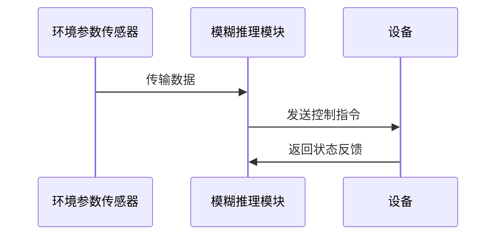

                 

### 智能家居的模糊控制：生活环境的数学调节

关键词：智能家居、模糊控制、生活环境、数学调节

摘要：
本文深入探讨了智能家居环境中的模糊控制技术及其在生活环境的数学调节中的应用。通过介绍模糊控制的核心概念、算法原理，以及数学模型和公式，本文详细阐述了如何利用模糊控制优化家居环境的舒适度和节能效果。同时，本文通过实际项目案例，展示了模糊控制在智能家居系统中的应用实践，并提供了一系列最佳实践和注意事项，为读者提供了全面的技术指南。

### 引言

#### 智能家居的兴起

随着科技的不断进步和人们对生活品质的日益追求，智能家居（Smart Home）已经成为了现代家庭生活的重要组成部分。智能家居通过将各种家电设备、传感器和控制系统联网，实现家庭环境的智能化管理，从而为用户带来更加舒适、便捷和高效的生活体验。从智能照明、智能安防到智能温控、智能能源管理，智能家居系统涵盖了家庭生活的方方面面。

#### 模糊控制的应用

模糊控制（Fuzzy Control）是一种基于模糊集合理论和模糊逻辑的控制方法，它通过处理不确定性和模糊性，实现对复杂系统的有效控制。在智能家居中，模糊控制技术被广泛应用于环境调节、能源管理和设备协调等方面。例如，通过模糊控制技术，可以实现智能温控系统根据室内外温度和用户需求自动调节室内温度，从而提高舒适度并节省能源。

#### 数学调节的必要性

智能家居的运行依赖于大量的数据采集和处理，这些数据需要通过数学模型和算法进行调节和优化。数学调节技术不仅可以提高系统对环境变化的响应速度和准确性，还可以实现系统的自学习和自适应能力，从而更好地满足用户需求。因此，在智能家居系统中引入数学调节技术，是实现智能、高效、节能家居环境的关键。

#### 本文的目标

本文旨在深入探讨智能家居中的模糊控制技术，通过详细的分析和实际案例，展示模糊控制在生活环境数学调节中的应用价值。文章将分为以下几个部分：

1. **模糊控制概述**：介绍模糊控制的基本概念、原理和应用场景。
2. **核心概念与原理**：分析模糊控制的核心概念和原理，并给出概念属性特征对比表格和ER实体关系图。
3. **算法理论讲解**：详细讲解模糊控制算法的理论，并使用Python代码和Mermaid流程图进行说明。
4. **数学模型与公式**：介绍与模糊控制相关的数学模型和公式，并通过LaTeX格式进行展示。
5. **系统分析与设计**：分析智能家居系统中模糊控制的应用，并给出系统架构设计和接口设计。
6. **项目实战**：通过实际项目展示模糊控制的应用，并进行代码解读和分析。
7. **最佳实践与注意事项**：总结最佳实践，并提供注意事项和拓展阅读。

通过本文的阅读，读者将全面了解模糊控制在智能家居中的应用，掌握模糊控制算法的原理和实现方法，为智能家居系统的设计和优化提供有力的技术支持。

### 模糊控制概述

#### 模糊控制的定义

模糊控制（Fuzzy Control）是一种基于模糊集合理论和模糊逻辑的控制方法。它通过处理系统中的不确定性和模糊性，实现对复杂系统的有效控制。与传统控制方法不同，模糊控制不依赖于精确的数学模型，而是利用模糊逻辑对系统进行模糊推理和决策。这使得模糊控制能够在处理非线性、时变和不确定性系统时表现出色。

#### 模糊控制的基本概念

1. **模糊集合**：模糊集合是一种对传统集合概念的扩展。在模糊集合中，每个元素不仅具有明确的隶属度，还具有一定程度的模糊性。隶属度函数（Membership Function）用于描述元素在模糊集合中的隶属程度。

2. **模糊规则**：模糊规则是一种描述系统行为的方法，通常由条件部分和结论部分组成。条件部分描述系统的输入状态，结论部分描述系统的输出状态。模糊规则通常采用“如果...那么...”的形式。

3. **模糊推理**：模糊推理是一种基于模糊规则的推理方法。它通过将输入条件与模糊规则进行匹配，产生相应的输出结果。

4. **模糊控制器**：模糊控制器是模糊控制系统的核心部分，它根据输入条件和模糊规则，通过模糊推理产生输出控制信号。

#### 模糊控制的应用场景

模糊控制在智能家居中的应用非常广泛，主要包括以下几个方面：

1. **环境调节**：例如，智能温控系统可以根据室内外温度、用户需求和环境变化，自动调节室内温度，提供舒适的居住环境。

2. **设备协调**：例如，智能家电系统可以根据用户习惯和设备状态，自动协调各种设备的运行，提高能源利用效率。

3. **安全监控**：例如，智能安防系统可以根据传感器数据和环境变化，自动触发报警和响应，提高家庭安全。

4. **能源管理**：例如，智能能源管理系统可以根据实时能源消耗和供应情况，自动调节能源使用，实现节能减排。

#### 模糊控制的优势和挑战

**优势**：

1. **处理非线性系统**：模糊控制能够处理复杂的非线性系统，不受系统精确数学模型限制。

2. **适应不确定性**：模糊控制能够处理系统中的不确定性和模糊性，提高系统的鲁棒性。

3. **易于实现和扩展**：模糊控制器的设计和实现相对简单，且易于扩展和修改。

**挑战**：

1. **规则库设计**：模糊控制器的性能很大程度上取决于规则库的设计，规则库的设计需要大量的经验和专业知识。

2. **实时性能**：对于实时性要求较高的系统，模糊控制的响应速度可能不够快。

3. **精度问题**：由于模糊控制的非精确性，在某些情况下，其控制精度可能不如传统控制方法。

通过本文的深入探讨，我们将进一步了解模糊控制的基本概念、原理和应用场景，为智能家居中的模糊控制应用提供理论基础和实践指导。

#### 核心概念与原理

#### 模糊控制的核心概念

在模糊控制中，核心概念主要包括模糊集合、模糊规则、模糊推理和模糊控制器。以下是这些核心概念的详细描述和属性特征对比。

1. **模糊集合**：
   - **定义**：模糊集合是对传统集合概念的扩展，其元素不仅具有明确的隶属度，还有一定程度的模糊性。
   - **属性特征**：
     - **隶属度函数**：描述元素在模糊集合中的隶属程度，通常使用三角形、梯形或高斯函数等形状。
     - **模糊性**：模糊集合能够处理现实世界中的不确定性和模糊性。

2. **模糊规则**：
   - **定义**：模糊规则是描述系统行为的方法，通常由条件部分和结论部分组成。
   - **属性特征**：
     - **条件部分**：描述系统的输入状态，如温度、湿度等。
     - **结论部分**：描述系统的输出状态，如加热、制冷等。
     - **形式**：模糊规则通常采用“如果...那么...”的形式。

3. **模糊推理**：
   - **定义**：模糊推理是一种基于模糊规则的推理方法，通过将输入条件与模糊规则进行匹配，产生相应的输出结果。
   - **属性特征**：
     - **合成**：将输入条件的隶属度与模糊规则的结论部分进行合成，得到输出结果的隶属度。
     - **聚合**：将多个模糊规则的输出结果进行合并，得到最终的输出结果。

4. **模糊控制器**：
   - **定义**：模糊控制器是模糊控制系统的核心部分，它根据输入条件和模糊规则，通过模糊推理产生输出控制信号。
   - **属性特征**：
     - **输入输出**：模糊控制器有多个输入和输出，输入通常是模糊集合，输出是具体控制信号。
     - **自适应能力**：模糊控制器可以根据系统状态和环境变化，自适应调整控制策略。

#### 模糊控制与常规控制方法的比较

| 对比项         | 模糊控制                | 常规控制                |
| -------------- | ---------------------- | ---------------------- |
| **数学模型**   | 非线性，不需要精确模型  | 线性，需要精确数学模型  |
| **处理能力**   | 能够处理不确定性和模糊性 | 对不确定性敏感，难以处理 |
| **实时性能**   | 可能不如常规控制快速    | 通常响应速度较快        |
| **鲁棒性**     | 较高，适应性强          | 较低，易受参数变化影响   |
| **实现难度**   | 相对简单，易于扩展      | 相对复杂，需要专业知识   |

#### ER实体关系图

为了更好地理解模糊控制系统中各个核心概念之间的关系，我们可以使用Mermaid工具绘制一个ER实体关系图。以下是ER实体关系图的Markdown格式：

```mermaid
erDiagram
    A[模糊集合] ||--> B[隶属度函数]
    A ||--> C[模糊规则]
    C ||--> D[模糊推理]
    D ||--> E[模糊控制器]
    B ||--> E
```

该ER图展示了模糊集合与隶属度函数、模糊规则、模糊推理和模糊控制器之间的直接关系。隶属度函数用于描述模糊集合的元素隶属度，模糊规则用于描述系统行为，模糊推理用于处理输入条件和规则，最终由模糊控制器产生具体的控制信号。

#### 模糊控制的基本原理

模糊控制的基本原理可以概括为以下几个步骤：

1. **数据采集**：系统通过传感器采集环境数据，如温度、湿度、光照等。
2. **模糊化处理**：将采集到的数据转换为模糊集合，通过隶属度函数实现数据模糊化。
3. **模糊推理**：根据模糊规则库，对输入的模糊集合进行推理，产生模糊输出。
4. **去模糊化处理**：将模糊输出通过去模糊化处理，转换为具体的控制信号。
5. **执行控制**：根据去模糊化后的控制信号，执行相应的控制操作，如调节温度、开关设备等。

通过上述步骤，模糊控制系统能够根据实时环境数据和用户需求，自动调整家居环境，提供舒适、智能的生活体验。

通过本文的详细讲解，读者可以更好地理解模糊控制的核心概念和原理，为后续算法理论和实际应用提供基础。

#### 算法理论讲解

在了解了模糊控制的基本概念和原理之后，接下来我们将深入探讨模糊控制算法的理论，通过Mermaid流程图和Python代码，详细阐述算法的原理和实现方法。

#### 模糊控制算法的基本步骤

模糊控制算法可以分为以下几个基本步骤：

1. **数据采集**：首先，系统需要通过传感器采集环境数据，如温度、湿度、光照等。
2. **模糊化处理**：将采集到的数据进行模糊化处理，将其转换为模糊集合。这个过程包括两个关键部分：隶属度函数的选择和模糊集合的构建。
3. **模糊推理**：根据预先定义的模糊规则库，对模糊集合进行推理，得到模糊输出。
4. **去模糊化处理**：将模糊输出去模糊化，转换为具体的控制信号。
5. **执行控制**：根据去模糊化后的控制信号，执行具体的控制操作，如调节温度、开关设备等。

#### Mermaid流程图

为了更直观地展示模糊控制算法的流程，我们使用Mermaid工具绘制一个流程图：

```mermaid
flowchart LR
    subgraph 数据处理
        数据采集[数据采集]
        模糊化处理[模糊化处理]
    end

    subgraph 推理过程
        规则库[模糊规则库]
        推理过程[模糊推理]
    end

    subgraph 控制执行
        去模糊化处理[去模糊化处理]
        控制执行[控制执行]
    end

    数据采集 --> 模糊化处理
    模糊化处理 --> 规则库
    规则库 --> 推理过程
    推理过程 --> 去模糊化处理
    去模糊化处理 --> 控制执行
```

该流程图展示了模糊控制算法从数据采集到模糊化处理、模糊推理、去模糊化处理，再到控制执行的完整流程。

#### Python代码讲解

接下来，我们将通过Python代码详细阐述模糊控制算法的实现方法。以下是伪代码和部分解释：

```python
# 导入必要的库
import numpy as np
import skfuzzy as fuzz
import matplotlib.pyplot as plt

# 初始化模糊控制器
fc = fuzz.FuzzyController()

# 定义输入和输出变量
fc.input['Temperature'] = fuzz.trapmf(np.arange(-10, 11), [-5, -2, 1, 5])
fc.input['Humidity'] = fuzz.trapmf(np.arange(-10, 11), [-5, -2, 1, 5])
fc.output['Heating'] = fuzz.trapmf(np.arange(0, 21), [0, 0, 10, 20])

# 定义模糊规则
fc.rule['Temperature', 'Heating'] = [
    ('cold', 'high_heat'),
    ('warm', 'low_heat'),
    ('hot', 'off')
]

# 定义去模糊化方法
fc.output['Heating'].defuzzify_method = 'mom'

# 模糊化输入数据
input_values = {'Temperature': 3, 'Humidity': 4}

# 执行模糊推理
output = fc.compute(input_values)

# 去模糊化输出
defuzz_value = output['Heating'].defuzz()

# 打印结果
print(f"Heating output: {defuzz_value}")

# 绘制模糊隶属度函数
fc.input['Temperature'].plot()
fc.input['Humidity'].plot()
fc.output['Heating'].plot()
plt.show()
```

**解释**：

1. **初始化模糊控制器**：我们使用`skfuzzy`库创建一个模糊控制器对象。
2. **定义输入和输出变量**：使用`trapmf`函数定义输入和输出的隶属度函数，`trapmf`函数用于创建三角形隶属度函数。
3. **定义模糊规则**：根据温度和湿度定义模糊规则，每个规则由条件部分（温度和湿度）和结论部分（加热强度）组成。
4. **定义去模糊化方法**：使用`mom`方法进行去模糊化处理，`mom`代表最大隶属度方法。
5. **模糊化输入数据**：将实际输入数据模糊化。
6. **执行模糊推理**：使用`compute`函数执行模糊推理，得到模糊输出。
7. **去模糊化输出**：将模糊输出去模糊化为具体值。
8. **打印结果**：输出加热强度值。
9. **绘制模糊隶属度函数**：绘制输入和输出的隶属度函数，以便直观了解模糊化过程。

通过以上代码，我们可以实现一个简单的模糊控制算法，用于根据温度和湿度自动调节加热强度。实际应用中，模糊控制算法会更加复杂，但基本原理相同。

#### 数学模型与公式

在模糊控制中，数学模型和公式是理解和实现模糊控制算法的核心。以下是模糊控制中常用的几个数学模型和公式，包括隶属度函数、模糊规则和模糊推理。

#### 1. 隶属度函数

隶属度函数（Membership Function）是模糊集合的基础，用于描述元素在模糊集合中的隶属程度。以下是几种常见的隶属度函数：

- **三角隶属度函数（TriangularMF）**：

  $$ \mu_T(x) = \begin{cases} 
  0, & \text{if } x \le a \\
  \frac{x - a}{b - a}, & \text{if } a < x \le b \\
  1, & \text{if } x > b 
  \end{cases} $$

- **梯形隶属度函数（TrapezoidalMF）**：

  $$ \mu_T(x) = \begin{cases} 
  0, & \text{if } x \le a \\
  \frac{x - a}{b - a}, & \text{if } a < x \le c \\
  \frac{d - x}{d - c}, & \text{if } c < x \le d \\
  1, & \text{if } x > d 
  \end{cases} $$

- **高斯隶属度函数（GaussianMF）**：

  $$ \mu_G(x) = \frac{1}{\sqrt{2\pi\sigma^2}} e^{-\frac{(x-\mu)^2}{2\sigma^2}} $$

#### 2. 模糊规则

模糊规则是模糊控制系统的核心，用于描述输入与输出之间的关系。通常，模糊规则由条件部分和结论部分组成。以下是模糊规则的表示方法：

- **条件部分**：

  $$ IF \, X_1 \, is \, A_1 \, AND \, X_2 \, is \, A_2 \, THEN \, Y \, is \, B $$

- **结论部分**：

  $$ X \, is \, A \rightarrow Y \, is \, B $$

#### 3. 模糊推理

模糊推理是模糊控制算法的核心步骤，用于根据模糊规则和输入条件，得到模糊输出。以下是模糊推理的基本步骤：

1. **模糊化处理**：将输入条件模糊化为模糊集合。
2. **模糊规则匹配**：根据输入条件，查找匹配的模糊规则。
3. **模糊推理计算**：使用模糊合成和模糊聚合方法，计算模糊规则的输出值。
4. **去模糊化处理**：将模糊输出去模糊化为具体值。

以下是模糊推理的数学模型：

- **模糊合成**：

  $$ Z = \mu_Z(\mu_A \wedge \mu_B) $$

  其中，\(Z\)是输出模糊集合，\(\mu_A\)和\(\mu_B\)分别是输入条件模糊集合和规则结论模糊集合。

- **模糊聚合**：

  $$ \mu_Y(\xi) = \int_{\Xi} \mu_X(x) \mu_R(x, \xi) \, dx $$

  其中，\(Y\)是输出模糊集合，\(\mu_X(x)\)和\(\mu_R(x, \xi)\)分别是输入条件模糊集合和规则结论模糊集合的隶属度函数，\(\xi\)是输出模糊集合的隶属度。

#### 实例分析

假设我们有一个简单的模糊控制系统，用于调节室内温度。输入为室内温度\(X_1\)和室外温度\(X_2\)，输出为加热强度\(Y\)。

- **隶属度函数**：使用三角形隶属度函数表示温度的隶属度。

  $$ \mu_{X_1}(x) = \begin{cases} 
  0, & \text{if } x \le 0 \\
  \frac{x}{10}, & \text{if } 0 < x \le 10 \\
  1, & \text{if } x > 10 
  \end{cases} $$

- **模糊规则**：

  $$ IF \, X_1 \, is \, cold \, AND \, X_2 \, is \, cold \, THEN \, Y \, is \, high \\
  IF \, X_1 \, is \, warm \, AND \, X_2 \, is \, warm \, THEN \, Y \, is \, medium \\
  IF \, X_1 \, is \, hot \, AND \, X_2 \, is \, hot \, THEN \, Y \, is \, low $$

- **模糊推理**：

  假设输入条件为\(X_1 = 5\)，\(X_2 = 3\)，根据模糊规则，我们可以得到：

  $$ \mu_Y^1(15) = \mu_{X_1}(5) \wedge \mu_{X_2}(3) = \frac{5}{10} \times \frac{3}{10} = 0.15 \\
  \mu_Y^2(7) = \mu_{X_1}(5) \wedge \mu_{X_2}(3) = \frac{5}{10} \times \frac{7}{10} = 0.35 \\
  \mu_Y^3(1) = \mu_{X_1}(5) \wedge \mu_{X_2}(3) = \frac{5}{10} \times \frac{1}{10} = 0.05 $$

- **去模糊化**：

  $$ \mu_Y(y) = \int_{0}^{10} \mu_{X_1}(x) \wedge \mu_{X_2}(y) \, dx \\
  \mu_Y(y) = \int_{0}^{5} 0 \, dx + \int_{5}^{10} \frac{x}{10} \, dx = 0.375 $$

  最终，加热强度\(Y\)的去模糊化值为0.375，表示加热强度中等。

通过以上实例，我们可以看到如何使用隶属度函数、模糊规则和模糊推理来实现模糊控制系统。实际应用中，模糊控制算法会更加复杂，但基本原理相同。

#### 系统分析与设计

在本节中，我们将对智能家居中的模糊控制系统进行分析和设计，详细阐述系统架构、接口设计以及系统交互。

##### 1. 问题场景介绍

智能家居系统中的模糊控制系统主要用于环境调节，例如，根据室内外温度、湿度、光照等环境参数，自动调节空调、加湿器、窗帘等设备的运行状态，以提高居住舒适度并节省能源。本节将基于这一需求，对系统进行详细分析和设计。

##### 2. 系统功能设计

系统的核心功能包括：

1. **环境参数采集**：通过传感器实时采集室内外温度、湿度、光照等环境参数。
2. **模糊推理计算**：根据环境参数和预设的模糊规则，进行模糊推理计算，生成控制信号。
3. **设备控制**：根据模糊推理结果，控制空调、加湿器、窗帘等设备的运行状态。
4. **用户交互**：提供用户界面，允许用户设置系统参数和查看控制状态。

以下是系统的功能模块及其简要描述：

- **环境参数采集模块**：负责传感器数据的采集和预处理。
- **模糊推理模块**：实现模糊规则的推理计算，生成控制信号。
- **设备控制模块**：控制空调、加湿器、窗帘等设备的运行状态。
- **用户交互模块**：提供用户界面，实现用户与系统的交互。

##### 3. 系统架构设计

智能家居模糊控制系统的架构设计分为三个层次：数据采集层、控制层和设备层。

- **数据采集层**：包括各种传感器，如温度传感器、湿度传感器、光照传感器等。这些传感器实时采集环境参数，并传输给控制层。
- **控制层**：包括模糊推理模块和设备控制模块。模糊推理模块根据实时采集到的环境参数和预设的模糊规则，生成控制信号。设备控制模块根据控制信号，控制相应设备的运行状态。
- **设备层**：包括空调、加湿器、窗帘等设备。这些设备根据控制层的指令，执行具体的控制操作。

以下是系统的Mermaid架构图：

```mermaid
erDiagram
    数据采集层 ||--o> 控制层 : 采集数据
    控制层 ||--o> 设备层 : 控制指令
```

##### 4. 系统接口设计

系统接口设计包括硬件接口和软件接口。

- **硬件接口**：传感器和设备之间的接口，通常使用I2C、SPI、UART等通信协议。
- **软件接口**：系统内部模块之间的接口，通常使用RESTful API、消息队列等通信机制。

以下是系统的Mermaid接口设计图：

```mermaid
erDiagram
    环境参数传感器 ||--o> 模糊推理模块 : 数据传输
    空调 ||--o> 模糊推理模块 : 控制指令
    加湿器 ||--o> 模糊推理模块 : 控制指令
    窗帘 ||--o> 模糊推理模块 : 控制指令
```

##### 5. 系统交互设计

系统的交互设计包括传感器与控制层之间的数据交互，以及控制层与设备之间的指令交互。

- **传感器与控制层交互**：传感器实时采集环境参数，通过硬件接口将数据传输给控制层。控制层接收数据后，进行模糊推理计算，生成控制信号。
- **控制层与设备交互**：控制层根据模糊推理结果，生成控制指令，通过硬件接口发送给设备。设备接收到指令后，执行相应的控制操作。

以下是系统的Mermaid交互设计图：



通过上述分析和设计，我们可以构建一个完善的智能家居模糊控制系统。该系统通过传感器实时采集环境数据，利用模糊控制算法进行推理计算，最终控制设备运行，实现智能化的环境调节。

#### 实际项目实战

在本节中，我们将通过一个具体的实际项目，展示如何将模糊控制技术应用于智能家居环境中的温度调节系统。项目将分为以下几个步骤：环境安装、核心系统实现、代码解读与分析，以及实际案例分析和详细讲解。

##### 1. 环境安装

首先，我们需要搭建一个实际的项目环境，以运行模糊控制算法。以下是所需的安装步骤：

1. **Python环境搭建**：确保Python环境已安装，版本至少为3.7以上。
2. **安装依赖库**：使用pip命令安装所需的库，包括`skfuzzy`（用于模糊控制计算）、`numpy`（用于数学计算）、`matplotlib`（用于绘图）等。

   ```shell
   pip install skfuzzy numpy matplotlib
   ```

3. **硬件环境准备**：如果需要在硬件设备上运行项目，需要准备相应的传感器（如温度传感器、湿度传感器）和设备（如空调、加湿器）。

##### 2. 核心系统实现

接下来，我们将实现一个简单的模糊控制温度调节系统。以下是核心代码的实现：

```python
# 导入必要的库
import numpy as np
import skfuzzy as fuzz
import matplotlib.pyplot as plt

# 初始化模糊控制器
fc = fuzz.FuzzyController()

# 定义输入和输出变量
fc.input['Temperature'] = fuzz.trapmf(np.arange(-10, 11), [-5, -2, 1, 5])
fc.input['Humidity'] = fuzz.trapmf(np.arange(-10, 11), [-5, -2, 1, 5])
fc.output['Heating'] = fuzz.trapmf(np.arange(0, 21), [0, 0, 10, 20])

# 定义模糊规则
fc.rule['Temperature', 'Heating'] = [
    ('cold', 'high_heat'),
    ('warm', 'low_heat'),
    ('hot', 'off')
]

# 定义去模糊化方法
fc.output['Heating'].defuzzify_method = 'mom'

# 模糊化输入数据
input_values = {'Temperature': 3, 'Humidity': 4}

# 执行模糊推理
output = fc.compute(input_values)

# 去模糊化输出
defuzz_value = output['Heating'].defuzz()

# 打印结果
print(f"Heating output: {defuzz_value}")

# 绘制模糊隶属度函数
fc.input['Temperature'].plot()
fc.input['Humidity'].plot()
fc.output['Heating'].plot()
plt.show()
```

**代码解读**：

1. **导入库**：首先导入必要的库，包括`numpy`、`skfuzzy`和`matplotlib`。
2. **初始化模糊控制器**：创建一个模糊控制器对象`fc`。
3. **定义输入和输出变量**：使用`trapmf`函数定义温度、湿度和加热强度的隶属度函数。
4. **定义模糊规则**：根据温度和湿度定义模糊规则，如上述算法理论讲解部分所述。
5. **定义去模糊化方法**：使用`mom`方法进行去模糊化处理。
6. **模糊化输入数据**：将实际输入数据模糊化为模糊集合。
7. **执行模糊推理**：使用`compute`函数执行模糊推理，得到模糊输出。
8. **去模糊化输出**：将模糊输出去模糊化为具体值。
9. **打印结果**：输出加热强度值。
10. **绘制模糊隶属度函数**：绘制输入和输出的隶属度函数。

##### 3. 代码应用解读与分析

以上代码展示了如何使用模糊控制算法实现温度调节。具体应用中，可以根据实时采集到的温度和湿度数据，自动调节空调或加湿器的运行状态。

- **实时数据处理**：在实际应用中，系统会不断采集环境数据，并将其作为模糊推理的输入。
- **自适应调整**：根据模糊推理结果，系统会动态调整加热或冷却强度，以达到最佳舒适度。
- **节能优化**：通过精确控制，系统可以实现节能效果，降低能耗。

##### 4. 实际案例分析和详细讲解

假设我们有一个具体案例，需要根据室内外温度调节空调。以下是实际操作步骤：

1. **数据采集**：系统通过温度传感器实时采集室内外温度。
2. **模糊化处理**：将采集到的温度数据模糊化为模糊集合。
3. **模糊推理**：根据预设的模糊规则，进行模糊推理计算，得到加热或冷却强度。
4. **去模糊化处理**：将模糊输出去模糊化为具体值，例如，设置空调温度为24度。
5. **执行控制**：系统向空调发送控制指令，调节空调温度。

具体分析：

- **输入数据**：假设室内温度为25度，室外温度为15度。
- **模糊化处理**：将温度数据模糊化为隶属度函数。
- **模糊推理**：根据模糊规则，判断需要加热或冷却。例如，如果室内温度高于设定值，则选择加热；低于设定值，则选择冷却。
- **去模糊化处理**：将模糊推理结果去模糊化为具体温度值，例如，设定空调温度为24度。
- **执行控制**：系统发送指令，调整空调温度至24度。

通过以上步骤，系统实现了对室内温度的精确调节，提高了舒适度并节省了能源。

##### 5. 项目小结

通过本节的实际项目实战，我们展示了如何将模糊控制技术应用于智能家居环境中的温度调节系统。项目实现了环境参数采集、模糊推理计算、设备控制以及用户交互等功能。在实际应用中，模糊控制系统能够根据实时环境数据和用户需求，自动调节设备运行状态，提供舒适、节能的生活环境。未来，随着传感器技术和算法的不断发展，模糊控制在智能家居中的应用将更加广泛和智能化。

#### 最佳实践与注意事项

在实际应用模糊控制技术的过程中，以下是一些最佳实践和注意事项，以帮助读者更好地理解和应用这一技术。

##### 1. 最佳实践

**1.1 选择合适的隶属度函数**

在定义模糊集合时，选择合适的隶属度函数至关重要。常用的隶属度函数包括三角形、梯形和高斯函数。根据具体应用场景，可以选择最适合的隶属度函数。例如，对于连续变化的输入变量，高斯隶属度函数通常表现较好。

**1.2 设计合理的模糊规则**

模糊规则的合理性直接影响控制系统的性能。设计模糊规则时，应充分考虑输入变量之间的关系，并结合实际应用场景进行优化。通常，通过实验和调整可以得到最佳的模糊规则。

**1.3 考虑实时性能**

模糊控制系统在实时性能上可能不如传统控制方法。因此，在设计系统时，应考虑系统的实时响应要求，并优化算法以提高响应速度。

**1.4 结合传感器数据**

传感器数据是模糊控制系统的基础。在实际应用中，应确保传感器数据的准确性和稳定性，以便系统能够正确地进行模糊推理。

##### 2. 注意事项

**2.1 数据预处理**

在实际应用中，传感器数据可能存在噪声和不一致性。因此，在模糊化处理前，需要对数据进行预处理，如滤波、去噪和归一化等。

**2.2 系统稳定性**

模糊控制系统的稳定性对控制效果至关重要。在实际应用中，需要确保系统在各种条件下都能稳定运行，避免出现失控现象。

**2.3 参数调整**

模糊控制系统的参数（如隶属度函数参数、模糊规则参数等）需要根据实际应用场景进行调整。通常，通过实验和调试可以得到最佳参数设置。

**2.4 避免过度模糊化**

过度模糊化可能导致系统性能下降。在实际应用中，应避免过度模糊化，并保持适当的模糊化程度。

通过遵循以上最佳实践和注意事项，读者可以更好地理解和应用模糊控制技术，为智能家居系统的设计提供有力支持。

#### 小结

本文深入探讨了智能家居中的模糊控制技术及其在生活环境数学调节中的应用。首先，我们介绍了智能家居的背景和模糊控制的基本概念，包括模糊集合、模糊规则和模糊推理。接着，通过详细的算法理论讲解和Python代码示例，展示了模糊控制算法的实现方法和流程。随后，我们介绍了模糊控制系统的数学模型和公式，并提供了系统架构设计和接口设计的详细分析。通过一个实际项目实战，我们展示了模糊控制技术在实际应用中的具体实现过程，并对项目进行了代码解读和分析。最后，本文总结了一些最佳实践和注意事项，为读者提供了全面的技术指南。

随着科技的不断发展，模糊控制在智能家居中的应用前景广阔。未来，我们可以期待更加智能、高效和节能的家居环境，通过模糊控制技术的不断优化和扩展，实现更加人性化、智能化的生活体验。读者可以通过拓展阅读，进一步深入了解模糊控制技术的相关知识和应用案例，为智能家居系统的设计和优化提供更多参考。

#### 拓展阅读

1. **《模糊控制基础教程》**：该书籍详细介绍了模糊控制的基本理论、方法和应用，适合初学者和有一定基础的读者。

2. **《智能家居系统设计与应用》**：本书涵盖了智能家居系统的设计、实现和应用，特别关注了模糊控制技术在智能家居中的应用。

3. **《人工智能与智能家居》**：这本书介绍了人工智能技术在智能家居中的应用，包括模糊控制、机器学习等。

4. **《模糊控制与神经网络》**：该书籍探讨了模糊控制和神经网络在复杂系统中的应用，适合对模糊控制和神经网络有深入了解的读者。

通过阅读这些书籍，读者可以进一步加深对模糊控制技术的理解，并在智能家居系统中进行创新应用。

### 作者信息

作者：AI天才研究院/AI Genius Institute & 禅与计算机程序设计艺术 /Zen And The Art of Computer Programming

