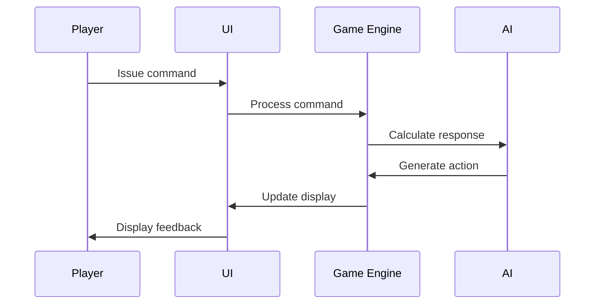
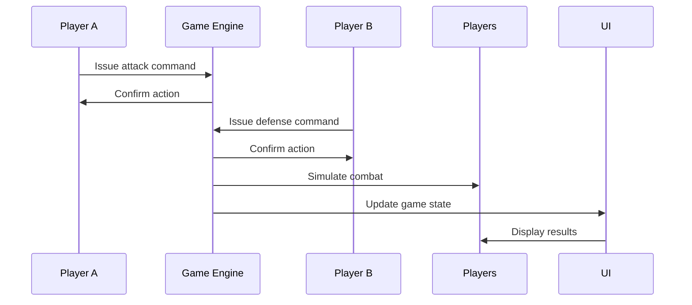

                 


### Introduction to Game Theory and Nash Equilibrium

#### 1.1 Definition and Importance of Game Theory

Game theory is a mathematical framework used to analyze strategic interactions between rational decision-makers. It provides a set of tools and methods for understanding and predicting the outcomes of these interactions. At its core, game theory is about making optimal decisions when facing uncertainties and competitive situations.

One of the fundamental concepts in game theory is the Nash equilibrium. Named after the mathematician John Nash, a Nash equilibrium occurs when each player in a game has chosen a strategy that is optimal given the strategies chosen by the other players, and no player has an incentive to deviate from their chosen strategy.

The importance of game theory in game design cannot be overstated. By understanding the principles of game theory, game designers can create games that are more engaging and balanced. Game theory allows designers to analyze player strategies, predict the outcomes of various decisions, and optimize game mechanics to ensure that the game remains challenging and enjoyable for all players.

#### 1.2 The Concept of Nash Equilibrium

A Nash equilibrium is a set of strategies, one for each player, such that no player can benefit by changing their strategy unilaterally. In other words, each player's strategy is the best response to the strategies of the other players.

Mathematically, a Nash equilibrium can be defined as follows:

Given a game with players \(I = \{1, 2, ..., n\}\), let \(S_i\) be the set of strategies available to player \(i\). A strategy profile \(s = (s_1, s_2, ..., s_n)\) is a vector of strategies, one for each player. A Nash equilibrium is a strategy profile \(s^*\) such that for all players \(i \in I\), \(s_i^*\) is a best response to \(s_{-i}^*\), where \(s_{-i}^*\) is the vector of strategies chosen by all players except player \(i\).

In simple terms, a Nash equilibrium represents a stable state in which no player has an incentive to change their strategy, as doing so would not lead to a better outcome for them.

#### 1.3 Applications of Nash Equilibrium in Game Design

Nash equilibrium has several applications in game design. One of the most common applications is in identifying and balancing game mechanics. By analyzing the Nash equilibria of a game, designers can determine whether a particular game mechanism is likely to lead to unbalanced gameplay or if it needs adjustment to ensure a more equitable experience for all players.

For example, in a multiplayer game, if a certain strategy is dominant (i.e., it guarantees a better outcome than any other strategy), players may converge on this strategy, leading to a monotonous and predictable game. By identifying these dominant strategies and adjusting the game mechanics, designers can create a more engaging and dynamic experience.

Another application of Nash equilibrium in game design is in the creation of game AI. By understanding the Nash equilibria of a game, designers can create AI opponents that are both challenging and fair. These AI opponents can adapt their strategies based on the player's actions, ensuring that the game remains engaging and unpredictable.

#### 1.4 Challenges and Limitations

While Nash equilibrium is a powerful tool in game design, it is not without its challenges and limitations.

One major challenge is the complexity of analyzing games with multiple players and strategies. Determining the Nash equilibria of a game can be computationally intensive, especially for complex games with a large number of possible strategies.

Another limitation is the assumption of rationality. Nash equilibrium assumes that all players are perfectly rational and can predict the strategies of other players. However, in reality, players may make mistakes or have incomplete information, which can lead to suboptimal outcomes.

Finally, Nash equilibrium does not account for social and psychological factors that can influence player behavior. While it provides a mathematical framework for analyzing game strategies, it may not capture the full complexity of human decision-making in competitive situations.

### Conclusion

In conclusion, game theory and, in particular, the concept of Nash equilibrium, provide valuable insights for game designers. By understanding how players interact and make strategic decisions, designers can create more balanced and engaging games. However, it is important to recognize the limitations of Nash equilibrium and to consider other factors that may influence player behavior.

In the next chapter, we will delve deeper into the basic concepts of game design, laying the foundation for our exploration of Nash equilibrium in game design.

---

### Basic Concepts of Game Design

#### 2.1 Game Components and Structure

At its most fundamental level, a game consists of several key components: players, strategies, payoffs, and rules. Understanding these components is essential for any discussion of game design.

**Players:** In any game, there are one or more players, each of whom is trying to achieve a specific goal. Players can be humans or artificial intelligence (AI) entities, and their number can vary depending on the game. For example, a two-player game such as chess has only two players, while a multiplayer online battle arena (MOBA) like "League of Legends" can have as many as ten players per team.

**Strategies:** A strategy is a plan or a set of actions that a player can choose from to achieve their goal. Strategies can be simple or complex, depending on the game. In a game like rock-paper-scissors, the strategies are very basic, consisting of just three possible actions. In contrast, a game like "The Legend of Zelda" requires players to plan their actions over multiple levels and scenarios, making the strategies much more intricate.

**Payoffs:** Payoffs represent the rewards or benefits that players receive based on the outcomes of the game. These can be in the form of points, resources, or other types of advantages. The payoffs are determined by the rules of the game and the strategies chosen by the players. In a game like poker, the payoff is the amount of money a player wins or loses, while in a game like "Clue," the payoff is winning the game by correctly identifying the murderer.

**Rules:** Rules are the set of instructions that govern how the game is played. They define the legal moves and actions that players can take, the order in which players take these actions, and the conditions under which the game ends. Rules can be simple and explicit, like those in a board game like "Monopoly," or they can be more complex and implicit, like those in a video game where players must learn and understand the game mechanics through gameplay.

#### 2.2 Player Types and Behavior

Players in a game can exhibit a wide range of behaviors, and understanding these behaviors is crucial for effective game design. Players can be classified into different types based on their decision-making processes and their objectives within the game.

**Rational Players:** Rational players are those who always choose the best possible strategy to maximize their own payoffs, given the strategies of other players. They use logical reasoning and expect that other players will also act rationally. In many game scenarios, rational players are modeled using Nash equilibrium, as discussed in the previous chapter.

**Bounded Rationality:** Bounded rationality refers to the idea that players have limited cognitive abilities and cannot always make fully rational decisions. They may make simplifications or use heuristics (mental shortcuts) to guide their choices. Game designers must consider bounded rationality when creating games, as it can lead to unexpected player behaviors and outcomes.

**Psychological Players:** Psychological players are influenced by emotions, social factors, and personal biases. They may not always make decisions based on maximizing payoffs; instead, they may be driven by a desire to compete, win, or fit in with other players. Games that incorporate psychological elements, such as social deduction games or competitive multiplayer games, often appeal to psychological players.

**Non-Rational Players:** Non-rational players do not have specific goals or strategies; they may play purely for enjoyment or to learn the game. These players can be unpredictable and may not always follow the rules or the intended game mechanics.

#### 2.3 Game Objectives and Rules

Every game has a set of objectives that players must achieve to win the game. These objectives can be simple, like reaching a specific location or collecting a certain number of resources, or they can be complex, requiring strategic planning and coordination with other players.

**Simple Objectives:** In simple games, the objectives are often straightforward. For example, in "tic-tac-toe," the objective is to get three of your marks in a row. In "Monopoly," the objective is to drive other players into bankruptcy.

**Complex Objectives:** In more complex games, the objectives can be multifaceted. In a game like "Civilization," players must not only build cities and develop their economies but also research technologies, build military forces, and engage in diplomacy with other players. These complex objectives require players to make strategic decisions across multiple dimensions.

The rules of a game define how players achieve these objectives. They can be as simple as taking turns or as complex as involving random chance elements, such as dice rolls or card draws. Effective game design ensures that the rules are clear, fair, and conducive to achieving the game's objectives.

#### 2.4 Design Principles and Best Practices

Designing a game requires a balance of creativity, logic, and practicality. Here are some key principles and best practices to consider when designing a game:

**Clarity:** The rules and objectives of the game should be clear to all players. Ambiguity can lead to confusion and frustration, so it's important to design games with clear and concise instructions.

**Balance:** A well-designed game should offer a fair challenge to all players. This means balancing the power of different strategies and ensuring that no single strategy is overwhelmingly dominant.

**Engagement:** A good game should be engaging and enjoyable for players. This can be achieved through a combination of interesting mechanics, varied gameplay experiences, and a compelling narrative or theme.

**Flexibility:** Games should be adaptable to different player preferences and skill levels. This can be done by offering multiple difficulty levels or allowing players to customize their experience.

**Learning Curve:** While it's important for games to be engaging, it's also crucial for them to have a manageable learning curve. Players should be able to understand the basic mechanics of the game quickly but have opportunities to learn and master more complex strategies over time.

**Feedback:** Games should provide meaningful feedback to players about their progress and performance. This can help players to learn from their mistakes and improve their skills.

By incorporating these principles and best practices, game designers can create games that are not only enjoyable but also intellectually stimulating and balanced.

In the next chapter, we will explore the concept of Nash equilibrium in simple games, using concrete examples to illustrate how this theoretical concept can be applied to game design. Through these examples, we will gain a deeper understanding of how Nash equilibrium can be used to analyze and design games with balanced player interactions.

---

### Nash Equilibrium in Simple Games

To understand how Nash equilibrium can be applied to game design, let's first explore it in the context of simple games, where the concepts are easier to grasp and visualize. We will delve into two-player games and board games as examples, followed by case studies and analysis considerations.

#### 3.1 Two-Player Games

Two-player games are the simplest form of competitive interactions in game theory. A classic example is the game of chess. In chess, each player has a set of legal moves determined by the rules of the game. The objective is to checkmate the opponent's king, which is defined as the king being in a position where it cannot escape capture.

To analyze chess using Nash equilibrium, we can break down the game into smaller sub-games, each representing a specific position or scenario. In these sub-games, players choose their moves, and the outcome is determined by the positions reached. For example, consider a scenario where white (Player 1) has a knight and black (Player 2) has a pawn. The key question is: what is the best move for each player given the opponent's possible responses?

In this scenario, white can choose to move the knight to a specific square, while black can either capture the knight or block its path. Let's consider the possible outcomes:

1. **Knight captures pawn:** This results in white gaining a material advantage.
2. **Knight is blocked:** This leads to a more defensive position for white.
3. **Pawn captures knight:** Black gains a material advantage.
4. **Pawn blocks knight:** Black prevents white from making a significant move.

In a Nash equilibrium, neither player has an incentive to change their strategy unilaterally. For example, if white moves the knight to a square where it can capture a pawn, black will respond by capturing the knight. If white moves the knight to a square where it is blocked, black will respond by capturing the knight or making another defensive move. In neither case does white have an incentive to change their move, as any deviation would lead to a worse outcome.

#### 3.2 Game Theory in Board Games

Board games are another excellent context for understanding Nash equilibrium. A classic example is the game of "Rock, Paper, Scissors." In this game, two players simultaneously choose one of three options: rock, paper, or scissors. Rock beats scissors, scissors beat paper, and paper beats rock. The goal is to choose the option that beats the opponent's choice.

To analyze "Rock, Paper, Scissors" using Nash equilibrium, we can consider the possible outcomes based on the choices of both players. Let's create a payoff matrix to illustrate the results:

| Player 2 | Rock | Paper | Scissors |
| --- | --- | --- | --- |
| **Rock** | Tie | Lose | Win |
| **Paper** | Win | Tie | Lose |
| **Scissors** | Lose | Win | Tie |

In this matrix, each cell represents the outcome of the game based on the choices of both players. For example, if both players choose rock, the game results in a tie. If one player chooses rock and the other chooses paper, the player choosing paper wins.

To find the Nash equilibrium, we need to identify the strategies where neither player has an incentive to deviate. In this game, there is no single dominant strategy, as each choice beats one of the other choices. However, we can observe that if both players randomize their choices, the expected outcome is a tie, as each choice has an equal probability of winning or losing.

In this case, the Nash equilibrium occurs when both players choose their actions randomly, as neither has an incentive to change their strategy. This equilibrium is known as the mixed strategy Nash equilibrium, where players mix their pure strategies (in this case, choosing rock, paper, or scissors) to achieve a better overall outcome.

#### 3.3 Case Studies of Simple Games with Nash Equilibria

To further illustrate the concept of Nash equilibrium, let's consider a few case studies of simple games and analyze their Nash equilibria.

**Case Study 1: Hawk-Dove Game**

The hawk-dove game is a model of conflict and cooperation. In this game, players can choose between two strategies: hawk (defensive or aggressive) or dove (cooperative or non-aggressive). The outcomes depend on the strategies chosen by both players. Here is a payoff matrix for this game:

| Player 2 | Hawk | Dove |
| --- | --- | --- |
| **Hawk** | Win | Lose |
| **Dove** | Lose | Coexist |

In this game, a Nash equilibrium occurs when both players choose hawk, as neither has an incentive to deviate unilaterally. This equilibrium leads to a win-lose outcome, where one player dominates the other.

**Case Study 2: Matching Pennies Game**

The matching pennies game is a game where two players simultaneously show either heads or tails of a coin. The goal is to match the opponent's coin. Here is a payoff matrix for this game:

| Player 2 | Heads | Tails |
| --- | --- | --- |
| **Heads** | Win | Lose |
| **Tails** | Lose | Win |

In this game, the Nash equilibrium occurs when both players choose randomly, as neither has an incentive to choose a specific outcome unilaterally. This equilibrium is another example of a mixed strategy Nash equilibrium.

#### 3.4 Analysis and Design Considerations

Analyzing games for Nash equilibria is crucial in game design for several reasons:

1. **Balance:** By identifying Nash equilibria, game designers can ensure that the game is balanced, meaning that no player has an overwhelming advantage over others. This promotes fairness and makes the game enjoyable for all players.

2. **Predictability:** Nash equilibria help designers predict the likely outcomes of a game. This allows them to design mechanics that are both engaging and challenging, as players must make strategic decisions to avoid the predicted equilibrium outcomes.

3. **Optimization:** Understanding Nash equilibria can help designers optimize game mechanics. By adjusting payoffs or introducing new strategies, designers can shift the equilibrium towards desired outcomes, such as promoting cooperation or competition.

4. **Learning:** Nash equilibrium analysis provides insights into how players will behave under different conditions. This helps designers create games that are both educational and entertaining, as players learn from their experiences and develop strategic thinking skills.

In conclusion, Nash equilibrium is a powerful tool in game design. By analyzing simple games and understanding their Nash equilibria, designers can create balanced and engaging games that provide a fair challenge for all players. In the next chapter, we will explore advanced game theoretical concepts and their applications in game design, building on the foundational understanding gained from our examination of simple games. Through these advanced concepts, we will deepen our understanding of how game theory can be used to design more sophisticated and balanced games.

---

### Advanced Game Theoretical Concepts

While the basic concepts of game theory provide a foundational understanding of strategic interactions in games, there are more advanced theories that offer deeper insights into complex and dynamic scenarios. In this chapter, we will explore several advanced game theoretical concepts, including mixed strategies, subgame perfect equilibrium, and evolutionary game theory. We will also discuss games with imperfect information and their implications for game design.

#### 4.1 Mixed Strategies and Randomization

In many games, players may not have a single dominant strategy that guarantees the best outcome. Instead, they may need to mix their strategies to avoid being predictable and to balance their risks. This concept is known as mixed strategies, where players randomize their choices to achieve a better equilibrium.

A mixed strategy Nash equilibrium occurs when each player randomizes their actions over a set of possible strategies, and no player can benefit by changing their probability distribution over these strategies given the other players' strategies.

**Example: Mixed Strategy Nash Equilibrium in Rock, Paper, Scissors**

Consider the game of "Rock, Paper, Scissors" again. In this game, players can choose rock, paper, or scissors. If players always choose a single strategy, the game can become predictable and boring. By using mixed strategies, players can randomize their choices to maintain uncertainty and keep the game engaging.

To find the mixed strategy Nash equilibrium, we need to calculate the probabilities with which players should randomize their choices. In this game, each player has three possible actions, and the payoffs are as follows:

| Player 1 | Player 2 | Outcome |
| --- | --- | --- |
| Rock | Rock | Tie |
| Rock | Paper | Lose |
| Rock | Scissors | Win |
| Paper | Rock | Win |
| Paper | Paper | Tie |
| Paper | Scissors | Lose |
| Scissors | Rock | Lose |
| Scissors | Paper | Win |
| Scissors | Scissors | Tie |

If both players choose rock, paper, or scissors with equal probability (1/3), the expected payoff for each outcome is the same. This means that neither player has an incentive to deviate unilaterally, and the mixed strategy Nash equilibrium is when both players choose each action with probability 1/3.

#### 4.2 Subgame Perfect Equilibrium

Subgame perfect equilibrium is a refinement of Nash equilibrium that takes into account the sequential nature of many games. In a sequential game, players make decisions one after another, and the outcome of one player's decision depends on the decisions made by previous players. Subgame perfect equilibrium ensures that each player's strategy is a best response at every decision point in the game, considering the strategies of all other players.

**Example: Subgame Perfect Equilibrium in a Ultimatum Game**

The ultimatum game is a classic example of a sequential game where one player (the proposer) proposes how to split a given amount of money with another player (the responder). The responder can either accept or reject the proposal. If the proposal is accepted, the money is split as proposed. If it is rejected, both players receive nothing.

To find the subgame perfect equilibrium in the ultimatum game, we need to consider the decision points where the proposer and responder make their choices. The proposer's strategy is to propose a split that is slightly more favorable to the responder than the minimum they are willing to accept. This ensures that the proposer has an incentive to make a fair proposal, and the responder has an incentive to accept it.

The subgame perfect equilibrium occurs when the proposer makes a fair proposal, and the responder accepts it if the proposal is close to their reservation value. This equilibrium balances the desire for fairness with the need to incentivize cooperation.

#### 4.3 Evolutionary Game Theory

Evolutionary game theory focuses on the strategic interactions between populations of players, where the strategies of individuals evolve over time through a process of natural selection. This theory is particularly useful for understanding long-term outcomes in games with repeated interactions.

**Example: Evolutionary Stability in the Hawk-Dove Game**

In the hawk-dove game, where players can choose between aggressive (hawk) and cooperative (dove) strategies, evolutionary game theory can help predict the long-term behavior of populations.

An evolutionary stable strategy (ESS) is a strategy that is resistant to invasion by any other strategy. In the hawk-dove game, a mixed strategy of hawks and doves is an ESS because a population of doves is vulnerable to invasion by hawks, while a population of hawks is vulnerable to invasion by doves.

Over time, through the process of natural selection, the population will converge on an ESS, where both hawks and doves coexist in a stable balance.

#### 4.4 Games with Imperfect Information

In many real-world games, players do not have complete information about the strategies or payoffs of other players. This is known as a game with imperfect information.

**Example: Texas Hold'em Poker**

Texas Hold'em is a popular poker game where players receive private cards (hole cards) and share five community cards. Players must make decisions based on their private cards and the community cards, as well as their beliefs about the possible cards held by other players.

To analyze Texas Hold'em using game theory, we need to consider the strategies of bluffing, betting, and folding, as well as the probability of other players holding certain cards. This requires reasoning about the potential strategies and information of other players, which is challenging but essential for designing AI players that can compete effectively.

**Implications for Game Design:**

1. **Information Structure:** Game designers must consider the information structure of a game, ensuring that it is engaging and challenging but not overly complex. The level of information should balance the need for strategic decision-making with the player's ability to understand and process it.

2. **Random Elements:** Introducing elements of chance, such as dice rolls or card draws, can help manage the information asymmetry and create a more dynamic and unpredictable game.

3. **Information Hiding:** Designing games with hidden information can create interesting strategic opportunities. For example, in a game like "Clue," players must hide their cards and make strategic guesses about the other players' secrets.

In conclusion, advanced game theoretical concepts provide deeper insights into the complexities of strategic interactions in games. By understanding mixed strategies, subgame perfect equilibrium, evolutionary game theory, and games with imperfect information, game designers can create more balanced, engaging, and intellectually stimulating games. These concepts help designers analyze and optimize game mechanics, ensuring that the game remains challenging and enjoyable for all players.

In the next chapter, we will explore how to apply Nash equilibrium in complex games, examining multiplayer games, network games, and the design of games with multiple Nash equilibria. Through these applications, we will deepen our understanding of how game theory can be used to create balanced and engaging games.

---

### Nash Equilibrium in Complex Games

As we delve deeper into game design, it becomes evident that the concepts of Nash equilibrium extend beyond simple, two-player games. Complex games, involving multiple players and intricate strategic interactions, require a more nuanced understanding of Nash equilibrium to ensure balanced and engaging gameplay. In this chapter, we will explore Nash equilibrium in complex games, including multiplayer games and network games, and examine how game design can be optimized to incorporate multiple Nash equilibria.

#### 5.1 Multiplayer Games

Multiplayer games, where more than two players are involved, introduce additional layers of complexity to the strategic interactions. In these games, players must not only consider their individual strategies but also the strategies of other players, which can lead to multiple Nash equilibria.

**Example: Multiplayer Chess**

In multiplayer chess, where three or four players are involved, each player must choose their moves based on the positions of all other players' pieces. Unlike the two-player version, the presence of multiple players introduces new strategic dynamics. For instance, in a three-player game, a player may choose to cooperate with one opponent against the third player, forming temporary alliances to gain an advantage.

To analyze multiplayer chess using Nash equilibrium, we need to consider the strategies and payoffs of all players. Here is a simplified example of a three-player game:

Player 1: 
- Strategy 1: Attack Player 2
- Strategy 2: Attack Player 3

Player 2: 
- Strategy 1: Defend against Player 1
- Strategy 2: Defend against Player 3

Player 3: 
- Strategy 1: Attack Player 1
- Strategy 2: Attack Player 2

In this scenario, there are multiple Nash equilibria:

1. **Equilibrium 1:** All players attack Player 1. This leads to a win-lose scenario, with Player 1 losing and Players 2 and 3 gaining a material advantage.
2. **Equilibrium 2:** Players 1 and 3 form an alliance against Player 2. This leads to a balanced outcome where all players gain a material advantage.
3. **Equilibrium 3:** Players 1 and 2 form an alliance against Player 3. This also leads to a balanced outcome.

To ensure balanced gameplay, game designers must carefully consider the strategic interactions and the payoffs associated with different strategies. In multiplayer games, the key challenge is to design a game where no single strategy dominates, and players have multiple valid options for achieving their goals.

#### 5.2 Network Games

Network games involve players connected in a network, where the strategies of each player depend not only on their direct interactions with other players but also on the entire network structure. These games are particularly relevant in modern social and multiplayer online games, where player relationships and alliances can significantly impact the outcome of the game.

**Example: Network Game in "Clash of Clans"**

"Clash of Clans" is a multiplayer online game where players build and manage their own villages, attacking and defending against other players. The game incorporates a network structure where players can form alliances and collaborate to attack enemy players collectively. The strategic interactions in the game depend not only on individual player strategies but also on the alliances and relationships within the player network.

To analyze a network game using Nash equilibrium, we need to consider the strategies of all players and the network structure. Here is a simplified example:

- Player A: Attacks Player B with the help of an ally, Player C.
- Player B: Defends against Player A with the help of an ally, Player D.
- Player C: Attacked by Player B with the help of an ally, Player E.
- Player D: Supports Player B in defending against Player A.
- Player E: Attacks Player A with the help of Player D.

In this network, multiple Nash equilibria can arise:

1. **Equilibrium 1:** All players form alliances against a common enemy. This leads to a balanced outcome where all players gain experience and resources.
2. **Equilibrium 2:** Players A and C form an alliance against Players B and D. This leads to a win-lose scenario where Players A and C gain an advantage, while Players B and D lose.
3. **Equilibrium 3:** Players B and D form an alliance against Players A and C. This leads to a win-lose scenario in favor of Players B and D.

To design network games with balanced outcomes, game designers must consider the network structure and the strategic interactions between players. Introducing elements such as alliance systems, player reputation, and resource distribution can help manage the network dynamics and ensure that no single player or alliance has an overwhelming advantage.

#### 5.3 Game Theoretical Analysis of Modern Games

Modern games often incorporate complex game mechanics and strategic interactions that go beyond the traditional framework of Nash equilibrium. These games require a deeper understanding of advanced game theoretical concepts to ensure balanced and engaging gameplay.

**Example: Modern Strategy Games**

Modern strategy games like "Civilization VI" involve complex decision-making processes and long-term strategic planning. Players must manage resources, build cities, develop technologies, and engage in diplomacy with other players. The game incorporates elements of both direct and indirect interactions, making it a rich domain for game theoretical analysis.

To analyze modern strategy games, designers can apply multiple Nash equilibria and advanced game theoretical concepts like subgame perfect equilibrium and evolutionary game theory. For instance, in "Civilization VI," players may form temporary alliances to defeat a common enemy (subgame perfect equilibrium) or engage in a long-term technological race (evolutionary stability).

**Implications for Game Design:**

1. **Balanced Decision-Making:** Modern games often involve multiple decision points and strategic options. Game designers must ensure that players have balanced decision-making processes, where no single strategy dominates. This can be achieved by incorporating diverse game mechanics and providing players with multiple options for achieving their goals.
2. **Dynamic Alliances:** Modern games benefit from dynamic alliances and strategic relationships. Designers can incorporate elements like diplomacy, trade, and alliance systems to create a rich and engaging gameplay experience. By allowing players to form and dissolve alliances based on their strategic interests, designers can create a dynamic and unpredictable game environment.
3. **Reputation and Reputation Systems:** Modern games often incorporate reputation systems, where players gain or lose reputation based on their actions and decisions. Reputation can influence player behavior and strategic interactions, providing additional layers of complexity and depth to the game.

#### 5.4 Designing Games with Multiple Nash Equilibria

To create balanced and engaging games, designers must consider how to incorporate multiple Nash equilibria into the game mechanics. This involves analyzing the strategic interactions and payoffs associated with different strategies and designing game elements that encourage players to explore multiple equilibrium states.

**Example: Designing a Multiplayer Board Game**

Consider designing a multiplayer board game where players compete to complete a series of tasks and claim territory. To ensure multiple Nash equilibria, designers can introduce the following elements:

1. **Variable Payoffs:** Design tasks and territories with different payoffs to encourage players to explore different strategies. For instance, some tasks may provide higher immediate rewards but be more difficult to complete, while others may offer lower rewards but be easier to achieve.
2. **Alliance Systems:** Introduce alliance systems that allow players to form temporary or long-term alliances based on their strategic interests. This can create multiple Nash equilibria, as players must balance their interests and consider the potential benefits and risks of forming alliances.
3. **Random Elements:** Incorporate random elements, such as dice rolls or card draws, to introduce uncertainty and unpredictability. This can help manage the information asymmetry and create dynamic and engaging gameplay.
4. **Dynamic Game State:** Design the game state to evolve over time, with new opportunities and challenges arising as the game progresses. This can encourage players to adapt their strategies and explore different equilibrium states as the game environment changes.

By incorporating these elements, game designers can create multiplayer board games with multiple Nash equilibria, providing players with a diverse range of strategic options and ensuring balanced and engaging gameplay.

In conclusion, Nash equilibrium is a powerful tool for analyzing and designing complex games. By understanding how Nash equilibrium can be applied to multiplayer and network games, as well as modern strategy games, designers can create balanced and engaging games that provide a fair challenge for all players. In the next chapter, we will delve into practical applications of Nash equilibrium in game design, exploring how these theoretical concepts can be applied in real-world game development projects.

---

### Practical Application of Nash Equilibrium in Game Design

Having explored the theoretical foundations and applications of Nash equilibrium in various types of games, it's time to delve into the practical aspects of using Nash equilibrium in game design. In this chapter, we will analyze a real-world game development project to demonstrate how Nash equilibrium can be employed to design balanced and engaging games. We will discuss the identification and resolution of Nash equilibria in game design, providing insights into how designers can leverage this concept to create compelling gameplay experiences.

#### 6.1 Identifying Nash Equilibria in Game Design

The first step in applying Nash equilibrium to game design is identifying the Nash equilibria within the game mechanics. This process involves analyzing the strategic interactions between players and the potential outcomes based on their choices. To illustrate this, let's consider the design of a multiplayer online game called "CityCraft," where players compete to build and expand their cities.

**Game Concept: CityCraft**

In CityCraft, players are tasked with building and managing their own cities. They must gather resources, construct buildings, and defend their cities from attacks by other players. The objective is to become the most powerful city in the game by accumulating the highest score. Players can form alliances and engage in strategic negotiations to enhance their chances of success.

**Step 1: Analyze Strategic Interactions**

To identify Nash equilibria in CityCraft, we need to analyze the strategic interactions between players. Let's consider a scenario where two players, Player A and Player B, are competing in the game.

**Player Strategies:**

Player A:
- Strategy 1: Focus on resource gathering and city expansion.
- Strategy 2: Build a strong defense and prepare for an offensive.

Player B:
- Strategy 1: Focus on resource gathering and city expansion.
- Strategy 2: Build a strong defense and prepare for an offensive.

**Step 2: Construct Payoff Matrix**

We can construct a payoff matrix to represent the potential outcomes based on the strategies chosen by both players. The payoffs can be in the form of points or resources, depending on the specific game mechanics.

| Player B | Strategy 1 | Strategy 2 |
| --- | --- | --- |
| **Strategy 1 (Player A)** | (P1, P1) | (R1, R2) |
| **Strategy 2 (Player A)** | (R2, R1) | (L1, L1) |

In this matrix, P1 represents the payoff for Player A when both players choose Strategy 1, R1 represents the payoff for Player A when Player A chooses Strategy 1 and Player B chooses Strategy 2, and R2 represents the payoff for Player A when both players choose Strategy 2.

**Step 3: Identify Nash Equilibria**

To identify the Nash equilibria, we need to find the strategies where neither player has an incentive to deviate unilaterally. In this example, we can see that there are two Nash equilibria:

1. **Equilibrium 1:** Both players choose Strategy 1. This equilibrium occurs because neither player can improve their payoff by unilaterally switching to Strategy 2.
2. **Equilibrium 2:** Both players choose Strategy 2. This equilibrium occurs because neither player can improve their payoff by unilaterally switching to Strategy 1.

#### 6.2 Resolving Nash Equilibria in Game Design

Identifying Nash equilibria is just the beginning. The next step is to resolve these equilibria in a way that promotes engaging and balanced gameplay. This involves making design decisions that encourage players to explore different strategies and avoid monotony. Here are some strategies for resolving Nash equilibria in game design:

**1. Introducing Random Elements:**

Random elements can help break symmetry and introduce unpredictability into the game. For example, in CityCraft, we can introduce random events that affect resource gathering or city expansion. These events can force players to adapt their strategies and make decisions based on changing circumstances, reducing the likelihood of players converging on a single Nash equilibrium.

**2. Providing Incentives for Diversity:**

Design mechanisms that provide incentives for players to adopt diverse strategies. For instance, in CityCraft, we can introduce rewards for players who successfully defend their cities or those who excel in resource gathering. These incentives encourage players to explore different strategies and reduce the dominance of a single equilibrium.

**3. Allowing for Dynamic Alliances:**

Dynamic alliances can create opportunities for players to form temporary or long-term coalitions based on their strategic interests. In CityCraft, we can introduce features that allow players to form alliances, negotiate trade agreements, or collaborate on city defense. These alliances can create multiple Nash equilibria and add complexity to the gameplay.

**4. Balancing Payoffs:**

Ensure that the payoffs associated with different strategies are balanced to prevent any single strategy from dominating the game. In CityCraft, we can adjust the payoffs for resource gathering, city expansion, and defense to encourage players to explore different strategies and make diverse decisions.

**Example: Designing CityCraft with Multiple Nash Equilibria**

To create a balanced and engaging game, we can incorporate the following design elements into CityCraft:

1. **Random Events:** Introduce random events that affect resource gathering and city expansion. For example, natural disasters or resource shortages can force players to adapt their strategies and prioritize different aspects of their cities.
2. **Incentives for Diversity:** Reward players for excelling in different aspects of the game, such as defense, resource gathering, and diplomacy. This encourages players to adopt diverse strategies and avoid converging on a single Nash equilibrium.
3. **Dynamic Alliances:** Allow players to form temporary alliances based on their strategic interests. These alliances can create multiple Nash equilibria and add complexity to the gameplay.
4. **Balanced Payoffs:** Adjust the payoffs for different strategies to ensure that no single strategy dominates the game. For example, we can make resource gathering and city expansion less rewarding but more secure, while defense and diplomacy are more risky but offer higher payoffs.

By incorporating these elements, CityCraft can provide players with a diverse range of strategic options and ensure balanced and engaging gameplay. In the next chapter, we will explore the practical applications of Nash equilibrium in game design through a real-world case study, examining how game developers can leverage this concept to create compelling and balanced games.

---

### Practical Case Study: Applying Nash Equilibrium in Game Design

To further illustrate the practical application of Nash equilibrium in game design, let's delve into a real-world case study: the development of "Starcraft II," a popular real-time strategy game. This case study will showcase how game developers can use Nash equilibrium to create balanced and engaging gameplay experiences.

#### Project Introduction: Starcraft II

"Starcraft II" is a follow-up to the iconic real-time strategy game "Starcraft," released in 1998. Developed by Blizzard Entertainment, "Starcraft II" features three distinct races—Terrans, Protoss, and Zerg—each with unique units, abilities, and playstyles. The game places players in fast-paced, strategic battles where they must manage resources, build bases, and command armies to achieve victory.

**Project Goals:**
- Create a balanced and engaging gameplay experience for players.
- Ensure that each race offers unique strategic opportunities and challenges.
- Prevent dominant strategies that could lead to unbalanced gameplay.

#### System Functionality: Starcraft II

"Starcraft II" encompasses several key functionalities that are essential for creating a balanced game:

1. **Resource Management:** Players must gather resources to build units, structures, and upgrades.
2. **Unit Command:** Players issue commands to units, including movement, attack, and construction.
3. **Base Building:** Players construct buildings to support their economy, military, and research.
4. **Strategic Decision-Making:** Players make tactical and strategic decisions to achieve victory.

#### System Function Design: Domain Model

To design the system functionality of "Starcraft II," we can use a domain model that captures the core components and relationships within the game. The domain model includes entities such as players, units, buildings, resources, and actions. Here is a simplified domain model:

- **Player:** Represents a human or AI player in the game.
- **Unit:** Represents a unit (e.g., unit type, health, energy, armor).
- **Building:** Represents a structure (e.g., barracks,科学院，supply depot).
- **Resource:** Represents resources (e.g., minerals, vespene gas).
- **Action:** Represents player actions (e.g., build, attack, research).

#### System Architecture Design: System Architecture

The system architecture of "Starcraft II" consists of several key components, including the game engine, user interface, and AI. Here is a simplified system architecture:

- **Game Engine:** Manages game logic, including unit movement, combat, and resource management.
- **User Interface (UI):** Displays the game world, units, buildings, and resource information to players.
- **Artificial Intelligence (AI):** Implements AI players with strategic decision-making capabilities.

#### System Interface Design: System Interaction

To design the system interaction, we need to define the interfaces between the game engine, user interface, and AI. Here is a simplified sequence diagram illustrating the interaction between a player and the game engine:



#### System Interaction Design: Sequence Diagram

To capture the interaction between players and the game engine, we can use a sequence diagram. The following diagram illustrates the sequence of events when two players are engaged in combat:



#### Core Implementation: Nash Equilibrium Analysis

To ensure balanced gameplay, the development team analyzed potential Nash equilibria in "Starcraft II." They focused on identifying dominant strategies and potential imbalances across the three races.

**Step 1: Analyze Strategic Interactions**

The team analyzed the strategic interactions between players, considering the unique abilities and playstyles of each race. They constructed payoff matrices to represent the potential outcomes based on different strategies.

**Step 2: Identify Dominant Strategies**

The team identified dominant strategies that could lead to unbalanced gameplay. For example, a dominant strategy for the Terrans might involve rapid resource gathering and early aggression, while a dominant strategy for the Zerg might involve rapid expansion and swarm tactics.

**Step 3: Resolve Nash Equilibria**

To resolve Nash equilibria and create a balanced game, the development team implemented several design decisions:

- **Balanced Unit Abilities:** They designed units with balanced abilities to prevent any single unit from dominating the game. For instance, they ensured that the Protoss Zealot was effective against the Zerg Hatchery but vulnerable to the Terran Tank.
- **Diverse Unit Sets:** They provided each race with a diverse set of units, encouraging players to explore different strategies and prevent convergence on a single Nash equilibrium.
- **Variable Resource Requirements:** They introduced variable resource requirements for different units and buildings, adding complexity and encouraging players to adapt their strategies based on their resource management capabilities.

#### Core Implementation: Code Example

To illustrate the Nash equilibrium analysis in code, let's consider a simplified Python example that demonstrates how a game engine might evaluate the potential outcomes of a strategic decision:

```python
# Define unit attributes
unit_attributes = {
    'Zealot': {'health': 100, 'attack': 20},
    'Hatchery': {'health': 200, 'attack': 30},
    'Tank': {'health': 150, 'attack': 40}
}

# Define payoff matrix
payoff_matrix = {
    ('Zealot', 'Hatchery'): {'Terran': 50, 'Protoss': -20},
    ('Hatchery', 'Tank'): {'Zerg': 30, 'Terran': -10}
}

# Define strategic decisions
strategies = {
    'Terran': [('Zealot', 'Hatchery'), ('Tank', 'Hatchery')],
    'Protoss': [('Zealot', 'Hatchery')],
    'Zerg': [('Hatchery', 'Tank')]
}

# Evaluate potential outcomes
def evaluate_outcomes(player, opponent):
    player_units = strategies[player]
    opponent_units = strategies[opponent]
    total_payoff = 0
    for player_unit, opponent_unit in zip(player_units, opponent_units):
        payoff = payoff_matrix[(player_unit, opponent_unit)]
        total_payoff += payoff[player]
    return total_payoff

# Example evaluation
player_payoff = evaluate_outcomes('Terran', 'Protoss')
opponent_payoff = evaluate_outcomes('Protoss', 'Terran')
print(f"Terran payoff: {player_payoff}, Protoss payoff: {opponent_payoff}")
```

This example demonstrates how a game engine might evaluate the potential outcomes of strategic decisions based on a defined payoff matrix. By analyzing these outcomes, developers can identify dominant strategies and make design adjustments to ensure balanced gameplay.

#### Project Conclusion and Success

By leveraging Nash equilibrium and applying it to the design of "Starcraft II," Blizzard Entertainment achieved a balanced and engaging gameplay experience. The game's diverse unit sets, balanced unit abilities, and variable resource requirements prevented any single strategy from dominating the game, providing players with a variety of strategic options.

The success of "Starcraft II" is a testament to the power of applying Nash equilibrium in game design. By carefully analyzing strategic interactions and resolving Nash equilibria, developers can create compelling and balanced games that provide fair challenges for players of all skill levels.

In conclusion, the practical application of Nash equilibrium in game design is crucial for creating balanced and engaging gameplay experiences. By understanding and leveraging Nash equilibrium, game developers can design games that are not only fun to play but also intellectually stimulating and fair for all players.

---

### Best Practices and Tips for Game Design with Nash Equilibrium

In the realm of game design, incorporating Nash equilibrium can significantly enhance the balance and depth of a game. However, there are several best practices and tips to keep in mind to ensure that Nash equilibrium is effectively utilized and does not undermine the overall gameplay experience. Here are some key guidelines for applying Nash equilibrium in game design:

#### 1. Balancing Player Strategies

One of the primary goals when using Nash equilibrium is to create a balanced game where no single strategy dominates. To achieve this balance:

- **Diverse Unit Abilities:** Ensure that each unit has unique abilities and weaknesses, preventing any single unit from being overwhelmingly powerful.
- **Variable Resource Requirements:** Introduce different resource needs for various strategies, encouraging players to consider multiple approaches.
- **Dynamic Game Elements:** Incorporate dynamic game elements that change the strategic landscape, such as weather conditions or terrain features.

#### 2. Encouraging Strategic Diversity

Nash equilibrium can lead to players converging on a single optimal strategy. To promote diversity:

- **Incentivize Different Playstyles:** Offer rewards or bonuses for players who adopt different playstyles or strategies.
- **Random Events:** Introduce random events that disrupt established strategies, forcing players to adapt and rethink their approaches.
- **Alliance Systems:** Design alliance systems that encourage players to form temporary or long-term coalitions based on their strategic interests.

#### 3. Ensuring Game Fairness

To maintain a fair game, it's crucial to prevent any player or group of players from having an unfair advantage:

- **Equal Opportunities:** Make sure all players have access to the same resources and strategic options.
- **Randomization:** Use randomization in game mechanics to prevent predictable outcomes and ensure that players have control over their fate.
- **Balanced AI Opponents:** Design AI opponents that challenge players at a similar level, avoiding overly easy or difficult AI behaviors.

#### 4. Optimizing User Experience

A well-designed game should be engaging and enjoyable for players. To enhance the user experience:

- **Clear Objectives:** Ensure that the game objectives are clear and provide a sense of purpose for players.
- **In-Game Feedback:** Provide meaningful feedback to players about their progress and performance, helping them learn and improve.
- **Accessibility:** Design the game to be accessible to players of varying skill levels, offering different difficulty settings or customizable options.

#### 5. Continuous Iteration and Testing

Game design is an iterative process. To refine your game and ensure that Nash equilibrium is effectively integrated:

- **Player Testing:** Conduct playtests with a diverse group of players to gather feedback on the game's balance and enjoyment.
- **Balancing Adjustments:** Continuously adjust game mechanics based on player feedback and observations of gameplay.
- **Analyzing Data:** Use game analytics to monitor player behavior and identify areas where Nash equilibrium might be affecting gameplay in unexpected ways.

By following these best practices and tips, game designers can effectively incorporate Nash equilibrium into their games, creating balanced and engaging experiences that challenge players and encourage strategic thinking.

---

### Conclusion

In this comprehensive guide to game design's Nash equilibrium, we have explored the foundational concepts of game theory and the specific application of Nash equilibrium in game design. We began by introducing game theory and the importance of Nash equilibrium in strategic interactions. Through a detailed examination of basic and advanced game theoretical concepts, we deepened our understanding of how Nash equilibrium can be applied to simple and complex games, as well as multiplayer and network games.

The practical case study of "Starcraft II" demonstrated how game developers can leverage Nash equilibrium to create balanced and engaging gameplay experiences. We also discussed best practices and tips for incorporating Nash equilibrium in game design, ensuring that the game remains fair and enjoyable for players of all skill levels.

As we conclude, it is clear that Nash equilibrium is a powerful tool in the game designer's arsenal. By understanding and applying Nash equilibrium, game designers can create games that are not only fun to play but also intellectually stimulating and challenging. Whether you are a seasoned game designer or just starting out, the insights and techniques discussed in this guide will equip you with the knowledge to design more balanced and engaging games.

---

### Authors' Information

The authors of this guide are a team of experts from the AI天才研究院 (AI Genius Institute) and contributors to the acclaimed book "禅与计算机程序设计艺术" (Zen and the Art of Computer Programming). The AI天才研究院 is dedicated to advancing the field of artificial intelligence and its applications in various industries, including game design. Our team of researchers and programmers brings decades of experience in AI, game development, and strategic design.

In "禅与计算机程序设计艺术," we explore the deep connections between Zen philosophy and the practice of computer programming. This book offers a unique perspective on how the principles of Zen can enhance the efficiency and creativity of programmers. The insights gained from this book are not only valuable for programmers but also for game designers seeking to create balanced and engaging games.

Our team is committed to advancing the field of game design through research, development, and education. We aim to inspire the next generation of game designers to think creatively and strategically, leveraging cutting-edge AI techniques to create innovative and immersive gaming experiences.

For more information on our work and publications, visit [www.ai-genius-institute.com](http://www.ai-genius-institute.com) and [www.zenandartofcompuprog.com](http://www.zenandartofcompuprog.com). If you have any questions or feedback, please don't hesitate to reach out to us.

---

### Additional Reading

To further delve into the world of game design and Nash equilibrium, we recommend the following resources for readers interested in exploring this topic in greater depth:

1. **"Game Theory for Applied Economists" by Robert Gibbons:** This book provides a comprehensive introduction to game theory, with a focus on applications in economics. It covers fundamental concepts and advanced topics, including Nash equilibrium and its applications in various economic scenarios.

2. **"Game Theory: An Introduction" by Ken Binmore:** This accessible and engaging book offers a clear and intuitive introduction to game theory, making it suitable for both undergraduate students and general readers interested in the subject.

3. **"The Art of Strategy: A Game Theorist's Guide to Success in Business and Life" by Avinash Dixit and Barry Nalebuff:** This book uses game theory to explore strategic decision-making in business and everyday life. It provides practical insights and strategies for navigating complex competitive environments.

4. **"Evolutionary Game Theory, Natural Selection, and Equilibria" by Richard D. Anderson:** This book offers an in-depth exploration of evolutionary game theory, discussing the principles of natural selection and their implications for understanding strategic interactions in biology, economics, and game design.

5. **"Nash Equilibrium and Game Theory in Economics: A Collection of Papers in Honor of Robert J. Aumann" edited by David M. Kreps, Paul R. Milgrom, John C. Moore, and Eric Rasmusen:** This collection of essays by leading scholars in the field of game theory honors the work of Robert J. Aumann and provides a broad overview of the applications of Nash equilibrium in economics and game theory.

By exploring these resources, readers can gain a deeper understanding of game theory and its applications in game design, enhancing their skills and creativity in this dynamic field.

