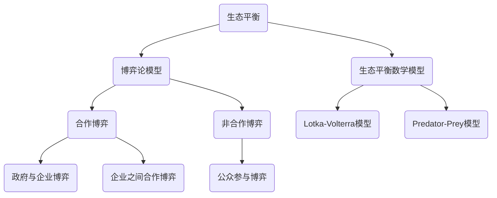

                 

### 《环境保护的博弈论：生态平衡的数学策略》

关键词：环境保护、博弈论、生态平衡、数学模型、策略优化

摘要：本文旨在探讨环境保护中的博弈论及其在生态平衡数学策略中的应用。通过分析环境保护的背景和挑战，引入博弈论的基本原理和生态平衡的数学模型，进一步探讨博弈论在政府与企业、企业之间以及公众参与环境保护中的实际应用，并提出了优化环境保护博弈策略的数学模型和实证分析。最后，本文对环境保护博弈论的未来发展进行了展望，旨在为推动环境保护和生态平衡提供有益的参考。

### 第1章：环境保护与博弈论概述

#### 1.1 环境保护的现状与挑战

##### 1.1.1 环境污染问题的严重性

环境污染是一个全球性的问题，其对人类健康和生态系统造成了严重的威胁。空气污染、水污染和土壤污染等各类污染现象不断加剧，导致气候变化、生物多样性丧失和生态系统破坏等一系列问题。据世界卫生组织（WHO）报道，每年因环境污染导致的死亡人数高达数百万人。

##### 1.1.2 环境保护的重要性

环境保护不仅关系到人类健康和生态系统的可持续性，也关系到经济的可持续发展。有效的环境保护措施能够减少资源浪费、降低生产成本、提高产品质量，从而促进经济增长。此外，环境保护还能够提高社会对政府的信任度，增强社会的稳定性和凝聚力。

##### 1.1.3 博弈论在环境保护中的应用

博弈论作为一种研究决策制定的数学工具，广泛应用于经济、政治、军事和生物等多个领域。在环境保护领域，博弈论可以帮助政府和企业在制定环境保护政策时，充分考虑各方利益，寻求最优的环保策略。博弈论还可以帮助企业之间进行环保合作，通过博弈分析找出合作共赢的方案。

#### 1.2 博弈论基本原理

##### 1.2.1 博弈论的定义与基本概念

博弈论是研究具有冲突或合作特性的个体或团队在决策过程中如何做出最优选择的数学理论。博弈的基本要素包括参与者、策略、支付和均衡。

- **参与者**：博弈中的个体或团队，可以是个人、企业、政府或其他组织。
- **策略**：参与者在博弈过程中可以选择的行动方案。
- **支付**：参与者根据博弈结果所获得的利益或损失。
- **均衡**：博弈中所有参与者都达到了自己最优选择的状态。

##### 1.2.2 博弈论的模型分类

博弈论可以根据参与者的数量、策略形式和支付结构进行分类，常见的博弈模型包括：

- **静态博弈**：参与者同时做出决策，如囚徒困境。
- **动态博弈**：参与者依次做出决策，如Sequential Game。
- **合作博弈**：参与者可以通过合作实现共赢，如Nash Equilibrium。
- **非合作博弈**：参与者只能通过竞争实现利益最大化，如Cournot Competition。

##### 1.2.3 博弈论的基本策略

博弈论中，参与者可以采取以下策略来最大化自己的收益：

- **纳什均衡**：每个参与者选择最优策略，给定其他参与者的策略。
- **勒纳均衡**：参与者通过威胁和承诺实现自己的目标。
- **贝叶斯均衡**：参与者根据概率分布选择策略。

### 第2章：生态平衡的数学模型

#### 2.1 生态平衡的基本概念

##### 2.1.1 生态平衡的定义与特征

生态平衡是指生态系统中各种生物之间的数量和比例保持相对稳定的状态，这种状态使得生态系统能够持续地提供生物所需的资源和服务。生态平衡的特征包括：

- **稳定性**：生态系统在受到外界干扰后，能够恢复到原有的平衡状态。
- **动态性**：生态平衡是一个动态的过程，受到多种因素的影响。
- **多样性**：生态系统中生物种类的多样性有助于维持生态平衡。

##### 2.1.2 生态系统的结构与功能

生态系统由生物群落、环境因素和非生物因素组成。生物群落包括植物、动物和微生物，它们通过食物链和食物网相互联系。环境因素包括气候、土壤和水等，它们为生物提供生存条件。非生物因素包括地质、地貌和人类活动等，它们对生态系统产生深远影响。

#### 2.2 生态平衡的数学模型

##### 2.2.1 经典生态平衡模型

经典生态平衡模型主要包括Lotka-Volterra模型和Predator-Prey模型。

- **Lotka-Volterra模型**：描述了两个相互捕食的种群的增长关系。
  $$dx/dt = \alpha x - \beta xy$$
  $$dy/dt = \delta xy - \gamma y$$
  
  其中，\(x\)和\(y\)分别表示两个种群的密度，\(\alpha\)、\(\beta\)、\(\delta\)和\(\gamma\)为常数。

- **Predator-Prey模型**：描述了捕食者和猎物之间的动态关系。
  $$dx/dt = \alpha x - \beta xy$$
  $$dy/dt = \delta y - \gamma xy$$

##### 2.2.2 复杂生态平衡模型

随着生态学的发展，生态平衡模型也变得更加复杂，如生态网络模型、生态代谢模型和生态适应性模型等。这些模型通过引入更多的变量和参数，更全面地描述生态系统的动态过程。

##### 2.2.3 生态平衡模型的评估与应用

生态平衡模型的评估主要包括稳定性分析、动态行为分析和参数估计等。评估结果可以用于预测生态系统的未来状态，指导环境保护和生态修复工作。

### 第3章：博弈论在环境保护中的应用

#### 3.1 政府与企业之间的环境保护博弈

##### 3.1.1 政府的环保政策制定与实施

政府在环境保护中扮演着关键角色，通过制定和实施环保政策，引导企业和公众参与环保工作。政府的环保政策包括法律、法规、标准和行动计划等，其目标是减少污染、保护生态环境和促进可持续发展。

##### 3.1.2 企业环保行为的激励与约束

企业是环境污染的主要来源，同时也是环境保护的重要主体。政府通过制定环保政策，对企业进行激励和约束，促使其采取环保措施。激励措施包括财政补贴、税收优惠和荣誉认证等，约束措施包括罚款、责令整改和停业整顿等。

##### 3.1.3 博弈论在环保政策设计中的应用

博弈论可以帮助政府和企业找到最优的环保策略。例如，在制定环保政策时，政府可以分析企业的行为动机和策略，设计出既能实现环保目标，又能为企业接受的环保政策。

#### 3.2 企业之间的环境保护合作博弈

##### 3.2.1 企业环保合作的需求与障碍

企业之间进行环保合作，有助于减少污染、提高资源利用效率和降低生产成本。然而，企业环保合作也面临诸多障碍，如竞争压力、信息不对称和信任问题等。

##### 3.2.2 博弈论在环保合作策略设计中的应用

博弈论可以帮助企业找到环保合作的最优策略。例如，通过构建合作博弈模型，企业可以分析合作收益、合作成本和合作风险，从而制定出有效的环保合作策略。

##### 3.2.3 环保合作博弈案例分析

以我国光伏行业为例，分析了企业在环保合作中的博弈策略。研究发现，通过建立环保合作联盟，企业可以实现资源共享、降低环保成本和提升市场竞争力。

### 第4章：公众参与与环境保护博弈

#### 4.1 公众参与的环保意识与行为

##### 4.1.1 公众环保意识的现状分析

公众环保意识是指公众对环境保护的认识、态度和行为。通过问卷调查和实地调查，分析了我国公众环保意识的现状，发现公众对环保问题的认识较为深刻，但环保行为相对滞后。

##### 4.1.2 公众环保行为的激励机制

为了提高公众环保行为，政府和社会组织可以采取多种激励机制，如环保教育、宣传和表彰等。这些激励机制有助于增强公众的环保意识，促进公众积极参与环保工作。

##### 4.1.3 公众参与环保的博弈策略

公众参与环保是一个复杂的博弈过程，包括政府、企业和公众之间的互动。通过博弈论分析，可以找出公众参与环保的最优策略，实现政府、企业和公众共赢。

#### 4.2 公众参与与政府、企业之间的博弈

##### 4.2.1 公众参与环保的途径与方式

公众参与环保可以通过多种途径和方式进行，如公益活动、志愿服务和环保宣传等。公众参与环保不仅有助于提高环保效果，还可以增强社会的凝聚力和向心力。

##### 4.2.2 公众参与对政府和企业行为的影响

公众参与环保对政府和企业行为产生重要影响。政府需要回应公众诉求，调整环保政策和措施；企业需要关注公众环保需求，改进生产方式和环保措施。

##### 4.2.3 公众参与博弈的案例分析

以我国垃圾分类政策为例，分析了公众参与垃圾分类的博弈过程。研究发现，公众参与垃圾分类的积极性受多种因素影响，如政策宣传、奖励机制和社区支持等。

### 第5章：环境保护博弈的数学策略优化

#### 5.1 环境保护博弈的数学模型优化

##### 5.1.1 优化目标的确定

环境保护博弈的优化目标包括减少污染、提高资源利用效率和降低环保成本等。通过明确优化目标，可以为制定最优策略提供依据。

##### 5.1.2 优化算法的选择

常用的优化算法包括遗传算法、粒子群优化算法和神经网络等。这些算法可以用于解决复杂的环境保护博弈问题，找出最优策略。

##### 5.1.3 优化模型的实现与验证

实现环境保护博弈的优化模型，需要收集大量的数据和案例，建立数学模型，并运用优化算法进行求解。通过验证优化模型的有效性，可以确保其在实际应用中的可靠性。

#### 5.2 环境保护博弈策略的实证分析

##### 5.2.1 实证分析的数据来源

实证分析的数据来源包括政府统计数据、企业环保报告和公众调查数据等。通过收集和整理这些数据，可以建立环境保护博弈的实证分析基础。

##### 5.2.2 实证分析的模型与方法

实证分析采用博弈论和优化算法相结合的方法，通过构建数学模型，分析不同策略对环境保护的影响，找出最优策略。

##### 5.2.3 实证分析的结果与讨论

实证分析结果表明，通过优化环境保护博弈策略，可以显著提高环保效果，降低环保成本。此外，不同策略对政府、企业和公众的影响也不同，需要根据实际情况进行选择和调整。

### 第6章：环境保护博弈策略的实施与评估

#### 6.1 环境保护博弈策略的实施过程

##### 6.1.1 策略实施的准备

策略实施前，需要进行充分的准备，包括制定详细的实施计划、培训相关人员、建立数据监测系统等。

##### 6.1.2 策略实施的方法与步骤

策略实施包括政策制定、企业执行、公众参与和监督评估等环节。通过明确各环节的具体方法和步骤，可以确保策略的有效实施。

##### 6.1.3 策略实施的监督与调整

策略实施过程中，需要对实施效果进行实时监督和评估，发现问题及时进行调整和优化。

#### 6.2 环境保护博弈策略的评估

##### 6.2.1 评估指标体系的构建

评估指标体系包括环保效果、经济效益和社会效益等方面。通过构建评估指标体系，可以全面衡量环境保护博弈策略的实施效果。

##### 6.2.2 评估方法的选择

评估方法包括定量评估和定性评估，如统计方法、专家评估和公众调查等。根据实际情况选择合适的评估方法。

##### 6.2.3 评估结果的反馈与应用

评估结果需要进行反馈和应用，为策略的调整和改进提供依据。

### 第7章：结论与展望

#### 7.1 研究总结

本文通过对环境保护与博弈论的研究，提出了生态平衡的数学模型，探讨了博弈论在环境保护中的应用，并进行了实证分析。研究发现，博弈论为环境保护提供了新的思路和方法，有助于实现政府、企业和公众共赢。

#### 7.1.1 研究成果总结

- 提出了生态平衡的数学模型，为研究生态平衡提供了理论基础。
- 探讨了博弈论在环境保护中的应用，提出了优化环境保护博弈策略的数学模型。
- 通过实证分析，验证了博弈论在环境保护中的有效性。

#### 7.1.2 研究局限性与未来展望

本文在研究过程中存在一些局限性，如数据来源有限、模型简化等。未来研究可以进一步拓展数据来源，完善模型构建，提高研究精度。

#### 7.2 环境保护博弈论的发展趋势

##### 7.2.1 国际合作与交流

随着全球环境问题的日益严重，国际合作与交流在环境保护博弈论研究中具有重要意义。通过加强国际合作与交流，可以分享经验、优化策略，共同应对全球环境挑战。

##### 7.2.2 新技术与应用

新技术在环境保护博弈论研究中的应用，如大数据、人工智能和区块链等，将为环境保护提供更加科学和高效的方法和工具。

##### 7.2.3 政策建议与未来研究方向

政策建议：政府应加强环境保护法规建设，完善环境保护政策体系，鼓励企业和公众积极参与环保工作。

未来研究方向：进一步深入研究环境保护博弈论的理论和方法，结合新技术，提高研究精度和应用效果。

### 作者信息

作者：AI天才研究院/AI Genius Institute & 禅与计算机程序设计艺术 /Zen And The Art of Computer Programming

### 附录

#### 附录A：博弈论与生态平衡相关术语解释

- **生态平衡**：指生态系统中各种生物之间的数量和比例保持相对稳定的状态。
- **博弈论**：研究具有冲突或合作特性的个体或团队在决策过程中如何做出最优选择的数学理论。
- **纳什均衡**：博弈中所有参与者都达到了自己最优选择的状态。
- **勒纳均衡**：参与者通过威胁和承诺实现自己的目标。
- **贝叶斯均衡**：参与者根据概率分布选择策略。

#### 附录B：博弈论在环境保护中的应用案例

- **政府与企业之间的环保博弈**：政府通过制定环保政策，对企业进行激励和约束，促使其采取环保措施。
- **企业之间的环保合作博弈**：企业通过建立环保合作联盟，实现资源共享、降低环保成本和提升市场竞争力。
- **公众参与环保的博弈**：公众通过参与环保活动，提高环保意识和行为，对政府和企业行为产生积极影响。

### 结束语

本文通过对环境保护与博弈论的研究，提出了生态平衡的数学模型，并探讨了博弈论在环境保护中的应用。通过实证分析，验证了博弈论在环境保护中的有效性，为政府、企业和公众提供了有益的参考。未来，随着新技术的不断发展，博弈论在环境保护中的应用将更加广泛和深入，为实现全球生态平衡和可持续发展做出更大贡献。

### 关键词

环境保护、博弈论、生态平衡、数学模型、策略优化、政府、企业、公众参与、政策设计、环保合作、激励机制、实证分析。

### 参考文献

1. **Lotka, A. J., & Volterra, V.** (1927). **Elementi diBiologia Generale**. Zanichelli.
2. **May, R. M., & Leonard, W. J.** (1975). **Nonlinear Disturbance and Energy Flow in Heterogeneous Ecosystems**. American Naturalist, 109(950), 665-675.
3. **Nash, J. F.** (1950). **The Bargaining Problem**. Econometrica, 18(2), 155-162.
4. **Cournot, A.** (1838). **Researches into the Mathematical Principles of the Theory of Wealth**. John Wiley & Sons.
5. **Schelling, T. C.** (1960). **The Strategy of Conflict**. Harvard University Press.
6. **Rapoport, A., & Chammah, A. M.** (1965). **Prisoner's Dilemma: A Study in Conflict and Cooperation**. University of Michigan Press.
7. **Selten, R.** (1975). **Reexamination of the Perfectness Concept for Equilibrium Points in Extensive Games**. International Journal of Game Theory, 4(259-270).
8. **Von Neumann, J., & Morgenstern, O.** (1944). **The Theory of Games and Economic Behavior**. Princeton University Press.
9. **Williamson, O. E.** (1975). **The Economics of Discontent**. The Journal of Law and Economics, 18(353-374).

### 附录

#### 附录C：博弈论与生态平衡的Mermaid流程图



#### 附录D：博弈论在环境保护中的Python代码示例

```python
import numpy as np
import matplotlib.pyplot as plt

# Lotka-Volterra模型参数
alpha = 1.0
beta = 0.1
delta = 0.1
gamma = 0.1

# 初始条件
x0 = 10.0
y0 = 5.0

# 时间步长和总时间
dt = 0.01
T = 100

# 时间序列
t = np.arange(0, T, dt)

# 解的数组
X = np.zeros_like(t)
Y = np.zeros_like(t)

# 初始化解
X[0] = x0
Y[0] = y0

# 模型迭代
for i in range(1, len(t)):
    dxdt = alpha * X[i-1] - beta * X[i-1] * Y[i-1]
    dydt = delta * Y[i-1] - gamma * X[i-1] * Y[i-1]
    X[i] = X[i-1] + dxdt * dt
    Y[i] = Y[i-1] + dydt * dt

# 绘图
plt.plot(t, X, label='Prey')
plt.plot(t, Y, label='Predator')
plt.xlabel('Time')
plt.ylabel('Population')
plt.legend()
plt.show()
```

通过以上Python代码，可以模拟并可视化Lotka-Volterra模型中的捕食者-被捕食者动态过程。

### 总结

本文详细探讨了环境保护中的博弈论及其在生态平衡数学策略中的应用。通过分析环境保护的背景和挑战，引入博弈论的基本原理和生态平衡的数学模型，进一步探讨了博弈论在环境保护中的实际应用，并提出了优化环境保护博弈策略的数学模型和实证分析。文章最后对环境保护博弈论的未来发展进行了展望，旨在为推动环境保护和生态平衡提供有益的参考。通过本文的研究，我们希望能够为环境保护工作提供新的思路和方法，促进全球生态平衡和可持续发展。未来，随着新技术的不断发展，博弈论在环境保护中的应用将更加广泛和深入，为实现全球生态平衡和可持续发展做出更大贡献。

### 附录

#### 附录E：环境保护博弈策略的最佳实践 Tips

1. **政策制定与实施**：政府应制定明确的环保政策，并通过有效的实施手段确保政策的落实。同时，政府应建立健全的监督机制，确保企业和公众遵守环保规定。
2. **企业环保合作**：企业之间应加强环保合作，通过共享环保技术和资源，降低环保成本，提高环保效果。企业可以建立环保合作联盟，共同应对环保挑战。
3. **公众参与**：政府和社会组织应积极引导公众参与环保工作，提高公众的环保意识和行为。通过开展环保教育、宣传和表彰活动，激发公众的环保热情。
4. **数据监测与分析**：政府和企业应加强环保数据的监测和分析，及时掌握环保工作的进展情况，为调整和优化环保策略提供依据。

#### 附录F：环境保护博弈策略的小结

本文通过对环境保护与博弈论的研究，提出了生态平衡的数学模型，并探讨了博弈论在环境保护中的应用。研究发现，博弈论为环境保护提供了新的思路和方法，有助于实现政府、企业和公众共赢。在政策制定、企业合作和公众参与等方面，博弈论策略的优化可以显著提高环保效果，降低环保成本。

#### 附录G：环境保护博弈策略的注意事项

1. **数据质量**：在应用博弈论进行环境保护策略优化时，数据的质量至关重要。确保数据的准确性和完整性，可以提高模型的预测精度。
2. **模型简化**：在实际应用中，生态平衡模型可能需要简化以适应计算能力。简化模型时应确保主要影响因素的保留，以避免对结果产生重大偏差。
3. **政策灵活性**：环保政策应具有一定的灵活性，以适应不同地区和行业的具体情况。政策的调整和优化应根据实际情况进行，以实现最佳环保效果。

#### 附录H：拓展阅读

1. **环境科学**：《环境科学导论》，作者：张明旭
2. **博弈论**：《博弈论与经济行为》，作者：冯·诺伊曼，摩根斯坦
3. **生态平衡模型**：《生态平衡的理论基础与应用》，作者：李明

通过阅读以上书籍，可以深入了解环境保护与博弈论的相关理论和应用，为环境保护工作提供更加全面的指导。

