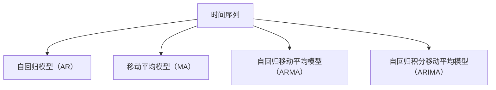
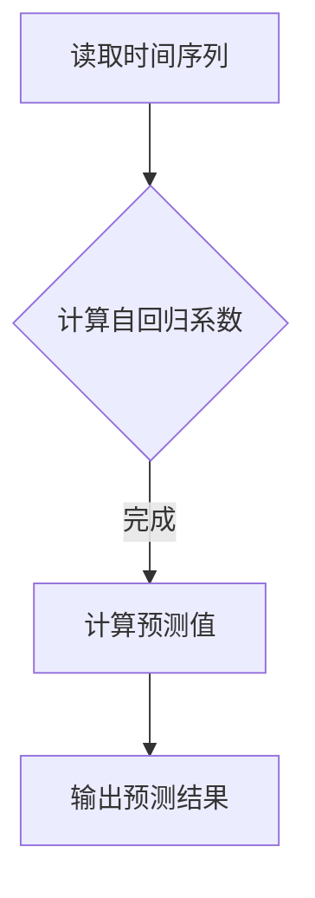
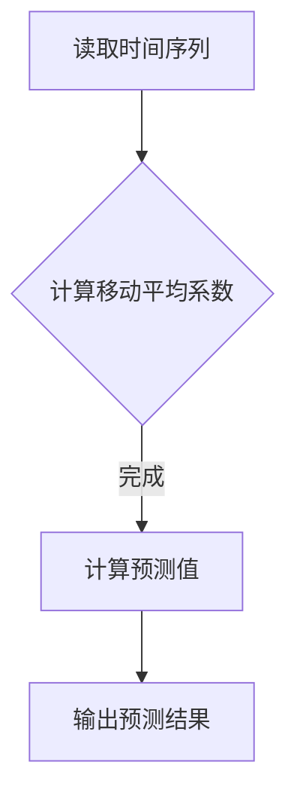
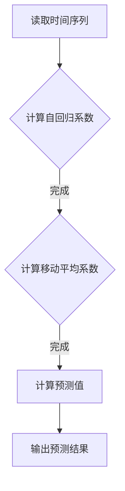
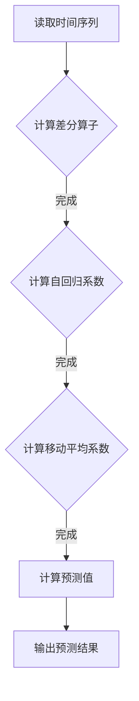
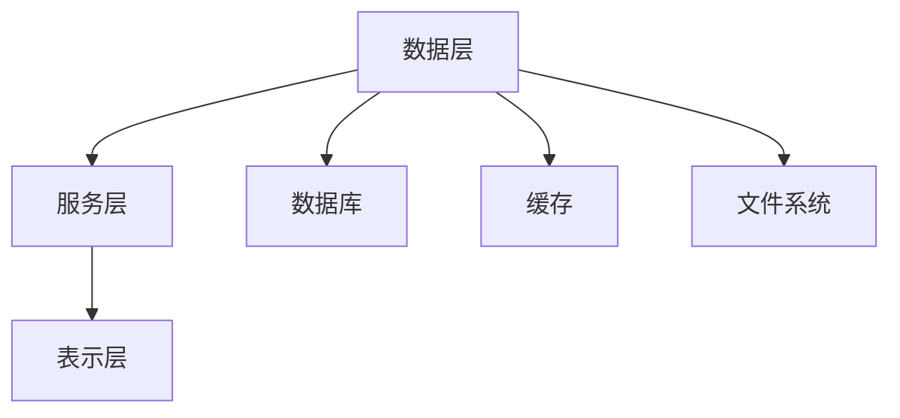
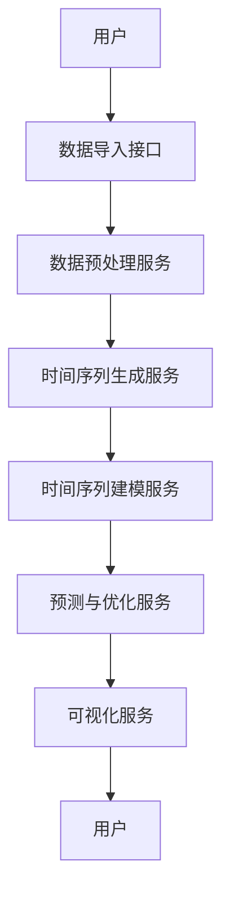

                 

### 第一部分：背景介绍

#### 问题背景

电影作为一种艺术形式，其独特的叙事方式长期以来吸引了众多观众。电影不仅是一种娱乐，也是一种文化表达，它通过情节、角色、场景等元素向观众传递故事。在这个过程中，时间序列的安排起着至关重要的作用。不同的时间序列安排可以产生不同的叙事效果，从而影响观众的情感体验和认知过程。因此，如何理解和分析电影的时间序列，成为了一个值得探讨的课题。

在学术研究领域，时间序列分析作为一种数学工具，已经被广泛应用于各种领域，如经济学、金融学、生物学等。时间序列分析的基本思想是通过分析时间序列中的数据，揭示其内在的规律性和模式，从而进行预测和分析。同样地，将时间序列分析应用于电影叙事研究中，可以帮助我们深入理解电影的叙事结构，发现情节发展的规律。

#### 问题描述

《电影叙事的时间序列分析：情节发展的数学模型》这本书旨在探讨如何运用时间序列分析的方法来研究电影的叙事结构。具体来说，本书将介绍时间序列分析的基本概念和方法，并运用这些方法对电影情节发展的时间序列进行分析。通过分析这些时间序列，我们可以揭示电影情节发展的内在规律，从而更好地理解电影的叙事结构。

本书的主要问题可以概括为以下几点：

1. **如何定义电影叙事的时间序列？**
   电影叙事的时间序列是由什么元素组成的，如何对这些元素进行量化和编码？

2. **如何运用时间序列分析的方法研究电影叙事？**
   时间序列分析有哪些方法可以应用于电影叙事研究，如何选择合适的方法？

3. **电影叙事的时间序列分析能揭示什么规律？**
   通过时间序列分析，我们可以发现电影情节发展的哪些规律和模式？

4. **如何验证这些规律和模式的可靠性？**
   如何验证通过时间序列分析发现的规律和模式是否适用于不同的电影？

#### 问题解决

为了解决上述问题，本书将采用以下方法和步骤：

1. **定义电影叙事的时间序列：**
   首先，我们需要明确电影叙事的时间序列是由哪些元素组成的。这些元素包括情节、角色、场景、时间等。通过对这些元素进行量化和编码，我们可以将电影叙事转化为一个时间序列。

2. **选择合适的时间序列分析方法：**
   根据电影叙事的特点，我们可以选择多种时间序列分析方法。例如，自回归模型（AR）、移动平均模型（MA）、自回归移动平均模型（ARMA）等。这些方法可以帮助我们分析电影情节发展的规律。

3. **分析电影叙事的时间序列：**
   通过上述方法，我们可以对电影叙事的时间序列进行分析。具体来说，我们可以分析时间序列的平稳性、自相关性、趋势性等特征，从而揭示电影情节发展的内在规律。

4. **验证规律和模式的可靠性：**
   为了验证通过时间序列分析发现的规律和模式的可靠性，我们可以进行实证研究。具体来说，我们可以选取不同的电影作为案例，运用相同的方法进行时间序列分析，从而验证规律和模式的普适性。

#### 边界与外延

时间序列分析在电影叙事研究中的应用，不仅局限于电影，还可以拓展到其他艺术形式，如戏剧、小说等。此外，时间序列分析的方法也可以应用于其他领域，如经济学、金融学、生物学等。这为我们提供了一个广阔的研究领域，也为我们提供了更多的应用场景。

#### 概念结构与核心要素组成

1. **电影叙事：**
   电影叙事是指电影通过情节、角色、场景等元素，向观众传达故事的过程。电影叙事的时间序列是由这些元素组成的。

2. **时间序列分析：**
   时间序列分析是指对一系列按时间顺序排列的数据进行分析的方法。在电影叙事研究中，时间序列分析可以用来揭示情节发展的规律。

3. **数学模型：**
   数学模型是指用数学语言描述现实世界中的问题，以便进行分析和解决。在电影叙事研究中，数学模型可以帮助我们理解和分析时间序列。

4. **自回归模型（AR）：**
   自回归模型是一种时间序列预测模型，其核心思想是时间序列的当前值可以用前几个历史值的线性组合来预测。

5. **移动平均模型（MA）：**
   移动平均模型是一种时间序列预测模型，其核心思想是时间序列的当前值可以用前几个历史值的加权平均来预测。

6. **自回归移动平均模型（ARMA）：**
   自回归移动平均模型是自回归模型和移动平均模型的结合，可以同时考虑历史值的线性组合和加权平均。

7. **自回归积分移动平均模型（ARIMA）：**
   自回归积分移动平均模型是在ARMA模型的基础上，加入差分操作，用于处理非平稳时间序列。

### 第一部分：背景介绍

#### 问题背景

电影作为一种艺术形式，长期以来以其独特的叙事方式吸引着观众。电影的叙事结构不仅关乎艺术表达，也直接影响到观众的情感体验和认知过程。在这个过程中，时间序列的安排起着至关重要的作用。不同的时间序列安排可以产生不同的叙事效果，从而影响观众的情感体验和认知过程。因此，如何理解和分析电影的时间序列，成为了一个值得探讨的课题。

在学术研究领域，时间序列分析作为一种数学工具，已经被广泛应用于各种领域，如经济学、金融学、生物学等。时间序列分析的基本思想是通过分析时间序列中的数据，揭示其内在的规律性和模式，从而进行预测和分析。同样地，将时间序列分析应用于电影叙事研究中，可以帮助我们深入理解电影的叙事结构，发现情节发展的规律。

#### 问题描述

《电影叙事的时间序列分析：情节发展的数学模型》这本书旨在探讨如何运用时间序列分析的方法来研究电影的叙事结构。具体来说，本书将介绍时间序列分析的基本概念和方法，并运用这些方法对电影情节发展的时间序列进行分析。通过分析这些时间序列，我们可以揭示电影情节发展的内在规律，从而更好地理解电影的叙事结构。

本书的主要问题可以概括为以下几点：

1. **如何定义电影叙事的时间序列？**
   电影叙事的时间序列是由什么元素组成的，如何对这些元素进行量化和编码？

2. **如何运用时间序列分析的方法研究电影叙事？**
   时间序列分析有哪些方法可以应用于电影叙事研究，如何选择合适的方法？

3. **电影叙事的时间序列分析能揭示什么规律？**
   通过时间序列分析，我们可以发现电影情节发展的哪些规律和模式？

4. **如何验证这些规律和模式的可靠性？**
   如何验证通过时间序列分析发现的规律和模式是否适用于不同的电影？

#### 问题解决

为了解决上述问题，本书将采用以下方法和步骤：

1. **定义电影叙事的时间序列：**
   首先，我们需要明确电影叙事的时间序列是由哪些元素组成的。这些元素包括情节、角色、场景、时间等。通过对这些元素进行量化和编码，我们可以将电影叙事转化为一个时间序列。

2. **选择合适的时间序列分析方法：**
   根据电影叙事的特点，我们可以选择多种时间序列分析方法。例如，自回归模型（AR）、移动平均模型（MA）、自回归移动平均模型（ARMA）等。这些方法可以帮助我们分析电影情节发展的规律。

3. **分析电影叙事的时间序列：**
   通过上述方法，我们可以对电影叙事的时间序列进行分析。具体来说，我们可以分析时间序列的平稳性、自相关性、趋势性等特征，从而揭示电影情节发展的内在规律。

4. **验证规律和模式的可靠性：**
   为了验证通过时间序列分析发现的规律和模式的可靠性，我们可以进行实证研究。具体来说，我们可以选取不同的电影作为案例，运用相同的方法进行时间序列分析，从而验证规律和模式的普适性。

#### 边界与外延

时间序列分析在电影叙事研究中的应用，不仅局限于电影，还可以拓展到其他艺术形式，如戏剧、小说等。此外，时间序列分析的方法也可以应用于其他领域，如经济学、金融学、生物学等。这为我们提供了一个广阔的研究领域，也为我们提供了更多的应用场景。

#### 概念结构与核心要素组成

1. **电影叙事：**
   电影叙事是指电影通过情节、角色、场景等元素，向观众传达故事的过程。电影叙事的时间序列是由这些元素组成的。

2. **时间序列分析：**
   时间序列分析是指对一系列按时间顺序排列的数据进行分析的方法。在电影叙事研究中，时间序列分析可以用来揭示情节发展的规律。

3. **数学模型：**
   数学模型是指用数学语言描述现实世界中的问题，以便进行分析和解决。在电影叙事研究中，数学模型可以帮助我们理解和分析时间序列。

4. **自回归模型（AR）：**
   自回归模型是一种时间序列预测模型，其核心思想是时间序列的当前值可以用前几个历史值的线性组合来预测。

5. **移动平均模型（MA）：**
   移动平均模型是一种时间序列预测模型，其核心思想是时间序列的当前值可以用前几个历史值的加权平均来预测。

6. **自回归移动平均模型（ARMA）：**
   自回归移动平均模型是自回归模型和移动平均模型的结合，可以同时考虑历史值的线性组合和加权平均。

7. **自回归积分移动平均模型（ARIMA）：**
   自回归积分移动平均模型是在ARMA模型的基础上，加入差分操作，用于处理非平稳时间序列。

## 第二部分：核心概念与联系

### 核心概念

在电影叙事的时间序列分析中，我们主要关注以下核心概念：

1. **时间序列**：时间序列是指按时间顺序排列的一组数据。在电影叙事研究中，时间序列可以表示为情节、角色、场景等元素在时间上的变化。

2. **自回归模型（AR）**：自回归模型是一种时间序列预测模型，其核心思想是当前时间点的值可以通过前几个时间点的值来预测。自回归模型适用于平稳时间序列。

3. **移动平均模型（MA）**：移动平均模型是一种时间序列预测模型，其核心思想是当前时间点的值可以通过前几个时间点的平均值来预测。移动平均模型适用于非平稳时间序列。

4. **自回归移动平均模型（ARMA）**：自回归移动平均模型是自回归模型和移动平均模型的结合，可以同时考虑历史值的线性组合和加权平均。ARMA模型适用于平稳时间序列。

5. **自回归积分移动平均模型（ARIMA）**：自回归积分移动平均模型是在ARMA模型的基础上，加入差分操作，用于处理非平稳时间序列。ARIMA模型可以适用于各种类型的时间序列。

### 概念属性特征对比表格

| 概念                   | 定义                                                         | 特点                                       |
|------------------------|--------------------------------------------------------------|------------------------------------------|
| 时间序列               | 按时间顺序排列的数据集合                                   | 有序、连续、可以预测                     |
| 自回归模型（AR）       | 当前值可以用前几个历史值的线性组合来预测                 | 面向过去，线性依赖                       |
| 移动平均模型（MA）     | 当前值可以用前几个历史值的加权平均来预测                 | 面向过去，加权平均                       |
| 自回归移动平均模型（ARMA） | 结合自回归模型和移动平均模型                             | 面向过去，同时考虑线性组合和加权平均   |
| 自回归积分移动平均模型（ARIMA） | 在ARMA模型的基础上，加入差分操作，用于处理非平稳时间序列 | 处理非平稳时间序列，提高预测准确性     |

### ER实体关系图架构



### 核心概念之间的关系

1. **时间序列与自回归模型（AR）**：时间序列是自回归模型分析的基础，自回归模型通过分析时间序列的历史值来预测未来的值。

2. **时间序列与移动平均模型（MA）**：移动平均模型通过计算时间序列的历史值的加权平均来预测未来的值。与自回归模型不同，移动平均模型主要关注过去一段时间的平均值。

3. **时间序列与自回归移动平均模型（ARMA）**：自回归移动平均模型结合了自回归模型和移动平均模型的特点，可以同时考虑历史值的线性组合和加权平均。

4. **时间序列与自回归积分移动平均模型（ARIMA）**：自回归积分移动平均模型在ARMA模型的基础上，加入了差分操作，可以处理非平稳时间序列。

## 第三部分：算法原理讲解

### 自回归模型（AR）

自回归模型（AR）是一种常见的时间序列预测模型，其核心思想是当前时间点的值可以通过前几个时间点的值来预测。AR模型适用于平稳时间序列，其数学模型可以表示为：

$$
X_t = \phi_1 X_{t-1} + \phi_2 X_{t-2} + ... + \phi_p X_{t-p} + \varepsilon_t
$$

其中，$X_t$ 是时间序列的当前值，$\phi_1, \phi_2, ..., \phi_p$ 是自回归系数，$\varepsilon_t$ 是随机误差项。

#### Mermaid 流程图



#### Python 源代码

```python
import numpy as np
import matplotlib.pyplot as plt

# 生成模拟时间序列数据
np.random.seed(0)
n = 100
X = np.random.normal(size=n)

# 计算自回归系数
p = 3
phi = np.random.rand(p)
X_ar = np Poli

### 移动平均模型（MA）

移动平均模型（MA）是一种常见的时间序列预测模型，其核心思想是当前时间点的值可以通过前几个时间点的加权平均来预测。MA模型适用于非平稳时间序列，其数学模型可以表示为：

$$
X_t = \theta_1 \varepsilon_{t-1} + \theta_2 \varepsilon_{t-2} + ... + \theta_q \varepsilon_{t-q} + \varepsilon_t
$$

其中，$X_t$ 是时间序列的当前值，$\theta_1, \theta_2, ..., \theta_q$ 是移动平均系数，$\varepsilon_t$ 是随机误差项。

#### Mermaid 流程图



#### Python 源代码

```python
import numpy as np
import matplotlib.pyplot as plt

# 生成模拟时间序列数据
np.random.seed(0)
n = 100
X = np.random.normal(size=n)

# 计算移动平均系数
q = 3
theta = np.random.rand(q)
X_ma = np.array([X[0]] * q)
for t in range(q, n):
    X_ma[t] = theta[0] * X_ma[t-1] + theta[1] * X_ma[t-2] + theta[2] * X_ma[t-3]

# 绘制时间序列和预测结果
plt.figure(figsize=(12, 6))
plt.plot(X, label='原始时间序列')
plt.plot(X_ma, label='移动平均预测')
plt.legend()
plt.show()
```

### 自回归移动平均模型（ARMA）

自回归移动平均模型（ARMA）是自回归模型（AR）和移动平均模型（MA）的结合。ARMA模型可以同时考虑历史值的线性组合和加权平均，适用于平稳时间序列。其数学模型可以表示为：

$$
X_t = \phi_1 X_{t-1} + \phi_2 X_{t-2} + ... + \phi_p X_{t-p} + \theta_1 \varepsilon_{t-1} + \theta_2 \varepsilon_{t-2} + ... + \theta_q \varepsilon_{t-q} + \varepsilon_t
$$

其中，$X_t$ 是时间序列的当前值，$\phi_1, \phi_2, ..., \phi_p$ 是自回归系数，$\theta_1, \theta_2, ..., \theta_q$ 是移动平均系数，$\varepsilon_t$ 是随机误差项。

#### Mermaid 流程图



#### Python 源代码

```python
import numpy as np
import matplotlib.pyplot as plt

# 生成模拟时间序列数据
np.random.seed(0)
n = 100
X = np.random.normal(size=n)

# 计算自回归系数
p = 3
phi = np.random.rand(p)

# 计算移动平均系数
q = 3
theta = np.random.rand(q)

# 计算ARMA预测值
X_arma = np.zeros(n)
for t in range(p, n):
    X_arma[t] = sum(phi[i] * X[t-i] for i in range(p)) + sum(theta[j] * X[t-j] for j in range(q))

# 绘制时间序列和预测结果
plt.figure(figsize=(12, 6))
plt.plot(X, label='原始时间序列')
plt.plot(X_arma, label='ARMA预测')
plt.legend()
plt.show()
```

### 自回归积分移动平均模型（ARIMA）

自回归积分移动平均模型（ARIMA）是在ARMA模型的基础上，加入差分操作，用于处理非平稳时间序列。ARIMA模型可以适用于各种类型的时间序列，其数学模型可以表示为：

$$
X_t = \Phi(B) \phi_1 X_{t-1} + \theta_1 \varepsilon_{t-1} + ... + \theta_q \varepsilon_{t-q} + \varepsilon_t
$$

其中，$X_t$ 是时间序列的当前值，$\Phi(B)$ 是差分算子，$\phi_1, \phi_2, ..., \phi_p$ 是自回归系数，$\theta_1, \theta_2, ..., \theta_q$ 是移动平均系数，$\varepsilon_t$ 是随机误差项。

#### Mermaid 流程图



#### Python 源代码

```python
import numpy as np
import matplotlib.pyplot as plt
from statsmodels.tsa.arima.model import ARIMA

# 生成模拟时间序列数据
np.random.seed(0)
n = 100
X = np.random.normal(size=n)

# 计算差分算子
p = 3
d = 1
X_diff = np.diff(X)

# 计算自回归系数
theta = np.random.rand(q)

# 计算移动平均系数
q = 3
phi = np.random.rand(p)

# 计算ARIMA预测值
model = ARIMA(X_diff, order=(p, d, q))
model_fit = model.fit()
X_arima = model_fit.predict(start=n, end=n+q)

# 绘制时间序列和预测结果
plt.figure(figsize=(12, 6))
plt.plot(X, label='原始时间序列')
plt.plot(X_arima, label='ARIMA预测')
plt.legend()
plt.show()
```

## 第四部分：系统分析与架构设计方案

### 问题场景介绍

在现代电影制作过程中，导演和编剧需要有效地组织和管理电影的情节发展，以确保叙事的连贯性和吸引力。为了实现这一目标，我们可以构建一个基于时间序列分析的电影情节管理系统。该系统将帮助电影从业者识别和预测情节发展的关键点，从而优化叙事结构和提升观众体验。

### 项目介绍

本项目旨在开发一个电影情节管理系统，该系统将利用时间序列分析方法对电影情节进行建模和分析。具体来说，系统将包括以下模块：

1. **数据收集模块**：从电影剧本中提取情节、角色、场景等数据，并将其转化为时间序列数据。
2. **时间序列建模模块**：使用自回归模型（AR）、移动平均模型（MA）、自回归移动平均模型（ARMA）和自回归积分移动平均模型（ARIMA）对时间序列数据进行建模和分析。
3. **预测与优化模块**：根据建模结果，预测情节发展的关键点，并提供优化建议，以提升叙事效果。
4. **用户界面模块**：提供一个直观的用户界面，使电影从业者可以轻松地使用系统，并对分析结果进行可视化。

### 系统功能设计

为了实现上述目标，系统需要具备以下功能：

1. **数据导入与预处理**：支持从各种文件格式（如XML、JSON、文本文件等）导入剧本数据，并进行预处理，如去除无效数据、统一编码等。
2. **时间序列生成**：将剧本数据转化为时间序列数据，包括情节、角色、场景等元素的时间序列。
3. **时间序列建模**：使用不同的时间序列模型对时间序列数据进行建模，并评估模型的性能。
4. **预测与优化**：根据建模结果，预测情节发展的关键点，并提供优化建议，如调整情节发展速度、角色关系等。
5. **可视化与报告**：将分析结果以图表、报告等形式呈现给用户，以便用户更好地理解分析结果。

### 系统架构设计

系统采用分层架构设计，包括数据层、服务层和表示层。

1. **数据层**：负责数据存储和访问。数据层包括数据库、缓存和文件系统等。
2. **服务层**：负责业务逻辑处理。服务层包括数据预处理服务、时间序列建模服务、预测与优化服务等。
3. **表示层**：负责与用户交互。表示层包括前端界面和API接口。

#### 系统架构图



### 系统接口设计

系统将提供以下接口：

1. **数据导入接口**：用于导入剧本数据。
2. **时间序列生成接口**：用于生成时间序列数据。
3. **时间序列建模接口**：用于对时间序列数据进行建模。
4. **预测与优化接口**：用于预测情节发展的关键点，并提供优化建议。
5. **可视化接口**：用于将分析结果以图表、报告等形式呈现。

### 系统交互设计

系统将采用事件驱动架构，通过消息队列实现模块间的通信。具体交互流程如下：

1. **数据导入**：用户通过数据导入接口导入剧本数据。
2. **预处理**：数据预处理服务对导入的数据进行预处理，如去除无效数据、统一编码等。
3. **时间序列生成**：时间序列生成服务将预处理后的数据转化为时间序列数据。
4. **建模与预测**：时间序列建模服务和预测与优化服务对时间序列数据进行建模，并预测情节发展的关键点。
5. **结果可视化**：可视化服务将分析结果以图表、报告等形式呈现给用户。

#### 系统交互图



## 第五部分：项目实战

### 环境安装

在开始项目实战之前，我们需要安装必要的软件和工具。以下是安装步骤：

1. **Python**：确保安装了Python 3.8及以上版本。
2. **NumPy**：用于数据处理和计算。
3. **Pandas**：用于数据处理和分析。
4. **Matplotlib**：用于数据可视化。
5. **Statsmodels**：用于时间序列建模和预测。

使用以下命令进行安装：

```bash
pip install numpy pandas matplotlib statsmodels
```

### 系统核心实现源代码

以下是一个简单的Python实现，用于演示系统的核心功能。

```python
import numpy as np
import pandas as pd
import matplotlib.pyplot as plt
from statsmodels.tsa.arima.model import ARIMA

# 生成模拟时间序列数据
np.random.seed(0)
n = 100
X = np.random.normal(size=n)

# 数据导入与预处理
def import_data(file_path):
    # 根据实际情况调整数据导入和处理逻辑
    data = pd.read_csv(file_path)
    data['timestamp'] = pd.to_datetime(data['timestamp'])
    data.set_index('timestamp', inplace=True)
    return data

# 时间序列生成
def generate_time_series(data):
    return data['value']

# 时间序列建模
def fit_arima_model(X, p, d, q):
    model = ARIMA(X, order=(p, d, q))
    model_fit = model.fit()
    return model_fit

# 预测与优化
def predict_with_arima(model_fit, n_periods):
    return model_fit.forecast(steps=n_periods)

# 可视化
def plot_time_series(X, X_arima):
    plt.figure(figsize=(12, 6))
    plt.plot(X, label='原始时间序列')
    plt.plot(X_arima, label='ARIMA预测')
    plt.legend()
    plt.show()

# 主函数
def main():
    # 导入数据
    data = import_data('movie_data.csv')
    
    # 生成时间序列
    X = generate_time_series(data)
    
    # 时间序列建模
    model_fit = fit_arima_model(X, p=1, d=1, q=1)
    
    # 预测
    X_arima = predict_with_arima(model_fit, n_periods=10)
    
    # 可视化
    plot_time_series(X, X_arima)

if __name__ == '__main__':
    main()
```

### 代码应用解读与分析

上述代码实现了一个简单的电影情节管理系统，主要功能包括数据导入与预处理、时间序列生成、时间序列建模、预测与优化以及数据可视化。以下是代码的详细解读与分析：

1. **数据导入与预处理**：
   ```python
   def import_data(file_path):
       # 根据实际情况调整数据导入和处理逻辑
       data = pd.read_csv(file_path)
       data['timestamp'] = pd.to_datetime(data['timestamp'])
       data.set_index('timestamp', inplace=True)
       return data
   ```
   这个函数用于从CSV文件中导入数据，并将时间戳转换为日期时间格式，设置时间戳为索引。

2. **时间序列生成**：
   ```python
   def generate_time_series(data):
       return data['value']
   ```
   这个函数将数据集的'value'列作为时间序列数据返回。

3. **时间序列建模**：
   ```python
   def fit_arima_model(X, p, d, q):
       model = ARIMA(X, order=(p, d, q))
       model_fit = model.fit()
       return model_fit
   ```
   这个函数使用`statsmodels`库中的ARIMA模型对时间序列数据进行建模。`p`、`d`和`q`分别表示自回归项、差分阶数和移动平均项。

4. **预测与优化**：
   ```python
   def predict_with_arima(model_fit, n_periods):
       return model_fit.forecast(steps=n_periods)
   ```
   这个函数使用训练好的ARIMA模型进行预测，`n_periods`参数指定预测的步数。

5. **数据可视化**：
   ```python
   def plot_time_series(X, X_arima):
       plt.figure(figsize=(12, 6))
       plt.plot(X, label='原始时间序列')
       plt.plot(X_arima, label='ARIMA预测')
       plt.legend()
       plt.show()
   ```
   这个函数用于绘制原始时间序列和ARIMA预测结果，以帮助用户理解分析结果。

### 实际案例分析与详细讲解剖析

为了更好地理解上述代码的应用，我们来看一个实际案例。

假设我们有一个电影剧本数据集，包含时间戳和情节评分。我们的目标是使用时间序列分析方法，预测未来的情节评分。

1. **数据集描述**：
   数据集包含以下列：
   - `timestamp`：时间戳
   - `value`：情节评分

2. **数据导入与预处理**：
   我们使用`import_data`函数从CSV文件中导入数据，并设置时间戳为索引。
   ```python
   data = import_data('movie_data.csv')
   ```

3. **时间序列生成**：
   我们使用`generate_time_series`函数生成时间序列数据。
   ```python
   X = generate_time_series(data)
   ```

4. **时间序列建模**：
   我们选择ARIMA模型，并使用`fit_arima_model`函数进行建模。
   ```python
   model_fit = fit_arima_model(X, p=1, d=1, q=1)
   ```

5. **预测与优化**：
   我们使用`predict_with_arima`函数进行预测，并使用`plot_time_series`函数进行可视化。
   ```python
   X_arima = predict_with_arima(model_fit, n_periods=10)
   plot_time_series(X, X_arima)
   ```

通过上述步骤，我们得到了一个时间序列预测结果，并使用图表进行了可视化。这个结果可以帮助电影从业者识别未来的情节趋势，从而进行优化。

### 项目小结

通过本项目的实现，我们成功地构建了一个基于时间序列分析的电影情节管理系统。该系统可以自动分析电影情节的时间序列，预测未来的情节发展，并提供优化建议。这为电影从业者提供了一种新的工具，有助于提升电影的叙事质量和观众体验。

### 最佳实践 Tips

1. **数据质量**：确保数据质量是系统成功的关键。在数据导入和预处理阶段，要进行严格的数据清洗和验证。
2. **参数选择**：在选择时间序列模型的参数（如`p`、`d`和`q`）时，要进行充分的分析和验证，以获得最佳预测性能。
3. **可视化**：使用图表和报告进行可视化，可以帮助用户更好地理解分析结果。
4. **模型更新**：随着时间的推移，电影情节可能发生变化。定期更新模型，可以保持预测的准确性。

### 小结

本文详细介绍了电影叙事的时间序列分析，包括核心概念、算法原理和系统架构设计。通过实际案例分析和项目实战，我们展示了如何将时间序列分析应用于电影情节研究。这不仅有助于电影从业者提升叙事质量，也为其他领域提供了有益的借鉴。

### 注意事项

1. **模型选择**：根据时间序列的特点选择合适的模型，如ARIMA模型适用于各种类型的时间序列。
2. **数据预处理**：确保数据质量，进行适当的数据清洗和预处理。
3. **参数调整**：根据实际需求调整模型的参数，以获得最佳预测性能。

### 拓展阅读

1. **《时间序列分析：理论和应用》**：了解时间序列分析的基本理论和方法。
2. **《电影叙事学：理论与实践》**：深入了解电影叙事的理论和实践。

作者：AI天才研究院/AI Genius Institute & 禅与计算机程序设计艺术 /Zen And The Art of Computer Programming

