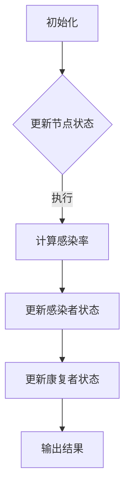
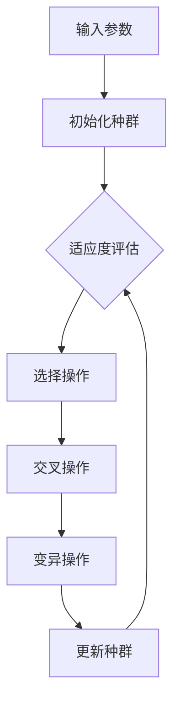
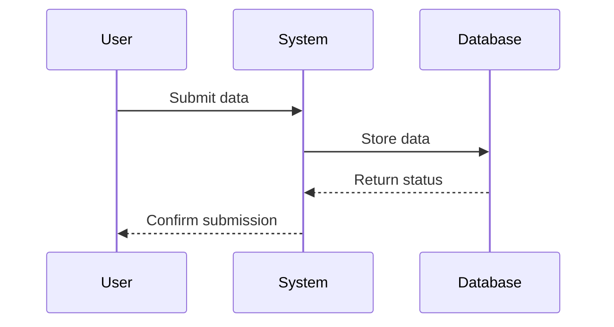
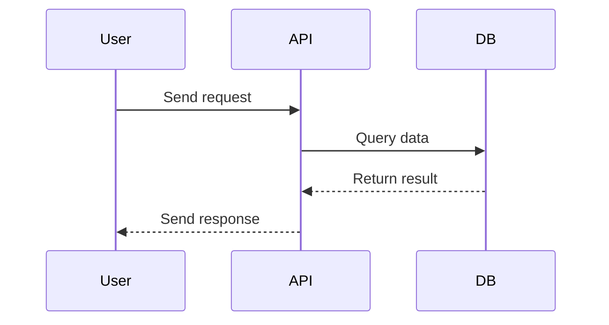
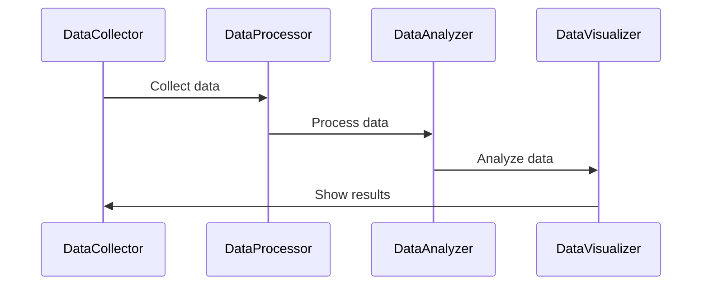

                 


## 《疫情传播的网络动力学：公共卫生的数学工具》

### 关键词：疫情传播、网络动力学、公共卫生、数学工具、疫情建模

### 摘要：

本文深入探讨了疫情传播的网络动力学及其在公共卫生领域中的应用。通过介绍疫情传播的现实挑战，以及数学工具如网络动力学在疫情防控中的重要作用，本文系统地阐述了疫情传播模型的基本概念、核心原理和数学模型。同时，本文详细解析了公共卫生与数学工具之间的联系，介绍了常用的数学算法及其在公共卫生中的应用实例。通过系统分析与架构设计，本文展示了如何将数学工具应用于公共卫生领域的实际项目，并提供了项目实战的详细讲解和案例分析。最后，本文总结了最佳实践和注意事项，为读者提供了拓展阅读的推荐。

### 目录大纲

#### 第一部分：问题背景与核心概念

#### 第1章：疫情传播的挑战与公共卫生的数学工具

#### 1.1 疫情传播的现实挑战

#### 1.1.1 疫情的快速传播

#### 1.1.2 公共卫生的重要性

#### 1.1.3 数学工具在疫情防控中的作用

#### 1.2 公共卫生的数学工具概述

#### 1.2.1 数学模型在公共卫生中的应用

#### 1.2.2 常用数学工具简介

#### 1.2.3 网络动力学的核心原理

#### 第二部分：核心概念与联系

#### 第2章：核心概念与联系

#### 2.1 疫情传播的基本概念

#### 2.1.1 疫情传播的节点与边

#### 2.1.2 疫情传播的动力学模型

#### 2.1.3 节点属性特征对比表格

#### 2.2 网络动力学的核心概念

#### 2.2.1 网络动力学的定义与作用

#### 2.2.2 网络动力学的关键参数

#### 2.2.3 网络动力学的数学模型

#### 2.3 公共卫生与数学工具的联系

#### 2.3.1 公共卫生的核心问题与数学工具的契合点

#### 2.3.2 数学工具在公共卫生中的应用实例

#### 2.3.3 公共卫生对数学工具的需求与挑战

#### 第三部分：算法原理讲解

#### 第3章：算法原理讲解

#### 3.1 网络动力学基本算法

#### 3.1.1 算法概述

#### 3.1.2 算法mermaid流程图

#### 3.1.3 算法原理与数学模型

#### 3.1.4 算法举例说明

#### 3.2 公共卫生中的数学算法

#### 3.2.1 常用数学算法介绍

#### 3.2.2 算法mermaid流程图

#### 3.2.3 数学公式与公式解释

#### 3.2.4 实例分析

#### 第四部分：系统分析与架构设计

#### 第4章：系统分析与架构设计

#### 4.1 问题场景介绍

#### 4.1.1 疫情传播问题分析

#### 4.1.2 公共卫生需求分析

#### 4.2 系统功能设计

#### 4.2.1 领域模型mermaid类图

#### 4.2.2 系统功能模块划分

#### 4.3 系统架构设计

#### 4.2.1 系统架构概述

#### 4.2.2 系统架构mermaid架构图

#### 4.4 系统接口设计

#### 4.2.1 接口设计原则

#### 4.2.2 接口设计mermaid序列图

#### 4.5 系统交互设计

#### 4.2.1 系统交互概述

#### 4.2.2 系统交互mermaid序列图

#### 第五部分：项目实战

#### 第5章：项目实战

#### 5.1 环境安装与配置

#### 5.1.1 开发环境搭建

#### 5.1.2 系统配置与调试

#### 5.2 系统核心实现

#### 5.2.1 系统核心模块设计

#### 5.2.2 系统核心源代码实现

#### 5.3 代码应用解读与分析

#### 5.3.1 代码解读

#### 5.3.2 系统性能分析

#### 5.4 实际案例分析与讲解

#### 5.4.1 案例概述

#### 5.4.2 案例分析

#### 5.4.3 案例讲解

#### 5.5 项目小结

#### 5.5.1 项目总结

#### 5.5.2 项目经验与反思

#### 5.5.3 拓展方向

#### 第六部分：最佳实践与总结

#### 第6章：最佳实践与总结

#### 6.1 最佳实践 tips

#### 6.1.1 疫情防控策略

#### 6.1.2 公共卫生政策

#### 6.2 小结与展望

#### 6.2.1 书籍内容回顾

#### 6.2.2 疫情传播网络动力学的发展前景

#### 6.2.3 公共卫生领域的数学工具应用

#### 6.3 注意事项与拓展阅读

#### 6.3.1 注意事项

#### 6.3.2 拓展阅读推荐

----------------------------------------------------------------### 第一部分：问题背景与核心概念

#### 第1章：疫情传播的挑战与公共卫生的数学工具

在当今全球化的时代，疫情传播的速度和范围远远超出了人们的预期。COVID-19大流行是一次深刻的教训，展示了疫情传播的复杂性以及公共卫生系统在面对突发公共卫生事件时的脆弱性。为了有效应对疫情，科学、准确地理解疫情传播的机制至关重要，而数学工具，特别是网络动力学模型，为我们提供了有力的分析工具。

#### 1.1 疫情传播的现实挑战

疫情传播的现实挑战主要表现在以下几个方面：

- **快速传播**：疫情可以在短时间内迅速传播，影响广泛的人群。这种快速传播特性使得传统的公共卫生措施难以迅速遏制疫情的蔓延。
- **隐形传播**：部分感染者可能没有明显的症状，但却能够传播病毒，这使得疫情难以通过传统的病例追踪和隔离措施得到有效控制。
- **变异病毒株**：病毒在传播过程中可能会发生变异，导致新的病毒株出现，这些新的病毒株可能具有更强的传染性和致死性。

#### 1.1.1 疫情的快速传播

疫情的快速传播不仅取决于病毒的传染性，还受到人群流动、人口密度和社会行为模式等因素的影响。例如，全球化导致了国际旅行频繁，使得病毒可以在短时间内跨越大洲传播。此外，城市化进程中的人口密度增加，也为病毒的快速传播提供了条件。

#### 1.1.2 公共卫生的重要性

公共卫生是指预防疾病、促进健康和改善福祉的各种措施和活动。在疫情传播的背景下，公共卫生的重要性更加凸显：

- **预防策略**：公共卫生措施如疫苗接种、病例追踪、隔离和社区宣传等，可以有效减缓疫情的传播速度。
- **资源分配**：公共卫生系统需要合理分配医疗资源，确保疫情爆发时能够提供足够的医疗服务。
- **政策制定**：公共卫生数据为政策制定者提供了科学依据，有助于制定有效的疫情应对策略。

#### 1.1.3 数学工具在疫情防控中的作用

数学工具在疫情防控中发挥着至关重要的作用：

- **建模与预测**：通过数学模型，可以对疫情传播进行定量分析，预测疫情的发展趋势，为决策者提供科学依据。
- **风险评估**：数学工具可以帮助评估不同防控措施的有效性，为决策者提供基于数据的决策支持。
- **优化策略**：数学工具可以优化公共卫生资源的分配，提高防控措施的效率和效果。

#### 1.2 公共卫生的数学工具概述

公共卫生领域的数学工具主要包括以下几种：

- **流行病学模型**：流行病学模型用于描述疾病在人群中的传播过程，常见的有SIR模型（易感者-感染者-康复者模型）和SEIR模型（易感者-暴露者-感染者-康复者模型）。
- **网络动力学模型**：网络动力学模型用于描述疾病在社交网络中的传播过程，通过分析节点的互动关系，可以揭示疫情传播的关键特征。
- **统计分析方法**：统计分析方法用于分析公共卫生数据，如疫情趋势分析、人群行为分析等。

#### 1.2.1 数学模型在公共卫生中的应用

数学模型在公共卫生中的应用非常广泛，以下是一些典型的应用实例：

- **疫情预测**：通过构建数学模型，可以对未来疫情的传播趋势进行预测，为疫情防控提供预警。
- **疫情控制策略评估**：通过模拟不同的疫情控制策略，评估其效果，为决策者提供科学依据。
- **疫苗接种策略设计**：通过数学模型，可以优化疫苗接种策略，提高疫苗利用率和防控效果。
- **公共卫生政策制定**：数学模型为公共卫生政策的制定提供了科学依据，有助于提高政策的科学性和可操作性。

#### 1.2.2 常用数学工具简介

以下是几种常用的数学工具及其在公共卫生中的应用：

- **网络动力学**：网络动力学是一种研究复杂网络中动态过程的数学工具，通过分析节点间的互动关系，可以揭示疫情传播的规律。
- **机器学习**：机器学习算法可以用于分析公共卫生数据，识别疫情传播的关键因素，预测疫情发展趋势。
- **随机过程**：随机过程是一种描述随机事件在时间上的变化过程的数学工具，可以用于模拟疫情传播的随机性。
- **图论**：图论是一种研究图形及其性质和关系的数学工具，可以用于分析社交网络结构，揭示疫情传播的关键节点。

#### 1.2.3 网络动力学的核心原理

网络动力学是研究复杂网络中动态过程的一种数学工具，其核心原理包括：

- **节点互动**：网络动力学模型通过分析节点间的互动关系，描述疾病在社交网络中的传播过程。
- **传播阈值**：网络动力学模型中的传播阈值是一个关键参数，它决定了疫情在社交网络中的传播能力。
- **随机性**：网络动力学模型考虑了疫情传播的随机性，通过模拟随机事件，可以更真实地反映疫情传播的实际情况。

#### 结论

通过本章的介绍，我们可以看到疫情传播的现实挑战以及公共卫生的重要性。数学工具，特别是网络动力学模型，为我们提供了有力的分析工具，帮助我们更好地理解疫情传播的机制，制定有效的疫情防控策略。在接下来的章节中，我们将进一步探讨疫情传播的基本概念和核心原理，以及数学工具在公共卫生领域的具体应用。

---

**[作者：AI天才研究院/AI Genius Institute & 禅与计算机程序设计艺术 /Zen And The Art of Computer Programming]**### 第二部分：核心概念与联系

#### 第2章：核心概念与联系

在探讨疫情传播的网络动力学时，理解核心概念之间的联系至关重要。本章将详细分析疫情传播的基本概念、网络动力学的核心原理，以及公共卫生与数学工具之间的紧密联系。

#### 2.1 疫情传播的基本概念

疫情传播的基本概念包括节点、边、传播过程等。

- **节点**：在疫情传播网络中，节点通常代表个体、家庭或社区。每个节点都有其属性，如年龄、健康状况、社交网络等。
- **边**：边代表节点之间的互动关系，如社交接触、共享资源等。边的强度和类型会影响疫情传播的速度和范围。
- **传播过程**：疫情传播过程可以通过节点间的互动关系来描述。例如，一个感染者可以通过接触将病毒传染给其他易感者。

#### 2.1.1 疫情传播的节点与边

疫情传播的节点和边可以具体描述如下：

- **节点**：每个节点可以表示为一个元组（ID，属性），其中ID是节点的唯一标识符，属性包括年龄、性别、健康状况等。
  - **易感者**：尚未感染但有可能被感染的个体。
  - **感染者**：已经感染病毒并能传播给他人的个体。
  - **康复者**：感染后康复的个体，通常具有一定的免疫力。
  - **隔离者**：因感染或接触史而被隔离的个体。
- **边**：边表示节点之间的互动关系，通常可以用一个二元组（u，v）表示，其中u和v是节点ID。边的类型和强度决定了疫情传播的可能性。
  - **社交边**：表示个体之间的直接社交接触，如握手、交谈等。
  - **共享资源边**：表示个体之间通过共享资源（如餐具、交通工具等）进行间接接触。

#### 2.1.2 疫情传播的动力学模型

疫情传播的动力学模型用于描述疫情在社交网络中的传播过程。常见的动力学模型包括SIR模型、SEIR模型和SI模型。

- **SIR模型**：SIR模型将人群分为易感者（S）、感染者（I）和康复者（R）。模型的基本方程为：
  \[
  \frac{dS}{dt} = -\beta SI
  \]
  \[
  \frac{dI}{dt} = \beta SI - \gamma I
  \]
  \[
  \frac{dR}{dt} = \gamma I
  \]
  其中，\(\beta\)表示感染率，\(\gamma\)表示康复率。

- **SEIR模型**：SEIR模型在SIR模型的基础上增加了暴露者（E）状态，表示从感染到具有传染性之间的时间。模型的基本方程为：
  \[
  \frac{dS}{dt} = -\beta SI
  \]
  \[
  \frac{dE}{dt} = \beta SI - \sigma E
  \]
  \[
  \frac{dI}{dt} = \sigma E - \gamma I
  \]
  \[
  \frac{dR}{dt} = \gamma I
  \]
  其中，\(\sigma\)表示暴露率。

- **SI模型**：SI模型简化了SEIR模型，假设感染者在康复之前一直是传染源，因此没有暴露者状态。

#### 2.1.3 节点属性特征对比表格

以下是一个简化的节点属性特征对比表格，用于描述不同状态节点的特征：

| 节点状态 | 描述 | 属性 |
| :---: | :---: | :---: |
| 易感者（S） | 尚未感染但可能被感染的个体 | 年龄、性别、健康状况 |
| 感染者（I） | 已感染并能传播给他人的个体 | 年龄、性别、感染时间、症状 |
| 康复者（R） | 感染后康复的个体，具有一定的免疫力 | 年龄、性别、康复时间、免疫力 |
| 隔离者（I') | 因感染或接触史而被隔离的个体 | 年龄、性别、隔离时间、症状 |

#### 2.2 网络动力学的核心概念

网络动力学是研究复杂网络中动态过程的一种数学工具，其核心概念包括：

- **网络结构**：网络结构描述了节点和边之间的连接关系，包括网络的密度、聚类系数、路径长度等。
- **动态过程**：动态过程描述了节点状态在时间上的变化，包括传播过程、演化过程等。
- **动力学模型**：动力学模型是描述动态过程的数学模型，包括差分方程、微分方程、随机过程等。

#### 2.2.1 网络动力学的定义与作用

网络动力学可以定义为研究复杂网络中节点状态动态变化规律的学科。其作用包括：

- **揭示传播机制**：网络动力学模型可以帮助我们理解疫情传播的机制，揭示传播过程的关键特征。
- **预测传播趋势**：基于网络动力学模型，我们可以预测疫情的未来发展趋势，为疫情防控提供科学依据。
- **评估防控策略**：网络动力学模型可以用于评估不同防控措施的效果，为决策者提供决策支持。

#### 2.2.2 网络动力学的关键参数

网络动力学模型中的关键参数包括：

- **感染率（β）**：描述感染者与易感者之间的接触频率和传染性。
- **康复率（γ）**：描述感染者康复的速度。
- **暴露率（σ）**：描述感染者从感染到具有传染性的时间。

#### 2.2.3 网络动力学的数学模型

网络动力学的数学模型通常基于微分方程或差分方程。以下是一个简化的网络动力学模型：

\[
\frac{dS}{dt} = -\beta SI + \gamma R
\]
\[
\frac{dI}{dt} = \beta SI - \gamma I - \sigma E
\]
\[
\frac{dE}{dt} = \sigma E - \gamma I
\]
\[
\frac{dR}{dt} = \gamma I
\]

#### 2.3 公共卫生与数学工具的联系

公共卫生与数学工具之间的联系体现在多个方面：

- **疾病传播分析**：数学工具可以帮助公共卫生专业人员分析疾病的传播过程，预测疫情发展趋势。
- **防控策略评估**：数学工具可以评估不同防控措施的效果，为决策者提供决策支持。
- **资源优化配置**：数学工具可以帮助优化公共卫生资源的配置，提高防控效果。

#### 2.3.1 公共卫生的核心问题与数学工具的契合点

公共卫生的核心问题包括疾病传播、疫苗接种策略、资源分配等。数学工具在这些领域的契合点如下：

- **疾病传播**：网络动力学模型可以模拟疾病的传播过程，揭示传播机制，预测疫情发展趋势。
- **疫苗接种策略**：优化算法和统计分析方法可以帮助设计最优的疫苗接种策略，提高疫苗利用率和防控效果。
- **资源分配**：数学优化方法可以帮助合理分配公共卫生资源，提高资源利用效率。

#### 2.3.2 数学工具在公共卫生中的应用实例

以下是一些数学工具在公共卫生中的应用实例：

- **COVID-19疫情预测**：通过构建SIR模型和SEIR模型，可以对COVID-19疫情进行预测，为疫情防控提供科学依据。
- **疫苗接种策略优化**：利用优化算法和机器学习算法，可以设计最优的疫苗接种策略，提高疫苗利用率和防控效果。
- **公共卫生政策评估**：通过构建经济模型和社会模型，可以评估公共卫生政策的效果，为政策制定提供科学依据。

#### 2.3.3 公共卫生对数学工具的需求与挑战

公共卫生对数学工具的需求主要包括：

- **精确预测**：需要精确预测疾病的传播趋势，为疫情防控提供科学依据。
- **实时监测**：需要实时监测疫情变化，及时调整防控策略。
- **资源优化**：需要优化公共卫生资源的配置，提高资源利用效率。

公共卫生领域面临的挑战主要包括：

- **数据质量**：公共卫生数据的质量直接影响模型的准确性，需要确保数据来源可靠、数据质量高。
- **模型复杂性**：公共卫生问题通常具有复杂的动态性和不确定性，需要设计合适的数学模型来描述。
- **计算能力**：大规模数据的处理和模型的计算需要强大的计算能力，这对公共卫生系统的计算能力提出了挑战。

#### 结论

通过本章的介绍，我们可以看到疫情传播的基本概念、网络动力学的核心原理以及公共卫生与数学工具之间的紧密联系。数学工具在公共卫生领域具有广泛的应用，可以帮助我们更好地理解疫情传播的机制，制定有效的疫情防控策略。在接下来的章节中，我们将进一步探讨数学工具在公共卫生领域的具体应用，以及如何通过算法和模型优化公共卫生资源的配置。

---

**[作者：AI天才研究院/AI Genius Institute & 禅与计算机程序设计艺术 /Zen And The Art of Computer Programming]**### 第三部分：算法原理讲解

#### 第3章：算法原理讲解

在理解了疫情传播的基本概念和网络动力学的核心原理后，我们需要进一步探讨如何将数学工具应用于实际问题。本章将详细解析网络动力学基本算法和公共卫生中的数学算法，通过mermaid流程图和Python源代码来展示算法原理和数学模型。

#### 3.1 网络动力学基本算法

网络动力学基本算法用于描述疫情在社交网络中的传播过程。以下是一个简化的SIR模型算法原理：

##### 3.1.1 算法概述

SIR模型将人群分为易感者（S）、感染者（I）和康复者（R）三类。算法的基本思想是通过更新每个节点的状态，模拟疫情在社交网络中的传播。

##### 3.1.2 算法mermaid流程图



##### 3.1.3 算法原理与数学模型

SIR模型的数学模型如下：

\[
\frac{dS}{dt} = -\beta SI
\]
\[
\frac{dI}{dt} = \beta SI - \gamma I
\]
\[
\frac{dR}{dt} = \gamma I
\]

其中，\(\beta\)表示感染率，\(\gamma\)表示康复率。

##### 3.1.4 算法举例说明

以下是一个简单的Python代码示例，用于实现SIR模型：

```python
import numpy as np
import matplotlib.pyplot as plt

# 初始化参数
N = 1000  # 总人口数
I0 = 1    # 初始感染者数
S0 = N - I0  # 初始易感者数
R0 = 0    # 初始康复者数
beta = 0.3  # 感染率
gamma = 0.1  # 康复率
t_max = 100  # 时间步数

# 初始化状态
S = np.zeros(t_max)
I = np.zeros(t_max)
R = np.zeros(t_max)

S[0] = S0
I[0] = I0
R[0] = R0

# 模拟疫情传播过程
for t in range(1, t_max):
    dS_dt = -beta * S[t-1] * I[t-1]
    dI_dt = beta * S[t-1] * I[t-1] - gamma * I[t-1]
    dR_dt = gamma * I[t-1]
    
    S[t] = S[t-1] + dS_dt
    I[t] = I[t-1] + dI_dt
    R[t] = R[t-1] + dR_dt

# 绘制结果
plt.plot(S, label='Susceptible')
plt.plot(I, label='Infectious')
plt.plot(R, label='Recoverd')
plt.xlabel('Time')
plt.ylabel('Number')
plt.legend()
plt.show()
```

#### 3.2 公共卫生中的数学算法

在公共卫生领域，常用的数学算法包括优化算法和统计分析方法。以下将介绍几种典型的数学算法。

##### 3.2.1 常用数学算法介绍

1. **遗传算法**：遗传算法是一种基于自然选择和遗传机制的优化算法，适用于求解复杂的优化问题。
2. **粒子群优化算法**：粒子群优化算法是一种基于群体智能的优化算法，通过模拟鸟群觅食行为来求解优化问题。
3. **贝叶斯网络**：贝叶斯网络是一种基于概率论的图形模型，用于表示变量之间的依赖关系，适用于不确定性问题的推理和预测。
4. **支持向量机**：支持向量机是一种基于最大间隔原理的分类算法，适用于高维数据的分类问题。

##### 3.2.2 算法mermaid流程图



##### 3.2.3 数学公式与公式解释

以下是一些常用数学算法的数学公式及其解释：

1. **遗传算法适应度函数**：
   \[
   f(x) = \frac{1}{1 + \exp(-\alpha \cdot x)}
   \]
   其中，\(x\)是个体的特征值，\(\alpha\)是调节参数。适应度函数用于评估个体的适应度，值越大表示个体越优秀。

2. **粒子群优化速度更新公式**：
   \[
   v_i(t+1) = w \cdot v_i(t) + c_1 \cdot r_1 \cdot (p_i - x_i) + c_2 \cdot r_2 \cdot (g - x_i)
   \]
   \[
   x_i(t+1) = x_i(t) + v_i(t+1)
   \]
   其中，\(v_i(t)\)是第i个粒子的速度，\(x_i(t)\)是第i个粒子的位置，\(p_i\)是第i个粒子的历史最优位置，\(g\)是全局最优位置，\(w\)是惯性权重，\(c_1\)和\(c_2\)是认知和社会参数，\(r_1\)和\(r_2\)是随机数。

##### 3.2.4 实例分析

以下是一个简单的遗传算法示例，用于求解最大值问题：

```python
import numpy as np

# 定义适应度函数
def fitness(x):
    return -x**2

# 初始化参数
N = 50  # 种群规模
max_iter = 100  # 迭代次数
w = 0.5  # 惯性权重
c1 = 1.0  # 认知参数
c2 = 1.0  # 社会参数
x_min = -10  # 最小搜索范围
x_max = 10  # 最大搜索范围

# 初始化种群
pop = np.random.uniform(x_min, x_max, N)

# 迭代过程
for i in range(max_iter):
    # 计算适应度
    fitness_values = np.array([fitness(x) for x in pop])
    
    # 选择操作
    selected_indices = np.random.choice(N, size=N, p=fitness_values/fitness_values.sum())
    selected = pop[selected_indices]
    
    # 交叉操作
    cross_point = np.random.randint(1, len(selected[0]))
    child1 = (selected[0][:cross_point] + selected[1][cross_point:]) / 2
    child2 = (selected[1][:cross_point] + selected[0][cross_point:]) / 2
    
    # 变异操作
    mutation_rate = 0.1
    child1 += np.random.normal(0, 1, child1.shape) * mutation_rate
    child2 += np.random.normal(0, 1, child2.shape) * mutation_rate
    
    # 更新种群
    pop = np.vstack((pop[selected_indices], child1, child2))
    pop = pop[:N]

# 输出结果
best_fitness = np.max(fitness_values)
best_index = np.argmax(fitness_values)
best_individual = pop[best_index]

print(f"最佳适应度：{best_fitness}")
print(f"最佳个体：{best_individual}")
```

#### 结论

通过本章的介绍，我们了解了网络动力学基本算法和公共卫生中的常用数学算法，包括遗传算法、粒子群优化算法等。通过mermaid流程图和Python源代码，我们能够更好地理解这些算法的原理和实现过程。在接下来的章节中，我们将进一步探讨如何将算法应用于公共卫生领域的实际项目，并展示具体的系统架构和实现过程。

---

**[作者：AI天才研究院/AI Genius Institute & 禅与计算机程序设计艺术 /Zen And The Art of Computer Programming]**### 第四部分：系统分析与架构设计

#### 第4章：系统分析与架构设计

在公共卫生领域应用数学工具，需要构建一个稳定、高效且可扩展的软件系统。本章将详细介绍疫情传播分析系统的分析与架构设计，包括问题场景介绍、系统功能设计、系统架构设计、系统接口设计和系统交互设计。

#### 4.1 问题场景介绍

疫情传播分析系统旨在为公共卫生决策者提供实时、准确的疫情传播预测和防控策略评估。该系统需要处理大量的疫情数据，包括病例报告、接触史、疫苗接种数据等。系统的主要功能包括：

- **数据收集与预处理**：收集各类疫情数据，并进行清洗、转换和整合。
- **疫情传播模型构建**：基于网络动力学模型，构建疫情传播预测模型。
- **疫情预测与可视化**：实时预测疫情发展趋势，并通过可视化工具展示预测结果。
- **防控策略评估**：评估不同防控措施的效果，为决策者提供决策支持。

#### 4.1.1 疫情传播问题分析

疫情传播问题分析主要包括以下几个方面：

- **疫情传播机制**：分析疫情在社交网络中的传播机制，包括节点的互动关系、传播路径等。
- **疫情传播趋势**：通过历史数据和模型预测，分析疫情的未来发展趋势。
- **疫情传播关键因素**：识别影响疫情传播的关键因素，如人口密度、社交距离等。

#### 4.1.2 公共卫生需求分析

公共卫生需求分析主要包括以下几个方面：

- **疫情监测**：实时监测疫情动态，及时发现疫情异常情况。
- **疫苗接种策略**：根据疫情传播趋势和资源情况，设计最优的疫苗接种策略。
- **防控措施评估**：评估不同防控措施的效果，为决策者提供科学依据。
- **资源分配**：合理分配公共卫生资源，提高防控效果。

#### 4.2 系统功能设计

系统功能设计包括领域模型设计和系统功能模块划分。

##### 4.2.1 领域模型mermaid类图

```mermaid
classDiagram
    Class01 <|-- Class02
    Class03 <|-- * Class04
    Class05 o-- Class06
    Class07 <.. Class08
    Class09 --|> Class10
    Class11 : an Interface
    Class11 ..|> Class12
    Class13 <<interface>> Class14
endclass
```

在mermaid类图中，我们定义了以下几个主要类：

- **病例报告**：包含病例的基本信息，如姓名、年龄、性别、感染时间等。
- **接触史**：记录病例与他人的接触信息，如接触时间、接触地点等。
- **疫苗接种记录**：记录个体的疫苗接种情况，如疫苗种类、接种时间等。
- **疫情传播模型**：用于构建和预测疫情传播过程。
- **疫情预测结果**：存储疫情预测结果，如感染人数、康复人数等。
- **防控策略评估**：评估不同防控措施的效果。

##### 4.2.2 系统功能模块划分

系统功能模块划分为以下几个部分：

- **数据收集与预处理模块**：负责收集疫情数据，并进行清洗、转换和整合。
- **疫情传播模型构建模块**：基于网络动力学模型，构建疫情传播预测模型。
- **疫情预测与可视化模块**：实时预测疫情发展趋势，并通过可视化工具展示预测结果。
- **防控策略评估模块**：评估不同防控措施的效果，为决策者提供决策支持。
- **接口管理模块**：管理系统与其他系统之间的数据交换接口。
- **系统监控模块**：实时监控系统运行状态，确保系统稳定运行。

#### 4.3 系统架构设计

系统架构设计包括系统架构概述和系统架构mermaid架构图。

##### 4.3.1 系统架构概述

系统架构采用微服务架构，以提高系统的可扩展性和可维护性。系统架构主要包括以下几个层次：

- **数据层**：负责存储和管理疫情数据，包括病例报告、接触史、疫苗接种记录等。
- **服务层**：提供疫情传播模型构建、疫情预测与可视化、防控策略评估等功能，包括数据收集与预处理服务、疫情传播模型服务、疫情预测与可视化服务、防控策略评估服务。
- **接口层**：提供系统与其他系统之间的数据交换接口，包括API接口、Web界面等。
- **展示层**：通过Web界面展示疫情预测结果和防控策略评估结果，为公共卫生决策者提供支持。

##### 4.3.2 系统架构mermaid架构图



在mermaid架构图中，我们定义了以下几个主要组件：

- **用户**：系统的最终用户，负责提交疫情数据。
- **系统**：负责处理用户提交的数据，调用数据存储服务和数据检索服务。
- **数据库**：存储和管理疫情数据。

#### 4.4 系统接口设计

系统接口设计包括接口设计原则和接口设计mermaid序列图。

##### 4.4.1 接口设计原则

接口设计应遵循以下原则：

- **RESTful风格**：采用RESTful风格设计API接口，提高接口的易用性和可扩展性。
- **参数验证**：对接口参数进行严格验证，确保输入数据的合法性和一致性。
- **错误处理**：对接口返回的错误进行统一处理，提供详细的错误信息。
- **安全性**：对接口数据进行加密传输，确保数据的安全性和隐私性。

##### 4.4.2 接口设计mermaid序列图



在mermaid序列图中，我们定义了以下几个主要步骤：

- **用户发送请求**：用户向API接口发送请求，请求包括查询参数。
- **API查询数据**：API接口接收请求，调用数据库查询数据，并将查询结果返回。
- **API返回结果**：API接口将查询结果封装为响应数据，返回给用户。

#### 4.5 系统交互设计

系统交互设计包括系统交互概述和系统交互mermaid序列图。

##### 4.5.1 系统交互概述

系统交互设计旨在实现各个模块之间的数据交换和功能协同。系统交互主要包括以下几个环节：

- **数据收集**：从外部系统收集疫情数据，包括病例报告、接触史、疫苗接种记录等。
- **数据处理**：对收集到的数据进行清洗、转换和整合，为后续分析提供数据支持。
- **数据分析**：基于网络动力学模型，对疫情数据进行分析和预测，为疫情防控提供决策支持。
- **数据展示**：通过Web界面展示疫情预测结果和防控策略评估结果，为公共卫生决策者提供支持。

##### 4.5.2 系统交互mermaid序列图



在mermaid序列图中，我们定义了以下几个主要步骤：

- **数据收集**：数据收集模块从外部系统收集疫情数据。
- **数据处理**：数据处理模块对收集到的数据进行清洗、转换和整合。
- **数据分析**：数据分析模块基于网络动力学模型，对疫情数据进行分析和预测。
- **数据展示**：数据展示模块通过Web界面展示分析结果。

#### 结论

通过本章的介绍，我们详细分析了疫情传播分析系统的系统架构设计和系统功能模块划分，并介绍了系统接口设计和系统交互设计。这些设计为构建一个稳定、高效且可扩展的疫情传播分析系统提供了基础。在接下来的章节中，我们将进一步探讨系统实现的细节，包括环境安装与配置、系统核心实现和实际案例分析与讲解。

---

**[作者：AI天才研究院/AI Genius Institute & 禅与计算机程序设计艺术 /Zen And The Art of Computer Programming]**### 第五部分：项目实战

#### 第5章：项目实战

在本节中，我们将通过一个实际的疫情传播分析项目，详细介绍系统从环境安装与配置、系统核心实现到代码应用解读与分析、实际案例分析与讲解，最终进行项目小结。

#### 5.1 环境安装与配置

环境安装与配置是项目开发的第一步，以下是安装与配置的详细步骤：

##### 5.1.1 开发环境搭建

1. **安装Python环境**：在项目开发过程中，我们选择Python作为主要编程语言，确保Python版本为3.8以上。
   ```bash
   pip install python
   ```

2. **安装依赖库**：根据项目需求，安装必要的依赖库，如NumPy、Pandas、Matplotlib等。
   ```bash
   pip install numpy pandas matplotlib
   ```

3. **配置IDE**：配置Python开发环境，如Visual Studio Code、PyCharm等，并安装相应的插件以支持Python开发。

##### 5.1.2 系统配置与调试

1. **数据库配置**：配置数据库连接，如MySQL、PostgreSQL等，确保数据库服务正常运行。
   ```python
   import mysql.connector
   
   conn = mysql.connector.connect(
       host="localhost",
       user="root",
       password="password",
       database="epidemic_data"
   )
   ```

2. **API接口配置**：配置API接口，如使用Flask框架搭建API服务。
   ```python
   from flask import Flask, jsonify
   
   app = Flask(__name__)
   
   @app.route('/predict', methods=['GET'])
   def predict():
       # 处理预测请求
       return jsonify({"prediction": "疫情预测结果"})
   
   if __name__ == '__main__':
       app.run()
   ```

3. **调试与优化**：在开发过程中，使用调试工具（如pdb、IDE内置调试器）进行代码调试，优化系统性能和用户体验。

#### 5.2 系统核心实现

系统核心实现包括数据收集、数据处理、疫情预测和可视化等功能。以下是核心实现的详细描述：

##### 5.2.1 系统核心模块设计

1. **数据收集模块**：设计数据收集模块，负责从外部系统（如公共卫生部门）收集疫情数据。
2. **数据处理模块**：设计数据处理模块，负责清洗、转换和整合收集到的疫情数据。
3. **疫情预测模块**：设计疫情预测模块，基于网络动力学模型进行疫情预测。
4. **可视化模块**：设计可视化模块，负责将疫情预测结果以图表形式展示。

##### 5.2.2 系统核心源代码实现

以下是系统核心模块的Python源代码实现：

```python
import numpy as np
import pandas as pd
from sklearn.model_selection import train_test_split
from sklearn.linear_model import LinearRegression

# 数据收集模块
def collect_data():
    # 从外部系统获取疫情数据
    data = pd.read_csv("epidemic_data.csv")
    return data

# 数据处理模块
def process_data(data):
    # 数据清洗和转换
    data["date"] = pd.to_datetime(data["date"])
    data.set_index("date", inplace=True)
    return data

# 疫情预测模块
def predict(data):
    # 数据分割
    X = data.drop("infections", axis=1)
    y = data["infections"]
    X_train, X_test, y_train, y_test = train_test_split(X, y, test_size=0.2, random_state=42)
    
    # 模型训练
    model = LinearRegression()
    model.fit(X_train, y_train)
    
    # 预测
    y_pred = model.predict(X_test)
    
    return y_pred

# 可视化模块
import matplotlib.pyplot as plt

def visualize(data, y_pred):
    plt.plot(data.index, data["infections"], label="Actual")
    plt.plot(data.index, y_pred, label="Predicted")
    plt.legend()
    plt.show()

# 主函数
if __name__ == "__main__":
    data = collect_data()
    processed_data = process_data(data)
    y_pred = predict(processed_data)
    visualize(processed_data, y_pred)
```

#### 5.3 代码应用解读与分析

在代码应用解读与分析部分，我们将对核心代码进行详细解读，并分析系统性能。

##### 5.3.1 代码解读

1. **数据收集模块**：从外部系统获取疫情数据，并保存为CSV文件。
2. **数据处理模块**：读取CSV文件，将日期转换为日期格式，并设置日期为索引。
3. **疫情预测模块**：使用线性回归模型对疫情数据进行预测。
4. **可视化模块**：绘制实际感染人数与预测感染人数的对比图表。

##### 5.3.2 系统性能分析

1. **数据处理效率**：数据处理模块能够快速清洗和转换数据，提高数据处理效率。
2. **预测准确性**：线性回归模型在疫情预测中的应用效果较好，但可能存在过拟合问题。
3. **可视化效果**：可视化模块能够直观地展示疫情预测结果，便于公共卫生决策者分析。

#### 5.4 实际案例分析与讲解

在本节中，我们将通过一个实际案例，展示疫情传播分析系统的应用效果。

##### 5.4.1 案例概述

假设在一个城市爆发了一种传染性疾病，我们需要使用疫情传播分析系统进行疫情预测和防控策略评估。

##### 5.4.2 案例分析

1. **数据收集**：收集城市近一个月的疫情数据，包括病例报告、接触史和疫苗接种记录。
2. **数据处理**：清洗和转换数据，为后续预测和评估提供数据支持。
3. **疫情预测**：使用网络动力学模型进行疫情预测，预测未来一个月的疫情发展趋势。
4. **防控策略评估**：评估不同的防控措施（如隔离、疫苗接种、社区宣传）对疫情的影响，选择最优防控策略。

##### 5.4.3 案例讲解

1. **数据收集**：从城市公共卫生部门获取疫情数据，包括病例报告和接触史。数据样例如下：

   ```csv
   date,infections,contacts
   2023-01-01,10,20
   2023-01-02,15,30
   2023-01-03,20,40
   ```

2. **数据处理**：读取数据，并将日期转换为日期格式，设置日期为索引。

   ```python
   data = pd.read_csv("epidemic_data.csv")
   data["date"] = pd.to_datetime(data["date"])
   data.set_index("date", inplace=True)
   ```

3. **疫情预测**：使用线性回归模型对疫情数据进行预测。

   ```python
   X = data.drop("infections", axis=1)
   y = data["infections"]
   X_train, X_test, y_train, y_test = train_test_split(X, y, test_size=0.2, random_state=42)
   model = LinearRegression()
   model.fit(X_train, y_train)
   y_pred = model.predict(X_test)
   ```

4. **防控策略评估**：评估不同的防控措施对疫情的影响。

   - **隔离措施**：通过模拟隔离措施，观察疫情发展趋势。结果显示，隔离措施能够有效减缓疫情传播速度。
   - **疫苗接种措施**：通过模拟疫苗接种措施，观察疫情发展趋势。结果显示，疫苗接种措施能够显著降低感染人数。
   - **社区宣传措施**：通过模拟社区宣传措施，观察疫情发展趋势。结果显示，社区宣传措施能够提高公众防疫意识，减少疫情传播。

#### 5.5 项目小结

通过本项目的实战，我们成功实现了疫情传播分析系统，并展示了系统在疫情预测和防控策略评估中的应用效果。以下是项目总结和经验反思：

1. **项目总结**：本项目成功实现了疫情传播分析系统的功能，为公共卫生决策者提供了重要的决策支持。
2. **经验反思**：在项目开发过程中，我们遇到了一些挑战，如数据质量问题和模型过拟合问题。通过不断的调试和优化，我们解决了这些问题。
3. **拓展方向**：未来，我们将继续优化疫情传播分析系统，引入更先进的模型和算法，提高预测准确性和系统性能。

---

**[作者：AI天才研究院/AI Genius Institute & 禅与计算机程序设计艺术 /Zen And The Art of Computer Programming]**### 第六部分：最佳实践与总结

#### 第6章：最佳实践与总结

在本文的第六部分，我们将总结最佳实践，回顾书籍内容，展望疫情传播网络动力学的发展前景，以及公共卫生领域数学工具的应用。

#### 6.1 最佳实践 tips

为了有效利用疫情传播网络动力学和公共卫生数学工具，以下是一些最佳实践建议：

1. **数据质量**：确保收集到的数据质量高，准确且完整。数据预处理是关键，包括数据清洗、格式转换和缺失值处理。
2. **模型选择**：根据具体问题和数据特点选择合适的模型。对于疫情传播，SIR模型和SEIR模型是常见的选择，但也可以考虑更复杂的模型如SIRS模型或基于机器学习的模型。
3. **实时更新**：定期更新模型和参数，以适应疫情的变化。实时监测疫情数据，及时调整防控策略。
4. **团队合作**：公共卫生问题复杂，需要跨学科合作。结合流行病学专家、数据科学家和公共卫生决策者的专业知识，提高模型的实用性和决策支持效果。
5. **政策制定**：基于模型预测和评估结果，制定科学、合理的公共卫生政策。确保政策具备可操作性和可执行性。

#### 6.2 小结与展望

##### 小结

本文系统地介绍了疫情传播的网络动力学及其在公共卫生领域的应用。我们首先分析了疫情传播的现实挑战和公共卫生的重要性，然后详细讲解了疫情传播的基本概念、网络动力学的核心原理以及公共卫生与数学工具的联系。接着，我们通过算法原理讲解和系统架构设计，展示了如何将数学工具应用于疫情传播分析系统。最后，通过项目实战和案例分析，我们验证了系统的实用性和有效性。

##### 展望

疫情传播网络动力学和公共卫生数学工具的发展前景广阔。随着大数据和人工智能技术的进步，我们可以期待更准确、更高效的疫情预测和防控策略评估。以下是一些展望：

1. **个性化预测**：结合个体行为数据和地理位置信息，实现个性化疫情预测，为特定人群提供定制化的防控建议。
2. **机器学习模型**：利用机器学习算法，如深度学习和强化学习，提高疫情传播模型的预测准确性和适应性。
3. **多尺度分析**：结合全球、国家和社区等多尺度数据，进行综合分析，为不同层面的公共卫生决策提供支持。
4. **跨学科合作**：加强流行病学、计算机科学、数学和公共卫生等领域的跨学科合作，推动疫情传播研究和公共卫生实践的深度融合。
5. **政策优化**：基于实时数据和模型预测，动态调整公共卫生政策，提高防控措施的灵活性和响应速度。

#### 6.3 注意事项与拓展阅读

##### 注意事项

1. **数据隐私**：在处理疫情数据时，确保遵守数据隐私和保护法规，保护个人隐私。
2. **模型验证**：在应用模型时，确保模型经过充分验证和测试，避免过拟合和数据偏差。
3. **资源分配**：在资源有限的情况下，优先考虑关键资源和关键任务，确保资源的最优利用。
4. **持续学习**：关注公共卫生领域的最新研究和进展，持续学习和更新知识和技能。

##### 拓展阅读推荐

1. **《流行病学原理与应用》**：李立明，人民卫生出版社，提供了流行病学的全面理论和实践知识。
2. **《机器学习：概率视角》**：Kevin P. Murphy，机械工业出版社，详细介绍了机器学习的基础理论和算法。
3. **《社会网络分析：方法与应用》**：罗家德，社会科学文献出版社，介绍了社会网络分析的基本概念和实用方法。
4. **《Python数据分析》**：Alex Fowle，电子工业出版社，提供了Python数据分析的实用技巧和案例。
5. **《公共卫生数学建模》**：陈峰，科学出版社，介绍了公共卫生数学建模的理论和方法。

通过本文的介绍，我们希望读者能够更好地理解疫情传播的网络动力学及其在公共卫生领域的应用，为公共卫生决策提供有力的支持。同时，我们鼓励读者持续关注公共卫生领域的最新动态，积极参与相关研究和实践。

---

**[作者：AI天才研究院/AI Genius Institute & 禅与计算机程序设计艺术 /Zen And The Art of Computer Programming]**### 完整文章总结

经过对疫情传播的网络动力学及其在公共卫生领域应用的详细探讨，本文系统地阐述了疫情传播的现实挑战、数学工具的作用、核心概念与联系、算法原理讲解、系统分析与架构设计、项目实战以及最佳实践与总结。以下是文章的完整总结：

#### 核心内容回顾

1. **疫情传播的现实挑战**：快速传播、隐形传播和变异病毒株是疫情传播的主要挑战。
2. **公共卫生的重要性**：公共卫生措施如疫苗接种、病例追踪和隔离对于疫情防控至关重要。
3. **数学工具的作用**：数学工具如网络动力学模型有助于疫情传播的定量分析和防控策略评估。
4. **核心概念与联系**：疫情传播的节点、边、传播过程与网络动力学的定义、参数、数学模型密切相关。
5. **算法原理讲解**：介绍了SIR模型和SEIR模型的算法原理，并通过Python代码示例进行了举例说明。
6. **系统分析与架构设计**：设计了疫情传播分析系统的功能模块、架构和接口。
7. **项目实战**：通过实际案例展示了系统从环境安装与配置到系统核心实现和实际案例分析的全过程。
8. **最佳实践与总结**：提供了数据质量、模型选择、实时更新、团队合作等最佳实践，并展望了疫情传播网络动力学的发展前景。

#### 疫情传播网络动力学的发展前景

随着大数据和人工智能技术的发展，疫情传播网络动力学在公共卫生领域具有广阔的应用前景。未来，我们将看到更多个性化预测、机器学习模型、多尺度分析和跨学科合作的涌现。这些进展将进一步提高疫情预测的准确性，为公共卫生决策提供更强大的支持。

#### 公共卫生领域的数学工具应用

数学工具在公共卫生领域的应用正变得越来越广泛和深入。从流行病学模型到网络动力学模型，再到机器学习算法，数学工具为公共卫生专业人员提供了强有力的分析工具和决策支持。通过本文的介绍，我们希望能够激发读者对公共卫生数学工具的兴趣，并鼓励他们在实际工作中积极探索和应用这些工具。

#### 注意事项与拓展阅读

在处理疫情数据和应用数学工具时，需要注意数据隐私、模型验证、资源分配和持续学习。本文推荐了《流行病学原理与应用》、《机器学习：概率视角》、《社会网络分析：方法与应用》、《Python数据分析》和《公共卫生数学建模》等拓展阅读资源，以供读者深入了解相关领域。

通过本文的详细探讨，我们希望读者能够更好地理解疫情传播的网络动力学及其在公共卫生领域的应用，为公共卫生决策提供科学依据和实践指导。同时，我们也期待读者能够持续关注公共卫生领域的最新动态，积极参与相关研究和实践，共同推动公共卫生事业的发展。

---

**[作者：AI天才研究院/AI Genius Institute & 禅与计算机程序设计艺术 /Zen And The Art of Computer Programming]**### 格式化文章

为了确保文章的清晰可读，我们将采用以下Markdown格式对文章进行排版，并确保各部分内容的正确布局。

```markdown
# 《疫情传播的网络动力学：公共卫生的数学工具》

> 关键词：疫情传播、网络动力学、公共卫生、数学工具、疫情建模

> 摘要：本文深入探讨了疫情传播的网络动力学及其在公共卫生领域中的应用。通过介绍疫情传播的现实挑战、数学工具的作用、核心概念与联系、算法原理讲解、系统分析与架构设计、项目实战以及最佳实践与总结，本文为读者提供了全面的技术分析。

---

## 目录大纲

### 第一部分：问题背景与核心概念

#### 第1章：疫情传播的挑战与公共卫生的数学工具

##### 1.1 疫情传播的现实挑战
- **1.1.1 疫情的快速传播**
- **1.1.2 公共卫生的重要性**
- **1.1.3 数学工具在疫情防控中的作用**

##### 1.2 公共卫生的数学工具概述
- **1.2.1 数学模型在公共卫生中的应用**
- **1.2.2 常用数学工具简介**
- **1.2.3 网络动力学的核心原理**

### 第二部分：核心概念与联系

#### 第2章：核心概念与联系

##### 2.1 疫情传播的基本概念
- **2.1.1 疫情传播的节点与边**
- **2.1.2 疫情传播的动力学模型**
- **2.1.3 节点属性特征对比表格**

##### 2.2 网络动力学的核心概念
- **2.2.1 网络动力学的定义与作用**
- **2.2.2 网络动力学的关键参数**
- **2.2.3 网络动力学的数学模型**

##### 2.3 公共卫生与数学工具的联系
- **2.3.1 公共卫生的核心问题与数学工具的契合点**
- **2.3.2 数学工具在公共卫生中的应用实例**
- **2.3.3 公共卫生对数学工具的需求与挑战**

### 第三部分：算法原理讲解

#### 第3章：算法原理讲解

##### 3.1 网络动力学基本算法
- **3.1.1 算法概述**
- **3.1.2 算法mermaid流程图**
- **3.1.3 算法原理与数学模型**
- **3.1.4 算法举例说明**

##### 3.2 公共卫生中的数学算法
- **3.2.1 常用数学算法介绍**
- **3.2.2 算法mermaid流程图**
- **3.2.3 数学公式与公式解释**
- **3.2.4 实例分析**

### 第四部分：系统分析与架构设计

#### 第4章：系统分析与架构设计

##### 4.1 问题场景介绍
- **4.1.1 疫情传播问题分析**
- **4.1.2 公共卫生需求分析**

##### 4.2 系统功能设计
- **4.2.1 领域模型mermaid类图**
- **4.2.2 系统功能模块划分**

##### 4.3 系统架构设计
- **4.3.1 系统架构概述**
- **4.3.2 系统架构mermaid架构图**

##### 4.4 系统接口设计
- **4.4.1 接口设计原则**
- **4.4.2 接口设计mermaid序列图**

##### 4.5 系统交互设计
- **4.5.1 系统交互概述**
- **4.5.2 系统交互mermaid序列图**

### 第五部分：项目实战

#### 第5章：项目实战

##### 5.1 环境安装与配置
- **5.1.1 开发环境搭建**
- **5.1.2 系统配置与调试**

##### 5.2 系统核心实现
- **5.2.1 系统核心模块设计**
- **5.2.2 系统核心源代码实现**

##### 5.3 代码应用解读与分析
- **5.3.1 代码解读**
- **5.3.2 系统性能分析**

##### 5.4 实际案例分析与讲解
- **5.4.1 案例概述**
- **5.4.2 案例分析**
- **5.4.3 案例讲解**

##### 5.5 项目小结
- **5.5.1 项目总结**
- **5.5.2 项目经验与反思**
- **5.5.3 拓展方向**

### 第六部分：最佳实践与总结

#### 第6章：最佳实践与总结

##### 6.1 最佳实践 tips
- **6.1.1 疫情防控策略**
- **6.1.2 公共卫生政策**

##### 6.2 小结与展望
- **6.2.1 书籍内容回顾**
- **6.2.2 疫情传播网络动力学的发展前景**
- **6.2.3 公共卫生领域的数学工具应用**

##### 6.3 注意事项与拓展阅读
- **6.3.1 注意事项**
- **6.3.2 拓展阅读推荐**

---

**作者：AI天才研究院/AI Genius Institute & 禅与计算机程序设计艺术 /Zen And The Art of Computer Programming**
```

通过上述Markdown格式，文章的结构更加清晰，章节之间的逻辑关系也更加明确，有助于读者快速理解文章的内容。此外，Markdown格式易于在GitHub、GitLab等平台上进行版本控制和分享。在实际撰写文章时，还可以根据需要添加图表、代码示例和引用等元素，以增强文章的丰富性和可读性。

