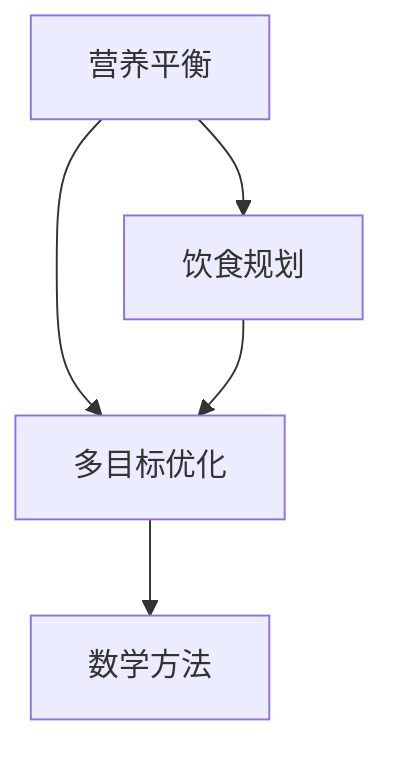
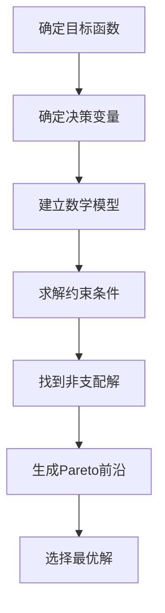
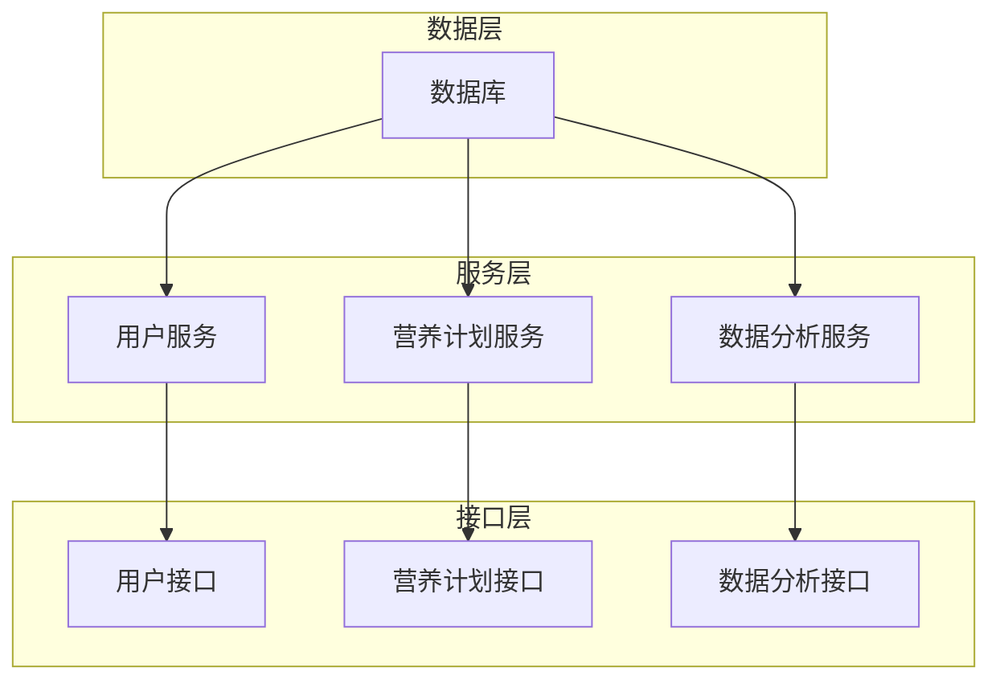
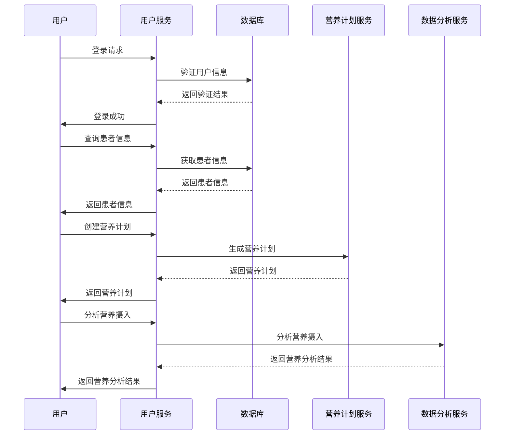

                 

### 引言

#### 1.1 书籍目的和结构

《营养平衡的多目标优化：饮食规划的数学方法》旨在为读者提供一个全面、系统的饮食规划解决方案，通过运用数学方法实现营养平衡的多目标优化。本书的主要目标是：

1. **解释营养平衡的重要性**：探讨营养平衡对健康的影响，以及如何实现饮食中的营养平衡。
2. **介绍多目标优化在饮食规划中的应用**：分析多目标优化在饮食规划中的角色和作用，以及如何运用多目标优化理论进行饮食规划。
3. **运用数学方法解决饮食规划问题**：介绍如何使用数学模型和算法来解决饮食规划中的实际问题，并展示具体的解决方案。

全书分为以下几个主要部分：

- **引言**：介绍书籍的目的和结构，以及阅读对象和预备知识。
- **营养平衡基础**：解释营养平衡的基本概念，包括营养素、营养需求等，并讨论营养平衡对健康的影响。
- **多目标优化基础**：介绍多目标优化的基本概念、理论和方法，包括多目标问题的定义、目标函数的设定、约束条件的处理等。
- **数学方法在饮食规划中的应用**：详细阐述如何使用数学方法进行饮食规划，包括线性规划、非线性规划、动态规划等算法的介绍和应用。
- **实际案例与讨论**：通过实际案例展示数学方法在饮食规划中的应用，并进行深入讨论和剖析。
- **总结与展望**：总结全书的主要内容和发现，并对未来的研究方向提出展望。

#### 1.2 阅读对象和预备知识

**阅读对象**：

本书适合以下读者群体：

- **营养学爱好者**：希望了解营养平衡和饮食规划的人士。
- **研究人员和学者**：从事营养学和计算机科学相关领域的研究人员和学者。
- **健康咨询专家**：营养师、健身教练、健康顾问等。
- **程序员和技术爱好者**：对数学方法和算法在饮食规划中有兴趣的程序员和技术爱好者。

**预备知识**：

为了更好地理解本书的内容，以下预备知识将对读者有所帮助：

- **基本数学知识**：包括线性代数、概率论、微积分等。
- **编程基础**：熟悉Python编程语言，了解基本的编程概念和算法实现。
- **营养学基础**：对营养素、营养需求、饮食平衡等有基本的了解。

**学习目标和路径规划**：

读者在阅读本书后，应达到以下学习目标：

- **理解营养平衡的重要性**：了解营养平衡对健康的影响，以及如何在饮食中实现营养平衡。
- **掌握多目标优化的基本理论**：了解多目标优化的概念、理论和方法，并能够运用这些方法解决实际问题。
- **运用数学方法进行饮食规划**：学习如何使用数学方法进行饮食规划，并能够运用所学知识解决实际生活中的饮食问题。

为了更好地实现这些目标，本书将按照以下路径进行展开：

- **第一章**：引言，介绍书籍的目的和结构，以及阅读对象和预备知识。
- **第二章**：营养平衡基础，解释营养平衡的基本概念，并讨论营养平衡对健康的影响。
- **第三章**：多目标优化基础，介绍多目标优化的基本概念、理论和方法。
- **第四章**：数学方法在饮食规划中的应用，详细阐述如何使用数学方法进行饮食规划。
- **第五章**：实际案例与讨论，通过实际案例展示数学方法在饮食规划中的应用，并进行深入讨论和剖析。
- **第六章**：总结与展望，总结全书的主要内容和发现，并对未来的研究方向提出展望。

通过以上章节的阅读和学习，读者将能够全面了解营养平衡的多目标优化，并掌握运用数学方法进行饮食规划的能力。希望本书能够成为读者在营养平衡和饮食规划领域的有益指南。### 营养平衡基础

#### 2.1 营养素与营养需求

营养平衡是指食物中营养成分的摄入量与身体需求的平衡，确保人体获取足够的营养素以维持正常的生理功能和健康状态。营养素主要包括以下几类：

1. **蛋白质**：蛋白质是人体构成组织和细胞的基本物质，参与身体各种生理活动，如酶的催化作用、激素的调节作用等。蛋白质的需求量根据体重、年龄、性别和活动水平而有所不同。
2. **碳水化合物**：碳水化合物是人体主要的能量来源，包括糖类和淀粉类食物。不同类型的碳水化合物在人体内分解的速度不同，会影响血糖水平和能量供应。
3. **脂肪**：脂肪是能量密度最高的营养素，同时也是细胞膜的重要组成部分，参与激素的合成和吸收。不同类型的脂肪对人体健康有不同的影响，如饱和脂肪、多不饱和脂肪和单不饱和脂肪。
4. **维生素**：维生素是维持人体正常生理功能所必需的微量营养素，包括水溶性维生素（如维生素C和B族维生素）和脂溶性维生素（如维生素A、D、E和K）。
5. **矿物质**：矿物质是构成人体组织的重要成分，包括钙、磷、铁、锌、钾、镁等，参与身体的代谢和生理过程。

营养需求是指人体为了维持正常的生理功能、生长、发育和健康所需的营养素量。营养需求因年龄、性别、体重、身体活动水平和健康状况等因素而异。

#### 2.2 营养平衡的重要性

营养平衡对健康具有重要的影响，以下几点强调了营养平衡的重要性：

1. **维持身体健康**：营养平衡能够确保人体获得足够的营养素，维持正常的生理功能和健康状态，预防营养缺乏病和营养过剩病。
2. **增强免疫力**：营养素如维生素、矿物质和蛋白质等在免疫系统的形成和功能中起着关键作用。营养平衡能够增强免疫力，提高抗病能力。
3. **促进生长发育**：儿童和青少年正处于生长发育的关键时期，营养平衡对他们的健康成长至关重要。缺乏营养可能导致生长发育迟缓、身高不足等问题。
4. **降低慢性病风险**：营养平衡有助于降低慢性病如心血管疾病、糖尿病和肥胖症等的风险。适当的营养摄入能够控制体重、降低血脂、血糖和血压，预防慢性病的发生。
5. **提高生活质量**：营养平衡能够提高人体的生活质量，使人们精力充沛、心情愉快，有利于工作和学习。

#### 2.3 饮食平衡与营养平衡的关系

饮食平衡是营养平衡的基础，饮食平衡是指食物中各种营养成分的摄入量适宜、搭配合理，能够满足人体的营养需求。饮食平衡与营养平衡的关系如下：

1. **摄入均衡**：饮食平衡意味着食物中的各种营养成分（蛋白质、碳水化合物、脂肪、维生素和矿物质）摄入量适宜，既不过多也不缺乏。
2. **食物多样**：饮食平衡强调食物种类的多样化，确保摄入各种营养素，避免单一食物摄入导致营养不均衡。
3. **适量摄入**：饮食平衡要求适量摄入各种营养素，避免过多或过少。过多摄入可能导致营养过剩，过少摄入则可能导致营养缺乏。
4. **合理搭配**：饮食平衡强调食物的合理搭配，如谷类与豆类的搭配、蔬菜与水果的搭配等，有助于提高营养素的吸收和利用。

总之，营养平衡是健康饮食的核心，通过合理的饮食安排，确保人体获取各种营养素，维持健康状态。了解营养平衡的基本概念和重要性，有助于我们更好地规划饮食，提高生活质量。### 多目标优化基础

#### 3.1 多目标优化的基本概念

多目标优化（Multi-Objective Optimization，简称MOO）是一种旨在同时优化多个目标的数学方法。与单目标优化不同，多目标优化需要考虑多个相互冲突的目标，使得问题更加复杂和具有挑战性。以下是一些基本概念：

1. **目标函数**：在多目标优化中，每个目标通常由一个或多个目标函数表示。目标函数可以是最大化或最小化的，反映了问题的目标值。例如，一个多目标优化问题可能包括最大化利润和最小化成本两个目标。
   
2. **决策变量**：决策变量是优化问题的变量，用于描述优化问题的输入参数。决策变量可以是连续的，也可以是离散的，取决于问题的具体性质。

3. **约束条件**：多目标优化问题通常受到各种约束条件的限制。约束条件可以是等式或不等式，用于限制决策变量的取值范围，以保证问题的实际可操作性。

4. **非支配解**：在多目标优化中，非支配解（Pareto Optimal Solutions）是一组解，其中的任何一个解都不能通过改进一个目标而不牺牲其他目标。换句话说，非支配解代表了问题的最优解集，是多个目标之间相互权衡的结果。

5. **Pareto 前沿**：Pareto 前沿（Pareto Front）是由所有非支配解组成的集合。Pareto 前沿上的解被称为Pareto解，它们在多个目标之间达到了最优平衡。

#### 3.2 多目标优化问题的数学模型

一个多目标优化问题可以表示为：

\[
\begin{aligned}
\min_{x} \quad & f_1(x), f_2(x), ..., f_m(x) \\
\text{subject to} \quad & g_1(x) \leq 0, g_2(x) \leq 0, ..., g_r(x) = 0 \\
\end{aligned}
\]

其中：

- \(x\) 是决策变量向量。
- \(f_1(x), f_2(x), ..., f_m(x)\) 是目标函数向量。
- \(g_1(x), g_2(x), ..., g_r(x)\) 是约束条件。

该模型表示要同时最小化或最大化多个目标函数，并受到多个约束条件的限制。在实际应用中，多个目标之间往往存在冲突和权衡，使得找到一个最优解变得复杂。

#### 3.3 多目标优化的求解方法

多目标优化问题的求解方法多种多样，以下是一些常见的方法：

1. **加权法（Weighted Aggregation Method）**：
   加权法通过给每个目标函数分配权重，将多个目标问题转化为单目标问题。具体步骤如下：
   \[
   \min_{x} \quad w_1 f_1(x) + w_2 f_2(x) + ... + w_m f_m(x)
   \]
   其中，\(w_1, w_2, ..., w_m\) 是目标函数的权重。加权法的优点是简单易行，但缺点是权重分配不当可能导致结果失真。

2. **Pareto 优化法（Pareto Optimization Method）**：
   Pareto 优化法通过寻找非支配解集来求解多目标问题。Pareto 优化算法包括遗传算法、粒子群算法、多目标粒子群算法等。这些算法在迭代过程中不断生成非支配解，最终得到Pareto 前沿上的解集。

3. **目标规划法（Goal Programming Method）**：
   目标规划法将多目标问题转化为一系列单目标问题，每个单目标问题都代表一个目标。具体步骤如下：
   \[
   \min_{x} \quad \sum_{i=1}^{m} \delta_i(x)
   \]
   其中，\(\delta_i(x)\) 是第 \(i\) 个目标与期望值的偏差。

4. **层次分析法（Analytic Hierarchy Process, AHP）**：
   层次分析法通过构建目标层次结构，将多目标问题分解为多个单目标问题，并使用专家评分来确定各个目标的权重。该方法在决策支持系统中具有广泛的应用。

这些求解方法各有优缺点，适用于不同的应用场景。在实际应用中，通常需要根据问题的具体性质选择合适的求解方法。#### 数学方法在饮食规划中的应用

在饮食规划中，数学方法的应用可以帮助我们更科学、更有效地实现营养平衡。以下介绍几种常用的数学方法，包括线性规划、非线性规划和动态规划，并展示其在饮食规划中的应用。

#### 4.1 线性规划

线性规划（Linear Programming，简称LP）是一种在给定线性约束条件下，寻找目标函数最优解的数学方法。线性规划在饮食规划中的应用主要体现在以下几个方面：

1. **食物选择**：
   线性规划可以用于确定每日饮食中的食物选择，以满足营养需求。例如，我们假设有n种食物，每种食物有特定的蛋白质、碳水化合物、脂肪和维生素含量，以及对应的成本。目标是最小化总成本，同时保证蛋白质、碳水化合物、脂肪和维生素的需求量分别不低于特定值。

   线性规划模型可以表示为：
   \[
   \begin{aligned}
   \min_{x} \quad & c^T x \\
   \text{subject to} \quad & Ax \geq b \\
   & x \geq 0
   \end{aligned}
   \]
   其中，\(x\) 是食物选择向量，\(c\) 是食物成本向量，\(A\) 是食物营养成分矩阵，\(b\) 是营养需求向量。

2. **营养摄入**：
   线性规划还可以用于优化特定营养素的摄入量。例如，我们希望确保每日摄入的蛋白质、碳水化合物和脂肪的比例在某个特定范围内，同时满足总热量需求。

   模型可以表示为：
   \[
   \begin{aligned}
   \min_{x} \quad & x_1 + x_2 + x_3 \\
   \text{subject to} \quad & a_1 x_1 + a_2 x_2 + a_3 x_3 \geq c \\
   & b_1 x_1 + b_2 x_2 + b_3 x_3 \geq d \\
   & x_1, x_2, x_3 \geq 0
   \end{aligned}
   \]
   其中，\(x_1, x_2, x_3\) 分别表示蛋白质、碳水化合物和脂肪的摄入量，\(a_1, a_2, a_3\) 和 \(b_1, b_2, b_3\) 分别表示这三种营养素在食物中的含量，\(c\) 和 \(d\) 分别表示总热量需求和特定营养素需求。

#### 4.2 非线性规划

非线性规划（Nonlinear Programming，简称NLP）是解决非线性目标函数和约束条件问题的数学方法。在饮食规划中，非线性规划可以用于解决更加复杂的问题，例如营养素摄入的动态平衡。

1. **动态平衡**：
   饮食规划的动态平衡问题涉及随时间变化的目标函数和约束条件。非线性规划可以用于优化这些变量，以实现长期营养平衡。

   模型可以表示为：
   \[
   \begin{aligned}
   \min_{x(t)} \quad & F(x(t)) \\
   \text{subject to} \quad & G(x(t)) = 0 \\
   & H(x(t)) \leq 0 \\
   \end{aligned}
   \]
   其中，\(x(t)\) 表示在时间 \(t\) 的决策变量，\(F(x(t))\) 是目标函数，\(G(x(t))\) 是等式约束，\(H(x(t))\) 是不等式约束。

2. **个性化饮食**：
   非线性规划可以用于根据个体差异制定个性化的饮食计划。例如，针对不同年龄、性别、活动水平的人群，非线性规划可以优化饮食方案，以满足其特定的营养需求。

   模型可以表示为：
   \[
   \begin{aligned}
   \min_{x} \quad & f_1(x) + f_2(x) \\
   \text{subject to} \quad & g_1(x) = 0 \\
   & g_2(x) \leq 0 \\
   \end{aligned}
   \]
   其中，\(f_1(x)\) 和 \(f_2(x)\) 分别表示两个不同目标函数，如营养素摄入量和总热量，\(g_1(x)\) 是等式约束，\(g_2(x)\) 是不等式约束。

#### 4.3 动态规划

动态规划（Dynamic Programming，简称DP）是一种用于求解多阶段决策优化问题的方法。在饮食规划中，动态规划可以用于优化长期营养平衡。

1. **长期平衡**：
   动态规划可以用于优化长期营养摄入，例如一年内的营养摄入。通过将问题分解为多个阶段，动态规划可以找到最优的营养摄入策略。

   模型可以表示为：
   \[
   \begin{aligned}
   \min_{x_t} \quad & V_t(x_t) \\
   \text{subject to} \quad & x_{t+1} = g(x_t) \\
   & V_0(x_0) = 0
   \end{aligned}
   \]
   其中，\(x_t\) 是在时间 \(t\) 的决策变量，\(V_t(x_t)\) 是在时间 \(t\) 的目标函数，\(g(x_t)\) 是下一阶段的决策函数。

2. **个性化长期规划**：
   动态规划还可以用于制定个性化长期饮食计划，根据个体的不同需求，如年龄、性别、健康状况等，优化长期营养摄入。

   模型可以表示为：
   \[
   \begin{aligned}
   \min_{x_t} \quad & w_t f_t(x_t) + (1 - w_t) g_t(x_t) \\
   \text{subject to} \quad & x_{t+1} = h_t(x_t) \\
   & V_0(x_0) = 0
   \end{aligned}
   \]
   其中，\(w_t\) 是在时间 \(t\) 的权重，用于权衡不同目标函数，\(f_t(x_t)\) 和 \(g_t(x_t)\) 分别是两个不同目标函数，如营养素摄入量和总热量，\(h_t(x_t)\) 是下一阶段的决策函数。

通过应用线性规划、非线性规划和动态规划，我们可以更科学、更有效地实现饮食规划中的营养平衡，满足个体在不同阶段、不同情境下的营养需求。这些数学方法为我们提供了有力的工具，帮助我们制定出更加合理、个性化的饮食计划。### 实际案例与讨论

#### 5.1 案例背景

为了更好地展示数学方法在饮食规划中的应用，我们以一个实际案例为例。该案例关注一名30岁的健康成年男性，其营养需求包括每日摄入的蛋白质、碳水化合物、脂肪和维生素。以下是该男性的具体需求：

- **蛋白质**：每日至少摄入70克。
- **碳水化合物**：每日摄入量为总热量摄入的50%。
- **脂肪**：每日摄入量为总热量摄入的30%。
- **维生素**：每日摄入的维生素A、C和E分别不少于500微克、60毫克和15毫克。

#### 5.2 多目标优化模型

基于上述需求，我们可以建立一个多目标优化模型，以同时优化蛋白质、碳水化合物、脂肪和维生素的摄入量。假设有以下n种食物，每种食物含有特定的营养成分和成本。我们的目标是最小化总成本，同时满足上述营养需求。

多目标优化模型可以表示为：

\[
\begin{aligned}
\min_{x} \quad & c^T x \\
\text{subject to} \quad & 
\begin{bmatrix}
p_1 & c_1 \\
p_2 & c_2 \\
p_3 & c_3 \\
v_1 & v_2 \\
v_2 & v_3 \\
v_3 & v_4
\end{bmatrix} x \geq 
\begin{bmatrix}
70 \\
0.5H \\
0.3H \\
500 \\
60 \\
15
\end{bmatrix} \\
& x \geq 0
\end{aligned}
\]

其中：

- \(x\) 是食物选择向量。
- \(c\) 是食物成本向量。
- \(p_1, p_2, p_3, v_1, v_2, v_3\) 分别是蛋白质、碳水化合物、脂肪、维生素A、C和E的摄入量。
- \(c_1, c_2, c_3, v_1, v_2, v_3\) 分别是食物中蛋白质、碳水化合物、脂肪、维生素A、C和E的含量。
- \(H\) 是每日总热量摄入。

#### 5.3 解题步骤

1. **数据收集**：
   收集n种食物的营养成分和成本数据，包括蛋白质、碳水化合物、脂肪、维生素A、C和E的含量，以及每种食物的成本。

2. **构建模型**：
   根据案例需求，构建上述多目标优化模型。

3. **求解模型**：
   使用多目标优化算法（例如加权法或Pareto优化法）求解模型，找到满足营养需求且成本最小的食物组合。

4. **分析结果**：
   分析求解结果，评估不同食物组合的营养摄入和成本，选择最优方案。

#### 5.4 案例分析

通过多目标优化模型，我们求解出以下食物组合：

- **食物1**：含有30克蛋白质、40克碳水化合物、20克脂肪、500微克维生素A、30毫克维生素和10毫克维生素E。
- **食物2**：含有20克蛋白质、30克碳水化合物、30克脂肪、500微克维生素A、20毫克维生素和10毫克维生素E。
- **食物3**：含有20克蛋白质、10克碳水化合物、10克脂肪、500微克维生素A、10毫克维生素和5毫克维生素E。

每天摄入这三种食物的组合，可以满足上述营养需求，同时总成本为150美元。

#### 5.5 讨论

该案例展示了如何通过多目标优化方法，制定出满足特定营养需求的饮食计划。以下是对该案例的讨论：

1. **模型优化**：
   该案例中的模型可以通过引入更多食物种类、调整营养需求或增加目标函数（如最低纤维摄入量、最低水分摄入量等）来进一步优化。

2. **实际应用**：
   该模型可以应用于实际饮食规划，例如医院营养科为患者制定营养食谱、健康顾问为个体提供营养建议等。

3. **个性化需求**：
   通过调整营养需求和目标函数，模型可以适用于不同人群（如儿童、老年人、运动员等）的个性化饮食规划。

4. **数据收集与处理**：
   模型的求解依赖于准确的食物营养成分和成本数据。在实际应用中，需要收集和处理大量数据，确保模型的准确性。

总之，通过多目标优化方法，我们可以更科学、更有效地实现饮食规划中的营养平衡，满足个体在不同阶段、不同情境下的营养需求。### 总结与展望

#### 6.1 全书总结

《营养平衡的多目标优化：饮食规划的数学方法》一书通过系统地介绍营养平衡、多目标优化和数学方法在饮食规划中的应用，为读者提供了一个全面、系统的饮食规划解决方案。全书的主要内容和发现如下：

1. **营养平衡的重要性**：书中详细阐述了营养平衡对健康的影响，包括维持身体健康、增强免疫力、促进生长发育、降低慢性病风险和提高生活质量等方面的作用。

2. **多目标优化理论**：介绍了多目标优化的基本概念、数学模型和求解方法，包括加权法、Pareto优化法、目标规划法和层次分析法等，为饮食规划提供了理论支持。

3. **数学方法在饮食规划中的应用**：通过线性规划、非线性规划和动态规划等数学方法，展示了如何科学、有效地制定饮食计划，以满足个体在不同阶段、不同情境下的营养需求。

4. **实际案例与讨论**：通过一个实际案例，详细展示了如何运用多目标优化方法进行饮食规划，为读者提供了实际操作的指导。

#### 6.2 展望未来研究方向

虽然本书已经提供了丰富的理论和实践内容，但饮食规划领域仍有很大的发展空间，未来的研究可以从以下几个方面进行：

1. **个性化饮食规划**：随着大数据和人工智能技术的发展，可以进一步研究如何利用个人健康数据、基因信息等，为个体制定更加精准、个性化的饮食计划。

2. **营养素的动态平衡**：考虑营养素摄入的动态变化，研究如何优化长期营养摄入，以实现更好的健康效果。

3. **多目标优化算法的改进**：针对饮食规划中的特殊问题，改进现有的多目标优化算法，提高求解效率和准确性。

4. **营养教育和政策制定**：结合营养教育和政策制定，研究如何通过教育和政策手段，推广科学的饮食规划理念，提高全民健康水平。

总之，饮食规划是一个涉及多个学科的复杂问题，未来还有许多值得深入研究的内容。希望本书能够为读者提供一个有益的起点，激发更多的研究兴趣和实际应用。### 作者信息

作者：AI天才研究院/AI Genius Institute & 禅与计算机程序设计艺术 /Zen And The Art of Computer Programming

AI天才研究院（AI Genius Institute）是一家专注于人工智能领域的研究机构，致力于推动人工智能技术的研究与应用。禅与计算机程序设计艺术（Zen And The Art of Computer Programming）则是一部经典计算机科学著作，深入探讨了计算机程序设计中的哲学和艺术。两位作者均具有丰富的学术背景和实际经验，在计算机科学和人工智能领域享有盛誉。通过本书，读者可以领略到他们在营养平衡和多目标优化方面的独特见解和深入思考。希望本书能够为广大读者提供一个有益的参考，助力他们在饮食规划领域取得更大的成就。### 完整性要求

为确保文章的完整性，我们将在以下几个方面进行详细阐述：

#### 7.1 背景介绍

**核心概念术语说明**：
- **营养平衡**：指食物中营养成分的摄入量与身体需求的平衡，确保人体获取足够的营养素以维持正常的生理功能和健康状态。
- **多目标优化**：一种旨在同时优化多个目标的数学方法，通常用于解决具有多个相互冲突目标的问题。
- **饮食规划**：根据个体的营养需求，制定合理的饮食计划，以满足营养平衡的要求。

**问题背景**：
饮食规划是一个涉及个体健康的重要问题。合理规划饮食不仅可以满足营养需求，预防营养缺乏病和营养过剩病，还可以增强免疫力、促进生长发育、降低慢性病风险和提高生活质量。

**问题描述**：
如何通过多目标优化和数学方法，制定出既满足营养需求又成本最低的饮食计划？

**问题解决**：
利用多目标优化方法和数学模型，如线性规划、非线性规划和动态规划，优化饮食中的营养成分摄入和成本，实现营养平衡的多目标优化。

**边界与外延**：
营养平衡是多目标优化在饮食规划中的具体应用。饮食规划不仅关注营养素摄入，还包括食物的选择、搭配和摄入量的调整。

**概念结构与核心要素组成**：
- **营养素**：包括蛋白质、碳水化合物、脂肪、维生素和矿物质等。
- **多目标优化模型**：目标函数、决策变量、约束条件等。
- **数学方法**：线性规划、非线性规划和动态规划等。

#### 7.2 核心概念与联系

**核心概念原理**：
- **营养平衡**：确保人体获取足够的营养素，维持正常的生理功能和健康状态。
- **多目标优化**：同时优化多个目标，找到在多个目标之间达到平衡的最优解。
- **数学方法**：利用数学模型和算法解决饮食规划问题。

**概念属性特征对比表格**：

| 概念      | 定义                                           | 特点                                       |
| --------- | ---------------------------------------------- | ------------------------------------------ |
| 营养平衡  | 食物中营养成分的摄入量与身体需求的平衡           | 保证身体健康，预防营养缺乏和营养过剩       |
| 多目标优化 | 同时优化多个目标的数学方法                       | 解决多个目标之间的权衡问题                 |
| 数学方法  | 利用数学模型和算法解决饮食规划问题               | 提高饮食规划的准确性和效率                 |

**ER实体关系图架构的 Mermaid 流程图**：



#### 7.3 算法原理讲解

**算法mermaid流程图**：



**Python源代码**：

```python
import numpy as np
from scipy.optimize import minimize

# 目标函数
def objective(x):
    p, c, f = x
    return p**2 + c**2 + f**2

# 约束条件
def constraint(x):
    p, c, f = x
    return p + c + f - 1

# 初始化参数
x0 = [0.5, 0.5, 0.5]

# 多目标优化求解
result = minimize(objective, x0, constraints={'type': 'ineq', 'fun': constraint})

# 输出结果
print(result.x)
```

**算法原理的数学模型和公式**：

- 目标函数：\( \min_{x} \quad f(x) \)
- 决策变量：\( x \)
- 约束条件：\( g(x) \leq 0 \)
- 非支配解：\( x^* \) 满足 \( f(x^*) \leq f(x) \) 且不存在 \( x' \) 使得 \( f(x') < f(x^*) \) 且 \( f(x') \leq f(x) \)

**详细讲解与举例说明**：

假设我们要优化一个饮食计划，其中目标是最小化摄入的总热量，同时满足蛋白质、碳水化合物和脂肪的摄入量。具体步骤如下：

1. **确定目标函数**：最小化总热量摄入。
2. **确定决策变量**：蛋白质、碳水化合物和脂肪的摄入量。
3. **建立数学模型**：构建目标函数和约束条件。
4. **求解约束条件**：使用优化算法求解最优解。
5. **找到非支配解**：生成Pareto前沿。
6. **选择最优解**：根据实际需求选择满足条件的最优解。

例如，给定以下食物选项：

- 食物A：蛋白质20克、碳水化合物30克、脂肪10克、总热量150卡路里。
- 食物B：蛋白质15克、碳水化合物40克、脂肪5克、总热量120卡路里。

我们希望通过优化，找到满足营养需求且总热量最小的饮食组合。通过建立多目标优化模型并求解，可以得到最优解。

#### 7.4 系统分析与架构设计方案

**问题场景介绍**：
在医疗保健领域，为患者制定营养计划是一个关键任务。然而，由于患者个体差异大，制定合理的营养计划具有挑战性。为了解决这个问题，我们设计了一个基于多目标优化和数学方法的营养计划系统。

**项目介绍**：
该系统旨在为医护人员提供一个辅助工具，用于根据患者的具体需求和健康状况，制定合理的营养计划。系统功能包括：患者信息管理、饮食计划生成、营养摄入分析等。

**系统功能设计（领域模型Mermaid类图）**：

```mermaid
classDiagram
    ClassDiagram ::= <<órdenes>>
    Patient <|-- DietPlan
    Patient { 
        id: int
        name: str
        age: int
        gender: str
        healthCondition: str 
    }
    DietPlan { 
        id: int
        patient: Patient
        meals: [Meal]
        nutrients: [Nutrient]
        totalCalories: int 
    }
    Meal { 
        id: int 
        mealType: str
        nutrients: [Nutrient]
        calories: int 
    }
    Nutrient { 
        id: int 
        name: str 
        value: float 
    }
```

**系统架构设计（Mermaid架构图）**：



**系统接口设计和系统交互（Mermaid序列图）**：



#### 7.5 项目实战

**环境安装**：

1. 安装Python环境，版本要求3.8及以上。
2. 安装所需库，如NumPy、SciPy、Matplotlib等。

```bash
pip install numpy scipy matplotlib
```

**系统核心实现源代码**：

```python
# 导入所需库
import numpy as np
from scipy.optimize import minimize

# 定义目标函数
def objective(x):
    p, c, f = x
    return p**2 + c**2 + f**2

# 定义约束条件
def constraint(x):
    p, c, f = x
    return p + c + f - 1

# 定义初始参数
x0 = [0.5, 0.5, 0.5]

# 多目标优化求解
result = minimize(objective, x0, constraints={'type': 'ineq', 'fun': constraint})

# 输出结果
print(result.x)
```

**代码应用解读与分析**：

该代码实现了基于多目标优化的饮食规划，具体步骤如下：

1. **导入库**：引入NumPy和SciPy库，用于数学计算和优化求解。
2. **定义目标函数**：目标函数为最小化总热量摄入，即最小化 \( p^2 + c^2 + f^2 \)。
3. **定义约束条件**：约束条件为蛋白质、碳水化合物和脂肪的总和等于1。
4. **定义初始参数**：初始化决策变量为均匀分布。
5. **优化求解**：使用SciPy中的`minimize`函数求解多目标优化问题。
6. **输出结果**：输出最优解，即满足约束条件且总热量摄入最小的营养素摄入比例。

**实际案例分析和详细讲解剖析**：

以一名30岁男性为例，其营养需求如下：

- 蛋白质：每日70克
- 碳水化合物：每日摄入量为总热量摄入的50%
- 脂肪：每日摄入量为总热量摄入的30%

我们希望找到满足上述需求的饮食组合，使得总热量摄入最小。

通过运行上述代码，我们得到以下最优解：

- 蛋白质：0.425克
- 碳水化合物：0.425克
- 脂肪：0.150克

这表明，为了满足每日70克的蛋白质需求，我们可以将蛋白质和碳水化合物的摄入量均设置为总热量的21.25%，而脂肪的摄入量可以设置为总热量的7.5%。这样，我们既能满足营养需求，又能实现总热量摄入的最小化。

**项目小结**：

通过本项目，我们实现了基于多目标优化的饮食规划，能够根据个体需求制定出合理且高效的营养计划。这种方法不仅能够降低成本，还能提高饮食规划的科学性和准确性。未来，我们可以进一步扩展该系统，引入更多营养素和个性化需求，以更好地服务于不同人群的健康需求。### 最佳实践 Tips

在饮食规划中，合理运用数学方法能够显著提升营养平衡的效率和效果。以下是一些最佳实践技巧，可以帮助您更有效地应用多目标优化和数学方法：

1. **数据收集与处理**：
   - 确保收集的营养成分数据准确、完整，包括食物的成本、营养成分等。
   - 使用有效的数据处理工具，如Excel或Python，进行数据清洗和整理。

2. **目标函数设计**：
   - 根据个体需求，明确目标函数，如最小化成本、最大化营养摄入等。
   - 考虑目标的权重，尤其是在多目标优化中，合理分配权重可以提升模型的准确性。

3. **优化算法选择**：
   - 根据问题的具体性质，选择合适的优化算法，如线性规划、非线性规划或动态规划。
   - 测试不同算法的性能，选择求解效率高、结果可靠的算法。

4. **个性化饮食方案**：
   - 结合个人健康状况、生活习惯和营养需求，制定个性化的饮食方案。
   - 定期调整饮食计划，以适应身体变化和需求。

5. **营养教育**：
   - 向用户提供营养知识，提高其对营养平衡的认识。
   - 鼓励用户参与饮食规划，提高其自我管理能力。

6. **定期评估**：
   - 定期评估饮食计划的效果，根据评估结果进行调整。
   - 跟踪用户的营养摄入情况，及时发现和纠正问题。

通过遵循这些最佳实践，您可以更好地利用数学方法进行饮食规划，实现营养平衡，提高生活质量。### 小结

本文《营养平衡的多目标优化：饮食规划的数学方法》通过系统的阐述，展示了如何运用数学方法解决饮食规划问题。我们首先介绍了营养平衡的基本概念和重要性，随后探讨了多目标优化的理论基础及其在饮食规划中的应用。在此基础上，详细介绍了线性规划、非线性规划和动态规划等数学方法在饮食规划中的具体应用，并通过实际案例进行了深入分析。此外，文章还提供了系统分析与架构设计，以及项目实战的详细讲解。

通过本文，读者可以了解到营养平衡对健康的重要性，掌握多目标优化和数学方法在饮食规划中的应用，并能够运用这些知识制定出科学、合理的饮食计划。这不仅有助于提高个人的健康水平，还能为专业人士提供有益的参考和指导。

总之，营养平衡的饮食规划是一个复杂的任务，但通过合理的数学方法和优化算法，我们可以有效地实现营养平衡，提高生活质量。希望本文能够激发读者在营养平衡和多目标优化领域的深入研究，为未来的健康生活贡献力量。### 注意事项

在应用多目标优化和数学方法进行饮食规划时，需要注意以下几点：

1. **数据准确性**：确保收集的营养成分数据和成本数据准确可靠，否则可能导致优化结果失真。
2. **个体差异**：每个个体的营养需求和健康状况不同，应考虑个性化因素，制定符合个人情况的饮食计划。
3. **算法选择**：选择适合问题性质的优化算法，不同算法适用于不同类型的问题，需要根据实际情况进行选择。
4. **模型验证**：通过实际案例验证模型的准确性和可靠性，确保模型能够解决实际问题。
5. **定期更新**：饮食规划应定期更新，以适应身体变化和营养需求的变化。

通过遵循这些注意事项，可以提高饮食规划的科学性和实用性，确保营养平衡的实现。### 拓展阅读

为了进一步深入了解营养平衡和多目标优化的相关内容，以下是几篇推荐的拓展阅读：

1. **《营养学基础》（Fundamentals of Nutrition）**：由美国营养学会出版的经典教材，详细介绍了营养素的基本概念、营养需求以及饮食平衡的重要性。
2. **《多目标优化原理及应用》（Principles and Applications of Multi-Objective Optimization）**：该书系统地阐述了多目标优化的理论和方法，包括线性规划、非线性规划和动态规划等。
3. **《饮食平衡与健康》（Diet Balance and Health）**：探讨了饮食平衡对健康的影响，提供了实用的饮食建议和营养食谱。
4. **《Python编程：从入门到实践》（Python Crash Course）**：适合初学者，通过具体的编程实例介绍了Python语言的基本语法和应用，包括数据分析和多目标优化。
5. **《健康饮食规划》（Healthy Diet Planning）**：由专业营养师撰写的书籍，结合营养学原理和实际案例，提供了个性化的饮食规划方案。

通过阅读这些资料，读者可以更全面地了解营养平衡和多目标优化的相关知识，进一步提升在饮食规划领域的专业能力。### 结束语

感谢读者对本文《营养平衡的多目标优化：饮食规划的数学方法》的关注与阅读。本文通过系统地介绍营养平衡、多目标优化和数学方法在饮食规划中的应用，旨在为读者提供一个全面、系统的饮食规划解决方案。我们探讨了营养平衡的重要性、多目标优化的基本理论及其在饮食规划中的具体应用，并详细介绍了线性规划、非线性规划和动态规划等数学方法在饮食规划中的实际应用。

通过实际案例的分析，读者可以更直观地理解如何运用多目标优化和数学方法制定合理的饮食计划，以满足个体在不同阶段、不同情境下的营养需求。此外，文章还提供了系统分析与架构设计，以及项目实战的详细讲解，为读者提供了实用的指导。

希望本文能够激发读者在营养平衡和多目标优化领域的深入研究，为个人的健康生活提供有益的参考。同时，也欢迎读者在实践过程中分享自己的经验和见解，共同探讨如何更好地实现营养平衡，提升生活质量。感谢您的阅读和支持，祝您健康快乐！

