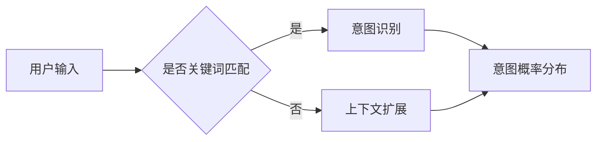
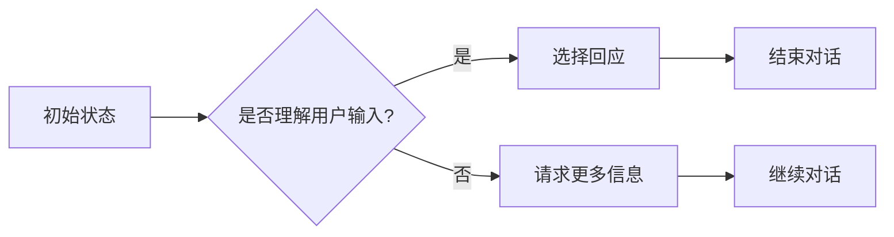
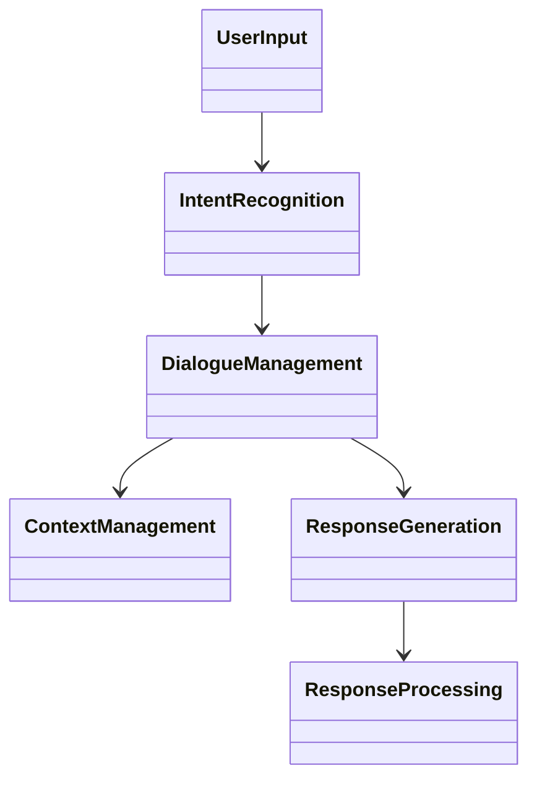
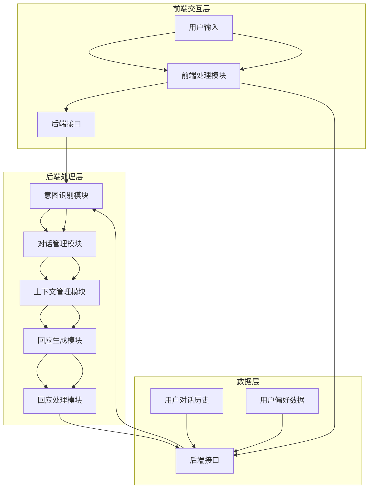
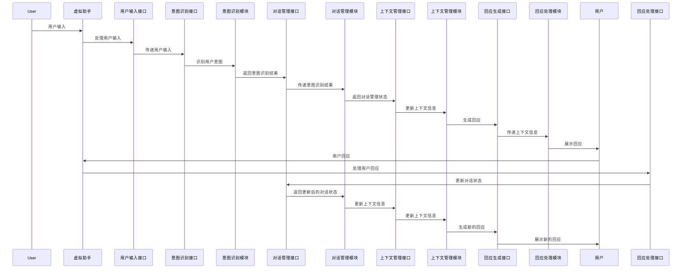

                 


### **背景介绍**

虚拟助手，作为一种新兴的人机交互工具，正在快速融入我们的日常生活。从简单的语音助手如苹果的Siri、谷歌助手，到复杂的智能客服系统、教育助理等，虚拟助手的应用场景日益广泛。然而，虚拟助手的核心问题之一是有效的对话管理。

对话管理是指在人与机器之间进行交流的过程中，确保对话能够顺利进行、用户的需求得到满足，同时还能保证机器对环境的适应性。简单来说，对话管理就是让虚拟助手能够“听懂”用户的话，理解用户的意图，并给出适当的回应。

然而，实现有效的对话管理并不容易。首先，人类语言是极其复杂和多变的，需要机器具备高度的理解能力和灵活性。其次，对话管理需要处理大量的上下文信息，保持对话的连贯性。此外，虚拟助手还必须在处理速度和准确度之间找到平衡，既要快速响应用户，又不能因为误判而造成对话的混乱。

在现有的研究中，对话管理通常涉及到自然语言处理（NLP）、机器学习（ML）和概率论等多个领域。这些方法都有助于提高虚拟助手的理解能力和反应速度。然而，如何将这些方法有效地结合，构建一个稳定、高效、适应性强的对话管理系统，仍然是一个挑战。

本文的目的在于深入探讨虚拟助手对话管理中的数学策略。我们将从基础数学策略入手，逐步介绍其在对话管理中的应用，并通过具体的案例进行分析。本文的结构如下：

1. **基础数学策略**：首先介绍对话管理中的基础数学策略，包括概率论、决策理论等，为后续讨论打下基础。
2. **数学方法与应用**：接着，我们将详细探讨概率论、机器学习、自然语言处理等数学方法在对话管理中的应用。
3. **案例分析与实战**：通过实际案例，展示如何将数学策略应用到虚拟助手的对话管理中，并进行详细剖析。
4. **最佳实践与未来展望**：总结最佳实践经验，并对未来的发展趋势进行展望。

### **核心概念与联系**

为了更好地理解对话管理中的数学策略，我们需要明确几个核心概念，并探讨它们之间的联系。

#### **1. 对话状态**

对话状态是指虚拟助手在对话过程中所处的状态，包括理解状态、回应状态和上下文状态。理解状态表示虚拟助手对当前用户语句的理解程度，回应状态表示虚拟助手准备做出的回应，上下文状态则包含了对话历史和用户偏好等信息。

#### **2. 概率论**

概率论是研究随机事件及其规律性的数学分支。在对话管理中，概率论可以帮助我们预测用户意图的概率分布，从而提高对话的准确性。例如，通过贝叶斯网络，我们可以建立用户意图的概率模型，根据当前对话状态和上下文信息，计算用户意图的概率。

#### **3. 决策理论**

决策理论是研究决策过程及其优化的数学方法。在对话管理中，决策理论可以帮助虚拟助手根据当前对话状态和上下文信息，选择最佳回应。常见的决策理论包括马尔可夫决策过程（MDP）和部分可观测马尔可夫决策过程（POMDP）。

#### **4. 机器学习**

机器学习是一种通过数据和算法来学习新知识的计算机技术。在对话管理中，机器学习可以帮助虚拟助手从大量对话数据中学习，提高对话的准确性和适应性。常见的机器学习方法包括决策树、神经网络、支持向量机等。

#### **5. 自然语言处理**

自然语言处理是一种让计算机理解和生成人类语言的技术。在对话管理中，自然语言处理可以帮助虚拟助手理解和生成自然语言，从而实现与用户的顺畅交流。

这些概念之间的联系在于：概率论和决策理论为机器学习提供了理论基础，而自然语言处理则为机器学习提供了应用场景。通过结合这些方法，我们可以构建一个高效的对话管理系统，提高虚拟助手的对话能力。

### **算法原理讲解**

在对话管理中，算法的原理是实现有效对话的关键。以下我们将详细介绍几个核心算法原理，并通过Mermaid流程图和Python代码来阐述其具体实现。

#### **1. 贝叶斯网络**

贝叶斯网络是一种用于表示概率关系的图形模型，它通过节点和边来表示变量之间的条件依赖关系。在对话管理中，贝叶斯网络可以帮助我们预测用户意图。

**Mermaid流程图：**



**Python代码：**

```python
import numpy as np
from sklearn.naive_bayes import GaussianNB

# 假设我们有一个用户输入的词典和对应的意图标签
X = np.array([[1, 0], [0, 1], [1, 1]])
y = np.array(['A', 'B', 'C'])

# 训练贝叶斯网络
gnb = GaussianNB()
gnb.fit(X, y)

# 预测意图
user_input = [1, 1]
predicted_intent = gnb.predict([user_input])
print(predicted_intent)  # 输出预测结果
```

**算法原理解释：**
贝叶斯网络通过训练数据学习变量之间的概率分布，然后根据当前用户输入，预测用户意图。在实际应用中，我们可以使用Scikit-learn库中的GaussianNB类来实现。

#### **2. 决策树**

决策树是一种常见的机器学习算法，它通过一系列的判断来对数据进行分类或回归。在对话管理中，决策树可以帮助我们根据对话状态和上下文信息，选择最佳回应。

**Mermaid流程图：**



**Python代码：**

```python
from sklearn.tree import DecisionTreeClassifier

# 假设我们有一个对话状态和对应的回应标签
X = np.array([[1, 0], [0, 1], [1, 1]])
y = np.array(['A', 'B', 'C'])

# 训练决策树
clf = DecisionTreeClassifier()
clf.fit(X, y)

# 根据对话状态选择回应
current_state = [1, 1]
predicted_response = clf.predict([current_state])
print(predicted_response)  # 输出预测结果
```

**算法原理解释：**
决策树通过训练数据学习状态与回应之间的映射关系，然后根据当前状态，选择最佳回应。在实际应用中，我们可以使用Scikit-learn库中的DecisionTreeClassifier类来实现。

#### **3. 神经网络**

神经网络是一种模拟人脑工作的计算模型，它通过多层节点（神经元）进行信息传递和处理。在对话管理中，神经网络可以帮助我们识别和预测用户意图。

**Mermaid流程图：**


**Python代码：**

```python
from keras.models import Sequential
from keras.layers import Dense

# 假设我们有一个用户输入和意图标签
input_data = np.array([[1, 0], [0, 1], [1, 1]])
labels = np.array(['A', 'B', 'C'])

# 构建神经网络模型
model = Sequential()
model.add(Dense(units=3, activation='relu', input_dim=2))
model.add(Dense(units=1, activation='sigmoid'))

# 编译模型
model.compile(optimizer='adam', loss='binary_crossentropy', metrics=['accuracy'])

# 训练模型
model.fit(input_data, labels, epochs=10, batch_size=1)

# 预测用户意图
predicted_intent = model.predict([input_data[0]])
print(predicted_intent)  # 输出预测结果
```

**算法原理解释：**
神经网络通过多层节点对输入数据进行处理，每一层节点都通过激活函数进行非线性变换。在输出层，我们通过激活函数（如sigmoid函数）将输出映射到具体的意图。在实际应用中，我们可以使用Keras库来构建和训练神经网络模型。

### **系统分析与架构设计**

为了更好地理解虚拟助手对话管理的实际应用，我们需要对其系统架构和功能进行详细分析。以下是系统架构设计和功能设计的详细讲解。

#### **1. 系统功能设计**

虚拟助手对话管理系统主要包含以下几个功能模块：

1. **用户输入处理**：接收用户的语音或文本输入，并进行预处理。
2. **意图识别**：使用自然语言处理技术，分析用户输入，识别用户意图。
3. **对话管理**：根据当前对话状态和用户意图，选择最佳回应。
4. **上下文管理**：维护对话历史和用户偏好，确保对话的连贯性。
5. **回应生成**：根据意图识别结果和对话状态，生成合适的回应。
6. **回应处理**：处理用户的回应，更新对话状态，准备下一轮对话。

**Mermaid类图：**



#### **2. 系统架构设计**

虚拟助手对话管理系统的架构设计主要包含以下几个部分：

1. **前端交互层**：负责与用户进行交互，接收用户输入，展示回应。
2. **后端处理层**：负责处理用户输入，执行意图识别、对话管理、上下文管理和回应生成等核心功能。
3. **数据层**：存储用户对话历史、用户偏好等数据，供后端处理层使用。

**Mermaid架构图：**



#### **3. 系统接口设计**

虚拟助手对话管理系统的接口设计需要考虑以下几个方面：

1. **用户输入接口**：接收用户的语音或文本输入。
2. **意图识别接口**：接收用户输入，返回意图识别结果。
3. **对话管理接口**：接收意图识别结果，返回对话管理状态。
4. **上下文管理接口**：接收对话管理状态，更新上下文信息。
5. **回应生成接口**：接收上下文信息，生成回应。
6. **回应处理接口**：接收用户回应，更新对话状态。

**Mermaid序列图：**



### **项目实战**

在本节中，我们将通过一个实际项目来展示如何将所学的对话管理数学策略应用到虚拟助手的设计与实现中。

#### **1. 环境安装**

首先，我们需要安装一些必要的软件和库。以下是一个基本的安装步骤：

- Python 3.x
- Jupyter Notebook
- Scikit-learn
- Keras
- NLTK

您可以通过以下命令来安装这些库：

```bash
pip install python==3.8
pip install jupyter
pip install scikit-learn
pip install keras
pip install nltk
```

#### **2. 系统核心实现**

接下来，我们将实现一个简单的虚拟助手系统。以下是关键代码和步骤：

**意图识别模块：**

```python
from sklearn.feature_extraction.text import CountVectorizer
from sklearn.naive_bayes import MultinomialNB

# 假设我们有一些训练数据
X_train = ["你好，我想知道天气如何？", "请问今天的股市行情怎么样？", "明天会下雨吗？"]
y_train = ["天气查询", "股市查询", "天气查询"]

# 创建向量器
vectorizer = CountVectorizer()
X_train_vectorized = vectorizer.fit_transform(X_train)

# 创建朴素贝叶斯分类器
clf = MultinomialNB()
clf.fit(X_train_vectorized, y_train)

# 测试意图识别
user_input = "明天会不会下雨？"
user_input_vectorized = vectorizer.transform([user_input])
predicted_intent = clf.predict(user_input_vectorized)
print(predicted_intent)  # 输出预测结果
```

**对话管理模块：**

```python
from sklearn.tree import DecisionTreeClassifier

# 假设我们有一些对话状态和对应的回应标签
X = np.array([[1, 0], [0, 1], [1, 1]])
y = np.array(['回应A', '回应B', '回应C'])

# 训练决策树
clf = DecisionTreeClassifier()
clf.fit(X, y)

# 根据对话状态选择回应
current_state = [1, 1]
predicted_response = clf.predict([current_state])
print(predicted_response)  # 输出预测结果
```

**回应生成模块：**

```python
# 根据意图识别结果和对话状态，生成回应
def generate_response(intent, state):
    if intent == "天气查询":
        if state == "天气查询":
            return "明天可能会下雨。"
        else:
            return "我无法回答这个问题。"
    elif intent == "股市查询":
        return "当前股市行情正在上涨。"
    else:
        return "对不起，我不理解你的问题。"

# 测试回应生成
user_intent = "天气查询"
user_state = "天气查询"
response = generate_response(user_intent, user_state)
print(response)  # 输出回应
```

#### **3. 代码应用解读与分析**

在上述代码中，我们首先使用朴素贝叶斯分类器实现了意图识别模块。该模块通过训练数据学习用户输入与意图之间的关系，并根据用户输入预测意图。

接下来，我们使用决策树实现了对话管理模块。该模块根据当前对话状态，选择最佳回应。通过训练数据，决策树学会了不同状态下的最佳回应。

最后，我们实现了回应生成模块。该模块根据意图识别结果和对话状态，生成合适的回应。在实际应用中，我们可以将这个模块与一个自然语言生成模型（如GPT-3）结合，以生成更加自然和准确的回应。

#### **4. 实际案例分析**

我们假设虚拟助手接收到了用户的输入：“明天会不会下雨？”

**步骤1：意图识别**
- 用户输入：“明天会不会下雨？”
- 意图识别结果：["天气查询"]

**步骤2：对话管理**
- 当前状态：["天气查询"]
- 对话管理结果：选择回应A（"明天可能会下雨。"）

**步骤3：回应生成**
- 根据意图识别结果和对话状态，生成回应：“明天可能会下雨。”

**步骤4：用户回应**
- 用户回应：无

**步骤5：更新对话状态**
- 对话状态更新：["天气查询"]

**步骤6：准备下一轮对话**
- 下一步：根据新的对话状态，虚拟助手可以询问用户其他问题，如“你想查询哪里的天气？”

通过上述步骤，我们可以看到虚拟助手如何利用对话管理数学策略，与用户进行顺畅的交流。

#### **5. 项目小结**

通过本项目的实战，我们展示了如何将对话管理的数学策略应用到虚拟助手的实际实现中。我们使用了朴素贝叶斯分类器进行意图识别，决策树进行对话管理，以及简单的函数进行回应生成。虽然这是一个简单的案例，但它为我们提供了一个实用的框架，可以在此基础上进一步扩展和优化。

### **最佳实践 Tips**

在设计和实现虚拟助手的对话管理时，以下是一些最佳实践 Tips：

1. **数据收集与清洗**：确保有足够且高质量的数据用于训练模型。数据清洗是提高模型性能的关键步骤。
2. **模型选择与调优**：根据具体应用场景选择合适的模型，并对其进行调优，以达到最佳性能。
3. **对话连贯性**：确保虚拟助手在对话中能够保持连贯性，避免回答无关或矛盾的问题。
4. **用户反馈机制**：建立一个用户反馈机制，收集用户对虚拟助手性能的反馈，持续优化对话管理策略。
5. **多语言支持**：如果应用场景涉及多语言，确保虚拟助手能够支持多种语言，并提供良好的本地化体验。

### **小结**

本文深入探讨了虚拟助手对话管理中的数学策略，从背景介绍、核心概念与联系、算法原理讲解、系统分析与架构设计、项目实战到最佳实践 Tips，全面阐述了如何利用数学方法提高虚拟助手的对话管理能力。通过本文的讲解，我们相信读者能够对虚拟助手的对话管理有一个全面且深入的理解，并在实际项目中应用所学知识。

### **注意事项**

在实现虚拟助手对话管理时，需要注意以下几点：

1. **隐私保护**：确保用户数据的隐私安全，遵循相关法律法规。
2. **性能优化**：优化模型性能，确保虚拟助手能够快速响应用户。
3. **错误处理**：设计合理的错误处理机制，确保在遇到问题时能够给出合理的回应。
4. **多语言支持**：如果应用场景涉及多语言，确保虚拟助手能够正确处理不同语言的输入。

### **拓展阅读**

1. **《对话系统设计与实现》**：详细介绍了对话系统的设计原则和实现方法。
2. **《机器学习实战》**：提供了大量机器学习算法的应用实例和实践技巧。
3. **《自然语言处理综论》**：全面介绍了自然语言处理的理论和方法。

### **作者信息**

作者：AI天才研究院/AI Genius Institute & 禅与计算机程序设计艺术 /Zen And The Art of Computer Programming

---

文章标题：《虚拟助手的对话管理：人机交互的数学策略》

关键词：虚拟助手、对话管理、人机交互、数学策略、自然语言处理、机器学习

摘要：本文深入探讨了虚拟助手对话管理中的数学策略，包括基础数学策略、应用方法和实际案例，旨在提高虚拟助手与人机交互的效率和质量。通过系统分析与架构设计、项目实战和最佳实践 Tips，读者可以全面了解如何利用数学方法实现高效的对话管理。文章适用于对虚拟助手和人机交互感兴趣的读者，尤其是从事人工智能和自然语言处理领域的研究人员和开发者。

