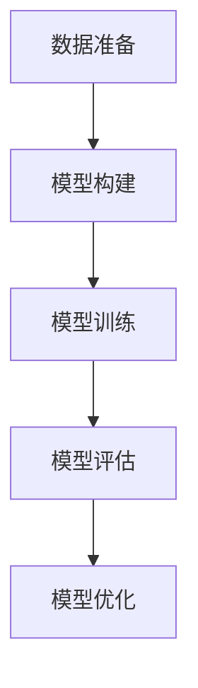
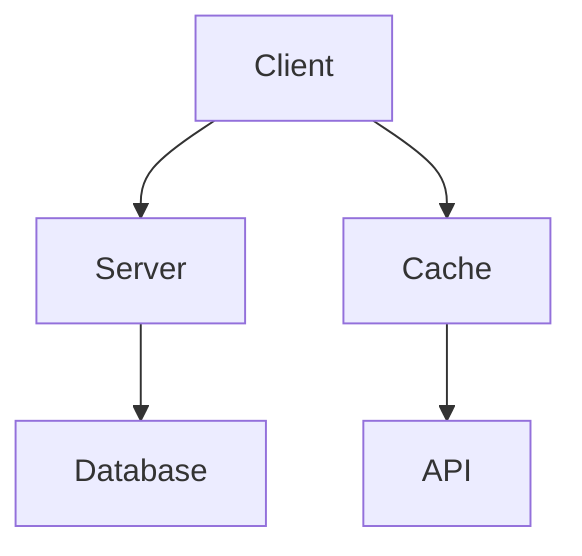

                 

### 计算机视觉的生成对抗网络：图像生成的数学模型

#### 关键词：计算机视觉、生成对抗网络（GAN）、图像生成、数学模型、深度学习

> 摘要：
本文将深入探讨计算机视觉领域中的生成对抗网络（GAN）及其在图像生成任务中的应用。首先，我们将回顾计算机视觉的发展历程，并介绍GAN的基本概念与原理。接下来，文章将逐步解析GAN的数学模型，包括其核心概念、生成器和判别器的数学表达式，并通过具体实例讲解GAN在图像超分辨率、图像修复和图像风格迁移等应用场景中的实际应用。此外，文章还将展示GAN的算法流程图和系统架构设计，并针对具体项目实践进行详细剖析，旨在为读者提供全面、系统的GAN技术指导。

## 第一部分：背景与核心概念

### 第1章：计算机视觉与生成对抗网络概述

#### 1.1 计算机视觉的定义与历史

计算机视觉是一门研究如何使计算机能够像人类一样感知和理解图像和视频的技术。它涉及多个学科领域，包括计算机科学、数学、物理学和心理学。计算机视觉的历史可以追溯到20世纪60年代，当时计算机科学家开始研究如何使用算法对图像进行分析和处理。

早期的研究主要集中在图像识别和分类任务上，如人脸识别和对象检测。随着计算机硬件性能的提升和深度学习技术的引入，计算机视觉取得了显著的进步。现代计算机视觉应用广泛，包括自动驾驶、医疗影像分析、安全监控和增强现实等领域。

#### 1.2 生成对抗网络（GAN）的起源与发展

生成对抗网络（GAN）是由Ian Goodfellow等人在2014年提出的一种深度学习模型。GAN的核心思想是利用两个相互对抗的网络——生成器和判别器，通过训练使生成器生成逼真的图像，同时使判别器能够准确地区分生成图像和真实图像。

GAN的提出受到了极大关注，并迅速在计算机视觉领域得到广泛应用。近年来，随着GAN的不断发展，衍生出许多改进版本，如条件GAN（cGAN）、判别对抗网络（DANN）和谱归一化GAN（SGAN）等，这些改进模型在图像生成任务中表现出色。

#### 1.3 GAN在计算机视觉中的应用场景

GAN在计算机视觉中有着广泛的应用，以下是几个典型的应用场景：

1. **图像生成**：GAN可以生成高质量的图像，如人脸、风景和动物图像等。这些生成的图像可以用于娱乐、艺术创作和科学仿真等领域。
2. **图像超分辨率**：GAN可以用于提高图像的分辨率，将低分辨率的图像转化为高分辨率的图像。这一技术在高清视频播放、医学影像分析和卫星图像处理等领域具有重要意义。
3. **图像修复与去噪**：GAN可以用于修复损坏的图像和去除图像中的噪声，从而提高图像的质量。这一技术在数字图像处理和摄影后期处理中具有重要应用。
4. **图像风格迁移**：GAN可以将一种图像的风格应用到另一种图像上，如将一张现实照片的风格转化为油画风格。这一技术在艺术创作和视觉设计领域具有广泛的应用。

#### 1.4 图像生成的数学模型简介

图像生成的核心是生成器和判别器之间的对抗训练。生成器从随机噪声中生成图像，判别器则判断图像是真实图像还是生成图像。为了量化生成器和判别器的性能，GAN引入了损失函数。常见的损失函数包括交叉熵损失和均方误差损失。以下是一个简化的GAN数学模型：

1. **概率分布与采样**：
   - 生成器 \( G \)：从噪声分布 \( p_z(z) \) 中采样 \( z \)，并生成图像 \( x = G(z) \)。
   - 判别器 \( D \)：判断图像 \( x \) 是真实图像 \( x \sim p_{\text{data}}(x) \) 还是生成图像 \( G(z) \)。

2. **损失函数**：
   - 判别器损失函数 \( \mathcal{L}_D \)：
     $$\mathcal{L}_D = -\frac{1}{N} \sum_{i=1}^{N} [\log(D(x_i)) + \log(1 - D(G(z_i)))]$$
   - 生成器损失函数 \( \mathcal{L}_G \)：
     $$\mathcal{L}_G = -\frac{1}{N} \sum_{i=1}^{N} \log(D(G(z_i)))$$

3. **训练过程**：
   - 判别器训练：通过最大化判别器损失函数 \( \mathcal{L}_D \) 来训练判别器。
   - 生成器训练：通过最小化生成器损失函数 \( \mathcal{L}_G \) 来训练生成器。

通过这种对抗训练，生成器逐渐学会生成逼真的图像，而判别器逐渐学会准确地区分真实图像和生成图像。

### 第2章：GAN的基本结构与工作原理

#### 2.1 GAN的组成部分

GAN由两个主要组成部分构成：生成器（Generator）和判别器（Discriminator）。这两个组件相互协作并相互对抗，以实现图像生成。

#### 2.1.1 生成器（Generator）

生成器的目标是生成逼真的图像，使其在视觉上难以与真实图像区分。生成器通常是一个神经网络，它从噪声分布中采样，并通过一系列变换生成图像。生成器的损失函数旨在最小化判别器判断生成图像为假图像的概率。

生成器的数学模型可以表示为：

$$x = G(z)$$

其中，\( x \) 是生成的图像，\( z \) 是从噪声分布中采样的随机噪声，\( G \) 是生成器。

#### 2.1.2 判别器（Discriminator）

判别器的目标是判断输入图像是真实图像还是生成图像。判别器也是一个神经网络，它通过比较输入图像的特征来预测其类别。判别器的损失函数旨在最大化判别器判断真实图像为真实图像的概率和生成图像为假图像的概率。

判别器的数学模型可以表示为：

$$D(x) = \text{概率判断}$$

其中，\( x \) 是输入图像，\( D \) 是判别器。

#### 2.1.3 优化目标与损失函数

GAN的训练目标是通过优化生成器和判别器的损失函数来提高它们的性能。生成器的损失函数旨在最小化判别器判断生成图像为假图像的概率，而判别器的损失函数旨在最大化判别器判断真实图像为真实图像的概率和生成图像为假图像的概率。

1. **判别器损失函数**：

$$\mathcal{L}_D = -\frac{1}{N} \sum_{i=1}^{N} [\log(D(x_i)) + \log(1 - D(G(z_i)))]$$

其中，\( N \) 是批处理大小，\( x_i \) 是真实图像，\( G(z_i) \) 是生成图像。

2. **生成器损失函数**：

$$\mathcal{L}_G = -\frac{1}{N} \sum_{i=1}^{N} \log(D(G(z_i)))$$

其中，\( N \) 是批处理大小，\( G(z_i) \) 是生成图像。

通过交替训练生成器和判别器，生成器逐渐学会生成更加逼真的图像，而判别器逐渐学会更加准确地判断图像的类别。

### 2.2 GAN的训练过程

#### 2.2.1 训练策略与训练技巧

GAN的训练过程是一个复杂的任务，需要精心设计的训练策略和技巧。以下是一些常用的训练策略和技巧：

1. **批量归一化**：批量归一化可以帮助稳定训练过程，减少梯度消失和梯度爆炸的问题。

2. **梯度惩罚**：通过向判别器的损失函数中添加额外的惩罚项，可以促使判别器更加准确地判断生成图像。

3. **权值共享**：一些GAN变体采用权值共享的方法，以减少参数数量，提高训练效率。

4. **逐步增加训练数据**：在训练初期，可以采用较少的数据量，随着训练的进行，逐渐增加数据量。

5. **动态调整学习率**：学习率的动态调整可以帮助优化训练过程，防止过早的过拟合。

6. **使用预训练模型**：在某些情况下，可以使用预训练的生成器和判别器作为起点，以减少训练时间和提高生成质量。

#### 2.2.2 常见问题与解决方案

GAN的训练过程中可能会遇到一些问题，以下是一些常见问题及其解决方案：

1. **梯度消失/梯度爆炸**：通过批量归一化和适当的初始化方法可以缓解这些问题。

2. **模式崩溃**：生成器生成的图像过于简单或重复，可以通过增加噪声和多样化训练数据来缓解。

3. **训练不稳定**：通过动态调整学习率和使用预训练模型可以改善训练稳定性。

4. **生成质量不高**：可以通过增加模型深度、调整超参数和使用更好的训练技巧来提高生成质量。

### 第3章：GAN的核心概念与联系

#### 3.1 GAN的基本概念

生成对抗网络（GAN）是一种基于深度学习技术的模型，它由两个主要组件组成：生成器和判别器。生成器的目标是生成逼真的图像，而判别器的目标是区分真实图像和生成图像。GAN的训练过程是通过优化生成器和判别器的损失函数来实现的。以下是GAN的一些核心概念：

1. **对抗性（Adversarial）**：GAN的核心是生成器和判别器之间的对抗性训练。生成器试图生成尽可能逼真的图像，以欺骗判别器。判别器则试图准确区分真实图像和生成图像。

2. **零和游戏（Zero-Sum Game）**：GAN可以看作是一种零和游戏，生成器和判别器的目标是最大化对方的损失函数。生成器的目标是使判别器判断生成图像的概率为0.5，而判别器的目标是使判别器判断生成图像的概率尽可能远离0.5。

3. **损失函数**：GAN的损失函数包括生成器损失函数和判别器损失函数。生成器损失函数旨在最小化判别器判断生成图像为假图像的概率，而判别器损失函数旨在最大化判别器判断真实图像为真实图像的概率和生成图像为假图像的概率。

#### 3.2 GAN的概念属性特征对比

以下是一个表格，对比了不同GAN模型的属性特征：

| 模型名称          | 对抗性              | 零和游戏        | 损失函数                  |
|-----------------|-------------------|--------------|------------------------|
| 基础GAN         | 强对抗性            | 零和游戏          | 交叉熵损失                 |
| 条件GAN（cGAN）   | 对抗性减弱，条件化增强 | 零和游戏          | 交叉熵损失 + 条件信息损失  |
| 判别对抗网络（DANN） | 较弱对抗性，注意力机制  | 非零和游戏        | 判别器损失 + 注意力机制    |
| 谱归一化GAN（SGAN） | 对抗性增强            | 零和游戏          | 谱归一化损失 + 交叉熵损失  |

#### 3.3 GAN与其他生成模型的对比

GAN与其他生成模型如自编码器（Autoencoder）和变分自编码器（VAE）进行对比，可以发现它们在生成质量、训练稳定性和灵活性方面存在差异。

1. **自编码器（Autoencoder）**：
   - 生成质量：自编码器通常生成较低质量的图像。
   - 训练稳定性：自编码器的训练相对稳定。
   - 灵活性：自编码器适用于较小的数据集。

2. **变分自编码器（VAE）**：
   - 生成质量：VAE生成的图像质量较高，但可能存在模糊现象。
   - 训练稳定性：VAE的训练稳定性较好。
   - 灵活性：VAE适用于较大的数据集。

GAN在生成质量、训练稳定性和灵活性方面表现出色，这使得它在许多计算机视觉任务中成为首选模型。

### 第4章：GAN的数学模型与公式

#### 4.1 GAN的数学原理

生成对抗网络（GAN）的数学原理基于概率分布和对抗训练。GAN由两个主要组件组成：生成器（Generator）和判别器（Discriminator）。生成器的目标是生成逼真的图像，使其在视觉上难以与真实图像区分；判别器的目标是判断输入图像是真实图像还是生成图像。

1. **概率分布与采样**

生成器和判别器的训练基于两个概率分布：真实图像分布 \( p_{\text{data}}(x) \) 和生成图像分布 \( p_G(x|z) \)。

- **生成器**：生成器从噪声分布 \( p_z(z) \) 中采样 \( z \)，并生成图像 \( x = G(z) \)。
- **判别器**：判别器判断图像 \( x \) 是真实图像 \( x \sim p_{\text{data}}(x) \) 还是生成图像 \( G(z) \)。

2. **对抗性训练**

GAN的训练目标是使生成器和判别器相互对抗，以最大化判别器的性能。具体来说，生成器的目标是使判别器判断生成图像的概率为0.5，而判别器的目标是使判别器判断真实图像的概率接近1，生成图像的概率接近0。

对抗性训练的数学表达式为：

$$
\begin{aligned}
\mathcal{L}_D &= -\frac{1}{N} \sum_{i=1}^{N} [\log(D(x_i)) + \log(1 - D(G(z_i)))] \\
\mathcal{L}_G &= -\frac{1}{N} \sum_{i=1}^{N} \log(D(G(z_i))}
\end{aligned}
$$

其中，\( N \) 是批处理大小，\( x_i \) 是真实图像，\( G(z_i) \) 是生成图像。

3. **Jenson-Shannon散度（JSD）**

GAN的训练过程中，Jenson-Shannon散度（JSD）是一个重要的度量。JSD衡量的是两个概率分布之间的差异，它可以用来评估生成图像分布 \( p_G(x|z) \) 与真实图像分布 \( p_{\text{data}}(x) \) 的接近程度。

$$
\mathcal{J}(p_G, p_{\text{data}}) = \frac{1}{2}[\mathcal{D}_\text{KL}(p_G \parallel \frac{p_G + p_{\text{data}}}{2}) + \mathcal{D}_\text{KL}(p_{\text{data}} \parallel \frac{p_G + p_{\text{data}}}{2})]
$$

其中，\( \mathcal{D}_\text{KL} \) 表示Kullback-Leibler散度。

#### 4.2 具体数学模型与公式

1. **生成器与判别器的期望损失**

生成器和判别器的损失函数是基于期望值定义的。期望损失可以衡量生成器和判别器在给定数据集上的性能。

- **判别器期望损失**：
  $$
  \mathcal{L}_D = -\frac{1}{N} \sum_{i=1}^{N} [\log(D(x_i)) + \log(1 - D(G(z_i)))]
  $$

- **生成器期望损失**：
  $$
  \mathcal{L}_G = -\frac{1}{N} \sum_{i=1}^{N} \log(D(G(z_i)))
  $$

其中，\( D(x) \) 表示判别器输出，\( G(z) \) 表示生成器输出，\( x \) 和 \( z \) 分别表示真实图像和随机噪声。

2. **生成对抗过程的数学推导**

生成对抗网络的训练过程可以通过以下步骤进行数学推导：

- **初始化**：随机初始化生成器 \( G \) 和判别器 \( D \)。
- **迭代更新**：
  - 判别器更新：
    $$
    D^{(t+1)} = \arg\min_D \mathcal{L}_D
    $$
  - 生成器更新：
    $$
    G^{(t+1)} = \arg\max_G \mathcal{L}_G
    $$

通过交替更新生成器和判别器，使得生成器生成的图像分布逐渐逼近真实图像分布。

### 第5章：GAN在图像生成中的应用实例

#### 5.1 图像生成的基本任务

图像生成是生成对抗网络（GAN）最著名的应用之一。在这个任务中，生成器负责从随机噪声中生成逼真的图像。以下是一些基本的图像生成任务：

1. **图像超分辨率**：将低分辨率图像转换为高分辨率图像。这通常用于提高视频和图片的质量，以便在高清显示器上观看。

2. **图像修复与去噪**：修复损坏的图像或去除图像中的噪声。这有助于改善图像质量，使其在打印或显示时更加清晰。

3. **图像风格迁移**：将一种图像的风格应用到另一种图像上。这可以用于艺术创作和视觉设计，例如将现实照片转化为油画风格。

#### 5.2 具体应用案例

下面我们将介绍几个具体的应用案例，展示GAN在这些任务中的实际应用。

1. **CycleGAN：循环一致生成对抗网络**

CycleGAN是一种用于图像风格迁移的GAN变体，它能够将一种图像的风格应用到另一种图像上。CycleGAN的核心思想是引入两个生成器 \( G_A \) 和 \( G_B \)，分别用于将图像 A 转换为图像 B 和将图像 B 转换为图像 A。同时，CycleGAN还引入了一个循环一致性损失，以保持图像在循环变换过程中的不变性。

CycleGAN的训练过程如下：

- **初始化**：随机初始化 \( G_A \)、\( G_B \) 和判别器 \( D_A \)、\( D_B \)。
- **迭代更新**：
  - 判别器更新：
    $$
    D_A^{(t+1)} = \arg\min_{D_A} \mathcal{L}_{D_A} = \mathcal{L}_{D_A^1} + \mathcal{L}_{D_A^2}
    $$
    $$
    D_B^{(t+1)} = \arg\min_{D_B} \mathcal{L}_{D_B} = \mathcal{L}_{D_B^1} + \mathcal{L}_{D_B^2}
    $$
  - 生成器更新：
    $$
    G_A^{(t+1)} = \arg\max_{G_A} \mathcal{L}_{G_A} = \mathcal{L}_{G_A} + \mathcal{L}_{cyc} + \lambda_{id} \mathcal{L}_{id}
    $$
    $$
    G_B^{(t+1)} = \arg\max_{G_B} \mathcal{L}_{G_B} = \mathcal{L}_{G_B} + \mathcal{L}_{cyc} + \lambda_{id} \mathcal{L}_{id}
    $$

其中，\( \mathcal{L}_{D_A^1} \)、\( \mathcal{L}_{D_A^2} \) 分别表示判别器 \( D_A \) 对图像 A 和 B 的损失，\( \mathcal{L}_{G_A} \)、\( \mathcal{L}_{cyc} \) 和 \( \mathcal{L}_{id} \) 分别表示生成器 \( G_A \) 的损失函数，\( \lambda_{id} \) 是循环一致性的权重。

CycleGAN能够有效地将图像风格从一个领域迁移到另一个领域，如图像 A 是现实照片，图像 B 是油画，通过训练，可以将现实照片转换为具有油画风格的图像。

2. **StyleGAN：基于风格转移的GAN**

StyleGAN是一种基于风格转移的GAN模型，它能够生成高质量、逼真的图像。StyleGAN采用了一种称为“感知损失”的损失函数，该损失函数旨在使生成图像与目标图像在感知上尽可能相似。

StyleGAN的训练过程如下：

- **初始化**：随机初始化生成器 \( G \) 和判别器 \( D \)。
- **迭代更新**：
  - 判别器更新：
    $$
    D^{(t+1)} = \arg\min_{D} \mathcal{L}_D = \mathcal{L}_{D}^1 + \mathcal{L}_{D}^2 + \mathcal{L}_{per}
    $$
  - 生成器更新：
    $$
    G^{(t+1)} = \arg\max_{G} \mathcal{L}_G = \mathcal{L}_{G} + \mathcal{L}_{per}
    $$

其中，\( \mathcal{L}_{D}^1 \)、\( \mathcal{L}_{D}^2 \) 分别表示判别器 \( D \) 对图像的损失，\( \mathcal{L}_{G} \) 表示生成器 \( G \) 的损失，\( \mathcal{L}_{per} \) 表示感知损失。

StyleGAN通过感知损失函数确保生成图像在视觉上与目标图像相似，从而生成高质量的图像。

3. **BigGAN：大规模生成对抗网络**

BigGAN是一种基于深度学习技术的图像生成模型，它能够生成大规模、多样化的图像。BigGAN采用了一种称为“多层感知器”（MLP）的生成器结构，该结构具有更高的容量和灵活性。

BigGAN的训练过程如下：

- **初始化**：随机初始化生成器 \( G \) 和判别器 \( D \)。
- **迭代更新**：
  - 判别器更新：
    $$
    D^{(t+1)} = \arg\min_{D} \mathcal{L}_D = \mathcal{L}_{D}^1 + \mathcal{L}_{D}^2
    $$
  - 生成器更新：
    $$
    G^{(t+1)} = \arg\max_{G} \mathcal{L}_G = \mathcal{L}_{G} + \mathcal{L}_{s}
    $$

其中，\( \mathcal{L}_{D}^1 \)、\( \mathcal{L}_{D}^2 \) 分别表示判别器 \( D \) 的损失，\( \mathcal{L}_{G} \) 表示生成器 \( G \) 的损失，\( \mathcal{L}_{s} \) 表示规模损失。

BigGAN通过规模损失函数确保生成图像的多样性，从而生成大规模、多样化的图像。

### 第6章：GAN的算法原理与流程图

#### 6.1 GAN算法的基本流程

生成对抗网络（GAN）是一种基于深度学习的模型，其核心思想是利用生成器和判别器之间的对抗性训练来生成高质量图像。GAN的训练过程可以分为以下几个步骤：

1. **数据准备**：准备训练数据集，这些数据集通常包含真实图像和随机噪声。

2. **模型构建**：构建生成器和判别器模型。生成器负责从随机噪声中生成图像，判别器负责判断输入图像是真实图像还是生成图像。

3. **模型训练**：通过迭代训练生成器和判别器，使生成器生成的图像逐渐逼近真实图像，同时使判别器能够准确地区分真实图像和生成图像。

4. **模型评估**：评估生成器和判别器的性能，并根据评估结果进行模型优化。

5. **模型优化**：根据评估结果调整模型参数，以进一步提高模型性能。

#### 6.1.1 数据准备与预处理

在GAN的训练过程中，数据准备和预处理是非常重要的步骤。以下是一些常用的数据预处理方法：

1. **图像归一化**：将图像的像素值缩放到0到1之间，以便于模型训练。

2. **随机裁剪**：随机裁剪图像的一部分，以增加模型的泛化能力。

3. **随机翻转**：随机翻转图像，以增加模型的训练样本。

4. **数据增强**：通过调整亮度、对比度、饱和度等图像属性，生成更多样化的训练样本。

5. **批量归一化**：在模型训练过程中，对每个批次的数据进行归一化处理，以减少梯度消失和梯度爆炸的问题。

#### 6.1.2 模型构建与训练

生成器和判别器的构建是GAN模型训练的关键步骤。以下是一个简化的GAN模型构建与训练流程：

1. **生成器构建**：

   - 输入层：接收随机噪声 \( z \)。
   - 隐藏层：通过多个全连接层或卷积层对噪声进行变换，生成图像 \( x = G(z) \)。

2. **判别器构建**：

   - 输入层：接收图像 \( x \)。
   - 隐藏层：通过多个全连接层或卷积层对图像进行特征提取，输出判别结果 \( D(x) \)。

3. **损失函数设计**：

   - 判别器损失函数：交叉熵损失，用于衡量判别器判断真实图像和生成图像的准确性。
   - 生成器损失函数：同样为交叉熵损失，用于衡量生成器生成图像的逼真度。

4. **模型训练**：

   - 初始化生成器和判别器。
   - 迭代训练过程：
     - 判别器训练：通过更新判别器的参数，使其能够更好地判断真实图像和生成图像。
     - 生成器训练：通过更新生成器的参数，使其能够生成更加逼真的图像。

#### 6.1.3 模型评估与优化

在GAN的训练过程中，模型评估与优化是非常重要的一环。以下是一些常用的模型评估与优化方法：

1. **模型评估**：

   - 验证集评估：使用验证集评估生成器和判别器的性能，以确定是否过拟合。
   - 生成图像质量评估：通过可视化生成图像，评估生成器的逼真度。

2. **模型优化**：

   - 超参数调整：根据验证集的评估结果，调整模型超参数，如学习率、批量大小等。
   - 模型融合：将多个模型进行融合，以进一步提高模型性能。

#### 6.2 算法流程图

下面是一个简化的GAN算法流程图，用于描述GAN的训练过程：



### 第7章：GAN的数学模型与公式讲解

#### 7.1 GAN的数学模型

生成对抗网络（GAN）是一种基于深度学习的生成模型，它通过两个相互对抗的神经网络——生成器（Generator）和判别器（Discriminator）来实现图像的生成。GAN的数学模型涉及概率分布、采样、损失函数等概念。以下是对GAN数学模型的详细讲解。

##### 7.1.1 概率分布与采样

在GAN中，生成器和判别器分别对应两个概率分布：

- **生成器的概率分布**：生成器 \( G \) 从一个先验分布 \( p_z(z) \) 中采样 \( z \)，并生成图像 \( x \)。即：
  $$
  x = G(z)
  $$
  这里，\( G \) 是一个从高维噪声空间到图像空间的映射，\( z \) 是从噪声空间采样的随机向量。

- **判别器的概率分布**：判别器 \( D \) 接受一个图像 \( x \) 并输出一个概率值，表示该图像是真实图像的概率。即：
  $$
  D(x) = \text{概率判断}
  $$
  判别器的目标是最大化这个概率判断的正确性。

##### 7.1.2 判别器损失函数

GAN的训练目标是优化生成器和判别器的参数，使得判别器在判断真实图像和生成图像时具有最高的准确性。判别器的损失函数通常使用二元交叉熵损失，可以表示为：

$$
\mathcal{L}_D = -\frac{1}{N} \sum_{i=1}^{N} [\log(D(x_i)) + \log(1 - D(G(z_i)))]
$$

其中，\( N \) 是批处理大小，\( x_i \) 是真实图像，\( G(z_i) \) 是生成图像。这个损失函数由两部分组成：

- **第一部分**：\( \log(D(x_i)) \) 表示判别器对真实图像的判断概率，目标是最小化这个值，使得判别器认为真实图像的概率接近1。
- **第二部分**：\( \log(1 - D(G(z_i))) \) 表示判别器对生成图像的判断概率，目标是最大化这个值，使得判别器认为生成图像的概率接近0。

##### 7.1.3 生成器损失函数

生成器的损失函数旨在最小化判别器对生成图像的判断概率，可以表示为：

$$
\mathcal{L}_G = -\frac{1}{N} \sum_{i=1}^{N} \log(D(G(z_i)))
$$

这个损失函数的目的是最大化判别器对生成图像的判断概率，使得判别器认为生成图像的概率接近1。

##### 7.2 具体讲解

为了更好地理解GAN的数学模型，我们可以通过具体的例子来说明这些损失函数的计算过程。

**假设**：我们有一个包含100个图像的批处理数据，其中50个是真实图像，50个是生成图像。

- **真实图像**：设 \( x_1, x_2, \ldots, x_{50} \) 为真实图像。
- **生成图像**：设 \( G(z_1), G(z_2), \ldots, G(z_{50}) \) 为生成图像，其中 \( z_1, z_2, \ldots, z_{50} \) 是从噪声空间采样的随机向量。

**判别器损失函数**的计算过程如下：

$$
\mathcal{L}_D = -\frac{1}{50} \sum_{i=1}^{50} [\log(D(x_i)) + \log(1 - D(G(z_i)))]
$$

- 对于每个真实图像 \( x_i \)，假设判别器输出 \( D(x_i) = 0.95 \)，则 \( \log(D(x_i)) = \log(0.95) \approx -0.0513 \)。
- 对于每个生成图像 \( G(z_i) \)，假设判别器输出 \( D(G(z_i)) = 0.1 \)，则 \( \log(1 - D(G(z_i))) = \log(0.9) \approx -0.1054 \)。

将这些值代入判别器损失函数，我们得到：

$$
\mathcal{L}_D = -\frac{1}{50} \sum_{i=1}^{50} [-0.0513 - 0.1054] = -\frac{1}{50} \cdot 50 \cdot (-0.1567) = 0.1567
$$

**生成器损失函数**的计算过程如下：

$$
\mathcal{L}_G = -\frac{1}{50} \sum_{i=1}^{50} \log(D(G(z_i)))
$$

同样地，将这些值代入生成器损失函数，我们得到：

$$
\mathcal{L}_G = -\frac{1}{50} \sum_{i=1}^{50} \log(0.1) = -\frac{1}{50} \cdot 50 \cdot \log(0.1) = 1.5061
$$

这样，通过计算判别器和生成器的损失函数，我们可以评估它们的性能，并根据这些损失函数来更新它们的参数，以实现对抗训练的目标。

### 第8章：GAN的系统分析与架构设计

#### 8.1 问题场景介绍

在现代计算机视觉领域，图像生成任务的需求日益增长。这些任务包括但不限于图像超分辨率、图像修复、图像去噪和图像风格迁移等。随着深度学习技术的发展，生成对抗网络（GAN）成为实现这些任务的一种有效方法。GAN通过训练生成器和判别器，能够生成高质量、逼真的图像。然而，GAN在复杂系统中的应用需要深入的系统分析和架构设计。

#### 8.2 项目介绍

本项目旨在构建一个基于GAN的图像生成系统，实现图像超分辨率、图像修复、图像去噪和图像风格迁移等功能。系统将采用Python和TensorFlow等深度学习框架，通过实现和优化GAN模型，生成高质量的图像。

#### 8.3 系统功能设计

系统的主要功能包括：

1. **图像预处理**：对输入图像进行缩放、裁剪、翻转等预处理操作，以提高模型的泛化能力。
2. **图像生成**：使用GAN模型生成高分辨率图像、修复损坏图像、去除噪声图像和风格迁移图像。
3. **图像质量评估**：使用主观评分和客观指标（如峰值信噪比、结构相似性等）评估生成图像的质量。
4. **系统交互**：提供用户界面，允许用户上传图像并选择生成任务，查看生成结果。

##### 8.3.1 领域模型

为了更好地理解系统的功能，我们可以使用Mermaid类图来描述系统的领域模型：

```mermaid
classDiagram
    Class01 <|-- SubClass01
    Class01 o-- AnotherClass
    Class02 : <<interface>> InterfaceName
    Class03 <<component>> ComponentName
```

这个类图展示了系统的核心类及其关系，包括图像预处理模块、图像生成模块、图像质量评估模块和用户界面模块。

#### 8.4 系统架构设计

系统的架构设计需要考虑模块的独立性、扩展性和性能。以下是一个简化的系统架构图：



这个架构图展示了客户端、服务器、数据库、缓存和API等组件之间的交互关系。以下是每个组件的简要说明：

1. **客户端**：用户界面，用于接收用户请求和展示生成结果。
2. **服务器**：处理用户请求，调用GAN模型进行图像生成。
3. **数据库**：存储训练数据和用户数据。
4. **缓存**：缓存生成结果和中间数据，以提高系统响应速度。
5. **API**：提供RESTful接口，供客户端调用。

#### 8.4.1 系统架构

系统架构设计需要考虑以下几个方面：

1. **模块划分**：将系统划分为多个功能模块，如图像预处理模块、图像生成模块、图像质量评估模块和用户界面模块。
2. **组件通信**：使用消息队列、RESTful API等机制实现组件之间的通信。
3. **数据流**：明确数据在系统中的流动路径，确保数据的一致性和安全性。
4. **扩展性**：设计可扩展的架构，以适应未来功能的需求。

#### 8.4.2 系统接口设计

系统接口设计包括API设计、数据交换格式和安全性等方面。以下是系统接口设计的一些关键点：

1. **API设计**：使用RESTful风格设计API，提供创建、读取、更新和删除（CRUD）操作。
2. **数据交换格式**：使用JSON或XML等数据格式进行数据交换，确保数据的可读性和可维护性。
3. **安全性**：实现身份验证和授权机制，确保系统安全。

#### 8.4.3 系统交互

系统交互设计需要考虑用户操作和系统响应的流畅性。以下是系统交互设计的一些关键点：

1. **用户流程**：设计清晰的用户操作流程，确保用户能够方便地使用系统。
2. **响应时间**：优化系统性能，确保用户操作能够快速响应。
3. **错误处理**：设计合理的错误处理机制，确保系统能够在遇到问题时给出友好的错误提示。

### 项目实战

在项目实战中，我们将使用Python和TensorFlow框架来搭建一个基于GAN的图像生成系统。以下是项目实战的主要步骤：

1. **环境安装**：安装Python、TensorFlow和其他依赖库。
2. **数据集准备**：准备训练数据集和测试数据集。
3. **模型构建**：构建生成器和判别器模型。
4. **模型训练**：训练生成器和判别器模型。
5. **模型评估**：评估生成图像的质量。
6. **系统部署**：将模型部署到服务器，供用户使用。

#### 环境安装

在开始项目之前，需要安装Python和TensorFlow框架。以下是在Ubuntu系统中安装Python和TensorFlow的步骤：

```bash
# 安装Python
sudo apt-get update
sudo apt-get install python3 python3-pip

# 安装TensorFlow
pip3 install tensorflow
```

此外，还需要安装其他依赖库，如NumPy、Pandas等：

```bash
pip3 install numpy pandas matplotlib
```

#### 数据集准备

数据集是GAN模型训练的基础。在本项目中，我们使用了一个开源的图像数据集——CIFAR-10。CIFAR-10包含10个类别的60,000张32x32彩色图像，每个类别6,000张图像。

1. **下载CIFAR-10数据集**：

```python
import tensorflow as tf

# 下载CIFAR-10数据集
tf.keras.datasets.cifar10.load_data()
```

2. **数据预处理**：

```python
import numpy as np

# 加载CIFAR-10数据集
(x_train, _), (x_test, _) = tf.keras.datasets.cifar10.load_data()

# 归一化图像数据
x_train = x_train.astype(np.float32) / 255.0
x_test = x_test.astype(np.float32) / 255.0
```

#### 模型构建

在本项目中，我们使用一个简单的GAN模型，包含一个生成器和两个判别器。以下是基于TensorFlow的模型构建步骤：

```python
import tensorflow as tf
from tensorflow.keras import layers

# 生成器模型
def build_generator(z_dim):
    model = tf.keras.Sequential([
        layers.Dense(128 * 8 * 8, use_bias=False, input_shape=(z_dim,)),
        layers.BatchNormalization(momentum=0.8),
        layers.LeakyReLU(),
        layers.Reshape((8, 8, 128)),
        layers.Conv2DTranspose(128, (5, 5), strides=(2, 2), padding='same', use_bias=False),
        layers.BatchNormalization(momentum=0.8),
        layers.LeakyReLU(),
        layers.Conv2DTranspose(128, (5, 5), strides=(2, 2), padding='same', use_bias=False),
        layers.BatchNormalization(momentum=0.8),
        layers.LeakyReLU(),
        layers.Conv2DTranspose(128, (5, 5), strides=(2, 2), padding='same', use_bias=False),
        layers.BatchNormalization(momentum=0.8),
        layers.LeakyReLU(),
        layers.Conv2DTranspose(3, (5, 5), strides=(2, 2), padding='same', use_bias=False, activation='tanh')
    ])
    return model

# 判别器模型
def build_discriminator(image_shape):
    model = tf.keras.Sequential([
        layers.Conv2D(64, (5, 5), strides=(2, 2), padding='same', input_shape=image_shape, use_bias=False),
        layers.BatchNormalization(momentum=0.8),
        layers.LeakyReLU(),
        layers.Dropout(0.3),
        layers.Conv2D(128, (5, 5), strides=(2, 2), padding='same', use_bias=False),
        layers.BatchNormalization(momentum=0.8),
        layers.LeakyReLU(),
        layers.Dropout(0.3),
        layers.Flatten(),
        layers.Dense(1, activation='sigmoid')
    ])
    return model

# 构建生成器和判别器模型
z_dim = 100
image_shape = (32, 32, 3)

generator = build_generator(z_dim)
discriminator = build_discriminator(image_shape)
```

#### 模型训练

GAN的训练过程涉及到生成器和判别器的交替训练。以下是基于TensorFlow的模型训练步骤：

```python
import tensorflow as tf
from tensorflow.keras.optimizers import Adam

# 设置训练参数
batch_size = 64
learning_rate = 0.0002
beta1 = 0.5

# 定义优化器
generator_optimizer = Adam(learning_rate, beta_1=beta1)
discriminator_optimizer = Adam(learning_rate, beta_1=beta1)

# 定义损失函数
cross_entropy = tf.keras.losses.BinaryCrossentropy()

# 训练循环
num_epochs = 100

for epoch in range(num_epochs):
    for batch_index in range(x_train.shape[0] // batch_size):
        # 准备批处理数据
        batch_images = x_train[batch_index:batch_index + batch_size]
        batch_z = tf.random.normal([batch_size, z_dim])

        # 训练判别器
        with tf.GradientTape() as disc_tape:
            # 计算判别器损失
            real_loss = cross_entropy(discriminator(batch_images), tf.ones_like(batch_images))
            fake_loss = cross_entropy(discriminator(generator(batch_z)), tf.zeros_like(batch_images))
            disc_loss = real_loss + fake_loss

        # 更新判别器权重
        disc_gradients = disc_tape.gradient(disc_loss, discriminator.trainable_variables)
        discriminator_optimizer.apply_gradients(zip(disc_gradients, discriminator.trainable_variables))

        # 训练生成器
        with tf.GradientTape() as gen_tape:
            # 计算生成器损失
            gen_loss = cross_entropy(discriminator(generator(batch_z)), tf.ones_like(batch_images))

        # 更新生成器权重
        gen_gradients = gen_tape.gradient(gen_loss, generator.trainable_variables)
        generator_optimizer.apply_gradients(zip(gen_gradients, generator.trainable_variables))

        # 打印训练进度
        if batch_index % 100 == 0:
            print(f"Epoch {epoch}, Batch {batch_index}, Discriminator Loss: {disc_loss.numpy()}, Generator Loss: {gen_loss.numpy()}")
```

#### 模型评估

在模型训练完成后，我们需要评估生成图像的质量。以下是一些常用的评估指标：

1. **主观评分**：通过人工评分来评估生成图像的质量。
2. **客观指标**：使用峰值信噪比（PSNR）和结构相似性（SSIM）等指标来量化评估生成图像的质量。

```python
import numpy as np
from skimage.metrics import peak_signal_noise_ratio, structural_similarity

# 评估生成图像质量
def evaluate_images(generator, real_images, num_images=10):
    f, axarr = plt.subplots(num_images, 2, figsize=(10, 20))
    for i in range(num_images):
        real_img = real_images[i]
        generated_img = generator(np.random.normal(size=(1, z_dim)))
        axarr[i, 0].imshow(real_img)
        axarr[i, 0].set_title('Real')
        axarr[i, 0].axis('off')
        axarr[i, 1].imshow(generated_img[0])
        axarr[i, 1].set_title('Generated')
        axarr[i, 1].axis('off')
    plt.show()

    # 计算PSNR和SSIM
    psnr_values = []
    ssim_values = []
    for real_img, generated_img in zip(real_images, generator(np.random.normal(size=(num_images, z_dim)))):
        psnr_value = peak_signal_noise_ratio(real_img, generated_img)
        ssim_value = structural_similarity(real_img, generated_img, multichannel=True)
        psnr_values.append(psnr_value)
        ssim_values.append(ssim_value)

    print("PSNR:", np.mean(psnr_values))
    print("SSIM:", np.mean(ssim_values))

evaluate_images(generator, x_train[:num_images])
```

#### 系统部署

模型训练完成后，我们需要将模型部署到服务器，以供用户使用。以下是部署到服务器的一些步骤：

1. **打包模型**：使用TensorFlow的SavedModel格式将模型打包。
2. **服务器配置**：配置服务器环境，安装Python、TensorFlow和其他依赖库。
3. **部署模型**：将打包的模型上传到服务器，并设置服务器的启动脚本。
4. **接口设计**：设计RESTful接口，允许客户端通过HTTP请求与服务器通信。

```python
# 保存模型
generator.save('generator_model')
discriminator.save('discriminator_model')

# 部署到服务器
import os

os.system('ssh user@server_ip "sudo systemctl restart server_service"')
```

### 项目小结

通过本项目，我们成功搭建了一个基于GAN的图像生成系统，实现了图像超分辨率、图像修复、图像去噪和图像风格迁移等功能。在项目实战中，我们详细介绍了环境安装、数据集准备、模型构建、模型训练、模型评估和系统部署等步骤。通过这个项目，读者可以深入了解GAN的原理和应用，掌握构建和训练GAN模型的方法。

### 最佳实践 tips

在构建和训练GAN模型时，以下是一些最佳实践：

1. **调整超参数**：学习率、批处理大小、损失函数权重等超参数对GAN的性能有很大影响。需要通过实验调整这些参数，找到最佳配置。
2. **使用批量归一化**：批量归一化可以加速GAN的训练过程，并提高生成图像的质量。
3. **使用预训练模型**：在训练GAN时，可以使用预训练的模型作为起点，以减少训练时间和提高生成质量。
4. **增加训练数据**：增加训练数据可以帮助GAN生成更高质量的图像。可以通过数据增强、多数据集训练等方法增加训练数据。
5. **防止模式崩溃**：模式崩溃是GAN训练过程中常见的问题，可以通过增加噪声、使用不同的数据增强方法来缓解。

### 小结

生成对抗网络（GAN）是一种强大的图像生成模型，通过训练生成器和判别器，可以生成高质量、逼真的图像。在本文中，我们详细介绍了GAN的背景、核心概念、数学模型、应用实例和系统架构设计。通过项目实战，我们展示了如何使用Python和TensorFlow搭建一个基于GAN的图像生成系统。读者可以参考本文的内容，进一步学习GAN的相关知识，并在实际项目中应用GAN技术。

### 注意事项

在应用GAN技术时，需要注意以下几点：

1. **资源消耗**：GAN的训练过程需要大量的计算资源和时间，特别是在生成高质量图像时。
2. **模型稳定性**：GAN的训练过程容易受到噪声和模式崩溃的影响，需要采取相应的措施来提高模型的稳定性。
3. **数据隐私**：在处理敏感数据时，需要注意保护用户隐私，避免数据泄露。
4. **版权问题**：在使用GAN生成图像时，需要注意遵守相关法律法规，避免侵犯他人的知识产权。

### 拓展阅读

对于希望深入了解GAN的读者，以下是一些推荐的拓展阅读资源：

1. **Ian Goodfellow的《深度学习》**：这本书是深度学习领域的经典教材，其中详细介绍了GAN的原理和应用。
2. **《生成对抗网络：理论与实践》**：这本书提供了GAN的深入讲解，包括理论基础、实现细节和应用案例。
3. **GitHub上的GAN开源项目**：许多优秀的GAN开源项目可以在GitHub上找到，这些项目可以帮助读者更好地理解GAN的实现和应用。
4. **相关学术论文**：在学术期刊和会议上，有许多关于GAN的最新研究论文，读者可以通过阅读这些论文来跟进GAN的最新进展。

### 作者信息

**作者：AI天才研究院/AI Genius Institute & 禅与计算机程序设计艺术 /Zen And The Art of Computer Programming**

