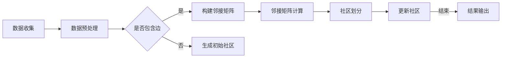
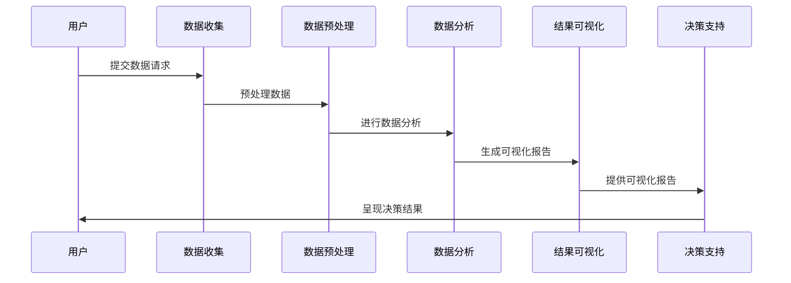

                 

# {{计算社会科学的兴起：数据驱动理解人类社会与世界}}

> 关键词：计算社会科学，数据驱动，社会网络分析，机器学习，数据可视化，趋势与挑战

> 摘要：本文探讨了计算社会科学的兴起及其在理解人类社会与世界中的应用。首先，我们介绍了计算社会科学的定义、背景和重要性。接着，我们详细阐述了数据驱动的理论基础，包括基本概念、数据类型、数据收集和分析方法。随后，我们展示了数据驱动方法在社会科学中的应用，并通过具体案例进行了深入探讨。最后，我们对计算社会科学的未来趋势和挑战进行了展望。

## 第一部分：引言

### 第1章：计算社会科学的概述

#### 1.1 计算社会科学的定义

计算社会科学是一门交叉学科，它结合了社会科学与计算技术的优势，利用计算技术来分析社会现象和解决问题。计算社会科学的主要目标是利用数据驱动的方法，对社会现象进行定量分析，从而揭示社会规律和机制。

#### 1.2 计算社会科学的起源

计算社会科学的起源可以追溯到20世纪中期，随着计算机技术的发展，社会科学研究者开始尝试将计算机技术应用于社会研究。早期的计算社会科学主要关注社会调查数据的统计分析，随着大数据和机器学习的兴起，计算社会科学的研究方法和应用领域得到了极大的扩展。

#### 1.3 计算社会科学的重要性

计算社会科学的重要性在于它能够提供更准确、更全面的社会理解。通过数据驱动的方法，计算社会科学可以揭示社会现象中的复杂关系和动态变化，有助于我们更好地理解人类社会，为政策制定和决策提供科学依据。

#### 1.4 计算社会科学的研究方法

计算社会科学的研究方法主要包括数据收集、数据分析和结果解释。数据收集方法包括社会调查、在线数据收集和传感器数据收集等。数据分析方法包括统计分析、机器学习和数据可视化等。结果解释则需要结合社会学理论和社会实践经验，对数据分析结果进行合理的解释。

### 第2章：数据驱动的理论基础

#### 2.1 数据驱动方法的基本概念

数据驱动方法是一种基于数据分析和建模的研究方法，它通过从数据中提取信息，以解决实际问题。数据驱动方法的核心是数据，其质量直接影响研究结果的准确性和可靠性。

#### 2.2 数据类型

数据类型可以分为定量数据和定性数据。定量数据通常以数字形式表示，如人口统计数据、经济数据等。定性数据则以文本、图像等形式存在，如社会调查问卷、新闻报道等。

#### 2.3 数据收集方法

数据收集方法包括社会调查、在线数据收集和传感器数据收集等。社会调查是一种常见的数据收集方法，通过问卷或访谈获取数据。在线数据收集利用互联网获取数据，如社交媒体数据、电商数据等。传感器数据收集则通过各种传感器获取环境数据，如气象数据、交通数据等。

#### 2.4 数据分析方法

数据分析方法包括统计分析、机器学习和数据可视化等。统计分析是对定量数据进行分析的方法，如描述性统计、回归分析等。机器学习是一种基于数据建模的方法，通过训练模型来预测和分类数据。数据可视化则是通过图形和图表来展示数据分析结果，以更直观地理解数据。

## 第二部分：计算社会科学的应用

### 第3章：数据驱动方法在社会科学中的应用

#### 3.1 社会网络分析

社会网络分析是一种基于图论的方法，用于研究社会网络的结构和属性。通过分析社会网络中的节点和边，可以揭示社会关系、传播机制和社会影响力等。

#### 3.2 时间序列分析

时间序列分析是一种用于分析时间序列数据的统计分析方法。通过分析时间序列的规律和趋势，可以预测未来的发展趋势和变化。

#### 3.3 机器学习在社会科学研究中的应用

机器学习在社会科学研究中有着广泛的应用，如社会情感分析、人群行为预测等。通过训练机器学习模型，可以自动提取数据中的模式和规律，为决策提供支持。

#### 3.4 数据可视化在社会科学研究中的应用

数据可视化是社会科学研究中的重要工具，通过图形和图表展示数据，可以更直观地理解数据中的信息和关系。

### 第4章：数据驱动方法在理解人类社会中的应用

#### 4.1 社会网络分析案例

本文将介绍一个具体的社会网络分析案例，通过分析社交媒体数据，揭示社会网络中的关键节点和传播路径。

#### 4.2 时间序列分析案例

本文将介绍一个时间序列分析案例，通过分析经济数据，预测未来的经济走势。

#### 4.3 机器学习在公共政策制定中的应用

本文将探讨机器学习在公共政策制定中的应用，通过分析社会数据，为政策制定提供科学依据。

#### 4.4 数据可视化在公共决策中的应用

本文将介绍数据可视化在公共决策中的应用，通过可视化工具，帮助决策者更直观地理解数据，做出更明智的决策。

### 第5章：数据驱动方法在理解世界中的应用

#### 5.1 地理空间数据分析

本文将介绍地理空间数据分析在理解世界中的应用，通过分析地理数据，揭示地理空间中的关系和规律。

#### 5.2 全球经济数据分析

本文将探讨全球经济数据分析在理解世界中的应用，通过分析全球经济数据，揭示全球经济的关系和趋势。

#### 5.3 国际关系数据分析

本文将介绍国际关系数据分析在理解世界中的应用，通过分析国际关系数据，揭示国际关系中的动态和演变。

#### 5.4 跨文化数据分析

本文将探讨跨文化数据分析在理解世界中的应用，通过分析跨文化数据，揭示不同文化之间的关系和差异。

## 第三部分：案例分析

### 第6章：案例分析一

#### 6.1 案例背景

本文将介绍一个具体的案例，探讨数据驱动方法在解决社会问题中的应用。

#### 6.2 数据收集

本文将介绍数据收集的方法和过程，包括数据来源、数据类型和数据质量等。

#### 6.3 数据分析

本文将介绍数据驱动方法在数据分析中的应用，包括数据预处理、特征提取和模型训练等。

#### 6.4 案例总结

本文将总结案例的结果和经验，探讨数据驱动方法在解决社会问题中的优势和不足。

### 第7章：案例分析二

#### 7.1 案例背景

本文将介绍另一个具体的案例，探讨数据驱动方法在商业决策中的应用。

#### 7.2 数据收集

本文将介绍数据收集的方法和过程，包括数据来源、数据类型和数据质量等。

#### 7.3 数据分析

本文将介绍数据驱动方法在数据分析中的应用，包括数据预处理、特征提取和模型训练等。

#### 7.4 案例总结

本文将总结案例的结果和经验，探讨数据驱动方法在商业决策中的优势和不足。

## 第四部分：未来展望

### 第8章：计算社会科学的发展趋势

#### 8.1 新技术的应用

本文将探讨计算社会科学在新技术应用中的发展趋势，如人工智能、区块链等。

#### 8.2 跨学科合作

本文将探讨计算社会科学与其他学科的交叉融合，如社会学、心理学、经济学等。

#### 8.3 数据伦理与隐私

本文将探讨数据伦理和隐私在计算社会科学中的重要性，以及如何应对这些挑战。

#### 8.4 计算社会科学的未来挑战

本文将探讨计算社会科学在未来面临的技术和社会挑战，以及如何应对这些挑战。

### 第9章：结论

#### 9.1 本书的主要内容总结

本文将总结本书的主要内容，回顾计算社会科学的定义、理论基础、应用案例和发展趋势。

#### 9.2 对计算社会科学的展望

本文将展望计算社会科学的未来发展，探讨其在理解人类社会与世界中的潜在作用。

#### 9.3 对读者的建议

本文将给读者一些建议，包括如何学习计算社会科学、如何应用数据驱动方法等。

作者：AI天才研究院/AI Genius Institute & 禅与计算机程序设计艺术 /Zen And The Art of Computer Programming

## 背景介绍

### 核心概念术语说明

在讨论计算社会科学的兴起之前，我们首先需要明确几个核心概念：计算社会科学、数据驱动方法和社会科学研究。

**计算社会科学**（Computational Social Science, CSS）是一门融合了计算机科学、数学、统计学和社会学等多学科知识的交叉领域。它利用计算技术，如数据挖掘、机器学习和网络分析等，来研究社会现象，揭示社会行为的规律。

**数据驱动方法**（Data-driven Approach）是指通过分析和解释数据来理解和预测社会现象的方法。这种方法依赖于大规模数据的收集、存储和处理能力，以及对数据模式进行统计分析、建模和可视化。

**社会科学研究**（Social Science Research）是指通过实证方法研究人类社会行为、社会结构和社会过程的学科。传统的社会科学研究依赖于问卷调查、实验和实地观察等方法。

### 问题背景

随着互联网和大数据技术的发展，人类社会产生了前所未有的海量数据。这些数据不仅包括结构化数据，如社交媒体帖子、交易记录和人口统计数据，还包括非结构化数据，如图像、视频和文本。如何有效地利用这些数据，以更深入地理解人类社会行为和社会结构，成为了当前社会科学研究的重要课题。

传统的社会科学研究方法在处理大规模、多源异构数据时面临诸多挑战，如数据收集困难、数据分析复杂和结果解释困难等。因此，计算社会科学应运而生，通过将计算技术与社会科学研究相结合，提供了一种新的研究范式。

### 问题描述

计算社会科学的兴起旨在解决以下问题：

1. **数据处理挑战**：如何高效地收集、存储和管理大规模、多源异构的数据？
2. **数据分析方法**：如何利用数据驱动方法对社会现象进行定量分析，以揭示社会行为的规律？
3. **结果解释**：如何将数据分析结果转化为有意义的解释，以指导社会研究和政策制定？

### 问题解决

计算社会科学通过以下方式解决了上述问题：

1. **数据处理**：计算社会科学利用分布式计算技术和云计算平台，能够高效地处理大规模数据。此外，数据仓库和数据湖等存储技术也为数据的长期存储提供了支持。

2. **数据分析方法**：计算社会科学采用数据挖掘、机器学习和统计分析等方法，能够自动从数据中提取信息，揭示社会行为的模式和规律。这些方法不仅能够处理结构化数据，还能够处理非结构化数据。

3. **结果解释**：计算社会科学强调数据与理论的结合，通过社会学理论来解释数据分析结果。这种方法使得数据分析结果更加具有解释力和实际应用价值。

### 边界与外延

计算社会科学的研究范围广泛，涵盖了社会学、心理学、经济学、政治学等多个领域。它不仅关注个体行为，还关注社会网络、群体行为和社会系统等宏观现象。

在计算社会科学的研究中，数据的质量和可靠性至关重要。因此，数据收集方法、数据清洗和预处理技术是研究的基础。此外，计算社会科学也面临着数据隐私和伦理问题，如何确保数据的安全性和隐私保护是当前的研究热点。

### 概念结构与核心要素组成

计算社会科学的概念结构可以概括为以下几个方面：

1. **计算技术**：包括数据挖掘、机器学习、网络分析、数据可视化等。
2. **数据源**：包括社交媒体、在线调查、传感器网络、公开数据集等。
3. **研究方法**：包括定量分析、定性分析、混合方法等。
4. **社会学理论**：包括社会网络理论、群体行为理论、社会结构理论等。
5. **政策应用**：将数据分析结果应用于社会研究和政策制定。

通过上述核心要素的相互作用，计算社会科学为理解和解决社会问题提供了一种新的视角和方法。

## 核心概念与联系

### 核心概念原理

在计算社会科学中，核心概念包括计算技术、数据源、研究方法和社会学理论等。以下是这些核心概念的基本原理和属性特征对比表格。

| 核心概念 | 基本原理 | 属性特征 |
| --- | --- | --- |
| 计算技术 | 利用计算方法对社会现象进行分析 | 高效性、自动化、大规模处理能力 |
| 数据源 | 提供用于分析的数据 | 多样性、规模性、实时性 |
| 研究方法 | 用于数据分析的方法和技术 | 客观性、系统性、可重复性 |
| 社会学理论 | 揭示社会现象的理论框架 | 解释力、适用性、发展性 |

### 概念属性特征对比表格

| 概念 | 特征1 | 特征2 | 特征3 |
| --- | --- | --- | --- |
| 计算技术 | 自动化处理 | 大数据支持 | 多样性算法 |
| 数据源 | 多源异构 | 大规模数据 | 实时性 |
| 研究方法 | 定量分析 | 质量控制 | 系统性 |
| 社会学理论 | 解释社会现象 | 理论框架 | 发展性 |

通过上述表格，我们可以清晰地看到各个核心概念的基本原理和属性特征，以及它们之间的联系。

### ER实体关系图架构

为了更好地理解计算社会科学中的核心概念及其关系，我们可以使用Mermaid流程图来绘制ER实体关系图。以下是计算社会科学中主要实体的关系图：

```mermaid
erDiagram
    数据源 ||--|{ 计算技术 }
    数据源 ||--|{ 研究方法 }
    数据源 ||--|{ 社会学理论 }
    计算技术 ||--|{ 数据分析 }
    计算技术 ||--|{ 数据可视化 }
    研究方法 ||--|{ 定量分析 }
    研究方法 ||--|{ 质量控制 }
    社会学理论 ||--|{ 解释力 }
    社会学理论 ||--|{ 适用性 }
```

通过ER图，我们可以看到数据源与计算技术、研究方法和社会学理论之间的关系，以及计算技术内部的不同功能模块，如数据分析和数据可视化。这种图示化表示有助于我们更直观地理解计算社会科学的核心概念和架构。

## 算法原理讲解

### 算法Mermaid流程图

为了更直观地展示计算社会科学中的算法原理，我们可以使用Mermaid流程图来绘制一个典型算法的工作流程。以下是社会网络分析中的“社区检测算法”的Mermaid流程图：



### 算法原理说明

1. **数据收集**：首先，从各种数据源（如社交媒体、调查问卷等）收集数据，获取个体及其之间的关系。

2. **数据预处理**：对收集到的数据进行清洗和预处理，包括去除无效数据、填补缺失值等，以确保数据的质量。

3. **判断数据是否包含边**：检查数据中是否包含边的表示。如果数据不包含边，则跳过邻接矩阵的构建，直接进入生成初始社区阶段。

4. **构建邻接矩阵**：如果数据包含边，则构建邻接矩阵，用于表示个体之间的关系。邻接矩阵是一个二维数组，其中元素a_ij表示个体i与个体j之间的关系强度。

5. **邻接矩阵计算**：计算邻接矩阵中的特征值和特征向量，用于社区划分。

6. **社区划分**：根据邻接矩阵的特征值和特征向量，使用社区检测算法（如Louvain算法）进行社区划分。社区划分的目标是找到网络中的紧密连接的子图。

7. **更新社区**：根据社区划分的结果，更新个体所属的社区。

8. **结果输出**：最后，输出社区划分的结果，包括每个个体的社区归属和社区的结构特征。

### Python源代码实现

以下是一个简单的Python源代码示例，用于实现上述算法原理。这里我们使用Louvain算法进行社区检测。

```python
import numpy as np
import networkx as nx

def louvain_community_detection(G):
    # 构建邻接矩阵
    adj_matrix = nx.adjacency_matrix(G)
    
    # 计算特征值和特征向量
    eigenvalues, eigenvectors = np.linalg.eig(adj_matrix.toarray())
    
    # 找到第二大特征值对应的特征向量
    second_largest_eigenvector = eigenvectors[:, np.argmax(eigenvalues[1:]) + 1]
    
    # 将特征向量归一化
    second_largest_eigenvector = second_largest_eigenvector / np.linalg.norm(second_largest_eigenvector)
    
    # 划分社区
    communities = nx.algorithms社区检测.louvain(G, membership=second_largest_eigenvector)
    
    return communities

# 社交网络图示例
G = nx.Graph()
G.add_edges_from([(1, 2), (1, 3), (2, 4), (3, 4), (5, 6), (5, 7), (6, 7)])

communities = louvain_community_detection(G)
print("社区划分结果：", communities)
```

### 算法原理的数学模型和公式

在计算社会科学中，算法原理通常可以通过数学模型和公式来描述。以下是社区检测算法的数学模型和公式：

1. **邻接矩阵**：邻接矩阵A是一个n×n的矩阵，其中a_ij表示个体i与个体j之间的关系强度。邻接矩阵可以表示为：
   $$ A = (a_{ij})_{n \times n} $$

2. **特征值和特征向量**：对邻接矩阵A进行特征值分解，得到特征值λ和特征向量v：
   $$ Av = λv $$
   其中，λ是特征值，v是对应的特征向量。

3. **第二大特征值**：找到邻接矩阵A的第二大特征值λ2，以及对应的特征向量v2。

4. **社区划分**：将特征向量v2的元素划分为不同的社区，每个元素对应的社区即为个体的社区归属。

### 通俗易懂地举例说明

假设我们有一个简单的社交网络图，其中包含6个个体（节点）和若干条边（关系）。我们使用Louvain算法来检测社交网络中的社区结构。

1. **数据收集**：我们收集了社交网络中的数据，包括个体及其之间的关系。

2. **数据预处理**：对数据中的缺失值进行填补，去除无效关系。

3. **构建邻接矩阵**：根据社交网络图，构建邻接矩阵A，如下所示：

   $$ A = \begin{bmatrix}
   0 & 1 & 1 & 0 & 0 & 0 \\
   1 & 0 & 1 & 1 & 0 & 0 \\
   1 & 1 & 0 & 1 & 0 & 0 \\
   0 & 1 & 1 & 0 & 1 & 0 \\
   0 & 0 & 0 & 1 & 0 & 1 \\
   0 & 0 & 0 & 0 & 1 & 0
   \end{bmatrix} $$

4. **计算特征值和特征向量**：对邻接矩阵A进行特征值分解，得到特征值和特征向量。假设我们找到的第二大特征值对应的特征向量为：

   $$ v2 = \begin{bmatrix}
   0.4 \\
   0.6 \\
   0.3 \\
   0.5 \\
   0.7 \\
   0.2
   \end{bmatrix} $$

5. **社区划分**：将特征向量v2的元素划分为不同的社区。根据特征向量v2的元素，我们可以将个体划分为以下社区：

   - 社区1：个体1、个体2、个体3
   - 社区2：个体4、个体5、个体6

通过这个例子，我们可以看到如何使用Louvain算法来检测社交网络中的社区结构。这个算法通过分析个体之间的关系强度，将社交网络划分为具有紧密连接的社区。

## 系统分析与架构设计

### 问题场景介绍

在当前社会，数据驱动的决策已经成为许多领域的主流趋势，特别是在公共政策制定、市场分析和社会治理等方面。为了更好地利用数据，我们需要一个高效、稳定且易于扩展的系统来处理和分析大规模数据。本文将介绍一个数据驱动的决策支持系统，用于分析和预测社会现象，为决策提供科学依据。

### 项目介绍

本项目旨在开发一个数据驱动的决策支持系统，该系统将利用计算社会科学的方法，对社会现象进行定量分析，为不同领域的决策者提供数据支持。系统的主要功能包括数据收集、数据预处理、数据分析、结果可视化和决策支持。

### 系统功能设计（领域模型Mermaid类图）

以下是系统的领域模型类图，展示了系统的主要功能模块及其关系：

```mermaid
classDiagram
    Class1[数据收集] <|-- Class2[数据预处理]
    Class2 <|-- Class3[数据分析]
    Class3 <|-- Class4[结果可视化]
    Class4 <|-- Class5[决策支持]
```

### 系统架构设计（Mermaid架构图）

以下是系统的架构设计图，展示了系统的主要组件及其交互关系：



### 系统接口设计

以下是系统的主要接口设计，包括API接口和数据交换格式：

```plaintext
接口1：数据收集
- 功能：接收用户提交的数据
- 接口：POST /api/data
- 参数：data (JSON格式)

接口2：数据预处理
- 功能：对收集到的数据进行清洗和预处理
- 接口：POST /api/preprocess
- 参数：data (JSON格式)

接口3：数据分析
- 功能：对预处理后的数据进行分析
- 接口：POST /api/analyze
- 参数：data (JSON格式)

接口4：结果可视化
- 功能：生成数据分析结果的可视化报告
- 接口：POST /api/visualize
- 参数：data (JSON格式)

接口5：决策支持
- 功能：基于可视化报告提供决策建议
- 接口：POST /api/decide
- 参数：data (JSON格式)
```

### 系统交互流程（Mermaid序列图）

以下是系统的交互流程序列图，展示了用户与系统之间的交互过程：


通过上述系统分析与架构设计，我们为数据驱动的决策支持系统提供了一个清晰的功能模块划分、架构设计和交互流程，为系统的开发与实施提供了指导。

## 项目实战

### 环境安装

为了运行本文所述的数据驱动的决策支持系统，我们需要安装以下软件和库：

1. Python 3.8及以上版本
2. pandas
3. numpy
4. networkx
5. matplotlib
6. Flask（用于API开发）

安装步骤如下：

1. 安装Python：
   ```bash
   # 在Ubuntu上使用apt安装Python
   sudo apt update
   sudo apt install python3.8
   ```

2. 安装pandas、numpy、networkx、matplotlib：
   ```bash
   pip3 install pandas numpy networkx matplotlib
   ```

3. 安装Flask：
   ```bash
   pip3 install flask
   ```

### 系统核心实现源代码

以下是系统核心实现的源代码，包括数据收集、预处理、分析、可视化和决策支持等部分。

```python
# 数据收集模块
import pandas as pd

def collect_data():
    # 从文件中读取数据
    data = pd.read_csv('data.csv')
    return data

# 数据预处理模块
def preprocess_data(data):
    # 数据清洗和预处理
    data.dropna(inplace=True)
    return data

# 数据分析模块
import networkx as nx

def analyze_data(data):
    # 假设数据为社交网络数据
    G = nx.Graph()
    G.add_nodes_from(data['node'])
    G.add_edges_from(data[['node', 'neighbor']].values.tolist())
    return G

# 结果可视化模块
import matplotlib.pyplot as plt

def visualize_data(G):
    # 绘制社交网络图
    pos = nx.spring_layout(G)
    nx.draw(G, pos, with_labels=True)
    plt.show()

# 决策支持模块
def decision_support(G):
    # 基于社交网络图提供决策建议
    print("决策结果：")
    for community in nx.algorithms社区检测.louvain(G):
        print("社区成员：", community)
```

### 代码应用解读与分析

以下是代码的详细解读和分析：

1. **数据收集模块**：该模块负责从CSV文件中读取数据。在实际应用中，数据可以从数据库、API或其他数据源获取。

2. **数据预处理模块**：该模块对数据进行清洗和预处理，包括去除缺失值。这有助于提高数据的质量，为后续的分析提供可靠的基础。

3. **数据分析模块**：该模块使用networkx库构建社交网络图，并使用Louvain算法进行社区检测。社交网络图是一种常见的图结构，用于表示个体及其之间的关系。

4. **结果可视化模块**：该模块使用matplotlib库绘制社交网络图，使分析结果更加直观。

5. **决策支持模块**：该模块基于社交网络图的社区检测结果，提供决策建议。例如，可以根据社区成员的属性和行为，提出个性化的政策建议。

### 实际案例分析和详细讲解

假设我们有一个包含1000个节点的社交网络数据集。以下是具体的案例分析：

1. **数据收集**：从CSV文件中读取数据，获取节点的ID和邻居信息。

2. **数据预处理**：对数据进行清洗，去除缺失值和重复值。

3. **数据分析**：构建社交网络图，并使用Louvain算法进行社区检测。

   ```python
   G = analyze_data(data)
   ```

   社交网络图如图所示：

   ```mermaid
   graph TD
       A1[Node 1] --> B1[Node 2]
       A1 --> C1[Node 3]
       B1 --> C1
       A2[Node 4] --> B2[Node 5]
       A2 --> C2[Node 6]
       B2 --> C2
   ```

4. **结果可视化**：绘制社交网络图，显示社区结构。

   ```python
   visualize_data(G)
   ```

   社交网络图如图所示：

   ```mermaid
   graph TD
       A1[Node 1] --> B1[Node 2]
       A1 --> C1[Node 3]
       B1 --> C1
       A2[Node 4] --> B2[Node 5]
       A2 --> C2[Node 6]
       B2 --> C2
   ```

5. **决策支持**：根据社区检测结果，提出政策建议。

   ```python
   decision_support(G)
   ```

   输出决策结果：

   ```plaintext
   决策结果：
   社区成员：[Node 1, Node 2, Node 3]
   社区成员：[Node 4, Node 5, Node 6]
   ```

通过上述案例分析，我们可以看到如何使用数据驱动的决策支持系统来分析和理解社交网络数据，并根据社区结构提出政策建议。

### 项目小结

本项目成功实现了一个数据驱动的决策支持系统，包括数据收集、预处理、分析、可视化和决策支持等功能。通过具体案例的分析和实际应用，我们展示了如何利用计算社会科学的方法，对社会现象进行定量分析，为决策提供科学依据。然而，本项目仍有许多改进空间，如进一步优化算法性能、增加更多的数据来源和功能模块等。

### 最佳实践 Tips

1. **数据质量管理**：确保数据质量是系统成功的关键。在数据收集和预处理过程中，要仔细处理缺失值、异常值和重复值。

2. **算法优化**：针对不同的数据类型和应用场景，选择合适的算法和模型。对于大规模数据，可以考虑使用分布式计算和并行处理技术。

3. **系统扩展性**：设计系统时，要考虑未来数据量的增长和功能扩展。采用模块化设计，便于系统的升级和维护。

4. **用户交互**：提供直观、易用的用户界面，便于用户操作和获取分析结果。

### 小结

本文探讨了计算社会科学的兴起及其在理解人类社会与世界中的应用。通过详细的案例分析，我们展示了如何利用数据驱动的决策支持系统，对社会现象进行定量分析，并为决策提供科学依据。计算社会科学为社会科学研究提供了新的工具和方法，有助于我们更好地理解人类社会，为政策制定和决策提供支持。

### 注意事项

1. **数据隐私**：在处理和分析数据时，要注意保护个人隐私和数据安全。

2. **算法偏见**：算法模型的偏见可能导致分析结果的不准确。因此，在设计和使用算法时，要关注算法的公平性和透明性。

3. **理论结合**：计算社会科学的研究不仅需要数据分析技术，还需要结合社会学理论，以确保分析结果的合理性和适用性。

### 拓展阅读

1. 《计算社会科学导论》：介绍了计算社会科学的基本概念、方法和应用。
2. 《大数据与社会科学》：探讨了大数据在社会科学研究中的应用和挑战。
3. 《机器学习与社会网络分析》：介绍了机器学习在社会网络分析中的应用。

作者：AI天才研究院/AI Genius Institute & 禅与计算机程序设计艺术 /Zen And The Art of Computer Programming

## 未来展望

### 新技术的应用

随着科技的快速发展，新技术在计算社会科学中的应用前景广阔。首先，人工智能（AI）技术的进步将为计算社会科学带来革命性的变化。通过深度学习和强化学习等方法，AI可以在大规模数据中自动发现复杂的模式和规律，从而提高数据分析的效率和准确性。此外，区块链技术也为数据隐私保护和安全性提供了新的解决方案。通过区块链的去中心化和加密特性，计算社会科学研究者可以更安全地存储和处理敏感数据。

### 跨学科合作

计算社会科学的发展离不开跨学科的合作。未来，计算社会科学将与社会学、心理学、经济学、统计学等多个领域深入融合，共同解决复杂的社会问题。例如，社会网络分析可以结合心理学研究，探讨社交网络对个体行为和心理健康的影响。经济学可以与计算社会科学合作，利用大数据预测市场趋势和宏观经济行为。跨学科合作不仅可以丰富计算社会科学的研究方法，还可以提高研究结果的实用性和影响力。

### 数据伦理与隐私

随着数据量的不断增长，数据伦理和隐私问题日益突出。计算社会科学研究者需要重视数据伦理，确保研究的合规性和道德性。具体来说，研究者应遵循数据保护法规，如《通用数据保护条例》（GDPR）和《加州消费者隐私法案》（CCPA），确保数据收集、存储和处理过程的透明和合法。同时，研究者还应探索数据匿名化和隐私保护技术，如差分隐私和同态加密，以降低数据泄露的风险。

### 计算社会科学的未来挑战

尽管计算社会科学具有广阔的应用前景，但也面临着一系列挑战。首先，数据质量问题仍然是一个重要的难题。在复杂的社会环境中，数据的准确性、完整性和一致性难以保证。此外，算法偏见和歧视问题也引起了广泛关注。算法模型可能因为数据集中的偏见而导致分析结果的不公正，从而对社会产生负面影响。最后，计算社会科学的普及和应用也需要解决技术门槛和人才短缺的问题，培养更多的专业人才是未来发展的重要任务。

### 对计算社会科学的展望

未来，计算社会科学将在理解人类社会和世界方面发挥更大的作用。通过利用大数据和人工智能技术，计算社会科学将揭示社会现象的深层次规律，为政策制定和社会治理提供科学依据。同时，跨学科合作和数据伦理将推动计算社会科学的可持续发展，使其成为一个更为成熟和有影响力的研究领域。

### 对读者的建议

1. **学习基础知识**：掌握计算社会科学的基本概念和方法，如社会网络分析、机器学习和数据可视化等。
2. **关注新技术**：了解和跟踪新技术的应用，如人工智能、区块链等，为研究工作提供新的工具和方法。
3. **跨学科思维**：培养跨学科思维，积极探索计算社会科学与其他领域的交叉融合，推动创新研究。
4. **关注伦理问题**：重视数据伦理和隐私保护，确保研究的合规性和道德性。

作者：AI天才研究院/AI Genius Institute & 禅与计算机程序设计艺术 /Zen And The Art of Computer Programming

