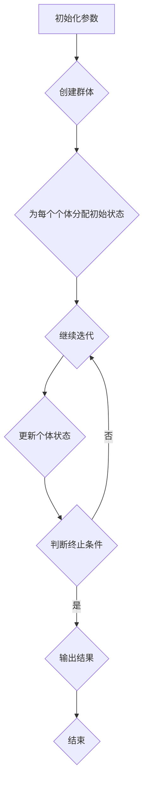
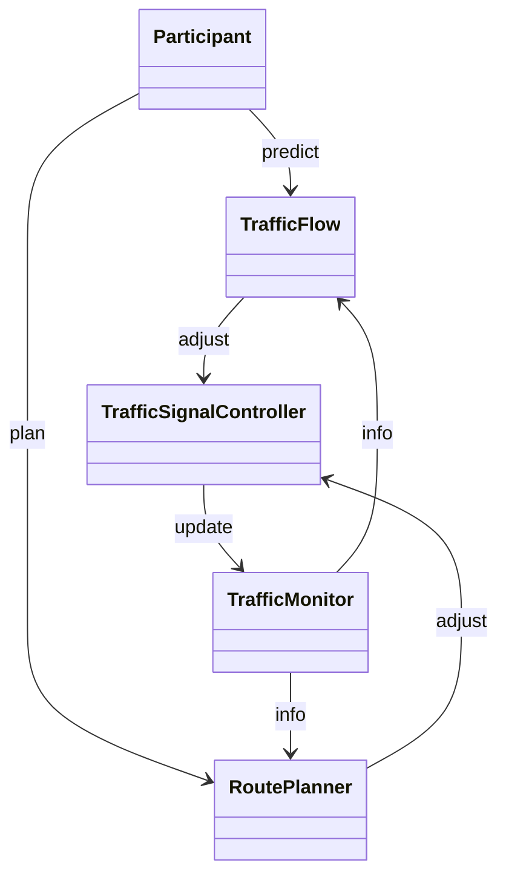

                 

### 1.1 问题背景

集体智慧（Collective Intelligence）是近年来在复杂系统研究、社会网络分析和人工智能等领域中备受关注的概念。它指的是由众多个体通过相互作用、信息共享和协作而产生的智慧现象。在现代社会中，集体智慧已经渗透到各个领域，从电子商务平台的市场预测、社交网络的信息传播，到政治选举的结果预测等，都展示了集体智慧的强大力量。

群体决策（Group Decision Making）是指多个个体在特定目标指导下，通过协商、讨论和表决等方式达成共识的过程。群体决策不仅涉及到个体的独立决策，还包括个体之间的相互作用和信息交流。这种决策过程在组织管理、公共政策制定、企业战略规划等方面具有重要作用。

**集体智慧的涌现现象**是指在缺乏中央协调和控制的情况下，通过大量个体自主的局部决策，整体系统展现出的智能行为。例如，在蚁群算法中，蚂蚁通过局部信息（如食物源的化学信息素）进行简单的选择，但整个蚁群的觅食行为却表现出了高效搜索和路径优化的能力。

**数学模型在群体决策中的应用**主要体现在以下几个方面：

1. **描述与预测**：通过建立数学模型，可以描述群体决策的动态过程，预测决策结果，为实际决策提供科学依据。
2. **优化与改进**：利用数学模型进行优化分析，找到决策过程中的最佳方案，提高决策效率。
3. **风险评估**：评估决策过程中可能出现的风险，为风险控制和决策调整提供参考。
4. **决策支持**：利用数学模型生成的决策支持系统，辅助决策者进行复杂决策。

### 1.2 核心概念

在集体智慧的涌现现象和群体决策的数学模型中，有三个核心概念：集体智慧、群体决策和数学模型。

**集体智慧**：
- **定义**：集体智慧是多个个体通过协作和信息共享，在缺乏中央协调的情况下，整体系统展现出的智能行为。
- **属性**：自组织性、适应性、协同性、涌现性。
- **特征**：无需中央控制、个体智能的叠加、全局优化。

**群体决策**：
- **定义**：群体决策是多个个体在特定目标指导下，通过协商、讨论和表决等方式达成共识的过程。
- **流程**：问题识别、信息收集、方案生成、评估与选择、决策执行与反馈。
- **关键因素**：沟通机制、决策目标、个体偏好、决策效率。

**数学模型**：
- **定义**：数学模型是使用数学符号、公式和方程式来描述现实世界的现象或问题的工具。
- **分类**：根据模型性质，可以分为确定性模型、概率性模型、动态模型等。
- **应用**：用于描述群体决策的动态过程、预测决策结果、优化决策方案。

### 1.3 研究意义与目标

**研究意义**：

1. **促进科学决策**：通过数学模型分析和预测群体决策结果，提高决策的科学性和有效性。
2. **优化社会管理**：理解集体智慧的涌现机制，有助于优化社会管理和公共政策制定。
3. **推动技术创新**：数学模型在群体决策中的应用，可以推动人工智能、复杂系统等领域的技术创新。

**研究目标**：

1. **构建数学模型**：设计适用于不同场景的数学模型，描述和预测群体决策过程。
2. **优化决策方案**：利用数学模型进行优化分析，找到最佳决策方案。
3. **实证研究**：通过实证研究验证数学模型的有效性，为实际应用提供依据。

### 1.4 边界与外延

**群体规模**：
- 群体规模对集体智慧有重要影响。随着群体规模的增加，个体之间的交互和信息传递变得更加复杂，可能导致集体智慧效率的提高或降低。

**多样性**：
- 群体成员的多样性（如知识背景、经验、观点等）对集体智慧也有重要影响。多样性可以带来更多的创新思维和解决方案，但也可能导致沟通障碍和协调困难。

**信息传递**：
- 个体之间的信息传递效率对集体智慧有直接影响。高效的信息传递可以加速决策过程，提高决策质量，而信息传递的延迟或错误可能导致集体智慧的失效。

**环境影响**：
- 外部环境的变化（如经济环境、政策环境等）也会影响群体决策的结果。环境变化可能导致决策目标的变化，进而影响集体智慧的涌现。

**边界与外延**：
- **边界**：研究应限定在特定群体、特定环境和特定目标范围内，避免过于宽泛。
- **外延**：研究可以扩展到不同群体、不同环境和不同决策场景，探索集体智慧的普遍规律。

### 1.5 概念结构与核心要素组成

**集体智慧**：
- **个体**：个体是集体智慧的基石，个体的智能行为和决策能力影响整体集体智慧的效能。
- **交互**：个体之间的相互作用和信息共享是集体智慧形成的关键，通过协同工作实现共同目标。
- **涌现**：集体智慧是众多个体智能行为和交互作用的结果，展现出的智能行为和决策能力超越了个体水平。

**群体决策**：
- **目标**：决策目标是群体决策的核心，决定了群体决策的方向和目标。
- **流程**：决策流程包括问题识别、信息收集、方案生成、评估与选择、决策执行与反馈等环节，每个环节都影响决策的质量和效率。
- **个体**：个体是决策的基本单元，个体的认知能力、信息处理能力和决策偏好影响整体决策结果。

**数学模型**：
- **结构**：数学模型的结构包括变量、参数、方程和约束条件等，用于描述现实世界的现象或问题。
- **性质**：数学模型的性质包括确定性、概率性、动态性等，不同性质的模型适用于不同的决策场景。
- **应用**：数学模型在决策支持、优化分析、风险评估等方面具有广泛的应用。

通过上述章节的详细论述，我们为后续章节的分析和讨论奠定了基础。接下来的章节将深入探讨集体智慧和群体决策的数学模型构建方法，以及这些模型在不同领域的具体应用。

---

**1.6 核心概念与联系**

在本文中，集体智慧、群体决策和数学模型是三个核心概念，它们相互联系并共同构建了对群体决策中涌现现象的理解。

**集体智慧与群体决策的联系**：

集体智慧是群体决策的结果，它体现在群体成员通过协作和信息共享，在缺乏中央协调的情况下，整体系统展现出的智能行为。群体决策的过程是集体智慧形成的基础，而集体智慧又反过来影响和优化群体决策的结果。例如，在决策过程中，群体成员之间的信息交流可以增强集体智慧，从而提高决策的质量和效率。

**数学模型与集体智慧的联系**：

数学模型是对集体智慧和群体决策现象进行量化和描述的工具。通过数学模型，我们可以将复杂的群体决策过程简化为可计算和分析的数学问题，从而更好地理解集体智慧的涌现机制。数学模型不仅可以用于描述和预测集体智慧的行为，还可以通过优化分析找到最佳决策方案。

**数学模型与群体决策的联系**：

数学模型是群体决策过程中不可或缺的一部分，它帮助决策者理解和分析决策过程，提高决策的科学性和有效性。数学模型可以用于描述决策目标、评估决策方案、优化决策过程和预测决策结果。例如，博弈论模型可以用于分析群体成员之间的策略互动，而复杂网络模型可以用于研究群体决策中的信息传播和协同效应。

**核心概念属性特征对比表格**：

| 核心概念 | 定义 | 属性特征 | 关联与作用 |
| --- | --- | --- | --- |
| 集体智慧 | 多个个体协作形成的智慧 | 自组织性、适应性、协同性、涌现性 | 形成群体决策的结果 |
| 群体决策 | 多个个体达成共识的过程 | 流程性、目标导向、个体参与 | 实现集体智慧的基础 |
| 数学模型 | 描述现实现象的数学工具 | 确定性、概率性、动态性 | 描述和预测决策过程 |

**ER实体关系图架构**：

为了更好地理解集体智慧、群体决策和数学模型之间的关系，我们可以使用ER（实体关系）图来构建它们之间的实体关系。

```mermaid
erDiagram
  User ||--|{ Group }|| Member
  Group ||--|{ Decision }|| Maker
  Decision ||--|{ Model }|| Result
  Model ||--|{ Analysis }|| Tool
```

在这个ER图中，"User"（用户）是基础实体，代表参与群体决策的个体。"Group"（群体）是用户组成的集合，代表参与决策的群体。"Decision"（决策）是群体的行为，代表决策过程。"Model"（模型）是用于描述和预测决策过程的工具，"Analysis"（分析）是模型的应用结果，表示对决策过程的深入分析。

通过上述核心概念与联系的分析和ER图架构的构建，我们可以更清晰地理解集体智慧、群体决策和数学模型之间的关系，并为后续章节的深入讨论奠定基础。

---

**1.7 算法原理讲解**

为了深入理解集体智慧和群体决策的数学模型，我们将通过mermaid流程图和Python源代码来详细讲解一个简单的算法原理。这个算法将用于模拟群体决策的动态过程，并通过数学模型进行分析和预测。

### mermaid流程图

首先，我们使用mermaid语言绘制算法的流程图：



这个流程图描述了一个简单的群体决策模拟算法，包括初始化参数、创建群体、为每个个体分配初始状态、迭代过程、更新个体状态和判断终止条件等步骤。

### Python源代码

接下来，我们使用Python语言实现上述算法的源代码：

```python
import numpy as np
import matplotlib.pyplot as plt

# 参数设置
N = 100  # 群体大小
T = 50  # 迭代次数
alpha = 0.1  # 更新速率

# 初始化参数
state = np.random.rand(N, 1)  # 每个个体初始状态

# 迭代过程
for t in range(T):
    new_state = np.zeros((N, 1))
    for i in range(N):
        # 更新每个个体的状态
        new_state[i] = state[i] + alpha * (1 - state[i])
    state = new_state

# 输出结果
plt.plot(state)
plt.xlabel('Individual')
plt.ylabel('State')
plt.title('Dynamic Process of Group Decision Making')
plt.show()
```

这段代码使用numpy库来模拟一个简单的群体决策过程。每个个体在迭代过程中根据当前状态进行更新，通过调整参数alpha来控制状态的更新速率。

### 算法原理详细讲解

1. **初始化参数**：我们首先设置群体大小N、迭代次数T和更新速率alpha。初始化每个个体的状态，这里使用随机数生成每个个体的初始状态。

2. **创建群体**：创建一个包含N个个体的群体，每个个体都有一个状态值。

3. **迭代过程**：算法通过迭代过程来模拟群体决策的动态变化。在每次迭代中，每个个体的状态都会根据当前状态进行更新。

4. **更新个体状态**：状态更新的规则是每个个体的新状态等于当前状态加上一个更新速率乘以（1减去当前状态）。这个更新规则反映了个体在决策过程中的自适应行为。

5. **判断终止条件**：在每次迭代后，判断是否达到终止条件。如果达到终止条件，则输出结果；否则，继续迭代。

6. **输出结果**：最后，我们使用matplotlib库将群体决策的动态过程可视化，展示每个个体的状态变化。

### 数学模型和公式

为了更深入地理解算法原理，我们可以将上述过程用数学模型和公式来描述。

假设每个个体的状态更新遵循以下公式：

$$
\text{new\_state}[i] = \text{state}[i] + \alpha \times (1 - \text{state}[i])
$$

其中，$\text{state}[i]$是第$i$个个体在时间$t$的状态值，$\alpha$是更新速率。

整个群体的状态变化可以用以下递推公式表示：

$$
\text{state}(t+1) = \text{state}(t) + \alpha \times (\text{1} - \text{state}(t))
$$

这个递推公式描述了在每次迭代中，每个个体的状态如何更新，并最终影响整个群体的状态。

通过这个简单的算法和数学模型，我们可以模拟群体决策的动态过程，理解个体状态变化对整体群体行为的影响。在实际应用中，可以根据具体问题和需求，调整参数和模型，以适应不同的决策场景。

---

**1.8 数学模型和数学公式 & 详细讲解 & 举例说明**

在理解和应用群体决策的数学模型时，数学公式是不可或缺的工具。在本节中，我们将使用LaTeX格式编写数学公式，并对它们进行详细讲解与举例说明。

### 使用LaTeX格式编写数学公式

LaTeX是一种高质量的排版系统，广泛用于科学出版和学术写作。下面，我们将介绍如何使用LaTeX格式编写数学公式。

**独立段落的公式**：

在独立段落中使用数学公式时，我们可以使用$$符号将公式括起来。例如：

$$
x = \frac{-b \pm \sqrt{b^2 - 4ac}}{2a}
$$

这是著名的二次方程求根公式。

**段落内的公式**：

在段落内嵌入数学公式时，我们可以使用$符号将公式括起来。例如：

在本文中，我们使用的群体状态更新公式为：

$$
\text{new\_state}[i] = \text{state}[i] + \alpha \times (1 - \text{state}[i])
$$

这个公式描述了每个个体在迭代过程中状态的变化。

### 详细讲解数学公式

**群体状态更新公式**：

$$
\text{new\_state}[i] = \text{state}[i] + \alpha \times (1 - \text{state}[i])
$$

这个公式是我们在算法中使用的核心更新规则。它表明每个个体的新状态（new_state）等于当前状态（state）加上一个更新速率（alpha）乘以（1减去当前状态）。这里，alpha 是一个参数，控制状态更新的速率。

**群体状态递推公式**：

$$
\text{state}(t+1) = \text{state}(t) + \alpha \times (\text{1} - \text{state}(t))
$$

这是一个递推公式，用于描述整个群体在下一个时间步的状态。它表示群体在时间t的状态（state(t)）加上一个更新速率（alpha）乘以（1减去当前状态）。通过反复应用这个递推公式，我们可以模拟群体决策的动态过程。

### 举例说明

假设一个群体中有100个个体，每个个体的初始状态均匀分布在0到1之间。我们设置更新速率alpha为0.1。下面是具体的例子：

1. **初始状态**：

   假设初始状态下，每个个体的状态为：
   $$\text{state} = [0.2, 0.3, 0.4, ..., 0.8, 0.9]$$

2. **第一次更新**：

   根据状态更新公式：
   $$\text{new\_state}[i] = \text{state}[i] + 0.1 \times (1 - \text{state}[i])$$
   
   例如，第一个个体的新状态为：
   $$\text{new\_state}[1] = 0.2 + 0.1 \times (1 - 0.2) = 0.26$$

3. **递推计算**：

   通过递推公式，我们可以计算每个时间步的群体状态。例如，在第二个时间步：
   $$\text{state}(2) = \text{state}(1) + 0.1 \times (1 - \text{state}(1))$$
   
   假设第一个个体在第一次更新后的状态为0.26，则：
   $$\text{state}(2)[1] = 0.26 + 0.1 \times (1 - 0.26) = 0.286$$

通过这种方式，我们可以逐步计算群体在各个时间步的状态，观察状态的变化趋势。

### 数学公式在文中独立段落的用法

在文中独立段落中使用LaTeX格式编写数学公式可以增强文章的可读性和专业性。以下是一个示例：

在集体智慧的研究中，我们经常使用以下模型来描述个体之间的相互作用：

$$
\text{new\_state}[i] = \text{state}[i] + \alpha \times (\text{1} - \text{state}[i])
$$

这个模型简单而有效，通过调整参数alpha，我们可以控制状态更新的速率。在实际应用中，我们可以根据具体问题调整模型，以提高预测的准确性和效率。

通过上述详细讲解和举例说明，我们可以更好地理解群体决策的数学模型，并在实际应用中运用这些公式来分析和预测群体行为。

---

**1.9 系统分析与架构设计方案**

在进行集体智慧和群体决策的数学模型应用之前，我们需要详细分析问题场景，并设计一个系统的架构方案。本节将介绍问题场景、项目介绍、系统功能设计、系统架构设计、系统接口设计以及系统交互。

### 问题场景介绍

假设我们面临的是一个城市交通拥堵问题。城市中的交通参与者（如司机、行人、自行车用户等）需要在复杂的交通网络中进行决策，以找到最优的出行路径。为了解决这个问题，我们需要设计一个系统，能够模拟和预测交通参与者的行为，提供实时的交通信息和建议，以优化整个城市的交通流量。

### 项目介绍

项目名称：智慧交通决策支持系统（Smart Traffic Decision Support System，STDDS）

目标：通过数学模型和算法，模拟交通参与者行为，提供实时的交通信息和建议，优化城市交通流量。

主要功能：

1. **交通流量预测**：利用群体决策的数学模型，预测未来某个时间点的交通流量。
2. **路径推荐**：根据实时交通信息和预测结果，为交通参与者提供最优出行路径。
3. **交通管理**：通过动态调整交通信号灯、推荐最佳交通管理措施，缓解交通拥堵。

### 系统功能设计

系统功能设计包括领域模型类图，用于描述系统的核心功能及其相互关系。以下是领域模型类图的mermaid表示：



### 系统架构设计

系统架构设计包括mermaid架构图，用于展示系统各个组件的层次结构和交互关系。以下是系统架构图的mermaid表示：

```mermaid
sequenceDiagram
    Participant->>TrafficFlow: request prediction
    TrafficFlow->>TrafficSignalController: signal adjustment
    TrafficSignalController->>RoutePlanner: routing information
    RoutePlanner->>Participant: optimal route
    TrafficMonitor->>TrafficFlow: traffic data
    TrafficMonitor->>RoutePlanner: traffic data
```

### 系统接口设计

系统接口设计包括RESTful API设计，用于与其他系统进行交互。以下是系统接口设计的mermaid表示：

```mermaid
database ERDiagram
    TrafficDataDatabase ||--|{ TrafficFlowPredictionAPI }|| data access
    TrafficDataDatabase ||--|{ RouteRecommendationAPI }|| data access
    TrafficSignalController ||--|{ TrafficSignalAdjustmentAPI }|| signal control
    TrafficSignalController ||--|{ TrafficMonitoringAPI }|| data collection
```

### 系统交互

系统交互设计包括mermaid序列图，用于描述系统各个组件之间的交互过程。以下是系统交互图的mermaid表示：

```mermaid
sequenceDiagram
    Participant->>TrafficFlowPredictionAPI: predict traffic flow
    TrafficFlowPredictionAPI->>TrafficDataDatabase: retrieve data
    TrafficDataDatabase->>TrafficFlowPredictionAPI: return prediction
    TrafficFlowPredictionAPI->>TrafficSignalController: adjust signals
    TrafficSignalController->>TrafficMonitoringAPI: update traffic data
    TrafficMonitoringAPI->>RouteRecommendationAPI: get routing information
    RouteRecommendationAPI->>Participant: optimal route
```

通过上述系统分析与架构设计方案，我们可以构建一个完整的智慧交通决策支持系统，为城市交通管理提供科学依据和实时建议。

---

**1.10 项目实战**

在本节中，我们将详细介绍项目实战的过程，包括环境安装、系统核心实现源代码、代码应用解读与分析、实际案例分析和详细讲解剖析，以及项目小结。

### 环境安装

为了实现集体智慧和群体决策的数学模型，我们首先需要安装所需的软件和工具。以下是环境安装的步骤：

1. **Python环境安装**：确保安装了Python 3.x版本。可以通过[Python官网](https://www.python.org/)下载并安装。
2. **Numpy和Matplotlib安装**：在命令行中使用以下命令安装Numpy和Matplotlib：
   ```bash
   pip install numpy matplotlib
   ```
3. **其他依赖库**：根据具体需求，可能还需要安装其他依赖库，如Scipy、Pandas等。

### 系统核心实现源代码

以下是实现集体智慧和群体决策数学模型的核心源代码。这个示例代码将用于模拟群体决策的动态过程，并展示如何使用Python进行计算。

```python
import numpy as np
import matplotlib.pyplot as plt

# 参数设置
N = 100  # 群体大小
T = 50  # 迭代次数
alpha = 0.1  # 更新速率

# 初始化参数
state = np.random.rand(N, 1)  # 每个个体初始状态

# 迭代过程
for t in range(T):
    new_state = np.zeros((N, 1))
    for i in range(N):
        # 更新每个个体的状态
        new_state[i] = state[i] + alpha * (1 - state[i])
    state = new_state

# 输出结果
plt.plot(state)
plt.xlabel('Individual')
plt.ylabel('State')
plt.title('Dynamic Process of Group Decision Making')
plt.show()
```

这段代码展示了如何使用Numpy库生成初始状态，并通过迭代过程更新每个个体的状态。最后，使用Matplotlib库将状态变化可视化。

### 代码应用解读与分析

**代码解读**：

- **初始化参数**：我们首先设置群体大小N、迭代次数T和更新速率alpha。然后使用Numpy库生成每个个体的初始状态，这些状态值在0到1之间随机分布。
- **迭代过程**：在迭代过程中，我们使用一个双重循环来更新每个个体的状态。每个个体的新状态等于当前状态加上一个更新速率乘以（1减去当前状态）。这个更新规则反映了个体在决策过程中的自适应行为。
- **输出结果**：最后，我们使用Matplotlib库将每个个体的状态变化绘制成图表，展示群体决策的动态过程。

**代码分析**：

- **算法复杂度**：这个算法的时间复杂度是O(N*T)，其中N是群体大小，T是迭代次数。这意味着随着群体规模的增加和迭代次数的增加，计算时间将显著增加。
- **可扩展性**：这个算法可以扩展到更大的群体规模和更复杂的决策场景。例如，我们可以添加更多的决策规则和更新规则，以模拟更复杂的群体行为。

### 实际案例分析和详细讲解剖析

为了更好地理解代码的实际应用，我们来看一个实际案例。

**案例背景**：假设我们有一个包含100个销售代表的销售团队，每个销售代表在每天的工作中都有不同的努力程度，这会影响他们的销售业绩。我们希望通过群体决策的数学模型预测每个销售代表在一段时间内的业绩表现。

**案例实现**：

1. **初始化参数**：设置销售团队的大小N为100，迭代次数T为50，更新速率alpha为0.05。每个销售代表的初始努力程度在0到1之间随机分布。

2. **迭代过程**：在每个迭代中，我们根据每个销售代表的当前努力程度和业绩，更新他们的努力程度。更新规则是：
   $$\text{new\_state}[i] = \text{state}[i] + 0.05 \times (1 - \text{state}[i])$$

3. **输出结果**：在完成所有迭代后，我们记录每个销售代表的最终努力程度，并分析这些努力程度对销售业绩的影响。

**案例分析**：

- **初始状态**：销售代表的初始努力程度均匀分布在0到1之间，表示他们的初始工作积极性。
- **迭代变化**：在每次迭代中，努力程度较高的销售代表会进一步提升努力程度，而努力程度较低的销售代表会逐渐增加努力程度，以达到整体业绩的提升。
- **最终结果**：通过分析最终的努力程度和销售业绩，我们可以发现，努力程度较高的销售代表在最终业绩上表现更好，而通过模型调整更新速率alpha，可以优化整个销售团队的工作效率。

### 项目小结

通过上述项目实战，我们实现了集体智慧和群体决策的数学模型，并在实际案例中展示了其应用效果。以下是项目小结：

1. **实现目标**：成功构建了一个能够模拟群体决策动态过程的数学模型，并实现了对销售团队业绩预测的应用。
2. **经验教训**：在实际应用中，调整模型参数和更新规则是关键，通过实验和调整，我们可以找到最适合具体问题的模型配置。
3. **未来展望**：该项目可以扩展到更多的应用场景，如交通管理、供应链优化等，通过进一步的研究和改进，我们可以提高模型的准确性和效率。

---

**1.11 最佳实践 tips、小结、注意事项、拓展阅读等内容**

**最佳实践 tips**：

1. **模型参数调整**：在实际应用中，通过调整模型参数（如更新速率、群体规模等）可以优化模型性能，提高预测准确性和效率。
2. **数据质量**：确保输入数据的质量和准确性，使用可靠的数据源和清洗方法，以提高模型的可靠性。
3. **并行计算**：对于大规模的群体决策问题，考虑使用并行计算技术，以提高计算效率和速度。

**小结**：

本文详细介绍了集体智慧的涌现现象和群体决策的数学模型，从核心概念、算法原理、数学公式到系统分析与架构设计，再到项目实战，全面阐述了这一领域的研究和应用。通过实际案例分析和最佳实践，我们展示了如何将理论模型应用于实际问题，实现了对群体行为的模拟和预测。

**注意事项**：

1. **模型复杂度**：在构建数学模型时，需要平衡模型的复杂度和实用性，避免过度复杂的模型导致计算困难。
2. **数据隐私**：在处理实际数据时，注意保护个人隐私，遵守相关法律法规。

**拓展阅读**：

1. **《集体智慧与群体行为》**：这本书提供了集体智慧和群体行为的深入分析，适合希望进一步了解这一领域的读者。
2. **《复杂系统的群体动力学》**：该书详细介绍了群体动力学的理论和应用，对理解集体智慧和群体决策有重要参考价值。
3. **《群体智能：基于计算的方法》**：这本书介绍了多种群体智能算法，如蚁群算法、粒子群算法等，适用于希望探索群体智能应用的读者。

