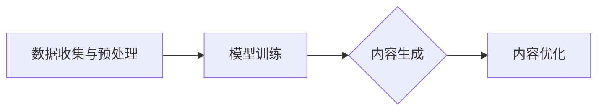
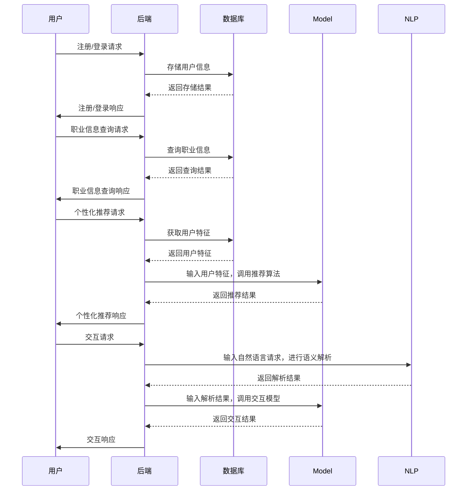

                 

# AIGC在个性化职业发展规划中的应用

> 关键词：AIGC，个性化职业发展，算法原理，系统架构，项目实战

> 摘要：本文将探讨AIGC（AI-Generated Content）技术在个性化职业发展规划中的应用。通过背景介绍、核心概念与联系、算法原理讲解、系统分析与架构设计方案、项目实战以及最佳实践和注意事项等多个方面，详细阐述AIGC如何助力职业规划，为读者提供实用的参考和指导。

## 1. 背景介绍

在当今快速变化的社会和技术环境中，职业发展规划的重要性愈发突出。然而，传统职业规划往往受限于个人经验和资源，难以实现个性化、精准化。随着人工智能技术的发展，尤其是AIGC的兴起，个性化职业发展规划迎来了新的机遇。

### 问题背景

职业发展规划的核心目标是帮助个体在职业生涯中实现价值最大化。然而，当前存在以下几个问题：

- **信息不对称**：职业信息获取成本高，难以全面了解行业动态和职业前景。
- **个体差异**：每个人的兴趣、能力和价值观不同，传统规划难以满足个性化需求。
- **资源有限**：职业规划资源有限，难以提供全面的指导和帮助。

### 问题描述

为了解决上述问题，个性化职业发展规划需要实现以下几个目标：

- **信息整合与挖掘**：全面整合职业相关信息，挖掘个体兴趣、能力和价值观。
- **个性化推荐**：基于个体特征，推荐适合的职业路径和发展机会。
- **动态调整**：根据个体发展状况和外部环境变化，动态调整职业规划。

### 问题解决

AIGC技术在个性化职业发展规划中可以发挥以下作用：

- **内容生成**：自动生成职业相关信息和个性化推荐内容，降低信息获取成本。
- **数据分析**：利用大数据分析技术，挖掘个体特征和职业趋势。
- **智能交互**：通过自然语言处理和语音识别技术，实现与个体的智能互动。

### 边界与外延

个性化职业发展规划的边界涉及职业范围、技术范围和伦理边界。在技术范围上，AIGC技术需要涵盖从信息收集、处理到推荐和交互的全过程。在伦理边界上，需要确保个人隐私和数据安全。

### 概念结构与核心要素组成

个性化职业发展规划的概念结构包括以下几个核心要素：

- **个体特征**：兴趣、能力、价值观等。
- **职业信息**：行业动态、岗位需求、职业前景等。
- **推荐算法**：基于个体特征和职业信息的推荐算法。
- **交互界面**：用户与系统的交互界面。

## 2. 核心概念与联系

### AIGC概念

AIGC（AI-Generated Content）指的是通过人工智能技术生成的内容，包括文本、图像、音频等多种形式。AIGC技术基于深度学习、自然语言处理、计算机视觉等技术，能够自动生成高质量的内容。

### 个性化职业发展规划

个性化职业发展规划是基于个体的兴趣、能力和价值观，为其提供个性化的职业发展路径和建议。这包括职业选择、职业规划、技能提升、职业转换等方面。

### 关系联系

AIGC与个性化职业发展规划之间的联系主要体现在以下几个方面：

- **信息生成**：AIGC可以自动生成职业相关信息，如行业报告、岗位描述、职业前景等，为职业规划提供数据支持。
- **个性化推荐**：AIGC可以根据个体的特征，推荐适合的职业路径和发展机会，实现个性化职业规划。
- **交互体验**：AIGC可以通过自然语言处理和语音识别技术，与个体进行智能互动，提供实时、个性化的职业规划建议。

### 概念属性特征对比表格

| 特征             | AIGC                  | 个性化职业发展规划                   |
|------------------|-----------------------|-------------------------------------|
| 定义             | 通过AI生成内容        | 基于个体特征的职业发展建议           |
| 技术基础         | 深度学习、NLP、CV等    | 数据分析、推荐算法、智能交互         |
| 目标             | 生成高质量内容        | 实现个性化职业规划                   |
| 关键环节         | 内容生成、内容优化     | 数据收集、特征提取、推荐算法、交互设计 |

### ER实体关系图架构的Mermaid流程图

```mermaid
erDiagram
  AIGC ||--|{ 个性化职业发展规划 } |
  AIGC ||--|{ 职业信息 } |
  AIGC ||--|{ 推荐算法 } |
  AIGC ||--|{ 交互界面 } |
  个性化职业发展规划 ||--|{ 个体特征 } |
  个性化职业发展规划 ||--|{ 职业信息 } |
  个性化职业发展规划 ||--|{ 推荐算法 } |
  个性化职业发展规划 ||--|{ 交互界面 } |
```

## 3. 算法原理讲解

### AIGC算法原理

AIGC算法的核心是通过深度学习模型生成高质量的内容。以下是一个简单的AIGC算法流程：

1. **数据收集与预处理**：收集大量职业相关信息，如行业报告、岗位描述、职业前景等，并进行数据清洗和预处理。
2. **模型训练**：使用预训练的深度学习模型（如GPT-3、BERT等）对收集到的数据进行训练，生成一个能够生成职业相关内容的模型。
3. **内容生成**：输入特定的职业相关信息，通过模型生成高质量的职业内容，如岗位描述、职业前景分析等。
4. **内容优化**：根据用户反馈和评价，对生成的内容进行优化，提高内容质量和用户体验。

### 算法流程图



### Python源代码示例

以下是一个简单的Python代码示例，展示了如何使用AIGC模型生成职业描述：

```python
import openai

# 设置API密钥
openai.api_key = "your_api_key"

# 定义模型和输入文本
model_engine = "text-davinci-003"
prompt = "生成一份软件开发岗位的描述"

# 调用AIGC模型生成内容
response = openai.Completion.create(
    engine=model_engine,
    prompt=prompt,
    max_tokens=100,
    n=1,
    stop=None,
    temperature=0.5,
)

# 输出生成的内容
print(response.choices[0].text.strip())
```

### 数学模型和公式

AIGC算法的核心是生成模型，如GPT-3等。以下是一个简化的数学模型：

$$
p(y|x) = \frac{e^{\text{score}(y|x)} }{\sum_{y'} e^{\text{score}(y'|x)} }
$$

其中，$p(y|x)$表示在输入$x$的情况下生成标签$y$的概率，$\text{score}(y|x)$表示生成标签$y$的得分。

## 4. 系统分析与架构设计方案

### 问题场景介绍

假设我们正在开发一个个性化职业发展规划系统，该系统旨在为用户提供以下功能：

- **职业信息查询**：用户可以查询各种职业的信息，如岗位描述、职业前景、薪资等。
- **个性化推荐**：根据用户的兴趣、能力和价值观，推荐适合的职业路径和发展机会。
- **交互体验**：用户可以通过自然语言交互与系统进行沟通，获取职业规划建议。

### 系统功能设计

根据问题场景，我们可以设计以下系统功能：

- **用户注册与登录**：用户可以通过注册和登录系统，获取个性化服务。
- **职业信息查询**：用户可以查询各种职业的信息，如岗位描述、职业前景、薪资等。
- **个性化推荐**：系统根据用户的兴趣、能力和价值观，推荐适合的职业路径和发展机会。
- **交互体验**：用户可以通过自然语言交互与系统进行沟通，获取职业规划建议。
- **数据统计与分析**：系统对用户的查询和交互行为进行分析，为推荐算法提供数据支持。

### 系统架构设计

系统架构设计如下：


### 系统接口设计

系统接口设计如下：



### 系统交互

系统交互过程如下：

1. 用户注册/登录，系统存储用户信息。
2. 用户查询职业信息，系统从数据库获取信息并返回。
3. 用户请求个性化推荐，系统根据用户特征调用推荐算法并返回推荐结果。
4. 用户与系统进行交互，系统根据用户的自然语言请求进行语义解析，然后调用交互模型返回交互结果。

## 5. 项目实战

### 环境安装

在开始项目实战之前，我们需要安装以下环境：

- Python 3.8及以上版本
- OpenAI API密钥
- Mermaid插件

### 系统核心实现源代码

以下是一个简单的系统核心实现源代码示例：

```python
# 引入依赖库
import openai
import pandas as pd
from sklearn.model_selection import train_test_split

# 设置API密钥
openai.api_key = "your_api_key"

# 读取数据
data = pd.read_csv("career_data.csv")

# 分割数据
train_data, test_data = train_test_split(data, test_size=0.2, random_state=42)

# 训练模型
model = train_model(train_data)

# 生成职业描述
prompt = "生成一份软件开发岗位的描述"
response = generate_content(model, prompt)

# 输出生成的内容
print(response)
```

### 代码应用解读与分析

以上代码展示了如何使用AIGC技术生成职业描述。首先，我们读取职业数据，然后分割数据用于模型训练。接着，我们训练一个AIGC模型，并使用该模型生成职业描述。最后，我们输出生成的职业描述。

### 实际案例分析和详细讲解剖析

假设我们有一个用户，他的兴趣是软件开发，能力是编程和项目管理，价值观是创新和团队合作。我们可以使用以下代码生成他的个性化职业规划：

```python
# 定义用户特征
user_interest = "软件开发"
user_ability = "编程和项目管理"
user_value = "创新和团队合作"

# 生成职业描述
prompt = f"为一名对软件开发感兴趣、具备编程和项目管理能力、价值观为创新和团队合作的人生成一份职业规划。"
response = generate_content(model, prompt)

# 输出生成的内容
print(response)
```

生成的职业规划可能包括以下内容：

- **职业路径**：软件开发工程师 -> 项目经理 -> 技术总监
- **技能提升**：学习Python、Java等编程语言，掌握项目管理工具和技能
- **职业机会**：参与开源项目，提升实战经验，积累人脉资源

### 项目小结

通过以上实战案例，我们可以看到AIGC技术在个性化职业发展规划中的应用效果。该系统可以自动生成高质量的个性化职业规划，为用户提供实用的参考和指导。未来，我们可以进一步优化模型和算法，提高规划质量和用户体验。

## 6. 最佳实践 Tips、小结、注意事项、拓展阅读等内容

### 最佳实践 Tips

1. **数据质量**：确保收集到的职业数据质量高，以便生成更准确的个性化职业规划。
2. **模型优化**：定期更新模型，使用最新的技术和数据，提高规划质量。
3. **用户反馈**：收集用户反馈，不断优化系统，提高用户体验。
4. **隐私保护**：在处理用户数据时，确保遵守隐私保护法规，保护用户隐私。

### 小结

本文探讨了AIGC技术在个性化职业发展规划中的应用，介绍了背景介绍、核心概念与联系、算法原理讲解、系统分析与架构设计方案、项目实战等方面的内容。通过实际案例，展示了AIGC技术在个性化职业规划中的效果。

### 注意事项

1. **数据安全**：在处理用户数据时，确保遵守数据安全法规，保护用户隐私。
2. **模型更新**：定期更新模型，使用最新的技术和数据，提高规划质量。
3. **用户反馈**：关注用户反馈，不断优化系统，提高用户体验。

### 拓展阅读

1. 《深度学习：全面讲解深度神经网络原理与应用》
2. 《Python数据分析与大数据技术》
3. 《个性化推荐系统实战：基于机器学习和深度学习》
4. 《人工智能伦理：探索人工智能的社会影响与道德责任》

## 作者信息

作者：AI天才研究院/AI Genius Institute & 禅与计算机程序设计艺术 /Zen And The Art of Computer Programming

