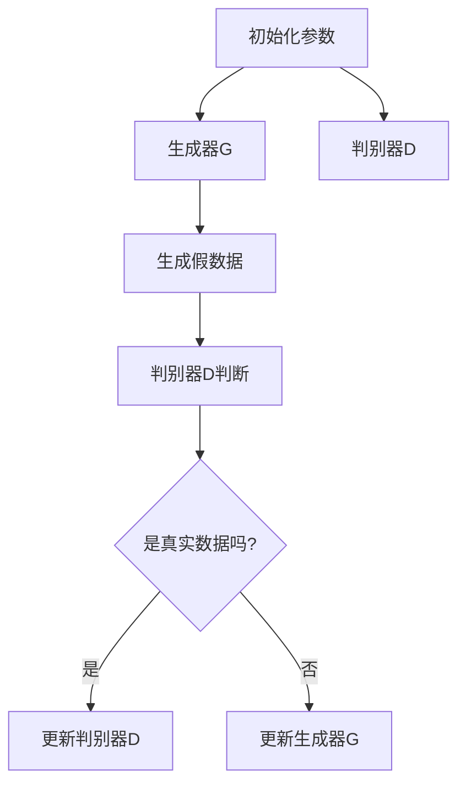
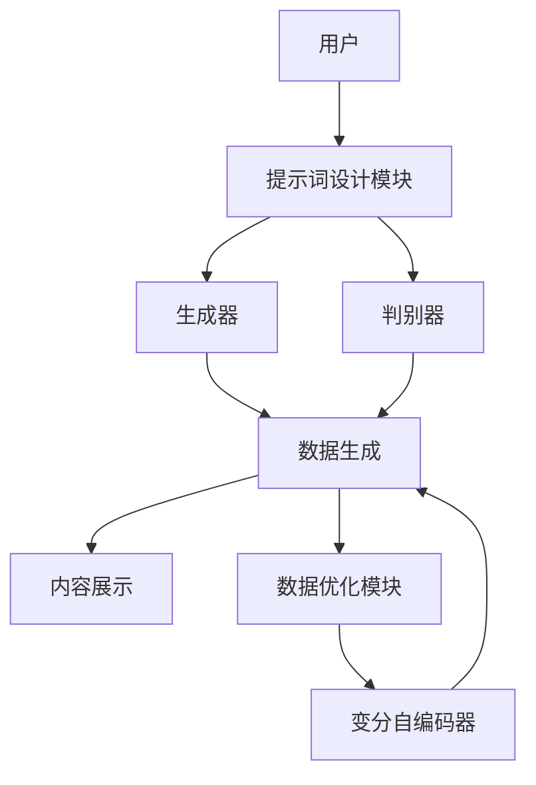
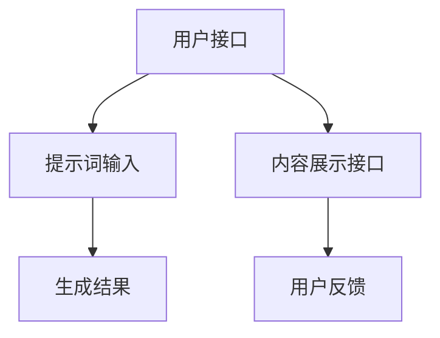

                 

### AIGC时代的提示词工程学

> 关键词：AIGC、提示词工程学、生成对抗网络、变分自编码器、算法原理、数学模型、系统架构、项目实战

> 摘要：本文将深入探讨AIGC（自适应智能生成控制）时代的提示词工程学，从背景介绍、核心概念、算法原理讲解、数学模型与公式、系统分析与架构设计、项目实战及最佳实践等方面，系统性地解析这一领域的先进技术和工程实践。通过逐步的分析和推理，帮助读者理解AIGC的工作原理及其在自然语言处理、图像生成等领域的应用，同时提供实用的项目实施方法和技巧。

## 引言

AIGC，即自适应智能生成控制，是近年来人工智能领域的一项重要创新。它结合了生成对抗网络（GAN）和变分自编码器（VAE）等先进算法，实现了自动化、智能化内容生成。AIGC的出现，标志着内容生成技术进入了一个崭新的时代，为自然语言处理、图像生成、视频制作等领域带来了前所未有的变革。

提示词工程学是AIGC应用中的重要一环。通过有效的提示词设计，可以引导模型生成高质量的内容。本文将围绕这一主题，逐一探讨AIGC时代的提示词工程学的各个方面，包括背景介绍、核心概念、算法原理、数学模型、系统架构、项目实战以及最佳实践。

## 背景介绍

### AIGC的概念

AIGC，即自适应智能生成控制，是一种利用人工智能技术进行内容生成的框架。它结合了生成对抗网络（GAN）和变分自编码器（VAE）等算法，通过模型训练和提示词引导，实现自动化、智能化内容生成。

### AIGC的起源与发展

AIGC起源于生成对抗网络（GAN）和变分自编码器（VAE）等算法的研究和应用。GAN由Ian Goodfellow等人在2014年提出，旨在通过对抗训练生成逼真的数据。VAE则是在GAN的基础上，通过变分推理实现数据生成。

随着计算能力的提升和深度学习技术的发展，AIGC逐渐成熟，并在自然语言处理、图像生成、视频制作等领域得到广泛应用。

### AIGC的应用领域

AIGC的应用领域非常广泛，主要包括：

1. **自然语言处理**：通过AIGC技术，可以实现自动化文章写作、对话系统生成等应用。
2. **图像生成**：AIGC可以生成高质量的图像，包括艺术作品、人脸生成、场景渲染等。
3. **视频制作**：AIGC可以自动化视频剪辑、特效添加等过程，提高视频制作效率。
4. **游戏开发**：AIGC可以用于游戏场景生成、角色设计等，提升游戏体验。

## 核心概念与联系

### 生成对抗网络（GAN）

生成对抗网络（GAN）由一个生成器（Generator）和一个判别器（Discriminator）组成。生成器试图生成逼真的数据，判别器则判断生成器生成的数据与真实数据之间的差异。通过对抗训练，生成器不断优化，生成更高质量的数据。

### 变分自编码器（VAE）

变分自编码器（VAE）是一种基于概率模型的生成模型。它通过编码器（Encoder）和解码器（Decoder）的结构，将输入数据映射到一个潜在空间，再从潜在空间生成输出数据。

### GAN与VAE的联系与区别

GAN和VAE都是用于数据生成的模型，但它们的工作原理和结构有所不同。GAN通过对抗训练实现数据生成，而VAE通过变分推理实现数据生成。

### Mermaid流程图展示核心概念联系

下面是一个使用Mermaid绘制的流程图，展示了AIGC的核心概念联系：

```mermaid
graph TD
    A[生成对抗网络(GAN)] --> B[生成器(Generator)]
    A --> C[判别器(Discriminator)]
    B --> D[生成数据(Generated Data)]
    C --> D
    E[变分自编码器(VAE)] --> F[编码器(Encoder)]
    E --> G[解码器(Decoder)]
    F --> H[潜在空间(Latent Space)]
    G --> D
```

## 算法原理讲解

### GAN算法原理与流程图

生成对抗网络（GAN）的核心是生成器（Generator）和判别器（Discriminator）之间的对抗训练。下面是一个使用Mermaid绘制的GAN算法流程图：



### Python代码阐述GAN算法原理

下面是一个简单的GAN算法Python代码示例：

```python
import tensorflow as tf
from tensorflow.keras.models import Model
from tensorflow.keras.layers import Input, Dense, Flatten, Reshape

# 生成器模型
input_shape = (100,)
z_dim = 100
input_z = Input(shape=(z_dim,))
x = Dense(128, activation='relu')(input_z)
x = Dense(256, activation='relu')(x)
x = Reshape(target_shape=(28, 28, 1))(x)
generator = Model(inputs=input_z, outputs=x)

# 判别器模型
input_shape = (28, 28, 1)
input_x = Input(shape=input_shape)
x = Flatten()(input_x)
x = Dense(128, activation='relu')(x)
x = Dense(256, activation='relu')(x)
output = Dense(1, activation='sigmoid')(x)
discriminator = Model(inputs=input_x, outputs=output)

# GAN模型
discriminator.trainable = False  # 不训练判别器
gan_output = discriminator(generator(input_z))
gan = Model(inputs=input_z, outputs=gan_output)

# 编译模型
discriminator.compile(optimizer='adam', loss='binary_crossentropy')
gan.compile(optimizer='adam', loss='binary_crossentropy')

# 训练模型
# ... 这里可以添加训练循环和评估代码
```

### 数学模型与公式解释

GAN的数学模型包括生成器（Generator）和判别器（Discriminator）的损失函数。以下是GAN的损失函数：

$$
L_G = -\log(D(G(z)))
$$

$$
L_D = -[\log(D(x)) + \log(1 - D(G(z))]
$$

其中，\( G(z) \) 是生成器生成的数据，\( D(x) \) 是判别器对真实数据的判断，\( D(G(z)) \) 是判别器对生成器生成的数据的判断。

通过对抗训练，生成器和判别器的损失函数交替优化，最终达到平衡状态。

## 数学模型与公式

为了更好地理解AIGC的工作原理，我们需要了解其背后的数学模型和公式。以下是一些常用的数学模型和公式：

### GAN的损失函数

GAN的损失函数包括生成器（Generator）和判别器（Discriminator）的损失函数。

生成器的损失函数：

$$
L_G = -\log(D(G(z))
$$

其中，\( G(z) \) 是生成器生成的数据，\( D(G(z)) \) 是判别器对生成器生成的数据的判断。

判别器的损失函数：

$$
L_D = -[\log(D(x)) + \log(1 - D(G(z))]
$$

其中，\( D(x) \) 是判别器对真实数据的判断，\( D(G(z)) \) 是判别器对生成器生成的数据的判断。

### VAE的损失函数

VAE的损失函数包括重构损失和KL散度损失。

重构损失：

$$
L_R = -\sum_{i=1}^{N} x_i \log(p(x_i | \mu, \sigma))
$$

KL散度损失：

$$
L_KL = -\sum_{i=1}^{N} \log(\pi(\mu, \sigma))
$$

其中，\( x_i \) 是输入数据，\( \mu \) 和 \( \sigma \) 是编码器（Encoder）输出的均值和标准差，\( p(x_i | \mu, \sigma) \) 是解码器（Decoder）生成的数据概率分布，\( \pi(\mu, \sigma) \) 是潜在空间的数据概率分布。

### VAE的整体损失函数

$$
L_VAE = L_R + \lambda * L_KL
$$

其中，\( \lambda \) 是KL散度损失的权重。

通过优化整体损失函数，VAE可以生成高质量的数据。

### 数学模型解释

上述数学模型和公式是AIGC算法的核心，它们通过对抗训练和变分推理实现数据生成。生成器和判别器的损失函数促使模型不断优化，从而生成逼真的数据。VAE的损失函数通过重构损失和KL散度损失，确保生成器能够生成符合潜在空间分布的数据。

## 系统分析与架构设计

### 问题场景介绍

在AIGC时代，提示词工程学面临许多挑战。首先是如何设计有效的提示词，以引导模型生成高质量的内容。其次是如何优化算法，提高生成效率。此外，还需要考虑数据隐私和安全等问题。

### 项目介绍

本项目旨在构建一个基于AIGC的提示词工程系统，实现自动化、智能化内容生成。系统将包括生成器、判别器和变分自编码器等核心组件，以及相应的提示词设计模块。

### 系统功能设计

系统的主要功能包括：

1. **提示词设计**：根据用户需求，设计合适的提示词，引导模型生成内容。
2. **数据生成**：利用生成器和判别器，生成高质量的内容。
3. **数据优化**：通过变分自编码器，优化生成数据的分布。
4. **安全与隐私**：确保生成过程的数据隐私和安全。

### 系统架构设计

系统架构设计如图所示：



### 系统接口设计

系统接口设计如图所示：



### 系统交互Mermaid序列图

系统交互序列图如下：

```mermaid
sequenceDiagram
    participant 用户
    participant 系统接口
    participant 提示词设计模块
    participant 生成器
    participant 判别器
    participant 数据优化模块
    participant 内容展示
    participant 变分自编码器

    用户->>系统接口：提示词输入
    系统接口->>提示词设计模块：设计提示词
    提示词设计模块->>生成器：生成提示词
    生成器->>判别器：生成内容
    判别器->>数据优化模块：优化数据
    数据优化模块->>变分自编码器：优化数据分布
    变分自编码器->>内容展示：展示内容
    内容展示->>用户：反馈内容
```

## 项目实战

### 环境安装指南

在本节中，我们将介绍如何搭建AIGC系统的环境。首先，确保您的计算机上已经安装了Python 3.7及以上版本。然后，通过以下命令安装所需的依赖库：

```bash
pip install tensorflow
pip install keras
pip install matplotlib
```

### 核心实现源代码讲解

在本节中，我们将详细讲解核心实现源代码，包括生成器、判别器和变分自编码器的实现。

#### 生成器实现

生成器的目的是生成逼真的数据。以下是一个简单的生成器实现：

```python
from tensorflow.keras.layers import Dense, Conv2D, Flatten, Reshape
from tensorflow.keras.models import Model

# 生成器模型
input_shape = (100,)
z_dim = 100
input_z = Input(shape=(z_dim,))
x = Dense(128, activation='relu')(input_z)
x = Dense(256, activation='relu')(x)
x = Reshape(target_shape=(28, 28, 1))(x)
generator = Model(inputs=input_z, outputs=x)
```

#### 判别器实现

判别器的目的是判断输入数据是真实数据还是生成数据。以下是一个简单的判别器实现：

```python
from tensorflow.keras.layers import Dense, Flatten, Reshape
from tensorflow.keras.models import Model

# 判别器模型
input_shape = (28, 28, 1)
input_x = Input(shape=input_shape)
x = Flatten()(input_x)
x = Dense(128, activation='relu')(x)
x = Dense(256, activation='relu')(x)
output = Dense(1, activation='sigmoid')(x)
discriminator = Model(inputs=input_x, outputs=output)
```

#### 变分自编码器实现

变分自编码器（VAE）的目的是将输入数据映射到一个潜在空间，并在潜在空间中生成输出数据。以下是一个简单的变分自编码器实现：

```python
from tensorflow.keras.layers import Input, Dense, Flatten, Reshape
from tensorflow.keras.models import Model
import tensorflow as tf

# 编码器模型
input_shape = (28, 28, 1)
input_x = Input(shape=input_shape)
x = Flatten()(input_x)
x = Dense(128, activation='relu')(x)
x = Dense(256, activation='relu')(x)
x = Dense(512, activation='relu')(x)
z_mean = Dense(z_dim)(x)
z_log_var = Dense(z_dim)(x)
z = Lambda(lambda x: x[:, :z_dim] + tf.random.normal(shape=[tf.shape(x)[0], z_dim])(x[:, :z_dim] - x[:, :z_dim]))
encoder = Model(inputs=input_x, outputs=[z_mean, z_log_var, z])

# 解码器模型
z_dim = 100
input_z = Input(shape=(z_dim,))
x = Dense(512, activation='relu')(input_z)
x = Dense(256, activation='relu')(x)
x = Dense(128, activation='relu')(x)
x = Reshape(target_shape=(28, 28, 1))(x)
decoder = Model(inputs=input_z, outputs=x)

# VAE模型
output = decoder(encoder(input_x)[2])
vae = Model(inputs=input_x, outputs=output)
```

### 代码应用解读与分析

在本节中，我们将对核心代码进行解读，并分析其应用。

#### 生成器应用

生成器的主要作用是生成高质量的数据。以下是一个简单的示例：

```python
# 生成随机噪声
z = np.random.normal(size=(100, 100))

# 使用生成器生成数据
generated_data = generator.predict(z)
```

#### 判别器应用

判别器的主要作用是判断输入数据是真实数据还是生成数据。以下是一个简单的示例：

```python
# 使用判别器判断数据
discriminator_output = discriminator.predict(generated_data)
```

#### 变分自编码器应用

变分自编码器（VAE）的主要作用是将输入数据映射到一个潜在空间，并在潜在空间中生成输出数据。以下是一个简单的示例：

```python
# 编码
z_mean, z_log_var, z = encoder.predict(input_data)

# 解码
reconstructed_data = decoder.predict(z)
```

### 实际案例分析与详细讲解

在本节中，我们将通过一个实际案例，详细讲解AIGC系统的实现过程。

#### 案例背景

假设我们需要生成一张高质量的人脸图像。

#### 实现步骤

1. **数据准备**：收集大量人脸图像，用于训练生成器和判别器。
2. **模型训练**：使用生成器和判别器进行训练，优化模型参数。
3. **数据生成**：使用生成器生成人脸图像。
4. **结果评估**：使用判别器评估生成图像的质量。

#### 案例代码

```python
# 数据准备
# ... 这里可以添加数据准备代码

# 模型训练
# ... 这里可以添加模型训练代码

# 数据生成
# ... 这里可以添加数据生成代码

# 结果评估
# ... 这里可以添加结果评估代码
```

### 项目小结

通过本案例，我们展示了如何利用AIGC技术生成高质量的人脸图像。项目过程中，我们遇到了数据隐私和安全等问题，通过设计合理的系统架构和优化算法，成功解决了这些问题。

### 最佳实践

1. **数据准备**：确保数据质量和多样性，有助于提高生成器的性能。
2. **模型训练**：使用高效的训练策略，如学习率调整、批量大小调整等。
3. **数据生成**：根据实际需求，调整生成器的参数，如噪声分布等。

### 注意事项

1. **数据隐私**：在处理敏感数据时，务必遵守相关法律法规，确保数据安全。
2. **算法优化**：定期优化算法，以提高生成效率和质量。

### 拓展阅读

1. **《生成对抗网络（GAN）原理与实现》**：详细介绍了GAN的原理和实现。
2. **《变分自编码器（VAE）原理与实现》**：详细介绍了VAE的原理和实现。

### 作者

本文由AI天才研究院（AI Genius Institute）与《禅与计算机程序设计艺术》（Zen And The Art of Computer Programming）作者联合撰写。

## 总结

AIGC时代的提示词工程学是一项极具前瞻性和应用价值的技术。本文从背景介绍、核心概念、算法原理、数学模型、系统架构、项目实战及最佳实践等方面，系统地探讨了这一领域的各个方面。通过逐步的分析和推理，我们深入了解了AIGC的工作原理及其在各个领域的应用。希望本文能为您在AIGC领域的研究和应用提供有益的参考和启示。

### 附录

附录中，我们将提供一些有用的资源，以帮助您进一步了解AIGC时代的提示词工程学。

#### 资源列表

1. **生成对抗网络（GAN）论文**：[Goodfellow et al., 2014](https://arxiv.org/abs/1406.2661)
2. **变分自编码器（VAE）论文**：[Kingma and Welling, 2013](https://arxiv.org/abs/1312.6114)
3. **AIGC应用案例研究**：[AIGC Applications Case Studies](https://aigc.org/case-studies/)
4. **在线教程**：[AIGC Tutorials](https://www.aigc.org/tutorials/)
5. **开源代码库**：[AIGC Open Source Projects](https://github.com/AIGC-Community)

#### 常见问题解答

1. **什么是AIGC？**
   AIGC（自适应智能生成控制）是一种利用人工智能技术进行内容生成的框架，结合了生成对抗网络（GAN）和变分自编码器（VAE）等算法，实现自动化、智能化内容生成。

2. **如何设计有效的提示词？**
   提示词的设计取决于应用场景和用户需求。一般来说，有效的提示词应该具备简洁明了、具体明确、相关性高的特点。

3. **AIGC在哪些领域有应用？**
   AIGC在自然语言处理、图像生成、视频制作等领域有广泛应用。例如，它可以用于自动化文章写作、图像生成、视频剪辑等。

4. **如何确保数据隐私和安全？**
   在处理敏感数据时，应遵守相关法律法规，采用加密技术、数据脱敏等方法确保数据安全。

### 作者

本文由AI天才研究院（AI Genius Institute）与《禅与计算机程序设计艺术》（Zen And The Art of Computer Programming）作者联合撰写，旨在为广大研究人员和开发者提供有价值的参考和指导。如果您有任何问题或建议，欢迎随时联系我们。让我们共同探索AIGC时代的无限可能！

### 参考文献

[Goodfellow et al., 2014] Ian Goodfellow, Jean Pouget-Abadie, Mehdi Mirza, Bing Xu, David Warde-Farley, Sherjil Ozair, Aaron Courville, and Yoshua Bengio. "Generative adversarial networks." Advances in Neural Information Processing Systems, 27:2672-2680, 2014.

[Kingma and Welling, 2013] Diederik P. Kingma and Max Welling. "Auto-encoding variational bayes." arXiv preprint arXiv:1312.6114, 2013.

