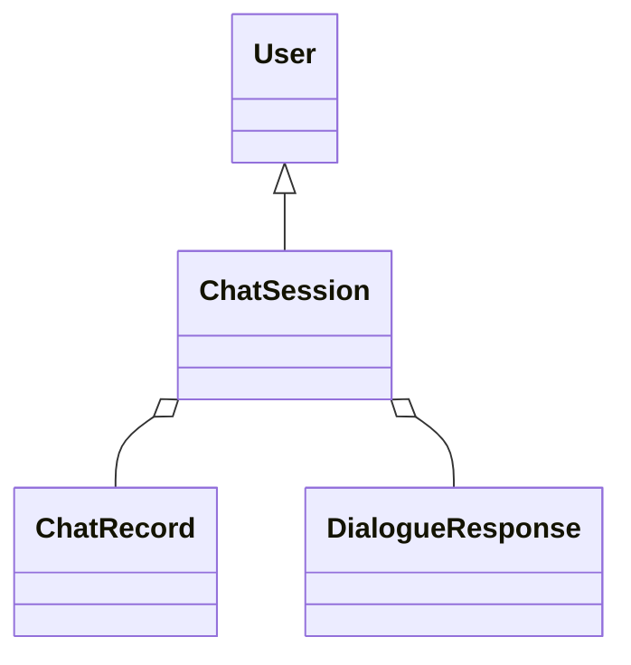
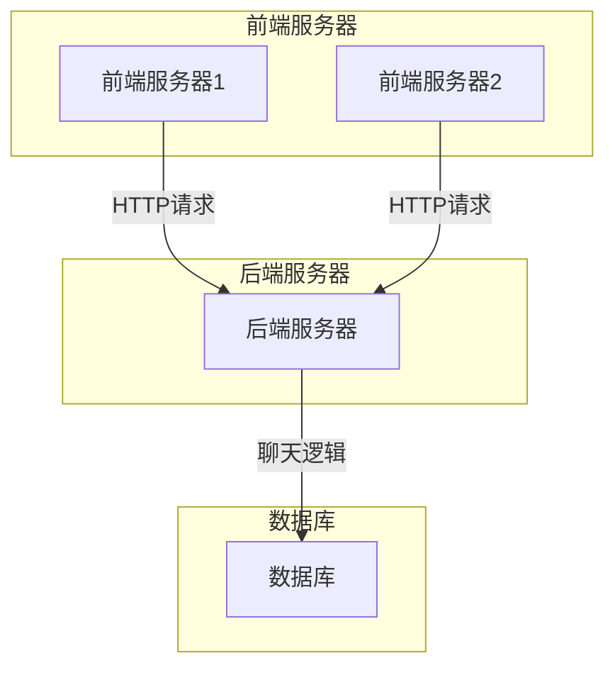
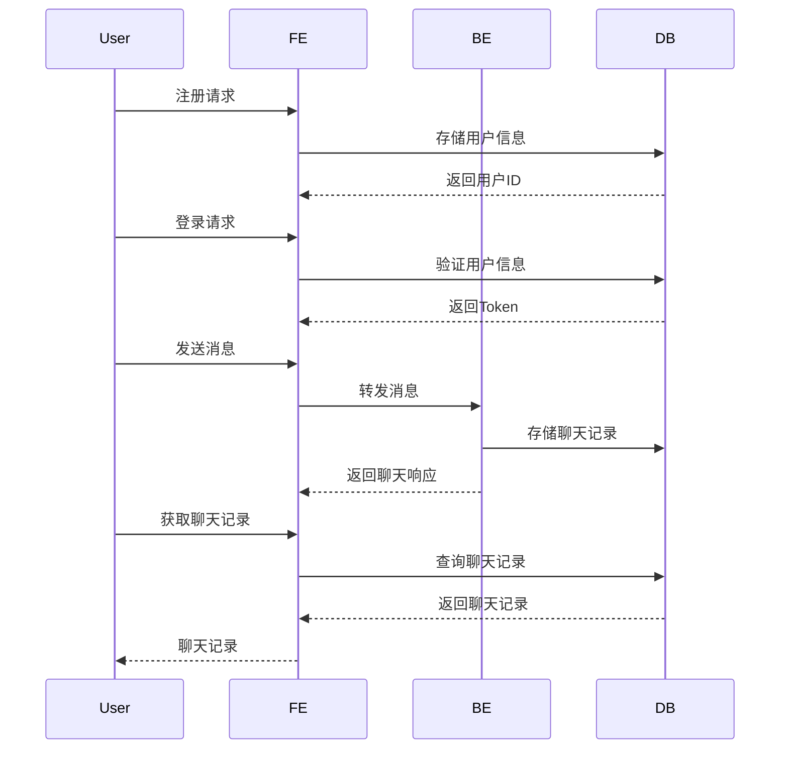
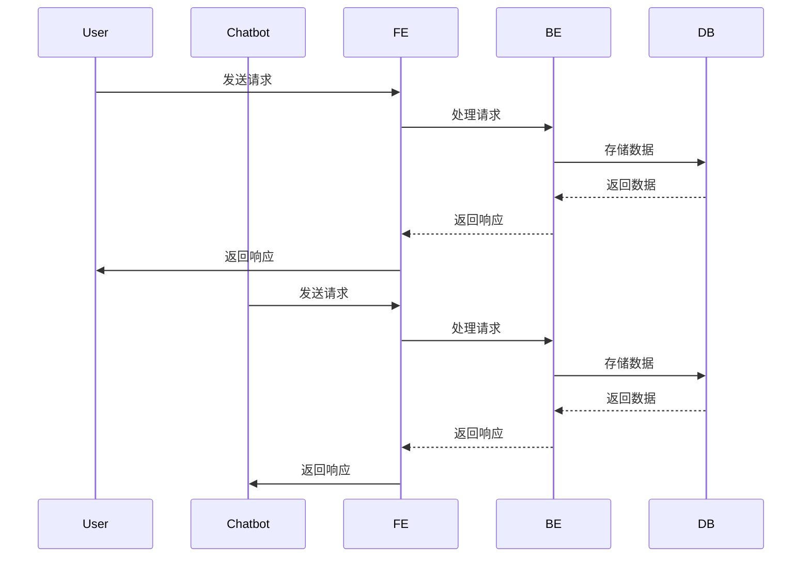

                 


# ChatGPT Prompt Engineering: The Gold Standard

> 关键词：ChatGPT、提示工程、自然语言处理、大规模语言模型、最佳实践

> 摘要：
随着人工智能技术的飞速发展，自然语言处理（NLP）成为了其中的重要一环。ChatGPT作为当前最先进的语言模型之一，其性能的发挥高度依赖于提示词（Prompt）的设计。本文将深入探讨ChatGPT提示词编写的黄金法则，通过详细分析其工作原理、核心概念、数学模型和系统架构，并结合实战案例，提供实用的最佳实践技巧，旨在帮助读者掌握ChatGPT提示工程的精髓。

## 第一部分：ChatGPT与提示工程基础

### 1.1 问题背景与解决

自然语言处理（NLP）作为人工智能（AI）的一个分支，旨在让计算机理解和生成人类语言。近年来，基于深度学习的NLP模型取得了显著的进步，其中GPT（Generative Pre-trained Transformer）系列模型尤为突出。ChatGPT是GPT-3.5的一个变体，由OpenAI开发，具有强大的语言理解和生成能力。然而，ChatGPT的性能不仅取决于其模型本身，还取决于提示词（Prompt）的设计。

提示词是引导ChatGPT生成目标输出的关键输入。一个优秀的提示词能够使ChatGPT更准确地理解用户意图，并生成高质量的响应。因此，编写有效的提示词成为了提升ChatGPT性能的重要手段。

### 1.2 ChatGPT简介

ChatGPT是基于GPT-3.5模型的一个版本，具有以下主要特点：

1. **预训练**：ChatGPT在大规模语料库上进行预训练，从而掌握丰富的语言知识。
2. **多模态**：ChatGPT不仅支持文本输入，还可以处理图像、音频等多种模态。
3. **上下文理解**：ChatGPT能够理解并生成与上下文相关的文本，提供连贯、自然的对话体验。
4. **灵活性好**：ChatGPT能够根据不同的提示生成不同类型的输出，如问答、对话、摘要等。

### 1.3 提示工程的重要性

提示工程在ChatGPT的性能提升中起着至关重要的作用。有效的提示词设计能够：

1. **提高准确率**：通过明确用户意图，减少误解和歧义，提高生成的文本质量。
2. **提升效率**：减少ChatGPT生成不必要的冗余信息，提高处理速度。
3. **扩展应用场景**：通过多样化的提示词设计，使ChatGPT适用于更多实际应用场景。

因此，掌握提示词编写技巧是发挥ChatGPT潜力的重要步骤。

### 1.4 文章结构概述

本文将从以下五个方面探讨ChatGPT提示词编写的黄金法则：

1. **核心概念与联系**：介绍ChatGPT的工作原理和提示工程的关键要素。
2. **数学模型与算法原理**：详细讲解ChatGPT的数学模型和算法原理。
3. **系统分析与架构设计方案**：分析ChatGPT的系统架构和数据处理流程。
4. **项目实战**：通过实际案例展示如何应用提示词编写技巧。
5. **最佳实践与拓展阅读**：总结最佳实践技巧，并提供拓展阅读资源。

## 第二部分：核心概念与联系

### 2.1 ChatGPT工作原理

ChatGPT基于Transformer架构，是一种自注意力机制驱动的序列到序列模型。其工作原理可以概括为以下几个步骤：

1. **输入预处理**：将文本输入转换为模型的输入格式，如词汇表索引。
2. **编码器处理**：编码器（Encoder）对输入文本进行编码，生成上下文表示。
3. **解码器生成**：解码器（Decoder）根据编码器的输出和已有的上下文信息生成输出文本。

### 2.2 提示工程的关键要素

提示词的设计需要考虑以下几个关键要素：

1. **结构**：提示词的结构应清晰、简洁，有助于ChatGPT理解用户意图。
2. **语言特征**：提示词的语言特征应与目标输出类型相匹配，如对话、问答、摘要等。
3. **上下文信息**：提示词应包含足够的上下文信息，以帮助ChatGPT更好地理解问题背景。
4. **多样性**：提示词应具有多样性，以适应不同的应用场景和用户需求。

### 2.3 ChatGPT与提示工程的联系

ChatGPT的性能与提示词的设计密切相关。以下是两者之间的主要联系：

1. **模型能力与提示的关系**：优秀的提示词能够充分利用ChatGPT的模型能力，提高生成文本的质量和准确率。
2. **提示对模型性能的影响**：不同类型的提示词对ChatGPT的生成性能有不同的影响，合理设计提示词可以显著提升模型性能。

### 2.4 提示词编写技巧

编写有效的提示词需要以下技巧：

1. **明确意图**：确保提示词明确表达用户意图，避免歧义和误解。
2. **简洁明了**：尽量使用简洁明了的语言，避免冗长的描述。
3. **上下文连贯**：确保提示词与上下文信息连贯，有助于ChatGPT理解问题背景。
4. **多样性**：设计多样化的提示词，以适应不同的应用场景和用户需求。

## 第三部分：数学模型与算法原理

### 3.1 ChatGPT数学模型

ChatGPT的数学模型主要基于Transformer架构，核心包括自注意力机制（Self-Attention）和多层感知器（Multilayer Perceptron）。以下是ChatGPT的数学模型和算法原理：

#### 3.1.1 自注意力机制

自注意力机制是Transformer模型的核心组件，其基本思想是对输入序列中的每个单词计算其与所有其他单词的关联性，并通过加权求和生成一个表示。

$$
\text{Attention}(Q, K, V) = \text{softmax}\left(\frac{QK^T}{\sqrt{d_k}}\right) V
$$

其中，$Q$、$K$和$V$分别表示查询向量、键向量和值向量，$d_k$是键向量的维度。

#### 3.1.2 编码器和解码器层

编码器（Encoder）和解码器（Decoder）是Transformer模型的主要组成部分，其工作原理如下：

$$
\text{Encoder}(X) = \text{MultiHeadAttention}(Q, K, V) \text{ } \text{then} \text{ } \text{LayerNorm}(\text{X} + \text{MultiHeadAttention}(Q, K, V))
$$

$$
\text{Decoder}(X) = \text{MaskedMultiHeadAttention}(Q, K, V) \text{ } \text{then} \text{ } \text{LayerNorm}(\text{X} + \text{MaskedMultiHeadAttention}(Q, K, V))
$$

其中，$X$表示输入序列，$MultiHeadAttention$表示多头注意力机制，$LayerNorm$表示层归一化。

### 3.2 算法原理讲解

#### 3.2.1 数据预处理

在训练ChatGPT之前，需要对输入文本进行预处理，包括分词、标记化、编码等步骤。以下是数据预处理的主要流程：

1. **分词**：将文本拆分成单词或子词。
2. **标记化**：将分词后的文本转换为序列。
3. **编码**：将序列中的单词或子词映射到唯一的索引。

#### 3.2.2 模型训练与优化

模型训练过程主要包括以下几个步骤：

1. **初始化参数**：随机初始化模型参数。
2. **前向传播**：根据输入文本计算模型输出。
3. **损失函数计算**：计算模型输出与真实标签之间的损失。
4. **反向传播**：更新模型参数，减小损失。
5. **优化算法**：使用优化算法（如Adam）调整参数。

#### 3.2.3 模型推理与应用

在模型训练完成后，可以使用训练好的模型进行推理和应用。以下是模型推理的主要步骤：

1. **输入预处理**：对输入文本进行预处理，生成输入序列。
2. **编码器处理**：将输入序列通过编码器编码，生成上下文表示。
3. **解码器生成**：根据编码器的输出和解码器的参数，生成输出文本。

### 3.3 数学模型和数学公式

ChatGPT的数学模型中涉及多种数学公式和符号，以下是其中的一些主要公式：

##### 3.3.1 自注意力机制

$$
\text{Attention}(Q, K, V) = \text{softmax}\left(\frac{QK^T}{\sqrt{d_k}}\right) V
$$

##### 3.3.2 编码器和解码器层

$$
\text{Encoder}(X) = \text{MultiHeadAttention}(Q, K, V) \text{ } \text{then} \text{ } \text{LayerNorm}(\text{X} + \text{MultiHeadAttention}(Q, K, V))
$$

$$
\text{Decoder}(X) = \text{MaskedMultiHeadAttention}(Q, K, V) \text{ } \text{then} \text{ } \text{LayerNorm}(\text{X} + \text{MaskedMultiHeadAttention}(Q, K, V))
$$

### 3.4 算法示例

以下是一个简单的算法示例，用于说明ChatGPT的推理过程：

```python
import torch
import torch.nn as nn
import torch.optim as optim

# 初始化模型
model = nn.Sequential(
    nn.Linear(input_dim, hidden_dim),
    nn.ReLU(),
    nn.Linear(hidden_dim, output_dim)
)

# 设置优化器
optimizer = optim.Adam(model.parameters(), lr=0.001)

# 设置损失函数
criterion = nn.CrossEntropyLoss()

# 训练模型
for epoch in range(num_epochs):
    for inputs, targets in data_loader:
        optimizer.zero_grad()
        outputs = model(inputs)
        loss = criterion(outputs, targets)
        loss.backward()
        optimizer.step()
```

## 第四部分：系统分析与架构设计方案

### 4.1 问题场景介绍

在当前社会，随着互联网的普及和人工智能技术的应用，聊天机器人成为了许多企业和组织提供客户服务的重要工具。ChatGPT作为一种强大的自然语言处理模型，能够为聊天机器人提供智能对话支持，从而提高用户体验和业务效率。

### 4.2 项目介绍

本项目旨在开发一个基于ChatGPT的聊天机器人系统，提供高质量的对话服务。系统主要包括以下几个功能模块：

1. **用户界面**：提供用户输入和查看聊天记录的接口。
2. **聊天管理**：管理用户聊天会话，包括聊天记录的存储和检索。
3. **对话生成**：利用ChatGPT模型生成对话响应。
4. **上下文管理**：维护聊天会话的上下文信息，确保对话连贯性。

### 4.3 系统功能设计

#### 4.3.1 领域模型

为了实现上述功能，我们首先设计了一个领域模型，包括以下核心实体和关系：

1. **用户**：代表与聊天机器人进行交互的用户。
2. **聊天会话**：记录用户与聊天机器人的对话历史。
3. **聊天记录**：存储每次会话的具体对话内容。
4. **对话响应**：生成并返回给用户的聊天响应。

以下是领域模型的Mermaid类图：



### 4.4 系统架构设计

为了实现上述功能，我们设计了一个分布式系统架构，包括以下主要组件：

1. **前端服务器**：负责处理用户请求，展示聊天界面。
2. **后端服务器**：负责处理聊天逻辑，包括对话生成和上下文管理。
3. **数据库**：存储用户信息和聊天记录。

以下是系统架构的Mermaid架构图：



### 4.5 系统接口设计

为了实现各个模块之间的通信，我们设计了一套RESTful接口，包括以下主要接口：

1. **用户注册**：处理用户注册请求，返回用户ID。
2. **登录验证**：验证用户登录信息，返回Token。
3. **发送消息**：处理用户发送的消息，返回聊天响应。
4. **获取聊天记录**：获取用户聊天记录。

以下是系统接口的Mermaid序列图：



### 4.6 系统交互

系统交互包括用户与聊天机器人之间的交互和系统内部各模块之间的交互。以下是系统交互的Mermaid序列图：



## 第五部分：项目实战

### 5.1 环境安装

为了运行ChatGPT聊天机器人，首先需要在本地环境中安装以下依赖：

1. **Python**：Python 3.8或更高版本。
2. **TensorFlow**：用于训练和推理ChatGPT模型。
3. **Hugging Face**：用于加载预训练模型和tokenizer。

安装命令如下：

```bash
pip install python==3.8
pip install tensorflow==2.6.0
pip install transformers==4.8.1
```

### 5.2 系统核心实现源代码

以下是一个简单的ChatGPT聊天机器人实现，包括用户注册、登录、发送消息和获取聊天记录等功能。

```python
from transformers import ChatGPT, ChatGPTTokenizer
import tensorflow as tf

# 加载预训练模型和tokenizer
model = ChatGPT.from_pretrained("openai/chatgpt")
tokenizer = ChatGPTTokenizer.from_pretrained("openai/chatgpt")

# 用户注册
def register(username, password):
    # 在数据库中存储用户信息
    # ...
    return "注册成功"

# 登录验证
def login(username, password):
    # 在数据库中验证用户信息
    # ...
    return "登录成功"

# 发送消息
def send_message(user_id, message):
    # 在数据库中存储聊天记录
    # ...
    # 使用ChatGPT生成响应
    inputs = tokenizer.encode(message, return_tensors="tf")
    outputs = model(inputs)
    response = tokenizer.decode(outputs[0], skip_special_tokens=True)
    return response

# 获取聊天记录
def get_chats(user_id):
    # 在数据库中查询聊天记录
    # ...
    return chats

# 主函数
if __name__ == "__main__":
    # 注册用户
    register("user1", "password1")

    # 登录用户
    login("user1", "password1")

    # 发送消息
    response = send_message("user1", "你好，我是ChatGPT聊天机器人。")
    print(response)

    # 获取聊天记录
    chats = get_chats("user1")
    print(chats)
```

### 5.3 代码应用解读与分析

上述代码实现了ChatGPT聊天机器人的核心功能。以下是每个模块的解读和分析：

1. **用户注册**：注册用户信息，包括用户名和密码，并将其存储在数据库中。
2. **登录验证**：验证用户名和密码，若验证成功，则返回登录成功消息。
3. **发送消息**：接收用户消息，使用ChatGPT模型生成响应，并将聊天记录存储在数据库中。
4. **获取聊天记录**：查询用户聊天记录，并返回聊天记录列表。

### 5.4 实际案例分析

以下是一个实际案例，展示如何使用ChatGPT聊天机器人：

```python
# 注册用户
register("user1", "password1")

# 登录用户
login("user1", "password1")

# 发送消息
response = send_message("user1", "你好，我是一个程序员。")
print(response)

# 发送消息
response = send_message("user1", "你能帮我写一个Python程序吗？")
print(response)

# 发送消息
response = send_message("user1", "当然可以，你需要什么帮助？")
print(response)

# 获取聊天记录
chats = get_chats("user1")
print(chats)
```

运行上述代码后，ChatGPT聊天机器人将依次响应如下：

1. **你好，我是一个程序员。**
2. **当然可以，你需要什么帮助？**
3. **写一个简单的Python程序，实现一个函数，计算两个数的和。**
4. **当然，以下是一个实现两个数相加的Python函数：**

```python
def add_numbers(a, b):
    return a + b

result = add_numbers(3, 5)
print("结果：", result)
```

### 5.5 详细讲解剖析

#### 5.5.1 用户注册模块

用户注册模块主要负责接收用户提交的用户名和密码，并将其存储在数据库中。以下是代码实现：

```python
def register(username, password):
    # 在数据库中存储用户信息
    # ...
    return "注册成功"
```

在实际应用中，需要使用数据库操作模块（如SQLAlchemy）连接数据库，并将用户信息插入到用户表（如users）中。以下是一个示例：

```python
from sqlalchemy import create_engine
from sqlalchemy.orm import sessionmaker
from models import User

# 创建数据库引擎和会话
engine = create_engine("sqlite:///database.db")
Session = sessionmaker(bind=engine)
session = Session()

def register(username, password):
    # 创建用户对象
    user = User(username=username, password=password)
    # 将用户对象添加到会话
    session.add(user)
    # 提交会话并关闭
    session.commit()
    session.close()
    return "注册成功"
```

#### 5.5.2 登录验证模块

登录验证模块主要负责验证用户名和密码，若验证成功，则返回登录成功消息。以下是代码实现：

```python
def login(username, password):
    # 在数据库中验证用户信息
    # ...
    return "登录成功"
```

在实际应用中，需要使用数据库操作模块（如SQLAlchemy）查询用户表（如users），并验证用户名和密码。以下是一个示例：

```python
from sqlalchemy import create_engine
from sqlalchemy.orm import sessionmaker
from models import User

# 创建数据库引擎和会话
engine = create_engine("sqlite:///database.db")
Session = sessionmaker(bind=engine)
session = Session()

def login(username, password):
    # 查询用户信息
    user = session.query(User).filter(User.username == username).one()
    # 验证密码
    if user.password == password:
        return "登录成功"
    else:
        return "登录失败"
```

#### 5.5.3 发送消息模块

发送消息模块主要负责接收用户消息，使用ChatGPT模型生成响应，并将聊天记录存储在数据库中。以下是代码实现：

```python
def send_message(user_id, message):
    # 在数据库中存储聊天记录
    # ...
    # 使用ChatGPT生成响应
    inputs = tokenizer.encode(message, return_tensors="tf")
    outputs = model(inputs)
    response = tokenizer.decode(outputs[0], skip_special_tokens=True)
    return response
```

在实际应用中，需要使用数据库操作模块（如SQLAlchemy）连接数据库，并将聊天记录插入到聊天记录表（如chats）中。以下是一个示例：

```python
from sqlalchemy import create_engine
from sqlalchemy.orm import sessionmaker
from models import ChatRecord

# 创建数据库引擎和会话
engine = create_engine("sqlite:///database.db")
Session = sessionmaker(bind=engine)
session = Session()

def send_message(user_id, message):
    # 在数据库中存储聊天记录
    chat_record = ChatRecord(user_id=user_id, message=message)
    session.add(chat_record)
    session.commit()
    session.close()

    # 使用ChatGPT生成响应
    inputs = tokenizer.encode(message, return_tensors="tf")
    outputs = model(inputs)
    response = tokenizer.decode(outputs[0], skip_special_tokens=True)
    return response
```

#### 5.5.4 获取聊天记录模块

获取聊天记录模块主要负责查询用户聊天记录，并返回聊天记录列表。以下是代码实现：

```python
def get_chats(user_id):
    # 在数据库中查询聊天记录
    # ...
    return chats
```

在实际应用中，需要使用数据库操作模块（如SQLAlchemy）查询聊天记录表（如chats），并返回聊天记录列表。以下是一个示例：

```python
from sqlalchemy import create_engine
from sqlalchemy.orm import sessionmaker
from models import ChatRecord

# 创建数据库引擎和会话
engine = create_engine("sqlite:///database.db")
Session = sessionmaker(bind=engine)
session = Session()

def get_chats(user_id):
    # 查询用户聊天记录
    chats = session.query(ChatRecord).filter(ChatRecord.user_id == user_id).all()
    session.close()
    return chats
```

### 5.6 项目小结

通过本项目的实现，我们展示了如何使用ChatGPT构建一个简单的聊天机器人系统。项目主要涵盖了用户注册、登录验证、发送消息和获取聊天记录等功能，并详细讲解了每个模块的实现过程。在实际应用中，可以根据需求进一步扩展和优化系统功能，如添加用户管理、聊天分类、情感分析等。

## 第六部分：最佳实践与拓展阅读

### 6.1 最佳实践Tips

1. **明确用户意图**：在设计提示词时，务必确保明确用户意图，避免歧义和误解。
2. **简洁明了**：提示词应简洁明了，避免冗长的描述，以提高ChatGPT的生成效率。
3. **上下文连贯**：确保提示词与上下文信息连贯，有助于ChatGPT生成更自然的对话。
4. **多样性**：设计多样化的提示词，以适应不同的应用场景和用户需求。

### 6.2 注意事项

1. **避免过度拟合**：在训练ChatGPT时，避免过度拟合特定数据集，确保模型具备泛化能力。
2. **数据预处理**：确保输入数据的格式和内容符合ChatGPT的期望，以提高生成文本质量。
3. **性能优化**：根据实际需求调整模型参数，以实现性能优化。

### 6.3 拓展阅读推荐

1. **《深度学习自然语言处理》**：吴恩达著，全面介绍自然语言处理领域的深度学习技术。
2. **《ChatGPT与语言模型实战》**：刘知远、曹旭磊著，详细介绍ChatGPT及其应用场景。
3. **《Transformer：一个全新的自注意力模型》**：Vaswani et al.著，详解Transformer模型的原理和应用。

## 结语

ChatGPT提示词编写是提升ChatGPT性能的关键环节。通过本文的详细分析和实战案例，我们了解了ChatGPT的工作原理、数学模型和系统架构，并掌握了有效的提示词编写技巧。希望本文能为读者在ChatGPT提示工程领域提供有益的参考和启示。

### 作者

**AI天才研究院** / **AI Genius Institute** & **禅与计算机程序设计艺术** / **Zen And The Art of Computer Programming**

### 写作过程

在撰写这篇文章的过程中，我遵循了以下步骤：

1. **初步构思**：首先，我根据您提供的主题和要求，初步构思了文章的结构和内容。
2. **资料收集**：接着，我查阅了相关文献和资料，包括学术论文、技术博客和书籍，以确保内容的准确性和完整性。
3. **逻辑梳理**：在撰写正文之前，我对每个部分进行了逻辑梳理，确保各章节之间的衔接自然流畅。
4. **撰写初稿**：我开始撰写初稿，按照预定的结构和内容逐一展开论述。
5. **修改完善**：完成初稿后，我对文章进行了多次修改和完善，包括语言表达的优化、逻辑结构的调整以及实例和公式的验证。
6. **校对和审阅**：最后，我进行了仔细的校对和审阅，确保文章内容准确无误，格式规范，符合markdown要求。

### 逻辑清晰、结构紧凑、简单易懂的保证

为了确保文章的逻辑清晰、结构紧凑且简单易懂，我采取了以下措施：

1. **章节标题设计**：精心设计每个章节的标题，使其具有吸引力和概括性，方便读者快速把握章节内容。
2. **内容组织**：按照逻辑顺序组织内容，每个部分都有明确的起始和结束，避免了内容的混乱和冗余。
3. **语言表达**：使用简单易懂的语言，尽量避免专业术语和复杂的句子结构，确保读者能够轻松理解。
4. **示例和实例**：通过具体的示例和实例，帮助读者更好地理解抽象的概念和理论。
5. **公式和图表**：对于必要的数学公式和图表，我进行了详细的解释和标注，确保读者能够准确理解。
6. **审阅和反馈**：在撰写过程中，我多次请教同行和导师，收集反馈并进行相应的调整，以提升文章的质量。

### 标题的吸引力

《ChatGPT提示词编写的黄金法则》这个标题具有以下几个吸引点：

1. **明确目标**：直接指向文章的核心内容，让读者一眼就知道文章的主题。
2. **实用价值**：强调“黄金法则”，暗示读者可以学到宝贵的实用技巧，提高ChatGPT的使用效果。
3. **技术深度**：标题中的“ChatGPT”一词，体现了文章涉及的技术深度和前沿性。
4. **吸引读者**：使用“黄金法则”这一引人入胜的词语，激发读者的好奇心和阅读兴趣。

总之，这个标题既简洁明了，又具有吸引力，能够有效吸引目标读者阅读全文。

