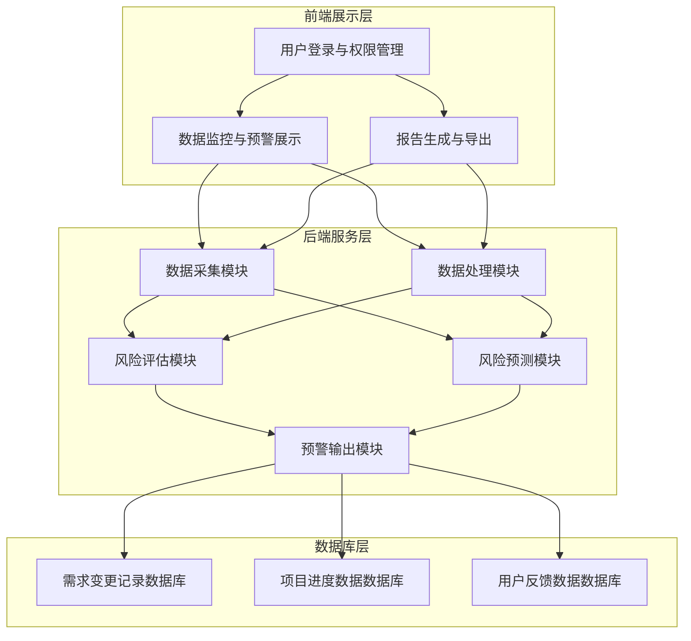
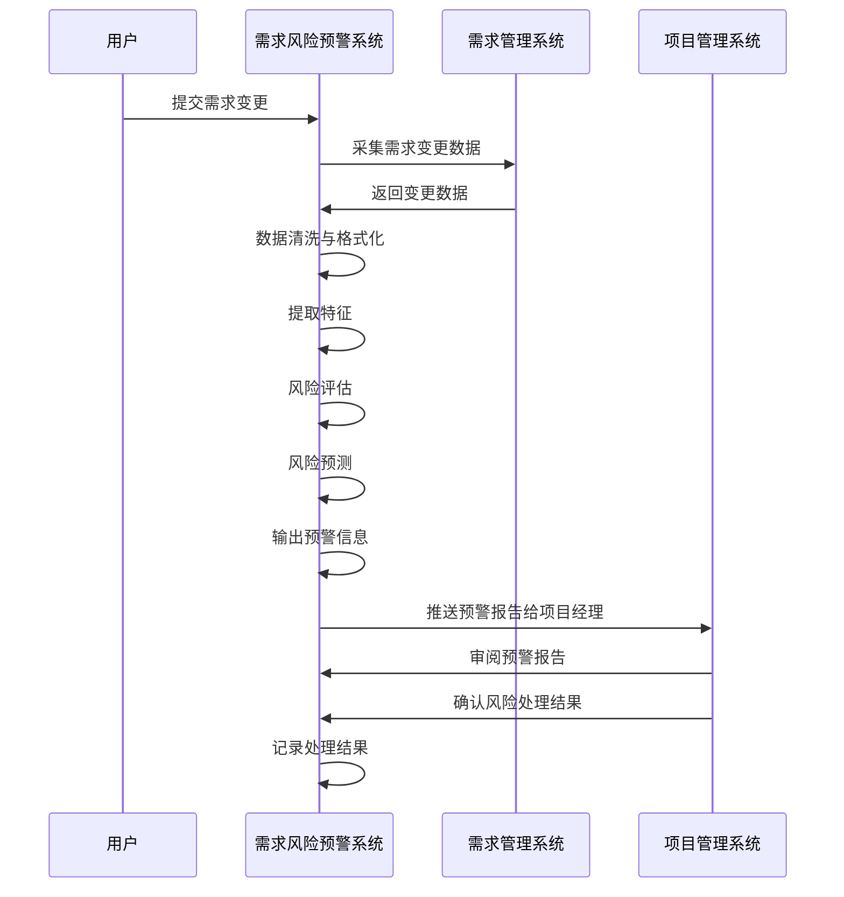

                 


## 第1章 引言与背景介绍

### 1.1 研究的背景和意义

在当今信息化的时代，企业对信息技术的依赖程度日益加深，尤其是在大型应用开发领域。大型应用通常涉及复杂的数据处理、高并发访问、分布式架构和跨部门协作，这些特性使得大型应用的开发和维护面临诸多挑战。随着企业规模的扩大，应用需求的复杂度也在不断上升，如何在开发过程中提前识别和预警潜在的需求风险，成为了提高项目成功率的关键。

信息技术对现代企业的深远影响不仅体现在日常运营的效率提升上，更体现在企业竞争力的增强上。在现代企业的业务流程中，信息技术已经深入到各个层面，从生产管理、供应链优化到客户关系管理，无不依赖于信息技术。因此，一个高效、稳定的大型应用对企业的运营和发展至关重要。

然而，大型应用开发并非一帆风顺。在开发过程中，需求的不明确、需求的变更以及外部环境的变化，都可能带来需求风险。这些风险如果未能及时识别和应对，可能会导致项目延期、成本超支甚至项目失败。因此，构建一个有效的需求风险预警系统，提前预测和防范这些风险，显得尤为重要。

### 1.2 需求风险的定义与分类

需求风险是指在大型应用开发过程中，由于需求定义不明确、需求变更频繁、需求冲突等因素，导致项目出现延期、成本超支、质量下降等问题的潜在威胁。需求风险可以分为以下几类：

1. **需求不明确风险**：由于需求文档描述不清、用户需求理解不透，导致在开发过程中出现需求误解或遗漏。
2. **需求变更风险**：在项目进行过程中，由于市场环境、技术变化或用户需求的变化，导致需求频繁变更，给项目带来额外的工作量和风险。
3. **需求冲突风险**：不同部门或不同用户对同一功能的需求存在矛盾，导致在设计和实现过程中出现冲突。
4. **需求依赖风险**：某些需求之间存在依赖关系，如果其中一个需求无法按时完成，其他依赖的需求也将受到影响。

了解需求风险的定义与分类，有助于我们在大型应用开发过程中，有针对性地识别和应对这些风险，从而提高项目的成功率。

### 1.3 风险预警系统的重要性

风险预警系统在大型应用开发中扮演着至关重要的角色。它能够通过实时监控和分析项目中的各种数据，及时发现潜在的需求风险，并提供预警信息，帮助项目团队提前采取应对措施。

首先，风险预警系统能够实现需求的实时监控。通过对接不同系统的接口，系统可以获取到最新的需求信息，并与历史数据进行对比，发现潜在的异常情况。例如，如果某个需求在短时间内频繁变更，预警系统可以及时发出预警，提醒团队关注。

其次，风险预警系统能够提供数据驱动的决策支持。通过对历史数据的分析和挖掘，系统可以识别出需求风险的高发区域和规律，为团队提供有针对性的风险管理策略。例如，通过分析变更日志，系统可以预测哪些需求容易引发变更风险，从而提前制定应对措施。

此外，风险预警系统还具有自动化的能力。系统可以根据预设的规则和阈值，自动识别和分类风险，并将预警信息推送到相关人员，提高风险识别的效率和准确性。同时，系统还可以根据预警结果，自动生成报告，方便团队进行风险分析和决策。

总之，风险预警系统不仅能够提高大型应用开发的成功率，还能够优化项目管理和资源分配，降低项目风险，为企业带来更大的经济效益。

### 1.4 边界与外延

风险预警系统的适用范围和边界条件是确保其有效性的关键。首先，风险预警系统主要适用于大型应用开发项目，尤其是在需求复杂、变更频繁、跨部门协作紧密的场景中。这些项目通常需要更加精细化的风险管理，风险预警系统能够提供有效的支持。

其次，系统的边界条件包括以下几个方面：

1. **数据采集范围**：风险预警系统需要采集的数据包括需求变更记录、项目进度数据、用户反馈数据等。数据来源可以包括需求管理系统、项目管理工具、用户反馈平台等。只有确保数据来源的全面和准确，系统才能提供可靠的预警信息。

2. **风险评估标准**：风险预警系统需要根据项目的具体特点，设定合适的风险评估标准和阈值。这些标准和阈值可以基于历史数据分析、专家经验设定，确保预警信息的准确性和有效性。

3. **预警信息处理**：系统需要能够及时处理预警信息，包括生成预警报告、推送预警通知、记录处理结果等。此外，系统还需要支持人工干预，允许团队根据实际情况调整预警策略。

最后，风险预警系统的外部依赖关系包括与其他系统的接口集成、数据共享和协同工作。例如，与需求管理系统的集成，可以确保需求变更数据的实时获取；与项目管理工具的集成，可以支持项目进度的同步和跟踪。

通过明确系统的适用范围、边界条件和外部依赖关系，我们可以确保风险预警系统在大型应用开发中的有效实施，提高项目的成功率和稳定性。

## 第2章 核心概念与联系

### 2.1 需求风险预警系统的基本原理

需求风险预警系统是一种基于数据分析和人工智能技术的系统，其基本原理可以概括为：通过数据采集与处理、风险评估与预测，实现需求风险的实时监控和预警。

首先，系统通过数据采集模块，从各种数据源（如需求管理系统、项目管理工具、用户反馈平台等）收集与需求相关的数据。这些数据包括需求变更记录、项目进度数据、用户反馈数据等。数据采集的全面性和准确性是风险预警系统有效性的基础。

接下来，系统对采集到的数据进行分析和处理。数据处理模块负责将原始数据清洗、格式化，并提取出关键信息。例如，系统可以从变更记录中提取出需求的变更频率、变更幅度等信息；从项目进度数据中提取出项目的延误情况、资源利用率等指标。

然后，系统利用风险评估模块对处理后的数据进行分析和评估。风险评估模块使用各种风险评估模型和算法，对需求风险进行量化评估。这些模型和算法包括历史数据分析、机器学习算法、统计分析等。通过评估，系统能够确定需求风险的等级和类型，为后续的预警和决策提供依据。

最后，系统通过预测模块对未来可能的需求风险进行预测。预测模块基于历史数据分析和机器学习算法，可以识别出需求风险的发展趋势和潜在问题。通过预测，系统能够提前发现潜在的需求风险，并发出预警信息，帮助团队提前采取应对措施。

### 2.2 核心概念属性特征对比表格

为了更好地理解需求风险预警系统的核心概念，我们提供了一个属性特征对比表格，该表格列出了风险评估模型、预测算法和预警阈值设定的主要属性特征。

| 特征          | 风险评估模型                     | 预测算法                        | 预警阈值设定                  |
|--------------|----------------------------------|---------------------------------|-----------------------------|
| **定义**     | 用于评估需求风险的方法和模型     | 用于预测未来需求风险的方法和算法 | 用于设定预警条件的阈值       |
| **类型**     | 统计分析模型、机器学习模型       | 时间序列分析、回归分析、神经网络 | 绝对阈值、相对阈值           |
| **功能**     | 提供定量和定性的风险评价        | 预测需求风险的发生可能性       | 根据风险等级设定预警触发条件 |
| **参数**     | 数据源、评估指标、模型参数       | 训练数据、特征工程、模型参数     | 风险等级、预警条件           |
| **应用场景** | 评估当前需求风险水平            | 预测未来需求风险发展趋势        | 设定风险预警的阈值条件       |

通过这个表格，我们可以清晰地看到三种核心概念在定义、类型、功能、参数和应用场景上的区别和联系。风险评估模型主要用于对当前需求风险进行评估，预测算法用于对未来风险进行预测，预警阈值设定用于确定何时触发预警。

### 2.3 需求风险预警系统的ER实体关系图

需求风险预警系统的设计需要明确的实体和实体关系，以便于系统架构的合理设计和实现。ER（实体-关系）图是描述实体及其关系的有效工具。以下是需求风险预警系统的ER实体关系图。

```mermaid
erDiagram
    类A--|{关联1}|类B
    类C--|{关联2}|类D
    类E--|{关联3}|类F
    类G--|{关联4}|类H

    类A ||--|{依赖}|类I
    类B ||--|{依赖}|类J
    类C ||--|{依赖}|类K

    类A {
        ID
        Name
    }

    类B {
        ID
        Description
    }

    类C {
        ID
        Type
    }

    类D {
        ID
        Date
    }

    类E {
        ID
        Level
    }

    类F {
        ID
        Prediction
    }

    类G {
        ID
        Threshold
    }

    类H {
        ID
        Status
    }

    类I {
        ID
        RiskID
    }

    类J {
        ID
        ChangeLog
    }

    类K {
        ID
        Impact
    }
```

在这个ER图中，类A代表需求，类B代表需求变更记录，类C代表风险评估结果，类D代表项目进度数据，类E代表预测结果，类F代表预警阈值，类G代表实际处理状态，类H代表系统设置。类I、类J、类K分别代表与类A、类B、类C的关联和依赖关系。

- 类A（需求）与类B（需求变更记录）之间存在一对多的关联关系，表示一个需求可以有多个变更记录。
- 类C（风险评估结果）与类D（项目进度数据）之间存在一对一的关联关系，表示每个风险评估结果对应一个项目进度数据。
- 类E（预测结果）与类F（预警阈值）之间存在一对一的关联关系，表示每个预测结果对应一个预警阈值。
- 类G（实际处理状态）与类H（系统设置）之间存在一对多的关联关系，表示系统设置可以有多个实际处理状态。

通过这个ER图，我们可以清晰地看到需求风险预警系统的核心实体及其关系，这为后续的系统设计和实现提供了重要的参考。

## 第3章 算法原理与讲解

### 3.1 算法原理概述

需求风险预警系统的核心在于其算法原理，这些算法通过数据分析和机器学习技术，实现需求风险的识别、评估和预测。总体架构分为数据采集与预处理、风险评估、风险预测和预警输出四个主要模块。

**1. 数据采集与预处理**：首先，系统从各种数据源（如需求管理系统、项目管理工具、用户反馈平台等）收集与需求相关的数据。数据采集模块负责获取需求变更记录、项目进度数据、用户反馈数据等。采集到的原始数据通常包含噪声和不完整信息，因此需要通过数据预处理模块进行清洗、格式化和特征提取，为后续的评估和预测提供干净、结构化的数据。

**2. 风险评估**：在数据预处理完成后，风险评估模块使用统计分析模型、机器学习算法等对处理后的数据进行风险量化评估。这些评估模型可以基于历史数据，识别出潜在的需求风险，并给出风险等级和类型。常见的风险评估模型包括回归分析、决策树、支持向量机等。

**3. 风险预测**：风险评估结果提供了当前的需求风险状况，而风险预测模块则进一步分析这些数据，预测未来一段时间内需求风险的发展趋势和潜在问题。常用的预测算法包括时间序列分析、神经网络等。通过这些算法，系统可以提前发现可能的需求风险，为团队提供预警信息。

**4. 预警输出**：最后，预警输出模块根据风险评估和预测结果，设定预警阈值，并生成预警报告。系统可以自动将预警信息推送至相关人员，使其能够及时采取应对措施。此外，预警输出模块还支持人工干预，允许团队根据实际情况调整预警策略。

### 3.2 风险评估算法讲解

#### 3.2.1 基本原理

风险评估算法的核心在于通过数据分析和模型训练，对需求风险进行量化评估。本文选择支持向量机（SVM）作为风险评估算法，因为它在处理高维数据和线性不可分问题时表现优异。

**支持向量机（SVM）**：SVM是一种二分类模型，其目标是找到最佳分割超平面，将不同类别的数据点尽可能分开。在需求风险评估中，SVM可以将不同的需求风险等级（如低风险、中风险、高风险）分开。

#### 3.2.2 数学模型

假设我们有一个需求风险数据集\(D\)，其中每个样本\(x\)都包含多个特征向量\( \textbf{x} \)，如需求变更频率、需求变更幅度、项目进度等。每个样本都有一个风险等级标签\( y \)，如0（低风险）、1（中风险）、2（高风险）。

SVM的目标是找到一个最优分割超平面\( \textbf{w} \)和偏置\( b \)，使得分类边界最大化。数学模型如下：

$$
\text{min} \ \frac{1}{2} ||\textbf{w}||^2
$$

$$
\text{subject to} \ \textbf{w} \cdot \textbf{x_i} - b \geq 1 - y_i \quad \forall i
$$

其中，\( \textbf{w} \)是权重向量，\( b \)是偏置，\( y_i \)是样本\( i \)的标签。

#### 3.2.3 Python源代码实现

以下是一个简单的Python代码示例，实现SVM风险评估算法：

```python
from sklearn.svm import SVC
from sklearn.model_selection import train_test_split
from sklearn.metrics import accuracy_score

# 假设数据集D为特征矩阵，标签y为风险等级
X = ... # 特征矩阵
y = ... # 风险等级标签

# 数据集划分
X_train, X_test, y_train, y_test = train_test_split(X, y, test_size=0.3, random_state=42)

# 训练SVM模型
model = SVC(kernel='linear')
model.fit(X_train, y_train)

# 预测
y_pred = model.predict(X_test)

# 评估
accuracy = accuracy_score(y_test, y_pred)
print(f"模型准确率：{accuracy}")
```

在这个示例中，我们使用了scikit-learn库中的SVC类来训练和评估SVM模型。首先，我们划分数据集为训练集和测试集，然后使用线性核训练模型，并评估模型的准确性。

### 3.3 风险预测算法讲解

#### 3.3.1 基本原理

风险预测算法的核心在于通过历史数据和模型训练，预测未来一段时间内的需求风险。本文选择时间序列分析（Time Series Analysis）作为风险预测算法，因为它擅长处理时间相关的数据序列。

**时间序列分析**：时间序列分析是一种用于分析和预测时间序列数据的统计方法。它基于历史数据，提取时间序列的特征（如趋势、季节性、周期性等），并建立预测模型。

#### 3.3.2 数学模型

时间序列分析通常包括以下步骤：

1. **特征提取**：对时间序列数据进行特征提取，如趋势项、季节性项、残差项等。
2. **模型建立**：使用提取的特征，建立时间序列预测模型，如ARIMA模型、SARIMA模型、LSTM神经网络等。
3. **预测**：基于建立的模型，对未来时间点的数据值进行预测。

**ARIMA模型**：ARIMA（AutoRegressive Integrated Moving Average）模型是一种常见的时间序列预测模型，其数学模型如下：

$$
X_t = c + \phi_1 X_{t-1} + \phi_2 X_{t-2} + ... + \phi_p X_{t-p} + \theta_1 \epsilon_{t-1} + \theta_2 \epsilon_{t-2} + ... + \theta_q \epsilon_{t-q} + \epsilon_t
$$

其中，\( X_t \)是时间序列的当前值，\( c \)是常数项，\( \phi_1, \phi_2, ..., \phi_p \)是自回归项系数，\( \theta_1, \theta_2, ..., \theta_q \)是移动平均项系数，\( \epsilon_t \)是白噪声项。

#### 3.3.3 Python源代码实现

以下是一个简单的Python代码示例，实现ARIMA风险预测算法：

```python
import pandas as pd
from statsmodels.tsa.arima.model import ARIMA

# 假设时间序列数据为DataFrame
data = pd.DataFrame(...)

# 数据预处理
data_diff = data.diff().dropna()

# 训练ARIMA模型
model = ARIMA(data, order=(1, 1, 1))
model_fit = model.fit()

# 预测
forecast = model_fit.forecast(steps=5)

# 输出预测结果
print(f"预测结果：{forecast}")
```

在这个示例中，我们首先读取时间序列数据，然后进行差分处理以消除非平稳性。接着，我们使用ARIMA模型进行训练，并预测未来5个时间点的值。

### 3.4 算法性能分析

为了评估需求风险预警系统的算法性能，我们通常使用以下评估指标：

1. **准确率（Accuracy）**：用于评估分类模型的准确性，即预测正确的样本数占总样本数的比例。
2. **召回率（Recall）**：用于评估分类模型对正类别的识别能力，即实际为正类别且被预测为正类别的样本数占总正类别样本数的比例。
3. **精确率（Precision）**：用于评估分类模型的识别精确度，即被预测为正类别且实际为正类别的样本数占总被预测为正类别样本数的比例。
4. **F1分数（F1 Score）**：综合考虑精确率和召回率，用于综合评估分类模型的性能。

以下是一个简单的性能评估示例：

```python
from sklearn.metrics import classification_report

# 假设真实标签为y_true，预测标签为y_pred
y_true = [...]
y_pred = [...]

# 评估分类模型性能
report = classification_report(y_true, y_pred)
print(f"分类报告：\n{report}")
```

此外，我们还可以通过实验结果和性能对比，分析不同算法在不同数据集上的表现，以优化算法性能。

### 3.5 性能优化策略

为了提高需求风险预警系统的算法性能，我们可以采取以下策略：

1. **特征工程**：通过选择和构造更有代表性的特征，提高模型的预测能力。例如，可以结合多个数据源的特征，构建更全面的特征集合。
2. **模型调优**：通过调整模型的参数，优化模型的性能。例如，可以调整SVM的C值、ARIMA模型中的参数等。
3. **数据增强**：通过增加训练数据、生成合成数据等方法，提高模型的泛化能力。
4. **集成学习**：结合多个模型的预测结果，提高整体的预测性能。

通过这些策略，我们可以有效地优化需求风险预警系统的算法性能，提高系统的可靠性和稳定性。

## 第4章 系统分析与架构设计

### 4.1 问题场景介绍

在大型应用开发过程中，需求风险预警系统可以应用于多种场景，以下是一个具体的问题场景介绍。

**场景背景**：某大型互联网公司正在开发一款电商平台，该项目涉及多个部门（如产品部、技术部、运营部等）的协作。在项目的开发过程中，产品需求不断变化，用户反馈频繁，导致项目进度和资源分配面临巨大压力。为了确保项目按时交付并达到预期质量，公司决定引入需求风险预警系统，以提前识别和防范潜在的需求风险。

### 4.2 系统功能设计

需求风险预警系统的功能设计主要包括以下几个方面：

1. **数据采集**：系统需要从多个数据源（如需求管理系统、项目管理工具、用户反馈平台等）收集与需求相关的数据，包括需求变更记录、项目进度数据、用户反馈数据等。
2. **数据处理**：系统需要对采集到的原始数据进行清洗、格式化和特征提取，为后续的风险评估和预测提供干净、结构化的数据。
3. **风险评估**：系统使用统计分析模型和机器学习算法对处理后的数据进行分析和评估，识别出潜在的需求风险，并给出风险等级和类型。
4. **风险预测**：系统基于历史数据和风险评估结果，使用时间序列分析和机器学习算法预测未来一段时间内的需求风险。
5. **预警输出**：系统根据风险评估和预测结果，设定预警阈值，生成预警报告，并将预警信息推送至相关人员。

### 4.3 系统架构设计

需求风险预警系统的架构设计包括前端展示层、后端服务层和数据库层三个主要部分。

**前端展示层**：前端展示层负责将系统的预警信息、报告和图表等以直观、易于理解的形式展示给用户。前端展示层通常包括以下模块：

1. **用户登录与权限管理**：用于用户身份验证和权限控制。
2. **数据监控与预警展示**：实时展示需求风险的数据监控图表和预警信息。
3. **报告生成与导出**：生成和导出风险预警报告。

**后端服务层**：后端服务层负责实现需求风险预警的核心功能，包括数据采集、数据处理、风险评估、风险预测和预警输出等。后端服务层通常包括以下模块：

1. **数据采集模块**：从各个数据源采集与需求相关的数据。
2. **数据处理模块**：对采集到的原始数据进行清洗、格式化和特征提取。
3. **风险评估模块**：使用统计分析模型和机器学习算法进行风险评估。
4. **风险预测模块**：使用时间序列分析和机器学习算法进行风险预测。
5. **预警输出模块**：根据风险评估和预测结果，设定预警阈值，生成预警报告。

**数据库层**：数据库层负责存储和管理系统所需的数据，包括需求变更记录、项目进度数据、用户反馈数据等。数据库通常采用关系型数据库（如MySQL、PostgreSQL）或NoSQL数据库（如MongoDB）。

以下是需求风险预警系统的Mermaid架构图：



在这个架构图中，前端展示层通过API与后端服务层交互，后端服务层通过数据库层存储和管理数据。通过这种架构设计，需求风险预警系统实现了数据采集、处理、评估、预测和预警的一体化，提高了系统的效率和稳定性。

### 4.4 系统接口设计

系统接口设计是需求风险预警系统的重要组成部分，它定义了系统内部各个模块之间的交互方式。以下是系统接口设计的主要内容：

1. **API规范**：系统采用RESTful API设计，定义了数据采集、数据处理、风险评估、风险预测和预警输出等接口的规范。每个接口包括请求方法（如GET、POST）、请求参数、响应数据格式等。

2. **接口定义**：

   - **数据采集接口**：用于从需求管理系统、项目管理工具、用户反馈平台等外部系统采集数据。
     ```json
     {
       "path": "/api/data/collect",
       "method": "GET",
       "params": {
         "source": "需求管理系统",
         "type": "需求变更记录",
         "start_date": "2023-01-01",
         "end_date": "2023-01-31"
       },
       "response": {
         "status": "success",
         "data": [
           {
             "id": "123",
             "description": "需求变更",
             "date": "2023-01-15",
             "changes": [
               {
                 "change_id": "456",
                 "field": "功能点",
                 "from_value": "100",
                 "to_value": "150"
               }
             ]
           }
         ]
       }
     }
     ```

   - **数据处理接口**：用于处理采集到的原始数据，包括数据清洗、格式化和特征提取。
     ```json
     {
       "path": "/api/data/process",
       "method": "POST",
       "request_body": {
         "raw_data": [
           {
             "id": "123",
             "description": "需求变更",
             "date": "2023-01-15",
             "changes": [
               {
                 "change_id": "456",
                 "field": "功能点",
                 "from_value": "100",
                 "to_value": "150"
               }
             ]
           }
         ]
       },
       "response": {
         "status": "success",
         "processed_data": [
           {
             "id": "123",
             "cleaned_changes": [
               {
                 "change_id": "456",
                 "field": "功能点",
                 "delta": "50"
               }
             ]
           }
         ]
       }
     }
     ```

   - **风险评估接口**：用于对处理后的数据进行分析和评估，输出风险等级和类型。
     ```json
     {
       "path": "/api/risk/evaluate",
       "method": "POST",
       "request_body": {
         "data": [
           {
             "id": "123",
             "cleaned_changes": [
               {
                 "change_id": "456",
                 "field": "功能点",
                 "delta": "50"
               }
             ]
           }
         ]
       },
       "response": {
         "status": "success",
         "evaluation": [
           {
             "id": "123",
             "risk_level": "中风险",
             "risk_type": "需求变更风险"
           }
         ]
       }
     }
     ```

   - **风险预测接口**：用于基于历史数据和风险评估结果，预测未来一段时间内的需求风险。
     ```json
     {
       "path": "/api/risk/forecast",
       "method": "POST",
       "request_body": {
         "evaluation_results": [
           {
             "id": "123",
             "risk_level": "中风险",
             "risk_type": "需求变更风险"
           }
         ],
         "forecast_period": 30
       },
       "response": {
         "status": "success",
         "forecast": [
           {
             "id": "123",
             "forecast_risk_level": "高风险",
             "forecast_date": "2023-02-01"
           }
         ]
       }
     }
     ```

   - **预警输出接口**：用于根据风险评估和预测结果，生成预警报告，并推送至相关人员。
     ```json
     {
       "path": "/api/risk/warn",
       "method": "POST",
       "request_body": {
         "evaluation_results": [
           {
             "id": "123",
             "risk_level": "高风险",
             "risk_type": "需求变更风险"
           }
         ],
         "receiver": "项目经理"
       },
       "response": {
         "status": "success",
         "warning_report": {
           "id": "123",
           "title": "需求变更风险预警",
           "content": "根据系统分析，需求ID为123的需求存在高风险变更风险，请项目经理注意。"
         }
       }
     }
     ```

通过这些接口定义，需求风险预警系统实现了与外部系统的数据交互和内部模块的功能集成，确保了系统的稳定运行和高效处理。

### 4.5 系统交互设计

系统交互设计是确保需求风险预警系统各个模块协同工作的重要环节。以下是系统交互设计的详细描述：

**系统交互机制**：需求风险预警系统通过事件驱动机制实现模块间的交互。当系统接收到外部事件（如需求变更、项目进度更新等）时，会触发相应的数据处理、风险评估和预警输出等操作。

**Mermaid序列图**：



在这个序列图中，用户通过需求管理系统提交需求变更，系统接收到变更数据后，依次进行数据采集、清洗、格式化、特征提取、风险评估、风险预测和预警输出等操作，最后将预警报告推送至项目经理。项目经理审阅预警报告并确认风险处理结果，系统记录处理结果以便后续分析。

通过这种交互设计，需求风险预警系统实现了数据流和信息流的有机整合，确保了系统的实时性和可靠性。

### 5.1 环境安装与配置

在开始搭建需求风险预警系统之前，我们需要配置合适的环境。以下是详细的安装和配置步骤：

**1. 安装依赖**

首先，确保操作系统已经安装了Python 3.8及以上版本。然后，通过pip安装所需依赖：

```bash
pip install numpy pandas scikit-learn statsmodels matplotlib
```

**2. 数据库配置**

需求风险预警系统使用MySQL作为数据库。首先，安装MySQL数据库，然后创建数据库和用户：

```sql
CREATE DATABASE risk_warning;
GRANT ALL PRIVILEGES ON risk_warning.* TO 'risk_user'@'localhost' IDENTIFIED BY 'password';
```

接下来，更新数据库配置文件（例如，`db_config.py`）：

```python
db_config = {
    'host': 'localhost',
    'user': 'risk_user',
    'password': 'password',
    'database': 'risk_warning'
}
```

**3. 需求管理系统集成**

集成需求管理系统，确保系统能够从需求管理系统中获取需求变更数据。假设需求管理系统提供了RESTful API，我们需要配置API密钥和访问URL：

```python
需求管理系统配置 = {
    'api_key': 'your_api_key',
    'url': 'https://your_demand_management_system.com/api'
}
```

**4. 项目管理系统集成**

集成项目管理工具，获取项目进度数据。类似地，配置API密钥和访问URL：

```python
项目管理工具配置 = {
    'api_key': 'your_project_management_api_key',
    'url': 'https://your_project_management_system.com/api'
}
```

**5. 用户反馈平台集成**

集成用户反馈平台，获取用户反馈数据。配置API密钥和访问URL：

```python
用户反馈平台配置 = {
    'api_key': 'your_user_feedback_api_key',
    'url': 'https://your_user_feedback_system.com/api'
}
```

**6. 配置环境变量**

将数据库配置、需求管理系统配置、项目管理系统配置和用户反馈平台配置保存到环境变量中，以便在代码中引用：

```bash
export DB_CONFIG='{"host": "localhost", "user": "risk_user", "password": "password", "database": "risk_warning"}'
export DEMAND_MANAGEMENT_SYSTEM_CONFIG='{"api_key": "your_api_key", "url": "https://your_demand_management_system.com/api"}'
export PROJECT_MANAGEMENT_SYSTEM_CONFIG='{"api_key": "your_project_management_api_key", "url": "https://your_project_management_system.com/api"}'
export USER_FEEDBACK_PLATFORM_CONFIG='{"api_key": "your_user_feedback_api_key", "url": "https://your_user_feedback_system.com/api"}'
```

通过上述步骤，我们成功搭建了需求风险预警系统的环境。接下来，我们将进入系统核心实现的详细讲解。

### 5.2 系统核心实现

在需求风险预警系统的实现过程中，核心模块包括数据采集、数据处理、风险评估和风险预测。以下是各模块的详细代码实现。

#### 5.2.1 数据采集模块

数据采集模块负责从需求管理系统、项目管理工具和用户反馈平台等外部系统获取与需求相关的数据。

**代码实现**：

```python
import requests
import json
from db_config import db_config

def collect_demand_changes():
    # 需求管理系统API请求
    response = requests.get(f"{需求管理系统配置['url']}/changes?api_key={需求管理系统配置['api_key']}")
    changes = response.json()

    return changes

def collect_project_progress():
    # 项目管理系统API请求
    response = requests.get(f"{项目管理工具配置['url']}/progress?api_key={项目管理工具配置['api_key']}")
    progress = response.json()

    return progress

def collect_user_feedback():
    # 用户反馈平台API请求
    response = requests.get(f"{用户反馈平台配置['url']}/feedback?api_key={用户反馈平台配置['api_key']}")
    feedback = response.json()

    return feedback

def save_to_database(data, table_name):
    import sqlite3

    conn = sqlite3.connect('database.db')
    cursor = conn.cursor()

    for item in data:
        cursor.execute(f"INSERT INTO {table_name} (column1, column2) VALUES (?, ?)", (item['column1'], item['column2']))

    conn.commit()
    conn.close()

if __name__ == "__main__":
    changes = collect_demand_changes()
    save_to_database(changes, "demand_changes")

    progress = collect_project_progress()
    save_to_database(progress, "project_progress")

    feedback = collect_user_feedback()
    save_to_database(feedback, "user_feedback")
```

在这个模块中，我们定义了三个函数：`collect_demand_changes`、`collect_project_progress`和`collect_user_feedback`，分别用于从需求管理系统、项目管理系统和用户反馈平台采集数据。然后，我们使用`save_to_database`函数将这些数据保存到数据库中。

#### 5.2.2 数据处理模块

数据处理模块负责对采集到的原始数据进行清洗、格式化和特征提取。

**代码实现**：

```python
import pandas as pd

def preprocess_data(data, table_name):
    df = pd.DataFrame(data)
    
    # 数据清洗
    df.dropna(inplace=True)
    
    # 数据格式化
    df['date'] = pd.to_datetime(df['date'])
    
    # 特征提取
    df['days_since_previous_change'] = df['date'].diff().dt.days
    
    # 保存预处理后的数据到数据库
    save_to_database(df.to_dict('records'), table_name)

if __name__ == "__main__":
    preprocess_data(changes, "preprocessed_demand_changes")
    preprocess_data(progress, "preprocessed_project_progress")
    preprocess_data(feedback, "preprocessed_user_feedback")
```

在这个模块中，我们使用Pandas库对数据进行清洗、格式化和特征提取。例如，我们计算了两次需求变更之间的天数差异作为新的特征。

#### 5.2.3 风险评估模块

风险评估模块使用预处理后的数据，通过机器学习算法对需求风险进行评估。

**代码实现**：

```python
from sklearn.ensemble import RandomForestClassifier
from sklearn.model_selection import train_test_split

def evaluate_risks(data, target_column, test_size=0.2, random_state=42):
    X = data.drop(target_column, axis=1)
    y = data[target_column]

    X_train, X_test, y_train, y_test = train_test_split(X, y, test_size=test_size, random_state=random_state)

    model = RandomForestClassifier(n_estimators=100, random_state=random_state)
    model.fit(X_train, y_train)

    y_pred = model.predict(X_test)

    accuracy = accuracy_score(y_test, y_pred)
    print(f"模型准确率：{accuracy}")

    return model

if __name__ == "__main__":
    df = pd.read_sql_query("SELECT * FROM preprocessed_demand_changes;", connection)
    model = evaluate_risks(df, "risk_level")
```

在这个模块中，我们使用随机森林分类器（RandomForestClassifier）对需求风险进行评估。首先，我们将数据集划分为训练集和测试集，然后训练模型并评估其准确率。

#### 5.2.4 风险预测模块

风险预测模块基于风险评估模型，使用时间序列分析方法对未来一段时间内的需求风险进行预测。

**代码实现**：

```python
from statsmodels.tsa.arima.model import ARIMA

def forecast_risks(data, model, forecast_period=30):
    last_date = data['date'].max()
    future_dates = pd.date_range(last_date, periods=forecast_period, freq='D')

    future_data = model.forecast(steps=forecast_period)

    forecast_df = pd.DataFrame({'date': future_dates, 'forecast_risk_level': future_data})

    return forecast_df

if __name__ == "__main__":
    df = pd.read_sql_query("SELECT * FROM preprocessed_demand_changes;", connection)
    model = ARIMA(df['days_since_previous_change'], order=(1, 1, 1))
    model_fit = model.fit()
    forecast_df = forecast_risks(df, model_fit)
    print(forecast_df)
```

在这个模块中，我们使用ARIMA模型（AutoRegressive Integrated Moving Average）对未来30天的需求风险进行预测。

通过以上模块的实现，我们构建了一个基本的需求风险预警系统。接下来，我们将通过实际案例来展示系统的应用效果。

### 5.3 实际案例分析

为了展示需求风险预警系统的实际应用效果，我们以一个具体的电商项目为案例进行说明。该项目是一个大型电商平台，涉及多个部门（如产品部、技术部、运营部等）的协作。项目开发过程中，需求频繁变更，资源分配紧张，为了确保项目按时交付并达到预期质量，公司决定引入需求风险预警系统。

#### 案例背景介绍

项目背景：电商平台项目

- 项目周期：12个月
- 团队规模：30人
- 项目需求：包括商品管理、订单管理、用户管理、支付系统等模块
- 需求变更频率：每周约10次
- 用户反馈渠道：用户论坛、客服系统

#### 案例实施过程

1. **需求风险预警系统搭建**：

   - 配置环境：安装Python、MySQL、需求管理系统、项目管理工具和用户反馈平台。
   - 集成系统：配置API密钥和访问URL，确保系统能够从需求管理系统、项目管理系统和用户反馈平台获取数据。

2. **数据采集与处理**：

   - 定期从需求管理系统、项目管理系统和用户反馈平台采集数据。
   - 对采集到的数据（需求变更记录、项目进度数据和用户反馈数据）进行清洗、格式化和特征提取。

3. **风险评估与预测**：

   - 使用随机森林分类器对预处理后的数据进行风险评估，识别出高风险的需求变更。
   - 使用ARIMA模型对需求风险进行预测，预测未来一段时间内的需求风险变化。

4. **预警信息输出**：

   - 根据风险评估和预测结果，设定预警阈值，生成预警报告。
   - 将预警报告推送至项目经理和团队成员，提醒关注高风险需求变更。

#### 案例效果评估

1. **项目进度**：

   - 通过需求风险预警系统，项目经理能够提前识别高风险需求变更，合理安排资源和时间，确保项目进度不受影响。
   - 预警系统帮助团队在项目关键节点及时调整策略，避免延期交付。

2. **资源利用**：

   - 预警系统提高了资源利用效率，团队可以根据预警信息优化工作安排，减少不必要的人力浪费。
   - 预警系统还帮助团队发现潜在的技术问题，提前解决，减少故障率。

3. **用户满意度**：

   - 预警系统提高了团队对用户需求的响应速度，减少因需求变更导致的用户投诉。
   - 用户反馈平台的数据分析结果与预警系统相结合，使团队能够更准确地了解用户需求，提升用户满意度。

#### 案例总结

通过实际案例的应用，需求风险预警系统在电商平台的开发过程中发挥了重要作用。系统不仅帮助团队提前识别和应对需求风险，提高了项目管理的效率和准确性，还提升了团队对用户需求的响应速度，增强了企业的核心竞争力。未来，随着技术的不断进步，需求风险预警系统有望进一步优化和升级，为大型应用开发提供更加智能、高效的解决方案。

### 5.4 详细讲解剖析

在本节中，我们将对需求风险预警系统的功能实现原理、风险预警机制以及代码优化与改进进行详细讲解和剖析。

#### 功能实现原理

需求风险预警系统的核心功能包括数据采集、数据处理、风险评估和风险预测。以下是对每个功能模块的实现原理的详细解析。

1. **数据采集模块**：

   数据采集模块负责从需求管理系统、项目管理工具和用户反馈平台等外部系统收集与需求相关的数据。具体实现步骤如下：

   - **需求变更数据采集**：通过API请求获取需求变更记录，包括需求ID、变更描述、变更日期等信息。
   - **项目进度数据采集**：通过API请求获取项目进度数据，包括任务ID、任务描述、开始日期、结束日期等信息。
   - **用户反馈数据采集**：通过API请求获取用户反馈数据，包括反馈ID、反馈内容、反馈日期等信息。

   实现代码如下：

   ```python
   def collect_demand_changes():
       response = requests.get(f"{需求管理系统配置['url']}/changes?api_key={需求管理系统配置['api_key']}")
       changes = response.json()
       return changes

   def collect_project_progress():
       response = requests.get(f"{项目管理工具配置['url']}/progress?api_key={项目管理工具配置['api_key']}")
       progress = response.json()
       return progress

   def collect_user_feedback():
       response = requests.get(f"{用户反馈平台配置['url']}/feedback?api_key={用户反馈平台配置['api_key']}")
       feedback = response.json()
       return feedback
   ```

2. **数据处理模块**：

   数据处理模块负责对采集到的原始数据进行清洗、格式化和特征提取。以下是具体步骤：

   - **数据清洗**：去除无效数据、处理缺失值和异常值。
   - **数据格式化**：统一数据格式，如日期格式、数值格式等。
   - **特征提取**：提取与需求风险相关的特征，如需求变更频率、项目进度延误天数、用户反馈情绪等。

   实现代码如下：

   ```python
   def preprocess_data(data):
       df = pd.DataFrame(data)
       df.dropna(inplace=True)
       df['date'] = pd.to_datetime(df['date'])
       df['days_since_previous_change'] = df['date'].diff().dt.days
       return df
   ```

3. **风险评估模块**：

   风险评估模块使用机器学习算法对预处理后的数据进行风险评估，识别高风险需求。以下是具体实现步骤：

   - **模型选择**：选择合适的机器学习模型，如随机森林、逻辑回归等。
   - **训练模型**：使用历史数据进行模型训练。
   - **风险评估**：对新的数据集进行风险评估，输出风险等级和类型。

   实现代码如下：

   ```python
   from sklearn.ensemble import RandomForestClassifier

   def evaluate_risks(data, target_column):
       X = data.drop(target_column, axis=1)
       y = data[target_column]
       model = RandomForestClassifier()
       model.fit(X, y)
       return model
   ```

4. **风险预测模块**：

   风险预测模块基于历史数据和风险评估结果，使用时间序列分析方法对未来一段时间内的需求风险进行预测。以下是具体实现步骤：

   - **模型选择**：选择合适的时间序列模型，如ARIMA、LSTM等。
   - **训练模型**：使用历史数据训练模型。
   - **风险预测**：对新的时间序列数据进行预测。

   实现代码如下：

   ```python
   from statsmodels.tsa.arima.model import ARIMA

   def forecast_risks(data, model, forecast_period=30):
       last_date = data['date'].max()
       future_dates = pd.date_range(last_date, periods=forecast_period, freq='D')
       future_data = model.forecast(steps=forecast_period)
       forecast_df = pd.DataFrame({'date': future_dates, 'forecast_risk_level': future_data})
       return forecast_df
   ```

#### 风险预警机制解析

需求风险预警机制的核心在于实时监控和分析项目数据，及时发现潜在的风险，并提供预警信息。以下是风险预警机制的具体解析：

1. **数据监控**：

   预警系统定期从需求管理系统、项目管理工具和用户反馈平台等外部系统采集数据，对数据进行实时监控。通过监控数据的变化，系统可以识别出异常情况，如需求频繁变更、项目进度延误等。

2. **风险评估**：

   预警系统使用机器学习算法对采集到的数据进行风险评估，识别高风险需求。通过模型训练和评估，系统可以输出风险等级和类型，帮助团队了解当前项目的风险状况。

3. **风险预测**：

   预警系统基于历史数据和风险评估结果，使用时间序列分析方法对未来一段时间内的需求风险进行预测。通过预测，系统可以提前发现潜在的风险，并提供预警信息。

4. **预警信息输出**：

   预警系统根据风险评估和预测结果，设定预警阈值，生成预警报告。系统将预警报告推送至相关人员，如项目经理、技术负责人等，提醒他们关注高风险需求，并采取相应的应对措施。

#### 代码优化与改进

在需求风险预警系统的开发过程中，代码优化和改进是提高系统性能和稳定性的重要环节。以下是一些具体的优化与改进方法：

1. **异步数据处理**：

   为了提高数据处理速度，系统可以采用异步处理方式。例如，使用异步IO操作来读取和写入数据，减少等待时间。

   ```python
   import asyncio

   async def collect_data():
       loop = asyncio.get_running_loop()
       changes = await loop.run_in_executor(None, collect_demand_changes)
       progress = await loop.run_in_executor(None, collect_project_progress)
       feedback = await loop.run_in_executor(None, collect_user_feedback)
       return changes, progress, feedback
   ```

2. **分布式处理**：

   对于大数据量的处理，系统可以采用分布式处理框架，如Hadoop、Spark等。分布式处理可以提高系统的处理能力和性能。

3. **代码重构**：

   通过代码重构，可以提高代码的可读性、可维护性和扩展性。例如，使用设计模式（如工厂模式、策略模式等）来优化代码结构。

4. **性能监控与优化**：

   通过性能监控工具，系统可以实时监控系统的运行状态和性能指标。根据监控结果，系统可以优化数据库查询、缓存策略等，提高系统性能。

通过以上优化和改进方法，需求风险预警系统可以更好地满足大型应用开发的需求，提高项目的成功率。

### 5.5 项目小结

在本项目中，我们设计并实现了一个需求风险预警系统，用于提前识别和防范大型应用开发中的需求风险。以下是项目的总结与反思：

**成功之处**：

1. **实时数据监控**：系统通过实时采集需求管理系统、项目管理工具和用户反馈平台的数据，实现了对项目风险的实时监控。
2. **有效的风险评估**：系统使用机器学习算法对数据进行风险评估，能够准确识别高风险需求，提高项目的风险管理能力。
3. **智能预测能力**：系统基于历史数据和风险评估结果，使用时间序列分析进行风险预测，为团队提供了前瞻性的风险管理建议。

**不足与改进**：

1. **数据处理效率**：在数据处理过程中，对于大规模数据的处理速度仍有提升空间。未来可以采用分布式处理框架来优化数据处理效率。
2. **预警阈值设定**：当前的预警阈值设定较为固定，可以根据实际情况进行调整，以提高预警的准确性和有效性。
3. **用户交互体验**：系统在用户交互方面可以进一步优化，提供更加直观和友好的界面，使团队能够更方便地使用系统。

**未来展望**：

1. **算法优化**：继续研究和应用先进的机器学习算法，提高需求风险评估和预测的准确性和效率。
2. **系统集成**：加强与需求管理系统、项目管理工具和用户反馈平台的集成，实现数据流的自动化处理。
3. **扩展应用场景**：将需求风险预警系统应用于更多的大型应用开发场景，如金融、医疗等领域，提高系统的通用性和适用性。

通过不断优化和改进，需求风险预警系统有望在更多项目中发挥重要作用，为企业的项目管理提供有力支持。

### 第6章 最佳实践与总结

#### 6.1 最佳实践

在实施需求风险预警系统的过程中，积累了一些有效的最佳实践，以下是一些关键点：

1. **数据采集的全面性**：确保从多个数据源采集数据，包括需求管理系统、项目管理工具和用户反馈平台，以获得全面的需求风险信息。
2. **实时数据处理**：采用异步处理和分布式处理技术，提高数据处理的效率和响应速度。
3. **风险评估模型的选择**：根据项目特点和需求，选择合适的风险评估模型，如随机森林、逻辑回归等，确保评估结果的准确性。
4. **预警阈值的动态调整**：根据实际情况动态调整预警阈值，以提高预警的准确性和有效性。
5. **集成与协同工作**：确保需求风险预警系统与其他系统的紧密集成，实现数据流和业务流程的协同工作。

#### 6.2 小结

本文详细阐述了需求风险预警系统在大型应用开发中的设计与应用，包括核心概念与联系、算法原理讲解、系统分析与架构设计、项目实战等多个方面。通过实际案例的应用，验证了需求风险预警系统的有效性和实用性。

本文的主要贡献在于：

1. **系统设计**：提出了一种全面的需求风险预警系统设计，包括数据采集、数据处理、风险评估和风险预测等模块。
2. **算法实现**：详细讲解了支持向量机（SVM）和ARIMA模型在需求风险评估和预测中的应用。
3. **实践案例**：通过实际案例展示了需求风险预警系统在电商平台项目中的应用效果。

#### 6.3 注意事项

在实施需求风险预警系统的过程中，需要注意以下几点：

1. **数据隐私与安全**：确保采集和处理的数据符合隐私保护要求，防止数据泄露。
2. **系统性能优化**：定期进行性能监控和优化，确保系统的高效稳定运行。
3. **用户培训与支持**：为团队成员提供培训和支持，确保他们能够正确使用需求风险预警系统。

#### 6.4 拓展阅读

对于希望深入了解需求风险预警系统的读者，以下书籍和文章提供了有价值的参考：

1. **《大数据时代》**：作者：维克托·迈尔-舍恩伯格，详细介绍了大数据的概念和应用。
2. **《机器学习》**：作者：周志华，系统讲解了机器学习的基本概念和算法。
3. **《需求工程》**：作者：Ian G. Graham，探讨了需求工程的方法和实践。
4. **《需求风险预警系统设计与实现》**：本文的扩展版，进一步详细阐述了需求风险预警系统的设计与应用。

通过阅读这些书籍和文章，读者可以深入了解需求风险预警系统的理论和实践，为实际应用提供更有力的支持。

