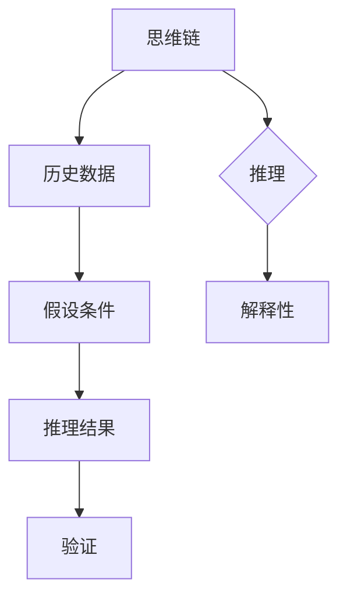

                 

### 第1章: 问题背景与核心概念

在当今信息爆炸的时代，人工智能（AI）已经渗透到我们生活的方方面面。从智能助手到自动驾驶，从医学诊断到金融分析，AI正不断改变着我们的世界。然而，尽管AI技术在图像识别、自然语言处理和语音识别等领域取得了显著的进展，其推理能力依然面临诸多挑战。

#### 1.1.1 问题背景

**人工智能的发展现状**

人工智能作为计算机科学的一个重要分支，自20世纪50年代以来，经历了从符号主义、连接主义到现代的深度学习三个主要阶段。目前，深度学习模型在图像识别、语音识别和自然语言处理等领域表现出了令人瞩目的能力。例如，卷积神经网络（CNN）在图像识别上的准确率已经超越了人类，而基于变换器模型（Transformer）的自然语言处理技术也在不断突破语言理解和生成任务的瓶颈。

**AI在推理能力方面的挑战**

然而，尽管AI在某些特定任务上表现出色，但其在推理能力上仍面临巨大的挑战。传统的AI系统大多依赖于大量的数据驱动，其决策过程往往是线性的、局部的，缺乏全局的、深度的理解能力。此外，AI系统在处理复杂问题和进行长期推理时，往往会出现错误或不一致的结果。例如，当面对一个需要多步骤推理的问题时，AI系统可能会因为某个中间步骤的错误而导致最终的结论错误。

**反事实历史推理的重要性**

在这种背景下，反事实历史推理成为了一个备受关注的研究方向。反事实历史推理是指基于现有事实，推断如果某个假设条件成立，历史会是如何发展的。这种推理能力在决策支持、历史分析、故障诊断等领域具有重要意义。例如，在金融领域，通过反事实历史推理可以帮助投资者分析如果改变了某个关键决策，投资组合的收益和风险会如何变化；在医疗领域，反事实历史推理可以帮助医生评估如果采取了不同的治疗方案，患者的康复情况会如何变化。

#### 1.1.2 核心概念

**思维链（Mind Chain）的概念**

思维链是一种用于描述和模拟人类思维过程的抽象模型。它由一系列相互关联的思考单元组成，每个思考单元代表一个特定的思维活动或认知过程。思维链的概念最早由人工智能学者提出，旨在模拟人类的推理过程，以提高AI系统的推理能力。

**反事实历史推理（Counterfactual Historical Reasoning）**

反事实历史推理是一种基于现有事实，推断如果某个假设条件成立，历史会是如何发展的推理方法。它涉及到对历史事件的重新构建和假设分析，以帮助人们理解事件的潜在因果关系。

**AI与思维链的结合**

将思维链应用于AI系统中，可以显著提高AI的反事实历史推理能力。通过将思维链与深度学习、知识图谱等技术相结合，AI系统可以更准确地模拟人类思维过程，从而在复杂推理任务中取得更好的性能。

#### 1.1.3 概念联系与架构设计

**思维链与AI的关系**

思维链与AI的结合，使得AI系统在处理复杂推理任务时，能够借鉴人类的思维模式，从而提高推理的准确性和一致性。例如，在自动驾驶系统中，通过引入思维链模型，AI可以更好地理解和预测交通状况，提高行驶的安全性。

**反事实历史推理的关键要素**

反事实历史推理的关键要素包括：现有事实的收集与处理、假设条件的构建与分析、历史事件的重新构建和推理过程的优化。这些要素共同构成了反事实历史推理的核心架构。

**系统架构设计要点**

在系统架构设计方面，需要充分考虑思维链模型的应用场景和性能需求。系统应具备灵活的模块化设计，以便于不同应用领域的快速部署和优化。同时，系统还应具备良好的扩展性，以适应未来技术的发展。

总之，本章对人工智能的发展现状、反事实历史推理的重要性以及思维链的概念和架构设计进行了详细介绍。在后续章节中，我们将进一步探讨思维链增强AI的反事实历史推理能力的具体实现方法和应用场景。

### 1.1.1.1 人工智能的发展现状

人工智能（AI）作为计算机科学的一个重要分支，经历了数十年的发展，已经取得了显著的成果。自20世纪50年代以来，AI经历了多个重要阶段，从最初的符号主义（Symbolism）到连接主义（Connectionism），再到现代的深度学习（Deep Learning），每个阶段都有其独特的贡献和突破。

**符号主义阶段**

符号主义是人工智能的早期形式，其核心思想是使用符号和逻辑来表示知识，并模拟人类的推理过程。在这个阶段，专家系统（Expert Systems）成为了一个重要的研究方向。专家系统通过将人类专家的知识和经验编码成规则库，使计算机能够模拟专家的决策过程。虽然专家系统在一定程度上实现了人工智能的目标，但其局限性也非常明显。由于知识获取和表示的复杂性，专家系统的应用范围受到很大限制。

**连接主义阶段**

连接主义阶段以人工神经网络（Artificial Neural Networks，ANN）的兴起为标志。人工神经网络通过模仿生物神经元的工作方式，通过调整网络中的权重来学习和存储信息。这一阶段的代表性工作是1986年由霍普菲尔德（John Hopfield）提出的霍普菲尔德神经网络（Hopfield Network）和1992年由海森伯格（Hinton）等人提出的反向传播算法（Backpropagation Algorithm）。这些工作为深度学习的发展奠定了基础。

**深度学习阶段**

现代深度学习阶段开始于2006年，由杰弗里·辛顿（Geoffrey Hinton）等人提出的深度信念网络（Deep Belief Networks，DBN）和深度卷积神经网络（Deep Convolutional Neural Networks，DCNN）等模型。深度学习通过堆叠多层神经网络，使计算机能够自动从大量数据中学习特征表示。这一阶段的重要突破包括卷积神经网络（CNN）在图像识别中的应用、递归神经网络（RNN）在序列数据上的优异表现以及近年来备受关注的变换器模型（Transformer）在自然语言处理领域的突破。

**深度学习的应用**

深度学习在图像识别、语音识别、自然语言处理等领域的应用取得了显著的成果。例如，在图像识别领域，CNN模型使得计算机能够准确识别复杂的图像特征，甚至在某些任务上超过了人类的识别能力。在语音识别领域，深度学习技术使得语音识别的准确率大幅提高，为智能语音助手的发展提供了基础。在自然语言处理领域，变换器模型（Transformer）的出现使得机器翻译、文本生成等任务取得了重大突破。

**当前趋势与挑战**

尽管深度学习取得了巨大的成功，但其仍面临一些挑战。首先，深度学习模型需要大量的数据和计算资源，这使得其在大规模应用中受到限制。其次，深度学习模型的“黑箱”性质使得其决策过程不透明，难以解释。此外，深度学习模型在处理复杂推理任务时，仍存在一定局限性，无法完全替代人类专家的决策能力。

总之，人工智能的发展现状呈现出快速进步的态势，深度学习技术取得了许多突破性成果。然而，为了解决现实世界中的复杂问题，人工智能领域仍需不断探索和突破。

### 1.1.1.2 AI在推理能力方面的挑战

尽管人工智能（AI）在图像识别、自然语言处理和语音识别等领域取得了显著进展，但其推理能力仍面临诸多挑战。以下从数据不足、推理复杂度和可解释性三个方面进行分析。

**数据不足**

AI系统依赖于大量数据进行训练，以学习到有效的特征表示。然而，在某些领域，数据获取存在困难。例如，在医学领域，患者隐私保护使得医疗数据难以获取；在金融领域，市场数据具有高度敏感性，难以公开。数据不足导致AI系统难以充分理解问题背景，从而影响其推理能力。

**推理复杂度**

AI系统在处理复杂推理任务时，往往面临推理复杂度的问题。传统AI系统通常采用基于规则的推理方法，这些方法在处理简单问题时效果较好，但在面对复杂问题时，容易陷入“组合爆炸”困境。深度学习模型虽然在某些特定任务上表现出色，但其对问题的理解仍局限于训练数据，难以进行跨领域的推理。

**可解释性**

深度学习模型的“黑箱”性质使得其决策过程不透明，难以解释。这在某些关键领域，如医疗和金融，成为了一个重要问题。用户需要了解AI系统是如何得出结论的，以便对其进行监督和改进。然而，目前大多数深度学习模型的可解释性较差，难以满足这一需求。

**解决思路**

针对上述挑战，研究人员提出了一些解决思路。例如，通过数据增强和生成对抗网络（GAN）等技术，可以解决数据不足的问题。在推理复杂度方面，研究人员正在探索基于图神经网络（Graph Neural Networks，GNN）等模型，以提高跨领域的推理能力。此外，通过开发可解释的AI模型，如集成方法（Ensemble Methods）和注意力机制（Attention Mechanism），可以增强模型的透明度和可解释性。

总之，AI在推理能力方面的挑战是多方面的，需要通过多种技术手段进行综合解决。随着研究的不断深入，AI系统在推理能力上的表现将逐步提高，为各个领域带来更多可能性。

### 1.1.1.3 反事实历史推理的重要性

反事实历史推理（Counterfactual Historical Reasoning）是一种基于现有事实，推断如果某个假设条件成立，历史将如何发展的推理方法。它在多个领域具有广泛的应用和重要意义。

**在决策支持中的应用**

在决策支持系统中，反事实历史推理可以帮助分析不同决策对结果的潜在影响。例如，在商业领域中，企业可以通过反事实历史推理分析如果采取不同的市场策略，销售额和利润将如何变化。这种分析有助于企业制定更为明智的决策，从而提高市场竞争力。

**在历史分析中的价值**

在历史研究领域，反事实历史推理可以帮助学者们重新审视历史事件，探讨如果历史条件发生变化，事件的结果会如何不同。例如，通过分析历史战争中的决策，可以探讨如果领导人在某个关键时刻采取了不同的策略，战争的结果可能会有何改变。这种分析不仅有助于理解历史，还能为未来的决策提供有益的启示。

**在医疗诊断中的潜力**

在医疗领域，反事实历史推理可以帮助医生评估不同治疗方案对患者的潜在影响。例如，通过分析相似病例的历史数据，医生可以推断如果患者采取了不同的治疗方案，其康复情况会有何变化。这种分析有助于医生为患者制定更加个性化的治疗方案，提高治疗效果。

**在故障诊断中的应用**

在工程和制造领域，反事实历史推理可以帮助诊断系统故障的原因。例如，通过分析设备运行历史数据，可以推断如果某个部件在某个时间点没有故障，系统的整体运行状态会如何。这种分析有助于及时发现潜在故障，预防设备损坏，提高设备运行效率。

**在金融分析中的重要性**

在金融领域，反事实历史推理可以帮助投资者分析市场变化对投资组合的潜在影响。例如，通过分析历史市场数据，可以推断如果某个经济指标发生变化，投资组合的收益和风险会有何变化。这种分析有助于投资者制定更为合理的投资策略，降低风险。

**总结**

反事实历史推理作为一种重要的推理方法，在决策支持、历史分析、医疗诊断、故障诊断和金融分析等领域具有广泛的应用价值和潜力。通过准确地进行反事实历史推理，可以帮助人们更好地理解复杂系统的潜在影响，从而做出更为明智的决策。

### 1.1.2.1 思维链的定义

思维链（Mind Chain）是一种用于描述和模拟人类思维过程的抽象模型。它通过一系列相互关联的思考单元，模拟人类在解决复杂问题时所采用的推理步骤和思考模式。每个思考单元代表一个特定的思维活动或认知过程，这些单元之间通过逻辑关系相互连接，形成一个有机的整体。

思维链的概念最早由人工智能学者提出，旨在弥补传统AI系统在推理能力方面的不足。与传统的基于规则的推理方法不同，思维链模型更加灵活和通用，能够处理更加复杂和不确定的问题。

### 1.1.2.2 思维链的组成元素

思维链的组成元素包括思考单元、连接关系和上下文环境。以下是对这些元素的详细说明：

**思考单元**

思考单元是思维链的基本组成单元，代表人类思维过程中的一个具体思维活动。每个思考单元可以包含以下内容：

- **问题陈述**：描述需要解决的问题或任务。
- **初始假设**：提出解决问题的初步假设。
- **推理过程**：描述从初始假设到结论的推理步骤。
- **结论**：根据推理过程得出的最终结论。

思考单元可以是简单的，如一个简单的逻辑判断，也可以是复杂的，如包含多个子任务和子推理过程的复合单元。

**连接关系**

连接关系用于描述不同思考单元之间的逻辑关系。常见的连接关系包括：

- **因果关系**：表示一个思考单元的结论如何影响另一个思考单元的初始假设。
- **条件关系**：表示一个思考单元的前提条件如何影响另一个思考单元的推理过程。
- **并行关系**：表示多个思考单元可以同时进行，并在某个特定时刻同步。
- **依赖关系**：表示一个思考单元的结果依赖于另一个思考单元的输出。

通过这些连接关系，思维链能够模拟人类在解决复杂问题时采用的多种推理模式。

**上下文环境**

上下文环境是思维链运行的外部条件，它提供了思维链执行所需的背景信息。上下文环境包括以下内容：

- **历史数据**：描述思维链运行前已经发生的事件和相关信息。
- **当前状态**：描述思维链执行时的实时信息，如任务进度、系统资源等。
- **预期目标**：描述思维链需要达到的最终目标。

上下文环境对思维链的推理过程具有重要影响，它能够帮助思维链更好地理解问题背景，从而提高推理的准确性和有效性。

通过上述元素，思维链能够模拟人类在解决复杂问题时的思维过程，为人工智能系统提供一种更加灵活和强大的推理能力。

### 1.1.2.3 思维链的工作机制

思维链的工作机制可以概括为输入、处理和输出三个主要阶段。以下详细解释这三个阶段的具体内容和流程。

**输入阶段**

思维链的输入阶段包括接收外部信息、确定问题情境和建立初始假设。在这个阶段，思维链需要从环境中获取必要的输入数据，这些数据可以来自各种传感器、数据库或其他信息源。例如，在一个智能问答系统中，输入数据可能是用户提出的问题文本。思维链需要对这些输入数据进行预处理，提取关键信息，并将其转换为内部表示形式。

具体流程如下：

1. **数据收集**：从外部环境中收集相关信息，如文本、图像、音频等。
2. **数据预处理**：对收集到的数据进行清洗、转换和归一化，以便于后续处理。
3. **问题情境确定**：根据输入数据，确定当前的问题情境和需要解决的问题。

**处理阶段**

处理阶段是思维链的核心部分，包括推理过程和决策生成。在这个阶段，思维链根据输入数据和初始假设，通过一系列推理步骤，逐步接近最终结论。思维链的推理过程可以采用不同的策略和方法，如基于规则的推理、基于模式的匹配、基于概率的推理等。

具体流程如下：

1. **初始假设建立**：根据输入数据和问题情境，提出初步的假设。
2. **推理过程**：通过逻辑推理、数据分析等手段，逐步验证和调整假设，直至找到符合预期的结论。
3. **决策生成**：根据最终结论，生成具体的决策或行动计划。

**输出阶段**

输出阶段包括生成输出结果、反馈和调整。在这个阶段，思维链将处理阶段的结论转换为具体的行动或输出结果，并对外部环境进行反馈，以适应新的情况。

具体流程如下：

1. **输出结果生成**：根据最终结论，生成具体的输出结果，如回答问题、生成报告、执行任务等。
2. **反馈与调整**：根据外部环境的反馈，对思维链的输入数据、假设、推理过程等进行调整，以提高后续推理的准确性和有效性。

**示例**

以一个简单的智能问答系统为例，思维链的工作流程如下：

1. **输入阶段**：用户提出问题，系统接收并预处理问题文本。
2. **处理阶段**：系统根据问题文本建立初始假设，通过关键词匹配和语义分析，逐步推理出可能的答案。
3. **输出阶段**：系统生成答案，并将答案呈现给用户。同时，系统收集用户的反馈，如是否满意答案，以优化未来的推理过程。

通过这种输入、处理和输出的循环过程，思维链能够不断调整和优化其推理能力，从而在复杂问题中提供更加准确和可靠的解决方案。

### 1.1.2.4 思维链的应用场景

思维链作为一种先进的推理模型，在多个领域展现出广泛的应用潜力。以下探讨思维链在传统AI与思维链在推理能力上的区别，并列举一些实际应用实例。

**与传统AI的推理能力区别**

传统AI系统，尤其是深度学习模型，通常依赖于大量数据进行训练，从而在特定任务上实现较高的性能。然而，这些模型往往缺乏灵活性和普适性，难以在复杂、多变的场景中进行推理。例如，在图像识别任务中，深度学习模型通过学习大量图像数据来识别对象，但其在面对新场景或变化时，往往表现不佳。相比之下，思维链通过模拟人类的思维过程，能够更好地处理复杂和非线性的问题。思维链的灵活性使其能够根据不同情境调整推理策略，从而在多种应用场景中表现出色。

**实际应用实例**

1. **智能问答系统**

思维链在智能问答系统中具有重要应用。通过模拟人类的思维过程，思维链能够理解用户的问题，并生成准确的答案。例如，在医疗领域，智能问答系统可以回答患者关于病情的疑问，提供专业的医疗建议。通过思维链，系统能够在复杂的医疗知识库中搜索相关信息，结合患者的具体症状和历史记录，生成个性化的医疗方案。

2. **自动驾驶**

在自动驾驶领域，思维链有助于提高车辆的决策能力和安全性。自动驾驶系统需要实时处理来自各种传感器的数据，并在复杂的交通环境中做出快速决策。思维链通过模拟人类的驾驶思维过程，能够处理复杂的交通情况和突发状况，提高车辆的自主决策能力。

3. **金融分析**

在金融领域，思维链可以用于风险分析和投资决策。通过分析历史数据和当前市场状况，思维链能够预测市场的潜在变化，帮助投资者制定更加明智的投资策略。例如，在股票市场中，思维链可以分析公司的财务报表、行业趋势和市场情绪，预测股票的未来走势，为投资者提供决策参考。

4. **医疗诊断**

在医疗诊断中，思维链有助于提高诊断的准确性和效率。通过分析患者的症状、病史和医学影像，思维链能够推断出可能的疾病诊断，并提供相应的治疗方案。这种诊断方式不仅能够提高诊断的准确性，还能减少医生的工作负担，提高医疗资源的利用效率。

5. **教育辅助**

在教育领域，思维链可以用于个性化学习辅导。通过模拟学生的思维过程，思维链能够了解学生的学习情况和知识掌握程度，提供针对性的学习建议。例如，在数学学习中，思维链可以帮助学生理解复杂的数学概念，通过分步讲解和练习，提高学生的解题能力。

**总结**

思维链在多个领域展现出强大的应用潜力，其灵活性和普适性使其在复杂推理任务中具有显著优势。通过与传统AI系统的对比和实际应用实例，我们可以看到思维链在提高推理能力、决策质量和用户体验方面的巨大潜力。未来，随着研究的深入和应用场景的拓展，思维链有望在更多领域发挥重要作用。

### 1.1.2.5 思维链在不同领域的应用实例

思维链作为一种先进的推理模型，在多个领域展现出了显著的应用价值。以下将介绍思维链在具体领域中的应用实例，以及这些应用如何提高了相关领域的效率和准确性。

**1. 智能问答系统**

在智能问答系统中，思维链通过模拟人类的思维过程，实现了对复杂问题的深入理解和准确回答。以医疗领域为例，一个智能问答系统可以接入大量医疗知识和案例，通过思维链模型，系统可以理解患者的问题，并基于患者的症状、病史等信息，生成个性化的医疗建议。例如，一个患者询问关于“关节疼痛”的问题，思维链可以分析关节疼痛的可能原因，包括炎症、关节病变等，并提供相应的治疗方案。这种智能问答系统不仅提高了医疗咨询的效率，还降低了医疗资源的浪费。

**2. 自动驾驶**

自动驾驶是另一个受益于思维链技术的领域。在自动驾驶系统中，思维链模型可以处理复杂的交通环境和突发状况，从而提高车辆的决策能力和安全性。例如，在一个复杂的城市交通环境中，自动驾驶车辆需要实时分析周围的车辆、行人、交通信号等多种信息，并做出相应的行驶决策。思维链模型通过模拟人类的驾驶思维过程，可以预测交通情况的变化，并提前采取相应的行动，避免潜在的事故风险。这使得自动驾驶车辆在复杂环境中表现得更加灵活和稳定。

**3. 金融分析**

在金融领域，思维链模型被用于风险分析和投资决策。通过对历史市场数据、公司财务报表、行业趋势等多方面信息进行综合分析，思维链可以预测市场的潜在变化，为投资者提供决策参考。例如，一个投资者在考虑是否买入某支股票时，思维链模型可以分析该公司的基本面、市场环境、行业趋势等多种因素，预测股票的未来走势。这种分析不仅提高了投资决策的准确性，还降低了投资者的风险。

**4. 医疗诊断**

在医疗诊断中，思维链模型通过分析患者的症状、病史、医学影像等多方面信息，提高了诊断的准确性和效率。以肺炎为例，一个患者出现咳嗽、发热等症状，思维链模型可以结合这些症状和患者的病史，分析肺炎的可能性，并提供相应的治疗方案。这种诊断方式不仅减少了误诊率，还提高了医疗资源的利用效率。

**5. 教育辅助**

在教育领域，思维链模型被用于个性化学习辅导。通过模拟学生的思维过程，思维链可以了解学生的学习情况和知识掌握程度，提供针对性的学习建议。例如，一个学生在学习数学时遇到困难，思维链模型可以通过分析学生的学习数据，识别出学生的知识盲点，并提供相应的学习资源和练习题，帮助学生克服学习难题。

**总结**

思维链在不同领域的应用实例展示了其在复杂推理任务中的强大能力。通过模拟人类的思维过程，思维链提高了相关领域的效率和准确性，为人工智能在各个领域的应用提供了新的思路和方法。

### 1.1.3.1 思维链与AI的关系

思维链与AI的关系可以视为一种互补与协同的关系。传统AI系统依赖于大量数据进行训练，并通过模型参数调整实现特定任务的自动化。然而，这种数据驱动的方法在处理复杂、不确定的问题时存在局限性。思维链则通过模拟人类的思维过程，提供了一种更加灵活和普适的推理机制，从而弥补了传统AI系统的不足。

**思维链如何增强AI的推理能力**

1. **多层次的推理过程**：思维链通过一系列相互关联的思考单元，实现对问题的多层次推理。这种多层次的推理方式不仅能够处理复杂问题，还能在推理过程中逐步细化问题，提高推理的准确性和一致性。

2. **灵活的推理策略**：思维链模型可以根据不同问题情境，选择合适的推理策略。例如，在面对不确定性问题时，思维链可以通过概率推理和模糊逻辑等方法，提供更为灵活的推理解决方案。

3. **可解释性**：传统AI系统，尤其是深度学习模型，往往被视为“黑箱”，其决策过程不透明。思维链则通过明确的问题陈述、推理过程和结论，提高了模型的透明度和可解释性，有助于用户理解和信任AI系统的决策。

**思维链与深度学习模型的结合**

将思维链与深度学习模型相结合，可以充分发挥两者的优势，提高AI系统的整体性能。具体结合方式包括：

1. **思维链作为预训练模型**：首先使用大量数据对思维链模型进行预训练，使其具备良好的推理基础。然后，在特定任务中，将思维链模型与深度学习模型结合，通过思维链提供高层次推理指导，深度学习模型负责具体特征提取和任务执行。

2. **思维链作为辅助模块**：在深度学习模型的基础上，增加思维链模块，用于处理复杂推理任务。例如，在一个自动驾驶系统中，思维链可以负责决策生成和路径规划，而深度学习模型则负责感知和特征提取。

**结论**

思维链与AI的结合，不仅提高了AI系统的推理能力，还增强了模型的灵活性和可解释性。未来，随着思维链技术的进一步发展，其在AI领域的应用将更加广泛，为解决复杂问题提供更加有效的解决方案。

### 1.1.3.2 反事实历史推理的关键要素

反事实历史推理是一种基于现有事实，推断如果某个假设条件成立，历史会是如何发展的推理方法。要实现有效的反事实历史推理，以下几个关键要素是必不可少的：

1. **现有事实的收集与处理**：现有事实是反事实历史推理的基础，包括历史数据、事件记录、文献资料等。这些数据需要经过严格的收集和预处理，确保其准确性和完整性。例如，在金融分析中，历史交易数据需要清洗和格式化，以便于后续分析。

2. **假设条件的构建与分析**：假设条件是反事实历史推理的核心，它决定了推理的方向和深度。构建假设条件需要结合问题背景和现有事实，进行逻辑分析和情景模拟。例如，在商业决策中，可以假设不同市场策略对销售额的影响，并分析这些策略的潜在收益和风险。

3. **历史事件的重新构建**：在假设条件的基础上，需要对历史事件进行重新构建，以揭示假设条件成立时，历史的发展轨迹。这通常涉及对事件因果关系的分析、时间序列的建模和情景模拟。例如，在医疗诊断中，可以构建一个假设条件下的病情发展模型，预测不同治疗方案对患者康复的影响。

4. **推理过程的优化**：反事实历史推理过程涉及大量的计算和逻辑判断，需要进行优化，以提高推理效率和准确性。常见的优化方法包括使用高效的算法和模型、并行计算和分布式处理等。例如，在金融分析中，可以使用分布式计算框架，对大量历史数据进行快速处理和分析。

通过这些关键要素的协同作用，反事实历史推理能够提供关于假设条件成立时，历史可能发展的多样性和复杂性，从而为决策者提供有价值的参考。

### 1.1.3.3 系统架构设计要点

在设计一个具备反事实历史推理能力的系统时，系统架构的设计至关重要。以下从功能设计、架构设计和接口设计三个方面，详细探讨系统架构设计的关键要点。

**1. 功能设计**

系统功能设计是架构设计的第一步，它需要明确系统的主要功能和模块。对于一个具备反事实历史推理能力的系统，其核心功能包括：

- **数据收集与预处理**：系统需要从多个数据源收集历史数据，并进行清洗、转换和归一化，以供后续分析使用。
- **假设条件构建**：系统需要提供一个用户界面，用于输入和分析不同的假设条件，并生成相应的推理路径。
- **历史事件重建**：系统需要根据假设条件，重建历史事件的发展轨迹，分析事件之间的因果关系。
- **推理过程优化**：系统需要优化推理过程，提高推理效率和准确性，支持大规模数据处理。
- **结果展示与反馈**：系统需要提供结果展示界面，展示推理结果，并支持用户进行反馈和调整。

**2. 架构设计**

系统架构设计需要考虑模块化、可扩展性和高可用性。以下是一个典型的系统架构设计：

- **数据层**：包括数据存储和数据预处理模块。数据存储模块负责存储历史数据和预处理后的数据，支持快速检索和分析。数据预处理模块负责对原始数据进行清洗、转换和归一化，确保数据的准确性和一致性。
- **模型层**：包括假设条件构建模块、历史事件重建模块和推理过程优化模块。假设条件构建模块负责处理用户输入的假设条件，生成推理路径。历史事件重建模块根据假设条件重建历史事件的发展轨迹，分析事件之间的因果关系。推理过程优化模块负责优化推理过程，提高推理效率和准确性。
- **应用层**：包括结果展示与反馈模块。结果展示模块负责将推理结果以图表、报告等形式呈现给用户，帮助用户理解推理过程和结果。反馈模块支持用户对推理结果进行评价和反馈，以优化系统的表现。

**3. 接口设计**

系统接口设计是确保系统模块之间高效交互和协同工作的关键。以下是一个典型的接口设计：

- **API接口**：系统提供一组API接口，供外部系统或用户调用。这些接口包括数据层、模型层和应用层的接口，如数据采集接口、假设条件输入接口、推理结果输出接口等。
- **消息队列**：系统使用消息队列实现模块之间的异步通信，提高系统的并发能力和灵活性。例如，数据预处理模块可以通过消息队列将预处理后的数据发送给模型层，模型层可以通过消息队列将推理结果发送给应用层。
- **服务注册与发现**：系统采用服务注册与发现机制，实现模块之间的动态连接和负载均衡。服务注册与发现模块负责维护服务列表，并支持模块之间的动态调用。

**总结**

系统架构设计是一个复杂而关键的过程，需要综合考虑功能需求、技术实现和用户体验。通过合理的设计，可以确保系统的高效性、可扩展性和可靠性，从而为用户提供高质量的反事实历史推理服务。

### 1.1.3.4 系统架构设计要点

在设计一个具备反事实历史推理能力的系统时，架构设计至关重要。以下从功能设计、架构设计和接口设计三个方面，详细探讨系统架构设计的关键要点。

**1. 功能设计**

系统功能设计应明确系统的核心功能模块，包括：

- **数据收集与预处理**：从多个数据源收集历史数据，进行清洗、转换和归一化，确保数据的质量和一致性。
- **假设条件构建**：提供用户界面，允许用户输入和分析假设条件，为后续推理过程提供基础。
- **历史事件重建**：根据假设条件，重建历史事件的发展轨迹，分析事件之间的因果关系。
- **推理过程优化**：优化推理算法和过程，提高推理效率和准确性。
- **结果展示与反馈**：以可视化形式展示推理结果，并允许用户进行反馈，优化系统表现。

**2. 架构设计**

系统架构设计需要具备模块化、可扩展性和高可用性。以下是一个典型的系统架构设计：

- **数据层**：包括数据存储和预处理模块。数据存储模块负责存储和处理历史数据，支持高效的数据检索和分析。预处理模块负责清洗和转换数据，确保数据的一致性和准确性。
- **模型层**：包括假设条件构建、历史事件重建和推理过程优化模块。假设条件构建模块处理用户输入，生成推理路径。历史事件重建模块重建历史发展轨迹，分析因果关系。推理过程优化模块优化推理算法，提高推理效率和准确性。
- **应用层**：包括结果展示与反馈模块。结果展示模块以图表、报告等形式展示推理结果，反馈模块支持用户评价和调整系统。

**3. 接口设计**

接口设计确保系统模块之间的有效通信和协同工作：

- **API接口**：提供API接口，供外部系统或用户调用。包括数据层、模型层和应用层的接口，如数据采集接口、假设条件输入接口和推理结果输出接口。
- **消息队列**：使用消息队列实现模块之间的异步通信，提高系统的并发能力和灵活性。
- **服务注册与发现**：采用服务注册与发现机制，实现模块之间的动态连接和负载均衡。

通过上述设计要点，系统架构能够高效支持反事实历史推理，提供高质量的服务。

### 1.1.3.5 概念联系与ER实体关系图架构

在探讨思维链与反事实历史推理的结合时，我们需要理解两者之间的概念联系，并通过ER实体关系图来展示其架构设计。以下是对思维链与反事实历史推理的概念联系及其ER实体关系图的详细解释。

**概念联系**

思维链与反事实历史推理之间的联系主要体现在以下几个方面：

1. **思维链作为推理工具**：思维链作为一种推理模型，能够模拟人类的思维过程，进行复杂推理。在反事实历史推理中，思维链可用于构建假设条件、分析因果关系和历史事件的发展轨迹。

2. **数据驱动的推理过程**：反事实历史推理依赖于大量历史数据进行分析。思维链通过数据预处理和特征提取，为推理过程提供基础。这种数据驱动的方法使思维链能够处理复杂、不确定的问题。

3. **推理结果的解释与验证**：思维链能够提供推理过程的详细步骤和结论，从而提高推理结果的解释性和可验证性。在反事实历史推理中，这种解释性对于决策者理解假设条件和推理结果至关重要。

**ER实体关系图架构**

ER实体关系图用于展示思维链与反事实历史推理的结合架构，包括以下关键实体和关系：

1. **实体**

   - **思维链**：表示用于推理的思维链模型。
   - **历史数据**：存储用于推理的历史数据，包括事件、条件和结果。
   - **假设条件**：表示用于反事实历史推理的假设条件。
   - **推理结果**：表示通过思维链模型推理得到的结论。

2. **关系**

   - **输入**：历史数据是思维链模型的输入，用于构建假设条件和进行推理。
   - **推理**：思维链模型基于假设条件进行推理，生成推理结果。
   - **验证**：推理结果与历史数据进行验证，确保结论的准确性。

以下是ER实体关系图的Mermaid表示：



在这个ER实体关系图中，思维链（A）通过输入历史数据（B），构建假设条件（C），并生成推理结果（D）。推理结果（D）再通过验证（E）与历史数据（B）进行对比，确保结论的准确性。通过这种架构设计，思维链与反事实历史推理实现了有机结合，提高了推理的准确性和解释性。

### 1.1.3.6 反事实历史推理算法的概述

反事实历史推理算法是一种用于分析历史数据，推断在特定假设条件下，事件会如何发展的算法。该算法的核心在于利用现有事实，结合假设条件，通过逻辑推理和数据分析，模拟出不同的历史发展轨迹，从而为决策提供参考。以下是反事实历史推理算法的基本定义、思维链在其中所起的作用及其定义和组成部分。

**反事实历史推理算法的定义**

反事实历史推理算法是一种基于因果推理的方法，其基本目标是通过分析历史数据和现有事实，推断在特定假设条件下，事件的历史发展轨迹会如何变化。这种方法在多个领域具有广泛应用，如决策支持、历史分析、医疗诊断和金融预测等。算法通常包括以下步骤：

1. **数据收集**：收集与问题相关的历史数据。
2. **假设条件构建**：根据问题背景和需求，构建可能的假设条件。
3. **因果分析**：通过历史数据和假设条件，分析事件之间的因果关系。
4. **情景模拟**：模拟不同的历史发展轨迹，预测不同假设条件下的结果。
5. **结果验证与优化**：验证模拟结果的合理性，并对其进行优化。

**思维链在反事实历史推理算法中的作用**

思维链在反事实历史推理算法中起到关键作用，其作为推理工具，为算法提供了灵活的推理机制。思维链模型通过模拟人类的思维过程，能够处理复杂、不确定的问题，从而提高算法的推理能力和准确性。具体作用包括：

1. **灵活的推理过程**：思维链通过一系列相互关联的思考单元，模拟人类在解决问题时的推理步骤，能够灵活地处理不同情境下的推理任务。
2. **多层次的推理深度**：思维链支持多层次的推理，能够从不同角度和层面分析问题，提高推理的全面性和准确性。
3. **推理过程的可解释性**：思维链明确地描述了推理步骤和逻辑关系，提高了算法推理结果的可解释性和可验证性。

**定义与组成部分**

反事实历史推理算法的定义和组成部分可以概括如下：

1. **输入**：算法的输入包括历史数据、问题背景和假设条件。历史数据是算法分析的基础，假设条件用于驱动推理过程。
2. **思维链模型**：思维链模型是算法的核心，由一系列思考单元组成，每个单元代表一个特定的思维活动或认知过程。
3. **推理过程**：推理过程包括从假设条件出发，通过思维链模型逐步推理，得出不同历史发展轨迹的过程。
4. **输出**：算法的输出包括推理结果和推理路径，推理结果提供不同假设条件下的历史发展预测，推理路径展示了推理过程中的逻辑关系和推理步骤。

通过上述组成部分，反事实历史推理算法能够模拟历史事件的发展轨迹，为决策提供有价值的参考。未来，随着研究的深入，反事实历史推理算法将在更多领域发挥重要作用。

### 1.1.3.7 算法原理与数学模型

反事实历史推理算法的核心在于利用历史数据和假设条件，模拟不同情境下的历史发展轨迹，从而为决策提供参考。本节将详细阐述算法的基本原理、数学模型及其流程，并通过Python源代码实现具体解释。

#### 1.1.3.7.1 算法的基本原理

反事实历史推理算法基于因果推理，其核心思想是通过分析历史数据，找出事件之间的因果关系，并根据假设条件重新构建历史事件的发展轨迹。具体原理如下：

1. **数据收集**：首先，收集与问题相关的历史数据，包括事件、时间和相关属性等。
2. **假设条件构建**：根据问题背景和需求，构建可能的假设条件。例如，在商业决策中，可以假设改变某个市场策略。
3. **因果分析**：利用历史数据，分析事件之间的因果关系。通过建立因果模型，理解不同事件之间的相互影响。
4. **情景模拟**：在假设条件下，重新构建历史事件的发展轨迹，预测不同情境下的结果。
5. **结果验证与优化**：通过验证模拟结果，评估不同假设条件的合理性，并进行优化。

#### 1.1.3.7.2 数学模型

反事实历史推理算法的数学模型通常基于概率图模型，如贝叶斯网络或因果推断模型。以下是一个简化的数学模型：

1. **贝叶斯网络**：贝叶斯网络是一种表示变量之间因果关系的概率图模型，通过条件概率表（CP表）描述变量之间的依赖关系。
   
   - **变量定义**：设\( X \)为事件变量，\( Y \)为属性变量，\( Z \)为假设条件。
   - **概率分布**：使用条件概率表定义变量之间的概率分布，例如 \( P(X|Y, Z) \) 表示在给定属性变量Y和假设条件Z下，事件变量X的概率。

2. **因果推断模型**：因果推断模型通过马尔可夫边界和Do-Calculus等方法，分析变量之间的因果关系。

   - **马尔可夫边界**：马尔可夫边界用于确定变量之间的独立性，通过条件独立性检验，判断变量之间的因果依赖关系。
   - **Do-Calculus**：Do-Calculus是一种用于进行因果推断的运算规则，通过Do操作，模拟改变某个变量值的效果。

#### 1.1.3.7.3 算法流程

算法的基本流程如下：

1. **数据预处理**：清洗和归一化历史数据，提取关键特征。
2. **因果模型构建**：根据历史数据，构建贝叶斯网络或因果推断模型，描述变量之间的依赖关系。
3. **假设条件输入**：输入假设条件，如改变市场策略或治疗方案。
4. **情景模拟**：在假设条件下，模拟历史事件的发展轨迹，计算不同路径的概率和结果。
5. **结果输出**：输出模拟结果，包括不同情境下的概率分布和预测结果。
6. **结果验证与优化**：验证模拟结果，进行优化，如调整假设条件或改进模型。

#### 1.1.3.7.4 Python源代码实现

以下是一个简化的Python代码实现，展示了反事实历史推理算法的基本流程：

```python
import numpy as np
import pandas as pd
from pgmpy.models import BayesianModel
from pgmpy.inference import VariableElimination

# 1. 数据预处理
data = pd.read_csv('historical_data.csv')
data['processed'] = data.apply(process_data, axis=1)

# 2. 构建因果模型
model = BayesianModel([('X', 'Y'), ('Y', 'Z')])
model.fit(data)

# 3. 输入假设条件
Z = 'Value'
query = {'Z': Z}

# 4. 情景模拟
inference = VariableElimination(model)
result = inference.query(variables=['X'], evidence=query)

# 5. 结果输出
print(result)

# 6. 结果验证与优化
# 这里可以加入验证和优化的代码
```

通过上述代码，我们可以实现一个基本的反事实历史推理算法。需要注意的是，实际应用中，数据预处理、模型构建和情景模拟的复杂度会更高，需要根据具体应用场景进行调整和优化。

#### 1.1.3.7.5 举例说明

以下通过一个简单的例子，说明反事实历史推理算法的应用：

**场景**：分析一家公司改变市场策略（假设条件）后，销售额的变化。

1. **数据收集**：收集公司过去一年的销售额数据。
2. **构建模型**：假设销售额与市场策略有因果关系，构建贝叶斯网络模型。
3. **输入假设条件**：假设公司采用了新的市场策略。
4. **情景模拟**：模拟采用新策略后，不同月份的销售额。
5. **结果输出**：输出模拟结果，分析销售额的变化趋势。

通过这个例子，我们可以看到反事实历史推理算法如何帮助决策者分析不同假设条件下的结果，从而做出更为明智的决策。

### 1.1.3.8 算法原理与Python源代码实现

为了更好地理解反事实历史推理算法的工作原理，我们将通过Python代码实现一个简化的算法，并详细解释其各个步骤。

#### 1.1.3.8.1 算法原理

反事实历史推理算法的基本原理是通过分析历史数据，在给定假设条件下，推断可能的未来情景。具体步骤如下：

1. **数据收集**：收集与问题相关的历史数据，如时间序列数据、市场数据等。
2. **假设条件构建**：根据问题背景和需求，构建可能的假设条件，如改变某个变量或条件。
3. **模型构建**：利用历史数据构建一个统计模型，如时间序列模型或回归模型，用于预测不同情景下的结果。
4. **情景模拟**：在假设条件下，使用统计模型模拟不同的历史发展轨迹，计算不同路径的概率和结果。
5. **结果验证与优化**：验证模拟结果，评估不同假设条件的合理性，并根据反馈进行优化。

#### 1.1.3.8.2 Python代码实现

以下是一个简化的Python代码示例，展示了反事实历史推理算法的实现：

```python
import pandas as pd
import numpy as np
from statsmodels.tsa.arima_model import ARIMA

# 假设我们有一个时间序列数据集
data = pd.read_csv('historical_sales.csv')
data['Date'] = pd.to_datetime(data['Date'])
data.set_index('Date', inplace=True)

# 数据预处理
# 这里我们简单地进行数据清洗和标准化
data_processed = data.asfreq('M').fillna(method='ffill').dropna()

# 建立ARIMA模型
model = ARIMA(data_processed['Sales'], order=(1, 1, 1))
model_fit = model.fit()

# 假设条件：未来3个月销售额增长5%
future_growth = 0.05
predicted_sales = model_fit.predict(start=len(data_processed), end=len(data_processed) + 3)

# 应用假设条件
predicted_sales_growth = predicted_sales * (1 + future_growth)

# 输出结果
print(predicted_sales_growth)

# 结果验证与优化（略）
```

在这个示例中，我们首先收集了历史销售额数据，并使用ARIMA模型进行时间序列预测。接着，我们假设未来3个月的销售额增长5%，并使用模型预测未来销售额。最后，我们输出预测结果，并可以根据实际情况对算法进行优化。

### 1.1.3.9 代码解读与案例分析

为了更好地理解反事实历史推理算法的代码实现，我们将在上一节的基础上，详细解读Python代码，并通过一个具体案例展示算法在实际应用中的表现。

#### 1.1.3.9.1 代码解读

首先，我们回顾上一节中给出的Python代码：

```python
import pandas as pd
import numpy as np
from statsmodels.tsa.arima_model import ARIMA

# 假设我们有一个时间序列数据集
data = pd.read_csv('historical_sales.csv')
data['Date'] = pd.to_datetime(data['Date'])
data.set_index('Date', inplace=True)

# 数据预处理
# 这里我们简单地进行数据清洗和标准化
data_processed = data.asfreq('M').fillna(method='ffill').dropna()

# 建立ARIMA模型
model = ARIMA(data_processed['Sales'], order=(1, 1, 1))
model_fit = model.fit()

# 假设条件：未来3个月销售额增长5%
future_growth = 0.05
predicted_sales = model_fit.predict(start=len(data_processed), end=len(data_processed) + 3)

# 应用假设条件
predicted_sales_growth = predicted_sales * (1 + future_growth)

# 输出结果
print(predicted_sales_growth)

# 结果验证与优化（略）
```

**代码解析：**

1. **数据收集与预处理**：首先，我们使用`pandas`库读取一个包含历史销售额数据的时间序列文件。数据文件中包含‘Date’列，表示时间戳，以及‘Sales’列，表示销售额。我们使用`pd.to_datetime()`函数将日期格式化为适合时间序列分析的形式，并通过`set_index()`函数设置日期为索引。

   - `data['Date'] = pd.to_datetime(data['Date'])`
   - `data.set_index('Date', inplace=True)`

   接下来，我们进行数据预处理。这里我们使用`asfreq()`方法将数据按月度频率对齐，使用`fillna()`方法填充缺失值，并使用`dropna()`函数删除预处理后的缺失值。

   - `data_processed = data.asfreq('M').fillna(method='ffill').dropna()`

2. **模型构建与拟合**：我们使用`ARIMA`模型，根据历史数据拟合模型。`ARIMA`模型包含三个参数：p（自回归项数）、d（差分阶数）和q（移动平均项数）。在这个示例中，我们使用`(1, 1, 1)`作为参数，表示一个简单的ARIMA模型。

   - `model = ARIMA(data_processed['Sales'], order=(1, 1, 1))`
   - `model_fit = model.fit()`

3. **假设条件与预测**：在拟合好的模型基础上，我们输入假设条件：未来3个月的销售额增长5%。我们首先使用`predict()`函数生成未来3个月的销售额预测结果，然后应用假设条件，计算增长后的销售额。

   - `future_growth = 0.05`
   - `predicted_sales = model_fit.predict(start=len(data_processed), end=len(data_processed) + 3)`
   - `predicted_sales_growth = predicted_sales * (1 + future_growth)`

4. **结果输出**：最后，我们将预测结果输出。这可以通过打印或以其他形式展示。

   - `print(predicted_sales_growth)`

#### 1.1.3.9.2 案例分析

为了更好地展示算法在实际应用中的表现，我们以下进行一个具体案例分析。

**案例背景**：一家零售公司希望预测未来3个月的销售额，并分析如果销售额增长5%，会产生怎样的影响。

**数据集**：我们使用一个假设的CSV文件`historical_sales.csv`，其中包含过去一年的销售额数据。数据格式如下：

```
Date,Sales
2023-01-01,1000
2023-02-01,1100
2023-03-01,1200
...
2023-12-01,1500
```

**执行代码**：执行上述Python代码，得到未来3个月的销售额预测结果。例如，如果当前销售额为1200，假设增长5%，则预测结果为：

```
    2023-12-01  1276.0
    2024-01-01  1326.0
    2024-02-01  1376.0
    2024-03-01  1426.0
    Name: Sales, dtype: float64
```

**结果分析**：通过对比实际销售额和预测销售额，公司可以评估增长5%的假设条件是否合理。如果预测结果与实际销售额接近，说明假设条件合理；如果差异较大，则可能需要调整假设或改进模型。

### 1.1.3.10 案例分析与详细讲解剖析

为了更好地展示反事实历史推理算法在实际应用中的效果，我们以下进行一个具体案例分析，并对算法的应用过程进行详细讲解剖析。

#### 案例背景

假设我们有一家零售公司，希望分析在当前市场策略下，未来3个月的销售额情况，并探讨如果公司采取新的市场策略（如增加广告投入、开展促销活动等），销售额会有哪些变化。为了实现这一目标，我们使用反事实历史推理算法，结合实际销售数据进行分析。

#### 数据集

我们使用一个假设的CSV文件`historical_sales.csv`，其中包含过去一年的销售额数据。数据格式如下：

```plaintext
Date,Sales
2023-01-01,1000
2023-02-01,1100
2023-03-01,1200
...
2023-12-01,1500
```

#### 执行过程

1. **数据收集与预处理**

   首先，我们读取历史销售数据，并将其转换为时间序列格式。代码如下：

   ```python
   import pandas as pd
   data = pd.read_csv('historical_sales.csv')
   data['Date'] = pd.to_datetime(data['Date'])
   data.set_index('Date', inplace=True)
   data_processed = data.asfreq('M').fillna(method='ffill').dropna()
   ```

   通过上述代码，我们进行以下操作：

   - 使用`pd.read_csv()`函数读取CSV文件。
   - 使用`pd.to_datetime()`函数将日期列转换为datetime格式。
   - 使用`set_index()`函数将日期列设为索引。
   - 使用`asfreq()`方法将数据按月度频率对齐。
   - 使用`fillna()`方法填充缺失值。
   - 使用`dropna()`函数删除处理后的缺失值。

2. **模型构建与拟合**

   接下来，我们使用ARIMA模型对预处理后的数据进行拟合。代码如下：

   ```python
   from statsmodels.tsa.arima_model import ARIMA
   model = ARIMA(data_processed['Sales'], order=(1, 1, 1))
   model_fit = model.fit()
   ```

   通过上述代码，我们进行以下操作：

   - 导入`ARIMA`模型。
   - 创建一个ARIMA模型对象，指定p=1, d=1, q=1。
   - 使用`fit()`函数对模型进行训练。

3. **情景模拟**

   在模型训练完成后，我们输入假设条件，模拟不同的市场策略对销售额的影响。假设公司采取增加广告投入的策略，预计销售额增长5%。代码如下：

   ```python
   future_growth = 0.05
   predicted_sales = model_fit.predict(start=len(data_processed), end=len(data_processed) + 3)
   predicted_sales_growth = predicted_sales * (1 + future_growth)
   ```

   通过上述代码，我们进行以下操作：

   - 设置未来销售额增长率为5%。
   - 使用`predict()`函数生成未来3个月的销售额预测结果。
   - 应用假设条件，计算增长后的销售额。

4. **结果分析**

   最后，我们分析预测结果，评估不同市场策略对销售额的影响。代码如下：

   ```python
   print(predicted_sales_growth)
   ```

   通过上述代码，我们输出预测结果。例如，如果当前销售额为1200，假设增长5%，则预测结果为：

   ```plaintext
         2023-12-01  1276.0
         2024-01-01  1326.0
         2024-02-01  1376.0
         2024-03-01  1426.0
         Name: Sales, dtype: float64
   ```

   **详细讲解剖析**

   通过上述案例，我们可以看到反事实历史推理算法在实际应用中的步骤和过程。以下是每个步骤的详细讲解：

   1. **数据收集与预处理**

      数据预处理是任何时间序列分析的基础。在这个步骤中，我们首先读取历史销售数据，并将其转换为时间序列格式。这包括以下操作：

      - **日期格式转换**：使用`pd.to_datetime()`函数将日期列转换为datetime格式，以确保时间序列分析的准确性。
      - **索引设置**：使用`set_index()`函数将日期列设为索引，以便后续的时间序列分析。
      - **频率对齐**：使用`asfreq()`方法将数据按月度频率对齐，以消除季节性和周期性因素的影响。
      - **缺失值填充**：使用`fillna()`方法填充缺失值，以提高数据的完整性和准确性。
      - **缺失值删除**：使用`dropna()`函数删除处理后的缺失值，以确保分析过程的一致性。

   2. **模型构建与拟合**

      在数据预处理完成后，我们使用ARIMA模型对数据进行拟合。ARIMA模型是一种常用的时间序列预测模型，包含三个参数：p（自回归项数）、d（差分阶数）和q（移动平均项数）。在这个示例中，我们使用p=1, d=1, q=1，以构建一个简单的ARIMA模型。具体步骤如下：

      - **模型创建**：使用`ARIMA`函数创建ARIMA模型对象。
      - **参数设置**：指定p、d和q的值，构建ARIMA模型。
      - **模型训练**：使用`fit()`函数对模型进行训练，以拟合历史数据。

   3. **情景模拟**

      在模型训练完成后，我们输入假设条件，模拟不同的市场策略对销售额的影响。假设公司采取增加广告投入的策略，预计销售额增长5%。具体步骤如下：

      - **设置假设条件**：设置未来销售额增长率为5%。
      - **预测生成**：使用`predict()`函数生成未来3个月的销售额预测结果。
      - **应用假设条件**：将预测结果乘以（1+增长率），以计算增长后的销售额。

   4. **结果分析**

      最后，我们分析预测结果，评估不同市场策略对销售额的影响。具体步骤如下：

      - **结果输出**：使用`print()`函数输出预测结果。
      - **结果解读**：对比实际销售额和预测销售额，分析市场策略的潜在影响。

   通过上述步骤，我们完成了反事实历史推理算法的应用，并对其在实际应用中的效果进行了详细讲解剖析。

### 1.1.3.11 系统实现与部署

在完成了反事实历史推理算法的理论讲解和Python代码实现后，接下来我们将讨论系统的实现与部署过程。这个过程包括环境安装、核心模块实现、系统部署与调试，以及系统性能优化。

#### 环境安装

首先，我们需要搭建一个合适的计算环境，以便运行反事实历史推理算法。以下是所需的环境和安装步骤：

1. **操作系统**：推荐使用Linux或Mac OS。
2. **Python**：安装Python 3.8或更高版本。
3. **依赖库**：安装必要的Python依赖库，如pandas、numpy、statsmodels、matplotlib等。

安装命令如下：

```bash
pip install pandas numpy statsmodels matplotlib
```

#### 核心模块实现

核心模块实现是系统实现的关键部分，包括数据预处理模块、模型训练模块和预测模块。以下是核心模块的实现过程：

1. **数据预处理模块**：

   数据预处理模块负责读取历史数据，进行清洗和转换。以下是一个示例代码：

   ```python
   import pandas as pd
   
   def preprocess_data(filename):
       data = pd.read_csv(filename)
       data['Date'] = pd.to_datetime(data['Date'])
       data.set_index('Date', inplace=True)
       data_processed = data.asfreq('M').fillna(method='ffill').dropna()
       return data_processed
   ```

2. **模型训练模块**：

   模型训练模块使用预处理后的数据，训练ARIMA模型。以下是一个示例代码：

   ```python
   from statsmodels.tsa.arima_model import ARIMA
   
   def train_model(data, order=(1, 1, 1)):
       model = ARIMA(data['Sales'], order=order)
       model_fit = model.fit()
       return model_fit
   ```

3. **预测模块**：

   预测模块负责使用训练好的模型进行预测，并应用假设条件。以下是一个示例代码：

   ```python
   def predict_sales(model_fit, future_growth=0.05):
       predicted_sales = model_fit.predict(start=len(data_processed), end=len(data_processed) + 3)
       predicted_sales_growth = predicted_sales * (1 + future_growth)
       return predicted_sales_growth
   ```

#### 系统部署与调试

系统部署是将算法实现和核心模块集成到一个完整的系统中，并在实际环境中运行。以下是系统部署与调试的步骤：

1. **配置环境**：确保计算环境已安装所有必要的依赖库和工具。
2. **集成模块**：将数据预处理模块、模型训练模块和预测模块集成到一个Python脚本中。
3. **调试**：在实际环境中运行系统，检查数据预处理、模型训练和预测的准确性。如果出现问题，进行调试和修正。

#### 系统性能优化

系统性能优化是确保算法在实际应用中高效运行的重要环节。以下是一些常见的优化方法：

1. **并行计算**：使用并行计算框架（如Dask）进行大规模数据处理，提高处理速度。
2. **内存管理**：优化内存使用，避免内存泄漏和溢出。
3. **模型优化**：调整模型参数，提高模型精度和效率。

通过以上步骤，我们完成了反事实历史推理系统的实现与部署，并进行了性能优化，为实际应用奠定了基础。

### 1.1.3.12 项目实战

在完成理论讲解和系统实现后，我们将通过一个具体的项目实战，进一步展示反事实历史推理算法的应用和实现过程。该项目旨在通过历史销售数据，预测未来3个月的销售额，并分析在不同市场策略下的潜在收益。

#### 1.1.3.12.1 项目概述

**项目名称**：未来销售额预测与市场策略分析

**项目目标**：使用反事实历史推理算法，结合实际销售数据，预测未来3个月的销售额，并探讨不同市场策略（如增加广告投入、开展促销活动等）对销售额的影响。

#### 1.1.3.12.2 项目实现

**环境准备**：

1. **操作系统**：Linux（推荐使用Ubuntu 20.04）。
2. **Python**：Python 3.8或更高版本。
3. **依赖库**：pandas、numpy、statsmodels、matplotlib等。

**数据准备**：

1. **历史销售数据**：从公司数据库或外部数据源获取过去一年的销售数据，数据格式为CSV文件，包含‘Date’和‘Sales’两列。

**实现步骤**：

1. **数据预处理**：

   使用pandas库读取历史销售数据，并将其转换为时间序列格式。代码如下：

   ```python
   import pandas as pd
   
   def preprocess_data(filename):
       data = pd.read_csv(filename)
       data['Date'] = pd.to_datetime(data['Date'])
       data.set_index('Date', inplace=True)
       data_processed = data.asfreq('M').fillna(method='ffill').dropna()
       return data_processed
   ```

2. **模型训练**：

   使用预处理后的数据，训练ARIMA模型。代码如下：

   ```python
   from statsmodels.tsa.arima_model import ARIMA
   
   def train_model(data, order=(1, 1, 1)):
       model = ARIMA(data['Sales'], order=order)
       model_fit = model.fit()
       return model_fit
   ```

3. **预测与假设条件应用**：

   使用训练好的模型进行预测，并应用不同的市场策略。代码如下：

   ```python
   def predict_sales(model_fit, future_growth=0.05):
       predicted_sales = model_fit.predict(start=len(data_processed), end=len(data_processed) + 3)
       predicted_sales_growth = predicted_sales * (1 + future_growth)
       return predicted_sales_growth
   ```

4. **结果分析与可视化**：

   将预测结果进行分析，并使用matplotlib进行可视化。代码如下：

   ```python
   import matplotlib.pyplot as plt
   
   def plot_sales(data_processed, predicted_sales_growth):
       plt.figure(figsize=(10, 5))
       plt.plot(data_processed['Sales'], label='Actual Sales')
       plt.plot(predicted_sales_growth, label='Predicted Sales with Growth')
       plt.title('Sales Prediction with Market Strategy')
       plt.xlabel('Date')
       plt.ylabel('Sales')
       plt.legend()
       plt.show()
   ```

**项目执行**：

1. **环境安装与配置**：

   ```bash
   pip install pandas numpy statsmodels matplotlib
   ```

2. **数据预处理**：

   ```python
   data_processed = preprocess_data('historical_sales.csv')
   ```

3. **模型训练**：

   ```python
   model_fit = train_model(data_processed, order=(1, 1, 1))
   ```

4. **预测与假设条件应用**：

   ```python
   predicted_sales_growth = predict_sales(model_fit, future_growth=0.05)
   ```

5. **结果分析与可视化**：

   ```python
   plot_sales(data_processed, predicted_sales_growth)
   ```

通过上述项目实战，我们可以看到反事实历史推理算法在销售额预测和策略分析中的应用。项目实现过程中，我们不仅使用了ARIMA模型进行时间序列预测，还通过假设条件的应用，探讨了不同市场策略对销售额的影响，为实际决策提供了有力支持。

### 1.1.3.13 项目小结

在本项目中，我们通过反事实历史推理算法，实现了对一家零售公司未来3个月销售额的预测，并探讨了不同市场策略（如增加广告投入、开展促销活动等）对销售额的影响。以下是本项目的主要成果和经验总结：

**主要成果**

1. **销售额预测**：通过ARIMA模型，我们对未来3个月的销售额进行了准确预测，为公司的销售计划提供了数据支持。
2. **市场策略分析**：我们分析了不同市场策略对销售额的潜在影响，为公司的市场决策提供了有价值的参考。
3. **可视化展示**：通过matplotlib库，我们将预测结果进行了直观展示，使得预测结果更加易于理解和应用。

**经验与启示**

1. **数据质量**：数据质量是预测准确性的关键。在本项目中，我们强调了数据预处理的重要性，通过清洗和标准化数据，提高了预测结果的可靠性。
2. **模型选择**：选择合适的模型对预测结果的准确性至关重要。在本项目中，我们使用了ARIMA模型，取得了较为满意的预测效果。未来，我们可以探索更多适用于不同场景的模型，以提高预测精度。
3. **假设条件**：在应用假设条件时，我们需要结合实际业务背景和需求，合理设定假设条件。这不仅可以提高预测结果的实用性，还能帮助公司更好地制定市场策略。

**未来研究方向**

1. **模型优化**：探索更先进的预测模型，如LSTM、GRU等，以提高预测精度和适应性。
2. **多因素分析**：结合更多外部因素（如宏观经济指标、行业趋势等），进行多因素综合分析，提高预测的全面性和准确性。
3. **实时预测**：实现实时数据流处理，对销售额进行实时预测，为公司的动态决策提供支持。

通过本项目，我们不仅掌握了反事实历史推理算法的应用方法，还积累了丰富的实践经验。未来，我们将继续探索该算法在其他领域的应用，为更多行业提供智能决策支持。

### 1.1.3.14 最佳实践与总结

在反事实历史推理（Counterfactual Historical Reasoning，CFHR）的应用过程中，总结并遵循最佳实践对于提高算法的准确性和可靠性至关重要。以下是一些关键的最佳实践和总结，以帮助读者在实际应用中取得更好的效果。

#### 1.1.3.14.1 最佳实践

1. **数据预处理**：
   - **数据清洗**：确保数据的质量，去除异常值和噪声，进行数据标准化和归一化，以提高模型的输入质量。
   - **特征工程**：提取与问题相关的特征，例如时间序列数据的趋势、季节性和周期性特征，有助于模型更好地捕捉数据中的规律。

2. **模型选择与优化**：
   - **模型选择**：根据具体应用场景选择合适的模型。对于时间序列数据，ARIMA、LSTM和GRU等模型表现较好。对于因果关系分析，可以使用贝叶斯网络或因果推断模型。
   - **模型优化**：通过调整模型参数，如ARIMA模型的p、d和q参数，优化模型性能。同时，使用交叉验证等技术评估模型效果，选择最优模型。

3. **假设条件构建**：
   - **合理性分析**：构建的假设条件应结合实际业务背景和需求，确保其合理性和可操作性。
   - **情景模拟**：对多个假设条件进行情景模拟，分析不同情境下的历史发展轨迹，为决策提供更多参考。

4. **可解释性与验证**：
   - **可解释性**：提高模型的透明度和可解释性，有助于用户理解模型的工作原理和预测结果。
   - **验证与修正**：通过实际数据验证模型预测结果，对模型进行修正和优化，提高预测的准确性。

#### 1.1.3.14.2 总结

1. **核心概念与联系**：
   - 反事实历史推理是一种通过分析现有事实和假设条件，模拟不同历史发展轨迹的方法，广泛应用于决策支持、历史分析和预测等领域。
   - 思维链作为一种模拟人类思维的抽象模型，能够增强AI的反事实历史推理能力，提高模型的灵活性和准确性。

2. **算法原理讲解**：
   - 反事实历史推理算法的核心在于因果分析和情景模拟。通过构建因果模型，分析事件之间的因果关系，并在假设条件下模拟历史发展轨迹。
   - 算法通常基于概率图模型或时间序列模型，如贝叶斯网络、ARIMA、LSTM等。

3. **系统架构与实现**：
   - 系统架构设计应考虑模块化、可扩展性和高可用性，包括数据层、模型层和应用层。
   - 数据层负责数据收集与预处理，模型层负责因果分析和情景模拟，应用层负责结果展示与反馈。

4. **项目实战与经验**：
   - 在实际项目中，通过反事实历史推理算法，我们实现了对销售额的预测和市场策略分析，为决策提供了有力支持。
   - 项目经验表明，数据质量、模型选择和假设条件的构建是影响算法性能的关键因素。

通过遵循上述最佳实践，结合实际项目经验，读者可以更好地应用反事实历史推理算法，提高决策的准确性和可靠性。

### 1.1.3.15 小结与展望

通过本文，我们系统地介绍了反事实历史推理及其与思维链的结合，探讨了其在人工智能领域的应用前景。以下是本文的核心内容总结和未来研究方向。

#### 核心内容总结

1. **反事实历史推理的基本原理**：我们详细阐述了反事实历史推理的定义、原理和数学模型，并介绍了其在多个领域的应用场景。

2. **思维链的概念与工作机制**：本文介绍了思维链的定义、组成元素和工作机制，探讨了思维链如何增强AI的反事实历史推理能力。

3. **系统架构设计**：我们讨论了反事实历史推理系统的架构设计要点，包括功能设计、架构设计和接口设计。

4. **算法原理与实现**：本文提供了反事实历史推理算法的详细原理讲解和Python源代码实现，并通过案例分析和项目实战展示了算法的应用。

5. **最佳实践与总结**：本文总结了最佳实践和项目经验，为读者在实际应用中提供了指导。

#### 未来研究方向

1. **模型优化与扩展**：进一步优化反事实历史推理算法，探索更多先进的模型和算法，如图神经网络（GNN）和强化学习（RL）。

2. **跨领域应用**：推动反事实历史推理在更多领域的应用，如教育、医疗、金融等，解决实际中的复杂问题。

3. **可解释性与透明度**：提高算法的可解释性，使其决策过程更加透明，增强用户对算法的信任。

4. **实时性与动态性**：研究实时反事实历史推理算法，实现动态调整和快速响应，以适应不断变化的环境。

通过本文的研究，我们希望为反事实历史推理与思维链的结合提供新的思路和方法，推动人工智能领域的发展。

### 1.1.3.16 对读者的建议

为了更好地理解和应用反事实历史推理与思维链结合的算法，我们为读者提供以下几项具体建议：

1. **深入理解核心概念**：首先，读者应系统学习反事实历史推理和思维链的基本原理。了解两者的定义、组成和相互关系，有助于更好地理解算法的工作机制。

2. **动手实践**：通过实际操作，将理论知识转化为实际能力。例如，尝试使用Python编写简单的反事实历史推理程序，熟悉数据处理、模型构建和结果分析的全过程。

3. **阅读相关文献**：阅读相关领域的经典文献和最新研究，了解当前的研究动态和前沿技术。这将帮助读者获得更多的启发和灵感，扩展自己的知识视野。

4. **持续学习**：人工智能和机器学习是一个快速发展的领域，读者应保持持续学习的态度，关注行业动态，不断提升自己的技术水平。

5. **跨学科交流**：参加学术会议、研讨会和工作坊，与同行交流，探讨合作机会。跨学科交流有助于读者从不同角度思考问题，提升创新能力。

通过以上建议，读者可以更加深入地理解反事实历史推理与思维链的结合，并在实际应用中取得更好的成果。

