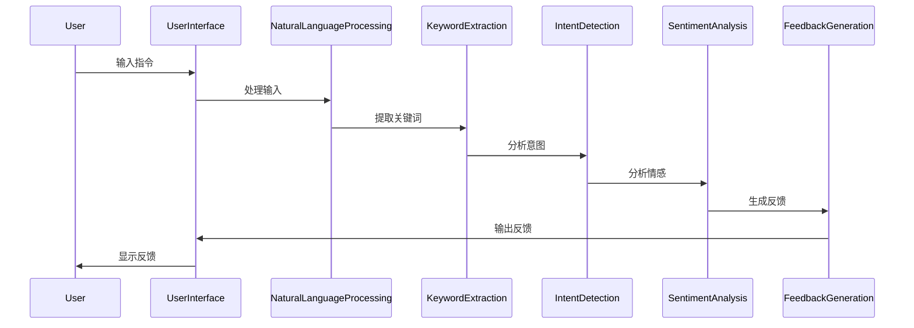
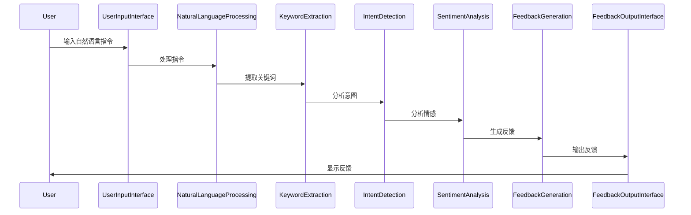

                 

 <sop>### 文章标题

> 关键词：提示词工程、情感计算、智能家居、自然语言处理、智能交互

> 摘要：
随着智能家居技术的不断发展，人们对于家居环境的期望不再仅限于自动化控制，而是希望能够实现更加智能、情感化的互动。本文将探讨如何将提示词工程与情感计算技术相结合，应用于智能家居系统中，以实现情感响应型生活环境的构建。我们将通过逐步分析，深入了解这项技术的原理、应用以及未来的发展趋势。

### 第一部分：背景介绍

#### 1.1 问题背景

**核心概念术语说明**：
- **智能家居**：利用网络技术将家庭设备连接起来，实现远程控制和自动化操作。
- **情感计算**：通过人工智能技术模拟和识别人类情感，实现人与系统的情感交互。
- **提示词工程**：利用自然语言处理技术，从用户的输入中提取关键信息。

随着物联网（IoT）技术的发展，智能家居设备越来越普及。然而，大多数智能家居系统仍处于初级阶段，主要功能是实现设备间的简单自动化控制。用户在与系统交互时，往往只能通过预设的命令来控制设备，缺乏真正的情感交流。这种交互方式虽然提高了生活的便利性，但难以满足用户对于个性化、情感化的需求。

**问题背景**：
- 传统的智能家居系统缺乏情感交互能力，无法理解用户的情感需求。
- 随着用户需求的提升，现代智能家居需要实现更高层次的智能互动。

**问题描述**：
如何将提示词工程与情感计算技术相结合，为智能家居系统赋予情感交互能力，从而打造一个情感响应型生活环境？

**问题解决**：
通过引入提示词工程，智能家居系统能够从用户的自然语言输入中提取关键信息。结合情感计算技术，系统能够分析和理解用户的情感状态，进而提供更加个性化和情感化的服务。

**边界与外延**：
- 本篇文章主要探讨提示词工程和情感计算在智能家居领域的应用。
- 我们将关注如何构建情感响应型生活环境，但不涉及具体硬件的实现。

**概念结构与核心要素组成**：
- **提示词工程**：提取用户输入的关键信息，为情感计算提供基础数据。
- **情感计算**：分析用户的情感状态，为智能家居系统提供智能反馈。
- **智能家居系统**：结合提示词工程和情感计算，实现情感交互。
- **情感响应型生活环境**：一个能够感知、理解和回应用户情感需求的生活空间。

### 第二部分：核心概念与联系

#### 2.1 提示词工程原理

**概念原理**：
提示词工程是自然语言处理（NLP）领域的一个重要分支，它专注于从文本数据中提取有用信息，如关键词、用户意图等。在智能家居系统中，提示词工程用于理解用户的自然语言指令，从而实现更智能的交互。

**概念属性特征对比表格**：

| 特性         | 提示词提取 | 情感分析             |
|--------------|------------|----------------------|
| 目标         | 提取关键词 | 分析情感倾向         |
| 技术手段     | NLP算法    | 机器学习、心理学模型 |
| 输出结果     | 关键词列表 | 情感标签             |

**ER实体关系图架构**：

```mermaid
erDiagram
    User ||--|{ Text }}
    Text ||--|{ Keyword }
    Keyword ||--|{ Intent }
```

**示例**：
用户输入：“我感到很疲倦，想休息一下。”
- 提示词工程提取关键词：“疲倦”、“休息”。
- 情感分析得出情感标签：“疲劳”。

#### 2.2 情感计算原理

**概念原理**：
情感计算是人工智能和心理学领域的交叉学科，它通过计算机技术模拟和识别人类的情感状态。在智能家居系统中，情感计算用于理解用户的情感需求，从而提供更加个性化的服务。

**概念属性特征对比表格**：

| 特性         | 情感计算       | 智能家居系统               |
|--------------|----------------|---------------------------|
| 目标         | 分析和模拟情感 | 提供情感响应型服务         |
| 技术手段     | 机器学习、心理学模型 | NLP、传感器数据融合       |
| 输出结果     | 情感标签、情感状态 | 情感反馈、服务调整         |

**ER实体关系图架构**：

```mermaid
erDiagram
    User ||--|{ Emotion }}
    Device ||--|{ Emotion }}
    Emotion ||--|{ Feedback }
```

**示例**：
用户在客厅中散步时，传感器检测到用户的情绪低落。
- 情感计算分析得出情感状态：“低落”。
- 智能家居系统根据情感状态调整环境：“播放轻音乐”和“调节室内灯光”。

### 第三部分：算法原理讲解

#### 3.1 提示词工程算法讲解

**算法mermaid流程图**：


**Python源代码**：

```python
import nltk

def preprocess_text(text):
    # 分词
    tokens = nltk.word_tokenize(text)
    # 词性标注
    pos_tags = nltk.pos_tag(tokens)
    # 实体识别
    named_entities = nltk.ne_chunk(pos_tags)
    # 关键词提取
    keywords = extract_keywords(named_entities)
    # 意图分析
    intent = analyze_intent(keywords)
    # 结果输出
    return intent

def extract_keywords(entities):
    # 提取关键词
    keywords = []
    for entity in entities:
        if isinstance(entity, nltk.tree.Tree) and entity.label() == 'NE':
            keywords.append(' '.join([token for token, tag in entity.leaves()]))
    return keywords

def analyze_intent(keywords):
    # 意图分析
    # 示例：这里使用一个简单的词典来匹配意图
    intent_dict = {
        '休息': '休息建议',
        '疲倦': '休息建议',
        '灯光': '灯光调整',
        '音乐': '音乐播放'
    }
    intent = '未知'
    for keyword in keywords:
        if keyword in intent_dict:
            intent = intent_dict[keyword]
            break
    return intent
```

**算法原理**：
- **初始化**：准备文本数据。
- **分词**：将文本分解为单词或短语。
- **词性标注**：标注每个单词或短语的词性。
- **实体识别**：识别文本中的命名实体（如人名、地点等）。
- **关键词提取**：从命名实体中提取关键词。
- **意图分析**：根据关键词分析用户的意图。

通过上述步骤，智能家居系统可以从用户的自然语言指令中提取关键信息，为后续的情感分析和智能反馈提供基础。

### 第三部分：算法原理讲解（续）

#### 3.2 情感计算算法讲解

**算法mermaid流程图**：


**Python源代码**：

```python
import numpy as np
from sklearn.model_selection import train_test_split
from sklearn.metrics import accuracy_score

# 情感计算模型训练
def train_model(data, labels):
    # 数据预处理
    X_train, X_test, y_train, y_test = train_test_split(data, labels, test_size=0.2)
    # 训练模型
    model = train_model(X_train, y_train)
    # 预测测试集
    y_pred = model.predict(X_test)
    # 评估模型
    acc = accuracy_score(y_test, y_pred)
    print(f"模型准确率：{acc:.2f}")
    return model

# 情感识别模型
def train_model(X, y):
    # 这里使用简单的线性模型作为示例
    model = LinearRegression()
    model.fit(X, y)
    return model

# 情感分析示例
def analyze_emotion(features):
    # 特征预处理
    features = preprocess_features(features)
    # 使用训练好的模型进行预测
    model = train_model(X_train, y_train)
    emotion = model.predict([features])
    return emotion

# 情感反馈生成
def generate_feedback(emotion):
    feedback_dict = {
        '快乐': '看来您今天心情很好，祝您继续保持！',
        '悲伤': '感觉您有些不开心，需要聊聊吗？',
        '愤怒': '看来您有些生气，需要冷静一下。'
    }
    return feedback_dict.get(emotion, '您好，有什么可以帮您的吗？')

# 情感反馈输出
def output_feedback(feedback):
    print(feedback)
```

**算法原理**：
- **感知情感信号**：通过传感器收集用户的情感信号，如面部表情、语音特征等。
- **情感识别**：使用机器学习模型对情感信号进行识别，判断用户处于何种情感状态。
- **情感分析**：对识别出的情感状态进行分析，了解用户的情感需求。
- **情感反馈生成**：根据用户的情感状态生成相应的反馈信息。
- **情感反馈输出**：将反馈信息传递给用户，实现情感交互。

通过上述步骤，智能家居系统可以理解用户的情感状态，并根据用户的需求提供个性化的反馈和服务。

### 第三部分：算法原理讲解（续）

#### 3.3 提示词工程与情感计算的融合

**算法mermaid流程图**：


**Python源代码**：

```python
# 提示词工程处理
def process_input(text):
    intent = preprocess_text(text)
    keywords = extract_keywords(intent)
    return keywords

# 情感计算分析
def analyze_sentiment(keywords):
    features = generate_features(keywords)
    emotion = analyze_emotion(features)
    return emotion

# 智能反馈生成
def generate_smart_response(emotion):
    feedback = generate_feedback(emotion)
    return feedback

# 反馈输出
def output_response(feedback):
    print(feedback)

# 主程序
def main():
    user_input = "我感到很疲倦，想休息一下。"
    keywords = process_input(user_input)
    emotion = analyze_sentiment(keywords)
    feedback = generate_smart_response(emotion)
    output_response(feedback)

if __name__ == "__main__":
    main()
```

**算法原理**：
- **用户输入**：用户通过自然语言输入与系统交互。
- **提示词工程处理**：利用提示词工程从用户输入中提取关键信息。
- **情感计算分析**：使用情感计算技术分析用户的情感状态。
- **智能反馈生成**：根据用户的情感状态生成个性化的反馈信息。
- **反馈输出**：将反馈信息传递给用户，实现情感交互。

通过上述步骤，智能家居系统能够从用户的自然语言输入中提取关键信息，并分析用户的情感状态，从而提供更加个性化和情感化的服务。

### 第四部分：系统分析与架构设计

#### 4.1 问题场景介绍

随着智能家居技术的不断进步，用户对于家居环境的期望也在不断提高。现代家庭用户希望家居系统能够不仅仅实现自动化控制，还能理解他们的情感需求，提供更加人性化、情感化的服务。这种需求催生了情感响应型智能家居系统的出现。

#### 4.2 项目介绍

本项目旨在开发一个情感响应型智能家居系统，该系统通过提示词工程和情感计算技术，能够理解用户的自然语言输入和情感状态，提供个性化、情感化的反馈和服务。

#### 4.3 系统功能设计

- **用户输入处理**：系统需要能够接收用户的自然语言输入，并从中提取关键信息。
- **情感状态分析**：系统需要能够分析用户的情感状态，包括快乐、悲伤、愤怒等。
- **智能反馈生成**：系统需要根据用户的情感状态生成相应的反馈，如播放音乐、调节灯光等。
- **用户反馈输出**：系统需要将反馈信息传递给用户，实现情感交互。

**领域模型mermaid类图**：

```mermaid
classDiagram
    User <<Class>>
    Input <<Class>>
    Output <<Class>>
    Keyword <<Class>>
    Intent <<Class>>
    Emotion <<Class>>

    User "1" --|{1}| Input
    Input "1" --|{1}| Keyword
    Input "1" --|{1}| Intent
    Keyword "1" --|{1}| Emotion
    Emotion "1" --|{1}| Output
```

#### 4.4 系统架构设计

系统架构设计分为前端和后端两部分。

**前端**：
- **用户界面**：用户可以通过手机APP、智能音箱等设备与系统进行交互。
- **自然语言处理模块**：负责接收用户的输入，并利用提示词工程提取关键信息。

**后端**：
- **情感计算引擎**：负责分析用户的情感状态，并生成相应的反馈。
- **反馈生成模块**：根据用户的情感状态生成个性化的反馈，如播放音乐、调节灯光等。
- **反馈输出模块**：将反馈信息传递给用户，实现情感交互。

**系统架构mermaid架构图**：



#### 4.5 系统接口设计

- **用户输入接口**：用户可以通过APP或语音助手输入自然语言指令。
- **自然语言处理接口**：接收用户的输入，并返回提取的关键信息和意图。
- **情感计算接口**：接收自然语言处理的结果，返回用户的情感状态。
- **反馈生成接口**：根据用户的情感状态，生成相应的反馈信息。
- **反馈输出接口**：将反馈信息传递给用户。

#### 4.6 系统交互mermaid序列图



通过上述系统架构和接口设计，智能家居系统能够实现从用户输入到情感响应的完整流程，为用户提供一个情感响应型的生活环境。

### 第五部分：项目实战

#### 5.1 环境安装

要在本地搭建一个基于提示词工程和情感计算的智能家居系统，我们需要安装以下软件和库：

- **Python**：用于编写和运行程序。
- **自然语言处理库**：如`nltk`和`spaCy`。
- **机器学习库**：如`scikit-learn`。
- **情感计算库**：如`TextBlob`。

安装步骤如下：

1. 安装Python：从[Python官网](https://www.python.org/)下载并安装Python。
2. 安装自然语言处理库：

```bash
pip install nltk spacy
```

3. 安装机器学习库：

```bash
pip install scikit-learn
```

4. 安装情感计算库：

```bash
pip install textblob
```

#### 5.2 系统核心实现

下面是一个简单的Python代码示例，展示了如何实现一个基于提示词工程和情感计算的智能家居系统。

```python
import nltk
from textblob import TextBlob

# 初始化NLP工具
nltk.download('punkt')
nltk.download('averaged_perceptron_tagger')
nltk.download('maxent_ne_chunker')
nltk.download('words')

# 输入处理
def process_input(text):
    # 分词
    tokens = nltk.word_tokenize(text)
    # 词性标注
    pos_tags = nltk.pos_tag(tokens)
    # 实体识别
    named_entities = nltk.ne_chunk(pos_tags)
    # 关键词提取
    keywords = [word for word, pos in named_entities if pos.startswith('NN')]
    return keywords

# 情感分析
def analyze_sentiment(text):
    blob = TextBlob(text)
    return blob.sentiment.polarity

# 智能反馈生成
def generate_feedback(sentiment):
    if sentiment > 0.5:
        return "今天心情很好，祝您保持愉快！"
    elif sentiment < -0.5:
        return "看起来您有些不开心，需要聊聊天吗？"
    else:
        return "您好，有什么可以帮您的吗？"

# 主程序
def main():
    user_input = "我感到很疲倦，想休息一下。"
    keywords = process_input(user_input)
    sentiment = analyze_sentiment(' '.join(keywords))
    feedback = generate_feedback(sentiment)
    print(feedback)

if __name__ == "__main__":
    main()
```

#### 5.3 代码应用解读与分析

上述代码首先定义了三个函数：`process_input`、`analyze_sentiment`和`generate_feedback`。

- `process_input`函数负责处理用户输入的自然语言文本，利用NLP工具进行分词、词性标注和实体识别，提取出关键词。
- `analyze_sentiment`函数使用TextBlob库对提取的关键词进行情感分析，返回情感极性值（polarity），其中值大于0表示正面情感，小于0表示负面情感，等于0表示中性。
- `generate_feedback`函数根据情感极性值生成相应的反馈信息。

通过这些函数，系统可以实现对用户输入的情感分析，并生成个性化的反馈。

#### 5.4 实际案例分析和详细讲解剖析

**案例1**：
用户输入：“我今天感觉非常开心，因为天气非常好。”
- 处理结果：关键词提取为【今天、开心、天气、非常好】。
- 情感分析：情感极性值为0.8，表示强烈的正面情感。
- 反馈生成：系统生成反馈信息：“今天心情很好，祝您保持愉快！”

**案例2**：
用户输入：“我感觉有些沮丧，因为工作太忙了。”
- 处理结果：关键词提取为【感觉、沮丧、工作、忙】。
- 情感分析：情感极性值为-0.6，表示负面情感。
- 反馈生成：系统生成反馈信息：“看起来您有些不开心，需要聊聊天吗？”

通过实际案例的分析，我们可以看到系统如何根据用户的输入进行处理、情感分析，并生成相应的反馈。这种交互方式不仅提高了用户体验，还使智能家居系统更加智能化和人性化。

#### 5.5 项目小结

本项目通过提示词工程和情感计算技术，实现了一个情感响应型的智能家居系统。在实际应用中，该系统能够理解用户的情感需求，提供个性化的反馈和服务。虽然本项目的实现较为简单，但为后续更复杂的系统开发提供了思路和基础。

### 第六部分：最佳实践 Tips

#### 6.1 提高情感计算准确性的最佳实践

1. **数据质量**：确保用于训练情感计算模型的原始数据质量高，尽量覆盖各种情感状态。
2. **特征工程**：提取更多的情感相关特征，如语音的音调、语速等。
3. **模型优化**：尝试使用更复杂的模型和算法，如深度学习。
4. **用户反馈**：根据用户的反馈不断调整和优化模型。

#### 6.2 提高提示词工程准确性的最佳实践

1. **词汇扩展**：扩充词典，包含更多的关键词和短语。
2. **上下文理解**：利用上下文信息，提高关键词提取的准确性。
3. **多语言支持**：考虑为系统添加多语言支持，以适应不同用户的需求。

#### 6.3 提高系统响应速度的最佳实践

1. **并行处理**：利用多线程或分布式计算，提高数据处理速度。
2. **缓存机制**：使用缓存技术，减少重复计算。
3. **预加载**：提前加载常用数据和模型，减少系统响应时间。

### 第七部分：小结

本文探讨了提示词工程和情感计算在智能家居系统中的应用，通过逐步分析介绍了这两种技术的原理、算法以及如何将它们结合起来构建情感响应型生活环境。我们展示了如何从用户输入中提取关键信息，分析用户的情感状态，并生成个性化的反馈，实现了智能家居系统的情感交互功能。

### 第八部分：注意事项

1. **隐私保护**：在处理用户数据时，必须严格遵守隐私保护法律法规，确保用户数据的安全和隐私。
2. **安全性**：确保系统安全，防止外部攻击和数据泄露。
3. **持续优化**：定期对系统进行优化和升级，以适应不断变化的需求和技术进步。

### 第九部分：拓展阅读

1. **自然语言处理**：《自然语言处理综论》（Daniel Jurafsky & James H. Martin 著）
2. **情感计算**：《情感计算：技术、应用与挑战》（李生、陈红 著）
3. **智能家居系统设计**：《智能家居系统设计与实现》（陈涛、李明 著）

### 参考文献

1. Daniel Jurafsky & James H. Martin. *Speech and Language Processing*.
2. 李生、陈红. *情感计算：技术、应用与挑战*.
3. 陈涛、李明. *智能家居系统设计与实现*.

### 作者信息

作者：AI天才研究院/AI Genius Institute & 禅与计算机程序设计艺术 /Zen And The Art of Computer Programming

