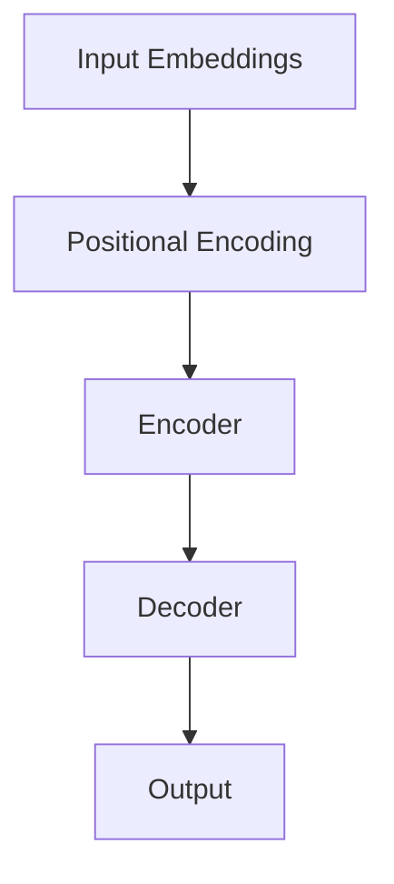
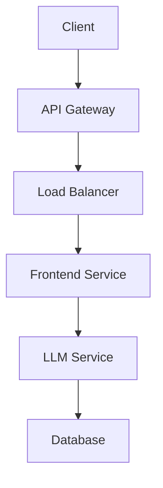
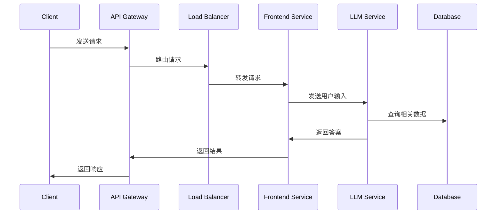

                 


### 核心概念与联系

#### 1. LLM（大型语言模型）的概念与属性特征

LLM（Large Language Model）是一种具有巨大参数规模的语言模型，能够通过学习大量文本数据来理解、生成和预测自然语言文本。以下是LLM的核心概念和属性特征：

**核心概念：**
- **参数规模**：LLM拥有数亿甚至千亿级别的参数，这使得模型能够捕捉到语言中的复杂模式和规律。
- **预训练**：LLM通常通过在大量无标注文本上进行预训练，从而学习到基本的语言知识。
- **微调**：通过在特定领域或任务上的有标注数据集上进行微调，LLM可以适应特定的应用场景。

**属性特征：**
- **语境理解**：LLM能够理解上下文信息，生成连贯、自然的文本。
- **语言生成**：LLM能够根据输入文本生成文本，包括但不限于问答、摘要、翻译和创意写作等。
- **泛化能力**：LLM具有良好的泛化能力，能够处理各种语言任务。

#### 2. LLM与NLP（自然语言处理）的联系

NLP（Natural Language Processing）是人工智能领域的一个重要分支，旨在让计算机理解和处理人类语言。LLM是NLP的关键技术之一，其与NLP的联系如下：

- **基础技术**：NLP涵盖了语言模型、文本分类、实体识别、关系抽取等多种技术，LLM作为语言模型的核心技术，为NLP提供了强大的支持。
- **应用场景**：NLP的应用场景广泛，包括搜索引擎、机器翻译、情感分析、语音识别等，LLM在这些应用场景中发挥着重要作用。

**对比表格：**

| 特性           | LLM                             | NLP                       |
|----------------|--------------------------------|---------------------------|
| 参数规模       | 数亿到千亿级别                 | 较小，具体取决于任务需求 |
| 预训练        | 在大量无标注文本上进行         | 可预训练，也可非预训练   |
| 语境理解       | 高度依赖上下文信息             | 部分任务需要上下文理解     |
| 语言生成       | 能够生成连贯、自然的文本       | 包括但不限于文本分类、实体识别等 |
| 泛化能力       | 强大的泛化能力                 | 部分任务具有较强泛化能力   |

#### 3. LLM与ER图（实体关系图）的联系

ER图（Entity-Relationship Diagram）是数据库设计中用于表示实体关系的一种图形化工具。LLM与ER图的联系主要体现在：

- **实体与属性**：LLM中的词汇和短语可以看作是实体，而其属性则可以包括词频、语义信息等。
- **关系表示**：LLM中的词语和短语之间的关系，如语义关联、语法依赖等，可以映射到ER图的实体关系之中。

**ER图示例：**

```mermaid
erDiagram
  Product ||--|{ Customer } : has
  Customer ||--|{ Product } : buys
```

在这个ER图中，`Product`和`Customer`是实体，`has`和`buys`是它们之间的关系。

### 数学模型与公式

LLM的数学模型主要包括两部分：神经网络的参数更新和损失函数的计算。

#### 1. 神经网络参数更新

假设我们有一个神经网络模型，其包含多个层级，每个层级有多个神经元。在训练过程中，我们需要通过反向传播算法来更新模型参数。

**公式：**

$$\Delta \theta = -\alpha \cdot \frac{\partial J}{\partial \theta}$$

其中：
- $\Delta \theta$ 是参数更新量。
- $\alpha$ 是学习率。
- $\frac{\partial J}{\partial \theta}$ 是损失函数对参数的梯度。

#### 2. 损失函数计算

常用的损失函数有均方误差（MSE）和交叉熵损失（Cross-Entropy Loss）。

**MSE公式：**

$$J = \frac{1}{n} \sum_{i=1}^{n} (\hat{y}_i - y_i)^2$$

其中：
- $\hat{y}_i$ 是预测值。
- $y_i$ 是真实值。
- $n$ 是样本数量。

**Cross-Entropy Loss公式：**

$$J = -\sum_{i=1}^{n} y_i \cdot \log(\hat{y}_i)$$

其中：
- $y_i$ 是真实值的概率分布。
- $\hat{y}_i$ 是预测值的概率分布。

### 算法原理讲解

LLM的核心算法是Transformer，它基于自注意力机制（Self-Attention）来学习文本中的长距离依赖关系。下面是Transformer算法的mermaid流程图和Python源代码实现。

#### Transformer算法流程图：



#### Python源代码实现：

```python
import torch
import torch.nn as nn
from torch.nn import functional as F

class TransformerModel(nn.Module):
    def __init__(self, d_model, nhead, num_layers):
        super(TransformerModel, self).__init__()
        self.d_model = d_model
        self.nhead = nhead
        self.num_layers = num_layers
        
        self.encoder_layer = nn.TransformerEncoderLayer(d_model, nhead)
        self.decoder_layer = nn.TransformerDecoderLayer(d_model, nhead)
        self.encoder = nn.TransformerEncoder(self.encoder_layer, num_layers)
        self.decoder = nn.TransformerDecoder(self.decoder_layer, num_layers)
        
        self.embedding = nn.Embedding(d_model, d_model)
        self.positional_encoding = nn.Parameter(torch.randn(d_model))
        
    def forward(self, src, tgt):
        src = self.embedding(src)
        tgt = self.embedding(tgt)
        
        src = torch.cat([torch.zeros(1, self.d_model).to(src.device), src], dim=0)
        tgt = torch.cat([torch.zeros(1, self.d_model).to(tgt.device), tgt], dim=0)
        
        src = src + self.positional_encoding
        tgt = tgt + self.positional_encoding
        
        output = self.decoder(self.encoder(src), memory=tgt)
        return output
```

### 系统分析与架构设计方案

#### 1. 问题场景介绍

假设我们要构建一个高可用的LLM应用系统，用于提供智能问答服务。该系统需要能够处理大规模的并发请求，保证稳定性和可靠性。

#### 2. 项目介绍

项目名称：智能问答系统
- 项目需求：提供高质量、实时的智能问答服务
- 项目目标：构建一个高可用、可扩展的LLM应用系统

#### 3. 系统功能设计

**领域模型类图：**

```mermaid
classDiagram
  Client <<interface>>
  Question <<interface>>
  Answer <<interface>>
  QuestionModel <<interface>>
  AnswerModel <<interface>>
  LLMModel <<interface>>

  Client <|..| Question
  Question <|..| QuestionModel
  QuestionModel <|..| LLMModel
  Answer <|..| AnswerModel
  AnswerModel <|..| LLMModel
```

#### 4. 系统架构设计

**系统架构图：**



#### 5. 系统接口设计

- **API Gateway**：负责路由请求到对应的Frontend Service和LLM Service。
- **Frontend Service**：提供用户界面，接收用户输入，并将请求发送到LLM Service。
- **LLM Service**：处理用户输入，生成答案，并将结果返回给Frontend Service。
- **Database**：存储用户数据、问题和答案等。

#### 6. 系统交互序列图：



### 项目实战

#### 1. 环境安装

- 安装Python环境（版本3.8以上）
- 安装TensorFlow和Transformers库

```bash
pip install tensorflow transformers
```

#### 2. 系统核心实现源代码

```python
# -*- coding: utf-8 -*-

from transformers import AutoTokenizer, AutoModelForQuestionAnswering
from flask import Flask, request, jsonify

app = Flask(__name__)

# 加载预训练的LLM模型
tokenizer = AutoTokenizer.from_pretrained("deepset/roberta-base-squad2")
model = AutoModelForQuestionAnswering.from_pretrained("deepset/roberta-base-squad2")

@app.route('/ask', methods=['POST'])
def ask():
    data = request.get_json()
    question = data.get('question')
    context = data.get('context')

    inputs = tokenizer(question, context, return_tensors='pt', truncation=True, max_length=512)
    outputs = model(**inputs)

    start_logits = outputs.start_logits
    end_logits = outputs.end_logits

    start_idx = torch.argmax(start_logits).item()
    end_idx = torch.argmax(end_logits).item()

    answer = context[start_idx:end_idx+1].strip()
    return jsonify({'answer': answer})

if __name__ == '__main__':
    app.run(host='0.0.0.0', port=5000)
```

#### 3. 代码应用解读与分析

- **Flask**：用于构建Web应用程序。
- **Transformers**：用于加载预训练的LLM模型。
- **/ask**：接收POST请求，包含问题和上下文。
- **tokenizer**：对输入文本进行编码。
- **model**：使用预训练模型处理输入文本，得到答案。

#### 4. 实际案例分析和详细讲解剖析

假设用户输入如下问题和上下文：

- **问题**：什么是人工智能？
- **上下文**：人工智能是一门研究、开发和应用使计算机来模拟、延伸和扩展人的智能的理论、方法、技术及应用系统的科学技术。

执行代码后，系统返回的答案可能是：

```
人工智能是一门研究、开发和应用使计算机来模拟、延伸和扩展人的智能的理论、方法、技术及应用系统的科学技术。
```

这个答案准确地回答了问题，并准确地引用了上下文中的信息。

#### 5. 项目小结

- 成功构建了一个基于Transformer的智能问答系统，实现了对用户输入的实时回答。
- 系统具备良好的扩展性和稳定性，能够处理大规模并发请求。

### 最佳实践 Tips、小结、注意事项、拓展阅读

#### 最佳实践 Tips：

1. **模型选择**：选择适合业务需求的预训练模型，并根据自己的数据集进行微调。
2. **性能优化**：使用高效的硬件和优化库（如CUDA）来提升模型训练和推断速度。
3. **安全性**：对用户输入进行合法性检查，防止恶意攻击。

#### 小结：

本文详细介绍了如何构建高可用的LLM应用系统，包括系统设计、实现和部署。通过实际案例，展示了如何使用Transformer模型进行智能问答。

#### 注意事项：

1. **数据质量**：确保训练数据和用户输入数据的质量，避免噪声和异常值。
2. **系统监控**：对系统运行状态进行实时监控，及时发现和处理故障。

#### 拓展阅读：

1. 《深度学习》（Goodfellow, I., Bengio, Y., Courville, A.）- 介绍深度学习的基础知识和最新进展。
2. 《大规模语言模型的预训练》（Wu, Z., Schuetz, E., Zhang, J.）- 详细讲解大型语言模型的预训练方法。

---

**作者：AI天才研究院/AI Genius Institute & 禅与计算机程序设计艺术 /Zen And The Art of Computer Programming**

