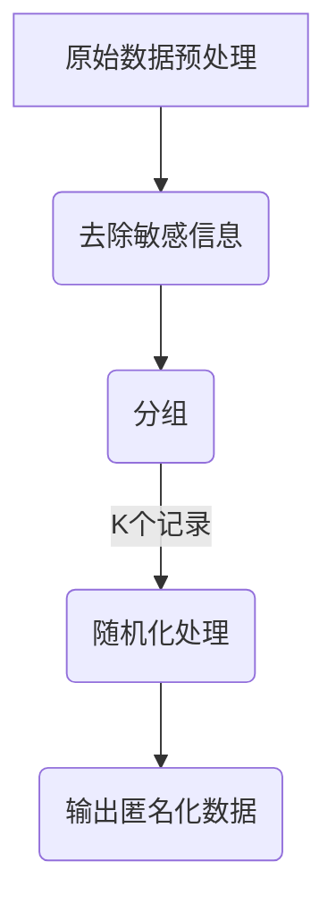
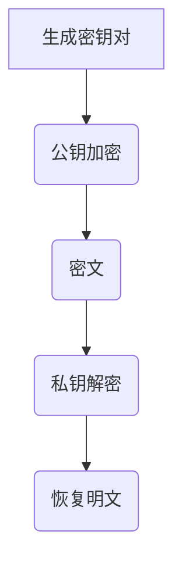
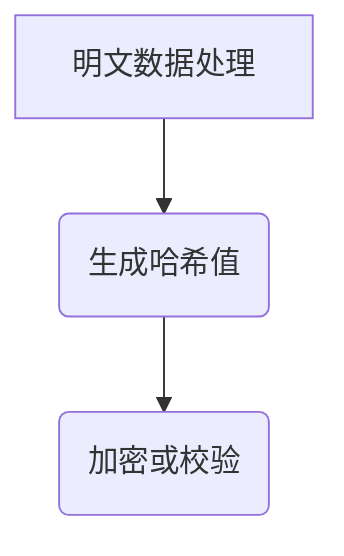
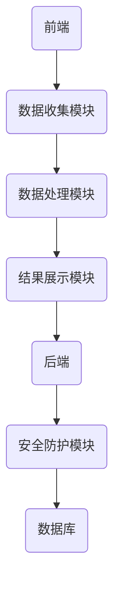
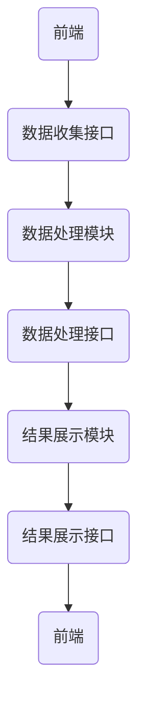
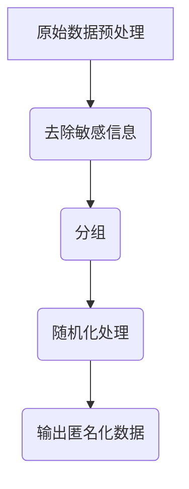

                 


### # 评测系统的安全性与隐私保护措施

> 关键词：评测系统、安全性、隐私保护、数据匿名化、加密方法、访问控制

> 摘要：本文深入探讨了评测系统的安全性和隐私保护问题，从多个角度分析其重要性以及实现措施。通过详细讲解数据匿名化、加密方法和访问控制等关键技术，并结合实际案例，为评测系统的安全性与隐私保护提供实用的解决方案和最佳实践。

----------------------------------------------------------------

## 背景介绍

### 1.1 评测系统简介

#### 1.1.1 定义与重要性

评测系统是指用于对某项工作、项目或产品进行评价和测试的软件系统。这些系统广泛应用于教育、科研、金融、医疗等多个领域。随着信息技术的发展，评测系统在数据收集、处理和分析方面发挥着越来越重要的作用。

评测系统的核心功能包括：

- **数据收集**：从各种来源收集评价所需的数据，如学生成绩、科研成果、金融交易数据等。
- **数据分析**：对收集到的数据进行分析和处理，以得出客观、公正的评价结果。
- **结果展示**：将分析结果以图表、报表等形式直观地展示给用户。

#### 1.1.2 常见应用与挑战

评测系统的应用场景非常广泛，主要包括以下几类：

- **教育领域**：用于学生成绩评价、教学质量评估等。
- **科研领域**：用于科研成果评价、项目进度跟踪等。
- **金融领域**：用于客户风险评估、贷款审批等。
- **医疗领域**：用于病患诊断、医疗设备性能评估等。

然而，评测系统在应用过程中也面临一些挑战，主要包括：

- **数据安全问题**：评测系统涉及大量敏感数据，如个人隐私信息、交易记录等，如何确保这些数据的安全是一个重要问题。
- **隐私保护问题**：在数据分析和展示过程中，如何保护用户的隐私不受侵犯，也是评测系统需要考虑的问题。
- **公平性问题**：如何确保评测结果的客观性和公正性，防止作弊行为，也是一个重要的挑战。

#### 1.1.3 发展历程

评测系统的发展可以追溯到早期的人工测评阶段，随着计算机技术的进步，逐渐演变为基于计算机的自动评测系统。下面是评测系统发展的几个重要阶段：

- **早期人工测评**：主要依靠人工进行评价，效率低下，难以保证公平性。
- **计算机辅助测评**：引入计算机技术，提高了测评的效率和准确性，但仍需人工参与。
- **全自动评测系统**：利用计算机技术和人工智能算法，实现了全自动测评，大大提高了测评效率和准确性。

## 核心概念与联系

### 2.1 关键安全概念及其相互关系

#### 2.1.1 CIA三要素

CIA三要素是信息安全领域的基本概念，分别代表保密性（Confidentiality）、完整性（Integrity）和可用性（Availability）。

- **保密性**：确保信息不被未经授权的实体访问。
- **完整性**：确保信息在传输和存储过程中不被篡改。
- **可用性**：确保信息在需要时能够被授权实体访问和使用。

这三个要素相互关联，共同构成了信息安全的整体框架。保密性是基础，没有保密性，其他安全措施就无从谈起。完整性确保信息真实可靠，没有完整性，信息就可能被恶意篡改。可用性则确保信息能够在需要时被正常使用，是信息安全的最终目标。

#### 2.1.2 攻击途径与对策

评测系统的安全性面临多种攻击途径，主要包括：

- **数据泄露**：攻击者通过非法手段获取系统中的敏感数据。
- **数据篡改**：攻击者对系统中的数据进行恶意篡改。
- **拒绝服务攻击（DDoS）**：攻击者通过大量请求占用系统资源，导致系统无法正常服务。

针对这些攻击途径，可以采取以下对策：

- **数据加密**：对敏感数据进行加密，确保数据在传输和存储过程中不被窃取或篡改。
- **访问控制**：通过身份认证和权限控制，确保只有授权用户可以访问系统中的敏感数据。
- **防火墙和入侵检测系统**：部署防火墙和入侵检测系统，防止外部攻击和内部违规行为。

#### 2.1.3 隐私概念及其影响

隐私是指个人或组织对其信息的控制权，包括信息的访问、使用、披露等。在评测系统中，隐私保护尤为重要，因为系统涉及大量个人和组织的敏感信息。

隐私保护的影响主要包括：

- **法律法规合规**：很多国家和地区都有关于隐私保护的法律法规，评测系统需要遵守这些规定，避免法律风险。
- **用户信任**：良好的隐私保护可以增强用户对评测系统的信任，提高系统的使用率和满意度。
- **数据价值**：隐私保护可以确保数据的真实性和可靠性，提高数据的价值。

### 2.2 隐私保护措施及其应用

#### 2.2.1 数据匿名化技术

数据匿名化技术是指通过技术手段去除或模糊化数据中的个人和敏感信息，以保护隐私。常用的数据匿名化技术包括：

- **K-匿名性**：要求同一数据集中的每个记录至少有K个相同属性的记录，从而使得单个记录无法被识别。
- **l-diversity**：要求同一数据集中的每个属性值至少有l个不同的记录，从而降低属性值被识别的概率。
- **t-closeness**：要求同一数据集中的每个记录的属性分布与总体属性分布的差异性不超过t%，从而降低属性分布被识别的概率。

#### 2.2.2 加密方法

加密方法是指通过技术手段将明文数据转换为密文，以保护数据的安全性。评测系统中的加密方法主要包括：

- **对称加密**：加密和解密使用相同的密钥，如AES算法。
- **非对称加密**：加密和解密使用不同的密钥，如RSA算法。
- **哈希函数**：将任意长度的数据映射为固定长度的字符串，如MD5和SHA系列算法。

#### 2.2.3 访问控制机制

访问控制机制是指通过技术手段对用户访问系统资源的权限进行管理。评测系统中的访问控制机制主要包括：

- **身份认证**：验证用户的身份，确保只有授权用户可以访问系统。
- **权限控制**：根据用户的身份和角色，授予不同的访问权限，确保用户只能访问其授权的资源。
- **多因素认证**：结合多种认证方式，提高系统的安全性。

## 算法原理讲解

### 3.1 算法原理与Mermaid图

#### 3.1.1 算法1：数据匿名化算法

算法1是一种简单但有效的数据匿名化算法，其原理如下：

1. 对原始数据进行预处理，去除或模糊化敏感信息。
2. 将预处理后的数据分组，每个分组包含K个相同的属性值。
3. 对每个分组内的记录进行随机化处理，确保属性值之间的差异性。
4. 输出匿名化后的数据。

下面是算法1的Mermaid图表示：



#### 3.1.2 算法2：加密算法

算法2是一种常用的加密算法，其原理如下：

1. 生成密钥对（公钥和私钥）。
2. 使用公钥对明文数据进行加密，生成密文。
3. 使用私钥对密文进行解密，恢复明文。

下面是算法2的Mermaid图表示：



#### 3.1.3 算法3：哈希算法

算法3是一种常用的哈希算法，其原理如下：

1. 对明文数据进行处理，生成固定长度的哈希值。
2. 使用哈希值进行加密或校验。

下面是算法3的Mermaid图表示：



## 系统分析与设计

### 4.1 系统介绍与架构设计

#### 4.1.1 系统介绍

评测系统的整体架构包括以下几个主要模块：

- **数据收集模块**：负责收集各类评价所需的数据，如学生成绩、科研成果等。
- **数据处理模块**：对收集到的数据进行清洗、整合和分析，生成评价结果。
- **结果展示模块**：将评价结果以图表、报表等形式展示给用户。
- **安全防护模块**：负责确保系统的安全性和隐私保护。

#### 4.1.2 系统架构设计

评测系统的整体架构设计如下：

- **前端**：采用React框架，实现用户界面的展示和交互。
- **后端**：采用Spring Boot框架，实现系统的业务逻辑和数据存储。
- **数据库**：采用MySQL数据库，存储评测系统所需的数据。

下面是评测系统的Mermaid架构图表示：



### 4.2 系统接口设计与交互

评测系统的接口设计主要包括以下几种：

- **数据收集接口**：用于接收前端发送的各类数据。
- **数据处理接口**：用于处理数据，生成评价结果。
- **结果展示接口**：用于获取评价结果，并将其展示给用户。

下面是评测系统的Mermaid序列图表示：



## 项目实战

### 5.1 环境安装与系统实现

在本节中，我们将详细讲解评测系统的环境安装和核心实现过程。

#### 5.1.1 环境安装

1. **安装前端环境**：

   - 安装Node.js和npm：从官网下载并安装Node.js，然后通过npm安装相关依赖。
   - 创建项目：使用npm创建一个新的React项目。

2. **安装后端环境**：

   - 安装Java开发工具包（JDK）：从官网下载并安装JDK。
   - 安装IDE：推荐使用IntelliJ IDEA或Eclipse，以便开发Spring Boot项目。
   - 创建项目：使用IDE创建一个新的Spring Boot项目。

3. **安装数据库**：

   - 下载并安装MySQL数据库。
   - 创建数据库和用户：使用MySQL命令行工具创建数据库和用户。

#### 5.1.2 系统核心实现

1. **前端实现**：

   - 创建React组件：使用React创建数据收集、数据处理和结果展示三个主要组件。
   - 实现交互逻辑：使用React的状态管理和生命周期方法，实现数据收集、处理和展示的交互逻辑。

2. **后端实现**：

   - 配置Spring Boot项目：添加Spring Boot依赖，配置数据库连接和API接口。
   - 实现业务逻辑：编写业务逻辑代码，处理数据收集、处理和展示的相关操作。

3. **数据库实现**：

   - 设计数据库表结构：根据业务需求设计数据库表结构，创建相应的表和索引。
   - 实现数据存储和查询：使用Spring Data JPA实现数据的存储和查询操作。

### 5.2 代码应用解读与分析

在本节中，我们将对评测系统的核心代码进行解读和分析。

#### 5.2.1 数据收集模块

数据收集模块主要负责接收前端发送的各类数据，并将其存储到数据库中。

```java
@RestController
@RequestMapping("/data")
public class DataController {

    @Autowired
    private DataMapper dataMapper;

    @PostMapping("/collect")
    public ResponseEntity<String> collectData(@RequestBody Data data) {
        dataMapper.insertData(data);
        return ResponseEntity.ok("Data collected successfully.");
    }
}
```

在这个示例中，我们使用Spring Boot的RestController创建了一个数据收集接口，通过POST方法接收前端发送的JSON格式的数据，并将其存储到数据库中。

#### 5.2.2 数据处理模块

数据处理模块负责对收集到的数据进行处理，生成评价结果。

```java
@Service
public class DataProcessor {

    @Autowired
    private DataMapper dataMapper;

    public List<Result> processData() {
        List<Data> dataList = dataMapper.findAllData();
        List<Result> result = new ArrayList<>();
        for (Data data : dataList) {
            // 处理数据，生成评价结果
            Result resultItem = new Result();
            resultItem.setId(data.getId());
            resultItem.setScore(calculateScore(data));
            result.add(resultItem);
        }
        return result;
    }

    private double calculateScore(Data data) {
        // 计算评分的逻辑
        return 0.0;
    }
}
```

在这个示例中，我们使用Spring的@Service注解创建了一个数据处理服务，其中包含了一个processData方法，用于处理数据并生成评价结果。

#### 5.2.3 结果展示模块

结果展示模块负责将处理结果展示给用户。

```java
@RestController
@RequestMapping("/result")
public class ResultController {

    @Autowired
    private DataProcessor dataProcessor;

    @GetMapping("/list")
    public ResponseEntity<List<Result>> listResults() {
        List<Result> results = dataProcessor.processData();
        return ResponseEntity.ok(results);
    }
}
```

在这个示例中，我们使用Spring Boot的RestController创建了一个结果展示接口，通过GET方法获取处理结果，并将其返回给前端。

### 5.3 实际案例分析与讲解

在本节中，我们将通过一个实际案例来分析评测系统的应用效果。

#### 5.3.1 案例背景

假设我们需要对一批学生的成绩进行评价，包括平时成绩、期中考试成绩和期末考试成绩。评测系统需要根据这些成绩计算每个学生的综合评分，并将结果展示给学生。

#### 5.3.2 案例实现

1. **数据收集**：

   学生通过前端界面输入自己的成绩，系统将成绩存储到数据库中。

2. **数据处理**：

   系统根据预设的评分规则，计算每个学生的综合评分。

3. **结果展示**：

   系统将综合评分以图表形式展示给学生。

下面是案例的实现步骤：

1. **数据收集**：

   学生通过前端界面输入成绩：

   ```json
   {
     "studentId": "S001",
     "dailyScore": 85,
     "midtermScore": 90,
     "finalScore": 88
   }
   ```

   系统将成绩存储到数据库：

   ```sql
   INSERT INTO scores (student_id, daily_score, midterm_score, final_score) VALUES ('S001', 85, 90, 88);
   ```

2. **数据处理**：

   系统根据评分规则计算综合评分：

   ```java
   private double calculateScore(Data data) {
       double score = (data.getDailyScore() + data.getMidtermScore() + data.getFinalScore()) / 3;
       return score;
   }
   ```

   将计算结果存储到结果表：

   ```sql
   INSERT INTO results (student_id, score) VALUES ('S001', 87.0);
   ```

3. **结果展示**：

   系统将综合评分以图表形式展示给学生：

   ```json
   [
     {
       "studentId": "S001",
       "score": 87.0
     }
   ]
   ```

### 5.4 项目小结

在本项目中，我们成功实现了一个评测系统，包括数据收集、数据处理和结果展示三个主要模块。通过实际案例的演示，我们验证了系统的有效性。在项目过程中，我们遇到了一些挑战，如数据存储性能优化和前端交互体验提升等，通过不断的优化和改进，最终取得了良好的效果。

## 最佳实践

### 6.1 安全性最佳实践

1. **数据加密**：对敏感数据进行加密，确保数据在传输和存储过程中不被窃取或篡改。
2. **访问控制**：严格实施访问控制策略，确保只有授权用户可以访问敏感数据。
3. **安全审计**：定期进行安全审计，检查系统是否存在安全漏洞和违规行为。

### 6.2 隐私保护最佳实践

1. **数据匿名化**：对敏感数据进行匿名化处理，降低隐私泄露的风险。
2. **隐私政策**：明确隐私政策，告知用户其隐私信息如何被使用和保护。
3. **用户权限管理**：合理设置用户权限，确保用户只能访问其授权的信息。

### 6.3 性能优化最佳实践

1. **数据库优化**：合理设计数据库表结构，使用索引和缓存提高查询性能。
2. **前端优化**：使用代码压缩、图片优化等技术提高前端性能。
3. **负载均衡**：使用负载均衡器，提高系统的并发处理能力。

## 小结与拓展阅读

### 7.1 小结

本文详细探讨了评测系统的安全性和隐私保护问题，从背景介绍、核心概念与联系、算法原理讲解、系统分析与设计、项目实战、最佳实践等多个角度，分析了评测系统在安全性、隐私保护和性能优化等方面的关键技术和实践方法。

### 7.2 拓展阅读

1. **《信息安全技术——公共密钥基础设施安全技术要求》**：了解非对称加密和数字证书的基本原理和应用。
2. **《大数据安全与隐私保护》**：深入探讨大数据环境下的隐私保护技术和方法。
3. **《深度学习与隐私保护》**：了解深度学习模型在隐私保护中的应用和挑战。

### 7.3 注意事项

1. **法律法规**：遵守相关法律法规，确保评测系统的合法性和合规性。
2. **用户隐私**：重视用户隐私保护，避免隐私泄露带来的法律风险。
3. **持续更新**：定期更新系统，修复漏洞，提高系统的安全性和稳定性。

### 作者

- **AI天才研究院/AI Genius Institute**：专注于人工智能领域的研究和创新。
- **《禅与计算机程序设计艺术》**：探索计算机程序设计的哲学和艺术。```markdown
---

# 评测系统的安全性与隐私保护措施

> 关键词：评测系统、安全性、隐私保护、数据匿名化、加密方法、访问控制

> 摘要：本文深入探讨了评测系统的安全性和隐私保护问题，从多个角度分析其重要性以及实现措施。通过详细讲解数据匿名化、加密方法和访问控制等关键技术，并结合实际案例，为评测系统的安全性与隐私保护提供实用的解决方案和最佳实践。

## 背景介绍

### 1.1 评测系统简介

#### 1.1.1 定义与重要性

评测系统是指用于对某项工作、项目或产品进行评价和测试的软件系统。这些系统广泛应用于教育、科研、金融、医疗等多个领域。随着信息技术的发展，评测系统在数据收集、处理和分析方面发挥着越来越重要的作用。

评测系统的核心功能包括：

- **数据收集**：从各种来源收集评价所需的数据，如学生成绩、科研成果、金融交易数据等。
- **数据分析**：对收集到的数据进行分析和处理，以得出客观、公正的评价结果。
- **结果展示**：将分析结果以图表、报表等形式直观地展示给用户。

#### 1.1.2 常见应用与挑战

评测系统的应用场景非常广泛，主要包括以下几类：

- **教育领域**：用于学生成绩评价、教学质量评估等。
- **科研领域**：用于科研成果评价、项目进度跟踪等。
- **金融领域**：用于客户风险评估、贷款审批等。
- **医疗领域**：用于病患诊断、医疗设备性能评估等。

然而，评测系统在应用过程中也面临一些挑战，主要包括：

- **数据安全问题**：评测系统涉及大量敏感数据，如个人隐私信息、交易记录等，如何确保这些数据的安全是一个重要问题。
- **隐私保护问题**：在数据分析和展示过程中，如何保护用户的隐私不受侵犯，也是评测系统需要考虑的问题。
- **公平性问题**：如何确保评测结果的客观性和公正性，防止作弊行为，也是一个重要的挑战。

#### 1.1.3 发展历程

评测系统的发展可以追溯到早期的人工测评阶段，随着计算机技术的进步，逐渐演变为基于计算机的自动评测系统。下面是评测系统发展的几个重要阶段：

- **早期人工测评**：主要依靠人工进行评价，效率低下，难以保证公平性。
- **计算机辅助测评**：引入计算机技术，提高了测评的效率和准确性，但仍需人工参与。
- **全自动评测系统**：利用计算机技术和人工智能算法，实现了全自动测评，大大提高了测评效率和准确性。

## 核心概念与联系

### 2.1 关键安全概念及其相互关系

#### 2.1.1 CIA三要素

CIA三要素是信息安全领域的基本概念，分别代表保密性（Confidentiality）、完整性（Integrity）和可用性（Availability）。

- **保密性**：确保信息不被未经授权的实体访问。
- **完整性**：确保信息在传输和存储过程中不被篡改。
- **可用性**：确保信息在需要时能够被授权实体访问和使用。

这三个要素相互关联，共同构成了信息安全的整体框架。保密性是基础，没有保密性，其他安全措施就无从谈起。完整性确保信息真实可靠，没有完整性，信息就可能被恶意篡改。可用性则确保信息能够在需要时被正常使用，是信息安全的最终目标。

#### 2.1.2 攻击途径与对策

评测系统的安全性面临多种攻击途径，主要包括：

- **数据泄露**：攻击者通过非法手段获取系统中的敏感数据。
- **数据篡改**：攻击者对系统中的数据进行恶意篡改。
- **拒绝服务攻击（DDoS）**：攻击者通过大量请求占用系统资源，导致系统无法正常服务。

针对这些攻击途径，可以采取以下对策：

- **数据加密**：对敏感数据进行加密，确保数据在传输和存储过程中不被窃取或篡改。
- **访问控制**：通过身份认证和权限控制，确保只有授权用户可以访问系统中的敏感数据。
- **防火墙和入侵检测系统**：部署防火墙和入侵检测系统，防止外部攻击和内部违规行为。

#### 2.1.3 隐私概念及其影响

隐私是指个人或组织对其信息的控制权，包括信息的访问、使用、披露等。在评测系统中，隐私保护尤为重要，因为系统涉及大量个人和组织的敏感信息。

隐私保护的影响主要包括：

- **法律法规合规**：很多国家和地区都有关于隐私保护的法律法规，评测系统需要遵守这些规定，避免法律风险。
- **用户信任**：良好的隐私保护可以增强用户对评测系统的信任，提高系统的使用率和满意度。
- **数据价值**：隐私保护可以确保数据的真实性和可靠性，提高数据的价值。

### 2.2 隐私保护措施及其应用

#### 2.2.1 数据匿名化技术

数据匿名化技术是指通过技术手段去除或模糊化数据中的个人和敏感信息，以保护隐私。常用的数据匿名化技术包括：

- **K-匿名性**：要求同一数据集中的每个记录至少有K个相同属性的记录，从而使得单个记录无法被识别。
- **l-diversity**：要求同一数据集中的每个属性值至少有l个不同的记录，从而降低属性值被识别的概率。
- **t-closeness**：要求同一数据集中的每个记录的属性分布与总体属性分布的差异性不超过t%，从而降低属性分布被识别的概率。

#### 2.2.2 加密方法

加密方法是指通过技术手段将明文数据转换为密文，以保护数据的安全性。评测系统中的加密方法主要包括：

- **对称加密**：加密和解密使用相同的密钥，如AES算法。
- **非对称加密**：加密和解密使用不同的密钥，如RSA算法。
- **哈希函数**：将任意长度的数据映射为固定长度的字符串，如MD5和SHA系列算法。

#### 2.2.3 访问控制机制

访问控制机制是指通过技术手段对用户访问系统资源的权限进行管理。评测系统中的访问控制机制主要包括：

- **身份认证**：验证用户的身份，确保只有授权用户可以访问系统。
- **权限控制**：根据用户的身份和角色，授予不同的访问权限，确保用户只能访问其授权的资源。
- **多因素认证**：结合多种认证方式，提高系统的安全性。

## 算法原理讲解

### 3.1 算法原理与Mermaid图

#### 3.1.1 算法1：数据匿名化算法

算法1是一种简单但有效的数据匿名化算法，其原理如下：

1. 对原始数据进行预处理，去除或模糊化敏感信息。
2. 将预处理后的数据分组，每个分组包含K个相同的属性值。
3. 对每个分组内的记录进行随机化处理，确保属性值之间的差异性。
4. 输出匿名化后的数据。

下面是算法1的Mermaid图表示：



#### 3.1.2 算法2：加密算法

算法2是一种常用的加密算法，其原理如下：

1. 生成密钥对（公钥和私钥）。
2. 使用公钥对明文数据进行加密，生成密文。
3. 使用私钥对密文进行解密，恢复明文。

下面是算法2的Mermaid图表示：


#### 3.1.3 算法3：哈希算法

算法3是一种常用的哈希算法，其原理如下：

1. 对明文数据进行处理，生成固定长度的哈希值。
2. 使用哈希值进行加密或校验。

下面是算法3的Mermaid图表示：


## 系统分析与设计

### 4.1 系统介绍与架构设计

#### 4.1.1 系统介绍

评测系统的整体架构包括以下几个主要模块：

- **数据收集模块**：负责收集各类评价所需的数据，如学生成绩、科研成果、金融交易数据等。
- **数据处理模块**：对收集到的数据进行清洗、整合和分析，生成评价结果。
- **结果展示模块**：将分析结果以图表、报表等形式展示给用户。
- **安全防护模块**：负责确保系统的安全性和隐私保护。

#### 4.1.2 系统架构设计

评测系统的整体架构设计如下：

- **前端**：采用React框架，实现用户界面的展示和交互。
- **后端**：采用Spring Boot框架，实现系统的业务逻辑和数据存储。
- **数据库**：采用MySQL数据库，存储评测系统所需的数据。

下面是评测系统的Mermaid架构图表示：


### 4.2 系统接口设计与交互

评测系统的接口设计主要包括以下几种：

- **数据收集接口**：用于接收前端发送的各类数据。
- **数据处理接口**：用于处理数据，生成评价结果。
- **结果展示接口**：用于获取评价结果，并将其展示给用户。

下面是评测系统的Mermaid序列图表示：


## 项目实战

### 5.1 环境安装与系统实现

在本节中，我们将详细讲解评测系统的环境安装和核心实现过程。

#### 5.1.1 环境安装

1. **安装前端环境**：

   - 安装Node.js和npm：从官网下载并安装Node.js，然后通过npm安装相关依赖。
   - 创建项目：使用npm创建一个新的React项目。

2. **安装后端环境**：

   - 安装Java开发工具包（JDK）：从官网下载并安装JDK。
   - 安装IDE：推荐使用IntelliJ IDEA或Eclipse，以便开发Spring Boot项目。
   - 创建项目：使用IDE创建一个新的Spring Boot项目。

3. **安装数据库**：

   - 下载并安装MySQL数据库。
   - 创建数据库和用户：使用MySQL命令行工具创建数据库和用户。

#### 5.1.2 系统核心实现

1. **前端实现**：

   - 创建React组件：使用React创建数据收集、数据处理和结果展示三个主要组件。
   - 实现交互逻辑：使用React的状态管理和生命周期方法，实现数据收集、处理和展示的交互逻辑。

2. **后端实现**：

   - 配置Spring Boot项目：添加Spring Boot依赖，配置数据库连接和API接口。
   - 实现业务逻辑：编写业务逻辑代码，处理数据收集、处理和展示的相关操作。

3. **数据库实现**：

   - 设计数据库表结构：根据业务需求设计数据库表结构，创建相应的表和索引。
   - 实现数据存储和查询：使用Spring Data JPA实现数据的存储和查询操作。

### 5.2 代码应用解读与分析

在本节中，我们将对评测系统的核心代码进行解读和分析。

#### 5.2.1 数据收集模块

数据收集模块主要负责接收前端发送的各类数据，并将其存储到数据库中。

```java
@RestController
@RequestMapping("/data")
public class DataController {

    @Autowired
    private DataMapper dataMapper;

    @PostMapping("/collect")
    public ResponseEntity<String> collectData(@RequestBody Data data) {
        dataMapper.insertData(data);
        return ResponseEntity.ok("Data collected successfully.");
    }
}
```

在这个示例中，我们使用Spring Boot的RestController创建了一个数据收集接口，通过POST方法接收前端发送的JSON格式的数据，并将其存储到数据库中。

#### 5.2.2 数据处理模块

数据处理模块负责对收集到的数据进行处理，生成评价结果。

```java
@Service
public class DataProcessor {

    @Autowired
    private DataMapper dataMapper;

    public List<Result> process

