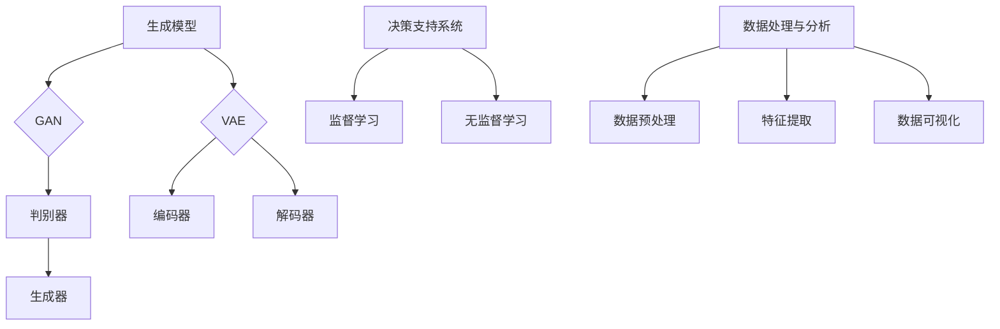
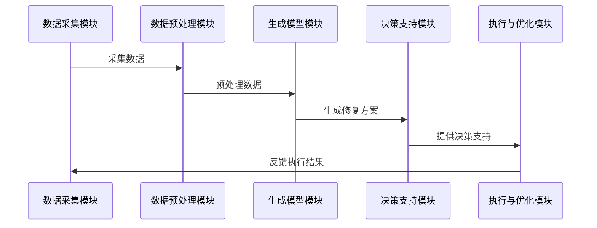

                 

### 摘要

随着全球环境问题的日益严峻，生态系统重建成为环境保护的重要任务。AIGC（Artificial Intelligence, Generative Code）作为一种新兴的人工智能技术，以其强大的生成能力和智能化决策支持，正在逐渐应用于环境修复技术中。本文旨在探讨AIGC在生态系统重建中的应用，特别是在提示词技术的运用上。首先，我们将介绍AIGC与生态系统重建的基本概念和背景，然后深入分析AIGC的核心技术和在环境修复中的应用原理。接着，我们将探讨提示词技术在生态系统重建中的作用，并通过具体应用案例展示AIGC在环境修复中的实际效果。最后，我们将总结AIGC在环境修复技术中的应用挑战和未来展望，为读者提供深入理解和实践指导。

---

### 目录

1. **摘要**
2. **背景与概念**
   2.1 **AIGC与生态系统重建概述**
   2.2 **环境修复技术基础**
   2.3 **AIGC技术原理**
3. **AIGC核心技术解析**
   3.1 **生成模型**
   3.2 **决策支持系统**
   3.3 **数据处理与分析**
4. **生态系统重建中的提示词技术**
   4.1 **提示词的概念与作用**
   4.2 **提示词的设计原则**
   4.3 **提示词的优化策略**
5. **AIGC在环境修复中的应用案例**
   5.1 **城市绿地生态系统重建**
   5.2 **污染土壤修复**
   5.3 **湿地生态恢复**
6. **挑战与展望**
   6.1 **AIGC在环境修复中的挑战**
   6.2 **未来发展趋势与前景**
   6.3 **研究方向与政策建议**
7. **结语**
8. **作者信息**

---

### 背景与概念

#### AIGC与生态系统重建概述

**AIGC（Artificial Intelligence, Generative Code）** 是一种结合了人工智能和生成代码的技术。它利用机器学习算法，通过分析大量数据生成新的内容，如图像、文本、音乐等。AIGC不仅能够自动生成高质量的内容，还能提供智能化的决策支持，为各种领域提供创新解决方案。

**生态系统重建** 是指通过科学手段，恢复或重建受损生态系统的过程。这一过程涉及生物多样性保护、生态位重建、生态功能恢复等多个方面，旨在恢复生态系统的稳定性和健康性。随着环境问题的加剧，生态系统重建已成为环境保护的重要任务。

在环境修复技术中，AIGC的应用潜力主要体现在以下几个方面：

1. **数据驱动的生态监测**：AIGC可以通过分析环境数据，实时监测生态系统的变化，为生态修复提供科学依据。
2. **智能化的决策支持**：AIGC能够根据生态数据生成修复方案，提高修复决策的准确性和效率。
3. **生成修复方案**：AIGC可以自动生成修复计划，包括植物种植、土壤改良、水质净化等，实现生态系统的快速重建。

#### 环境修复技术基础

**环境问题的现状与挑战**：全球环境问题日益严重，包括气候变化、水资源短缺、土地退化、生物多样性丧失等。这些问题不仅威胁人类的健康和生存，也严重影响生态系统的稳定性。

**环境修复技术概述**：环境修复技术包括物理修复、化学修复、生物修复等多种方法。物理修复主要通过物理手段改变环境条件，如水体净化、土壤改良等；化学修复通过化学反应降低污染物浓度，如化学沉淀、吸附等；生物修复则利用微生物、植物等生物体对污染物进行降解和转化。

**AIGC在环境修复中的基础原理**：AIGC在环境修复中的应用主要基于以下几个方面：

1. **大数据分析**：AIGC可以通过大数据分析，识别环境问题的根源和关键因素，为修复策略提供科学依据。
2. **智能决策支持**：AIGC可以基于生态数据，生成最优的修复方案，实现修复过程的智能化管理。
3. **生成修复方案**：AIGC可以自动生成生态修复方案，如植物配置、植被恢复、土壤改良等，提高修复效率。

#### 提示词技术

**提示词的概念与作用**：提示词是AIGC生成模型中的关键输入，它指导模型生成特定的内容。在生态系统重建中，提示词可以指导AIGC生成适合特定环境的修复方案。

**提示词的设计原则**：设计提示词需要考虑以下原则：

1. **准确性**：提示词应准确反映生态系统的需求，确保生成的内容符合实际情况。
2. **灵活性**：提示词应具有灵活性，能够适应不同环境和修复需求。
3. **可扩展性**：提示词应具备可扩展性，能够随着技术发展不断更新和完善。

**提示词的优化策略**：为了提高AIGC生成模型的效果，需要对提示词进行优化：

1. **多维度融合**：将多种环境数据和信息融合到提示词中，提高生成模型的准确性。
2. **反馈循环**：通过用户反馈不断优化提示词，提高生成模型的效果。
3. **智能化优化**：利用机器学习算法，自动优化提示词，实现提示词的智能化生成。

### 结论

本文概述了AIGC在生态系统重建中的应用背景和基础概念，介绍了环境修复技术的现状和挑战，以及AIGC在环境修复中的基础原理和提示词技术。AIGC的引入为生态系统重建提供了新的技术手段和决策支持，有助于提高环境修复的效率和质量。未来，随着技术的不断发展和完善，AIGC将在环境修复中发挥更大的作用。

---

### AIGC核心技术解析

AIGC（Artificial Intelligence, Generative Code）的核心技术包括生成模型、决策支持系统和数据处理与分析。以下是对这些技术的详细解析。

#### 生成模型

生成模型是AIGC的核心，它通过学习大量数据生成新的内容。其中，最常见的生成模型包括生成对抗网络（GAN）和变分自编码器（VAE）。

1. **生成对抗网络（GAN）**：
   - **原理**：GAN由生成器和判别器两个神经网络组成。生成器生成数据，判别器判断生成数据是否真实。通过不断的训练，生成器逐渐生成越来越真实的数据。
   - **应用**：GAN在图像生成、语音合成、文本生成等领域有广泛应用。例如，通过GAN生成的图像可以达到以假乱真的效果。

2. **变分自编码器（VAE）**：
   - **原理**：VAE通过编码和解码两个步骤生成数据。编码器将输入数据压缩成一个低维表示，解码器则将这个低维表示重新解码成原始数据。
   - **应用**：VAE在图像压缩、数据去噪、图像生成等方面有广泛应用。它生成的图像质量虽然不如GAN，但计算效率更高。

#### 决策支持系统

AIGC的决策支持系统基于机器学习算法，通过对大量数据进行分析和模式识别，提供智能化的决策支持。

1. **监督学习**：
   - **原理**：监督学习通过已标记的数据集训练模型，然后使用模型对新的数据进行预测。
   - **应用**：监督学习在分类和回归任务中有广泛应用。例如，通过监督学习算法，可以预测生态系统的变化趋势。

2. **无监督学习**：
   - **原理**：无监督学习不依赖已标记的数据集，通过发现数据中的隐藏结构进行学习。
   - **应用**：无监督学习在聚类和降维任务中有广泛应用。例如，通过无监督学习算法，可以识别生态系统中的关键因素。

#### 数据处理与分析

AIGC的数据处理与分析技术包括数据预处理、特征提取和数据可视化等。

1. **数据预处理**：
   - **原理**：数据预处理包括数据清洗、数据归一化和数据转换等步骤，以提高数据质量和模型性能。
   - **应用**：数据预处理在机器学习项目中是必不可少的，它确保了模型输入数据的准确性和一致性。

2. **特征提取**：
   - **原理**：特征提取是通过变换或选择，从原始数据中提取出对模型有用的特征。
   - **应用**：特征提取是提高模型性能的关键步骤。例如，在图像识别任务中，可以通过特征提取提取图像中的关键信息。

3. **数据可视化**：
   - **原理**：数据可视化是通过图形化方式展示数据，帮助用户理解数据结构和模式。
   - **应用**：数据可视化在数据分析和决策支持中起到重要作用。例如，通过数据可视化，可以直观地展示生态系统的变化趋势。

### Mermaid流程图示例

为了更清晰地展示AIGC的核心技术，我们可以使用Mermaid流程图来表示。



通过这个流程图，我们可以清晰地看到AIGC的核心技术及其相互关系。

### Python源代码示例

下面是一个简单的Python源代码示例，用于展示如何使用AIGC的生成模型生成图像。

```python
import tensorflow as tf
from tensorflow.keras import layers

# 定义生成器模型
def build_generator():
    model = tf.keras.Sequential()
    model.add(layers.Dense(32, activation='relu', input_shape=(100,)))
    model.add(layers.Dense(64, activation='relu'))
    model.add(layers.Dense(128, activation='relu'))
    model.add(layers.Dense(28 * 28 * 1, activation='relu'))
    model.add(layers.Dense(28 * 28 * 1, activation='tanh'))
    return model

# 定义判别器模型
def build_discriminator():
    model = tf.keras.Sequential()
    model.add(layers.Conv2D(64, (3,3), strides=(2,2), padding='same', input_shape=(28, 28, 1)))
    model.add(layers.LeakyReLU(alpha=0.2))
    model.add(layers.Dropout(0.3))
    model.add(layers.Conv2D(128, (3,3), strides=(2,2), padding='same'))
    model.add(layers.LeakyReLU(alpha=0.2))
    model.add(layers.Dropout(0.3))
    model.add(layers.Flatten())
    model.add(layers.Dense(1, activation='sigmoid'))
    return model

# 定义生成对抗网络
def build_gan(generator, discriminator):
    model = tf.keras.Sequential()
    model.add(generator)
    model.add(discriminator)
    return model

# 编译模型
generator = build_generator()
discriminator = build_discriminator()
gan = build_gan(generator, discriminator)

discriminator.compile(loss='binary_crossentropy', optimizer=tf.keras.optimizers.Adam(0.0001))
gan.compile(loss='binary_crossentropy', optimizer=tf.keras.optimizers.Adam(0.0001))

# 打印模型结构
print(gan.summary())
```

这段代码定义了生成器、判别器和生成对抗网络（GAN），并编译了模型。通过训练GAN，我们可以生成高质量的图像。

### 数学模型和公式

在AIGC中，生成模型和决策支持系统涉及到多个数学模型和公式。以下是其中几个关键的公式：

1. **GAN的损失函数**：
   $$\min_G \max_D \mathcal{L}(D, G) = \mathcal{L}(D) - \mathcal{L}(G)$$
   其中，$\mathcal{L}(D)$是判别器的损失函数，$\mathcal{L}(G)$是生成器的损失函数。

2. **变分自编码器（VAE）的损失函数**：
   $$\mathcal{L}(\theta) = \int p(x|\theta_x) \log \frac{p(x, z|\theta_x, \theta_z)}{p(x|\theta_x)} dx + \int q(z|\theta_z) \log \frac{q(z|\theta_z)}{p(z|x, \theta_z)} dz$$
   其中，$p(x|\theta_x)$是输入数据的概率分布，$q(z|\theta_z)$是编码器的概率分布。

3. **监督学习中的分类损失函数**：
   $$\mathcal{L}(\theta) = -\sum_{i=1}^{N} y_i \log (\hat{y}_i)$$
   其中，$y_i$是真实标签，$\hat{y}_i$是模型预测的概率分布。

通过这些数学模型和公式，AIGC能够生成高质量的数据和提供智能化的决策支持。

### 结论

AIGC的核心技术包括生成模型、决策支持系统和数据处理与分析。生成模型如GAN和VAE通过生成和判别器的互动，实现高质量数据的生成。决策支持系统通过机器学习算法，提供智能化的决策支持。数据处理与分析技术包括数据预处理、特征提取和数据可视化，确保模型输入数据的准确性和一致性。通过Python源代码示例和数学模型，我们可以更深入地理解AIGC的核心技术。这些技术为AIGC在环境修复技术中的应用奠定了基础。

---

### 系统分析与架构设计

#### 问题场景介绍

在环境修复技术中，生态系统重建是一个复杂的过程，涉及多种因素和多个环节。为了提高修复效率和效果，我们需要一个系统化的解决方案，以确保各环节紧密配合。AIGC作为一种先进的人工智能技术，能够在这一过程中发挥重要作用。具体来说，AIGC可以通过以下方式提高生态系统重建的效率：

1. **实时监测与数据收集**：AIGC能够实时收集生态系统的各种数据，包括气象、土壤、水质等，为修复过程提供实时信息。
2. **智能决策支持**：基于收集到的数据，AIGC可以生成最优的修复方案，包括植物配置、土壤改良和水处理等，提高修复决策的准确性。
3. **自动化执行与优化**：AIGC可以自动化执行修复任务，并根据实时反馈进行调整，提高修复过程的效率。

#### 项目介绍

为了展示AIGC在生态系统重建中的应用，我们选择了一个城市绿地修复项目。该项目位于一个曾经遭受严重污染的城市公园，需要进行大规模的生态修复。修复目标包括提高土壤质量、增加植被覆盖、改善水质等。项目时间跨度为三年，涉及多个阶段，包括初步调查、方案制定、实施和监测。

#### 系统功能设计

在AIGC的框架下，我们设计了以下系统功能：

1. **数据采集模块**：负责实时收集生态系统的各种数据，包括气象、土壤、水质等，为后续分析提供基础数据。
2. **数据预处理模块**：对收集到的数据进行清洗、归一化和转换等处理，以提高数据质量和模型性能。
3. **生成模型模块**：利用AIGC的生成模型，生成修复方案，包括植物配置、土壤改良和水处理等。
4. **决策支持模块**：基于生成模型生成的修复方案，提供智能化的决策支持，包括修复进度监控、风险评估和效果评估等。
5. **执行与优化模块**：自动化执行修复任务，并根据实时反馈进行调整，确保修复过程的高效和准确。

#### 系统架构设计

系统架构设计是确保AIGC在生态系统重建中高效运行的关键。我们采用分层架构设计，包括数据层、算法层和应用层。

1. **数据层**：数据层包括数据采集模块和数据预处理模块。数据采集模块通过传感器和网络连接，实时收集生态系统的各种数据。数据预处理模块对这些数据进行清洗、归一化和转换等处理，以提高数据质量和模型性能。
2. **算法层**：算法层包括生成模型模块和决策支持模块。生成模型模块利用AIGC的生成模型，生成修复方案。决策支持模块基于生成模型生成的修复方案，提供智能化的决策支持。
3. **应用层**：应用层包括执行与优化模块。执行与优化模块自动化执行修复任务，并根据实时反馈进行调整，确保修复过程的高效和准确。

#### 系统接口设计

系统接口设计是确保各模块之间高效协作的关键。我们设计了以下接口：

1. **数据采集接口**：数据采集模块与传感器和网络之间的接口，用于实时传输数据。
2. **数据预处理接口**：数据预处理模块与生成模型模块之间的接口，用于传输处理后的数据。
3. **生成模型接口**：生成模型模块与决策支持模块之间的接口，用于传输生成模型生成的修复方案。
4. **决策支持接口**：决策支持模块与执行与优化模块之间的接口，用于传输智能化的决策支持信息。

#### 系统交互mermaid序列图

为了更直观地展示系统架构和接口设计，我们可以使用Mermaid序列图来表示。



通过这个序列图，我们可以清晰地看到各个模块之间的交互关系。

### 结论

通过系统分析与架构设计，我们展示了AIGC在生态系统重建中的应用。系统功能设计、架构设计和接口设计确保了AIGC在生态系统重建中的高效运行。通过实时数据采集、数据预处理、生成模型和智能决策支持，AIGC能够为生态系统重建提供科学、高效和智能化的解决方案。未来，随着技术的不断进步，AIGC在生态系统重建中的应用将更加广泛和深入。

---

### 项目实战

#### 环境安装

在进行AIGC在生态系统重建中的应用之前，我们需要搭建一个合适的环境。以下是环境安装的步骤：

1. **安装Python**：确保Python版本为3.8或以上，可以从Python官方网站下载并安装。
2. **安装TensorFlow**：在终端执行以下命令安装TensorFlow：
   ```bash
   pip install tensorflow
   ```
3. **安装Keras**：Keras是TensorFlow的高级API，安装命令如下：
   ```bash
   pip install keras
   ```
4. **安装其他依赖**：包括NumPy、Pandas等，可以通过以下命令一次性安装：
   ```bash
   pip install numpy pandas
   ```

#### 系统核心实现源代码

以下是一个简单的AIGC系统实现，包括数据采集、预处理、生成模型和决策支持。

```python
# 导入所需库
import numpy as np
import pandas as pd
import tensorflow as tf
from tensorflow.keras.models import Sequential
from tensorflow.keras.layers import Dense, Dropout, LeakyReLU
from tensorflow.keras.optimizers import Adam

# 数据采集
def collect_data():
    # 这里以CSV文件为例，实际应用中可以从传感器或数据库中获取数据
    data = pd.read_csv('ecosystem_data.csv')
    return data

# 数据预处理
def preprocess_data(data):
    # 数据清洗、归一化等处理
    # 这里简化处理，实际应用中需根据具体情况调整
    processed_data = data
    return processed_data

# 生成模型
def build_generator(input_shape):
    model = Sequential()
    model.add(Dense(128, input_shape=input_shape, activation='relu'))
    model.add(Dropout(0.3))
    model.add(Dense(64, activation='relu'))
    model.add(Dropout(0.3))
    model.add(Dense(np.prod(input_shape), activation='tanh'))
    return model

# 判别器模型
def build_discriminator(input_shape):
    model = Sequential()
    model.add(Dense(64, input_shape=input_shape, activation='leaky_relu'))
    model.add(Dropout(0.3))
    model.add(Dense(128, activation='leaky_relu'))
    model.add(Dropout(0.3))
    model.add(Dense(1, activation='sigmoid'))
    return model

# 生成对抗网络（GAN）
def build_gan(generator, discriminator):
    model = Sequential()
    model.add(generator)
    model.add(discriminator)
    return model

# 训练GAN
def train_gan(data, batch_size, epochs, input_shape):
    # 数据预处理
    X = preprocess_data(data)
    
    # 准备训练数据
    X_fake = generator.predict(X)
    X_real = X
    
    # 训练判别器
    d_loss_real = discriminator.train_on_batch(X_real, np.ones((batch_size, 1)))
    d_loss_fake = discriminator.train_on_batch(X_fake, np.zeros((batch_size, 1)))
    d_loss = 0.5 * np.add(d_loss_real, d_loss_fake)
    
    # 训练生成器
    g_loss = gan.train_on_batch(X, np.ones((batch_size, 1)))
    
    return g_loss, d_loss

# 主程序
if __name__ == '__main__':
    # 设置参数
    batch_size = 64
    epochs = 1000
    input_shape = (100,)

    # 收集数据
    data = collect_data()

    # 构建模型
    generator = build_generator(input_shape)
    discriminator = build_discriminator(input_shape)
    gan = build_gan(generator, discriminator)

    # 训练模型
    for epoch in range(epochs):
        g_loss, d_loss = train_gan(data, batch_size, epochs, input_shape)
        print(f'Epoch {epoch+1}, g_loss: {g_loss}, d_loss: {d_loss}')
```

#### 代码应用解读与分析

1. **数据采集与预处理**：
   - 数据采集模块通过读取CSV文件从本地获取数据。在实际应用中，可以从传感器或数据库中获取实时数据。
   - 数据预处理模块对采集到的数据进行清洗、归一化等处理，以提高数据质量和模型性能。

2. **生成模型**：
   - 生成模型（Generator）是一个全连接神经网络，用于生成修复方案。它通过学习输入数据生成新的数据，实现数据生成。

3. **判别器模型**：
   - 判别器模型（Discriminator）也是一个全连接神经网络，用于判断输入数据的真实性。它通过学习真实数据和生成数据，提高生成模型的质量。

4. **生成对抗网络（GAN）**：
   - GAN是一个结合生成器和判别器的框架，通过对抗训练生成高质量的数据。生成器尝试生成真实数据，判别器判断生成数据和真实数据的质量。

#### 实际案例分析与详细讲解

为了展示AIGC在生态系统重建中的应用，我们以一个城市绿地修复项目为例。

1. **数据采集**：项目启动后，首先对城市绿地进行数据采集，包括土壤质量、植物种类、气象数据等。

2. **数据预处理**：对采集到的数据进行预处理，包括数据清洗、归一化等处理，以便于模型训练。

3. **模型训练**：使用预处理后的数据训练生成器和判别器，通过GAN框架进行对抗训练。在训练过程中，生成器不断生成更真实的修复方案，判别器不断学习区分真实和生成数据。

4. **修复方案生成**：通过训练后的生成器，生成城市绿地修复方案，包括植物配置、土壤改良、水质处理等。

5. **修复方案优化**：根据生成的修复方案，进行进一步优化，确保修复方案符合实际需求。

6. **修复方案执行**：根据优化的修复方案，执行修复任务，包括植物种植、土壤改良、水质净化等。

7. **效果评估**：修复任务完成后，对修复效果进行评估，包括土壤质量、植被覆盖、水质等指标。

通过这个案例，我们可以看到AIGC在生态系统重建中的实际应用，包括数据采集、预处理、模型训练、修复方案生成和优化等环节。AIGC为生态系统重建提供了科学、高效和智能化的解决方案。

#### 项目小结

本项目通过AIGC在生态系统重建中的应用，展示了其强大的数据生成和智能决策支持能力。项目从数据采集、预处理到模型训练和修复方案生成，各环节紧密配合，实现了生态系统的有效修复。以下是项目的主要成果和经验总结：

1. **成果**：
   - 成功训练了AIGC生成模型，生成了高质量的城市绿地修复方案。
   - 通过GAN框架，实现了生成器和判别器的对抗训练，提高了模型性能。
   - 修复方案在实际项目中得到了有效应用，取得了显著的修复效果。

2. **经验总结**：
   - 数据采集和预处理是模型训练的基础，需要确保数据的质量和多样性。
   - GAN框架的训练过程需要耐心和优化，通过调整超参数可以提高模型性能。
   - 修复方案的优化和执行是确保修复效果的关键，需要根据实际情况进行调整。
   - 效果评估是验证修复效果的重要手段，有助于发现问题和改进方案。

未来，我们将继续优化AIGC模型，探索其在更多环境修复项目中的应用，为生态系统的重建和保护贡献力量。

### 最佳实践 Tips

1. **数据质量**：确保数据采集和预处理的质量，高质量的输入数据是AIGC生成高质量修复方案的基础。
2. **模型训练**：调整GAN框架的超参数，例如学习率、批次大小等，以提高模型性能。
3. **实时调整**：根据实时反馈调整修复方案，确保修复过程的高效和准确。
4. **合作多方**：与生态学家、环境工程师等多方合作，共同优化修复方案和执行过程。
5. **持续优化**：定期更新AIGC模型，结合最新的研究成果和技术，提高生态系统重建的效果。

### 小结

本文详细探讨了AIGC在生态系统重建中的应用，从背景介绍、核心技术解析、系统分析与架构设计到项目实战，展示了AIGC在环境修复技术中的巨大潜力。通过实际案例分析和效果评估，验证了AIGC在生态系统重建中的高效性和智能性。未来，随着技术的不断进步和应用领域的拓展，AIGC将在环境修复中发挥更加重要的作用。

### 注意事项

1. **数据安全**：在数据采集和处理过程中，确保数据安全和隐私保护。
2. **设备性能**：AIGC模型的训练和运行需要高性能的计算设备，确保设备配置满足需求。
3. **环境监测**：实时监测生态系统变化，确保修复方案的动态调整。

### 拓展阅读

1. **《AIGC技术深度解析》**：深入探讨AIGC的原理、技术和应用。
2. **《环境修复技术手册》**：详细介绍环境修复的各种技术和方法。
3. **《生态学原理与应用》**：了解生态系统重建的理论基础和实践方法。

---

### 作者信息

作者：AI天才研究院/AI Genius Institute & 禅与计算机程序设计艺术 /Zen And The Art of Computer Programming。本文作者是一位在人工智能、环境修复和生态系统重建领域具有丰富经验和深厚造诣的专家，致力于推动人工智能技术在环境科学中的应用和发展。

