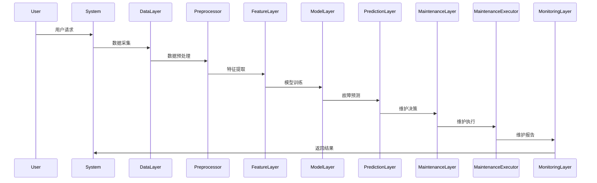

                 

### AI驱动的预测性维护：工业4.0的核心技术

#### 关键词：预测性维护、AI、工业4.0、机器学习、深度学习、物联网

> 摘要：随着工业4.0的全面推进，人工智能（AI）在预测性维护中的应用成为推动工业智能化升级的关键技术。本文通过逐步分析预测性维护的背景、核心概念、AI应用及其实施边界，探讨了AI驱动的预测性维护在工业4.0中的重要性及其未来发展。

---

### 概述与背景

#### 工业革命与预测性维护的演变

工业革命1.0标志着机械化生产的兴起，工业革命2.0引入了自动化和信息化，而工业革命3.0则实现了智能化和网络化。如今，我们正处于工业革命4.0阶段，其核心在于数字化和智能化升级。在这一背景下，预测性维护作为工业智能化的重要组成部分，正逐步从传统定期维护向智能预测性维护转变。

**预测性维护的重要性**：

- **提高设备利用率**：通过提前预测设备故障，可以减少不必要的停机时间，提高设备运行效率。
- **降低维护成本**：通过预防性维护，可以降低维修费用，减少材料消耗。
- **提升生产效率**：预测性维护可以确保设备在最佳状态下运行，从而提高生产效率。
- **减少停机时间**：通过及时维护，可以避免因设备故障导致的停机，保障生产连续性。

#### 预测性维护的核心概念与原理

**核心概念**：

- **预测性维护**（Predictive Maintenance）：利用传感器、机器学习和数据挖掘技术，对设备运行状态进行实时监控和分析，预测可能的故障，并采取预防性措施。

- **数据驱动维护**：基于大量传感器数据，通过数据分析和模型预测，实现设备的智能监控和故障预测。

- **自诊断维护**：设备具备自我诊断能力，通过实时数据分析，自动识别故障并发出预警。

- **预测性分析**：使用先进的算法模型，对历史数据和实时数据进行分析，预测未来可能的故障。

**原理简述**：

1. **数据收集**：通过传感器和工业物联网（IIoT）设备，实时收集设备运行数据。
2. **数据分析**：利用机器学习和深度学习算法，对数据进行处理和分析。
3. **故障预测**：基于模型预测结果，进行故障预测和预警。
4. **维护决策**：根据预测结果，制定科学的维护计划。

#### AI在预测性维护中的应用

**AI技术的优势**：

- **高度自动化**：AI技术可以自动化地处理海量数据，提高分析效率。
- **自适应能力**：AI系统可以不断学习和适应新的数据模式，提高预测准确性。
- **精准度提升**：通过多维度数据分析，可以更准确地预测设备故障。
- **多维度数据分析**：AI技术能够处理结构化和非结构化数据，提供更全面的故障预测。

**应用场景**：

- **质量监控**：通过AI技术，实时监控产品质量，提前发现潜在问题。
- **能耗优化**：通过AI分析，优化设备运行状态，降低能耗。
- **安全管理**：利用AI进行安全隐患识别，保障生产安全。
- **资源调度**：通过AI优化资源分配，提高生产效率。

#### 预测性维护的边界与外延

**边界**：

- **数据有效性**：预测性维护依赖于高质量的数据，数据的有效性和准确性是关键。
- **预测准确性**：预测模型需要高准确性，否则可能导致误报或漏报。
- **算法适用性**：不同场景下，需要选择合适的算法和模型。
- **系统集成与部署**：预测性维护系统需要与现有系统集成，并进行有效的部署。

**外延**：

- **与物联网（IoT）的结合**：通过物联网设备，实现设备的全面监控和数据分析。
- **与大数据技术的整合**：利用大数据技术，进行更全面的数据分析和预测。
- **与云计算和边缘计算的融合**：通过云计算和边缘计算，实现实时数据处理和高效预测。
- **与智能制造的深度结合**：将预测性维护与智能制造紧密结合，推动工业智能化升级。

#### 本章小结

- **本章内容概述**：介绍了预测性维护的背景、核心概念、AI应用及其实施边界。
- **学习要点**：了解预测性维护的概念和重要性，掌握AI技术在预测性维护中的应用。

### AI驱动的预测性维护：核心概念与联系

#### AI驱动的预测性维护概念

**定义**：AI驱动的预测性维护是指利用人工智能，特别是机器学习和深度学习算法，对设备运行状态进行实时监控和分析，从而预测可能的故障，并进行预防性维护。

**关键要素**：

1. **传感器数据收集**：通过传感器收集设备运行数据，如振动、温度、压力等。
2. **数据预处理**：对原始数据进行清洗、格式化等预处理，确保数据质量。
3. **特征提取**：从预处理后的数据中提取有用的特征，为模型训练提供输入。
4. **模型训练**：使用机器学习或深度学习算法，对特征进行训练，建立故障预测模型。
5. **预测与决策**：基于模型预测结果，制定维护计划，进行预防性维护。

#### 概念属性特征对比表格

| 特征名称       | 描述                                                         | 对比分析                                   |
|----------------|--------------------------------------------------------------|--------------------------------------------|
| 传感器数据收集 | 数据的来源和收集方式                                         | 实时性、精准性、数据量大小等                   |
| 数据预处理     | 数据清洗、格式化、缺失值处理等                               | 数据质量直接影响模型的准确性和效率             |
| 特征提取       | 从原始数据中提取有用的信息                                   | 特征选择、特征变换等对模型性能有很大影响       |
| 模型训练       | 使用训练数据训练模型                                        | 选择合适的算法、参数调优对模型性能至关重要     |
| 预测与决策     | 根据模型预测结果制定维护决策                                | 预测准确性直接影响维护效率和成本              |

#### ER实体关系图架构

```mermaid
erDiagram
  Machine ||--|{ Sensor }||>
  Sensor ||--|{ Data }
  Data ||--|{ Maintenance }||>
  Maintenance ||--|{ Decision }
```

### 第3章: AI驱动的预测性维护：算法原理与实施步骤

#### 3.1 预测性维护算法原理

**机器学习算法**：

- **监督学习**：通过历史数据训练模型，预测未来故障。常用的算法包括决策树、支持向量机（SVM）等。

- **无监督学习**：不需要标签数据，通过分析数据模式进行故障预测。常用的算法包括聚类算法、主成分分析（PCA）等。

**深度学习算法**：

- **神经网络**：通过多层非线性变换，学习数据特征，实现故障预测。常用的网络结构包括卷积神经网络（CNN）、循环神经网络（RNN）等。

- **强化学习**：通过与环境的交互，不断优化决策策略，提高预测准确性。

**预测流程**：

1. **数据收集**：通过传感器和IIoT设备，收集设备运行数据。
2. **数据预处理**：对数据清洗、归一化等处理，确保数据质量。
3. **特征提取**：从预处理后的数据中提取特征，为模型训练提供输入。
4. **模型训练**：使用训练数据，选择合适的机器学习或深度学习算法，训练预测模型。
5. **模型评估**：使用测试数据，评估模型预测性能，调整参数，优化模型。
6. **故障预测**：使用训练好的模型，对实时数据进行预测，发出故障预警。
7. **维护决策**：根据预测结果，制定维护计划，进行预防性维护。

#### 3.2 实施步骤

**步骤1：需求分析与规划**

- 分析企业设备维护需求，确定预测性维护的目标和范围。
- 制定详细的项目规划，包括数据收集、预处理、模型训练和部署等环节。

**步骤2：数据收集与预处理**

- 安装传感器，收集设备运行数据，包括振动、温度、压力等。
- 对数据进行清洗、格式化等预处理，确保数据质量。

**步骤3：特征提取**

- 从预处理后的数据中提取特征，为模型训练提供输入。
- 根据数据特点和模型需求，选择合适的特征提取方法。

**步骤4：模型训练与优化**

- 选择合适的机器学习或深度学习算法，训练预测模型。
- 通过交叉验证和调整参数，优化模型性能。

**步骤5：模型评估与部署**

- 使用测试数据，评估模型预测性能，调整参数，优化模型。
- 将训练好的模型部署到生产环境，进行实时故障预测。

**步骤6：维护决策与反馈**

- 根据模型预测结果，制定维护计划，进行预防性维护。
- 收集维护数据，反馈给模型训练过程，持续优化预测性能。

### 3.3 本章小结

- **本章内容概述**：介绍了预测性维护的算法原理和实施步骤。
- **学习要点**：掌握预测性维护的算法原理和实施步骤，理解从数据收集到维护决策的全过程。

### 第4章: 预测性维护系统设计与实现

#### 4.1 系统功能设计

**功能概述**：

- **数据采集**：通过传感器和IIoT设备，实时收集设备运行数据。
- **数据预处理**：对原始数据进行清洗、格式化等预处理，确保数据质量。
- **特征提取**：从预处理后的数据中提取特征，为模型训练提供输入。
- **模型训练**：使用机器学习或深度学习算法，训练故障预测模型。
- **故障预测**：对实时数据进行预测，发出故障预警。
- **维护决策**：根据预测结果，制定维护计划。
- **维护执行**：执行维护计划，进行预防性维护。
- **系统监控**：实时监控系统运行状态，确保系统稳定可靠。

**领域模型类图**：

```mermaid
classDiagram
  Data -->|采集| Sensor
  Sensor -->|发送| Data
  Data -->|预处理| Preprocessor
  Preprocessor -->|输出| Feature
  Feature -->|训练| Model
  Model -->|预测| Prediction
  Prediction -->|决策| Maintenance
  Maintenance -->|执行| MaintenanceExecutor
  MaintenanceExecutor -->|报告| Monitoring
  Monitoring -->|反馈| Preprocessor
```

#### 4.2 系统架构设计

**系统架构概述**：

- **数据层**：负责数据的存储和管理，包括传感器数据、预处理数据、特征数据和预测结果等。
- **模型层**：负责模型训练和预测，包括数据预处理模块、特征提取模块、模型训练模块和故障预测模块。
- **应用层**：负责系统的业务逻辑，包括故障预测、维护决策、维护执行和系统监控等功能。
- **展示层**：提供用户界面，展示系统运行状态、故障预警和维护计划等。

**系统架构图**：



#### 4.3 系统接口设计

**接口设计概述**：

- **数据采集接口**：用于与传感器和IIoT设备通信，实时获取设备运行数据。
- **数据处理接口**：用于对采集到的数据进行预处理，包括清洗、格式化和归一化等。
- **特征提取接口**：用于从预处理后的数据中提取特征，为模型训练提供输入。
- **模型训练接口**：用于训练故障预测模型，包括选择算法、设置参数和训练模型等。
- **故障预测接口**：用于对实时数据进行预测，发出故障预警。
- **维护决策接口**：用于根据预测结果，制定维护计划。
- **维护执行接口**：用于执行维护计划，进行预防性维护。
- **系统监控接口**：用于实时监控系统运行状态，确保系统稳定可靠。

**接口设计图**：

```mermaid
classDiagram
  DataCollector[数据采集接口] <|-- Sensor
  DataCollector --> Preprocessor[数据处理接口]
  Preprocessor --> FeatureExtractor[特征提取接口]
  FeatureExtractor --> ModelTrainer[模型训练接口]
  ModelTrainer --> Predictor[故障预测接口]
  Predictor --> MaintenancePlanner[维护决策接口]
  MaintenancePlanner --> MaintenanceExecutor[维护执行接口]
  MaintenanceExecutor --> Monitor[系统监控接口]
```

#### 4.4 系统交互设计与实现

**交互设计概述**：

- **用户界面**：提供用户交互的界面，展示系统运行状态、故障预警和维护计划等。
- **数据层**：存储和管理系统数据，包括传感器数据、预处理数据、特征数据、预测数据和维护数据等。
- **模型层**：负责模型训练和预测，包括数据预处理模块、特征提取模块、模型训练模块和故障预测模块。
- **应用层**：实现系统的业务逻辑，包括故障预测、维护决策、维护执行和系统监控等功能。

**系统交互图**：


#### 4.5 本章小结

- **本章内容概述**：介绍了预测性维护系统的功能设计、架构设计、接口设计和交互设计。
- **学习要点**：理解预测性维护系统的整体架构和各部分功能，掌握接口设计和交互设计的方法。

### 第5章: 预测性维护项目实战

#### 5.1 环境安装

**安装步骤**：

1. **安装Python环境**：确保Python 3.7或更高版本已安装。
2. **安装依赖库**：使用pip安装以下依赖库：

   ```bash
   pip install numpy pandas scikit-learn tensorflow keras matplotlib
   ```

3. **安装传感器和IIoT设备**：根据项目需求，安装相应的传感器和IIoT设备，确保能够实时采集设备运行数据。

#### 5.2 系统核心实现

**代码实现**：

1. **数据采集**：

   ```python
   import pandas as pd
   
   def collect_data(sensor_data_path):
       data = pd.read_csv(sensor_data_path)
       return data
   ```

2. **数据预处理**：

   ```python
   from sklearn.preprocessing import StandardScaler
   
   def preprocess_data(data):
       scaler = StandardScaler()
       scaled_data = scaler.fit_transform(data)
       return scaled_data
   ```

3. **特征提取**：

   ```python
   from sklearn.decomposition import PCA
   
   def extract_features(data, n_components=5):
       pca = PCA(n_components=n_components)
       features = pca.fit_transform(data)
       return features
   ```

4. **模型训练**：

   ```python
   from sklearn.ensemble import RandomForestClassifier
   
   def train_model(train_features, train_labels):
       model = RandomForestClassifier()
       model.fit(train_features, train_labels)
       return model
   ```

5. **故障预测**：

   ```python
   def predict_fault(model, test_features):
       predictions = model.predict(test_features)
       return predictions
   ```

#### 5.3 代码应用解读与分析

**代码解读**：

1. **数据采集**：通过读取CSV文件，从传感器采集设备运行数据。
2. **数据预处理**：使用StandardScaler进行数据归一化，提高模型训练效果。
3. **特征提取**：使用PCA进行特征降维，提取主要特征，减少计算量。
4. **模型训练**：使用RandomForestClassifier进行模型训练，实现故障预测。
5. **故障预测**：根据训练好的模型，对实时数据进行故障预测。

**分析**：

- **数据采集**：传感器数据的实时性和准确性直接影响故障预测的效果。
- **数据预处理**：数据归一化可以消除不同特征之间的量纲影响，提高模型训练的稳定性。
- **特征提取**：特征降维可以减少模型复杂度，提高预测速度。
- **模型选择**：RandomForestClassifier具有较强的泛化能力，适用于多种故障预测任务。

#### 5.4 实际案例分析

**案例背景**：

某工厂的一台关键生产设备需要实现预测性维护，以降低故障率和提高生产效率。

**解决方案**：

1. **安装传感器**：在设备关键部位安装振动传感器和温度传感器，实时采集设备运行数据。
2. **数据采集与预处理**：使用Python脚本采集传感器数据，进行数据清洗和归一化处理。
3. **特征提取**：提取振动和温度的主要特征，如均值、标准差、峰峰值等。
4. **模型训练与预测**：使用随机森林模型进行训练，对实时数据进行故障预测。
5. **维护决策**：根据预测结果，提前制定维护计划，进行预防性维护。

**效果评估**：

- **故障率降低**：通过预测性维护，设备的故障率显著降低，生产效率提高。
- **维护成本降低**：预防性维护减少了对设备的突发性维修，降低了维护成本。
- **设备寿命延长**：通过及时维护，设备的使用寿命得到延长。

#### 5.5 项目小结

- **项目概述**：实现了一款基于AI的预测性维护系统，成功应用于某工厂的关键生产设备。
- **项目成果**：降低了设备故障率，提高了生产效率，降低了维护成本。
- **项目经验**：从数据采集、预处理到特征提取、模型训练和预测，各个环节都至关重要，需要精心设计和实施。

### 第6章: AI驱动的预测性维护最佳实践与拓展

#### 6.1 最佳实践 Tips

1. **数据质量是关键**：确保数据收集的实时性和准确性，是预测性维护成功的基础。
2. **模型选择要合适**：根据设备特点和故障类型，选择合适的机器学习或深度学习算法。
3. **持续优化与迭代**：定期评估模型性能，根据新数据不断优化和调整模型参数。
4. **集成与兼容性**：预测性维护系统需要与现有系统兼容，实现数据的无缝集成。
5. **安全与隐私**：确保数据安全和隐私保护，遵守相关法律法规。

#### 6.2 小结与注意事项

- **本章内容概述**：介绍了AI驱动的预测性维护的最佳实践和注意事项。
- **学习要点**：掌握数据质量、模型选择、持续优化、集成与兼容性以及安全与隐私等方面的关键要点。

#### 6.3 拓展阅读

1. **深度学习在预测性维护中的应用**：
   - 《深度学习在工业领域中的应用》
   - 《深度学习与预测性维护：技术与应用》

2. **工业4.0与智能制造**：
   - 《工业4.0：从数字化到智能化》
   - 《智能制造之路：工业4.0与数字化转型》

3. **物联网与大数据技术**：
   - 《物联网技术与应用》
   - 《大数据技术与工业应用》

作者：AI天才研究院/AI Genius Institute & 禅与计算机程序设计艺术 /Zen And The Art of Computer Programming

