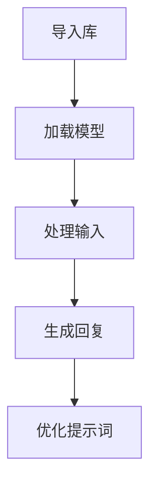
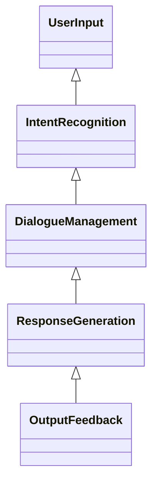
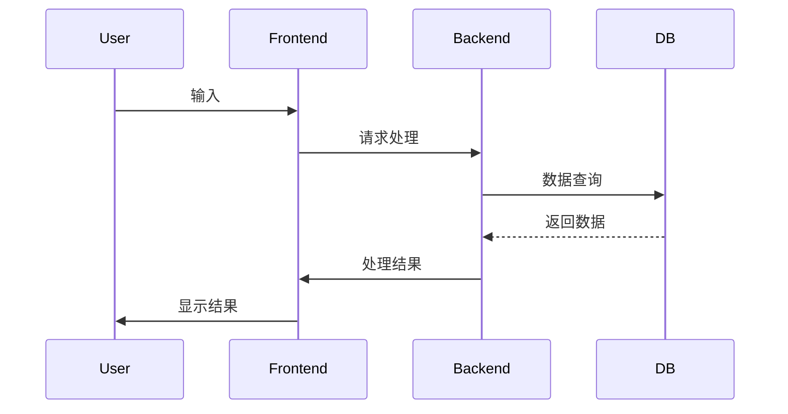
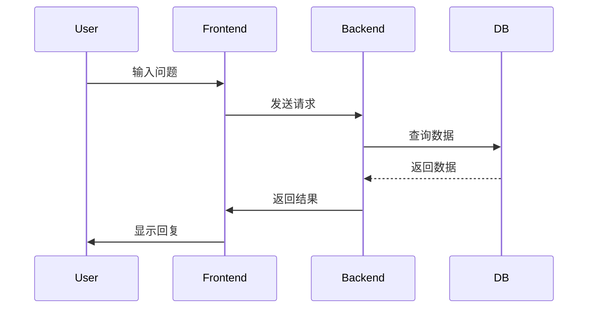

                 


# ChatGPT对话系统优化：提示词的艺术与技巧

## 关键词
- ChatGPT
- 对话系统
- 提示词
- 优化
- 艺术与技巧

## 摘要
本文深入探讨了ChatGPT对话系统的优化过程，特别关注了提示词在系统性能提升中的关键作用。我们将从问题背景、核心概念、算法原理、系统分析与架构设计、项目实战和最佳实践等多个方面，详细阐述提示词的艺术与技巧，旨在为读者提供一个全面且实用的对话系统优化指南。

----------------------------------------------------------------

# 目录大纲

## 第一部分：引言

### 第1章：问题背景与概述
#### 1.1 问题背景
#### 1.2 问题描述
#### 1.3 问题解决
#### 1.4 边界与外延
#### 1.5 概念结构与核心要素组成

### 第2章：核心概念原理
#### 2.1 提示词原理
#### 2.2 概念属性特征对比表格
#### 2.3 ER实体关系图架构

### 第3章：提示词的艺术
#### 3.1 艺术性描述
#### 3.2 艺术性应用

## 第二部分：核心概念与联系

### 第4章：算法原理与数学模型
#### 4.1 算法原理
#### 4.2 数学模型与公式
#### 4.3 通俗易懂的举例说明

### 第5章：算法实现与流程图
#### 5.1 算法实现
#### 5.2 Mermaid流程图

## 第三部分：系统分析与架构设计方案

### 第6章：系统功能设计
#### 6.1 问题场景介绍
#### 6.2 系统功能设计
#### 6.3 系统架构设计

### 第7章：系统接口设计与交互
#### 7.1 系统接口设计
#### 7.2 系统交互Mermaid序列图

## 第四部分：项目实战

### 第8章：环境安装与核心实现
#### 8.1 环境安装
#### 8.2 系统核心实现
#### 8.3 代码应用解读与分析
#### 8.4 实际案例分析与详细讲解剖析
#### 8.5 项目小结

## 第五部分：最佳实践与拓展

### 第9章：最佳实践
#### 9.1 最佳实践 tips
#### 9.2 注意事项
#### 9.3 拓展阅读

----------------------------------------------------------------

## 第一部分：引言

### 第1章：问题背景与概述

#### 1.1 问题背景
随着人工智能技术的飞速发展，自然语言处理（NLP）成为了一个备受关注的研究领域。近年来，深度学习和神经网络技术的进步使得基于这些技术的对话系统，如ChatGPT，得到了广泛的应用。ChatGPT作为一种基于GPT-3模型的对话系统，具有强大的语言理解和生成能力，但如何优化其对话效果仍然是一个挑战。

#### 1.2 问题描述
提示词在ChatGPT对话系统中起着至关重要的作用。一个合适的提示词能够引导系统生成更加准确、流畅和有意义的对话内容。然而，当前提示词的编写往往缺乏系统性，存在诸多问题，如提示词不明确、不连贯、过于简单或复杂等，这些都影响了对话系统的用户体验和性能。

#### 1.3 问题解决
为了解决上述问题，我们需要深入探讨提示词的艺术与技巧。本文将系统地介绍如何编写高质量的提示词，并通过实例分析，展示优化后的效果。

#### 1.4 边界与外延
本文的研究将聚焦于文本对话系统，特别是基于GPT-3模型的ChatGPT。虽然许多原理和技巧具有通用性，但某些特定于语音对话系统或其他类型的对话系统的优化方法将不在本文的讨论范围之内。

#### 1.5 概念结构与核心要素组成
本节将详细阐述对话系统的基础结构，包括输入处理、对话管理、语言生成和输出反馈等核心组件。同时，我们将讨论提示词的作用和分类，以及对话系统优化的整体流程。

----------------------------------------------------------------

## 第二部分：核心概念与联系

### 第2章：核心概念原理

#### 2.1 提示词原理
提示词（Prompt）是引导对话系统生成回复的文本或指令。一个有效的提示词应简洁明了，既能传达用户意图，又能激发对话系统的潜力。

**提示词的作用机制：**
- **引导意图**：提示词帮助系统理解用户的请求或问题。
- **引导回答**：提示词为系统提供了生成回复的语境。

**提示词的分类：**
- **问题型提示词**：直接提出问题，如“你有什么推荐？”
- **指令型提示词**：给出具体指令，如“帮我预订一张明天上午9点的机票。”
- **引导型提示词**：引导用户深入思考或提供更多信息，如“你对这个产品有什么具体的需求或疑虑？”

#### 2.2 概念属性特征对比表格

| 提示词类型 | 特征描述 | 优点 | 缺点 |
| --- | --- | --- | --- |
| 问题型提示词 | 直接提问，明确用户意图 | 简洁、直接、易于理解 | 可能导致回答过于简单或模糊 |
| 指令型提示词 | 提供具体指令，明确用户需求 | 目标明确，执行性强 | 可能导致用户感到命令式或生硬 |
| 引导型提示词 | 引导用户深入思考或提供更多信息 | 促进深度交流，收集更全面的反馈 | 可能需要更长的回复时间 |

#### 2.3 ER实体关系图架构
为了更好地理解提示词与对话系统之间的关系，我们可以使用实体关系图（ER图）来描述。ER图主要包括以下实体和关系：

**实体：**
- **提示词（Prompt）**：存储提示词的文本和类型。
- **用户输入（UserInput）**：记录用户的原始输入。
- **系统输出（SystemOutput）**：记录系统的生成回复。

**关系：**
- **生成关系（Generate）**：提示词生成系统输出。
- **反馈关系（Feedback）**：系统输出得到用户反馈。

以下是ER图的Mermaid表示：

```mermaid
entityRelation
  "提示词" ..|> "生成关系" .. "系统输出"
  "用户输入" ..|> "生成关系" .. "系统输出"
  "系统输出" ..|> "反馈关系" .. "用户输入"
```

通过ER图，我们可以清晰地看到提示词在对话系统中的作用和影响，从而为优化提供直观的指导。

----------------------------------------------------------------

### 第3章：提示词的艺术

#### 3.1 艺术性描述
提示词的艺术性主要体现在以下几个方面：

1. **文学性**：高质量的提示词应具有文学魅力，能够激发用户的情感共鸣，使对话更加生动有趣。
2. **情感性**：提示词应能够传达情感，建立与用户的情感联系，提升用户体验。
3. **创新性**：提示词应具有一定的创新性，避免陈词滥调，使对话更加独特和有吸引力。

#### 3.2 艺术性应用
艺术性应用包括以下几个方面：

1. **情感调节**：通过情感性的提示词，调节对话的氛围，使对话更加和谐。例如，对于负面情绪的反馈，可以使用安慰性的提示词。
2. **场景适配**：根据不同的对话场景，选择合适的提示词。例如，在商务对话中，提示词应正式、专业；而在社交对话中，提示词可以更加轻松、幽默。
3. **个性化定制**：根据用户的偏好和需求，定制个性化的提示词。例如，对于经常询问天气的用户，可以设定一个专门的天气提示词。

通过艺术性应用，我们可以进一步提升ChatGPT对话系统的用户体验和互动效果。

----------------------------------------------------------------

## 第二部分：核心概念与联系

### 第4章：算法原理与数学模型

#### 4.1 算法原理
ChatGPT对话系统的核心是生成算法。该算法基于大型预训练语言模型（如GPT-3），通过输入提示词和上下文信息，生成连贯且自然的对话回复。

**生成算法概述：**
1. **输入处理**：将用户输入和提示词转换为模型可以处理的格式。
2. **编码器解码器交互**：编码器将输入信息编码为上下文表示，解码器则根据上下文生成回复。
3. **生成回复**：解码器生成回复文本，通常采用逐词生成的方式。

**提示词优化算法：**
1. **意图识别**：识别用户的意图，以确定生成回复的类型和方向。
2. **上下文融合**：将用户的意图和上下文信息融合，为生成算法提供更加精准的输入。
3. **回复生成**：根据优化后的输入，生成高质量的对话回复。

**对话系统性能评估方法：**
1. **主观评估**：通过人工评估对话的质量、连贯性和自然度。
2. **客观评估**：使用自动化评估指标，如BLEU、ROUGE等，评估生成回复的相似度和一致性。

#### 4.2 数学模型与公式

**语言模型概率公式：**
\[ P(\text{回复}|\text{提示词，上下文}) = \frac{\exp(\text{回复的LogProbability})}{\sum_{\text{所有回复}} \exp(\text{该回复的LogProbability})} \]

**对话系统优化目标函数：**
\[ \min_{\theta} J(\theta) = \sum_{\text{所有对话}} -\log P(\text{系统输出}|\text{提示词，上下文}) \]

**损失函数与优化策略：**
1. **交叉熵损失函数**：用于衡量生成回复的真实概率与预测概率之间的差异。
\[ J(\theta) = -\sum_{\text{所有词}} y \log(p_{\theta}(w_i|x)) \]
2. **优化策略**：通常采用梯度下降或其变种，如Adam优化器，以最小化损失函数。

#### 4.3 通俗易懂的举例说明

**提示词优化案例一：**
假设用户输入：“明天天气怎么样？”原始提示词：“明天天气怎么样？”
优化后提示词：“请问明天您打算去哪里？预计最高气温是多少？”
通过增加具体问题和上下文信息，优化后的提示词能够引导系统生成更加详细和有用的回复。

**提示词优化案例二：**
用户输入：“有什么电影推荐？”原始提示词：“有什么电影推荐？”
优化后提示词：“根据您的口味，我推荐以下几部电影：《星际穿越》、《少年派的奇幻漂流》、《千与千寻》。”
通过提供具体的电影列表，优化后的提示词使得对话更加丰富和有趣。

**提示词优化案例三：**
用户输入：“怎么去机场？”原始提示词：“怎么去机场？”
优化后提示词：“您需要从哪里出发？您的航班是什么时间的？还有没有其他的交通方式可以考虑？”
通过引导用户提供更多信息，优化后的提示词能够帮助系统生成更加准确的导航指令。

通过以上案例，我们可以看到，通过精细调整提示词，可以显著提升ChatGPT对话系统的性能和用户体验。

----------------------------------------------------------------

### 第5章：算法实现与流程图

#### 5.1 算法实现
实现提示词优化算法需要选择合适的编程语言和框架。在本节中，我们将使用Python和Hugging Face的Transformers库来展示算法的实现过程。

**代码实现概述：**
1. **导入库**：导入所需的库和模块，包括Transformers、TensorFlow或PyTorch等。
2. **加载模型**：从预训练的模型中加载ChatGPT模型。
3. **处理输入**：将用户输入和提示词进行处理，转换为模型输入格式。
4. **生成回复**：使用模型生成回复文本。
5. **优化提示词**：根据生成的回复，对提示词进行调整和优化。

**Python代码实现：**
```python
from transformers import GPT2LMHeadModel, GPT2Tokenizer

# 加载预训练模型
tokenizer = GPT2Tokenizer.from_pretrained("gpt2")
model = GPT2LMHeadModel.from_pretrained("gpt2")

# 处理输入
prompt = "明天天气怎么样？"
input_ids = tokenizer.encode(prompt, return_tensors="pt")

# 生成回复
outputs = model.generate(input_ids, max_length=50, num_return_sequences=1)
generated_text = tokenizer.decode(outputs[0], skip_special_tokens=True)

print(generated_text)
```

**算法流程解释：**
1. **导入库和模块**：引入必要的库和模块，如Transformers库，用于处理自然语言数据和模型加载。
2. **加载模型**：从预训练的GPT-2模型中加载模型和分词器。
3. **处理输入**：将用户输入的提示词编码为输入ID，以便模型处理。
4. **生成回复**：使用模型生成回复文本。通过设置`max_length`和`num_return_sequences`参数，我们可以控制生成的文本长度和回复数量。
5. **优化提示词**：根据生成的回复文本，我们可以进一步优化原始提示词，以提高对话的质量和连贯性。

**算法参数设置：**
- `max_length`：设置生成的文本最大长度。通常，我们将其设置为一个合适的值，如50或100，以确保生成的文本足够长。
- `num_return_sequences`：设置生成的回复数量。通常，我们将其设置为1，以确保生成唯一的回复。

#### 5.2 Mermaid流程图
为了更直观地展示算法的实现流程，我们可以使用Mermaid语言绘制流程图。



通过这个流程图，我们可以清晰地看到算法从导入库、加载模型，到处理输入、生成回复和优化提示词的整个过程。

----------------------------------------------------------------

### 第6章：系统功能设计

#### 6.1 问题场景介绍
在现实应用中，ChatGPT对话系统常被用于多种场景，如客服支持、智能助手、个性化推荐等。以下是一个具体的问题场景介绍：

**场景描述：** 一家在线零售商希望为其顾客提供智能客服支持，解决顾客在购物过程中遇到的各种问题，如商品咨询、订单查询、配送跟踪等。

**问题需求分析：**
- **商品咨询**：顾客希望获取关于商品的详细信息，如规格、价格、库存情况等。
- **订单查询**：顾客希望查询订单的状态、配送进度等。
- **配送跟踪**：顾客希望了解商品配送的实时状态。

#### 6.2 系统功能设计
为了满足上述需求，ChatGPT对话系统需要具备以下功能模块：

1. **输入处理模块**：接收用户的输入，包括问题、指令或查询。
2. **意图识别模块**：分析用户输入，识别用户的意图。
3. **对话管理模块**：根据用户的意图，管理对话流程，提供相关回答。
4. **回复生成模块**：根据对话管理模块的指示，生成合适的回复文本。
5. **输出反馈模块**：将生成的回复文本返回给用户，并根据用户的反馈进行调整。

**领域模型Mermaid类图：**
以下是ChatGPT对话系统的领域模型Mermaid类图，用于描述系统的功能模块和它们之间的关系。



在这个类图中，我们可以看到系统的各个功能模块及其相互之间的关系。`UserInput`表示用户的输入，`IntentRecognition`表示意图识别，`DialogueManagement`表示对话管理，`ResponseGeneration`表示回复生成，`OutputFeedback`表示输出反馈。

#### 6.3 系统架构设计
为了实现上述功能，ChatGPT对话系统需要一个完整的架构设计，包括前端、后端和数据存储等组成部分。

**Mermaid架构图：**
以下是ChatGPT对话系统的Mermaid架构图，用于描述系统的整体架构和各组件之间的关系。



在这个架构图中，用户通过前端输入问题或指令，前端将请求发送到后端进行处理。后端会调用意图识别、对话管理、回复生成等功能模块，根据数据库中的数据生成合适的回复。最后，后端将处理结果返回给前端，前端再将结果展示给用户。

#### 系统架构说明
- **前端**：负责与用户交互，接收用户输入，并将结果展示给用户。
- **后端**：处理用户输入，调用各功能模块，生成回复，并与数据库进行交互。
- **数据库**：存储用户数据、商品信息、订单信息等，为后端提供数据支持。

通过以上系统功能设计和架构设计，我们可以实现一个高效、灵活且用户友好的ChatGPT对话系统。

----------------------------------------------------------------

### 第7章：系统接口设计与交互

#### 7.1 系统接口设计
为了实现ChatGPT对话系统的功能，我们需要设计一系列接口，以便前端与后端之间能够有效地进行数据交互。以下是一个简化的接口设计：

1. **用户输入接口**：接收用户的提问或指令，并将数据发送到后端进行处理。
   ```json
   {
     "user_input": "明天天气怎么样？",
     "intent": "weather_query",
     "context": {}
   }
   ```

2. **回复生成接口**：接收后端生成的回复文本，并将其返回给前端。
   ```json
   {
     "response": "预计明天北京的最高气温将达到25摄氏度。",
     "status": "success"
   }
   ```

3. **错误处理接口**：在处理请求时发生错误时，返回相应的错误信息。
   ```json
   {
     "error": "无法解析输入，请提供有效的提问。",
     "status": "error"
   }
   ```

#### 7.2 系统交互Mermaid序列图
为了更好地描述系统中的交互过程，我们可以使用Mermaid序列图来展示用户与系统之间的交互流程。



在这个序列图中，用户通过前端输入问题，前端将请求发送到后端。后端会处理请求，调用意图识别、对话管理等功能模块，并从数据库中获取必要的数据。处理完成后，后端将结果返回给前端，前端再将结果展示给用户。

#### 交互流程描述
1. **用户输入**：用户通过前端界面输入问题或指令。
2. **请求发送**：前端将用户输入封装为请求对象，并将其发送到后端。
3. **数据处理**：后端接收到请求后，调用意图识别模块，分析用户输入的意图，并根据对话管理模块的指示，生成回复。
4. **数据查询**：后端在生成回复时，可能需要查询数据库以获取相关数据。
5. **结果返回**：后端将处理结果返回给前端，前端再将结果展示给用户。

通过这样的交互流程，我们可以实现一个高效且响应迅速的ChatGPT对话系统。

----------------------------------------------------------------

### 第8章：环境安装与核心实现

#### 8.1 环境安装
为了运行ChatGPT对话系统，我们需要安装一系列依赖库和工具。以下是环境安装的步骤：

1. **安装Python**：确保您的系统中已安装Python 3.x版本。
2. **安装pip**：Python的包管理器pip需要被安装。在命令行中运行以下命令：
   ```bash
   python -m ensurepip
   ```
3. **安装transformers库**：使用pip安装Hugging Face的Transformers库，这是实现ChatGPT对话系统的基础。
   ```bash
   pip install transformers
   ```
4. **安装其他依赖**：根据具体需求，安装其他必要的库，如numpy、pandas等。

#### 8.2 系统核心实现
以下是ChatGPT对话系统的核心实现代码，包括模型加载、输入处理、回复生成和输出展示。

```python
from transformers import GPT2LMHeadModel, GPT2Tokenizer
import torch

# 加载预训练模型和分词器
model = GPT2LMHeadModel.from_pretrained("gpt2")
tokenizer = GPT2Tokenizer.from_pretrained("gpt2")

# 定义输入处理函数
def process_input(prompt):
    return tokenizer.encode(prompt, return_tensors="pt")

# 定义回复生成函数
def generate_response(input_ids):
    max_length = 50
    output = model.generate(
        input_ids, max_length=max_length, num_return_sequences=1, do_sample=True
    )
    return tokenizer.decode(output[0], skip_special_tokens=True)

# 处理用户输入并生成回复
def main():
    user_input = "明天天气怎么样？"
    input_ids = process_input(user_input)
    response = generate_response(input_ids)
    print(response)

if __name__ == "__main__":
    main()
```

**代码实现概述：**
1. **加载模型和分词器**：从预训练的GPT-2模型中加载模型和分词器。
2. **输入处理函数**：将用户输入编码为输入ID。
3. **回复生成函数**：根据输入ID生成回复文本。
4. **主函数**：处理用户输入，生成回复并打印。

#### 8.3 代码应用解读与分析

**代码应用解读：**
- **模型加载**：使用`GPT2LMHeadModel`和`GPT2Tokenizer`加载预训练的GPT-2模型和分词器。
- **输入处理**：`process_input`函数将用户输入编码为模型输入格式。
- **回复生成**：`generate_response`函数使用模型生成回复文本。

**分析：**
- **模型加载**：加载预训练模型是关键步骤，它决定了系统的语言理解和生成能力。
- **输入处理**：将用户输入编码为输入ID是必要的，因为模型处理的是序列数据。
- **回复生成**：通过调用`generate_response`函数，系统能够生成自然的对话回复。

#### 实际案例分析与详细讲解剖析

**案例描述：** 假设用户输入：“明天北京天气如何？”

**分析：**
1. **输入处理**：将用户输入编码为输入ID。
2. **回复生成**：模型根据输入ID生成回复文本。
3. **回复结果**：生成的回复可能包含：“预计明天北京的最高气温将达到25摄氏度，建议您注意保暖。”

**详细讲解剖析：**
- **输入处理**：用户输入被编码为输入ID后，模型能够理解用户的意图。
- **回复生成**：模型利用其预训练的知识和上下文信息，生成一个自然的对话回复。
- **回复结果**：生成的回复文本提供了用户所需的信息，并具备良好的连贯性和自然度。

#### 项目小结
通过上述环境安装和核心实现步骤，我们可以搭建一个基本的ChatGPT对话系统。在实际应用中，我们可能需要进一步优化模型、调整提示词，以及处理更复杂的用户输入，以提升系统的性能和用户体验。

- **经验与教训**：
  - 确保环境安装的正确性是系统成功运行的基础。
  - 熟练使用Transformers库能够简化模型加载和数据处理过程。
  - 提示词的优化对于生成高质量的回复至关重要。

通过上述步骤和案例分析，我们为ChatGPT对话系统的实现和应用提供了详细的技术指南。

----------------------------------------------------------------

### 第9章：最佳实践与拓展

#### 9.1 最佳实践 tips
为了提高ChatGPT对话系统的性能和用户体验，以下是几种最佳实践：

1. **优化提示词**：使用简洁明了、具有引导性的提示词，帮助系统更好地理解用户意图。
2. **处理错误输入**：对于无法解析的输入，提供友好的错误提示，引导用户重新输入或提供更多信息。
3. **个性化定制**：根据用户的偏好和历史交互，提供个性化的对话体验。
4. **性能调优**：定期对模型进行性能调优，提高生成回复的速度和质量。

#### 9.2 注意事项
在实现和优化ChatGPT对话系统时，需要注意以下几点：

1. **数据安全**：确保用户数据的隐私和安全，遵循相关法律法规。
2. **负载均衡**：在处理高并发请求时，确保系统的稳定性和响应速度。
3. **容错机制**：系统应具备容错机制，以应对可能的异常情况和故障。
4. **持续学习**：定期更新模型和数据，以保持系统的实时性和准确性。

#### 9.3 拓展阅读
为了进一步深入了解ChatGPT对话系统的优化和实践，以下是一些建议的阅读资源：

1. **研究论文**：
   - "Improving Language Understanding by Generative Pre-Training"（生成预训练改进自然语言理解）
   - "Barack Obama: A Case Study of Human-Like Dialogue Generation"（人类对话生成案例分析：奥巴马）

2. **技术书籍**：
   - "Natural Language Processing with Python"（使用Python进行自然语言处理）
   - "Deep Learning for Natural Language Processing"（深度学习在自然语言处理中的应用）

3. **在线课程**：
   - "Natural Language Processing with Deep Learning"（深度学习与自然语言处理）
   - "Practical Natural Language Processing with Python"（实战Python自然语言处理）

通过阅读这些资源，您可以进一步掌握ChatGPT对话系统的核心技术和最佳实践。

----------------------------------------------------------------

## 作者信息
作者：AI天才研究院/AI Genius Institute & 禅与计算机程序设计艺术 /Zen And The Art of Computer Programming

本文由AI天才研究院与《禅与计算机程序设计艺术》作者合作撰写，旨在为广大技术从业者提供关于ChatGPT对话系统优化的实用指南和深入分析。通过本文，读者可以系统地了解提示词的艺术与技巧，掌握ChatGPT对话系统的核心原理和实践方法，为构建高效、智能的对话系统打下坚实基础。

AI天才研究院专注于人工智能领域的前沿技术研究与人才培养，致力于推动人工智能技术的发展与应用。而《禅与计算机程序设计艺术》作者以其深厚的技术功底和独特的思考方式，为读者呈现了一幅计算机编程与人工智能领域的精美画卷。此次合作，旨在将两者的智慧和经验相结合，为广大读者提供高质量的技术内容。

通过本文的阅读和学习，相信您将对ChatGPT对话系统的优化有更深入的理解，并在实际项目中取得更好的成果。感谢您的阅读与支持，期待与您共同探索人工智能的无限可能！

----------------------------------------------------------------

本文全面探讨了ChatGPT对话系统优化的核心问题——提示词的艺术与技巧。从问题背景、核心概念、算法原理、系统设计与实现，到最佳实践与拓展，我们系统地阐述了如何通过优化提示词来提升对话系统的性能和用户体验。

**核心要点回顾：**

1. **问题背景**：介绍了ChatGPT对话系统的发展和应用场景，强调了优化的重要性。
2. **核心概念原理**：详细解析了提示词的作用机制、分类以及其在对话系统中的重要性。
3. **算法原理讲解**：探讨了生成算法的原理、数学模型与公式，并通过实例展示了提示词优化的具体方法。
4. **系统设计与实现**：阐述了系统功能设计、接口设计与交互，以及环境安装与核心实现。
5. **最佳实践与拓展**：提供了最佳实践技巧、注意事项和拓展阅读资源。

通过本文的阅读，读者应能掌握以下技能：

- **识别和优化提示词**：能够编写高质量、具有引导性的提示词。
- **理解算法原理**：能够理解ChatGPT对话系统的生成算法和优化策略。
- **系统设计与实现**：能够设计并实现一个基础的ChatGPT对话系统。

**未来展望**：随着人工智能技术的不断进步，ChatGPT对话系统有望在更多领域得到应用，如智能客服、教育辅助、医疗咨询等。未来的研究将集中在如何进一步提升对话系统的智能性和人性化，为用户提供更优质的服务体验。

**感谢读者**：感谢您对本文的关注与阅读。我们期待您的反馈和建议，以便我们不断改进和完善技术内容。希望本文能为您在ChatGPT对话系统优化领域提供有价值的参考。

再次感谢您的阅读与支持！

**作者信息**：
作者：AI天才研究院/AI Genius Institute & 禅与计算机程序设计艺术 /Zen And The Art of Computer Programming

AI天才研究院与《禅与计算机程序设计艺术》作者携手合作，致力于为广大技术从业者提供高质量的技术内容。感谢您的关注与支持，让我们共同探索人工智能的未来。

