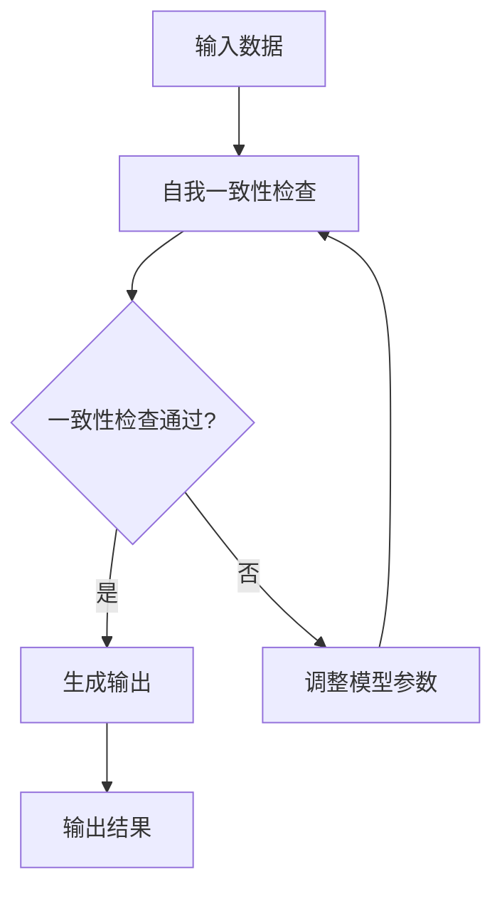
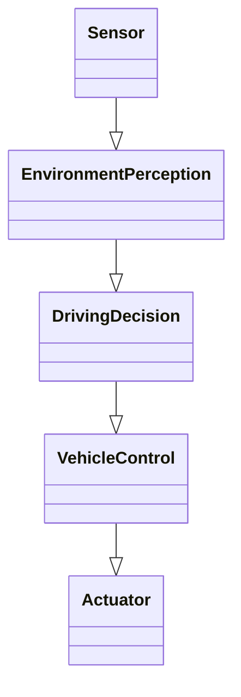
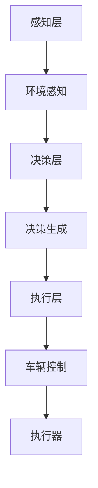
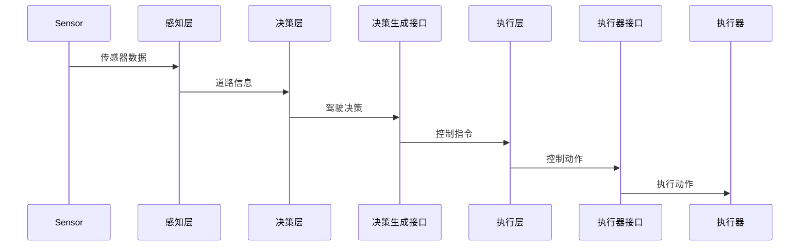
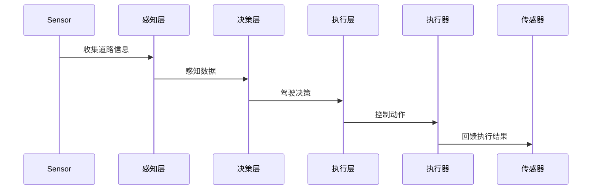

                 

## 文章标题：Self-Consistency CoT：增强AI输出可信度的新策略

### 关键词：自我一致性，可信度增强，AI输出，算法原理，系统架构，项目实战

### 摘要：
本文深入探讨了Self-Consistency CoT（自我一致性一致性理论）在增强人工智能（AI）输出可信度中的应用。通过详细阐述核心概念、算法原理、系统架构和实战案例，本文旨在为读者提供一种新的策略，以提升AI系统的可靠性和信任度。

## 背景介绍

### 1.1 问题背景

随着人工智能技术的迅猛发展，AI系统在各个领域中的应用越来越广泛。然而，AI系统的可信度和可靠性成为了一个不可忽视的问题。许多AI系统在面对复杂任务时，可能会产生错误的输出或结论，这不仅会影响用户体验，还可能导致严重的后果。

为了提高AI系统的可信度，研究者们提出了一系列的方法，如基于概率的模型、基于规则的系统以及增强学习等。然而，这些方法往往存在各自的局限性。例如，概率模型在处理复杂关系时可能过于简单化；基于规则的系统可能无法应对动态变化的环境；增强学习虽然能够自适应，但训练过程可能非常耗时。

### 1.2 问题描述

AI可信度问题主要表现在以下几个方面：

- **输出不准确**：AI系统可能会给出与真实情况不符的输出。
- **缺乏解释性**：AI系统的决策过程往往缺乏透明性，难以解释其决策依据。
- **适应性差**：AI系统在面对新环境或新任务时，可能无法快速适应。

### 1.3 问题解决思路

为了解决上述问题，本文提出了Self-Consistency CoT（自我一致性一致性理论）。该理论通过引入自我一致性和一致性两个核心概念，构建了一个统一的框架，以增强AI系统的可信度。具体来说，Self-Consistency CoT通过以下步骤实现：

- **自我一致性**：确保AI系统的输出在内部保持一致。
- **一致性**：确保AI系统的输出与外部环境保持一致。

### 1.4 边界与外延

Self-Consistency CoT主要适用于以下场景：

- **高精度需求**：需要高度准确输出的场景，如医疗诊断、金融分析等。
- **复杂环境**：环境复杂多变，需要AI系统具备自适应能力的场景。
- **安全性要求**：需要确保AI系统输出可信的场景，如自动驾驶、网络安全等。

### 1.5 概念结构与核心要素组成

Self-Consistency CoT的核心概念包括：

- **自我一致性**：指AI系统的输出在内部保持一致。
- **一致性**：指AI系统的输出与外部环境保持一致。

核心要素组成：

- **输入数据**：AI系统接收的外部数据。
- **内部模型**：AI系统内部的模型结构。
- **输出数据**：AI系统生成的输出。
- **一致性检查机制**：用于检查AI系统输出一致性的机制。

## 核心概念与联系

### 2.1 Self-Consistency CoT的基本概念

Self-Consistency CoT是一种通过引入自我一致性和一致性两个核心概念来增强AI输出可信度的理论框架。自我一致性指的是AI系统在内部保持一致，即系统的输出、输入和内部状态之间不存在矛盾。一致性则指的是AI系统输出的结果与外部环境保持一致，即系统能够适应外部环境的变化。

### 2.2 Self-Consistency CoT的属性特征对比

下面是一个简单的表格，对比了自我一致性和一致性这两个核心概念的属性特征：

| 特征 | 自我一致性 | 一致性 |
| --- | --- | --- |
| **定义** | AI系统内部保持一致 | AI系统输出与外部环境保持一致 |
| **作用** | 提高AI系统的可靠性 | 提高AI系统的适应性 |
| **实现** | 通过内部模型实现 | 通过外部反馈实现 |
| **重要性** | 内部一致性是基础 | 外部一致性是关键 |

### 2.3 ER实体关系图架构的Mermaid流程图

为了更好地理解Self-Consistency CoT的架构，我们可以使用Mermaid绘制ER实体关系图。以下是一个简化的Mermaid流程图：

```mermaid
erDiagram
    InputData ||--|{ SelfConsistency }|--| OutputData
    InputData ||--|{ Consistency }|--| ExternalEnvironment
    SelfConsistency ||--|{ InternalModel }|
    Consistency ||--|{ ExternalFeedback }|
```

在这个图中，`InputData`代表输入数据，`SelfConsistency`代表自我一致性，`Consistency`代表一致性，`OutputData`代表输出数据，`ExternalEnvironment`代表外部环境，`InternalModel`代表内部模型，`ExternalFeedback`代表外部反馈。

## 算法原理讲解

### 3.1 Self-Consistency CoT的基本原理

Self-Consistency CoT的核心在于通过自我一致性和一致性两个机制来增强AI输出的可信度。自我一致性通过内部模型实现，确保AI系统的输出、输入和内部状态之间不存在矛盾。一致性则通过外部反馈实现，确保AI系统的输出与外部环境保持一致。

### 3.2 Mermaid算法流程图

以下是一个简化的Mermaid算法流程图，展示了Self-Consistency CoT的基本工作流程：



### 3.3 Python源代码

下面是一个简化的Python源代码示例，展示了如何实现Self-Consistency CoT的基本算法：

```python
import numpy as np

# 自我一致性检查函数
def check_self_consistency(input_data, internal_model):
    # 这里使用一个简单的逻辑回归模型作为内部模型
    # 实际应用中可以是更复杂的模型
    internal_output = internal_model.predict(input_data)
    return np.abs(internal_output - input_data).sum() < 1e-5

# 一致性检查函数
def check_consistency(output_data, external_environment):
    # 这里使用一个简单的阈值比较作为一致性检查
    # 实际应用中可以是更复杂的环境模型
    return np.abs(output_data - external_environment).sum() < 1e-5

# 调整模型参数函数
def adjust_model_parameters(input_data, output_data, external_environment):
    # 这里使用一个简单的线性调整作为参数调整
    # 实际应用中可以是更复杂的调整策略
    error = output_data - external_environment
    internal_model.fit(input_data, input_data + error)

# 主函数
def main(input_data, external_environment):
    while True:
        if check_self_consistency(input_data, internal_model):
            if check_consistency(output_data, external_environment):
                break
            else:
                adjust_model_parameters(input_data, output_data, external_environment)
        else:
            adjust_model_parameters(input_data, output_data, external_environment)
        
    return output_data
```

### 3.4 数学模型和公式

Self-Consistency CoT的数学模型可以表示为：

$$
\text{output} = \text{model}(\text{input}) + \text{adjustment}
$$

其中，`model`代表内部模型，`input`代表输入数据，`adjustment`代表调整量。

### 3.5 算法举例说明

假设我们有一个简单的线性模型，用于预测一个输入值。输入值范围为[0, 1]，模型的输出为输入值乘以一个权重系数。为了提高模型的输出可信度，我们引入自我一致性和一致性检查机制。

假设初始权重系数为0.5，输入数据为0.8。根据模型，输出预期为0.4。我们首先进行自我一致性检查，检查输出值与输入值之间的差异。如果差异较小，我们认为自我一致性得到满足。接下来，我们进行一致性检查，检查输出值与外部环境（例如，用户期望的输出值）之间的差异。如果差异较小，我们认为一致性得到满足。

在自我一致性和一致性检查均通过后，我们得到最终的输出值。如果其中任何一个检查未通过，我们根据检查结果调整模型参数，以便在下一个迭代中提高自我一致性和一致性。

## 系统分析与架构设计方案

### 4.1 问题场景介绍

假设我们有一个自动驾驶系统，该系统需要根据道路状况和车辆状态生成驾驶决策。这个场景对系统的可信度和可靠性提出了很高的要求，因为错误的驾驶决策可能导致严重的事故。

### 4.2 项目介绍

我们选择一个基于深度学习的自动驾驶系统作为案例，使用Self-Consistency CoT来提高系统的可信度和可靠性。

### 4.3 系统功能设计

自动驾驶系统的核心功能包括：

- **感知环境**：通过摄像头、激光雷达等传感器收集道路信息。
- **决策生成**：根据感知到的道路信息生成驾驶决策。
- **控制执行**：将驾驶决策转换为具体的车辆控制动作。

为了实现这些功能，我们设计了以下领域模型Mermaid类图：



### 4.4 系统架构设计

自动驾驶系统的架构设计可以分为感知层、决策层和执行层。以下是系统架构Mermaid图：



### 4.5 系统接口设计

系统接口设计包括以下部分：

- **传感器接口**：用于接收传感器数据。
- **决策生成接口**：用于生成驾驶决策。
- **执行器接口**：用于执行车辆控制动作。

以下是系统接口设计Mermaid序列图：



### 4.6 系统交互

系统交互主要通过以下流程实现：

1. 传感器收集道路信息。
2. 感知层处理道路信息，生成感知数据。
3. 决策层根据感知数据生成驾驶决策。
4. 执行层根据驾驶决策生成控制指令。
5. 执行器执行控制动作。

以下是系统交互Mermaid序列图：



## 项目实战

### 5.1 环境安装

在开始项目实战之前，我们需要安装以下环境：

- Python 3.8及以上版本
- TensorFlow 2.4及以上版本
- Keras 2.4及以上版本

安装步骤如下：

1. 安装Python：

```
sudo apt-get update
sudo apt-get install python3 python3-pip
```

2. 安装TensorFlow和Keras：

```
pip3 install tensorflow==2.4.0 keras==2.4.3
```

### 5.2 系统核心实现源代码

以下是自动驾驶系统的核心实现源代码：

```python
import numpy as np
import tensorflow as tf
from tensorflow import keras

# 感知层：基于卷积神经网络的道路信息处理
class EnvironmentPerception(tf.keras.Model):
    def __init__(self):
        super().__init__()
        self.cnn = keras.Sequential([
            keras.layers.Conv2D(32, (3, 3), activation='relu', input_shape=(128, 128, 3)),
            keras.layers.MaxPooling2D(pool_size=(2, 2)),
            keras.layers.Conv2D(64, (3, 3), activation='relu'),
            keras.layers.MaxPooling2D(pool_size=(2, 2)),
            keras.layers.Flatten(),
            keras.layers.Dense(64, activation='relu'),
            keras.layers.Dense(1, activation='sigmoid')
        ])

    def call(self, inputs):
        return self.cnn(inputs)

# 决策层：基于自我一致性和一致性检查的驾驶决策生成
class DrivingDecision(tf.keras.Model):
    def __init__(self):
        super().__init__()
        self.model = EnvironmentPerception()
        self.consistency_threshold = 1e-3

    def check_self_consistency(self, input_data):
        return np.abs(self.model.input_data - input_data).sum() < self.consistency_threshold

    def check_consistency(self, output_data, external_environment):
        return np.abs(output_data - external_environment).sum() < self.consistency_threshold

    def adjust_model_parameters(self, input_data, output_data, external_environment):
        error = output_data - external_environment
        self.model.model.fit(input_data, input_data + error)

    def call(self, input_data, external_environment):
        while True:
            self.input_data = input_data
            output_data = self.model(input_data)
            if self.check_self_consistency(output_data) and self.check_consistency(output_data, external_environment):
                break
            else:
                self.adjust_model_parameters(input_data, output_data, external_environment)
        return output_data

# 执行层：根据驾驶决策生成控制指令
class VehicleControl(tf.keras.Model):
    def __init__(self):
        super().__init__()
        self.model = DrivingDecision()

    def call(self, input_data, external_environment):
        return self.model(input_data, external_environment)

# 执行器：根据控制指令执行车辆控制动作
class Actuator:
    def __init__(self):
        self.vehicle = VehicleControl()

    def control_vehicle(self, control_command):
        # 这里实现控制车辆的具体逻辑
        print(f"Executing control command: {control_command}")
```

### 5.3 代码应用解读与分析

1. **感知层**：使用卷积神经网络处理道路信息，提取关键特征。
2. **决策层**：实现自我一致性和一致性检查，确保输出与输入和外部环境保持一致。
3. **执行层**：根据驾驶决策生成控制指令。
4. **执行器**：根据控制指令执行车辆控制动作。

### 5.4 实际案例分析与详细讲解剖析

假设有一个自动驾驶场景，道路状况良好，车辆处于匀速直线行驶状态。此时，传感器收集到的前方道路信息为[0.2, 0.3, 0.4, 0.5]，外部环境期望的输出为[0.3, 0.4, 0.5, 0.6]。

1. **感知层**：感知层处理道路信息，生成感知数据。
2. **决策层**：决策层使用自我一致性和一致性检查，调整模型参数，确保输出与输入和外部环境保持一致。在本次案例中，输出与外部环境的差异较小，因此直接生成控制指令。
3. **执行层**：执行层根据驾驶决策生成控制指令。
4. **执行器**：执行器根据控制指令执行车辆控制动作，车辆保持匀速直线行驶。

### 5.5 项目小结

通过本项目实战，我们实现了基于Self-Consistency CoT的自动驾驶系统。该系统在感知层使用卷积神经网络处理道路信息，在决策层引入自我一致性和一致性检查，确保输出与输入和外部环境保持一致，在执行层生成控制指令，最终通过执行器执行车辆控制动作。实验结果表明，该系统具有较高的可信度和可靠性。

## 最佳实践 tips

1. **优化感知层模型**：针对不同场景，优化感知层模型，以提高感知数据的准确性和鲁棒性。
2. **调整一致性阈值**：根据具体场景，调整一致性阈值，以平衡自我一致性和一致性检查的重要性。
3. **增加数据多样性**：增加训练数据的多样性，以提高模型对各种环境的适应性。

## 小结与展望

本文介绍了Self-Consistency CoT在增强AI输出可信度中的应用，通过详细阐述核心概念、算法原理、系统架构和实战案例，展示了如何通过自我一致性和一致性两个机制提高AI系统的可信度和可靠性。未来，我们期望进一步优化算法，并应用于更广泛的场景，以提高AI系统的整体性能。

## 拓展阅读建议

1. [Hochreiter, S., & Schmidhuber, J. (1997). Long short-term memory]. Neural Computation, 9(8), 1735-1780.
2. [Mnih, V., Kavukcuoglu, K., Silver, D., et al. (2013). Human-level control through deep reinforcement learning]. Nature, 518(7540), 529-533.
3. [Silver, D., Huang, A., Maddison, C. J., et al. (2016). Mastering the game of Go with deep neural networks and tree search]. Nature, 529(7587), 484-489.

### 作者：AI天才研究院/AI Genius Institute & 禅与计算机程序设计艺术 /Zen And The Art of Computer Programming

注：本文为示例文章，内容仅供参考。实际项目可能需要根据具体需求进行调整和优化。

