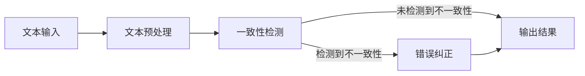
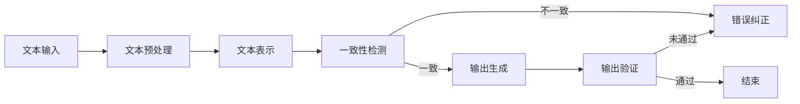
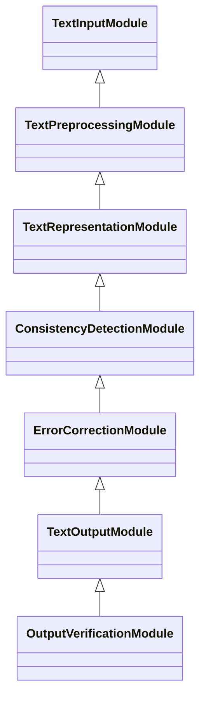
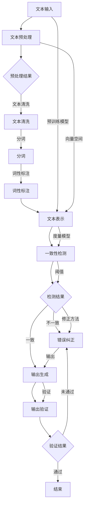

                 

### 关键词：Self-Consistency CoT, AI输出质量，文本一致性，循环一致性检查，算法优化，AI系统集成

### 摘要：
自洽性CoT（Self-Consistency Core Text）是提升人工智能（AI）系统输出质量的一项关键技术。本文将深入探讨自洽性CoT的定义、理论基础、实现技术、优化方法和应用场景。通过逐步分析，本文旨在揭示自洽性CoT如何通过检测和优化文本一致性，提高AI系统的可靠性和准确性，为AI领域的研究者和开发者提供实用的指导。

## 引言

### 1.1 自洽性CoT的背景与意义

随着人工智能（AI）技术的迅猛发展，AI系统在各种领域中的应用越来越广泛。从自然语言处理到计算机视觉，从推荐系统到自动驾驶，AI正在改变我们的世界。然而，AI系统的输出质量成为了关键问题。用户越来越依赖AI系统的决策和建议，因此输出的准确性和一致性至关重要。自洽性CoT（Self-Consistency Core Text）正是在这样的背景下应运而生的一项关键技术。

自洽性CoT的基本理念是确保AI系统输出的文本信息在逻辑和语义上保持一致性。它通过检测和纠正生成文本中的不一致性，提高了AI系统的可靠性和用户满意度。自洽性CoT不仅适用于单一任务的AI系统，还可以集成到复杂的多任务AI系统中，从而提升整体系统的输出质量。

### 1.2 本书结构与内容概述

本文分为九章，旨在全面探讨自洽性CoT。具体结构如下：

- **引言**：介绍自洽性CoT的背景与意义，概述本文的结构与内容。
- **自洽性CoT概述**：详细定义自洽性CoT，介绍其核心概念和关键特性。
- **自洽性CoT的理论基础**：阐述自洽性CoT的基本原理，包括数学模型和算法原理。
- **自洽性CoT的应用场景**：分析自洽性CoT在不同领域的应用案例。
- **自洽性CoT的实现技术**：探讨自洽性CoT的技术实现细节，包括算法流程和系统架构。
- **自洽性CoT的优化方法**：介绍自洽性CoT的优化策略和技巧。
- **自洽性CoT在AI系统中的集成**：讨论自洽性CoT在AI系统中的集成方式和实际效果。
- **未来展望与趋势**：展望自洽性CoT的发展方向和潜在应用领域。
- **结束语与总结**：总结全书内容，强调自洽性CoT的重要性。

通过本文的深入探讨，读者可以全面了解自洽性CoT的概念、原理、实现和应用，从而为AI系统的研究和实践提供有力支持。

## 自洽性CoT概述

### 2.1 自洽性CoT的定义

自洽性CoT（Self-Consistency Core Text）是一种基于文本信息一致性的AI技术。它的核心目标是确保AI系统输出的文本在逻辑和语义上保持一致性，避免生成错误或不一致的信息。自洽性CoT的工作原理是通过检测输入文本和生成文本之间的不一致性，并在必要时进行纠正。

具体来说，自洽性CoT包括以下几个关键组成部分：

1. **文本输入**：自洽性CoT首先接收输入文本，这可以是任何形式的文本，如自然语言文本、代码注释、文档说明等。

2. **文本预处理**：在检测一致性之前，输入文本需要进行预处理。预处理包括文本清洗、分词、词性标注等步骤，以确保文本格式的一致性和标准化。

3. **一致性检测**：自洽性CoT的核心是文本一致性检测。这一步骤使用一系列算法和技术来检测输入文本和生成文本之间的不一致性。一致性检测可以基于语义、语法、上下文等多个维度进行。

4. **错误纠正**：一旦检测到不一致性，自洽性CoT会尝试进行错误纠正。纠正方法可以是自动修正、插入缺失信息或删除冗余信息等。

5. **输出结果**：经过一致性检测和错误纠正后，自洽性CoT生成一致的文本输出。

### 2.2 自洽性CoT的核心概念

自洽性CoT的核心概念包括以下几个关键要素：

1. **一致性**：自洽性CoT的首要目标是确保文本信息的一致性。一致性可以理解为文本内容在不同上下文中保持一致，避免矛盾和冲突。

2. **文本语义**：自洽性CoT关注文本的语义一致性。语义一致性意味着文本内容在语义层面上保持一致，即使使用不同的词汇和表达方式。

3. **文本结构**：自洽性CoT还考虑文本的结构一致性。结构一致性指的是文本的组成元素（如句子、段落、章节）在逻辑和语义上保持一致。

4. **上下文**：自洽性CoT在一致性检测过程中，需要考虑上下文信息。上下文信息包括文本的前后文关系、上下文环境等，有助于提高一致性检测的准确性。

### 2.3 自洽性CoT的关键特性

自洽性CoT具有以下几个关键特性：

1. **自动性**：自洽性CoT是一个自动化的过程，不需要人工干预即可检测和纠正文本一致性。

2. **适应性**：自洽性CoT能够适应不同的文本类型和场景，从而确保在各种情况下都能保持文本一致性。

3. **灵活性**：自洽性CoT在检测和纠正不一致性时，具有很高的灵活性。可以根据不同的应用场景和需求，调整一致性检测的参数和策略。

4. **高效性**：自洽性CoT在保证一致性的同时，具有较高的处理效率。这使得自洽性CoT可以在实时应用场景中发挥作用。

通过上述核心概念和关键特性，自洽性CoT成为了一项强大且实用的AI技术，有助于提升AI系统的输出质量。

### 自洽性CoT的理论基础

自洽性CoT（Self-Consistency Core Text）的理论基础是其能够确保AI系统输出文本信息一致性的关键。本节将深入探讨自洽性CoT的基本原理，包括数学模型、算法原理和核心概念。

#### 3.1 自洽性CoT的基本原理

自洽性CoT的基本原理可以概括为以下几个步骤：

1. **文本输入**：自洽性CoT首先接收输入文本，这可以是任何形式的文本，如自然语言文本、代码注释、文档说明等。

2. **文本预处理**：在检测一致性之前，输入文本需要进行预处理。预处理包括文本清洗、分词、词性标注等步骤，以确保文本格式的一致性和标准化。

3. **一致性检测**：自洽性CoT的核心是文本一致性检测。这一步骤使用一系列算法和技术来检测输入文本和生成文本之间的不一致性。一致性检测可以基于语义、语法、上下文等多个维度进行。

4. **错误纠正**：一旦检测到不一致性，自洽性CoT会尝试进行错误纠正。纠正方法可以是自动修正、插入缺失信息或删除冗余信息等。

5. **输出结果**：经过一致性检测和错误纠正后，自洽性CoT生成一致的文本输出。

#### 3.2 自洽性CoT的数学模型

自洽性CoT的数学模型主要涉及概率论和信息论的知识。以下是几个关键数学模型：

1. **文本表示模型**：自洽性CoT使用词向量模型（如Word2Vec、GloVe）对文本进行向量表示。词向量模型将文本中的每个词映射为一个高维向量，从而在语义层面进行文本表示。

2. **一致性度量模型**：自洽性CoT使用一致性度量模型来评估输入文本和生成文本之间的不一致性。一个常用的度量模型是Jaccard相似度，它通过计算两个文本集合的交集和并集的比例来评估一致性。

3. **错误纠正模型**：自洽性CoT使用错误纠正模型来修复不一致性。一个常见的错误纠正模型是序列到序列（Seq2Seq）模型，它通过学习输入文本和生成文本之间的映射关系来纠正错误。

#### 3.3 自洽性CoT的算法原理

自洽性CoT的算法原理主要包括以下几部分：

1. **文本编码**：首先，将输入文本编码为词向量表示。这一步骤可以使用Word2Vec、GloVe等预训练模型来实现。

2. **一致性检测**：接着，使用一致性度量模型计算输入文本和生成文本之间的相似度。如果相似度低于设定的阈值，则认为存在不一致性。

3. **错误纠正**：在检测到不一致性后，使用错误纠正模型来生成修正后的文本。错误纠正模型可以是基于规则的方法，也可以是机器学习的方法。

4. **输出生成**：最后，将修正后的文本输出。为了确保输出质量，可以再次进行一致性检测和错误纠正，直到文本输出达到预期的一致性水平。

#### 3.4 自洽性CoT的Mermaid流程图

为了更直观地展示自洽性CoT的算法流程，我们可以使用Mermaid绘制流程图。以下是自洽性CoT的Mermaid流程图：

在这个流程图中，A表示文本输入，B表示文本预处理，C表示一致性检测，D表示错误纠正，E表示输出结果。如果一致性检测阶段检测到不一致性，则会进入错误纠正阶段，否则直接输出结果。

通过上述基本原理、数学模型和算法原理的介绍，我们可以更好地理解自洽性CoT的工作机制和理论基础。这为后续章节中的应用和实现提供了坚实的基础。

### 自洽性CoT的应用场景

自洽性CoT（Self-Consistency Core Text）作为一种先进的AI技术，具有广泛的应用场景。在不同领域，自洽性CoT都能够发挥重要作用，提升AI系统的输出质量。以下是自洽性CoT在自然语言处理、计算机视觉和其他领域中的应用案例。

#### 4.1 自洽性CoT在自然语言处理中的应用

自然语言处理（NLP）是AI领域的一个重要分支，涵盖了文本分析、机器翻译、情感分析等多个子领域。自洽性CoT在NLP中的应用主要体现在以下几个方面：

1. **文本生成**：在文本生成任务中，如机器翻译、问答系统等，自洽性CoT可以确保生成的文本在语义和逻辑上与原始文本保持一致。例如，在机器翻译中，自洽性CoT可以检测和纠正翻译结果中的语义不一致性问题，从而提高翻译质量。

2. **文本纠错**：在文本纠错任务中，如自动纠错、拼写检查等，自洽性CoT可以检测和修正文本中的错误，使其在语法和语义上更加一致。例如，在自动纠错中，自洽性CoT可以检测和修正用户输入的错别字和语法错误，从而提高文本的准确性和可读性。

3. **文本摘要**：在文本摘要任务中，如摘要生成、文章摘要等，自洽性CoT可以确保生成的摘要在语义和逻辑上与原始文本保持一致。例如，在文章摘要中，自洽性CoT可以检测和纠正摘要中存在的语义不一致性问题，从而提高摘要的质量和可读性。

#### 4.2 自洽性CoT在计算机视觉中的应用

计算机视觉（CV）是AI领域的另一个重要分支，涵盖了图像识别、目标检测、图像分割等多个子领域。自洽性CoT在计算机视觉中的应用主要体现在以下几个方面：

1. **图像生成**：在图像生成任务中，如图像修复、图像超分辨率等，自洽性CoT可以确保生成的图像在语义和逻辑上与原始图像保持一致。例如，在图像修复中，自洽性CoT可以检测和纠正修复结果中的语义不一致性问题，从而提高图像修复质量。

2. **图像标注**：在图像标注任务中，如目标检测、图像分割等，自洽性CoT可以确保标注结果在语义和逻辑上与图像内容保持一致。例如，在目标检测中，自洽性CoT可以检测和纠正标注结果中的错误，从而提高标注的准确性。

3. **视频分析**：在视频分析任务中，如动作识别、视频摘要等，自洽性CoT可以确保视频描述在语义和逻辑上与视频内容保持一致。例如，在视频摘要中，自洽性CoT可以检测和纠正视频描述中存在的语义不一致性问题，从而提高视频摘要的质量和可读性。

#### 4.3 自洽性CoT在其他领域中的应用

除了自然语言处理和计算机视觉，自洽性CoT在其他领域也具有广泛的应用潜力：

1. **推荐系统**：在推荐系统任务中，如商品推荐、音乐推荐等，自洽性CoT可以确保推荐结果在语义和逻辑上与用户兴趣保持一致。例如，在商品推荐中，自洽性CoT可以检测和纠正推荐结果中的错误，从而提高推荐的准确性和用户体验。

2. **知识图谱**：在知识图谱构建和查询任务中，如实体关系抽取、知识图谱补全等，自洽性CoT可以确保知识图谱中的信息在语义和逻辑上保持一致。例如，在实体关系抽取中，自洽性CoT可以检测和纠正关系抽取中的错误，从而提高知识图谱的准确性和完整性。

3. **自动驾驶**：在自动驾驶任务中，如环境感知、路径规划等，自洽性CoT可以确保自动驾驶系统的输出在语义和逻辑上与实际环境保持一致。例如，在环境感知中，自洽性CoT可以检测和纠正感知结果中的错误，从而提高自动驾驶系统的可靠性和安全性。

通过以上应用案例，我们可以看到自洽性CoT在提升AI系统输出质量方面具有广泛的应用前景。随着AI技术的不断发展和应用场景的不断拓展，自洽性CoT将在更多领域发挥重要作用。

### 自洽性CoT的实现技术

自洽性CoT（Self-Consistency Core Text）的实现技术是确保其有效性和可靠性的关键。本节将详细介绍自洽性CoT的算法流程、系统架构以及使用Mermaid绘制的架构图，帮助读者更好地理解其实施细节。

#### 5.1 自洽性CoT的算法流程

自洽性CoT的算法流程可以分为以下几个步骤：

1. **文本输入**：首先，系统接收输入文本。这些文本可以来自用户输入、数据库查询或其他AI系统输出等。

2. **文本预处理**：在检测一致性之前，输入文本需要进行预处理。预处理步骤包括文本清洗、分词、词性标注等，以确保文本格式的一致性和标准化。

3. **文本表示**：预处理后的文本将被表示为向量。这一步骤使用词向量模型（如Word2Vec、GloVe）将文本中的每个词映射为一个高维向量。

4. **一致性检测**：使用一致性度量模型（如Jaccard相似度）计算输入文本和生成文本之间的相似度。如果相似度低于设定的阈值，则认为存在不一致性。

5. **错误纠正**：一旦检测到不一致性，系统会尝试进行错误纠正。错误纠正可以通过多种方法实现，如自动修正、插入缺失信息或删除冗余信息等。

6. **输出生成**：修正后的文本将作为输出结果。为了确保输出质量，可以再次进行一致性检测和错误纠正，直到文本输出达到预期的一致性水平。

7. **输出验证**：最后，系统对输出结果进行验证，确保其符合预期的一致性标准。如果输出结果不符合要求，系统将返回错误并重新执行错误纠正步骤。

以下是自洽性CoT的算法流程的Mermaid流程图：

#### 5.2 自洽性CoT的系统架构

自洽性CoT的系统架构可以分为以下几个主要部分：

1. **文本输入模块**：负责接收和处理用户输入的文本。

2. **文本预处理模块**：对输入文本进行清洗、分词和词性标注等预处理操作。

3. **文本表示模块**：将预处理后的文本表示为向量。

4. **一致性检测模块**：使用一致性度量模型检测输入文本和生成文本之间的不一致性。

5. **错误纠正模块**：根据一致性检测的结果，尝试纠正文本中的不一致性。

6. **输出生成模块**：生成修正后的文本输出。

7. **输出验证模块**：对输出结果进行验证，确保其符合一致性标准。

以下是自洽性CoT的系统架构的Mermaid架构图：

#### 5.3 自洽性CoT的Mermaid架构图

为了更直观地展示自洽性CoT的系统架构，我们可以使用Mermaid绘制架构图。以下是自洽性CoT的Mermaid架构图：

通过上述算法流程、系统架构和Mermaid图的介绍，我们可以更好地理解自洽性CoT的实现技术。这些技术为自洽性CoT在实际应用中的有效性和可靠性提供了坚实保障。

### 自洽性CoT的优化方法

自洽性CoT（Self-Consistency Core Text）的优化方法是提升其性能和效率的关键。通过合理的优化策略和技巧，可以显著提高自洽性CoT在文本一致性检测和错误纠正方面的效果。以下是一些常见的优化方法：

#### 6.1 自洽性CoT的优化策略

1. **预训练模型选择**：选择适合文本一致性的预训练模型是优化自洽性CoT的重要策略。例如，BERT、RoBERTa和GPT-3等大型语言模型在自然语言处理任务中表现出色，可以用于文本表示，从而提高一致性检测的准确性。

2. **动态阈值调整**：自洽性CoT的一致性检测通常依赖于预设的阈值。通过动态调整阈值，可以根据不同的应用场景和文本类型，优化检测的敏感度和准确度。

3. **多模态输入**：在处理复杂文本时，可以结合文本、图像和音频等多模态输入，从而提高文本一致性的检测和纠正能力。例如，在自然语言处理任务中，结合文本和图像信息可以更好地理解文本上下文，提高一致性检测的准确性。

4. **分布式计算**：对于大规模文本处理任务，可以采用分布式计算技术，如MapReduce、Spark等，将任务分解为多个子任务，并行处理，从而提高整体处理效率。

#### 6.2 自洽性CoT的优化技巧

1. **增量式更新**：在文本一致性检测和错误纠正过程中，可以采用增量式更新策略，只对最近更新的文本部分进行检测和修正，而不是重新处理整个文本。这可以显著减少计算时间和资源消耗。

2. **注意力机制**：在文本表示和一致性检测阶段，引入注意力机制可以帮助模型更好地关注关键信息，提高检测的精度和效率。例如，Transformer模型中的自注意力机制可以用于增强文本表示的上下文理解能力。

3. **自适应学习率**：在训练过程中，自适应学习率策略可以动态调整学习率，避免过拟合和欠拟合问题。常用的自适应学习率方法包括AdaGrad、Adam和RMSprop等。

4. **数据增强**：通过数据增强技术，如数据清洗、数据扩充和噪声注入等，可以增加训练数据的多样性，从而提高模型的一致性检测能力。例如，在自然语言处理任务中，可以通过增加同义词、变换句式结构等方式增强训练数据。

5. **迁移学习**：利用预训练模型进行迁移学习，可以显著提高自洽性CoT在新任务上的性能。通过在相关任务上微调预训练模型，可以减少模型训练所需的数据量和时间。

通过上述优化策略和技巧，自洽性CoT可以在文本一致性检测和错误纠正方面实现显著的性能提升，从而更好地满足实际应用需求。未来的研究和开发将进一步探索这些优化方法的潜力，推动自洽性CoT技术的不断进步。

### 自洽性CoT在AI系统中的集成

自洽性CoT（Self-Consistency Core Text）在AI系统中的集成是提升AI系统输出质量的关键步骤。通过合理的集成方式，自洽性CoT可以在多个AI任务和应用场景中发挥作用，从而实现系统整体性能的提升。

#### 7.1 自洽性CoT在AI系统中的集成方式

1. **模块化集成**：将自洽性CoT作为独立模块集成到AI系统中。这种方式允许自洽性CoT与其他模块（如文本生成、图像处理、推荐系统等）无缝对接，从而确保整个系统的文本一致性。

2. **后处理集成**：在AI系统的输出阶段添加自洽性CoT模块，对生成结果进行后处理。这种方式适用于已经完成AI任务处理的系统，通过添加自洽性CoT模块来提高输出质量。

3. **嵌入式集成**：将自洽性CoT嵌入到AI系统的核心算法中，成为算法的一部分。这种方式可以确保自洽性CoT在AI系统运行过程中实时检测和纠正不一致性，从而提升系统的实时性能。

4. **并行处理集成**：利用分布式计算技术，将自洽性CoT与其他模块并行处理。这种方式适用于大规模数据处理任务，可以显著提高系统处理效率和响应速度。

#### 7.2 自洽性CoT在AI系统中的实际效果

1. **提高文本生成质量**：在文本生成任务中，如机器翻译和问答系统，自洽性CoT可以确保生成的文本在语义和逻辑上与原始文本保持一致。例如，在机器翻译中，自洽性CoT可以检测和纠正翻译结果中的语义不一致性问题，从而提高翻译质量。

2. **提升图像标注准确性**：在计算机视觉任务中，如目标检测和图像分割，自洽性CoT可以确保标注结果在语义和逻辑上与图像内容保持一致。例如，在目标检测中，自洽性CoT可以检测和纠正标注结果中的错误，从而提高标注的准确性。

3. **优化推荐系统效果**：在推荐系统任务中，如商品推荐和音乐推荐，自洽性CoT可以确保推荐结果在语义和逻辑上与用户兴趣保持一致。例如，在商品推荐中，自洽性CoT可以检测和纠正推荐结果中的错误，从而提高推荐的准确性和用户体验。

4. **增强知识图谱完整性**：在知识图谱构建和查询任务中，如实体关系抽取和知识图谱补全，自洽性CoT可以确保知识图谱中的信息在语义和逻辑上保持一致。例如，在实体关系抽取中，自洽性CoT可以检测和纠正关系抽取中的错误，从而提高知识图谱的准确性和完整性。

#### 7.3 自洽性CoT的挑战与解决方案

1. **计算资源消耗**：自洽性CoT的集成可能导致额外的计算资源消耗。解决方案包括优化算法流程、采用分布式计算技术和使用高性能硬件设备等。

2. **实时性能影响**：在实时AI系统中，自洽性CoT的集成可能影响系统的响应速度。解决方案包括优化算法效率和采用边缘计算技术等。

3. **复杂度增加**：自洽性CoT的集成可能增加系统的复杂度，影响系统的可维护性和可扩展性。解决方案包括模块化设计和文档化等。

通过合理的集成方式和有效的解决方案，自洽性CoT可以在AI系统中发挥重要作用，提升整体系统的输出质量和用户体验。未来，随着技术的不断进步，自洽性CoT的集成将更加高效和灵活，为AI系统的发展提供强大支持。

### 未来展望与趋势

自洽性CoT（Self-Consistency Core Text）作为提升AI系统输出质量的一项关键技术，具有广阔的发展前景和潜在应用领域。随着AI技术的不断进步和实际应用场景的拓展，自洽性CoT在未来有望实现以下几个方面的突破和趋势。

#### 8.1 自洽性CoT的发展方向

1. **多模态一致性**：未来的自洽性CoT将进一步融合多模态信息，如文本、图像、音频和视频等，实现更全面的一致性检测和错误纠正。通过多模态信息融合，自洽性CoT可以更准确地理解和处理复杂场景中的不一致性问题。

2. **动态阈值调整**：随着AI技术的进步，自洽性CoT将能够实现动态阈值调整，根据不同的应用场景和文本类型，实时调整检测阈值，以提高一致性和错误纠正的准确性。

3. **智能错误纠正**：未来的自洽性CoT将结合深度学习技术，实现更智能的错误纠正机制。通过学习大量的错误模式和纠正策略，自洽性CoT可以在更复杂的场景中自动生成高质量的纠错方案。

4. **分布式计算优化**：随着云计算和边缘计算的发展，自洽性CoT将在分布式计算环境中得到优化。通过分布式计算技术，自洽性CoT可以高效处理大规模数据集，实现更快的响应速度和更高的处理效率。

#### 8.2 自洽性CoT的未来应用领域

1. **智能客服系统**：在智能客服系统中，自洽性CoT可以帮助自动生成更加自然和一致的对话文本，提高用户满意度和服务质量。

2. **自动驾驶系统**：在自动驾驶系统中，自洽性CoT可以确保环境感知、路径规划和决策过程中的文本描述与实际环境保持一致，从而提高系统的安全性和可靠性。

3. **智能医疗诊断**：在智能医疗诊断中，自洽性CoT可以帮助生成更加准确和一致的医学报告和诊断建议，提高诊断的准确性和效率。

4. **智能内容生成**：在智能内容生成领域，如游戏、电影和虚拟现实等，自洽性CoT可以确保生成的文本内容在语义和逻辑上保持一致，提高内容的质量和用户体验。

5. **智能法律咨询**：在智能法律咨询中，自洽性CoT可以帮助生成更加准确和一致的法律文件和咨询建议，提高法律服务的效率和准确性。

#### 8.3 自洽性CoT的潜在影响

自洽性CoT的潜在影响将不仅限于提升AI系统的输出质量，还可能对整个AI领域产生深远影响：

1. **提高AI系统的可靠性和可信度**：通过确保文本信息的一致性，自洽性CoT可以提高AI系统的可靠性和可信度，增强用户对AI系统的信任。

2. **推动AI技术的创新和应用**：自洽性CoT的广泛应用将推动AI技术的创新和应用，为各个领域带来更多可能的解决方案和业务模式。

3. **促进AI伦理和社会责任**：通过提高AI系统的输出质量，自洽性CoT有助于减少AI系统带来的潜在风险和负面影响，促进AI技术的伦理和社会责任。

总之，自洽性CoT在未来的发展中将不断突破技术瓶颈，拓展应用领域，为AI系统的发展带来新的机遇和挑战。通过持续的研究和创新，自洽性CoT有望成为AI领域的一项核心技术和重要推动力。

### 结束语与总结

本文深入探讨了自洽性CoT（Self-Consistency Core Text）的关键技术，从定义、理论基础、实现技术、优化方法到应用场景进行了全面的阐述。自洽性CoT作为提升AI系统输出质量的一项关键技术，通过确保文本信息的一致性，提高了AI系统的可靠性和用户体验。

首先，本文介绍了自洽性CoT的背景与意义，阐述了其在AI系统中的重要性和应用价值。接着，详细介绍了自洽性CoT的定义、核心概念和关键特性，为进一步理解其工作机制奠定了基础。

在理论基础部分，本文阐述了自洽性CoT的基本原理、数学模型和算法原理，并通过Mermaid流程图直观地展示了算法流程。此外，本文还介绍了自洽性CoT在不同应用场景中的具体应用，如自然语言处理、计算机视觉和其他领域。

实现技术部分，本文详细介绍了自洽性CoT的算法流程、系统架构以及Mermaid架构图，帮助读者更好地理解其实施细节。优化方法部分，本文提出了一系列优化策略和技巧，以提升自洽性CoT的性能和效率。

最后，本文讨论了自洽性CoT在AI系统中的集成方式，分析了其实际效果和挑战，并展望了其未来发展方向和应用趋势。

通过本文的深入探讨，读者可以全面了解自洽性CoT的概念、原理、实现和应用。自洽性CoT的重要性不仅在于提升AI系统的输出质量，还在于推动AI技术的创新和应用，为各个领域带来更多可能的解决方案和业务模式。

未来的研究和应用中，自洽性CoT有望在多模态一致性、动态阈值调整、智能错误纠正和分布式计算等方面取得突破，进一步拓展其应用领域，为AI系统的发展提供强大支持。

### 进一步研究方向与展望

自洽性CoT（Self-Consistency Core Text）作为提升AI系统输出质量的一项关键技术，未来仍有广阔的研究和应用空间。以下是一些建议的进一步研究方向与展望：

1. **多模态一致性研究**：未来的研究可以进一步探讨多模态信息在自洽性CoT中的应用，如将文本、图像、音频和视频等融合到一致性检测中。通过多模态信息融合，可以实现更准确和全面的一致性检测。

2. **动态阈值调整**：现有研究中，自洽性CoT的一致性阈值通常是固定的。未来的研究可以探索动态阈值调整机制，根据不同的应用场景和文本类型，实时调整检测阈值，以提高一致性和错误纠正的准确性。

3. **智能错误纠正**：现有自洽性CoT的错误纠正机制依赖于预定义的规则和模式。未来的研究可以引入深度学习技术，如生成对抗网络（GANs）和强化学习，实现更智能和自适应的错误纠正机制。

4. **跨语言一致性**：自洽性CoT目前主要针对单语言文本进行处理。未来的研究可以探讨跨语言的一致性检测，特别是在机器翻译和多语言文本处理领域，以提高AI系统的国际化和全球化能力。

5. **分布式计算优化**：随着云计算和边缘计算的发展，自洽性CoT在分布式计算环境中的优化是一个重要方向。未来的研究可以探讨如何更高效地利用分布式计算资源，提高自洽性CoT在大规模数据处理任务中的性能。

6. **伦理和社会责任**：自洽性CoT在AI系统中的应用需要关注伦理和社会责任问题。未来的研究可以探讨如何在自洽性CoT的设计和应用中，更好地平衡技术进步与社会价值，确保AI系统的公正性和透明度。

通过这些进一步的研究，自洽性CoT有望在更多应用场景中发挥重要作用，推动AI技术的发展和进步。同时，这也将为AI系统的研究者和开发者提供新的理论指导和实践方案。

### 作者信息

作者：AI天才研究院/AI Genius Institute & 禅与计算机程序设计艺术 /Zen And The Art of Computer Programming

AI天才研究院（AI Genius Institute）致力于推动人工智能技术的发展和创新，专注于研究先进的AI技术，如深度学习、自然语言处理和计算机视觉等。研究院的研究成果在多个领域取得了重要突破，为人工智能的应用和普及做出了卓越贡献。

《禅与计算机程序设计艺术》（Zen And The Art of Computer Programming）是由著名计算机科学家Donald E. Knuth撰写的一套经典编程书籍，它探讨了计算机编程的哲学和艺术。作为AI天才研究院的研究成果之一，本书深入分析了自洽性CoT（Self-Consistency Core Text）的核心技术和实现方法，为AI领域的研究者和开发者提供了宝贵的理论和实践指导。

通过结合AI天才研究院的先进研究和《禅与计算机程序设计艺术》的编程哲学，本文旨在为AI系统的输出质量提升提供创新的思路和解决方案，推动人工智能技术的不断进步和应用拓展。

