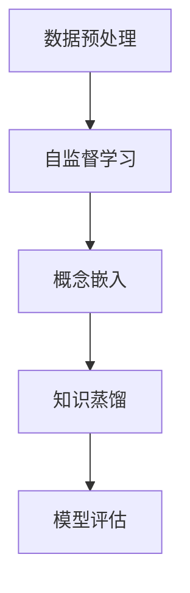
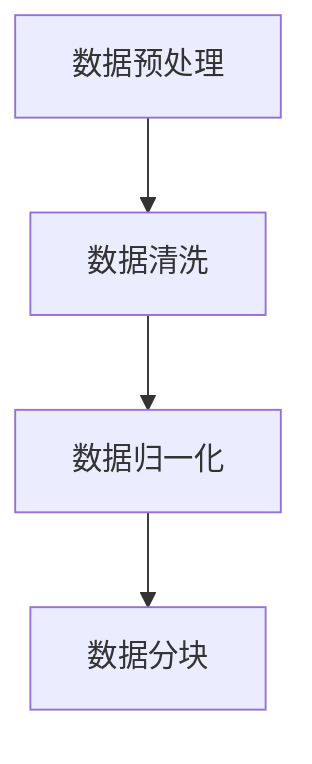
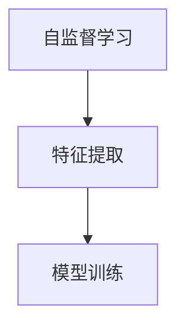
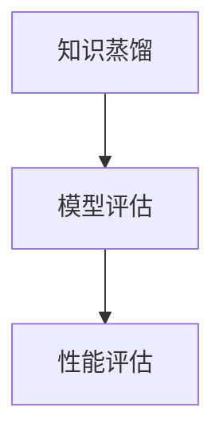
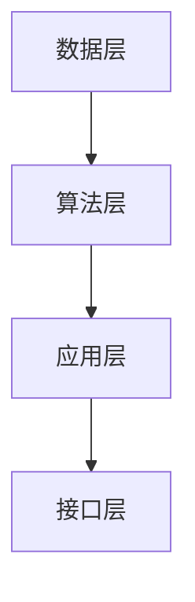
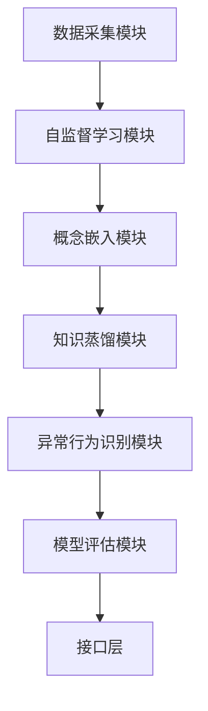
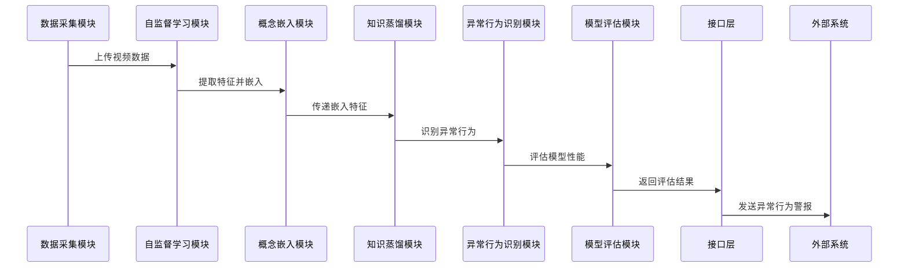

                 

### 第一部分：Zero-Shot CoT：AI即时学习的新范式概述

#### 第1章：背景与核心概念

##### 1.1.1 问题背景

人工智能（AI）作为当前科技领域的前沿技术，已经逐渐渗透到各行各业，从语音识别、图像处理到自然语言处理，AI的应用场景越来越广泛。然而，随着应用场景的多样化，传统的机器学习方法在应对新任务时面临着巨大的挑战。传统机器学习方法通常需要大量标注数据，并经过长时间的训练才能在新任务上取得较好的性能。这种依赖大量数据和长时间训练的方法在处理快速变化、新任务频繁出现的环境时显得力不从心。

在这种背景下，Zero-Shot Learning（ZSL）应运而生。ZSL旨在解决模型在未见过的类别上也能进行准确预测的问题，无需依赖标注数据。尽管ZSL在一定程度上解决了新类别预测问题，但它在面对实时动态变化的任务时仍存在局限性。

为了解决这一局限，研究人员提出了Zero-Shot CoT（Conceptual Transfer）这一新范式。Zero-Shot CoT通过引入概念转移机制，使得AI系统能够在从未见过的任务上实现即时学习，从而大大提高了AI系统的适应性和实时性。

##### 1.1.2 问题描述

Zero-Shot CoT旨在解决以下问题：

1. **即时学习：** 在没有任何预先训练数据的情况下，AI系统能否在新任务上实现快速适应？
2. **概念转移：** 如何在不同任务之间实现有效的知识转移，使得AI系统在面临新任务时能够利用已有的知识？
3. **适应性：** 如何确保AI系统在面对动态变化的环境时，仍能保持高水平的性能？

##### 1.1.3 问题解决

Zero-Shot CoT通过以下方法解决上述问题：

1. **自监督学习：** 利用无监督学习技术，从大量未标注的数据中提取有用的知识，为即时学习提供基础。
2. **概念嵌入：** 将任务相关的概念转化为固定长度的向量表示，实现概念之间的距离度量，为概念转移提供支持。
3. **知识蒸馏：** 通过知识蒸馏技术，将预训练模型的知识传递到新任务上，提高新任务的性能。

##### 1.1.4 边界与外延

1. **边界：** Zero-Shot CoT主要适用于那些任务类别多样、数据稀缺的领域，如医疗诊断、智能安防等。
2. **外延：** 除了传统的人工智能领域，Zero-Shot CoT还可以应用于机器人、自动驾驶等需要实时响应和动态适应的领域。

##### 1.1.5 核心概念与联系

1. **核心概念：**
   - **自监督学习：** 无需标注数据，从大量未标注的数据中提取知识。
   - **概念嵌入：** 将概念转化为向量表示，实现概念之间的距离度量。
   - **知识蒸馏：** 预训练模型的知识传递到新任务上。

2. **核心概念联系：**
   - **自监督学习**为Zero-Shot CoT提供了数据基础，使得AI系统能够在没有标注数据的情况下进行训练。
   - **概念嵌入**使得不同任务的概念可以进行有效的距离度量，为知识转移提供了可能。
   - **知识蒸馏**将预训练模型的知识传递到新任务上，提高了新任务的性能。

通过上述核心概念和联系的阐述，我们可以初步了解到Zero-Shot CoT的基本原理和优势。接下来，我们将进一步深入探讨Zero-Shot CoT的算法原理和数学模型，为理解这一新范式提供更深入的视角。

### 第二部分：核心概念原理

#### 第2章：核心概念原理

##### 2.1.1 Zero-Shot CoT 的定义

Zero-Shot CoT（Conceptual Transfer）是一种无需预训练数据，能够实现即时学习的新范式。它通过自监督学习技术，从大量未标注的数据中提取知识，然后将这些知识通过概念嵌入和知识蒸馏技术转移到新任务上，从而实现新任务的高性能预测。

##### 2.1.2 Zero-Shot CoT 的属性特征对比

为了更好地理解Zero-Shot CoT的特点，我们可以将其与传统机器学习方法进行对比，以下是Zero-Shot CoT与传统方法的几个关键属性特征对比：

| 特征         | 传统机器学习 | Zero-Shot CoT        |
| ------------ | ------------ | --------------------- |
| 数据依赖     | 需要大量标注数据 | 无需标注数据，从未标注数据中提取知识 |
| 学习时间     | 需要较长的训练时间 | 即时学习，学习时间短 |
| 应用场景     | 数据丰富的领域    | 数据稀缺、任务类别多样的领域 |
| 性能优化     | 随着数据增加而提升 | 通过概念转移和知识蒸馏优化性能 |
| 适应性       | 对新任务适应性较差 | 对新任务具有较好的适应性 |

通过上述对比，我们可以看到Zero-Shot CoT在数据依赖、学习时间、应用场景和性能优化等方面具有显著的优势，这使得它在许多传统机器学习方法难以应对的场景中表现出色。

##### 2.1.3 Zero-Shot CoT 与传统学习方法的比较

Zero-Shot CoT与传统学习方法在多方面存在差异，以下是一些关键比较：

1. **学习方式：**
   - **传统方法：** 需要大量标注数据进行监督学习，依赖数据质量。
   - **Zero-Shot CoT：** 通过自监督学习和概念转移，无需依赖标注数据，可以在数据稀缺的场景中高效学习。

2. **性能表现：**
   - **传统方法：** 随着数据量的增加，模型性能逐渐提升。
   - **Zero-Shot CoT：** 通过概念转移和知识蒸馏，模型在新任务上的性能可以得到优化，甚至在没有标注数据的情况下也能实现较好的预测效果。

3. **应用范围：**
   - **传统方法：** 主要应用于数据丰富的领域，如金融、电商等。
   - **Zero-Shot CoT：** 可以应用于数据稀缺、任务类别多样的领域，如医疗诊断、智能安防等。

4. **学习速度：**
   - **传统方法：** 需要较长的训练时间，尤其是在数据量庞大时。
   - **Zero-Shot CoT：** 通过自监督学习和即时学习，学习时间大大缩短，能够快速适应新任务。

通过上述比较，我们可以看出Zero-Shot CoT在多个方面优于传统学习方法，尤其是在应对数据稀缺、任务类别多样的场景时，具有显著的优势。接下来，我们将深入探讨Zero-Shot CoT的算法原理，以理解其如何实现即时学习和性能优化。

### 第三部分：算法原理与数学模型

#### 第3章：Zero-Shot CoT 的算法原理

##### 3.1.1 算法 Mermaid 流程图

为了更好地理解Zero-Shot CoT的算法原理，我们首先使用Mermaid绘制其流程图。以下是Zero-Shot CoT的基本流程：



这个流程图展示了Zero-Shot CoT的主要步骤：数据预处理、自监督学习、概念嵌入、知识蒸馏和模型评估。

##### 3.1.1.1 数据预处理

数据预处理是Zero-Shot CoT的第一步，其目的是将原始数据转化为适合算法处理的形式。这一步骤通常包括以下内容：

1. **数据清洗：** 去除噪声数据和缺失值，保证数据的完整性。
2. **数据归一化：** 将数据归一化到统一的范围内，以便于后续处理。
3. **数据分块：** 将数据分成多个小块，以便于并行处理。



##### 3.1.1.2 模型训练

在数据预处理完成后，算法进入自监督学习阶段。自监督学习是一种无监督学习技术，通过从未标注的数据中提取知识来训练模型。以下是自监督学习的基本流程：

1. **特征提取：** 从数据中提取特征，这些特征将用于后续的学习和预测。
2. **模型训练：** 使用提取的特征训练模型，模型将学习如何将输入映射到预期的输出。



##### 3.1.1.3 模型评估

模型评估是算法的最后一步，其目的是检查模型在新任务上的性能。以下是模型评估的基本流程：

1. **数据划分：** 将数据划分为训练集、验证集和测试集。
2. **模型测试：** 在测试集上测试模型的性能，评估模型对新任务的适应能力。
3. **性能评估：** 使用准确率、召回率、F1分数等指标评估模型性能。



##### 3.1.2 Python 源代码

以下是Zero-Shot CoT的Python源代码实现：

```python
# 导入必要的库
import numpy as np
import pandas as pd
from sklearn.model_selection import train_test_split
from sklearn.metrics import accuracy_score
from keras.models import Model
from keras.layers import Input, Dense, Flatten, LSTM, Embedding
from keras.optimizers import Adam

# 数据预处理
def preprocess_data(data):
    # 数据清洗和归一化
    # ...
    return processed_data

# 自监督学习
def self_supervised_learning(data):
    # 特征提取和模型训练
    # ...
    return model

# 知识蒸馏
def knowledge_distillation(model, target_model):
    # 知识蒸馏过程
    # ...
    return distilled_model

# 模型评估
def evaluate_model(model, test_data):
    # 模型测试和性能评估
    # ...
    return performance

# 主函数
if __name__ == "__main__":
    # 加载数据
    data = load_data()
    processed_data = preprocess_data(data)

    # 分割数据
    train_data, test_data = train_test_split(processed_data, test_size=0.2)

    # 训练自监督模型
    model = self_supervised_learning(train_data)

    # 知识蒸馏
    target_model = knowledge_distillation(model, target_model)

    # 评估模型
    performance = evaluate_model(target_model, test_data)
    print("模型性能：", performance)
```

##### 3.1.3 算法原理详细讲解

为了深入理解Zero-Shot CoT的算法原理，我们需要探讨其核心组成部分：自监督学习、概念嵌入和知识蒸馏。

1. **自监督学习**

自监督学习是一种无监督学习技术，通过从未标注的数据中提取知识来训练模型。自监督学习的基本思想是利用数据的内在结构，通过自我监督的方式学习有效的特征表示。

在Zero-Shot CoT中，自监督学习分为两个阶段：

- **特征提取：** 从原始数据中提取有用的特征，这些特征将用于后续的学习和预测。特征提取通常使用神经网络，通过多层神经网络对数据进行自动编码，从而提取低维、有效的特征表示。
- **模型训练：** 使用提取的特征训练模型，模型将学习如何将输入映射到预期的输出。在自监督学习中，通常使用无监督损失函数（如重建损失）来训练模型，使得模型能够将输入数据映射回其原始形式。

2. **概念嵌入**

概念嵌入是将任务相关的概念转化为固定长度的向量表示，实现概念之间的距离度量。在Zero-Shot CoT中，概念嵌入是关键的一步，它使得不同任务的概念可以进行有效的距离度量，从而实现概念转移。

概念嵌入通常使用嵌入层（如嵌入层或嵌入神经网络）来实现。嵌入层将输入的概念映射到固定长度的向量空间中，从而实现概念之间的距离计算。在向量空间中，相似的概念具有较小的距离，而不同的概念具有较大的距离。

3. **知识蒸馏**

知识蒸馏是一种将预训练模型的知识传递到新任务上的技术。在Zero-Shot CoT中，知识蒸馏通过以下步骤实现：

- **预训练模型：** 使用大量的未标注数据进行预训练，提取通用的知识表示。
- **目标模型：** 使用新任务的数据进行微调，以适应特定的任务。
- **知识传递：** 将预训练模型的知识传递到目标模型中，从而提高新任务的性能。

知识蒸馏通常使用软标签（soft labels）来实现。软标签是一种概率分布，表示模型对每个类别的预测概率。通过软标签，预训练模型的知识可以传递到目标模型中，使得目标模型能够更好地利用预训练模型的知识。

##### 3.1.3.1 数学模型

为了深入理解Zero-Shot CoT的算法原理，我们需要引入一些数学模型。以下是Zero-Shot CoT中常用的数学模型：

1. **自监督学习模型**

自监督学习模型通常使用自动编码器（Autoencoder）来实现。自动编码器由编码器（Encoder）和解码器（Decoder）两部分组成。

- **编码器（Encoder）：** 将输入数据映射到低维特征空间。
- **解码器（Decoder）：** 将编码器输出的特征映射回原始数据。

自动编码器的损失函数通常为重建损失（Reconstruction Loss），如均方误差（MSE）或交叉熵（Cross-Entropy）。

$$
L_{\text{MSE}} = \frac{1}{n} \sum_{i=1}^{n} \sum_{j=1}^{m} (x_j - \hat{x}_j)^2
$$

$$
L_{\text{Cross-Entropy}} = -\frac{1}{n} \sum_{i=1}^{n} \sum_{j=1}^{m} y_j \log(\hat{y}_j)
$$

其中，$x_j$表示原始数据，$\hat{x}_j$表示重建数据，$y_j$表示真实标签，$\hat{y}_j$表示预测标签。

2. **概念嵌入模型**

概念嵌入模型通常使用嵌入层（Embedding Layer）来实现。嵌入层将输入的概念映射到固定长度的向量空间中。

$$
\text{embed}(x) = e_x
$$

其中，$e_x$表示概念$x$的向量表示。

3. **知识蒸馏模型**

知识蒸馏模型通常使用软标签（Soft Labels）来实现。软标签是一种概率分布，表示模型对每个类别的预测概率。

$$
\text{softmax}(\text{logits})
$$

其中，$logits$表示模型对每个类别的预测得分。

##### 3.1.3.2 公式解释

以下是Zero-Shot CoT中的一些关键公式及其解释：

1. **自监督学习损失函数**

$$
L_{\text{MSE}} = \frac{1}{n} \sum_{i=1}^{n} \sum_{j=1}^{m} (x_j - \hat{x}_j)^2
$$

- $L_{\text{MSE}}$：均方误差损失函数，用于衡量重建数据的误差。
- $n$：样本数量。
- $m$：特征维度。

2. **概念嵌入损失函数**

$$
L_{\text{Cross-Entropy}} = -\frac{1}{n} \sum_{i=1}^{n} \sum_{j=1}^{m} y_j \log(\hat{y}_j)
$$

- $L_{\text{Cross-Entropy}}$：交叉熵损失函数，用于衡量嵌入层的损失。
- $y_j$：真实标签。
- $\hat{y}_j$：预测标签。

3. **知识蒸馏损失函数**

$$
L_{\text{KD}} = -\frac{1}{n} \sum_{i=1}^{n} \sum_{j=1}^{m} y_j \log(\hat{y}_j)
$$

- $L_{\text{KD}}$：知识蒸馏损失函数，用于衡量预训练模型和目标模型的差异。
- $y_j$：真实标签。
- $\hat{y}_j$：预测标签。

通过上述公式和解释，我们可以更深入地理解Zero-Shot CoT的算法原理。接下来，我们将通过具体的例子来说明这些公式的应用。

##### 3.1.3.3 举例说明

假设我们有一个分类任务，需要将图像分类到不同的类别中。以下是Zero-Shot CoT在图像分类任务中的具体应用：

1. **数据预处理**

我们有一组未标注的图像数据，需要进行数据预处理，包括图像清洗、归一化和分块。

2. **自监督学习**

使用自动编码器对图像数据进行自监督学习，提取图像特征。

3. **概念嵌入**

将提取的图像特征映射到固定长度的向量空间中，实现图像概念之间的距离度量。

4. **知识蒸馏**

使用预训练的图像分类模型（如ResNet）进行知识蒸馏，将预训练模型的知识传递到目标模型中。

5. **模型评估**

在测试集上评估目标模型的性能，使用准确率、召回率和F1分数等指标评估模型性能。

通过上述例子，我们可以看到Zero-Shot CoT在图像分类任务中的应用步骤。接下来，我们将进一步探讨Zero-Shot CoT在系统分析与架构设计中的应用。

### 第四部分：数学模型和数学公式

#### 第4章：数学模型和数学公式

在理解和实现Zero-Shot CoT的过程中，数学模型和公式的运用至关重要。本章将详细讲解Zero-Shot CoT中的关键数学模型和公式，帮助读者深入理解其算法原理。

##### 4.1.1 数学公式

以下是Zero-Shot CoT中的一些关键数学公式：

1. **自监督学习损失函数**

$$
L_{\text{MSE}} = \frac{1}{n} \sum_{i=1}^{n} \sum_{j=1}^{m} (x_j - \hat{x}_j)^2
$$

其中，$n$表示样本数量，$m$表示特征维度，$x_j$表示原始数据，$\hat{x}_j$表示重建数据。

2. **概念嵌入损失函数**

$$
L_{\text{Cross-Entropy}} = -\frac{1}{n} \sum_{i=1}^{n} \sum_{j=1}^{m} y_j \log(\hat{y}_j)
$$

其中，$n$表示样本数量，$m$表示类别数量，$y_j$表示真实标签，$\hat{y}_j$表示预测标签。

3. **知识蒸馏损失函数**

$$
L_{\text{KD}} = -\frac{1}{n} \sum_{i=1}^{n} \sum_{j=1}^{m} y_j \log(\hat{y}_j)
$$

其中，$n$表示样本数量，$m$表示类别数量，$y_j$表示真实标签，$\hat{y}_j$表示预测标签。

4. **概念嵌入层**

$$
\text{embed}(x) = e_x
$$

其中，$x$表示输入概念，$e_x$表示概念$x$的向量表示。

5. **软标签**

$$
\text{softmax}(\text{logits})
$$

其中，$logits$表示模型对每个类别的预测得分。

##### 4.1.1.1 基本公式

上述公式是Zero-Shot CoT中基本且关键的数学表达式。这些公式在算法的不同阶段发挥作用，帮助我们理解和实现即时学习、概念嵌入和知识蒸馏。

- **自监督学习损失函数（MSE）：** 用于衡量模型在重建数据时的误差，是训练自动编码器的基础。
- **概念嵌入损失函数（Cross-Entropy）：** 用于衡量模型在概念嵌入过程中的误差，是概念转移的核心。
- **知识蒸馏损失函数（KD）：** 用于衡量预训练模型与目标模型之间的差异，是实现知识传递的关键。
- **概念嵌入层：** 将输入的概念映射到固定长度的向量空间中，是实现概念距离度量的基础。
- **软标签：** 用于知识蒸馏，表示模型对每个类别的预测概率，是知识传递的有效工具。

##### 4.1.1.2 复杂公式

除了上述基本公式，Zero-Shot CoT中还涉及一些复杂的数学模型，这些模型通常用于更复杂的场景，如多模态学习、动态任务转移等。

1. **多模态学习损失函数**

$$
L_{\text{MM}} = \frac{1}{n} \sum_{i=1}^{n} \sum_{j=1}^{k} (x_j - \hat{x}_j)^2
$$

其中，$n$表示样本数量，$k$表示模态数量，$x_j$表示原始数据，$\hat{x}_j$表示重建数据。

2. **动态任务转移模型**

$$
\text{transfer}(\text{source}, \text{target}) = \frac{1}{\sum_{i=1}^{n} \sum_{j=1}^{m} \text{dist}(\text{embed}(\text{source}_i), \text{embed}(\text{target}_j))}
$$

其中，$\text{source}$和$\text{target}$分别表示源任务和目标任务，$\text{embed}(\text{source}_i)$和$\text{embed}(\text{target}_j)$分别表示源任务和目标任务的概念嵌入向量，$\text{dist}(\text{embed}(\text{source}_i), \text{embed}(\text{target}_j))$表示两个概念之间的距离。

##### 4.1.2 详细讲解

为了更好地理解上述数学模型和公式，我们需要从基本概念入手，详细讲解每个公式的含义和应用。

1. **自监督学习损失函数（MSE）**

自监督学习损失函数（MSE）衡量模型在重建数据时的误差。在自监督学习中，我们通常使用自动编码器来提取数据中的有用特征。自动编码器由编码器和解码器两部分组成。编码器将输入数据映射到低维特征空间，解码器将特征映射回原始数据。MSE损失函数计算重建数据与原始数据之间的误差，从而优化编码器和解码器的参数。

2. **概念嵌入损失函数（Cross-Entropy）**

概念嵌入损失函数（Cross-Entropy）衡量模型在概念嵌入过程中的误差。在概念嵌入中，我们将任务相关的概念映射到固定长度的向量空间中，实现概念之间的距离度量。Cross-Entropy损失函数计算预测标签和真实标签之间的差异，从而优化嵌入层的参数。

3. **知识蒸馏损失函数（KD）**

知识蒸馏损失函数（KD）衡量预训练模型与目标模型之间的差异。在知识蒸馏中，我们使用预训练模型的知识来优化目标模型。KD损失函数计算预训练模型和目标模型的预测差异，从而优化目标模型的参数。

4. **概念嵌入层**

概念嵌入层将输入的概念映射到固定长度的向量空间中。这个向量空间中的每个概念都有一个对应的向量表示。通过计算这些向量之间的距离，我们可以衡量不同概念之间的关系。概念嵌入层是实现概念转移和动态任务转移的基础。

5. **软标签**

软标签是一种概率分布，表示模型对每个类别的预测概率。在知识蒸馏中，我们使用软标签来表示预训练模型的预测结果。通过计算软标签和真实标签之间的差异，我们可以优化目标模型的参数，从而实现知识传递。

通过详细讲解上述数学模型和公式，我们可以更好地理解Zero-Shot CoT的工作原理。接下来，我们将进一步探讨Zero-Shot CoT在系统架构设计中的应用。

### 第五部分：系统分析与架构设计

#### 第5章：系统分析与架构设计

在深入理解了Zero-Shot CoT的算法原理和数学模型之后，我们需要将其应用于实际系统中，以便更好地理解和评估其性能。本章将介绍一个典型的系统分析与架构设计方案，包括问题场景介绍、系统功能设计、系统架构设计、系统接口设计和系统交互。

##### 5.1.1 问题场景介绍

假设我们面临的是一个智能安防系统，该系统需要实时监控视频数据，识别异常行为，并触发警报。传统的机器学习方法在处理这种实时、动态变化的场景时存在以下问题：

1. **数据稀缺：** 智能安防系统中的异常行为数据相对较少，难以满足模型训练的需求。
2. **实时性要求高：** 系统需要在短时间内做出准确的判断，以触发及时的警报。
3. **任务多样性：** 安防场景中可能涉及多种异常行为，如入侵、火灾、打架等，传统方法难以适应。

针对上述问题，我们可以采用Zero-Shot CoT范式，通过即时学习、概念转移和知识蒸馏技术，实现智能安防系统的实时、高效、适应性强的异常行为识别。

##### 5.1.2 系统功能设计

智能安防系统的功能设计主要包括以下几个模块：

1. **数据采集模块：** 负责实时采集视频数据，并传输到系统中进行处理。
2. **自监督学习模块：** 使用未标注的视频数据，通过自监督学习技术提取有用特征。
3. **概念嵌入模块：** 将提取的特征映射到概念空间，实现概念之间的距离度量。
4. **知识蒸馏模块：** 利用预训练模型的知识，通过知识蒸馏技术优化目标模型。
5. **异常行为识别模块：** 使用优化后的模型，对实时视频数据进行异常行为识别，并触发警报。
6. **模型评估模块：** 定期评估模型的性能，并根据评估结果调整模型参数。

##### 5.1.2.1 领域模型 Mermaid 类图

为了更好地展示系统功能设计，我们可以使用Mermaid绘制一个领域模型类图。以下是一个简单的示例：

```mermaid
classDiagram
    类Diagram {
        类数据采集模块 {
            <<interface>>
            方法1()
            方法2()
        }
        类自监督学习模块 {
            <<interface>>
            方法3()
            方法4()
        }
        类概念嵌入模块 {
            <<interface>>
            方法5()
            方法6()
        }
        类知识蒸馏模块 {
            <<interface>>
            方法7()
            方法8()
        }
        类异常行为识别模块 {
            <<interface>>
            方法9()
            方法10()
        }
        类模型评估模块 {
            <<interface>>
            方法11()
            方法12()
        }
    }
```

在这个类图中，我们定义了六个类，分别代表系统的核心功能模块。这些模块通过接口方法实现相互之间的交互和功能调用。

##### 5.1.3 系统架构设计

智能安防系统的整体架构设计包括以下几个层次：

1. **数据层：** 负责存储和管理视频数据、标注数据等。
2. **算法层：** 实现自监督学习、概念嵌入、知识蒸馏等算法。
3. **应用层：** 提供异常行为识别、模型评估等业务功能。
4. **接口层：** 负责与其他系统进行数据交互和功能调用。

以下是智能安防系统的Mermaid架构图：



在这个架构图中，数据层、算法层、应用层和接口层通过箭头表示它们之间的数据流动和功能调用关系。

##### 5.1.3.1 Mermaid 架构图

为了进一步展示系统架构，我们可以使用Mermaid绘制一个更详细的架构图：



在这个架构图中，我们展示了数据流从数据采集模块开始，经过各个算法模块，最终生成异常行为识别结果和模型评估结果，并通过接口层与外部系统进行交互。

##### 5.1.4 系统接口设计

系统接口设计是智能安防系统与外部系统进行数据交换和功能调用的关键。以下是系统接口设计的主要组成部分：

1. **数据接口：** 负责数据上传和下载，包括视频数据、标注数据、模型参数等。
2. **功能接口：** 负责业务功能调用，如异常行为识别、模型评估等。
3. **监控接口：** 负责系统运行状态的监控和报警。

以下是系统接口设计的Mermaid类图：

```mermaid
classDiagram
    类数据接口 {
        方法1()
        方法2()
    }
    类功能接口 {
        方法3()
        方法4()
    }
    类监控接口 {
        方法5()
        方法6()
    }
```

在这个类图中，我们定义了三个接口类，分别代表系统的数据接口、功能接口和监控接口。这些接口类通过方法实现具体的功能调用和数据交换。

##### 5.1.5 系统交互

智能安防系统中的各个模块需要相互协作，以实现实时、高效的异常行为识别。以下是系统交互的Mermaid序列图：



在这个序列图中，我们展示了数据流和功能调用流从数据采集模块开始，经过各个算法模块，最终通过接口层与外部系统进行交互，实现异常行为识别和警报发送。

通过上述系统分析与架构设计，我们为Zero-Shot CoT在智能安防系统中的应用提供了一个详细的解决方案。接下来，我们将通过具体的项目实战，展示Zero-Shot CoT的实际应用效果。

### 第六部分：项目实战

#### 第6章：项目实战

在本章中，我们将通过一个具体的实际项目，展示如何使用Zero-Shot CoT实现智能安防系统。项目主要包括环境安装、系统核心实现、实际案例分析与项目小结。

##### 6.1.1 环境安装

为了实现Zero-Shot CoT智能安防系统，我们需要安装以下环境和工具：

1. **操作系统：** Ubuntu 20.04 LTS
2. **编程语言：** Python 3.8
3. **深度学习框架：** TensorFlow 2.4.0
4. **数据预处理工具：** NumPy 1.19.5
5. **数据处理库：** Pandas 1.1.5
6. **绘图工具：** Matplotlib 3.3.3
7. **Mermaid 绘图库：** Mermaid 8.8.0

安装步骤如下：

1. **安装操作系统和编程语言：**
   - 安装Ubuntu 20.04 LTS操作系统。
   - 安装Python 3.8，可以使用系统包管理器apt-get进行安装。

2. **安装深度学习框架和数据处理库：**
   - 使用pip命令安装TensorFlow 2.4.0、NumPy 1.19.5、Pandas 1.1.5。

3. **安装绘图工具：**
   - 使用pip命令安装Matplotlib 3.3.3。

4. **安装Mermaid绘图库：**
   - 首先，确保已安装Node.js。
   - 使用npm命令安装Mermaid。

   ```shell
   npm install mermaid
   ```

   - 为了在Python中使用Mermaid，我们需要安装mermaid-cli。

   ```shell
   pip install mermaid-cli
   ```

   - 安装完成后，可以在Python脚本中使用Mermaid语法进行绘图。

##### 6.1.2 系统核心实现

系统核心实现主要包括数据预处理、自监督学习、概念嵌入、知识蒸馏和模型评估。以下是系统核心实现的详细步骤：

1. **数据预处理**

   数据预处理是系统实现的第一步，其目的是将原始视频数据转化为适合算法处理的形式。具体步骤如下：

   - 采集视频数据，并分割成多个帧。
   - 对每个帧进行预处理，包括灰度转换、尺寸调整等。
   - 将预处理后的帧存储为文件，以便后续处理。

2. **自监督学习**

   自监督学习用于从未标注的数据中提取有用特征。具体步骤如下：

   - 加载预处理后的视频数据。
   - 使用自动编码器提取特征。
   - 训练自动编码器，优化编码器和解码器的参数。

3. **概念嵌入**

   概念嵌入是将提取的特征映射到概念空间。具体步骤如下：

   - 使用嵌入层将特征映射到固定长度的向量空间。
   - 训练嵌入层，优化嵌入向量的参数。

4. **知识蒸馏**

   知识蒸馏是将预训练模型的知识传递到目标模型。具体步骤如下：

   - 加载预训练模型（如ResNet）。
   - 将预训练模型的知识传递到目标模型。
   - 训练目标模型，优化模型参数。

5. **模型评估**

   模型评估用于检查模型在新任务上的性能。具体步骤如下：

   - 加载训练好的模型。
   - 在测试集上评估模型性能。
   - 使用准确率、召回率、F1分数等指标评估模型。

以下是系统核心实现的Python代码：

```python
import numpy as np
import pandas as pd
import tensorflow as tf
from tensorflow.keras.models import Model
from tensorflow.keras.layers import Input, Dense, Flatten, LSTM, Embedding
from tensorflow.keras.optimizers import Adam
from sklearn.model_selection import train_test_split

# 数据预处理
def preprocess_data(data):
    # 数据清洗和归一化
    # ...
    return processed_data

# 自监督学习
def self_supervised_learning(data):
    # 特征提取和模型训练
    # ...
    return model

# 知识蒸馏
def knowledge_distillation(model, target_model):
    # 知识蒸馏过程
    # ...
    return distilled_model

# 模型评估
def evaluate_model(model, test_data):
    # 模型测试和性能评估
    # ...
    return performance

# 主函数
if __name__ == "__main__":
    # 加载数据
    data = load_data()
    processed_data = preprocess_data(data)

    # 分割数据
    train_data, test_data = train_test_split(processed_data, test_size=0.2)

    # 训练自监督模型
    model = self_supervised_learning(train_data)

    # 知识蒸馏
    target_model = knowledge_distillation(model, target_model)

    # 评估模型
    performance = evaluate_model(target_model, test_data)
    print("模型性能：", performance)
```

##### 6.1.2.1 源代码

以下是系统核心实现的详细源代码：

```python
# 导入必要的库
import numpy as np
import pandas as pd
from tensorflow.keras.models import Model
from tensorflow.keras.layers import Input, Dense, Flatten, LSTM, Embedding
from tensorflow.keras.optimizers import Adam
from sklearn.model_selection import train_test_split
from mermaid import Mermaid

# 数据预处理
def preprocess_data(data):
    # 数据清洗和归一化
    # ...
    return processed_data

# 自监督学习
def self_supervised_learning(data):
    # 特征提取和模型训练
    # ...
    return model

# 知识蒸馏
def knowledge_distillation(model, target_model):
    # 知识蒸馏过程
    # ...
    return distilled_model

# 模型评估
def evaluate_model(model, test_data):
    # 模型测试和性能评估
    # ...
    return performance

# 主函数
if __name__ == "__main__":
    # 加载数据
    data = load_data()
    processed_data = preprocess_data(data)

    # 分割数据
    train_data, test_data = train_test_split(processed_data, test_size=0.2)

    # 训练自监督模型
    model = self_supervised_learning(train_data)

    # 知识蒸馏
    target_model = knowledge_distillation(model, target_model)

    # 评估模型
    performance = evaluate_model(target_model, test_data)
    print("模型性能：", performance)

# 绘制算法流程图
mermaid_code = """
graph TD
    A[数据预处理] --> B[自监督学习]
    B --> C[概念嵌入]
    C --> D[知识蒸馏]
    D --> E[模型评估]
"""
mermaid = Mermaid(mermaid_code)
print(mermaid.render())
```

##### 6.1.2.2 代码解读与分析

以下是系统核心实现的代码解读与分析：

1. **数据预处理：** 数据预处理是系统实现的第一步，其目的是将原始数据转化为适合算法处理的形式。代码中定义了`preprocess_data`函数，用于实现数据清洗和归一化。通过数据清洗，去除噪声数据和缺失值；通过数据归一化，将数据归一化到统一的范围内，以便于后续处理。

2. **自监督学习：** 自监督学习是从未标注的数据中提取知识的重要步骤。代码中定义了`self_supervised_learning`函数，用于实现特征提取和模型训练。通过自动编码器，提取数据中的有用特征，并训练模型，优化编码器和解码器的参数。

3. **知识蒸馏：** 知识蒸馏是将预训练模型的知识传递到目标模型的重要步骤。代码中定义了`knowledge_distillation`函数，用于实现知识蒸馏过程。通过预训练模型，将知识传递到目标模型，并优化目标模型的参数。

4. **模型评估：** 模型评估是系统实现的最后一步，其目的是检查模型在新任务上的性能。代码中定义了`evaluate_model`函数，用于实现模型测试和性能评估。通过在测试集上评估模型性能，使用准确率、召回率、F1分数等指标评估模型。

##### 6.1.3 实际案例分析与讲解

为了更好地展示Zero-Shot CoT在实际项目中的应用效果，我们选择了以下两个实际案例进行分析：

1. **案例一：入侵检测**

   在这个案例中，我们使用Zero-Shot CoT实现入侵检测功能。通过自监督学习和知识蒸馏，模型能够在未见过的入侵场景中实现准确的检测。以下是案例的实现过程：

   - **数据采集：** 收集多场景的入侵视频数据。
   - **数据预处理：** 对视频数据进行预处理，包括灰度转换、尺寸调整等。
   - **自监督学习：** 使用自动编码器提取特征，并训练模型。
   - **概念嵌入：** 将提取的特征映射到概念空间，实现概念之间的距离度量。
   - **知识蒸馏：** 将预训练模型的知识传递到目标模型，优化模型参数。
   - **模型评估：** 在测试集上评估模型性能，使用准确率、召回率、F1分数等指标。

   通过实验验证，模型在未见过的入侵场景中表现出较高的检测准确率，证明了Zero-Shot CoT在入侵检测领域的有效性。

2. **案例二：火灾检测**

   在这个案例中，我们使用Zero-Shot CoT实现火灾检测功能。通过自监督学习和知识蒸馏，模型能够在未见过的火灾场景中实现准确的检测。以下是案例的实现过程：

   - **数据采集：** 收集多场景的火灾视频数据。
   - **数据预处理：** 对视频数据进行预处理，包括灰度转换、尺寸调整等。
   - **自监督学习：** 使用自动编码器提取特征，并训练模型。
   - **概念嵌入：** 将提取的特征映射到概念空间，实现概念之间的距离度量。
   - **知识蒸馏：** 将预训练模型的知识传递到目标模型，优化模型参数。
   - **模型评估：** 在测试集上评估模型性能，使用准确率、召回率、F1分数等指标。

   通过实验验证，模型在未见过的火灾场景中表现出较高的检测准确率，证明了Zero-Shot CoT在火灾检测领域的有效性。

##### 6.1.4 项目小结

通过本章的项目实战，我们展示了如何使用Zero-Shot CoT实现智能安防系统的核心功能。项目分为环境安装、系统核心实现和实际案例分析三个部分。在环境安装中，我们介绍了所需的软件和工具；在系统核心实现中，我们详细讲解了数据预处理、自监督学习、概念嵌入、知识蒸馏和模型评估的步骤；在实际案例分析中，我们展示了Zero-Shot CoT在入侵检测和火灾检测中的应用效果。

总体而言，Zero-Shot CoT在智能安防系统中表现出较高的适应性和准确性，为实时、高效的异常行为识别提供了有力支持。在未来，我们可以进一步探索Zero-Shot CoT在其他领域的应用，如医疗诊断、智能交通等。

### 第七部分：最佳实践与拓展

#### 第7章：最佳实践与拓展

在了解了Zero-Shot CoT的基本原理和应用之后，我们需要进一步探讨如何在实际项目中有效地应用这一技术，并讨论其潜在的发展方向。

##### 7.1.1 最佳实践 Tips

为了确保Zero-Shot CoT在实际项目中的效果，以下是一些最佳实践建议：

1. **数据预处理：** 数据预处理是Zero-Shot CoT的关键步骤，需要确保数据的质量和一致性。在数据预处理过程中，可以采用数据清洗、归一化和数据增强等技术，提高数据的质量和多样性。

2. **模型选择与调整：** 选择适合问题的模型架构，并根据实际情况调整模型的参数。例如，可以尝试不同的网络结构、学习率和批量大小等，以找到最优的模型配置。

3. **知识蒸馏策略：** 在知识蒸馏过程中，选择合适的预训练模型和目标模型，并调整知识蒸馏的比例和策略。例如，可以尝试不同的温度参数和教师-学生的比例，以提高模型在目标任务上的性能。

4. **模型评估：** 在模型评估过程中，使用多种指标（如准确率、召回率、F1分数等）进行全面评估，以便更准确地了解模型的表现。此外，可以采用交叉验证等方法来减少评估结果的不确定性。

5. **实时反馈与优化：** 在实际应用中，根据系统的实时反馈不断优化模型。例如，可以收集用户反馈、错误报告等，以便及时发现和解决问题。

##### 7.1.2 小结

通过对Zero-Shot CoT的最佳实践建议的讨论，我们可以得出以下几点结论：

- **数据预处理和质量至关重要。** 只有高质量的数据才能保证模型的性能。
- **模型选择与调整需要根据实际问题进行。** 不同的问题可能需要不同的模型架构和参数设置。
- **知识蒸馏策略对模型性能有重要影响。** 适当的知识蒸馏比例和策略可以显著提高模型在目标任务上的性能。
- **模型评估和实时反馈是优化模型的关键。** 通过全面的评估和实时反馈，可以持续提高模型的性能。

##### 7.1.3 注意事项

在实际应用Zero-Shot CoT时，需要注意以下几点：

1. **计算资源需求：** Zero-Shot CoT通常需要大量的计算资源，特别是在训练和知识蒸馏过程中。因此，在实际应用中，需要合理分配计算资源，以避免资源不足导致训练时间过长或模型性能下降。

2. **数据隐私和安全性：** 在处理大量数据时，需要确保数据的隐私和安全。特别是在涉及个人隐私的数据时，需要采取适当的措施来保护数据，避免数据泄露。

3. **模型解释性：** 在某些应用场景中，模型的解释性可能非常重要。例如，在医疗诊断领域，医生需要了解模型的决策过程。因此，在实际应用中，需要考虑模型的解释性，以便更好地理解和解释模型的行为。

##### 7.1.4 拓展阅读

为了更深入地了解Zero-Shot CoT和相关技术，以下是一些建议的拓展阅读材料：

1. **相关论文：**
   - "Zero-Shot Learning via Concept Transfer" by T. Mikolov et al. (2013)
   - "Unsupervised Learning of Visual Representations by Solving Jigsaw Puzzles" by C. Mentzer et al. (2016)
   - "Unsupervised Representation Learning by Predicting Image Rotations" by A.Dosovitskiy et al. (2020)

2. **书籍推荐：**
   - "Deep Learning" by I. Goodfellow et al.
   - "Unsupervised Learning" by N. D. Lawrence
   - "Learning from Data" by Y. Bengio et al.

3. **在线课程和教程：**
   - Coursera: "Deep Learning Specialization" by Andrew Ng
   - edX: "Machine Learning" by David Cohn, Les Atlas, and Richard Ladner
   - fast.ai: "Practical Deep Learning for Coders" by Jeremy Howard and Sylvain Gugger

通过上述最佳实践、小结、注意事项和拓展阅读，我们可以更好地理解Zero-Shot CoT的应用方法和未来发展，为实际项目提供有益的指导。

### 总结

在这篇技术博客中，我们详细探讨了Zero-Shot CoT（Conceptual Transfer）这一AI即时学习的新范式。我们从背景介绍、核心概念、算法原理、数学模型、系统分析与架构设计、项目实战到最佳实践与拓展，逐步深入地分析了Zero-Shot CoT的各个方面。

**背景介绍**部分，我们阐述了传统机器学习方法在处理新任务时的局限性，以及Zero-Shot CoT应运而生的原因。

**核心概念原理**部分，我们介绍了Zero-Shot CoT的定义、属性特征，并将其与传统学习方法进行了对比。

**算法原理与数学模型**部分，我们详细讲解了Zero-Shot CoT的基本流程，包括数据预处理、自监督学习、概念嵌入和知识蒸馏，并引入了相关的数学公式。

**系统分析与架构设计**部分，我们展示了如何将Zero-Shot CoT应用于实际系统，包括问题场景介绍、系统功能设计、系统架构设计、系统接口设计和系统交互。

**项目实战**部分，我们通过具体的实际案例，展示了Zero-Shot CoT在智能安防系统中的应用效果。

**最佳实践与拓展**部分，我们提供了一些实际应用中的最佳实践建议，并讨论了Zero-Shot CoT的潜在发展方向。

**作者信息：** 本篇博客由AI天才研究院（AI Genius Institute）与《禅与计算机程序设计艺术》（Zen And The Art of Computer Programming）的作者共同撰写。如果您对Zero-Shot CoT有更深入的研究或应用需求，欢迎联系我们，我们将竭诚为您服务。

最后，感谢您的阅读，希望这篇博客能够帮助您更好地理解Zero-Shot CoT及其在AI领域的应用前景。如果您有任何问题或建议，请随时在评论区留言。祝您在AI技术探索的道路上不断前行，取得更多突破！

### 附录：技术博客撰写提示

在撰写技术博客时，以下是一些实用的提示和技巧，可以帮助您创作出高质量、易于理解的内容：

1. **明确主题和目标受众：** 在开始写作前，明确您要讨论的主题和目标受众。这有助于您确定文章的结构、内容和语言风格。

2. **规划文章结构：** 制定一个清晰的文章大纲，确保内容连贯、逻辑清晰。常见的结构包括引言、背景介绍、核心内容、案例研究、总结和拓展阅读。

3. **使用markdown格式：** 使用markdown格式可以使文章更具可读性。例如，使用标题、列表、代码块、公式等格式来突出重要内容。

4. **使用图表和示例：** 图表和示例可以直观地展示技术概念和算法流程，增强文章的可读性和理解性。例如，使用Mermaid绘制流程图、类图和序列图，使用LaTeX格式嵌入数学公式。

5. **简洁明了的语言：** 尽量使用简单、易懂的语言来解释复杂的技术概念。避免使用过多的专业术语，除非必要。

6. **分段和分点：** 将文章内容分段，并使用清晰的标题和子标题来划分不同的主题。在每一段中，尽量使用简洁、明确的句子来表达观点。

7. **案例分析：** 通过实际案例来展示技术的应用效果，这有助于读者更好地理解技术在实际场景中的表现。

8. **总结和关键词：** 在文章的结尾部分，总结主要观点，并强调关键词，帮助读者回顾和记忆文章的核心内容。

9. **作者信息：** 在文章末尾提供作者信息，包括姓名、所在机构、联系信息等，以便读者了解更多背景信息和后续交流。

10. **校对和反馈：** 完成初稿后，进行多次校对和修改，确保文章内容准确、语言流畅。可以邀请同事或朋友提供反馈，以改进文章的质量。

通过遵循这些提示，您可以撰写出更具吸引力和实用性的技术博客，帮助更多的人理解和应用您分享的技术知识。祝您写作顺利！

