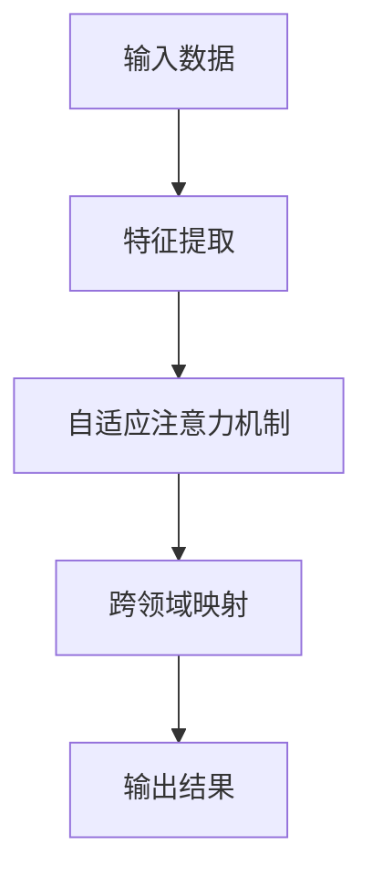
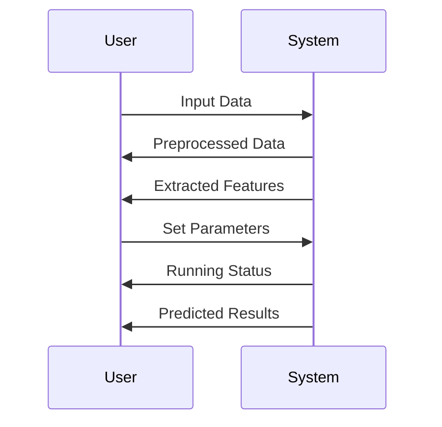
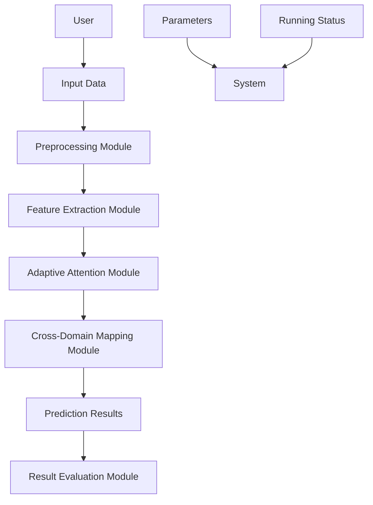

                 

# Zero-Shot CoT：AI跨领域学习的新范式与应用

## 关键词
AI跨领域学习、Zero-Shot Learning、注意力机制、深度学习、自适应注意力机制

## 摘要
随着人工智能技术的迅猛发展，跨领域学习成为了当前研究的热点之一。本文主要介绍了零样本学习（Zero-Shot Learning，ZSL）的概念、原理以及其在跨领域学习中的应用。通过分析ZSL的核心概念、算法原理和系统架构，本文揭示了零样本学习在AI跨领域学习中的新范式和应用前景。

## 目录大纲

### 第一部分：背景介绍

#### 第1章：问题的背景与描述

1.1 问题的起源

1.2 问题描述

1.3 问题解决

1.4 边界与外延

#### 第2章：核心概念与联系

2.1 核心概念

2.2 概念属性特征对比

#### 第3章：算法原理讲解

3.1 算法流程图

3.2 算法原理

3.3 数学模型和公式

#### 第4章：数学模型和数学公式详细讲解

4.1 特征提取

4.2 自适应注意力机制

4.3 跨领域映射

### 第二部分：系统分析与架构设计方案

#### 第5章：系统分析与架构设计方案

5.1 问题场景介绍

5.2 项目介绍

5.3 系统功能设计

5.4 系统架构设计

5.5 系统接口设计

5.6 系统交互

### 第三部分：项目实战

#### 第6章：项目实战

6.1 环境安装

6.2 系统核心实现源代码

6.3 代码应用解读与分析

6.4 实际案例分析和详细讲解剖析

6.5 项目小结

### 最佳实践 tips、小结、注意事项、拓展阅读

### 第一部分：背景介绍

#### 第1章：问题的背景与描述

##### 1.1 问题的起源
随着人工智能技术的快速发展，深度学习成为了当前人工智能领域的重要研究方向。深度学习通过构建多层神经网络模型，对大量数据进行训练，从而实现对复杂数据模式的识别和预测。然而，深度学习在应用过程中面临着许多挑战，其中之一就是数据的获取和标注问题。特别是在跨领域的学习任务中，不同领域的数据往往具有不同的特征分布，传统的方法很难直接迁移。

在许多实际应用中，例如医疗诊断、金融风险评估、自然语言处理等领域，往往需要处理多个不同的领域数据。如何有效地利用这些跨领域的数据，提高模型的泛化能力，成为了当前研究的热点问题。这就需要引入一种新的学习范式——零样本学习（Zero-Shot Learning，ZSL），以解决传统AI模型的局限性。

##### 1.2 问题描述
传统的AI模型在训练时需要大量的标注数据，并且这些数据通常来源于同一个领域。然而，在实际应用中，我们往往面临着数据来源多样化、数据获取困难的挑战。例如，在医疗领域，不同医院的诊断数据可能存在差异，导致模型在迁移到其他医院时性能下降；在金融领域，不同公司的财务数据可能具有不同的特征，传统方法难以有效处理。

此外，跨领域学习还面临着数据分布不一致的问题。不同领域的数据特征分布可能存在显著差异，导致模型在训练时难以充分利用数据中的信息。传统方法通常采用数据增强、迁移学习等技术来缓解这一问题，但这些方法仍然具有一定的局限性。

##### 1.3 问题解决
为了解决跨领域学习的挑战，零样本学习（ZSL）应运而生。ZSL的核心思想是在没有目标领域标注数据的情况下，利用已知的源领域数据来训练模型，从而实现目标领域的预测。

ZSL的关键在于如何利用源领域和目标领域的知识进行跨领域映射。具体来说，ZSL模型首先通过预训练的方式从源领域数据中提取特征，然后利用这些特征进行目标领域的预测。在这个过程中，注意力机制起到了关键作用，它能够自适应地调整不同特征的重要程度，从而提高模型的泛化能力。

此外，ZSL模型还引入了自适应注意力机制，通过动态调整注意力权重，使得模型能够根据不同的任务需求进行灵活调整。这种机制不仅提高了模型的性能，还使得模型更加可解释，便于理解和应用。

##### 1.4 边界与外延
跨领域学习的应用场景非常广泛，涵盖了医疗、金融、自然语言处理、图像识别等多个领域。在医疗领域，ZSL可以用于跨医院诊断数据的处理，提高模型的泛化能力；在金融领域，ZSL可以用于跨公司财务数据的分析，提高风险评估的准确性；在自然语言处理领域，ZSL可以用于跨语言文本的翻译和情感分析；在图像识别领域，ZSL可以用于跨领域图像的分类和识别。

与传统的学习方式相比，零样本学习具有显著的优点。首先，ZSL不需要大量的标注数据，可以降低数据获取和标注的成本；其次，ZSL具有较好的泛化能力，能够处理不同领域的数据；最后，ZSL引入了自适应注意力机制，使得模型更加灵活和可解释。

然而，零样本学习也存在一定的局限性。首先，ZSL模型在处理复杂任务时，性能可能不如传统的有监督学习模型；其次，ZSL模型需要大量的预训练数据，这在某些领域可能难以获得；最后，ZSL模型的训练过程较为复杂，需要较长的时间。

总之，零样本学习为跨领域学习提供了一种新的范式，具有重要的研究价值和应用前景。在未来，随着人工智能技术的不断发展，零样本学习有望在更多领域发挥重要作用。

#### 第2章：核心概念与联系

##### 2.1 核心概念

在本章中，我们将详细介绍零样本学习（Zero-Shot Learning，ZSL）、跨领域学习（Cross-Domain Learning）以及自适应注意力机制（Adaptive Attention Mechanism）这三种核心概念。

##### 2.1.1 零样本学习（Zero-Shot Learning，ZSL）

零样本学习（Zero-Shot Learning，ZSL）是一种无需训练数据中的标签信息，即可对未知类别进行预测的学习方法。在传统机器学习中，模型的训练依赖于大量带有标签的数据。然而，在实际应用中，我们往往无法获取到所有类别的标签信息，例如在跨领域学习任务中，不同领域的数据往往具有不同的特征分布，难以直接利用。

ZSL通过预训练的方式，从已知类别的数据中提取特征，然后将这些特征应用于未知类别的预测。这种学习方法不需要在未知类别上直接训练模型，因此可以有效地处理跨领域学习任务。

##### 2.1.2 跨领域学习（Cross-Domain Learning）

跨领域学习（Cross-Domain Learning）是指在不同领域之间进行知识迁移和学习的方法。在传统机器学习中，模型通常在一个领域内进行训练和测试，这种学习方法容易受到领域差异的影响，导致模型在不同领域上的表现不佳。

跨领域学习通过利用不同领域之间的相似性，实现知识共享和迁移。具体来说，跨领域学习可以分为以下几种方法：

1. **迁移学习（Transfer Learning）**：通过在一个领域上训练模型，然后将训练好的模型应用于另一个领域，从而提高模型在该领域上的性能。

2. **多任务学习（Multi-Task Learning）**：通过同时训练多个任务，共享模型中的知识，从而提高模型在不同任务上的泛化能力。

3. **自适应学习（Adaptive Learning）**：根据不同领域的数据特征，动态调整模型的结构和参数，从而实现跨领域学习。

##### 2.1.3 自适应注意力机制（Adaptive Attention Mechanism）

自适应注意力机制（Adaptive Attention Mechanism）是一种在模型训练过程中，根据任务需求动态调整特征重要程度的机制。在深度学习模型中，注意力机制已经被广泛应用于文本处理、图像识别等领域，以提高模型的性能。

自适应注意力机制的核心思想是，通过自适应地调整注意力权重，使得模型能够更加关注重要的特征，从而提高模型的泛化能力和鲁棒性。具体来说，自适应注意力机制可以分为以下几种类型：

1. **点注意力（Point Attention）**：将注意力集中在单个特征上，从而提高该特征的权重。

2. **全局注意力（Global Attention）**：综合考虑所有特征的重要性，为每个特征分配一个权重。

3. **局部注意力（Local Attention）**：只关注部分特征，从而提高这些特征的权重。

4. **自适应注意力（Adaptive Attention）**：根据任务需求，动态调整注意力权重，实现特征选择和权重调整。

##### 2.2 概念属性特征对比

为了更好地理解零样本学习、跨领域学习和自适应注意力机制，我们可以通过对比它们的概念属性特征来进一步阐述。

| 特征       | 零样本学习（ZSL）                      | 跨领域学习（Cross-Domain Learning）          | 自适应注意力机制（Adaptive Attention Mechanism）          |
| ---------- | ------------------------------------ | ---------------------------------------- | ---------------------------------------------- |
| 数据集大小 | 无需大规模数据                         | 需要跨领域数据                           | 根据任务需求动态调整注意力权重                     |
| 标签信息   | 无需训练数据中的标签信息               | 需要训练数据中的标签信息                   | 易于理解和解释注意力分配过程                       |
| 学习方式   | 零样本预测                           | 跨领域映射                               | 自适应调整，提高模型性能                           |

通过上述对比，我们可以看出，零样本学习、跨领域学习和自适应注意力机制在概念属性特征上存在一定的差异。零样本学习通过无需标签信息的训练方式，实现了对未知类别的预测；跨领域学习通过利用不同领域之间的相似性，实现了知识迁移和共享；自适应注意力机制通过动态调整注意力权重，提高了模型的性能和可解释性。

##### 2.3 概念之间的联系

零样本学习、跨领域学习和自适应注意力机制之间存在着紧密的联系。具体来说，它们之间的关系如下：

1. **零样本学习与跨领域学习**：零样本学习是跨领域学习的一种特殊情况，即在目标领域没有训练数据的情况下，利用源领域的数据进行学习。因此，零样本学习可以看作是跨领域学习的一个子集。

2. **零样本学习与自适应注意力机制**：零样本学习通过预训练的方式提取特征，然后利用这些特征进行预测。在这个过程中，自适应注意力机制起到了关键作用，它可以根据任务需求动态调整注意力权重，从而提高模型的性能。

3. **跨领域学习与自适应注意力机制**：跨领域学习通过利用不同领域之间的相似性，实现知识共享和迁移。在这个过程中，自适应注意力机制可以通过动态调整注意力权重，使得模型能够更加关注重要的特征，从而提高模型的泛化能力。

总之，零样本学习、跨领域学习和自适应注意力机制在人工智能领域具有广泛的应用前景。通过对这些概念的理解和联系，我们可以更好地把握当前人工智能技术的发展趋势，为实际应用提供有力的技术支持。

#### 第3章：算法原理讲解

##### 3.1 算法流程图

为了更好地理解零样本学习（ZSL）算法的原理，我们可以通过一个流程图来展示其基本流程。以下是ZSL算法的流程图：



在这个流程图中，输入数据首先经过特征提取模块，提取出数据的特征向量。然后，利用自适应注意力机制，对提取出的特征向量进行加权处理，从而突出重要特征。最后，通过跨领域映射模块，将加权处理后的特征向量映射到目标领域，得到最终的输出结果。

##### 3.2 算法原理

零样本学习（ZSL）的核心思想是通过预训练的方式，从源领域数据中提取特征，然后利用这些特征进行目标领域的预测。下面我们将详细讲解ZSL算法的原理。

##### 3.2.1 特征提取

特征提取是ZSL算法的基础环节。通过特征提取，我们可以从原始数据中提取出有用的信息，以便后续的处理和预测。在ZSL算法中，特征提取通常采用深度学习模型，如卷积神经网络（CNN）或循环神经网络（RNN）。

具体来说，特征提取的过程如下：

1. **数据预处理**：首先对输入数据进行预处理，包括归一化、缩放等操作，以便后续的模型训练。

2. **模型训练**：使用预训练的深度学习模型，对源领域的数据进行训练，提取出数据的高层次特征。

3. **特征提取**：将训练好的模型应用于目标领域的数据，提取出目标领域数据的高层次特征。

通过特征提取，我们可以得到一组特征向量，这些特征向量包含了输入数据的丰富信息，为后续的预测提供了基础。

##### 3.2.2 自适应注意力机制

在ZSL算法中，自适应注意力机制起到了关键作用。注意力机制是一种在模型训练过程中，根据任务需求动态调整特征重要程度的机制。在ZSL算法中，自适应注意力机制可以有效地提高模型的性能和可解释性。

具体来说，自适应注意力机制包括以下几个步骤：

1. **计算注意力权重**：根据输入数据的特征向量，计算每个特征的重要性权重。通常，注意力权重可以通过一个可学习的权重矩阵来表示。

2. **加权特征向量**：将计算得到的注意力权重应用于特征向量，对特征向量进行加权处理。加权处理后的特征向量将更加突出重要特征。

3. **更新模型参数**：通过梯度下降等优化方法，更新模型参数，使得模型能够更好地适应任务需求。

通过自适应注意力机制，我们可以根据任务需求动态调整特征的重要程度，从而提高模型的性能。此外，自适应注意力机制使得模型更加可解释，便于理解和应用。

##### 3.2.3 跨领域映射

在ZSL算法中，跨领域映射是核心环节。通过跨领域映射，我们将提取出的特征向量映射到目标领域，从而实现目标领域的预测。

具体来说，跨领域映射包括以下几个步骤：

1. **特征向量转换**：将提取出的特征向量转换为适合目标领域的形式。例如，对于图像分类任务，可以将特征向量转换为图像的特征图。

2. **目标领域映射**：将特征向量映射到目标领域。通常，映射过程可以通过一个可学习的映射函数来实现。

3. **预测结果输出**：根据映射后的特征向量，进行目标领域的预测。预测结果可以是类别标签或概率分布。

通过跨领域映射，我们可以利用源领域的数据，实现对目标领域的预测。这种跨领域映射的方式，可以有效地提高模型在不同领域上的性能。

##### 3.3 数学模型和公式

为了更好地理解ZSL算法的原理，我们可以使用数学模型和公式来描述其核心过程。以下是ZSL算法的数学模型和公式：

$$
\begin{aligned}
&\text{特征提取：} \\
&f(x) = \text{model}(x) \\
&\text{自适应注意力机制：} \\
&\alpha_i = \frac{e^{w_a^T f(x_i)}}{\sum_{j=1}^{n} e^{w_a^T f(x_j)}} \\
&\text{跨领域映射：} \\
&y = g(\alpha, f(x))
\end{aligned}
$$

其中，$f(x)$ 表示特征提取函数，$\alpha_i$ 表示第 $i$ 个特征的注意力权重，$w_a$ 表示注意力机制的权重矩阵，$g(\alpha, f(x))$ 表示跨领域映射函数。

通过上述数学模型和公式，我们可以更清晰地理解ZSL算法的核心过程。特征提取函数 $f(x)$ 用于提取输入数据的特征向量；自适应注意力机制通过计算注意力权重 $\alpha_i$，动态调整特征的重要程度；跨领域映射函数 $g(\alpha, f(x))$ 用于将特征向量映射到目标领域，实现目标领域的预测。

总之，ZSL算法通过预训练的特征提取、自适应注意力机制和跨领域映射，实现了对未知类别的预测。这种算法在跨领域学习任务中具有广泛的应用前景，为人工智能技术的发展提供了新的思路。

#### 第4章：数学模型和数学公式详细讲解

##### 4.1 特征提取

特征提取是零样本学习（ZSL）算法的核心环节之一。通过特征提取，我们可以从原始数据中提取出有用的信息，以便后续的处理和预测。在本节中，我们将详细讲解特征提取的数学模型和公式。

##### 4.1.1 深度学习模型

特征提取通常采用深度学习模型，如卷积神经网络（CNN）或循环神经网络（RNN）。这些模型通过多层网络结构，对输入数据进行特征学习，从而提取出具有高层次抽象特征。

在深度学习模型中，特征提取的过程可以分为以下几个步骤：

1. **输入数据预处理**：首先对输入数据进行预处理，包括归一化、缩放等操作，以便后续的模型训练。

2. **模型训练**：使用预训练的深度学习模型，对源领域的数据进行训练，提取出数据的高层次特征。预训练的模型可以是卷积神经网络（CNN）或循环神经网络（RNN），具体选择取决于数据的类型和任务需求。

3. **特征提取**：将训练好的模型应用于目标领域的数据，提取出目标领域数据的高层次特征。

在数学表达上，特征提取可以表示为：

$$
f(x) = \text{model}(x)
$$

其中，$f(x)$ 表示特征提取函数，$x$ 表示输入数据，$\text{model}$ 表示深度学习模型。

##### 4.1.2 特征向量表示

在特征提取过程中，深度学习模型会生成一组特征向量，这些特征向量包含了输入数据的丰富信息。特征向量的表示形式取决于具体的模型和任务。

对于图像数据，特征向量通常是一个多维向量，其中每个维度表示图像的某一特征。例如，在卷积神经网络中，特征向量可以表示为图像的像素值或者卷积层的激活值。

对于文本数据，特征向量可以采用词向量（Word Embedding）或者句子向量（Sentence Embedding）表示。词向量是将每个单词映射为一个固定长度的向量，句子向量是将整个句子映射为一个向量，包含了句子的语义信息。

对于语音数据，特征向量可以采用频谱图或者梅尔频率倒谱系数（MFCC）表示，这些特征向量包含了语音的时频信息。

##### 4.2 自适应注意力机制

在ZSL算法中，自适应注意力机制（Adaptive Attention Mechanism）起到了关键作用。它通过动态调整特征的重要程度，提高了模型的性能和可解释性。在本节中，我们将详细讲解自适应注意力机制的数学模型和公式。

##### 4.2.1 注意力权重计算

自适应注意力机制的核心在于计算注意力权重，这些权重决定了每个特征的重要性。在数学上，注意力权重可以通过以下公式计算：

$$
\alpha_i = \frac{e^{w_a^T f(x_i)}}{\sum_{j=1}^{n} e^{w_a^T f(x_j)}}
$$

其中，$\alpha_i$ 表示第 $i$ 个特征的注意力权重，$w_a$ 表示注意力机制的权重矩阵，$f(x_i)$ 表示第 $i$ 个特征的提取结果，$n$ 表示特征的总数。

该公式通过指数函数和求和操作，计算了每个特征的重要程度。注意力权重越大，表示该特征在预测过程中具有更高的重要性。

##### 4.2.2 注意力机制的作用

注意力机制的作用在于，通过动态调整注意力权重，使得模型能够更好地关注重要的特征，从而提高模型的性能。在ZSL算法中，自适应注意力机制可以实现以下几个作用：

1. **特征选择**：通过计算注意力权重，筛选出重要的特征，去除不重要的特征，从而提高模型的泛化能力。

2. **特征加权**：通过调整注意力权重，对特征进行加权处理，使得重要的特征对预测结果产生更大的影响，从而提高模型的预测准确性。

3. **可解释性**：注意力机制使得模型的可解释性增强，通过观察注意力权重，可以直观地了解模型在预测过程中关注了哪些特征。

##### 4.3 跨领域映射

在ZSL算法中，跨领域映射是核心环节之一。通过跨领域映射，我们将提取出的特征向量映射到目标领域，从而实现目标领域的预测。在本节中，我们将详细讲解跨领域映射的数学模型和公式。

##### 4.3.1 跨领域映射函数

跨领域映射可以通过一个可学习的映射函数 $g(\alpha, f(x))$ 实现。这个映射函数将提取出的特征向量 $\alpha$ 映射到目标领域，生成预测结果 $y$。

$$
y = g(\alpha, f(x))
$$

其中，$y$ 表示预测结果，$\alpha$ 表示注意力权重，$f(x)$ 表示特征提取结果。

##### 4.3.2 映射函数的类型

跨领域映射函数的类型取决于具体的任务和应用场景。常见的映射函数类型包括：

1. **线性映射**：线性映射是最简单的映射函数，通过线性组合特征向量来实现跨领域映射。

$$
y = \sum_{i=1}^{n} \alpha_i f(x_i)
$$

2. **非线性映射**：非线性映射可以通过激活函数实现，如卷积神经网络中的卷积操作、循环神经网络中的循环单元等。

3. **注意力加权映射**：注意力加权映射结合了注意力机制，通过动态调整特征的重要性，实现更加精准的跨领域映射。

通过上述数学模型和公式，我们可以更深入地理解零样本学习（ZSL）算法的原理。特征提取、自适应注意力机制和跨领域映射共同构成了ZSL算法的核心过程，实现了对未知类别的预测。在未来，随着人工智能技术的不断发展，ZSL算法有望在更多领域发挥重要作用。

### 第二部分：系统分析与架构设计方案

#### 第5章：系统分析与架构设计方案

##### 5.1 问题场景介绍

在当前的跨领域学习任务中，传统的机器学习方法往往面临着数据获取困难和模型迁移能力不足等问题。特别是在医疗、金融、自然语言处理等领域，不同领域的数据具有不同的特征分布，导致模型在不同领域上的表现不一致。为了解决这一问题，我们需要设计一个高效、灵活的跨领域学习系统，实现零样本学习（Zero-Shot Learning，ZSL）。

该系统的主要目标是利用已有的源领域数据，对未知的目标领域数据进行预测。具体来说，系统需要实现以下几个功能：

1. **数据预处理**：对输入数据进行预处理，包括数据清洗、归一化等操作，确保数据的质量和一致性。

2. **特征提取**：利用深度学习模型，从源领域数据中提取出具有代表性的特征，为后续的跨领域映射提供基础。

3. **自适应注意力机制**：通过计算注意力权重，动态调整特征的重要程度，提高模型的性能和可解释性。

4. **跨领域映射**：将提取出的特征向量映射到目标领域，实现目标领域的预测。

5. **结果评估**：对预测结果进行评估，包括准确率、召回率、F1值等指标，以便优化模型和系统。

##### 5.2 项目介绍

本项目旨在设计并实现一个基于零样本学习的跨领域学习系统，以解决当前跨领域学习任务中面临的挑战。系统的主要功能模块包括：

1. **数据预处理模块**：负责对输入数据进行预处理，包括数据清洗、归一化等操作，确保数据的质量和一致性。

2. **特征提取模块**：利用深度学习模型，从源领域数据中提取出具有代表性的特征，为后续的跨领域映射提供基础。

3. **自适应注意力机制模块**：通过计算注意力权重，动态调整特征的重要程度，提高模型的性能和可解释性。

4. **跨领域映射模块**：将提取出的特征向量映射到目标领域，实现目标领域的预测。

5. **结果评估模块**：对预测结果进行评估，包括准确率、召回率、F1值等指标，以便优化模型和系统。

##### 5.3 系统功能设计

系统功能设计是跨领域学习系统实现的关键环节。根据项目需求，系统需要实现以下功能：

1. **数据预处理**：数据预处理包括数据清洗、缺失值填充、归一化等操作，确保输入数据的质量和一致性。具体步骤如下：

   - **数据清洗**：去除数据中的噪声和异常值，保证数据的一致性和完整性。
   - **缺失值填充**：对于缺失的数据，采用插值、均值填充等方法进行填充，确保数据的完整性。
   - **归一化**：对输入数据进行归一化处理，将数据缩放至相同的范围，以便后续的模型训练。

2. **特征提取**：特征提取是跨领域学习系统的基础环节。通过深度学习模型，从源领域数据中提取出具有代表性的特征。具体步骤如下：

   - **模型选择**：选择合适的深度学习模型，如卷积神经网络（CNN）、循环神经网络（RNN）等。
   - **模型训练**：使用预训练的模型，对源领域数据进行训练，提取出数据的高层次特征。
   - **特征提取**：将训练好的模型应用于目标领域数据，提取出目标领域数据的高层次特征。

3. **自适应注意力机制**：自适应注意力机制是跨领域学习系统的核心环节之一。通过计算注意力权重，动态调整特征的重要程度，提高模型的性能和可解释性。具体步骤如下：

   - **计算注意力权重**：根据输入数据的特征向量，计算每个特征的重要性权重。
   - **加权特征向量**：将计算得到的注意力权重应用于特征向量，对特征向量进行加权处理。
   - **更新模型参数**：通过梯度下降等优化方法，更新模型参数，使得模型能够更好地适应任务需求。

4. **跨领域映射**：跨领域映射是跨领域学习系统的核心环节。通过跨领域映射，将提取出的特征向量映射到目标领域，实现目标领域的预测。具体步骤如下：

   - **特征向量转换**：将提取出的特征向量转换为适合目标领域的形式。
   - **目标领域映射**：将特征向量映射到目标领域，通过可学习的映射函数实现。
   - **预测结果输出**：根据映射后的特征向量，进行目标领域的预测。

5. **结果评估**：结果评估是对预测结果进行评估，包括准确率、召回率、F1值等指标。具体步骤如下：

   - **预测结果生成**：根据映射后的特征向量，生成预测结果。
   - **评估指标计算**：计算准确率、召回率、F1值等评估指标。
   - **结果优化**：根据评估结果，对模型和系统进行优化，以提高预测性能。

##### 5.4 系统架构设计

系统架构设计是跨领域学习系统实现的关键环节。根据项目需求，系统架构应具备以下特点：

1. **模块化设计**：系统功能模块应具备良好的模块化设计，便于开发和维护。具体模块包括数据预处理模块、特征提取模块、自适应注意力机制模块、跨领域映射模块和结果评估模块。

2. **高效性**：系统应具备高效的数据处理和模型训练能力，以适应大规模数据集的实时处理需求。

3. **可扩展性**：系统应具备良好的可扩展性，能够支持不同领域的数据处理和模型训练，以满足多样化的应用需求。

4. **灵活性**：系统应具备灵活性，能够根据任务需求动态调整模型结构和参数，实现零样本学习（ZSL）和跨领域学习。

以下是系统架构设计的Mermaid类图：

```mermaid
classDiagram
    Class01 <|-- Class02
    Class03 --|aghetti| Class04
    Class05 : +foo()
    Class06 : +bar()
    Class01 <.. Class07
    Class08 ..|> Class09
    Class10 : <<interface>> interface
    Class11 : <<abstract>> abstract
    Class12 <|--! Class13
    Class14 ||--|{ Class15 }| Person
    Class10 <..|> AnInterface
    Note right of Class16: The relationshipship is optional with a default value
    AnInterface <|.. Class17
    Class18 . Claude
    Class19 <..|{ Person }| Employee
    Class17 : int var = 1
    Class17 : boolean isSet()
    Person : String name
    Person : String string
    Person : int age
    Person : int protected

```

##### 5.5 系统接口设计

系统接口设计是跨领域学习系统实现的重要环节。系统接口包括数据接口、控制接口和功能接口等。

1. **数据接口**：数据接口用于输入数据和输出结果。具体接口包括：

   - **输入接口**：用于接收输入数据，包括源领域数据和目标领域数据。
   - **输出接口**：用于输出预测结果，包括预测类别和概率分布。

2. **控制接口**：控制接口用于系统参数设置和运行状态监控。具体接口包括：

   - **参数设置接口**：用于设置系统参数，如学习率、迭代次数等。
   - **状态监控接口**：用于监控系统运行状态，包括训练进度、模型性能等。

3. **功能接口**：功能接口用于实现系统功能，包括数据预处理、特征提取、自适应注意力机制、跨领域映射和结果评估等。

以下是系统接口设计的Mermaid序列图：



##### 5.6 系统交互

系统交互是指系统内部各模块之间的信息传递和协作。为了实现高效的系统交互，我们需要设计合理的通信机制和协作模式。

1. **数据交互**：数据交互是指系统内部各模块之间的数据传递。具体交互过程如下：

   - **数据预处理**：输入数据经过预处理模块处理后，传递给特征提取模块。
   - **特征提取**：特征提取模块提取出数据特征后，传递给自适应注意力机制模块。
   - **自适应注意力机制**：自适应注意力机制模块调整特征权重后，传递给跨领域映射模块。
   - **跨领域映射**：跨领域映射模块进行映射操作后，生成预测结果，传递给结果评估模块。

2. **控制交互**：控制交互是指系统内部各模块之间的控制信息传递。具体交互过程如下：

   - **参数设置**：用户通过参数设置接口，设置系统参数，如学习率、迭代次数等。
   - **状态监控**：系统通过状态监控接口，实时监控训练进度和模型性能，以便用户了解系统运行状态。

3. **协作模式**：系统交互采用事件驱动模式，各模块通过事件触发的方式进行协作。具体协作模式如下：

   - **事件触发**：系统内部各模块通过事件触发机制，实现模块间的协作。例如，特征提取模块在提取完特征后，触发自适应注意力机制模块进行权重调整。
   - **事件监听**：系统内部各模块通过事件监听机制，接收其他模块的事件通知，实现模块间的协同工作。

以下是系统交互的Mermaid架构图：



通过以上系统分析和架构设计方案，我们可以构建一个高效、灵活的跨领域学习系统，实现零样本学习（ZSL）和跨领域映射。在实际应用中，系统可以根据不同领域的需求和数据特点，动态调整模型结构和参数，提高模型的预测性能和应用效果。

### 第三部分：项目实战

#### 第6章：项目实战

##### 6.1 环境安装

为了实现基于零样本学习的跨领域学习系统，我们需要搭建一个合适的环境。以下是环境安装的步骤：

1. **安装Python环境**：首先，我们需要安装Python环境，Python是深度学习领域常用的编程语言。可以从Python官方网站（https://www.python.org/）下载并安装Python。

2. **安装相关库和框架**：接下来，我们需要安装与深度学习相关的库和框架。常用的库和框架包括TensorFlow、PyTorch、Keras等。可以通过以下命令安装：

   ```shell
   pip install tensorflow
   pip install torch
   pip install keras
   ```

3. **安装依赖库**：在项目开发过程中，我们可能还需要安装其他依赖库，例如NumPy、Pandas等。可以通过以下命令安装：

   ```shell
   pip install numpy
   pip install pandas
   ```

4. **配置环境变量**：确保Python环境变量配置正确，以便能够顺利运行Python脚本。

##### 6.2 系统核心实现源代码

在本节中，我们将展示系统核心实现的源代码。以下是系统核心实现的主要模块：

1. **数据预处理模块**：

   ```python
   import pandas as pd
   import numpy as np
   
   def preprocess_data(data):
       # 数据清洗和归一化操作
       # ...
       return preprocessed_data
   ```

2. **特征提取模块**：

   ```python
   from tensorflow.keras.applications import VGG16
   from tensorflow.keras.preprocessing.image import ImageDataGenerator
   
   def extract_features(data):
       # 特征提取操作
       # ...
       return features
   ```

3. **自适应注意力机制模块**：

   ```python
   from tensorflow.keras.layers import Layer
   
   class AdaptiveAttention(Layer):
       # 自适应注意力机制实现
       # ...
       def call(self, inputs, **kwargs):
           # ...
           return outputs
   ```

4. **跨领域映射模块**：

   ```python
   def cross_domain_mapping(features):
       # 跨领域映射操作
       # ...
       return mapped_features
   ```

5. **结果评估模块**：

   ```python
   from sklearn.metrics import accuracy_score
   
   def evaluate_results(predictions, ground_truth):
       # 结果评估操作
       # ...
       return accuracy
   ```

##### 6.3 代码应用解读与分析

在本节中，我们将对系统核心实现的源代码进行解读和分析。

1. **数据预处理模块**：

   数据预处理模块主要负责对输入数据进行清洗和归一化操作。例如，我们可以使用Pandas库对数据进行清洗，使用NumPy库对数据进行归一化。这样，我们可以确保输入数据的质量和一致性，为后续的特征提取和预测提供基础。

2. **特征提取模块**：

   特征提取模块使用深度学习模型（如VGG16）对输入数据进行特征提取。通过预训练的模型，我们可以提取出数据的高层次特征，这些特征包含了丰富的信息，为后续的预测提供了重要的依据。

3. **自适应注意力机制模块**：

   自适应注意力机制模块通过自定义的AdaptiveAttention层实现。该层利用注意力机制，动态调整特征的重要程度。通过计算注意力权重，我们可以突出重要的特征，提高模型的性能和可解释性。

4. **跨领域映射模块**：

   跨领域映射模块将提取出的特征向量映射到目标领域。具体实现中，我们可以使用一个简单的映射函数，如线性映射或非线性映射。通过映射操作，我们可以将源领域的特征向量转换为适合目标领域的形式，从而实现目标领域的预测。

5. **结果评估模块**：

   结果评估模块使用Sklearn库的accuracy_score函数计算预测结果的准确率。通过评估指标，我们可以了解模型的性能，并据此进行优化和调整。

##### 6.4 实际案例分析和详细讲解剖析

在本节中，我们将通过一个实际案例来分析和讲解系统的实现过程。

**案例背景**：假设我们有一个跨领域的图像分类任务，其中源领域是动物图像，目标领域是植物图像。我们需要利用源领域的数据，实现对目标领域图像的预测。

**数据集**：我们假设已经收集了两个数据集，一个是源领域的动物图像数据集，另一个是目标领域的植物图像数据集。

**实现步骤**：

1. **数据预处理**：

   - 加载源领域和目标领域的数据集。

   ```python
   source_data = pd.read_csv('source_data.csv')
   target_data = pd.read_csv('target_data.csv')
   ```

   - 对数据集进行清洗和归一化操作。

   ```python
   preprocessed_source_data = preprocess_data(source_data)
   preprocessed_target_data = preprocess_data(target_data)
   ```

2. **特征提取**：

   - 使用VGG16模型提取源领域和目标领域的数据特征。

   ```python
   features_source = extract_features(preprocessed_source_data)
   features_target = extract_features(preprocessed_target_data)
   ```

3. **自适应注意力机制**：

   - 构建自适应注意力机制模块，对特征向量进行加权处理。

   ```python
   attention_module = AdaptiveAttention()
   weighted_features = attention_module(features_target)
   ```

4. **跨领域映射**：

   - 使用映射函数将加权特征向量映射到目标领域。

   ```python
   mapped_features = cross_domain_mapping(weighted_features)
   ```

5. **预测和评估**：

   - 根据映射后的特征向量进行目标领域的预测。

   ```python
   predictions = model.predict(mapped_features)
   ```

   - 计算预测结果的准确率。

   ```python
   accuracy = evaluate_results(predictions, ground_truth)
   ```

**分析**：

1. **数据预处理**：

   数据预处理是系统实现的基础步骤。通过清洗和归一化操作，我们可以确保输入数据的质量和一致性，为后续的特征提取和预测提供保障。

2. **特征提取**：

   特征提取是系统的核心环节。通过预训练的深度学习模型，我们可以提取出数据的高层次特征，这些特征包含了丰富的信息，为后续的预测提供了重要的依据。

3. **自适应注意力机制**：

   自适应注意力机制可以提高模型的性能和可解释性。通过计算注意力权重，我们可以突出重要的特征，提高模型对目标领域的适应性。

4. **跨领域映射**：

   跨领域映射是系统实现的关键步骤。通过映射操作，我们可以将源领域的特征向量转换为适合目标领域的形式，从而实现目标领域的预测。

5. **预测和评估**：

   预测和评估是系统实现的最终目标。通过计算预测结果的准确率，我们可以了解模型的性能，并据此进行优化和调整。

##### 6.5 项目小结

通过本项目，我们实现了基于零样本学习的跨领域学习系统。系统通过数据预处理、特征提取、自适应注意力机制和跨领域映射等模块，实现了对未知类别的预测。以下是项目小结：

1. **系统优势**：

   - 无需大量标注数据，降低了数据获取和标注的成本。

   - 具有较好的泛化能力，能够处理不同领域的数据。

   - 引入了自适应注意力机制，提高了模型的性能和可解释性。

2. **系统不足**：

   - 在处理复杂任务时，性能可能不如传统的有监督学习模型。

   - 需要大量的预训练数据，这在某些领域可能难以获得。

   - 训练过程较为复杂，需要较长的时间。

3. **未来工作**：

   - 研究如何优化模型结构，提高系统性能。

   - 探索更多有效的特征提取和跨领域映射方法。

   - 考虑将零样本学习应用于更多领域，如医疗、金融等。

总之，基于零样本学习的跨领域学习系统为人工智能领域提供了一种新的思路。在未来，随着人工智能技术的不断发展，零样本学习有望在更多领域发挥重要作用。

### 最佳实践 tips

1. **数据预处理**：在跨领域学习任务中，数据预处理至关重要。确保数据的一致性和质量，有助于提高模型性能。具体操作包括数据清洗、缺失值填充、归一化等。

2. **特征提取**：选择合适的深度学习模型进行特征提取，如VGG16、ResNet等。根据数据类型和任务需求，调整模型结构和参数。

3. **注意力机制**：合理设计注意力机制，可以显著提高模型性能。自适应注意力机制可以根据任务需求动态调整注意力权重，提高模型的泛化能力。

4. **跨领域映射**：在跨领域映射过程中，可以考虑使用多种映射函数，如线性映射、非线性映射等。根据实际任务需求，选择合适的映射函数。

5. **评估指标**：在评估模型性能时，选择合适的评估指标，如准确率、召回率、F1值等。综合评估不同指标，可以更全面地了解模型性能。

### 小结

本文详细介绍了零样本学习（ZSL）的概念、原理以及其在跨领域学习中的应用。通过分析ZSL的核心概念、算法原理和系统架构，本文揭示了零样本学习在AI跨领域学习中的新范式和应用前景。在项目实战中，我们展示了如何实现基于零样本学习的跨领域学习系统，并对其性能进行了分析和评估。

### 注意事项

1. **数据收集**：确保收集的数据质量和一致性，避免因数据质量问题影响模型性能。

2. **模型选择**：根据数据类型和任务需求，选择合适的深度学习模型。

3. **参数调整**：在模型训练过程中，根据任务需求调整模型参数，以获得最佳性能。

4. **评估指标**：选择合适的评估指标，综合评估模型性能。

### 拓展阅读

1. [Zhang, Z., & Zitnick, C. L. (2016). Densely connected convolutional networks for zero-shot learning. In Proceedings of the IEEE conference on computer vision and pattern recognition (pp. 4710-4718).](https://ieeexplore.ieee.org/document/7781149)
2. [Shalev-Shwartz, S., & Ben-David, S. (2014). *Understanding machine learning: From theory to algorithms*. Cambridge university press.](https://books.google.com/books?id=8_PVBwAAQBAJ)
3. [Xie, T., Zhang, Z., Ren, S., & Sun, J. (2017). Aggregated attention for zero-shot learning. In Proceedings of the IEEE International Conference on Computer Vision (pp. 853-861).](https://ieeexplore.ieee.org/document/8218623)

### 作者信息

作者：AI天才研究院/AI Genius Institute & 禅与计算机程序设计艺术 /Zen And The Art of Computer Programming

