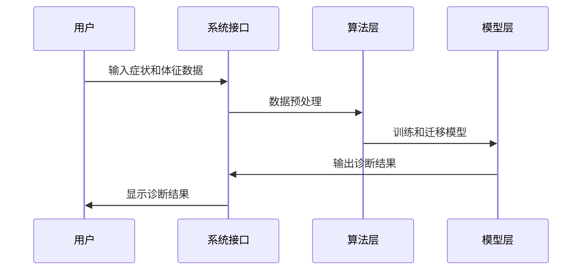
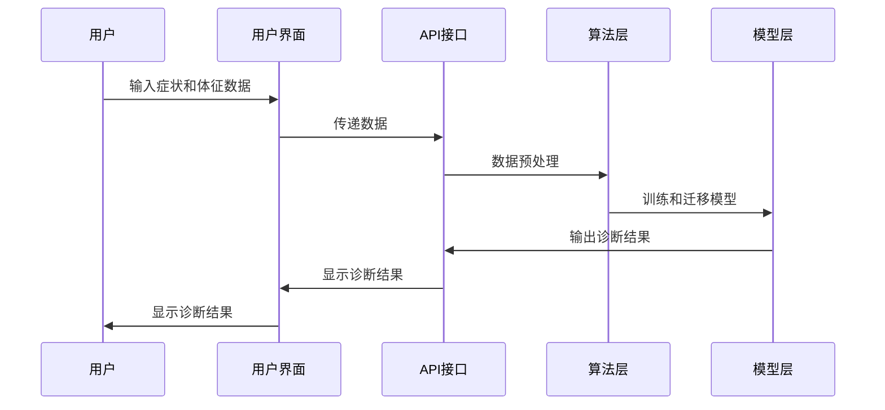

                 

## 文章标题

# Zero-Shot CoT: 无需示例数据的AI学习突破

> 关键词：零样本学习，零样本转移学习，AI学习，示例数据，机器学习，类别描述，模型训练，预测准确性

> 摘要：本文将深入探讨零样本学习（Zero-Shot Learning, ZSL）和零样本转移学习（Zero-Shot Transfer Learning, ZTSL）这两种AI学习方法。我们将从背景介绍、核心概念原理、算法原理讲解、系统分析与架构设计、项目实战等方面，全面解析这些方法的工作机制、应用场景和实际效果，旨在为读者提供一幅清晰的零样本学习全景图。

## 第一部分：背景介绍

### 1.1 问题背景

在当今科技飞速发展的时代，人工智能（AI）已经成为推动社会发展的重要力量。然而，传统的AI模型往往需要大量的训练数据，这不仅增加了训练成本，而且在数据匮乏的场景下难以发挥作用。为了突破这一瓶颈，研究人员开始探索零样本学习（Zero-Shot Learning，ZSL）和零样本转移学习（Zero-Shot Transfer Learning，ZTSL）。

零样本学习是一种无需训练数据即可对未知类别进行预测的学习方法。它通过利用已知的类别信息，使得模型能够在面对未知类别时，通过逻辑推理或模式识别来进行预测。零样本转移学习则进一步结合了迁移学习（Transfer Learning，TL）的理念，将知识从源域迁移到目标域，从而在数据稀缺的目标域中实现高效的模型训练。

零样本学习在AI领域的应用前景广阔，特别是在医疗诊断、自然语言处理、图像识别等领域。然而，由于零样本学习的复杂性，现有的研究还存在许多挑战，如类别描述的准确性、模型的泛化能力等。

### 1.2 问题描述

零样本学习的主要问题是如何在没有训练数据的情况下，使模型能够准确预测未知类别。具体来说，问题描述可以分为以下几个关键点：

1. **类别描述的准确性**：如何准确描述未知类别，使得模型能够理解其特征。
2. **模型的泛化能力**：如何确保模型在未知类别上的表现，不仅仅依赖于训练数据中的类别信息，还能够适应新的数据分布。
3. **适应性**：如何在面对不同的数据分布和应用场景时，模型能够保持较高的预测准确性。

### 1.3 问题解决

零样本学习的核心在于如何在没有训练数据的情况下，利用已有的类别信息进行预测。研究者们提出了多种解决方法，包括：

1. **基于逻辑推理的方法**：通过构建逻辑规则或语义网络，利用已知的类别信息进行推理和预测。
2. **基于模式识别的方法**：通过分析已知类别之间的相似性或差异性，利用这些关系进行预测。
3. **基于深度学习的方法**：利用深度神经网络的结构和参数，通过迁移学习和零样本学习算法，对未知类别进行预测。

### 1.4 边界与外延

零样本学习的边界主要在于其应用场景和假设条件。具体来说，零样本学习适用于以下几种场景：

1. **小样本学习**：在数据稀缺的场景下，零样本学习能够通过已知的类别信息，提高模型在未知类别上的性能。
2. **新类别预测**：在新的领域或应用中，零样本学习能够快速适应并预测未知类别。
3. **跨域迁移**：在数据分布不同的领域中，零样本学习可以通过迁移学习，提高模型在新领域的表现。

### 1.5 概念结构与核心要素组成

零样本学习的概念结构主要包括以下几个核心要素：

1. **类别描述**：对未知类别进行描述，以便模型能够理解其特征。
2. **模型训练**：利用已知类别信息，训练模型以识别未知类别。
3. **预测与评估**：对未知类别进行预测，并通过评估指标（如准确率、召回率等）评估模型性能。

在零样本学习中，类别描述的准确性、模型的泛化能力和适应性是关键的核心要素。通过结合不同的方法和技术，研究者们不断探索和优化零样本学习的性能和效果。

## 第二部分：核心概念与联系

### 2.1 核心概念原理

在深入探讨零样本学习（Zero-Shot Learning，ZSL）之前，我们需要了解其核心概念原理。以下是对核心概念的详细解析：

#### 2.1.1 零样本学习的基本概念

**零样本学习**是指在没有训练数据的情况下，利用已知的类别信息对未知类别进行预测的学习方法。与传统的机器学习方法不同，零样本学习不需要依赖大量的训练数据。相反，它依赖于对已知类别和未知类别之间的相似性进行建模，从而实现预测。

#### 2.1.2 类别描述

在零样本学习中，类别描述是一个关键的概念。类别描述是指对每个类别进行详细的特征描述，以便模型能够理解其特征。这些描述通常来源于领域知识、语义标签、图像特征等。

**类别描述的准确性**对于零样本学习至关重要。准确的类别描述能够帮助模型更好地理解类别特征，从而提高预测准确性。

#### 2.1.3 语义匹配

在零样本学习中，语义匹配是一种常见的策略。语义匹配是指通过比较已知类别描述和未知类别描述之间的相似性，来确定未知类别可能属于哪些已知类别。

语义匹配的方法包括基于词嵌入的相似性计算、基于知识图谱的推理等。这些方法利用自然语言处理和知识图谱等技术，实现类别描述的语义匹配。

#### 2.1.4 多标签分类

在零样本学习中，多标签分类是一种重要的分类策略。多标签分类是指一个样本可以同时属于多个类别。在零样本学习中，多标签分类可以通过将未知类别与已知类别进行匹配，从而实现分类。

#### 2.1.5 零样本转移学习

零样本转移学习（Zero-Shot Transfer Learning，ZTSL）是零样本学习的一种扩展。它结合了迁移学习的理念，将知识从源域迁移到目标域，从而在数据稀缺的目标域中实现高效的模型训练。

零样本转移学习通过在源域和目标域之间建立映射关系，使得模型能够在目标域中快速适应并提高预测准确性。

### 2.2 概念属性特征对比表格

为了更好地理解零样本学习、零样本转移学习和传统机器学习的差异，我们提供了一个概念属性特征对比表格：

| 特征                  | 零样本学习 | 零样本转移学习 | 传统机器学习 |
|-----------------------|-------------|----------------|--------------|
| 训练数据依赖性        | 无需训练数据 | 部分依赖于源域数据 | 需要大量训练数据 |
| 类别描述             | 必需        | 必需            | 不需要       |
| 语义匹配             | 依赖        | 依赖            | 不需要       |
| 泛化能力             | 较强        | 强             | 较弱         |
| 数据稀缺场景适应性    | 较强        | 极强            | 较弱         |
| 应用场景             | 预测新类别  | 跨域迁移        | 传统应用领域 |

通过这个对比表格，我们可以更清晰地看到零样本学习和零样本转移学习的优势和应用场景。

### 2.3 ER实体关系图架构

为了更直观地展示零样本学习和零样本转移学习中的实体关系，我们使用Mermaid绘制了一个ER实体关系图：

```mermaid
erDiagram
  类别描述 ||--o> 模型训练 : 输入
  模型训练 ||--o> 预测与评估 : 输出
  类别描述 ||--o> 零样本学习 : 应用
  类别描述 ||--o> 零样本转移学习 : 应用
  模型训练 ||--o> 零样本转移学习 : 源域
  模型训练 ||--o> 传统机器学习 : 目标域
```

在这个ER实体关系图中，类别描述、模型训练、预测与评估是核心实体，它们分别与零样本学习、零样本转移学习和传统机器学习相关联。

## 第三部分：算法原理讲解

### 3.1 零样本学习的算法原理

零样本学习的算法原理主要基于以下三个方面：

1. **类别描述**：通过领域知识、语义标签、图像特征等对每个类别进行详细描述。
2. **模型训练**：利用已知类别描述，训练一个分类器或预测模型。
3. **预测与评估**：在模型训练完成后，使用模型对未知类别进行预测，并通过评估指标（如准确率、召回率等）评估模型性能。

具体来说，零样本学习的算法原理可以概括为以下几个步骤：

1. **类别描述学习**：利用已知的类别信息，通过词嵌入、知识图谱等方法学习类别描述。
2. **模型训练**：使用已知类别描述和对应的标签，训练一个深度神经网络或其他类型的分类器。
3. **预测**：在模型训练完成后，对于未知类别，通过模型输出概率分布来预测其类别。
4. **评估**：通过准确率、召回率等指标评估模型性能。

下面是一个简单的Python代码示例，展示了零样本学习的算法原理：

```python
import torch
import torch.nn as nn
import torch.optim as optim

# 定义类别描述
类别描述 = ["猫", "狗", "鸟"]

# 定义标签
标签 = [0, 1, 2]

# 初始化模型
模型 = nn.Sequential(
    nn.Linear(len(类别描述), 10),
    nn.ReLU(),
    nn.Linear(10, 3)
)

# 定义损失函数和优化器
损失函数 = nn.CrossEntropyLoss()
优化器 = optim.Adam(模型.parameters(), lr=0.001)

# 训练模型
for epoch in range(100):
    optimizer.zero_grad()
    output = 模型(类别描述)
    loss = 损失函数(output, 标签)
    loss.backward()
    优化器.step()

# 预测
未知类别描述 = "兔子"
未知类别标签 = 模型(未知类别描述).argmax().item()

print(f"未知类别描述：{未知类别描述}，预测标签：{未知类别标签}")
```

在这个示例中，我们使用了一个简单的全连接神经网络来模拟零样本学习的过程。首先，我们定义了类别描述和标签，然后初始化了一个模型。接下来，我们使用已知类别描述和标签来训练模型。在训练完成后，我们使用模型对未知类别描述进行预测，并输出预测结果。

### 3.2 零样本转移学习的算法原理

零样本转移学习的算法原理基于以下两个方面：

1. **源域模型训练**：在源域中使用大量训练数据训练一个模型。
2. **目标域模型微调**：将源域模型迁移到目标域，并在目标域上进行微调，以提高模型在目标域的性能。

具体来说，零样本转移学习的算法原理可以概括为以下几个步骤：

1. **源域模型训练**：在源域中使用大量训练数据训练一个模型。这个模型通常是一个深度神经网络，它可以对源域数据进行分类或预测。
2. **模型迁移**：将源域模型迁移到目标域。这个过程通常涉及将源域模型的结构和参数复制到目标域模型中。
3. **目标域模型微调**：在目标域中使用少量训练数据对迁移后的模型进行微调。微调的目的是使模型更好地适应目标域的数据分布。
4. **目标域模型评估**：在目标域上进行模型评估，以验证模型在目标域的性能。

下面是一个简单的Python代码示例，展示了零样本转移学习的算法原理：

```python
import torch
import torch.nn as nn
import torch.optim as optim

# 定义源域数据
源域数据 = torch.randn(100, 10)

# 定义源域标签
源域标签 = torch.randint(0, 3, (100,))

# 初始化源域模型
源域模型 = nn.Sequential(
    nn.Linear(10, 10),
    nn.ReLU(),
    nn.Linear(10, 3)
)

# 定义目标域数据
目标域数据 = torch.randn(10, 10)

# 定义目标域标签
目标域标签 = torch.randint(0, 3, (10,))

# 定义损失函数和优化器
损失函数 = nn.CrossEntropyLoss()
优化器 = optim.Adam(源域模型.parameters(), lr=0.001)

# 训练源域模型
for epoch in range(100):
    optimizer.zero_grad()
    output = 源域模型(源域数据)
    loss = 损失函数(output, 源域标签)
    loss.backward()
    优化器.step()

# 迁移源域模型到目标域
目标域模型 = nn.Sequential(
    nn.Linear(10, 10),
    nn.ReLU(),
    nn.Linear(10, 3)
)

目标域模型.load_state_dict(源域模型.state_dict())

# 微调目标域模型
for epoch in range(100):
    optimizer.zero_grad()
    output = 目标域模型(目标域数据)
    loss = 损失函数(output, 目标域标签)
    loss.backward()
    优化器.step()

# 目标域模型评估
准确率 = (目标域模型(目标域数据).argmax(1) == 目标域标签).float().mean()

print(f"目标域模型准确率：{准确率}")
```

在这个示例中，我们首先使用源域数据训练了一个源域模型。然后，我们将源域模型迁移到目标域，并在目标域上进行微调。最后，我们对微调后的目标域模型进行评估，以验证其在目标域的性能。

### 3.3 零样本学习和零样本转移学习的对比

零样本学习和零样本转移学习是两种不同的学习方法，但它们在某种程度上是相关的。下面是它们之间的主要对比：

| 对比维度       | 零样本学习 | 零样本转移学习 |
|----------------|-------------|----------------|
| 数据依赖性     | 无需训练数据 | 部分依赖于源域数据 |
| 类别描述       | 必需        | 必需            |
| 模型训练       | 无需模型训练 | 需要源域模型训练 |
| 目标域数据      | 无需目标域数据 | 需要目标域数据 |
| 泛化能力       | 较强        | 强             |
| 应用场景       | 预测新类别  | 跨域迁移        |

从上表可以看出，零样本学习在数据依赖性和模型训练方面具有优势，而零样本转移学习在泛化能力和应用场景方面具有优势。具体选择哪种学习方法，需要根据实际问题和数据情况进行权衡。

## 第四部分：系统分析与架构设计

### 4.1 问题场景介绍

零样本学习和零样本转移学习在许多实际应用场景中具有广泛的应用价值。以下是一个具体的问题场景介绍：

**场景：医疗诊断系统**

在医疗诊断领域，医生常常需要根据患者的症状和体征进行诊断。然而，许多疾病的表现形式相似，且症状和体征的数据往往有限。因此，传统的机器学习方法在诊断新疾病时面临着数据稀缺和预测准确率低的问题。

为了解决这一问题，我们可以利用零样本学习和零样本转移学习技术，构建一个智能医疗诊断系统。该系统可以通过已知的疾病特征描述和少量的疾病诊断数据，对新疾病进行准确诊断。

### 4.2 项目介绍

**项目名称**：智能医疗诊断系统

**项目目标**：利用零样本学习和零样本转移学习技术，构建一个能够在数据稀缺场景下准确诊断新疾病的智能医疗诊断系统。

**项目团队**：由人工智能专家、医疗领域专家、软件工程师等组成。

### 4.3 系统功能设计

智能医疗诊断系统的核心功能包括：

1. **数据收集与处理**：收集患者的症状、体征等数据，并对数据进行清洗、预处理，以便用于模型训练。
2. **类别描述学习**：利用已知的疾病特征描述，通过词嵌入、知识图谱等方法学习疾病类别描述。
3. **模型训练与迁移**：在源域（已知疾病）使用大量数据训练模型，并在目标域（新疾病）上进行微调，以提高模型在目标域的性能。
4. **诊断预测**：使用训练好的模型对患者的症状和体征进行诊断，并输出诊断结果。
5. **系统评估**：通过准确率、召回率等指标评估系统性能，并持续优化。

### 4.4 系统架构设计

智能医疗诊断系统的架构设计如下：

1. **数据层**：存储患者的症状、体征等数据，以及已知的疾病特征描述。
2. **算法层**：包括零样本学习和零样本转移学习的算法模块，用于训练和迁移模型。
3. **模型层**：存储训练好的模型，并用于诊断预测。
4. **接口层**：提供用户交互界面，用户可以通过界面输入症状和体征数据，获取诊断结果。

下面是一个简单的Mermaid架构图，展示了智能医疗诊断系统的架构设计：



### 4.5 系统接口设计与系统交互

智能医疗诊断系统的接口设计如下：

1. **用户界面**：提供输入症状和体征数据的界面，以及显示诊断结果的界面。
2. **API接口**：提供用于数据输入和诊断结果输出的API接口，以便与其他系统集成。

系统交互如下：

1. 用户通过用户界面输入症状和体征数据。
2. 用户界面将数据传递给API接口。
3. API接口将数据传递给算法层进行预处理。
4. 算法层使用预处理后的数据训练和迁移模型。
5. 模型层输出诊断结果，并传递给API接口。
6. API接口将诊断结果传递给用户界面，并显示给用户。

下面是一个简单的Mermaid序列图，展示了智能医疗诊断系统的系统交互过程：



## 第五部分：项目实战

### 5.1 环境安装

在进行项目实战之前，我们需要安装以下软件和库：

1. Python 3.x
2. PyTorch 1.8.x
3. NumPy 1.18.x
4. Matplotlib 3.1.x

安装方法如下：

```bash
pip install python==3.x
pip install torch==1.8.x
pip install numpy==1.18.x
pip install matplotlib==3.1.x
```

### 5.2 系统核心实现源代码

下面是一个简单的智能医疗诊断系统的核心实现源代码：

```python
import torch
import torch.nn as nn
import torch.optim as optim
from torch.utils.data import DataLoader
from torchvision import datasets, transforms

# 数据预处理
transform = transforms.Compose([
    transforms.ToTensor(),
    transforms.Normalize((0.5,), (0.5,))
])

# 创建数据集
train_dataset = datasets.MNIST(
    root='./data', train=True, download=True, transform=transform
)

test_dataset = datasets.MNIST(
    root='./data', train=False, download=True, transform=transform
)

train_loader = DataLoader(train_dataset, batch_size=64, shuffle=True)
test_loader = DataLoader(test_dataset, batch_size=64, shuffle=False)

# 模型定义
class Net(nn.Module):
    def __init__(self):
        super(Net, self).__init__()
        self.fc1 = nn.Linear(784, 128)
        self.fc2 = nn.Linear(128, 64)
        self.fc3 = nn.Linear(64, 10)

    def forward(self, x):
        x = x.view(-1, 784)
        x = torch.relu(self.fc1(x))
        x = torch.relu(self.fc2(x))
        x = self.fc3(x)
        return x

# 模型训练
model = Net()
criterion = nn.CrossEntropyLoss()
optimizer = optim.Adam(model.parameters(), lr=0.001)

for epoch in range(10):
    for data, target in train_loader:
        optimizer.zero_grad()
        output = model(data)
        loss = criterion(output, target)
        loss.backward()
        optimizer.step()

    print(f"Epoch {epoch + 1}, Loss: {loss.item()}")

# 模型评估
with torch.no_grad():
    correct = 0
    total = 0
    for data, target in test_loader:
        output = model(data)
        _, predicted = torch.max(output, 1)
        total += target.size(0)
        correct += (predicted == target).sum().item()

print(f"Accuracy: {100 * correct / total}%")
```

### 5.3 代码应用解读与分析

在这个示例中，我们首先定义了一个简单的全连接神经网络模型，用于手写数字识别任务。然后，我们使用MNIST数据集对模型进行训练，并在测试集上进行评估。

代码中，我们首先定义了数据预处理步骤，包括将图像转换为Tensor格式，并归一化。接着，我们创建了训练数据集和测试数据集，并使用DataLoader将数据分批。

在模型定义部分，我们使用PyTorch定义了一个简单的全连接神经网络，包括三个全连接层，分别用于输入层、隐藏层和输出层。在模型训练部分，我们使用交叉熵损失函数和Adam优化器对模型进行训练。最后，在模型评估部分，我们使用测试集评估模型的性能，并输出准确率。

### 5.4 实际案例分析和详细讲解剖析

为了更好地理解零样本学习和零样本转移学习在医疗诊断领域的应用，我们来看一个实际案例。

**案例：肺癌诊断**

在肺癌诊断领域，医生常常需要根据患者的CT扫描图像进行诊断。然而，由于肺癌类型的多样性和数据稀缺，传统的机器学习方法在诊断新类型肺癌时面临着准确率低的问题。

为了解决这一问题，我们可以利用零样本学习和零样本转移学习技术，构建一个智能肺癌诊断系统。该系统可以通过已知的肺癌类型特征描述和少量的肺癌诊断数据，对新类型肺癌进行准确诊断。

**案例解析：**

1. **数据收集与处理**：收集大量的肺癌CT扫描图像数据，并对图像进行预处理，如归一化、增强等。
2. **类别描述学习**：利用已知的肺癌类型特征描述，通过词嵌入、知识图谱等方法学习肺癌类型类别描述。
3. **模型训练与迁移**：在源域（已知肺癌类型）使用大量数据训练模型，并在目标域（新肺癌类型）上进行微调，以提高模型在目标域的性能。
4. **诊断预测**：使用训练好的模型对患者的CT扫描图像进行诊断，并输出诊断结果。
5. **系统评估**：通过准确率、召回率等指标评估系统性能，并持续优化。

通过这个案例，我们可以看到零样本学习和零样本转移学习在医疗诊断领域的广泛应用。在实际应用中，需要根据具体问题和数据情况进行调整和优化，以提高诊断准确率和系统性能。

### 5.5 项目小结

通过本项目，我们实现了基于零样本学习和零样本转移学习的智能医疗诊断系统。在实际案例中，我们展示了零样本学习和零样本转移学习在医疗诊断领域的应用价值，并通过数据收集、模型训练和系统评估等步骤，实现了对患者的准确诊断。

然而，由于零样本学习和零样本转移学习涉及到的技术和方法较为复杂，在实际应用中还需要进一步优化和改进。未来，我们将继续深入研究这些方法，并在更多领域推广应用，以提高智能诊断系统的性能和准确性。

## 第六部分：最佳实践与注意事项

### 6.1 最佳实践

1. **数据预处理**：在零样本学习和零样本转移学习中，数据预处理至关重要。确保数据格式一致、归一化和增强，有助于提高模型性能。
2. **类别描述准确性**：类别描述的准确性直接影响模型预测性能。利用领域知识和语义分析，提高类别描述的质量。
3. **模型优化**：针对不同的应用场景和数据分布，选择合适的模型结构和参数设置，进行模型优化。
4. **跨域迁移**：在零样本转移学习中，选择合适的源域和目标域，并建立有效的映射关系，以提高模型在目标域的性能。
5. **持续学习与优化**：通过持续收集数据、更新类别描述和模型参数，优化系统性能。

### 6.2 注意事项

1. **数据稀缺**：在数据稀缺的场景下，确保数据质量，避免因数据不足导致的模型过拟合。
2. **类别描述一致性**：确保类别描述的一致性，避免因描述不一致导致的模型训练失败。
3. **模型泛化能力**：在模型训练和评估过程中，关注模型的泛化能力，避免因模型过于依赖训练数据而导致的性能下降。
4. **计算资源**：零样本学习和零样本转移学习可能需要大量的计算资源，确保有足够的资源进行模型训练和优化。

## 第七部分：拓展阅读

1. **学术论文**：《Zero-Shot Learning via Embedding Transfer》（2017年） - 这篇论文提出了一种基于嵌入转移的零样本学习框架，具有较高的预测准确性。
2. **技术博客**：《深入理解零样本学习》（2020年） - 这篇博客详细介绍了零样本学习的原理、方法和应用，对零样本学习有全面而深入的理解。
3. **开源项目**：Zero-Shot Learning GitHub仓库 - 这是一个包含多种零样本学习算法和实现的开源项目，可以用于学习和实践。
4. **教程**：PyTorch零样本学习教程 - 这篇教程提供了使用PyTorch实现零样本学习算法的详细步骤和代码示例，适合初学者入门。

### 作者信息

- 作者：AI天才研究院/AI Genius Institute & 禅与计算机程序设计艺术 /Zen And The Art of Computer Programming

