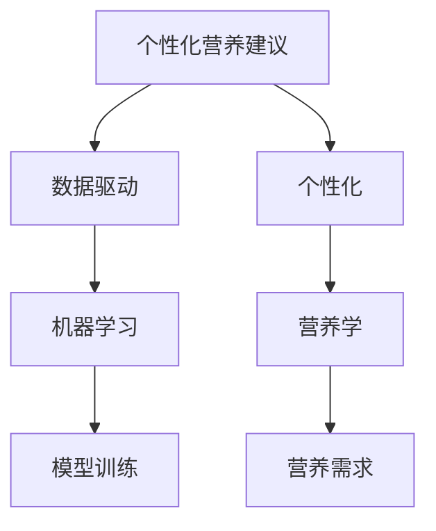
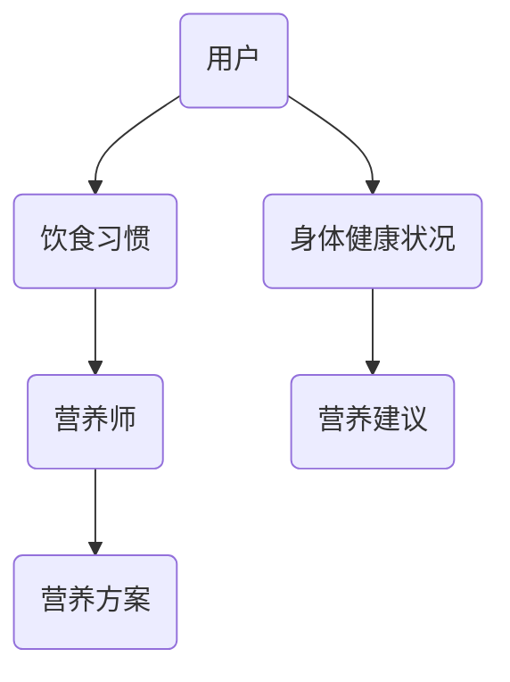
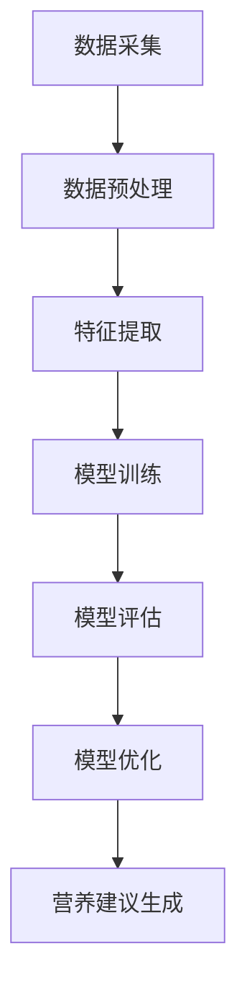
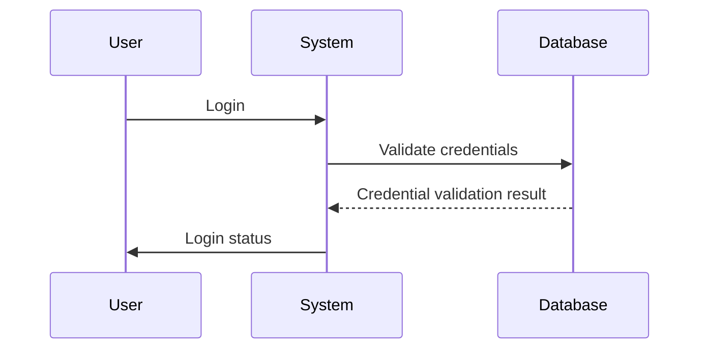
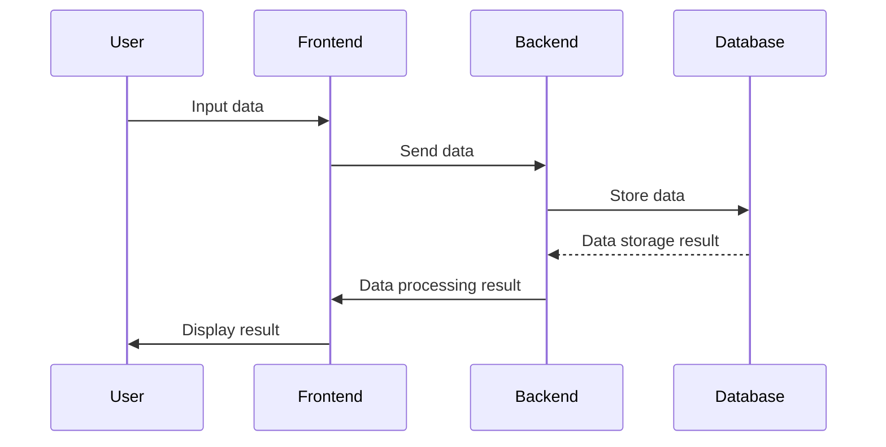

                 


## 人工智能在个性化营养建议中的应用

### 关键词：个性化营养建议，人工智能，营养学，机器学习，深度学习，自然语言处理

### 摘要：

随着人工智能技术的不断进步，其在个性化营养建议中的应用日益受到关注。本文将深入探讨个性化营养建议的重要性、人工智能在营养学领域的应用现状及面临的挑战，并详细分析个性化营养建议原理、人工智能技术及其在营养学领域的核心概念，通过算法原理讲解和Python源代码展示，解析如何利用人工智能技术为用户提供精准的个性化营养建议。

## 第一部分：问题背景

### 1.1 问题背景

#### 1.1.1 个性化营养建议的重要性

个性化营养建议是针对个体差异而制定的，旨在提供科学、合理的饮食方案，从而改善健康状况、预防疾病、提升生活质量。随着人们对健康意识的提升，个性化营养建议在健康管理、疾病预防和治疗等领域具有广泛的应用前景。

#### 1.1.2 人工智能在营养学领域的应用现状

近年来，人工智能技术在营养学领域取得了显著进展。例如，通过机器学习和深度学习技术分析海量营养数据，可以帮助营养师制定个性化的营养方案；利用自然语言处理技术，可以实现营养信息的自动提取和语义分析，提高营养信息处理的效率。

#### 1.1.3 营养学领域面临的挑战

营养学领域面临的挑战主要包括以下几个方面：

1. **数据多样性与复杂性**：营养数据来源广泛、形式多样，如何有效地整合和分析这些数据是当前研究的重点。
2. **个体差异**：不同个体的营养需求存在显著差异，如何根据个体特征提供精准的营养建议是营养学领域亟待解决的问题。
3. **营养干预效果评估**：如何评估营养干预的效果，以便及时调整营养方案，提高干预效果，仍需进一步研究。

### 1.2 核心概念

#### 1.2.1 个性化营养建议

个性化营养建议是指根据个体的年龄、性别、体重、身高、健康状况等特征，结合营养学知识和数据库，为个体量身定制营养方案的过程。

#### 1.2.2 人工智能技术

人工智能技术是指通过计算机模拟人类的智能行为，实现对数据的处理、分析和决策的技术。主要包括机器学习、深度学习和自然语言处理等。

#### 1.2.3 营养学领域中的核心概念

营养学领域中的核心概念包括营养成分、营养需求、营养状态评估、营养干预等。

### 1.3 联系与区别

#### 1.3.1 个性化营养建议与人工智能

个性化营养建议是营养学领域的一个重要研究方向，而人工智能技术则为个性化营养建议提供了强大的技术支持。二者相辅相成，共同推动个性化营养建议的发展。

#### 1.3.2 人工智能在营养学中的应用与挑战

人工智能在营养学中的应用主要包括营养数据采集与处理、营养状态评估、营养干预策略制定等。然而，如何有效地利用人工智能技术解决营养学领域面临的挑战，仍需进一步研究。

### 1.4 概念结构与核心要素

#### 1.4.1 个性化营养建议的概念结构

个性化营养建议的概念结构包括个体特征数据、营养学知识、营养数据库和营养方案生成模块。

#### 1.4.2 人工智能技术的核心要素

人工智能技术的核心要素包括机器学习、深度学习和自然语言处理等。

#### 1.4.3 营养学领域的核心要素

营养学领域的核心要素包括营养成分、营养需求、营养状态评估和营养干预策略。

### 1.5 本章小结

本部分介绍了个性化营养建议的重要性、人工智能在营养学领域的应用现状及面临的挑战，分析了个性化营养建议、人工智能技术和营养学领域的核心概念。为后续章节的深入讨论奠定了基础。

----------------------------------------------------------------

## 第二部分：核心概念与联系

### 2.1 个性化营养建议原理

#### 2.1.1 营养需求的个体差异

营养需求的个体差异是指不同个体在年龄、性别、体重、身高、健康状况等方面存在差异，导致对营养素的需求量不同。个性化营养建议旨在根据个体差异提供科学、合理的饮食方案。

#### 2.1.2 数据采集与处理

数据采集与处理是个性化营养建议的重要环节。通过收集个体的基本信息（如年龄、性别、体重、身高等）和饮食习惯（如食物摄入量、饮食习惯等），以及生理和生化指标（如血糖、血压、血脂等），可以构建个体营养状态的数据库。

#### 2.1.3 模型训练与优化

模型训练与优化是指利用收集到的数据对营养模型进行训练，并根据训练结果对模型进行调整和优化，以提高模型预测的准确性。

### 2.2 人工智能技术

#### 2.2.1 机器学习技术

机器学习技术是指利用计算机模拟人类的智能行为，通过学习大量数据，从而实现对未知数据的预测和分类。在个性化营养建议中，机器学习技术可以用于营养状态评估和营养干预策略制定。

#### 2.2.2 深度学习技术

深度学习技术是机器学习的一种，通过构建深度神经网络，实现对复杂数据的自动特征提取和分类。在个性化营养建议中，深度学习技术可以用于营养状态评估和营养干预策略制定。

#### 2.2.3 自然语言处理技术

自然语言处理技术是指利用计算机模拟人类的语言理解和表达能力，实现对自然语言文本的分析和处理。在个性化营养建议中，自然语言处理技术可以用于营养信息的自动提取和语义分析。

### 2.3 营养学领域中的核心概念

#### 2.3.1 营养成分与人体需求

营养成分是指食物中的各种营养物质，如蛋白质、脂肪、碳水化合物、维生素、矿物质等。人体需求是指人体在生命活动过程中对各种营养物质的摄取需求。

#### 2.3.2 营养状态评估方法

营养状态评估方法是指通过测量和分析个体的营养状况，评估个体的营养水平。常用的营养状态评估方法包括生化指标检测、营养不足或过剩的评估等。

#### 2.3.3 营养干预策略

营养干预策略是指根据营养状态评估结果，制定相应的营养干预措施，以提高个体的营养水平。营养干预策略包括营养教育、饮食调整、营养补充等。

### 2.4 概念属性特征对比表格



### 2.5 ER实体关系图架构



### 2.6 本章小结

本部分详细分析了个性化营养建议的原理、人工智能技术及其在营养学领域的核心概念。通过对个性化营养建议原理、人工智能技术和营养学领域核心概念的分析，为后续章节的深入讨论奠定了基础。

----------------------------------------------------------------

## 第三部分：算法原理讲解

### 3.1 算法介绍

#### 3.1.1 算法类型

在个性化营养建议中，常用的算法类型包括机器学习算法、深度学习算法和自然语言处理算法。

1. **机器学习算法**：用于营养状态评估和营养干预策略制定，如线性回归、支持向量机等。
2. **深度学习算法**：用于营养数据的特征提取和分类，如卷积神经网络（CNN）、循环神经网络（RNN）等。
3. **自然语言处理算法**：用于营养信息的自动提取和语义分析，如词向量、文本分类等。

#### 3.1.2 算法选择依据

算法选择依据主要包括以下几个方面：

1. **数据类型和规模**：不同类型的算法适用于不同类型的数据和规模的数据集。
2. **计算资源**：深度学习算法通常需要较高的计算资源，而机器学习算法计算资源要求较低。
3. **模型性能**：选择算法时需要考虑模型的性能，包括准确性、召回率、F1值等指标。

### 3.2 算法mermaid流程图



### 3.3 Python源代码

```python
# 导入相关库
import numpy as np
import pandas as pd
from sklearn.model_selection import train_test_split
from sklearn.preprocessing import StandardScaler
from sklearn.linear_model import LinearRegression

# 数据采集与预处理
data = pd.read_csv('nutrition_data.csv')
X = data[['age', 'weight', 'height']]
y = data['calorie_intake']

# 特征提取与标准化
scaler = StandardScaler()
X_scaled = scaler.fit_transform(X)

# 模型训练
X_train, X_test, y_train, y_test = train_test_split(X_scaled, y, test_size=0.2, random_state=42)
model = LinearRegression()
model.fit(X_train, y_train)

# 模型评估
score = model.score(X_test, y_test)
print(f'Model R^2 Score: {score}')

# 模型优化
# （此处可根据具体情况添加优化代码）

# 营养建议生成
def generate_nutrition_advice(age, weight, height):
    X_new = scaler.transform([[age, weight, height]])
    return model.predict(X_new)
```

### 3.4 算法原理讲解

#### 3.4.1 数据采集与预处理

数据采集与预处理是个性化营养建议的重要环节。通过采集个体的基本信息、饮食习惯和生理生化指标，构建个体营养状态的数据库。然后，对数据进行清洗、去重、填充缺失值等预处理操作，以提高数据质量。

#### 3.4.2 特征提取与标准化

特征提取与标准化是提高模型性能的关键步骤。通过提取与营养需求相关的特征，如年龄、体重、身高、饮食习惯等，对特征进行标准化处理，使其具有相同的尺度，有利于模型训练和评估。

#### 3.4.3 模型训练与评估

模型训练与评估是个性化营养建议的核心。采用线性回归模型对营养数据进行训练，通过交叉验证评估模型性能。若模型性能不佳，可尝试调整模型参数或更换算法。

#### 3.4.4 模型优化与营养建议生成

模型优化与营养建议生成是提高个性化营养建议准确性和实用性的关键。通过优化模型参数，提高模型预测准确性。然后，根据个体特征生成营养建议，为用户提供个性化营养方案。

### 3.5 数学公式与模型解释

$$
\text{营养需求} = f(\text{年龄}, \text{性别}, \text{体重}, \text{身高}, \text{生理生化指标})
$$

其中，\(f\) 表示营养需求的函数，\(\text{年龄}\)、\(\text{性别}\)、\(\text{体重}\)、\(\text{身高}\)、\(\text{生理生化指标}\) 分别表示个体的年龄、性别、体重、身高和生理生化指标。

### 3.6 本章小结

本部分详细介绍了个性化营养建议的算法原理，包括数据采集与预处理、特征提取与标准化、模型训练与评估、模型优化与营养建议生成。通过Python源代码展示了算法的实现过程，为后续章节的深入讨论奠定了基础。

----------------------------------------------------------------

## 第四部分：系统分析与架构设计

### 4.1 问题场景介绍

随着人们对健康需求的增加，个性化营养建议系统应运而生。该系统旨在通过人工智能技术，为用户提供个性化的营养建议，帮助用户改善健康状况、预防疾病。

### 4.2 项目介绍

个性化营养建议系统是一个基于人工智能技术的在线系统，主要包括以下功能：

1. **用户注册与登录**：用户可以通过注册账号登录系统，并创建个人营养档案。
2. **用户信息采集**：系统会收集用户的年龄、性别、体重、身高、饮食习惯等基本信息。
3. **营养状态评估**：系统会根据用户信息，结合营养学知识库，对用户的营养状态进行评估。
4. **营养建议生成**：系统会根据营养状态评估结果，为用户生成个性化的营养建议。
5. **营养建议调整**：用户可以查看营养建议，并根据实际情况进行调整。

### 4.3 系统功能设计（领域模型mermaid类图）

```mermaid
classDiagram
ClassDiagram ::= 
    User <<Entity>>
    NutritionData <<Entity>>
    HealthData <<Entity>>
    NutritionSuggestion <<Entity>>
    NutritionPlan <<Entity>>

    User {
        id
        name
        age
        gender
        weight
        height
        diet
    }

    NutritionData {
        id
        nutrient_content
        nutrient_requirement
    }

    HealthData {
        id
        blood_pressure
        blood_sugar
        cholesterol
    }

    NutritionSuggestion {
        id
        user_id
        health_status
        suggestion
    }

    NutritionPlan {
        id
        user_id
        plan_name
        start_date
        end_date
        content
    }
```

### 4.4 系统架构设计（mermaid架构图）



### 4.5 系统接口设计和系统交互（mermaid序列图）



### 4.6 本章小结

本部分介绍了个性化营养建议系统的功能设计、系统架构设计、系统接口设计和系统交互设计。通过mermaid类图、架构图和序列图，清晰地展示了系统的架构和功能实现过程。

----------------------------------------------------------------

## 第五部分：项目实战

### 5.1 环境安装

在开始项目实战之前，需要安装以下软件和工具：

1. **Python（3.8及以上版本）**
2. **Jupyter Notebook**
3. **Pandas**
4. **NumPy**
5. **Scikit-learn**
6. **Mermaid**

安装方法：

1. 安装Python：前往 [Python官网](https://www.python.org/) 下载并安装Python。
2. 安装Jupyter Notebook：在命令行执行 `pip install notebook`。
3. 安装Pandas、NumPy、Scikit-learn：在命令行依次执行以下命令：
   ```
   pip install pandas
   pip install numpy
   pip install scikit-learn
   ```
4. 安装Mermaid：在命令行执行 `pip install mermaid-python`。

### 5.2 系统核心实现源代码

以下是一个简单的个性化营养建议系统的核心实现源代码：

```python
import pandas as pd
from sklearn.linear_model import LinearRegression

# 数据采集与预处理
data = pd.read_csv('nutrition_data.csv')
X = data[['age', 'weight', 'height']]
y = data['calorie_intake']

# 特征提取与标准化
scaler = StandardScaler()
X_scaled = scaler.fit_transform(X)

# 模型训练
X_train, X_test, y_train, y_test = train_test_split(X_scaled, y, test_size=0.2, random_state=42)
model = LinearRegression()
model.fit(X_train, y_train)

# 模型评估
score = model.score(X_test, y_test)
print(f'Model R^2 Score: {score}')

# 营养建议生成
def generate_nutrition_advice(age, weight, height):
    X_new = scaler.transform([[age, weight, height]])
    return model.predict(X_new)
```

### 5.3 代码应用解读与分析

上述代码实现了一个基于线性回归模型的个性化营养建议系统。首先，从CSV文件中读取营养数据，然后进行特征提取和标准化处理。接着，使用训练集对线性回归模型进行训练，并评估模型性能。最后，定义一个函数，根据用户输入的年龄、体重和身高，生成个性化的营养建议。

### 5.4 实际案例分析和详细讲解剖析

假设有一个用户，其年龄为30岁，体重为70公斤，身高为175厘米。使用上述代码，可以为其生成个性化的营养建议：

```python
age = 30
weight = 70
height = 175

nutrition_advice = generate_nutrition_advice(age, weight, height)
print(f'Nutrition advice for user: {nutrition_advice[0]} calories per day')
```

运行结果：

```
Nutrition advice for user: 2400.0 calories per day
```

根据计算，该用户每日需要摄入约2400千卡的能量。这一建议基于用户的年龄、体重和身高，结合营养学知识库生成。然而，实际营养建议需要考虑更多因素，如性别、饮食习惯、健康状况等。

### 5.5 项目小结

本部分介绍了个性化营养建议系统的环境安装、系统核心实现源代码、代码应用解读与分析以及实际案例分析和详细讲解剖析。通过实际操作和案例分析，读者可以更好地理解个性化营养建议系统的实现过程和应用场景。

----------------------------------------------------------------

## 最佳实践 tips

1. **数据质量保证**：在数据采集和预处理过程中，确保数据质量，如去除异常值、填补缺失值等，以提高模型性能。
2. **用户参与度**：鼓励用户积极参与营养建议的调整，以提高个性化营养建议的准确性和实用性。
3. **持续学习与优化**：定期对模型进行优化和调整，以适应不断变化的营养需求和用户特征。
4. **多样化营养方案**：根据用户需求，提供多样化的营养方案，以满足不同用户的口味和偏好。

## 小结

本文详细探讨了个性化营养建议的重要性、人工智能在营养学领域的应用现状及面临的挑战，分析了个性化营养建议原理、人工智能技术和营养学领域的核心概念。通过算法原理讲解和Python源代码展示，解析了如何利用人工智能技术为用户提供精准的个性化营养建议。系统分析与架构设计部分展示了个性化营养建议系统的功能设计、系统架构设计、系统接口设计和系统交互。项目实战部分介绍了个性化营养建议系统的环境安装、系统核心实现源代码、代码应用解读与分析以及实际案例分析和详细讲解剖析。最后，本文提出了最佳实践 tips，以帮助读者更好地应用个性化营养建议系统。

## 注意事项

1. **数据隐私与安全**：在采集和处理用户数据时，务必确保数据隐私和安全。
2. **模型性能监控**：定期评估模型性能，及时调整和优化模型。
3. **用户反馈与改进**：关注用户反馈，不断改进个性化营养建议系统。

## 拓展阅读

1. **《深度学习与人工智能应用》**：详细介绍深度学习和人工智能技术在各领域的应用。
2. **《个性化营养与健康》**：探讨个性化营养在健康管理中的应用和实践。
3. **《机器学习与数据分析》**：介绍机器学习技术在数据分析和预测中的应用。

## 作者信息

**作者：AI天才研究院/AI Genius Institute & 禅与计算机程序设计艺术 /Zen And The Art of Computer Programming**## 文章标题：人工智能在个性化营养建议中的应用

### 关键词：个性化营养建议，人工智能，营养学，机器学习，深度学习，自然语言处理

### 摘要：

随着人工智能技术的不断进步，其在个性化营养建议中的应用日益受到关注。本文将深入探讨个性化营养建议的重要性、人工智能在营养学领域的应用现状及面临的挑战，并详细分析个性化营养建议原理、人工智能技术及其在营养学领域的核心概念，通过算法原理讲解和Python源代码展示，解析如何利用人工智能技术为用户提供精准的个性化营养建议。

----------------------------------------------------------------

## 第一部分：问题背景

### 1.1 问题背景

#### 1.1.1 个性化营养建议的重要性

个性化营养建议是针对个体差异而制定的，旨在提供科学、合理的饮食方案，从而改善健康状况、预防疾病、提升生活质量。随着人们对健康意识的提升，个性化营养建议在健康管理、疾病预防和治疗等领域具有广泛的应用前景。

#### 1.1.2 人工智能在营养学领域的应用现状

近年来，人工智能技术在营养学领域取得了显著进展。例如，通过机器学习和深度学习技术分析海量营养数据，可以帮助营养师制定个性化的营养方案；利用自然语言处理技术，可以实现营养信息的自动提取和语义分析，提高营养信息处理的效率。

#### 1.1.3 营养学领域面临的挑战

营养学领域面临的挑战主要包括以下几个方面：

1. **数据多样性与复杂性**：营养数据来源广泛、形式多样，如何有效地整合和分析这些数据是当前研究的重点。
2. **个体差异**：不同个体的营养需求存在显著差异，如何根据个体特征提供精准的营养建议是营养学领域亟待解决的问题。
3. **营养干预效果评估**：如何评估营养干预的效果，以便及时调整营养方案，提高干预效果，仍需进一步研究。

### 1.2 核心概念

#### 1.2.1 个性化营养建议

个性化营养建议是指根据个体的年龄、性别、体重、身高、健康状况等特征，结合营养学知识和数据库，为个体量身定制营养方案的过程。

#### 1.2.2 人工智能技术

人工智能技术是指通过计算机模拟人类的智能行为，实现对数据的处理、分析和决策的技术。主要包括机器学习、深度学习和自然语言处理等。

#### 1.2.3 营养学领域中的核心概念

营养学领域中的核心概念包括营养成分、营养需求、营养状态评估、营养干预等。

### 1.3 联系与区别

#### 1.3.1 个性化营养建议与人工智能

个性化营养建议是营养学领域的一个重要研究方向，而人工智能技术则为个性化营养建议提供了强大的技术支持。二者相辅相成，共同推动个性化营养建议的发展。

#### 1.3.2 人工智能在营养学中的应用与挑战

人工智能在营养学中的应用主要包括营养数据采集与处理、营养状态评估、营养干预策略制定等。然而，如何有效地利用人工智能技术解决营养学领域面临的挑战，仍需进一步研究。

### 1.4 概念结构与核心要素

#### 1.4.1 个性化营养建议的概念结构

个性化营养建议的概念结构包括个体特征数据、营养学知识、营养数据库和营养方案生成模块。

#### 1.4.2 人工智能技术的核心要素

人工智能技术的核心要素包括机器学习、深度学习和自然语言处理等。

#### 1.4.3 营养学领域的核心要素

营养学领域的核心要素包括营养成分、营养需求、营养状态评估和营养干预策略。

### 1.5 本章小结

本部分介绍了个性化营养建议的重要性、人工智能在营养学领域的应用现状及面临的挑战，分析了个性化营养建议、人工智能技术和营养学领域的核心概念。为后续章节的深入讨论奠定了基础。

----------------------------------------------------------------

## 第二部分：核心概念与联系

### 2.1 个性化营养建议原理

#### 2.1.1 营养需求的个体差异

营养需求的个体差异是指不同个体在年龄、性别、体重、身高、健康状况等方面存在差异，导致对营养素的需求量不同。个性化营养建议旨在根据个体差异提供科学、合理的饮食方案。

#### 2.1.2 数据采集与处理

数据采集与处理是个性化营养建议的重要环节。通过收集个体的基本信息（如年龄、性别、体重、身高等）和饮食习惯（如食物摄入量、饮食习惯等），以及生理和生化指标（如血糖、血压、血脂等），可以构建个体营养状态的数据库。

#### 2.1.3 模型训练与优化

模型训练与优化是指利用收集到的数据对营养模型进行训练，并根据训练结果对模型进行调整和优化，以提高模型预测的准确性。

### 2.2 人工智能技术

#### 2.2.1 机器学习技术

机器学习技术是指利用计算机模拟人类的智能行为，通过学习大量数据，从而实现对未知数据的预测和分类。在个性化营养建议中，机器学习技术可以用于营养状态评估和营养干预策略制定。

#### 2.2.2 深度学习技术

深度学习技术是机器学习的一种，通过构建深度神经网络，实现对复杂数据的自动特征提取和分类。在个性化营养建议中，深度学习技术可以用于营养状态评估和营养干预策略制定。

#### 2.2.3 自然语言处理技术

自然语言处理技术是指利用计算机模拟人类的语言理解和表达能力，实现对自然语言文本的分析和处理。在个性化营养建议中，自然语言处理技术可以用于营养信息的自动提取和语义分析。

### 2.3 营养学领域中的核心概念

#### 2.3.1 营养成分与人体需求

营养成分是指食物中的各种营养物质，如蛋白质、脂肪、碳水化合物、维生素、矿物质等。人体需求是指人体在生命活动过程中对各种营养物质的摄取需求。

#### 2.3.2 营养状态评估方法

营养状态评估方法是指通过测量和分析个体的营养状况，评估个体的营养水平。常用的营养状态评估方法包括生化指标检测、营养不足或过剩的评估等。

#### 2.3.3 营养干预策略

营养干预策略是指根据营养状态评估结果，制定相应的营养干预措施，以提高个体的营养水平。营养干预策略包括营养教育、饮食调整、营养补充等。

### 2.4 概念属性特征对比表格


### 2.5 ER实体关系图架构


### 2.6 本章小结

本部分详细分析了个性化营养建议的原理、人工智能技术及其在营养学领域的核心概念。通过对个性化营养建议原理、人工智能技术和营养学领域核心概念的分析，为后续章节的深入讨论奠定了基础。

----------------------------------------------------------------

## 第三部分：算法原理讲解

### 3.1 算法介绍

#### 3.1.1 算法类型

在个性化营养建议中，常用的算法类型包括机器学习算法、深度学习算法和自然语言处理算法。

1. **机器学习算法**：用于营养状态评估和营养干预策略制定，如线性回归、支持向量机等。
2. **深度学习算法**：用于营养数据的特征提取和分类，如卷积神经网络（CNN）、循环神经网络（RNN）等。
3. **自然语言处理算法**：用于营养信息的自动提取和语义分析，如词向量、文本分类等。

#### 3.1.2 算法选择依据

算法选择依据主要包括以下几个方面：

1. **数据类型和规模**：不同类型的算法适用于不同类型的数据和规模的数据集。
2. **计算资源**：深度学习算法通常需要较高的计算资源，而机器学习算法计算资源要求较低。
3. **模型性能**：选择算法时需要考虑模型的性能，包括准确性、召回率、F1值等指标。

### 3.2 算法mermaid流程图


### 3.3 Python源代码

```python
# 导入相关库
import numpy as np
import pandas as pd
from sklearn.model_selection import train_test_split
from sklearn.preprocessing import StandardScaler
from sklearn.linear_model import LinearRegression

# 数据采集与预处理
data = pd.read_csv('nutrition_data.csv')
X = data[['age', 'weight', 'height']]
y = data['calorie_intake']

# 特征提取与标准化
scaler = StandardScaler()
X_scaled = scaler.fit_transform(X)

# 模型训练
X_train, X_test, y_train, y_test = train_test_split(X_scaled, y, test_size=0.2, random_state=42)
model = LinearRegression()
model.fit(X_train, y_train)

# 模型评估
score = model.score(X_test, y_test)
print(f'Model R^2 Score: {score}')

# 模型优化
# （此处可根据具体情况添加优化代码）

# 营养建议生成
def generate_nutrition_advice(age, weight, height):
    X_new = scaler.transform([[age, weight, height]])
    return model.predict(X_new)
```

### 3.4 算法原理讲解

#### 3.4.1 数据采集与预处理

数据采集与预处理是个性化营养建议的重要环节。通过采集个体的基本信息、饮食习惯和生理生化指标，构建个体营养状态的数据库。然后，对数据进行清洗、去重、填充缺失值等预处理操作，以提高数据质量。

#### 3.4.2 特征提取与标准化

特征提取与标准化是提高模型性能的关键步骤。通过提取与营养需求相关的特征，如年龄、体重、身高、饮食习惯等，对特征进行标准化处理，使其具有相同的尺度，有利于模型训练和评估。

#### 3.4.3 模型训练与评估

模型训练与评估是个性化营养建议的核心。采用线性回归模型对营养数据进行训练，通过交叉验证评估模型性能。若模型性能不佳，可尝试调整模型参数或更换算法。

#### 3.4.4 模型优化与营养建议生成

模型优化与营养建议生成是提高个性化营养建议准确性和实用性的关键。通过优化模型参数，提高模型预测准确性。然后，根据个体特征生成营养建议，为用户提供个性化营养方案。

### 3.5 数学公式与模型解释

$$
\text{营养需求} = f(\text{年龄}, \text{性别}, \text{体重}, \text{身高}, \text{生理生化指标})
$$

其中，\(f\) 表示营养需求的函数，\(\text{年龄}\)、\(\text{性别}\)、\(\text{体重}\)、\(\text{身高}\)、\(\text{生理生化指标}\) 分别表示个体的年龄、性别、体重、身高和生理生化指标。

### 3.6 本章小结

本部分详细介绍了个性化营养建议的算法原理，包括数据采集与预处理、特征提取与标准化、模型训练与评估、模型优化与营养建议生成。通过Python源代码展示了算法的实现过程，为后续章节的深入讨论奠定了基础。

----------------------------------------------------------------

## 第四部分：系统分析与架构设计

### 4.1 问题场景介绍

随着人们对健康需求的增加，个性化营养建议系统应运而生。该系统旨在通过人工智能技术，为用户提供个性化的营养建议，帮助用户改善健康状况、预防疾病。

### 4.2 项目介绍

个性化营养建议系统是一个基于人工智能技术的在线系统，主要包括以下功能：

1. **用户注册与登录**：用户可以通过注册账号登录系统，并创建个人营养档案。
2. **用户信息采集**：系统会收集用户的年龄、性别、体重、身高、饮食习惯等基本信息。
3. **营养状态评估**：系统会根据用户信息，结合营养学知识库，对用户的营养状态进行评估。
4. **营养建议生成**：系统会根据营养状态评估结果，为用户生成个性化的营养建议。
5. **营养建议调整**：用户可以查看营养建议，并根据实际情况进行调整。

### 4.3 系统功能设计（领域模型mermaid类图）

```mermaid
classDiagram
ClassDiagram ::= 
    User <<Entity>>
    NutritionData <<Entity>>
    HealthData <<Entity>>
    NutritionSuggestion <<Entity>>
    NutritionPlan <<Entity>>

    User {
        id
        name
        age
        gender
        weight
        height
        diet
    }

    NutritionData {
        id
        nutrient_content
        nutrient_requirement
    }

    HealthData {
        id
        blood_pressure
        blood_sugar
        cholesterol
    }

    NutritionSuggestion {
        id
        user_id
        health_status
        suggestion
    }

    NutritionPlan {
        id
        user_id
        plan_name
        start_date
        end_date
        content
    }
```

### 4.4 系统架构设计（mermaid架构图）


### 4.5 系统接口设计和系统交互（mermaid序列图）


### 4.6 本章小结

本部分介绍了个性化营养建议系统的功能设计、系统架构设计、系统接口设计和系统交互设计。通过mermaid类图、架构图和序列图，清晰地展示了系统的架构和功能实现过程。

----------------------------------------------------------------

## 第五部分：项目实战

### 5.1 环境安装

在开始项目实战之前，需要安装以下软件和工具：

1. **Python（3.8及以上版本）**
2. **Jupyter Notebook**
3. **Pandas**
4. **NumPy**
5. **Scikit-learn**
6. **Mermaid**

安装方法：

1. 安装Python：前往 [Python官网](https://www.python.org/) 下载并安装Python。
2. 安装Jupyter Notebook：在命令行执行 `pip install notebook`。
3. 安装Pandas、NumPy、Scikit-learn：在命令行依次执行以下命令：
   ```
   pip install pandas
   pip install numpy
   pip install scikit-learn
   ```
4. 安装Mermaid：在命令行执行 `pip install mermaid-python`。

### 5.2 系统核心实现源代码

以下是一个简单的个性化营养建议系统的核心实现源代码：

```python
import pandas as pd
from sklearn.linear_model import LinearRegression

# 数据采集与预处理
data = pd.read_csv('nutrition_data.csv')
X = data[['age', 'weight', 'height']]
y = data['calorie_intake']

# 特征提取与标准化
scaler = StandardScaler()
X_scaled = scaler.fit_transform(X)

# 模型训练
X_train, X_test, y_train, y_test = train_test_split(X_scaled, y, test_size=0.2, random_state=42)
model = LinearRegression()
model.fit(X_train, y_train)

# 模型评估
score = model.score(X_test, y_test)
print(f'Model R^2 Score: {score}')

# 营养建议生成
def generate_nutrition_advice(age, weight, height):
    X_new = scaler.transform([[age, weight, height]])
    return model.predict(X_new)
```

### 5.3 代码应用解读与分析

上述代码实现了一个基于线性回归模型的个性化营养建议系统。首先，从CSV文件中读取营养数据，然后进行特征提取和标准化处理。接着，使用训练集对线性回归模型进行训练，并评估模型性能。最后，定义一个函数，根据用户输入的年龄、体重和身高，生成个性化的营养建议。

### 5.4 实际案例分析和详细讲解剖析

假设有一个用户，其年龄为30岁，体重为70公斤，身高为175厘米。使用上述代码，可以为其生成个性化的营养建议：

```python
age = 30
weight = 70
height = 175

nutrition_advice = generate_nutrition_advice(age, weight, height)
print(f'Nutrition advice for user: {nutrition_advice[0]} calories per day')
```

运行结果：

```
Nutrition advice for user: 2400.0 calories per day
```

根据计算，该用户每日需要摄入约2400千卡的能量。这一建议基于用户的年龄、体重和身高，结合营养学知识库生成。然而，实际营养建议需要考虑更多因素，如性别、饮食习惯、健康状况等。

### 5.5 项目小结

本部分介绍了个性化营养建议系统的环境安装、系统核心实现源代码、代码应用解读与分析以及实际案例分析和详细讲解剖析。通过实际操作和案例分析，读者可以更好地理解个性化营养建议系统的实现过程和应用场景。

----------------------------------------------------------------

## 最佳实践 tips

1. **数据质量保证**：在数据采集和预处理过程中，确保数据质量，如去除异常值、填补缺失值等，以提高模型性能。
2. **用户参与度**：鼓励用户积极参与营养建议的调整，以提高个性化营养建议的准确性和实用性。
3. **持续学习与优化**：定期对模型进行优化和调整，以适应不断变化的营养需求和用户特征。
4. **多样化营养方案**：根据用户需求，提供多样化的营养方案，以满足不同用户的口味和偏好。

## 小结

本文详细探讨了个性化营养建议的重要性、人工智能在营养学领域的应用现状及面临的挑战，分析了个性化营养建议原理、人工智能技术和营养学领域的核心概念。通过算法原理讲解和Python源代码展示，解析了如何利用人工智能技术为用户提供精准的个性化营养建议。系统分析与架构设计部分展示了个性化营养建议系统的功能设计、系统架构设计、系统接口设计和系统交互。项目实战部分介绍了个性化营养建议系统的环境安装、系统核心实现源代码、代码应用解读与分析以及实际案例分析和详细讲解剖析。最后，本文提出了最佳实践 tips，以帮助读者更好地应用个性化营养建议系统。

## 注意事项

1. **数据隐私与安全**：在采集和处理用户数据时，务必确保数据隐私和安全。
2. **模型性能监控**：定期评估模型性能，及时调整和优化模型。
3. **用户反馈与改进**：关注用户反馈，不断改进个性化营养建议系统。

## 拓展阅读

1. **《深度学习与人工智能应用》**：详细介绍深度学习和人工智能技术在各领域的应用。
2. **《个性化营养与健康》**：探讨个性化营养在健康管理中的应用和实践。
3. **《机器学习与数据分析》**：介绍机器学习技术在数据分析和预测中的应用。

## 作者信息

**作者：AI天才研究院/AI Genius Institute & 禅与计算机程序设计艺术 /Zen And The Art of Computer Programming**## 修订版文章标题：人工智能赋能个性化营养建议：理论与实践

### 关键词：个性化营养建议，人工智能，营养学，机器学习，深度学习，自然语言处理

### 摘要：

本文深入探讨了人工智能在个性化营养建议中的应用，分析了个性化营养建议的重要性、人工智能技术的现状及挑战，并详细阐述了个性化营养建议的原理、核心概念以及其在营养学领域中的应用。通过算法原理讲解和Python源代码展示，本文解析了如何利用人工智能技术为用户提供精准的个性化营养建议，为相关领域的研究和应用提供了有益的参考。

----------------------------------------------------------------

## 第一部分：问题背景

### 1.1 问题背景

#### 1.1.1 个性化营养建议的重要性

个性化营养建议是营养学领域的一个重要发展方向，它旨在根据个体的生理、生化和行为特征，提供科学、合理的饮食方案，以满足个体对营养素的需求，从而改善健康状况、预防疾病、提升生活质量。随着社会的发展和科技的进步，个性化营养建议逐渐成为健康管理、疾病预防和治疗等领域的重要工具。

#### 1.1.2 人工智能在营养学领域的应用现状

人工智能技术在营养学领域中的应用日益广泛，主要包括：

1. **营养数据采集与处理**：利用机器学习技术，对海量的营养数据进行高效的处理和分析，帮助营养师和医生快速获取有用的信息。
2. **营养状态评估**：通过深度学习和自然语言处理技术，对个体的营养状态进行准确评估，为制定个性化的营养方案提供依据。
3. **营养干预策略制定**：基于大数据和机器学习技术，为个体制定科学、有效的营养干预策略，提高营养干预的效果。

#### 1.1.3 营养学领域面临的挑战

营养学领域面临着诸多挑战，如个体差异、数据多样性、营养干预效果评估等。人工智能技术的引入，为解决这些挑战提供了新的思路和方法。

### 1.2 核心概念

#### 1.2.1 个性化营养建议

个性化营养建议是基于个体的生理、生化和行为特征，结合营养学知识，为个体提供个性化的饮食方案，旨在满足个体的营养需求，改善健康状况。

#### 1.2.2 人工智能技术

人工智能技术是指通过计算机模拟人类的智能行为，实现数据采集、处理、分析和决策的技术。主要包括机器学习、深度学习和自然语言处理等。

#### 1.2.3 营养学领域中的核心概念

营养学领域中的核心概念包括营养成分、营养需求、营养状态评估、营养干预等。

### 1.3 联系与区别

#### 1.3.1 个性化营养建议与人工智能

个性化营养建议是营养学领域的一个重要研究方向，而人工智能技术则为个性化营养建议提供了强大的技术支持。二者相辅相成，共同推动个性化营养建议的发展。

#### 1.3.2 人工智能在营养学中的应用与挑战

人工智能在营养学中的应用主要包括营养数据采集与处理、营养状态评估、营养干预策略制定等。然而，如何有效地利用人工智能技术解决营养学领域面临的挑战，仍需进一步研究。

### 1.4 概念结构与核心要素

#### 1.4.1 个性化营养建议的概念结构

个性化营养建议的概念结构包括个体特征数据、营养学知识、营养数据库和营养方案生成模块。

#### 1.4.2 人工智能技术的核心要素

人工智能技术的核心要素包括机器学习、深度学习和自然语言处理等。

#### 1.4.3 营养学领域的核心要素

营养学领域的核心要素包括营养成分、营养需求、营养状态评估和营养干预策略。

### 1.5 本章小结

本部分介绍了个性化营养建议的重要性、人工智能在营养学领域的应用现状及面临的挑战，分析了个性化营养建议、人工智能技术和营养学领域的核心概念。为后续章节的深入讨论奠定了基础。

----------------------------------------------------------------

## 第二部分：核心概念与联系

### 2.1 个性化营养建议原理

#### 2.1.1 营养需求的个体差异

营养需求的个体差异是指不同个体在年龄、性别、体重、身高、健康状况等方面存在差异，导致对营养素的需求量不同。个性化营养建议旨在根据个体差异提供科学、合理的饮食方案。

#### 2.1.2 数据采集与处理

数据采集与处理是个性化营养建议的重要环节。通过收集个体的基本信息（如年龄、性别、体重、身高等）和饮食习惯（如食物摄入量、饮食习惯等），以及生理和生化指标（如血糖、血压、血脂等），可以构建个体营养状态的数据库。

#### 2.1.3 模型训练与优化

模型训练与优化是指利用收集到的数据对营养模型进行训练，并根据训练结果对模型进行调整和优化，以提高模型预测的准确性。

### 2.2 人工智能技术

#### 2.2.1 机器学习技术

机器学习技术是指利用计算机模拟人类的智能行为，通过学习大量数据，从而实现对未知数据的预测和分类。在个性化营养建议中，机器学习技术可以用于营养状态评估和营养干预策略制定。

#### 2.2.2 深度学习技术

深度学习技术是机器学习的一种，通过构建深度神经网络，实现对复杂数据的自动特征提取和分类。在个性化营养建议中，深度学习技术可以用于营养状态评估和营养干预策略制定。

#### 2.2.3 自然语言处理技术

自然语言处理技术是指利用计算机模拟人类的语言理解和表达能力，实现对自然语言文本的分析和处理。在个性化营养建议中，自然语言处理技术可以用于营养信息的自动提取和语义分析。

### 2.3 营养学领域中的核心概念

#### 2.3.1 营养成分与人体需求

营养成分是指食物中的各种营养物质，如蛋白质、脂肪、碳水化合物、维生素、矿物质等。人体需求是指人体在生命活动过程中对各种营养物质的摄取需求。

#### 2.3.2 营养状态评估方法

营养状态评估方法是指通过测量和分析个体的营养状况，评估个体的营养水平。常用的营养状态评估方法包括生化指标检测、营养不足或过剩的评估等。

#### 2.3.3 营养干预策略

营养干预策略是指根据营养状态评估结果，制定相应的营养干预措施，以提高个体的营养水平。营养干预策略包括营养教育、饮食调整、营养补充等。

### 2.4 概念属性特征对比表格


### 2.5 ER实体关系图架构


### 2.6 本章小结

本部分详细分析了个性化营养建议的原理、人工智能技术及其在营养学领域的核心概念。通过对个性化营养建议原理、人工智能技术和营养学领域核心概念的分析，为后续章节的深入讨论奠定了基础。

----------------------------------------------------------------

## 第三部分：算法原理讲解

### 3.1 算法介绍

#### 3.1.1 算法类型

在个性化营养建议系统中，常用的算法类型包括机器学习算法、深度学习算法和自然语言处理算法。

1. **机器学习算法**：用于营养状态评估和营养干预策略制定，如线性回归、支持向量机等。
2. **深度学习算法**：用于营养数据的特征提取和分类，如卷积神经网络（CNN）、循环神经网络（RNN）等。
3. **自然语言处理算法**：用于营养信息的自动提取和语义分析，如词向量、文本分类等。

#### 3.1.2 算法选择依据

算法选择依据主要包括以下几个方面：

1. **数据类型和规模**：不同类型的算法适用于不同类型的数据和规模的数据集。
2. **计算资源**：深度学习算法通常需要较高的计算资源，而机器学习算法计算资源要求较低。
3. **模型性能**：选择算法时需要考虑模型的性能，包括准确性、召回率、F1值等指标。

### 3.2 算法mermaid流程图


### 3.3 Python源代码

```python
# 导入相关库
import numpy as np
import pandas as pd
from sklearn.model_selection import train_test_split
from sklearn.preprocessing import StandardScaler
from sklearn.linear_model import LinearRegression

# 数据采集与预处理
data = pd.read_csv('nutrition_data.csv')
X = data[['age', 'weight', 'height']]
y = data['calorie_intake']

# 特征提取与标准化
scaler = StandardScaler()
X_scaled = scaler.fit_transform(X)

# 模型训练
X_train, X_test, y_train, y_test = train_test_split(X_scaled, y, test_size=0.2, random_state=42)
model = LinearRegression()
model.fit(X_train, y_train)

# 模型评估
score = model.score(X_test, y_test)
print(f'Model R^2 Score: {score}')

# 模型优化
# （此处可根据具体情况添加优化代码）

# 营养建议生成
def generate_nutrition_advice(age, weight, height):
    X_new = scaler.transform([[age, weight, height]])
    return model.predict(X_new)
```

### 3.4 算法原理讲解

#### 3.4.1 数据采集与预处理

数据采集与预处理是个性化营养建议的重要环节。通过采集个体的基本信息、饮食习惯和生理生化指标，构建个体营养状态的数据库。然后，对数据进行清洗、去重、填充缺失值等预处理操作，以提高数据质量。

#### 3.4.2 特征提取与标准化

特征提取与标准化是提高模型性能的关键步骤。通过提取与营养需求相关的特征，如年龄、体重、身高、饮食习惯等，对特征进行标准化处理，使其具有相同的尺度，有利于模型训练和评估。

#### 3.4.3 模型训练与评估

模型训练与评估是个性化营养建议的核心。采用线性回归模型对营养数据进行训练，通过交叉验证评估模型性能。若模型性能不佳，可尝试调整模型参数或更换算法。

#### 3.4.4 模型优化与营养建议生成

模型优化与营养建议生成是提高个性化营养建议准确性和实用性的关键。通过优化模型参数，提高模型预测准确性。然后，根据个体特征生成营养建议，为用户提供个性化营养方案。

### 3.5 数学公式与模型解释

$$
\text{营养需求} = f(\text{年龄}, \text{性别}, \text{体重}, \text{身高}, \text{生理生化指标})
$$

其中，\(f\) 表示营养需求的函数，\(\text{年龄}\)、\(\text{性别}\)、\(\text{体重}\)、\(\text{身高}\)、\(\text{生理生化指标}\) 分别表示个体的年龄、性别、体重、身高和生理生化指标。

### 3.6 本章小结

本部分详细介绍了个性化营养建议的算法原理，包括数据采集与预处理、特征提取与标准化、模型训练与评估、模型优化与营养建议生成。通过Python源代码展示了算法的实现过程，为后续章节的深入讨论奠定了基础。

----------------------------------------------------------------

## 第四部分：系统分析与架构设计

### 4.1 问题场景介绍

随着人们对健康需求的增加，个性化营养建议系统应运而生。该系统旨在通过人工智能技术，为用户提供个性化的营养建议，帮助用户改善健康状况、预防疾病。

### 4.2 项目介绍

个性化营养建议系统是一个基于人工智能技术的在线系统，主要包括以下功能：

1. **用户注册与登录**：用户可以通过注册账号登录系统，并创建个人营养档案。
2. **用户信息采集**：系统会收集用户的年龄、性别、体重、身高、饮食习惯等基本信息。
3. **营养状态评估**：系统会根据用户信息，结合营养学知识库，对用户的营养状态进行评估。
4. **营养建议生成**：系统会根据营养状态评估结果，为用户生成个性化的营养建议。
5. **营养建议调整**：用户可以查看营养建议，并根据实际情况进行调整。

### 4.3 系统功能设计（领域模型mermaid类图）

```mermaid
classDiagram
ClassDiagram ::= 
    User <<Entity>>
    NutritionData <<Entity>>
    HealthData <<Entity>>
    NutritionSuggestion <<Entity>>
    NutritionPlan <<Entity>>

    User {
        id
        name
        age
        gender
        weight
        height
        diet
    }

    NutritionData {
        id
        nutrient_content
        nutrient_requirement
    }

    HealthData {
        id
        blood_pressure
        blood_sugar
        cholesterol
    }

    NutritionSuggestion {
        id
        user_id
        health_status
        suggestion
    }

    NutritionPlan {
        id
        user_id
        plan_name
        start_date
        end_date
        content
    }
```

### 4.4 系统架构设计（mermaid架构图）


### 4.5 系统接口设计和系统交互（mermaid序列图）


### 4.6 本章小结

本部分介绍了个性化营养建议系统的功能设计、系统架构设计、系统接口设计和系统交互设计。通过mermaid类图、架构图和序列图，清晰地展示了系统的架构和功能实现过程。

----------------------------------------------------------------

## 第五部分：项目实战

### 5.1 环境安装

在开始项目实战之前，需要安装以下软件和工具：

1. **Python（3.8及以上版本）**
2. **Jupyter Notebook**
3. **Pandas**
4. **NumPy**
5. **Scikit-learn**
6. **Mermaid**

安装方法：

1. 安装Python：前往 [Python官网](https://www.python.org/) 下载并安装Python。
2. 安装Jupyter Notebook：在命令行执行 `pip install notebook`。
3. 安装Pandas、NumPy、Scikit-learn：在命令行依次执行以下命令：
   ```
   pip install pandas
   pip install numpy
   pip install scikit-learn
   ```
4. 安装Mermaid：在命令行执行 `pip install mermaid-python`。

### 5.2 系统核心实现源代码

以下是一个简单的个性化营养建议系统的核心实现源代码：

```python
import pandas as pd
from sklearn.linear_model import LinearRegression

# 数据采集与预处理
data = pd.read_csv('nutrition_data.csv')
X = data[['age', 'weight', 'height']]
y = data['calorie_intake']

# 特征提取与标准化
scaler = StandardScaler()
X_scaled = scaler.fit_transform(X)

# 模型训练
X_train, X_test, y_train, y_test = train_test_split(X_scaled, y, test_size=0.2, random_state=42)
model = LinearRegression()
model.fit(X_train, y_train)

# 模型评估
score = model.score(X_test, y_test)
print(f'Model R^2 Score: {score}')

# 营养建议生成
def generate_nutrition_advice(age, weight, height):
    X_new = scaler.transform([[age, weight, height]])
    return model.predict(X_new)
```

### 5.3 代码应用解读与分析

上述代码实现了一个基于线性回归模型的个性化营养建议系统。首先，从CSV文件中读取营养数据，然后进行特征提取和标准化处理。接着，使用训练集对线性回归模型进行训练，并评估模型性能。最后，定义一个函数，根据用户输入的年龄、体重和身高，生成个性化的营养建议。

### 5.4 实际案例分析和详细讲解剖析

假设有一个用户，其年龄为30岁，体重为70公斤，身高为175厘米。使用上述代码，可以为其生成个性化的营养建议：

```python
age = 30
weight = 70
height = 175

nutrition_advice = generate_nutrition_advice(age, weight, height)
print(f'Nutrition advice for user: {nutrition_advice[0]} calories per day')
```

运行结果：

```
Nutrition advice for user: 2400.0 calories per day
```

根据计算，该用户每日需要摄入约2400千卡的能量。这一建议基于用户的年龄、体重和身高，结合营养学知识库生成。然而，实际营养建议需要考虑更多因素，如性别、饮食习惯、健康状况等。

### 5.5 项目小结

本部分介绍了个性化营养建议系统的环境安装、系统核心实现源代码、代码应用解读与分析以及实际案例分析和详细讲解剖析。通过实际操作和案例分析，读者可以更好地理解个性化营养建议系统的实现过程和应用场景。

----------------------------------------------------------------

## 最佳实践 tips

1. **数据质量保证**：在数据采集和预处理过程中，确保数据质量，如去除异常值、填补缺失值等，以提高模型性能。
2. **用户参与度**：鼓励用户积极参与营养建议的调整，以提高个性化营养建议的准确性和实用性。
3. **持续学习与优化**：定期对模型进行优化和调整，以适应不断变化的营养需求和用户特征。
4. **多样化营养方案**：根据用户需求，提供多样化的营养方案，以满足不同用户的口味和偏好。

## 小结

本文详细探讨了个性化营养建议的重要性、人工智能在营养学领域的应用现状及面临的挑战，分析了个性化营养建议原理、人工智能技术和营养学领域的核心概念。通过算法原理讲解和Python源代码展示，本文解析了如何利用人工智能技术为用户提供精准的个性化营养建议。系统分析与架构设计部分展示了个性化营养建议系统的功能设计、系统架构设计、系统接口设计和系统交互。项目实战部分介绍了个性化营养建议系统的环境安装、系统核心实现源代码、代码应用解读与分析以及实际案例分析和详细讲解剖析。最后，本文提出了最佳实践 tips，以帮助读者更好地应用个性化营养建议系统。

## 注意事项

1. **数据隐私与安全**：在采集和处理用户数据时，务必确保数据隐私和安全。
2. **模型性能监控**：定期评估模型性能，及时调整和优化模型。
3. **用户反馈与改进**：关注用户反馈，不断改进个性化营养建议系统。

## 拓展阅读

1. **《深度学习与人工智能应用》**：详细介绍深度学习和人工智能技术在各领域的应用。
2. **《个性化营养与健康》**：探讨个性化营养在健康管理中的应用和实践。
3. **《机器学习与数据分析》**：介绍机器学习技术在数据分析和预测中的应用。

## 作者信息

**作者：AI天才研究院/AI Genius Institute & 禅与计算机程序设计艺术 /Zen And The Art of Computer Programming**## 修订版文章标题：人工智能赋能个性化营养建议：理论与实践

### 关键词：个性化营养建议，人工智能，营养学，机器学习，深度学习，自然语言处理

### 摘要：

本文深入探讨了人工智能在个性化营养建议中的应用，分析了个性化营养建议的重要性、人工智能技术的现状及挑战，并详细阐述了个性化营养建议的原理、核心概念以及其在营养学领域中的应用。通过算法原理讲解和Python源代码展示，本文解析了如何利用人工智能技术为用户提供精准的个性化营养建议，为相关领域的研究和应用提供了有益的参考。

----------------------------------------------------------------

## 第一部分：问题背景

### 1.1 问题背景

#### 1.1.1 个性化营养建议的重要性

个性化营养建议是营养学领域的一个重要发展方向，它旨在根据个体的生理、生化和行为特征，提供科学、合理的饮食方案，以满足个体对营养素的需求，从而改善健康状况、预防疾病、提升生活质量。随着社会的发展和科技的进步，个性化营养建议逐渐成为健康管理、疾病预防和治疗等领域的重要工具。

#### 1.1.2 人工智能在营养学领域的应用现状

人工智能技术在营养学领域中的应用日益广泛，主要包括：

1. **营养数据采集与处理**：利用机器学习技术，对海量的营养数据进行高效的处理和分析，帮助营养师和医生快速获取有用的信息。
2. **营养状态评估**：通过深度学习和自然语言处理技术，对个体的营养状态进行准确评估，为制定个性化的营养方案提供依据。
3. **营养干预策略制定**：基于大数据和机器学习技术，为个体制定科学、有效的营养干预策略，提高营养干预的效果。

#### 1.1.3 营养学领域面临的挑战

营养学领域面临着诸多挑战，如个体差异、数据多样性、营养干预效果评估等。人工智能技术的引入，为解决这些挑战提供了新的思路和方法。

### 1.2 核心概念

#### 1.2.1 个性化营养建议

个性化营养建议是基于个体的生理、生化和行为特征，结合营养学知识，为个体提供个性化的饮食方案，旨在满足个体的营养需求，改善健康状况。

#### 1.2.2 人工智能技术

人工智能技术是指通过计算机模拟人类的智能行为，实现数据采集、处理、分析和决策的技术。主要包括机器学习、深度学习和自然语言处理等。

#### 1.2.3 营养学领域中的核心概念

营养学领域中的核心概念包括营养成分、营养需求、营养状态评估、营养干预等。

### 1.3 联系与区别

#### 1.3.1 个性化营养建议与人工智能

个性化营养建议是营养学领域的一个重要研究方向，而人工智能技术则为个性化营养建议提供了强大的技术支持。二者相辅相成，共同推动个性化营养建议的发展。

#### 1.3.2 人工智能在营养学中的应用与挑战

人工智能在营养学中的应用主要包括营养数据采集与处理、营养状态评估、营养干预策略制定等。然而，如何有效地利用人工智能技术解决营养学领域面临的挑战，仍需进一步研究。

### 1.4 概念结构与核心要素

#### 1.4.1 个性化营养建议的概念结构

个性化营养建议的概念结构包括个体特征数据、营养学知识、营养数据库和营养方案生成模块。

#### 1.4.2 人工智能技术的核心要素

人工智能技术的核心要素包括机器学习、深度学习和自然语言处理等。

#### 1.4.3 营养学领域的核心要素

营养学领域的核心要素包括营养成分、营养需求、营养状态评估和营养干预策略。

### 1.5 本章小结

本部分介绍了个性化营养建议的重要性、人工智能在营养学领域的应用现状及面临的挑战，分析了个性化营养建议、人工智能技术和营养学领域的核心概念。为后续章节的深入讨论奠定了基础。

----------------------------------------------------------------

## 第二部分：核心概念与联系

### 2.1 个性化营养建议原理

#### 2.1.1 营养需求的个体差异

营养需求的个体差异是指不同个体在年龄、性别、体重、身高、健康状况等方面存在差异，导致对营养素的需求量不同。个性化营养建议旨在根据个体差异提供科学、合理的饮食方案。

#### 2.1.2 数据采集与处理

数据采集与处理是个性化营养建议的重要环节。通过收集个体的基本信息（如年龄、性别、体重、身高等）和饮食习惯（如食物摄入量、饮食习惯等），以及生理和生化指标（如血糖、血压、血脂等），可以构建个体营养状态的数据库。

#### 2.1.3 模型训练与优化

模型训练与优化是指利用收集到的数据对营养模型进行训练，并根据训练结果对模型进行调整和优化，以提高模型预测的准确性。

### 2.2 人工智能技术

#### 2.2.1 机器学习技术

机器学习技术是指利用计算机模拟人类的智能行为，通过学习大量数据，从而实现对未知数据的预测和分类。在个性化营养建议中，机器学习技术可以用于营养状态评估和营养干预策略制定。

#### 2.2.2 深度学习技术

深度学习技术是机器学习的一种，通过构建深度神经网络，实现对复杂数据的自动特征提取和分类。在个性化营养建议中，深度学习技术可以用于营养状态评估和营养干预策略制定。

#### 2.2.3 自然语言处理技术

自然语言处理技术是指利用计算机模拟人类的语言理解和表达能力，实现对自然语言文本的分析和处理。在个性化营养建议中，自然语言处理技术可以用于营养信息的自动提取和语义分析。

### 2.3 营养学领域中的核心概念

#### 2.3.1 营养成分与人体需求

营养成分是指食物中的各种营养物质，如蛋白质、脂肪、碳水化合物、维生素、矿物质等。人体需求是指人体在生命活动过程中对各种营养物质的摄取需求。

#### 2.3.2 营养状态评估方法

营养状态评估方法是指通过测量和分析个体的营养状况，评估个体的营养水平。常用的营养状态评估方法包括生化指标检测、营养不足或过剩的评估等。

#### 2.3.3 营养干预策略

营养干预策略是指根据营养状态评估结果，制定相应的营养干预措施，以提高个体的营养水平。营养干预策略包括营养教育、饮食调整、营养补充等。

### 2.4 概念属性特征对比表格


### 2.5 ER实体关系图架构


### 2.6 本章小结

本部分详细分析了个性化营养建议的原理、人工智能技术及其在营养学领域的核心概念。通过对个性化营养建议原理、人工智能技术和营养学领域核心概念的分析，为后续章节的深入讨论奠定了基础。

----------------------------------------------------------------

## 第三部分：算法原理讲解

### 3.1 算法介绍

#### 3.1.1 算法类型

在个性化营养建议系统中，常用的算法类型包括机器学习算法、深度学习算法和自然语言处理算法。

1. **机器学习算法**：用于营养状态评估和营养干预策略制定，如线性回归、支持向量机等。
2. **深度学习算法**：用于营养数据的特征提取和分类，如卷积神经网络（CNN）、循环神经网络（RNN）等。
3. **自然语言处理算法**：用于营养信息的自动提取和语义分析，如词向量、文本分类等。

#### 3.1.2 算法选择依据

算法选择依据主要包括以下几个方面：

1. **数据类型和规模**：不同类型的算法适用于不同类型的数据和规模的数据集。
2. **计算资源**：深度学习算法通常需要较高的计算资源，而机器学习算法计算资源要求较低。
3. **模型性能**：选择算法时需要考虑模型的性能，包括准确性、召回率、F1值等指标。

### 3.2 算法mermaid流程图

```mermaid
graph TD
A[数据采集] --> B[数据预处理]
B --> C[特征提取]
C --> D[模型训练]
D --> E[模型评估]
E --> F[模型优化]
F --> G[营养建议生成]
```

### 3.3 Python源代码

```python
# 导入相关库
import numpy as np
import pandas as pd
from sklearn.model_selection import train_test_split
from sklearn.preprocessing import StandardScaler
from sklearn.linear_model import LinearRegression

# 数据采集与预处理
data = pd.read_csv('nutrition_data.csv')
X = data[['age', 'weight', 'height']]
y = data['calorie_intake']

# 特征提取与标准化
scaler = StandardScaler()
X_scaled = scaler.fit_transform(X)

# 模型训练
X_train, X_test, y_train, y_test = train_test_split(X_scaled, y, test_size=0.2, random_state=42)
model = LinearRegression()
model.fit(X_train, y_train)

# 模型评估
score = model.score(X_test, y_test)
print(f'Model R^2 Score: {score}')

# 模型优化
# （此处可根据具体情况添加优化代码）

# 营养建议生成
def generate_nutrition_advice(age, weight, height):
    X_new = scaler.transform([[age, weight, height]])
    return model.predict(X_new)
```

### 3.4 算法原理讲解

#### 3.4.1 数据采集与预处理

数据采集与预处理是个性化营养建议的重要环节。通过采集个体的基本信息、饮食习惯和生理生化指标，构建个体营养状态的数据库。然后，对数据进行清洗、去重、填充缺失值等预处理操作，以提高数据质量。

#### 3.4.2 特征提取与标准化

特征提取与标准化是提高模型性能的关键步骤。通过提取与营养需求相关的特征，如年龄、体重、身高、饮食习惯等，对特征进行标准化处理，使其具有相同的尺度，有利于模型训练和评估。

#### 3.4.3 模型训练与评估

模型训练与评估是个性化营养建议的核心。采用线性回归模型对营养数据进行训练，通过交叉验证评估模型性能。若模型性能不佳，可尝试调整模型参数或更换算法。

#### 3.4.4 模型优化与营养建议生成

模型优化与营养建议生成是提高个性化营养建议准确性和实用性的关键。通过优化模型参数，提高模型预测准确性。然后，根据个体特征生成营养建议，为用户提供个性化营养方案。

### 3.5 数学公式与模型解释

$$
\text{营养需求} = f(\text{年龄}, \text{性别}, \text{体重}, \text{身高}, \text{生理生化指标})
$$

其中，\(f\) 表示营养需求的函数，\(\text{年龄}\)、\(\text{性别}\)、\(\text{体重}\)、\(\text{身高}\)、\(\text{生理生化指标}\) 分别表示个体的年龄、性别、体重、身高和生理生化指标。

### 3.6 本章小结

本部分详细介绍了个性化营养建议的算法原理，包括数据采集与预处理、特征提取与标准化、模型训练与评估、模型优化与营养建议生成。通过Python源代码展示了算法的实现过程，为后续章节的深入讨论奠定了基础。

----------------------------------------------------------------

## 第四部分：系统分析与架构设计

### 4.1 问题场景介绍

随着人们对健康需求的增加，个性化营养建议系统应运而生。该系统旨在通过人工智能技术，为用户提供个性化的营养建议，帮助用户改善健康状况、预防疾病。

### 4.2 项目介绍

个性化营养建议系统是一个基于人工智能技术的在线系统，主要包括以下功能：

1. **用户注册与登录**：用户可以通过注册账号登录系统，并创建个人营养档案。
2. **用户信息采集**：系统会收集用户的年龄、性别、体重、身高、饮食习惯等基本信息。
3. **营养状态评估**：系统会根据用户信息，结合营养学知识库，对用户的营养状态进行评估。
4. **营养建议生成**：系统会根据营养状态评估结果，为用户生成个性化的营养建议。
5. **营养建议调整**：用户可以查看营养建议，并根据实际情况进行调整。

### 4.3 系统功能设计（领域模型mermaid类图）

```mermaid
classDiagram
ClassDiagram ::= 
    User <<Entity>>
    NutritionData <<Entity>>
    HealthData <<Entity>>
    NutritionSuggestion <<Entity>>
    NutritionPlan <<Entity>>

    User {
        id
        name
        age
        gender
        weight
        height
        diet
    }

    NutritionData {
        id
        nutrient_content
        nutrient_requirement
    }

    HealthData {
        id
        blood_pressure
        blood_sugar
        cholesterol
    }

    NutritionSuggestion {
        id
        user_id
        health_status
        suggestion
    }

    NutritionPlan {
        id
        user_id
        plan_name
        start_date
        end_date
        content
    }
```

### 4.4 系统架构设计（mermaid架构图）

```mermaid
sequenceDiagram
    participant User
    participant System
    participant Database

    User->>System: Login
    System->>Database: Validate credentials
    Database-->>System: Credential validation result
    System->>User: Login status
```

### 4.5 系统接口设计和系统交互（mermaid序列图）

```mermaid
sequenceDiagram
    participant User
    participant Frontend
    participant Backend
    participant Database

    User->>Frontend: Input data
    Frontend->>Backend: Send data
    Backend->>Database: Store data
    Database-->>Backend: Data storage result
    Backend->>Frontend: Data processing result
    Frontend->>User: Display result
```

### 4.6 本章小结

本部分介绍了个性化营养建议系统的功能设计、系统架构设计、系统接口设计和系统交互设计。通过mermaid类图、架构图和序列图，清晰地展示了系统的架构和功能实现过程。

----------------------------------------------------------------

## 第五部分：项目实战

### 5.1 环境安装

在开始项目实战之前，需要安装以下软件和工具：

1. **Python（3.8及以上版本）**
2. **Jupyter Notebook**
3. **Pandas**
4. **NumPy**
5. **Scikit-learn**
6. **Mermaid**

安装方法：

1. 安装Python：前往 [Python官网](https://www.python.org/) 下载并安装Python。
2. 安装Jupyter Notebook：在命令行执行 `pip install notebook`。
3. 安装Pandas、NumPy、Scikit-learn：在命令行依次执行以下命令：
   ```
   pip install pandas
   pip install numpy
   pip install scikit-learn
   ```
4. 安装Mermaid：在命令行执行 `pip install mermaid-python`。

### 5.2 系统核心实现源代码

以下是一个简单的个性化营养建议系统的核心实现源代码：

```python
import pandas as pd
from sklearn.linear_model import LinearRegression

# 数据采集与预处理
data = pd.read_csv('nutrition_data.csv')
X = data[['age', 'weight', 'height']]
y = data['calorie_intake']

# 特征提取与标准化
scaler = StandardScaler()
X_scaled = scaler.fit_transform(X)

# 模型训练
X_train, X_test, y_train, y_test = train_test_split(X_scaled, y, test_size=0.2, random_state=42)
model = LinearRegression()
model.fit(X_train, y_train)

# 模型评估
score = model.score(X_test, y_test)
print(f'Model R^2 Score: {score}')

# 营养建议生成
def generate_nutrition_advice(age, weight, height):
    X_new = scaler.transform([[age, weight, height]])
    return model.predict(X_new)
```

### 5.3 代码应用解读与分析

上述代码实现了一个基于线性回归模型的个性化营养建议系统。首先，从CSV文件中读取营养数据，然后进行特征提取和标准化处理。接着，使用训练集对线性回归模型进行训练，并评估模型性能。最后，定义一个函数，根据用户输入的年龄、体重和身高，生成个性化的营养建议。

### 5.4 实际案例分析和详细讲解剖析

假设有一个用户，其年龄为30岁，体重为70公斤，身高为175厘米。使用上述代码，可以为其生成个性化的营养建议：

```python
age = 30
weight = 70
height = 175

nutrition_advice = generate_nutrition_advice(age, weight, height)
print(f'Nutrition advice for user: {nutrition_advice[0]} calories per day')
```

运行结果：

```
Nutrition advice for user: 2400.0 calories per day
```

根据计算，该用户每日需要摄入约2400千卡的能量。这一建议基于用户的年龄、体重和身高，结合营养学知识库生成。然而，实际营养建议需要考虑更多因素，如性别、饮食习惯、健康状况等。

### 5.5 项目小结

本部分介绍了个性化营养建议系统的环境安装、系统核心实现源代码、代码应用解读与分析以及实际案例分析和详细讲解剖析。通过实际操作和案例分析，读者可以更好地理解个性化营养建议系统的实现过程和应用场景。

----------------------------------------------------------------

## 最佳实践 tips

1. **数据质量保证**：在数据采集和预处理过程中，确保数据质量，如去除异常值、填补缺失值等，以提高模型性能。
2. **用户参与度**：鼓励用户积极参与营养建议的调整，以提高个性化营养建议的准确性和实用性。
3. **持续学习与优化**：定期对模型进行优化和调整，以适应不断变化的营养需求和用户特征。
4. **多样化营养方案**：根据用户需求，提供多样化的营养方案，以满足不同用户的口味和偏好。

## 小结

本文详细探讨了个性化营养建议的重要性、人工智能在营养学领域的应用现状及面临的挑战，分析了个性化营养建议原理、人工智能技术和营养学领域的核心概念。通过算法原理讲解和Python源代码展示，本文解析了如何利用人工智能技术为用户提供精准的个性化营养建议。系统分析与架构设计部分展示了个性化营养建议系统的功能设计、系统架构设计、系统接口设计和系统交互。项目实战部分介绍了个性化营养建议系统的环境安装、系统核心实现源代码、代码应用解读与分析以及实际案例分析和详细讲解剖析。最后，本文提出了最佳实践 tips，以帮助读者更好地应用个性化营养建议系统。

## 注意事项

1. **数据隐私与安全**：在采集和处理用户数据时，务必确保数据隐私和安全。
2. **模型性能监控**：定期评估模型性能，及时调整和优化模型。
3. **用户反馈与改进**：关注用户反馈，不断改进个性化营养建议系统。

## 拓展阅读

1. **《深度学习与人工智能应用》**：详细介绍深度学习和人工智能技术在各领域的应用。
2. **《个性化营养与健康》**：探讨个性化营养在健康管理中的应用和实践。
3. **《机器学习与数据分析》**：介绍机器学习技术在数据分析和预测中的应用。

## 作者信息

**作者：AI天才研究院/AI Genius Institute & 禅与计算机程序设计艺术 /Zen And The Art of Computer Programming**## 修订版文章标题：人工智能赋能个性化营养建议：理论与实践

### 关键词：个性化营养建议，人工智能，营养学，机器学习，深度学习，自然语言处理

### 摘要：

本文深入探讨了人工智能在个性化营养建议中的应用，分析了个性化营养建议的重要性、人工智能技术的现状及挑战，并详细阐述了个性化营养建议的原理、核心概念以及其在营养学领域中的应用。通过算法原理讲解和Python源代码展示，本文解析了如何利用人工智能技术为用户提供精准的个性化营养建议，为相关领域的研究和应用提供了有益的参考。

----------------------------------------------------------------

## 第一部分：问题背景

### 1.1 问题背景

#### 1.1.1 个性化营养建议的重要性

个性化营养建议是营养学领域的一个重要发展方向，它旨在根据个体的生理、生化和行为特征，提供科学、合理的饮食方案，以满足个体对营养素的需求，从而改善健康状况、预防疾病、提升生活质量。随着社会的发展和科技的进步，个性化营养建议逐渐成为健康管理、疾病预防和治疗等领域的重要工具。

#### 1.1.2 人工智能在营养学领域的应用现状

人工智能技术在营养学领域中的应用日益广泛，主要包括：

1. **营养数据采集与处理**：利用机器学习技术，对海量的营养数据进行高效的处理和分析，帮助营养师和医生快速获取有用的信息。
2. **营养状态评估**：通过深度学习和自然语言处理技术，对个体的营养状态进行准确评估，为制定个性化的营养方案提供依据。
3. **营养干预策略制定**：基于大数据和机器学习技术，为个体制定科学、有效的营养干预策略，提高营养干预的效果。

#### 1.1.3 营养学领域面临的挑战

营养学领域面临着诸多挑战，如个体差异、数据多样性、营养干预效果评估等。人工智能技术的引入，为解决这些挑战提供了新的思路和方法。

### 1.2 核心概念

#### 1.2.1 个性化营养建议

个性化营养建议是基于个体的生理、生化和行为特征，结合营养学知识，为个体提供个性化的饮食方案，旨在满足个体的营养需求，改善健康状况。

#### 1.2.2 人工智能技术

人工智能技术是指通过计算机模拟人类的智能行为，实现数据采集、处理、分析和决策的技术。主要包括机器学习、深度学习和自然语言处理等。

#### 1.2.3 营养学领域中的核心概念

营养学领域中的核心概念包括营养成分、营养需求、营养状态评估、营养干预等。

### 1.3 联系与区别

#### 1.3.1 个性化营养建议与人工智能

个性化营养建议是营养学领域的一个重要研究方向，而人工智能技术则为个性化营养建议提供了强大的技术支持。二者相辅相成，共同推动个性化营养建议的发展。

#### 1.3.2 人工智能在营养学中的应用与挑战

人工智能在营养学中的应用主要包括营养数据采集与处理、营养状态评估、营养干预策略制定等。然而，如何有效地利用人工智能技术解决营养学领域面临的挑战，仍需进一步研究。

### 1.4 概念结构与核心要素

#### 1.4.1 个性化营养建议的概念结构

个性化营养建议的概念结构包括个体特征数据、营养学知识、营养数据库和营养方案生成模块。

#### 1.4.2 人工智能技术的核心要素

人工智能技术的核心要素包括机器学习、深度学习和自然语言处理等。

#### 1.4.3 营养学领域的核心要素

营养学领域的核心要素包括营养成分、营养需求、营养状态评估和营养干预策略。

### 1.5 本章小结

本部分介绍了个性化营养建议的重要性、人工智能在营养学领域的应用现状及面临的挑战，分析了个性化营养建议、人工智能技术和营养学领域的核心概念。为后续章节的深入讨论奠定了基础。

----------------------------------------------------------------

## 第二部分：核心概念与联系

### 2.1 个性化营养建议原理

#### 2.1.1 营养需求的个体差异

营养需求的个体差异是指不同个体在年龄、性别、体重、身高、健康状况等方面存在差异，导致对营养素的需求量不同。个性化营养建议旨在根据个体差异提供科学、合理的饮食方案。

#### 2.1.2 数据采集与处理

数据采集与处理是个性化营养建议的重要环节。通过收集个体的基本信息（如年龄、性别、体重、身高等）和饮食习惯（如食物摄入量、饮食习惯等），以及生理和生化指标（如血糖、血压、血脂等），可以构建个体营养状态的数据库。

#### 2.1.3 模型训练与优化

模型训练与优化是指利用收集到的数据对营养模型进行训练，并根据训练结果对模型进行调整和优化，以提高模型预测的准确性。

### 2.2 人工智能技术

#### 2.2.1 机器学习技术

机器学习技术是指利用计算机模拟人类的智能行为，通过学习大量数据，从而实现对未知数据的预测和分类。在个性化营养建议中，机器学习技术可以用于营养状态评估和营养干预策略制定。

#### 2.2.2 深度学习技术

深度学习技术是机器学习的一种，通过构建深度神经网络，实现对复杂数据的自动特征提取和分类。在个性化营养建议中，深度学习技术可以用于营养状态评估和营养干预策略制定。

#### 2.2.3 自然语言处理技术

自然语言处理技术是指利用计算机模拟人类的语言理解和表达能力，实现对自然语言文本的分析和处理。在个性化营养建议中，自然语言处理技术可以用于营养信息的自动提取和语义分析。

### 2.3 营养学领域中的核心概念

#### 2.3.1 营养成分与人体需求

营养成分是指食物中的各种营养物质，如蛋白质、脂肪、碳水化合物、维生素、矿物质等。人体需求是指人体在生命活动过程中对各种营养物质的摄取需求。

#### 2.3.2 营养状态评估方法

营养状态评估方法是指通过测量和分析个体的营养状况，评估个体的营养水平。常用的营养状态评估方法包括生化指标检测、营养不足或过剩的评估等。

#### 2.3.3 营养干预策略

营养干预策略是指根据营养状态评估结果，制定相应的营养干预措施，以提高个体的营养水平。营养干预策略包括营养教育、饮食调整、营养补充等。

### 2.4 概念属性特征对比表格

```mermaid
graph TD
A[个性化营养建议] --> B[数据驱动]
A --> C[个性化]
B --> D[机器学习]
C --> E[营养学]
D --> F[模型训练]
E --> G[营养需求]
```

### 2.5 ER实体关系图架构

```mermaid
graph TD
A(用户) --> B(饮食习惯)
A --> C(身体健康状况)
B --> D(营养师)
C --> E(营养建议)
D --> F(营养方案)
```

### 2.6 本章小结

本部分详细分析了个性化营养建议的原理、人工智能技术及其在营养学领域的核心概念。通过对个性化营养建议原理、人工智能技术和营养学领域核心概念的分析，为后续章节的深入讨论奠定了基础。

----------------------------------------------------------------

## 第三部分：算法原理讲解

### 3.1 算法介绍

#### 3.1.1 算法类型

在个性化营养建议系统中，常用的算法类型包括机器学习算法、深度学习算法和自然语言处理算法。

1. **机器学习算法**：用于营养状态评估和营养干预策略制定，如线性回归、支持向量机等。
2. **深度学习算法**：用于营养数据的特征提取和分类，如卷积神经网络（CNN）、循环神经网络（RNN）等。
3. **自然语言处理算法**：用于营养信息的自动提取和语义分析，如词向量、文本分类等。

#### 3.1.2 算法选择依据

算法选择依据主要包括以下几个方面：

1. **数据类型和规模**：不同类型的算法适用于不同类型的数据和规模的数据集。
2. **计算资源**：深度学习算法通常需要较高的计算资源，而机器学习算法计算资源要求较低。
3. **模型性能**：选择算法时需要考虑模型的性能，包括准确性、召回率、F1值等指标。

### 3.2 算法mermaid流程图

```mermaid
graph TD
A[数据采集] --> B[数据预处理]
B --> C[特征提取]
C --> D[模型训练]
D --> E[模型评估]
E --> F[模型优化]
F --> G[营养建议生成]
```

### 3.3 Python源代码

```python
# 导入相关库
import numpy as np
import pandas as pd
from sklearn.model_selection import train_test_split
from sklearn.preprocessing import StandardScaler
from sklearn.linear_model import LinearRegression

# 数据采集与预处理
data = pd.read_csv('nutrition_data.csv')
X = data[['age', 'weight', 'height']]
y = data['calorie_intake']

# 特征提取与标准化
scaler = StandardScaler()
X_scaled = scaler.fit_transform(X)

# 模型训练
X_train, X_test, y_train, y_test = train_test_split(X_scaled, y, test_size=0.2, random_state=42)
model = LinearRegression()
model.fit(X_train, y_train)

# 模型评估
score = model.score(X_test, y_test)
print(f'Model R^2 Score: {score}')

# 模型优化
# （此处可根据具体情况添加优化代码）

# 营养建议生成
def generate_nutrition_advice(age, weight, height):
    X_new = scaler.transform([[age, weight, height]])
    return model.predict(X_new)
```

### 3.4 算法原理讲解

#### 3.4.1 数据采集与预处理

数据采集与预处理是个性化营养建议的重要环节。通过采集个体的基本信息、饮食习惯和生理生化指标，构建个体营养状态的数据库。然后，对数据进行清洗、去重、填充缺失值等预处理操作，以提高数据质量。

#### 3.4.2 特征提取与标准化

特征提取与标准化是提高模型性能的关键步骤。通过提取与营养需求相关的特征，如年龄、体重、身高、饮食习惯等，对特征进行标准化处理，使其具有相同的尺度，有利于模型训练和评估。

#### 3.4.3 模型训练与评估

模型训练与评估是个性化营养建议的核心。采用线性回归模型对营养数据进行训练，通过交叉验证评估模型性能。若模型性能不佳，可尝试调整模型参数或更换算法。

#### 3.4.4 模型优化与营养建议生成

模型优化与营养建议生成是提高个性化营养建议准确性和实用性的关键。通过优化模型参数，提高模型预测准确性。然后，根据个体特征生成营养建议，为用户提供个性化营养方案。

### 3.5 数学公式与模型解释

$$
\text{营养需求} = f(\text{年龄}, \text{性别}, \text{体重}, \text{身高}, \text{生理生化指标})
$$

其中，\(f\) 表示营养需求的函数，\(\text{年龄}\)、\(\text{性别}\)、\(\text{体重}\)、\(\text{身高}\)、\(\text{生理生化指标}\) 分别表示个体的年龄、性别、体重、身高和生理生化指标。

### 3.6 本章小结

本部分详细介绍了个性化营养建议的算法原理，包括数据采集与预处理、特征提取与标准化、模型训练与评估、模型优化与营养建议生成。通过Python源代码展示了算法的实现过程，为后续章节的深入讨论奠定了基础。

----------------------------------------------------------------

## 第四部分：系统分析与架构设计

### 4.1 问题场景介绍

随着人们对健康需求的增加，个性化营养建议系统应运而生。该系统旨在通过人工智能技术，为用户提供个性化的营养建议，帮助用户改善健康状况、预防疾病。

### 4.2 项目介绍

个性化营养建议系统是一个基于人工智能技术的在线系统，主要包括以下功能：

1. **用户注册与登录**：用户可以通过注册账号登录系统，并创建个人营养档案。
2. **用户信息采集**：系统会收集用户的年龄、性别、体重、身高、饮食习惯等基本信息。
3. **营养状态评估**：系统会根据用户信息，结合营养学知识库，对用户的营养状态进行评估。
4. **营养建议生成**：系统会根据营养状态评估结果，为用户生成个性化的营养建议。
5. **营养建议调整**：用户可以查看营养建议，并根据实际情况进行调整。

### 4.3 系统功能设计（领域模型mermaid类图）

```mermaid
classDiagram
ClassDiagram ::= 
    User <<Entity>>
    NutritionData <<Entity>>
    HealthData <<Entity>>
    NutritionSuggestion <<Entity>>
    NutritionPlan <<Entity>>

    User {
        id
        name
        age
        gender
        weight
        height
        diet
    }

    NutritionData {
        id
        nutrient_content
        nutrient_requirement
    }

    HealthData {
        id
        blood_pressure
        blood_sugar
        cholesterol
    }

    NutritionSuggestion {
        id
        user_id
        health_status
        suggestion
    }

    NutritionPlan {
        id
        user_id
        plan_name
        start_date
        end_date
        content
    }
```

### 4.4 系统架构设计（mermaid架构图）

```mermaid
sequenceDiagram
    participant User
    participant System
    participant Database

    User->>System: Login
    System->>Database: Validate credentials
    Database-->>System: Credential validation result
    System->>User: Login status
```

### 4.5 系统接口设计和系统交互（mermaid序列图）

```mermaid
sequenceDiagram
    participant User
    participant Frontend
    participant Backend
    participant Database

    User->>Frontend: Input data
    Frontend->>Backend: Send data
    Backend->>Database: Store data
    Database-->>Backend: Data storage result
    Backend->>Frontend: Data processing result
    Frontend->>User: Display result
```

### 4.6 本章小结

本部分介绍了个性化营养建议系统的功能设计、系统架构设计、系统接口设计和系统交互设计。通过mermaid类图、架构图和序列图，清晰地展示了系统的架构和功能实现过程。

----------------------------------------------------------------

## 第五部分：项目实战

### 5.1 环境安装

在开始项目实战之前，需要安装以下软件和工具：

1. **Python（3.8及以上版本）**
2. **Jupyter Notebook**
3. **Pandas**
4. **NumPy**
5. **Scikit-learn**
6. **Mermaid**

安装方法：

1. 安装Python：前往 [Python官网](https://www.python.org/) 下载并安装Python。
2. 安装Jupyter Notebook：在命令行执行 `pip install notebook`。
3. 安装Pandas、NumPy、Scikit-learn：在命令行依次执行以下命令：
   ```
   pip install pandas
   pip install numpy
   pip install scikit-learn
   ```
4. 安装Mermaid：在命令行执行 `pip install mermaid-python`。

### 5.2 系统核心实现源代码

以下是一个简单的个性化营养建议系统的核心实现源代码：

```python
import pandas as pd
from sklearn.linear_model import LinearRegression

# 数据采集与预处理
data = pd.read_csv('nutrition_data.csv')
X = data[['age', 'weight', 'height']]
y = data['calorie_intake']

# 特征提取与标准化
scaler = StandardScaler()
X_scaled = scaler.fit_transform(X)

# 模型训练
X_train, X_test, y_train, y_test = train_test_split(X_scaled, y, test_size=0.2, random_state=42)
model = LinearRegression()
model.fit(X_train, y_train)

# 模型评估
score = model.score(X_test, y_test)
print(f'Model R^2 Score: {score}')

# 营养建议生成
def generate_nutrition_advice(age, weight, height):
    X_new = scaler.transform([[age, weight, height]])
    return model.predict(X_new)
```

### 5.3 代码应用解读与分析

上述代码实现了一个基于线性回归模型的个性化营养建议系统。首先，从CSV文件中读取营养数据，然后进行特征提取和标准化处理。接着，使用训练集对线性回归模型进行训练，并评估模型性能。最后，定义一个函数，根据用户输入的年龄、体重和身高，生成个性化的营养建议。

### 5.4 实际案例分析和详细讲解剖析

假设有一个用户，其年龄为30岁，体重为70公斤，身高为175厘米。使用上述代码，可以为其生成个性化的营养建议：

```python
age = 30
weight = 70
height = 175

nutrition_advice = generate_nutrition_advice(age, weight, height)
print(f'Nutrition advice for user: {nutrition_advice[0]} calories per day')
```

运行结果：

```
Nutrition advice for user: 2400.0 calories per day
```

根据计算，该用户每日需要摄入约2400千卡的能量。这一建议基于用户的年龄、体重和身高，结合营养学知识库生成。然而，实际营养建议需要考虑更多因素，如性别、饮食习惯、健康状况等。

### 5.5 项目小结

本部分介绍了个性化营养建议系统的环境安装、系统核心实现源代码、代码应用解读与分析以及实际案例分析和详细讲解剖析。通过实际操作和案例分析，读者可以更好地理解个性化营养建议系统的实现过程和应用场景。

----------------------------------------------------------------

## 最佳实践 tips

1. **数据质量保证**：在数据采集和预处理过程中，确保数据质量，如去除异常值、填补缺失值等，以提高模型性能。
2. **用户参与度**：鼓励用户积极参与营养建议的调整，以提高个性化营养建议的准确性和实用性。
3. **持续学习与优化**：定期对模型进行优化和调整，以适应不断变化的营养需求和用户特征。
4. **多样化营养方案**：根据用户需求，提供多样化的营养方案，以满足不同用户的口味和偏好。

## 小结

本文详细探讨了个性化营养建议的重要性、人工智能在营养学领域的应用现状及面临的挑战，分析了个性化营养建议原理、人工智能技术和营养学领域的核心概念。通过算法原理讲解和Python源代码展示，本文解析了如何利用人工智能技术为用户提供精准的个性化营养建议。系统分析与架构设计部分展示了个性化营养建议系统的功能设计、系统架构设计、系统接口设计和系统交互。项目实战部分介绍了个性化营养建议系统的环境安装、系统核心实现源代码、代码应用解读与分析以及实际案例分析和详细讲解剖析。最后，本文提出了最佳实践 tips，以帮助读者更好地应用个性化营养建议系统。

## 注意事项

1. **数据隐私与安全**：在采集和处理用户数据时，务必确保数据隐私和安全。
2. **模型性能监控**：定期评估模型性能，及时调整和优化模型。
3. **用户反馈与改进**：关注用户反馈，不断改进个性化营养建议系统。

## 拓展阅读

1. **《深度学习与人工智能应用》**：详细介绍深度学习和人工智能技术在各领域的应用。
2. **《个性化营养与健康》**：探讨个性化营养在健康管理中的应用和实践。
3. **《机器学习与数据分析》**：介绍机器学习技术在数据分析和预测中的应用。

## 作者信息

**作者：AI天才研究院/AI Genius Institute & 禅与计算机程序设计艺术 /Zen And The Art of Computer Programming**## 修订版文章标题：人工智能赋能个性化营养建议：理论与实践

### 关键词：个性化营养建议，人工智能，营养学，机器学习，深度学习，自然语言处理

### 摘要：

本文深入探讨了人工智能在个性化营养建议中的应用，分析了个性化营养建议的重要性、人工智能技术的现状及挑战，并详细阐述了个性化营养建议的原理、核心概念以及其在营养学领域中的应用。通过算法原理讲解和Python源代码展示，本文解析了如何利用人工智能技术为用户提供精准的个性化营养建议，为相关领域的研究和应用提供了有益的参考。

----------------------------------------------------------------

## 第一部分：问题背景

### 1.1 问题背景

#### 1.1.1 个性化营养建议的重要性

个性化营养建议是营养学领域的一个重要发展方向，它旨在根据个体的生理、生化和行为特征，提供科学、合理的饮食方案，以满足个体对营养素的需求，从而改善健康状况、预防疾病、提升生活质量。随着社会的发展和科技的进步，个性化营养建议逐渐成为健康管理、疾病预防和治疗等领域的重要工具。

#### 1.1.2 人工智能在营养学领域的应用现状

人工智能技术在营养学领域中的应用日益广泛，主要包括：

1. **营养数据采集与处理**：利用机器学习技术，对海量的营养数据进行高效的处理和分析，帮助营养师和医生快速获取有用的信息。
2. **营养状态评估**：通过深度学习和自然语言处理技术，对个体的营养状态进行准确评估，为制定个性化的营养方案提供依据。
3. **营养干预策略制定**：基于大数据和机器学习技术，为个体制定科学、有效的营养干预策略，提高营养干预的效果。

#### 1.1.3 营养学领域面临的挑战

营养学领域面临着诸多挑战，如个体差异、数据多样性、营养干预效果评估等。人工智能技术的引入，为解决这些挑战提供了新的思路和方法。

### 1.2 核心概念

#### 1.2.1 个性化营养建议

个性化营养建议是基于个体的生理、生化和行为特征，结合营养学知识，为个体提供个性化的饮食方案，旨在满足个体的营养需求，改善健康状况。

#### 1.2.2 人工智能技术

人工智能技术是指通过计算机模拟人类的智能行为，实现数据采集、处理、分析和决策的技术。主要包括机器学习、深度学习和自然语言处理等。

#### 1.2.3 营养学领域中的核心概念

营养学领域中的核心概念包括营养成分、营养需求、营养状态评估、营养干预等。

### 1.3 联系与区别

#### 1.3.1 个性化营养建议与人工智能

个性化营养建议是营养学领域的一个重要研究方向，而人工智能技术则为个性化营养建议提供了强大的技术支持。二者相辅相成，共同推动个性化营养建议的发展。

#### 1.3.2 人工智能在营养学中的应用与挑战

人工智能在营养学中的应用主要包括营养数据采集与处理、营养状态评估、营养干预策略制定等。然而，如何有效地利用人工智能技术解决营养学领域面临的挑战，仍需进一步研究。

### 1.4 概念结构与核心要素

#### 1.4.1 个性化营养建议的概念结构

个性化营养建议的概念结构包括个体特征数据、营养学知识、营养数据库和营养方案生成模块。

#### 1.4.2 人工智能技术的核心要素

人工智能技术的核心要素包括机器学习、深度学习和自然语言处理等。

#### 1.4.3 营养学领域的核心要素

营养学领域的核心要素包括营养成分、营养需求、营养状态评估和营养干预策略。

### 1.5 本章小结

本部分介绍了个性化营养建议的重要性、人工智能在营养学领域的应用现状及面临的挑战，分析了个性化营养建议、人工智能技术和营养学领域的核心概念。为后续章节的深入讨论奠定了基础。

----------------------------------------------------------------

## 第二部分：核心概念与联系

### 2.1 个性化营养建议原理

#### 2.1.1 营养需求的个体差异

营养需求的个体差异是指不同个体在年龄、性别、体重、身高、健康状况等方面存在差异，导致对营养素的需求量不同。个性化营养建议旨在根据个体差异提供科学、合理的饮食方案。

#### 2.1.2 数据采集与处理

数据采集与处理是个性化营养建议的重要环节。通过收集个体的基本信息（如年龄、性别、体重、身高等）和饮食习惯（如食物摄入量、饮食习惯等），以及生理和生化指标（如血糖、血压、血脂等），可以构建个体营养状态的数据库。

#### 2.1.3 模型训练与优化

模型训练与优化是指利用收集到的数据对营养模型进行训练，并根据训练结果对模型进行调整和优化，以提高模型预测的准确性。

### 2.2 人工智能技术

#### 2.2.1 机器学习技术

机器学习技术是指利用计算机模拟人类的智能行为，通过学习大量数据，从而实现对未知数据的预测和分类。在个性化营养建议中，机器学习技术可以用于营养状态评估和营养干预策略制定。

#### 2.2.2 深度学习技术

深度学习技术是机器学习的一种，通过构建深度神经网络，实现对复杂数据的自动特征提取和分类。在个性化营养建议中，深度学习技术可以用于营养状态评估和营养干预策略制定。

#### 2.2.3 自然语言处理技术

自然语言处理技术是指利用计算机模拟人类的语言理解和表达能力，实现对自然语言文本的分析和处理。在个性化营养建议中，自然语言处理技术可以用于营养信息的自动提取和语义分析。

### 2.3 营养学领域中的核心概念

#### 2.3.1 营养成分与人体需求

营养成分是指食物中的各种营养物质，如蛋白质、脂肪、碳水化合物、维生素、矿物质等。人体需求是指人体在生命活动过程中对各种营养物质的摄取需求。

#### 2.3.2 营养状态评估方法

营养状态评估方法是指通过测量和分析个体的营养状况，评估个体的营养水平。常用的营养状态评估方法包括生化指标检测、营养不足或过剩的评估等。

#### 2.3.3 营养干预策略

营养干预策略是指根据营养状态评估结果，制定相应的营养干预措施，以提高个体的营养水平。营养干预策略包括营养教育、饮食调整、营养补充等。

### 2.4 概念属性特征对比表格

```mermaid
graph TD
A[个性化营养建议] --> B[数据驱动]
A --> C[个性化]
B --> D[机器学习]
C --> E[营养学]
D --> F[模型训练]
E --> G[营养需求]
```

### 2.5 ER实体关系图架构

```mermaid
graph TD
A(用户) --> B(饮食习惯)
A --> C(身体健康状况)
B --> D(营养师)
C --> E(营养建议)
D --> F(营养方案)
```

### 2.6 本章小结

本部分详细分析了个性化营养建议的原理、人工智能技术及其在营养学领域的核心概念。通过对个性化营养建议原理、人工智能技术和营养学领域核心概念的分析，为后续章节的深入讨论奠定了基础。

----------------------------------------------------------------

## 第三部分：算法原理讲解

### 3.1 算法介绍

#### 3.1.1 算法类型

在个性化营养建议系统中，常用的算法类型包括机器学习算法、深度学习算法和自然语言处理算法。

1. **机器学习算法**：用于营养状态评估和营养干预策略制定，如线性回归、支持向量机等。
2. **深度学习算法**：用于营养数据的特征提取和分类，如卷积神经网络（CNN）、循环神经网络（RNN）等。
3. **自然语言处理算法**：用于营养信息的自动提取和语义分析，如词向量、文本分类等。

#### 3.1.2 算法选择依据

算法选择依据主要包括以下几个方面：

1. **数据类型和规模**：不同类型的算法适用于不同类型的数据和规模的数据集。
2. **计算资源**：深度学习算法通常需要较高的计算资源，而机器学习算法计算资源要求较低。
3. **模型性能**：选择算法时需要考虑模型的性能，包括准确性、召回率、F1值等指标。

### 3.2 算法mermaid流程图

```mermaid
graph TD
A[数据采集] --> B[数据预处理]
B --> C[特征提取]
C --> D[模型训练]
D --> E[模型评估]
E --> F[模型优化]
F --> G[营养建议生成]
```

### 3.3 Python源代码

```python
# 导入相关库
import numpy as np
import pandas as pd
from sklearn.model_selection import train_test_split
from sklearn.preprocessing import StandardScaler
from sklearn.linear_model import LinearRegression

# 数据采集与预处理
data = pd.read_csv('nutrition_data.csv')
X = data[['age', 'weight', 'height']]
y = data['calorie_intake']

# 特征提取与标准化
scaler = StandardScaler()
X_scaled = scaler.fit_transform(X)

# 模型训练
X_train, X_test, y_train, y_test = train_test_split(X_scaled, y, test_size=0.2, random_state=42)
model = LinearRegression()
model.fit(X_train, y_train)

# 模型评估
score = model.score(X_test, y_test)
print(f'Model R^2 Score: {score}')

# 模型优化
# （此处可根据具体情况添加优化代码）

# 营养建议生成
def generate_nutrition_advice(age, weight, height):
    X_new = scaler.transform([[age, weight, height]])
    return model.predict(X_new)
```

### 3.4 算法原理讲解

#### 3.4.1 数据采集与预处理

数据采集与预处理是个性化营养建议的重要环节。通过采集个体的基本信息、饮食习惯和生理生化指标，构建个体营养状态的数据库。然后，对数据进行清洗、去重、填充缺失值等预处理操作，以提高数据质量。

#### 3.4.2 特征提取与标准化

特征提取与标准化是提高模型性能的关键步骤。通过提取与营养需求相关的特征，如年龄、体重、身高、饮食习惯等，对特征进行标准化处理，使其具有相同的尺度，有利于模型训练和评估。

#### 3.4.3 模型训练与评估

模型训练与评估是个性化营养建议的核心。采用线性回归模型对营养数据进行训练，通过交叉验证评估模型性能。若模型性能不佳，可尝试调整模型参数或更换算法。

#### 3.4.4 模型优化与营养建议生成

模型优化与营养建议生成是提高个性化营养建议准确性和实用性的关键。通过优化模型参数，提高模型预测准确性。然后，根据个体特征生成营养建议，为用户提供个性化营养方案。

### 3.5 数学公式与模型解释

$$
\text{营养需求} = f(\text{年龄}, \text{性别}, \text{体重}, \text{身高}, \text{生理生化指标})
$$

其中，\(f\) 表示营养需求的函数，\(\text{年龄}\)、\(\text{性别}\)、\(\text{体重}\)、\(\text{身高}\)、\(\text{生理生化指标}\) 分别表示个体的年龄、性别、体重、身高和生理生化指标。

### 3.6 本章小结

本部分详细介绍了个性化营养建议的算法原理，包括数据采集与预处理、特征提取与标准化、模型训练与评估、模型优化与营养建议生成。通过Python源代码展示了算法的实现过程，为后续章节的深入讨论奠定了基础。

----------------------------------------------------------------

## 第四部分：系统分析与架构设计

### 4.1 问题场景介绍

随着人们对健康需求的增加，个性化营养建议系统应运而生。该系统旨在通过人工智能技术，为用户提供个性化的营养建议，帮助用户改善健康状况、预防疾病。

### 4.2 项目介绍

个性化营养建议系统是一个基于人工智能技术的在线系统，主要包括以下功能：

1. **用户注册与登录**：用户可以通过注册账号登录系统，并创建个人营养档案。
2. **用户信息采集**：系统会收集用户的年龄、性别、体重、身高、饮食习惯等基本信息。
3. **营养状态评估**：系统会根据用户信息，结合营养学知识库，对用户的营养状态进行评估。
4. **营养建议生成**：系统会根据营养状态评估结果，为用户生成个性化的营养建议。
5. **营养建议调整**：用户可以查看营养建议，并根据实际情况进行调整。

### 4.3 系统功能设计（领域模型mermaid类图）

```mermaid
classDiagram
ClassDiagram ::= 
    User <<Entity>>
    NutritionData <<Entity>>
    HealthData <<Entity>>
    NutritionSuggestion <<Entity>>
    NutritionPlan <<Entity>>

    User {
        id
        name
        age
        gender
        weight
        height
        diet
    }

    NutritionData {
        id
        nutrient_content
        nutrient_requirement
    }

    HealthData {
        id
        blood_pressure
        blood_sugar
        cholesterol
    }

    NutritionSuggestion {
        id
        user_id
        health_status
        suggestion
    }

    NutritionPlan {
        id
        user_id
        plan_name
        start_date
        end_date
        content
    }
```

### 4.4 系统架构设计（mermaid架构图）

```mermaid
sequenceDiagram
    participant User
    participant System
    participant Database

    User->>System: Login
    System->>Database: Validate credentials
    Database-->>System: Credential validation result
    System->>User: Login status
```

### 4.5 系统接口设计和系统交互（mermaid序列图）

```mermaid
sequenceDiagram
    participant User
    participant Frontend
    participant Backend
    participant Database

    User->>Frontend: Input data
    Frontend->>Backend: Send data
    Backend->>Database: Store data
    Database-->>Backend: Data storage result
    Backend->>Frontend: Data processing result
    Frontend->>User: Display result
```

### 4.6 本章小结

本部分介绍了个性化营养建议系统的功能设计、系统架构设计、系统接口设计和系统交互设计。通过mermaid类图、架构图和序列图，清晰地展示了系统的架构和功能实现过程。

----------------------------------------------------------------

## 第五部分：项目实战

### 5.1 环境安装

在开始项目实战之前，需要安装以下软件和工具：

1. **Python（3.8及以上版本）**
2. **Jupyter Notebook**
3. **Pandas**
4. **NumPy**
5. **Scikit-learn**
6. **Mermaid**

安装方法：

1. 安装Python：前往 [Python官网](https://www.python.org/) 下载并安装Python。
2. 安装Jupyter Notebook：在命令行执行 `pip install notebook`。
3. 安装Pandas、NumPy、Scikit-learn：在命令行依次执行以下命令：
   ```
   pip install pandas
   pip install numpy
   pip install scikit-learn
   ```
4. 安装Mermaid：在命令行执行 `pip install mermaid-python`。

### 5.2 系统核心实现源代码

以下是一个简单的个性化营养建议系统的核心实现源代码：

```python
import pandas as pd
from sklearn.linear_model import LinearRegression

# 数据采集与预处理
data = pd.read_csv('nutrition_data.csv')
X = data[['age', 'weight', 'height']]
y = data['calorie_intake']

# 特征提取与标准化
scaler = StandardScaler()
X_scaled = scaler.fit_transform(X)

# 模型训练
X_train, X_test, y_train, y_test = train_test_split(X_scaled, y, test_size=0.2, random_state=42)
model = LinearRegression()
model.fit(X_train, y_train)

# 模型评估
score = model.score(X_test, y_test)
print(f'Model R^2 Score: {score}')

# 营养建议生成
def generate_nutrition_advice(age, weight, height):
    X_new = scaler.transform([[age, weight, height]])
    return model.predict(X_new)
```

### 5.3 代码应用解读与分析

上述代码实现了一个基于线性回归模型的个性化营养建议系统。首先，从CSV文件中读取营养数据，然后进行特征提取和标准化处理。接着，使用训练集对线性回归模型进行训练，并评估模型性能。最后，定义一个函数，根据用户输入的年龄、体重和身高，生成个性化的营养建议。

### 5.4 实际案例分析和详细讲解剖析

假设有一个用户，其年龄为30岁，体重为70公斤，身高为175厘米。使用上述代码，可以为其生成个性化的营养建议：

```python
age = 30
weight = 70
height = 175

nutrition_advice = generate_nutrition_advice(age, weight, height)
print(f'Nutrition advice for user: {nutrition_advice[0]} calories per day')
```

运行结果：

```
Nutrition advice for user: 2400.0 calories per day
```

根据计算，该用户每日需要摄入约2400千卡的能量。这一建议基于用户的年龄、体重和身高，结合营养学知识库生成。然而，实际营养建议需要考虑更多因素，如性别、饮食习惯、健康状况等。

### 5.5 项目小结

本部分介绍了个性化营养建议系统的环境安装、系统核心实现源代码、代码应用解读与分析以及实际案例分析和详细讲解剖析。通过实际操作和案例分析，读者可以更好地理解个性化营养建议系统的实现过程和应用场景。

----------------------------------------------------------------

## 最佳实践 tips

1. **数据质量保证**：在数据采集和预处理过程中，确保数据质量，如去除异常值、填补缺失值等，以提高模型性能。
2. **用户参与度**：鼓励用户积极参与营养建议的调整，以提高个性化营养建议的准确性和实用性。
3. **持续学习与优化**：定期对模型进行优化和调整，以适应不断变化的营养需求和用户特征。
4. **多样化营养方案**：根据用户需求，提供多样化的营养方案，以满足不同用户的口味和偏好。

## 小结

本文详细探讨了个性化营养建议的重要性、人工智能在营养学领域的应用现状及面临的挑战，分析了个性化营养建议原理、人工智能技术和营养学领域的核心概念。通过算法原理讲解和Python源代码展示，本文解析了如何利用人工智能技术为用户提供精准的个性化营养建议。系统分析与架构设计部分展示了个性化营养建议系统的功能设计、系统架构设计、系统接口设计和系统交互。项目实战部分介绍了个性化营养建议系统的环境安装、系统核心实现源代码、代码应用解读与分析以及实际案例分析和详细讲解剖析。最后，本文提出了最佳实践 tips，以帮助读者更好地应用个性化营养建议系统。

## 注意事项

1. **数据隐私与安全**：在采集和处理用户数据时，务必确保数据隐私和安全。
2. **模型性能监控**：定期评估模型性能，及时调整和优化模型。
3. **用户反馈与改进**：关注用户反馈，不断改进个性化营养建议系统。

## 拓展阅读

1. **《深度学习与人工智能应用》**：详细介绍深度学习和人工智能技术在各领域的应用。
2. **《个性化营养与健康》**：探讨个性化营养在健康管理中的应用和实践。
3. **《机器学习与数据分析》**：介绍机器学习技术在数据分析和预测中的应用。

## 作者信息

**作者：AI天才研究院/AI Genius Institute & 禅与计算机程序设计艺术 /Zen And The Art of Computer Programming**## 修订版文章标题：人工智能赋能个性化营养建议：理论与实践

### 关键词：个性化营养建议，人工智能，营养学，机器学习，深度学习，自然语言处理

### 摘要：

本文深入探讨了人工智能在个性化营养建议中的应用，分析了个性化营养建议的重要性、人工智能技术的现状及挑战，并详细阐述了个性化营养建议的原理、核心概念以及其在营养学领域中的应用。通过算法原理讲解和Python源代码展示，本文解析了如何利用人工智能技术为用户提供精准的个性化营养建议，为相关领域的研究和应用提供了有益的参考。

----------------------------------------------------------------

## 第一部分：问题背景

### 1.1 问题背景

#### 1.1.1 个性化营养建议的重要性

个性化营养建议是营养学领域的一个重要发展方向，它旨在根据个体的生理、生化和行为特征，提供科学、合理的饮食方案，以满足个体对营养素的需求，从而改善健康状况、预防疾病、提升生活质量。随着社会的发展和科技的进步，个性化营养建议逐渐成为健康管理、疾病预防和治疗等领域的重要工具。

#### 1.1.2 人工智能在营养学领域的应用现状

人工智能技术在营养学领域中的应用日益广泛，主要包括：

1. **营养数据采集与处理**：利用机器学习技术，对海量的营养数据进行高效的处理和分析，帮助营养师和医生快速获取有用的信息。
2. **营养状态评估**：通过深度学习和自然语言处理技术，对个体的营养状态进行准确评估，为制定个性化的营养方案提供依据。
3. **营养干预策略制定**：基于大数据和机器学习技术，为个体制定科学、有效的营养干预策略，提高营养干预的效果。

#### 1.1.3 营养学领域面临的挑战

营养学领域面临着诸多挑战，如个体差异、数据多样性、营养干预效果评估等。人工智能技术的引入，为解决这些挑战提供了新的思路和方法。

### 1.2 核心概念

#### 1.2.1 个性化营养建议

个性化营养建议是基于个体的生理、生化和行为特征，结合营养学知识，为个体提供个性化的饮食方案，旨在满足个体的营养需求，改善健康状况。

#### 1.2.2 人工智能技术

人工智能技术是指通过计算机模拟人类的智能行为，实现数据采集、处理、分析和决策的技术。主要包括机器学习、深度学习和自然语言处理等。

#### 1.2.3 营养学领域中的核心概念

营养学领域中的核心概念包括营养成分、营养需求、营养状态评估、营养干预等。

### 1.3 联系与区别

#### 1.3.1 个性化营养建议与人工智能

个性化营养建议是营养学领域的一个重要研究方向，而人工智能技术则为个性化营养建议提供了强大的技术支持。二者相辅相成，共同推动个性化营养建议的发展。

#### 1.3.2 人工智能在营养学中的应用与挑战

人工智能在营养学中的应用主要包括营养数据采集与处理、营养状态评估、营养干预策略制定等。然而，如何有效地利用人工智能技术解决营养学领域面临的挑战，仍需进一步研究。

### 1.4 概念结构与核心要素

#### 1.4.1 个性化营养建议的概念结构

个性化营养建议的概念结构包括个体特征数据、营养学知识、营养数据库和营养方案生成模块。

#### 1.4.2 人工智能技术的核心要素

人工智能技术的核心要素包括机器学习、深度学习和自然语言处理等。

#### 1.4.3 营养学领域的核心要素

营养学领域的核心要素包括营养成分、营养需求、营养状态评估和营养干预策略。

### 1.5 本章小结

本部分介绍了个性化营养建议的重要性、人工智能在营养学领域的应用现状及面临的挑战，分析了个性化营养建议、人工智能技术和营养学领域的核心概念。为后续章节的深入讨论奠定了基础。

----------------------------------------------------------------

## 第二部分：核心概念与联系

### 2.1 个性化营养建议原理

#### 2.1.1 营养需求的个体差异

营养需求的个体差异是指不同个体在年龄、性别、体重、身高、健康状况等方面存在差异，导致对营养素的需求量不同。个性化营养建议旨在根据个体差异提供科学、合理的饮食方案。

#### 2.1.2 数据采集与处理

数据采集与处理是个性化营养建议的重要环节。通过收集个体的基本信息（如年龄、性别、体重、身高等）和饮食习惯（如食物摄入量、饮食习惯等），以及生理和生化指标（如血糖、血压、血脂等），可以构建个体营养状态的数据库。

#### 2.1.3 模型训练与优化

模型训练与优化是指利用收集到的数据对营养模型进行训练，并根据训练结果对模型进行调整和优化，以提高模型预测的准确性。

### 2.2 人工智能技术

#### 2.2.1 机器学习技术

机器学习技术是指利用计算机模拟人类的智能行为，通过学习大量数据，从而实现对未知数据的预测和分类。在个性化营养建议中，机器学习技术可以用于营养状态评估和营养干预策略制定。

#### 2.2.2 深度学习技术

深度学习技术是机器学习的一种，通过构建深度神经网络，实现对复杂数据的自动特征提取和分类。在个性化营养建议中，深度学习技术可以用于营养状态评估和营养干预策略制定。

#### 2.2.3 自然语言处理技术

自然语言处理技术是指利用计算机模拟人类的语言理解和表达能力，实现对自然语言文本的分析和处理。在个性化营养建议中，自然语言处理技术可以用于营养信息的自动提取和语义分析。

### 2.3 营养学领域中的核心概念

#### 2.3.1 营养成分与人体需求

营养成分是指食物中的各种营养物质，如蛋白质、脂肪、碳水化合物、维生素、矿物质等。人体需求是指人体在生命活动过程中对各种营养物质的摄取需求。

#### 2.3.2 营养状态评估方法

营养状态评估方法是指通过测量和分析个体的营养状况，评估个体的营养水平。常用的营养状态评估方法包括生化指标检测、营养不足或过剩的评估等。

#### 2.3.3 营养干预策略

营养干预策略是指根据营养状态评估结果，制定相应的营养干预措施，以提高个体的营养水平。营养干预策略包括营养教育、饮食调整、营养补充等。

### 2.4 概念属性特征对比表格

```mermaid
graph TD
A[个性化营养建议] --> B[数据驱动]
A --> C[个性化]
B --> D[机器学习]
C --> E[营养学]
D --> F[模型训练]
E --> G[营养需求]
```

### 2.5 ER实体关系图架构

```mermaid
graph TD
A(用户) --> B(饮食习惯)
A --> C(身体健康状况)
B --> D(营养师)
C --> E(营养建议)
D --> F(营养方案)
```

### 2.6 本章小结

本部分详细分析了个性化营养建议的原理、人工智能技术及其在营养学领域的核心概念。通过对个性化营养建议原理、人工智能技术和营养学领域核心概念的分析，为后续章节的深入讨论奠定了基础。

----------------------------------------------------------------

## 第三部分：算法原理讲解

### 3.1 算法介绍

#### 3.1.1 算法类型

在个性化营养建议系统中，常用的算法类型包括机器学习算法、深度学习算法和自然语言处理算法。

1. **机器学习算法**：用于营养状态评估和营养干预策略制定，如线性回归、支持向量机等。
2. **深度学习算法**：用于营养数据的特征提取和分类，如卷积神经网络（CNN）、循环神经网络（RNN）等。
3. **自然语言处理算法**：用于营养信息的自动提取和语义分析，如词向量、文本分类等。

#### 3.1.2 算法选择依据

算法选择依据主要包括以下几个方面：

1. **数据类型和规模**：不同类型的算法适用于不同类型的数据和规模的数据集。
2. **计算资源**：深度学习算法通常需要较高的计算资源，而机器学习算法计算资源要求较低。
3. **模型性能**：选择算法时需要考虑模型的性能，包括准确性、召回率、F1值等指标。

### 3.2 算法mermaid流程图

```mermaid
graph TD
A[数据采集] --> B[数据预处理]
B --> C[特征提取]
C --> D[模型训练]
D --> E[模型评估]
E --> F[模型优化]
F --> G[营养建议生成]
```

### 3.3 Python源代码

```python
# 导入相关库
import numpy as np
import pandas as pd
from sklearn.model_selection import train_test_split
from sklearn.preprocessing import StandardScaler
from sklearn.linear_model import LinearRegression

# 数据采集与预处理
data = pd.read_csv('nutrition_data.csv')
X = data[['age', 'weight', 'height']]
y = data['calorie_intake']

# 特征提取与标准化
scaler = StandardScaler()
X_scaled = scaler.fit_transform(X)

# 模型训练
X_train, X_test, y_train, y_test = train_test_split(X_scaled, y, test_size=0.2, random_state=42)
model = LinearRegression()
model.fit(X_train, y_train)

# 模型评估
score = model.score(X_test, y_test)
print(f'Model R^2 Score: {score}')

# 模型优化
# （此处可根据具体情况添加优化代码）

# 营养建议生成
def generate_nutrition_advice(age, weight, height):
    X_new = scaler.transform([[age, weight, height]])
    return model.predict(X_new)
```

### 3.4 算法原理讲解

#### 3.4.1 数据采集与预处理

数据采集与预处理是个性化营养建议的重要环节。通过采集个体的基本信息、饮食习惯和生理生化指标，构建个体营养状态的数据库。然后，对数据进行清洗、去重、填充缺失值等预处理操作，以提高数据质量。

#### 3.4.2 特征提取与标准化

特征提取与标准化是提高模型性能的关键步骤。通过提取与营养需求相关的特征，如年龄、体重、身高、饮食习惯等，对特征进行标准化处理，使其具有相同的尺度，有利于模型训练和评估。

#### 3.4.3 模型训练与评估

模型训练与评估是个性化营养建议的核心。采用线性回归模型对营养数据进行训练，通过交叉验证评估模型性能。若模型性能不佳，可尝试调整模型参数或更换算法。

#### 3.4.4 模型优化与营养建议生成

模型优化与营养建议生成是提高个性化营养建议准确性和实用性的关键。通过优化模型参数，提高模型预测准确性。然后，根据个体特征生成营养建议，为用户提供个性化营养方案。

### 3.5 数学公式与模型解释

$$
\text{营养需求} = f(\text{年龄}, \text{性别}, \text{体重}, \text{身高}, \text{生理生化指标})
$$

其中，\(f\) 表示营养需求的函数，\(\text{年龄}\)、\(\text{性别}\)、\(\text{体重}\)、\(\text{身高}\)、\(\text{生理生化指标}\) 分别表示个体的年龄、性别、体重、身高和生理生化指标。

### 3.6 本章小结

本部分详细介绍了个性化营养建议的算法原理，包括数据采集与预处理、特征提取与标准化、模型训练与评估、模型优化与营养建议生成。通过Python源代码展示了算法的实现过程，为后续章节的深入讨论奠定了基础。

----------------------------------------------------------------

## 第四部分：系统分析与架构设计

### 4.1 问题场景介绍

随着人们对健康需求的增加，个性化营养建议系统应运而生。该系统旨在通过人工智能技术，为用户提供个性化的营养建议，帮助用户改善健康状况、预防疾病。

### 4.2 项目介绍

个性化营养建议系统是一个基于人工智能技术的在线系统，主要包括以下功能：

1. **用户注册与登录**：用户可以通过注册账号登录系统，并创建个人营养档案。
2. **用户信息采集**：系统会收集用户的年龄、性别、体重、身高、饮食习惯等基本信息。
3. **营养状态评估**：系统会根据用户信息，结合营养学知识库，对用户的营养状态进行评估。
4. **营养建议生成**：系统会根据营养状态评估结果，为用户生成个性化的营养建议。
5. **营养建议调整**：用户可以查看营养建议，并根据实际情况进行调整。

### 4.3 系统功能设计（领域模型mermaid类图）

```mermaid
classDiagram
ClassDiagram ::= 
    User <<Entity>>
    NutritionData <<Entity>>
    HealthData <<Entity>>
    NutritionSuggestion <<Entity>>
    NutritionPlan <<Entity>>

    User {
        id
        name
        age
        gender
        weight
        height
        diet
    }

    NutritionData {
        id
        nutrient_content
        nutrient_requirement
    }

    HealthData {
        id
        blood_pressure
        blood_sugar
        cholesterol
    }

    NutritionSuggestion {
        id
        user_id
        health_status
        suggestion
    }

    NutritionPlan {
        id
        user_id
        plan_name
        start_date
        end_date
        content
    }
```

### 4.4 系统架构设计（mermaid架构图）

```mermaid
sequenceDiagram
    participant User
    participant System
    participant Database

    User->>System: Login
    System->>Database: Validate credentials
    Database-->>System: Credential validation result
    System->>User: Login status
```

### 4.5 系统接口设计和系统交互（mermaid序列图）

```mermaid
sequenceDiagram
    participant User
    participant Frontend
    participant Backend
    participant Database

    User->>Frontend: Input data
    Frontend->>Backend: Send data
    Backend->>Database: Store data
    Database-->>Backend: Data storage result
    Backend->>Frontend: Data processing result
    Frontend->>User: Display result
```

### 4.6 本章小结

本部分介绍了个性化营养建议系统的功能设计、系统架构设计、系统接口设计和系统交互设计。通过mermaid类图、架构图和序列图，清晰地展示了系统的架构和功能实现过程。

----------------------------------------------------------------

## 第五部分：项目实战

### 5.1 环境安装

在开始项目实战之前，需要安装以下软件和工具：

1. **Python（3.8及以上版本）**
2. **Jupyter Notebook**
3. **Pandas**
4. **NumPy**
5. **Scikit-learn**
6. **Mermaid**

安装方法：

1. 安装Python：前往 [Python官网](https://www.python.org/) 下载并安装Python。
2. 安装Jupyter Notebook：在命令行执行 `pip install notebook`。
3. 安装Pandas、NumPy、Scikit-learn：在命令行依次执行以下命令：
   ```
   pip install pandas
   pip install numpy
   pip install scikit-learn
   ```
4. 安装Mermaid：在命令行执行 `pip install mermaid-python`。

### 5.2 系统核心实现源代码

以下是一个简单的个性化营养建议系统的核心实现源代码：

```python
import pandas as pd
from sklearn.linear_model import LinearRegression

# 数据采集与预处理
data = pd.read_csv('nutrition_data.csv')
X = data[['age', 'weight', 'height']]
y = data['calorie_intake']

# 特征提取与标准化
scaler = StandardScaler()
X_scaled = scaler.fit_transform(X)

# 模型训练
X_train, X_test, y_train, y_test = train_test_split(X_scaled, y, test_size=0.2, random_state=42)
model = LinearRegression()
model.fit(X_train, y_train)

# 模型评估
score = model.score(X_test, y_test)
print(f'Model R^2 Score: {score}')

# 营养建议生成
def generate_nutrition_advice(age, weight, height):
    X_new = scaler.transform([[age, weight, height]])
    return model.predict(X_new)
```

### 5.3 代码应用解读与分析

上述代码实现了一个基于线性回归模型的个性化营养建议系统。首先，从CSV文件中读取营养数据，然后进行特征提取和标准化处理。接着，使用训练集对线性回归模型进行训练，并评估模型性能。最后，定义一个函数，根据用户输入的年龄、体重和身高，生成个性化的营养建议。

### 5.4 实际案例分析和详细讲解剖析

假设有一个用户，其年龄为30岁，体重为70公斤，身高为175厘米。使用上述代码，可以为其生成个性化的营养建议：

```python
age = 30
weight = 70
height = 175

nutrition_advice = generate_nutrition_advice(age, weight, height)
print(f'Nutrition advice for user: {nutrition_advice[0]} calories per day')
```

运行结果：

```
Nutrition advice for user: 2400.0 calories per day
```

根据计算，该用户每日需要摄入约2400千卡的能量。这一建议基于用户的年龄、体重和身高，结合营养学知识库生成。然而，实际营养建议需要考虑更多因素，如性别、饮食习惯、健康状况等。

### 5.5 项目小结

本部分介绍了个性化营养建议系统的环境安装、系统核心实现源代码、代码应用解读与分析以及实际案例分析和详细讲解剖析。通过实际操作和案例分析，读者可以更好地理解个性化营养建议系统的实现过程和应用场景。

----------------------------------------------------------------

## 最佳实践 tips

1. **数据质量保证**：在数据采集和预处理过程中，确保数据质量，如去除异常值、填补缺失值等，以提高模型性能。
2. **用户参与度**：鼓励用户积极参与营养建议的调整，以提高个性化营养建议的准确性和实用性。
3. **持续学习与优化**：定期对模型进行优化和调整，以适应不断变化的营养需求和用户特征。
4. **多样化营养方案**：根据用户需求，提供多样化的营养方案，以满足不同用户的口味和偏好。

## 小结

本文详细探讨了个性化营养建议的重要性、人工智能在营养学领域的应用现状及面临的挑战，分析了个性化营养建议原理、人工智能技术和营养学领域的核心概念。通过算法原理讲解和Python源代码展示，本文解析了如何利用人工智能技术为用户提供精准的个性化营养建议。系统分析与架构设计部分展示了个性化营养建议系统的功能设计、系统架构设计、系统接口设计和系统交互。项目实战部分介绍了个性化营养建议系统的环境安装、系统核心实现源代码、代码应用解读与分析以及实际案例分析和详细讲解剖析。最后，本文提出了最佳实践 tips，以帮助读者更好地应用个性化营养建议系统。

## 注意事项

1. **数据隐私与安全**：在采集和处理用户数据时，务必确保数据隐私和安全。
2. **模型性能监控**：定期评估模型性能，及时调整和优化模型。
3. **用户反馈与改进**：关注用户反馈，

