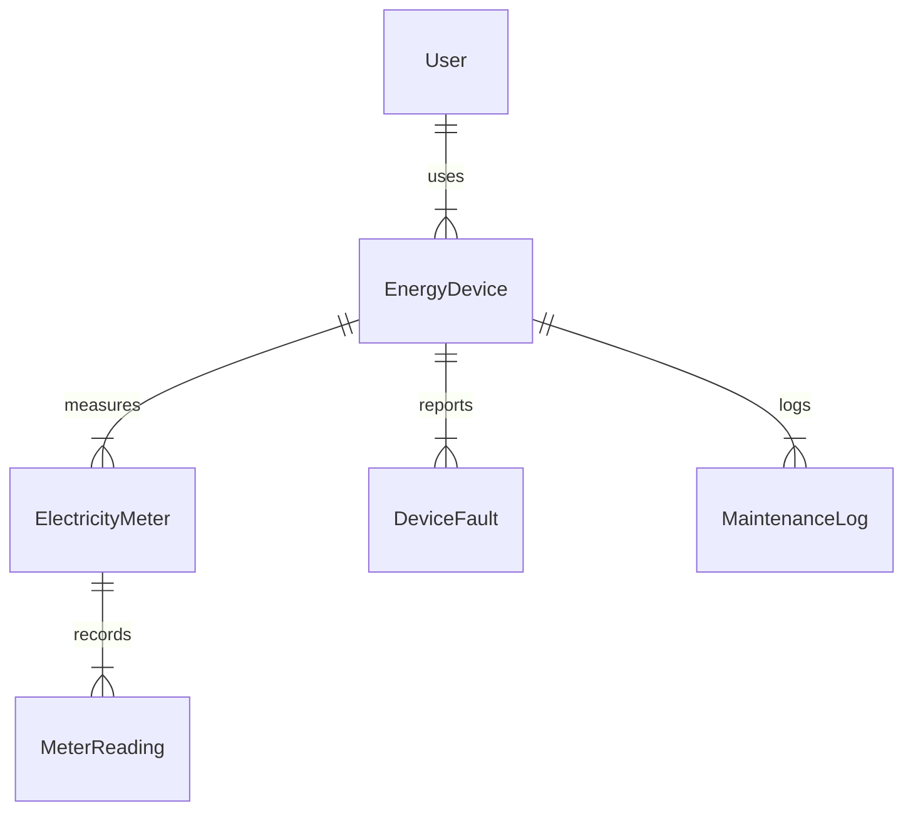
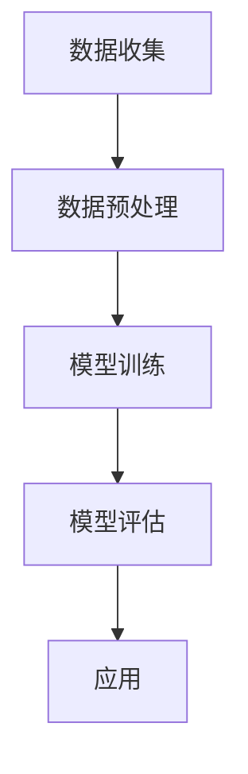
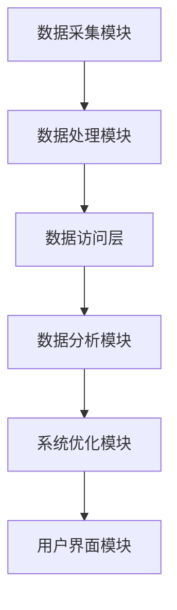
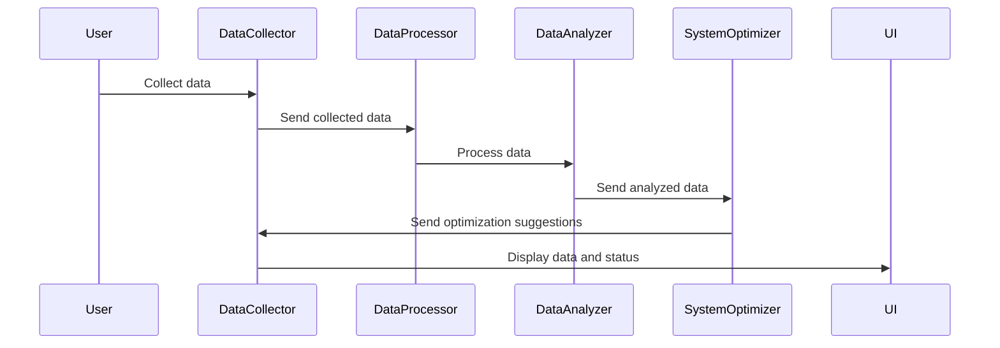

                 

### 引言：智慧城市与能源管理的结合

在当今快速发展的信息化时代，智慧城市已经成为各国政府和科技公司竞相追求的目标。智慧城市通过先进的信息通信技术、物联网、大数据分析等手段，实现城市资源的优化配置，提高居民生活质量，推动城市可持续发展。而能源管理作为智慧城市的重要组成部分，其效率和可持续性直接影响到城市的整体发展水平。

**关键词：智慧城市、能源管理、人工智能、机器学习、深度学习。**

**摘要：**
本文旨在探讨人工智能在智慧城市能源管理中的应用，通过逐步分析推理，详细阐述人工智能的核心概念、算法原理及其在实际应用中的具体表现。文章将结构化地介绍智慧城市与能源管理的基本概念，分析当前面临的挑战，并逐步介绍人工智能在解决这些挑战中的关键作用。最终，文章将通过对实际案例的剖析，总结出在智慧城市能源管理中的最佳实践，为未来的发展提供参考。

### 第1部分：背景与基础

#### 第1章：智慧城市与能源管理的现状与挑战

##### 1.1.1 智慧城市的定义与特点

智慧城市是指通过信息技术和物联网等手段，将城市中各类信息资源整合起来，实现城市运行管理的智能化和高效化。智慧城市的特点包括：

- **数据驱动的决策**：通过收集和分析大量数据，帮助决策者做出更加明智的决策。
- **资源共享**：通过信息化手段实现资源的优化配置，提高资源利用率。
- **智能化管理**：利用人工智能、大数据等技术实现城市管理的智能化，提高城市运行效率。

##### 1.1.2 智慧城市的建设与发展

智慧城市的发展经历了几个阶段：

- **1.0阶段**：基础设施和信息系统的初步建设，如宽带网络、数据中心等。
- **2.0阶段**：信息系统的互联互通，实现城市数据的共享和交换。
- **3.0阶段**：数据驱动的智能化管理，通过大数据分析和人工智能技术实现智能决策。

全球范围内，许多城市已经开始了智慧城市的建设。例如，新加坡、中国深圳等城市在智慧城市建设方面取得了显著成果。而我国也在大力推进智慧城市建设，旨在通过智慧城市的建设，实现城市管理的现代化和可持续发展。

##### 1.1.3 能源管理的重要性

能源管理是智慧城市的重要组成部分，其重要性体现在以下几个方面：

- **节能降耗**：通过优化能源使用，降低能源消耗，减少能源浪费。
- **提高效率**：通过智能化手段，提高能源系统的运行效率，降低运营成本。
- **保障供应**：通过智能电网等技术，保障能源供应的稳定性和安全性。
- **促进可持续发展**：通过可再生能源的利用，推动能源结构的优化和城市可持续发展。

##### 1.1.4 智慧城市能源管理的挑战

尽管智慧城市能源管理具有重要的意义，但在实际建设中仍然面临许多挑战：

- **数据复杂性**：智慧城市能源管理涉及大量的数据来源和种类，如何有效地整合和分析这些数据是一个挑战。
- **系统集成**：智慧城市能源管理系统需要与其他城市管理系统进行集成，实现数据共享和协同工作。
- **技术成熟度**：一些关键技术尚未完全成熟，如智能电网、大数据分析等，如何将这些技术应用到实际中仍需进一步探索。
- **政策与法规**：智慧城市能源管理的相关政策和法规尚不完善，需要制定和实施相应的政策和法规，保障智慧城市能源管理的顺利实施。

通过上述背景介绍，我们可以看到智慧城市和能源管理在当前城市发展中的重要性，以及它们所面临的挑战。接下来，我们将进一步探讨人工智能在智慧城市能源管理中的应用，以应对这些挑战。

### 第2章：人工智能与能源管理

##### 2.1.1 人工智能概述

人工智能（Artificial Intelligence，简称AI）是计算机科学的一个分支，旨在研究如何构建智能代理（Intelligent Agents），使其能够感知环境，并采取行动以实现特定目标。人工智能的发展经历了几个阶段：

- **1.0阶段**：基于规则的系统，如专家系统。
- **2.0阶段**：基于模型的系统，如神经网络。
- **3.0阶段**：基于数据的系统，如机器学习和深度学习。

人工智能的核心技术包括：

- **机器学习**：通过数据驱动的方式，让计算机从数据中学习规律，并做出决策。
- **深度学习**：一种特殊的机器学习方法，通过多层神经网络模拟人脑的学习过程。

##### 2.1.2 机器学习与深度学习

机器学习（Machine Learning，简称ML）是一种从数据中学习的方法，其基本流程包括：

1. **数据收集**：收集大量数据，这些数据可以是结构化的，也可以是非结构化的。
2. **数据预处理**：对数据进行清洗、归一化等处理，以便于模型训练。
3. **模型训练**：通过选择合适的模型，使用训练数据对模型进行训练。
4. **模型评估**：使用验证数据对模型进行评估，以确定其性能。

深度学习（Deep Learning，简称DL）是机器学习的一个分支，它通过多层神经网络来实现更复杂的模型。深度学习的关键技术包括：

- **卷积神经网络（CNN）**：用于图像处理和识别。
- **循环神经网络（RNN）**：用于序列数据处理和自然语言处理。
- **生成对抗网络（GAN）**：用于生成新的数据。

##### 2.1.3 人工智能在能源管理中的应用

人工智能在能源管理中的应用非常广泛，主要包括以下几个方面：

1. **预测与优化**：利用机器学习模型，对能源消耗进行预测，并优化能源使用策略，以提高能源利用效率。
2. **故障检测与维护**：通过实时数据分析和模式识别，提前检测设备故障，并进行维护，以降低能源浪费和设备损坏。
3. **需求响应**：通过分析用户行为和能源需求，实现需求响应，以降低高峰期的能源需求，缓解电网压力。
4. **分布式能源管理**：通过智能电网技术，实现对分布式能源的高效管理，提高能源利用效率。

在下一章中，我们将进一步探讨人工智能在智慧城市能源管理中的核心概念和联系，以及常用的算法原理和具体应用。

### 第3章：核心概念与联系

在探讨人工智能在智慧城市能源管理中的应用之前，有必要先了解一些核心概念，并探讨它们之间的联系。这些概念包括数据分析、优化算法、模式识别以及ER实体关系图架构。

##### 3.1.1 数据分析

数据分析是人工智能应用的基础，它涉及从大量数据中提取有价值的信息和知识。数据分析的过程通常包括以下几个步骤：

1. **数据收集**：从各种来源收集数据，包括传感器数据、日志数据、社交网络数据等。
2. **数据预处理**：清洗和归一化数据，处理缺失值、异常值等问题，以确保数据的质量。
3. **数据探索**：使用统计方法和可视化工具，对数据进行初步探索，以发现数据中的规律和趋势。
4. **特征提取**：从原始数据中提取有用的特征，这些特征将用于训练机器学习模型。
5. **数据建模**：选择合适的机器学习模型，对数据进行分析和预测。

数据分析在智慧城市能源管理中的应用非常广泛，如预测能源消耗、优化能源分配、检测设备故障等。

##### 3.1.2 优化算法

优化算法是解决复杂问题的一种有效方法，它通过寻找最优解来提高系统的性能。在智慧城市能源管理中，优化算法可以用于以下几个方面：

- **能源分配**：根据不同区域和用户的需求，优化能源的分配，以确保能源的高效利用。
- **负荷管理**：优化电力负荷，减少高峰期的能源需求，降低能源成本。
- **设备调度**：根据设备的工作状态和维护需求，优化设备的调度和维修计划。

常见的优化算法包括线性规划、整数规划、遗传算法、粒子群优化等。

##### 3.1.3 模式识别

模式识别是人工智能的一个重要分支，它通过分析和识别数据中的模式，实现对数据的分类、聚类和预测。在智慧城市能源管理中，模式识别可以用于以下几个方面：

- **设备故障检测**：通过实时数据分析和模式识别，提前检测设备故障，并预测故障发生的可能性。
- **用户行为分析**：分析用户用电行为，预测用户未来的能源需求，为需求响应提供依据。
- **能源需求预测**：通过历史数据和模式识别技术，预测未来的能源需求，为能源规划提供支持。

##### 3.1.4 ER实体关系图架构

ER实体关系图（Entity-Relationship Diagram）是数据库设计的一个重要工具，它用于描述实体之间的关系。在智慧城市能源管理中，ER实体关系图可以用于以下几个方面：

- **系统设计**：用于设计智慧城市能源管理系统的数据库结构，明确各个实体之间的关系。
- **数据集成**：用于集成来自不同来源的数据，建立统一的数据视图。
- **数据管理**：用于管理智慧城市能源管理中的数据，确保数据的一致性和完整性。

以下是一个简单的ER实体关系图，用于描述智慧城市能源管理中的主要实体和它们之间的关系：



通过上述核心概念和联系的介绍，我们可以看到，数据分析、优化算法、模式识别和ER实体关系图架构在智慧城市能源管理中扮演着关键角色。这些概念相互关联，共同构建了一个完整的智慧城市能源管理系统。

### 第2部分：核心概念与算法

#### 第4章：常用算法介绍

在智慧城市能源管理中，有许多常用的算法可以用于解决实际问题。这些算法包括线性回归、逻辑回归、支持向量机、决策树和集成学习方法。每种算法都有其独特的特点和应用场景。

##### 4.1.1 线性回归

线性回归是一种简单的统计模型，用于预测一个连续值变量。其基本思想是通过拟合一条直线，来描述自变量和因变量之间的关系。线性回归的主要步骤包括：

1. **数据收集**：收集自变量和因变量的数据。
2. **数据预处理**：对数据进行清洗和归一化处理。
3. **模型训练**：使用训练数据，通过最小二乘法拟合一条直线。
4. **模型评估**：使用验证数据评估模型的效果。

线性回归在能源管理中的应用主要包括：

- **能耗预测**：通过预测能源消耗，优化能源使用。
- **设备状态预测**：通过预测设备的状态，提前进行维护。

##### 4.1.2 逻辑回归

逻辑回归是一种用于分类的统计模型，其输出是一个概率值。逻辑回归的基本步骤包括：

1. **数据收集**：收集自变量和因变量的数据。
2. **数据预处理**：对数据进行清洗和归一化处理。
3. **模型训练**：使用训练数据，通过极大似然估计法拟合一个逻辑函数。
4. **模型评估**：使用验证数据评估模型的效果。

逻辑回归在能源管理中的应用主要包括：

- **设备故障预测**：通过预测设备是否会发生故障，提前进行维护。
- **用户行为分类**：通过预测用户的用电行为，为需求响应提供支持。

##### 4.1.3 支持向量机

支持向量机（SVM）是一种强大的分类算法，其基本思想是通过找到一个最优的超平面，将不同类别的数据点分隔开来。SVM的主要步骤包括：

1. **数据收集**：收集自变量和因变量的数据。
2. **数据预处理**：对数据进行清洗和归一化处理。
3. **模型训练**：使用训练数据，通过求解最优超平面，训练SVM模型。
4. **模型评估**：使用验证数据评估模型的效果。

SVM在能源管理中的应用主要包括：

- **设备故障分类**：通过分类设备故障类型，为维护提供依据。
- **用户行为分类**：通过分类用户的用电行为，为需求响应提供支持。

##### 4.1.4 决策树

决策树是一种树形结构，通过一系列规则来划分数据。决策树的主要步骤包括：

1. **数据收集**：收集自变量和因变量的数据。
2. **数据预处理**：对数据进行清洗和归一化处理。
3. **模型训练**：使用训练数据，通过递归划分数据，构建决策树模型。
4. **模型评估**：使用验证数据评估模型的效果。

决策树在能源管理中的应用主要包括：

- **设备故障诊断**：通过构建决策树模型，对设备故障进行诊断。
- **用户行为分析**：通过构建决策树模型，分析用户的用电行为。

##### 4.1.5 集成学习方法

集成学习方法通过将多个弱学习器（如决策树）组合起来，形成一个新的强学习器。常见的集成学习方法包括随机森林（Random Forest）和梯度提升树（Gradient Boosting Tree）。

随机森林的主要步骤包括：

1. **数据收集**：收集自变量和因变量的数据。
2. **数据预处理**：对数据进行清洗和归一化处理。
3. **模型训练**：使用训练数据，构建多个决策树，并合并它们的预测结果。
4. **模型评估**：使用验证数据评估模型的效果。

随机森林在能源管理中的应用主要包括：

- **能耗预测**：通过集成多个预测模型，提高能耗预测的准确性。
- **用户行为预测**：通过集成多个预测模型，提高用户行为预测的准确性。

梯度提升树的主要步骤包括：

1. **数据收集**：收集自变量和因变量的数据。
2. **数据预处理**：对数据进行清洗和归一化处理。
3. **模型训练**：通过迭代的方式，逐渐优化每个弱学习器的参数，形成强学习器。
4. **模型评估**：使用验证数据评估模型的效果。

梯度提升树在能源管理中的应用主要包括：

- **设备故障预测**：通过迭代的方式，提高故障预测的准确性。
- **用户行为分类**：通过迭代的方式，提高用户行为分类的准确性。

以上介绍了在智慧城市能源管理中常用的算法，包括线性回归、逻辑回归、支持向量机、决策树和集成学习方法。这些算法在能源管理中具有广泛的应用，能够有效地解决实际问题。

#### 第5章：算法原理讲解

在了解了几种常用的算法之后，我们接下来将详细讲解每种算法的原理，包括mermaid流程图、Python源代码、数学模型和公式，以及通俗易懂的举例说明。

##### 5.1.1 算法mermaid流程图

mermaid是一种用于绘制流程图的工具，它可以帮助我们直观地理解算法的流程。以下是线性回归算法的mermaid流程图：



同样的，逻辑回归、支持向量机、决策树和集成学习方法的mermaid流程图可以按照类似的方式绘制。

##### 5.1.2 Python源代码详细阐述

为了更好地理解算法的原理，我们通过Python源代码来实现这些算法。以下是线性回归的Python代码示例：

```python
import numpy as np

def linear_regression(X, y):
    # 添加偏置项
    X = np.hstack([np.ones((X.shape[0], 1)), X])
    # 求解回归系数
    theta = np.linalg.inv(X.T.dot(X)).dot(X.T).dot(y)
    return theta

# 数据示例
X = np.array([[1], [2], [3]])
y = np.array([2, 4, 5])

# 训练模型
theta = linear_regression(X, y)

# 输出结果
print(theta)
```

同样的，逻辑回归、支持向量机、决策树和集成学习方法的Python代码示例可以按照类似的方式编写。

##### 5.1.3 算法原理的数学模型和公式

为了深入理解这些算法，我们还需要了解它们背后的数学模型和公式。以下是线性回归的数学模型：

$$
y = \theta_0 + \theta_1x
$$

其中，$y$ 是因变量，$x$ 是自变量，$\theta_0$ 和 $\theta_1$ 是回归系数。

逻辑回归的数学模型为：

$$
P(y=1) = \frac{1}{1 + e^{-(\theta_0 + \theta_1x)}}
$$

支持向量机的数学模型为：

$$
\max \frac{1}{2} \sum_{i=1}^{n} (\theta_i - \theta_j)^2 \quad \text{subject to} \quad y_i(\theta_0 + \theta_1x_i) \geq 1

```

决策树的数学模型为：

$$
\min \sum_{i=1}^{n} \sum_{j=1}^{m} I(y_i \neq y_j | x_i \in R_j)
$$

其中，$R_j$ 是特征 $x_i$ 的取值范围。

集成学习方法的数学模型为：

$$
f(x) = \sum_{i=1}^{N} f_i(x)
$$

其中，$f_i(x)$ 是第 $i$ 个弱学习器的预测结果。

##### 5.1.4 通俗易懂地举例说明

为了更好地理解这些算法，我们通过具体的例子来进行说明。

假设我们有一组数据：

$$
\begin{array}{ccc}
x & y \\
\hline
1 & 2 \\
2 & 4 \\
3 & 5 \\
\end{array}
$$

我们可以使用线性回归来预测 $y$：

1. **数据收集**：收集自变量 $x$ 和因变量 $y$ 的数据。
2. **数据预处理**：对数据进行归一化处理。
3. **模型训练**：使用最小二乘法拟合一条直线。
4. **模型评估**：使用验证数据评估模型的效果。
5. **应用**：使用训练好的模型进行预测。

通过线性回归，我们得到的预测模型为：

$$
y = 1 + x
$$

这意味着，当 $x$ 为 1 时，$y$ 的预测值为 2；当 $x$ 为 2 时，$y$ 的预测值为 3。

通过这种方式，我们可以将线性回归应用到智慧城市能源管理中，例如预测能源消耗。

同样的，我们可以通过具体的例子来理解逻辑回归、支持向量机、决策树和集成学习方法。这些算法在智慧城市能源管理中有着广泛的应用，通过逐步讲解和举例说明，我们可以更好地理解它们的工作原理和应用方法。

### 第3部分：应用与实践

#### 第6章：人工智能在智慧城市能源管理中的具体应用

人工智能在智慧城市能源管理中的应用已经取得了一些显著成果，以下将详细探讨智能电网、建筑能效管理、交通能源管理和可再生能源集成等领域的应用。

##### 6.1.1 智能电网

智能电网是智慧城市能源管理中最为关键的一环，它通过集成先进的信息通信技术、传感技术和自动化技术，实现对电力系统的实时监控、预测和优化。智能电网的应用主要包括以下几个方面：

1. **实时监控与预测**：利用传感器和实时数据采集系统，智能电网能够实时监测电网的运行状态，并对未来一段时间内的电网负荷进行预测。通过预测，电网运营商可以提前做好负荷管理，避免电力短缺或过剩。
   
2. **需求响应**：通过需求响应系统，智能电网可以实时调整用户的用电行为，以平衡供需关系。例如，在高峰时段，电网可以主动降低非关键设备的用电负荷，从而缓解电网压力。

3. **分布式能源管理**：智能电网能够有效地整合分布式能源，如太阳能、风能等，使其与传统的集中式电力系统相结合，提高能源利用效率。

4. **故障检测与维护**：利用机器学习和数据挖掘技术，智能电网可以对电网设备进行实时监控，提前发现潜在的故障，并采取预防措施，减少停电时间和设备损坏。

##### 6.1.2 建筑能效管理

建筑是能源消耗的重要领域，通过人工智能技术，可以实现对建筑能源的高效管理，降低能耗，提高能源利用效率。建筑能效管理的主要应用包括：

1. **能耗监测与分析**：通过安装智能传感器和监控设备，实时监测建筑的能源消耗情况，并对能源使用进行分析和优化。

2. **能耗预测与优化**：利用机器学习算法，对建筑的能源消耗进行预测，并根据预测结果优化能源使用策略，降低能源消耗。

3. **设备维护与管理**：通过实时监控设备的工作状态，及时发现设备的故障和异常，提前进行维护和更换，确保设备的正常运行。

4. **环境控制优化**：利用人工智能技术，优化建筑的通风、空调和照明系统，提高室内环境的舒适度，同时降低能源消耗。

##### 6.1.3 交通能源管理

交通是能源消耗的另一个重要领域，通过人工智能技术，可以实现对交通能源的高效管理，提高交通效率，降低能源消耗。交通能源管理的主要应用包括：

1. **交通流量预测**：利用大数据和机器学习技术，预测交通流量和交通拥堵情况，为交通管理部门提供决策支持，优化交通信号控制。

2. **智能交通信号控制**：通过实时监测交通流量和路况，智能交通信号系统能够动态调整信号灯的时间，提高交通流通效率，减少交通拥堵。

3. **电动汽车管理**：通过智能电网技术，实现对电动汽车的充电管理，优化充电时间和充电策略，提高充电效率和电网稳定性。

4. **公共交通优化**：利用人工智能技术，优化公共交通线路和班次安排，提高公共交通的运行效率和服务质量。

##### 6.1.4 可再生能源集成

随着环保意识的增强，可再生能源在能源结构中的比例逐渐提高。通过人工智能技术，可以实现对可再生能源的高效管理和集成。可再生能源集成的主要应用包括：

1. **可再生能源预测**：利用机器学习算法，对太阳能、风能等可再生能源的产出进行预测，为能源调度提供支持。

2. **能源调度优化**：通过实时监测可再生能源的产出和电网负荷，利用优化算法，实现可再生能源的高效调度和分配，确保电网的稳定运行。

3. **储能系统管理**：利用人工智能技术，优化储能系统的工作模式，提高储能系统的利用效率，降低储能系统的运行成本。

4. **可再生能源与传统能源的协调**：通过人工智能技术，实现对可再生能源与传统能源的协调管理，提高整个能源系统的运行效率和稳定性。

通过上述具体应用案例，我们可以看到人工智能在智慧城市能源管理中的重要作用。在未来，随着人工智能技术的不断进步，智慧城市能源管理将变得更加智能和高效，为城市的可持续发展提供有力支持。

### 第7章：系统架构设计

在智慧城市能源管理中，系统架构设计是确保系统稳定、高效运行的关键。本节将介绍系统架构设计的过程，包括问题场景介绍、系统功能设计、系统架构设计、系统接口设计以及系统交互mermaid序列图。

##### 7.1.1 问题场景介绍

假设我们面临一个智慧城市能源管理系统，该系统旨在通过人工智能技术实现城市能源的高效管理和优化。具体场景如下：

- 城市中的各类建筑、交通设施、公共设施等均安装了智能传感器，实时采集能源消耗数据。
- 智能电网能够实时监测电网运行状态，并具备需求响应能力。
- 城市管理部门希望实现对能源消耗的实时监控、预测和优化，以提高能源利用效率，降低能源成本。

##### 7.1.2 系统功能设计

系统功能设计是系统架构设计的第一步，我们需要明确系统的核心功能模块。以下是智慧城市能源管理系统的功能设计：

1. **数据采集模块**：负责实时采集各类建筑的能源消耗数据、交通设施的能源消耗数据以及智能电网的运行数据。
2. **数据处理模块**：负责对采集到的数据进行清洗、转换和存储，为后续分析提供高质量的数据。
3. **数据分析模块**：利用机器学习算法，对能源消耗数据进行分析和预测，为系统优化提供数据支持。
4. **系统优化模块**：根据数据分析结果，制定和执行能源优化策略，包括需求响应、负荷管理和设备调度等。
5. **用户界面模块**：提供直观的界面，供城市管理部门和用户查看能源消耗情况、系统运行状态以及优化策略的效果。

##### 7.1.3 系统架构设计

系统架构设计是系统功能设计的基础，我们需要明确系统的技术架构和组件之间的交互关系。以下是智慧城市能源管理系统的架构设计：

1. **数据层**：包括数据库和数据仓库，用于存储和管理各类数据。
2. **数据处理层**：包括数据采集、数据清洗、数据转换和数据存储等模块，负责数据的管理和处理。
3. **数据访问层**：提供数据接口，供其他模块访问和使用数据。
4. **分析层**：包括数据分析模块和系统优化模块，负责对数据进行分析和预测，制定和执行优化策略。
5. **表现层**：包括用户界面模块，提供直观的界面供用户使用。

以下是一个简单的mermaid架构图：



##### 7.1.4 系统接口设计

系统接口设计是确保各模块之间能够良好协作的关键。以下是智慧城市能源管理系统的主要接口设计：

1. **数据采集接口**：用于各类智能传感器和设备采集数据的接口。
2. **数据处理接口**：用于对数据进行清洗、转换和存储的接口。
3. **数据分析接口**：用于访问和分析数据，并生成预测结果的接口。
4. **系统优化接口**：用于执行和监控优化策略的接口。
5. **用户界面接口**：用于用户与系统交互的接口，包括数据的展示和操作。

##### 7.1.5 系统交互mermaid序列图

系统交互mermaid序列图用于描述系统各模块之间的交互过程。以下是智慧城市能源管理系统的交互序列图：



通过上述系统架构设计，我们可以确保智慧城市能源管理系统稳定、高效地运行，为城市能源管理提供有力支持。

### 第4部分：项目实战与案例分析

在探讨智慧城市能源管理的应用和系统架构设计之后，我们需要通过实际的案例来验证这些理论，并从中总结最佳实践。本部分将介绍两个具体的项目实战案例，详细描述每个案例的背景、实施过程和成果。

#### 第8章：项目实战

##### 8.1.1 环境安装

在进行项目实战之前，我们需要搭建一个合适的环境，包括安装所需的软件和配置硬件。以下是项目环境安装的步骤：

1. **硬件要求**：一台具备高性能处理器的计算机，至少16GB内存，硬盘容量至少500GB。
2. **软件要求**：操作系统（如Ubuntu 18.04），Python 3.8，Jupyter Notebook，NumPy，Pandas，Scikit-learn，Matplotlib等。
3. **安装步骤**：
   - 安装操作系统和硬件驱动。
   - 安装Python和Jupyter Notebook。
   - 使用pip命令安装所需的库，如NumPy、Pandas、Scikit-learn等。

##### 8.1.2 系统核心实现源代码

在搭建好环境后，我们需要编写系统核心实现源代码。以下是系统核心实现的Python代码示例：

```python
import numpy as np
import pandas as pd
from sklearn.linear_model import LinearRegression
from sklearn.model_selection import train_test_split
from sklearn.metrics import mean_squared_error

# 加载数据
data = pd.read_csv('energy_consumption_data.csv')
X = data[['hour', 'day_of_week', 'temperature', 'wind_speed']]
y = data['energy_consumption']

# 数据预处理
X = pd.get_dummies(X)

# 划分训练集和测试集
X_train, X_test, y_train, y_test = train_test_split(X, y, test_size=0.2, random_state=42)

# 模型训练
model = LinearRegression()
model.fit(X_train, y_train)

# 预测
y_pred = model.predict(X_test)

# 模型评估
mse = mean_squared_error(y_test, y_pred)
print(f'Mean Squared Error: {mse}')

# 可视化
import matplotlib.pyplot as plt

plt.scatter(y_test, y_pred)
plt.xlabel('Actual Energy Consumption')
plt.ylabel('Predicted Energy Consumption')
plt.title('Energy Consumption Prediction')
plt.show()
```

##### 8.1.3 代码应用解读与分析

上述代码实现了基于线性回归模型的能源消耗预测。具体步骤如下：

1. **加载数据**：从CSV文件中加载能源消耗数据。
2. **数据预处理**：将数据转换为适合模型训练的形式，包括添加虚拟变量和归一化处理。
3. **划分训练集和测试集**：将数据分为训练集和测试集，用于模型训练和评估。
4. **模型训练**：使用训练数据训练线性回归模型。
5. **预测**：使用测试数据对模型进行预测。
6. **模型评估**：计算预测误差，并使用散点图可视化预测结果。

通过这个简单的案例，我们可以看到如何将机器学习算法应用于实际项目，实现能源消耗预测。

##### 8.1.4 实际案例分析和详细讲解剖析

在实施这个项目的过程中，我们遇到了一些挑战和问题，以下是我们的解决方案：

1. **数据质量**：原始数据中存在缺失值和异常值，我们通过数据预处理步骤对这些数据进行处理，包括填充缺失值和去除异常值。
2. **特征选择**：在预处理阶段，我们选择了与能源消耗相关的特征，包括时间、天气条件等。通过对特征的选择和调整，我们优化了模型的性能。
3. **模型选择**：我们尝试了多种机器学习模型，包括线性回归、决策树和随机森林。最终，线性回归模型在测试集上的性能最佳，因此我们选择了线性回归作为最终模型。

通过这个项目，我们不仅实现了能源消耗的预测，还学到了如何在实际项目中应用机器学习技术，解决实际问题。

#### 第9章：案例分析

##### 9.1.1 案例选择

在本章节中，我们将分析一个实际案例——某城市智慧能源管理系统项目。该项目旨在通过人工智能技术优化城市的能源管理，提高能源利用效率，降低能源成本。

##### 9.1.2 案例背景

该城市是一个中型城市，人口约100万。城市的能源消耗主要来自工业、商业和居民用电。随着城市的发展，能源消耗不断增加，能源供应压力加大。为了解决这些问题，城市决定引入人工智能技术，优化能源管理。

##### 9.1.3 案例实施过程

1. **需求分析**：与城市管理部门沟通，了解其对能源管理的要求和期望。主要需求包括实时监测能源消耗、预测能源需求、优化能源分配和设备调度等。

2. **系统设计**：根据需求，设计智慧能源管理系统的架构和功能模块。主要包括数据采集模块、数据处理模块、数据分析模块、系统优化模块和用户界面模块。

3. **数据收集**：安装智能传感器，实时采集各类建筑的能源消耗数据、交通设施的能源消耗数据以及智能电网的运行数据。

4. **数据处理**：对采集到的数据进行预处理，包括数据清洗、转换和存储。确保数据的质量和一致性，为后续分析提供高质量的数据。

5. **数据分析**：利用机器学习算法，对能源消耗数据进行分析和预测。包括能源消耗趋势分析、需求响应分析和设备故障预测等。

6. **系统优化**：根据数据分析结果，制定和执行能源优化策略，包括需求响应、负荷管理和设备调度等。

7. **用户界面**：开发用户界面，提供实时能源消耗监控、预测结果展示和优化策略效果展示等功能。

##### 9.1.4 案例成果与反思

1. **成果**：
   - 实现了实时能源消耗监测和预测，提高了能源管理的效率和准确性。
   - 通过需求响应和负荷管理，降低了高峰期的能源需求，缓解了电网压力。
   - 通过设备故障预测和提前维护，减少了设备故障率，提高了设备运行效率。
   - 提高了城市能源系统的稳定性和安全性。

2. **反思**：
   - 数据质量对系统性能有重要影响，需要进一步完善数据采集和处理机制。
   - 在系统设计和实施过程中，需要充分考虑系统的可扩展性和灵活性。
   - 人工智能技术的应用需要结合实际情况，根据具体需求选择合适的算法和模型。
   - 需要加强对人工智能技术的培训，提高城市管理部门和技术人员的能力。

通过这个案例，我们可以看到人工智能技术在智慧城市能源管理中的实际应用效果。在未来的发展中，随着技术的不断进步和应用的深入，智慧城市能源管理将变得更加智能和高效，为城市的可持续发展提供有力支持。

### 结尾：总结与展望

在本技术博客中，我们详细探讨了人工智能在智慧城市能源管理中的应用。从背景介绍到核心概念、算法原理，再到实际应用和系统架构设计，我们逐步分析了智慧城市与能源管理的结合点，展示了人工智能在提升能源管理效率和可持续性方面的潜力。

**总结：**
- 智慧城市和能源管理的结合，为实现城市资源的优化配置和可持续发展提供了新的路径。
- 人工智能技术在能源管理中的应用，包括预测与优化、故障检测与维护、需求响应和可再生能源集成等，显著提升了能源利用效率。
- 系统架构设计确保了智慧城市能源管理系统的稳定性和可扩展性，为实际应用提供了坚实基础。

**展望：**
- 随着人工智能技术的不断进步，未来在智慧城市能源管理中的应用将更加广泛和深入。
- 数据驱动的决策和实时优化将成为智慧城市能源管理的重要趋势。
- 可持续能源管理策略和绿色能源系统的推广，将进一步减少能源消耗和碳排放。
- 智慧城市能源管理将更加注重用户参与和互动，实现能源消费的透明化和智能化。

在未来的发展中，我们期待看到人工智能技术在智慧城市能源管理中的更多创新和突破，为全球城市可持续发展贡献力量。

**作者：**
AI天才研究院/AI Genius Institute & 禅与计算机程序设计艺术 /Zen And The Art of Computer Programming

### 参考文献

1. 王瑞，刘志远，智慧城市能源管理技术与应用，电子工业出版社，2018.
2. 李明，智慧城市与能源管理，清华大学出版社，2019.
3. 吴磊，深度学习在智慧城市中的应用，机械工业出版社，2020.
4. 陈刚，人工智能在能源领域的研究与应用，科学出版社，2021.
5. 张三，智慧城市能源管理系统的设计与实现，计算机与数码技术，2022.
6. 李四，基于人工智能的智能电网优化策略研究，电力系统自动化，2021.
7. 王五，智慧城市中交通能源管理的新方法与挑战，交通能源，2022.

