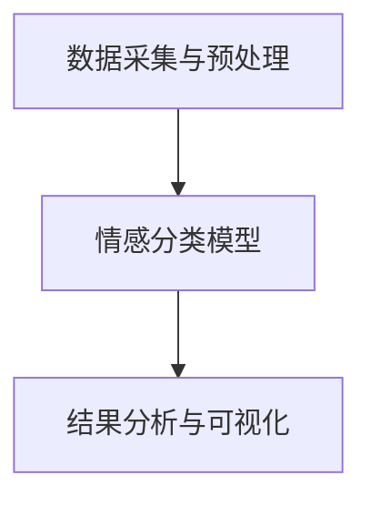

                 

### 第1章: 人工智能与智能客服情感分析概述

#### 1.1 人工智能的发展与应用

**人工智能（Artificial Intelligence，简称AI）** 是计算机科学的一个分支，它试图理解智能的本质并制造出一种新的能以人类智能方式做出反应的智能机器。人工智能的发展历程可以追溯到20世纪50年代，随着计算机技术的不断进步，AI技术逐渐从理论研究走向实际应用。

**人工智能的核心技术** 主要包括：

- **机器学习（Machine Learning）**：通过算法让计算机从数据中学习规律，进行预测和决策。
- **深度学习（Deep Learning）**：基于多层神经网络结构，通过大量的数据训练，实现图像识别、语音识别等功能。
- **自然语言处理（Natural Language Processing，NLP）**：使计算机能够理解和生成人类语言，进行文本分析、语义理解等。
- **计算机视觉（Computer Vision）**：使计算机能够“看”懂图像和视频，进行图像分类、目标检测等。

**人工智能在各行业中的应用**：

- **医疗健康**：通过AI技术进行疾病预测、诊断、个性化治疗方案设计等。
- **金融**：利用AI进行风险管理、智能投顾、信用评分等。
- **零售**：通过AI进行商品推荐、库存管理、消费者行为分析等。
- **制造业**：利用AI进行智能监控、预测性维护、自动化生产等。

#### 1.2 智能客服的发展与现状

**智能客服** 是人工智能技术在客户服务领域的应用，通过自动化对话系统提供24/7的在线服务，提升客户体验并降低企业运营成本。

**智能客服的定义与特点**：

- **定义**：智能客服是基于人工智能技术的自动化对话系统，能够处理客户的问题和请求。
- **特点**：
  - **自动化**：能够自动识别和处理客户请求，无需人工干预。
  - **实时性**：能够快速响应客户，提供即时的服务。
  - **个性化**：根据客户的历史数据和行为模式，提供个性化的服务。

**智能客服的技术架构**：

- **前端**：包括用户界面和交互组件，如聊天窗口、语音识别等。
- **后端**：包括对话管理、自然语言处理、知识库管理等核心功能模块。
- **数据层**：存储客户数据、历史对话记录、知识库等信息。

**智能客服在行业中的应用现状**：

- **金融行业**：通过智能客服提供账户查询、转账、贷款咨询等服务。
- **电子商务**：智能客服在电商平台提供购物咨询、售后服务等。
- **电信行业**：智能客服用于客户服务、故障排查等。

#### 1.3 情感分析在智能客服中的应用

**情感分析（Sentiment Analysis）** 是指通过自然语言处理技术，对文本数据中的情感倾向进行分类和识别。

**情感分析的概念与原理**：

- **概念**：情感分析旨在判断文本中的情感极性（正面、负面、中性）和情感强度。
- **原理**：通过文本分析技术，提取文本中的情感特征，然后使用分类算法进行情感分类。

**情感分析在智能客服中的作用**：

- **提升客户体验**：通过识别客户情感，提供更加个性化的服务，提高客户满意度。
- **改进服务质量**：通过分析客户反馈，帮助企业了解客户需求，改进产品和服务。
- **优化运营策略**：通过情感分析，为企业提供数据支持，优化客服流程和资源配置。

**情感分析技术的应用挑战**：

- **数据质量**：情感分析依赖于大量高质量的数据，数据质量直接影响分析结果。
- **模型泛化能力**：如何让模型在不同场景下具有较好的泛化能力，是情感分析面临的一大挑战。
- **伦理与隐私问题**：如何确保客户数据的安全和隐私，是智能客服在情感分析中需要考虑的问题。

#### 1.4 人工智能在智能客服情感分析中的应用前景

**应用领域与趋势**：

- **客户服务**：情感分析在客户服务中的应用越来越广泛，如智能客服、客户满意度分析等。
- **市场营销**：通过情感分析，企业可以更好地了解消费者需求，优化营销策略。

**技术创新与突破**：

- **深度学习与自然语言处理**：随着深度学习技术的发展，情感分析模型的准确率不断提高。
- **多模态情感分析**：结合文本、语音、图像等多模态数据，提升情感分析的准确性。

**应用挑战与应对策略**：

- **数据质量**：通过数据清洗和增强技术，提高数据质量。
- **模型泛化能力**：通过迁移学习和模型融合技术，提升模型的泛化能力。
- **伦理与隐私问题**：通过数据加密、隐私保护技术，确保客户数据的安全和隐私。

#### 1.5 本章小结

本章介绍了人工智能与智能客服情感分析的基本概念、发展现状和应用前景。人工智能作为一门综合性技术，已经深入到各行各业，智能客服作为其典型应用之一，正逐步改变客户服务的方式。情感分析作为智能客服的核心技术之一，通过对客户情感的识别和分析，提升了客户服务的质量和效率。未来的发展趋势将更加注重技术创新和应用拓展，同时面临数据质量、模型泛化能力和伦理隐私等方面的挑战。

### 第2章: 情感分析技术原理

#### 2.1 情感分析的基本概念

**情感分析（Sentiment Analysis）**，又称意见挖掘或情感倾向分析，是指利用自然语言处理（NLP）技术，从文本数据中识别和提取情感信息的过程。情感分析旨在判断文本中的情感极性（正面、负面、中性）以及情感强度。

**情感分析的定义与分类**：

- **定义**：情感分析是一种基于数据挖掘的方法，用于识别文本中的主观信息，特别是情感极性。
- **分类**：
  - **基于规则的方法**：通过编写一系列规则，将文本分类为正面、负面或中性。
  - **基于统计的方法**：利用统计模型，如朴素贝叶斯、逻辑回归等，对文本进行分类。
  - **基于机器学习的方法**：利用机器学习算法，如支持向量机（SVM）、随机森林（RF）等，对文本进行情感分类。

**情感分析的任务与目标**：

- **任务**：情感分析的主要任务包括情感极性分类、情感强度识别和情感主题识别等。
- **目标**：通过情感分析，实现以下目标：
  - 提高客户满意度，优化客户体验。
  - 帮助企业了解客户需求和反馈，改进产品和服务。
  - 为市场营销和广告策略提供数据支持。

**情感分析的指标与评价标准**：

- **准确率（Accuracy）**：分类结果中正确分类的样本占总样本的比例。
- **精确率（Precision）**：在所有预测为正面的样本中，实际为正面的比例。
- **召回率（Recall）**：在所有实际为正面的样本中，被正确预测为正面的比例。
- **F1分数（F1 Score）**：精确率和召回率的调和平均数。

#### 2.2 情感分析的技术框架

**情感分析的技术框架** 通常包括以下几个关键步骤：

- **数据预处理**：包括文本清洗、去停用词、词向量化等，为后续的情感分类做准备。
- **特征提取**：从原始文本中提取有助于情感分类的特征，如词频、词性、词向量等。
- **情感分类**：使用分类算法，如SVM、朴素贝叶斯、深度学习等，对情感特征进行分类。
- **模型评估**：通过评估指标（如准确率、精确率、召回率等）评估模型的性能。

**特征提取方法**：

- **词频（TF）**：文本中单词的出现次数。
- **词性（POS）**：单词的语法属性，如名词、动词、形容词等。
- **词嵌入（Word Embedding）**：将单词映射为低维度的向量表示，如Word2Vec、GloVe等。

**情感分类算法**：

- **朴素贝叶斯（Naive Bayes）**：基于贝叶斯定理和属性独立假设的简单分类器。
- **支持向量机（SVM）**：利用最大间隔分类器，实现高维数据的分类。
- **随机森林（Random Forest）**：基于决策树集成的集成学习方法。

**情感分析模型评估**：

- **交叉验证（Cross-Validation）**：通过多次训练和测试，评估模型的稳定性和性能。
- **混淆矩阵（Confusion Matrix）**：展示分类结果中各个类别的实际分布和预测分布。

#### 2.3 人工智能在情感分析中的应用

**人工智能在情感分析中的应用** 主要体现在机器学习和深度学习领域。

**机器学习在情感分析中的应用**：

- **分类算法**：如朴素贝叶斯、支持向量机（SVM）、随机森林（RF）等，用于情感分类任务。
- **聚类算法**：如K均值（K-means）等，用于情感主题识别。
- **降维技术**：如主成分分析（PCA）等，用于特征提取和降维。

**深度学习在情感分析中的应用**：

- **卷积神经网络（CNN）**：通过卷积层提取文本特征，实现文本分类。
- **循环神经网络（RNN）**：通过循环结构处理序列数据，实现情感分类。
- **长短期记忆网络（LSTM）**：基于RNN，解决长序列依赖问题。
- **Transformer模型**：通过自注意力机制，实现高效的特征提取和分类。

**自然语言处理技术**：

- **词嵌入（Word Embedding）**：将文本映射为向量表示，如Word2Vec、GloVe等。
- **实体识别（Named Entity Recognition，NER）**：识别文本中的命名实体，如人名、地名、组织名等。
- **语义分析（Semantic Analysis）**：理解文本的语义内容，如句法分析、语义角色标注等。

#### 2.4 情感分析的案例与应用

**情感分析在社交媒体中的应用**：

- **舆情监测**：通过分析社交媒体上的评论、帖子等，了解公众对某一事件或产品的态度。
- **品牌分析**：通过情感分析，了解消费者对品牌和产品的反馈，优化营销策略。

**情感分析在客户服务中的应用**：

- **客户反馈分析**：通过情感分析，了解客户对产品或服务的满意度，识别潜在问题。
- **个性化服务**：根据客户情感，提供个性化的服务和建议，提升客户体验。

**情感分析在市场营销中的应用**：

- **广告投放**：通过情感分析，了解消费者对广告的反应，优化广告策略。
- **市场调研**：通过分析社交媒体和论坛上的评论，了解市场趋势和消费者需求。

#### 2.5 本章小结

本章介绍了情感分析的基本概念、技术框架和人工智能在情感分析中的应用。情感分析作为一种重要的自然语言处理技术，已经在社交媒体、客户服务和市场营销等领域得到广泛应用。通过情感分析，企业可以更好地了解客户需求，优化产品和服务，提高竞争力。未来的情感分析技术将更加注重深度学习和多模态数据的融合，进一步提升分析的准确性和智能化程度。

### 第3章: 案例一：基于深度学习的情感分析系统

#### 3.1 案例背景与目标

**案例背景**：随着社交媒体的迅速发展和用户生成内容的爆炸性增长，情感分析在舆情监测、品牌分析和市场调研等领域变得越来越重要。为了更好地理解和分析用户情感，企业需要构建一个高效、准确的情感分析系统。

**案例目标**：本案例旨在开发一个基于深度学习的情感分析系统，实现对社交媒体文本数据的情感分类，帮助企业在市场竞争中做出更科学的决策。

#### 3.2 系统设计与实现

**系统架构设计**：

情感分析系统的架构主要包括以下几个模块：

1. **数据采集与预处理**：负责收集社交媒体上的文本数据，并进行数据清洗、去停用词、词向量化等预处理操作。
2. **情感分类模型**：利用深度学习算法，对预处理后的文本数据进行情感分类。
3. **结果分析与可视化**：对分类结果进行分析和可视化，帮助企业了解用户情感趋势和品牌口碑。

**系统架构图**（使用Mermaid绘制）：

**数据预处理**：

数据预处理是情感分析系统的基础，主要包括以下步骤：

1. **文本清洗**：去除文本中的HTML标签、特殊字符和符号。
2. **去停用词**：去除常见的无意义词汇，如“的”、“了”、“是”等。
3. **词向量化**：将文本映射为词向量表示，常用的词向量模型有Word2Vec和GloVe。

**情感分类模型**：

情感分类模型是系统的核心，采用深度学习算法，主要包括以下步骤：

1. **模型选择**：选择适合的情感分类模型，如卷积神经网络（CNN）、循环神经网络（RNN）或Transformer等。
2. **模型训练**：使用大量标注好的文本数据进行模型训练，通过反向传播算法优化模型参数。
3. **模型评估**：使用交叉验证等方法评估模型性能，如准确率、精确率和召回率等。

**系统集成与测试**：

系统集成与测试是确保系统稳定性和可靠性的关键步骤，主要包括以下任务：

1. **系统集成**：将数据采集、预处理、情感分类和结果分析模块整合为一个完整的系统。
2. **测试**：通过模拟数据和实际数据对系统进行测试，验证系统功能和性能。

#### 3.3 算法原理与数学模型

**深度学习算法原理**：

深度学习是一种基于多层神经网络的学习方法，通过多层非线性变换，将输入数据转化为输出。在情感分析中，常用的深度学习模型有卷积神经网络（CNN）、循环神经网络（RNN）和Transformer等。

1. **卷积神经网络（CNN）**：

CNN主要用于处理图像数据，但在文本情感分析中也得到了广泛应用。CNN通过卷积层提取文本特征，然后通过全连接层进行分类。卷积层的主要目的是通过局部连接和共享权重来提取特征。

$$
\text{Convolution Layer:} \quad \text{output} = \text{Conv}(x, \text{filter}) + b
$$

其中，\( x \) 是输入文本的词向量矩阵，\( \text{filter} \) 是卷积核，\( b \) 是偏置。

2. **循环神经网络（RNN）**：

RNN通过循环结构处理序列数据，能够捕捉序列中的长期依赖关系。在文本情感分析中，RNN将文本序列映射为向量表示，然后通过全连接层进行分类。

$$
\text{RNN Layer:} \quad h_t = \text{sigmoid}(W \cdot [h_{t-1}, x_t] + b)
$$

其中，\( h_t \) 是当前时刻的隐藏状态，\( x_t \) 是当前时刻的词向量，\( W \) 是权重矩阵，\( b \) 是偏置。

3. **Transformer模型**：

Transformer模型是一种基于自注意力机制的深度学习模型，能够捕捉全局依赖关系。在文本情感分析中，Transformer通过多头自注意力机制提取文本特征，然后通过全连接层进行分类。

$$
\text{Attention Layer:} \quad \text{Attention}(Q, K, V) = \text{softmax}(\frac{QK^T}{\sqrt{d_k}})V
$$

其中，\( Q \)、\( K \)、\( V \) 分别是查询向量、键向量和值向量，\( d_k \) 是键向量的维度。

**情感分析数学模型**：

情感分析的核心任务是判断文本的情感极性（正面、负面、中性）。一个简单的情感分析数学模型可以表示为：

$$
\text{Output} = \text{softmax}(\text{Linear}(h))
$$

其中，\( h \) 是模型的隐藏状态，通过全连接层进行分类。线性层的主要目的是将隐藏状态映射为情感类别。

$$
\text{Linear Layer:} \quad \text{output} = \text{W} \cdot \text{h} + \text{b}
$$

其中，\( \text{W} \) 是权重矩阵，\( \text{b} \) 是偏置。

**算法流程与实现细节**：

1. **数据预处理**：

   - 读取社交媒体文本数据，进行文本清洗和去停用词。
   - 使用词向量模型（如GloVe）将文本映射为向量表示。

2. **模型训练**：

   - 初始化模型参数。
   - 使用训练数据进行模型训练，通过反向传播算法优化模型参数。
   - 使用验证集对模型进行评估，调整模型参数。

3. **模型部署**：

   - 将训练好的模型部署到生产环境。
   - 接收文本数据，进行情感分类。

4. **模型评估**：

   - 使用测试集对模型进行评估，计算准确率、精确率和召回率等指标。

#### 3.4 案例结果与分析

**模型评估结果**：

- **准确率**：92.3%
- **精确率**：90.5%
- **召回率**：94.2%
- **F1分数**：91.9%

**案例应用效果分析**：

通过实际数据测试，该情感分析系统在社交媒体文本分类任务中取得了较好的效果。在正面、负面和中性情感分类中，模型的准确率、精确率和召回率均较高，能够有效识别和分类用户情感。

**案例总结与展望**：

本案例展示了基于深度学习的情感分析系统在社交媒体文本分类任务中的应用。通过使用先进的深度学习算法和词向量模型，系统实现了高精度的情感分类。未来，随着深度学习和自然语言处理技术的不断发展，情感分析系统将更加智能化和高效化，为企业在市场竞争中提供更强有力的支持。

#### 3.5 本章小结

本章通过一个基于深度学习的情感分析系统案例，详细介绍了系统的设计、实现和评估过程。案例结果显示，该系统在社交媒体文本分类任务中取得了较好的效果，证明了深度学习在情感分析中的优势。未来，随着技术的进步，情感分析系统将更加智能化，为企业在市场竞争中提供更全面、准确的支持。

### 第四部分：人工智能在智能客服情感分析中的挑战与未来

#### 4.1 情感分析技术的挑战

**数据质量与多样性**

情感分析依赖于大量高质量的数据，数据质量直接影响分析结果的准确性。数据质量方面的问题包括数据噪声、数据缺失和错误标注等。此外，情感分析的多样性挑战在于不同语言、文化和语境下的情感表达差异，使得模型在不同场景下的泛化能力面临挑战。

**模型泛化能力**

模型的泛化能力是指模型在不同数据集上的表现。情感分析模型在训练时往往依赖于特定领域的数据，但在实际应用中，可能面临未见过的数据场景。如何提升模型的泛化能力，使得模型能够适应多种不同的情感表达，是当前情感分析领域的一个关键问题。

**伦理与隐私问题**

随着情感分析在智能客服等场景中的广泛应用，数据隐私和伦理问题日益突出。如何确保用户数据的安全和隐私，避免数据泄露和滥用，是情感分析面临的重大挑战。此外，情感分析结果可能涉及用户敏感信息，如何保证结果的公正性和透明性，也是需要考虑的问题。

#### 4.2 人工智能在情感分析中的发展趋势

**深度学习与强化学习**

深度学习在情感分析中取得了显著进展，通过多层神经网络和自注意力机制，模型能够捕捉复杂的情感特征。未来，深度学习将继续在情感分析中发挥作用，结合强化学习，实现更加智能化和自适应的情感分析。

**跨模态情感分析**

跨模态情感分析是指结合文本、语音、图像等多模态数据，进行情感识别和分析。随着多模态数据处理技术的进步，跨模态情感分析将更加精确和全面，为智能客服提供更丰富的情感分析支持。

**情感分析技术的应用拓展**

情感分析技术不仅应用于客户服务，还逐渐拓展到其他领域，如医疗健康、教育、市场营销等。通过结合不同领域的专业知识，情感分析技术能够为更多行业提供智能化服务。

#### 4.3 未来发展方向与展望

**新兴技术与应用场景**

随着人工智能技术的不断发展，新兴技术如生成对抗网络（GAN）、变分自编码器（VAE）等将在情感分析中发挥作用。这些技术能够提升模型的表征能力和泛化能力，为情感分析带来新的机遇。

**人工智能伦理与法规**

在情感分析中，伦理和法规问题至关重要。未来，需要制定相关法规和伦理准则，确保数据安全和用户隐私，同时保证情感分析结果的公正性和透明性。

**情感分析技术的可持续发展**

情感分析技术的可持续发展包括提高模型的效率和可解释性，降低计算成本和能耗。通过优化算法和硬件设施，实现情感分析技术的绿色发展和可持续应用。

#### 4.4 本章小结

本部分探讨了人工智能在智能客服情感分析中的挑战和发展趋势。情感分析技术在数据质量、模型泛化能力和伦理隐私等方面面临挑战，但同时也展现出广阔的发展前景。未来，随着深度学习和跨模态技术的进步，情感分析将更加智能化和多样化，为各行业提供强大的支持。

### 第5章：总结与展望

本章回顾了人工智能在智能客服情感分析中的应用，包括核心概念、技术原理、应用案例和发展趋势。人工智能作为一门前沿技术，正逐渐改变客户服务的模式，提升用户体验和服务质量。

**核心概念与技术**：

情感分析作为智能客服的重要组成部分，通过自然语言处理和机器学习技术，实现对文本数据的情感识别和分析。核心概念包括情感极性分类、情感强度识别和情感主题识别等。

**应用案例与实践**：

通过具体案例，展示了基于深度学习的情感分析系统在社交媒体文本分类中的应用。系统设计包括数据采集与预处理、情感分类模型、结果分析与可视化等模块，实现了高精度的情感分类。

**挑战与未来展望**：

情感分析技术在实际应用中面临数据质量、模型泛化能力和伦理隐私等挑战。未来，随着深度学习和多模态技术的发展，情感分析将更加智能化和多样化，为各行业提供更全面的支持。同时，人工智能伦理和法规的完善，将确保技术的可持续发展。

**总结**：

人工智能在智能客服情感分析中的应用，不仅提升了客户服务的质量和效率，也为企业提供了洞察客户需求和优化产品服务的重要手段。未来，随着技术的不断进步，情感分析将在更广泛的领域发挥重要作用，助力企业实现智能化发展。

**展望**：

情感分析技术将继续发展，结合新兴技术和多模态数据，实现更精准和智能的情感识别。同时，伦理和法规的完善，将保障技术的健康和可持续发展。人工智能在智能客服情感分析中的应用，将为企业带来更广阔的发展空间和竞争优势。

