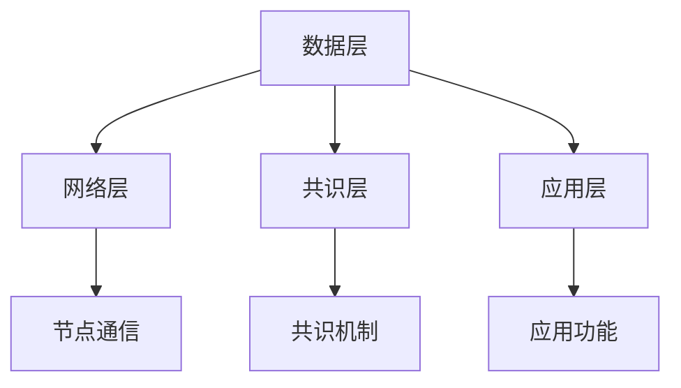
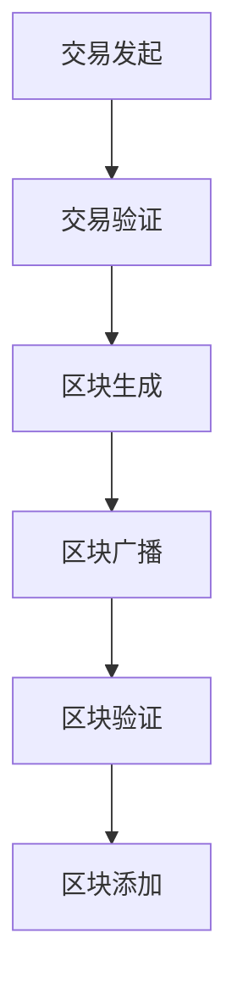
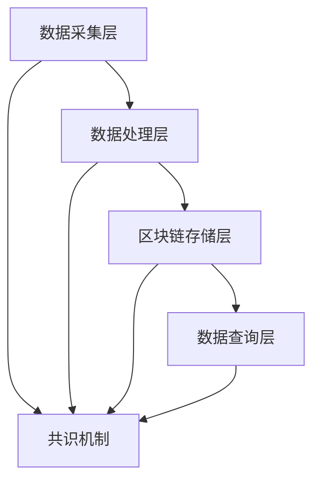
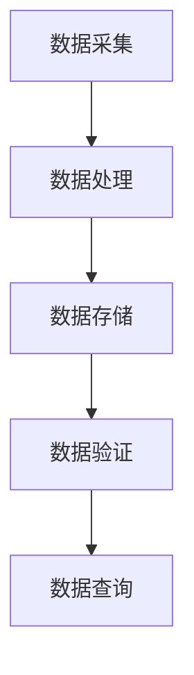

                 

# 《区块链在供应链溯源中的透明化应用》

关键词：区块链、供应链溯源、透明化应用、去中心化、智能合约

摘要：本文详细探讨了区块链技术在供应链溯源中的应用，通过分析区块链的基本原理、技术架构、优势与挑战，结合实际案例分析，探讨了区块链在提高供应链透明度、保障食品安全、降低欺诈风险等方面的作用。文章旨在为行业人士提供一套完整的区块链供应链溯源解决方案，并展望了未来的发展趋势。

## 引言

供应链溯源是供应链管理中的重要环节，它关系到产品质量、消费者信任以及企业声誉。然而，传统的供应链溯源系统存在诸多问题，如信息不透明、数据易篡改、追溯链条断裂等。随着区块链技术的兴起，其在供应链溯源中的应用成为解决这些问题的关键。

区块链具有去中心化、不可篡改、可追溯等特点，为供应链溯源提供了一种全新的解决方案。本文将从以下几个方面展开讨论：

1. 区块链技术基础
2. 区块链在供应链管理中的应用
3. 供应链溯源的区块链实现
4. 区块链供应链应用案例分析
5. 区块链在供应链中的技术挑战与解决方案
6. 区块链供应链溯源系统构建与实践
7. 未来展望与趋势

## 第一部分：区块链技术基础

### 第1章：区块链概述

#### 1.1 区块链的基本原理

区块链是一种去中心化的分布式数据库技术，通过加密算法和时间戳技术确保数据的真实性和不可篡改性。区块链的核心组成部分包括区块、链和节点。

- 区块：区块链的基本单位，包含一定的数据记录和元信息，如区块头、区块体等。
- 链：由多个区块按照时间顺序链接而成，形成一个连续的数据结构。
- 节点：区块链网络中的参与者，负责验证交易、生成新区块和更新区块链。

#### 1.2 区块链的技术架构

区块链的技术架构主要包括数据层、网络层、共识层和应用层。

- 数据层：负责数据的存储和管理，包括区块链的数据结构、加密算法等。
- 网络层：负责节点间的通信和数据的传输，包括P2P网络协议、消息传递机制等。
- 共识层：负责区块链网络的共识机制，确保所有节点对数据的共识。
- 应用层：负责将区块链技术与实际应用场景结合，提供丰富的应用功能。

#### 1.3 区块链的运作机制

区块链的运作机制主要包括以下步骤：

1. 交易发起：用户发起交易，将其广播到区块链网络。
2. 交易验证：节点对交易进行验证，确保交易的有效性和合法性。
3. 区块生成：矿工根据验证结果，将多个交易打包成一个新的区块。
4. 区块广播：新区块生成后，广播到所有节点。
5. 区块验证：节点对新区块进行验证，确保其合法性和一致性。
6. 区块添加：验证通过后，新区块被添加到区块链的末尾。

## 第二部分：区块链在供应链管理中的应用

### 第2章：区块链在供应链管理中的应用

#### 2.1 供应链管理的挑战与区块链解决方案

供应链管理过程中面临的主要挑战包括信息不透明、数据篡改、供应链断裂等。区块链技术能够有效解决这些问题，提高供应链的透明度和可靠性。

- 信息不透明：区块链的去中心化特性确保了信息的公开透明，所有参与方均可查看和验证供应链信息。
- 数据篡改：区块链的不可篡改性确保了数据的真实性和完整性，一旦数据被篡改，将无法通过验证。
- 供应链断裂：区块链的分布式特性确保了供应链的连续性，即使某个节点发生故障，整个网络仍能正常运行。

#### 2.2 区块链在供应链管理中的关键作用

区块链在供应链管理中的关键作用包括：

- 提高供应链透明度：通过区块链技术，供应链各环节的信息实现透明化，提高供应链的可追溯性和可信度。
- 保障食品安全：区块链技术可以实现对食品来源、生产、运输等环节的全程监控，确保食品安全。
- 降低欺诈风险：区块链技术的不可篡改性确保了供应链信息的真实性，降低了欺诈风险。

#### 2.3 区块链技术如何提高供应链透明度

区块链技术通过以下方式提高供应链透明度：

- 数据共享：区块链上的数据实现共享，各参与方均可查看和验证供应链信息。
- 信息追溯：区块链上的数据具有时间戳和哈希值，确保信息的可追溯性和完整性。
- 链上共识：区块链网络中的节点对数据的共识，确保信息的真实性和可靠性。

## 第三部分：供应链溯源的区块链实现

### 第3章：供应链溯源的区块链实现

#### 3.1 溯源系统的设计原则

供应链溯源系统的设计原则包括：

- 去中心化：溯源系统采用去中心化架构，确保信息的公开透明和去信任化。
- 不可篡改：系统中的数据一旦被写入区块链，将无法篡改，确保数据的真实性和完整性。
- 可追溯性：系统能够实现对供应链各环节的信息追溯，提高供应链的可追溯性和可信度。
- 高效性：系统应具备高效的数据处理能力，确保供应链信息的高效传递和查询。

#### 3.2 区块链在供应链溯源中的应用场景

区块链在供应链溯源中的应用场景包括：

- 食品溯源：通过区块链技术，实现对食品来源、生产、运输等环节的全程监控，确保食品安全。
- 原材料溯源：通过区块链技术，实现对原材料来源、加工、存储等环节的追溯，提高原材料质量。
- 产品质量溯源：通过区块链技术，实现对产品质量检测、维修、售后服务等环节的追溯，提高产品可信度。

#### 3.3 区块链溯源系统的架构设计

区块链溯源系统的架构设计包括以下部分：

- 数据采集层：负责采集供应链各环节的信息，包括生产、运输、销售等环节。
- 数据处理层：负责对采集到的数据进行分析和处理，确保数据的真实性和完整性。
- 数据存储层：负责将处理后的数据存储在区块链上，实现数据的去中心化和不可篡改性。
- 数据查询层：负责提供供应链信息的查询功能，供各参与方查看和验证。

## 第四部分：区块链供应链应用案例分析

### 第4章：区块链供应链应用案例分析

#### 4.1 案例分析一：某跨国零售商的供应链溯源实践

某跨国零售商利用区块链技术实现了供应链溯源，通过以下步骤：

1. 数据采集：对供应链各环节的信息进行采集，包括生产、运输、销售等环节。
2. 数据上传：将采集到的数据上传到区块链，实现数据的去中心化和不可篡改性。
3. 数据验证：区块链网络中的节点对上传的数据进行验证，确保数据的真实性和完整性。
4. 数据查询：消费者通过扫描商品二维码，查询商品的生产、运输等信息。

#### 4.2 案例分析二：某制造业企业的区块链供应链管理

某制造业企业利用区块链技术实现了供应链管理，通过以下步骤：

1. 数据采集：对供应链各环节的信息进行采集，包括原材料采购、生产、销售等环节。
2. 数据共享：通过区块链技术，实现供应链各环节的信息共享，提高供应链的透明度。
3. 数据监控：利用区块链技术，对供应链各环节进行实时监控，提高供应链的效率。
4. 数据分析：对采集到的数据进行分析，优化供应链管理，降低成本。

#### 4.3 案例分析三：区块链在农产品供应链溯源中的应用

区块链技术在农产品供应链溯源中的应用，通过以下步骤：

1. 数据采集：对农产品生产、运输、销售等环节的信息进行采集。
2. 数据上传：将采集到的数据上传到区块链，实现数据的去中心化和不可篡改性。
3. 数据验证：区块链网络中的节点对上传的数据进行验证，确保数据的真实性和完整性。
4. 数据查询：消费者通过扫描农产品二维码，查询农产品的生产、运输等信息。

## 第五部分：区块链在供应链中的技术挑战与解决方案

### 第5章：区块链在供应链中的技术挑战与解决方案

#### 5.1 数据隐私与安全

区块链在供应链中的应用面临数据隐私和安全挑战，包括：

1. 数据隐私：区块链上的数据是公开透明的，如何保护参与方的隐私成为关键问题。
2. 安全性：区块链网络中的数据传输和存储需要确保安全性，防止黑客攻击和数据泄露。

解决方案：

1. 数据加密：对区块链上的数据进行加密，确保数据在传输和存储过程中的安全性。
2. 权限控制：实现区块链网络中的权限控制，确保只有授权节点可以访问和操作数据。
3. 安全审计：定期进行安全审计，及时发现和解决潜在的安全问题。

#### 5.2 去中心化信任机制

区块链的去中心化特性依赖于节点之间的信任机制，但在供应链中，如何建立去中心化的信任机制成为关键问题。

解决方案：

1. 共识机制：采用合适的共识机制，确保区块链网络中的节点对数据的共识。
2. 身份验证：实现节点身份的验证，确保区块链网络中的参与者都是可信赖的。
3. 联盟链：通过联盟链的方式，将供应链中的核心企业纳入区块链网络，建立去中心化的信任机制。

#### 5.3 技术标准化与互操作性

区块链在供应链中的应用需要技术标准化和互操作性，以确保不同系统之间的无缝集成。

解决方案：

1. 标准化：制定统一的区块链技术标准，确保不同系统之间的兼容性。
2. 互操作性：通过跨链技术，实现不同区块链之间的数据交换和互操作。
3. 开放平台：建立开放的区块链平台，促进不同企业之间的合作和创新。

## 第六部分：区块链供应链溯源系统构建与实践

### 第6章：区块链供应链溯源系统构建与实践

#### 6.1 系统构建前的准备

构建区块链供应链溯源系统前，需要做好以下准备：

1. 确定系统需求：明确系统功能、性能和安全要求。
2. 选择区块链平台：根据业务需求，选择合适的区块链平台。
3. 确定系统架构：设计系统的架构，包括数据层、网络层、共识层和应用层。
4. 编写技术文档：编写详细的技术文档，指导系统开发、测试和部署。

#### 6.2 区块链供应链溯源系统的开发流程

区块链供应链溯源系统的开发流程包括以下步骤：

1. 需求分析：分析业务需求，明确系统的功能和技术要求。
2. 系统设计：设计系统的架构和技术方案，包括数据结构、网络拓扑、共识算法等。
3. 编码实现：根据系统设计，进行编码实现，实现各模块的功能。
4. 系统测试：对系统进行功能测试、性能测试和安全测试，确保系统的可靠性。
5. 部署上线：将系统部署到生产环境，进行上线运行。

#### 6.3 系统部署与维护

系统部署与维护包括以下步骤：

1. 系统部署：将系统部署到区块链网络上，确保系统的正常运行。
2. 系统监控：实时监控系统的运行状态，及时发现和处理故障。
3. 数据备份：定期进行数据备份，确保数据的完整性和安全性。
4. 系统升级：根据业务需求和技术发展，对系统进行升级和优化。

## 第七部分：未来展望与趋势

### 第7章：未来展望与趋势

#### 7.1 区块链供应链溯源的潜力与前景

区块链供应链溯源技术具有巨大的潜力与前景，未来将在以下几个方面得到进一步发展：

1. 技术成熟：随着区块链技术的不断成熟，供应链溯源系统的性能、安全性和可靠性将得到显著提升。
2. 应用推广：区块链供应链溯源技术将在更多行业和领域得到应用，推动供应链的透明化和智能化。
3. 政策支持：各国政府和行业组织将加大对区块链供应链溯源技术的支持力度，推动其健康发展。

#### 7.2 未来供应链溯源技术的发展方向

未来供应链溯源技术将朝着以下方向发展：

1. 跨链技术：通过跨链技术，实现不同区块链之间的数据交换和互操作，提高供应链溯源的效率和兼容性。
2. 增强现实（AR）技术：结合增强现实技术，为消费者提供更直观的供应链溯源体验。
3. 人工智能（AI）技术：利用人工智能技术，对供应链数据进行分析和预测，优化供应链管理。

#### 7.3 政策法规与标准化对区块链供应链溯源的影响

政策法规和标准化对区块链供应链溯源的影响包括：

1. 政策支持：各国政府和行业组织将出台相关政策，鼓励和规范区块链供应链溯源技术的发展。
2. 标准化：制定统一的区块链供应链溯源技术标准，促进产业链的协同发展。
3. 法律约束：加强对区块链供应链溯源技术的法律约束，确保数据真实性和安全性。

## 总结与拓展

### 7.4 本书主要内容回顾

本书主要内容包括：

1. 区块链技术基础：介绍了区块链的基本原理、技术架构和运作机制。
2. 区块链在供应链管理中的应用：探讨了区块链在供应链管理中的优势和应用场景。
3. 供应链溯源的区块链实现：分析了区块链供应链溯源系统的设计原则和架构设计。
4. 区块链供应链应用案例分析：通过实际案例，展示了区块链技术在供应链溯源中的应用效果。
5. 区块链在供应链中的技术挑战与解决方案：探讨了区块链在供应链中的技术挑战及解决方案。
6. 区块链供应链溯源系统构建与实践：介绍了区块链供应链溯源系统的构建流程和实施步骤。
7. 未来展望与趋势：展望了区块链供应链溯源技术的未来发展。

### 7.5 阅读本书后的思考

阅读本书后，我们可以从以下几个方面进行思考：

1. 区块链技术在供应链溯源中的应用前景如何？
2. 企业在实施区块链供应链溯源系统时，需要考虑哪些因素？
3. 区块链供应链溯源技术将如何影响未来的供应链管理？
4. 政策法规和标准化对区块链供应链溯源的发展有何影响？

### 7.6 拓展阅读建议

为了更深入地了解区块链在供应链溯源中的应用，建议读者拓展阅读以下书籍和资料：

1. 《区块链技术指南》
2. 《区块链：从数字货币到信用社会》
3. 《供应链管理：战略、规划与操作》
4. 《食品安全溯源管理技术》
5. 相关学术论文和技术报告
6. 行业协会和论坛的资料和分享

## 作者信息

作者：AI天才研究院/AI Genius Institute & 禅与计算机程序设计艺术 /Zen And The Art of Computer Programming

感谢您的阅读，希望本文能为您在区块链供应链溯源领域的研究和实践提供有益的参考。让我们共同探索区块链技术的无限可能，推动供应链管理的创新发展。## 第一部分：区块链技术基础

### 第1章：区块链概述

#### 1.1 区块链的基本原理

区块链是一种分布式数据库技术，它通过加密算法和时间戳技术确保数据的真实性和不可篡改性。区块链的基本单位是区块，每个区块包含一定数量的交易记录和元信息。区块通过哈希函数和时间戳链接在一起，形成一条连续的数据链。

区块链的核心组成部分包括：

- **区块**：区块链的基本单位，包含交易记录和其他元信息，如区块头、区块体等。
- **链**：由多个区块按照时间顺序链接而成，形成一个连续的数据结构。
- **节点**：区块链网络中的参与者，负责验证交易、生成新区块和更新区块链。

区块链的工作原理主要包括以下几个步骤：

1. **交易发起**：用户发起交易，将其广播到区块链网络。
2. **交易验证**：节点对交易进行验证，确保交易的有效性和合法性。
3. **区块生成**：矿工根据验证结果，将多个交易打包成一个新的区块。
4. **区块广播**：新区块生成后，广播到所有节点。
5. **区块验证**：节点对新区块进行验证，确保其合法性和一致性。
6. **区块添加**：验证通过后，新区块被添加到区块链的末尾。

区块链具有以下基本特点：

- **去中心化**：区块链网络中的节点平等参与，不存在中心化的控制机构。
- **不可篡改**：一旦数据被写入区块链，将无法被篡改。
- **透明性**：区块链上的数据是公开透明的，所有节点均可查看和验证。
- **安全性**：区块链使用加密算法确保数据的安全性和完整性。

#### 1.2 区块链的技术架构

区块链的技术架构可以分为四个层次：数据层、网络层、共识层和应用层。

- **数据层**：负责数据的存储和管理，包括区块链的数据结构、加密算法等。
- **网络层**：负责节点间的通信和数据的传输，包括P2P网络协议、消息传递机制等。
- **共识层**：负责区块链网络的共识机制，确保所有节点对数据的共识。
- **应用层**：负责将区块链技术与实际应用场景结合，提供丰富的应用功能。

区块链的技术架构图如下所示：

#### 1.3 区块链的运作机制

区块链的运作机制主要包括以下步骤：

1. **交易发起**：用户发起交易，将其广播到区块链网络。
2. **交易验证**：节点对交易进行验证，确保交易的有效性和合法性。这一过程包括验证交易金额、签名、账户余额等。
3. **区块生成**：矿工根据验证结果，选择一定数量的交易，将其打包成一个新的区块。矿工需要解决一个复杂的数学问题（如工作量证明），以生成新的区块。
4. **区块广播**：新区块生成后，矿工将其广播到区块链网络的其他节点。
5. **区块验证**：节点对新区块进行验证，确保其合法性和一致性。验证过程包括验证区块的哈希值、时间戳、交易等。
6. **区块添加**：验证通过后，新区块被添加到区块链的末尾，成为永久记录。

区块链的运作机制图如下所示：

### 小结

本章介绍了区块链的基本原理、技术架构和运作机制。区块链作为一种分布式数据库技术，具有去中心化、不可篡改、透明性和安全性等特点。通过理解区块链的基本原理和运作机制，读者可以为后续章节中的区块链在供应链溯源中的应用打下坚实的基础。

## 第二部分：区块链在供应链管理中的应用

### 第2章：区块链在供应链管理中的应用

#### 2.1 供应链管理的挑战与区块链解决方案

供应链管理涉及多个环节，包括原材料采购、生产、库存管理、运输和销售。然而，传统供应链管理过程中存在着诸多挑战，这些挑战对企业的运营和消费者的信任产生了负面影响。

**供应链管理的挑战**：

1. **信息不透明**：供应链各环节的信息往往分散在不同系统或参与方之间，导致信息共享困难，透明度低。
2. **数据篡改**：供应链数据容易受到篡改，导致信息失真，影响决策。
3. **供应链断裂**：供应链中的某一环节出现问题，可能导致整个供应链的中断。
4. **追踪困难**：在复杂的供应链中，商品从生产到消费的整个过程难以追踪，一旦出现质量问题，很难快速定位。

**区块链在供应链管理中的解决方案**：

1. **提高透明度**：区块链的去中心化特性确保了信息的公开透明，所有参与方均可查看和验证供应链信息，提高了供应链的透明度。
2. **保障数据真实性和完整性**：区块链的不可篡改性确保了数据的真实性和完整性，一旦数据被写入区块链，将无法被篡改。
3. **增强供应链的连续性**：区块链的分布式特性确保了供应链的连续性，即使某个节点发生故障，整个网络仍能正常运行。
4. **提升追踪能力**：区块链的可追溯性确保了供应链各环节的信息记录，提高了商品的追踪能力，有助于快速响应质量问题。

#### 2.2 区块链在供应链管理中的关键作用

区块链在供应链管理中的关键作用体现在以下几个方面：

1. **信息共享**：区块链技术可以实现对供应链各环节的信息共享，提高了供应链的透明度和协作效率。
2. **数据验证**：区块链上的数据具有不可篡改性，确保了供应链数据的真实性和可靠性。
3. **供应链协同**：区块链技术有助于供应链各环节的企业之间实现更紧密的协同合作，优化供应链管理。
4. **风险控制**：区块链技术可以实时监控供应链各环节，及时发现并控制风险，降低供应链中断的风险。
5. **提高消费者信任**：区块链技术的应用提高了供应链的透明度和可靠性，增强了消费者对品牌的信任。

#### 2.3 区块链技术如何提高供应链透明度

区块链技术通过以下方式提高供应链透明度：

1. **去中心化**：区块链的去中心化特性确保了信息的公开透明，所有参与方均可查看和验证供应链信息。
2. **数据加密**：区块链上的数据通过加密算法进行加密，确保了数据的安全性和隐私性。
3. **时间戳**：区块链上的数据具有时间戳，记录了数据生成的确切时间，确保了数据的可信性。
4. **链上共识**：区块链网络中的节点对数据的共识，确保了数据的真实性和可靠性。
5. **透明性**：区块链上的数据是公开透明的，所有参与方均可查看和验证，提高了供应链的透明度。

### 小结

本章讨论了区块链在供应链管理中的应用，包括供应链管理的挑战和区块链解决方案，以及区块链在供应链管理中的关键作用。通过区块链技术，企业可以提高供应链的透明度、数据验证能力和协同效率，从而实现更高效、更可靠的供应链管理。在接下来的章节中，我们将进一步探讨区块链在供应链溯源中的应用。

## 第三部分：供应链溯源的区块链实现

### 第3章：供应链溯源的区块链实现

#### 3.1 溯源系统的设计原则

供应链溯源系统的设计原则是确保供应链信息的公开透明、数据的真实性和完整性，以及系统的去中心化和可扩展性。以下是供应链溯源系统设计的关键原则：

1. **去中心化**：溯源系统采用去中心化架构，所有参与方均平等参与，不存在中心化的控制机构，确保信息的公开透明。
2. **数据不可篡改**：系统中的数据一旦被写入区块链，将无法被篡改，确保数据的真实性和完整性。
3. **信息可追溯性**：系统能够实现对供应链各环节的信息追溯，提高供应链的可追溯性和可信度。
4. **安全性**：系统采用加密算法和安全机制，确保数据在传输和存储过程中的安全性。
5. **高效性**：系统应具备高效的数据处理能力，确保供应链信息的高效传递和查询。
6. **互操作性**：系统应具备与其他系统进行数据交换和互操作的能力，实现供应链信息的互联互通。

#### 3.2 区块链在供应链溯源中的应用场景

区块链技术在供应链溯源中的应用场景广泛，以下是一些典型的应用场景：

1. **食品溯源**：通过区块链技术，实现对食品来源、生产、加工、运输、销售等环节的全程监控，提高食品安全保障。
2. **药品溯源**：区块链技术可以实现对药品的生产、运输、储存、销售等环节的全程监控，确保药品的质量和安全。
3. **农产品溯源**：通过区块链技术，实现对农产品生产、加工、运输、销售等环节的追溯，提高农产品的质量。
4. **奢侈品溯源**：区块链技术可以实现对奢侈品的生产、加工、销售等环节的全程监控，提高奢侈品的市场竞争力。
5. **零部件溯源**：在制造业中，区块链技术可以实现对零部件的生产、采购、配送等环节的追溯，提高零部件的质量和可靠性。

#### 3.3 区块链溯源系统的架构设计

区块链溯源系统的架构设计包括以下几个主要部分：

1. **数据采集层**：负责采集供应链各环节的信息，包括生产、运输、销售、消费等环节。数据采集层可以是物联网设备、传感器、智能设备等，实现实时数据采集。
2. **数据处理层**：负责对采集到的数据进行分析和处理，确保数据的真实性和完整性。数据处理层可以包括数据清洗、数据加密、数据压缩等功能。
3. **区块链存储层**：负责将处理后的数据存储在区块链上，实现数据的去中心化和不可篡改性。区块链存储层可以是公链、联盟链或私有链，根据具体应用场景选择。
4. **数据查询层**：提供供应链信息的查询功能，供各参与方查看和验证。数据查询层可以是Web界面、移动应用或API接口等。
5. **共识机制**：确保区块链网络中的节点对数据的共识，保证数据的真实性和一致性。共识机制可以是工作量证明、权益证明、拜占庭容错等。

区块链溯源系统的架构图如下所示：

#### 3.4 区块链溯源系统的工作流程

区块链溯源系统的工作流程主要包括以下几个步骤：

1. **数据采集**：供应链各环节的信息通过物联网设备、传感器等实时采集，并上传到数据处理层。
2. **数据处理**：数据处理层对采集到的数据进行分析和处理，包括数据清洗、数据加密、数据压缩等操作。
3. **数据存储**：处理后的数据存储在区块链上，形成新的区块，并链接到区块链的末端。
4. **数据验证**：区块链网络中的节点对新生成的区块进行验证，确保数据的真实性和一致性。
5. **数据查询**：各参与方通过区块链查询接口，查询供应链各环节的信息，实现对供应链的追溯。

区块链溯源系统的工作流程图如下所示：

#### 3.5 区块链溯源系统的优势

区块链溯源系统相比传统溯源系统具有以下优势：

1. **不可篡改性**：区块链上的数据一旦写入，将永久保存，无法篡改，确保了数据的真实性和完整性。
2. **透明性**：区块链上的数据是公开透明的，所有参与方均可查看和验证，提高了供应链的透明度。
3. **可追溯性**：区块链上的数据具有时间戳和哈希值，可以实现对供应链各环节的信息追溯，提高了供应链的可追溯性和可信度。
4. **安全性**：区块链采用加密算法和共识机制，确保数据在传输和存储过程中的安全性。
5. **去中心化**：区块链的去中心化特性，确保了供应链各环节的信息公开透明，提高了供应链的协作效率。

#### 3.6 区块链溯源系统的挑战

尽管区块链溯源系统具有诸多优势，但在实际应用中也面临一些挑战：

1. **技术复杂度**：区块链技术的复杂度较高，涉及加密算法、共识机制、智能合约等多个方面，对技术人员的要求较高。
2. **数据隐私问题**：区块链上的数据是公开透明的，如何保护参与方的隐私成为关键问题。
3. **系统性能**：区块链系统的性能优化和扩容是关键问题，需要解决数据存储、交易处理速度等问题。
4. **互操作性问题**：不同区块链平台之间的互操作性不足，需要解决跨链技术等问题。
5. **法规和标准**：区块链技术的法律法规和标准尚未完善，需要制定相应的法规和标准来规范其应用。

#### 3.7 区块链溯源系统的案例

以下是一个区块链溯源系统的实际案例：

**案例背景**：某食品公司希望通过区块链技术实现对食品供应链的全程监控，提高食品安全保障。

**案例实施**：

1. **数据采集**：食品公司利用物联网设备，对食品生产、加工、运输、销售等环节进行实时数据采集，包括温度、湿度、时间等参数。
2. **数据处理**：数据处理层对采集到的数据进行清洗、加密和压缩，确保数据的真实性和安全性。
3. **数据存储**：将处理后的数据存储在区块链上，形成新的区块，并链接到区块链的末端。
4. **数据验证**：区块链网络中的节点对新生成的区块进行验证，确保数据的真实性和一致性。
5. **数据查询**：消费者通过手机APP或网站，扫描食品包装上的二维码，查询食品的生产、加工、运输、销售等信息。

**案例效果**：

1. **提高食品安全保障**：通过区块链技术，实现了食品供应链的全程监控，提高了食品安全保障。
2. **提高透明度**：区块链上的数据是公开透明的，消费者可以查询食品的详细信息，提高了供应链的透明度。
3. **增强消费者信任**：区块链技术确保了数据的真实性和完整性，增强了消费者对品牌的信任。

#### 3.8 总结

区块链技术在供应链溯源中的应用具有重要意义，它能够提高供应链的透明度、数据真实性和完整性，增强消费者信任。在区块链溯源系统的设计和实施过程中，需要充分考虑技术复杂度、数据隐私、系统性能、互操作性以及法规和标准等挑战。通过实际案例，我们可以看到区块链技术在供应链溯源中的巨大潜力，未来将会有更多的企业采用区块链技术，推动供应链管理的创新和发展。

### 小结

本章详细介绍了供应链溯源系统的设计原则、应用场景、架构设计、工作流程、优势、挑战以及实际案例。通过区块链技术的应用，供应链溯源系统可以实现数据的不可篡改性、透明性和可追溯性，提高供应链的效率和消费者信任。在接下来的章节中，我们将进一步探讨区块链供应链应用的实际案例和技术挑战。

## 第四部分：区块链供应链应用案例分析

### 第4章：区块链供应链应用案例分析

#### 4.1 案例分析一：某跨国零售商的供应链溯源实践

**背景**：某跨国零售商（以下称“零售商”）在全球范围内运营，供应链涉及多个国家和地区。为了提高供应链的透明度和可靠性，零售商决定采用区块链技术实现供应链溯源。

**解决方案**：

1. **数据采集**：零售商在供应链的各个环节安装物联网设备，如传感器、RFID标签等，实时采集商品的生产、加工、运输等信息。
2. **数据处理**：数据处理系统对采集到的数据进行分析和处理，包括清洗、加密、压缩等操作，确保数据的真实性和安全性。
3. **区块链平台选择**：零售商选择了一个公链平台，以确保数据的公开透明和去中心化。
4. **数据存储**：将处理后的数据存储在区块链上，形成新的区块，并链接到区块链的末端。
5. **数据验证**：区块链网络中的节点对新生成的区块进行验证，确保数据的真实性和一致性。
6. **数据查询**：消费者通过扫描商品包装上的二维码，可以查询商品的生产、加工、运输、销售等信息。

**效果**：

1. **提高供应链透明度**：通过区块链技术，零售商实现了供应链各环节信息的公开透明，提高了供应链的透明度。
2. **增强消费者信任**：消费者可以查询商品的生产和运输信息，增强了消费者对品牌的信任。
3. **降低欺诈风险**：区块链技术的不可篡改性确保了供应链数据的真实性和完整性，降低了欺诈风险。

#### 4.2 案例分析二：某制造业企业的区块链供应链管理

**背景**：某制造业企业（以下称“企业”）在生产过程中需要采购大量的原材料，供应链涉及多个供应商和分销商。为了提高供应链的效率和管理水平，企业决定采用区块链技术实现供应链管理。

**解决方案**：

1. **数据采集**：企业使用物联网设备和RFID标签，实时采集原材料的采购、运输、加工等信息。
2. **数据处理**：数据处理系统对采集到的数据进行分析和处理，包括清洗、加密、压缩等操作，确保数据的真实性和安全性。
3. **区块链平台选择**：企业选择了一个联盟链平台，以确保数据的安全性和隐私性。
4. **数据存储**：将处理后的数据存储在区块链上，形成新的区块，并链接到区块链的末端。
5. **数据验证**：区块链网络中的节点对新生成的区块进行验证，确保数据的真实性和一致性。
6. **数据查询**：供应商和分销商可以通过区块链查询接口，查询原材料的采购、运输、加工等信息。

**效果**：

1. **提高供应链效率**：通过区块链技术，企业实现了供应链各环节的信息共享和实时更新，提高了供应链的效率。
2. **降低成本**：区块链技术减少了中间环节的重复数据录入和审核，降低了供应链的管理成本。
3. **增强供应链协同**：区块链技术使得供应链各环节的企业能够更加紧密地协同合作，优化供应链管理。

#### 4.3 案例分析三：区块链在农产品供应链溯源中的应用

**背景**：某农产品公司（以下称“公司”）销售多种农产品，为了提高农产品的质量和消费者信任，公司决定采用区块链技术实现供应链溯源。

**解决方案**：

1. **数据采集**：公司使用物联网设备和传感器，实时采集农产品的生产、种植、加工、运输等信息。
2. **数据处理**：数据处理系统对采集到的数据进行分析和处理，包括清洗、加密、压缩等操作，确保数据的真实性和安全性。
3. **区块链平台选择**：公司选择了一个公链平台，以确保数据的公开透明和去中心化。
4. **数据存储**：将处理后的数据存储在区块链上，形成新的区块，并链接到区块链的末端。
5. **数据验证**：区块链网络中的节点对新生成的区块进行验证，确保数据的真实性和一致性。
6. **数据查询**：消费者通过扫描农产品包装上的二维码，可以查询农产品的生产、种植、加工、运输等信息。

**效果**：

1. **提高农产品质量**：通过区块链技术，公司实现了对农产品供应链的全程监控，提高了农产品的质量。
2. **增强消费者信任**：消费者可以查询农产品的详细信息，增强了消费者对品牌的信任。
3. **降低食品安全风险**：区块链技术确保了农产品供应链数据的真实性和完整性，降低了食品安全风险。

### 小结

本章通过三个实际案例，展示了区块链技术在供应链溯源中的应用效果。案例一展示了跨国零售商如何通过区块链技术提高供应链透明度和消费者信任；案例二展示了制造业企业如何通过区块链技术提高供应链效率和协同合作；案例三展示了农产品公司如何通过区块链技术提高农产品质量和消费者信任。这些案例表明，区块链技术具有巨大的应用潜力，可以为供应链管理带来显著的改进。

## 第五部分：区块链在供应链中的技术挑战与解决方案

### 第5章：区块链在供应链中的技术挑战与解决方案

#### 5.1 数据隐私与安全

区块链技术在供应链中的应用面临数据隐私与安全挑战。一方面，区块链上的数据是公开透明的，如何在保护参与方隐私的同时确保数据安全成为一个重要问题。另一方面，区块链网络中的数据传输和存储需要确保安全性，防止黑客攻击和数据泄露。

**解决方案**：

1. **数据加密**：对区块链上的数据进行加密，确保数据在传输和存储过程中的安全性。加密算法可以是对称加密或非对称加密，常用的加密算法包括AES、RSA等。
2. **隐私保护技术**：采用零知识证明、同态加密等技术，实现对区块链数据的隐私保护。零知识证明允许证明者证明某个陈述是真实的，而不泄露任何有关陈述的具体信息。
3. **权限控制**：实现区块链网络中的权限控制，确保只有授权节点可以访问和操作数据。权限控制可以通过访问控制列表（ACL）或角色基础访问控制（RBAC）来实现。

#### 5.2 去中心化信任机制

区块链的去中心化特性依赖于节点之间的信任机制。然而，在供应链中，如何建立去中心化的信任机制是一个关键问题。去中心化信任机制的缺失可能导致数据不真实、系统不安全等问题。

**解决方案**：

1. **共识机制**：采用合适的共识机制，确保区块链网络中的节点对数据的共识。共识机制可以是工作量证明（PoW）、权益证明（PoS）、拜占庭容错（BFT）等。
2. **身份验证**：实现节点身份的验证，确保区块链网络中的参与者都是可信赖的。身份验证可以通过数字签名、证书等方式实现。
3. **联盟链**：通过联盟链的方式，将供应链中的核心企业纳入区块链网络，建立去中心化的信任机制。联盟链可以限制参与节点的范围，提高信任度和效率。

#### 5.3 技术标准化与互操作性

区块链在供应链中的应用需要技术标准化和互操作性，以确保不同系统之间的无缝集成。然而，目前区块链技术标准尚不完善，不同区块链平台之间的互操作性不足，成为推广区块链技术的障碍。

**解决方案**：

1. **标准化组织**：成立专门的标准化组织，制定统一的区块链技术标准，包括数据结构、接口规范、安全要求等。
2. **跨链技术**：研究和发展跨链技术，实现不同区块链之间的数据交换和互操作。跨链技术可以采用侧链、中继链、多链互操作等方式。
3. **开放平台**：建立开放的区块链平台，促进不同企业之间的合作和创新。开放平台可以提供标准的API接口、开发工具和SDK，降低开发门槛。

#### 5.4 数据存储和性能优化

区块链技术的一个主要挑战是数据存储和性能优化。随着区块链规模的不断扩大，存储需求增加，数据处理速度变慢，成为区块链在供应链应用中需要解决的问题。

**解决方案**：

1. **分片技术**：采用分片技术，将区块链数据分为多个部分，分布存储在多个节点上。分片技术可以提高数据处理速度，降低存储需求。
2. **压缩算法**：研究和发展高效的压缩算法，减少区块链数据的大小，提高存储和传输效率。
3. **性能优化**：优化区块链节点的工作机制，提高数据处理速度。性能优化可以通过优化共识算法、网络通信协议等实现。

#### 5.5 法律法规和监管

区块链技术在供应链中的应用需要法律法规和监管的支持。目前，全球范围内的法律法规和监管尚不完善，存在一定的法律风险和监管难题。

**解决方案**：

1. **政策支持**：政府应出台相关政策，鼓励和规范区块链技术在供应链中的应用。政策支持可以包括税收优惠、资金支持、人才引进等。
2. **法律法规**：制定和完善相关的法律法规，明确区块链技术在供应链中的应用范围和法律责任。法律法规可以涵盖数据保护、隐私保护、合同管理等方面。
3. **监管框架**：建立区块链供应链的监管框架，确保区块链技术的合法合规应用。监管框架可以包括监管机构、合规标准、审计机制等。

#### 5.6 技术人才培养

区块链技术在供应链中的应用需要专业人才的支持。然而，目前区块链技术人才供不应求，成为推广区块链技术的重要障碍。

**解决方案**：

1. **教育培训**：加强区块链技术的教育培训，培养区块链技术人才。教育培训可以包括高校课程、培训机构、在线课程等。
2. **人才引进**：鼓励企业引进区块链技术人才，提高企业的技术实力。人才引进可以通过招聘、培训、合作等方式实现。
3. **合作研究**：企业、高校和科研机构开展合作研究，推动区块链技术在供应链中的应用。合作研究可以包括课题研究、项目合作、学术交流等。

### 小结

本章讨论了区块链在供应链中的技术挑战和解决方案。数据隐私与安全、去中心化信任机制、技术标准化与互操作性、数据存储和性能优化、法律法规和监管、技术人才培养是区块链在供应链中面临的六个主要挑战。通过数据加密、隐私保护技术、权限控制、共识机制、身份验证、联盟链、标准化组织、跨链技术、开放平台、分片技术、压缩算法、性能优化、政策支持、法律法规、监管框架、教育培训、人才引进、合作研究等解决方案，可以有效地应对这些挑战，推动区块链技术在供应链中的应用和发展。

## 第六部分：区块链供应链溯源系统构建与实践

### 第6章：区块链供应链溯源系统构建与实践

#### 6.1 系统构建前的准备

在构建区块链供应链溯源系统之前，需要进行充分的准备工作，以确保系统的成功实施。以下是构建前的主要准备工作：

1. **需求分析**：详细分析供应链溯源的需求，包括数据采集、处理、存储、查询等方面的需求。与供应链各环节的参与方进行沟通，明确系统的功能和技术要求。

2. **技术选型**：根据需求分析结果，选择合适的区块链平台和开发工具。区块链平台的选择应考虑系统的性能、安全性和可扩展性。开发工具的选择应考虑开发效率和维护性。

3. **团队组建**：组建一支专业的开发团队，包括区块链技术专家、软件工程师、供应链管理专家等。团队成员应具备丰富的项目经验和技术能力。

4. **系统设计**：设计系统的架构和技术方案，包括数据层、网络层、共识层和应用层。系统设计应考虑系统的可扩展性、可靠性和安全性。

5. **技术文档**：编写详细的技术文档，包括系统设计文档、开发规范、测试计划等。技术文档应指导系统的开发、测试和部署。

#### 6.2 区块链供应链溯源系统的开发流程

区块链供应链溯源系统的开发流程主要包括以下步骤：

1. **需求分析**：根据业务需求，明确系统的功能和技术要求。与供应链各环节的参与方进行沟通，了解供应链溯源的具体需求和挑战。

2. **系统设计**：设计系统的架构和技术方案，包括数据结构、网络拓扑、共识算法等。系统设计应考虑系统的可扩展性、可靠性和安全性。

3. **编码实现**：根据系统设计，进行编码实现，实现各模块的功能。编码实现应遵循开发规范，确保代码的可读性和可维护性。

4. **系统测试**：对系统进行功能测试、性能测试和安全测试，确保系统的可靠性。系统测试应覆盖所有功能模块，包括数据采集、处理、存储、查询等。

5. **部署上线**：将系统部署到生产环境，进行上线运行。部署过程中应确保系统的稳定性和安全性，同时进行数据迁移和系统调试。

6. **用户培训**：为供应链各环节的参与方提供用户培训，确保他们能够熟练操作系统。用户培训应包括系统功能介绍、操作流程、问题解答等。

#### 6.3 系统部署与维护

系统部署与维护是确保区块链供应链溯源系统正常运行的重要环节。以下是系统部署与维护的主要步骤：

1. **硬件部署**：根据系统设计，选择合适的硬件设备，包括服务器、存储设备、网络设备等。硬件部署应确保系统的性能和稳定性。

2. **软件部署**：安装和配置系统软件，包括区块链节点、数据处理工具、Web服务器等。软件部署应确保系统的完整性和安全性。

3. **系统监控**：实时监控系统的运行状态，包括系统性能、数据传输、节点状态等。系统监控应能够及时发现和处理故障，确保系统的正常运行。

4. **数据备份**：定期进行数据备份，确保数据的完整性和安全性。数据备份应包括区块链数据、系统配置文件、用户数据等。

5. **系统升级**：根据业务需求和系统性能，定期对系统进行升级和优化。系统升级应确保系统的兼容性和稳定性。

6. **用户支持**：为供应链各环节的参与方提供技术支持和咨询服务，解决他们在使用系统过程中遇到的问题。

#### 6.4 案例解析：某企业的区块链供应链溯源系统实施

以下是一个某企业的区块链供应链溯源系统实施案例：

**背景**：某企业（以下称“企业”）是一家大型食品生产商，其产品销往全球多个国家和地区。为了提高产品质量和消费者信任，企业决定采用区块链技术实现供应链溯源。

**实施步骤**：

1. **需求分析**：企业详细分析了供应链溯源的需求，明确了数据采集、处理、存储、查询等方面的需求。

2. **技术选型**：企业选择了基于以太坊的区块链平台，采用智能合约技术实现供应链数据的记录和管理。

3. **团队组建**：企业组建了一支包括区块链技术专家、软件工程师、供应链管理专家在内的专业团队。

4. **系统设计**：设计系统的架构和技术方案，包括数据结构、网络拓扑、共识算法等。

5. **编码实现**：根据系统设计，进行编码实现，实现各模块的功能。

6. **系统测试**：对系统进行功能测试、性能测试和安全测试，确保系统的可靠性。

7. **部署上线**：将系统部署到生产环境，进行上线运行。

8. **用户培训**：为供应链各环节的参与方提供用户培训，确保他们能够熟练操作系统。

**效果**：

1. **提高产品质量**：通过区块链技术，企业实现了对供应链各环节的全程监控，提高了产品质量。

2. **增强消费者信任**：消费者可以查询产品的生产、加工、运输等信息，增强了消费者对品牌的信任。

3. **降低成本**：区块链技术减少了中间环节的重复数据录入和审核，降低了供应链的管理成本。

#### 6.5 小结

区块链供应链溯源系统的构建与实践是一个复杂的过程，需要充分的准备和精细的设计。通过需求分析、技术选型、团队组建、系统设计、编码实现、系统测试、部署上线和用户培训等步骤，可以成功构建一个高效的区块链供应链溯源系统。在实施过程中，需要注意系统的性能、安全性和可扩展性，同时不断优化和改进系统，以满足不断变化的需求。

## 第七部分：未来展望与趋势

### 第7章：未来展望与趋势

#### 7.1 区块链供应链溯源的潜力与前景

区块链供应链溯源技术具有巨大的潜力与前景，其发展将受到以下因素的影响：

1. **技术创新**：随着区块链技术的不断成熟，其性能、安全性和可靠性将得到显著提升，进一步推动其在供应链溯源中的应用。
2. **市场需求**：消费者对食品、药品等产品质量和安全性的要求越来越高，推动企业采用区块链技术实现供应链溯源，提高产品可信度。
3. **政策支持**：各国政府和行业组织将加大对区块链供应链溯源技术的支持力度，推动其健康发展。
4. **行业合作**：供应链中的各环节企业将加强合作，共同推动区块链供应链溯源技术的应用和普及。

#### 7.2 未来供应链溯源技术的发展方向

未来供应链溯源技术将朝着以下方向发展：

1. **跨链与互操作**：随着区块链技术的不断发展，跨链技术和互操作性将得到加强，实现不同区块链平台之间的数据交换和协同工作，提高供应链溯源的效率和兼容性。
2. **智能合约应用**：智能合约技术将在供应链溯源中发挥更大的作用，通过自动化执行合同条款，提高供应链管理的效率和可靠性。
3. **物联网集成**：物联网技术与区块链技术的深度融合，将实现对供应链各环节的实时监控和数据采集，提高供应链溯源的精度和实时性。
4. **隐私保护**：随着数据隐私保护意识的增强，区块链供应链溯源技术将采用更多的隐私保护技术，确保参与方的隐私和数据安全。

#### 7.3 政策法规与标准化对区块链供应链溯源的影响

政策法规和标准化对区块链供应链溯源技术的发展具有重要影响：

1. **法规框架**：各国政府将出台相关法规，明确区块链供应链溯源技术的法律地位和监管要求，为区块链技术在供应链溯源中的应用提供法律保障。
2. **标准化**：标准化组织将制定区块链供应链溯源技术的标准，包括数据格式、接口规范、安全要求等，促进不同区块链平台之间的互操作性和兼容性。
3. **监管机制**：政府将建立监管机制，加强对区块链供应链溯源技术的监管，确保数据的真实性和完整性，防止数据篡改和欺诈行为。
4. **国际合作**：国际组织和跨国企业将加强合作，共同推动区块链供应链溯源技术的标准化和国际化发展。

### 小结

未来，区块链供应链溯源技术将在技术创新、市场需求、政策支持和行业合作等多方面驱动下，继续发展壮大。政策法规和标准化将为区块链供应链溯源技术提供良好的发展环境，促进其在全球范围内的广泛应用。随着跨链与互操作性、智能合约应用、物联网集成和隐私保护的不断发展，区块链供应链溯源技术将为供应链管理带来更多创新和变革。

## 总结与拓展

### 7.4 本书主要内容回顾

本书从多个角度深入探讨了区块链在供应链溯源中的应用，主要包括以下几个核心内容：

1. **区块链技术基础**：介绍了区块链的基本原理、技术架构和运作机制，为理解区块链在供应链溯源中的应用奠定了基础。
2. **区块链在供应链管理中的应用**：探讨了区块链技术在供应链管理中的优势和应用场景，包括信息不透明、数据篡改和供应链断裂等问题的解决方案。
3. **供应链溯源的区块链实现**：详细阐述了供应链溯源系统的设计原则、应用场景、架构设计和工作流程，以及区块链溯源系统的优势。
4. **区块链供应链应用案例分析**：通过实际案例展示了区块链技术在跨国零售商、制造业企业和农产品供应链溯源中的应用效果。
5. **区块链在供应链中的技术挑战与解决方案**：分析了数据隐私与安全、去中心化信任机制、技术标准化与互操作性、数据存储和性能优化、法律法规和监管、技术人才培养等挑战及其解决方案。
6. **区块链供应链溯源系统构建与实践**：介绍了系统构建前的准备、开发流程、部署与维护以及实际案例，提供了实施区块链供应链溯源系统的详细步骤和经验。
7. **未来展望与趋势**：展望了区块链供应链溯源技术的未来发展，包括技术创新、市场需求、政策支持和行业合作等方面的趋势。

### 7.5 阅读本书后的思考

阅读本书后，读者可以从以下几个方面进行深入思考：

1. **区块链在供应链管理中的实际应用**：思考区块链技术在供应链管理中的具体应用场景，如何结合企业实际情况实施区块链溯源系统。
2. **区块链供应链溯源的潜在挑战**：考虑在实施区块链供应链溯源系统过程中可能遇到的技术、法律和操作上的挑战，以及应对策略。
3. **未来发展趋势**：分析区块链供应链溯源技术的未来发展趋势，探讨其对企业战略和供应链管理的长远影响。
4. **技术创新**：思考如何利用技术创新（如跨链、智能合约、物联网集成等）提升区块链供应链溯源系统的性能和安全性。

### 7.6 拓展阅读建议

为了更深入地了解区块链在供应链溯源中的应用，以下是一些建议的拓展阅读资源：

1. **《区块链技术指南》**：详细介绍了区块链的基础知识、技术架构和应用案例。
2. **《区块链：从数字货币到信用社会》**：探讨了区块链技术对社会和经济的影响，包括供应链管理、金融、医疗等领域。
3. **《供应链管理：战略、规划与操作》**：全面讲解了供应链管理的基本理论和实践方法。
4. **《食品安全溯源管理技术》**：介绍了食品安全溯源的技术方法和实际应用案例。
5. **相关学术论文和技术报告**：通过阅读学术论文和技术报告，了解区块链供应链溯源领域的最新研究成果和技术趋势。
6. **行业协会和论坛的资料和分享**：关注行业协会和论坛的资料和分享，了解行业动态和最佳实践。

通过拓展阅读，读者可以更加全面地了解区块链在供应链溯源中的应用，为实际项目提供有价值的参考。

## 作者信息

作者：AI天才研究院/AI Genius Institute & 禅与计算机程序设计艺术 /Zen And The Art of Computer Programming

感谢您的阅读，希望本文能为您在区块链供应链溯源领域的研究和实践提供有益的参考。让我们共同探索区块链技术的无限可能，推动供应链管理的创新发展。希望您在未来的工作中能够将区块链技术应用到实际场景中，创造更多的价值。

## 结论

本文系统性地探讨了区块链在供应链溯源中的透明化应用，从区块链技术的基础原理、供应链管理的挑战与解决方案、区块链溯源系统的设计实现、实际案例分析到技术挑战与未来展望，全面梳理了区块链技术在供应链溯源中的优势、应用场景、实现方法及发展前景。

通过本文，读者可以了解到区块链技术如何通过去中心化、不可篡改性和可追溯性等特性，提高供应链的透明度和可信度，从而有效解决供应链管理中的信息不透明、数据篡改、供应链断裂等问题。同时，本文通过实际案例展示了区块链技术在跨国零售商、制造业企业和农产品供应链溯源中的应用成效，为读者提供了具体的实施参考。

尽管区块链在供应链溯源中的应用前景广阔，但同时也面临数据隐私与安全、去中心化信任机制、技术标准化与互操作性、数据存储和性能优化等挑战。本文针对这些挑战提出了相应的解决方案，包括数据加密、隐私保护技术、共识机制、联盟链、标准化组织、跨链技术等，为区块链技术在供应链溯源中的实际应用提供了理论支持和实践指导。

未来，随着区块链技术的不断成熟和市场需求的发展，区块链供应链溯源技术将在更多行业和领域得到应用，成为提升供应链管理效率和消费者信任的重要工具。同时，政策法规的完善和标准化的推进也将为区块链供应链溯源技术提供更好的发展环境。

最后，本文希望为读者在区块链供应链溯源领域的研究和实践提供有益的参考，同时也呼吁业界共同探索和推动区块链技术的创新应用，为供应链管理的可持续发展贡献力量。让我们共同迎接区块链技术带来的未来变革，共创更加透明、高效、可信的供应链生态系统。

