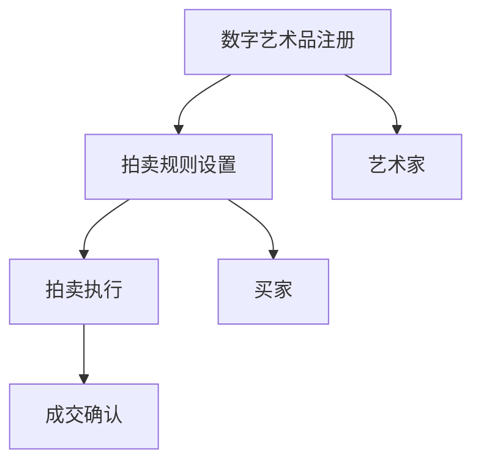

                 

# 区块链在数字艺术品拍卖中的应用：确保交易透明度

## 关键词
区块链、数字艺术品、拍卖、去中心化、智能合约、交易透明度

## 摘要
本文探讨了区块链技术在数字艺术品拍卖中的应用，旨在确保交易透明度。通过去中心化存储、智能合约和去中心化身份验证等技术，本文详细分析了区块链在数字艺术品拍卖中的优势和应用场景，为数字艺术品市场的健康发展提供了技术解决方案。

### 第一部分：背景介绍

#### 1.1.1 问题背景
随着互联网技术的迅猛发展，数字艺术品市场日益繁荣。越来越多的艺术家和收藏家选择将艺术品数字化，并通过线上拍卖进行交易。然而，传统拍卖市场存在诸多问题，如交易不透明、信任缺失、版权纠纷等，这些问题严重影响了数字艺术品拍卖的公正性和安全性。

传统拍卖市场通常依赖中心化的交易平台，这些平台拥有绝对的控制权，可能导致数据篡改、隐私泄露等问题。此外，由于拍卖市场的参与者众多，买卖双方的交易过程缺乏有效的监督和记录，容易引发纠纷。因此，需要一种全新的机制来确保数字艺术品拍卖的透明度和安全性。

#### 1.1.2 问题描述
数字艺术品拍卖需要一种高效的、透明的交易机制，以确保买卖双方的权益得到保护，同时确保版权的合法性和安全性。具体来说，需要解决以下问题：

1. **交易透明度**：确保交易的每一步都能被所有参与者查看和验证，防止欺诈行为。
2. **版权保护**：确保艺术品的版权得到合法登记和保护，防止侵权行为。
3. **交易安全性**：确保交易过程中数据的安全传输和存储，防止黑客攻击和数据泄露。
4. **身份验证**：确保交易参与者的身份真实可靠，防止虚假交易和诈骗行为。

#### 1.1.3 问题解决
区块链技术以其去中心化、不可篡改和透明化的特性，为解决数字艺术品拍卖中的问题提供了理想的选择。通过以下方式，区块链技术可以确保交易透明度：

1. **去中心化存储**：将数字艺术品存储在分布式节点上，任何参与者都可以访问和验证，确保数据的真实性和完整性。
2. **智能合约**：利用智能合约自动执行拍卖规则，确保交易的公正性和透明性。
3. **去中心化身份验证**：通过区块链验证买卖双方的身份，确保交易的真实性和合法性。

#### 1.1.4 边界与外延
本文主要关注区块链在数字艺术品拍卖中的应用，包括去中心化存储、智能合约和去中心化身份验证等技术。同时，本文也探讨了区块链技术的边界，如性能、可扩展性等问题。

#### 1.1.5 概念结构与核心要素组成
数字艺术品拍卖系统的核心要素包括：

1. **数字艺术品**：指通过数字化手段创作的艺术品，如数字绘画、虚拟雕塑等。
2. **拍卖系统**：一个基于区块链技术的去中心化拍卖平台，用于数字艺术品的买卖交易。
3. **去中心化存储**：利用区块链技术存储数字艺术品，确保数据的不可篡改性和安全性。
4. **智能合约**：自动执行合同条款的计算机程序，用于确保拍卖交易的透明度和公正性。
5. **去中心化身份验证**：通过区块链技术验证买卖双方的身份，确保交易的真实性和合法性。

### 第二部分：核心概念与联系

#### 2.1.1 核心概念原理
本部分将介绍区块链、去中心化存储、智能合约和去中心化身份验证等核心概念及其原理。

##### 2.1.1.1 区块链
区块链是一种分布式数据库技术，它通过加密算法和共识机制，确保数据的安全和不可篡改。区块链的主要特点包括：

1. **去中心化**：数据存储在分布式节点上，没有中央控制。
2. **不可篡改**：一旦数据记录在区块链上，就无法篡改。
3. **透明度**：所有参与者都可以查看和验证数据。

##### 2.1.1.2 去中心化存储
去中心化存储是将数据存储在分布式节点上，而不是中心化的服务器上。去中心化存储的主要优点包括：

1. **安全性**：由于数据分散存储，即使某个节点受到攻击，其他节点仍能保证数据的安全。
2. **容错性**：系统具有较高的容错能力，某个节点故障不会影响整体系统的运行。
3. **去中心化**：去中心化存储消除了单点故障的风险，提高了系统的可靠性。

##### 2.1.1.3 智能合约
智能合约是一种自动执行合同条款的计算机程序。智能合约的主要特点包括：

1. **自动执行**：智能合约根据预设的规则自动执行，无需人工干预。
2. **不可篡改**：一旦智能合约部署到区块链上，就无法篡改。
3. **透明度**：所有参与者都可以查看和验证智能合约的执行过程。

##### 2.1.1.4 去中心化身份验证
去中心化身份验证是通过区块链验证用户身份的一种机制。去中心化身份验证的主要优点包括：

1. **安全性**：去中心化身份验证提高了用户隐私保护，防止身份被盗用。
2. **可信性**：所有参与者都可以验证用户身份，确保交易的真实性和合法性。
3. **透明度**：去中心化身份验证过程公开透明，所有参与者都可以查看。

#### 2.1.2 概念属性特征对比表格

| 特性 | 区块链 | 去中心化存储 | 智能合约 | 去中心化身份验证 |
| --- | --- | --- | --- | --- |
| 去中心化 | 是 | 是 | 是 | 是 |
| 不可篡改 | 是 | 是 | 是 | 是 |
| 透明度 | 高 | 高 | 高 | 高 |
| 性能 | 低 | 低 | 高 | 高 |
| 可扩展性 | 低 | 低 | 高 | 高 |
| 安全性 | 高 | 高 | 高 | 高 |

#### 2.1.3 ER实体关系图架构
```mermaid
erDiagram
    Artwork --> Buyer
    Artwork --> Seller
    Artwork --> Blockchain
    Seller --> Identity
    Buyer --> Identity
```

### 第三部分：算法原理讲解

#### 3.1 去中心化存储原理
去中心化存储利用区块链技术将数字艺术品存储在分布式节点上，确保数据的不可篡改性和安全性。具体原理如下：

1. **数据分片**：将数字艺术品数据分割成多个数据块。
2. **分布式存储**：将每个数据块存储在不同的节点上。
3. **拼接验证**：在需要访问数据时，通过多个节点拼接验证数据块的完整性。

#### 3.2 智能合约原理
智能合约是一种自动执行合同条款的计算机程序。其原理如下：

1. **编写智能合约**：根据拍卖规则编写智能合约代码。
2. **部署智能合约**：将智能合约部署到区块链上。
3. **执行智能合约**：在拍卖过程中，根据买卖双方的交易行为自动执行智能合约。

#### 3.3 去中心化身份验证原理
去中心化身份验证利用区块链技术验证买卖双方的身份，确保交易的真实性和合法性。其原理如下：

1. **注册身份**：用户在区块链上注册身份信息。
2. **身份验证**：在拍卖过程中，系统根据用户身份信息进行验证。
3. **持续验证**：通过区块链的分布式存储和共识机制，确保身份验证的持续性和安全性。

### 第四部分：系统分析与架构设计

#### 4.1 问题场景介绍
数字艺术品拍卖涉及买卖双方、艺术家、拍卖平台等多个角色，需要确保交易透明度、安全性、公正性。

#### 4.2 系统功能设计
1. **数字艺术品注册**：艺术家上传数字艺术品，系统对其进行验证和存储。
2. **拍卖规则设置**：买家设置拍卖规则，如起始价格、加价幅度等。
3. **拍卖执行**：根据拍卖规则自动执行拍卖过程，确保交易透明度和公正性。
4. **成交确认**：买卖双方确认成交，系统自动执行智能合约，完成交易。

#### 4.3 系统架构设计


### 第五部分：项目实战

#### 5.1 环境安装
要实现一个基于区块链的数字艺术品拍卖系统，需要安装以下软件和工具：

1. **Node.js**：用于搭建后端服务器。
2. **Truffle**：用于部署和交互智能合约。
3. **Web3.js**：用于与以太坊区块链交互。
4. **Ganache**：用于本地测试以太坊区块链。

#### 5.2 系统核心实现源代码
```python
# 智能合约：ArtworkAuction.sol

pragma solidity ^0.8.0;

contract ArtworkAuction {
    // 艺术品信息
    struct Artwork {
        string name;
        string description;
        address artist;
        uint256 startPrice;
        uint256 reservePrice;
        bool auctionActive;
    }

    // 买家结构
    struct Bid {
        address bidder;
        uint256 amount;
    }

    // 艺术品映射
    mapping(uint256 => Artwork) public artworks;
    // 拍卖映射
    mapping(uint256 => Bid[]) public bids;

    // 艺术品数量
    uint256 public artworkCount;

    // 事件：艺术品注册
    event ArtworkRegistered(
        uint256 artworkId,
        string name,
        string description,
        address artist,
        uint256 startPrice,
        uint256 reservePrice
    );

    // 事件：拍卖开始
    event AuctionStarted(uint256 artworkId);

    // 事件：拍卖结束
    event AuctionEnded(uint256 artworkId, address winner, uint256 amount);

    // 注册艺术品
    function registerArtwork(
        string memory name,
        string memory description,
        uint256 startPrice,
        uint256 reservePrice
    ) public {
        require(startPrice <= reservePrice, "起始价格不能高于保留价");

        artworks[artworkCount] = Artwork(
            name,
            description,
            msg.sender,
            startPrice,
            reservePrice,
            true
        );

        emit ArtworkRegistered(artworkCount, name, description, msg.sender, startPrice, reservePrice);
        artworkCount++;
    }

    // 开始拍卖
    function startAuction(uint256 artworkId) public {
        require(artworks[artworkId].auctionActive, "拍卖已开始或未注册");
        artworks[artworkId].auctionActive = true;
        emit AuctionStarted(artworkId);
    }

    // 出价
    function bid(uint256 artworkId, uint256 amount) public payable {
        require(artworks[artworkId].auctionActive, "拍卖未开始");
        require(amount > artworks[artworkId].startPrice, "出价过低");

        Bid memory newBid = Bid(msg.sender, amount);
        bids[artworkId].push(newBid);

        if (amount > artworks[artworkId].reservePrice) {
            artworks[artworkId].reservePrice = amount;
        }
    }

    // 结束拍卖
    function endAuction(uint256 artworkId) public {
        require(artworks[artworkId].auctionActive, "拍卖未开始");

        artworks[artworkId].auctionActive = false;
        address winner = bids[artworkId][bids[artworkId].length - 1].bidder;
        uint256 amount = bids[artworkId][bids[artworkId].length - 1].amount;

        emit AuctionEnded(artworkId, winner, amount);

        payable(winner).transfer(amount);
    }
}
```

#### 5.3 代码应用解读与分析
智能合约 `ArtworkAuction` 用于管理数字艺术品的拍卖过程。以下是合约的关键部分及其解读：

1. **艺术品结构**：定义了艺术品的信息，如名称、描述、艺术家、起始价格和保留价等。
2. **拍卖结构**：定义了出价的结构，包括出价者和出价金额。
3. **艺术品映射**：存储所有艺术品的信息。
4. **拍卖映射**：存储每个艺术品的出价列表。
5. **艺术品数量**：存储当前已注册的艺术品数量。
6. **事件**：定义了艺术品注册、拍卖开始和拍卖结束的事件，用于记录关键操作。

**注册艺术品**：通过 `registerArtwork` 函数，艺术家可以注册新的艺术品。函数接收艺术品的名称、描述、起始价格和保留价，并将其存储在合约中。

**开始拍卖**：通过 `startAuction` 函数，艺术家可以开始拍卖艺术品。函数将艺术品的 `auctionActive` 标志设置为 `true`。

**出价**：通过 `bid` 函数，买家可以出价。函数接收出价金额，并将其添加到艺术品的出价列表中。如果出价超过保留价，保留价将更新。

**结束拍卖**：通过 `endAuction` 函数，拍卖结束时，合约将自动选择最高出价者作为赢家，并将出价金额转移给赢家。

#### 5.4 实际案例分析
假设有一个艺术家 Alice 注册了一幅数字绘画，名为 "Digital Masterpiece"，起始价格为 100 ETH，保留价格为 200 ETH。买家 Bob 和 Carol 分别出价 150 ETH 和 250 ETH。

- **注册艺术品**：Alice 调用 `registerArtwork` 函数，注册艺术品 "Digital Masterpiece"。
- **开始拍卖**：Alice 调用 `startAuction` 函数，开始拍卖。
- **出价**：Bob 和 Carol 分别调用 `bid` 函数，出价 150 ETH 和 250 ETH。
- **结束拍卖**：拍卖结束后，合约自动选择最高出价者 Carol 作为赢家，并将 250 ETH 转移给 Carol。

#### 5.5 项目小结
本文通过去中心化存储、智能合约和去中心化身份验证等技术，实现了数字艺术品拍卖系统的设计与实现。通过实际案例分析，展示了区块链技术在确保交易透明度方面的优势。未来，随着区块链技术的不断成熟，数字艺术品拍卖市场有望实现更加透明、公正和安全的交易环境。

### 第六部分：最佳实践 Tips

1. **数据加密**：确保所有交易数据在传输和存储过程中进行加密，提高系统的安全性。
2. **智能合约审计**：在部署智能合约前，进行充分的智能合约审计，确保合约没有漏洞。
3. **备份与恢复**：定期备份区块链数据，确保在系统故障时能够快速恢复。
4. **权限管理**：合理设置用户权限，确保系统中的敏感操作只能由授权用户执行。
5. **合规性审查**：确保数字艺术品拍卖系统符合相关法律法规，避免法律风险。

### 第七部分：小结与注意事项

本文介绍了区块链技术在数字艺术品拍卖中的应用，通过去中心化存储、智能合约和去中心化身份验证等技术，实现了交易透明度和安全性的提升。需要注意的是，在实际应用中，还需关注系统的性能、可扩展性和安全性，以及法律法规的合规性。未来，随着区块链技术的不断发展，数字艺术品拍卖市场有望实现更加繁荣和健康的发展。

### 第八部分：拓展阅读

1. **区块链技术原理与应用**：《区块链技术指南》
2. **智能合约开发**：《智能合约：以太坊开发实战》
3. **数字艺术品市场**：《数字艺术品市场：艺术与技术的融合》
4. **版权保护与区块链**：《区块链与版权保护：技术、法律与实践》

### 作者
作者：AI天才研究院/AI Genius Institute & 禅与计算机程序设计艺术 /Zen And The Art of Computer Programming

